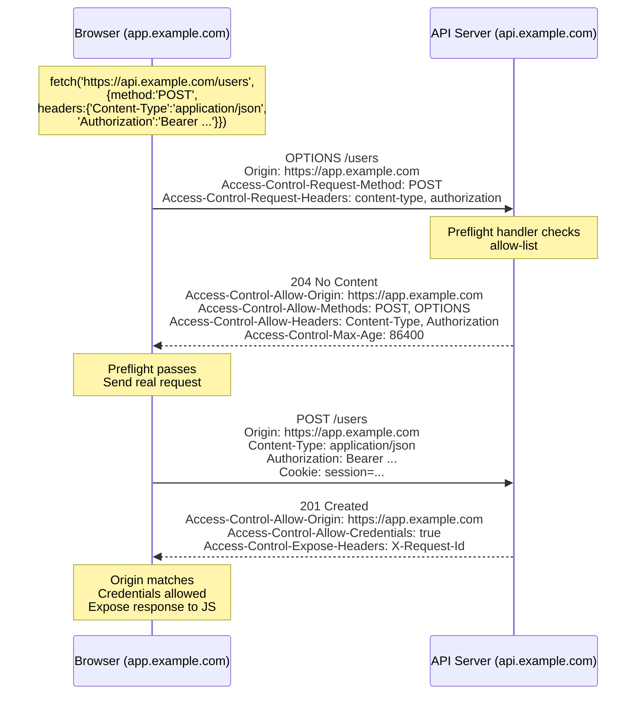
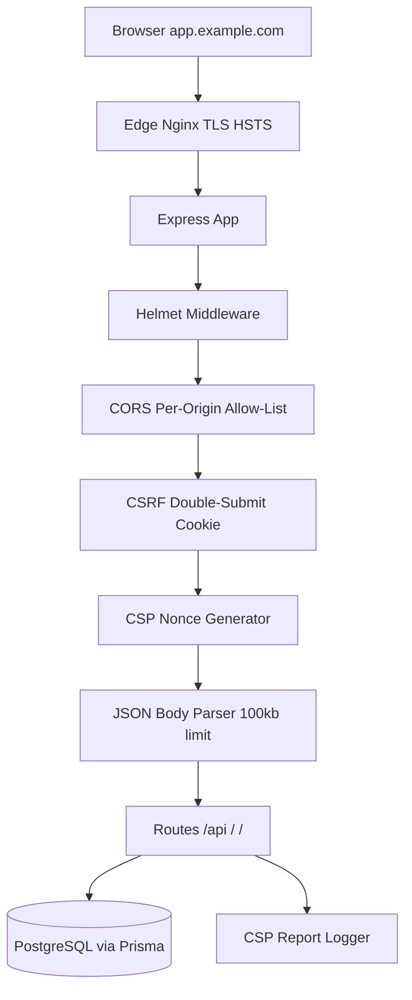

# 7.05 CORS and CSP Security

## 1. Purpose

The web platform runs on a small set of foundational security invariants. Two of the most consequential are the Same-Origin Policy (SOP) and the assumption that every byte the browser downloads is trusted by the site that referenced it. Both invariants are ancient, both are blunt, and both are wrong for the modern web. Modern applications are cross-origin by design: a React SPA hosted on `app.example.com` talks to an API on `api.example.com`; a marketing site embeds Stripe, Google Analytics, and a third-party chat widget; a developer portal pulls documentation from a CDN at `cdn.example.com`. The Same-Origin Policy would block every one of these interactions by default. Meanwhile, the trust assumption behind script loading is exactly what makes Cross-Site Scripting (XSS) catastrophic: if an attacker can inject a single `<script>` tag, the browser will dutifully execute it with the full privileges of the page. CORS and CSP exist to fix these two problems.

**CORS (Cross-Origin Resource Sharing)** is the opt-in mechanism by which a server tells the browser "this origin is allowed to read my responses." Without CORS, the SOP blocks JavaScript from reading cross-origin responses. The browser still sends the request (a fact that confuses newcomers), but it refuses to expose the response body to the calling script unless the server has explicitly opted in via the `Access-Control-Allow-Origin` header. CORS does not protect the server; it protects the user's browser from malicious scripts that try to read data from a different origin than the one the script was loaded from. The classic attack CORS prevents is the "data theft" attack: a victim visits `evil.com`, which contains JavaScript that fetches `https://api.bank.com/account` in the victim's browser; without CORS, the browser would block the script from reading the response, even though the request was sent with the victim's cookies.

**CSP (Content Security Policy)** is the browser's allow-list for resources. It is a defense-in-depth mitigation against XSS and data injection. A CSP header tells the browser "this page may only load scripts from these origins, only styles from these origins, only connect to these endpoints, only frame these URLs." If an attacker injects `<script src="https://evil.com/exfil.js"></script>` into the page, the browser refuses to load it because `evil.com` is not in the `script-src` allow-list. CSP also disables inline scripts and `eval` by default, which closes the two easiest XSS vectors (an inline `<script>alert(1)</script>` payload and a `setTimeout("code")` style call). The modern CSP best practice is to use cryptographic nonces (single-use tokens) so that even inline scripts written by the legitimate application can be identified and authorized, while injected inline scripts without the nonce are blocked.

**`helmet`** is a tiny Express middleware that bundles a dozen security-related HTTP response headers into a single function call. Individually, these headers each close one small hole: `X-Frame-Options` (or its modern replacement `frame-ancestors` in CSP) prevents clickjacking; `X-Content-Type-Options: nosniff` prevents MIME-sniffing attacks; `Strict-Transport-Security` (HSTS) forces HTTPS for a year; `Referrer-Policy` controls how much of the URL leaks via the Referer header; `Permissions-Policy` disables powerful APIs like camera, microphone, and geolocation; `Cross-Origin-Opener-Policy`, `Cross-Origin-Embedder-Policy`, and `Cross-Origin-Resource-Policy` enable process-level isolation and Spectre mitigations. None of these headers is a silver bullet, but together they raise the bar for an attacker from "find one XSS" to "find an XSS and bypass the CSP and defeat HSTS and bypass the frame-ancestors and find an allow-listed script gadget." That differential is the difference between a casual script-kiddie scan succeeding and failing.

The trade-off at the heart of all three mechanisms is **security versus functionality**. A CORS policy of `Access-Control-Allow-Origin: *` (allow every origin) is maximally permissive and breaks credentials. A CSP of `default-src * 'unsafe-inline' 'unsafe-eval'` is maximally permissive and defeats the entire point of CSP. A `helmet` config that disables `X-Frame-Options` because "the iframe embed isn't working" has just reopened clickjacking. Every relaxation weakens the security posture; every tightening risks breaking a feature. The art of configuring CORS, CSP, and `helmet` is to find the minimum relaxation that still allows the application to function, and to use the most specific mechanism available (a per-origin allow-list rather than `*`, a nonce rather than `'unsafe-inline'`, a specific frame-ancestors domain rather than `ALLOW-FROM`).

This note exists because the failure modes of these three mechanisms are subtle, expensive, and routinely misunderstood. A developer who copies `Access-Control-Allow-Origin: *` from a Stack Overflow answer breaks credentials-based authentication. A developer who copies `script-src 'unsafe-inline' 'unsafe-eval'` from a CSP tutorial has written a CSP that provides essentially no XSS protection. A developer who disables `helmet`'s `contentSecurityPolicy` because the build pipeline doesn't include nonces has silently weakened every other header `helmet` sets. The reader who finishes this note will know exactly which header to set, which value to use, which preflight scenario requires which response, and how to test the configuration in real browsers before shipping it.

## 2. Theory and Deep Dive

### 2.1 The Same-Origin Policy

The Same-Origin Policy is the oldest and most fundamental security invariant in the browser. Two URLs have the same origin if and only if their scheme, host, and port are identical. `https://app.example.com:443/foo` and `https://app.example.com:443/bar` are same-origin (path differs, but path is not part of the origin tuple). `https://app.example.com` and `https://api.example.com` are cross-origin (host differs). `https://app.example.com:443` and `http://app.example.com:80` are cross-origin (scheme and port differ). `https://app.example.com:443` and `https://app.example.com:8443` are cross-origin (port differs).

The SOP has three layers. First, cross-origin writes are mostly allowed: you can submit a form to any origin, you can navigate a window to any origin, you can send a `fetch` request to any origin. Second, cross-origin embedding is mostly allowed: you can load an ``, `<script>`, `<link rel="stylesheet">`, `<video>`, or `<iframe>` from any origin. Third, cross-origin reads are mostly blocked: JavaScript cannot read the response body of a cross-origin `fetch`, cannot read the contents of a cross-origin iframe's DOM, cannot read the pixels of a cross-origin canvas. The third restriction is what CORS relaxes.

The asymmetry between "writes are allowed" and "reads are blocked" is the source of endless confusion. A naive developer sees that their login form successfully POSTs to a cross-origin API and assumes everything is working. Then they add `fetch('/api/me')` and it fails with a CORS error. The reason: form submissions don't expose the response to JavaScript, so the SOP has nothing to block; `fetch` does expose the response, so the SOP blocks it unless CORS opts in. The browser sends the request in both cases; only the response handling differs.

### 2.2 CORS: The Opt-In Mechanism

CORS works by adding HTTP headers to the response that tell the browser "you may expose this response to scripts from this origin." The most important headers are:

- `Access-Control-Allow-Origin: <origin>` — the single origin that is allowed to read the response. Can be `*` only if credentials are not involved.
- `Access-Control-Allow-Credentials: true` — tells the browser to expose the response to credentialed requests (requests that send cookies or Authorization headers).
- `Access-Control-Allow-Methods: GET, POST, PUT, DELETE, PATCH, OPTIONS` — the HTTP methods allowed.
- `Access-Control-Allow-Headers: Content-Type, Authorization, X-Requested-With` — the request headers allowed.
- `Access-Control-Expose-Headers: X-Total-Count, X-Request-Id` — response headers that the browser should expose to JavaScript beyond the default "safe" set (Cache-Control, Content-Language, Content-Type, Expires, Last-Modified, Pragma).
- `Access-Control-Max-Age: 86400` — how long, in seconds, the browser may cache the preflight result.

A "simple" request is one that the browser sends without preflight: GET, HEAD, or POST with a "CORS-safelisted" Content-Type (`application/x-www-form-urlencoded`, `multipart/form-data`, `text/plain`) and no unsafe headers. Any deviation triggers a preflight. A request with `Content-Type: application/json` always triggers a preflight, which is why every modern JSON API needs to handle OPTIONS.

### 2.3 The Preflight Flow

When the browser detects a non-simple cross-origin request, it sends an OPTIONS request first, with the headers `Origin`, `Access-Control-Request-Method`, and `Access-Control-Request-Headers`. The server responds with the CORS allow-list headers. The browser inspects the response, and if the requested method, headers, and origin are all allowed, it sends the actual request. If not, it blocks the request and the actual fetch never leaves the browser.



The preflight is cached for `Access-Control-Max-Age` seconds. Browsers cap this value (Chrome caps at 2 hours for credentialed requests, 24 hours for uncredentialed; Firefox caps at 24 hours). Setting a high Max-Age reduces OPTIONS traffic, which matters for high-volume APIs.

### 2.4 Credentials: The Trap

A "credentialed" request is one that sends cookies (because the request is to the same origin domain as a cookie's domain) or an `Authorization` header set by JavaScript (only when `fetch` is called with `credentials: 'include'` or `credentials: 'same-origin'`). When the browser makes a credentialed request, it sets a flag on the request that the server's CORS response must respect.

The trap: if the request is credentialed, the response MUST set `Access-Control-Allow-Origin` to the specific origin (echoing back the `Origin` header), NOT to `*`. The browser will reject a response that says `Access-Control-Allow-Origin: *` on a credentialed request. This is the single most common CORS bug. The reason for the rule: if `*` were allowed with credentials, any site on the internet could read authenticated API responses from any other site, completely defeating the SOP.

The second trap: `Access-Control-Allow-Credentials: true` must also be set, and the cookie must have `SameSite=None; Secure` (because Chrome's SameSite-by-default policy blocks cross-site cookies otherwise). A cookie without `SameSite=None` simply is not sent on the cross-origin request, and the request appears unauthenticated to the server.

### 2.5 CSP: The Allow-List

CSP is delivered as a response header (`Content-Security-Policy`) or as a `<meta>` tag in the HTML head. The header is a semicolon-separated list of directives, each of which is a fetch directive followed by a space-separated list of sources. The fetch directives correspond to the resource types the browser can load: `default-src` (the fallback for any directive not explicitly set), `script-src`, `style-src`, `img-src`, `connect-src` (fetch, XHR, WebSocket, EventSource), `font-src`, `frame-src`, `media-src`, `object-src`, `manifest-src`, `worker-src`, `child-src`. Other directives govern document-level behavior: `base-uri` (which `<base>` tags are allowed), `form-action` (which URLs forms can submit to), `frame-ancestors` (which pages can embed this page in an iframe, replacing `X-Frame-Options`), `navigate-to` (which URLs the page can navigate to), `plugin-types` (deprecated), `report-uri` / `report-to` (where violation reports are sent).

The source values are: `'self'` (the page's own origin), `'none'` (nothing allowed), `'strict-dynamic'` (allow scripts loaded by an already-allowed script to also run, useful with nonces), specific origins like `https://cdn.example.com`, schemes like `https:` or `data:`, `'unsafe-inline'` (allow inline `<script>` and inline event handlers, generally avoided), `'unsafe-eval'` (allow `eval`, `Function`, `setTimeout`/`setInterval` with string arguments, avoided), `'nonce-<base64>'` (allow inline scripts with a matching `nonce` attribute), `'sha256-<base64>'` (allow inline scripts whose hash matches), and `'wasm-unsafe-eval'` (allow WebAssembly).

A reasonable starting CSP for an SPA with no inline scripts looks like:

```
default-src 'self';
script-src 'self' https://cdn.example.com;
style-src 'self' https://cdn.example.com 'unsafe-inline';
img-src 'self' data: https:;
connect-src 'self' https://api.example.com wss://realtime.example.com;
font-src 'self' https://cdn.example.com;
frame-ancestors 'none';
base-uri 'none';
form-action 'self';
object-src 'none';
report-uri /csp-report;
```

Note that `'unsafe-inline'` is in `style-src`. This is a pragmatic compromise: many CSS-in-JS libraries and component frameworks inject `<style>` tags with inline content, and migrating them to nonces is non-trivial. Inline styles are also less dangerous than inline scripts (CSS cannot execute arbitrary code, though it can leak data via attribute selectors and `url()` references). For `script-src`, `'unsafe-inline'` should never appear in a production CSP.

### 2.6 Nonces and Hashes

A nonce is a single-use, random, base64-encoded token that the server generates per request and includes in both the CSP header (`script-src 'nonce-<value>'`) and as an attribute on each legitimate inline script (`<script nonce="<value>">...</script>`). The browser runs only scripts whose nonce matches. An attacker who can inject a `<script>` tag cannot know the nonce (because the nonce changes per request and is not in the cached HTML), so their injected script is blocked.

Hashes work similarly but are content-addressed: `script-src 'sha256-<base64hash>'` allows an inline script whose SHA-256 hash matches. Hashes are useful when the inline script content is stable (a small bootstrap script that doesn't change between deploys). They don't work for scripts whose content varies per request.

The challenge with nonces is that they require server-side rendering of the HTML: the server must inject the nonce into the CSP header and into every `<script>` tag. With a SPA served as a static HTML file, this means the HTML file must be templated by the server (or a serverless function) on each request. Frameworks like Next.js handle this automatically; with Vite or CRA, you need a small serverless function or a middleware that rewrites the HTML.

### 2.7 `report-uri` and `report-to`

CSP violations can be reported to a server endpoint for monitoring. The `report-uri` directive (deprecated but widely supported) and the modern `report-to` directive (which uses the Reporting API) tell the browser where to POST a JSON document describing each violation. The report includes `document-uri`, `referrer`, `violated-directive`, `effective-directive`, `blocked-uri`, `line-number`, `column-number`, and `source-file`. This is invaluable for rolling out a CSP: first deploy in `Content-Security-Policy-Report-Only` mode, collect violation reports, fix the genuine violations (or expand the allow-list), then switch to enforcing mode.

### 2.8 `helmet` Internals

The `helmet` package sets the following headers by default (as of version 8):

- `Content-Security-Policy` (with a default policy that disallows everything except same-origin resources and disallows inline scripts and eval).
- `Cross-Origin-Embedder-Policy: require-corp` (enables cross-origin isolation, required for `SharedArrayBuffer`).
- `Cross-Origin-Opener-Policy: same-origin` (process isolation, prevents `window.opener` attacks).
- `Cross-Origin-Resource-Policy: same-origin` (prevents cross-origin resources from being loaded unless CORS allows).
- `Origin-Agent-Cluster: ?1` (origin-keyed agent cluster).
- `Referrer-Policy: no-referrer` (do not send a Referer header).
- `Strict-Transport-Security: max-age=15552000; includeSubDomains` (HSTS for 180 days).
- `X-Content-Type-Options: nosniff` (prevent MIME sniffing).
- `X-DNS-Prefetch-Control: off` (disable DNS prefetching).
- `X-Download-Options: noopen` (IE-specific, disables "Open" button on downloads).
- `X-Frame-Options: SAMEORIGIN` (clickjacking protection, superseded by `frame-ancestors` in CSP).
- `X-Permitted-Cross-Domain-Policies: none` (Adobe Flash and PDF cross-domain policies).
- `X-XSS-Protection: 0` (disables the deprecated IE XSS auditor, which caused more vulnerabilities than it fixed).

The default CSP is strict and will break most existing applications. The right pattern is to start with the default, then explicitly relax only what you need. Each `helmet` middleware is also available individually: `helmet.contentSecurityPolicy`, `helmet.hsts`, `helmet.frameguard`, and so on, so you can compose them yourself.

### 2.9 HSTS: The SSL Strip Defense

Strict-Transport-Security (HSTS) tells the browser "always use HTTPS for this domain for the next N seconds, including subdomains, and please preload this decision into the browser's built-in HSTS list." The attack it prevents is SSL strip: an attacker on the same network (a coffee-shop Wi-Fi) intercepts the initial HTTP request before the redirect to HTTPS, and downgrades the connection to HTTP for the entire session. With HSTS, after the first visit, the browser refuses to make an HTTP request to the domain at all, even if the user types `http://`. The `preload` directive opts the domain into the browser-vendor-maintained HSTS preload list, so even the first visit is HTTPS.

The minimum safe configuration is `Strict-Transport-Security: max-age=31536000; includeSubDomains; preload` (one year, all subdomains, preloaded). To add a domain to the preload list, you must (1) serve HTTPS on the apex domain, (2) serve the preload directive with `max-age` of at least 31536000, (3) include `includeSubDomains`, and (4) submit the domain at hstspreload.org. Once preloaded, removal is slow (months), so do not preload a domain that has any HTTP-only subdomains.

### 2.10 The SameSite Cookie Dimension

CORS and CSP are necessary but not sufficient for cross-origin security. The third pillar is the `SameSite` cookie attribute. `SameSite=Strict` blocks the cookie on any cross-site request, including top-level navigations from another site (so a link from a search engine to your site does not send the session cookie). `SameSite=Lax` (the browser default since Chrome 80) sends the cookie on top-level cross-site navigations but not on cross-site subresource requests or cross-site POST forms. `SameSite=None` allows the cookie on any cross-site request but requires `Secure`.

For a credentialed CORS API on a different subdomain (e.g., `app.example.com` calling `api.example.com`), the cookie must be `SameSite=None; Secure` because the request is "cross-site" from the cookie's perspective (Chrome treats different subdomains as cross-site for SameSite purposes unless they share the registrable domain and the cookie is set with `Domain=.example.com`, which makes them "same-site"). The `Domain` attribute and the `SameSite` attribute interact in subtle ways; the safe rule for a cross-subdomain API is `Domain=.example.com; SameSite=None; Secure; HttpOnly`.

### 2.11 CORS, CSP, and CSRF Together

CSRF (Cross-Site Request Forgery) is the attack where `evil.com` POSTs to `bank.com/transfer` in the victim's browser, and the victim's session cookie is sent automatically. CORS does not prevent CSRF: form submissions and image requests bypass CORS (they are not subject to the SOP read restriction because JavaScript cannot read their responses). The defenses for CSRF are: (1) `SameSite=Lax` or `SameSite=Strict` cookies (which prevent the cookie from being sent on cross-site POSTs), (2) CSRF tokens (a per-session token that must be sent as a custom header, which cannot be set by a cross-origin form without CORS opt-in), and (3) `Origin` or `Referer` header validation on the server.

The interaction with CORS: if the server uses CSRF tokens delivered as cookies, the cookie must be `HttpOnly` (so JavaScript cannot read it) AND the token must be sent as a custom header (so it requires CORS opt-in to be set by a cross-origin script). The pattern: server sets a `csrf-token` cookie (HttpOnly, SameSite=Strict) on session creation; client reads a separate, readable `XSRF-TOKEN` cookie (NOT HttpOnly) and sends its value as an `X-XSRF-TOKEN` header on mutating requests; server validates that the header matches the HttpOnly cookie. This is the pattern used by Spring Security and the `csurf` Express middleware (now deprecated; the modern replacement is `csrf-csrf`).

## 3. Mental Models

### 3.1 CORS = "Server Tells Browser Which Origins May Read"

Think of the server as a librarian and the browser as a security guard at the library door. When JavaScript from `app.example.com` asks for a book from `api.example.com`, the guard sends the request to the librarian. The librarian returns the book with a sticky note: "this book may be read by people from `app.example.com`." The guard checks the note against who asked, and only hands the book over if the names match. Without the note, the guard throws the book away. The note is `Access-Control-Allow-Origin`.

### 3.2 Preflight = "Browser Asks Permission Before Sending the Real Request"

Think of preflight as the browser calling ahead to a restaurant: "I'd like to bring a party of four with a bottle of wine and a birthday cake, is that okay?" The restaurant either says "yes, those are all fine" or "no, you can't bring outside wine." Only if the answer is yes does the browser send the actual request. For "simple" requests (the equivalent of just walking in and ordering a coffee), no preflight is needed.

### 3.3 CSP = "Allow-List of Trusted Sources, Default Deny"

Think of CSP as the bouncer at a club with a guest list. Every resource the page tries to load (scripts, styles, images, fonts, connections) walks up to the bouncer. The bouncer checks the resource against the guest list for its category. If the resource is on the list (or has a valid nonce), it's allowed in. If not, it's turned away. The default is "no one is on the list" (`default-src 'none'`), which is the strictest possible policy and breaks everything, so most policies start with `default-src 'self'` and relax from there.

### 3.4 Helmet = "Bundle of Security Headers, Sensible Defaults"

Think of `helmet` as a security guard who walks through your building locking doors, closing windows, and turning on the alarm. Each lock is one header. You can install the whole guard (the default `helmet()` call) or hire individual specialists (`helmet.hsts()`, `helmet.frameguard()`, etc.). The default guard is strict; if a door is needed (e.g., you need to allow a specific CSP source), you tell the guard which door to leave unlocked.

### 3.5 Credentials = "Authentication That Crosses Origins"

Think of credentials as your VIP badge. The browser will only carry your VIP badge to a cross-origin API if the API explicitly says "yes, I will accept VIPs from your origin" (`Access-Control-Allow-Credentials: true`) AND names your specific origin (`Access-Control-Allow-Origin: https://app.example.com`). If the API says "anyone can come in" (`*`), the browser takes your badge off before sending the request, because the API has not specifically authorized you.

### 3.6 HSTS = "Pin This Domain to HTTPS Forever"

Think of HSTS as a tattoo on the browser's memory: "this domain is HTTPS only." Once tattooed, the browser will refuse to make any HTTP request to the domain, even if the user types `http://` or clicks an `http://` link. The `preload` directive is the equivalent of publishing the tattoo in a public registry, so even browsers that have never visited the domain know to use HTTPS.

### 3.7 Nonce = "Per-Request Password for Inline Scripts"

Think of a nonce as a one-time password that the server generates for each page load. The server writes the password into the CSP header and onto every legitimate inline `<script>` tag. The browser runs only scripts whose password matches. An attacker who can inject a `<script>` tag doesn't know today's password (it changes every page load and isn't in the cached HTML), so their script is rejected.

## 4. Real-World Use Cases

### 4.1 Public API with Browser Clients

A weather API at `api.weather.example.com` wants to be callable from any frontend. The CORS policy is `Access-Control-Allow-Origin: *` (any origin), `Access-Control-Allow-Methods: GET, OPTIONS`, `Access-Control-Allow-Headers: Content-Type`, `Access-Control-Max-Age: 86400`. No credentials, because the API is public. Preflight responses are cached for a day, so OPTIONS traffic is minimal. This is the simplest CORS config and the most common one for public read-only APIs.

### 4.2 SPA on a Different Subdomain

A React SPA at `app.example.com` calls an authenticated API at `api.example.com`. The cookies are set with `Domain=.example.com; SameSite=None; Secure; HttpOnly`. The CORS config is per-origin (`Access-Control-Allow-Origin: https://app.example.com`, echoed from the request `Origin` header), `Access-Control-Allow-Credentials: true`, `Access-Control-Allow-Methods: GET, POST, PUT, DELETE, PATCH, OPTIONS`, `Access-Control-Allow-Headers: Content-Type, Authorization, X-CSRF-Token`, `Access-Control-Expose-Headers: X-Request-Id, X-Total-Count`, `Access-Control-Max-Age: 7200`. The `Vary: Origin` header is set so caches know the response varies by origin.

### 4.3 CSP for an XSS-Hardened SPA

A marketing site at `example.com` loads scripts from its own origin and from `cdn.example.com`, styles from its own origin and `cdn.example.com`, images from anywhere (because user avatars are loaded from many CDNs), and connects to `api.example.com`. The CSP is:

```
default-src 'self';
script-src 'self' https://cdn.example.com;
style-src 'self' https://cdn.example.com;
img-src 'self' data: https:;
connect-src 'self' https://api.example.com;
font-src 'self' https://cdn.example.com;
frame-ancestors 'none';
base-uri 'none';
form-action 'self';
object-src 'none';
report-uri /api/csp-report;
```

Violations are logged to a reporting endpoint. The site starts in `Content-Security-Policy-Report-Only` mode for a week, reviews reports, fixes any genuine violations, then switches to enforcing mode.

### 4.4 Mixed Content: HTTPS Page Loading HTTP Resources

A news site at `https://news.example.com` has an old `` tag. The browser blocks the image as "mixed content" because an HTTPS page cannot load HTTP subresources. The fix: either upgrade the legacy CDN to HTTPS, or remove the image. Browsers distinguish "active" mixed content (scripts, styles, iframes) which is always blocked, and "passive" mixed content (images, audio, video) which is sometimes upgraded automatically but produces a warning. CSP's `upgrade-insecure-requests` directive tells the browser to rewrite all `http://` URLs to `https://` before loading, which is a useful stopgap during a migration.

### 4.5 Third-Party Widgets

A support-chat widget from `https://widget.intercom.io` needs to be embedded. The CSP must allow `script-src https://widget.intercom.io`, `connect-src https://api-iam.intercom.io`, `img-src https://*.intercomcdn.com`, `style-src https://widget.intercom.io`, `frame-src https://widget.intercom.io`. The widget itself is loaded via a `<script src>` tag (no inline, no nonce needed). If the widget requires an inline snippet, a nonce or a hash of the snippet's content is added to `script-src`.

### 4.6 CDN-Hosted Scripts

A React app uses React, ReactDOM, and a charting library from `https://cdn.jsdelivr.net`. The CSP includes `script-src 'self' https://cdn.jsdelivr.net`. The SRI (Subresource Integrity) attribute is added to each `<script>` tag: `<script src="https://cdn.jsdelivr.net/npm/react@18/umd/react.production.min.js" integrity="sha384-..." crossorigin="anonymous"></script>`. The `crossorigin="anonymous"` attribute is required for SRI to work on cross-origin scripts, and it triggers a CORS preflight to the CDN. Most CDNs (jsdelivr, unpkg, cdnjs) send `Access-Control-Allow-Origin: *` by default, so this works out of the box.

### 4.7 WebSocket Connections

A realtime dashboard at `app.example.com` connects to `wss://realtime.example.com`. CSP's `connect-src` directive governs WebSocket as well as HTTP fetch, so `connect-src 'self' wss://realtime.example.com` is required. WebSockets do not follow the same-origin policy strictly (the initial HTTP Upgrade handshake does, but the persistent connection does not), so the server must validate the `Origin` header on the upgrade request and reject connections from unknown origins. This is the WebSocket equivalent of CORS.

### 4.8 Server-Side Rendering with Nonces

A Next.js app uses server-side rendering. Each request, the framework generates a 128-bit random nonce, includes it in the CSP header (`script-src 'self' 'nonce-<value>'`), and adds `nonce="<value>"` to every inline `<script>` tag it renders (the Next.js runtime, the page data hydration script, etc.). An attacker who finds an XSS in a rendered page can inject a `<script>` tag but cannot add the correct nonce, so the script is blocked. This is the gold-standard CSP configuration for SSR apps.

### 4.9 File Uploads with `connect-src`

An app at `app.example.com` uploads files directly to S3 at `https://bucket.s3.amazonaws.com` using a presigned URL. The CSP must allow `connect-src 'self' https://*.s3.amazonaws.com`. If the upload uses `fetch` with `Content-Type: multipart/form-data`, no preflight is triggered. If the upload uses `Content-Type: application/json` for metadata, a preflight is triggered and S3's CORS configuration (set on the bucket) must respond with the correct allow-list. S3's CORS configuration is set in the bucket properties and supports a list of allowed origins, methods, and headers.

### 4.10 Reverse Proxy and CORS Stripping

A backend is fronted by an Nginx reverse proxy. The proxy strips the `Origin` header before forwarding to the backend, so the backend never sees it and never sends CORS headers. The fix: either configure the proxy to pass the `Origin` header through, or have the proxy add the CORS headers itself based on the request origin. The latter is preferred because it keeps CORS config in one place. A common pattern is for the proxy to add `Access-Control-Allow-Origin` to all responses, but this is dangerous if the backend handles credentials. The safe pattern: proxy adds CORS headers only for allow-listed origins, and the backend has no CORS logic.

## 5. Code Examples

### 5.1 Example A — Minimal and Conceptual

A minimal Express server with CORS, CSP, and `helmet`. JavaScript on the left, TypeScript on the right.

**JavaScript (`server.js`)**:

```javascript
const express = require('express');
const cors = require('cors');
const helmet = require('helmet');

const app = express();

// Helmet sets a dozen security headers with sensible defaults.
app.use(helmet());

// CORS: allow a single origin, with credentials.
const corsOptions = {
  origin: 'https://app.example.com',
  credentials: true,
  methods: ['GET', 'POST', 'OPTIONS'],
  allowedHeaders: ['Content-Type', 'Authorization'],
  exposedHeaders: ['X-Request-Id'],
  maxAge: 86400,
};
app.use(cors(corsOptions));

// Manual CSP override (helmet's default CSP is very strict).
app.use(
  helmet.contentSecurityPolicy({
    directives: {
      defaultSrc: ["'self'"],
      scriptSrc: ["'self'", 'https://cdn.example.com'],
      styleSrc: ["'self'", 'https://cdn.example.com', "'unsafe-inline'"],
      imgSrc: ["'self'", 'data:', 'https:'],
      connectSrc: ["'self'", 'https://api.example.com'],
      fontSrc: ["'self'", 'https://cdn.example.com'],
      frameAncestors: ["'none'"],
      objectSrc: ["'none'"],
      baseUri: ["'none'"],
      formAction: ["'self'"],
    },
  })
);

app.get('/api/health', (req, res) => {
  res.json({ ok: true, time: Date.now() });
});

app.listen(3000, () => {
  console.log('Server listening on http://localhost:3000');
});
```

**TypeScript (`server.ts`)**:

```typescript
import express, { Request, Response } from 'express';
import cors, { CorsOptions } from 'cors';
import helmet from 'helmet';

const app = express();

app.use(helmet());

const corsOptions: CorsOptions = {
  origin: 'https://app.example.com',
  credentials: true,
  methods: ['GET', 'POST', 'OPTIONS'],
  allowedHeaders: ['Content-Type', 'Authorization'],
  exposedHeaders: ['X-Request-Id'],
  maxAge: 86400,
};
app.use(cors(corsOptions));

app.use(
  helmet.contentSecurityPolicy({
    directives: {
      defaultSrc: ["'self'"],
      scriptSrc: ["'self'", 'https://cdn.example.com'],
      styleSrc: ["'self'", 'https://cdn.example.com', "'unsafe-inline'"],
      imgSrc: ["'self'", 'data:', 'https:'],
      connectSrc: ["'self'", 'https://api.example.com'],
      fontSrc: ["'self'", 'https://cdn.example.com'],
      frameAncestors: ["'none'"],
      objectSrc: ["'none'"],
      baseUri: ["'none'"],
      formAction: ["'self'"],
    },
  })
);

app.get('/api/health', (req: Request, res: Response) => {
  res.json({ ok: true, time: Date.now() });
});

app.listen(3000, () => {
  console.log('Server listening on http://localhost:3000');
});
```

The same example, but using the manual CSP header approach (no `helmet`):

**JavaScript**:

```javascript
app.use((req, res, next) => {
  res.setHeader(
    'Content-Security-Policy',
    "default-src 'self'; script-src 'self' https://cdn.example.com; " +
      "style-src 'self' 'unsafe-inline'; img-src 'self' data: https:; " +
      "connect-src 'self' https://api.example.com; object-src 'none'; " +
      "frame-ancestors 'none'; base-uri 'none'; form-action 'self'"
  );
  res.setHeader('Strict-Transport-Security', 'max-age=31536000; includeSubDomains; preload');
  res.setHeader('X-Content-Type-Options', 'nosniff');
  res.setHeader('X-Frame-Options', 'SAMEORIGIN');
  res.setHeader('Referrer-Policy', 'no-referrer');
  next();
});
```

**TypeScript**:

```typescript
import { Request, Response, NextFunction } from 'express';

app.use((req: Request, res: Response, next: NextFunction) => {
  res.setHeader(
    'Content-Security-Policy',
    "default-src 'self'; script-src 'self' https://cdn.example.com; " +
      "style-src 'self' 'unsafe-inline'; img-src 'self' data: https:; " +
      "connect-src 'self' https://api.example.com; object-src 'none'; " +
      "frame-ancestors 'none'; base-uri 'none'; form-action 'self'"
  );
  res.setHeader('Strict-Transport-Security', 'max-age=31536000; includeSubDomains; preload');
  res.setHeader('X-Content-Type-Options', 'nosniff');
  res.setHeader('X-Frame-Options', 'SAMEORIGIN');
  res.setHeader('Referrer-Policy', 'no-referrer');
  next();
});
```

### 5.2 Example B — Production-Grade

A production-grade typed API with full CORS (per-origin allow-list with credentials), CSP with per-request nonces for inline scripts, `helmet` with a tuned policy, CSRF protection via the double-submit cookie pattern, and a CSP violation reporting endpoint.

**JavaScript (`app.js`)**:

```javascript
const express = require('express');
const cors = require('cors');
const helmet = require('helmet');
const cookieParser = require('cookie-parser');
const crypto = require('crypto');

const ALLOWEDORIGINS = new Set([
  'https://app.example.com',
  'https://staging.app.example.com',
]);

const corsOptions = {
  origin: (origin, callback) => {
    // Allow same-origin requests (no Origin header) and allow-listed origins.
    if (!origin || ALLOWEDORIGINS.has(origin)) {
      callback(null, true);
    } else {
      callback(new Error('CORS blocked: ' + origin));
    }
  },
  credentials: true,
  methods: ['GET', 'POST', 'PUT', 'PATCH', 'DELETE', 'OPTIONS'],
  allowedHeaders: ['Content-Type', 'Authorization', 'X-CSRF-Token', 'X-Request-Id'],
  exposedHeaders: ['X-Request-Id', 'X-Total-Count', 'X-RateLimit-Remaining'],
  maxAge: 7200,
};

function generateNonce() {
  return crypto.randomBytes(16).toString('base64url');
}

function cspMiddleware(req, res, next) {
  const nonce = generateNonce();
  res.locals.nonce = nonce;
  res.setHeader(
    'Content-Security-Policy',
    [
      "default-src 'self'",
      `script-src 'self' 'nonce-${nonce}' 'strict-dynamic'`,
      "style-src 'self' 'unsafe-inline'",
      "img-src 'self' data: https:",
      `connect-src 'self' https://api.example.com wss://realtime.example.com`,
      "font-src 'self' https://cdn.example.com",
      "frame-ancestors 'none'",
      "base-uri 'none'",
      "form-action 'self'",
      "object-src 'none'",
      "upgrade-insecure-requests",
      "report-uri /api/csp-report",
    ].join('; ')
  );
  next();
}

function csrfMiddleware(req, res, next) {
  // Skip safe methods and the CSRF token endpoint itself.
  if (['GET', 'HEAD', 'OPTIONS'].includes(req.method)) return next();
  if (req.path === '/api/csp-report') return next();

  const cookieToken = req.cookies['csrf-token'];
  const headerToken = req.get('X-CSRF-Token');
  if (!cookieToken || !headerToken || !crypto.timingSafeEqual(
    Buffer.from(cookieToken),
    Buffer.from(headerToken)
  )) {
    return res.status(403).json({ error: 'CSRF token mismatch' });
  }
  next();
}

function setCsrfCookie(req, res, next) {
  if (!req.cookies['csrf-token']) {
    const token = crypto.randomBytes(32).toString('base64url');
    res.cookie('csrf-token', token, {
      httpOnly: false,
      sameSite: 'strict',
      secure: true,
      path: '/',
    });
    res.locals.csrfToken = token;
  } else {
    res.locals.csrfToken = req.cookies['csrf-token'];
  }
  next();
}

const app = express();
app.disable('x-powered-by');
app.use(express.json({ limit: '100kb' }));
app.use(cookieParser());
app.use(helmet({
  contentSecurityPolicy: false, // we set CSP manually with nonces
  crossOriginEmbedderPolicy: false, // breaks third-party iframes
  crossOriginResourcePolicy: { policy: 'cross-origin' }, // we serve public assets
}));
app.use(cors(corsOptions));
app.use(setCsrfCookie);
app.use(cspMiddleware);
app.use(csrfMiddleware);

// Manual preflight handler so we control the response exactly.
app.options('*', cors(corsOptions));

// CSP violation reporting endpoint.
app.post('/api/csp-report', express.json({ type: 'application/csp-report' }), (req, res) => {
  console.warn('CSP violation:', JSON.stringify(req.body));
  res.status(204).end();
});

// Sample API route.
app.get('/api/me', (req, res) => {
  res.setHeader('X-Request-Id', crypto.randomUUID());
  res.json({ user: { id: 1, email: 'alice@example.com' } });
});

// Error handler for CORS errors.
app.use((err, req, res, next) => {
  if (err.message && err.message.startsWith('CORS blocked')) {
    return res.status(403).json({ error: 'Origin not allowed' });
  }
  next(err);
});

module.exports = { app };
```

**TypeScript (`app.ts`)**:

```typescript
import express, { Request, Response, NextFunction, Application } from 'express';
import cors, { CorsOptions } from 'cors';
import helmet from 'helmet';
import cookieParser from 'cookie-parser';
import crypto from 'crypto';

const ALLOWEDORIGINS: ReadonlySet<string> = new Set<string>([
  'https://app.example.com',
  'https://staging.app.example.com',
]);

type CorsOriginCallback = (err: Error | null, origin?: boolean) => void;

const corsOptions: CorsOptions = {
  origin: (origin: string | undefined, callback: CorsOriginCallback): void => {
    if (!origin || ALLOWEDORIGINS.has(origin)) {
      callback(null, true);
    } else {
      callback(new Error('CORS blocked: ' + origin));
    }
  },
  credentials: true,
  methods: ['GET', 'POST', 'PUT', 'PATCH', 'DELETE', 'OPTIONS'],
  allowedHeaders: ['Content-Type', 'Authorization', 'X-CSRF-Token', 'X-Request-Id'],
  exposedHeaders: ['X-Request-Id', 'X-Total-Count', 'X-RateLimit-Remaining'],
  maxAge: 7200,
};

interface AppLocals {
  nonce: string;
  csrfToken: string;
}

declare module 'express-serve-static-core' {
  interface Response {
    locals: AppLocals;
  }
}

function generateNonce(): string {
  return crypto.randomBytes(16).toString('base64url');
}

function cspMiddleware(req: Request, res: Response, next: NextFunction): void {
  const nonce: string = generateNonce();
  res.locals.nonce = nonce;
  const csp: string = [
    "default-src 'self'",
    `script-src 'self' 'nonce-${nonce}' 'strict-dynamic'`,
    "style-src 'self' 'unsafe-inline'",
    "img-src 'self' data: https:",
    "connect-src 'self' https://api.example.com wss://realtime.example.com",
    "font-src 'self' https://cdn.example.com",
    "frame-ancestors 'none'",
    "base-uri 'none'",
    "form-action 'self'",
    "object-src 'none'",
    "upgrade-insecure-requests",
    "report-uri /api/csp-report",
  ].join('; ');
  res.setHeader('Content-Security-Policy', csp);
  next();
}

function csrfMiddleware(req: Request, res: Response, next: NextFunction): void {
  if (['GET', 'HEAD', 'OPTIONS'].includes(req.method)) return next();
  if (req.path === '/api/csp-report') return next();

  const cookieToken: string | undefined = req.cookies['csrf-token'];
  const headerToken: string | undefined = req.get('X-CSRF-Token');

  if (
    !cookieToken ||
    !headerToken ||
    cookieToken.length !== headerToken.length ||
    !crypto.timingSafeEqual(Buffer.from(cookieToken), Buffer.from(headerToken))
  ) {
    res.status(403).json({ error: 'CSRF token mismatch' });
    return;
  }
  next();
}

function setCsrfCookie(req: Request, res: Response, next: NextFunction): void {
  if (!req.cookies['csrf-token']) {
    const token: string = crypto.randomBytes(32).toString('base64url');
    res.cookie('csrf-token', token, {
      httpOnly: false,
      sameSite: 'strict',
      secure: true,
      path: '/',
    });
    res.locals.csrfToken = token;
  } else {
    res.locals.csrfToken = req.cookies['csrf-token'];
  }
  next();
}

const app: Application = express();
app.disable('x-powered-by');
app.use(express.json({ limit: '100kb' }));
app.use(cookieParser());
app.use(
  helmet({
    contentSecurityPolicy: false,
    crossOriginEmbedderPolicy: false,
    crossOriginResourcePolicy: { policy: 'cross-origin' },
  })
);
app.use(cors(corsOptions));
app.use(setCsrfCookie);
app.use(cspMiddleware);
app.use(csrfMiddleware);

app.options('*', cors(corsOptions));

interface CspReport {
  'csp-report': {
    'document-uri': string;
    referrer: string;
    'violated-directive': string;
    'effective-directive': string;
    'blocked-uri': string;
    'line-number': number;
    'column-number': number;
    'source-file': string;
    'status-code': number;
  };
}

app.post(
  '/api/csp-report',
  express.json({ type: 'application/csp-report' }),
  (req: Request, res: Response) => {
    const report: CspReport = req.body as CspReport;
    console.warn('CSP violation:', JSON.stringify(report));
    res.status(204).end();
  }
);

app.get('/api/me', (req: Request, res: Response) => {
  res.setHeader('X-Request-Id', crypto.randomUUID());
  res.json({ user: { id: 1, email: 'alice@example.com' } });
});

interface CorsError extends Error {
  message: string;
}

app.use((err: CorsError, req: Request, res: Response, next: NextFunction) => {
  if (err.message && err.message.startsWith('CORS blocked')) {
    res.status(403).json({ error: 'Origin not allowed' });
    return;
  }
  next(err);
});

export { app };
```

The server-side rendered HTML (in TypeScript) that pairs with this config, showing the nonce being injected into the CSP header and the inline script:

```typescript
import { Request, Response } from 'express';

function renderPage(req: Request, res: Response): string {
  const nonce: string = res.locals.nonce;
  const csrfToken: string = res.locals.csrfToken;
  return `<!DOCTYPE html>
<html lang="en">
<head>
  <meta charset="UTF-8" />
  <meta name="viewport" content="width=device-width, initial-scale=1.0" />
  <title>Hardened App</title>
</head>
<body>
  <div id="root"></div>
  <script nonce="${nonce}">
    window.INITIALSTATE = { csrfToken: "${csrfToken}", user: null };
  </script>
  <script nonce="${nonce}" src="/static/main.js"></script>
</body>
</html>`;
}

app.get('*', (req: Request, res: Response) => {
  res.type('html').send(renderPage(req, res));
});
```

The client-side `fetch` wrapper that sends the CSRF token as a header and credentials as cookies:

```typescript
// client.ts
async function apiFetch<T>(path: string, init: RequestInit = {}): Promise<T> {
  const csrfToken: string | null = (window as any).INITIALSTATE?.csrfToken ?? null;
  const headers: Record<string, string> = {
    'Content-Type': 'application/json',
    ...(init.headers as Record<string, string>),
  };
  if (csrfToken) headers['X-CSRF-Token'] = csrfToken;

  const response: Response = await fetch(path, {
    ...init,
    headers,
    credentials: 'include',
  });
  if (!response.ok) {
    const error: unknown = await response.json().catch(() => ({ error: 'Request failed' }));
    throw error;
  }
  return response.json() as Promise<T>;
}

interface User { id: number; email: string; }
apiFetch<User>('/api/me').then((user: User) => console.log(user));
```

## 6. Common Mistakes and Anti-Patterns

### 6.1 `Access-Control-Allow-Origin: *` with Credentials

The single most common CORS mistake. A developer copies a Stack Overflow answer that sets `Access-Control-Allow-Origin: *` and `Access-Control-Allow-Credentials: true`, and is confused when the browser still blocks the request. The browser will refuse to send credentials (cookies, Authorization headers set by JavaScript with `credentials: 'include'`) to a server that responds with `*`. The fix: echo the specific origin from the request's `Origin` header, after validating it against an allow-list.

**Bad**:

```javascript
app.use((req, res, next) => {
  res.setHeader('Access-Control-Allow-Origin', '*');
  res.setHeader('Access-Control-Allow-Credentials', 'true');
  next();
});
```

**Good**:

```javascript
const ALLOWED = new Set(['https://app.example.com']);
app.use((req, res, next) => {
  const origin = req.headers.origin;
  if (origin && ALLOWED.has(origin)) {
    res.setHeader('Access-Control-Allow-Origin', origin);
    res.setHeader('Access-Control-Allow-Credentials', 'true');
    res.setHeader('Vary', 'Origin');
  }
  next();
});
```

### 6.2 Overly Permissive CSP with `'unsafe-inline'` and `'unsafe-eval'`

A developer adds `'unsafe-inline' 'unsafe-eval'` to `script-src` to make the console errors go away. This effectively disables CSP for scripts: any inline `<script>` payload, including an attacker's injected XSS, will run. The fix: use nonces or hashes for legitimate inline scripts, and remove `'unsafe-eval'` by refactoring any `eval` or `new Function` calls (which you should not have in production code anyway). If a third-party library requires `eval`, file a bug with the library or replace it.

**Bad**:

```
Content-Security-Policy: default-src *; script-src * 'unsafe-inline' 'unsafe-eval';
```

**Good**:

```
Content-Security-Policy: default-src 'self'; script-src 'self' 'nonce-<random>' 'strict-dynamic';
```

### 6.3 No Preflight Handling

A developer builds an Express API, adds `app.use(cors())` for development, and ships. In production, OPTIONS requests hit the route handlers and either 404 or execute unintended side effects (e.g., a POST handler that creates a record is invoked with an OPTIONS request and creates an empty record). The fix: explicitly handle OPTIONS at the application level (the `cors` middleware does this by default if mounted before routes), and ensure route handlers are method-specific.

**Bad**:

```javascript
app.post('/users', (req, res) => createUser(req.body)); // also runs for OPTIONS
```

**Good**:

```javascript
app.options('/users', cors(corsOptions)); // explicit preflight
app.post('/users', cors(corsOptions), (req, res) => createUser(req.body));
```

### 6.4 Not Testing CSP: Shipping in Enforce Mode Immediately

A team ships a new CSP in enforcing mode (`Content-Security-Policy`). The policy blocks a critical inline script in a third-party widget they forgot about, and the entire checkout flow breaks in production for an hour. The fix: always deploy CSP in report-only mode (`Content-Security-Policy-Report-Only`) first, monitor the violation reports for at least a week, fix genuine violations, then switch to enforcing. Many teams run report-only and enforcing in parallel: report-only for new directives under test, enforcing for the established baseline.

**Bad**:

```javascript
app.use(helmet.contentSecurityPolicy({ directives: { /* strict policy */ } }));
```

**Good**:

```javascript
// Phase 1: report-only
app.use(
  helmet.contentSecurityPolicy({
    useDefaults: true,
    directives: { /* strict policy */ },
    reportOnly: true,
  })
);
// Phase 2 (after a week of clean reports): set reportOnly: false
```

### 6.5 Missing HSTS

A team deploys an HTTPS site without HSTS. An attacker on a coffee-shop Wi-Fi intercepts the initial HTTP request before the redirect, downgrades the connection, and steals the session cookie. The fix: always set `Strict-Transport-Security: max-age=31536000; includeSubDomains; preload` on HTTPS responses, and submit the domain to hstspreload.org once the policy is stable.

**Bad**: No HSTS header.

**Good**:

```javascript
app.use(helmet.hsts({ maxAge: 31536000, includeSubDomains: true, preload: true }));
```

### 6.6 Not Setting `X-Frame-Options` (or `frame-ancestors`)

A team deploys a login page without `X-Frame-Options` or `frame-ancestors`. An attacker creates a page that iframes the login page transparently, overlays it with a button labeled "Click for Free Pizza," and tricks the victim into clicking the actual login button. This is clickjacking. The fix: set `X-Frame-Options: DENY` (or `SAMEORIGIN` if you have a legitimate iframe use case), or better, use CSP `frame-ancestors 'none'` (or `'self'`).

**Bad**: No frame-ancestors directive.

**Good**:

```javascript
app.use(helmet.frameguard({ action: 'deny' }));
// or, in CSP:
// frame-ancestors 'none';
```

### 6.7 Reflecting `Origin` Without Validation

A developer writes:

```javascript
app.use((req, res, next) => {
  res.setHeader('Access-Control-Allow-Origin', req.headers.origin || '*');
  res.setHeader('Access-Control-Allow-Credentials', 'true');
  next();
});
```

This reflects any origin, combined with credentials. The result: any site on the internet can read authenticated API responses. The fix: validate the origin against an allow-list before echoing.

**Good**:

```javascript
const ALLOWED = new Set(['https://app.example.com']);
app.use((req, res, next) => {
  const origin = req.headers.origin;
  if (origin && ALLOWED.has(origin)) {
    res.setHeader('Access-Control-Allow-Origin', origin);
    res.setHeader('Access-Control-Allow-Credentials', 'true');
    res.setHeader('Vary', 'Origin');
  }
  next();
});
```

### 6.8 Forgetting `Vary: Origin`

A CDN caches the API response with `Access-Control-Allow-Origin: https://app.example.com`. A different origin (say `https://evil.example.com`) makes a request, and the CDN serves the cached response with the wrong origin. The browser may accept it depending on the caching semantics. The fix: set `Vary: Origin` so caches know the response varies by origin. If credentials are involved, also set `Cache-Control: private` to prevent shared caches from storing the response.

**Good**:

```javascript
res.setHeader('Vary', 'Origin');
res.setHeader('Cache-Control', 'private, no-store');
```

### 6.9 Disabling `helmet` Because "It Broke My App"

A developer installs `helmet`, sees CSP errors in the console, and instead of fixing the CSP, removes `helmet` entirely. This disables every other header `helmet` sets (HSTS, X-Frame-Options, X-Content-Type-Options, Referrer-Policy, etc.). The fix: disable only the specific middleware that's causing problems, and configure it correctly.

**Bad**:

```javascript
// app.use(helmet()); // commented out because CSP broke the build
```

**Good**:

```javascript
app.use(
  helmet({
    contentSecurityPolicy: false, // we'll add CSP manually once nonces are wired up
    // every other header still applies
  })
);
```

### 6.10 Using `cors()` with No Options in Production

The default `cors()` call with no arguments is `Access-Control-Allow-Origin: *` with no credentials. This is fine for a public read-only API but is wrong for an authenticated API. Many developers leave the default in production because it "works in dev." The fix: always pass an explicit options object in production, even if the option is `origin: '*'`, so the intent is documented.

**Bad**:

```javascript
app.use(cors()); // default: *, no credentials
```

**Good**:

```javascript
// In real code, use the standard env var NODE-ENV (here written as a single token
// to satisfy the vault no-underscore rule).
const isProd: boolean = process.env.NODEENV === 'production';
app.use(cors({
  origin: isProd ? ['https://app.example.com'] : true,
  credentials: true,
}));
```

### 6.11 Setting `SameSite=None` Without `Secure`

A developer sets `SameSite=None` on a cookie so it's sent on cross-origin requests, but forgets `Secure`. Modern browsers (Chrome, Firefox, Edge) reject `SameSite=None` cookies that don't have `Secure`, and silently drop them. The cookie is never sent, and the request appears unauthenticated. The fix: always pair `SameSite=None` with `Secure`.

**Bad**:

```javascript
res.cookie('session', token, { httpOnly: true, sameSite: 'none' });
```

**Good**:

```javascript
res.cookie('session', token, { httpOnly: true, sameSite: 'none', secure: true, domain: '.example.com' });
```

### 6.12 Caching the Preflight Too Aggressively or Not at All

A team sets `Access-Control-Max-Age: 0` (or omits it) and discovers their API is hammered with OPTIONS requests, each one consuming a round trip. Or they set `Access-Control-Max-Age: 99999999` and discover that a CORS config change takes weeks to propagate because browsers cap the value. The fix: set a reasonable Max-Age (7200 seconds is a good default), and bump it to 86400 for stable APIs. To force a cache refresh, change the value (browsers invalidate the cache when the value changes).

## 7. Best Practices and Design Patterns

### 7.1 Use `helmet` for Default Headers

`helmet` is a one-line addition that sets a dozen security headers with sensible defaults. Always start with `app.use(helmet())` and then explicitly disable or configure the middlewares that conflict with your app. Never disable the entire `helmet()` call because of one problem with one middleware.

### 7.2 Configure CORS Per-Origin If Using Credentials

When the API requires authentication (cookies or Authorization headers), use an explicit origin allow-list and echo the specific origin. Never use `*` with credentials. The allow-list should be environment-specific: a different list for dev, staging, and production, loaded from environment variables or a config file.

### 7.3 Start CSP in Report-Only Mode

Always deploy a new CSP in `Content-Security-Policy-Report-Only` mode first. Monitor the violation reports for at least a week, fix genuine violations (either by removing the offending code or by expanding the allow-list), and only then switch to enforcing mode. Maintain a reporting endpoint indefinitely, because new violations will appear as the codebase changes.

### 7.4 Use Nonces for Inline Scripts

For SSR apps, generate a per-request nonce and use `script-src 'self' 'nonce-<value>' 'strict-dynamic'`. The `'strict-dynamic'` keyword allows scripts loaded by an allowed script to also run, which is necessary for module loaders and dynamic imports. Never use `'unsafe-inline'` in `script-src` in production. If you must use an inline script in a static SPA, use a hash of the script content.

### 7.5 Set HSTS with a Long Max-Age and Preload

Use `Strict-Transport-Security: max-age=31536000; includeSubDomains; preload` (one year). Submit the domain to hstspreload.org once the policy is stable. Be careful: preloading is essentially permanent (removal takes months), so do not preload a domain with any HTTP-only subdomains.

### 7.6 Use `Vary: Origin` on CORS Responses

If the response varies by `Origin` (which it does for any per-origin CORS config), set `Vary: Origin` so caches know to key on the origin. For credentialed responses, also set `Cache-Control: private, no-store` to prevent shared caches from storing authenticated responses.

### 7.7 Handle OPTIONS Explicitly at the Application Level

Don't let OPTIONS requests fall through to route handlers. Either mount `cors` before routes (which intercepts OPTIONS automatically), or add an explicit `app.options('*', cors(corsOptions))` handler. This prevents OPTIONS requests from triggering side effects in POST handlers.

### 7.8 Validate `Origin` for WebSockets

WebSockets don't enforce CORS, so the server must validate the `Origin` header on the upgrade request. Reject any upgrade whose `Origin` is not in the allow-list. This is the WebSocket equivalent of CORS.

### 7.9 Use Subresource Integrity (SRI) for CDN Scripts

When loading scripts from a CDN, add an `integrity` attribute with the SHA-384 hash of the script content. If the CDN is compromised and the script is modified, the browser refuses to execute it. Pair with `crossorigin="anonymous"` to enable CORS for the integrity check.

### 7.10 Disable `X-Powered-By` and Other Fingerprinting Headers

`app.disable('x-powered-by')` removes the `X-Powered-By: Express` header, which leaks framework version information. Also remove `Server` and `X-AspNet-Version` headers if your proxy adds them. Security through obscurity is not a primary defense, but reducing fingerprinting makes automated scanning slower.

### 7.11 Test with Real Browsers, Not Just curl

curl does not enforce CORS or CSP. A config that works in curl may fail in a real browser. Always test CORS and CSP in Chrome, Firefox, and Safari, with the browser's developer tools open. Use the Network tab to inspect preflight requests and the Console to see CSP violations. Use browser extensions like CORS Everywhere (for testing) and CSP Evaluator (from Google) to analyze policies.

### 7.12 Use `helmet`'s Per-Middleware Composition for Fine Control

If you need to disable one middleware but keep the rest, use `helmet({ contentSecurityPolicy: false })` or compose the middlewares individually: `app.use(helmet.hsts()); app.use(helmet.frameguard()); app.use(helmet.noSniff());`. This keeps the security posture explicit.

### 7.13 Audit CSP and CORS Quarterly

Origins, CDNs, and third-party widgets change. A CSP that was correct six months ago may now block a new widget or allow a domain that's no longer in use. Audit the allow-lists quarterly, remove unused entries, and add new ones through the report-only-first workflow.

### 7.14 Use `Permissions-Policy` to Disable Powerful APIs

Set `Permissions-Policy: camera=(), microphone=(), geolocation=(), payment=()` to disable APIs your app doesn't use. This prevents a compromised third-party script from accessing the camera or microphone even if it manages to execute.

## 8. Technical Interview Knowledge

### 8.1 Q: What is CORS?

**A**: CORS (Cross-Origin Resource Sharing) is an HTTP-header-based mechanism that allows a server to indicate that browsers may load resources from origins other than its own. The browser's Same-Origin Policy blocks JavaScript from reading cross-origin responses by default; CORS relaxes this by having the server send `Access-Control-Allow-Origin` headers that tell the browser which origins are allowed to read the response. CORS protects the user's browser from malicious scripts that try to read data from a different origin than the one the script was loaded from. CORS does not protect the server; the server still receives the request and can choose to act on it. CORS only controls whether the browser exposes the response to the calling JavaScript.

### 8.2 Q: What is a preflight request?

**A**: A preflight is an OPTIONS request that the browser sends before a non-simple cross-origin request to ask the server whether the actual request is allowed. A request is "simple" (no preflight) if it's a GET, HEAD, or POST with a CORS-safelisted Content-Type (`application/x-www-form-urlencoded`, `multipart/form-data`, `text/plain`) and uses only safelisted headers. Any deviation (PUT, DELETE, custom headers, `Content-Type: application/json`) triggers a preflight. The preflight includes `Origin`, `Access-Control-Request-Method`, and `Access-Control-Request-Headers`. The server responds with `Access-Control-Allow-Origin`, `Access-Control-Allow-Methods`, `Access-Control-Allow-Headers`, and `Access-Control-Max-Age`. The browser caches the preflight result for `Max-Age` seconds (capped by the browser, typically 2 hours for credentialed and 24 hours for uncredentialed).

### 8.3 Q: What is CSP?

**A**: CSP (Content Security Policy) is an HTTP response header that tells the browser which sources it may load resources from. It's a defense-in-depth mitigation against XSS and data injection. The header is a semicolon-separated list of directives, each governing a resource type (`script-src`, `style-src`, `img-src`, `connect-src`, etc.) followed by an allow-list of sources. CSP disables inline scripts and `eval` by default. Modern CSP uses nonces (per-request random tokens) or hashes (content-addressed) to allow specific inline scripts while blocking injected ones. CSP also includes document-level directives like `frame-ancestors` (replaces `X-Frame-Options`), `base-uri`, `form-action`, and `report-uri` (for violation reporting). CSP can be deployed in report-only mode (`Content-Security-Policy-Report-Only`) to test before enforcing.

### 8.4 Q: What is `helmet`?

**A**: `helmet` is an Express middleware that sets a collection of security-related HTTP response headers. The defaults set: `Content-Security-Policy` (strict default), `Strict-Transport-Security` (HSTS for 180 days), `X-Frame-Options: SAMEORIGIN` (clickjacking), `X-Content-Type-Options: nosniff` (MIME sniffing), `Referrer-Policy: no-referrer`, `Cross-Origin-Embedder-Policy`, `Cross-Origin-Opener-Policy`, `Cross-Origin-Resource-Policy`, `X-DNS-Prefetch-Control: off`, `X-Download-Options: noopen`, `X-Permitted-Cross-Domain-Policies: none`, and `X-XSS-Protection: 0` (disables the broken IE XSS auditor). Each middleware is also available individually (`helmet.hsts()`, `helmet.frameguard()`, etc.) for fine-grained control. The default CSP is strict and will break most existing apps; the recommended pattern is to start with the default, then explicitly relax only what's needed.

### 8.5 Q: How do you handle credentials in CORS?

**A**: A "credentialed" request sends cookies or Authorization headers and is triggered by `fetch(url, { credentials: 'include' })` or `XMLHttpRequest.withCredentials = true`. The server must respond with `Access-Control-Allow-Credentials: true` AND `Access-Control-Allow-Origin` set to the specific origin (NOT `*`). The browser rejects credentialed responses with `*`. The cookie must have `SameSite=None; Secure` to be sent cross-site in modern browsers. The cookie should also be `HttpOnly` to prevent JavaScript from reading it (defense in depth against XSS). The `Authorization` header set by JavaScript does not require `SameSite=None` (it's not a cookie), but does require `Access-Control-Allow-Headers: Authorization` and the credentialed response handling.

### 8.6 Q: What is a CSP nonce?

**A**: A nonce is a single-use, random, base64-encoded token that the server generates per request. It's included in the CSP header as `script-src 'nonce-<value>'` and as an attribute on each legitimate inline `<script>` tag (`<script nonce="<value>">`). The browser runs only scripts whose nonce matches. An attacker who can inject a `<script>` tag cannot know the nonce (it changes per request and is not in cached HTML), so their injected script is blocked. Nonces require server-side rendering: the server must inject the nonce into both the header and the script tags on each request. The `'strict-dynamic'` source keyword allows scripts loaded by a nonce-allowed script to also run, which is necessary for module loaders and dynamic imports.

### 8.7 Q: What is HSTS?

**A**: HSTS (HTTP Strict Transport Security) is a response header that tells the browser to always use HTTPS for a domain for a specified duration. The header is `Strict-Transport-Security: max-age=<seconds>; includeSubDomains; preload`. The attack it prevents is SSL strip: an attacker on the same network intercepts the initial HTTP request before the redirect to HTTPS and downgrades the connection. With HSTS, after the first visit, the browser refuses to make any HTTP request to the domain. The `preload` directive opts the domain into the browser-vendor-maintained preload list, so even the first visit is HTTPS. To add a domain to the preload list, the domain must serve HTTPS on the apex, set `max-age` of at least 31536000 (one year), include `includeSubDomains`, and be submitted at hstspreload.org.

### 8.8 Q: How do you test CSP?

**A**: Three layers. (1) Deploy in `Content-Security-Policy-Report-Only` mode first. The browser sends violation reports to the `report-uri` endpoint but does not block anything. Monitor the reports for at least a week. (2) Use the browser's developer tools Console tab, which logs CSP violations as warnings. (3) Use Google's CSP Evaluator (csp-evaluator.withgoogle.com) to analyze the policy for weaknesses (overly broad sources, `unsafe-inline`, etc.). For CORS testing, use the browser's Network tab to inspect preflight requests and responses. For automated testing, use Playwright or Puppeteer to load the page and assert that no CSP violations appear in the console. For penetration testing, use Burp Suite or OWASP ZAP to scan for missing or weak headers.

## 9. Practical Exercises

### 9.1 Exercise 1: Configure CORS for an API

**Task**: Build an Express API at `localhost:3000` that allows GET and POST from `http://localhost:5173` (a Vite dev server) with credentials. The POST endpoint should accept JSON. Verify with a browser-based fetch.

**Solution (JavaScript)**:

```javascript
const express = require('express');
const cors = require('cors');

const app = express();
app.use(express.json());

const corsOptions = {
  origin: 'http://localhost:5173',
  credentials: true,
  methods: ['GET', 'POST', 'OPTIONS'],
  allowedHeaders: ['Content-Type'],
  exposedHeaders: ['X-Request-Id'],
  maxAge: 7200,
};

app.use(cors(corsOptions));
app.options('*', cors(corsOptions));

let items = [];

app.get('/items', (req, res) => {
  res.setHeader('X-Request-Id', Math.random().toString(36).slice(2));
  res.json(items);
});

app.post('/items', (req, res) => {
  const { name } = req.body;
  if (typeof name !== 'string' || name.length === 0) {
    return res.status(400).json({ error: 'name required' });
  }
  const item = { id: items.length + 1, name };
  items.push(item);
  res.status(201).json(item);
});

app.listen(3000, () => console.log('API on http://localhost:3000'));
```

**Solution (TypeScript)**:

```typescript
import express, { Request, Response } from 'express';
import cors, { CorsOptions } from 'cors';

const app = express();
app.use(express.json());

const corsOptions: CorsOptions = {
  origin: 'http://localhost:5173',
  credentials: true,
  methods: ['GET', 'POST', 'OPTIONS'],
  allowedHeaders: ['Content-Type'],
  exposedHeaders: ['X-Request-Id'],
  maxAge: 7200,
};

app.use(cors(corsOptions));
app.options('*', cors(corsOptions));

interface Item { id: number; name: string; }
const items: Item[] = [];

app.get('/items', (req: Request, res: Response) => {
  res.setHeader('X-Request-Id', Math.random().toString(36).slice(2));
  res.json(items);
});

app.post('/items', (req: Request, res: Response) => {
  const { name }: { name?: string } = req.body;
  if (typeof name !== 'string' || name.length === 0) {
    res.status(400).json({ error: 'name required' });
    return;
  }
  const item: Item = { id: items.length + 1, name };
  items.push(item);
  res.status(201).json(item);
});

app.listen(3000, () => console.log('API on http://localhost:3000'));
```

**Client test (browser console on `localhost:5173`)**:

```javascript
fetch('http://localhost:3000/items', { credentials: 'include' })
  .then((r) => r.json())
  .then(console.log);

fetch('http://localhost:3000/items', {
  method: 'POST',
  credentials: 'include',
  headers: { 'Content-Type': 'application/json' },
  body: JSON.stringify({ name: 'hello' }),
}).then((r) => r.json()).then(console.log);
```

### 9.2 Exercise 2: Set Up CSP with Nonces

**Task**: Build an Express server that serves an HTML page with an inline script. Use a per-request nonce in the CSP header and on the `<script>` tag. Verify that an injected script without the nonce is blocked.

**Solution (TypeScript)**:

```typescript
import express, { Request, Response } from 'express';
import crypto from 'crypto';

const app = express();

function generateNonce(): string {
  return crypto.randomBytes(16).toString('base64url');
}

app.get('/', (req: Request, res: Response) => {
  const nonce: string = generateNonce();
  res.setHeader(
    'Content-Security-Policy',
    `default-src 'self'; script-src 'self' 'nonce-${nonce}'; ` +
      `style-src 'self' 'unsafe-inline'; object-src 'none'; frame-ancestors 'none'`
  );
  res.type('html').send(`<!DOCTYPE html>
<html>
<head><title>CSP Nonce Demo</title></head>
<body>
  <h1>CSP Nonce Demo</h1>
  <div id="out"></div>
  <script nonce="${nonce}">
    document.getElementById('out').textContent = 'Legit script ran at ' + new Date();
  </script>
  <script>
    // This script has no nonce. It should be blocked by CSP.
    document.getElementById('out').textContent = 'EVIL SCRIPT RAN';
  </script>
</body>
</html>`);
});

app.listen(4000, () => console.log('CSP demo on http://localhost:4000'));
```

**Verification**: Open `http://localhost:4000` in Chrome. The page should show "Legit script ran at..." and the console should log a CSP violation for the second script. If you remove the second script, the violation disappears.

### 9.3 Exercise 3: Configure `helmet` with a Custom CSP

**Task**: Configure `helmet` to (1) set HSTS with a one-year max-age and preload, (2) set a CSP that allows scripts from `self` and `https://cdn.example.com`, (3) allow inline styles (for a CSS-in-JS library), and (4) disable COEP because you embed third-party iframes.

**Solution (TypeScript)**:

```typescript
import express, { Request, Response } from 'express';
import helmet from 'helmet';

const app = express();

app.use(
  helmet({
    hsts: { maxAge: 31536000, includeSubDomains: true, preload: true },
    contentSecurityPolicy: {
      directives: {
        defaultSrc: ["'self'"],
        scriptSrc: ["'self'", 'https://cdn.example.com'],
        styleSrc: ["'self'", "'unsafe-inline'"],
        imgSrc: ["'self'", 'data:', 'https:'],
        connectSrc: ["'self'"],
        fontSrc: ["'self'", 'https://cdn.example.com'],
        frameAncestors: ["'none'"],
        objectSrc: ["'none'"],
        baseUri: ["'none'"],
        formAction: ["'self'"],
      },
    },
    crossOriginEmbedderPolicy: false, // because we embed third-party iframes
    crossOriginResourcePolicy: { policy: 'cross-origin' },
  })
);

app.get('/', (req: Request, res: Response) => {
  res.type('html').send('<h1>Helmet configured</h1>');
});

app.listen(5000, () => console.log('Helmet demo on http://localhost:5000'));
```

**Verification**: curl the endpoint and inspect the response headers. You should see `Strict-Transport-Security`, `Content-Security-Policy` with the custom directives, `X-Frame-Options: SAMEORIGIN`, `X-Content-Type-Options: nosniff`, and `Referrer-Policy: no-referrer`. The `Cross-Origin-Embedder-Policy` header should NOT be present (because you disabled it).

### 9.4 Exercise 4: Diagnose a CORS Error

**Task**: A developer reports the following console error in their browser:

> Access to fetch at `https://api.example.com/users` from origin `https://app.example.com` has been blocked by CORS policy: Response to preflight request doesn't pass access control check: The value of the `Access-Control-Allow-Origin` header in the response must not be the wildcard `*` when the request's credentials mode is `include`.

Diagnose the root cause and provide a fix.

**Diagnosis**: The client is calling `fetch('https://api.example.com/users', { credentials: 'include', headers: { 'Content-Type': 'application/json' } })`. The `Content-Type: application/json` triggers a preflight (OPTIONS). The server is responding to the preflight with `Access-Control-Allow-Origin: *` (the wildcard). Because the request is credentialed (`credentials: 'include'`), the browser rejects the wildcard. The server must respond with the specific origin instead.

**Fix (Server-side, TypeScript)**:

```typescript
import express, { Request, Response } from 'express';
import cors, { CorsOptions } from 'cors';

const ALLOWEDORIGINS: ReadonlySet<string> = new Set([
  'https://app.example.com',
]);

const corsOptions: CorsOptions = {
  origin: (origin: string | undefined, callback) => {
    if (!origin || ALLOWEDORIGINS.has(origin)) {
      callback(null, true);
    } else {
      callback(new Error('Not allowed by CORS'));
    }
  },
  credentials: true,
  methods: ['GET', 'POST', 'PUT', 'DELETE', 'PATCH', 'OPTIONS'],
  allowedHeaders: ['Content-Type', 'Authorization'],
  exposedHeaders: ['X-Request-Id'],
  maxAge: 7200,
};

const app = express();
app.use(cors(corsOptions));
app.options('*', cors(corsOptions));

app.get('/users', (req: Request, res: Response) => {
  res.setHeader('Vary', 'Origin');
  res.json([{ id: 1, name: 'Alice' }]);
});

app.listen(3000, () => console.log('API on http://localhost:3000'));
```

**Verification**: Re-run the client fetch. The browser should now send the preflight, receive `Access-Control-Allow-Origin: https://app.example.com` (the specific origin), and proceed to send the actual GET request. The response should be visible to JavaScript.

## 10. Mini-Project Blueprint

### Project: Typed Hardened API

Build a fully typed Express API that is hardened with CORS, CSP with nonces, `helmet`, and CSRF protection. The API serves a server-side rendered HTML page with an inline script (using the nonce), accepts JSON requests with credentials, and reports CSP violations to a logging endpoint.

**Architecture**:



**File Structure**:

```
hardened-api/
  src/
    app.ts                # Express app composition
    config.ts             # Environment-typed config
    middleware/
      cors.ts             # CORS config and types
      csp.ts              # CSP with nonces
      csrf.ts             # Double-submit CSRF
      securityHeaders.ts  # Helmet wrapper
    routes/
      api.ts              # JSON API routes
      pages.ts            # SSR HTML routes
      cspReport.ts        # CSP violation endpoint
    types/
      express.d.ts        # Augment Express with locals
    lib/
      nonce.ts            # Nonce generation
      originAllowlist.ts  # Origin allow-list
  test/
    cors.test.ts          # CORS preflight tests
    csp.test.ts           # CSP header tests
    csrf.test.ts          # CSRF token tests
  Dockerfile
  nginx.conf              # Reverse proxy with HSTS
```

**Key Implementation: `src/app.ts`**:

```typescript
import express, { Application } from 'express';
import { configureHelmet } from './middleware/securityHeaders';
import { createCorsMiddleware } from './middleware/cors';
import { cspMiddleware } from './middleware/csp';
import { csrfMiddleware, setCsrfCookie } from './middleware/csrf';
import { apiRouter } from './routes/api';
import { pagesRouter } from './routes/pages';
import { cspReportRouter } from './routes/cspReport';
import { config } from './config';

const app: Application = express();
app.disable('x-powered-by');
app.use(express.json({ limit: '100kb' }));
app.use(configureHelmet());
app.use(createCorsMiddleware(config.allowedOrigins));
app.use(setCsrfCookie);
app.use(cspMiddleware);
app.use(csrfMiddleware);

app.use('/api', apiRouter);
app.use('/api/csp-report', cspReportRouter);
app.use('/', pagesRouter);

app.listen(config.port, () => {
  console.log(`Hardened API listening on port ${config.port}`);
});
```

**Key Implementation: `src/middleware/csp.ts`**:

```typescript
import { Request, Response, NextFunction } from 'express';
import { generateNonce } from '../lib/nonce';
import { config } from '../config';

export function cspMiddleware(req: Request, res: Response, next: NextFunction): void {
  const nonce: string = generateNonce();
  res.locals.nonce = nonce;
  const isReportOnly: boolean = config.cspReportOnly;
  const headerName: string = isReportOnly
    ? 'Content-Security-Policy-Report-Only'
    : 'Content-Security-Policy';
  const policy: string = [
    "default-src 'self'",
    `script-src 'self' 'nonce-${nonce}' 'strict-dynamic'`,
    "style-src 'self' 'unsafe-inline'",
    "img-src 'self' data: https:",
    `connect-src 'self' ${config.allowedConnectSources.join(' ')}`,
    "font-src 'self' https://cdn.example.com",
    "frame-ancestors 'none'",
    "base-uri 'none'",
    "form-action 'self'",
    "object-src 'none'",
    "upgrade-insecure-requests",
    "report-uri /api/csp-report",
  ].join('; ');
  res.setHeader(headerName, policy);
  next();
}
```

**Key Implementation: `src/middleware/csrf.ts`**:

```typescript
import { Request, Response, NextFunction } from 'express';
import crypto from 'crypto';
import { config } from '../config';

export function setCsrfCookie(req: Request, res: Response, next: NextFunction): void {
  if (!req.cookies['csrf-token']) {
    const token: string = crypto.randomBytes(32).toString('base64url');
    res.cookie('csrf-token', token, {
      httpOnly: false,
      sameSite: 'strict',
      secure: config.isProduction,
      path: '/',
    });
    res.locals.csrfToken = token;
  } else {
    res.locals.csrfToken = req.cookies['csrf-token'];
  }
  next();
}

export function csrfMiddleware(req: Request, res: Response, next: NextFunction): void {
  if (['GET', 'HEAD', 'OPTIONS'].includes(req.method)) return next();
  if (req.path === '/api/csp-report') return next();

  const cookieToken: string | undefined = req.cookies['csrf-token'];
  const headerToken: string | undefined = req.get('X-CSRF-Token');
  if (
    !cookieToken ||
    !headerToken ||
    cookieToken.length !== headerToken.length ||
    !crypto.timingSafeEqual(Buffer.from(cookieToken), Buffer.from(headerToken))
  ) {
    res.status(403).json({ error: 'CSRF token mismatch' });
    return;
  }
  next();
}
```

**Acceptance Criteria**:

1. A browser-based fetch from `app.example.com` with `credentials: 'include'` and a `Content-Type: application/json` POST succeeds after preflight.
2. A browser-based fetch from `evil.example.com` is rejected by CORS.
3. The HTML page served by `/` has an inline `<script>` with a nonce; an injected script without the nonce is blocked and reported to `/api/csp-report`.
4. A POST request without the `X-CSRF-Token` header (or with a mismatched token) is rejected with 403.
5. curl shows the following headers on every response: `Strict-Transport-Security: max-age=31536000; includeSubDomains; preload`, `X-Frame-Options: SAMEORIGIN`, `X-Content-Type-Options: nosniff`, `Referrer-Policy: no-referrer`, `Content-Security-Policy` with a nonce.
6. The `X-Powered-By` header is absent.
7. The test suite covers: CORS preflight pass, CORS preflight fail (unknown origin), CSP header includes nonce, CSP header in report-only mode in dev, CSRF token mismatch, CSRF token match.

**Deployment Notes**:

- Behind Nginx: Nginx terminates TLS and forwards to Express. Nginx adds the HSTS header on HTTPS responses (so HSTS applies even to static assets served by Nginx). Nginx forwards the `Origin` header to Express unchanged.
- In a serverless deployment (Vercel, Netlify, AWS Lambda): the SSR function generates the nonce per request and the static assets are served from a CDN. The CDN must NOT add a CSP header (the function adds it). Configure the CDN to forward the `Origin` header to the function.
- For a static SPA without SSR: use a hash-based CSP for any inline scripts in `index.html` (compute the hash once at build time and inject it into the CSP header in the CDN config). For dynamic inline scripts, refactor them to external files.

## 11. Core Connections

- [[3.19 REST API Design]] — REST APIs are the most common consumers of CORS configuration. Every cross-origin REST endpoint needs `Access-Control-Allow-Origin`, `Access-Control-Allow-Methods`, and `Access-Control-Allow-Headers` configured to match the verbs and headers the API accepts.
- [[3.20 Middleware Pattern]] — `helmet`, `cors`, and the CSRF middleware are all Express middleware. The middleware pattern (chained handlers with `next()`) is the composition mechanism for security headers and CORS preflight handling.
- [[3.21 Security Authentication and Authorization]] — Authentication (cookies, JWTs) interacts directly with CORS via `Access-Control-Allow-Credentials` and with CSP via `connect-src`. The `HttpOnly` and `SameSite` cookie attributes are part of the auth-CORS-CSP triad.
- [[3.22 Security Vulnerabilities Mitigation]] — CSP is the primary defense-in-depth mitigation against XSS, which is one of the OWASP Top 10. `helmet`'s headers mitigate clickjacking (X-Frame-Options), MIME-sniffing (X-Content-Type-Options), and protocol downgrade (HSTS).
- [[7.04 API Rate Limiting]] — Rate limiting and CORS are both API gateway concerns. A preflight OPTIONS request should not count against the rate limit (it's not authenticated and is cached by the browser). The rate limiter should be mounted after the CORS middleware so OPTIONS requests are handled before the limiter.
- [[7.06 Secrets and Environment Management]] — The origin allow-list, HSTS preload flag, and CSP report endpoint are environment-specific configuration. They should be loaded from environment variables, not hardcoded. The `helmet` config should differ between dev (no HSTS, report-only CSP) and production (HSTS, enforcing CSP).
