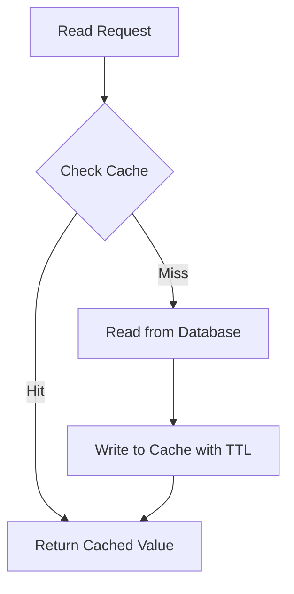
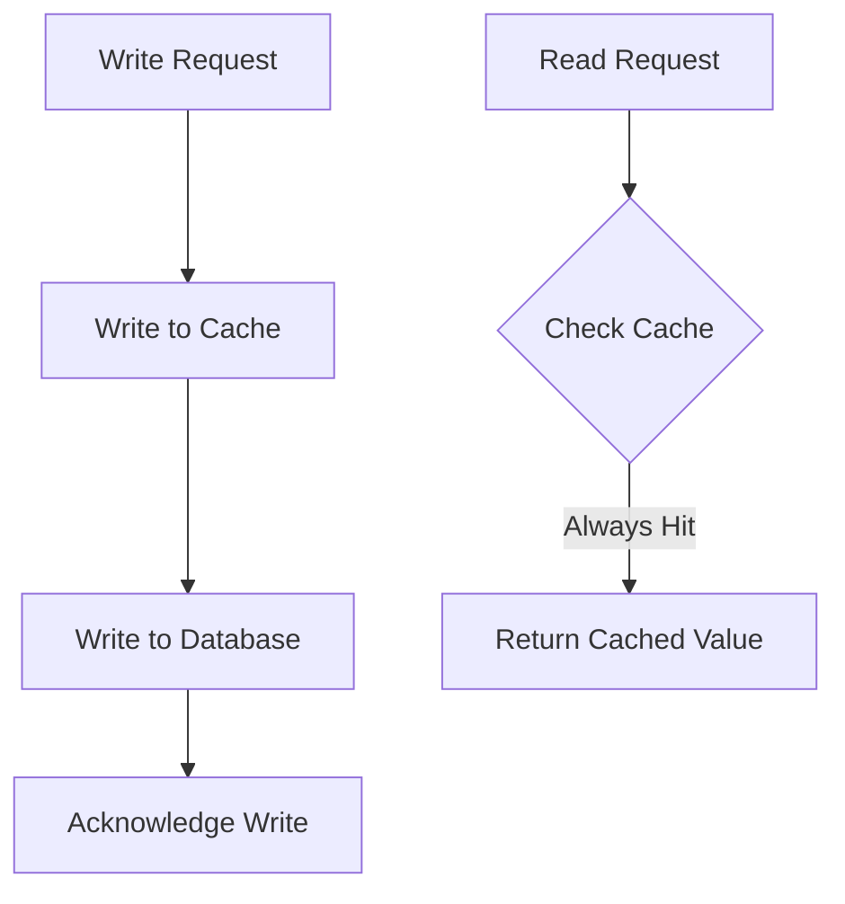
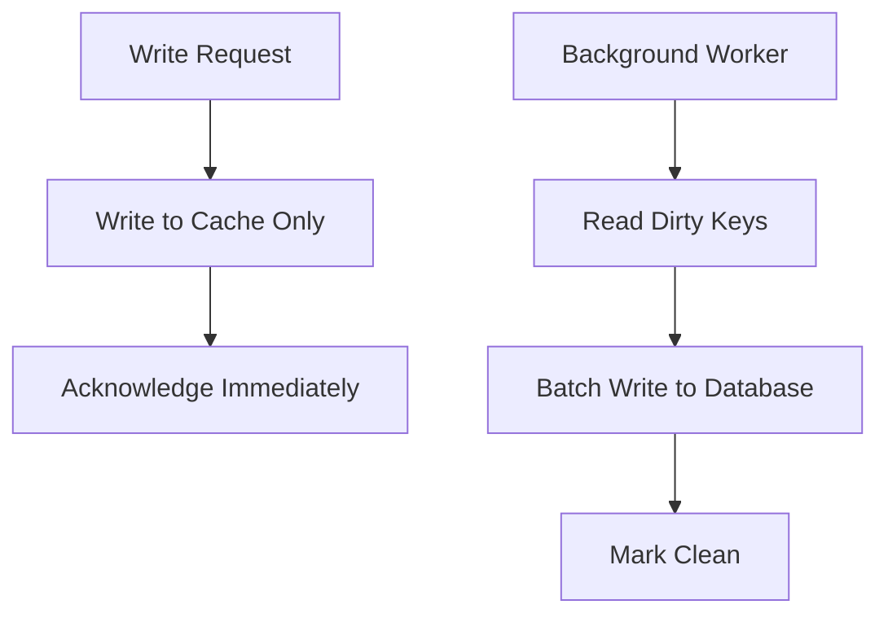
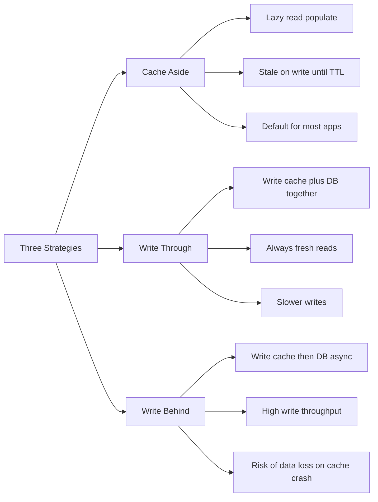
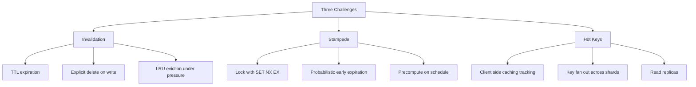
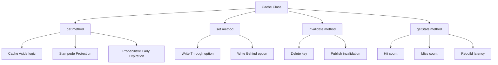

# 7.07 Redis Caching Strategies

## 1. Purpose

Caching is the practice of storing the result of an expensive computation or query in a fast-access layer so that subsequent requests for the same data can be served from that layer instead of recomputing or re-querying. In a Node.js backend, the most expensive operations are almost never the JavaScript execution itself; they are the network round trips to a database, the disk I/O of a slow query, the API call to a third-party service, or the cryptographic verification of a token. A cache in front of any of these reduces the typical request latency from tens or hundreds of milliseconds down to sub-millisecond, while simultaneously absorbing the brunt of read traffic so the underlying system does not have to scale to handle the full request volume.

The purposes of caching cluster around four outcomes. First, **reduce latency**: a Redis GET completes in roughly one hundred microseconds on localhost and one to two milliseconds across a typical data-center network, whereas a PostgreSQL indexed lookup is one to ten milliseconds and a cold query plan can be fifty to two hundred milliseconds. A cache hit shortens the critical path of the request, which directly improves user-perceived page load time and API responsiveness. Second, **reduce database load**: if ninety percent of reads hit the cache, the database only sees ten percent of the read traffic, which means the same database can serve ten times more users without adding replicas. This is the single largest cost lever in most web applications, because the database is usually the most expensive component to scale vertically (a larger instance costs linearly more) and the hardest to scale horizontally (sharding introduces operational complexity). Third, **absorb traffic spikes**: when a post goes viral, a marketing email goes out, or a bot begins hammering an endpoint, the cache absorbs the surge because each request served from the cache is one less request that hits the database. A cache hit rate of ninety-five percent means the database sees only five percent of the spike, which is often the difference between a service that stays up and one that pages the on-call engineer at three in the morning. Fourth, **decouple read latency from write complexity**: the database can be tuned for write throughput (using append-only tables, write-optimized storage engines, asynchronous index updates) while the cache serves reads at constant low latency, because the cache does not care how expensive it was to produce the value.

Why Redis specifically? Because Redis is an **in-memory key-value store with persistent data structures**, and its design point is exactly the workload that caching demands. Redis keeps all data in RAM (with optional disk persistence for durability), which gives it sub-millisecond access times. It supports a rich set of data structures beyond plain strings: **hashes** for object fields, **lists** for queues, **sets** for unique members, **sorted sets** for ranked data, **hyperloglog** for approximate counting, **streams** for append-only event logs, and **bitmaps** for boolean arrays. These data structures are not just storage; they come with atomic operations (`HINCRBY`, `ZADD`, `LPUSH`, `SADD`) that let you implement counters, leaderboards, and queues without read-modify-write races. Redis also supports **Lua scripts** that execute multiple commands atomically, **pub/sub channels** for cross-instance messaging, **key expiration** with TTLs down to millisecond precision, and **client-side caching** (the tracking feature) that lets frequently read keys be cached in the application process itself with invalidation notifications from the server. The combination of speed, versatility, and durability options makes Redis the default choice for caching in modern Node backends; alternatives like Memcached are simpler but lack data structures and persistence, while in-memory JavaScript `Map`s only work for single-process deployments and are lost on every restart.

The three caching strategies this note covers in depth are **Cache Aside** (also called Lazy Loading), **Write-Through**, and **Write-Behind** (also called Write-Back). Cache Aside is the default: the application checks the cache first, and on a miss, reads from the database and writes the result back to the cache. Write-Through writes to the cache and the database together as a single logical operation, so the cache is always fresh at the cost of write latency. Write-Behind writes to the cache immediately and asynchronously flushes to the database, so writes are fast but the database is briefly inconsistent and at risk of data loss if the cache fails before the flush.

The three challenges this note covers in depth are **cache invalidation**, **cache stampedes**, and **hot keys**. Invalidation is the question of how the cache stays consistent with the database when the database is updated; the options are TTL-based expiration, explicit invalidation on write, and LRU eviction under memory pressure. A cache stampede is the thundering-herd scenario where many requests miss the cache simultaneously and all rush to rebuild it, overwhelming the database; the solutions are locking (one request rebuilds while the others wait) and probabilistic early expiration (each request randomly decides to refresh the cache slightly before its TTL expires, smoothing the rebuild across time). A hot key is a single cache key that receives disproportionate traffic, often from a viral post or a popular product, which concentrates load on a single Redis shard; the solutions are client-side caching, sharding the hot key across multiple keys, and read replicas.

This note is exhaustive because the consequences of getting caching wrong are severe. A cache that serves stale data can show a user the wrong account balance or a sold-out product as in stock. A cache that fails to invalidate can cause a distributed system to disagree about the truth. A cache stampede can take down the database that the cache was supposed to protect. A hot key can saturate a single Redis shard and create a single point of failure for the entire application. The patterns in this note are the patterns that prevent those failures in production.

## 2. Theory and Deep Dive

### 2.1 Cache Aside (Lazy Loading)

Cache Aside is the most common caching pattern, used by the majority of web applications. The name comes from the cache being "aside" of the application's main data flow, queried opportunistically rather than being in the critical write path. The algorithm is: on a read request, the application first checks the cache for the key; if the cache contains the value (a cache hit), the application returns it directly; if the cache does not contain the value (a cache miss), the application reads from the database, writes the result to the cache with a TTL, and returns the value to the caller. Writes do not touch the cache at all in pure Cache Aside; instead, the cache entry is either invalidated explicitly (the application deletes the key on write, so the next read misses and rebuilds) or left to expire via TTL.

The advantage of Cache Aside is **simplicity and selectivity**. The cache contains only the data that has been requested, so cold data does not occupy memory. The write path is unaffected by caching, so writes have no added latency. The system is resilient to cache failure: if Redis is down, the application falls back to the database on every read, slower but correct. The disadvantage is the **slow cache miss**: the first read for any key takes the full database latency plus the cache write latency, which can be jarring if the database is slow. The other disadvantage is **stale data**: if the database is updated but the cache is not invalidated, the cache continues to serve the old value until its TTL expires. This is acceptable for many use cases (a product description that is hours stale is fine) but unacceptable for others (an account balance that is seconds stale is not).

The pattern is best visualized as a lazy fetch with a write-back.



### 2.2 Write-Through

Write-Through puts the cache in the write path. On a write, the application writes to the cache and the database together, treating them as a single logical operation. The order is typically cache-first (write to the cache, then to the database) or database-first (write to the database, then to the cache); either order has trade-offs. Cache-first means reads always see the latest value but the database is briefly behind, so a cache failure before the database write loses the update. Database-first means the database is always the source of truth but a failure between the two writes leaves the cache stale until the next read refreshes it (which contradicts the Write-Through promise). Most implementations use cache-first within a transaction or with a write-ahead log, or accept a small inconsistency window.

The advantage of Write-Through is that **the cache is always fresh**: every read returns the most recent write, because every write updates the cache. There are no stale reads, ever. The disadvantage is **write latency**: every write incurs both a cache write and a database write, in sequence or in parallel. If the cache write and database write are done in parallel, the latency is the maximum of the two; if in sequence, it is the sum. Either way, writes are slower than in Cache Aside. The other disadvantage is that **the cache fills with data that may never be read**: writing a row that no one ever queries still populates the cache, wasting memory.

Write-Through is appropriate when read-after-write consistency is mandatory (financial balances, inventory counts, configuration values) and when the write rate is moderate (high write rates overwhelm both the cache and the database).



### 2.3 Write-Behind (Write-Back)

Write-Behind (also called Write-Back) writes to the cache only and asynchronously flushes to the database later. The application writes to the cache, returns immediately to the caller, and a background worker (or a periodic flush) writes the value to the database. The cache is the source of truth for the duration of the inconsistency window, which can be milliseconds (if the flush is immediate) or minutes (if the flush is batched).

The advantage of Write-Behind is **extreme write throughput**: writes complete as fast as a Redis SET, which is sub-millisecond, so the application can absorb tens of thousands of writes per second without the database being a bottleneck. The database sees only the flushed writes, which can be batched and ordered to minimize transaction overhead. The disadvantage is **data loss risk**: if Redis crashes before the flush completes, the writes are lost, because Redis persistence (RDB snapshots or AOF logs) is asynchronous and may not have captured the latest writes. The other disadvantage is **complexity**: the flush logic must handle ordering, deduplication (multiple writes to the same key collapse to the last value), failure retry, and reconciliation with the database.

Write-Behind is appropriate when write throughput is the dominant concern (telemetry, click streams, counters) and the data loss window is acceptable (analytics events that can be approximated). It is inappropriate for transactional data (orders, payments) where every write must be durable.



### 2.4 Comparison of the Three Strategies



| Strategy | Write path | Read freshness | Write latency | Data loss risk | Best for |
| --- | --- | --- | --- | --- | --- |
| Cache Aside | DB only | Stale until TTL or invalidation | Low (DB only) | None (DB is source) | Most reads, moderate writes |
| Write-Through | Cache plus DB together | Always fresh | Higher (both writes) | None if ordered correctly | Read-after-write consistency |
| Write-Behind | Cache only, DB async | Always fresh in cache | Very low (cache only) | High if cache crashes | High write throughput, lossy data |

### 2.5 Cache Invalidation

Cache invalidation is the problem of keeping the cache consistent with the source of truth. There are three mechanisms, often combined.

The first is **TTL (Time-To-Live)**. Every cache entry has an expiration time, after which Redis automatically evicts it. The next read after expiration is a cache miss, which rebuilds the entry from the database. TTL is the simplest invalidation mechanism because it requires no application logic: set the TTL when writing, and the cache self-cleans. The downside is that the cache can serve stale data for the entire TTL window. A TTL of one hour means a database update can be invisible to readers for up to one hour. The right TTL is the maximum staleness the business can tolerate: one second for a counter, one minute for a leaderboard, one hour for a product description, one day for a static configuration. TTLs also serve as a safety net for explicit invalidation: even if the application forgets to invalidate on a write, the entry expires eventually.

The second is **explicit invalidation on update**. When the application writes to the database, it also deletes the corresponding cache key. The next read misses and rebuilds from the fresh database value. This is the strongest consistency the cache can offer without going full Write-Through. The challenge is finding the cache keys that correspond to a database row: a single row might be cached under multiple keys (by id, by username, by email, by composite query), so the application must maintain a list of keys to invalidate per entity. This is where many bugs live: forget one key, and that one key serves stale data forever (until its TTL expires). A common pattern is to use a key prefix or a key registry: all keys for entity type "user" start with `user:`, and the invalidation logic scans for keys with that prefix (using `SCAN`, not `KEYS`, to avoid blocking Redis). For multi-instance applications, the invalidation must be broadcast via pub/sub: one instance invalidates the key, but every other instance's local cache (if any) must also be invalidated, which is done by publishing a message on a Redis pub/sub channel that all instances subscribe to.

The third is **LRU (Least Recently Used) eviction**. Redis, when configured with a `maxmemory` policy, will evict keys when memory is full. The default policy is `noeviction`, which makes Redis return an error on writes when memory is full; for caching workloads, the policy is typically `allkeys-lru` (evict the least recently used key across all keys) or `volatile-lru` (evict the least recently used key among keys with a TTL). LRU is a last-resort invalidation: it does not keep the cache fresh, it keeps the cache from overflowing. The choice between `allkeys-lru` and `volatile-lru` matters: if some keys are intentionally non-expiring (a configuration value, a lock), `allkeys-lru` might evict them; `volatile-lru` only evicts keys with a TTL, leaving the rest untouched. Redis approximates LRU with a sampled algorithm (it samples a configurable number of keys and evicts the least recently used among the sample) which is much faster than true LRU but slightly less accurate. There is also `allkeys-lfu` and `volatile-lfu` for Least Frequently Used, which tracks access count rather than recency and is better for workloads where some keys are accessed many times and others only once.

### 2.6 Cache Stampede

A cache stampede (also called thundering herd, dog-piling, or cache miss storm) is the failure mode where many concurrent requests miss the cache for the same key, all decide to rebuild it from the database, and all hit the database simultaneously. The classic scenario: a popular key with a TTL of one hour expires at 12:00:00. At 12:00:01, ten thousand requests arrive. Each request checks the cache, finds it empty, queries the database (an expensive query taking two hundred milliseconds), writes the result to the cache, and returns. The database receives ten thousand identical queries in two hundred milliseconds, which saturates its connection pool, slows to a crawl, and may crash. The cache, which was supposed to protect the database, becomes the trigger for its failure.

The standard solution is **locking (also called request coalescing or single-flight)**. The first request that misses the cache acquires a lock (a Redis key with a TTL, set using `SET key value NX EX 30`), rebuilds the cache, releases the lock, and returns. Every subsequent request that misses the cache finds the lock held, waits (polling the cache or the lock), and reads the value from the cache once the first request has populated it. The database sees only one query, not ten thousand. The lock has a TTL to prevent deadlock if the first request crashes; if the lock holder dies, the lock expires and the next request rebuilds.

The second solution is **probabilistic early expiration (also called XFetch, after the Vimeo paper)**. Each request, on a cache hit, computes a random decision to refresh the cache early. The probability of refreshing increases as the TTL approaches expiration: a key with thirty seconds of TTL left has a low probability of refresh, while a key with one second of TTL left has a high probability. The effect is that the refresh is spread across the last few seconds of the TTL, so by the time the key actually expires, one of the requests has already refreshed it and there is no stampede. The formula, from the Vimeo paper, is: with current age `age`, total TTL `ttl`, and a constant `beta` (typically 1.0), compute `delta = beta times log(random())` and refresh if `age minus delta times ttl > ttl`. The randomness ensures that not all requests refresh simultaneously; the logarithm biases the refresh toward the end of the TTL.

A third solution is **precompute on schedule**: a background job (a `setInterval` in Node, or a cron job) refreshes the cache every N minutes, before the TTL expires. The request path never sees a miss, because the cache is always warm. This is the simplest solution but it wastes resources when the key is not being read (the refresh happens whether or not anyone wants the value). It is best for keys that are always hot: a global configuration, a leaderboard, a homepage feed.

### 2.7 Hot Keys

A hot key is a single Redis key that receives disproportionate traffic. The classic example is a leaderboard for a popular game: the top-ten players are queried on every page load, so the key `leaderboard:global` receives thousands of reads per second, all routed to the same Redis shard (because Redis shards by key). The shard handling the hot key saturates its CPU, while other shards sit idle. The latency on the hot key rises, and eventually the shard's connection queue overflows and requests start timing out.

The solutions cluster into three categories. The first is **client-side caching**. Redis 6 introduced the **tracking** feature, which lets the server notify clients when a key they have read has been modified. The client caches the key locally (in a JavaScript `Map`), serves reads from the local cache without round-tripping to Redis, and invalidates the local entry when the server sends an invalidation message. This reduces the load on the hot key by a factor of the client count: if there are one hundred application instances, each with a local cache, the Redis shard sees one percent of the reads it would otherwise see. The trade-off is that client-side caching is eventually consistent: there is a brief window between the server-side modification and the invalidation message arrival during which the client serves a stale value.

The second is **sharding the hot key into multiple keys**. Instead of one key `leaderboard:global`, use ten keys `leaderboard:global:0` through `leaderboard:global:9`, each holding the same value. Reads pick a random shard (or a shard based on the request hash), so the load is distributed across ten shards, each handling one tenth of the traffic. Writes must update all ten keys, which is acceptable because writes are rare. This pattern is sometimes called **key fan-out** or **hot-key splitting**.

The third is **read replicas**. Redis supports replica-of (formerly slave-of) replication, where one or more replica instances mirror the primary. Reads can be distributed across the replicas, so a hot key on the primary is served by N replicas in parallel. The trade-off is replication lag: a replica may be milliseconds to seconds behind the primary, so reads from replicas are eventually consistent. Redis Cluster, the sharding mode of Redis, does not support read-from-replica by default for primary-owned slots, but most clients (including `ioredis`) can be configured to route reads to replicas for specific commands.

Hot-key detection is its own problem. The `redis-cli --hotkeys` command (with the `LFU` eviction policy configured) lists the most frequently accessed keys. The `INFO commandstats` and `INFO latencystats` sections reveal which commands consume the most CPU. Third-party tools like `redis-faina` (a Pinterest project) parse the MONITOR output to produce a query analysis. Without monitoring, hot keys are usually discovered by the outage they cause.

### 2.8 The Three Challenges in One Diagram



## 3. Mental Models

The fastest way to reason about caching is to compress each pattern into a one-sentence mental model that captures its essence.

**Cache Aside** is "check the cache, miss → read DB → fill cache." The cache is a lazy mirror of the database; it only contains what has been read, and it is allowed to be stale until its TTL expires. The write path is unaffected. This is the default strategy for most applications because it is simple, resilient, and selectively populates the cache.

**Write-Through** is "write cache and DB together." The cache is in the write path; every write updates both, so reads always see the latest value. The cost is write latency. Use this when read-after-write consistency is mandatory.

**Write-Behind** is "write cache now, DB later." The cache is the source of truth for a brief window; the database is updated asynchronously by a background worker. The cost is data loss risk if the cache fails before the flush. Use this when write throughput is the dominant concern.

**Stampede** is "thundering herd of cache misses." Many requests miss the cache simultaneously and all rush to rebuild it. The fix is to make only one request rebuild while the others wait (locking) or to spread the rebuild across the last few seconds of the TTL (probabilistic early expiration).

**Hot Key** is "one key gets all the traffic." A single key receives disproportionate reads, saturating the shard that owns it. The fix is to cache the key on the client (so Redis is not hit at all), to split the key into N copies on different shards (so the load is distributed), or to serve reads from replicas (so the primary is not the bottleneck).

**Invalidation** is "make the cache match the DB after a write." The mechanisms are TTL (set it and forget it), explicit delete (on write, delete the key), and LRU eviction (let Redis drop old keys under memory pressure). The hardest part is finding all the keys that correspond to a single entity, because one row may be cached under many keys.

A useful unifying mental model: **the cache is a denormalized projection of the database**. Every cache entry is the result of a query (a SQL statement, a function call, an API request) materialized as a key-value pair. The harder the query, the more valuable the cache. The more keys that derive from the same source data, the harder the invalidation. The more reads a key receives, the more likely it is to be hot. Every caching decision is a trade-off between the cost of rebuilding (the query latency) and the cost of staleness (the consistency window).

A second useful model: **caching is a layered defense, not a single layer**. The browser cache is the outermost layer (caching static assets), the CDN is the next (caching full responses at the edge), the application cache (Redis) is next (caching computed values), the database query cache is innermost (caching query results in the database itself). Each layer absorbs some traffic and lets the inner layer focus on the misses. A miss at every layer is the worst case; a hit at the outermost layer is the best case. The Redis cache in this note is one layer in that stack, and its value depends on what the layers above and below it are doing.

## 4. Real-World Use Cases

### 4.1 API Response Caching

The most common Redis use case is caching the JSON response of an API endpoint, keyed by the request URL or a hash of the request parameters. A `GET /products/123` request becomes a cache lookup for `api:products:123`; on a miss, the handler queries the database, serializes the response, writes it to Redis with a TTL of one minute, and returns it. On a hit, the response is served from Redis in one millisecond, skipping the database entirely. This pattern is so common that Express, Fastify, and Koa all have middleware for it (the `apicache` and `express-redis-cache` packages, for example). The key design decisions are the TTL (one minute for a product, one hour for a category list, one day for a static configuration), the cache key (the URL plus a hash of the query string, plus a version prefix so the cache can be invalidated globally by bumping the version), and the invalidation strategy (delete the key on `PUT /products/123`, or rely on TTL).

### 4.2 Session Storage

Web sessions are the canonical Redis use case because they are read on every request, written on every login, and must be shared across all application instances behind a load balancer. A session is a small JSON object (the user ID, the roles, the last-activity timestamp) stored under the key `session:cookieValue`. The TTL is the session timeout (typically thirty minutes of inactivity), and the TTL is refreshed on every request (using `EXPIRE` to extend the session). When the user logs out, the key is deleted explicitly. Redis is faster than a database for this workload, supports the TTL semantics natively, and is shared across instances. The alternative, JWT tokens, avoids the Redis round-trip but cannot be revoked without a blacklist (which is itself a Redis use case).

### 4.3 Rate Limiting Counters

The rate limiter from [[7.04 API Rate Limiting]] stores its counters in Redis. The fixed-window algorithm uses `INCR` with `EXPIRE`; the sliding-window algorithm uses a sorted set with `ZADD`, `ZREMRANGEBYSCORE`, and `ZCARD`; the token-bucket algorithm uses a Lua script to atomically compute the refill and decrement. Redis is the right choice because rate-limit state must be shared across instances (otherwise the limit is multiplied by the instance count) and because the atomic operations prevent race conditions. The TTL on the counter keys is the window duration, so old windows are evicted automatically.

### 4.4 Leaderboards (Sorted Sets)

A leaderboard is a ranked list of players by score, with frequent updates (every game increments a player's score) and frequent reads (every page load fetches the top ten and the player's rank). Redis sorted sets are purpose-built for this: `ZADD leaderboard:global score playerId` inserts or updates a player's score, `ZREVRANGE leaderboard:global 0 9` returns the top ten, `ZREVRANK leaderboard:global playerId` returns a player's rank. All three operations are O(log N) for the update and O(log N plus M) for the range query, which is fast enough for millions of players. The alternative, a SQL query with `ORDER BY score DESC LIMIT 10`, requires an index on the score column and is still slower than the in-memory sorted set, especially for the rank query (which in SQL requires a subquery or a window function).

### 4.5 Real-Time Analytics

Real-time analytics dashboards (active users, requests per second, error rate) are a natural fit for Redis because the data is write-heavy (every event increments a counter) and read-heavy (the dashboard polls every few seconds). The pattern is: each event does `HINCRBY metrics:2024-01-15 field 1` (incrementing a hash field for the day), the dashboard does `HGETALL metrics:2024-01-15` to fetch all the counters, and a daily TTL evicts old data. For per-second or per-minute granularity, the key includes the time bucket (`metrics:2024-01-15:14:30`), and the TTL is short (a few minutes for per-second buckets, a few hours for per-minute buckets). For approximate counting of unique visitors, Redis HyperLogLog (`PFADD`, `PFCOUNT`) uses twelve kilobytes per key regardless of the count, which is far more memory-efficient than a set of user IDs.

### 4.6 Pub/Sub for Cache Invalidation

When the application runs multiple instances, each instance may have its own in-process cache (a JavaScript `Map`) on top of Redis. A write on instance A invalidates the Redis key, but instance B's local cache still has the stale value. The solution is a Redis pub/sub channel: instance A publishes an invalidation message (`user:123 invalidated`), instance B receives it and deletes its local entry. This is the pattern used by the `cache-manager` package with its ioredis store, and by frameworks like Next.js for ISR (Incremental Static Regeneration). The trade-off is that pub/sub is fire-and-forget: if instance B is briefly disconnected, it misses the message and serves stale data until its TTL expires. For stronger consistency, use a Redis Stream (which persists messages) instead of pub/sub.

### 4.7 Distributed Locks

A distributed lock is a Redis key with `SET key value NX EX 30` (set if not exists, with a thirty-second TTL). The value is a unique identifier (a UUID) so the lock holder can verify it still holds the lock before releasing it (using a Lua script that checks and deletes atomically). Distributed locks are used for leader election, job scheduling (only one worker processes a job), and cache stampede protection (only one request rebuilds the cache). The `redlock` algorithm (from the Redis creator) extends this across multiple Redis instances for fault tolerance. See [[7.08 Concurrency Clustering Workers]] for more on distributed coordination.

## 5. Code Examples

### 5.1 Example A — Minimal and Conceptual

The minimal example implements each of the three caching strategies in roughly twenty lines. The code uses `ioredis` for the Redis client and a stub `database` object for the underlying data store. The TypeScript version adds types for the cache key, value, and loader function.

**JavaScript: minimal-cache-aside.js**

```javascript
const Redis = require('ioredis');
const redis = new Redis();

const db = {
  async getUser(id) {
    return { id, name: 'Alice', balance: 100 };
  }
};

async function getUser(id) {
  const key = `user:${id}`;
  const cached = await redis.get(key);
  if (cached) return JSON.parse(cached);
  const user = await db.getUser(id);
  await redis.set(key, JSON.stringify(user), 'EX', 300);
  return user;
}

module.exports = { getUser };
```

**TypeScript: minimal-cache-aside.ts**

```typescript
import Redis from 'ioredis';
const redis = new Redis();

interface User {
  id: number;
  name: string;
  balance: number;
}

const db = {
  async getUser(id: number): Promise<User> {
    return { id, name: 'Alice', balance: 100 };
  }
};

export async function getUser(id: number): Promise<User> {
  const key = `user:${id}`;
  const cached = await redis.get(key);
  if (cached) return JSON.parse(cached) as User;
  const user = await db.getUser(id);
  await redis.set(key, JSON.stringify(user), 'EX', 300);
  return user;
}
```

**JavaScript: minimal-write-through.js**

```javascript
const Redis = require('ioredis');
const redis = new Redis();
const db = require('./db');

async function updateUser(id, patch) {
  const key = `user:${id}`;
  const updated = await db.updateUser(id, patch);
  await redis.set(key, JSON.stringify(updated), 'EX', 300);
  return updated;
}

module.exports = { updateUser };
```

**TypeScript: minimal-write-through.ts**

```typescript
import Redis from 'ioredis';
const redis = new Redis();
import * as db from './db';

interface User { id: number; name: string; balance: number; }
type UserPatch = Partial<User>;

export async function updateUser(id: number, patch: UserPatch): Promise<User> {
  const key = `user:${id}`;
  const updated = await db.updateUser(id, patch);
  await redis.set(key, JSON.stringify(updated), 'EX', 300);
  return updated;
}
```

**JavaScript: minimal-write-behind.js**

```javascript
const Redis = require('ioredis');
const redis = new Redis();
const db = require('./db');

const dirty = new Set();

async function writeUser(id, value) {
  const key = `user:${id}`;
  await redis.set(key, JSON.stringify(value), 'EX', 300);
  dirty.add(id);
}

setInterval(async () => {
  for (const id of dirty) {
    const raw = await redis.get(`user:${id}`);
    if (raw) await db.updateUser(id, JSON.parse(raw));
  }
  dirty.clear();
}, 5000);

module.exports = { writeUser };
```

**TypeScript: minimal-write-behind.ts**

```typescript
import Redis from 'ioredis';
const redis = new Redis();
import * as db from './db';

interface User { id: number; name: string; balance: number; }

const dirty = new Set<number>();

export async function writeUser(id: number, value: User): Promise<void> {
  const key = `user:${id}`;
  await redis.set(key, JSON.stringify(value), 'EX', 300);
  dirty.add(id);
}

setInterval(async () => {
  for (const id of dirty) {
    const raw = await redis.get(`user:${id}`);
    if (raw) await db.updateUser(id, JSON.parse(raw) as User);
  }
  dirty.clear();
}, 5000);
```

These three examples are intentionally small. They demonstrate the shape of each strategy but omit everything that matters in production: stampede protection, error handling, telemetry, serialization versioning, and explicit invalidation. The production-grade example adds all of those.

### 5.2 Example B — Production-Grade

The production-grade example is a typed Cache Aside wrapper with stampede protection (single-flight locking), probabilistic early expiration, telemetry (hit rate, miss rate, rebuild latency), and explicit invalidation. The wrapper is generic over the value type, so it can be used for any cacheable entity.

**JavaScript: production-cache.js**

```javascript
const Redis = require('ioredis');
const redis = new Redis();

const stats = { hits: 0, misses: 0, stampedeWaits: 0, rebuildMs: 0 };

function lockKey(key) { return `lock:${key}`; }

async function withStampedeProtection(key, ttl, loader) {
  const cached = await redis.get(key);
  if (cached !== null) return JSON.parse(cached);

  const lock = lockKey(key);
  const acquired = await redis.set(lock, '1', 'NX', 'EX', 30);
  if (!acquired) {
    stats.stampedeWaits += 1;
    for (let i = 0; i < 30; i++) {
      await new Promise(r => setTimeout(r, 50));
      const retry = await redis.get(key);
      if (retry !== null) return JSON.parse(retry);
    }
    const fallback = await loader();
    return fallback;
  }

  try {
    const start = Date.now();
    const value = await loader();
    stats.rebuildMs += Date.now() - start;
    await redis.set(key, JSON.stringify(value), 'EX', ttl);
    return value;
  } finally {
    await redis.del(lock);
  }
}

function shouldRefreshEarly(ttl, remaining, beta = 1) {
  const age = ttl - remaining;
  const delta = beta * Math.log(Math.random());
  return (age / ttl) - delta > 1;
}

async function get(key, ttl, loader) {
  const remaining = await redis.pttl(key);
  if (remaining > 0 && !shouldRefreshEarly(ttl, remaining)) {
    stats.hits += 1;
    const v = await redis.get(key);
    return v ? JSON.parse(v) : null;
  }
  stats.misses += 1;
  return withStampedeProtection(key, ttl, loader);
}

async function invalidate(key) {
  await redis.del(key);
}

function getStats() {
  const total = stats.hits + stats.misses;
  return {
    ...stats,
    hitRate: total > 0 ? stats.hits / total : 0,
  };
}

module.exports = { get, invalidate, getStats };
```

**TypeScript: production-cache.ts**

```typescript
import Redis from 'ioredis';
const redis = new Redis();

type Loader<T> = () => Promise<T>;

interface CacheStats {
  hits: number;
  misses: number;
  stampedeWaits: number;
  rebuildMs: number;
  hitRate: number;
}

const stats = { hits: 0, misses: 0, stampedeWaits: 0, rebuildMs: 0 };

function lockKey(key: string): string {
  return `lock:${key}`;
}

async function withStampedeProtection<T>(
  key: string,
  ttl: number,
  loader: Loader<T>
): Promise<T> {
  const cached = await redis.get(key);
  if (cached !== null) return JSON.parse(cached) as T;

  const lock = lockKey(key);
  const acquired = await redis.set(lock, '1', 'NX', 'EX', 30);
  if (!acquired) {
    stats.stampedeWaits += 1;
    for (let i = 0; i < 30; i++) {
      await new Promise((r) => setTimeout(r, 50));
      const retry = await redis.get(key);
      if (retry !== null) return JSON.parse(retry) as T;
    }
    const fallback = await loader();
    return fallback;
  }

  try {
    const start = Date.now();
    const value = await loader();
    stats.rebuildMs += Date.now() - start;
    await redis.set(key, JSON.stringify(value), 'EX', ttl);
    return value;
  } finally {
    await redis.del(lock);
  }
}

function shouldRefreshEarly(ttl: number, remaining: number, beta = 1): boolean {
  const age = ttl - remaining;
  const delta = beta * Math.log(Math.random());
  return (age / ttl) - delta > 1;
}

export async function get<T>(
  key: string,
  ttl: number,
  loader: Loader<T>
): Promise<T> {
  const remaining = await redis.pttl(key);
  if (remaining > 0 && !shouldRefreshEarly(ttl, remaining)) {
    stats.hits += 1;
    const v = await redis.get(key);
    return v ? (JSON.parse(v) as T) : (null as unknown as T);
  }
  stats.misses += 1;
  return withStampedeProtection<T>(key, ttl, loader);
}

export async function invalidate(key: string): Promise<void> {
  await redis.del(key);
}

export function getStats(): CacheStats {
  const total = stats.hits + stats.misses;
  return {
    ...stats,
    hitRate: total > 0 ? stats.hits / total : 0,
  };
}
```

The production wrapper has several features worth calling out. First, the **lock acquisition** uses `SET NX EX` which is the atomic single-flight primitive; the TTL of thirty seconds prevents deadlock if the lock holder crashes. Second, the **wait loop** polls the cache every fifty milliseconds for up to thirty iterations (1.5 seconds total), which is long enough for most loaders to complete but not so long that the request times out. Third, the **probabilistic early expiration** uses the XFetch algorithm with a beta of 1.0, which spreads refreshes across the last twenty percent of the TTL. Fourth, the **telemetry** tracks hits, misses, stampede waits, and total rebuild time, exposed via `getStats` for monitoring (see [[7.09 Production Monitoring]]). Fifth, the wrapper is **generic over the value type**, so the TypeScript version preserves type safety from the loader return type to the cache get return type.

The wrapper does not handle everything. It does not handle **serialization versioning** (a schema change should bump a version prefix on the key to avoid deserializing old formats). It does not handle **negative caching** (caching the absence of a value, so a miss for a non-existent key does not trigger a database query on every request). It does not handle **multi-instance invalidation** via pub/sub (if instance A invalidates a key, instance B's local cache, if any, must also be invalidated). These are exercises in Section 9 and features of the mini-project in Section 10.

## 6. Common Mistakes and Anti-Patterns

### 6.1 No TTL: The Cache Grows Forever

The most common mistake is writing to the cache without a TTL. The cache accumulates every key ever written, including keys for entities that have been deleted from the database, keys for users who have closed their accounts, and keys for one-time tokens that have been consumed. Redis memory grows until it hits the `maxmemory` limit, at which point either Redis returns errors on writes (the default `noeviction` policy) or begins evicting keys unpredictably (the LRU policies). The fix is to set a TTL on every write, even for keys that are "permanent" (their TTL can be a day or a week, long enough to be effectively permanent but short enough to clean up if the application forgets to invalidate). A cache without a TTL is a memory leak; a cache with a TTL is self-cleaning.

### 6.2 Cache Stampede: No Locking

The second most common mistake is implementing Cache Aside without stampede protection. The code looks correct: check the cache, miss → read DB → write cache. But under load, ten thousand requests miss simultaneously, all read the database, and the database collapses. The fix is to add the single-flight locking from the production example: the first miss acquires a lock, rebuilds the cache, releases the lock; subsequent misses wait for the lock and read from the cache once it is populated. Without locking, the cache becomes a liability under load instead of a protection.

### 6.3 Stale Data: No Invalidation on Update

The third most common mistake is updating the database without invalidating the cache. The application writes a new value to the database, but the cache still has the old value, so reads return the stale data until the TTL expires. The classic example is a user updating their profile picture: the database has the new URL, but the cache serves the old URL for the next hour (the TTL). The user sees the old picture, refreshes, clears cache, refreshes again, and finally files a bug. The fix is to delete the cache key on every write to the corresponding database row. The challenge is identifying the keys to delete, which requires a key-naming convention or a key registry.

### 6.4 Hot Keys: No Mitigation

The fourth most common mistake is creating a hot key without mitigation. A leaderboard, a configuration value, a popular product, a viral tweet: any of these can become a single key that receives disproportionate traffic, saturating the Redis shard that owns it. The mistake is not in creating the hot key (it is often unavoidable) but in not mitigating it. The fix is one or more of: client-side caching (so the hot key is served from local memory), key fan-out (so the hot key is split into N copies on different shards), or read replicas (so the load is distributed across replicas). Without mitigation, the hot key is a single point of failure for the entire cache.

### 6.5 Caching Everything: Over-Cache and Memory Waste

The fifth most common mistake is caching too much. The developer, having learned about caching, wraps every database query in a cache lookup. The result is that Redis stores every row of every table, which is more memory than the database itself uses, while the hit rate on the rarely-accessed keys is near zero. The cache becomes a slower, more expensive copy of the database. The fix is to cache only the hot paths: the queries that are both expensive (slow) and frequent (high request rate). A query that takes one millisecond and is called once per minute does not need a cache. A query that takes one hundred milliseconds and is called one thousand times per second does. Profile the database to find the slow queries, then profile the application to find the frequent queries, and cache the intersection.

### 6.6 No Monitoring: Don't Know the Hit Rate

The sixth most common mistake is deploying a cache without monitoring. The cache is in production, the application is using it, but no one knows the hit rate, the miss rate, the rebuild latency, or the memory usage. The cache could be serving zero hits (every request misses the cache, hits the database, and writes a cache entry that no one ever reads), and no one would know. The fix is to instrument the cache with the telemetry from the production example: hits, misses, stampede waits, rebuild time, memory usage. The hit rate is the single most important cache metric: a hit rate below eighty percent suggests the cache is not helping (the keys are not being re-read before they expire, or the TTL is too short), while a hit rate above ninety-five percent suggests the cache is working well. See [[7.09 Production Monitoring]] for the broader monitoring stack.

### 6.7 Caching the Wrong Serialization Format

A subtler mistake is caching a serialization format that is expensive to produce or fragile to consume. Caching a deep object graph with circular references (which `JSON.stringify` cannot serialize), or caching a class instance (which `JSON.parse` will not rehydrate into the class, leaving you with a plain object), or caching a Buffer (which `JSON.stringify` converts to a nested array of bytes, inflating the size). The fix is to cache the database representation directly (the row, the JSON column), not the in-memory representation, and to convert at the boundary. Or to use a serialization format that preserves types (MessagePack, BSON, Protocol Buffers) when the JSON representation is too lossy.

### 6.8 Treating Redis as a Persistent Store

The final mistake is treating Redis as a persistent store instead of a cache. The application writes critical data to Redis (orders, payments, messages) without a backing store, relying on Redis persistence (RDB or AOF) for durability. Redis persistence is asynchronous and can lose the last few seconds of writes on a crash; it is not a substitute for a database. The fix is to use Redis as a cache (the database is the source of truth, Redis is a performance optimization) or as a write-through store (every write goes to both).

## 7. Best Practices and Design Patterns

### 7.1 Use Cache Aside as the Default

Cache Aside is the right default for most applications because it is simple, resilient, and selectively populates the cache. Only escalate to Write-Through when read-after-write consistency is mandatory, and only escalate to Write-Behind when write throughput is the dominant concern. The vast majority of caching needs are met by Cache Aside with a TTL and explicit invalidation on write.

### 7.2 Set TTLs on Everything

Every cache entry should have a TTL, even if the entry is "permanent." The TTL is the safety net: if the application forgets to invalidate, the entry expires eventually. A TTL of one day is fine for a configuration value, one hour for a product description, one minute for a counter, one second for a real-time metric. The TTL should be the maximum staleness the business can tolerate. A cache without TTLs is a memory leak.

### 7.3 Invalidate on Update

Every write to the database should delete the corresponding cache key. The deletion should happen after the database write (so a failed database write does not leave the cache empty), and should be best-effort (if the cache is down, the write should still succeed, and the cache will be repopulated on the next read). For multi-instance applications, broadcast the invalidation via pub/sub so all instances' local caches are also invalidated.

### 7.4 Protect Against Stampedes

Any cache key that is expensive to rebuild and frequently accessed should have stampede protection. The single-flight locking pattern (using `SET NX EX` for the lock) is the standard solution; probabilistic early expiration (XFetch) is the optimization for high-traffic keys where even the lock wait is undesirable. The cost of stampede protection is a few extra Redis operations per miss; the benefit is that the database does not collapse under a thundering herd.

### 7.5 Monitor the Hit Rate

The hit rate is the single most important cache metric. Instrument the cache to track hits, misses, stampede waits, and rebuild latency. Expose these metrics via Prometheus or StatsD, and alert on a hit rate below a threshold (typically eighty percent) or a stampede-wait count above zero. See [[7.09 Production Monitoring]].

### 7.6 Don't Cache Everything

Cache only the hot paths: the queries that are both expensive and frequent. Use database slow-query logging and application profiling to identify these queries. A cache that tries to cache everything becomes a slower, more expensive copy of the database. A cache that targets the hot paths delivers most of the benefit at a fraction of the memory cost.

### 7.7 Use Redis Data Structures Appropriately

Redis is not just a string-key store; it has hashes, lists, sets, sorted sets, hyperloglog, streams, and bitmaps. Use the right structure for the job. A user object with multiple fields should be a hash (`HSET user:123 name Alice balance 100`), not a JSON string, so individual fields can be updated without re-serializing the whole object. A leaderboard should be a sorted set, not a list, so ranks can be queried efficiently. A unique-visitor counter should be a hyperloglog, not a set, so memory usage is constant regardless of the count. See the Redis data types introduction for a complete reference.

### 7.8 Use Pipeline and MGET for Batch Operations

When you need to read or write multiple keys, use a pipeline (`redis.pipeline().get(k1).get(k2).exec()`) or the `MGET` command. A pipeline sends multiple commands in a single round-trip, reducing latency from N times the round-trip to one times the round-trip. For ten keys, the pipeline is ten times faster than ten separate gets. The trade-off is that the pipeline is not atomic (other commands can interleave), so use a Lua script (`EVAL`) when atomicity is required.

### 7.9 Use Lua Scripts for Atomic Read-Modify-Write

Any operation that reads a value, computes a new value, and writes it back should be a Lua script. The script executes atomically (no other command can interleave), so the read-modify-write is race-free. Examples include the token-bucket rate limiter, the cache stampede lock with conditional delete, and the leaderboard score update with rank computation. The downside of Lua scripts is that they block the Redis event loop (a slow script blocks all other commands), so scripts should be fast (sub-millisecond) and should not loop over many keys.

### 7.10 Version Your Cache Keys

When the cached value's schema changes (a new field, a renamed field, a different format), the old cache entries are now invalid and must be evicted. The simplest way is to version the key prefix: `user:v1:123` becomes `user:v2:123` on a schema change. The old keys expire via TTL, and the new keys are populated on the next read. Without versioning, a schema change can cause deserialization errors on every cached entry, which is a production outage.

### 7.11 Use Connection Pooling

The `ioredis` client maintains a connection pool internally, but the default pool size may be too small for high-throughput applications. Configure the pool size to match the expected concurrency (typically the worker thread count times the concurrent request count per worker). See [[3.17 Cluster Module]] and [[7.08 Concurrency Clustering Workers]] for the broader concurrency story.

### 7.12 Plan for Cache Failure

The cache will fail. Redis will crash, the network will partition, the connection pool will exhaust. The application must degrade gracefully: on a cache failure, fall back to the database (slower but correct), log the failure, and alert. The cache should never be a hard dependency; it should always be a performance optimization that can be removed without breaking correctness. This is the difference between a cache and a database.

### 7.13 Use Namespaced Key Prefixes

All keys should have a logical prefix that identifies their owner and purpose: `cache:`, `session:`, `ratelimit:`, `lock:`. This makes the cache inspectable (you can `SCAN` for all keys of a type), makes invalidation scoped (you can delete all keys of a type), and prevents collisions between unrelated features.

### 7.14 Consider Negative Caching

When a key is queried that does not exist in the database, the cache miss triggers a database query on every request. For high-traffic endpoints where many requests are for non-existent keys (a 404 lookup, a deleted user), this is wasteful. The fix is **negative caching**: cache a sentinel value (a special string like `nullSentinel`) for a shorter TTL, so subsequent requests for the same non-existent key hit the cache instead of the database. The trade-off is that a key created after being negatively cached will not be visible until the negative TTL expires, which is usually acceptable.

## 8. Technical Interview Knowledge

### 8.1 Q: What is the difference between Cache Aside, Write-Through, and Write-Behind?

A: Cache Aside (Lazy Loading) is the pattern where the application checks the cache first, and on a miss, reads from the database and writes the result back to the cache. Writes do not touch the cache; the cache is invalidated explicitly or left to expire via TTL. Write-Through puts the cache in the write path: every write updates both the cache and the database, so reads always see the latest value. Write-Behind (Write-Back) writes to the cache only and asynchronously flushes to the database, so writes are fast but the database is briefly inconsistent and at risk of data loss if the cache fails before the flush. Cache Aside is the default for most apps; Write-Through is for read-after-write consistency; Write-Behind is for write throughput.

### 8.2 Q: What is a cache stampede?

A: A cache stampede (also called thundering herd or dog-piling) is the failure mode where many concurrent requests miss the cache for the same key, all decide to rebuild it from the database, and all hit the database simultaneously. The classic trigger is the expiration of a popular key's TTL: the moment the key expires, every request that arrives in the next few hundred milliseconds misses the cache and queries the database. The database receives N identical queries in the rebuild window, which can saturate its connection pool and crash it. The cache, which was supposed to protect the database, becomes the trigger for its failure.

### 8.3 Q: How do you prevent stampedes?

A: Two main techniques. First, **locking (single-flight)**: the first request that misses acquires a lock (`SET key value NX EX 30`), rebuilds the cache, releases the lock; subsequent misses wait for the lock and read from the cache once it is populated. The database sees only one query. Second, **probabilistic early expiration (XFetch)**: each request, on a cache hit, randomly decides to refresh the cache early, with the probability increasing as the TTL approaches expiration. The refresh is spread across the last few seconds of the TTL, so by the time the key actually expires, one of the requests has already refreshed it and there is no stampede. A third technique is **precompute on schedule**: a background job refreshes the cache every N minutes, so the cache never expires from the perspective of the request path.

### 8.4 Q: What is a hot key?

A: A hot key is a single Redis key that receives disproportionate traffic relative to other keys. The classic example is a leaderboard for a popular game or a configuration value that every request reads. Because Redis shards by key, all reads for the hot key are routed to the same shard, which saturates its CPU and connection queue while other shards sit idle. The latency on the hot key rises, and eventually the shard's connection queue overflows and requests start timing out. Hot keys are usually discovered by the outage they cause; the `redis-cli --hotkeys` command (with LFU eviction configured) lists the most frequently accessed keys.

### 8.5 Q: How do you handle hot keys?

A: Three main techniques. First, **client-side caching**: use Redis 6's tracking feature to cache the hot key in the application process (a JavaScript `Map`), serving reads from local memory without round-tripping to Redis. The server notifies the client when the key is modified, so the local cache is invalidated. The load on the hot key is divided by the number of clients. Second, **key fan-out**: store the hot key's value under N keys (for example, `leaderboard:0` through `leaderboard:9`), each holding the same value. Reads pick a random key, so the load is distributed across N shards. Writes must update all N keys, which is acceptable because writes are rare. Third, **read replicas**: configure Redis replication and route reads to replicas, so the load is distributed across the replica set. The trade-off is replication lag: reads from replicas are eventually consistent.

### 8.6 Q: How do you invalidate cache?

A: Three mechanisms, often combined. First, **TTL (Time-To-Live)**: every cache entry has an expiration time, after which Redis evicts it automatically. The TTL is the maximum staleness the business can tolerate. Second, **explicit invalidation on update**: when the application writes to the database, it deletes the corresponding cache key. The next read misses and rebuilds from the fresh database value. The challenge is finding all the keys that correspond to a single entity (one row may be cached under multiple keys). Third, **LRU eviction**: when Redis memory is full, it evicts the least recently used key (with the `allkeys-lru` or `volatile-lru` policy). LRU is a last-resort invalidation that keeps the cache from overflowing, not a freshness mechanism. For multi-instance applications, invalidation must be broadcast via pub/sub so all instances' local caches are also invalidated.

### 8.7 Q: What is TTL?

A: TTL (Time-To-Live) is the expiration time of a cache entry, after which Redis automatically evicts the key. TTLs are set with the `EX` (seconds) or `PX` (milliseconds) flag on `SET`, or with the `EXPIRE` command on an existing key. TTLs can be inspected with `TTL` (seconds) or `PTTL` (milliseconds). The right TTL is the maximum staleness the business can tolerate: one second for a counter, one minute for a leaderboard, one hour for a product description. TTLs serve two purposes: they keep the cache fresh (the entry expires and is rebuilt), and they keep the cache from growing forever (the entry is evicted even if the application forgets to invalidate it). A cache without TTLs is a memory leak.

### 8.8 Q: When would you NOT cache?

A: Several scenarios. First, when the data is already fast: if the database query takes one millisecond and is called once per minute, the cache adds overhead (serialization, network round-trip) without meaningful benefit. Second, when the data is highly dynamic: if the data changes every request (a real-time stock price, a chat message), the cache is always stale and adds complexity. Third, when consistency is critical and the staleness window is unacceptable: a bank balance, a medical record, a security decision. Fourth, when the cache infrastructure is more expensive than the problem it solves: a small application with low traffic does not need Redis; an in-memory `Map` is sufficient. Fifth, when the write rate is too high: a cache that is written more than it is read is a write amplifier, not a read optimizer. Caching is a trade-off; it adds complexity and a new failure mode (staleness) in exchange for performance. Only cache when the performance benefit justifies the complexity.

## 9. Practical Exercises

### 9.1 Exercise 1: Implement Cache Aside

Implement a `getUser(id)` function that uses Cache Aside: check the cache first, on a miss read from the database, write the result to the cache with a TTL of five minutes, and return. Use `ioredis` for the Redis client. The database is a stub that returns `{ id, name, email }`.

**JavaScript Solution:**

```javascript
const Redis = require('ioredis');
const redis = new Redis();

const db = {
  async findById(id) {
    return { id, name: `User ${id}`, email: `user${id}@example.com` };
  }
};

async function getUser(id) {
  const key = `user:${id}`;
  const cached = await redis.get(key);
  if (cached) return JSON.parse(cached);
  const user = await db.findById(id);
  await redis.set(key, JSON.stringify(user), 'EX', 300);
  return user;
}

module.exports = { getUser };
```

**TypeScript Solution:**

```typescript
import Redis from 'ioredis';
const redis = new Redis();

interface User {
  id: number;
  name: string;
  email: string;
}

const db = {
  async findById(id: number): Promise<User> {
    return { id, name: `User ${id}`, email: `user${id}@example.com` };
  }
};

export async function getUser(id: number): Promise<User> {
  const key = `user:${id}`;
  const cached = await redis.get(key);
  if (cached) return JSON.parse(cached) as User;
  const user = await db.findById(id);
  await redis.set(key, JSON.stringify(user), 'EX', 300);
  return user;
}
```

The key points: the cache key includes the entity type and id (`user:123`), the value is JSON-serialized, the TTL is set with the `EX` flag (300 seconds equals five minutes), and the function returns the same type whether the value came from the cache or the database.

### 9.2 Exercise 2: Add Stampede Protection

Extend the `getUser` function from Exercise 1 with stampede protection using single-flight locking. If the cache misses and the lock is held, poll the cache every 50 milliseconds for up to 1.5 seconds; if the cache is populated within that window, return the cached value; otherwise, fall through to the database.

**JavaScript Solution:**

```javascript
const Redis = require('ioredis');
const redis = new Redis();

const db = {
  async findById(id) {
    return { id, name: `User ${id}`, email: `user${id}@example.com` };
  }
};

async function acquireLock(key, ttlSeconds = 30) {
  const result = await redis.set(key, '1', 'NX', 'EX', ttlSeconds);
  return result === 'OK';
}

async function waitForFill(key, attempts = 30, intervalMs = 50) {
  for (let i = 0; i < attempts; i++) {
    await new Promise(r => setTimeout(r, intervalMs));
    const v = await redis.get(key);
    if (v !== null) return v;
  }
  return null;
}

async function getUser(id) {
  const key = `user:${id}`;
  const lockKey = `lock:user:${id}`;

  const cached = await redis.get(key);
  if (cached) return JSON.parse(cached);

  if (await acquireLock(lockKey)) {
    try {
      const user = await db.findById(id);
      await redis.set(key, JSON.stringify(user), 'EX', 300);
      return user;
    } finally {
      await redis.del(lockKey);
    }
  }

  const filled = await waitForFill(key);
  if (filled) return JSON.parse(filled);

  const user = await db.findById(id);
  await redis.set(key, JSON.stringify(user), 'EX', 300);
  return user;
}

module.exports = { getUser };
```

**TypeScript Solution:**

```typescript
import Redis from 'ioredis';
const redis = new Redis();

interface User {
  id: number;
  name: string;
  email: string;
}

const db = {
  async findById(id: number): Promise<User> {
    return { id, name: `User ${id}`, email: `user${id}@example.com` };
  }
};

async function acquireLock(key: string, ttlSeconds = 30): Promise<boolean> {
  const result = await redis.set(key, '1', 'NX', 'EX', ttlSeconds);
  return result === 'OK';
}

async function waitForFill(
  key: string,
  attempts = 30,
  intervalMs = 50
): Promise<string | null> {
  for (let i = 0; i < attempts; i++) {
    await new Promise((r) => setTimeout(r, intervalMs));
    const v = await redis.get(key);
    if (v !== null) return v;
  }
  return null;
}

export async function getUser(id: number): Promise<User> {
  const key = `user:${id}`;
  const lockKey = `lock:user:${id}`;

  const cached = await redis.get(key);
  if (cached) return JSON.parse(cached) as User;

  if (await acquireLock(lockKey)) {
    try {
      const user = await db.findById(id);
      await redis.set(key, JSON.stringify(user), 'EX', 300);
      return user;
    } finally {
      await redis.del(lockKey);
    }
  }

  const filled = await waitForFill(key);
  if (filled) return JSON.parse(filled) as User;

  const user = await db.findById(id);
  await redis.set(key, JSON.stringify(user), 'EX', 300);
  return user;
}
```

The key points: the lock is acquired with `SET NX EX` (atomic set-if-not-exists with TTL), the lock TTL prevents deadlock if the lock holder crashes, the wait loop polls the cache (not the lock) so the wait ends as soon as the value is available, and the fallback path (after the wait times out) reads the database directly so the request always returns a value.

### 9.3 Exercise 3: Implement Write-Through

Implement an `updateUser(id, patch)` function that uses Write-Through: write to the database first, then update the cache with the new value, then return the updated user. The cache TTL is five minutes.

**JavaScript Solution:**

```javascript
const Redis = require('ioredis');
const redis = new Redis();

const db = {
  async update(id, patch) {
    return { id, ...patch };
  }
};

async function updateUser(id, patch) {
  const updated = await db.update(id, patch);
  const key = `user:${id}`;
  await redis.set(key, JSON.stringify(updated), 'EX', 300);
  return updated;
}

module.exports = { updateUser };
```

**TypeScript Solution:**

```typescript
import Redis from 'ioredis';
const redis = new Redis();

interface User {
  id: number;
  name: string;
  email: string;
}

type UserPatch = Partial<Omit<User, 'id'>>;

const db = {
  async update(id: number, patch: UserPatch): Promise<User> {
    return { id, name: '', email: '', ...patch };
  }
};

export async function updateUser(id: number, patch: UserPatch): Promise<User> {
  const updated = await db.update(id, patch);
  const key = `user:${id}`;
  await redis.set(key, JSON.stringify(updated), 'EX', 300);
  return updated;
}
```

The key points: the database is written first (so a failed database write does not leave the cache in an inconsistent state), the cache is written second with the value the database returned (so the cache matches the database), and the TTL is refreshed (so the entry does not expire immediately after the update). The trade-off versus Cache Aside (where the cache is invalidated on write) is that Write-Through avoids the next-read miss, at the cost of a cache write on every update.

### 9.4 Exercise 4: Diagnose a Stale-Cache Bug

The following code has a stale-cache bug. Users report that after updating their email, the old email is still shown for up to an hour. Identify the bug and fix it.

**Buggy Code:**

```javascript
async function updateUser(id, patch) {
  const updated = await db.update(id, patch);
  return updated;
}

async function getUser(id) {
  const key = `user:${id}`;
  const cached = await redis.get(key);
  if (cached) return JSON.parse(cached);
  const user = await db.findById(id);
  await redis.set(key, JSON.stringify(user), 'EX', 3600);
  return user;
}
```

**Diagnosis:** The `updateUser` function updates the database but does not invalidate the cache. The `getUser` function caches the user for one hour (3600 seconds), so after an update, the cache still holds the old value for up to one hour. The TTL is the maximum staleness window, and the bug is that no explicit invalidation is performed on update.

**Fix:** Add cache invalidation to `updateUser` (delete the cache key after the database write). Optionally, also reduce the TTL to a smaller value as a safety net.

**JavaScript Fix:**

```javascript
async function updateUser(id, patch) {
  const updated = await db.update(id, patch);
  await redis.del(`user:${id}`);
  return updated;
}

async function getUser(id) {
  const key = `user:${id}`;
  const cached = await redis.get(key);
  if (cached) return JSON.parse(cached);
  const user = await db.findById(id);
  await redis.set(key, JSON.stringify(user), 'EX', 300);
  return user;
}
```

**TypeScript Fix:**

```typescript
async function updateUser(id: number, patch: UserPatch): Promise<User> {
  const updated = await db.update(id, patch);
  await redis.del(`user:${id}`);
  return updated;
}

async function getUser(id: number): Promise<User> {
  const key = `user:${id}`;
  const cached = await redis.get(key);
  if (cached) return JSON.parse(cached) as User;
  const user = await db.findById(id);
  await redis.set(key, JSON.stringify(user), 'EX', 300);
  return user;
}
```

The key points: the cache is invalidated after the database write (so a failed database write does not leave the cache empty), the invalidation is a `DEL` (not a `SET` with the new value, which would be Write-Through), and the TTL is reduced from one hour to five minutes as a safety net (in case the invalidation is missed in some code path). The trade-off is that the next read after an update is a cache miss, which is the Cache Aside pattern's defining cost.

## 10. Mini-Project Blueprint

### Build a Typed Redis Cache Library

The mini-project is a small, fully-typed Redis cache library that implements all three caching strategies (Cache Aside, Write-Through, Write-Behind), stampede protection (single-flight locking and probabilistic early expiration), telemetry (hit rate, miss rate, rebuild latency), and explicit invalidation (with pub/sub broadcast for multi-instance). The library is published as an npm package and used across multiple services.

**Architecture:**

The library has a single `Cache` class that is parameterized by the value type. The class exposes four methods: `get(key, loader, options)`, `set(key, value, options)`, `invalidate(key)`, and `getStats()`. The class also exposes a `pubSub` channel for cross-instance invalidation. Internally, the class uses `ioredis` for the cache and a configurable `Database` interface for the underlying store.



**TypeScript Interface:**

```typescript
interface CacheOptions<T> {
  ttl: number;
  strategy?: 'cache-aside' | 'write-through' | 'write-behind';
  stampedeProtection?: boolean;
  earlyExpiration?: boolean;
  version?: string;
}

interface CacheStats {
  hits: number;
  misses: number;
  stampedeWaits: number;
  rebuildMs: number;
  hitRate: number;
}

interface Cache<T> {
  get(key: string, loader: () => Promise<T>, options?: Partial<CacheOptions<T>>): Promise<T>;
  set(key: string, value: T, options?: Partial<CacheOptions<T>>): Promise<void>;
  invalidate(key: string): Promise<void>;
  getStats(): CacheStats;
}
```

**Implementation Steps:**

1. Define the `CacheOptions`, `CacheStats`, and `Cache` interfaces.
2. Implement the `CacheAsideStrategy` class with the `get` and `set` methods, using the pattern from Section 5.1.
3. Add the `StampedeProtection` middleware, using the single-flight locking pattern from Section 5.2.
4. Add the `EarlyExpiration` middleware, using the XFetch algorithm from Section 2.6.
5. Implement the `WriteThroughStrategy` class, using the pattern from Section 5.1.
6. Implement the `WriteBehindStrategy` class, with a background flush worker using `setInterval`.
7. Implement the `invalidate` method with pub/sub broadcast, using the pattern from Section 4.6.
8. Implement the `getStats` method, returning the cumulative telemetry.
9. Add a `version` prefix to all keys, using the pattern from Section 7.10.
10. Write integration tests that verify the hit rate, the stampede protection (only one database call under concurrent misses), and the invalidation (the cache is empty after `invalidate`).

**Stretch Goals:**

- Add a `negativeCache` option that caches the absence of a value (a sentinel like `nullSentinel`) for a shorter TTL, so a miss for a non-existent key does not trigger a database query on every request.
- Add a `localCache` option that uses a JavaScript `Map` as a first-level cache, with Redis as the second level, and uses pub/sub for local cache invalidation.
- Add a `circuitBreaker` option that stops hitting the cache after N consecutive failures, falling back to the database directly, and retries the cache after a cooldown period.
- Add a `tracing` option that emits OpenTelemetry spans for each cache operation, so the cache's contribution to request latency is visible in the trace.
- Add a `mget` batch method that uses `MGET` to fetch multiple keys in a single round-trip.

**Testing:**

The library should be tested with both unit tests (mocking the Redis client and the database) and integration tests (using a real Redis instance, ideally in a Docker container). The integration tests should verify:

- The hit rate after warming the cache.
- The stampede protection: spawn one hundred concurrent `get` calls for the same cold key, assert that the database `loader` is called exactly once.
- The invalidation: after `invalidate`, the next `get` calls the `loader`.
- The Write-Behind flush: after `set` with `strategy: 'write-behind'`, the database is updated within the flush interval.
- The pub/sub invalidation: a second `Cache` instance, subscribed to the same pub/sub channel, receives the invalidation message and clears its local cache.

**Deployment:**

The library is published to npm as `typed-redis-cache` (a placeholder name). The package exports the `Cache` class, the `CacheOptions` and `CacheStats` interfaces, and a `createCache(options)` factory function. The package is consumed by services that need caching; each service configures the cache with its own Redis URL, TTLs, and strategy. The library is versioned with semver; breaking changes to the `Cache` interface bump the major version.

This mini-project covers every concept in this note: the three strategies, stampede protection, hot-key mitigation (via local cache), invalidation, monitoring, and TypeScript generics. Building it is the capstone exercise for Redis caching mastery.

## 11. Core Connections

- [[3.23 Database Integration and ORM Patterns]] — Caching sits between the application and the database; the choice of what to cache depends on the query patterns the ORM generates and the indexing strategy of the database. Slow ORM queries are the prime candidates for caching.
- [[7.04 API Rate Limiting]] — Rate limiters store their counters in Redis, using the same atomic operations (`INCR`, `EXPIRE`, Lua scripts) that caching uses. The two workloads share the Redis infrastructure and the operational concerns (TTLs, hot keys, monitoring).
- [[7.08 Concurrency Clustering Workers]] — In a clustered Node deployment, the cache must be shared across worker processes and across instances. Redis is the shared state that enables this; the local in-process cache is a complement, not a replacement.
- [[7.09 Production Monitoring]] — The cache hit rate, miss rate, and rebuild latency are critical production metrics. This note's telemetry feeds directly into the monitoring stack covered there.
- [[3.14 WebSockets and Realtime]] — Realtime applications use Redis pub/sub for message broadcasting, the same mechanism used for cross-instance cache invalidation. The two workloads share the pub/sub infrastructure.
- [[1.28 Garbage Collection in V8]] — A large in-process cache (a JavaScript `Map`) holds references to objects that the V8 garbage collector cannot reclaim. An unbounded `Map` is a memory leak, the in-process equivalent of a Redis cache without a TTL. The V8 GC pauses are also relevant to the cache's responsiveness under load.
