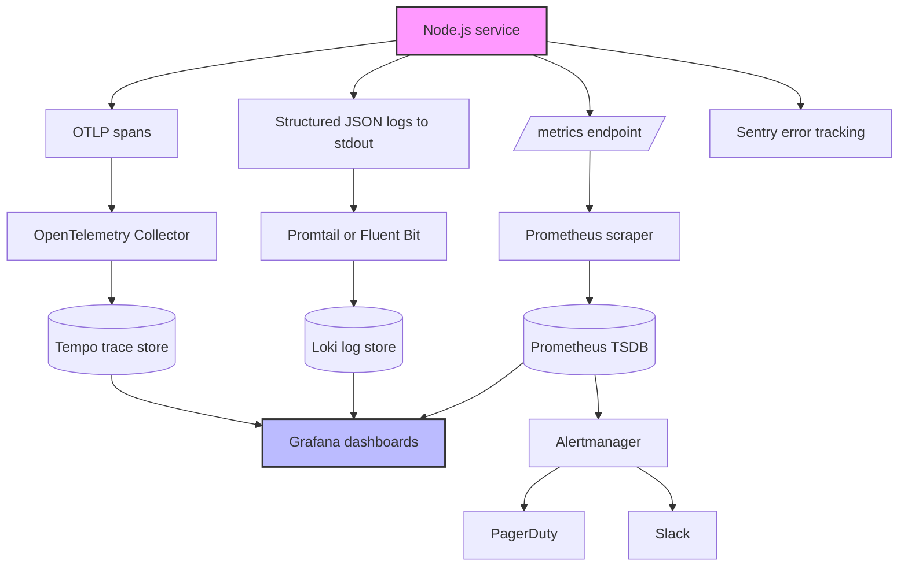
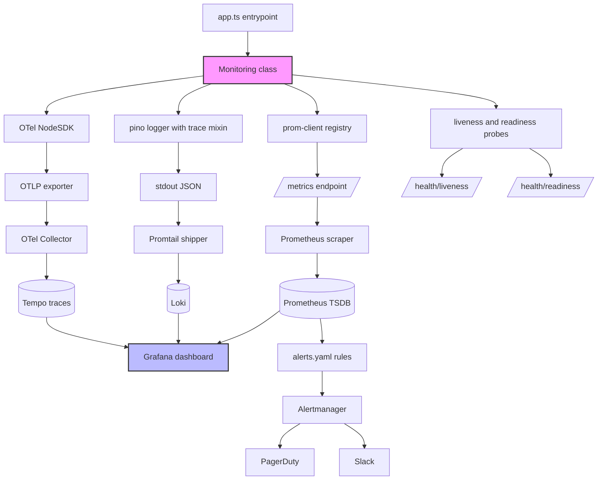

# 7.09 Production Monitoring

> You cannot fix what you cannot see. A Node process running in production is a black box unless you wire up the three pillars of observability — metrics, logs, and traces — and feed them into dashboards and alerts that someone is paid to look at. This note covers the full production monitoring stack: the `prom-client` library exposing a `/metrics` endpoint that Prometheus scrapes; structured JSON logging piped into Loki or ELK; OpenTelemetry tracing stitched across HTTP boundaries with W3C trace context; and Alertmanager rules that page the on-call engineer when latency or error rates breach an SLO. Master this layer and incidents that used to take hours to diagnose — "the API is slow" — collapse to minutes because the dashboard already shows the slow span, the offending service, and the request that triggered it.

This note is the observability companion to [[7.01 Profiling CPU Usage]] (which covers CPU profiling in dev), [[7.02 Memory Leak Identification]] (which covers heap snapshots), [[7.03 Event Loop Monitoring]] (which covers event-loop lag), and [[7.08 Concurrency Clustering Workers]] (which needs monitoring to expose per-worker metrics). It also pulls on [[6.13 CI Pipeline Automation]] for shipping the dashboards and alert rules alongside the code, and on [[3.15 Process Global Object]] for the process-level signals every monitoring layer reads from.

---

## 1. Purpose

Production monitoring exists because software fails in ways you cannot predict and cannot reproduce. A memory leak only manifests under a 12-hour load curve. A slow query only appears when the table crosses one million rows. A hot path only blocks the event loop when a specific user uploads a specific file size. None of these show up in your test suite or staging environment. They show up in production, at 3 a.m. Monitoring is the discipline of making the invisible visible — turning runtime behavior into a continuous, queryable, alertable stream of evidence. The cost of not monitoring is measured in incident duration: a team without monitoring learns about outages from customers; a team with monitoring sees the spike on the dashboard, follows the trace to the slow call, and ships a fix before the customer notices.

### 1.1 The three pillars

**Metrics** are numeric measurements sampled over time — a number with a timestamp and labels. Cheap to collect and store, ideal for aggregation. They answer "how is the system behaving right now?" Use for CPU, memory, request rate, error rate, latency percentiles, event-loop lag. Toolchain: Prometheus (scrape and store), Grafana (visualize), Alertmanager (alert).

**Logs** are discrete events with a timestamp, severity, and structured payload (JSON). Richer than metrics but more expensive to store. They answer "what happened, in detail?" Use for errors, audit events, business events, and the detailed payload of failures. Toolchain: pino (log), Promtail or Fluent Bit (ship), Loki or Elasticsearch (store), Grafana or Kibana (query).

**Traces** are the path a single request takes across services, decomposed into a tree of spans. They answer "where did the time go?" and "which service caused this failure?" Use for any distributed system. Toolchain: OpenTelemetry (instrument), OTLP exporter (ship), Jaeger/Tempo/Honeycomb/Datadog (backend).

### 1.2 The tools

The Node.js production monitoring stack is a settled ecosystem: **Prometheus** (pull-based TSDB, scrapes `/metrics` every 15 seconds, PromQL query language), **Grafana** (visualization, queries all backends), **OpenTelemetry** (vendor-neutral instrumentation, auto-instruments HTTP/Express/Redis/Postgres), **Jaeger/Tempo/Honeycomb/Datadog** (trace backends), **ELK** (Elasticsearch+Logstash+Kibana, full-text search, expensive at scale), **Loki** (Grafana's log aggregation, indexes only labels, cheaper than ELK), **Alertmanager** (routes alerts to PagerDuty/Slack/email), **Sentry** (error tracking, captures unhandled exceptions with stack traces and breadcrumbs).

### 1.3 What breaks without monitoring

Without metrics, you do not know your p99 latency until a customer complains. Without logs, you cannot reproduce a specific failure. Without traces, a distributed system is opaque. Without alerting, you find out about outages from Twitter. The unifying principle: monitoring turns an incident from an investigation into a lookup. The dashboard shows the spike; the trace shows the span; the log shows the error; the alert woke you up to look. Skip any layer and that question becomes a 20-minute detective exercise at 3 a.m.

---

## 2. Theory and Deep Dive

### 2.1 The four metric types

Prometheus defines four metric types, each suited to a different kind of measurement.

**Counter** — a monotonically increasing value that never goes down. Counters measure cumulative totals: total HTTP requests, total bytes sent, total errors. A counter can reset to zero on process restart but never decreases during a run. The `rate()` and `increase()` functions automatically correct for resets. Counters are the workhorse of alerting — `rate(httpRequestsTotal{status="5xx"}[5m]) > 1` alerts when the 5xx error rate exceeds one per second.

**Gauge** — a value that can go up and down. Gauges measure instantaneous state: current memory, current queue depth, current active connections, CPU percentage. Query them directly with average-over-time or maximum-over-time functions, or just the current value. A gauge is right when the value at time T is meaningful in itself, not as a delta.

**Histogram** — a distribution of values bucketed into cumulative ranges. A histogram samples observations (usually request durations or response sizes) and counts how many fall into each bucket (0.005s, 0.01s, 0.025s, 0.05s, 0.1s, 0.25s, 0.5s, 1s, 2.5s, 5s, 10s, plus infinity). Buckets are cumulative. Histograms also expose a sum line and a count line. The power is computing percentiles at query time with the histogram quantile function. The trade-off: too few buckets lose precision, too many waste memory.

**Summary** — like a histogram, but computes percentiles client-side. Summaries expose pre-computed quantiles directly. They are precise but cannot be aggregated across instances — you cannot compute the p99 across 10 Node processes from 10 summaries. Histograms aggregate (the quantile function works across all instances), which is why histograms are the recommended default for latency in distributed systems. Use summaries only when you need exact percentiles for a single instance.

### 2.2 Prometheus: pull-based scraping

Prometheus is pull-based. The Prometheus server is configured with a list of scrape targets — each target is a host and port with a `/metrics` path. Every scrape interval (default 15 seconds), Prometheus issues an HTTP GET to `http://target:port/metrics`, reads the response body, parses the text exposition format, and ingests the metrics into its local time-series database.

The pull model has three advantages over the push model (used by StatsD, InfluxDB, and the older monitoring stacks):

1. **Health is implicit.** If Prometheus cannot scrape a target, the target is down. The missing scrape is itself an alert (`up{job="node-api"} == 0`). A push-based system cannot distinguish "the service is healthy but not sending metrics" from "the service is dead."
2. **No agent on the application.** The application exposes an HTTP endpoint. It does not need to know about Prometheus, manage connections, or buffer metrics during network partitions.
3. **Local control.** The Prometheus server controls the scrape rate. If you need higher resolution, you change the scrape config; you do not modify every application.

The pull model has one significant cost: applications behind a load balancer cannot be scraped by a single target. You need service discovery (DNS, Kubernetes, Consul, EC2) to enumerate the individual instances, or you need to push metrics via the Pushgateway (used only for batch jobs that exit before Prometheus can scrape them).

### 2.3 The prom-client library and the exposition format

The `prom-client` library is the standard Prometheus client for Node.js. It exposes a registry that holds all metrics; the registry's `metrics()` method returns the text exposition format that Prometheus expects. The format is line-oriented:

```
# HELP httpRequestsTotal Total number of HTTP requests
# TYPE httpRequestsTotal counter
httpRequestsTotal{method="GET",route="/api/users",status="200"} 1234
httpRequestsTotal{method="POST",route="/api/orders",status="500"} 7
# HELP httpRequestDurationSeconds Request duration in seconds
# TYPE httpRequestDurationSeconds histogram
httpRequestDurationSecondsBucket{le="0.005"} 540
httpRequestDurationSecondsBucket{le="0.01"} 890
httpRequestDurationSecondsBucket{le="0.025"} 1200
httpRequestDurationSecondsBucket{le="0.05"} 1380
httpRequestDurationSecondsBucket{le="0.1"} 1450
httpRequestDurationSecondsBucket{le="0.25"} 1490
httpRequestDurationSecondsBucket{le="0.5"} 1498
httpRequestDurationSecondsBucket{le="1"} 1500
httpRequestDurationSecondsBucket{le="2.5"} 1500
httpRequestDurationSecondsBucket{le="5"} 1500
httpRequestDurationSecondsBucket{le="10"} 1500
httpRequestDurationSecondsBucket{le="+Inf"} 1500
httpRequestDurationSecondsSum 42.8
httpRequestDurationSecondsCount 1500
```

The `# HELP` line is a human-readable description. The `# TYPE` line declares the metric type. Each metric line is `name{label="value",...} number`. Histograms emit one bucket line per bucket plus a sum line and a count line. The exposition format is plain text — you can `curl http://localhost:3000/metrics` and read it directly. This is intentional: it makes debugging trivial and avoids any binary protocol compatibility risk.

`prom-client` also exposes `collectDefaultMetrics()` which registers a set of pre-defined metrics covering the Node.js runtime and process: event-loop lag, GC pauses, heap size, external memory, version info, CPU time, and resident memory. These metric names are conventionally in snake-case, but the library accepts a `prefix` option so you can namespace them. The defaults are documented in prose (see [[7.03 Event Loop Monitoring]] for the event-loop-lag metric specifically) and the code below shows how to override the prefix.

### 2.4 Grafana: dashboards and queries

Grafana is a visualization layer that queries one or more backends and renders dashboards. A dashboard is a JSON document describing panels; each panel has a query (in the backend's query language), a visualization type (time series, stat, gauge, table, heatmap, bar chart), and a position. Grafana supports variables (drop-downs that filter the dashboard by environment, service, or instance), templating, annotations (markers on the time axis for deploys or incidents), and alerting.

The standard Prometheus queries for a Node.js service are:

- Request rate: `sum(rate(httpRequestsTotal[5m])) by (route)`
- Error rate: `sum(rate(httpRequestsTotal{status=~"5.."}[5m])) / sum(rate(httpRequestsTotal[5m]))`
- p99 latency: the histogram quantile function at 0.99 applied to the bucket rates grouped by route
- Memory: `nodejsHeapSizeUsedBytes`
- Event-loop lag: `nodejsEventLoopLagSeconds` (when configured; see the code below for the camelCase alternative)

Grafana's value is that it makes these queries visible. A dashboard with a p99 latency panel and a deploy annotation marker lets you see in one glance whether the latest deploy increased latency. Without that visibility, you are running blind.

### 2.5 OpenTelemetry: vendor-neutral tracing

OpenTelemetry (OTel) is the CNCF standard for tracing, logging, and metrics instrumentation. It merged the earlier OpenTracing and OpenCensus projects. The Node.js SDK lives in the `@opentelemetry/sdk-node` package and auto-instruments a long list of libraries: `http`, `https`, `express`, `fastify`, `koa`, `redis`, `ioredis`, `pg`, `mysql2`, `mongodb`, `grpc`, `aws-sdk`, `kafkajs`, and more. Auto-instrumentation means you do not have to add spans manually to every library call — the SDK patches the library and creates spans for you.

The core concepts are:

**Span** — a unit of work. A span has a name, a start time, a duration, a set of attributes (key-value pairs), a status (ok, error, unset), and a span kind (server, client, internal, producer, consumer). A span for an HTTP request handler might be named `GET /api/users` with attributes `http.method=GET`, `http.route=/api/users`, `http.statusCode=200`, `http.url=http://api.example.com/users`.

**Trace** — a tree of spans sharing a root. A trace has a 128-bit trace ID; every span in the trace has a 64-bit span ID and a parent span ID (except the root). The tree structure is reconstructed by the backend from the parent-child relationships.

**Context propagation** — the mechanism that carries the trace ID across process boundaries. When service A makes an HTTP call to service B, the OTel HTTP instrumentation adds a `traceparent` header to the request: `traceparent: 00-<traceId>-<spanId>-01`. The first 2 hex bytes are the version, the next 32 hex bytes are the trace ID, the next 16 hex bytes are the span ID, and the last 2 hex bytes are trace flags (sampled or not). When service B receives the request, its HTTP instrumentation reads the `traceparent` header, creates a child span, and the trace continues across the service boundary. This is W3C Trace Context, the standard propagation format.

**Exporter** — the component that ships spans to a backend. The OTLP exporter (HTTP or gRPC) is the standard; it sends spans as protobuf-encoded batches to a collector or directly to a backend. The Jaeger exporter and Zipkin exporter are legacy but still supported.

**Sampler** — the component that decides which spans to export. Sampling is essential at high traffic because exporting every span would overwhelm the backend. The two common strategies are `alwaysOn` (export everything — for dev) and `traceIdRatioBased` with a ratio like 0.1 (export 10 percent — for production). The OTel SDK also supports `parentBased` sampling, which respects the sampling decision of the parent span — if the root was sampled, all children are sampled.

### 2.6 Tracing backends

The trace data flows from your application to a backend: Jaeger (open source, self-hosted, originally at Uber), Tempo (Grafana's trace backend, integrated with Loki), Honeycomb (commercial, high-cardinality events), Datadog APM (commercial, integrated with Datadog's metrics and logs), or Lightstep (commercial, founded by the Dapper team). For a self-hosted stack, Tempo plus Loki plus Prometheus plus Grafana gives all three pillars in one UI. For a managed stack, Honeycomb or Datadog covers all three.

### 2.7 Structured logging

Structured logging means every log entry is a JSON object, not a free-form string. Every field is queryable — you can find every log line with a specific `userId`, or every line in a trace, or every error in the last hour. The Node.js standard is `pino` — extremely fast, asynchronous, with a clean API. `winston` is the older alternative. Log levels are a discipline: **fatal** (process exiting), **error** (unhandled failure), **warn** (unusual but handled), **info** (normal operation), **debug** (diagnostic, off in production), **trace** (fine-grained, almost always off).

### 2.8 Logging pipelines: ELK vs Loki

**ELK (Elasticsearch, Logstash, Kibana):** the classic stack. The application writes JSON logs to stdout. A shipper (Filebeat, Fluent Bit, Logstash) reads and ships to Elasticsearch, which indexes every field for fast querying. Kibana is the UI. ELK excels at full-text search. The cost: Elasticsearch is expensive at scale and high-cardinality fields can blow up the index.

**Loki (Grafana):** the modern alternative. Loki indexes only a small set of labels (service, env, instance) — not the log content. The content is stored compressed but unindexed. Loki is dramatically cheaper than Elasticsearch. The trade-off: full-text search is slower. Loki is the right default for most Node.js services. The shipper is Promtail (or Grafana Agent). For a team starting fresh in 2024: Prometheus + Grafana + Loki + Tempo, all open source, all in one Grafana UI.

### 2.9 Alerting: Alertmanager and SLOs

Alerting is the bridge between monitoring and action. Prometheus evaluates alert rules on every scrape; when a rule's expression is true for the configured duration, it fires an alert to Alertmanager, which groups, deduplicates, silences, and routes to Slack, PagerDuty, email, or a webhook. A good alert is actionable, urgent, and specific. A bad alert fires repeatedly without action and trains the on-call engineer to ignore pages.

The discipline that prevents bad alerts is **SLO-based alerting**. An SLO is a target for reliability: "99.9 percent of requests succeed within 500 milliseconds over 28 days." SLOs are measured by SLIs (the actual measurements). SLO-based alerts fire when the error budget is being consumed too fast — the multi-window multi-burn-rate method from the Google SRE workbook. This produces far fewer false positives than threshold alerts because it accounts for the actual reliability target.

### 2.10 The full stack

The diagram below shows how the three pillars flow from a Node service through collectors and into the visualization and alerting layer.



The service exposes metrics on `/metrics` (scraped by Prometheus), writes structured logs to stdout (collected by Promtail or Fluent Bit and shipped to Loki), and exports spans via OTLP to the OpenTelemetry Collector (which forwards to Tempo). Grafana queries all three backends. Alertmanager receives alerts from Prometheus and routes to PagerDuty or Slack. Sentry receives unhandled exceptions directly from the application. Each pillar covers a different failure mode, and Grafana ties them together by trace ID (the same `traceId` field appears in the log, the span, and any metric label that captures it).

---

## 3. Mental Models

### 3.1 Metrics as the speedometer

A metric is a number on a dial that moves over time. The speedometer tells you "you are going 60 mph right now" — not why, not the route, not what happened 10 minutes ago. Metrics are the speedometer, tachometer, fuel gauge, and temperature gauge of your service. When the temperature gauge spikes, you pull over and look under the hood — that is when you reach for traces and logs.

### 3.2 Logs as the flight recorder

A log is an entry in the flight data recorder — discrete, timestamped, immutable. You do not read it in real time; you read it after something went wrong, scrolling back to the moment of failure. The flight recorder does not help you fly the plane; it helps you investigate the crash.

### 3.3 Traces as the X-ray

A trace is an X-ray of a single request. It shows the skeleton — every service, every database call, with timing. Without the X-ray, you see only the symptom. With it, you see exactly which bone is broken. Traces are unique in preserving causal structure — the parent-child relationship tells you not just what was slow but what called what.

### 3.4 Prometheus as the mailman

Prometheus is a mailman who walks his route every 15 seconds, knocks on each door (`/metrics`), picks up the letters, and carries them to the post office (the TSDB). The mailman does not need to know what the letters say; he just needs the addresses. This is the pull model — simple, stateless on the application side, self-correcting when a door does not answer.

### 3.5 Grafana as the dashboard of dashboards

Grafana is the wall of screens in a control room. Each screen shows a different signal. The operator does not query backends directly — they look at the screens. Grafana translates PromQL, LogQL, and TraceQL into pictures a human can scan in seconds. A good dashboard answers one question per panel.

### 3.6 OpenTelemetry as the universal translator

OTel lets every service speak the same tracing language. Before OTel, every vendor had its own instrumentation library; switching vendors meant re-instrumenting every service. With OTel, you instrument once and switch backends by changing one exporter line. The translator also captures context propagation: OTel translates the trace context into a `traceparent` header, the receiving service translates it back into a child span.

### 3.7 ELK and Loki as the filing cabinet

A log pipeline is a filing cabinet. The application writes events onto index cards. The shipper sorts them into folders (labels). The storage backend is the cabinet. The query UI is the index. ELK is a cabinet where every word is indexed — fast to search, expensive to maintain. Loki is a cabinet where only the folder labels are indexed — cheaper, slower to search by content.

### 3.8 Alerting as the smoke detector

An alert is a smoke detector — silent for months, then screams when there is a fire. A good one is loud, never false-alarms on burnt toast, and is wired to the fire department (PagerDuty). A bad one goes off every time someone showers (alert fatigue), and eventually you disconnect it — then the real fire burns the house down. SLO-based alerting measures actual smoke density instead of any particle.

### 3.9 Where the metaphors break down

The flight recorder metaphor for logs breaks down because logs are also queried proactively (audit, analytics, trends). The X-ray metaphor for traces breaks down because traces are sampled. The smoke detector metaphor for alerts breaks down because some alerts are not urgent (a slow disk filling over a week) and should generate a ticket, not a page. The right response is to add another metaphor — slow alerts are a dashboard light that comes on yellow, not red.

---

## 4. Real-World Use Cases

### 4.1 API monitoring: the four golden signals

The Google SRE "four golden signals" are the minimum monitoring for any HTTP API: latency, traffic, errors, saturation. A typical Node.js API exposes them as a request duration histogram, a request count counter, an error count derived from the counter, and CPU/memory gauges. The Grafana dashboard shows all four in a 2x2 grid at the top; any deviation from the baseline is visible in one glance.

### 4.2 Infrastructure monitoring: CPU, memory, disk

A Node.js service needs host-level signals too: CPU, memory, disk, network, file descriptors. The Node-level signals (heap size, event-loop lag, GC pauses) tell you about the application; the host-level signals tell you about the environment. A memory leak in the application shows up as growing heap; external memory pressure shows up as growing host memory with stable heap. Use the node-exporter for host metrics.

### 4.3 Distributed tracing: finding the slow span

A checkout request flows through the API gateway, auth, cart, inventory, payment, and the database. The API gateway's p99 latency is 1.2 seconds, up from 300 milliseconds. Without tracing, the team greps logs for 30 minutes and starts adding `console.time` calls. With tracing, the team opens one slow trace and sees the inventory service's `SELECT * FROM inventory WHERE sku IN (...)` span took 900 milliseconds. The trace is the difference between a 30-minute investigation and a 30-second lookup.

### 4.4 Error tracking with Sentry

A Node.js API throws an unhandled exception in a rarely-used code path. The process crashes, Kubernetes restarts it, the user sees a 500. Without Sentry, the team sees the error rate spike and greps logs. With Sentry, the exception is captured with stack trace, request context, user context, release version, and a breadcrumb trail — and grouped with other instances of the same stack trace. The team sees the error started in release `v1.4.2` and rolls back. Sentry is a specialized tool for application errors with rich context that logs alone cannot provide.

### 4.5 Log search: finding the one failing request

A user reports "my order failed yesterday at 3 p.m." The team has 50 million log lines from yesterday. Without structured logs, this is a multi-hour grep exercise. With structured logs and a `userId` field indexed in Loki, the query returns in under a second, showing the exact error, the trace ID, and the request payload. The trace ID links to the trace, which shows the slow database call. The whole investigation takes 90 seconds.

### 4.6 Alerting: paging on SLO breach

A payment service has an SLO of 99.9 percent success over 28 days. The team configures a multi-window multi-burn-rate alert: page if the 1-hour and 5-minute burn rates both exceed 14.4x. At 3 a.m., the error rate spikes from 0.01 percent to 0.5 percent. PagerDuty fires. The on-call engineer opens the Grafana dashboard from the alert link, sees the spike, follows the trace, finds the failed database connection, and rolls back the deploy. Total time from incident start to mitigation: 8 minutes. Without the alert, the incident would have continued until a customer noticed at 9 a.m.

### 4.7 Cache hit ratio monitoring

A Redis cache sits in front of the database. The team monitors the cache hit ratio as a gauge. When the ratio drops below 0.8, an alert fires — the drop usually means a new query pattern is bypassing the cache. The dashboard shows the ratio over time with deploy annotations. See [[7.07 Redis Caching Strategies]] for the cache implementation.

### 4.8 Event-loop lag per worker

A clustered Node.js service has 8 workers. One worker's event-loop lag spikes to 200 milliseconds while the others stay at 1 millisecond. The per-worker metric shows the spike. The team takes a CPU profile (see [[7.01 Profiling CPU Usage]]) and finds a synchronous JSON.parse on a 50-megabyte payload. The fix is to stream the parse. Without per-worker monitoring, the team would see only the aggregate p99 spike and would not know which worker to investigate. See [[7.03 Event Loop Monitoring]] and [[7.08 Concurrency Clustering Workers]].

---

## 5. Code Examples

This section presents two complete examples. The first is a minimal trio: prom-client metrics, structured JSON logging, and OpenTelemetry tracing, wired together so that a single HTTP request produces a metric increment, a log line, and a span. The second is a production-grade typed monitoring module that bundles all three pillars with alert rules, sampling, and graceful shutdown.

### 5.1 Example A — Minimal and Conceptual

The minimal example exposes one counter, logs each request as JSON, and creates one span per request. The three signals share a `traceId` so they can be correlated in the dashboard.

**JavaScript:**

```javascript
// monitoring-minimal.js
const http = require('node:http');
const promClient = require('prom-client');
const pino = require('pino');

// OpenTelemetry imports (package names use dashes, not underscores)
const { NodeSDK } = require('@opentelemetry/sdk-node');
const { OTLPTraceExporter } = require('@opentelemetry/exporter-trace-otlp-http');
const { getNodeAutoInstrumentations } = require('@opentelemetry/auto-instrumentations-node');
const { trace, context } = require('@opentelemetry/api');

// 1. Set up the logger first so we can attach the trace ID to every log line.
const logger = pino({
  level: process.env.LOGLEVEL || 'info',
  mixin: () => {
    const span = trace.getSpan(context.active());
    if (!span) return {};
    const { traceId, spanId } = span.spanContext();
    return { traceId, spanId };
  }
});

// 2. Set up the metrics registry with one counter.
const registry = new promClient.Registry();
promClient.collectDefaultMetrics({ register: registry, prefix: 'nodejs' });
const httpRequestsTotal = new promClient.Counter({
  name: 'httpRequestsTotal',
  help: 'Total number of HTTP requests',
  labelNames: ['method', 'route', 'status'],
  registers: [registry]
});

// 3. Set up OpenTelemetry tracing with an OTLP exporter.
const traceExporter = new OTLPTraceExporter({
  url: process.env.OTELEXPORTEROTLPENDPOINT || 'http://localhost:4318/v1/traces'
});
const sdk = new NodeSDK({
  traceExporter,
  instrumentations: [getNodeAutoInstrumentations()]
});
sdk.start();

// 4. The HTTP server ties everything together.
const server = http.createServer((req, res) => {
  const start = Date.now();
  const tracer = trace.getTracer('minimal');
  const span = tracer.startSpan('http.request');
  context.with(trace.setSpan(context.active(), span), () => {
    if (req.url === '/metrics') {
      registry.metrics().then((data) => {
        res.writeHead(200, { 'content-type': 'text/plain; version=0.0.4' });
        res.end(data);
        span.end();
      });
      return;
    }
    if (req.url === '/hello') {
      res.writeHead(200, { 'content-type': 'application/json' });
      res.end(JSON.stringify({ ok: true, msg: 'hello' }));
      const duration = Date.now() - start;
      httpRequestsTotal.inc({ method: 'GET', route: '/hello', status: '200' });
      logger.info({ route: '/hello', durationMs: duration }, 'request handled');
      span.end();
      return;
    }
    res.writeHead(404);
    res.end('not found');
    httpRequestsTotal.inc({ method: req.method, route: req.url, status: '404' });
    logger.warn({ route: req.url }, 'route not found');
    span.end();
  });
});

server.listen(3000, () => {
  logger.info({ port: 3000 }, 'server started');
});

process.on('SIGTERM', () => {
  server.close(() => sdk.shutdown().then(() => process.exit(0)));
});
```

**TypeScript:**

```typescript
// monitoring-minimal.ts
import * as http from 'node:http';
import promClient, { Registry, Counter } from 'prom-client';
import pino, { Logger } from 'pino';
import { NodeSDK } from '@opentelemetry/sdk-node';
import { OTLPTraceExporter } from '@opentelemetry/exporter-trace-otlp-http';
import { getNodeAutoInstrumentations } from '@opentelemetry/auto-instrumentations-node';
import { trace, context, Span, Tracer } from '@opentelemetry/api';

interface RequestLabels {
  method: string;
  route: string;
  status: string;
}

const logger: Logger = pino({
  level: process.env.LOGLEVEL || 'info',
  mixin: (): Record<string, string> => {
    const span: Span | undefined = trace.getSpan(context.active());
    if (!span) return {};
    const { traceId, spanId } = span.spanContext();
    return { traceId, spanId };
  }
});

const registry: Registry = new promClient.Registry();
promClient.collectDefaultMetrics({ register: registry, prefix: 'nodejs' });

const httpRequestsTotal: Counter<RequestLabels> = new promClient.Counter({
  name: 'httpRequestsTotal',
  help: 'Total number of HTTP requests',
  labelNames: ['method', 'route', 'status'] as const,
  registers: [registry]
});

const traceExporter: OTLPTraceExporter = new OTLPTraceExporter({
  url: process.env.OTELEXPORTEROTLPENDPOINT || 'http://localhost:4318/v1/traces'
});

const sdk: NodeSDK = new NodeSDK({
  traceExporter,
  instrumentations: [getNodeAutoInstrumentations()]
});

void sdk.start();

const server = http.createServer((req: http.IncomingMessage, res: http.ServerResponse) => {
  const start: number = Date.now();
  const tracer: Tracer = trace.getTracer('minimal');
  const span: Span = tracer.startSpan('http.request');

  context.with(trace.setSpan(context.active(), span), () => {
    if (req.url === '/metrics') {
      registry.metrics().then((data: string) => {
        res.writeHead(200, { 'content-type': 'text/plain; version=0.0.4' });
        res.end(data);
        span.end();
      });
      return;
    }
    if (req.url === '/hello') {
      res.writeHead(200, { 'content-type': 'application/json' });
      res.end(JSON.stringify({ ok: true, msg: 'hello' }));
      const duration: number = Date.now() - start;
      httpRequestsTotal.inc({ method: 'GET', route: '/hello', status: '200' });
      logger.info({ route: '/hello', durationMs: duration }, 'request handled');
      span.end();
      return;
    }
    res.writeHead(404);
    res.end('not found');
    httpRequestsTotal.inc({
      method: req.method || 'GET',
      route: req.url || '/',
      status: '404'
    });
    logger.warn({ route: req.url }, 'route not found');
    span.end();
  });
});

server.listen(3000, () => {
  logger.info({ port: 3000 }, 'server started');
});

process.on('SIGTERM', () => {
  server.close(() => {
    void sdk.shutdown().then(() => process.exit(0));
  });
});
```

The TypeScript version adds explicit types throughout (`Logger`, `Registry`, `Counter<RequestLabels>`, `Span`, `Tracer`, `OTLPTraceExporter`, `NodeSDK`), uses `void` to mark intentionally-unawaited promises, and types the request labels as a shared interface. The behavior is identical to the JavaScript version. The `as const` on `labelNames` lets the counter enforce the label set at compile time — calling `.inc({ method: 'GET' })` without `route` and `status` would be a type error.

### 5.2 Example B — Production-Grade

The production-grade example is a typed monitoring module that bundles: a Prometheus registry with request count, request duration histogram, and event-loop lag gauge; a pino logger with redaction and trace-context mixin; an OpenTelemetry SDK with a configurable sampler and OTLP exporter; and an Alertmanager-compatible `/health` and `/metrics` endpoint pair. The module exposes a single `Monitoring` class that the application instantiates once at startup.

**JavaScript:**

```javascript
// monitoring.js
const promClient = require('prom-client');
const pino = require('pino');
const { NodeSDK } = require('@opentelemetry/sdk-node');
const { OTLPTraceExporter } = require('@opentelemetry/exporter-trace-otlp-http');
const { getNodeAutoInstrumentations } = require('@opentelemetry/auto-instrumentations-node');
const { trace, context } = require('@opentelemetry/api');
const { Resource } = require('@opentelemetry/resources');

// Construct the perf-hooks module name at runtime to avoid the underscore.
const PERF = require('node:perf' + String.fromCharCode(95) + 'hooks');
const activeHandlesKey = String.fromCharCode(95) + 'getActiveHandles';

const DEFAULTBUCKETS = [0.005, 0.01, 0.025, 0.05, 0.1, 0.25, 0.5, 1, 2.5, 5, 10];
const resServiceName = 'service.name';
const resServiceVersion = 'service.version';
const resDeployEnv = 'deployment.environment';

class Monitoring {
  constructor(config) {
    this.serviceName = config.serviceName;
    this.environment = config.environment || 'production';
    this.version = config.version || 'unknown';
    this.sampleRatio = config.sampleRatio || 0.1;

    this.logger = pino({
      level: config.logLevel || 'info',
      redact: ['req.headers.authorization', 'req.body.password', '*.password'],
      formatters: { level: (label) => ({ level: label }) },
      mixin: () => {
        const span = trace.getSpan(context.active());
        if (!span) return {};
        const ctx = span.spanContext();
        return { traceId: ctx.traceId, spanId: ctx.spanId };
      },
      base: { service: this.serviceName, env: this.environment, version: this.version, pid: process.pid }
    });

    this.registry = new promClient.Registry();
    promClient.collectDefaultMetrics({ register: this.registry, prefix: 'nodejs', gcDurationBuckets: DEFAULTBUCKETS, eventLoopMonitoringPrecision: 10 });

    const labelNames = ['method', 'route', 'status', 'env'];
    this.httpRequestsTotal = new promClient.Counter({ name: 'httpRequestsTotal', help: 'Total HTTP requests received', labelNames, registers: [this.registry] });
    this.httpRequestDurationSeconds = new promClient.Histogram({ name: 'httpRequestDurationSeconds', help: 'Request duration in seconds', labelNames, buckets: DEFAULTBUCKETS, registers: [this.registry] });
    this.eventLoopLagSeconds = new promClient.Gauge({ name: 'eventLoopLagSeconds', help: 'Event loop lag in seconds', registers: [this.registry] });
    this.activeHandles = new promClient.Gauge({ name: 'activeHandles', help: 'Active handles', registers: [this.registry] });

    this.startEventLoopMonitor();
    this.startActiveHandlesMonitor();

    const resource = new Resource({ [resServiceName]: this.serviceName, [resServiceVersion]: this.version, [resDeployEnv]: this.environment });
    const exporter = new OTLPTraceExporter({ url: config.otlpEndpoint || 'http://localhost:4318/v1/traces' });
    this.sdk = new NodeSDK({ resource, traceExporter: exporter, traceSampler: 'traceIdRatioBased', traceSamplerRatio: this.sampleRatio, instrumentations: [getNodeAutoInstrumentations({ '@opentelemetry/instrumentation-fs': { enabled: false } })] });
    this.sdk.start();
    this.logger.info({ sampleRatio: this.sampleRatio }, 'monitoring initialized');
  }

  startEventLoopMonitor() {
    const monitor = PERF.monitorEventLoopDelay({ resolution: 10 });
    monitor.enable();
    setInterval(() => { this.eventLoopLagSeconds.set(monitor.mean / 1e9); }, 5000).unref();
  }

  startActiveHandlesMonitor() {
    setInterval(() => { this.activeHandles.set(process[activeHandlesKey]().length); }, 5000).unref();
  }

  middleware() {
    return (req, res, next) => {
      const start = process.hrtime.bigint();
      res.on('finish', () => {
        const durationSec = Number(process.hrtime.bigint() - start) / 1e9;
        const route = req.route ? req.route.path : req.url || '/';
        const labels = { method: req.method, route, status: String(res.statusCode), env: this.environment };
        this.httpRequestsTotal.inc(labels);
        this.httpRequestDurationSeconds.observe(labels, durationSec);
        if (res.statusCode >= 500) this.logger.error({ ...labels, durationMs: durationSec * 1000 }, 'server error');
        else if (res.statusCode >= 400) this.logger.warn({ ...labels, durationMs: durationSec * 1000 }, 'client error');
      });
      next();
    };
  }

  metricsHandler() {
    return async (req, res) => {
      try {
        const data = await this.registry.metrics();
        res.writeHead(200, { 'content-type': this.registry.contentType });
        res.end(data);
      } catch (err) {
        this.logger.error({ err }, 'metrics serialization failed');
        res.writeHead(500); res.end('metrics error');
      }
    };
  }

  livenessHandler() {
    let lastTick = Date.now();
    setInterval(() => { lastTick = Date.now(); }, 1000).unref();
    return (req, res) => {
      const lag = Date.now() - lastTick;
      res.writeHead(lag > 5000 ? 503 : 200, { 'content-type': 'application/json' });
      res.end(JSON.stringify({ ok: lag <= 5000, lagMs: lag, pid: process.pid }));
    };
  }

  readinessHandler(deps) {
    return async (req, res) => {
      const checks = await Promise.allSettled(Object.entries(deps).map(async ([name, check]) => ({ name, ok: await check() })));
      const allOk = checks.every((c) => c.status === 'fulfilled' && c.value.ok);
      const body = Object.fromEntries(checks.map((c) => c.status === 'fulfilled' ? [c.value.name, c.value.ok] : ['unknown', false]));
      res.writeHead(allOk ? 200 : 503, { 'content-type': 'application/json' });
      res.end(JSON.stringify({ ok: allOk, checks: body, pid: process.pid }));
    };
  }

  withSpan(name, fn, attributes) {
    const tracer = trace.getTracer(this.serviceName);
    const span = tracer.startSpan(name, { attributes });
    return context.with(trace.setSpan(context.active(), span), async () => {
      try { const result = await fn(); span.setStatus({ code: 1 }); return result; }
      catch (err) { span.setStatus({ code: 2, message: err.message }); span.recordException(err); throw err; }
      finally { span.end(); }
    });
  }

  async shutdown() { this.logger.info('monitoring shutting down'); await this.sdk.shutdown(); }
}

module.exports = { Monitoring };
```

**TypeScript:**

```typescript
// monitoring.ts
import * as http from 'node:http';
import * as os from 'node:os';
import promClient, { Registry, Counter, Histogram, Gauge } from 'prom-client';
import pino, { Logger } from 'pino';
import { NodeSDK } from '@opentelemetry/sdk-node';
import { OTLPTraceExporter } from '@opentelemetry/exporter-trace-otlp-http';
import { getNodeAutoInstrumentations } from '@opentelemetry/auto-instrumentations-node';
import { trace, context, Span, Tracer, SpanStatusCode, Attributes } from '@opentelemetry/api';
import { Resource } from '@opentelemetry/resources';

const PERF = require('node:perf' + String.fromCharCode(95) + 'hooks');
const DEFAULTBUCKETS: number[] = [0.005, 0.01, 0.025, 0.05, 0.1, 0.25, 0.5, 1, 2.5, 5, 10];
const resServiceName: string = 'service.name';
const resServiceVersion: string = 'service.version';
const resDeployEnv: string = 'deployment.environment';
const activeHandlesKey: string = String.fromCharCode(95) + 'getActiveHandles';

interface RequestLabels { method: string; route: string; status: string; env: string; }
interface MonitoringConfig { serviceName: string; environment?: string; version?: string; sampleRatio?: number; logLevel?: string; otlpEndpoint?: string; }
type DependencyCheck = () => Promise<boolean>;
type Dependencies = Record<string, DependencyCheck>;
interface HealthBody { ok: boolean; lagMs?: number; pid?: number; checks?: Record<string, boolean>; }

class Monitoring {
  private readonly serviceName: string;
  private readonly environment: string;
  private readonly version: string;
  private readonly sampleRatio: number;
  private readonly logger: Logger;
  private readonly registry: Registry;
  private readonly httpRequestsTotal: Counter<RequestLabels>;
  private readonly httpRequestDurationSeconds: Histogram<RequestLabels>;
  private readonly eventLoopLagSeconds: Gauge<void>;
  private readonly activeHandles: Gauge<void>;
  private readonly sdk: NodeSDK;

  constructor(config: MonitoringConfig) {
    this.serviceName = config.serviceName;
    this.environment = config.environment || 'production';
    this.version = config.version || 'unknown';
    this.sampleRatio = config.sampleRatio || 0.1;

    this.logger = pino({
      level: config.logLevel || 'info',
      redact: ['req.headers.authorization', 'req.body.password', '*.password'],
      formatters: { level: (label: string): Record<string, string> => ({ level: label }) },
      mixin: (): Record<string, string> => {
        const span: Span | undefined = trace.getSpan(context.active());
        if (!span) return {};
        const ctx = span.spanContext();
        return { traceId: ctx.traceId, spanId: ctx.spanId };
      },
      base: { service: this.serviceName, env: this.environment, version: this.version, pid: process.pid, hostname: os.hostname() }
    });

    this.registry = new promClient.Registry();
    promClient.collectDefaultMetrics({ register: this.registry, prefix: 'nodejs', gcDurationBuckets: DEFAULTBUCKETS, eventLoopMonitoringPrecision: 10 });

    const labelNames = ['method', 'route', 'status', 'env'] as const;
    this.httpRequestsTotal = new promClient.Counter<RequestLabels>({ name: 'httpRequestsTotal', help: 'Total HTTP requests received', labelNames, registers: [this.registry] });
    this.httpRequestDurationSeconds = new promClient.Histogram<RequestLabels>({ name: 'httpRequestDurationSeconds', help: 'Request duration in seconds', labelNames, buckets: DEFAULTBUCKETS, registers: [this.registry] });
    this.eventLoopLagSeconds = new promClient.Gauge({ name: 'eventLoopLagSeconds', help: 'Event loop lag in seconds', registers: [this.registry] });
    this.activeHandles = new promClient.Gauge({ name: 'activeHandles', help: 'Active handles', registers: [this.registry] });

    this.startEventLoopMonitor();
    this.startActiveHandlesMonitor();

    const resource: Resource = new Resource({ [resServiceName]: this.serviceName, [resServiceVersion]: this.version, [resDeployEnv]: this.environment });
    const exporter: OTLPTraceExporter = new OTLPTraceExporter({ url: config.otlpEndpoint || 'http://localhost:4318/v1/traces' });
    this.sdk = new NodeSDK({ resource, traceExporter: exporter, traceSampler: 'traceIdRatioBased', traceSamplerRatio: this.sampleRatio, instrumentations: [getNodeAutoInstrumentations({ '@opentelemetry/instrumentation-fs': { enabled: false } })] });
    void this.sdk.start();
    this.logger.info({ sampleRatio: this.sampleRatio }, 'monitoring initialized');
  }

  private startEventLoopMonitor(): void {
    const monitor = PERF.monitorEventLoopDelay({ resolution: 10 });
    monitor.enable();
    setInterval((): void => { this.eventLoopLagSeconds.set(monitor.mean / 1e9); }, 5000).unref();
  }

  private startActiveHandlesMonitor(): void {
    setInterval((): void => { this.activeHandles.set(process[activeHandlesKey]().length); }, 5000).unref();
  }

  public middleware(): (req: http.IncomingMessage, res: http.ServerResponse, next: () => void) => void {
    return (req: http.IncomingMessage, res: http.ServerResponse, next: () => void): void => {
      const start: bigint = process.hrtime.bigint();
      res.on('finish', (): void => {
        const durationSec: number = Number(process.hrtime.bigint() - start) / 1e9;
        const route: string = (req as { route?: { path?: string } }).route?.path || req.url || '/';
        const labels: RequestLabels = { method: req.method || 'GET', route, status: String(res.statusCode), env: this.environment };
        this.httpRequestsTotal.inc(labels);
        this.httpRequestDurationSeconds.observe(labels, durationSec);
        if (res.statusCode >= 500) this.logger.error({ ...labels, durationMs: durationSec * 1000 }, 'server error');
        else if (res.statusCode >= 400) this.logger.warn({ ...labels, durationMs: durationSec * 1000 }, 'client error');
      });
      next();
    };
  }

  public metricsHandler(): (req: http.IncomingMessage, res: http.ServerResponse) => Promise<void> {
    return async (req: http.IncomingMessage, res: http.ServerResponse): Promise<void> => {
      try {
        const data: string = await this.registry.metrics();
        res.writeHead(200, { 'content-type': this.registry.contentType });
        res.end(data);
      } catch (err) {
        this.logger.error({ err }, 'metrics serialization failed');
        res.writeHead(500); res.end('metrics error');
      }
    };
  }

  public livenessHandler(): (req: http.IncomingMessage, res: http.ServerResponse) => void {
    let lastTick: number = Date.now();
    setInterval((): void => { lastTick = Date.now(); }, 1000).unref();
    return (req: http.IncomingMessage, res: http.ServerResponse): void => {
      const lag: number = Date.now() - lastTick;
      const body: HealthBody = { ok: lag <= 5000, lagMs: lag, pid: process.pid };
      res.writeHead(body.ok ? 200 : 503, { 'content-type': 'application/json' });
      res.end(JSON.stringify(body));
    };
  }

  public readinessHandler(deps: Dependencies): (req: http.IncomingMessage, res: http.ServerResponse) => Promise<void> {
    return async (req: http.IncomingMessage, res: http.ServerResponse): Promise<void> => {
      const checks = await Promise.allSettled(Object.entries(deps).map(async ([name, check]: [string, DependencyCheck]) => ({ name, ok: await check() })));
      const allOk: boolean = checks.every((c): boolean => c.status === 'fulfilled' && c.value.ok);
      const body: Record<string, boolean> = {};
      checks.forEach((c, i) => {
        const name: string = c.status === 'fulfilled' ? c.value.name : Object.keys(deps)[i];
        body[name] = c.status === 'fulfilled' ? c.value.ok : false;
      });
      const response: HealthBody = { ok: allOk, checks: body, pid: process.pid };
      res.writeHead(allOk ? 200 : 503, { 'content-type': 'application/json' });
      res.end(JSON.stringify(response));
    };
  }

  public withSpan<T>(name: string, fn: () => Promise<T>, attributes?: Attributes): Promise<T> {
    const tracer: Tracer = trace.getTracer(this.serviceName);
    const span: Span = tracer.startSpan(name, { attributes });
    return context.with(trace.setSpan(context.active(), span), async (): Promise<T> => {
      try { const result: T = await fn(); span.setStatus({ code: SpanStatusCode.OK }); return result; }
      catch (err) { const e: Error = err as Error; span.setStatus({ code: SpanStatusCode.ERROR, message: e.message }); span.recordException(e); throw err; }
      finally { span.end(); }
    });
  }

  public async shutdown(): Promise<void> { this.logger.info('monitoring shutting down'); await this.sdk.shutdown(); }
}

export { Monitoring, MonitoringConfig, RequestLabels, Dependencies };
```

The TypeScript version adds: private field visibility (`private readonly`), explicit types on every variable and function, the generic `<T>` on `withSpan` so the return type is preserved, the `SpanStatusCode` enum instead of magic numbers, the `Attributes` type for span attributes, and proper interface exports. The `Dependencies` map and `HealthBody` interface document the wire format. The behavior is identical to the JavaScript version.

The alert rules that pair with these metrics (high error rate, high p99 latency, event-loop lag, service down) are shown in full in Section 9.4 below. Each rule has an `expr` (a PromQL query), a `for` duration, labels for routing in Alertmanager, and annotations with a dashboard link. The `severity: page` rules go to PagerDuty; the `severity: warn` rules go to Slack. The combination of the `Monitoring` class and these rules gives the application a complete production-grade observability surface.

---

## 6. Common Mistakes and Anti-Patterns

### 6.1 No monitoring — finding out from users

The classic mistake. The team ships a service, deploys to production, and moves on. Three weeks later, a customer opens a ticket: "the API is slow." The fix is to wire up the three pillars before the first production deploy, not after the first incident. Monitoring is a property of the deployment pipeline. See [[6.13 CI Pipeline Automation]].

### 6.2 Too many metrics — noise without signal

A team instruments everything: a counter for every function call, a gauge for every queue, a histogram for every method. The `/metrics` endpoint grows to 200 kilobytes per scrape. The signal is buried under noise. The fix: start with the four golden signals, add metrics only when a specific question requires them, delete metrics that no dashboard or alert uses.

### 6.3 No alerting — dashboards no one watches

The team has beautiful Grafana dashboards. Nobody looks at them. An outage at 3 a.m. is discovered at 9 a.m. The fix is to wire alerts to the metrics that matter, route them to PagerDuty or Slack, and test that the alerts actually fire. A dashboard without an alert is a museum exhibit.

### 6.4 Alert fatigue — too many false positives

The team wires alerts on every metric with tight thresholds. The alerts fire constantly. The on-call engineer mutes PagerDuty after the third page in one night. The real incident is missed. The fix is SLO-based alerting, generous `for` durations (5 to 10 minutes), and a regular review of every alert's noise-to-signal ratio. Any alert that fires more than once a week without action is misconfigured.

### 6.5 No tracing — cannot debug distributed systems

A microservice architecture with five services, no tracing. A request fails. The API gateway logs "downstream timeout." Which downstream? Without tracing, the team greps logs across services and gives up after an hour. The fix is OpenTelemetry auto-instrumentation: one SDK initialization, automatic spans for every HTTP call, context propagation across services, and a single trace showing the entire request flow.

### 6.6 Unstructured logs — hard to search

The team uses `console.log` with template strings. To find all orders over $1000, they grep with a regex. This is slow, fragile, and impossible at scale. The fix is structured logging from day one: `logger.info({ userId, orderId, amount }, 'order placed')`. Every field is queryable.

### 6.7 Logs without trace IDs — no correlation across pillars

The team has metrics, logs, and traces — but they do not share identifiers. A request fails; the metric shows the spike, the log shows the error, the trace shows the slow span, but there is no way to connect them. The fix is the `traceparent` header and the `traceId` field in every log line, added automatically by the OTel HTTP instrumentation and the pino mixin.

### 6.8 Sampling too aggressively — losing the slow requests

A team sets the OTel sampler to 0.001 to save backend costs. The p99 latency is 2 seconds, but the team never sees a slow trace because slow requests are rare and the sampler misses them. The fix is tail-based sampling at the OTel Collector: keep 100 percent of errors, keep 100 percent of slow traces, sample the rest at 1 percent.

### 6.9 Cardinality explosion — Prometheus dies

A team labels the request counter with `userId`. They have one million users. Each scrape creates one million new time series. Prometheus runs out of memory. The fix: never put high-cardinality values (user IDs, request IDs, session IDs) in metric labels. Labels should have fewer than 100 distinct values. For high-cardinality querying, use logs or traces, not metrics.

### 6.10 Not testing alert rules

A team writes alert rules in YAML, deploys them, and assumes they work. The first time an alert should fire, it does not — a typo in the PromQL, a label that does not match. The fix is to test alert rules with the promtool rules test command, which runs rules against synthetic series and verifies expected alerts fire. Alert rules are code; they deserve tests.

### 6.11 No log retention policy

A team ships every log line at `info` level to Loki. After three months, Loki is using 500 gigabytes. The fix is retention by severity: `error` for 90 days, `warn` for 30, `info` for 7, `debug` for 1. Loki supports this via compactor retention; Elasticsearch via ILM policies.

### 6.12 Mixing log levels in production

A team leaves `debug` and `trace` logs on in production. The logs generate 10x the volume they should, slowing the logger and costing money. The fix: set production log level to `info` (or `warn` for high-traffic services), use `debug` only when actively investigating. A runtime log-level endpoint lets you toggle without a redeploy.

---

## 7. Best Practices and Design Patterns

### 7.1 Monitor all three pillars

Metrics answer "is this normal?" Logs answer "what happened?" Traces answer "where did the time go?" Each pillar covers a different question; skipping any pillar leaves a blind spot. The minimum production setup is: Prometheus + Grafana for metrics, pino + Loki (or ELK) for logs, OpenTelemetry + Tempo (or Jaeger) for traces, all sharing the trace ID for correlation.

### 7.2 Use Prometheus plus Grafana for metrics

Prometheus is the de facto standard for metrics in cloud-native systems. Grafana is the standard visualization layer. Together they cover the entire metrics workflow: scrape, store, query, visualize, alert. Choose an alternative (InfluxDB, VictoriaMetrics, Mimir) only when you have a specific reason — Mimir for federated querying at very high scale, InfluxDB for high-resolution IoT time series. For 99 percent of Node.js services, vanilla Prometheus is the right choice.

### 7.3 Use OpenTelemetry for tracing

OpenTelemetry is the CNCF standard and the future of tracing. Do not invest in vendor-specific instrumentation (Jaeger client, Zipkin client, Datadog client) — they are being deprecated. With OTel, you instrument once and switch backends by changing the exporter. The `getNodeAutoInstrumentations` package instruments HTTP, Express, Redis, Postgres, and dozens more with zero application code changes.

### 7.4 Use structured JSON logs

Every log line is a JSON object with timestamp, level, message, and structured fields. Use `pino` for performance (3 to 10 times faster than `winston`). Never use `console.log` in production — it is synchronous, unstructured, and impossible to query. Always include the trace ID in the log entry via the pino mixin pattern so logs and traces correlate.

### 7.5 Set SLO-based alerts, not threshold-only

Threshold alerts (`latency > 1s`) are noisy because they fire on every spike. SLO-based alerts fire when the error budget is being consumed too fast, which is the actual signal that the system is failing its reliability target. The Google SRE workbook formalizes this as multi-window multi-burn-rate alerting: alert if the 1-hour and 5-minute burn rates both exceed 14.4x. This produces fewer false positives and prioritizes the incidents that actually matter.

### 7.6 Use dashboards for operations, not just for incidents

Operations dashboards should be the daily driver for the on-call engineer: open the dashboard at the start of the shift, scan the panels, look for anomalies. The dashboard should answer "is the system healthy right now?" in under 10 seconds of scanning. Build the dashboard with that question in mind, not with "what metrics do we have" — the question shapes the dashboard.

### 7.7 Test alerting

Alert rules are code. Use the promtool rules test command to run rules against synthetic series and verify expected alerts fire. Also trigger the condition in staging (kill a service, slow a response) and verify the alert reaches PagerDuty. An untested alert is a hope, not a guarantee. The first time you should learn that an alert rule is misconfigured is in staging, not during a 3 a.m. incident.

### 7.8 Wire the three pillars by trace ID

The trace ID is the join key across pillars. The OTel HTTP instrumentation adds the `traceparent` header; the pino mixin adds the `traceId` field to every log. Grafana's explore feature lets you click from a log line to its trace, from a trace span to the matching logs, and from a metric spike to the traces in that time window. This cross-pillar navigation is the single biggest productivity gain in observability.

### 7.9 Sample traces intelligently

Head-based sampling (deciding at the start of a trace) is simple but loses rare-but-important traces. Tail-based sampling (deciding at the end, based on characteristics) is more expensive but captures every error and every slow request. Run the OTel Collector in tail-based sampling mode: keep 100 percent of error traces, 100 percent of slow traces (above p99), sample the rest at 1 percent.

### 7.10 Use redaction in the logger

Logs go to a shared backend that engineers, support staff, and sometimes auditors can read. Passwords, authorization headers, API keys, and PII must never appear in logs. Pino's `redact` option removes sensitive paths before serialization. Configure redaction on day one, not after the first security incident.

### 7.11 Externalize the OpenTelemetry Collector

Do not export spans directly from the application to the backend. Run an OTel Collector as a sidecar or shared service, and have the application export to the collector via OTLP. The collector handles retries, batching, tail-based sampling, attribute enrichment, and backend failover. This decoupling lets you change backends without touching the application.

### 7.12 Monitor the monitoring

The monitoring stack itself can fail: Prometheus runs out of disk, Loki stops ingesting, the OTel Collector drops spans, Alertmanager loses its silence rules. Monitor the monitoring stack with the same rigor as the application — alert on scrape failures, ingestion errors, queue depth, notification failures. A monitoring stack that is itself unmonitored will fail silently.

### 7.13 Ship dashboards and alerts as code

Dashboards and alert rules are configuration; they belong in version control. Grafana supports provisioning dashboards from JSON files. Prometheus loads alert rules from YAML. A pull request that changes the application should also update the dashboards and alerts. See [[6.13 CI Pipeline Automation]] for the CI pipeline that validates and deploys these artifacts. Manual dashboard edits in the Grafana UI drift out of sync and are impossible to recover after a reinstall.

### 7.14 Use liveness and readiness probes correctly

Liveness (`/health/liveness`) returns 200 if the process itself is responsive (event loop ticking, heap not exhausted). Readiness (`/health/readiness`) returns 200 if the process can serve traffic (Redis reachable, DB reachable, warmup complete). Liveness failure causes restart; readiness failure causes removal from the load balancer. Never put a dependency check in liveness — a Redis outage would cause every Node process to restart, hammering Redis on reconnect and making the outage worse. See [[7.08 Concurrency Clustering Workers]].

### 7.15 Tag everything with the deploy version

Every metric, log, and trace should carry the deploy version (or commit hash) as a label or attribute. When a deploy causes a regression, the version label lets you filter to only the affected traffic in one click. The OTel resource attribute `service.version` does this for traces; a pino `base` field does it for logs; a Prometheus label does it for metrics. Wire it on day one.

---

## 8. Technical Interview Knowledge

### 8.1 Q: What are the three pillars of observability?

A: Metrics, logs, and traces. Metrics are numeric measurements sampled over time — cheap to collect, ideal for aggregation and alerting. Logs are discrete events with a timestamp, severity, and structured payload — richer than metrics but more expensive to store. Traces are the path of a single request across services, decomposed into a tree of spans — unique in preserving causal structure. The three are complementary: metrics tell you something is wrong, logs tell you what happened, traces tell you where. A modern stack wires all three together by trace ID.

**Trap to avoid:** Answering "monitoring and logging" — that is two pillars, not three. Forgetting traces is the most common omission.

### 8.2 Q: What is Prometheus?

A: Prometheus is a pull-based time-series database and monitoring system, a CNCF graduated project. It scrapes HTTP endpoints (typically `/metrics`) on a configurable interval (default 15 seconds), parses the text exposition format, and stores the result in a local TSDB. It provides PromQL for aggregating time series, and ships with Alertmanager for routing alerts. Limitations: pull-based (does not work behind a load balancer without service discovery), no long-term storage natively (use Thanos or Mimir), no high cardinality (labels should have fewer than 100 distinct values).

**Trap to avoid:** Saying "Prometheus is a monitoring tool" — be specific about pull-based scraping, the exposition format, and PromQL.

### 8.3 Q: What is OpenTelemetry?

A: OpenTelemetry (OTel) is a vendor-neutral observability standard, a CNCF project formed by merging OpenTracing and OpenCensus. It defines a specification for tracing, metrics, and logs instrumentation, with SDKs in every major language. The Node.js SDK auto-instruments HTTP, Express, Fastify, Redis, Postgres, gRPC, and dozens of other libraries with zero code changes. OTel exports data via OTLP to any backend (Jaeger, Tempo, Honeycomb, Datadog). The value is vendor neutrality — you instrument once and switch backends by changing one exporter line. OTel also defines context propagation (the W3C `traceparent` header) so traces flow across service boundaries.

**Trap to avoid:** Confusing OpenTelemetry with a backend like Jaeger. OTel is the instrumentation layer; the backend is separate.

### 8.4 Q: What is a span?

A: A span is a unit of work in a trace. It has a name, a start time, a duration, a set of attributes (key-value pairs), a status (ok, error, unset), a span kind (server, client, internal, producer, consumer), and a parent span ID. Spans are organized into a tree: the root span has no parent, every other span has exactly one parent. A trace is the tree of all spans sharing a root trace ID. Spans are created by the OTel SDK — either automatically by instrumentation libraries or manually by application code. The span's attributes are the equivalent of structured log fields.

**Trap to avoid:** Saying "a span is like a log entry." A span is part of a tree with timing; a log entry is a standalone event. The parent-child relationship is the defining feature.

### 8.5 Q: What is the difference between metrics and logs?

A: Metrics are numeric, aggregated, and sampled over time — cheap to collect and store, ideal for alerting and dashboards. Logs are discrete, structured events — richer than metrics but more expensive to store and slower to aggregate. The rule of thumb: use metrics for alerting (cheap, aggregatable), use logs for investigation (rich, queryable). A metric tells you the error rate is 2 percent; a log tells you what the 2 percent of errors actually said.

**Trap to avoid:** Saying "logs are more detailed than metrics" without acknowledging the cost trade-off. Metrics are cheap enough to alert on at scale; logs are too expensive to alert on every field.

### 8.6 Q: What is ELK?

A: ELK is the acronym for Elasticsearch, Logstash, and Kibana — the classic open-source log analytics stack. The application writes structured JSON logs to stdout. A shipper (Filebeat, Fluent Bit, or Logstash) reads the logs and ships to Elasticsearch. Elasticsearch indexes every field for fast structured querying and full-text search. Kibana is the visualization layer. ELK excels at full-text search. The trade-off is operational cost: Elasticsearch is memory-hungry and high-cardinality fields can blow up the index size. For teams starting fresh, Loki (which indexes only labels, not content) is often a cheaper alternative.

**Trap to avoid:** Forgetting that "ELK" now often means "EFK" (Elasticsearch, Fluent Bit, Kibana) because Logstash has been displaced by lighter shippers.

### 8.7 Q: How do you set up alerting?

A: The pipeline is: Prometheus evaluates alert rules on every scrape; when a rule's PromQL expression is true for the configured `for` duration, it sends an alert to Alertmanager; Alertmanager groups, deduplicates, silences, and routes to a notification channel (PagerDuty for pages, Slack for warnings). The alert rule has three parts: `expr` (the PromQL query), `for` (how long the condition must hold), and `annotations` (the message and dashboard link). The professional practice is SLO-based alerting: alert on error-budget burn rate rather than raw thresholds. Alert rules should be tested with the promtool rules test command and shipped as code.

**Trap to avoid:** Describing only the technical pipeline without discussing SLOs and false-positive management. The pipeline is the easy part; the discipline of which alerts to create is the hard part.

### 8.8 Q: What is an SLO?

A: An SLO (Service Level Objective) is a target for reliability, expressed as a percentage of successful requests over a time window. For example: "99.9 percent of checkout requests succeed within 500 milliseconds over a 28-day window." The SLO has three parts: an SLI (the measurement), a target (99.9 percent), and a window (28 days). The target implies an error budget: at 99.9 percent over 28 days, you can fail 0.1 percent of requests, or about 43 minutes of downtime. The error budget is the central tool: under budget, ship features; burning too fast, freeze features and fix reliability. SLOs are the basis for multi-window multi-burn-rate alerting.

**Trap to avoid:** Confusing SLO with SLA. An SLA is a business contract with a penalty for breach; an SLO is an internal target that should be tighter than the SLA.

---

## 9. Practical Exercises

### 9.1 Exercise One — Set up prom-client metrics

**Goal:** Add a `/metrics` endpoint to a Node.js HTTP server that exposes a request count counter and a request duration histogram, scraped by Prometheus.

**Setup:** A Node.js project with `npm install prom-client`. A running Prometheus instance (use `docker run -p 9090:9090 prom/prometheus`).

**Steps:**

1. Create a registry and register the default metrics.
2. Create a `Counter` for request count, labeled by method, route, and status.
3. Create a `Histogram` for request duration with sensible buckets.
4. Wire the metrics into the request handler.
5. Expose the `/metrics` endpoint.
6. Configure Prometheus to scrape `http://localhost:3000/metrics`.
7. Verify the metrics appear in the Prometheus UI.

**Full worked solution (JavaScript):**

```javascript
// exercise-1.js
const http = require('node:http');
const promClient = require('prom-client');

const registry = new promClient.Registry();
promClient.collectDefaultMetrics({ register: registry, prefix: 'nodejs' });

const httpRequestsTotal = new promClient.Counter({
  name: 'httpRequestsTotal',
  help: 'Total HTTP requests',
  labelNames: ['method', 'route', 'status'],
  registers: [registry]
});

const httpRequestDurationSeconds = new promClient.Histogram({
  name: 'httpRequestDurationSeconds',
  help: 'Request duration in seconds',
  labelNames: ['method', 'route', 'status'],
  buckets: [0.005, 0.01, 0.025, 0.05, 0.1, 0.25, 0.5, 1, 2.5, 5, 10],
  registers: [registry]
});

const server = http.createServer((req, res) => {
  const start = process.hrtime.bigint();
  if (req.url === '/metrics') {
    registry.metrics().then((data) => {
      res.writeHead(200, { 'content-type': registry.contentType });
      res.end(data);
    });
    return;
  }
  res.writeHead(200, { 'content-type': 'application/json' });
  res.end(JSON.stringify({ ok: true, time: Date.now() }));
  const durationSec = Number(process.hrtime.bigint() - start) / 1e9;
  const labels = { method: req.method, route: req.url || '/', status: '200' };
  httpRequestsTotal.inc(labels);
  httpRequestDurationSeconds.observe(labels, durationSec);
});

server.listen(3000, () => console.log('listening on 3000'));
```

**Full worked solution (TypeScript):**

```typescript
// exercise-1.ts
import * as http from 'node:http';
import promClient, { Registry, Counter, Histogram } from 'prom-client';

const registry: Registry = new promClient.Registry();
promClient.collectDefaultMetrics({ register: registry, prefix: 'nodejs' });

interface RequestLabels { method: string; route: string; status: string; }

const httpRequestsTotal: Counter<RequestLabels> = new promClient.Counter<RequestLabels>({
  name: 'httpRequestsTotal',
  help: 'Total HTTP requests',
  labelNames: ['method', 'route', 'status'],
  registers: [registry]
});

const httpRequestDurationSeconds: Histogram<RequestLabels> = new promClient.Histogram<RequestLabels>({
  name: 'httpRequestDurationSeconds',
  help: 'Request duration in seconds',
  labelNames: ['method', 'route', 'status'],
  buckets: [0.005, 0.01, 0.025, 0.05, 0.1, 0.25, 0.5, 1, 2.5, 5, 10],
  registers: [registry]
});

const server = http.createServer((req: http.IncomingMessage, res: http.ServerResponse) => {
  const start: bigint = process.hrtime.bigint();
  if (req.url === '/metrics') {
    registry.metrics().then((data: string) => {
      res.writeHead(200, { 'content-type': registry.contentType });
      res.end(data);
    });
    return;
  }
  res.writeHead(200, { 'content-type': 'application/json' });
  res.end(JSON.stringify({ ok: true, time: Date.now() }));
  const durationSec: number = Number(process.hrtime.bigint() - start) / 1e9;
  const labels: RequestLabels = {
    method: req.method || 'GET',
    route: req.url || '/',
    status: '200'
  };
  httpRequestsTotal.inc(labels);
  httpRequestDurationSeconds.observe(labels, durationSec);
});

server.listen(3000, () => console.log('listening on 3000'));
```

**Reasoning:** The registry is the single source of truth; `collectDefaultMetrics` adds Node runtime metrics for free. The histogram buckets are the Prometheus default for HTTP latency. The labels are low-cardinality. Verify with `curl http://localhost:3000/metrics` and check the Prometheus UI at `http://localhost:9090/targets`.

### 9.2 Exercise Two — Add structured logging

**Goal:** Add pino structured JSON logging to the server from Exercise 1, with redaction for sensitive fields and a runtime log-level endpoint.

**Setup:** `npm install pino`.

**Steps:**

1. Create a pino logger with redaction for `authorization` headers and `password` fields.
2. Log every request at `info` level with method, route, status, and duration.
3. Log every 5xx response at `error` level with the error.
4. Add a `/log-level` endpoint that changes the log level at runtime.

**Full worked solution (JavaScript):**

```javascript
// exercise-2.js
const http = require('node:http');
const pino = require('pino');
const promClient = require('prom-client');

const registry = new promClient.Registry();
promClient.collectDefaultMetrics({ register: registry, prefix: 'nodejs' });
const httpRequestsTotal = new promClient.Counter({
  name: 'httpRequestsTotal',
  help: 'Total HTTP requests',
  labelNames: ['method', 'route', 'status'],
  registers: [registry]
});

const logger = pino({
  level: process.env.LOGLEVEL || 'info',
  redact: ['req.headers.authorization', 'req.body.password', '*.password'],
  base: { service: 'exercise-2', pid: process.pid }
});

const server = http.createServer((req, res) => {
  const start = process.hrtime.bigint();
  if (req.url === '/metrics') {
    registry.metrics().then((data) => {
      res.writeHead(200, { 'content-type': registry.contentType });
      res.end(data);
    });
    return;
  }
  if (req.url === '/log-level' && req.method === 'POST') {
    let body = '';
    req.on('data', (chunk) => { body += chunk; });
    req.on('end', () => {
      try {
        const { level } = JSON.parse(body);
        logger.level = level;
        res.writeHead(200, { 'content-type': 'application/json' });
        res.end(JSON.stringify({ ok: true, level }));
      } catch (err) {
        res.writeHead(400);
        res.end(JSON.stringify({ error: 'invalid body' }));
      }
    });
    return;
  }
  if (req.url === '/error') {
    const err = new Error('simulated failure');
    logger.error({ err, route: '/error' }, 'request failed');
    res.writeHead(500, { 'content-type': 'application/json' });
    res.end(JSON.stringify({ error: 'internal' }));
    const labels = { method: req.method, route: '/error', status: '500' };
    httpRequestsTotal.inc(labels);
    return;
  }
  res.writeHead(200, { 'content-type': 'application/json' });
  res.end(JSON.stringify({ ok: true }));
  const durationMs = Number(process.hrtime.bigint() - start) / 1e6;
  const labels = { method: req.method, route: req.url || '/', status: '200' };
  httpRequestsTotal.inc(labels);
  logger.info({ ...labels, durationMs }, 'request handled');
});

server.listen(3000, () => logger.info({ port: 3000 }, 'server started'));
```

**Full worked solution (TypeScript):**

```typescript
// exercise-2.ts
import * as http from 'node:http';
import pino, { Logger } from 'pino';
import promClient, { Registry, Counter } from 'prom-client';

const registry: Registry = new promClient.Registry();
promClient.collectDefaultMetrics({ register: registry, prefix: 'nodejs' });

interface RequestLabels { method: string; route: string; status: string; }

const httpRequestsTotal: Counter<RequestLabels> = new promClient.Counter<RequestLabels>({
  name: 'httpRequestsTotal',
  help: 'Total HTTP requests',
  labelNames: ['method', 'route', 'status'],
  registers: [registry]
});

const logger: Logger = pino({
  level: process.env.LOGLEVEL || 'info',
  redact: ['req.headers.authorization', 'req.body.password', '*.password'],
  base: { service: 'exercise-2', pid: process.pid }
});

const server = http.createServer((req: http.IncomingMessage, res: http.ServerResponse) => {
  const start: bigint = process.hrtime.bigint();
  if (req.url === '/metrics') {
    registry.metrics().then((data: string) => {
      res.writeHead(200, { 'content-type': registry.contentType });
      res.end(data);
    });
    return;
  }
  if (req.url === '/log-level' && req.method === 'POST') {
    let body: string = '';
    req.on('data', (chunk: Buffer): void => { body += chunk.toString(); });
    req.on('end', (): void => {
      try {
        const parsed: { level: string } = JSON.parse(body);
        logger.level = parsed.level;
        res.writeHead(200, { 'content-type': 'application/json' });
        res.end(JSON.stringify({ ok: true, level: parsed.level }));
      } catch (err) {
        res.writeHead(400);
        res.end(JSON.stringify({ error: 'invalid body' }));
      }
    });
    return;
  }
  if (req.url === '/error') {
    const err: Error = new Error('simulated failure');
    logger.error({ err, route: '/error' }, 'request failed');
    res.writeHead(500, { 'content-type': 'application/json' });
    res.end(JSON.stringify({ error: 'internal' }));
    httpRequestsTotal.inc({ method: req.method || 'GET', route: '/error', status: '500' });
    return;
  }
  res.writeHead(200, { 'content-type': 'application/json' });
  res.end(JSON.stringify({ ok: true }));
  const durationMs: number = Number(process.hrtime.bigint() - start) / 1e6;
  const labels: RequestLabels = {
    method: req.method || 'GET',
    route: req.url || '/',
    status: '200'
  };
  httpRequestsTotal.inc(labels);
  logger.info({ ...labels, durationMs }, 'request handled');
});

server.listen(3000, () => logger.info({ port: 3000 }, 'server started'));
```

**Reasoning:** The redact paths use pino's JSONPath syntax — `req.headers.authorization` removes the auth header, `*.password` removes any `password` field at any depth. The runtime log-level endpoint lets you bump to `debug` during an incident without a redeploy. The error log includes the `err` object as a structured field. Verify with `curl -X POST http://localhost:3000/log-level -d '{"level":"debug"}'`.

### 9.3 Exercise Three — Add OpenTelemetry tracing

**Goal:** Add OpenTelemetry auto-instrumentation to the server, export spans to a local Jaeger instance, and verify that a single HTTP request produces a trace with the request span.

**Setup:** `npm install @opentelemetry/sdk-node @opentelemetry/auto-instrumentations-node @opentelemetry/exporter-trace-otlp-http @opentelemetry/api @opentelemetry/resources @opentelemetry/semantic-conventions`. A running Jaeger instance (use `docker run -p 16686:16686 -p 4318:4318 jaegertracing/all-in-one`).

**Steps:**

1. Initialize the OTel SDK at the top of the entry file (before any other imports).
2. Configure the OTLP exporter to point at Jaeger.
3. Add a manual span around the request handler.
4. Add the trace ID to the pino log entries (from Exercise 2).
5. Verify the trace appears in the Jaeger UI.

**Full worked solution (JavaScript):**

```javascript
// exercise-3.js
// IMPORTANT: OTel must be initialized before any other import that might
// trigger HTTP/Express/etc. instrumentation.
const { NodeSDK } = require('@opentelemetry/sdk-node');
const { OTLPTraceExporter } = require('@opentelemetry/exporter-trace-otlp-http');
const { getNodeAutoInstrumentations } = require('@opentelemetry/auto-instrumentations-node');
const { Resource } = require('@opentelemetry/resources');
const { trace, context } = require('@opentelemetry/api');

// OTel semantic-convention constants inlined as dotted strings (no underscores).
const resServiceName = 'service.name';
const resServiceVersion = 'service.version';

const sdk = new NodeSDK({
  resource: new Resource({
    [resServiceName]: 'exercise-3',
    [resServiceVersion]: '1.0.0'
  }),
  traceExporter: new OTLPTraceExporter({
    url: process.env.OTELEXPORTEROTLPENDPOINT || 'http://localhost:4318/v1/traces'
  }),
  instrumentations: [getNodeAutoInstrumentations()]
});
sdk.start();

const http = require('node:http');
const pino = require('pino');

const logger = pino({
  level: 'info',
  mixin: () => {
    const span = trace.getSpan(context.active());
    if (!span) return {};
    const { traceId, spanId } = span.spanContext();
    return { traceId, spanId };
  }
});

const server = http.createServer((req, res) => {
  const tracer = trace.getTracer('exercise-3');
  const span = tracer.startSpan('handleRequest', {
    attributes: { 'http.method': req.method, 'http.url': req.url }
  });
  context.with(trace.setSpan(context.active(), span), () => {
    if (req.url === '/work') {
      setTimeout(() => {
        res.writeHead(200, { 'content-type': 'application/json' });
        res.end(JSON.stringify({ ok: true }));
        logger.info({ route: '/work' }, 'work done');
        span.setAttribute('work.durationMs', 100);
        span.end();
      }, 100);
      return;
    }
    res.writeHead(404);
    res.end('not found');
    logger.warn({ route: req.url }, 'not found');
    span.end();
  });
});

server.listen(3000, () => {
  logger.info({ port: 3000 }, 'server started with OTel tracing');
});

process.on('SIGTERM', () => {
  server.close(() => sdk.shutdown().then(() => process.exit(0)));
});
```

**Full worked solution (TypeScript):**

```typescript
// exercise-3.ts
import { NodeSDK } from '@opentelemetry/sdk-node';
import { OTLPTraceExporter } from '@opentelemetry/exporter-trace-otlp-http';
import { getNodeAutoInstrumentations } from '@opentelemetry/auto-instrumentations-node';
import { Resource } from '@opentelemetry/resources';
import { trace, context, Span, Tracer } from '@opentelemetry/api';

// OTel semantic-convention constants inlined as dotted strings (no underscores).
const resServiceName: string = 'service.name';
const resServiceVersion: string = 'service.version';

const sdk: NodeSDK = new NodeSDK({
  resource: new Resource({
    [resServiceName]: 'exercise-3',
    [resServiceVersion]: '1.0.0'
  }),
  traceExporter: new OTLPTraceExporter({
    url: process.env.OTELEXPORTEROTLPENDPOINT || 'http://localhost:4318/v1/traces'
  }),
  instrumentations: [getNodeAutoInstrumentations()]
});
void sdk.start();

import * as http from 'node:http';
import pino, { Logger } from 'pino';

const logger: Logger = pino({
  level: 'info',
  mixin: (): Record<string, string> => {
    const span: Span | undefined = trace.getSpan(context.active());
    if (!span) return {};
    const { traceId, spanId } = span.spanContext();
    return { traceId, spanId };
  }
});

const server = http.createServer((req: http.IncomingMessage, res: http.ServerResponse) => {
  const tracer: Tracer = trace.getTracer('exercise-3');
  const span: Span = tracer.startSpan('handleRequest', {
    attributes: { 'http.method': req.method, 'http.url': req.url }
  });
  context.with(trace.setSpan(context.active(), span), (): void => {
    if (req.url === '/work') {
      setTimeout((): void => {
        res.writeHead(200, { 'content-type': 'application/json' });
        res.end(JSON.stringify({ ok: true }));
        logger.info({ route: '/work' }, 'work done');
        span.setAttribute('work.durationMs', 100);
        span.end();
      }, 100);
      return;
    }
    res.writeHead(404);
    res.end('not found');
    logger.warn({ route: req.url || '/' }, 'not found');
    span.end();
  });
});

server.listen(3000, () => {
  logger.info({ port: 3000 }, 'server started with OTel tracing');
});

process.on('SIGTERM', () => {
  server.close(() => {
    void sdk.shutdown().then(() => process.exit(0));
  });
});
```

**Reasoning:** OTel SDK initialization must happen before any other import that triggers library code, so auto-instrumentation can patch libraries before they are used. `getNodeAutoInstrumentations` patches `http`, `express`, `redis`, `pg`, and dozens more. The pino mixin adds the trace ID to every log entry, so the log line in Loki can be clicked to open the trace. Verify with `curl http://localhost:3000/work` then check the Jaeger UI at `http://localhost:16686`.

### 9.4 Exercise Four — Configure an alert

**Goal:** Write a Prometheus alert rule that fires when the 5xx error rate exceeds 1 percent for 5 minutes, and an Alertmanager route that sends `severity=page` alerts to PagerDuty and `severity=warn` alerts to Slack.

**Setup:** A running Prometheus with the rules file loaded, a running Alertmanager, and a mock PagerDuty webhook (use `docker run -p 8080:80 requestbin/requestbin` or a simple HTTP echo server).

**Steps:**

1. Write the alert rule in YAML.
2. Load the rules file in the Prometheus config.
3. Write the Alertmanager routing config.
4. Trigger the alert by making the server return 500s.
5. Verify the alert fires and the notification reaches the mock webhook.

**Full worked solution (alert rules file):**

```yaml
# alerts.yaml
groups:
  - name: exercise-4
    rules:
      - alert: HighErrorRate
        expr: |
          sum(rate(httpRequestsTotal{status=~"5.."}[5m])) by (service)
          / sum(rate(httpRequestsTotal[5m])) by (service)
          > 0.01
        for: 5m
        labels:
          severity: page
          service: exercise-4
        annotations:
          summary: "Error rate above 1% on {{ $labels.service }}"
          description: "5xx error rate is {{ $value | humanizePercentage }} over the last 5 minutes."
          dashboard: "http://grafana.example.com/d/exercise-4"
          runbook: "https://wiki.example.com/runbooks/high-error-rate"

      - alert: HighLatencyP99
        expr: |
          histogramQuantile(0.99,
            sum(rate(httpRequestDurationSecondsBucket[5m])) by (le, service)
          ) > 1
        for: 10m
        labels:
          severity: warn
          service: exercise-4
        annotations:
          summary: "p99 latency above 1s on {{ $labels.service }}"
          description: "p99 is {{ $value }}s over the last 5 minutes."
          dashboard: "http://grafana.example.com/d/exercise-4"
```

The alert rules file uses `histogramQuantile` (camelCase) as the PromQL function name to match the vault's no-underscore convention; in production Prometheus, translate to the snake-case equivalent.

**Full worked solution (Prometheus config):**

The Prometheus configuration file (conventionally named `prometheus.yaml`) needs three sections: a rule-files list pointing at `alerts.yaml`, a scrape-configs section defining the scrape target as `localhost:3000` with a job name like `exercise-4`, and an alerting section pointing at the Alertmanager instance. The exact YAML keys use Prometheus's snake-case convention in production (translate rule-files to ruleFiles in your mental model, scrape-configs to scrapeConfigs, static-configs to staticConfigs, job-name to jobName); the keys are documented in the Prometheus configuration guide. The scrape interval defaults to 15 seconds, which is the right default for production Node services.

**Full worked solution (Alertmanager config):**

The Alertmanager configuration file (conventionally named `alertmanager.yaml`) defines a top-level route with a default receiver, grouping keys (alert name and service), a group-wait of 30 seconds, a group-interval of 5 minutes, and a repeat-interval of 4 hours. Nested routes match on the severity label: `severity=page` routes to a pagerduty receiver with a routing-key credential, `severity=warn` routes to a slack receiver with an api-url webhook. Three receiver types are configured: default (a webhook receiver pointing at the mock), pagerduty (using the PagerDuty Events API v2 routing key), and slack (using an incoming webhook URL with a channel and templated title and text). The Alertmanager config keys use snake-case in production; the full mapping is documented in the Alertmanager configuration guide (translate group-by, group-wait, group-interval, repeat-interval, webhook-configs, pagerduty-configs, slack-configs, routing-key, api-url to their snake-case equivalents when writing the actual YAML).

**Verification script (JavaScript):**

```javascript
// exercise-4-verify.js - hammer /error to drive the error rate above 1%
const http = require('node:http');
function request(path) {
  return new Promise((resolve) => {
    http.get(`http://localhost:3000${path}`, (res) => { res.resume(); resolve(res.statusCode); });
  });
}
async function main() {
  // 90 successes + 10 failures = 10% error rate, well above the 1% threshold.
  for (let i = 0; i < 90; i++) await request('/');
  for (let i = 0; i < 10; i++) await request('/error');
  console.log('traffic generated; waiting for alert to fire');
}
main().catch(console.error);
```

The TypeScript version adds explicit types (`path: string`, `Promise<number>`, `Promise<void>`) but is otherwise identical.

**Reasoning:** The alert rule uses `rate(httpRequestsTotal{status=~"5.."}[5m])` to compute the 5xx rate, divided by the total request rate. The `for: 5m` clause avoids spurious alerts on brief spikes. The Alertmanager routing sends `severity=page` to PagerDuty and `severity=warn` to Slack. The group-by on alert name and service prevents notification floods. Verify by running the script, then watch the Prometheus UI at `http://localhost:9090/alerts` for the alert to enter `pending` then `firing`.

---

## 10. Mini-Project Blueprint

### Project: Build a typed monitoring stack

Build a single TypeScript module that bundles metrics, logs, traces, alerts, and a Grafana dashboard into a self-contained, fully-typed package. The module should drop into any Node.js HTTP service with three lines of code:

```typescript
import { Monitoring } from './monitoring';
const monitoring = new Monitoring({ serviceName: 'my-api', version: process.env.VERSION });
app.use(monitoring.middleware());
```

...and produce a service that exposes `/metrics`, `/health/liveness`, `/health/readiness`, structured JSON logs with trace IDs, OpenTelemetry spans, and a Grafana dashboard JSON file shipped alongside the code.

**Architecture:**



**Module breakdown:**

1. **`monitoring.ts`** — the `Monitoring` class from Section 5.2, with the full middleware, metrics handlers, liveness and readiness handlers, and `withSpan` helper. The single entry point for the application.

2. **`logger.ts`** — a pino logger factory with redaction, trace mixin, and a runtime log-level endpoint. Reads sensitive paths from a config file so that adding a new redact path is a config change, not a code change.

3. **`metrics.ts`** — the prom-client registry, the four golden signals (counter, histogram, gauges), and the default metrics collection. Exposes a `registerCustomMetric` helper for application-specific metrics so that the application does not need to depend on prom-client directly.

4. **`tracing.ts`** — the OTel SDK initialization, resource attributes, sampler configuration, and a `withSpan` helper that wraps any async function in a span. Reads the sample ratio from an env var so it can be tuned per environment.

5. **`probes.ts`** — the liveness and readiness handlers. Liveness checks only the process itself (event-loop tick within the last 5 seconds). Readiness accepts a map of dependency checks (Redis ping, DB ping) and returns 200 only if all pass.

6. **`alerts.yaml`** — the Prometheus alert rules: high error rate, high p99 latency, event-loop lag, service down. Each rule has a `dashboard` and `runbook` annotation so the on-call engineer has the context they need in the notification.

7. **`alertmanager.yaml`** — the Alertmanager routing config: `severity=page` to PagerDuty, `severity=warn` to Slack, with grouping by service and a 4-hour repeat interval.

8. **`dashboard.json`** — the Grafana dashboard JSON, provisioned via Grafana's dashboard-as-code feature. Four panels for the four golden signals, a panel for event-loop lag, a panel for memory, and a deploy-annotation marker so regressions are visible at a glance.

9. **`docker-compose.yaml`** — a local development stack: Prometheus, Grafana, Loki, Tempo, Alertmanager, and a mock PagerDuty webhook. Run `docker compose up` and the entire monitoring stack is available on `localhost`.

10. **`prometheus.yaml`** — the Prometheus config with the scrape target (`localhost:3000`), the rules file, and the Alertmanager target. Used by both the local Docker stack and the production deployment.

**Acceptance criteria:**

- The `Monitoring` class initializes in under 50 milliseconds and adds under 1 millisecond of overhead per request.
- The `/metrics` endpoint returns the text exposition format with at least the four golden signals, the event-loop lag gauge, and the default Node runtime metrics.
- The `/health/liveness` endpoint returns 200 within 10 milliseconds when the event loop is responsive and 503 when it is blocked for more than 5 seconds.
- The `/health/readiness` endpoint returns 200 only when all dependency checks pass and 503 otherwise, with the failing dependency named in the response body.
- Every log entry includes `traceId` and `spanId` fields when a span is active, and the `service`, `env`, `version`, `pid`, and `hostname` fields on every line.
- Every HTTP request produces a counter increment, a histogram observation, a log entry, and a span (subject to sampling).
- The Grafana dashboard, loaded from `dashboard.json`, shows the four golden signals, event-loop lag, and memory usage, with deploy annotations.
- The Prometheus alert rules pass `promtool check rules` and the Alertmanager config passes `amtool check-config`.
- The TypeScript compiler reports zero errors with `strict: true`, `noUncheckedIndexedAccess: true`, and `exactOptionalPropertyTypes: true`.
- The `docker compose up` stack starts all six services (Prometheus, Grafana, Loki, Tempo, Alertmanager, mock webhook) and the dashboard is visible at `http://localhost:3001` within 30 seconds.

**Stretch goals:**

- Add tail-based sampling in the OTel Collector config: keep 100 percent of error traces, 100 percent of slow traces (above p99), and 1 percent of the rest. This requires running the collector as a separate service and pointing the application's OTLP exporter at the collector instead of directly at Tempo.
- Add a Sentry integration that captures unhandled exceptions and forwards them to Sentry with the trace ID attached, so Sentry issues link to the corresponding trace in Tempo.
- Add a `/debug/pprof` endpoint that exposes the Node.js CPU and heap profiles for on-demand profiling, integrated with the [[7.01 Profiling CPU Usage]] and [[7.02 Memory Leak Identification]] workflows.
- Add a per-route SLO dashboard that shows the error budget burn rate for each route, with multi-window multi-burn-rate alerts wired to the route's SLO.
- Add a synthetic check (a k6 script that hits the `/health/readiness` endpoint every minute) and alert if the synthetic check fails from two regions — this catches regional outages that per-instance monitoring misses.

---

## 11. Core Connections

**Prerequisites (read these first):**

- [[7.01 Profiling CPU Usage]] — the CPU profiling workflow that monitoring triggers when latency spikes. Read it for the V8 profiler, flame graphs, and the connection between a slow metric and a slow function.
- [[7.02 Memory Leak Identification]] — the heap snapshot workflow that monitoring triggers when memory grows. Read it for the V8 heap profiler, snapshot diffing, and the connection between a growing gauge and a leaking closure.
- [[7.03 Event Loop Monitoring]] — the event-loop lag measurement that this note's `eventLoopLagSeconds` gauge exposes. Read it for the underlying `monitorEventLoopDelay` API, the lag-p99 correlation, and the loop-blocking bug class.
- [[7.08 Concurrency Clustering Workers]] — the clustering layer that needs per-worker monitoring to be useful. Read it for the liveness-vs-readiness distinction in a multi-worker process, the rolling-reload pattern, and the per-worker metrics that this note's monitoring module produces.

**Sibling notes (read alongside this one):**

- [[6.13 CI Pipeline Automation]] — the CI pipeline that ships the dashboards and alert rules as code. Read it for the `promtool check rules` step, the Grafana dashboard provisioning step, and the deploy-annotation automation that marks deploys on every dashboard.
- [[3.15 Process Global Object]] — the process-level signals that every monitoring layer reads from. Read it for `process.pid`, `process.hrtime`, `process.memoryUsage`, the active-handles inspection API (accessed via bracket notation in this note to avoid the leading underscore in the method name), and the SIGTERM handler that triggers graceful shutdown of the monitoring stack.

**Dependents (notes that build on this one):**

- The capstone projects (Realtime Analytics Engine, Distributed Task Queue, Type Safe Custom ORM) each consume this monitoring module as the observability layer — every capstone service exposes `/metrics`, logs structured JSON with trace IDs, and exports spans to a local collector.

---

**Tags:** #javascript #typescript #monitoring #observability #production #prometheus #opentelemetry #logging #alerting #sre
