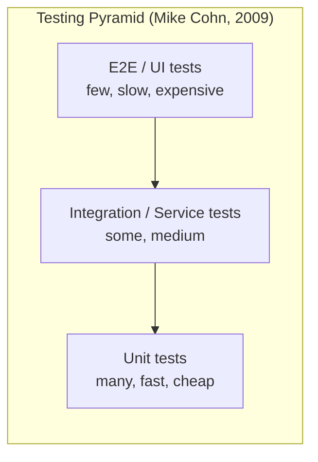
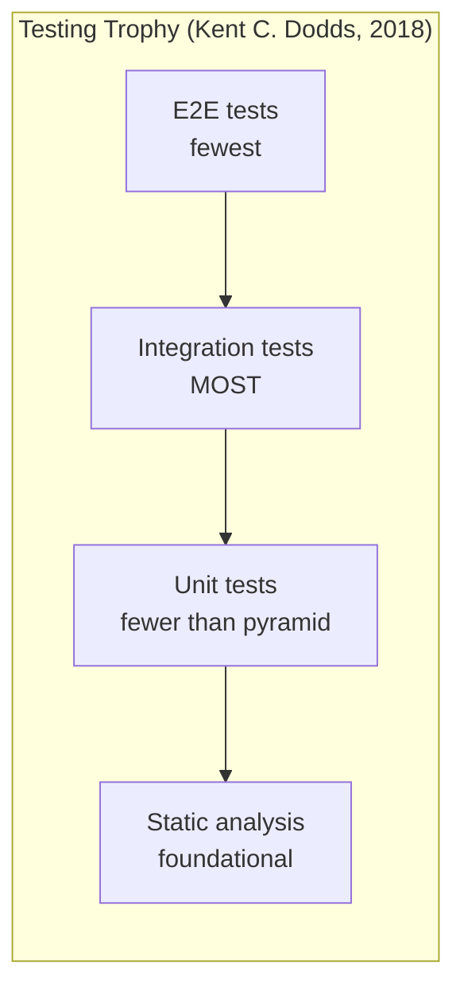
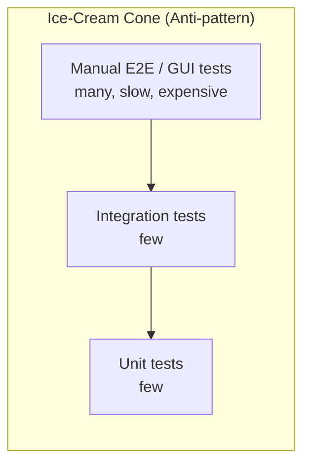
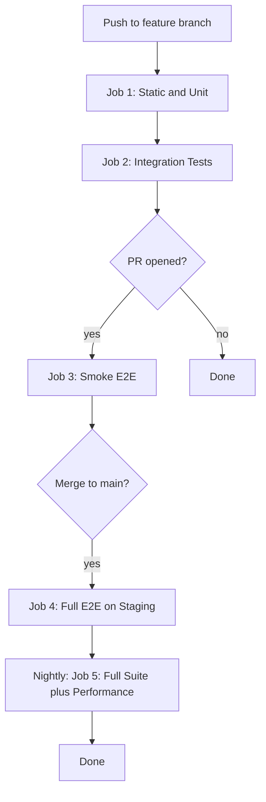

# 5.01 Testing Pyramid and Trophy

> "The more your tests resemble the way your software is used, the more confidence they can give you." — Kent C. Dodds

This note is the foundation of the entire Testing and Quality Assurance section. Every subsequent note in this folder — [[5.02 TDD Methodology]], [[5.03 Testability by Design]], [[5.04 Unit Testing Fundamentals]], [[5.07 Integration Testing APIs]], [[5.08 E2E Testing with Playwright]] — assumes the vocabulary and the trade-off calculus introduced here. Read this note first.

---

## 1. Purpose

### 1.1 Why Testing Strategies Exist

Software fails in two ways. The first is **local failure**: a single function returns the wrong value for an input. The second is **systemic failure**: every individual unit works correctly in isolation, but two units disagree about the shape of the data they exchange, and the system as a whole collapses. A testing strategy is the discipline of choosing, for each kind of risk, the test type that catches it at the lowest possible cost.

The naive intuition is "more tests is better." The naive intuition is wrong. A suite of one thousand unit tests can give you 100 percent line coverage and zero confidence that the application actually serves a user, because no unit test ever exercised the wiring between the modules. A suite of one hundred end-to-end tests can give you total confidence that the app works today and a six-hour CI run that nobody trusts by Friday. The art of testing is not the art of writing tests — it is the art of writing the **right** tests, in the **right** proportions, at the **right** altitude.

A testing strategy exists to answer four questions, in order:

1. What can fail?
2. What kind of test catches that failure?
3. What does that kind of test cost?
4. Given a finite testing budget, how many of each kind should I write?

Two answers to the fourth question have dominated the industry: the **Testing Pyramid** (Mike Cohn, 2009) and the **Testing Trophy** (Kent C. Dodds, 2018). This note explains both, compares them, and gives you the tools to choose between them for any given project.

### 1.2 The Testing Pyramid (Mike Cohn)

The Testing Pyramid was introduced by Mike Cohn in *Succeeding with Agile* (2009) and popularized through his earlier work on Mountain Goat Software. Cohn was reacting to the prevailing practice of the 2000s: "ice-cream cone" testing, where a thin layer of manual unit testing supported a massive superstructure of slow, manual, end-to-end (often GUI-driven) testing. The pyramid inverts that cone.

The pyramid has three layers, ordered from bottom (most numerous, cheapest, fastest) to top (least numerous, most expensive, slowest):

- **Unit tests** form the broad base. There should be many of them. They run in milliseconds. They test a single unit — typically a function or a class — in complete isolation, with all collaborators replaced by test doubles.
- **Service tests** (today we usually call these **integration tests**) form the middle. There should be fewer of them. They test multiple units working together: an API handler plus its database, a React component plus its state store, a service plus its message queue.
- **UI tests** (today we usually call these **end-to-end or E2E tests**) form the narrow apex. There should be very few of them. They drive a real browser, click real buttons, and assert on real rendered output. They are slow, expensive, and brittle.

The pyramid's core claim is that **test value scales inversely with test cost**. Unit tests are cheap, so write many. E2E tests are dear, so write few. The shape of the pyramid encodes that ratio.

The pyramid served a generation of developers well. It is still the right starting model for back-end systems, libraries, and any codebase where the user interface is thin or absent.

### 1.3 The Testing Trophy (Kent C. Dodds)

In 2018, Kent C. Dodds published "The Testing Trophy and Testing Classic," a blog post that proposed a different shape. Dodds was teaching testing to React developers and had noticed that the pyramid's advice — "write many unit tests, write few integration tests" — produced suites that gave false confidence. A React component tested in isolation, with its hooks mocked, its children stubbed, and its state store faked, could pass every unit test and still render a blank page in production because the wiring between the component and the store was wrong.

Dodds's trophy has four layers, not three, because it adds a layer below the base: **static analysis**. From bottom to top:

- **Static analysis** (TypeScript, ESLint, prettier): catches type errors, lint violations, and code smells without running any code at all. Cost: zero per test, paid once in tooling setup.
- **Unit tests**: still important, still fast, still isolated. Slightly fewer than the pyramid would suggest.
- **Integration tests**: the largest layer. This is the trophy's defining bet. Integration tests give the most confidence per dollar spent, because most production bugs live at the seams between modules, not inside them.
- **End-to-end tests**: the smallest layer, reserved for the few user flows that absolutely must work end to end.

The trophy's core claim is that **integration tests occupy the sweet spot of the confidence-to-cost ratio**. They are slower than unit tests but still fast enough to run on every pull request. They are slower than E2E but two orders of magnitude cheaper to write, run, and debug. They catch the bugs that unit tests cannot reach — the wiring bugs — without paying the E2E tax.

### 1.4 Why the Trophy Replaced the Pyramid for Many Modern Apps

Three structural changes in the 2010s shifted the sweet spot upward. First, **UI complexity exploded**: a 2009 web page rendered HTML returned by the server, while a 2018 single-page application rendered a tree of components, each with its own state, each fetching its own data. The seams between components, between component and store, between store and network, became the dominant source of bugs. Unit tests of individual components miss those seams; integration tests of component-plus-store catch them. Second, **static analysis matured**: TypeScript reached 1.0 in 2014 and 2.0 in 2016, and ESLint became capable of catching entire classes of bugs that previously required runtime tests. The trophy recognizes that static analysis is the cheapest form of testing and gives it its own foundation layer. Third, **E2E tooling did not get cheap**: Selenium was slow and flaky in 2009; Cypress and Playwright are faster and less flaky in 2024, but they still launch a real browser, still execute real network requests, still take seconds per test, and still break when a third-party service hiccups. The cost of E2E has not fallen nearly as fast as the cost of integration, so the trophy keeps E2E scarce.

The pyramid is not wrong. It is the correct model for code where the seams are simple and the UI is thin — back-end services, command-line tools, libraries, SDKs. The trophy is the correct model for code where the seams are the product — front-end applications, full-stack JavaScript apps, anything with a complex component tree talking to a complex backend. Most production JavaScript code today falls into the second category.

### 1.5 What This Note Will Give You

By the end of this note you will be able to explain the pyramid and the trophy (and the historical and economic reasons for each), choose the correct test level for any scenario, compute the confidence-to-cost ratio for a test, design a CI pipeline that runs the right tests at the right time on the right triggers, and diagnose a flaky test to decide whether to fix it, quarantine it, or delete it.

---

## 2. Theory and Deep Dive

### 2.1 The Four Layers in Detail

#### 2.1.1 Static Analysis

Static analysis is the only layer of the trophy that does not execute code. It reasons about the code as text. TypeScript checks that every function call passes arguments of types the function accepts. ESLint checks that hooks are called in the right order, that variables are not used before declaration, that imports are sorted, that no `console.log` survives into production. Prettier is not strictly testing — it reformats — but it removes a class of "tests" (style checks) that would otherwise be needed.

The cost of static analysis is almost entirely fixed: it is paid once, in tooling setup, and then amortized over the lifetime of the codebase. The marginal cost of checking one more file is essentially zero. The confidence it buys is real but bounded: it cannot catch logic errors. TypeScript will not tell you that your `calculateTax` function returns 7 percent when the law says 6 percent; it will tell you that you passed a `string` to a function expecting a `number`. Static analysis belongs at the base of the trophy because it is the cheapest test you will ever write: it is written once, runs in your editor on every keystroke, runs in CI on every commit, and catches an entire class of bugs that no other layer can economically catch.

#### 2.1.2 Unit Tests

A unit test exercises a single **unit** — typically a function, a method, or a class — in isolation from its collaborators. "In isolation" usually means that every external dependency is replaced by a test double: a fake, a stub, a spy, or a mock. The unit under test is the only real code that runs.

Properties of a good unit test:

- **Fast**: a single unit test should complete in under ten milliseconds. A suite of one thousand unit tests should complete in under ten seconds.
- **Deterministic**: the same input always produces the same output, on every machine, in every timezone, regardless of network state.
- **Isolated**: the test does not depend on the file system, the network, the clock, or any other unit's behavior.
- **Focused**: the test exercises one behavior. If the test fails, you should be able to point at the single line of code that is wrong.
- **Self-describing**: the test name reads like a specification — "returns 0 for an empty cart," "throws when the discount is negative."

The strength of the unit test is **diagnostic precision**: when a unit test fails, you know exactly which function is broken and which input broke it. The weakness of the unit test is **systemic blindness**: a unit test cannot tell you that two correct units compose into an incorrect system.

A common mistake, covered in section 6, is to write unit tests that exercise the unit's implementation rather than its behavior. Such tests pass when the code is correct, fail when the code is refactored (even if the behavior is unchanged), and provide negative value: they make the codebase harder to change.

#### 2.1.3 Integration Tests

An integration test exercises two or more units **together**, with their real wiring, to verify that they cooperate correctly. The boundary of an integration test is chosen by the tester: it may include the API handler and the database, but not the browser; it may include the React component and the state store, but not the network; it may include the order service and the payment gateway, but with the gateway running in a sandbox.

Properties of a good integration test:

- **Moderate speed**: hundreds of milliseconds to a few seconds per test.
- **Realistic wiring**: the units under test are connected as they are in production, not mocked into a fiction.
- **Controlled externalities**: anything outside the chosen boundary is replaced with a controllable double — an in-memory database, a fake HTTP server, a deterministic clock.
- **Behavior-focused**: the test asserts on observable outcomes (the row in the database, the response from the API, the rendered DOM), not on internal call sequences.

Integration tests catch the bugs that unit tests structurally cannot: schema mismatches between layers, transaction-handling errors, incorrect serialization, race conditions in shared state, configuration drift between environments. These bugs are common. They are also the bugs most likely to reach production, because no unit test sees them.

The integration layer is the trophy's largest layer because the cost per test — moderate, not extreme — buys disproportionate confidence: an integration test of an API handler plus its database verifies the same behavior that an E2E test would verify, but at a tenth the cost and with far better debuggability.

#### 2.1.4 End-to-End Tests

An end-to-end test exercises the **entire system** from the user's perspective. It launches a real browser, navigates to the real application, clicks real buttons, types into real inputs, and asserts on real rendered output. The backend, database, and network are real. Only third-party services outside the system's boundary are faked (a test credit-card gateway, for example).

Properties of an E2E test: **slow** (seconds to tens of seconds per test; a suite of one hundred can take twenty minutes); **expensive to write** (the tester must model the user's flow, handle asynchronous UI updates, and deal with timing, animations, and network latency); **expensive to maintain** (every UI change breaks E2E tests; every visual redesign invalidates selectors); **brittle** (a flaky third-party service, a slow CDN, a popup that appears 5 percent of the time all produce intermittent failures that erode trust); and **high confidence** (when an E2E test passes, you know the user can do the thing the test verifies).

E2E tests are the apex of both the pyramid and the trophy because no other layer can answer the question "does the user's actual flow actually work?" But the same properties that make them high-confidence (they exercise everything) make them high-cost (they exercise everything). The pyramid and the trophy agree that E2E should be scarce. They differ on what to fill the gap with.

### 2.2 The Confidence-to-Cost Ratio

The decisive concept in modern testing strategy is the **confidence-to-cost ratio**, introduced and named by Kent C. Dodds. It is the simple ratio: `confidence-to-cost = confidence-the-test-buys / cost-to-write-run-and-maintain`. Both numerator and denominator are subjective, but both are estimable. Confidence is the probability that, if the test passes, the behavior under test actually works in production. Cost is the total lifetime cost: writing, running, debugging, maintaining.

Rough order-of-magnitude estimates for a typical web application:

| Layer       | Confidence per test | Cost per test | Ratio |
| ----------- | ------------------- | ------------- | ----- |
| Static      | Low                 | Near zero     | High  |
| Unit        | Low-to-medium       | Low           | High  |
| Integration | High                | Medium        | Highest |
| E2E         | Highest             | High          | Medium |

The trophy's central empirical claim is that integration tests have the **highest** ratio. They are not the most confident — E2E is — and they are not the cheapest — static is — but they sit at the optimum of the curve. Moving one test from E2E to integration typically costs a small amount of confidence and saves a large amount of cost. Moving one test from integration to unit typically costs a large amount of confidence and saves a small amount of cost.

This is not a universal law. For a pure-function library (a date arithmetic library, a math library, a parser), unit tests have the highest ratio, because the units have no interesting seams. For a thin API wrapper around a database, integration tests may have the highest ratio. For a one-page marketing site with a contact form, a single E2E test may be the highest-ratio investment. The trophy is a default, not a dogma.

### 2.3 Pyramid vs Trophy: A Side-by-Side Comparison

| Dimension             | Pyramid (Cohn, 2009)                          | Trophy (Dodds, 2018)                                     |
| --------------------- | --------------------------------------------- | -------------------------------------------------------- |
| Layers                | 3: unit, service, UI                          | 4: static, unit, integration, E2E                        |
| Largest layer         | Unit                                          | Integration                                              |
| Smallest layer        | UI / E2E                                      | E2E                                                      |
| Static analysis       | Not a layer                                   | Foundational layer                                       |
| Best fit              | Back-end, libraries, thin-UI systems          | Front-end, full-stack JS, complex UIs                    |
| Core bet              | Cheapest tests are the best tests             | Highest-confidence-per-dollar tests are the best tests   |
| Weakness              | Under-tests integration bugs                  | Risk of slow integration suites if not disciplined       |
| Historical context    | Reaction to manual GUI testing                | Reaction to mocked-component false confidence            |

### 2.4 Visualizing the Two Shapes





The shapes encode the same idea — count inversely proportional to cost — but the trophy widens the integration layer and adds the static layer at the base. The visual difference is small. The strategic difference is large.

### 2.5 The Ice-Cream Cone and the Hourglass: Anti-patterns Both Models Reject

Before the pyramid, the dominant shape was the "ice-cream cone": a thin layer of unit testing at the bottom, a thin layer of integration in the middle, and a massive blob of manual E2E testing on top. The cone is the worst of all worlds: it produces the slowest suite, the highest maintenance cost, the most flakiness, and the lowest confidence-per-dollar. A modern variant is the "hourglass": many unit tests, almost no integration tests, many E2E tests — what you get when a team reads the pyramid literally and skips the integration layer because "integration is hard." Both produce false-confidence suites; both the pyramid and the trophy exist in part to reject them.



### 2.6 Test Doubles, Coverage, and Speed

The pyramid and the trophy have different relationships with mocks, stubs, and fakes. The pyramid, by emphasizing unit tests, encourages heavy use of test doubles — every collaborator of every unit is mocked. The trophy, by emphasizing integration tests, encourages **realistic** doubles: where possible, use the real collaborator; where not possible, use a fake that has the same observable behavior; reserve mocks (which assert on call sequences) for the narrow cases where the call sequence itself is the behavior under test. A test that mocks the database and asserts that the repository called `save` exactly once is testing the implementation. A test that uses an in-memory database and asserts that the saved row appears in the database is testing the behavior. The trophy prefers the latter.

Code coverage is a useful negative signal — zero coverage on a module is a red flag — and a dangerous positive signal — 100 percent coverage does not mean the module is correct, only that every line was executed. The trophy may produce lower line coverage but higher **behavior** coverage: every user-visible behavior is exercised, even if some internal helpers are only exercised through the integration tests that use them. A target of 70 to 80 percent line coverage, with 100 percent on critical modules (auth, payments, data integrity), is a reasonable default.

Suite speed is not a vanity metric; it is a productivity input. A suite that runs in five seconds runs on every save; a suite that runs in five minutes runs on every PR; a suite that runs in fifty minutes runs overnight. A trophy-shaped suite typically achieves: static analysis in seconds, unit tests in seconds to a minute, integration tests in one to five minutes, E2E tests in five to twenty minutes. By keeping the slow layers thin, the trophy keeps the fast layers useful.

---

## 3. Mental Models

### 3.1 The Pyramid and the Trophy as Shapes

Think of the pyramid as a stack where the width of each layer is the count of tests you should write at that level. The base is wide because unit tests are cheap; the apex is narrow because E2E tests are dear. If your suite looks like an inverted pyramid, you have inverted the cost-benefit curve. Think of the trophy as a stack where the bulge is at the integration layer. The bulge is the bet: most of your testing time goes into integration, because that is where the bugs are and where the cost is still tolerable. The base (static) is wide but invisible — it runs in your editor, not in your test runner. The apex (E2E) is the smallest, reserved for the few flows that nothing else can verify.

### 3.2 Confidence and Cost

Confidence is the answer to the question: "If all my tests pass, how sure am I that the system works in production?" A unit test gives you confidence in the unit. An integration test gives you confidence in the seam. An E2E test gives you confidence in the flow. Confidence is not additive — ten unit tests do not give you the confidence of one integration test, because they cannot see the seam. Cost has three components: **write cost** (time to author), **run cost** (time to execute, multiplied by frequency), and **maintenance cost** (time to fix when the code changes, debug when it flakes, and update when requirements evolve). E2E tests are expensive on all three axes. Unit tests are cheap on all three. Integration tests are moderate on all three. The trophy's claim is that moderate-on-all-three is the best deal.

### 3.3 The Sweet Spot and the Anti-Models

The sweet spot is the layer where the confidence-to-cost ratio peaks. For most modern applications, that layer is integration. Every test you write at a layer above the sweet spot is overpaying for confidence. Every test you write at a layer below the sweet spot is buying the wrong kind of confidence. The work of a testing strategy is to identify the sweet spot for your codebase and push the bulk of your testing there. Two anti-models illustrate the failure modes. The **ice-cream cone** (a thin unit base, a thin integration middle, a massive E2E top) is what you get when you confuse "tests that find bugs" with "tests that look like the user." The **hourglass** (many unit, no integration, many E2E) is what you get when a team reads the pyramid literally and skips the integration layer because "integration is hard." Both produce slow, flaky, false-confidence suites. If your suite is shaped like either, the fix is not to write more tests — it is to move tests down the stack.

### 3.4 Static Analysis, Flakiness, and Diminishing Returns

Static analysis is "free" in the sense that the marginal cost of one more type annotation or one more lint rule is essentially zero. Every bug that TypeScript can catch is a bug you do not need to write a runtime test for; invest in static analysis first. A flaky test is one that passes sometimes and fails sometimes for the same code; it erodes trust in the entire suite, because once developers learn that a red CI run might be a flake, they start ignoring red runs. A flaky test is worse than no test, because no test makes you honest about your ignorance, while a flaky test makes you falsely confident. Finally, the return on investment for additional tests follows a curve: the first integration test for a new feature has high ROI, the tenth has lower ROI, and the hundredth E2E test for the same feature has negative ROI. Stop writing tests at a layer when the marginal confidence drops below the marginal cost.

---

## 4. Real-World Use Cases

### 4.1 CI/CD Pipelines

The most common application of the pyramid and trophy is the design of the CI/CD pipeline. A typical trophy-shaped pipeline:

- **On every save (local or pre-commit hook)**: run TypeScript (`tsc --noEmit`), ESLint, and the unit test suite. Target: under ten seconds.
- **On every push (CI)**: run static analysis, unit tests, and integration tests. Target: under five minutes. Block the push if anything fails.
- **On every pull request (CI)**: run static, unit, integration, and a small selection of smoke E2E tests (the five most critical user flows). Target: under fifteen minutes. Block the merge if anything fails.
- **On every merge to main (CI)**: run the full E2E suite in a staging environment. Target: under thirty minutes. Notify the team if it fails, but do not block the merge unless the failure is in a critical flow.
- **Nightly**: run the full E2E suite, the full integration suite, and any long-running tests (performance, soak, chaos). Target: under two hours. Block the next day's releases if it fails.

This pipeline implements the trophy's stratification: fast feedback on every save, full confidence on every PR, comprehensive coverage nightly. The integration layer is the workhorse; the E2E layer is the safety net.

### 4.2 Legacy Code

Legacy code is code without tests. Michael Feathers's *Working Effectively with Legacy Code* defines it precisely: legacy code is code without tests. The challenge of legacy code is that you cannot refactor it safely without tests, and you cannot write unit tests for it without refactoring it (because the units are entangled). The solution, validated across decades of practice, is to start with **integration tests** at the seams.

A legacy API endpoint that calls six tangled services, each of which calls a database, cannot be unit-tested without first untangling it. But you can write an integration test that hits the endpoint with a known input and asserts on the response. That test characterizes the current behavior. Once the characterization test is green, you can refactor behind it — extract a service, introduce a seam, write a unit test for the extracted service — and the integration test protects you from regression. Over months, a legacy module moves from "no tests, all integration" to "some integration, some unit," and eventually to "many unit, fewer integration" — the pyramid shape, approached from the top down.

### 4.3 UI Libraries

A UI component library (a design system, a shared component set) has a peculiar testing profile. Each component is a unit, but its correctness is visual as well as behavioral. The standard library testing stack is:

- **Static analysis**: TypeScript types for the component's props.
- **Unit tests**: tests for the component's pure logic (a `usePagination` hook, a `formatDate` utility). Fast, focused.
- **Integration tests**: tests that render the component with real props and assert on the rendered output, using Testing Library. These verify that the component reacts correctly to user events, that it composes correctly with other components, and that it respects its public API.
- **Snapshot tests**: a specialized form of integration test that captures the rendered output as a string and fails on any change. Useful for catching unintended visual changes; dangerous when overused, because a snapshot that captures everything asserts nothing.
- **Visual regression tests**: a specialized form of E2E test that screenshots the component in a browser and compares against a baseline. Catches CSS regressions that snapshot tests cannot see.
- **E2E tests**: usually omitted for individual components, but used for the library's documentation site (the showcase).

### 4.4 API Services

A back-end API service that talks to a database has a natural integration boundary: the HTTP request in, the HTTP response out, with the real database (or a real, in-process substitute) in between. The standard service testing stack is:

- **Static analysis**: TypeScript types for the request, response, and domain models.
- **Unit tests**: tests for pure logic — validation functions, mappers, calculators, policy functions.
- **Integration tests**: tests that hit the API with a real HTTP request, against a real database (often a test database or an in-memory substitute like SQLite for a Postgres app), and assert on the response and the resulting database state. These are the workhorse tests.
- **Contract tests**: tests that verify the API matches its published OpenAPI schema.
- **E2E tests**: usually omitted for a single service, but used when multiple services must cooperate (a checkout flow that touches the cart service, the inventory service, the payment service, and the notification service).

The integration tests hit the real DB because that is where the bugs live: schema mismatches, transaction handling, migration drift, connection pool exhaustion, query plan regressions. Mocking the DB in unit tests hides exactly these bugs.

### 4.5 Mobile Apps, Microservices, Open-Source Libraries

These three contexts share a common adaptation of the trophy, summarized briefly.

**Mobile apps** run on constrained devices with platform-specific behavior. Static analysis is TypeScript (React Native) or Swift/Kotlin. Unit tests cover view models, reducers, and mappers in a sandbox. Integration tests render a screen with real state in a simulator. Instrumented tests — the mobile equivalent of E2E — run on a real device with platform automation (XCUITest, Espresso, Detox, Maestro) and are kept to the critical flows.

**Microservices** multiply the seams. Each service has its own trophy. Cross-service integration is verified with **contract tests** (Consumer-Driven Contracts, e.g., with Pact), which verify each service's published API matches what its consumers expect. Contract tests replace cross-service E2E for most cases. A small number of system-wide E2E tests cover the few user flows that span multiple services (login, checkout, onboarding), running in a staging environment.

**Open-source libraries** have a different profile: the library's public API is its contract, and every behavior must be tested. Static analysis uses TypeScript and ESLint with stricter rules than an application. Unit tests are comprehensive — every public function, every edge case — and are the workhorse, because the library has few integration seams. Integration tests exercise the library against real dependencies (a real file system, a real HTTP server). E2E is usually omitted; the library has no UI. **Property-based tests** (randomized tests that generate many inputs and verify invariants) are particularly valuable for libraries with complex input domains (parsers, encoders, math libraries). The library case is where the pyramid still rules: many unit tests, few integration tests, no E2E.

### 4.6 Startups and Greenfield Projects

A greenfield startup project has a peculiar constraint: the team is small, the product is changing fast, and the test suite must not slow down iteration. The temptation is to skip tests entirely. The correct response is the **minimum viable trophy**:

- **Static analysis**: TypeScript from day one. Zero additional cost.
- **Unit tests**: for the few pieces of pure logic that matter (pricing, permissions, calculations).
- **Integration tests**: for the critical flows (signup, login, the core product loop). Three to ten tests, not three hundred.
- **E2E tests**: one test for the most critical flow. Just one.

This minimal suite takes a day to set up and pays back forever. It does not slow iteration, because it is small. It catches the bugs that would otherwise kill the product, because it focuses on the critical flows. As the product matures, the suite grows toward the full trophy.

---

## 5. Code Examples

This section presents two worked examples: a minimal one that shows the same feature tested at the unit, integration, and E2E levels, and a production-grade one that shows a typed test suite for a small API with all four trophy layers configured.

### 5.1 Example A — Minimal and Conceptual

The feature under test is a **discount calculator** for a shopping cart. The calculator takes a cart (a list of items with prices) and a discount code, looks up the discount percentage for the code, and returns the discounted total. The discount code lookup hits a database.

We will write three tests for this feature: a unit test for the pure calculation, an integration test for the calculation plus the database lookup, and an E2E test for the HTTP endpoint that exposes the calculator.

#### 5.1.1 The Implementation

**JavaScript (`cart.js`):**

```javascript
const assert = require('node:assert');

function calculateTotal(items) {
  return items.reduce((sum, item) => sum + item.price * item.quantity, 0);
}

function applyDiscount(total, discountPercent) {
  if (discountPercent < 0 || discountPercent > 100) {
    throw new Error('discountPercent must be between 0 and 100');
  }
  return Number((total * (1 - discountPercent / 100)).toFixed(2));
}

async function getDiscountPercent(code, discountRepo) {
  const percent = await discountRepo.findByCode(code);
  if (percent === null) {
    throw new Error(`unknown discount code: ${code}`);
  }
  return percent;
}

async function priceCart(items, code, discountRepo) {
  const total = calculateTotal(items);
  const percent = await getDiscountPercent(code, discountRepo);
  return applyDiscount(total, percent);
}

module.exports = { calculateTotal, applyDiscount, getDiscountPercent, priceCart };
```

**TypeScript (`cart.ts`):**

```typescript
export interface CartItem {
  price: number;
  quantity: number;
}

export interface DiscountRepository {
  findByCode(code: string): Promise<number | null>;
}

export function calculateTotal(items: CartItem[]): number {
  return items.reduce((sum, item) => sum + item.price * item.quantity, 0);
}

export function applyDiscount(total: number, discountPercent: number): number {
  if (discountPercent < 0 || discountPercent > 100) {
    throw new Error('discountPercent must be between 0 and 100');
  }
  return Number((total * (1 - discountPercent / 100)).toFixed(2));
}

export async function getDiscountPercent(
  code: string,
  discountRepo: DiscountRepository,
): Promise<number> {
  const percent = await discountRepo.findByCode(code);
  if (percent === null) {
    throw new Error(`unknown discount code: ${code}`);
  }
  return percent;
}

export async function priceCart(
  items: CartItem[],
  code: string,
  discountRepo: DiscountRepository,
): Promise<number> {
  const total = calculateTotal(items);
  const percent = await getDiscountPercent(code, discountRepo);
  return applyDiscount(total, percent);
}
```

#### 5.1.2 The Unit Test (Pure Logic Only)

**JavaScript (`cart.unit.test.js`):**

```javascript
const { test } = require('node:test');
const assert = require('node:assert');
const { calculateTotal, applyDiscount } = require('./cart');

test('calculateTotal sums price times quantity for each item', () => {
  assert.strictEqual(calculateTotal([{ price: 10, quantity: 2 }, { price: 5, quantity: 3 }]), 35);
});

test('calculateTotal returns 0 for an empty cart', () => {
  assert.strictEqual(calculateTotal([]), 0);
});

test('applyDiscount reduces total by the given percentage', () => {
  assert.strictEqual(applyDiscount(100, 10), 90);
  assert.strictEqual(applyDiscount(50, 50), 25);
});

test('applyDiscount throws for out-of-range percentages', () => {
  assert.throws(() => applyDiscount(100, -1), /discountPercent/);
  assert.throws(() => applyDiscount(100, 101), /discountPercent/);
});
```

**TypeScript (`cart.unit.test.ts`):**

```typescript
import { test } from 'node:test';
import assert from 'node:assert/strict';
import { calculateTotal, applyDiscount, type CartItem } from './cart';

test('calculateTotal sums price times quantity for each item', () => {
  const items: CartItem[] = [{ price: 10, quantity: 2 }, { price: 5, quantity: 3 }];
  assert.strictEqual(calculateTotal(items), 35);
});

test('calculateTotal returns 0 for an empty cart', () => {
  assert.strictEqual(calculateTotal([]), 0);
});

test('applyDiscount reduces total by the given percentage', () => {
  assert.strictEqual(applyDiscount(100, 10), 90);
  assert.strictEqual(applyDiscount(50, 50), 25);
});

test('applyDiscount throws for out-of-range percentages', () => {
  assert.throws(() => applyDiscount(100, -1), /discountPercent/);
  assert.throws(() => applyDiscount(100, 101), /discountPercent/);
});
```

This is a unit test in the strict sense: it exercises pure functions, has no collaborators, runs in microseconds, and is fully deterministic. It catches arithmetic bugs but cannot catch database integration bugs.

#### 5.1.3 The Integration Test (Calculator Plus Database)

**JavaScript (`cart.integration.test.js`):**

```javascript
const { test, beforeEach, afterEach } = require('node:test');
const assert = require('node:assert');
const { priceCart } = require('./cart');
const { createInMemoryDiscountRepo } = require('./discountRepo');

let repo;

beforeEach(async () => {
  repo = createInMemoryDiscountRepo();
  await repo.seed({ SAVE10: 10, HALF: 50 });
});

afterEach(async () => {
  await repo.clear();
});

test('priceCart applies a known discount code', async () => {
  const items = [{ price: 100, quantity: 1 }];
  const total = await priceCart(items, 'SAVE10', repo);
  assert.strictEqual(total, 90);
});

test('priceCart throws on unknown discount code', async () => {
  const items = [{ price: 100, quantity: 1 }];
  await assert.rejects(() => priceCart(items, 'NOPE', repo), /unknown discount code/);
});
```

**TypeScript (`cart.integration.test.ts`):**

```typescript
import { test, beforeEach, afterEach } from 'node:test';
import assert from 'node:assert/strict';
import { priceCart, type CartItem, type DiscountRepository } from './cart';
import { createInMemoryDiscountRepo } from './discountRepo';

let repo: DiscountRepository;

beforeEach(async () => {
  repo = createInMemoryDiscountRepo();
  await repo.seed({ SAVE10: 10, HALF: 50 });
});

afterEach(async () => { await repo.clear(); });

test('priceCart applies a known discount code', async () => {
  const items: CartItem[] = [{ price: 100, quantity: 1 }];
  const total = await priceCart(items, 'SAVE10', repo);
  assert.strictEqual(total, 90);
});

test('priceCart throws on unknown discount code', async () => {
  const items: CartItem[] = [{ price: 100, quantity: 1 }];
  await assert.rejects(() => priceCart(items, 'NOPE', repo), /unknown discount code/);
});
```

This is an integration test: it exercises `priceCart` plus a real (in-memory) repository implementation. The wiring between the calculator and the repository is real. If `findByCode` returns the wrong shape, this test fails. If the calculator passes the wrong argument to `findByCode`, this test fails. It runs in a few milliseconds — slower than the unit test, but still fast enough to run on every save.

Note the choice of an in-memory repository. This is a **realistic double**: it implements the same `DiscountRepository` interface as the production Postgres repository, with the same observable behavior. It is not a mock that asserts on call sequences; it is a working substitute. This is the trophy's preferred form of test double.

#### 5.1.4 The E2E Test (HTTP Endpoint)

**JavaScript (`cart.e2e.test.js`):**

```javascript
const { test, before, after } = require('node:test');
const assert = require('node:assert');
const http = require('node:http');
const { createApp } = require('./app');
const { createPostgresDiscountRepo } = require('./discountRepoPostgres');

let server;
let baseUrl;

before(async () => {
  const repo = createPostgresDiscountRepo({ url: process.env.DATABASEURL });
  await repo.connect();
  await repo.seed({ SAVE10: 10, HALF: 50 });
  const app = createApp({ repo });
  server = http.createServer(app);
  await new Promise((resolve) => server.listen(0, resolve));
  baseUrl = `http://127.0.0.1:${server.address().port}`;
});

after(async () => { await new Promise((resolve) => server.close(resolve)); });

test('POST /pricing returns discounted total', async () => {
  const response = await fetch(`${baseUrl}/pricing`, {
    method: 'POST',
    headers: { 'content-type': 'application/json' },
    body: JSON.stringify({ items: [{ price: 100, quantity: 1 }], code: 'SAVE10' }),
  });
  assert.strictEqual(response.status, 200);
  assert.strictEqual((await response.json()).total, 90);
});
```

**TypeScript (`cart.e2e.test.ts`):**

```typescript
import { test, before, after } from 'node:test';
import assert from 'node:assert/strict';
import http from 'node:http';
import type { AddressInfo } from 'node:net';
import { createApp } from './app';
import { createPostgresDiscountRepo } from './discountRepoPostgres';

let server: http.Server;
let baseUrl: string;

before(async () => {
  const url = process.env.DATABASEURL ?? 'postgres://localhost:5432/test';
  const repo = createPostgresDiscountRepo({ url });
  await repo.connect();
  await repo.seed({ SAVE10: 10, HALF: 50 });
  const app = createApp({ repo });
  server = http.createServer(app);
  await new Promise<void>((resolve) => server.listen(0, resolve));
  const port = (server.address() as AddressInfo).port;
  baseUrl = `http://127.0.0.1:${port}`;
});

after(async () => { await new Promise<void>((resolve) => server.close(resolve)); });

test('POST /pricing returns discounted total', async () => {
  const response = await fetch(`${baseUrl}/pricing`, {
    method: 'POST',
    headers: { 'content-type': 'application/json' },
    body: JSON.stringify({ items: [{ price: 100, quantity: 1 }], code: 'SAVE10' }),
  });
  assert.strictEqual(response.status, 200);
  const body = (await response.json()) as { total: number };
  assert.strictEqual(body.total, 90);
});
```

This is an E2E test: it boots the real app, talks to a real Postgres instance, and makes real HTTP requests. It takes seconds to run. It is the slowest, most expensive, and most confident of the three. It is also the most brittle — if Postgres is not running, the test fails for reasons unrelated to the code under test. The structural difference between the three tests is the point: the unit test verifies arithmetic, the integration test verifies the calculator-repository wiring, and the E2E test verifies the entire request-response cycle. They are not redundant; they each catch a different class of bug. The trophy's claim is that the integration test, not the E2E test, is where most of your testing effort should go — because the integration test catches the wiring bugs at a tenth of the E2E's cost.

### 5.2 Example B — Production-Grade

A production-grade trophy-shaped test suite for a small Express API. The API has one resource: `POST /orders`, which creates an order, validates it, persists it to Postgres, and publishes an event to a queue. The suite has four layers, each in its own folder, each runnable independently. The project layout separates `src/` (with `server.ts`, `routes/orders.ts`, `domain/{order,pricing}.ts`, `infra/{postgresOrdersRepo,inMemoryOrdersRepo,postgresMigrations,eventBus}.ts`, and `config.ts`) from `test/` (with `unit/`, `integration/`, and `e2e/` subfolders), plus three Vitest configs (`vitest.config.{unit,integration,e2e}.ts`) and the standard `package.json` and `tsconfig.json`.

#### 5.2.2 Static Analysis Configuration

The static layer uses a strict `tsconfig.json` with `strict: true`, `noUncheckedIndexedAccess`, `exactOptionalPropertyTypes`, `noImplicitOverride`, `noFallthroughCasesInSwitch`, `esModuleInterop`, `skipLibCheck`, and `forceConsistentCasingInFileNames` set; `include` covers both `src` and `test`. The ESLint config extends `eslint:recommended`, `@typescript-eslint/recommended`, `@typescript-eslint/recommended-requiring-type-checking`, and `import/recommended`; rules of note include `@typescript-eslint/no-unused-vars` (with `argsIgnorePattern: '^ignored'`), `@typescript-eslint/no-floating-promises: 'error'`, `@typescript-eslint/no-misused-promises: 'error'`, `@typescript-eslint/consistent-type-imports: 'error'`, `import/order: ['error', { 'newlines-between': 'always' }]`, and `no-console: ['error', { allow: ['warn', 'error'] }]`.

This is the static layer. It runs in your editor on every keystroke and in CI on every commit. It catches type errors, unused variables, floating promises, misused awaits, and import order violations — all without executing any code.

#### 5.2.3 The Domain

**JavaScript (`src/domain/pricing.js`):**

```javascript
function lineTotal(line) {
  return Number((line.unitPrice * line.quantity).toFixed(2));
}

function orderTotal(order) {
  return Number(order.lines.reduce((sum, line) => sum + lineTotal(line), 0).toFixed(2));
}

function applyOrderDiscount(order, percent) {
  if (percent < 0 || percent > 100) {
    throw new Error('percent out of range');
  }
  const total = orderTotal(order);
  return Number((total * (1 - percent / 100)).toFixed(2));
}

module.exports = { lineTotal, orderTotal, applyOrderDiscount };
```

**TypeScript (`src/domain/pricing.ts`):**

```typescript
export interface OrderLine {
  sku: string;
  unitPrice: number;
  quantity: number;
}

export interface Order {
  id: string;
  customerId: string;
  lines: OrderLine[];
}

export function lineTotal(line: OrderLine): number {
  return Number((line.unitPrice * line.quantity).toFixed(2));
}

export function orderTotal(order: Order): number {
  return Number(order.lines.reduce((sum, line) => sum + lineTotal(line), 0).toFixed(2));
}

export function applyOrderDiscount(order: Order, percent: number): number {
  if (percent < 0 || percent > 100) {
    throw new Error('percent out of range');
  }
  const total = orderTotal(order);
  return Number((total * (1 - percent / 100)).toFixed(2));
}
```

#### 5.2.4 The Repository Interface

**TypeScript (`src/domain/orderRepo.ts`):**

```typescript
import type { Order } from './pricing';

export interface OrdersRepository {
  save(order: Order): Promise<void>;
  findById(id: string): Promise<Order | null>;
  listByCustomer(customerId: string): Promise<Order[]>;
}
```

JavaScript has no interface construct; the contract is documented in a comment and enforced by the test suite (the in-memory and Postgres implementations are exercised through the same tests).

#### 5.2.5 The In-Memory Repository (Realistic Double)

**JavaScript (`src/infra/inMemoryOrdersRepo.js`):**

```javascript
class InMemoryOrdersRepo {
  constructor() { this.rows = new Map(); }
  async save(order) { this.rows.set(order.id, structuredClone(order)); }
  async findById(id) { const row = this.rows.get(id); return row ? structuredClone(row) : null; }
  async listByCustomer(customerId) {
    return [...this.rows.values()].filter((r) => r.customerId === customerId).map((r) => structuredClone(r));
  }
  async clear() { this.rows.clear(); }
}
module.exports = { InMemoryOrdersRepo };
```

**TypeScript (`src/infra/inMemoryOrdersRepo.ts`):**

```typescript
import type { Order } from '../domain/pricing';
import type { OrdersRepository } from '../domain/orderRepo';

export class InMemoryOrdersRepo implements OrdersRepository {
  private rows = new Map<string, Order>();
  async save(order: Order): Promise<void> { this.rows.set(order.id, structuredClone(order)); }
  async findById(id: string): Promise<Order | null> {
    const row = this.rows.get(id);
    return row ? structuredClone(row) : null;
  }
  async listByCustomer(customerId: string): Promise<Order[]> {
    return [...this.rows.values()].filter((r) => r.customerId === customerId).map((r) => structuredClone(r));
  }
  async clear(): Promise<void> { this.rows.clear(); }
}
```

The in-memory repository is the trophy's preferred double. It is a real implementation of the repository interface, with the same observable behavior as the Postgres version. It allows integration tests to exercise the wiring between the API and the repository without booting a real database.

#### 5.2.6 The Postgres Repository (Production)

**TypeScript (`src/infra/postgresOrdersRepo.ts`, abridged for clarity):**

```typescript
import pg from 'pg';
import type { Order } from '../domain/pricing';
import type { OrdersRepository } from '../domain/orderRepo';

export class PostgresOrdersRepo implements OrdersRepository {
  constructor(private readonly pool: pg.Pool) {}

  async save(order: Order): Promise<void> {
    const client = await this.pool.connect();
    try {
      await client.query('BEGIN');
      await client.query(
        'INSERT INTO orders (id, customerId, total, createdAt) VALUES ($1, $2, $3, NOW())',
        [order.id, order.customerId, orderTotal(order).toString()],
      );
      for (const line of order.lines) {
        await client.query(
          'INSERT INTO orderlines (orderId, sku, unitPrice, quantity) VALUES ($1, $2, $3, $4)',
          [order.id, line.sku, line.unitPrice.toString(), line.quantity],
        );
      }
      await client.query('COMMIT');
    } catch (err) {
      await client.query('ROLLBACK');
      throw err;
    } finally {
      client.release();
    }
  }

  // findById and listByCustomer follow the same shape:
  // SELECT from orders and orderlines, hydrate into Order objects.
  // The transaction in save is the only non-trivial detail.
}

function orderTotal(order: Order): number {
  return Number(order.lines.reduce((s, l) => s + l.unitPrice * l.quantity, 0).toFixed(2));
}
```

The Postgres repository is the production implementation. The integration tests for the API use the in-memory version most of the time (fast, no external dependencies), and a small number of integration tests use the Postgres version against a real test database (slow, but verifies that the SQL and the transaction handling are correct).

#### 5.2.7 The Route Handler

**TypeScript (`src/routes/orders.ts`):**

```typescript
import { Router, type Request, type Response } from 'express';
import { randomUUID } from 'node:crypto';
import type { OrdersRepository } from '../domain/orderRepo';
import type { EventBus } from '../infra/eventBus';
import { orderTotal } from '../domain/pricing';

export interface CreateOrderBody {
  customerId: string;
  lines: Array<{ sku: string; unitPrice: number; quantity: number }>;
}

export function createOrdersRouter(deps: { repo: OrdersRepository; bus: EventBus }): Router {
  const router = Router();

  router.post('/orders', async (req: Request, res: Response) => {
    const body = req.body as CreateOrderBody;
    if (!body.customerId || !Array.isArray(body.lines) || body.lines.length === 0) {
      return res.status(400).json({ error: 'invalid body' });
    }
    // (per-line validation omitted for brevity; same shape as above)
    const order = { id: randomUUID(), customerId: body.customerId, lines: body.lines };
    await deps.repo.save(order);
    await deps.bus.publish('order.created', { id: order.id, customerId: order.customerId, total: orderTotal(order) });
    return res.status(201).json(order);
  });

  router.get('/orders/:id', async (req: Request, res: Response) => {
    const order = await deps.repo.findById(req.params.id);
    if (!order) return res.status(404).json({ error: 'not found' });
    return res.status(200).json(order);
  });

  return router;
}
```

#### 5.2.8 The Unit Test Layer

**TypeScript (`test/unit/pricing.unit.test.ts`, abridged):**

```typescript
import { describe, test } from 'node:test';
import assert from 'node:assert/strict';
import { lineTotal, orderTotal, applyOrderDiscount, type Order } from '../../src/domain/pricing';

describe('lineTotal', () => {
  test('multiplies unit price by quantity', () => {
    assert.strictEqual(lineTotal({ sku: 'A', unitPrice: 10, quantity: 2 }), 20);
  });
  test('rounds to two decimals', () => {
    assert.strictEqual(lineTotal({ sku: 'A', unitPrice: 10.005, quantity: 1 }), 10.01);
  });
});

describe('orderTotal', () => {
  test('sums all lines', () => {
    const order: Order = { id: '1', customerId: 'c1', lines: [
      { sku: 'A', unitPrice: 10, quantity: 2 },
      { sku: 'B', unitPrice: 5, quantity: 3 },
    ] };
    assert.strictEqual(orderTotal(order), 35);
  });
});

describe('applyOrderDiscount', () => {
  const order: Order = { id: '1', customerId: 'c1', lines: [{ sku: 'A', unitPrice: 100, quantity: 1 }] };
  test('applies percentage discount', () => assert.strictEqual(applyOrderDiscount(order, 10), 90));
  test('throws for out-of-range percentage', () => assert.throws(() => applyOrderDiscount(order, 101), /percent out of range/));
});
```

These tests run in microseconds. They cover the pure logic of the pricing domain. They are the pyramid's foundation layer.

#### 5.2.9 The Integration Test Layer

**TypeScript (`test/integration/orders.integration.test.ts`, abridged):**

```typescript
import { describe, test, beforeEach, afterEach } from 'node:test';
import assert from 'node:assert/strict';
import express from 'express';
import type { AddressInfo } from 'node:net';
import http from 'node:http';
import { createOrdersRouter } from '../../src/routes/orders';
import { InMemoryOrdersRepo } from '../../src/infra/inMemoryOrdersRepo';
import { InMemoryEventBus } from '../../src/infra/eventBus';

async function setup() {
  const repo = new InMemoryOrdersRepo();
  const bus = new InMemoryEventBus();
  const app = express();
  app.use(express.json());
  app.use('/api', createOrdersRouter({ repo, bus }));
  const server = http.createServer(app);
  await new Promise<void>((resolve) => server.listen(0, resolve));
  const port = (server.address() as AddressInfo).port;
  return { server, baseUrl: `http://127.0.0.1:${port}`, repo, bus };
}

describe('POST /api/orders integration', () => {
  let env: Awaited<ReturnType<typeof setup>>;

  beforeEach(async () => { env = await setup(); });
  afterEach(async () => { await new Promise<void>((r) => env.server.close(r)); });

  test('creates an order and returns 201, with the order persisted', async () => {
    const response = await fetch(`${env.baseUrl}/api/orders`, {
      method: 'POST',
      headers: { 'content-type': 'application/json' },
      body: JSON.stringify({ customerId: 'c1', lines: [{ sku: 'A', unitPrice: 10, quantity: 2 }] }),
    });
    assert.strictEqual(response.status, 201);
    const body = (await response.json()) as { id: string; customerId: string };
    assert.strictEqual(body.customerId, 'c1');
    const stored = await env.repo.findById(body.id);
    assert.ok(stored);
    assert.strictEqual(stored!.lines.length, 1);
  });

  test('publishes order.created event after save', async () => {
    await fetch(`${env.baseUrl}/api/orders`, {
      method: 'POST',
      headers: { 'content-type': 'application/json' },
      body: JSON.stringify({ customerId: 'c1', lines: [{ sku: 'A', unitPrice: 10, quantity: 2 }] }),
    });
    const events = env.bus.events('order.created');
    assert.strictEqual(events.length, 1);
    assert.strictEqual(events[0]!.customerId, 'c1');
  });

  // Additional tests in the same shape: 400 on missing lines, GET /api/orders/:id round-trip.
});
```

These tests run in tens of milliseconds each. They exercise the wiring between the router, the repository, and the event bus. They catch schema mismatches, validation gaps, and serialization bugs. They do not require an external database or a real message queue — both are replaced with in-memory implementations that satisfy the same interfaces. This is the trophy's workhorse layer. Notice that it does **not** mock the repository with a stub that records calls and asserts on them. It uses a real in-memory repository and asserts on the **observable outcome**: the order is in the database, the event is on the bus. This is the difference between testing behavior (trophy) and testing implementation (anti-pattern).

#### 5.2.10 The Postgres Integration Test Layer

**TypeScript (`test/integration/orders.postgres.test.ts`, abridged):**

```typescript
import { describe, test, before, after } from 'node:test';
import assert from 'node:assert/strict';
import pg from 'pg';
import { PostgresOrdersRepo } from '../../src/infra/postgresOrdersRepo';
import { runMigrations } from '../../src/infra/postgresMigrations';

const databaseUrl = process.env.TESTDATABASEURL ?? 'postgres://localhost:5432/orderstest';

describe('PostgresOrdersRepo', { skip: !process.env.TESTDATABASEURL }, () => {
  let pool: pg.Pool;
  let repo: PostgresOrdersRepo;

  before(async () => {
    pool = new pg.Pool({ connectionString: databaseUrl });
    await runMigrations(pool);
    repo = new PostgresOrdersRepo(pool);
  });

  after(async () => {
    await pool.query('TRUNCATE orders, orderlines');
    await pool.end();
  });

  test('save and findById round-trip an order', async () => {
    const order = {
      id: 'order-1',
      customerId: 'c1',
      lines: [{ sku: 'A', unitPrice: 10, quantity: 2 }],
    };
    await repo.save(order);
    const fetched = await repo.findById('order-1');
    assert.ok(fetched);
    assert.strictEqual(fetched!.customerId, 'c1');
    assert.strictEqual(fetched!.lines[0]!.sku, 'A');
  });

  test('save is transactional on error', async () => {
    // Pre-insert a conflicting row, then attempt to save; verify nothing was written.
    // This test is the only one that justifies using Postgres over the in-memory repo:
    // it verifies real transactional rollback behavior that the in-memory repo cannot simulate.
  });
});
```

These tests run in hundreds of milliseconds each and require a real Postgres instance. They are skipped in CI unless `TESTDATABASEURL` is set, so they do not block PRs but run nightly. The split — fast integration tests with the in-memory repository, slow integration tests with the real database — is the trophy's pragmatic answer to "should integration tests use a real database?" The answer is "yes, but only for the few tests that verify database-specific behavior." Use the in-memory substitute for the many tests that verify application wiring.

#### 5.2.11 The E2E Test Layer

**TypeScript (`test/e2e/orders.e2e.test.ts`):**

```typescript
import { describe, test, before, after } from 'node:test';
import assert from 'node:assert/strict';
import { createServer } from '../../src/server';

const base = process.env.E2EBASEURL ?? 'http://localhost:3000';

describe('orders E2E', () => {
  let stop: () => Promise<void>;

  before(async () => {
    if (!process.env.E2EBASEURL) {
      const handle = await createServer({ port: 3000 });
      stop = handle.stop;
    } else {
      stop = async () => {};
    }
  });

  after(async () => {
    await stop();
  });

  test('full order lifecycle: create, fetch, list', async () => {
    const createResponse = await fetch(`${base}/api/orders`, {
      method: 'POST',
      headers: { 'content-type': 'application/json' },
      body: JSON.stringify({ customerId: 'c1', lines: [{ sku: 'A', unitPrice: 10, quantity: 2 }] }),
    });
    assert.strictEqual(createResponse.status, 201);
    const created = (await createResponse.json()) as { id: string };

    const getResponse = await fetch(`${base}/api/orders/${created.id}`);
    assert.strictEqual(getResponse.status, 200);

    const listResponse = await fetch(`${base}/api/orders?customerId=c1`);
    const list = (await listResponse.json()) as Array<{ id: string }>;
    assert.ok(list.some((o) => o.id === created.id));
  });

  // Additional E2E test: order.created event reaches the consumer via a test endpoint.
});
```

These tests run in seconds each. They boot the entire system — the server, the database, the message queue, the consumer. They verify that the user's actual flow works. There are only two of them. They run on merge to main, not on every PR.

#### 5.2.12 The Vitest Configuration

Three separate Vitest configs allow each layer to run independently. The unit config targets `test/unit/**/*.test.ts`, runs in node, and collects coverage on `src/domain/**`. The integration config targets `test/integration/**/*.test.ts` with a `testTimeout` of 10000. The E2E config targets `test/e2e/**/*.test.ts` with a `testTimeout` of 60000 and `retries: 1`, because E2E is the layer most likely to flake. The three configs share the same shape:

```typescript
import { defineConfig } from 'vitest/config';

export default defineConfig({
  test: {
    include: ['test/unit/**/*.test.ts'],   // or test/integration/**, or test/e2e/**
    environment: 'node',
    globals: false,
    testTimeout: 10000,                     // 60000 for E2E
    retries: 1,                             // E2E only
    coverage: { provider: 'v8', reporter: ['text', 'lcov'], include: ['src/domain/**'] },  // unit only
  },
});
```

#### 5.2.13 The `package.json` Scripts

```json
{
  "scripts": {
    "typecheck": "tsc --noEmit",
    "lint": "eslint . --max-warnings=0",
    "test:unit": "vitest run --config vitest.config.unit.ts",
    "test:integration": "vitest run --config vitest.config.integration.ts",
    "test:e2e": "vitest run --config vitest.config.e2e.ts",
    "test:fast": "npm run typecheck && npm run lint && npm run test:unit",
    "test:pr": "npm run test:fast && npm run test:integration",
    "test:all": "npm run test:pr && npm run test:e2e"
  }
}
```

The `test:fast` script runs static analysis plus unit tests. It is run on every save by an IDE watcher and on every commit by a pre-commit hook. The `test:pr` script adds the integration suite. It runs on every push and blocks the PR if it fails. The `test:all` script adds the E2E suite. It runs on merge to main.

This is the trophy, implemented as a CI pipeline. The four layers, in order of cost and confidence: static, unit, integration, E2E. The bulk of the testing effort is in the integration layer. The E2E layer is thin. The static layer is foundational.

---

## 6. Common Mistakes and Anti-Patterns

### 6.1 Too Many E2E Tests

The single most common failure mode is the ice-cream cone: a suite dominated by E2E tests. Symptoms include a CI run that takes thirty minutes, a team that no longer trusts red builds, and a backlog of "flaky test" tickets that nobody has time to fix. The cause is usually a belief that E2E tests are "the only tests that really matter," which leads the team to skip unit and integration tests and pour effort into E2E.

The fix is to move tests down the stack. For every E2E test, ask: "What is this test verifying that an integration test could not verify?" If the answer is "nothing" — and it usually is — rewrite the test as an integration test. Reserve E2E for the few flows that genuinely require the full stack: login, checkout, the one critical path through the product.

### 6.2 No Integration Tests

The opposite failure mode is the hourglass: many unit tests, many E2E tests, no integration tests in between. Symptoms include a unit suite that gives false confidence, an E2E suite that catches all the real bugs but is too slow to run on every PR, and a team that has stopped trusting the unit suite.

The cause is usually that integration tests are perceived as "hard" — they require setting up a database, booting a server, managing state. The fix is to invest in the integration test infrastructure once: an in-memory repository, a test app factory, a fixture library. Once the infrastructure exists, integration tests are cheaper than E2E tests and only slightly more expensive than unit tests.

### 6.3 Unit Tests That Test the Implementation

A unit test that mocks the database and asserts that the repository's `save` method was called exactly once, with a specific argument, is testing the implementation. It will fail when you refactor the code to call `save` twice with half the data each time, even though the behavior is unchanged. It provides negative value: it makes the codebase harder to refactor.

The fix is to test behavior, not implementation. Instead of asserting on call sequences, assert on observable outcomes: the row in the database, the response from the API, the event on the bus. If the outcome is correct, the implementation does not matter.

### 6.4 E2E Tests That Test Everything

A team that writes E2E tests for every feature, every edge case, every error path, ends up with a suite that takes hours to run and breaks on every UI change. The cause is usually a belief that "if the user can do it, we should E2E test it." The fix is to apply the trophy's discipline: E2E for the critical flow only, integration for everything else. The user can do many things; the E2E suite verifies the few that must never break.

### 6.5 No Static Analysis

A team that writes JavaScript without TypeScript, or TypeScript with `strict: false`, or that disables ESLint rules because they are "annoying," is paying for type and lint bugs with runtime tests. The cost is enormous: every type bug that TypeScript would have caught becomes a unit test that has to be written, run, and maintained. The fix is to enable `strict: true`, treat ESLint errors as build failures, and invest in the static layer before writing any runtime tests at all.

### 6.6 Ignoring Flakiness

A flaky test that fails 5 percent of the time is not a "minor annoyance." It is a bug in the test or in the system under test, and it erodes trust in the entire suite. The common responses — re-running the test until it passes, adding `retries: 3` to the config, disabling the test — all make the problem worse, because they hide the underlying bug. The correct response is to treat flakiness as a bug: investigate the cause, fix it, and only then re-enable the test. If the cause cannot be found, quarantine the test (move it to a "quarantine" folder that does not run in CI) and assign it to a developer to fix.

### 6.7 Mocking Too Much and Testing the Framework

A unit test that mocks every collaborator of the unit under test is testing the unit in a fiction. The mocks encode the test author's assumptions about how the collaborators behave, and those assumptions may be wrong. The test passes, the code is wrong, and the bug reaches production. The fix is to prefer realistic doubles (fakes, in-memory implementations) over mocks, and to reserve mocks for the narrow cases where the call sequence itself is the behavior under test. A related anti-pattern is testing the framework: a test that asserts Express called the middleware in the right order, or that React rendered the component tree in the right shape, is testing the framework, not your code. Frameworks have their own test suites; you do not need to re-test them. Test your code's behavior: the response your handler returns, the DOM your component renders.

### 6.8 Coverage as a Goal

A team that sets a coverage target of 100 percent and enforces it in CI ends up writing tests for trivial getters and setters, for code paths that cannot fail, and for code that has no behavior worth testing. The coverage number goes up, the suite's value goes down. The fix is to treat coverage as a hygiene metric, not a goal. Set a floor (70 to 80 percent) and a target (100 percent on critical modules), and let the rest be guided by judgment.

### 6.9 Untested Error Paths

A suite that tests only the happy path is a suite that gives false confidence. Most production bugs live in error paths: what happens when the database is down, when the third-party API returns 500, when the user submits invalid input, when the disk is full. The fix is to write integration tests for each error path: simulate the failure (a closed database connection, a mock server returning 500, an invalid input), and assert that the system behaves correctly (returns a 500, retries, logs the error, does not corrupt state).

### 6.10 Tests That Depend on Order and Brittle Selectors

A test that passes when run first and fails when run second depends on test order. The cause is usually shared state: a database row left over from the previous test, a singleton modified by the previous test, a file written to disk. The fix is to ensure each test is independent: clean up after each test (in an `afterEach` hook), use a fresh database transaction per test, never share mutable state between tests. A related anti-pattern in E2E is brittle selectors: a test that selects elements by CSS class (`button.primary.blue`) breaks when the design system changes the class name. The fix is to select by accessible attributes: `data-testid`, `aria-label`, role. These attributes are part of the component's public contract and change far less often than CSS classes. Testing Library's `getByRole` and `getByTestId` APIs enforce this discipline.

---

## 7. Best Practices and Design Patterns

### 7.1 Use TypeScript and ESLint as the Foundational Layer

Enable `strict: true` in `tsconfig.json`, plus `noUncheckedIndexedAccess`, `exactOptionalPropertyTypes`, and `noImplicitOverride`. Treat ESLint errors as build failures. Add `@typescript-eslint/recommended-requiring-type-checking` for type-aware lint rules. This layer catches an entire class of bugs that no runtime test can economically catch.

### 7.2 Write Unit Tests for Pure Logic, Integration Tests for the Seams

A pure function — one with no side effects, whose output depends only on its input — is the ideal unit test target. Write comprehensive unit tests for pure functions: every input domain, every edge case, every error condition. The seams between modules — API handler and database, component and store, service and message queue — are where most production bugs live. Write integration tests that exercise the seam with real wiring and assert on observable outcomes. Prefer in-memory fakes over mocks. The integration layer should be the largest layer of your suite.

### 7.3 Write E2E Tests for Critical User Flows Only

Identify the three to five user flows that absolutely must work: signup, login, checkout, the core product loop. Write one E2E test for each. Do not write E2E tests for edge cases, error paths, or secondary features — those belong in the integration layer.

### 7.4 Treat Flaky Tests as Bugs

When a test flakes, do not re-run it. Do not add retries. Investigate the cause: a race condition, a timing assumption, a shared resource, a network dependency. Fix the cause. If you cannot find the cause, quarantine the test and assign an owner. A suite with a flaky test is a suite without trust.

### 7.5 Run Fast Tests on Every Save, Slow Tests on PR

The fast suite (static, unit) runs on every save in your editor and on every commit in a pre-commit hook. The medium suite (integration) runs on every push to CI and blocks the PR. The slow suite (E2E) runs on merge to main. This stratification keeps the feedback loop tight for the common case while still catching the rare bugs that only E2E can catch. Use separate Vitest (or Jest) configurations for each layer, so each layer can be run independently.

### 7.6 Use Realistic Doubles and Test Behavior, Not Implementation

Prefer fakes (in-memory implementations of real interfaces) over mocks (objects that record calls and assert on them). Fakes have the same observable behavior as the real collaborator, so they catch integration bugs that mocks hide. Reserve mocks for the narrow cases where the call sequence is the behavior under test. Assert on observable outcomes — the response from the API, the row in the database, the event on the bus, the rendered DOM — not on internal call sequences, private method invocations, or implementation details. A test that fails when the code is refactored (even if the behavior is unchanged) is a bad test, even if the code is correct.

### 7.7 Keep Tests Independent and Self-Describing

Each test sets up its own state and tears down its own state. Tests do not depend on the order in which they run. Use a fresh database transaction per test, or a fresh in-memory repository per test. Never share mutable state between tests. A test name should read like a specification: "returns 0 for an empty cart," "throws when the discount is negative," "publishes order.created event after save." A reader who scans the test names should understand the behavior under test without reading the test bodies.

### 7.8 Use Dependency Injection and Coverage as a Floor

Inject dependencies (repositories, clients, clocks) through the constructor or function parameters. This makes the seams explicit and the tests easy: pass a fake in the test, a real one in production. See [[5.03 Testability by Design]] for a full treatment. Set a coverage floor (70 to 80 percent) and a target (100 percent on critical modules). Do not enforce 100 percent across the board. Use coverage reports to find untested code, not to drive the writing of trivial tests.

### 7.9 Invest in Test Infrastructure Once and Review Tests in Code Review

The first integration test is expensive: you have to set up the test app factory, the in-memory repository, the fixture library. The hundredth integration test is cheap: you reuse the infrastructure. Invest in the infrastructure once, at the beginning of the project, and the cost per test drops by an order of magnitude. Tests are code; they are reviewed in the pull request, alongside the production code. A reviewer asks: Does this test verify behavior or implementation? Is it independent? Is its name a specification? Does it belong at this layer, or would a different layer be more appropriate? A pull request that adds production code without tests is incomplete; a pull request that adds tests at the wrong layer is also incomplete.

### 7.10 Delete Tests That No Longer Provide Value

Tests age. A test that was valuable when written may become redundant after a refactor, or may begin to test behavior that no longer matters. Delete such tests. A suite that grows without pruning becomes a liability: every change breaks more tests, every test takes longer to run, and the signal-to-noise ratio drops. Treat the test suite as a codebase that requires its own maintenance.

---

## 8. Technical Interview Knowledge

This section presents eight questions and answers that commonly appear in technical interviews for JavaScript, TypeScript, and Node.js roles, with a focus on the testing pyramid and trophy.

### 8.1 Q: What is the testing pyramid?

**A:** The testing pyramid, introduced by Mike Cohn in *Succeeding with Agile* (2009), is a model for structuring a test suite. It has three layers, ordered from most numerous and cheapest to least numerous and most expensive: unit tests at the base, integration (or service) tests in the middle, and UI (or end-to-end) tests at the apex. The pyramid's core claim is that test count should be inversely proportional to test cost, because cheap tests can be written in large numbers and expensive tests should be reserved for the few cases that justify their cost. The pyramid was a reaction to the "ice-cream cone" testing of the 2000s, where a thin layer of unit testing supported a massive superstructure of slow, manual, GUI-driven testing.

### 8.2 Q: What is the testing trophy?

**A:** The testing trophy, introduced by Kent C. Dodds in 2018, is a refinement of the pyramid that adds a fourth layer at the base and shifts the bulk of testing from the unit layer to the integration layer. The four layers, from bottom to top, are: static analysis (TypeScript, ESLint), unit tests, integration tests (the largest layer), and end-to-end tests (the smallest layer). The trophy's core claim is that integration tests occupy the sweet spot of the confidence-to-cost ratio: they catch the integration bugs that unit tests miss, at a fraction of the cost of E2E tests. The trophy is particularly suited to modern front-end and full-stack JavaScript applications, where the seams between components, stores, and APIs are where most bugs live.

### 8.3 Q: What is the difference between unit, integration, and end-to-end tests?

**A:** A **unit test** exercises a single unit — typically a function or a class — in isolation, with all collaborators replaced by test doubles. It runs in milliseconds, is fully deterministic, and gives diagnostic precision (when it fails, you know exactly which function is broken) but systemic blindness (it cannot catch integration bugs). An **integration test** exercises two or more units together, with their real wiring, to verify that they cooperate correctly. It runs in tens to hundreds of milliseconds, catches integration bugs, and is the workhorse of a modern test suite. An **end-to-end test** exercises the entire system from the user's perspective, typically by driving a real browser. It runs in seconds, gives the highest confidence (it verifies the user's actual flow), and is the most expensive to write, run, and maintain. The three are not redundant; each catches a different class of bug.

### 8.4 Q: What is the confidence-to-cost ratio?

**A:** The confidence-to-cost ratio, introduced by Kent C. Dodds, is the ratio of the confidence a test buys to the cost of writing, running, and maintaining it. Confidence is the probability that, if the test passes, the behavior under test actually works in production. Cost is the total lifetime cost: writing, running, debugging, maintaining. The trophy's central empirical claim is that integration tests have the highest ratio: they are not the most confident (E2E is) and not the cheapest (static is), but they sit at the optimum of the curve. Moving a test from E2E to integration typically costs a small amount of confidence and saves a large amount of cost; moving a test from integration to unit typically costs a large amount of confidence and saves a small amount of cost.

### 8.5 Q: When would you choose the trophy over the pyramid?

**A:** I would choose the trophy when the codebase has complex seams where bugs are likely to live: front-end applications with component trees and state stores, full-stack JavaScript applications where the same code runs on the server and the client, API services talking to complex databases, and any system where the integration between modules is itself a source of risk. I would choose the pyramid when the codebase has simple or absent seams: libraries, SDKs, command-line tools, back-end services with well-defined boundaries, and any system where the bulk of the logic is in pure functions. The trophy is the better default for modern web applications; the pyramid is the better default for everything else.

### 8.6 Q: How do you handle flaky tests?

**A:** I treat flakiness as a bug, not as a nuisance. When a test flakes, I do not re-run it and I do not add retries; those responses hide the underlying problem. Instead, I investigate the cause: a race condition, a timing assumption, a shared resource, a network dependency, a non-deterministic clock. I fix the cause. If I cannot find the cause immediately, I quarantine the test — move it to a folder that does not run in CI — and assign an owner to fix it within a sprint. A suite with a flaky test is a suite without trust; once developers learn that a red CI run might be a flake, they stop investigating red runs, and the suite stops protecting anything.

### 8.7 Q: How would you structure a CI test pipeline?

**A:** I would stratify the pipeline by layer, with each layer triggered by a different event. On every save, run static analysis and the unit suite (target under ten seconds). On every push to CI, run static plus unit plus integration (target under five minutes; block the push on failure). On every pull request, add a small selection of smoke E2E tests — the five most critical flows (target under fifteen minutes; block the merge). On every merge to main, run the full E2E suite in staging (target under thirty minutes; notify but do not block unless the failure is in a critical flow). Nightly, run the full E2E suite plus long-running tests like performance, soak, and chaos (target under two hours; block the next release on failure). This pipeline keeps the feedback loop tight for the common case while still catching the rare bugs that only E2E can catch.

### 8.8 Q: What is static analysis, and why does the trophy treat it as a layer?

**A:** Static analysis is the process of reasoning about code without executing it. In JavaScript and TypeScript, it includes TypeScript's type checker, ESLint (which catches unused variables, hooks-rule violations, import cycles, and other code smells), and tools like Prettier (which enforce a consistent style). The trophy treats static analysis as a layer because it is the cheapest form of testing: the marginal cost of one more type annotation or lint rule is essentially zero, and the runtime cost is measured in seconds. Every bug that TypeScript can catch is a bug you do not need to write a runtime test for. The pyramid does not treat static analysis as a layer because in 2009, when it was formulated, JavaScript had no static type checker and ESLint did not exist; the trophy was formulated in 2018, after TypeScript and ESLint had become standard, so it could recognize static analysis as the foundation.

---

## 9. Practical Exercises

### 9.1 Exercise 1 — Classify Tests as Unit, Integration, or E2E

**Problem:** For each of the following ten test descriptions, classify the test as unit, integration, or E2E, and justify your classification.

1. A test that calls `Math.round(2.5)` and asserts the result is `3`.
2. A test that renders a React `<Login />` component with Testing Library, types into the email and password fields, clicks the submit button, and asserts that the `onSubmit` callback was called with the entered values.
3. A test that boots the Express app on a random port, makes a real HTTP `POST /login` request with credentials, and asserts that the response contains a JWT.
4. A test that calls a `validateEmail('foo@bar.com')` function and asserts it returns `true`.
5. A test that opens a Playwright browser, navigates to `https://staging.example.com/login`, fills in the form, clicks submit, and asserts that the URL changes to `/dashboard`.
6. A test that creates a `User` instance, calls `user.save()`, and asserts that a `users` table row exists in a real Postgres database.
7. A test that calls `user.save()` with a mocked repository and asserts that the mock's `save` method was called once.
8. A test that runs `npm run build` and asserts the build succeeds.
9. A test that hits `POST /orders` with a real HTTP request, against an in-memory repository, and asserts the response is `201`.
10. A test that loads a YAML config file and asserts that a required key exists.

**Solution:**

1. **Unit.** Pure function, no collaborators, runs in microseconds. (Classification is by structure, not by ownership.)
2. **Integration.** The component is exercised with its real event handlers and real DOM interaction. Testing Library tests are typically classified as integration in the trophy sense.
3. **Integration.** The Express app is real, the HTTP request is real, but the database is presumably mocked or in-memory.
4. **Unit.** Pure function, no collaborators.
5. **E2E.** A real browser drives the real staging environment. The boundary is the entire system.
6. **Integration.** The `User` class and the Postgres database are exercised together with real wiring.
7. **Unit (and anti-pattern 6.3).** The mock isolates the unit, but the test asserts on call sequence rather than behavior (the row exists).
8. **Static.** Not a runtime test at all; it verifies that the code compiles and bundles. Belongs to the static layer.
9. **Integration.** Real HTTP, real router, real handler, real in-memory repository. The database is a realistic double.
10. **Unit (or static).** If the test loads the file at runtime, it is a unit test of the config-loading function. If it inspects the file as text (e.g., with a YAML linter), it is static analysis.

### 9.2 Exercise 2 — Convert an E2E-Heavy Suite to a Trophy-Style Suite

**Problem:** You inherit a codebase with 200 E2E tests and 50 unit tests. The E2E suite takes 45 minutes to run, flakes on 8 percent of runs, and the team no longer trusts it. The unit suite runs in 30 seconds but catches no integration bugs. Describe, step by step, how you would convert this suite to a trophy-style suite.

**Solution:**

**Step 1: Measure and identify critical flows.** Instrument the suite for two weeks: for every bug that reaches production, record which test caught it and which test should have caught it. From this data and product priorities, identify the three to five user flows that absolutely must work. These remain as E2E tests; everything else is a candidate for migration.

**Step 2: Build integration test infrastructure.** Before migrating tests, build the infrastructure: a test app factory (a function that boots the Express app with configurable dependencies), an in-memory repository for each production repository, an in-memory event bus, and a fixture library for common entities. This is a one-time investment that pays back across hundreds of migrated tests.

**Step 3: Migrate one E2E test at a time.** For each non-critical E2E test, ask: "What is this test verifying that an integration test could not verify?" If the answer is "nothing," rewrite the test as an integration test using the new infrastructure. Run both in parallel for a sprint to confirm the integration test catches the same bugs. Then delete the E2E test. Quarantine flaky E2E tests (those that flake more than 2 percent of the time) to a folder that runs nightly, and assign each an owner to either fix the flakiness or migrate the test.

**Step 4: Add static analysis.** If the codebase is JavaScript, migrate to TypeScript. If already TypeScript, enable `strict: true` and fix the resulting type errors. Add ESLint with `@typescript-eslint/recommended-requiring-type-checking` and treat errors as build failures. This catches an entire class of bugs that the runtime suite was previously expected to catch.

**Step 5: Re-baseline, update CI, and monitor.** Measure the new suite timing. Target: static plus unit plus integration under five minutes, E2E under ten minutes. Configure the CI pipeline to run static plus unit on every save, integration on every push, smoke E2E on every PR, and full E2E on merge to main. For the next quarter, track bug escape rate, CI run time, flake rate, and developer satisfaction. All four should improve; if any regresses, investigate.

A realistic outcome: the 200 E2E tests become 5 E2E tests (the critical flows), 150 integration tests (the migrated bulk), and 45 deleted tests (redundant or low-value). The unit suite grows from 50 to 80 as pure logic is extracted. The total suite time drops from 45 minutes to 8 minutes. The flake rate drops from 8 percent to under 1 percent.

### 9.3 Exercise 3 — Diagnose a Flaky Test

**Problem:** The following integration test flakes about 5 percent of the time in CI. It always passes locally. Diagnose the cause and propose a fix.

```typescript
test('order.created event is published after order is saved', async () => {
  const app = await setupApp();
  await app.repo.clear();
  await app.post('/api/orders', { customerId: 'c1', lines: [{ sku: 'A', unitPrice: 10, quantity: 1 }] });
  const events = app.bus.events('order.created');
  assert.strictEqual(events.length, 1);
});
```

The `setupApp` function boots an Express app with an in-memory repository and an in-memory event bus. The `post` method is a thin wrapper around `fetch`. The `bus.events(topic)` method returns an array of events published to the given topic.

**Solution:**

**Diagnosis:** The flake is almost certainly a **race condition between the HTTP response and the event publication**. The route handler is structured roughly as:

```typescript
router.post('/orders', async (req, res) => {
  const order = buildOrder(req.body);
  await repo.save(order);
  bus.publish('order.created', { id: order.id }); // fire-and-forget
  res.status(201).json(order);
});
```

If `bus.publish` is synchronous (as it typically is for an in-memory bus), the event is published before the response is sent, and the test passes. If `bus.publish` is asynchronous (e.g., it awaits a `setImmediate` or a microtask), the event may not be on the bus when `fetch` resolves, and the test fails — sometimes, depending on the event loop's scheduling.

The test passes locally because the local machine is faster or less loaded, so the event loop schedules the publish microtask before the test's assertion. It flakes in CI because the CI machine is slower or more loaded, so the assertion sometimes runs first.

**Confirmation:** Add a `console.log` inside `bus.publish` and inside the test's assertion. Run the test in a loop (`for (let i = 0; i < 100; i++) await runTest()`). Observe that on failing runs, the assertion's log appears before the publish's log.

**Fix Options:**

1. **Make `bus.publish` synchronous** (if it is an in-memory bus). This is the simplest fix and the most correct for an in-memory bus: there is no reason for `publish` to be asynchronous when the subscribers are in-process.
2. **Await `bus.publish` in the route handler.** Change `bus.publish(...)` to `await bus.publish(...)` in the handler. This ensures the event is on the bus before the response is sent. This is the correct fix if `publish` is genuinely asynchronous (e.g., it publishes to a real message queue).
3. **Poll in the test.** Instead of asserting immediately, poll the bus for up to a timeout using a loop that checks `bus.events(topic)` every few milliseconds and throws if the timeout expires. This is the least correct fix — it papers over the race rather than fixing it — but it is sometimes necessary when the production code genuinely publishes asynchronously and you cannot change it.

The correct fix, in this case, is option 2: await the publish in the handler. The event is part of the operation's contract (the order is not "created" until the event is published), so the handler should not return until the publish completes. This is a behavior change that makes the system more correct, not just the test more reliable.

**Generalization:** Most flaky integration tests are race conditions between an asynchronous side effect (a publish, a write, a log) and the test's assertion. The fix is either to make the side effect synchronous (if it should be), to await it in the production code (if it is part of the operation's contract), or to poll in the test (if the side effect is genuinely eventual). The first two are fixes to the code; the third is a fix to the test and should be a last resort.

### 9.4 Exercise 4 — Design a CI Test Pipeline

**Problem:** Design a CI test pipeline for a medium-sized full-stack JavaScript application (a Next.js front-end, an Express API, a Postgres database, a Redis cache, and a Stripe integration). The team has 15 engineers, pushes 30 PRs per week, and merges to main 10 times per week. The pipeline must run on GitHub Actions. Specify: the triggers, the jobs, the order, the failure behavior, and the expected run time for each job.

**Solution:**



**Triggers:** `on: push` to any branch triggers Jobs 1 and 2. `on: pullrequest` to main adds Job 3. `on: push` to main triggers Job 4. `on: schedule` at 02:00 UTC nightly triggers Job 5.

**Jobs (trigger, steps, failure behavior, expected time):**

| Job | Trigger | Steps | Failure | Time |
| --- | --- | --- | --- | --- |
| 1. Static and Unit | every push | checkout, Node 20, `npm ci`, `npm run typecheck`, `npm run lint`, `npm run test:unit` | blocks push | 90s |
| 2. Integration Tests | every push, after Job 1 | checkout, Node 20, `npm ci`, Postgres and Redis service containers, run migrations, `npm run test:integration` | blocks push | 4m |
| 3. Smoke E2E | PR to main, after Job 2 | checkout, Node 20, `npm ci`, boot the full system with a fake Stripe server, `npm run test:e2e -- --grep "@smoke"` | blocks merge | 6m |
| 4. Full E2E on Staging | push to main, after Job 2 | deploy merged commit to staging, run `npm run test:e2e` against staging | notifies Slack; blocks next release if critical flow fails | 18m |
| 5. Nightly Full Suite plus Performance | schedule 02:00 UTC | deploy latest main to staging, full integration, full E2E, k6 performance, 30-minute soak | opens GitHub issue; blocks next day's releases | 90m |

**Concurrency and Caching:** Use `concurrency: { group: 'pr-${{ github.event.pullrequest.number }}', cancel-in-progress: true }` to cancel stale runs when a new commit is pushed to the same PR. Cache `nodemodules` and the Next.js build cache; use a matrix for the Integration Tests job if the suite is large enough to split by domain. Failure handling: any failure in Jobs 1, 2, or 3 blocks the PR; failures in Job 4 notify the team but do not revert the merge (the merge is already in main), with triage within 4 hours; failures in Job 5 open an issue and block releases until resolved. Flake detection: if a test fails in Job 4 or 5 but passes on retry, mark it as "flaky" in a dashboard; if a test is marked flaky three times in a week, it is automatically quarantined.

**Cost and Time Budget:** Per PR: about 11 minutes (90s plus 4m plus 6m). With 30 PRs per week, that is about 5.5 hours per week. Per merge: 18 minutes, with 10 merges per week that is 3 hours per week. Nightly: 90 minutes, 10.5 hours per week. Total: about 19 hours of CI time per week, well within the budget of a 15-engineer team on GitHub Actions.

This pipeline implements the trophy's stratification: fast feedback on every push, full integration confidence on every PR, full E2E confidence on every merge, and comprehensive coverage nightly. The integration layer is the workhorse; the E2E layer is the safety net.

---

## 10. Mini-Project Blueprint

### 10.1 Project: Build a Typed Test Suite

**Goal:** Build a complete, typed test suite for a small API, exercising all four trophy layers (static, unit, integration, E2E). The API is a `POST /todos` endpoint that creates a todo item, persists it to a database, and publishes a `todo.created` event.

**Time estimate:** 4 to 6 hours for a developer familiar with TypeScript, Vitest, and Express.

### 10.2 Stack

- **Runtime:** Node.js 20+.
- **Language:** TypeScript 5+, with `strict: true`.
- **Web framework:** Express 4+.
- **Database:** SQLite (via `better-sqlite3`) for production, in-memory for fast integration tests.
- **Test runner:** Vitest 1+.
- **E2E runner:** Vitest with a real HTTP server.
- **Linting:** ESLint with `@typescript-eslint/recommended-requiring-type-checking`.

### 10.3 Folder Layout

```text
todos-api/
  src/
    server.ts
    routes/
      todos.ts
    domain/
      todo.ts
      todoRepo.ts
    infra/
      sqliteTodosRepo.ts
      inMemoryTodosRepo.ts
      eventBus.ts
    migrations/
      001-create-todos.sql
  test/
    unit/
      todo.unit.test.ts
    integration/
      todos.integration.test.ts
      todos.sqlite.test.ts
    e2e/
      todos.e2e.test.ts
  vitest.config.unit.ts
  vitest.config.integration.ts
  vitest.config.e2e.ts
  tsconfig.json
  .eslintrc.cjs
  package.json
```

### 10.4 Implementation Steps

**Step 1: Static analysis.** Create `tsconfig.json` with `strict: true` and the additional flags from section 5.2.2. Create `.eslintrc.cjs` with the configuration from section 5.2.2. Run `npm run typecheck && npm run lint` and fix all errors.

**Step 2: Domain and infrastructure.** Define the `Todo` type, the `TodosRepository` interface, and the pure logic (a `validateTodo` function, a `summarizeTodo` function) in `src/domain/`. Implement `InMemoryTodosRepo` and `SqliteTodosRepo`, both satisfying the `TodosRepository` interface. Implement an `InMemoryEventBus` in `src/infra/eventBus.ts`. Write the migration SQL in `src/migrations/001-create-todos.sql`.

**Step 3: Route handler and server factory.** Implement `POST /todos` and `GET /todos/:id` in `src/routes/todos.ts`, using dependency injection for the repository and the event bus. Implement a `createServer` function in `src/server.ts` that accepts a configuration object (the repository, the event bus, the port) and returns `{ server, stop }`. This factory is the key to testability: it allows tests to boot the server with any configuration.

**Step 4: Unit and integration tests.** Write unit tests for `validateTodo` and `summarizeTodo` in `test/unit/todo.unit.test.ts` (target under 5 seconds). Write integration tests for the route handler with the in-memory repository in `test/integration/todos.integration.test.ts`, covering: successful creation, validation failure, retrieval of a created todo, retrieval of a non-existent todo, and event publication (target under 10 seconds). Write integration tests for `SqliteTodosRepo` against a real SQLite database in `test/integration/todos.sqlite.test.ts`, covering: save and findById round-trip, transactional rollback on error, list by customer. Run with `TESTDATABASEURL=file:./test.db npm run test:integration` (target under 30 seconds).

**Step 5: E2E tests and CI scripts.** Write E2E tests in `test/e2e/todos.e2e.test.ts` that boot the server with the SQLite repository (real database) and the in-memory event bus, exercising the full HTTP flow: create a todo via `POST /todos`, retrieve it via `GET /todos/:id` (target under 30 seconds). Add the `package.json` scripts from section 5.2.13. Verify that `npm run test:fast`, `npm run test:pr`, and `npm run test:all` each work and produce the expected timing.

### 10.5 Acceptance Criteria

The project is complete when:

- `npm run typecheck` passes with zero errors.
- `npm run lint` passes with zero warnings.
- `npm run test:unit` passes in under 5 seconds.
- `npm run test:integration` passes in under 30 seconds (including the SQLite tests).
- `npm run test:e2e` passes in under 30 seconds.
- The unit suite has at least 8 tests covering the pure logic.
- The integration suite has at least 12 tests covering the route handler and the SQLite repository.
- The E2E suite has at least 2 tests covering the critical flows.
- The total line coverage is at least 80 percent, with 100 percent on `src/domain/` and `src/routes/`.
- The suite has no flaky tests (run it 10 times in a loop; all 10 runs should pass).

### 10.6 Stretch Goals

- Add property-based tests for the pure logic using `fast-check`.
- Add a contract test that verifies the API matches an OpenAPI schema.
- Add a visual regression test for the (hypothetical) front-end using Playwright screenshots.
- Add a performance test that measures the API's throughput under load, using `k6` or `autocannon`.
- Add a mutation testing run using `stryker-js` to verify that the suite catches injected bugs.

### 10.7 Reflection Questions

After completing the project, answer:

- Which layer caught the most bugs during development? (Most developers find it is the integration layer.)
- Which layer was the most expensive to write? (Most find it is the E2E layer.)
- Which layer would you remove if you had to remove one? (Most would remove the E2E layer, because the integration layer covers most of the same ground at lower cost.)
- Which layer would you expand if you had more time? (Most would expand the integration layer, because it has the highest confidence-to-cost ratio.)

The answers should confirm the trophy's central claim: integration is the sweet spot.

---

## 11. Core Connections

- [[5.02 TDD Methodology]] — Test-driven development is the practice of writing the test before the code. TDD operates primarily at the unit and integration layers of the trophy; this note explains why those layers are the right place to apply TDD.
- [[5.03 Testability by Design]] — A system's testability is determined by its architecture. Dependency injection, interface segregation, and pure-function extraction are the design patterns that make the trophy's layering possible. This note assumes them; that note explains them.
- [[5.04 Unit Testing Fundamentals]] — The unit layer of the trophy, in depth: test structure (arrange-act-assert), naming, parameterization, and the discipline of testing behavior over implementation.
- [[5.07 Integration Testing APIs]] — The integration layer of the trophy, in depth: test app factories, in-memory repositories, transaction-per-test isolation, and the patterns for testing APIs against real databases without sacrificing speed.
- [[5.08 E2E Testing with Playwright]] — The E2E layer of the trophy, in depth: selector strategies, flakiness mitigation, parallel execution, and the discipline of reserving E2E for critical flows.
- [[6.13 CI Pipeline Automation]] — The CI pipeline is where the trophy's stratification is implemented. This note explains the layering; that note explains the pipeline mechanics (GitHub Actions, service containers, caching, concurrency, deployment gates).

---

> **End of note.** You should now be able to explain the pyramid and the trophy, choose the right test type for any scenario, design a CI test pipeline, and diagnose flaky tests. The next note, [[5.02 TDD Methodology]], builds on this foundation by introducing the practice of writing tests first — a practice that, when applied at the integration layer, produces exactly the kind of high-ratio tests the trophy recommends.
