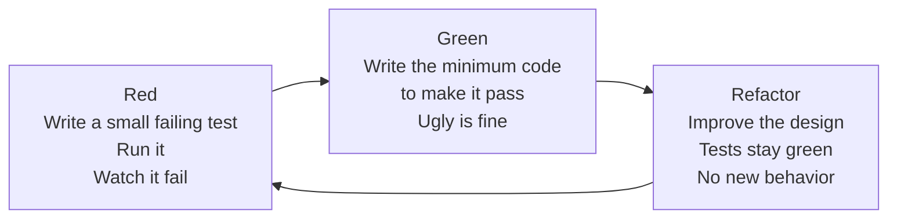
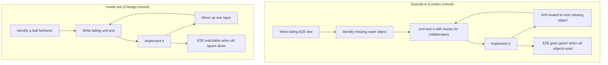
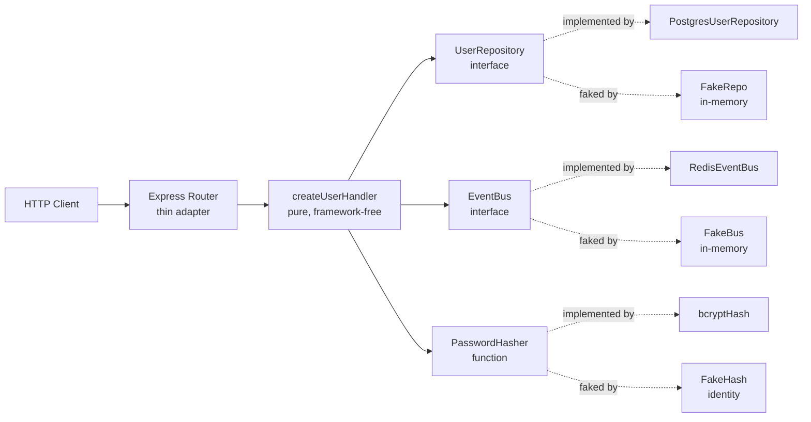

# 5.02 TDD Methodology

> "Make it work, make it right, make it fast." — Kent Beck
> "The act of writing a test before the code is the single most important design decision you will make for that code." — paraphrased Uncle Bob

Test-Driven Development is the discipline of writing a failing test, then writing just enough production code to make that test pass, then cleaning up the design while the tests stay green. TDD is not a testing technique, even though it produces a high-coverage test suite as a side effect. TDD is a **design technique that uses tests as its medium**. The tests are the chisel; the production code is the stone; the cycle of Red-Green-Refactor is the rhythm of the hammer striking the chisel. This note is a maximalist, end-to-end field guide to TDD as practiced in modern JavaScript and TypeScript codebases: the three laws of Uncle Bob, the Red-Green-Refactor cycle, writeable specifications, design feedback, the London and Chicago schools, side-by-side JS and TS examples, common anti-patterns, interview-grade answers, four worked exercises, and a fully documented mini-project.

---

## 1. Purpose

### 1.1 What TDD is, in one sentence

Test-Driven Development is the practice of writing a small failing test that describes behavior you want, then writing the minimum production code to make that test pass, then refactoring the code under the protection of the now-passing tests, and then repeating this cycle dozens or hundreds of times per feature.

### 1.2 Why TDD exists

TDD was invented (or, more accurately, rediscovered and named) by Kent Beck in the late 1990s while he was working on Smalltalk and later formalized in his 2002 book *Test-Driven Development: By Example*. The problem he was trying to solve was not "how do we get more test coverage." Coverage was a side effect. The problem he was trying to solve was:

- **How do you design an API from the caller's perspective instead of the implementer's perspective?**
- **How do you keep a codebase changeable for years without it calcifying into legacy code?**
- **How do you know, with certainty, that the code you just wrote actually does what you think it does?**
- **How do you produce an executable specification that the team can read and that never drifts from the code?**

The answer Beck converged on was: **write the test first**. Writing the test first forces you to consume the API before you build it. You discover the awkward parameter order, the missing return value, the unnecessary argument, the wrong name — before you have committed to them in production code. Because the test must fail first (otherwise it is not a real test), you have proof that the test is wired to the code. Because you write only enough production code to pass the test, you avoid speculative generality. Because the tests are green, you can refactor with a safety net.

### 1.3 What TDD achieves

A team that practices TDD consistently gets four gifts that compound over time:

1. **High coverage as a side effect.** Every line of production code was written to satisfy a test that existed first. Coverage is not measured after the fact; it is structural.
2. **Design feedback at the moment of design.** When a test is painful to write — too many dependencies to stub, too many arguments to pass, too much setup — the pain is information about the production design, not about the test. The fix is to redesign the production code so the test becomes easy.
3. **Regression safety net.** The test suite is a living contract. When a refactor three years later breaks a corner case, a test goes red within seconds, before the bug ships.
4. **Executable specification.** The tests are the most accurate documentation of what the code does. They are read by humans, executed by CI, and they cannot drift from the code without going red.

### 1.4 The three laws of TDD (Uncle Bob)

Robert C. Martin ("Uncle Bob") distilled the discipline into three laws that are quoted in nearly every TDD discussion. They are deliberately extreme; the extremity is the point.

> **Law 1.** You may not write production code until you have written a failing unit test.
>
> **Law 2.** You may not write more of a unit test than is sufficient to fail — and not compiling is failing.
>
> **Law 3.** You may not write more production code than is sufficient to pass the currently failing test.

Law 1 says the test comes first, always. Law 2 says the test is written in tiny slices: one assertion at a time, one branch at a time, one micro-behavior at a time. Law 3 says the production code is written in tiny slices too: just enough to make the current test pass, no more, even if you "know" the next test will require a different implementation.

The three laws produce a feedback loop measured in seconds. You write three lines of test, you run it, it fails, you write three lines of production code, you run it, it passes, you refactor, you run it again, it still passes, you write the next test. The cycle is so short that you never hold more than a few seconds of unwritten knowledge in your head.

### 1.5 What TDD is not

- TDD is not "writing tests." Plenty of teams write tests after the code; that is test-after development, sometimes called test-last. It produces a suite, but it loses the design feedback and the small-steps discipline.
- TDD is not BDD (Behavior-Driven Development). BDD is a higher-level, business-readable specification style (Given/When/Then) that often sits on top of TDD. The two are complementary, not competing.
- TDD is not "100 percent coverage." TDD produces high coverage as a by-product, but coverage is not the goal.
- TDD is not a religion. There are domains where test-first is impractical (UI layout, exploratory data analysis, throwaway scripts). The mature practitioner knows when to apply TDD and when to back off.

### 1.6 The promise of TDD in one paragraph

If you write the test first, every line of production code has a reason to exist, the API is shaped by its consumers, the design stays loose because tight coupling hurts the test, the refactor step keeps the code clean, and the test suite becomes an executable specification that future-you can trust. The cost is discipline and a slight upfront speed penalty. The payoff is a codebase that does not rot.

---

## 2. Theory and Deep Dive

### 2.1 The Red-Green-Refactor cycle

The cycle is the heart of TDD. It has three beats, repeated dozens of times per feature.



The cycle is short — minutes, often seconds. The discipline is that **you never refactor on red** (because red means the test is not yet a safety net) and **you never add new behavior during the refactor step** (because refactor means behavior-preserving by definition).

### 2.2 Red — why the test must fail first

A test that passes before you have written the production code is useless as a safety net. It might be passing because:

- The production code already implements the behavior (the test is a duplicate).
- The test is not wired to the production code at all (a typo in the import, a wrong function name).
- The test is asserted trivially (`expect(true).toBe(true)`).

By running the test and watching it fail, you confirm three things at once: the test is wired to the code, the behavior does not yet exist, and the failure message is meaningful (so that when the test fails again in three months, the message will guide you). If you cannot get the test to fail for the right reason, you do not yet understand the behavior well enough to write it.

There is a subtler reason. Watching the test fail is a small emotional commitment. You saw the gap between "what I want" and "what I have." That gap is the engine of the cycle. Without it, the production code is just typing.

### 2.3 Green — why the code must be minimal

The third law says: write just enough production code to pass the currently failing test. Not "write the production code you know you will eventually need." Not "write the elegant general solution." Just enough to turn the red bar green.

The reasons are deliberate:

- **Avoids speculative generality.** YAGNI ("You Aren't Gonna Need It") is enforced mechanically. You cannot write code for a hypothetical future test because that test does not exist yet.
- **Forces the next test to drive the next design decision.** If you wrote the general solution on the first test, the next three tests would pass for free — and you would have lost the design feedback those three tests were supposed to give you.
- **Makes the cycle short.** A minimal Green is a few lines; you are back to Red in seconds.
- **Makes the refactor step meaningful.** The Green code is often ugly (hard-coded constants, duplicated logic, missing abstractions). That ugliness is the raw material for the refactor step. If Green were already elegant, the refactor step would be a no-op.

A classic Kent Beck illustration: the first test for a sum function asserts `sum(2, 2) === 4`. The minimal Green is `return 4`. Yes, that is a hard-coded constant. Yes, that is wrong. But it is Green, and it makes the next test (say, `sum(2, 3) === 5`) drive the generalization. By the third test, the constant has been replaced by `a + b`, and the generalization was driven by the tests, not by your foresight.

### 2.4 Refactor — why the third beat exists

Green code is correct but ugly. If you stop at Green, your codebase accretes hard-coded constants, duplicated branches, and missing abstractions. Within a few features, the code is unreadable. The refactor beat is where you pay down that ugliness immediately, while the context is fresh in your head and while the tests are green to protect you.

During refactor:

- **You do not add new behavior.** No new tests, no new branches, no new edge cases. Those belong to the next Red.
- **You change internal structure only.** Rename, extract, move, inline, introduce parameter objects, replace conditionals with polymorphism.
- **You run the tests after every step.** If a step makes the tests red, you revert and try a smaller step.

The refactor beat is also where the catalog of [[4.13 Refactoring Techniques|named refactorings]] earns its keep. Without the names (Extract Method, Extract Class, Move Function, Replace Conditional with Polymorphism), refactor would be vague "cleaning up." With the names, it is a disciplined, repeatable activity.

### 2.5 The writeable specification

When the cycle is followed for a whole feature, the resulting test suite reads as a specification. Consider a `Stack` class built by TDD: the test file has `it("is empty when constructed")`, `it("push then peek returns the pushed value")`, `it("pop on empty throws")`, `it("size reflects the number of pushes")`, and so on. A reader who never opens the production file can describe the stack's behavior precisely by skimming the test names.

This is the **writeable specification** property. The tests are documentation that cannot drift (if the production code's behavior changes, a test goes red), is executable (CI runs it on every commit), is structured (`describe`/`it` blocks group behaviors by feature and edge case), and is bilingual (it speaks to humans via test names and to machines via assertions). Teams that take this seriously invest in test names. A test named `it("works")` is a wasted specification; a test named `it("throws when the start date is after the end date")` is a clause in the spec.

### 2.6 Design feedback — "hard test equals bad design"

This is the most underrated property of TDD. When a test is painful to write, the pain is information about the production design, not about the test. Specifically: too much setup means too many collaborators; forced stubbing of a third-party SDK means direct coupling (wrap it behind an interface — the Adapter pattern, see [[4.08 Dependency Injection DI]]); constructing the entire object graph to test one method means the class is doing too much (apply [[4.01 SOLID Single Responsibility|Single Responsibility]] and Extract Class); a private method that needs testing is doing too much (extract it into a new class where it becomes public); non-determinism from `Date.now()` or `Math.random()` means inject a clock or random source.

The mature TDD practitioner treats every test friction as a design signal. The instinct is not "this test is annoying, let me use a fancier mocking library." The instinct is "this test is annoying, let me change the production design so the test becomes easy."

### 2.7 Outside-in TDD (London school)

The London school, associated with Steve Freeman and Nat Pryce's *Growing Object-Oriented Software, Guided by Tests*, starts outside and works inward: write an end-to-end test describing the user-facing behavior, run it (it fails because nothing is implemented), identify the next outermost missing object, write a unit test for it using test doubles for collaborators, run it (it fails), implement the object, then repeat inward drilling down to leaf classes. As inner objects come online, the outer end-to-end test gets closer to green.

The London school uses mocks heavily. Mocks discover the collaborators an object needs ("I will need to send an email here, so I will mock the emailer"). The collaborator interfaces are designed from the consumer's perspective, because the mock is the consumer. This naturally produces [[4.04 SOLID Interface Segregation|interface-segregated]] designs. The London school shines when the requirements are clear at the top and you want the architecture to emerge from the tests. Its weakness is that mocks can couple tests to implementation details; if you are not careful, refactor breaks tests even when behavior is preserved.

### 2.8 Inside-out TDD (Chicago school)

The Chicago (or classical) school, associated with Kent Beck and Martin Fowler, starts at the leaves and builds up: identify a leaf behavior, TDD it, move up one layer, TDD the composer, repeat upward until the end-to-end behavior is reachable. The Chicago school uses real collaborators (or simple fakes) instead of mocks. Tests tend to be more robust to refactoring because they verify state, not interactions. The weakness is that you can paint yourself into a corner: the leaf class you just designed may not fit the architecture you discover you need at the top.

### 2.9 London versus Chicago — a Mermaid comparison



Most production teams blend the two: outside-in for the high-level architecture (the skeleton of the feature), inside-out for the leaf logic (the algorithms). The two schools are tools, not religions.

### 2.10 The cost model of TDD

TDD has an upfront cost: the cycle is slower than writing production code straight through, because each test is a small detour. Practitioner reports converge on roughly: 15 to 30 percent slower in the first weeks (learning curve and tooling), roughly equal after a few months (design feedback prevents rework), 40 to 80 percent lower defect density in production, and minutes (not hours) to fix regressions because a red test pinpoints them. The cost model only pays off if the team commits to the discipline. A team that writes test-after and calls it TDD pays the cost without the benefit.

### 2.11 TDD and the testing pyramid

TDD is primarily a unit-test technique, but it composes cleanly with the [[5.01 Testing Pyramid and Trophy|testing pyramid]]. The bottom of the pyramid (lots of fast unit tests) is exactly what TDD produces. The middle (integration tests) can be test-driven too, especially in the London school. The top (E2E) is usually written after the feature, but the London school drives it first. The trophy model (more integration tests) shifts the center of gravity up but does not eliminate the unit-test foundation that TDD builds.

### 2.12 TDD and the types

In TypeScript, TDD gains a second dimension: the types are themselves a specification, checked at compile time. A common workflow:

1. Write the test in TS. The test references types and functions that do not exist yet. The compiler is red.
2. Write the type signatures (stubs returning `never` or throwing). The compiler goes green. The test is now wired to the code.
3. Run the test. It fails for behavioral reasons (Red).
4. Implement the body. The test goes Green.
5. Refactor.

The types catch a class of errors that tests would otherwise have to assert (wrong shape of argument, wrong return type). This means TS TDD tests tend to focus on behavior, leaving shape to the compiler. The result is fewer, more focused tests.

---

## 3. Mental Models

### 3.1 Model one: "Test first, code second"

The simplest mental model. Before you write any line of production code, ask: "What test would prove this line works?" If you cannot answer, you do not yet know what the line should do. Write the test first; the line will reveal itself.

### 3.2 Model two: "Red means the test tests something"

A green test before implementation is suspicious. A red test before implementation is evidence. Train yourself to feel relief when the test goes red — that red bar means the test is alive, wired, and watching. The next move is to make it green, not to celebrate.

### 3.3 Model three: "Green means make it pass, nothing more"

The third law, internalized. When the test is red, your job is to turn it green by the smallest possible change. Hard-coded constants are fine. Duplicated branches are fine. Ugly is fine. The next test will force the generalization. The refactor step will clean the ugliness. Your foresight is not needed; the tests will demand what they need.

### 3.4 Model four: "Refactor means now improve it, tests protect you"

When green, your job changes. You are no longer adding behavior; you are improving structure. The tests are your safety net. Rename aggressively. Extract methods. Replace conditionals with polymorphism. Move responsibilities. If a step breaks a test, revert and try a smaller step. The cycle's discipline is that **refactor is a separate beat, never mixed with new behavior**.

### 3.5 Model five: "Hard test equals bad design"

When the test is painful to write, the production design is the suspect, not the test. Treat every test friction as a design signal. A painful test is the universe telling you that the production code is too coupled, too big, or too dependent on the outside world. Change the production code until the test becomes easy.

### 3.6 Model six: "Tests are the spec"

Read your test file out loud, ignoring the assertions. If the test names read as a coherent spec ("is empty when constructed", "push then peek returns the value", "pop on empty throws"), you have a writeable specification. If they read as gibberish ("test1", "test2", "works"), you have a regression suite but not a spec. Aim for the spec.

### 3.7 Model seven: "The cycle is seconds, not minutes"

If your cycle is longer than a minute, you are writing too much test or too much code at once. Slice thinner. The shorter the cycle, the tighter the feedback, the fewer mistakes compound. The ideal is: write three lines of test, run, see red, write three lines of code, run, see green, refactor one thing, run, see green again.

### 3.8 Where the models break down

The mental models assume the behavior is unit-testable. When the behavior is visual (CSS layout, animation timing), the unit tests do not capture the real failure mode. When the behavior is exploratory (data science notebooks, prototype UX), there is no specification to test against yet. When the behavior is performance (sub-millisecond latency), unit tests do not measure it. In these domains, the models still apply to the parts that are unit-testable (the logic, the algorithms, the parsers, the state machines), but the visual/exploratory/performance parts need other tools (visual regression, exploratory testing, benchmarking).

---

## 4. Real-World Use Cases

### 4.1 New feature development

The default use case. You pick a feature, you write the first test (often the happy path), you make it green, you refactor, then you write the next test (an edge case), and so on. The feature emerges as a sequence of small Red-Green-Refactor cycles, each one a few minutes long. By the time the feature is "done," the test suite already documents every behavior and every edge case the team committed to.

In a Node backend, this might look like: TDD a `createUser` service. Red: "creates a user with a hashed password." Green: implement hashing with bcrypt. Refactor: extract `hashPassword` into its own module. Red: "throws if the email is already taken." Green: add a repository check. Refactor: introduce a `UserRepository` interface. Red: "emits a UserCreated event." And so on.

### 4.2 Bug fixes

The canonical TDD bug-fix recipe:

1. **Reproduce.** Write a test that fails because of the bug. The test encodes the broken behavior.
2. **Confirm red.** Run it; it fails for the bug reason.
3. **Fix.** Write the minimum production change that makes the test pass.
4. **Confirm green.** Run it; it passes.
5. **Refactor.** If the fix introduced duplication or mess, clean it.
6. **Run the whole suite.** Confirm no regression.

This recipe is powerful because the test you wrote becomes a permanent guard against the bug recurring. The bug is not just fixed; it is foreclosed. Teams that fix bugs this way build, over years, a suite of regression tests that map one-to-one to historical defects.

### 4.3 Legacy code

Michael Feathers defines legacy code as "code without tests." TDD cannot be applied directly because the test-first move requires that you can write a test — and legacy code is often structured so no test can be written without major rework. Feathers' technique is the **characterization test**: a test that documents the *current* behavior of the code (not the desired behavior) by running it with various inputs and pinning the outputs. Once characterization tests are in place, the code is no longer legacy, and you can refactor it toward a better design, with TDD on top for new behavior.

### 4.4 Library design

TDD is exceptionally powerful for library design because the library's public API is its product. By TDD-ing the library, you consume the API from the test before you commit to it. Awkward names, wrong parameter orders, missing return values, and unnecessary arguments surface as test friction before they ship. Many of the most ergonomic libraries in the JS ecosystem (lodash, zod, fastify) were designed with heavy test-first discipline.

### 4.5 Pair programming

In a pair, TDD provides a shared medium. The driver writes the test; the navigator reviews it; the driver runs it (red); the navigator suggests the minimal Green; the driver writes it; the navigator watches the green; the pair decides on a refactor together. The tests become artifacts of the discussion. The cycle forces turns every minute or two, which keeps both pair members engaged.

### 4.6 API endpoint design

When you TDD an HTTP endpoint, the test is the first client of the API. The endpoint's signature (URL, method, body, response) is forced to be ergonomic because the test is the consumer. Side effects (database writes, event emissions) are forced behind interfaces because the test needs to fake them. The result is a thin controller, a clean interface, and a test that doubles as the API spec.

### 4.7 Refactoring safety net and onboarding

When you plan a major refactor — extracting a service from a controller, replacing a sync flow with an async queue — TDD ensures the behavior is fully pinned by tests before you start. The refactor becomes a sequence of small, behavior-preserving moves, each one verified by a green suite. This is the explicit link to [[4.13 Refactoring Techniques]]. The same test suite doubles as onboarding documentation: a new engineer reads the tests as a spec, answering "what does this module do, what are its edge cases, what does it throw on."

---

## 5. Code Examples

### 5.1 Example A — Minimal and Conceptual: TDD a `fizzBuzz` function

We will TDD a `fizzBuzz(n)` function that returns:

- `"Fizz"` when `n` is divisible by 3,
- `"Buzz"` when `n` is divisible by 5,
- `"FizzBuzz"` when divisible by both,
- the number as a string otherwise.

We take it one test at a time. Each subsection is one Red-Green-Refactor cycle.

#### Cycle 1: Red — the simplest possible test

**JavaScript (`fizzBuzz.test.js`):**

```javascript
const assert = require("node:assert");
const test = require("node:test");

const { fizzBuzz } = require("./fizzBuzz");

test("returns the number as a string for 1", () => {
  assert.strictEqual(fizzBuzz(1), "1");
});
```

This test fails to compile: `fizzBuzz` does not exist yet. Run it; it throws `Cannot find module './fizzBuzz'`. That is the Red.

#### Cycle 1: Green — the minimal implementation

**JavaScript (`fizzBuzz.js`):**

```javascript
function fizzBuzz(n) {
  return "1";
}

module.exports = { fizzBuzz };
```

Yes, that is hard-coded. Yes, that is wrong. But it passes the test. Green.

#### Cycle 1: Refactor

Nothing to refactor yet. The function is one line. Move on.

#### Cycle 2: Red — make the hard-coding hurt

**JavaScript:**

```javascript
test("returns the number as a string for 2", () => {
  assert.strictEqual(fizzBuzz(2), "2");
});
```

Red. The hard-coded `"1"` is now visibly wrong.

#### Cycle 2: Green — generalize just enough

**JavaScript:**

```javascript
function fizzBuzz(n) {
  return String(n);
}

module.exports = { fizzBuzz };
```

Green. Both tests pass. The generalization (`String(n)`) was driven by the second test.

#### Cycle 3: Red — the first Fizz rule

**JavaScript:**

```javascript
test("returns Fizz for 3", () => {
  assert.strictEqual(fizzBuzz(3), "Fizz");
});
```

Red. `String(3)` is `"3"`, not `"Fizz"`.

#### Cycle 3: Green — special-case 3

**JavaScript:**

```javascript
function fizzBuzz(n) {
  if (n === 3) return "Fizz";
  return String(n);
}

module.exports = { fizzBuzz };
```

Green, but ugly. We will refactor after the next test.

#### Cycle 4: Red — the Buzz rule

**JavaScript:**

```javascript
test("returns Buzz for 5", () => {
  assert.strictEqual(fizzBuzz(5), "Buzz");
});
```

#### Cycle 4: Green — special-case 5 too

**JavaScript:**

```javascript
function fizzBuzz(n) {
  if (n === 3) return "Fizz";
  if (n === 5) return "Buzz";
  return String(n);
}

module.exports = { fizzBuzz };
```

#### Cycle 4: Refactor — generalize to divisibility

The tests so far imply divisibility. We refactor under green:

**JavaScript:**

```javascript
function fizzBuzz(n) {
  if (n % 3 === 0) return "Fizz";
  if (n % 5 === 0) return "Buzz";
  return String(n);
}

module.exports = { fizzBuzz };
```

Run the tests. Still green. The refactor preserved behavior.

#### Cycle 5: Red — the FizzBuzz rule

**JavaScript:**

```javascript
test("returns FizzBuzz for 15", () => {
  assert.strictEqual(fizzBuzz(15), "FizzBuzz");
});
```

Red. `fizzBuzz(15)` returns `"Fizz"` (because 15 is divisible by 3).

#### Cycle 5: Green — check both first

**JavaScript:**

```javascript
function fizzBuzz(n) {
  if (n % 3 === 0 && n % 5 === 0) return "FizzBuzz";
  if (n % 3 === 0) return "Fizz";
  if (n % 5 === 0) return "Buzz";
  return String(n);
}

module.exports = { fizzBuzz };
```

#### Cycle 5: Refactor — simplify the both-check

We can refactor the combined check using 15:

**JavaScript:**

```javascript
function fizzBuzz(n) {
  if (n % 15 === 0) return "FizzBuzz";
  if (n % 3 === 0) return "Fizz";
  if (n % 5 === 0) return "Buzz";
  return String(n);
}

module.exports = { fizzBuzz };
```

Run all tests. Still green.

#### The TypeScript version, side by side

In TypeScript, the type signature is part of the test's specification. We write the test first; the compiler is red until the signature exists.

**TypeScript (`fizzBuzz.test.ts`):**

```typescript
import { describe, it, expect } from "vitest";
import { fizzBuzz } from "./fizzBuzz";

describe("fizzBuzz", () => {
  it("returns the number as a string for 1", () => {
    expect(fizzBuzz(1)).toBe("1");
  });

  it("returns the number as a string for 2", () => {
    expect(fizzBuzz(2)).toBe("2");
  });

  it("returns Fizz for 3", () => {
    expect(fizzBuzz(3)).toBe("Fizz");
  });

  it("returns Buzz for 5", () => {
    expect(fizzBuzz(5)).toBe("Buzz");
  });

  it("returns FizzBuzz for 15", () => {
    expect(fizzBuzz(15)).toBe("FizzBuzz");
  });
});
```

**TypeScript (`fizzBuzz.ts`):**

```typescript
export function fizzBuzz(n: number): string {
  if (n % 15 === 0) return "FizzBuzz";
  if (n % 3 === 0) return "Fizz";
  if (n % 5 === 0) return "Buzz";
  return String(n);
}
```

In the TS workflow, the first Red is often a compiler error: `Module './fizzBuzz' has no exported member 'fizzBuzz'`. You write the stub:

```typescript
export function fizzBuzz(n: number): string {
  throw new Error("not implemented");
}
```

Now the compiler is green; the test runs and fails with the `Error`. That is the behavioral Red. Then you implement, just as in the JS version.

### 5.2 Example B — Production-Grade: TDD a typed API endpoint

We will TDD an Express endpoint `POST /users` that:

- Validates the body (email is a non-empty string, password is at least 8 chars).
- Returns 400 with `{ error: string }` on invalid input.
- Hashes the password with bcrypt.
- Persists the user via a `UserRepository`.
- Returns 201 with `{ id, email }` on success.
- Emits a `UserCreated` event.

We show three representative cycles (validation, persistence, event emission) and the final refactored implementation. Side-by-side JS and TS throughout.

#### Cycle 1: Red — validation failure

**JavaScript (`usersController.test.js`):**

```javascript
const test = require("node:test");
const assert = require("node:assert");
const { createUserHandler } = require("./usersController");

test("returns 400 when email is missing", async () => {
  const fakeRepo = { findByEmail: async () => null, save: async () => {} };
  const events = [];
  const fakeBus = { publish: (e) => events.push(e) };
  const res = await createUserHandler(
    { body: { password: "password123" } },
    { fakeRepo, fakeBus }
  );
  assert.strictEqual(res.status, 400);
  assert.deepStrictEqual(res.body, { error: "email is required" });
});
```

Run; Red (the handler does not exist).

#### Cycle 1: Green — minimum to pass

**JavaScript (`usersController.js`):**

```javascript
async function createUserHandler(req, deps) {
  return { status: 400, body: { error: "email is required" } };
}

module.exports = { createUserHandler };
```

Green, but it ignores the input entirely. That is intentional. The next test will force generalization.

#### Cycle 1: Refactor

Nothing yet.

#### Cycle 2: Red — happy path

**JavaScript:**

```javascript
test("returns 201 with id and email when input is valid", async () => {
  const fakeRepo = {
    findByEmail: async () => null,
    save: async (user) => ({ ...user, id: "u-1" }),
  };
  const events = [];
  const fakeBus = { publish: (e) => events.push(e) };
  const res = await createUserHandler(
    { body: { email: "a@b.com", password: "password123" } },
    { fakeRepo, fakeBus }
  );
  assert.strictEqual(res.status, 201);
  assert.deepStrictEqual(res.body, { id: "u-1", email: "a@b.com" });
});
```

Red. The hard-coded 400 does not satisfy this test.

#### Cycle 2: Green — branch on input

**JavaScript:**

```javascript
async function createUserHandler(req, deps) {
  const { email, password } = req.body;
  if (!email) return { status: 400, body: { error: "email is required" } };
  const saved = await deps.fakeRepo.save({ email, password });
  return { status: 201, body: { id: saved.id, email: saved.email } };
}

module.exports = { createUserHandler };
```

Green, but we are storing the password in plain text. We will fix that in refactor with a `hashPassword` injection.

#### Cycle 2: Refactor — extract hashing, validate password

After more cycles (password length check, hashing, event emission), the refactored JS handler becomes:

**JavaScript (`usersController.js`, final):**

```javascript
function makeCreateUserHandler({ repo, bus, hash }) {
  return async function createUserHandler(req) {
    const { email, password } = req.body ?? {};

    if (!email || typeof email !== "string") {
      return { status: 400, body: { error: "email is required" } };
    }
    if (!password || password.length < 8) {
      return { status: 400, body: { error: "password must be at least 8 chars" } };
    }

    const existing = await repo.findByEmail(email);
    if (existing) {
      return { status: 409, body: { error: "email already taken" } };
    }

    const passwordHash = await hash(password);
    const saved = await repo.save({ email, passwordHash });
    await bus.publish({ type: "UserCreated", userId: saved.id, email: saved.email });

    return { status: 201, body: { id: saved.id, email: saved.email } };
  };
}

module.exports = { makeCreateUserHandler };
```

Note the design improvements driven by the tests:

- `repo`, `bus`, and `hash` are injected (Dependency Inversion, see [[4.05 SOLID Dependency Inversion]]).
- The handler returns a plain `{ status, body }` object, decoupled from Express's `res` object. This is the [[4.08 Dependency Injection DI|Humble Object pattern]] — the Express adapter is a thin wrapper.
- The validation is exhaustive and the error messages are part of the spec (the tests assert them).

#### The TypeScript version, side by side

The TS workflow writes the test first; the compiler forces the types into existence.

**TypeScript (`usersController.test.ts`):**

```typescript
import { describe, it, expect, vi } from "vitest";
import { makeCreateUserHandler } from "./usersController";
import type { UserRepository, EventBus, PasswordHasher } from "./types";

function makeFakeDeps() {
  const repo: UserRepository = {
    findByEmail: vi.fn().mockResolvedValue(null),
    save: vi.fn().mockResolvedValue({ id: "u-1", email: "a@b.com", passwordHash: "hashed" }),
  };
  const bus: EventBus = { publish: vi.fn().mockResolvedValue(undefined) };
  const hash: PasswordHasher = vi.fn().mockResolvedValue("hashed");
  return { repo, bus, hash };
}

describe("createUserHandler", () => {
  it("returns 400 when email is missing", async () => {
    const deps = makeFakeDeps();
    const handler = makeCreateUserHandler(deps);
    const res = await handler({ body: { password: "password123" } });
    expect(res.status).toBe(400);
    expect(res.body).toEqual({ error: "email is required" });
  });

  it("returns 201 with id and email when input is valid", async () => {
    const deps = makeFakeDeps();
    const handler = makeCreateUserHandler(deps);
    const res = await handler({ body: { email: "a@b.com", password: "password123" } });
    expect(res.status).toBe(201);
    expect(res.body).toEqual({ id: "u-1", email: "a@b.com" });
    expect(deps.hash).toHaveBeenCalledWith("password123");
    expect(deps.bus.publish).toHaveBeenCalledWith({
      type: "UserCreated",
      userId: "u-1",
      email: "a@b.com",
    });
  });

  it("returns 409 when email is already taken", async () => {
    const deps = makeFakeDeps();
    deps.repo.findByEmail = vi.fn().mockResolvedValue({ id: "u-0", email: "a@b.com" });
    const handler = makeCreateUserHandler(deps);
    const res = await handler({ body: { email: "a@b.com", password: "password123" } });
    expect(res.status).toBe(409);
    expect(res.body).toEqual({ error: "email already taken" });
  });
});
```

**TypeScript (`usersController.ts`):**

```typescript
import type { UserRepository, EventBus, PasswordHasher, User, HandlerResult } from "./types";

interface CreateUserBody {
  email?: unknown;
  password?: unknown;
}

export function makeCreateUserHandler(deps: {
  repo: UserRepository;
  bus: EventBus;
  hash: PasswordHasher;
}) {
  return async function createUserHandler(req: { body?: CreateUserBody }): Promise<HandlerResult> {
    const body = req.body ?? {};
    const { email, password } = body;

    if (typeof email !== "string" || email.length === 0) {
      return { status: 400, body: { error: "email is required" } };
    }
    if (typeof password !== "string" || password.length < 8) {
      return { status: 400, body: { error: "password must be at least 8 chars" } };
    }

    const existing = await deps.repo.findByEmail(email);
    if (existing) {
      return { status: 409, body: { error: "email already taken" } };
    }

    const passwordHash = await deps.hash(password);
    const saved: User = await deps.repo.save({ email, passwordHash });
    await deps.bus.publish({ type: "UserCreated", userId: saved.id, email: saved.email });

    return { status: 201, body: { id: saved.id, email: saved.email } };
  };
}
```

**TypeScript (`types.ts`):**

```typescript
export interface User {
  id: string;
  email: string;
  passwordHash: string;
}

export interface NewUser {
  email: string;
  passwordHash: string;
}

export interface UserRepository {
  findByEmail(email: string): Promise<User | null>;
  save(user: NewUser): Promise<User>;
}

export interface EventBus {
  publish(event: UserCreatedEvent): Promise<void>;
}

export interface UserCreatedEvent {
  type: "UserCreated";
  userId: string;
  email: string;
}

export type PasswordHasher = (plain: string) => Promise<string>;

export interface HandlerResult {
  status: number;
  body: { id?: string; email?: string; error?: string };
}
```

The Express adapter is now a one-liner that adapts `req`/`res` to the handler's plain signature:

**TypeScript (`usersRoute.ts`):**

```typescript
import { Router } from "express";
import { makeCreateUserHandler } from "./usersController";
import type { UserRepository, EventBus, PasswordHasher } from "./types";

export function makeUsersRouter(deps: {
  repo: UserRepository;
  bus: EventBus;
  hash: PasswordHasher;
}) {
  const router = Router();
  const handler = makeCreateUserHandler(deps);

  router.post("/users", async (req, res) => {
    const result = await handler({ body: req.body });
    res.status(result.status).json(result.body);
  });

  return router;
}
```

The handler is fully testable without spinning up Express. The adapter is too thin to need a test.

---

## 6. Common Mistakes and Anti-Patterns

### 6.1 Writing tests after the code

**Symptom:** The engineer writes the production code first, then writes tests to "cover" it.

**Why it fails:** This is not TDD. It loses the design feedback (you cannot consume the API before building it if you already built it), loses the small-steps discipline (you wrote a big chunk of code without a test pinning each behavior), and usually produces tests that assert the implementation rather than the behavior.

**Fix:** Write the test first. If the production code already exists, delete it and re-derive it from the tests, one cycle at a time.

### 6.2 Writing too much test at once (Red should be small)

**Symptom:** The engineer writes a test with five assertions covering five behaviors, runs it, sees red, then writes a large chunk of production code to satisfy all five.

**Why it fails:** Law 2 says write just enough test to fail. A test with five behaviors is five tests in disguise. It forces a large Green, which loses the small-steps discipline and the design feedback of the intermediate tests. When one of the five behaviors breaks later, the test fails opaquely.

**Fix:** One behavior per test. One assertion (or a small group) per `it`. If you find yourself writing "and also" in a test name, split the test.

### 6.3 Writing too much code at once (Green should be minimal)

**Symptom:** The engineer, having written a small test, writes the "proper" general implementation immediately, with abstractions, edge cases, and forward compatibility.

**Why it fails:** Law 3 says write just enough code to pass the currently failing test. The general implementation is correct only by accident; it has not been driven by tests for the cases it handles speculatively. Those cases belong to future tests, and writing the general solution now silences those future tests (they would pass for free, losing their design feedback).

**Fix:** Hard-code. Return constants. Special-case the input. Let the ugliness accumulate; the refactor step exists to clean it. The next test will force the generalization, on the schedule of the tests.

### 6.4 Skipping the Refactor beat

**Symptom:** The engineer goes Red, Green, Red, Green, never refactoring.

**Why it fails:** Green code is correct but ugly. Without the refactor beat, the ugliness compounds. Within a few features, the code is unreadable, and the next feature lands on a codebase that resists change — the exact problem TDD was supposed to prevent.

**Fix:** Treat refactor as a mandatory beat, not an optional one. After every Green, ask: "Is there a smell I can fix in 60 seconds?" If yes, fix it, run the tests, commit. If no, move on. Pair-programming makes this easier because the navigator can call out smells the driver missed.

### 6.5 Testing implementation instead of behavior

**Symptom:** Tests assert on internal state, on the order of method calls, on private fields. Refactor breaks the tests even though behavior is preserved.

**Why it fails:** Tests that assert implementation couple the test suite to the implementation. Every refactor becomes a test rewrite. Over time, the team learns to avoid refactoring (because it breaks tests), and the codebase calcifies.

**Fix:** Assert on observable behavior: return values, emitted events, persisted state. Use mocks sparingly — only for collaborators whose interactions are themselves part of the spec ("the handler must publish a UserCreated event"). If a private method needs testing, it is doing too much; extract it into a new class where it is public and testable.

### 6.6 TDD for everything

**Symptom:** The engineer insists on test-first for CSS layout, for SQL query tuning, for prototype UX, for one-off data analysis.

**Why it fails:** Some behaviors are not unit-testable in any meaningful sense. CSS layout is judged by the eye, not by a snapshot test (snapshot tests for CSS are notoriously brittle). SQL query tuning is judged by query plans and latency, not by assertion. Prototype UX is judged by user feedback, not by a test. Forcing TDD onto these domains produces tests that are brittle, slow, and uninformative.

**Fix:** Use TDD for logic, algorithms, parsers, state machines, services, controllers, and any code with a clear input-output spec. For visual, exploratory, and performance work, use TDD for the parts that have a spec, and use other tools (visual regression, exploratory testing, benchmarks) for the rest.

### 6.7 Mocking the world

**Symptom:** Every test sets up ten mocks, one for each collaborator. The test reads as a sequence of `mock.expects("foo").withArgs(...)`. The production code is a forest of injected interfaces, each with one production implementation and one mock.

**Why it fails:** Over-mocking is a London-school pathology. The tests become brittle (every refactor changes the mock setup), the design becomes over-abstracted (every collaborator is an interface), and the tests assert interactions rather than outcomes.

**Fix:** Prefer real collaborators (or simple in-memory fakes) for stateful collaborators like repositories. Reserve mocks for collaborators whose interactions are part of the spec (event buses, side-effecting services). If a test needs ten mocks, the production class is doing too much; extract responsibilities.

### 6.8 Letting the cycle stretch to hours

**Symptom:** The engineer writes a test, then spends an hour writing the production code, then runs the test for the first time.

**Why it fails:** The cycle is supposed to be seconds. An hour-long cycle means too much unwritten knowledge in the head, the test is too big, the Green is too big, and the design feedback is delayed. When the test finally runs, the failure is hard to localize.

**Fix:** Slice thinner. If you cannot think of a one-assertion test that takes 60 seconds to satisfy, your understanding of the next behavior is not yet crisp enough — break the behavior down further.

---

## 7. Best Practices and Design Patterns

### 7.1 Follow the three laws

The three laws are the contract. If you break them, you are doing test-after with extra steps. The laws feel restrictive for the first week and liberating thereafter, because they remove the cognitive load of deciding when to test and how much to write.

### 7.2 Keep Red small

One behavior per test. One assertion (or a tight cluster) per test. If the test name contains "and", split the test. The smaller the Red, the tighter the feedback, the faster the cycle.

### 7.3 Keep Green minimal

Hard-code. Special-case. Return constants. Let the next test force the generalization. If you find yourself writing a generic algorithm on the first test, stop and ask: "What is the smallest test that would force me to write a less general version of this?" Write that test instead.

### 7.4 Do not skip Refactor

Refactor is the beat that pays down the ugliness Green leaves behind. Skipping it is technical debt on the installment plan — small payments now, a large rewrite later. After every Green, scan for a smell you can fix in 60 seconds. If you find one, fix it.

### 7.5 Test behavior, not implementation

Assert on outputs, events, and persisted state. Avoid asserting on private fields, on the order of internal method calls, or on the structure of intermediate objects. The test should survive a refactor that preserves behavior. If it does not, the test is too coupled.

### 7.6 Use TDD for logic, not for UI or exploratory work

TDD shines on code with a clear input-output spec: services, controllers, algorithms, parsers, state machines, validators, mappers. It struggles on visual layout, exploratory data analysis, prototype UX, and performance tuning. Apply TDD where it pays off; use other tools (visual regression, exploratory testing, benchmarks) where it does not.

### 7.7 Pair with someone

TDD is dramatically easier in a pair. The driver writes the test; the navigator critiques it; the driver writes the Green; the navigator suggests the refactor. The cycle forces turns every minute or two, which keeps both engaged and prevents either from drifting into auto-pilot. The discipline is enforced socially.

### 7.8 Treat test friction as a design signal

When a test is hard to write, change the production code, not the test. Too much setup means too many collaborators; hard-to-stub dependencies mean direct coupling to third-party SDKs; non-determinism means a hidden clock or random source. The fix is always to redesign the production code so the test becomes easy. See [[5.03 Testability by Design]] for the catalog of design moves that make code testable.

### 7.9 Name tests as specifications

The test name is a clause in the spec. `it("returns 400 when email is missing")` is a spec clause. `it("test1")` is wasted space. Invest in test names. Read the test file out loud; if the names read as a coherent spec, you have a writeable specification. If not, rename.

### 7.10 Keep the cycle short

Seconds, not minutes. If the cycle stretches, slice the test thinner or the Green smaller. The shorter the cycle, the fewer mistakes compound, and the more often you get the small dopamine hit of seeing green.

### 7.11 Commit on Green

After every Green (and after every refactor that keeps the suite green), commit. The git log then reads as a story: each commit is one behavior added or one refactoring applied. If a commit breaks something later, `git bisect` finds it in seconds. Committing on green also gives you a safe rollback point for the next refactor.

### 7.12 Use the Humble Object pattern for hard-to-test code

When a class is hard to test because it is tangled with a framework (Express, React, a database driver), extract the logic into a pure, framework-free class and test that. Leave the framework-tangled shell as a "humble" adapter that delegates to the tested logic. The `usersController` example in Section 5.2 follows this pattern: the handler is pure and tested; the Express route is a one-liner adapter.

### 7.13 Inject side effects

Clocks, random sources, network calls, file system, database — all side-effecting dependencies should be injected. This is not just a testability move; it is a [[4.05 SOLID Dependency Inversion|Dependency Inversion]] move that pays off in production too (you can swap bcrypt for argon2, you can swap the file system for S3, you can swap the clock for a fixed one in a migration script).

### 7.14 Build a vocabulary of test doubles

Know the difference between a dummy (passed but never used), a stub (returns canned answers), a spy (records calls), a mock (verifies expectations), and a fake (a working in-memory implementation). Pick the right one for the job. Fakes are underused; they often produce more robust tests than mocks because they model state instead of interactions. See [[5.04 Unit Testing Fundamentals]] for the full taxonomy.

---

## 8. Technical Interview Knowledge

### 8.1 Question One

**Q:** What is Test-Driven Development?

**A:** TDD is a development discipline where you write a failing test that describes a behavior you want, then write the minimum production code to make that test pass, then refactor the code under the protection of the now-passing tests, and repeat this cycle dozens of times per feature. TDD is primarily a design technique that uses tests as its medium; high test coverage is a side effect, not the goal. It was formalized by Kent Beck in the early 2000s and codified by Uncle Bob into three laws.

**Trap to avoid:** Do not answer "TDD is writing tests before code." That is true but shallow. The interviewer wants the design-feedback angle and the Red-Green-Refactor cycle.

### 8.2 Question Two

**Q:** What are the three laws of TDD?

**A:** Law 1: You may not write production code until you have written a failing unit test. Law 2: You may not write more of a unit test than is sufficient to fail — and not compiling is failing. Law 3: You may not write more production code than is sufficient to pass the currently failing test. Together, the three laws force the cycle to be short (seconds, not minutes), force the test to be small (one behavior at a time), and force the production code to be minimal (no speculative generality).

**Trap to avoid:** Do not paraphrase the laws loosely. Quote them precisely; the precision is the point. Then explain why each law exists.

### 8.3 Question Three

**Q:** Explain Red-Green-Refactor.

**A:** Red is the first beat: write a small failing test, run it, watch it fail for the right reason. Watching it fail confirms the test is wired to the code, that the behavior does not yet exist, and that the failure message is meaningful. Green is the second beat: write the minimum production code to make the test pass — ugly is fine, hard-coded constants are fine, the next test will force generalization. Refactor is the third beat: improve the design of the code without changing its behavior, running the tests after each step to confirm they stay green. The cycle repeats, ideally in seconds. The discipline is that you never refactor on red, and you never add new behavior during refactor.

**Trap to avoid:** Do not skip the "why watch it fail" explanation. Interviewers specifically probe for it; it shows you understand that a passing-first test is suspicious.

### 8.4 Question Four

**Q:** What is the design feedback of TDD?

**A:** When a test is hard to write, the production design is the suspect, not the test. Too much setup means too many collaborators; an untestable private method means the class is doing too much; a non-deterministic test means a hidden clock or random source; a forced stub of a third-party SDK means direct coupling. The mature TDD practitioner treats every test friction as a signal to redesign the production code until the test becomes easy. This is why TDD is called a design technique, not a testing technique.

**Trap to avoid:** Do not answer "TDD gives you coverage." That is the side effect. The design feedback is the design technique.

### 8.5 Question Five

**Q:** What is the difference between inside-out and outside-in TDD?

**A:** Inside-out (Chicago school, Kent Beck, Martin Fowler) starts at the leaves and builds up: identify a leaf behavior, TDD it, move up one layer, TDD the composer, repeat until the end-to-end behavior is reachable. It uses real collaborators or simple fakes and tends to produce state-based tests that are robust to refactoring. Outside-in (London school, Steve Freeman, Nat Pryce) starts with an end-to-end test, drills inward by unit-testing the next missing outer object with mocks for its collaborators, and repeats inward. It uses mocks heavily and tends to discover collaborator interfaces from the consumer's perspective, producing interface-segregated designs. Most production teams blend the two: outside-in for the architecture skeleton, inside-out for the leaf algorithms.

**Trap to avoid:** Do not pick a side and defend it. The mature answer is that both are tools, that they have different failure modes (mocks couple to implementation; inside-out can paint you into a corner), and that blending is normal.

### 8.6 Question Six

**Q:** When would you NOT use TDD?

**A:** When the behavior is not unit-testable in any meaningful sense: visual layout (CSS, animation timing — judged by the eye, brittle in snapshot tests), exploratory work (data science notebooks, prototype UX — there is no spec to test against yet), performance tuning (judged by latency and query plans, not assertions), and throwaway scripts (the test would outlive the script). In these domains, TDD still applies to the parts that have a spec (the logic, the algorithms, the parsers), but the visual/exploratory/performance parts need other tools. The mature answer also mentions that TDD has an upfront cost — 15 to 30 percent slower in the first weeks — so for a one-week throwaway prototype, the cost may not pay off.

**Trap to avoid:** Do not answer "never, TDD is always right." That is dogma, and the interviewer is probing for pragmatism.

### 8.7 Question Seven

**Q:** How do you TDD a bug fix?

**A:** The canonical recipe: (1) reproduce the bug by writing a test that fails because of the bug, encoding the broken behavior; (2) run the test and confirm it fails for the bug reason (not for a wiring reason); (3) fix the production code with the minimum change that makes the test pass; (4) run the test and confirm green; (5) run the whole suite and confirm no regression; (6) refactor if the fix introduced mess. The test you wrote stays in the suite permanently as a guard against the bug recurring. This recipe is powerful because the bug is not just fixed — it is foreclosed.

**Trap to avoid:** Do not skip step 2 ("confirm it fails for the bug reason"). Interviewers probe for this; it shows you understand that a test that fails for the wrong reason is useless.

### 8.8 Question Eight

**Q:** How does TDD relate to refactoring?

**A:** TDD and refactoring are two halves of the same cycle. Refactor is the third beat of Red-Green-Refactor: after Green, you improve the design under the protection of the tests. Without TDD (or at least without a comprehensive test suite), refactoring is dangerous because you cannot prove behavior is preserved. With TDD, refactoring is safe because the tests are the proof. Michael Feathers defines legacy code as "code without tests"; the implication is that without tests, you cannot refactor — you can only edit. The named refactorings (Extract Method, Extract Class, Replace Conditional with Polymorphism — see [[4.13 Refactoring Techniques]]) are the moves you apply during the Refactor beat, and TDD is what makes them safe.

**Trap to avoid:** Do not confuse refactor with rewrite. Refactor is behavior-preserving by definition; rewrite is not. The tests are what distinguish the two.

---

## 9. Practical Exercises

### 9.1 Exercise One — TDD a `fizzBuzz` function

**Goal:** Build `fizzBuzz(n)` strictly by the Red-Green-Refactor cycle.

**Setup:** A new Node project with `node:test` and `vitest` (for the TS version).

**Steps:**

1. Write the first test: `fizzBuzz(1)` returns `"1"`. Run it; it fails (module missing).
2. Create the file with a hard-coded `return "1"`. Run; green.
3. Write the second test: `fizzBuzz(2)` returns `"2"`. Run; red.
4. Generalize to `return String(n)`. Run; green.
5. Write the third test: `fizzBuzz(3)` returns `"Fizz"`. Run; red.
6. Special-case 3. Run; green.
7. Write the fourth test: `fizzBuzz(5)` returns `"Buzz"`. Run; red.
8. Special-case 5. Run; green. Refactor: replace `=== 3` with `% 3 === 0` and `=== 5` with `% 5 === 0`. Run; still green.
9. Write the fifth test: `fizzBuzz(15)` returns `"FizzBuzz"`. Run; red.
10. Add the both-check at the top. Run; green. Refactor: replace `% 3 === 0 && % 5 === 0` with `% 15 === 0`. Run; still green.

**Full worked solution (JavaScript):**

```javascript
// fizzBuzz.js
function fizzBuzz(n) {
  if (n % 15 === 0) return "FizzBuzz";
  if (n % 3 === 0) return "Fizz";
  if (n % 5 === 0) return "Buzz";
  return String(n);
}

module.exports = { fizzBuzz };

// fizzBuzz.test.js
const test = require("node:test");
const assert = require("node:assert");
const { fizzBuzz } = require("./fizzBuzz");

test("fizzBuzz", () => {
  assert.strictEqual(fizzBuzz(1), "1");
  assert.strictEqual(fizzBuzz(2), "2");
  assert.strictEqual(fizzBuzz(3), "Fizz");
  assert.strictEqual(fizzBuzz(5), "Buzz");
  assert.strictEqual(fizzBuzz(15), "FizzBuzz");
  assert.strictEqual(fizzBuzz(30), "FizzBuzz");
  assert.strictEqual(fizzBuzz(7), "7");
});
```

**Reasoning:** Each line of `fizzBuzz` corresponds to a test that forced it. The hard-coded `return "1"` of cycle 1 was wrong, but it was Green, and the next test drove the generalization. The refactor in cycle 4 (`=== 3` to `% 3 === 0`) was safe because the existing tests pinned the behavior. By cycle 5, the function is correct and was never written speculatively.

### 9.2 Exercise Two — TDD a `Stack` class

**Goal:** Build a `Stack` class with `push`, `pop`, `peek`, `size`, and `isEmpty` methods, strictly by TDD.

**Steps:**

1. Red: `isEmpty()` returns `true` on a new stack. Green: hard-code `return true`. Refactor: none.
2. Red: `size()` returns `0` on a new stack. Green: hard-code `return 0`. Refactor: introduce an `items` array of length 0, return `items.length`.
3. Red: after `push(1)`, `size()` returns `1`. Green: implement `push` as `items.push(x)`. Refactor: none (the push was forced to be the obvious implementation).
4. Red: after `push(1)`, `peek()` returns `1`. Green: `return items[items.length - 1]`. Refactor: none.
5. Red: after `push(1)` and `push(2)`, `peek()` returns `2`. Green: passes for free (the implementation is already correct). Lesson: if a test passes for free, the test was redundant; either delete it or use it as a documentation test.
6. Red: after `push(1)` and `pop()`, `size()` returns `0`. Green: `return items.pop()`. Refactor: none.
7. Red: `pop()` on an empty stack throws. Green: `if (items.length === 0) throw new Error("pop on empty");`. Refactor: extract the empty check into a private `assertNotEmpty` method.
8. Red: `peek()` on an empty stack throws. Green: reuse `assertNotEmpty`. Refactor: none.

**Full worked solution (JavaScript):**

```javascript
// stack.js
class Stack {
  constructor() {
    this.items = [];
  }
  isEmpty() {
    return this.items.length === 0;
  }
  size() {
    return this.items.length;
  }
  push(value) {
    this.items.push(value);
  }
  peek() {
    this.#assertNotEmpty();
    return this.items[this.items.length - 1];
  }
  pop() {
    this.#assertNotEmpty();
    return this.items.pop();
  }
  #assertNotEmpty() {
    if (this.items.length === 0) {
      throw new Error("operation on empty stack");
    }
  }
}

module.exports = { Stack };

// stack.test.js
const test = require("node:test");
const assert = require("node:assert");
const { Stack } = require("./stack");

test("Stack", () => {
  const s = new Stack();
  assert.strictEqual(s.isEmpty(), true);
  assert.strictEqual(s.size(), 0);
  s.push(1);
  assert.strictEqual(s.size(), 1);
  assert.strictEqual(s.peek(), 1);
  s.push(2);
  assert.strictEqual(s.peek(), 2);
  assert.strictEqual(s.pop(), 2);
  assert.strictEqual(s.size(), 1);
  assert.strictEqual(s.pop(), 1);
  assert.strictEqual(s.isEmpty(), true);
  assert.throws(() => s.pop(), /empty stack/);
  assert.throws(() => s.peek(), /empty stack/);
});
```

**Full worked solution (TypeScript):**

```typescript
// stack.ts
export class Stack<T> {
  private readonly items: T[] = [];

  isEmpty(): boolean {
    return this.items.length === 0;
  }

  size(): number {
    return this.items.length;
  }

  push(value: T): void {
    this.items.push(value);
  }

  peek(): T {
    this.assertNotEmpty();
    return this.items[this.items.length - 1];
  }

  pop(): T {
    this.assertNotEmpty();
    return this.items.pop() as T;
  }

  private assertNotEmpty(): void {
    if (this.items.length === 0) {
      throw new Error("operation on empty stack");
    }
  }
}

// stack.test.ts
import { describe, it, expect } from "vitest";
import { Stack } from "./stack";

describe("Stack", () => {
  it("is empty when constructed", () => {
    const s = new Stack<number>();
    expect(s.isEmpty()).toBe(true);
    expect(s.size()).toBe(0);
  });

  it("grows and shrinks with push and pop", () => {
    const s = new Stack<number>();
    s.push(1);
    expect(s.size()).toBe(1);
    expect(s.peek()).toBe(1);
    s.push(2);
    expect(s.peek()).toBe(2);
    expect(s.pop()).toBe(2);
    expect(s.size()).toBe(1);
    expect(s.pop()).toBe(1);
    expect(s.isEmpty()).toBe(true);
  });

  it("throws on pop and peek of an empty stack", () => {
    const s = new Stack<number>();
    expect(() => s.pop()).toThrow(/empty stack/);
    expect(() => s.peek()).toThrow(/empty stack/);
  });
});
```

**Reasoning:** The TS test names read as a spec. The generic `Stack<T>` was forced by the test (we used `Stack<number>`; the generic was the simplest way to allow that without locking the type). The private `assertNotEmpty` was extracted during refactor; the tests did not break because they assert behavior (the throw), not implementation.

### 9.3 Exercise Three — TDD a bug fix

**Goal:** A `clamp(n, min, max)` function has a bug: it returns `min` when `n` is above `max` (it should return `max`). TDD the fix.

**Buggy code:**

```javascript
function clamp(n, min, max) {
  if (n < min) return min;
  if (n > max) return min; // BUG: should be max
  return n;
}
```

**Steps:**

1. Red: write a test that fails because of the bug.

```javascript
const test = require("node:test");
const assert = require("node:assert");
const { clamp } = require("./clamp");

test("clamp returns max when n is above max", () => {
  assert.strictEqual(clamp(15, 0, 10), 10);
});
```

Run; it fails. `clamp(15, 0, 10)` returns `0`, not `10`. Confirmed red for the bug reason.

2. Green: change `return min` to `return max` on the second branch.

```javascript
function clamp(n, min, max) {
  if (n < min) return min;
  if (n > max) return max;
  return n;
}
```

Run; green.

3. Run the whole suite. Confirm no regression (other tests still pass).

4. Refactor: nothing to refactor (the function is already minimal).

**Reasoning:** The test is now a permanent guard. If anyone reintroduces the bug (say, by accidentally copying the first branch), this test goes red. The bug is foreclosed, not just fixed.

### 9.4 Exercise Four — Diagnose a TDD anti-pattern

**Goal:** A team reports that "TDD slows us down because every refactor breaks the tests." Diagnose the anti-pattern and propose a fix.

**Symptoms described:**

- The test suite has 400 tests.
- Every Extract Method or Move Class breaks 5 to 10 tests.
- The engineers spend more time fixing tests than refactoring.
- The team is considering abandoning TDD.

**Diagnosis:** The tests assert on implementation, not behavior. Specifically:

- Tests assert on the order of internal method calls (`mock.expects("foo").calledBefore("bar")`).
- Tests reach into private fields (`expect(instance.internalCache.size).toBe(3)`).
- Tests assert on the structure of intermediate objects (`expect(result.steps[2].type).toBe("validation")`).
- Mocks are used for stateful collaborators (repositories) instead of fakes.

Each of these couples the test to the implementation. Refactor changes the implementation; the tests break.

**Fix:**

1. Audit the test suite. For each test, ask: "Would this test survive an Extract Method that preserves behavior?" If no, the test is too coupled.
2. Replace interaction-based mocks with state-based fakes for stateful collaborators. For example, replace `mockRepo.expects("save").withArgs(user)` with an in-memory `FakeRepo` queried after the call: `expect(fakeRepo.saved[0]).toEqual(user)`.
3. Remove assertions on private fields. If the private field is important, extract it into a new public class and test that.
4. Remove assertions on intermediate structure. Assert on the final output only.
5. Re-run the suite after each cleanup. Confirm it still catches regressions (write a mutation test by deliberately breaking the production code and confirming a test goes red).

**Worked example of the fix:**

Before (over-coupled):

```javascript
test("createUser saves the user with a hashed password and publishes an event", async () => {
  const mockRepo = { save: vi.fn().mockResolvedValue({ id: "u-1" }) };
  const mockBus = { publish: vi.fn().mockResolvedValue() };
  const mockHash = vi.fn().mockResolvedValue("hashed");
  const handler = makeCreateUserHandler({ repo: mockRepo, bus: mockBus, hash: mockHash });

  await handler({ body: { email: "a@b.com", password: "password123" } });

  expect(mockHash).calledBefore(mockRepo.save); // coupling to order
  expect(mockRepo.save).calledWith({ email: "a@b.com", passwordHash: "hashed" });
  expect(mockBus.publish).calledWith({ type: "UserCreated", userId: "u-1" });
});
```

After (behavior-focused, refactoring-robust):

```javascript
test("createUser persists a hashed password and emits UserCreated", async () => {
  const fakeRepo = makeFakeRepo(); // in-memory, stateful
  const fakeBus = makeFakeBus();
  const fakeHash = (plain) => Promise.resolve(`hashed:${plain}`);
  const handler = makeCreateUserHandler({ repo: fakeRepo, bus: fakeBus, hash: fakeHash });

  const result = await handler({ body: { email: "a@b.com", password: "password123" } });

  expect(result.status).toBe(201);
  expect(result.body).toEqual({ id: expect.any(String), email: "a@b.com" });
  expect(fakeRepo.saved).toHaveLength(1);
  expect(fakeRepo.saved[0].passwordHash).toBe("hashed:password123");
  expect(fakeBus.published).toEqual([
    { type: "UserCreated", userId: result.body.id, email: "a@b.com" },
  ]);
});
```

The "after" test asserts on observable outcomes: the response, the persisted state, the published events. It does not assert on the order of internal calls. An Extract Method refactor on the handler will not break this test.

**Reasoning:** The anti-pattern was not "TDD is bad." The anti-pattern was "tests that assert on implementation." The fix is to redesign the tests (and, where needed, the production code) so that they assert on behavior. Once that is done, refactor stops breaking tests, and TDD pays off as advertised.

---

## 10. Mini-Project Blueprint

### 10.1 Project name

TDD a typed API endpoint: `POST /users` with validation, hashing, persistence, and event emission.

### 10.2 Scope

Build the endpoint strictly by Red-Green-Refactor, taking it from an empty file to a production-grade, fully tested, refactored handler with an Express adapter. The mini-project covers all three TDD beats, the design feedback loop, the Humble Object pattern, and Dependency Injection.

### 10.3 Architecture sketch



### 10.4 Key files

- `types.ts` — interfaces for `User`, `UserRepository`, `EventBus`, `PasswordHasher`, `HandlerResult`, `UserCreatedEvent`.
- `usersController.ts` — the pure handler factory `makeCreateUserHandler`.
- `usersController.test.ts` — the test suite, organized as a writeable specification.
- `usersRoute.ts` — the Express adapter, a thin one-liner.
- `fakeRepo.ts`, `fakeBus.ts` — in-memory fakes for tests.
- `bcryptHash.ts`, `pgRepo.ts`, `redisBus.ts` — production implementations.

### 10.5 Red-Green-Refactor cycles, fully documented

#### Cycle 1 — validation: missing email

- **Red.** Test: `it("returns 400 when email is missing")`. The handler does not exist. The TS compiler is red; then the test runner is red.
- **Green.** Stub the handler to `return { status: 400, body: { error: "email is required" } }`. Hard-coded; ignores input.
- **Refactor.** Nothing yet.

#### Cycle 2 — validation: missing password

- **Red.** Test: `it("returns 400 when password is missing")`.
- **Green.** Add `if (!password) return { status: 400, body: { error: "password is required" } };` before the email check.
- **Refactor.** Notice the duplication in error construction. Defer; the next cycles will reveal the pattern.

#### Cycle 3 — validation: password too short

- **Red.** Test: `it("returns 400 when password is shorter than 8 chars")`.
- **Green.** Replace the missing-password check with `if (typeof password !== "string" || password.length < 8)`.
- **Refactor.** The error messages diverge. Extract a `badRequest(error)` helper returning `{ status: 400, body: { error } }`. Tests still green.

#### Cycle 4 — happy path

- **Red.** Test: `it("returns 201 with id and email when input is valid")`. Uses a fake repo that returns `{ id: "u-1" }` on save.
- **Green.** Wire the handler to call `deps.repo.save({ email, password })` and return `{ status: 201, body: { id: saved.id, email: saved.email } }`.
- **Refactor.** The plain-password save is a smell. Note it for the hashing cycle.

#### Cycle 5 — hashing

- **Red.** Test: `it("hashes the password before saving")`. Asserts `fakeRepo.saved[0].passwordHash` is `"hashed"`, with `fakeHash` returning `"hashed"`.
- **Green.** Add `const passwordHash = await deps.hash(password);` and pass `passwordHash` to `save` instead of `password`.
- **Refactor.** None.

#### Cycle 6 — duplicate email

- **Red.** Test: `it("returns 409 when email is already taken")`. Fake repo returns an existing user on `findByEmail`.
- **Green.** Add `const existing = await deps.repo.findByEmail(email); if (existing) return { status: 409, body: { error: "email already taken" } };` before the save.
- **Refactor.** Extract the validation block into a `validate(body)` function returning either `{ ok: false, status, error }` or `{ ok: true, email, password }`. Tests still green.

#### Cycle 7 — event emission

- **Red.** Test: `it("publishes a UserCreated event on success")`. Asserts `fakeBus.published` contains the expected event.
- **Green.** Add `await deps.bus.publish({ type: "UserCreated", userId: saved.id, email: saved.email });` after the save.
- **Refactor.** None.

#### Cycle 8 — error propagation

- **Red.** Test: `it("returns 500 when the repo throws")`. Fake repo throws on save.
- **Green.** Wrap the body in `try { ... } catch (e) { return { status: 500, body: { error: "internal error" } }; }`.
- **Refactor.** Extract a `withErrorHandler(handler)` higher-order wrapper that does the try/catch once, applicable to all handlers. Tests still green.

#### Cycle 9 — input shape defense

- **Red.** Test: `it("returns 400 when body is undefined")`.
- **Green.** Add `const body = req.body ?? {};` at the top.
- **Refactor.** None.

#### Cycle 10 — final refactor

- Run the whole suite. Confirm green. Read the test file out loud; the names should read as a spec. Read the handler; confirm it is under 30 lines, has no method over 10 lines, and has no direct dependency on Express, bcrypt, or any concrete repo. Commit. The git log reads as a story: each commit is one cycle.

### 10.6 Acceptance criteria

- The handler is fully testable without spinning up Express, Postgres, Redis, or bcrypt.
- The test suite covers: missing email, missing password, short password, duplicate email, valid input, hashing, event emission, repo failure, undefined body.
- The test names read as a specification.
- The handler is under 30 lines.
- Every collaborator is an injected interface (repo, bus, hash).
- The Express adapter is under 10 lines and has no test (it is too thin to need one).
- A deliberate mutation (changing `passwordHash` back to `password` in the save call) makes at least one test red.

### 10.7 Stretch goals

- Add a `GET /users/:id` endpoint by the same cycle.
- Add a `PUT /users/:id` endpoint that emits `UserUpdated`.
- Add a `DELETE /users/:id` endpoint that emits `UserDeleted` and uses soft-delete (a `deletedAt` column).
- Replace the in-memory fakes with a real test database (using a transactional rollback per test) and confirm the suite still passes.
- Add property-based tests for the validation (generate random email/password pairs and assert the validation is consistent).

---

## 11. Core Connections

TDD is one node in the design web. The wikilinks below are the related nodes you should visit next.

- **[[5.01 Testing Pyramid and Trophy]]** — TDD produces the bottom of the pyramid (lots of fast unit tests). The pyramid decides the ratio of unit to integration to E2E tests; TDD is the technique that fills the unit-test tier. The trophy model shifts the center of gravity up but does not eliminate the unit-test foundation.
- **[[5.03 Testability by Design]]** — The flip side of TDD's design feedback. This note catalogs the design moves that make code testable: inject the clock, wrap the SDK, extract the humble object, introduce the seam. Read it when a test is hard to write and you suspect the production design.
- **[[5.04 Unit Testing Fundamentals]]** — The mechanics of unit tests: what a unit is, what a test double is (dummy, stub, spy, mock, fake), how to structure a test (Arrange-Act-Assert), what makes a test good (fast, deterministic, isolated, repeatable). TDD assumes you know these; this note is the foundation.
- **[[4.13 Refactoring Techniques]]** — The named refactorings (Extract Method, Extract Class, Replace Conditional with Polymorphism, Introduce Parameter Object) are the moves you apply during the Refactor beat. TDD makes them safe; this note catalogs them.
- **[[4.12 Code Smells]]** — Smells are the input to refactorings, and refactor is a beat of TDD. Read this to recognize Long Method, God Class, Feature Envy, Switch Statements, Long Parameter List, and the rest of the catalog. Then apply the corresponding refactoring during the Refactor beat.

### 11.1 Adjacent notes

A few more notes extend the picture:

- **[[4.01 SOLID Single Responsibility]]** — The "hard test equals bad design" signal often points to an SRP violation. Extract Class is the canonical fix.
- **[[4.05 SOLID Dependency Inversion]]** — Injecting `repo`, `bus`, and `hash` in the usersController example is Dependency Inversion in action. TDD forces it because the test needs fakes.
- **[[4.08 Dependency Injection DI]]** — The Humble Object pattern used in the usersController example is a DI technique. The handler is pure; the adapter is humble.
- **[[4.07 DRY YAGNI KISS]]** — YAGNI is enforced mechanically by Law 3 (write just enough code to pass). KISS prefers the smaller refactoring over the clever one. DRY drives Extract Method during refactor.
- **[[3.19 REST API Design]]** — The usersController example is a REST endpoint. This note covers the broader REST design (resource modeling, status codes, content negotiation) into which the TDD-ed handler plugs.
- **[[4.14 Documentation as Code]]** — The writeable specification property of TDD makes the test suite the most accurate documentation. This note covers the broader "docs as code" philosophy.

---

**Tags:** #testing #tdd #methodology #advanced #design
