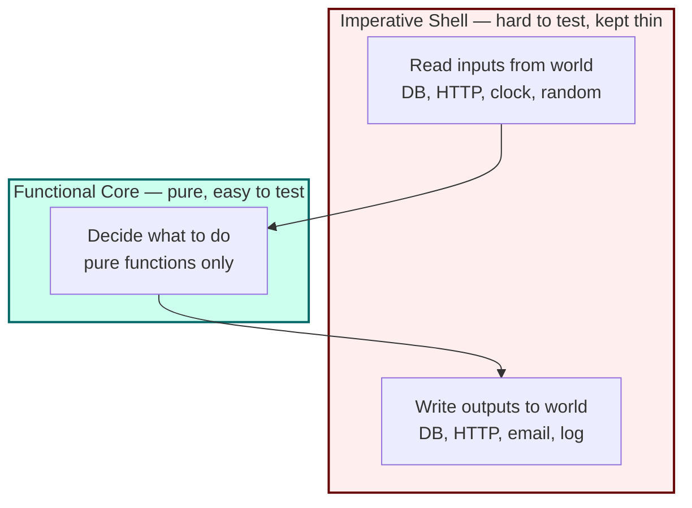
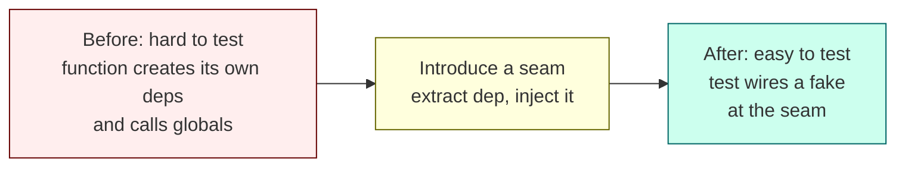
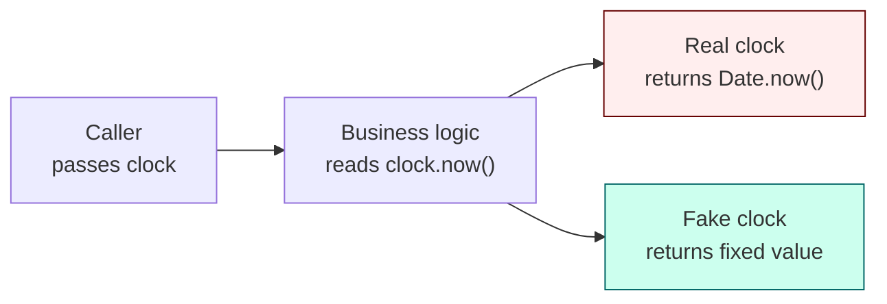
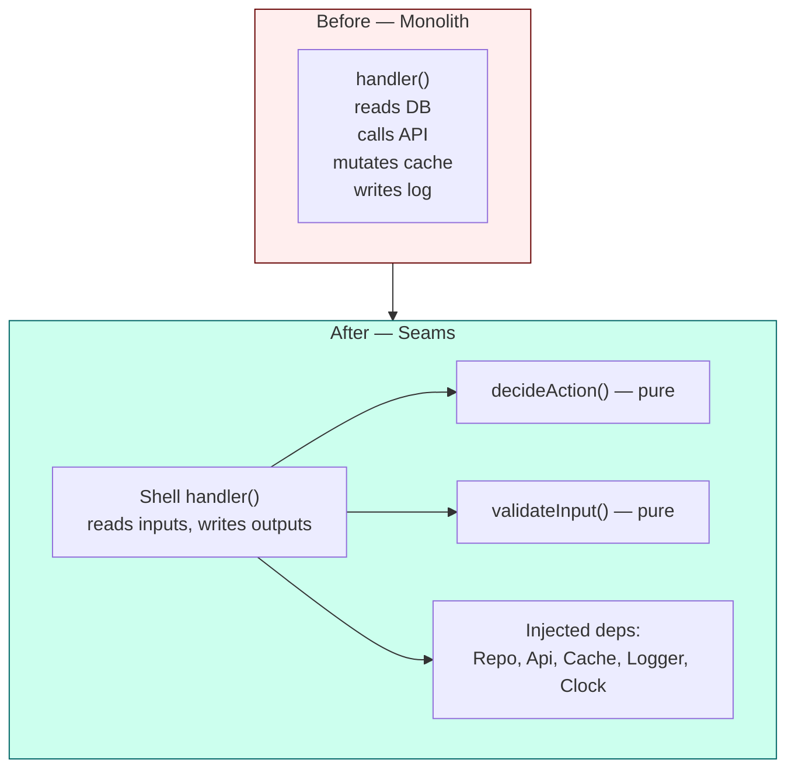

# 5.03 Testability by Design

> Testability is not a phase that happens after the code is written. It is a property of the code itself — woven into the structure of every function, every class boundary, every dependency arrow. Code that is hard to test is almost always hard to read, hard to change, and hard to reason about. The reverse is also true: code that is easy to test is almost always well-designed. This note treats testability as a first-class design goal, equal in weight to performance, security, and clarity. If you cannot test a function without standing up a database, hitting a live payment gateway, or freezing the system clock, the function is not finished. It needs to be taken apart and reassembled around a seam.

## 1. Purpose

Testability by Design exists because the cost of a bug compounds with the distance between where it is introduced and where it is caught. A logic error caught at the unit level costs seconds. The same error caught at the integration level costs minutes. Caught in staging, it costs hours. Caught in production, it costs customers. The cheapest possible bug is the one you catch the moment you write it, and the only way to catch bugs that fast is to write code that can be exercised in isolation, in milliseconds, without ceremony.

That requires deliberate design. Most code, written without testability in mind, is hostile to testing. It reaches into the file system at the top of a function, opens a database connection in the constructor, calls `Date.now()` midway through a calculation, mixes network calls with business logic, and depends on global singletons that leak state across test cases. To test such code you must either reproduce the entire world the code touches (an integration test, slow and brittle) or reach into the runtime and monkey-patch globals (a hack, fragile and invisible to the next reader). Both options punish you for writing the test, so you write fewer tests, so you ship more bugs.

Testability by Design flips the incentive. It says: structure the code so that the test is the easy path. Make the pure parts pure. Push the impure parts to the edges. Inject every external dependency through a constructor or a function parameter. Replace `Date.now()` with a `Clock` interface. Replace `Math.random()` with an injected PRNG. Replace `new Database()` with a `Repository` interface handed in from outside. When the code looks like this, the test setup is one line: construct the object with fakes, call the method, assert the result. No database. No network. No flakiness. No fear.

The principle that anchors everything is this: **if it is hard to test, refactor it.** Not "skip the test." Not "write a brittle integration test." Refactor the code until the test becomes trivial. The refactor almost always improves the code in other ways — it becomes more modular, more reusable, more readable, and more aligned with SOLID, especially the Dependency Inversion Principle. See [[4.05 SOLID Dependency Inversion]] and [[4.08 Dependency Injection DI]] for the architectural foundations.

What testable code looks like, in one paragraph: pure functions where possible, with side effects pushed to a thin outer shell; dependencies passed in through constructors or parameters rather than constructed internally; no hidden globals; no direct calls to time, randomness, or I/O from inside business logic; clear boundaries between "decide what to do" and "do it to the world." When you read testable code, you can point at any line and say exactly what inputs would exercise it and what outputs you would assert. That is the property this note teaches you to engineer.

The relationship to SOLID is direct. The Dependency Inversion Principle says high-level policy should depend on abstractions, not concretions. Testability is the operational payoff of DIP: when you depend on an abstraction, you can substitute a fake at the seam the abstraction creates. The Single Responsibility Principle ensures each unit has one reason to change and one thing to test. The Open/Closed Principle ensures you can add a new branch of behavior without rewriting existing tests. The Liskov Substitution Principle ensures your fakes obey the contract of the real thing. The Interface Segregation Principle ensures your tests only need to fake the methods they actually call. SOLID and testability are two views of the same structure. See [[4.01 SOLID Single Responsibility]], [[4.02 SOLID Open Closed]], [[4.03 SOLID Liskov Substitution]], [[4.04 SOLID Interface Segregation]] for the rest of the set.

Related foundational notes: [[5.01 Testing Pyramid and Trophy]], [[5.02 TDD Methodology]], [[5.04 Unit Testing Fundamentals]], [[1.13 Functional Programming Concepts]], [[4.09 Clean and Onion Architecture]].

## 2. Theory and Deep Dive

### 2.1 Pure Functions

A pure function has two properties. First, given the same inputs, it always returns the same output — referential transparency. Second, it produces no side effects — it does not mutate external state, write to disk, send a packet, increment a counter, log to a console, or throw based on anything other than its arguments. A pure function is a mathematical mapping from inputs to outputs. `add(a, b)` is pure. `getUser(id)` is impure if it hits a database. `now()` is impure if it reads the system clock. `random()` is impure if it reads a hardware entropy source.

Purity is the single most important property for testability. A pure function is trivially testable: call it with inputs, assert the output. There is no setup, no teardown, no mocking, no order dependence, no flakiness. The test reads like a table of input-output pairs. Property-based testing frameworks like fast-check can generate hundreds of inputs and check invariants, because the function is a closed system.

Side effects break purity. The classic side effects are: I/O (file, network, database, console), time (`Date.now()`, `setTimeout`, `performance.now()`), randomness (`Math.random`, `crypto.randomBytes`), mutation of shared state (global variables, singletons, mutable arguments passed by reference), and exceptions thrown for reasons other than the input (e.g., a network failure surfacing as an exception in a function that "should" just compute a value). Each of these introduces a hidden input — the state of the world — that the test cannot control without significant ceremony.

The strategy is not to eliminate side effects; software without side effects is useless. The strategy is to **push side effects to the edges**. Gary Bernhardt called this pattern "Functional Core, Imperative Shell." The core is a set of pure functions that take data in and return data out. The shell is a thin layer of imperative code that reads from the world, calls the core, and writes to the world. The shell is hard to test, so it stays small. The core is easy to test, so it holds all the business logic.



The diagram is the entire philosophy in one picture. Data flows in from the world, through the shell, into the core. The core computes a decision. The decision flows back out through the shell, into the world. The core never touches the world directly. The shell never makes decisions; it only translates.

### 2.2 Side Effects and Their Taxonomy

Not all side effects are created equal. It helps to categorize them by how hard they are to test.

**Observable side effects** are the easy ones. A function that writes to a file, sends an HTTP request, or inserts a row into a database does something you can observe after the fact. You can assert the file exists, you can intercept the HTTP request with a mock server, you can query the database. The test is annoying but possible.

**Hidden side effects** are harder. A function that reads from `process.env`, mutates a module-level cache, or increments a global counter changes the world in a way the test must know to look for. If the function does not announce this in its signature, the test will be surprised.

**Non-deterministic side effects** are the hardest. `Date.now()`, `Math.random()`, `crypto.randomBytes`, `setTimeout` with a real timer — these produce different results every time they are called. A test that depends on them is a test that fails once and passes the next run, eroding trust in the suite. The standard remedies are injection (pass a clock or PRNG) and fake timers (override the runtime's timer functions in tests). Injection is cleaner because it makes the dependency visible in the signature.

**Shared mutable state** is a special case. A singleton object that holds a cache, a connection pool, or a feature flag map is shared mutable state. Tests that touch it pollute each other unless you reset it between runs. The remedy is to never let business logic reach for a singleton directly; instead, inject the singleton (or a fake of it) as a dependency. Now each test gets its own.

### 2.3 Dependency Injection as Testability Mechanism

Dependency Injection (DI) is the practice of giving an object its collaborators from outside, rather than letting the object construct them itself. DI is most often discussed as an architectural pattern (see [[4.08 Dependency Injection DI]]) but its primary operational payoff is testability. When an object receives its dependencies through its constructor, the test constructs the same object with fakes and stubs.

The key insight: **the new keyword is the enemy of testability.** Every `new ConcreteDependency()` inside a method is a hard-coded collaborator the test cannot replace. The test must either run the real dependency (slow, networked, dangerous) or monkey-patch the module system (fragile, magical, invisible). When the dependency is injected, the test simply passes a different object.

DI goes hand in hand with depending on abstractions (interfaces in TypeScript, structural shapes in JavaScript). When the constructor accepts an interface, the test can pass any object that satisfies the interface — a real implementation, a hand-written stub, a Jest mock, a recording spy. This is the seam that makes testability possible.

### 2.4 Seams — Michael Feathers

In *Working Effectively with Legacy Code*, Michael Feathers defines a **seam** as a place in the code where you can alter behavior without editing the code itself. A seam has two parts: the place where behavior can be changed, and the enabling mechanism that lets you change it there.

Seams are the unit of testability. If your code has no seams, you cannot test it without editing it. If your code has many seams, you can test each piece in isolation. The art of designing for testability is, largely, the art of putting seams in the right places.

Feathers identified several kinds of seams. The three most relevant to JavaScript and TypeScript are:

**Object seams.** The most common and the most useful. An object seam is a place where you can substitute one object for another. Constructor injection creates an object seam: production wires the real `PaymentGateway`, tests wire a fake `PaymentGateway`. Method parameter injection creates an object seam: `charge(amount, gateway)` accepts any gateway the caller provides. Object seams are explicit, type-checkable in TypeScript, and self-documenting.

**Link seams.** A link seam is a place where you can swap the module that gets linked at runtime. In Node, this is what module mocking libraries like `jest.mock` and `proxyquire` exploit. You replace `require("node:fs")` with a fake module that returns canned data. Link seams are powerful but invisible — the production code looks like it calls the real module, and the test silently swaps it. This invisibility is a smell; object seams are preferred wherever possible. Link seams are the tool of last resort for third-party modules you cannot refactor.

**Compilation seams.** A compilation seam is a place where the compiler or preprocessor lets you choose between implementations. In C and C++, this is `#ifdef`. In TypeScript, conditional compilation is awkward but possible via build-time flag types and `declare` blocks. Compilation seams are rare in JavaScript and TypeScript, and you should treat their use as a sign that you wanted an object seam but reached for the wrong tool.

The archetypal seam-flavored smells Feathers catalogs — and they all apply to JavaScript — are:

- Construction of a concrete collaborator inside a method (`new Database()`), which closes the object seam.
- Direct call to a static method or global function (`Date.now()`, `Math.random()`, `fs.readFileSync`), which closes both the object and the link seam if the global is read at call time.
- Conditional logic based on environment variables read deep inside a method, which hides a hidden input the test cannot see.
- Inheritance for the purpose of overriding a method in tests, which works but couples the test to the internal structure of the production class.

The remedy for each is to introduce an object seam: extract the dependency, inject it, and let tests substitute.



### 2.5 The "Hard to Test" Smells

A short catalog of code patterns that scream "I am hard to test." Each smell has a one-line remedy.

- `new ConcreteDependency()` inside a method. Remedy: inject the dependency through the constructor or as a parameter.
- `Date.now()`, `new Date()`, `performance.now()` inside business logic. Remedy: inject a `Clock` interface.
- `Math.random()`, `crypto.randomBytes()` inside business logic. Remedy: inject a `RandomSource` interface.
- `fs.readFileSync`, `fetch`, `axios.get` inside business logic. Remedy: extract a `Reader` or `HttpClient` interface and inject it.
- `process.env.SECRET` read inside a method. Remedy: read env vars at startup, inject a typed `Config` object.
- Global mutable singletons (`global.cache`, `module.exports.singleton`). Remedy: inject the singleton as a dependency, or scope it to a class instance.
- `setTimeout`, `setInterval` with real timers. Remedy: inject a `Scheduler` interface, or use fake timers in the test.
- `console.log` inside business logic. Remedy: inject a `Logger` interface (or accept that the test ignores console output).
- Conditional behavior driven by the current day of week or hour of day. Remedy: compute the time once, pass it in as an argument.
- Mixed responsibility: a function that fetches a user, validates them, sends an email, and updates a cache. Remedy: split into pure decision functions and an imperative orchestrator.

### 2.6 The Cost-Benefit of Refactoring for Testability

Refactoring legacy code to introduce seams is expensive. You touch code that has no tests, so the refactor itself is risky. Feathers' techniques — Sprout Method, Sprout Class, Extract Interface, Parameterize Method, Override and Subclass to test — exist to make the refactor safe enough to attempt. The general approach: find the smallest piece you can extract as a pure function or an injectable dependency, extract it, write a test for the extracted piece, and repeat. Each pass shrinks the untested surface. See [[4.13 Refactoring Techniques]] for the catalog.

The benefit is cumulative. Once a module has seams, every future change to it can be test-driven. The cost of the initial refactor is paid back within the first few bug fixes the test suite catches.

## 3. Mental Models

### 3.1 "Can I Test This Without the World?"

Testability reduces to a single question: **can I test this function without the world?** "The world" is the database, the network, the file system, the system clock, the entropy source, the global state, the other microservices. If the answer is yes — if the function takes its inputs as arguments, returns its outputs as values, and touches nothing else — the function is testable. If the answer is no, the function depends on the world, and the test must either reproduce the world or stub it. The first option is slow; the second is fragile. Both are penalties. The goal is to arrange code so that the answer is yes for as much of the codebase as possible.

### 3.2 The Pure Function Metaphor

A pure function is a **black box with a hopper on top and a chute on the bottom**. You pour inputs in the hopper; outputs fall out the chute. Nothing else happens. The box does not remember what you poured in last time. The box does not know what time it is. The box does not whisper to its neighbors. Whatever the box does, it does solely as a function of what you poured in. Test the box by pouring in known inputs and checking what falls out. That is the whole test.

Where the metaphor breaks down: real software must do things to the world. A program that only computes outputs and never writes them anywhere is useless. The metaphor's resolution is the functional core, imperative shell. The pure functions are the boxes; the imperative shell is the human operator who pours inputs in, reads outputs out, and acts on them.

### 3.3 The Side Effect Metaphor

A side effect is **anything the function does that you cannot see by looking at its return value**. If the function writes to a file, the return value does not show the file. If the function increments a counter, the return value does not show the counter. If the function waits five seconds, the return value does not show the wait. Side effects are invisible from the signature. That invisibility is what makes them hard to test: the test must look outside the function to verify them.

The remedy is visibility. Make the side effect an explicit input or output. Instead of `save(record)` that writes to a hidden database, use `save(record, repository)` where the repository is visible. Instead of `now()` that reads a hidden clock, use `now(clock)` where the clock is visible. Visibility is testability.

### 3.4 The Seam Metaphor

A seam is **a zipper in the code**. Pull the zipper open and you can swap the inside for a different inside without disturbing the outside. The outside is the function signature — the call site does not change. The inside is the implementation — the test substitutes a different one. A zipper in the wrong place is useless; you want zippers where the code transitions from "pure decision" to "side effect," so the test can open the zipper, swap in a fake side effect, and run the decision logic against it.

Object seams are zippers sewn into the construction of an object: pull the constructor open, swap the real dependency for a fake. Link seams are zippers sewn into the module graph: pull the `require` call open, swap the real module for a fake. Both work, but object seams are visible in the type system and link seams are not. Prefer visible zippers.

### 3.5 The Functional Core, Imperative Shell Metaphor

Picture an egg. **The yolk is the functional core** — rich, dense, full of value, unchanged by being moved. **The white is the imperative shell** — thin, formless, takes the shape of whatever container it is in, the first thing to touch the pan. The yolk never touches the pan. The white shields it. In code: the yolk is your pure business logic; the white is your I/O layer. The pan is the operating system, the database, the network. The yolk computes; the white translates; the pan does the actual work. Test the yolk exhaustively. Test the white sparingly. Never let the yolk touch the pan.

Where the metaphor holds: the yolk is the part you most want to protect, and the white is the part you most want to keep thin. Where the metaphor breaks down: in an egg, the yolk and white are physically inseparable without breaking the egg. In code, the core and shell are separable by design — that is the whole point.

## 4. Real-World Use Cases

### 4.1 Refactoring Legacy Code by Introducing Seams

You inherit a five-year-old Node service. The user registration handler reads `process.env` for the SMTP host, calls `bcrypt.hash` directly, opens a `pg.Pool` connection inline, queries the database, sends an email with `nodemailer`, and writes a row to an audit log table — all in one 200-line function. There are no tests. The first task is not to write tests; it is to introduce seams.

Step one: extract the validation logic (email format, password strength) into a pure function `validateRegistration(input)` that returns either `{ ok: true, value: normalizedInput }` or `{ ok: false, errors: [...] }`. This function has no dependencies. Write tests for it immediately. Step two: extract the "decide what to do" logic into a pure function `planRegistration(validated, existingUser)` that returns a data structure describing the intended actions: `[{ kind: "hashPassword", password }, { kind: "insertUser", user }, { kind: "sendEmail", to, body }, { kind: "auditLog", event }]`. This function has no dependencies. Write tests for it. Step three: turn the original handler into a thin shell that calls `validateRegistration`, calls `planRegistration`, and then executes each planned action against injected collaborators (`Hasher`, `UserRepository`, `Mailer`, `AuditLog`). Now the shell is testable with fakes, and the core is tested exhaustively. The legacy function is now testable. See [[4.13 Refactoring Techniques]] for the Sprout and Extract patterns that make this safe.

### 4.2 Designing New Services with DI from the Start

When you greenfield a service, testability is free if you adopt a single rule: **no class constructs its own collaborators.** Every constructor takes its dependencies as parameters. Every dependency is typed as an interface. The composition root — the single place at startup where you wire real implementations together — is the only place `new` is allowed for collaborators. See [[4.08 Dependency Injection DI]] for the container patterns.

This rule, applied consistently, produces a codebase where every service can be tested in isolation by passing fakes to its constructor. No module mocking. No global patching. No flaky integration tests for logic that has no business being integration-tested. NestJS, Angular, and InversifyJS all enforce this rule structurally; you can adopt it in plain TypeScript with a one-page composition root.

### 4.3 Testing Time-Based Logic

Subscription renewals, password expiry, rate limit windows, cache TTLs, scheduled job triggers, "show this banner only on Mondays" — all depend on time. Naive code calls `Date.now()` inside the function. The test must either wait for the right time (impossible) or monkey-patch `Date` (fragile). The testable design injects a `Clock` interface.



In production, the composition root wires the real clock. In tests, the test constructs the logic with a fake clock and advances time by calling `fakeClock.advanceBy(hours)` between assertions. The logic is fully deterministic. The test runs in milliseconds. The fake clock is five lines of code.

### 4.4 Testing Randomness

Shuffling a playlist, generating a verification code, sampling a feature flag cohort, running a Monte Carlo simulation — all depend on randomness. Naive code calls `Math.random()` and the test cannot assert a specific outcome. The testable design injects a `RandomSource` interface. Production wires a `CryptoRandomSource` (or `MathRandomSource` if you do not need cryptographic strength). Tests wire a `SeededRandomSource` that uses a deterministic PRNG (a mulberry32 or a linear congruential generator) seeded with a fixed value. Now `shuffle(deck, random)` produces the exact same shuffled deck every test run, and the test can assert "after shuffle with seed 42, the deck is `[...]`." Bonus: the seeded source makes the test reproducible across machines and time zones.

### 4.5 Testing Database Code

A repository that owns its own `pg.Pool` is untestable without a real Postgres. The testable design extracts a `UserRepository` interface with methods like `findById(id)`, `save(user)`, `delete(id)`. The service depends on the interface. Production wires a `PostgresUserRepository`. Tests wire an `InMemoryUserRepository` — a `Map` wrapped in the interface. Logic tests run without a database. Integration tests, run separately and slowly, verify the `PostgresUserRepository` against a real Postgres in a container. The two test types are kept apart; the unit suite stays fast. See [[5.01 Testing Pyramid and Trophy]] for the layering.

### 4.6 Testing Code That Calls Third-Party HTTP APIs

You integrate with Stripe. Naive code calls `stripe.charges.create` inline. The test either hits Stripe's test mode (network, slow, rate-limited) or mocks the Stripe module with `jest.mock("stripe")` (link seam, invisible, fragile when Stripe renames methods). The testable design extracts a `PaymentGateway` interface with a `charge(amount, token)` method. Production wires a `StripePaymentGateway` that wraps the Stripe SDK. Tests wire a `RecordingPaymentGateway` that records calls and returns canned responses. The service test never imports Stripe. The Stripe wrapper is tested with a small, slow integration suite that hits Stripe's test mode.

This separation also pays off when Stripe changes their API. Only `StripePaymentGateway` changes. The service and its tests are untouched.

## 5. Code Examples

### 5.1 Example A — Minimal and Conceptual

We start with a tiny, classic case: a function that registers a user. The untestable version mixes validation, hashing, database insertion, and email sending into one function. The testable version separates the pure decision from the side effects and injects the collaborators.

**JavaScript — Untestable:**

```javascript
// register.js — untestable
const bcrypt = require("bcrypt");
const { Pool } = require("pg");
const nodemailer = require("nodemailer");

const pool = new Pool({ connectionString: process.env.databaseUrl });
const transporter = nodemailer.createTransport({ host: "smtp.example.com" });

async function registerUser(email, password) {
  if (!email.includes("@")) {
    throw new Error("invalid email");
  }
  if (password.length < 8) {
    throw new Error("password too short");
  }
  const hash = await bcrypt.hash(password, 12);
  const result = await pool.query(
    "insert into users (email, password-hash) values ($1, $2) returning id",
    [email, hash]
  );
  await transporter.sendMail({
    from: "no-reply@example.com",
    to: email,
    subject: "Welcome",
    text: "Welcome aboard",
  });
  return result.rows[0].id;
}

module.exports = { registerUser };
```

To test this you would need a real Postgres and a real SMTP server. The function has no seams. Refusing to test it is rational. Refactoring it is the correct move.

**JavaScript — Testable:**

```javascript
// register.js — testable
// Pure: validation only. No deps. Trivially testable.
function validateRegistration(email, password) {
  const errors = [];
  if (!email.includes("@")) errors.push("invalid email");
  if (password.length < 8) errors.push("password too short");
  return errors;
}

// Pure: decision only. Takes collaborators as args.
function planRegistration(email, password, deps) {
  const errors = validateRegistration(email, password);
  if (errors.length > 0) {
    return { ok: false, errors };
  }
  return {
    ok: true,
    plan: {
      email,
      password,
      sendWelcomeEmail: true,
    },
  };
}

// Imperative shell: executes the plan against injected deps.
async function registerUser(email, password, deps) {
  const decision = planRegistration(email, password, deps);
  if (!decision.ok) {
    throw new Error(decision.errors.join("; "));
  }
  const hash = await deps.hasher.hash(decision.plan.password);
  const id = await deps.users.insert({ email, passwordHash: hash });
  if (decision.plan.sendWelcomeEmail) {
    await deps.mailer.send({
      to: email,
      subject: "Welcome",
      text: "Welcome aboard",
    });
  }
  return id;
}

module.exports = { validateRegistration, planRegistration, registerUser };
```

```javascript
// register.test.js
const { validateRegistration, planRegistration, registerUser } = require("./register");

describe("validateRegistration", () => {
  test("rejects malformed email", () => {
    expect(validateRegistration("not-an-email", "longenough"))
      .toContain("invalid email");
  });
  test("rejects short password", () => {
    expect(validateRegistration("a@b.com", "short"))
      .toContain("password too short");
  });
  test("accepts valid input", () => {
    expect(validateRegistration("a@b.com", "longenough")).toEqual([]);
  });
});

describe("planRegistration", () => {
  test("returns ok with plan for valid input", () => {
    const decision = planRegistration("a@b.com", "longenough", {});
    expect(decision.ok).toBe(true);
    expect(decision.plan.email).toBe("a@b.com");
  });
});

describe("registerUser", () => {
  test("hashes, inserts, and emails with injected deps", async () => {
    const calls = { hashed: [], inserted: [], mailed: [] };
    const deps = {
      hasher: { hash: async (pw) => { calls.hashed.push(pw); return "hash:" + pw; } },
      users: { insert: async (u) => { calls.inserted.push(u); return "user-1"; } },
      mailer: { send: async (m) => { calls.mailed.push(m); } },
    };
    const id = await registerUser("a@b.com", "longenough", deps);
    expect(id).toBe("user-1");
    expect(calls.hashed).toEqual(["longenough"]);
    expect(calls.inserted[0].email).toBe("a@b.com");
    expect(calls.mailed[0].to).toBe("a@b.com");
  });
});
```

**TypeScript — Untestable:**

```typescript
// register.ts — untestable
import bcrypt from "bcrypt";
import { Pool } from "pg";
import nodemailer from "nodemailer";

const pool = new Pool({ connectionString: process.env.databaseUrl });
const transporter = nodemailer.createTransport({ host: "smtp.example.com" });

export async function registerUser(email: string, password: string): Promise<string> {
  if (!email.includes("@")) {
    throw new Error("invalid email");
  }
  if (password.length < 8) {
    throw new Error("password too short");
  }
  const hash = await bcrypt.hash(password, 12);
  const result = await pool.query<{ id: string }>(
    "insert into users (email, password-hash) values ($1, $2) returning id",
    [email, hash]
  );
  await transporter.sendMail({
    from: "no-reply@example.com",
    to: email,
    subject: "Welcome",
    text: "Welcome aboard",
  });
  return result.rows[0].id;
}
```

**TypeScript — Testable:**

```typescript
// register.ts — testable
export interface Hasher {
  hash(plain: string): Promise<string>;
}

export interface UserRepository {
  insert(user: { email: string; passwordHash: string }): Promise<string>;
}

export interface Mailer {
  send(message: { to: string; subject: string; text: string }): Promise<void>;
}

export interface RegistrationDeps {
  hasher: Hasher;
  users: UserRepository;
  mailer: Mailer;
}

export type ValidationError = "invalid email" | "password too short";

export function validateRegistration(
  email: string,
  password: string
): ValidationError[] {
  const errors: ValidationError[] = [];
  if (!email.includes("@")) errors.push("invalid email");
  if (password.length < 8) errors.push("password too short");
  return errors;
}

export interface RegistrationPlan {
  email: string;
  password: string;
  sendWelcomeEmail: boolean;
}

export type RegistrationDecision =
  | { ok: true; plan: RegistrationPlan }
  | { ok: false; errors: ValidationError[] };

export function planRegistration(
  email: string,
  password: string
): RegistrationDecision {
  const errors = validateRegistration(email, password);
  if (errors.length > 0) {
    return { ok: false, errors };
  }
  return {
    ok: true,
    plan: { email, password, sendWelcomeEmail: true },
  };
}

export async function registerUser(
  email: string,
  password: string,
  deps: RegistrationDeps
): Promise<string> {
  const decision = planRegistration(email, password);
  if (!decision.ok) {
    throw new Error(decision.errors.join("; "));
  }
  const hash = await deps.hasher.hash(decision.plan.password);
  const id = await deps.users.insert({ email, passwordHash: hash });
  if (decision.plan.sendWelcomeEmail) {
    await deps.mailer.send({
      to: email,
      subject: "Welcome",
      text: "Welcome aboard",
    });
  }
  return id;
}
```

```typescript
// register.test.ts
import { validateRegistration, planRegistration, registerUser, RegistrationDeps } from "./register";

describe("validateRegistration", () => {
  it("rejects malformed email", () => {
    expect(validateRegistration("not-an-email", "longenough")).toContain("invalid email");
  });
  it("rejects short password", () => {
    expect(validateRegistration("a@b.com", "short")).toContain("password too short");
  });
});

describe("planRegistration", () => {
  it("returns ok with plan for valid input", () => {
    const decision = planRegistration("a@b.com", "longenough");
    if (decision.ok) {
      expect(decision.plan.email).toBe("a@b.com");
    } else {
      fail("expected ok decision");
    }
  });
});

describe("registerUser", () => {
  it("hashes, inserts, and emails with injected deps", async () => {
    const calls = { hashed: [] as string[], inserted: [] as any[], mailed: [] as any[] };
    const deps: RegistrationDeps = {
      hasher: { hash: async (pw) => { calls.hashed.push(pw); return "hash:" + pw; } },
      users: { insert: async (u) => { calls.inserted.push(u); return "user-1"; } },
      mailer: { send: async (m) => { calls.mailed.push(m); } },
    };
    const id = await registerUser("a@b.com", "longenough", deps);
    expect(id).toBe("user-1");
    expect(calls.hashed).toEqual(["longenough"]);
    expect(calls.inserted[0].email).toBe("a@b.com");
    expect(calls.mailed[0].to).toBe("a@b.com");
  });
});
```

Notice the structural difference between the two versions: the untestable version has one function with five hard-coded dependencies; the testable version has three functions, two of which are pure and the third of which takes its dependencies as parameters. The testable version is also more readable: each function does one thing. Testability and readability arrived together.

### 5.2 Example B — Production-Grade

A larger case: a subscription renewal service. It must check whether a subscription is due for renewal, compute the renewal price (with a loyalty discount based on months subscribed), charge the payment method on file, extend the subscription, and emit a domain event. The untestable version would do all of this in one method. The production-grade version separates the pure decision logic from the side-effectful execution, injects every collaborator, and exposes a typed seam for each side effect.

**JavaScript — Production-grade:**

```javascript
// subscriptionService.js
class SubscriptionService {
  constructor(deps) {
    this.clock = deps.clock;
    this.subscriptions = deps.subscriptions;
    this.payments = deps.payments;
    this.events = deps.events;
    this.logger = deps.logger;
    this.pricing = deps.pricing;
  }

  // Pure decision: given a subscription and a current time, what should happen?
  decideRenewal(subscription, now) {
    const dueAt = subscription.currentPeriodEnd;
    if (now < dueAt) {
      return { kind: "not-due", subscriptionId: subscription.id };
    }
    if (subscription.status === "cancelled") {
      return { kind: "skip-cancelled", subscriptionId: subscription.id };
    }
    const monthsSubscribed = Math.floor(
      (now - subscription.startedAt) / (1000 * 60 * 60 * 24 * 30)
    );
    const discount = this.pricing.loyaltyDiscount(monthsSubscribed);
    const basePrice = subscription.planPriceCents;
    const chargeAmountCents = Math.round(basePrice * (1 - discount));
    return {
      kind: "renew",
      subscriptionId: subscription.id,
      customerId: subscription.customerId,
      paymentMethodId: subscription.paymentMethodId,
      chargeAmountCents,
      monthsSubscribed,
      newPeriodEnd: dueAt + 1000 * 60 * 60 * 24 * 30,
    };
  }

  async processRenewals() {
    const now = this.clock.now();
    const dueSubscriptions = await this.subscriptions.findDue(now);
    const results = [];
    for (const subscription of dueSubscriptions) {
      try {
        const decision = this.decideRenewal(subscription, now);
        if (decision.kind !== "renew") {
          results.push({ subscriptionId: subscription.id, outcome: decision.kind });
          continue;
        }
        const charge = await this.payments.charge({
          paymentMethodId: decision.paymentMethodId,
          amountCents: decision.chargeAmountCents,
          reference: `renewal-${decision.subscriptionId}-${now}`,
        });
        if (!charge.ok) {
          await this.events.emit("renewal.failed", {
            subscriptionId: decision.subscriptionId,
            reason: charge.reason,
          });
          results.push({ subscriptionId: subscription.id, outcome: "charge-failed" });
          continue;
        }
        await this.subscriptions.extend(decision.subscriptionId, decision.newPeriodEnd);
        await this.events.emit("renewal.succeeded", {
          subscriptionId: decision.subscriptionId,
          amountCents: decision.chargeAmountCents,
          monthsSubscribed: decision.monthsSubscribed,
        });
        results.push({ subscriptionId: subscription.id, outcome: "renewed" });
      } catch (err) {
        this.logger.error("renewal error", { subscriptionId: subscription.id, err });
        results.push({ subscriptionId: subscription.id, outcome: "error" });
      }
    }
    return results;
  }
}

module.exports = { SubscriptionService };
```

```javascript
// subscriptionService.test.js
const { SubscriptionService } = require("./subscriptionService");

function makeDeps(overrides = {}) {
  const calls = {
    charged: [],
    extended: [],
    emitted: [],
    found: [],
    logged: [],
  };
  const fakeClock = { now: () => makeDeps.fixedNow };
  const deps = {
    clock: overrides.clock ?? fakeClock,
    subscriptions: overrides.subscriptions ?? {
      findDue: async (now) => { calls.found.push(now); return overrides.dueSubscriptions ?? []; },
      extend: async (id, until) => { calls.extended.push({ id, until }); },
    },
    payments: overrides.payments ?? {
      charge: async (req) => { calls.charged.push(req); return overrides.chargeResult ?? { ok: true }; },
    },
    events: overrides.events ?? {
      emit: async (type, payload) => { calls.emitted.push({ type, payload }); },
    },
    logger: overrides.logger ?? {
      error: (msg, ctx) => { calls.logged.push({ msg, ctx }); },
    },
    pricing: overrides.pricing ?? {
      loyaltyDiscount: (months) => (months >= 12 ? 0.1 : 0),
    },
  };
  return { deps, calls };
}
makeDeps.fixedNow = Date.parse("2024-06-01T00:00:00Z");

describe("SubscriptionService.decideRenewal", () => {
  const service = new SubscriptionService(makeDeps().deps);
  const baseSub = {
    id: "sub-1",
    customerId: "cus-1",
    paymentMethodId: "pm-1",
    planPriceCents: 1000,
    startedAt: Date.parse("2023-01-01T00:00:00Z"),
    currentPeriodEnd: Date.parse("2024-05-01T00:00:00Z"),
    status: "active",
  };

  test("not due when now is before period end", () => {
    const decision = service.decideRenewal(baseSub, Date.parse("2024-04-15T00:00:00Z"));
    expect(decision.kind).toBe("not-due");
  });

  test("skips cancelled subscriptions", () => {
    const decision = service.decideRenewal({ ...baseSub, status: "cancelled" }, Date.parse("2024-06-01T00:00:00Z"));
    expect(decision.kind).toBe("skip-cancelled");
  });

  test("renews with loyalty discount after 12 months", () => {
    const decision = service.decideRenewal(baseSub, Date.parse("2024-06-01T00:00:00Z"));
    expect(decision.kind).toBe("renew");
    expect(decision.chargeAmountCents).toBe(900);
    expect(decision.monthsSubscribed).toBeGreaterThanOrEqual(12);
  });

  test("renews without discount under 12 months", () => {
    const youngSub = { ...baseSub, startedAt: Date.parse("2024-02-01T00:00:00Z") };
    const decision = service.decideRenewal(youngSub, Date.parse("2024-06-01T00:00:00Z"));
    expect(decision.kind).toBe("renew");
    expect(decision.chargeAmountCents).toBe(1000);
  });
});

describe("SubscriptionService.processRenewals", () => {
  test("charges, extends, and emits on success", async () => {
    const sub = {
      id: "sub-1",
      customerId: "cus-1",
      paymentMethodId: "pm-1",
      planPriceCents: 1000,
      startedAt: Date.parse("2023-01-01T00:00:00Z"),
      currentPeriodEnd: Date.parse("2024-05-01T00:00:00Z"),
      status: "active",
    };
    const { deps, calls } = makeDeps({ dueSubscriptions: [sub] });
    const service = new SubscriptionService(deps);
    const results = await service.processRenewals();
    expect(results[0].outcome).toBe("renewed");
    expect(calls.charged[0].amountCents).toBe(900);
    expect(calls.extended[0].id).toBe("sub-1");
    expect(calls.emitted[0].type).toBe("renewal.succeeded");
  });

  test("emits failure event when charge fails", async () => {
    const sub = {
      id: "sub-2",
      customerId: "cus-2",
      paymentMethodId: "pm-2",
      planPriceCents: 1000,
      startedAt: Date.parse("2023-01-01T00:00:00Z"),
      currentPeriodEnd: Date.parse("2024-05-01T00:00:00Z"),
      status: "active",
    };
    const { deps, calls } = makeDeps({
      dueSubscriptions: [sub],
      chargeResult: { ok: false, reason: "card-declined" },
    });
    const service = new SubscriptionService(deps);
    const results = await service.processRenewals();
    expect(results[0].outcome).toBe("charge-failed");
    expect(calls.emitted[0].type).toBe("renewal.failed");
    expect(calls.extended).toHaveLength(0);
  });
});
```

**TypeScript — Production-grade:**

```typescript
// subscriptionService.ts
export interface Clock {
  now(): number;
}

export interface Subscription {
  id: string;
  customerId: string;
  paymentMethodId: string;
  planPriceCents: number;
  startedAt: number;
  currentPeriodEnd: number;
  status: "active" | "cancelled" | "past-due";
}

export interface SubscriptionRepository {
  findDue(now: number): Promise<Subscription[]>;
  extend(subscriptionId: string, newPeriodEnd: number): Promise<void>;
}

export interface ChargeRequest {
  paymentMethodId: string;
  amountCents: number;
  reference: string;
}

export interface ChargeResult {
  ok: boolean;
  reason?: string;
}

export interface PaymentGateway {
  charge(req: ChargeRequest): Promise<ChargeResult>;
}

export interface EventEmitter {
  emit(type: string, payload: Record<string, unknown>): Promise<void>;
}

export interface Logger {
  error(message: string, context?: Record<string, unknown>): void;
}

export interface Pricing {
  loyaltyDiscount(monthsSubscribed: number): number;
}

export interface SubscriptionServiceDeps {
  clock: Clock;
  subscriptions: SubscriptionRepository;
  payments: PaymentGateway;
  events: EventEmitter;
  logger: Logger;
  pricing: Pricing;
}

export type RenewalDecision =
  | { kind: "not-due"; subscriptionId: string }
  | { kind: "skip-cancelled"; subscriptionId: string }
  | {
      kind: "renew";
      subscriptionId: string;
      customerId: string;
      paymentMethodId: string;
      chargeAmountCents: number;
      monthsSubscribed: number;
      newPeriodEnd: number;
    };

export interface RenewalResult {
  subscriptionId: string;
  outcome: "renewed" | "not-due" | "skip-cancelled" | "charge-failed" | "error";
}

const msPer30Days = 1000 * 60 * 60 * 24 * 30;

export class SubscriptionService {
  constructor(private readonly deps: SubscriptionServiceDeps) {}

  decideRenewal(subscription: Subscription, now: number): RenewalDecision {
    const dueAt = subscription.currentPeriodEnd;
    if (now < dueAt) {
      return { kind: "not-due", subscriptionId: subscription.id };
    }
    if (subscription.status === "cancelled") {
      return { kind: "skip-cancelled", subscriptionId: subscription.id };
    }
    const monthsSubscribed = Math.floor(
      (now - subscription.startedAt) / msPer30Days
    );
    const discount = this.deps.pricing.loyaltyDiscount(monthsSubscribed);
    const chargeAmountCents = Math.round(
      subscription.planPriceCents * (1 - discount)
    );
    return {
      kind: "renew",
      subscriptionId: subscription.id,
      customerId: subscription.customerId,
      paymentMethodId: subscription.paymentMethodId,
      chargeAmountCents,
      monthsSubscribed,
      newPeriodEnd: dueAt + msPer30Days,
    };
  }

  async processRenewals(): Promise<RenewalResult[]> {
    const now = this.deps.clock.now();
    const dueSubscriptions = await this.deps.subscriptions.findDue(now);
    const results: RenewalResult[] = [];
    for (const subscription of dueSubscriptions) {
      try {
        const decision = this.decideRenewal(subscription, now);
        if (decision.kind !== "renew") {
          results.push({ subscriptionId: subscription.id, outcome: decision.kind });
          continue;
        }
        const charge = await this.deps.payments.charge({
          paymentMethodId: decision.paymentMethodId,
          amountCents: decision.chargeAmountCents,
          reference: `renewal-${decision.subscriptionId}-${now}`,
        });
        if (!charge.ok) {
          await this.deps.events.emit("renewal.failed", {
            subscriptionId: decision.subscriptionId,
            reason: charge.reason ?? "unknown",
          });
          results.push({ subscriptionId: subscription.id, outcome: "charge-failed" });
          continue;
        }
        await this.deps.subscriptions.extend(
          decision.subscriptionId,
          decision.newPeriodEnd
        );
        await this.deps.events.emit("renewal.succeeded", {
          subscriptionId: decision.subscriptionId,
          amountCents: decision.chargeAmountCents,
          monthsSubscribed: decision.monthsSubscribed,
        });
        results.push({ subscriptionId: subscription.id, outcome: "renewed" });
      } catch (err) {
        this.deps.logger.error("renewal error", { subscriptionId: subscription.id, err });
        results.push({ subscriptionId: subscription.id, outcome: "error" });
      }
    }
    return results;
  }
}
```

```typescript
// subscriptionService.test.ts
import { SubscriptionService, SubscriptionServiceDeps, Subscription, ChargeResult } from "./subscriptionService";

function makeDeps(overrides: Partial<{
  dueSubscriptions: Subscription[];
  chargeResult: ChargeResult;
}> = {}): { deps: SubscriptionServiceDeps; calls: Record<string, unknown[]> } {
  const calls = {
    charged: [] as unknown[],
    extended: [] as unknown[],
    emitted: [] as unknown[],
    found: [] as unknown[],
    logged: [] as unknown[],
  };
  const fixedNow = Date.parse("2024-06-01T00:00:00Z");
  const deps: SubscriptionServiceDeps = {
    clock: { now: () => fixedNow },
    subscriptions: {
      findDue: async (now: number) => { calls.found.push(now); return overrides.dueSubscriptions ?? []; },
      extend: async (id: string, until: number) => { calls.extended.push({ id, until }); },
    },
    payments: {
      charge: async (req: unknown) => {
        calls.charged.push(req);
        return overrides.chargeResult ?? { ok: true };
      },
    },
    events: {
      emit: async (type: string, payload: unknown) => { calls.emitted.push({ type, payload }); },
    },
    logger: {
      error: (msg: string, ctx?: unknown) => { calls.logged.push({ msg, ctx }); },
    },
    pricing: {
      loyaltyDiscount: (months: number) => (months >= 12 ? 0.1 : 0),
    },
  };
  return { deps, calls };
}

const baseSub: Subscription = {
  id: "sub-1",
  customerId: "cus-1",
  paymentMethodId: "pm-1",
  planPriceCents: 1000,
  startedAt: Date.parse("2023-01-01T00:00:00Z"),
  currentPeriodEnd: Date.parse("2024-05-01T00:00:00Z"),
  status: "active",
};

describe("SubscriptionService.decideRenewal", () => {
  const service = new SubscriptionService(makeDeps().deps);

  it("returns not-due when now is before period end", () => {
    const decision = service.decideRenewal(baseSub, Date.parse("2024-04-15T00:00:00Z"));
    expect(decision.kind).toBe("not-due");
  });

  it("skips cancelled subscriptions", () => {
    const decision = service.decideRenewal(
      { ...baseSub, status: "cancelled" },
      Date.parse("2024-06-01T00:00:00Z")
    );
    expect(decision.kind).toBe("skip-cancelled");
  });

  it("applies loyalty discount after 12 months", () => {
    const decision = service.decideRenewal(baseSub, Date.parse("2024-06-01T00:00:00Z"));
    expect(decision.kind).toBe("renew");
    if (decision.kind === "renew") {
      expect(decision.chargeAmountCents).toBe(900);
      expect(decision.monthsSubscribed).toBeGreaterThanOrEqual(12);
    }
  });
});

describe("SubscriptionService.processRenewals", () => {
  it("charges, extends, and emits on success", async () => {
    const { deps, calls } = makeDeps({ dueSubscriptions: [baseSub] });
    const service = new SubscriptionService(deps);
    const results = await service.processRenewals();
    expect(results[0].outcome).toBe("renewed");
    expect(calls.charged).toHaveLength(1);
    expect(calls.extended).toHaveLength(1);
    expect(calls.emitted[0]).toMatchObject({ type: "renewal.succeeded" });
  });

  it("emits failure event when charge fails", async () => {
    const { deps, calls } = makeDeps({
      dueSubscriptions: [baseSub],
      chargeResult: { ok: false, reason: "card-declined" },
    });
    const service = new SubscriptionService(deps);
    const results = await service.processRenewals();
    expect(results[0].outcome).toBe("charge-failed");
    expect(calls.emitted[0]).toMatchObject({ type: "renewal.failed" });
    expect(calls.extended).toHaveLength(0);
  });
});
```

The TypeScript version adds type safety to every seam: the `SubscriptionServiceDeps` interface tells you exactly what the service needs, and the compiler verifies that every test fake satisfies the contract. The decision function `decideRenewal` is pure — given a subscription and a time, it returns a fully described decision without touching the world. The orchestrator `processRenewals` is the imperative shell that executes decisions against injected collaborators. Both are testable, but the decision function is the one you want to test exhaustively because it holds the pricing logic and the rules about who gets renewed.

## 6. Common Mistakes and Anti-Patterns

### 6.1 Mistake One — `new` Inside a Method

**JavaScript:**

```javascript
// broken: cannot swap the database
class UserService {
  async getUser(id) {
    const db = new Database(process.env.databaseUrl); // hard-coded
    return db.query("select * from users where id = $1", [id]);
  }
}
```

**TypeScript:**

```typescript
// broken: cannot swap the database
class UserService {
  async getUser(id: string): Promise<User> {
    const db = new Database(process.env.databaseUrl as string); // hard-coded
    return db.query<User>("select * from users where id = $1", [id]);
  }
}
```

**Why it fails:** every test constructs a real `Database`, which requires a real Postgres, which is slow and stateful. The `new` keyword closes the object seam; the test cannot substitute a fake without monkey-patching `Database`.

**Fix:** inject the dependency.

**JavaScript:**

```javascript
class UserService {
  constructor(db) { this.db = db; }
  async getUser(id) {
    return this.db.query("select * from users where id = $1", [id]);
  }
}
```

**TypeScript:**

```typescript
interface UserDatabase {
  query<T>(sql: string, params: unknown[]): Promise<T>;
}

class UserService {
  constructor(private readonly db: UserDatabase) {}
  async getUser(id: string): Promise<User> {
    return this.db.query<User>("select * from users where id = $1", [id]);
  }
}
```

Now the test passes any object that satisfies `UserDatabase`. The seam is open.

### 6.2 Mistake Two — `Date.now()` Inside Business Logic

**JavaScript:**

```javascript
// broken: non-deterministic
function isExpired(token) {
  return Date.now() > token.expiresAt; // hidden input: the system clock
}
```

**TypeScript:**

```typescript
// broken: non-deterministic
function isExpired(token: Token): boolean {
  return Date.now() > token.expiresAt; // hidden input: the system clock
}
```

**Why it fails:** the result depends on when the test runs. A test that asserts `isExpired` is `true` today may fail tomorrow if `expiresAt` is in the future. The test must monkey-patch `Date.now`, which is global and leaks across test files.

**Fix:** inject a clock.

**JavaScript:**

```javascript
function isExpired(token, clock) {
  return clock.now() > token.expiresAt;
}
// usage: isExpired(token, { now: () => Date.now() })
// test:  isExpired(token, { now: () => fixedNow })
```

**TypeScript:**

```typescript
interface Clock { now(): number; }

function isExpired(token: Token, clock: Clock): boolean {
  return clock.now() > token.expiresAt;
}
```

### 6.3 Mistake Three — Global Mutable State

**JavaScript:**

```javascript
// broken: tests pollute each other
const cache = new Map();
function getCachedUser(id) {
  if (cache.has(id)) return cache.get(id);
  const user = loadFromDb(id);
  cache.set(id, user);
  return user;
}
```

**TypeScript:**

```typescript
// broken: tests pollute each other
const cache = new Map<string, User>();
function getCachedUser(id: string): User {
  if (cache.has(id)) return cache.get(id) as User;
  const user = loadFromDb(id);
  cache.set(id, user);
  return user;
}
```

**Why it fails:** test A inserts a user into the cache. Test B reads the cache and gets test A's user. Tests must run in a specific order or must remember to clear the cache, neither of which scales.

**Fix:** encapsulate the cache in a class instance and inject it.

**JavaScript:**

```javascript
class UserCache {
  constructor(loader) { this.loader = loader; this.cache = new Map(); }
  get(id) {
    if (this.cache.has(id)) return this.cache.get(id);
    const user = this.loader(id);
    this.cache.set(id, user);
    return user;
  }
}
```

**TypeScript:**

```typescript
interface UserLoader { (id: string): User; }

class UserCache {
  private readonly cache = new Map<string, User>();
  constructor(private readonly loader: UserLoader) {}
  get(id: string): User {
    if (this.cache.has(id)) return this.cache.get(id) as User;
    const user = this.loader(id);
    this.cache.set(id, user);
    return user;
  }
}
```

Each test constructs a fresh `UserCache`. No pollution.

### 6.4 Mistake Four — No Dependency Injection at All

**JavaScript:**

```javascript
// broken: every collaborator is a hard import
const { sendEmail } = require("./mailer");
const { chargeCard } = require("./payments");

async function checkout(cart) {
  await chargeCard(cart.total, cart.token);
  await sendEmail(cart.customerEmail, "receipt");
}
```

**TypeScript:**

```typescript
// broken: every collaborator is a hard import
import { sendEmail } from "./mailer";
import { chargeCard } from "./payments";

async function checkout(cart: Cart): Promise<void> {
  await chargeCard(cart.total, cart.token);
  await sendEmail(cart.customerEmail, "receipt");
}
```

**Why it fails:** the only way to substitute `sendEmail` and `chargeCard` is to mock the module system with `jest.mock`. This is a link seam: invisible in the production code, fragile to refactors, and confusing to readers who do not realize the imports are being swapped.

**Fix:** inject the collaborators.

**JavaScript:**

```javascript
async function checkout(cart, deps) {
  await deps.payments.charge(cart.total, cart.token);
  await deps.mailer.send(cart.customerEmail, "receipt");
}
```

**TypeScript:**

```typescript
interface CheckoutDeps {
  payments: { charge(amount: number, token: string): Promise<void> };
  mailer: { send(to: string, body: string): Promise<void> };
}

async function checkout(cart: Cart, deps: CheckoutDeps): Promise<void> {
  await deps.payments.charge(cart.total, cart.token);
  await deps.mailer.send(cart.customerEmail, "receipt");
}
```

The test passes fakes. No module mocking. The dependency is visible in the signature.

### 6.5 Mistake Five — Testing the Implementation Instead of the Behavior

**JavaScript:**

```javascript
// broken: brittle test
test("sort calls the comparator at least twice", () => {
  const comparator = jest.fn();
  sort([3, 1, 2], comparator);
  expect(comparator).toHaveBeenCalledTimes(3); // implementation detail
});
```

**TypeScript:**

```typescript
// broken: brittle test
test("sort calls the comparator at least twice", () => {
  const comparator = jest.fn((a: number, b: number) => a - b);
  sort([3, 1, 2], comparator);
  expect(comparator).toHaveBeenCalledTimes(3); // implementation detail
});
```

**Why it fails:** the test asserts how the function works, not what it does. Change the sort algorithm from bubble sort to quicksort — the output is identical, but the call count changes, and the test fails. The test punishes every improvement to the implementation.

**Fix:** assert the behavior.

**JavaScript:**

```javascript
test("sort returns elements in ascending order", () => {
  const result = sort([3, 1, 2], (a, b) => a - b);
  expect(result).toEqual([1, 2, 3]);
});
```

**TypeScript:**

```typescript
test("sort returns elements in ascending order", () => {
  const result = sort([3, 1, 2], (a: number, b: number) => a - b);
  expect(result).toEqual([1, 2, 3]);
});
```

The test survives any implementation change that preserves the contract.

### 6.6 Mistake Six — No Seams, So No Refactoring

**JavaScript:**

```javascript
// broken: monolithic handler
async function handler(req, res) {
  const body = JSON.parse(req.body);
  if (!body.email) return res.status(400).send("missing email");
  const existing = await db.query("select * from users where email = $1", [body.email]);
  if (existing.rows.length > 0) return res.status(409).send("exists");
  const hash = await bcrypt.hash(body.password, 12);
  const result = await db.query("insert into users ...");
  await mailer.send(...);
  res.status(201).json({ id: result.rows[0].id });
}
```

**TypeScript:**

```typescript
// broken: monolithic handler
async function handler(req: Request, res: Response): Promise<void> {
  const body = JSON.parse(req.body) as RegisterBody;
  if (!body.email) return res.status(400).send("missing email");
  const existing = await db.query<UserRow>("select * from users where email = $1", [body.email]);
  if (existing.rows.length > 0) return res.status(409).send("exists");
  const hash = await bcrypt.hash(body.password, 12);
  const result = await db.query<{ id: string }>("insert into users ...");
  await mailer.send(...);
  res.status(201).json({ id: result.rows[0].id });
}
```

**Why it fails:** the handler does parsing, validation, existence check, hashing, insertion, and email in one body. There is no seam. Any change risks breaking five concerns at once. You cannot test the validation without a database. You cannot test the hashing without an email server. The function is a wall.

**Fix:** extract pure decision functions and inject collaborators (as in Example A and Example B above). The handler shrinks to: parse, call decision function, execute planned actions against injected deps, send response.

### 6.7 Mistake Seven — `Math.random()` for Testable Logic

**JavaScript:**

```javascript
// broken: non-deterministic
function rollDie() {
  return 1 + Math.floor(Math.random() * 6);
}
```

**TypeScript:**

```typescript
// broken: non-deterministic
function rollDie(): number {
  return 1 + Math.floor(Math.random() * 6);
}
```

**Why it fails:** every call returns a different value. Tests cannot assert specific rolls. Tests that assert "the result is between 1 and 6" are weak and miss bugs in the floor arithmetic.

**Fix:** inject a random source.

**JavaScript:**

```javascript
function rollDie(random) {
  return 1 + Math.floor(random.next() * 6);
}
// production: rollDie({ next: () => Math.random() })
// test:      rollDie({ next: () => 0.0 }) === 1
//            rollDie({ next: () => 0.999 }) === 6
```

**TypeScript:**

```typescript
interface RandomSource { next(): number; }

function rollDie(random: RandomSource): number {
  return 1 + Math.floor(random.next() * 6);
}
```

Now edge cases are exactly testable.

### 6.8 Mistake Eight — Inheritance to Override Methods in Tests

**JavaScript:**

```javascript
// broken: test subclass couples test to internal structure
class FakeUserService extends UserService {
  getUser(id) { return { id, email: "fake@example.com" }; }
}
```

**TypeScript:**

```typescript
// broken: test subclass couples test to internal structure
class FakeUserService extends UserService {
  override getUser(id: string): User {
    return { id, email: "fake@example.com" };
  }
}
```

**Why it fails:** the test reaches into the class hierarchy. If `UserService` changes its internals, the fake breaks. The fake also inherits all of the real class's constructor dependencies, so the test must still construct them. Inheritance for testability is a smell; composition is the remedy.

**Fix:** extract an interface and inject a fake that implements it.

**JavaScript:**

```javascript
class FakeUserService {
  getUser(id) { return { id, email: "fake@example.com" }; }
}
// production wires real UserService; tests wire FakeUserService
```

**TypeScript:**

```typescript
interface UserService {
  getUser(id: string): User;
}

class FakeUserService implements UserService {
  getUser(id: string): User {
    return { id, email: "fake@example.com" };
  }
}
```

The fake is independent of the real class. Either can change without breaking the other.

## 7. Best Practices and Design Patterns

### 7.1 Make Functions Pure Where Possible

Default to pure functions. A function that takes data in and returns data out, with no side effects, is the most reusable, most testable, most readable unit of code you can write. Reserve side effects for the places where they are unavoidable, and isolate them. The rule of thumb: if you can write it as a pure function, write it as a pure function. See [[1.13 Functional Programming Concepts]].

### 7.2 Push Side Effects to the Edges

Side effects belong at the edges of your application — the HTTP handlers, the message queue consumers, the job runners, the CLI entry points. The interior should be pure. The edge reads the request, calls pure decision functions, and writes the response. The thinner the edge, the smaller the untestable surface. The Functional Core, Imperative Shell pattern is the canonical expression of this rule.

### 7.3 Inject Every External Dependency

Database, HTTP client, clock, random source, file system, env vars, logger, feature flags — every one of these is a dependency. Inject it through a constructor or a function parameter. Type it as an interface in TypeScript. The composition root is the only place that wires real implementations. Every other layer depends on the interface. This is the Dependency Inversion Principle in practice; see [[4.05 SOLID Dependency Inversion]] and [[4.08 Dependency Injection DI]].

### 7.4 Avoid Global State

Globals are test pollution waiting to happen. A test that mutates a global affects every test that runs after it. The remedies: encapsulate state in class instances that the test constructs fresh; pass state through function parameters; use dependency scopes (request-scoped in NestJS, asyncLocalStorage in Node) instead of module-level variables. If you must use a global, document it loudly and reset it in `beforeEach`.

### 7.5 Test Behavior, Not Implementation

Assert what the function returns and what observable side effects it produces. Do not assert how many times it called an internal helper, what order it called collaborators in (unless order is part of the contract), or which private method it invoked. Implementation-coupled tests break under refactoring and provide no additional safety. Behavior-coupled tests survive refactors and document the contract.

### 7.6 Refactor for Testability Before Writing Tests

When you encounter untested legacy code, do not write tests against the current shape — they will be brittle. Refactor first: extract pure functions, introduce seams, inject dependencies. Then write tests against the new shape. The refactor is itself risky without tests, so use Feathers' techniques (Sprout Method, Extract Interface, Parameterize Method) to make the refactor safe. See [[4.13 Refactoring Techniques]] and [[5.02 TDD Methodology]].

### 7.7 Use Fake Implementations Over Mock Objects Where Possible

A hand-written fake that implements an interface (an in-memory repository, a recording mailer, a fake clock) is more readable and more durable than a mock that asserts specific call sequences. Mocks couple the test to the call sequence; fakes couple the test only to the contract. Use mocks for narrow assertions ("did we call charge with these exact arguments?") and fakes for everything else. The classical vs. London school debate centers on this; see [[5.04 Unit Testing Fundamentals]].

### 7.8 Keep the Imperative Shell Thin

The shell is the part you cannot easily test. Keep it thin. The shell should read inputs, call the core, write outputs, and do nothing else. If the shell starts making decisions, push those decisions into the core. If the shell starts holding state, extract that state into an injected collaborator. A good shell is boring.

### 7.9 Make Time and Randomness First-Class Dependencies

Treat `Clock` and `RandomSource` as you would treat a database: interfaces, injected, fakeable in tests. The cost is one extra constructor parameter. The benefit is that every time-based and random-based function becomes deterministic and testable. The fake clock is five lines; the fake random source is ten. Both pay back their cost within the first test.

### 7.10 Design Interfaces for Testability

When you define an interface, think about how a fake would implement it. If the interface has twenty methods, the fake must implement all twenty even if the test only exercises two. Apply the Interface Segregation Principle: split the interface into smaller ones, each with the methods one collaborator needs. Fakes become trivial. See [[4.04 SOLID Interface Segregation]].

## 8. Technical Interview Knowledge

### 8.1 Q: What is testability?

**A:** Testability is a property of code that measures how easily and reliably the code can be exercised by automated tests. Highly testable code can be tested in isolation, with no external dependencies standing up, in milliseconds, deterministically. Low-testability code requires real databases, real networks, real clocks, or specific environmental conditions to test, and its tests are slow, brittle, or impossible. Testability is a design property: it is determined by how the code is structured, not by the testing tools. The key indicators are pure functions for logic, injected dependencies for collaborators, no hidden globals, and clear seams where behavior can be substituted.

**Trap to avoid:** confusing "we have tests" with "the code is testable." A codebase can have hundreds of tests and still be low-testability if every test takes seconds and flakes randomly.

### 8.2 Q: What is a pure function?

**A:** A pure function has two properties: referential transparency (same inputs always produce the same output) and no side effects (the function does not mutate external state, perform I/O, read the clock, or generate randomness). Pure functions are trivially testable because they are closed systems — the test controls all inputs through arguments and observes all outputs through the return value. Examples: `add(a, b)`, `formatDate(timestamp, pattern)`, `decideRenewal(subscription, now)`. Counter-examples: `getUser(id)` (database), `now()` (clock), `random()` (entropy).

**Trap to avoid:** claiming a function is pure because it does not `return` a side effect. Mutating an argument passed by reference is a side effect even if the function returns nothing.

### 8.3 Q: What is a seam?

**A:** A seam, in Michael Feathers' definition, is a place in the code where you can alter behavior without editing the code itself. A seam has two parts: the place where behavior can be changed, and the enabling mechanism that allows the change. In JavaScript and TypeScript, the most useful seams are object seams (substitute one object for another at construction or call time) and link seams (substitute one module for another at require time). Object seams are created by dependency injection; link seams are created by module mocking. Object seams are preferred because they are visible in the type system and self-documenting. Seams are the unit of testability: code without seams cannot be tested without editing.

**Trap to avoid:** confusing "I can monkey-patch this" with "this has a seam." Monkey-patching is a link seam and is fragile; a true object seam is explicit in the code's structure.

### 8.4 Q: How do you make code testable?

**A:** Apply four moves. First, identify the pure decision logic and extract it into functions that take data in and return data out. Second, identify every external dependency (database, HTTP, clock, random, file system, env vars) and inject it through a constructor or function parameter, typed as an interface. Third, push side effects to the edges — the HTTP handler reads the request, calls the pure functions, writes the response; the pure functions never touch the world. Fourth, eliminate hidden globals and shared mutable state by encapsulating them in injected collaborators. The result is code where every unit can be tested with fakes in milliseconds, deterministically.

**Trap to avoid:** stopping at "inject the database." Time and randomness are dependencies too, and they are the most common source of flaky tests.

### 8.5 Q: What is Functional Core, Imperative Shell?

**A:** A design pattern, named by Gary Bernhardt, in which the application is split into two layers. The core is a set of pure functions that take data in and return data out — no side effects, fully testable, holds all the business logic. The shell is a thin imperative layer that reads inputs from the world, calls the core, and writes outputs to the world. The shell is hard to test, so it stays small and boring. The core is easy to test, so it holds all the decisions. The boundary between core and shell is where the side effects live; everything inside the boundary is pure. The pattern is the operational form of the Dependency Inversion Principle applied to side effects.

**Trap to avoid:** putting business logic in the shell "just this once." Logic in the shell is untested logic; it accumulates and rots.

### 8.6 Q: How do you test time-based logic?

**A:** Inject a `Clock` interface with a `now()` method. In production, wire a `SystemClock` that returns `Date.now()`. In tests, wire a `FakeClock` that holds a mutable timestamp and exposes `advanceBy(ms)` and `setNow(ts)`. Every function that needs the current time takes the clock as a parameter or reads it from an injected collaborator. The test sets the fake clock to a known time, calls the function, advances the clock, calls again, and asserts the change. The function is fully deterministic; the test runs in milliseconds. Never call `Date.now()` directly inside business logic; that is a hidden input the test cannot control.

**Trap to avoid:** using `jest.useFakeTimers()` as a substitute for injecting a clock. Fake timers work but are global, invisible, and leak across tests. An injected clock is local, visible, and typed.

### 8.7 Q: How do you test randomness?

**A:** Inject a `RandomSource` interface with a `next()` method (and any other primitives you need, like `nextInt(min, max)` or `pick(array)`). In production, wire a `CryptoRandomSource` (for security-sensitive randomness) or a `MathRandomSource` (for non-security uses). In tests, wire a `SeededRandomSource` that wraps a deterministic PRNG (mulberry32, xorshift, or a linear congruential generator) seeded with a fixed value. The test asserts exact outcomes: "with seed 42, the shuffle produces this exact deck." This makes the test reproducible across machines and CI runs. For tests that do not need exact values, you can use a recording random source that returns a queue of canned values.

**Trap to avoid:** using `Math.random()` inside logic and asserting "the result is between 0 and 1." That assertion is too weak to catch off-by-one errors in the floor arithmetic.

### 8.8 Q: What makes code hard to test?

**A:** Six common smells. One, construction of concrete dependencies inside methods (`new Database()`) — closes the object seam. Two, direct calls to `Date.now()`, `Math.random()`, `fs.readFileSync` — non-deterministic or side-effectful globals the test cannot easily control. Three, global mutable state — test pollution. Four, no dependency injection — every collaborator is hard-coded, requiring module mocking to substitute. Five, monolithic functions that mix parsing, validation, business logic, and I/O — no seam to test any piece in isolation. Six, testing the implementation instead of the behavior — tests that assert call counts or internal method order are brittle and punish refactoring. Each smell has a remedy: inject the dependency, push the side effect to the edge, split the function, assert behavior.

**Trap to avoid:** blaming the testing framework for slow or flaky tests. The framework is fine; the code is untestable. Refactor the code.

## 9. Practical Exercises

### 9.1 Exercise One — Refactor Untestable Code to Testable

**Goal:** Take a function with hard-coded dependencies and refactor it into a pure decision function plus an imperative shell with injected collaborators.

**Setup:**

```javascript
// promo.js — untestable
const { Pool } = require("pg");
const pool = new Pool({ connectionString: process.env.databaseUrl });

async function applyPromo(code, cart) {
  const result = await pool.query("select * from promos where code = $1", [code]);
  if (result.rows.length === 0) return { ok: false, reason: "unknown-code" };
  const promo = result.rows[0];
  if (promo.expiresAt < Date.now()) return { ok: false, reason: "expired" };
  if (cart.totalCents < promo.minCartCents) return { ok: false, reason: "below-minimum" };
  const discount = promo.kind === "percent"
    ? Math.round(cart.totalCents * promo.value / 100)
    : promo.value;
  return { ok: true, discountCents: Math.min(discount, cart.totalCents) };
}
```

**Steps:**

1. Identify the pure decision: given a promo and a cart and a current time, compute the discount or refusal.
2. Extract that decision into a pure function with no dependencies.
3. Rewrite `applyPromo` as a shell that loads the promo from an injected repository and calls the pure function with an injected clock.
4. Write tests for the pure function covering each branch: unknown code, expired, below minimum, percent discount, fixed discount, discount capped at cart total.
5. Write a test for the shell using a fake repository and a fake clock.

**Full worked solution (JavaScript):**

```javascript
// promo.js — testable
function decidePromo(promo, cart, now) {
  if (promo === null) return { ok: false, reason: "unknown-code" };
  if (promo.expiresAt < now) return { ok: false, reason: "expired" };
  if (cart.totalCents < promo.minCartCents) return { ok: false, reason: "below-minimum" };
  const discount = promo.kind === "percent"
    ? Math.round(cart.totalCents * promo.value / 100)
    : promo.value;
  return { ok: true, discountCents: Math.min(discount, cart.totalCents) };
}

async function applyPromo(code, cart, deps) {
  const promo = await deps.promos.findByCode(code);
  return decidePromo(promo, cart, deps.clock.now());
}

module.exports = { decidePromo, applyPromo };
```

```javascript
// promo.test.js
const { decidePromo, applyPromo } = require("./promo");

describe("decidePromo", () => {
  const cart = { totalCents: 5000 };
  const now = 1000;
  test("unknown code", () => {
    expect(decidePromo(null, cart, now)).toEqual({ ok: false, reason: "unknown-code" });
  });
  test("expired", () => {
    const promo = { expiresAt: 999, minCartCents: 0, kind: "fixed", value: 100 };
    expect(decidePromo(promo, cart, now)).toEqual({ ok: false, reason: "expired" });
  });
  test("below minimum", () => {
    const promo = { expiresAt: 2000, minCartCents: 9999, kind: "fixed", value: 100 };
    expect(decidePromo(promo, cart, now)).toEqual({ ok: false, reason: "below-minimum" });
  });
  test("percent discount", () => {
    const promo = { expiresAt: 2000, minCartCents: 0, kind: "percent", value: 10 };
    expect(decidePromo(promo, cart, now)).toEqual({ ok: true, discountCents: 500 });
  });
  test("fixed discount", () => {
    const promo = { expiresAt: 2000, minCartCents: 0, kind: "fixed", value: 700 };
    expect(decidePromo(promo, cart, now)).toEqual({ ok: true, discountCents: 700 });
  });
  test("discount capped at cart total", () => {
    const small = { totalCents: 100 };
    const promo = { expiresAt: 2000, minCartCents: 0, kind: "fixed", value: 700 };
    expect(decidePromo(promo, small, now)).toEqual({ ok: true, discountCents: 100 });
  });
});

describe("applyPromo", () => {
  test("loads promo and delegates to decision", async () => {
    const deps = {
      promos: { findByCode: async (code) => code === "SAVE10" ? { expiresAt: 2000, minCartCents: 0, kind: "percent", value: 10 } : null },
      clock: { now: () => 1000 },
    };
    const result = await applyPromo("SAVE10", { totalCents: 5000 }, deps);
    expect(result).toEqual({ ok: true, discountCents: 500 });
  });
});
```

**TypeScript version:**

```typescript
// promo.ts — testable
export interface Promo {
  expiresAt: number;
  minCartCents: number;
  kind: "percent" | "fixed";
  value: number;
}

export interface Cart {
  totalCents: number;
}

export type PromoDecision =
  | { ok: true; discountCents: number }
  | { ok: false; reason: "unknown-code" | "expired" | "below-minimum" };

export interface PromoRepository {
  findByCode(code: string): Promise<Promo | null>;
}

export interface Clock {
  now(): number;
}

export interface PromoDeps {
  promos: PromoRepository;
  clock: Clock;
}

export function decidePromo(promo: Promo | null, cart: Cart, now: number): PromoDecision {
  if (promo === null) return { ok: false, reason: "unknown-code" };
  if (promo.expiresAt < now) return { ok: false, reason: "expired" };
  if (cart.totalCents < promo.minCartCents) return { ok: false, reason: "below-minimum" };
  const discount = promo.kind === "percent"
    ? Math.round(cart.totalCents * promo.value / 100)
    : promo.value;
  return { ok: true, discountCents: Math.min(discount, cart.totalCents) };
}

export async function applyPromo(code: string, cart: Cart, deps: PromoDeps): Promise<PromoDecision> {
  const promo = await deps.promos.findByCode(code);
  return decidePromo(promo, cart, deps.clock.now());
}
```

**Reasoning:** `decidePromo` is pure — every input is an argument, every output is the return value, no I/O. Six tests cover every branch deterministically. `applyPromo` is a thin shell that loads one row and delegates. The shell test uses a fake repository (a function returning canned promos) and a fake clock. No database, no real time, no flakiness.

### 9.2 Exercise Two — Identify Seams in Existing Code

**Goal:** Given a snippet, identify every seam, classify it (object, link, compilation), and propose a refactor that converts link seams into object seams.

**Setup:**

```javascript
// logger.js
const fs = require("fs");
const path = require("path");

function logToFile(message) {
  const line = `[${new Date().toISOString()}] ${message}\n`;
  fs.appendFileSync(path.join(process.env.logDir ?? "/tmp", "app.log"), line);
}

module.exports = { logToFile };
```

**Steps:**

1. Identify every dependency the function touches.
2. Classify each as a current seam or a closed seam.
3. Refactor to open object seams.

**Full worked solution:**

Dependencies identified:

- `fs` — a module-level import. Currently a link seam (you can `jest.mock("fs")`), but no object seam exists. The function calls `fs.appendFileSync` directly.
- `path` — a module-level import. Pure module, but the call to `path.join` is hard-coded.
- `new Date()` — a hidden input, the system clock. No seam.
- `process.env.logDir` — a hidden input, the process environment. No seam.
- The file path string `app.log` — a hard-coded constant. No seam.

Current seam classification:

- Link seam: `fs` (via `jest.mock("fs")`). Fragile and invisible.
- Link seam: `path` (via `jest.mock("path")`). Even more fragile.
- No object seams. No compilation seams.

Refactored to open object seams:

```javascript
// logger.js — testable
function formatLogLine(message, now) {
  return `[${new Date(now).toISOString()}] ${message}\n`;
}

function logToFile(message, deps) {
  const line = formatLogLine(message, deps.clock.now());
  const fullPath = deps.path.join(deps.config.logDir, "app.log");
  deps.fs.appendFileSync(fullPath, line);
}

module.exports = { formatLogLine, logToFile };
```

```javascript
// logger.test.js
const { formatLogLine, logToFile } = require("./logger");

describe("formatLogLine", () => {
  test("formats with ISO timestamp", () => {
    const fixed = Date.parse("2024-06-01T12:00:00Z");
    expect(formatLogLine("hello", fixed)).toBe("[2024-06-01T12:00:00.000Z] hello\n");
  });
});

describe("logToFile", () => {
  test("writes formatted line to the configured path", () => {
    const calls = [];
    const deps = {
      clock: { now: () => Date.parse("2024-06-01T12:00:00Z") },
      path: { join: (...parts) => parts.join("/") },
      fs: { appendFileSync: (path, content) => calls.push({ path, content }) },
      config: { logDir: "/var/log" },
    };
    logToFile("hello", deps);
    expect(calls[0].path).toBe("/var/log/app.log");
    expect(calls[0].content).toContain("hello");
  });
});
```

**Reasoning:** the pure function `formatLogLine` is trivially testable. The shell `logToFile` now has every dependency visible in its signature: clock, path, fs, config. The test provides fakes for each. No module mocking. The link seams have been converted to object seams, which are typed (in TypeScript) and self-documenting.

### 9.3 Exercise Three — Inject a Clock for Time-Based Logic

**Goal:** Refactor a function that uses `Date.now()` to use an injected clock, and write tests that exercise time-based branches deterministically.

**Setup:**

```javascript
// session.js — untestable
function isSessionActive(session) {
  const now = Date.now();
  return session.startedAt <= now && now < session.startedAt + session.durationMs;
}
```

**Steps:**

1. Define a `Clock` interface.
2. Change `isSessionActive` to take a clock parameter.
3. Write tests for: now is before start, now is at start, now is mid-session, now is exactly at end, now is after end.

**Full worked solution (JavaScript):**

```javascript
// session.js — testable
function isSessionActive(session, clock) {
  const now = clock.now();
  return session.startedAt <= now && now < session.startedAt + session.durationMs;
}

module.exports = { isSessionActive };
```

```javascript
// session.test.js
const { isSessionActive } = require("./session");

function fakeClock(fixed) {
  return { now: () => fixed };
}

const session = { startedAt: 1000, durationMs: 5000 };

test("inactive before start", () => {
  expect(isSessionActive(session, fakeClock(999))).toBe(false);
});

test("active at start", () => {
  expect(isSessionActive(session, fakeClock(1000))).toBe(true);
});

test("active mid-session", () => {
  expect(isSessionActive(session, fakeClock(3000))).toBe(true);
});

test("inactive exactly at end", () => {
  expect(isSessionActive(session, fakeClock(6000))).toBe(false);
});

test("inactive after end", () => {
  expect(isSessionActive(session, fakeClock(9999))).toBe(false);
});
```

**TypeScript version:**

```typescript
// session.ts — testable
export interface Clock { now(): number; }

export interface Session {
  startedAt: number;
  durationMs: number;
}

export function isSessionActive(session: Session, clock: Clock): boolean {
  const now = clock.now();
  return session.startedAt <= now && now < session.startedAt + session.durationMs;
}
```

**Reasoning:** every test sets the clock to a known instant and asserts the boolean. The boundary case `now === startedAt + durationMs` is exactly testable, which is where off-by-one bugs hide. The production wiring is one line: `isSessionActive(session, { now: () => Date.now() })`, or pass a `SystemClock` instance from the composition root.

### 9.4 Exercise Four — Build a Functional Core with Imperative Shell

**Goal:** Build a small feature end-to-end with a pure decision core and a thin imperative shell, fully tested.

**Setup:** A "rate limiter" that allows up to N requests per window per user. Given a user's recent request timestamps and a new request, decide whether to allow or deny, and if allow, return the updated timestamp list.

**Steps:**

1. Design the pure core: `decideAllow(recent, now, limit, windowMs)` returns `{ allowed: true, newRecent: [...] }` or `{ allowed: false, retryAfterMs }`.
2. Design the shell: an object that holds an injected `RequestStore` (for recent timestamps) and a `Clock`, exposes `tryRequest(userId)`, loads recent, calls core, stores updated recent, returns decision.
3. Write tests for the core covering: empty history, under limit, exactly at limit, over limit, window expiry.
4. Write tests for the shell using a fake store and fake clock.

**Full worked solution (JavaScript):**

```javascript
// rateLimiter.js
function decideAllow(recent, now, limit, windowMs) {
  const cutoff = now - windowMs;
  const inWindow = recent.filter((ts) => ts > cutoff);
  if (inWindow.length < limit) {
    return { allowed: true, newRecent: [...inWindow, now] };
  }
  const oldestInWindow = Math.min(...inWindow);
  return { allowed: false, retryAfterMs: oldestInWindow + windowMs - now };
}

class RateLimiter {
  constructor(deps) {
    this.store = deps.store;
    this.clock = deps.clock;
    this.limit = deps.limit;
    this.windowMs = deps.windowMs;
  }

  async tryRequest(userId) {
    const now = this.clock.now();
    const recent = await this.store.getRecent(userId);
    const decision = decideAllow(recent, now, this.limit, this.windowMs);
    if (decision.allowed) {
      await this.store.setRecent(userId, decision.newRecent);
    }
    return decision;
  }
}

module.exports = { decideAllow, RateLimiter };
```

```javascript
// rateLimiter.test.js
const { decideAllow, RateLimiter } = require("./rateLimiter");

describe("decideAllow", () => {
  const limit = 3;
  const windowMs = 1000;
  const now = 5000;

  test("empty history allows", () => {
    expect(decideAllow([], now, limit, windowMs)).toEqual({ allowed: true, newRecent: [5000] });
  });

  test("under limit allows and appends", () => {
    const recent = [4500, 4700];
    const result = decideAllow(recent, now, limit, windowMs);
    expect(result.allowed).toBe(true);
    expect(result.newRecent).toEqual([4500, 4700, 5000]);
  });

  test("exactly at limit denies with retry-after", () => {
    const recent = [4500, 4700, 4900];
    const result = decideAllow(recent, now, limit, windowMs);
    expect(result.allowed).toBe(false);
    expect(result.retryAfterMs).toBe(500);
  });

  test("over limit denies", () => {
    const recent = [4500, 4700, 4900, 4950];
    const result = decideAllow(recent, now, limit, windowMs);
    expect(result.allowed).toBe(false);
  });

  test("window expiry drops old timestamps", () => {
    const recent = [3000, 3100, 3200];
    const result = decideAllow(recent, now, limit, windowMs);
    expect(result.allowed).toBe(true);
    expect(result.newRecent).toEqual([5000]);
  });
});

describe("RateLimiter.tryRequest", () => {
  function makeDeps(overrides = {}) {
    const state = new Map();
    const deps = {
      store: {
        getRecent: async (userId) => state.get(userId) ?? [],
        setRecent: async (userId, recent) => state.set(userId, recent),
      },
      clock: { now: () => makeDeps.fixedNow },
      limit: 3,
      windowMs: 1000,
      ...overrides,
    };
    return { deps, state };
  }
  makeDeps.fixedNow = 5000;

  test("allows three requests then denies the fourth", async () => {
    const { deps } = makeDeps();
    const limiter = new RateLimiter(deps);
    expect((await limiter.tryRequest("u1")).allowed).toBe(true);
    expect((await limiter.tryRequest("u1")).allowed).toBe(true);
    expect((await limiter.tryRequest("u1")).allowed).toBe(true);
    const fourth = await limiter.tryRequest("u1");
    expect(fourth.allowed).toBe(false);
    expect(fourth.retryAfterMs).toBeGreaterThanOrEqual(0);
  });

  test("isolates users", async () => {
    const { deps } = makeDeps();
    const limiter = new RateLimiter(deps);
    for (let i = 0; i < 3; i++) await limiter.tryRequest("u1");
    expect((await limiter.tryRequest("u2")).allowed).toBe(true);
  });
});
```

**TypeScript version:**

```typescript
// rateLimiter.ts
export interface Clock { now(): number; }

export interface RequestStore {
  getRecent(userId: string): Promise<number[]>;
  setRecent(userId: string, recent: number[]): Promise<void>;
}

export type AllowDecision =
  | { allowed: true; newRecent: number[] }
  | { allowed: false; retryAfterMs: number };

export interface RateLimiterDeps {
  store: RequestStore;
  clock: Clock;
  limit: number;
  windowMs: number;
}

export function decideAllow(
  recent: number[],
  now: number,
  limit: number,
  windowMs: number
): AllowDecision {
  const cutoff = now - windowMs;
  const inWindow = recent.filter((ts) => ts > cutoff);
  if (inWindow.length < limit) {
    return { allowed: true, newRecent: [...inWindow, now] };
  }
  const oldestInWindow = Math.min(...inWindow);
  return { allowed: false, retryAfterMs: oldestInWindow + windowMs - now };
}

export class RateLimiter {
  constructor(private readonly deps: RateLimiterDeps) {}

  async tryRequest(userId: string): Promise<AllowDecision> {
    const now = this.deps.clock.now();
    const recent = await this.deps.store.getRecent(userId);
    const decision = decideAllow(recent, now, this.deps.limit, this.deps.windowMs);
    if (decision.allowed) {
      await this.deps.store.setRecent(userId, decision.newRecent);
    }
    return decision;
  }
}
```

**Reasoning:** the pure function `decideAllow` holds every branch of the rate-limit logic. Five tests cover empty, under, at, over, and window expiry — all deterministic, all in milliseconds. The class `RateLimiter` is a thin shell that loads recent, calls the core, persists the result. The shell test uses a fake in-memory store and a fake clock. Users are isolated because each gets a fresh entry in the store. Time advances deterministically because the clock is injected. No real timers, no Redis, no flakiness.

## 10. Mini-Project Blueprint

- **Project name:** Refactor a Legacy Module for Testability
- **Scope:** Take a real (or realistic) untested legacy module from a Node service — a single 200-line function that reads from the database, calls a third-party API, mutates a global cache, and writes to a log file — and refactor it into a tested, seam-rich design using the Functional Core, Imperative Shell pattern. The deliverable is a pull request that adds 30+ tests, runs in under one second total, and changes no production behavior.
- **Architecture sketch:**



- **Key files:**
  - `src/legacy/handler.js` (or `.ts`) — the original monolith, preserved unchanged for diff reference.
  - `src/refactored/validateInput.js` — pure validation function extracted from the monolith.
  - `src/refactored/decideAction.js` — pure decision function extracted from the monolith.
  - `src/refactored/handler.js` — thin imperative shell that calls validate, decide, and executes the decision against injected collaborators.
  - `src/refactored/types.ts` (TypeScript only) — interfaces for `Repository`, `ApiClient`, `Cache`, `Logger`, `Clock`.
  - `src/refactored/compositionRoot.js` — wires real implementations together for production.
  - `test/validateInput.test.js` — property and table tests for the pure validator.
  - `test/decideAction.test.js` — exhaustive branch tests for the pure decision.
  - `test/handler.test.js` — shell tests using fake collaborators.
  - `test/goldenMaster.test.js` — a snapshot test that captures the original monolith's output for a fixed set of inputs, run once before the refactor, then re-run against the refactored version to prove behavioral equivalence.
- **Acceptance criteria:**
  - The pure functions `validateInput` and `decideAction` have 100 percent line coverage and every branch is tested.
  - The shell `handler` is tested with fake collaborators; no test in the unit suite touches a real database, real network, real file system, or real clock.
  - The full test suite runs in under one second.
  - The golden master test passes — the refactored handler produces byte-identical outputs and side effects to the original monolith for the captured set of inputs.
  - Every external dependency is typed as an interface in TypeScript; every JavaScript module documents its expected dependency shapes in JSDoc.
  - No use of `jest.mock` or any module-mocking utility. All substitution happens through object seams.
  - No use of `Date.now()`, `Math.random()`, `fs` directly, or `process.env` inside the refactored handler — all routed through injected collaborators.
- **Stretch goals:**
  - Add a property-based test (using fast-check) for `decideAction` that asserts an invariant like "the decision never references a user not present in the input."
  - Add a second implementation of one of the interfaces (e.g., a Redis-backed `Cache` instead of the in-memory one) and prove the shell test passes unchanged against it.
  - Extract the composition root into a tiny DI container that resolves dependencies by key, and write a test that verifies the container produces a fully-wired handler.
  - Measure and report the test suite's runtime before and after the refactor; document the speedup.
  - Add a flake detector: run the suite 100 times in CI and assert zero non-deterministic failures.

## 11. Core Connections

**Prerequisites (read these first):**
- [[1.13 Functional Programming Concepts]] — the foundations of pure functions, side effects, and immutability that this note relies on.
- [[4.05 SOLID Dependency Inversion]] — the principle that makes dependency injection a design rule rather than a convenience.
- [[4.08 Dependency Injection DI]] — the practical patterns for injecting collaborators through constructors and composition roots.

**Sibling notes (read alongside this one):**
- [[5.01 Testing Pyramid and Trophy]] — where unit tests fit in the overall test strategy, and why fast unit tests matter.
- [[5.02 TDD Methodology]] — the red-green-refactor loop that depends on testable code to be practicable.
- [[5.04 Unit Testing Fundamentals]] — the mechanics of writing a unit test, including the classical vs. London school debate on fakes vs. mocks.
- [[4.09 Clean and Onion Architecture]] — the architectural expression of "side effects at the edges, pure logic in the center."

**Dependents (notes that build on this one):**
- Future notes on integration testing, contract testing, and end-to-end testing will assume the seams introduced here.
- Future notes on legacy code refactoring will use the seam-identification and golden-master techniques demonstrated in the mini-project.
- Future notes on property-based testing will assume pure functions to generate inputs against.

---

**Tags:** #javascript #typescript #testing #testability #design #solid #functional #seams #dependency-injection
