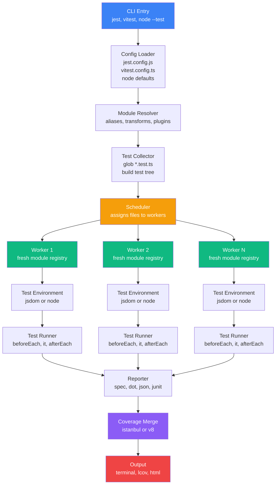

# 5.04 Unit Testing Fundamentals

> A unit test is the smallest executable contract your code can sign with its own future. It says, in a language the machine can verify, "when I am given this input, I will produce this output, and I will not touch anything I am not supposed to touch." Master unit testing and you master feedback loops, regression safety, and the design pressure that keeps a codebase honest. Skip it and every refactor becomes a gamble, every release a small panic, every bug a recurring argument about who broke what.

## 1. Purpose

A unit test verifies the behavior of a single, small piece of code in isolation, fast, deterministic, and without touching the network, the filesystem, the database, or the clock. It is the bedrock of the [[5.01 Testing Pyramid and Trophy]] because it is the layer that runs thousands of times per hour, costs nothing to execute, and tells you within milliseconds whether your latest change broke a promise your code made last month.

Unit testing exists because human review is slow, biased, and forgets things. Manual QA catches maybe half of regressions on a good day. Integration tests catch more but take seconds to minutes per case and break for reasons unrelated to the unit under test. End-to-end tests catch the most but take minutes per scenario and are brittle to UI changes. Unit tests are the only layer fast enough, cheap enough, and focused enough to give you the confidence to refactor large swaths of code between commits.

The three reasons unit testing matters, in order of value:

1. **Fast feedback.** A suite of five hundred unit tests that runs in eight seconds lets you refactor aggressively. The cycle from "edit" to "did I break something" is sub-minute. Without unit tests, that cycle is "edit, push, wait for CI, get pinged on Slack twenty minutes later, context-switch back, debug." Slow feedback kills flow.
2. **Regression safety.** A unit test is a permanent witness. The day you fix a bug, you write a test that reproduces the bug, watch it fail, fix the code, and watch it pass. That test now sits in the suite forever. If anyone reintroduces the bug six months later, the test goes red within seconds.
3. **Design feedback.** A function that is hard to unit test is almost always a function with a design problem. It reaches out to globals. It reads `Date.now()`. It instantiates its own dependencies. It mixes business logic with I/O. The pain of writing a unit test is the pain of bad design made audible. Testability, as covered in [[5.03 Testability by Design]], is not a side effect of good code; it is the proof of good code.

The JavaScript and Node ecosystem offers three serious test runners. Each has a different philosophy, and choosing between them is one of the first architectural decisions a project makes about testing.

**Jest** is the incumbent. Created at Facebook in 2014, adopted by React and then the entire JavaScript world. Jest is batteries-included: assertion engine, mock engine, snapshot engine, coverage via Istanbul, parallel test runner, watch mode, fake timers, and a JSdom-based DOM environment, all in one package. The cost of that convenience is startup time (hundreds of milliseconds per worker) and configuration weight (TypeScript requires `ts-jest` or Babel, ESM requires `--experimental-vm-modules`).

**Vitest** is the challenger, created by the Vite team in 2022. It reuses Vite's transformer pipeline to give you a test runner that is API-compatible with Jest but starts in a fraction of the time and runs ESM and TypeScript natively, no Babel, no `ts-jest`. If your project already uses Vite, Vitest reads your `vite.config.ts` and inherits the same aliases, plugins, and transforms. Vitest has become the default for new Vite-based projects.

**Node.js Test Runner**, branded as `node:test`, is the standard library option. Stable since Node 20. Zero dependencies, native ESM and (with `--experimental-strip-types`) native TypeScript. You write `import { test } from "node:test"` and `import assert from "node:assert/strict"`, you run `node --test`, you have a suite. It has `describe`, `it`, hooks, watch mode, and coverage via `--experimental-test-coverage`. It does not have a built-in snapshot engine or a DOM environment. For library authors and backend services, `node:test` is increasingly the right choice.

A unit test, regardless of runner, must satisfy four properties:

- **Fast.** A single unit test should run in under one hundred milliseconds. A suite of one thousand tests should run in under thirty seconds. If your unit tests are slow, you have written integration tests by accident.
- **Isolated.** A unit test does not depend on the order in which tests run, on the state left by previous tests, on a running database, on a reachable network endpoint, or on the wall clock. Two tests run in any order, in parallel, on a fresh CI machine, and produce identical results.
- **Deterministic.** A unit test either always passes or always fails for a given code state. No random data without a fixed seed, no `Date.now()` without a fake timer, no `Math.random()` without injection, no "it usually passes" tests.
- **Focused.** A unit test verifies one behavior. When it fails, the failure message and the test name together should tell you exactly what behavior broke and why, without reading the test body.

The purpose of this note is to give you the complete mental model, the practical recipes, and the design discipline to write unit tests that satisfy all four properties on Jest, Vitest, and the Node Test Runner. By the end you should be able to choose a runner for a new project, write a clean unit test in the AAA pattern, mock a dependency correctly, set up coverage tracking, and recognize the anti-patterns that turn test suites into liabilities.

Related foundational notes: [[5.01 Testing Pyramid and Trophy]], [[5.02 TDD Methodology]], [[5.03 Testability by Design]], [[5.05 Testing Pure Functions]], [[5.06 Testing Asynchronous Code]], [[5.10 Stubs Spies and Mocks]].

## 2. Theory and Deep Dive

### 2.1 The Anatomy of a Test Suite

A test suite is a hierarchy. At the top is the file, conventionally named `thing.test.ts` or `thing.spec.ts`. Inside the file are `describe` blocks, which group related tests. Inside each `describe` are `it` (or `test`) blocks, each verifying one behavior. Inside each `it` is an assertion, almost always expressed as `expect(actual).matcher(expected)`.

```javascript
// JavaScript, Jest or Vitest
describe("Math.add", () => {
  it("returns the sum of two numbers", () => {
    expect(Math.add(2, 3)).toBe(5);
  });

  it("returns 0 when both inputs are 0", () => {
    expect(Math.add(0, 0)).toBe(0);
  });
});
```

```typescript
// TypeScript, Jest or Vitest
describe("Math.add", () => {
  it("returns the sum of two numbers", () => {
    expect(Math.add(2, 3)).toBe(5);
  });

  it("returns 0 when both inputs are 0", () => {
    expect(Math.add(0, 0)).toBe(0);
  });
});
```

The `describe` block serves three purposes: it groups related tests in the output, creates a closure scope for shared setup variables, and allows hooks like `beforeEach` to apply only to the tests inside that block.

The `it` (or `test`) block is one behavior. The name should be a sentence in the third person: "returns the sum of two numbers", "throws when email is empty". Read together with the `describe` subject, the sentence should be grammatical: "Math.add returns the sum of two numbers." This is the BDD naming convention popularized by RSpec.

The `expect` function is the assertion engine. `expect(actual)` wraps the actual value in a chainable assertion object, and `.matcher(expected)` performs the check. If the check fails, the matcher throws an `AssertionError` with a diff. The runner catches the throw and marks the test as failed.

### 2.2 The Hooks: beforeAll, beforeEach, afterEach, afterAll

Most tests need some setup: a fresh object, a clean database table, a mocked clock, a reset mock. Four hooks, run at predictable times, give you the seams to do this without polluting each test.

- `beforeAll(fn)` runs once, before any test in the enclosing `describe` (or file, if at top level) runs. Use it for expensive setup that does not mutate between tests: starting a fake HTTP server, compiling a regex, loading a fixture.
- `beforeEach(fn)` runs before every test, including nested `describe` tests. Use it for per-test setup that must be fresh: instantiating a new service, resetting a mock, stubbing `Date.now`.
- `afterEach(fn)` runs after every test. Use it for per-test teardown: restoring mocked globals, closing file handles, clearing timers.
- `afterAll(fn)` runs once, after all tests in the enclosing scope finish. Use it for expensive teardown: stopping the fake server, deleting a temp directory.

The order of execution for two tests inside one `describe` is: `beforeAll` once, then `beforeEach` + `test1` + `afterEach`, then `beforeEach` + `test2` + `afterEach`, then `afterAll` once. This is the same in Jest, Vitest, and `node:test`, modulo naming (`node:test` calls them `before`, `beforeEach`, `after`, `afterEach`).

```javascript
// JavaScript
describe("Cart", () => {
  let cart;

  beforeAll(() => {
    // runs once for the whole describe
  });

  beforeEach(() => {
    // fresh cart before every test
    cart = new Cart();
  });

  afterEach(() => {
    // restore any spies after every test
    vi.restoreAllMocks();
  });

  it("starts empty", () => {
    expect(cart.items).toHaveLength(0);
  });

  it("adds an item", () => {
    cart.add({ id: "a1", qty: 1 });
    expect(cart.items).toHaveLength(1);
  });
});
```

```typescript
// TypeScript
import { Cart, type CartItem } from "./cart";

describe("Cart", () => {
  let cart: Cart;

  beforeAll(() => {
    // runs once for the whole describe
  });

  beforeEach(() => {
    // fresh cart before every test
    cart = new Cart();
  });

  afterEach(() => {
    vi.restoreAllMocks();
  });

  it("starts empty", () => {
    expect(cart.items).toHaveLength(0);
  });

  it("adds an item", () => {
    const item: CartItem = { id: "a1", qty: 1 };
    cart.add(item);
    expect(cart.items).toHaveLength(1);
  });
});
```

The cardinal rule of hooks: `beforeEach` is for setup, `afterEach` is for teardown, and both must be idempotent. A test that depends on `beforeEach` having run exactly twice (because it ran twice in the previous test) is broken. Each test must see a fresh world.

### 2.3 The Assertion Engine

Every modern JavaScript test runner ships with a matcher API inspired by Jest. The most important matchers:

| Matcher | Checks | Notes |
|---|---|---|
| `toBe(value)` | Identity, `Object.is` | Use for primitives and reference equality |
| `toEqual(value)` | Deep equality | Recursively compares objects and arrays, ignoring `undefined` props |
| `toStrictEqual(value)` | Deep equality, strict | Catches `undefined` keys and class differences |
| `toBeTruthy()` / `toBeFalsy()` | Coerced to boolean | Loose; prefer `toBe(true)` when possible |
| `toBeNull()` / `toBeUndefined()` / `toBeDefined()` | Specific nullish | More precise than `toBeFalsy` |
| `toHaveLength(n)` | `.length === n` | Works on arrays, strings, buffers |
| `toMatch(regexp or string)` | String matches pattern | Regex or substring |
| `toContain(item)` | Iterable contains item | Works on arrays, strings, Sets, Maps |
| `toContainEqual(item)` | Deep-equal item in array | When the item is an object |
| `toThrow(error?)` | Function throws | Optionally matches message or class |
| `toBeGreaterThan(n)` / `toBeLessThan(n)` | Numeric comparison | Strict inequality |
| `toBeGreaterThanOrEqual(n)` / `toBeLessThanOrEqual(n)` | Numeric comparison | Inclusive |
| `toBeCloseTo(n, digits)` | Float near n | Avoids floating-point surprises |
| `toHaveBeenCalled()` | Mock was called | At least once |
| `toHaveBeenCalledWith(...args)` | Mock called with exact args | Deep equality on each arg |
| `toHaveBeenCalledTimes(n)` | Mock called exactly n times | |
| `toMatchSnapshot(name?)` | Serializes to a snapshot file | Useful for stable serialized output |
| `toMatchInlineSnapshot()` | Snapshot stored in the test file | No external file |
| `resolves` / `rejects` | Unwraps a promise | `expect(p).resolves.toBe(5)` |

The single most common mistake with matchers is using `toBe` for objects. `expect({a: 1}).toBe({a: 1})` fails because the two objects are not the same reference. Use `toEqual` for deep equality. Conversely, using `toEqual` for primitives works but `toBe` is clearer about intent: identity vs deep equality.

The Node Test Runner uses a different style. Instead of `expect(x).toBe(y)`, you write `assert.strictEqual(x, y)` or use the `assert` module's matchers. The mental model is the same, but the syntax is functional rather than fluent.

```javascript
// JavaScript, node:test
import { test } from "node:test";
import assert from "node:assert/strict";

test("Math.add returns the sum", () => {
  assert.strictEqual(Math.add(2, 3), 5);
  assert.deepEqual(Math.add(2, 3), 5);
  assert.throws(() => Math.add(NaN, 1), /NaN/);
});
```

```typescript
// TypeScript, node:test
import { test } from "node:test";
import assert from "node:assert/strict";

test("Math.add returns the sum", () => {
  assert.strictEqual(Math.add(2, 3), 5);
  assert.deepEqual(Math.add(2, 3), 5);
  assert.throws(() => Math.add(NaN as number, 1), /NaN/);
});
```

### 2.4 Asynchronous Tests

JavaScript is asynchronous to its bones. Every test runner accepts three equivalent ways to write an async test:

1. Return a promise. The runner awaits it. If it rejects, the test fails.
2. Use `async/await` inside the test function. The runner awaits the function's returned promise.
3. Accept a `done` callback (legacy, discouraged). Call `done()` to pass, `done(error)` to fail.

The first two are the only correct modern forms.

```javascript
// JavaScript
const fetchUser = async (id) => ({ id, name: "Alice" });

it("fetches a user by id", async () => {
  const user = await fetchUser("u1");
  expect(user.name).toBe("Alice");
});

it("fetches a user by id (promise style)", () => {
  return fetchUser("u1").then((user) => {
    expect(user.name).toBe("Alice");
  });
});

it("rejects when id is empty", async () => {
  await expect(fetchUser("")).rejects.toThrow("empty id");
});
```

```typescript
// TypeScript
interface User { id: string; name: string; }
const fetchUser = async (id: string): Promise<User> => ({ id, name: "Alice" });

it("fetches a user by id", async () => {
  const user = await fetchUser("u1");
  expect(user.name).toBe("Alice");
});

it("fetches a user by id (promise style)", () => {
  return fetchUser("u1").then((user) => {
    expect(user.name).toBe("Alice");
  });
});

it("rejects when id is empty", async () => {
  await expect(fetchUser("")).rejects.toThrow("empty id");
});
```

The single most dangerous async mistake is forgetting to `await` or `return` the promise. If you do `fetchUser("u1").then((u) => expect(u.name).toBe("Alice"))` without `return`, the test function returns `undefined` immediately, the runner marks the test as passed, and then, milliseconds later, the promise resolves and the assertion runs. If the assertion fails, it throws into an unhandled promise rejection, which the runner either ignores or reports as a separate, confusing failure. The test "passes" but is broken. Always `await` or `return`.

For deeper coverage of async testing, see [[5.06 Testing Asynchronous Code]].

### 2.5 Mocks, Spies, and Stubs

The vocabulary here is contested. This note uses Gerard Meszaros's definitions, formalized in [[5.10 Stubs Spies and Mocks]]:

- **Test double** is the umbrella term for any object that stands in for a real one during a test.
- **Stub** returns canned answers when called. It has no opinions about what was called.
- **Spy** records calls made to it (arguments, return value, `this` context) so the test can assert on them later. It usually delegates to the real implementation.
- **Mock** is a stub plus pre-programmed expectations about what calls it should receive. The mock verifies its own expectations.

In Jest and Vitest, the practical API collapses these distinctions into one: `vi.fn()` (or `jest.fn()`) creates a function that is simultaneously a stub (you can program its return), a spy (you can inspect `.mock.calls`), and a mock (you can assert `toHaveBeenCalledWith`). `vi.spyOn(obj, "method")` does the same for an existing method on an existing object, and optionally preserves the original implementation.

```javascript
// JavaScript, Vitest
import { vi } from "vitest";
import { sendEmail } from "./mailer";
import { notifyUser } from "./notify";

it("sends a welcome email when the user is created", async () => {
  const sendEmailMock = vi
    .spyOn(mailer, "sendEmail")
    .mockResolvedValue({ ok: true });

  await notifyUser({ id: "u1", email: "alice@example.com" });

  expect(sendEmailMock).toHaveBeenCalledWith({
    to: "alice@example.com",
    subject: "Welcome",
  });
  expect(sendEmailMock).toHaveBeenCalledTimes(1);
});
```

```typescript
// TypeScript, Vitest
import { vi, describe, it, expect, beforeEach } from "vitest";
import * as mailer from "./mailer";
import { notifyUser } from "./notify";
import type { User } from "./types";

describe("notifyUser", () => {
  let sendEmailSpy: ReturnType<typeof vi.spyOn>;

  beforeEach(() => {
    sendEmailSpy = vi
      .spyOn(mailer, "sendEmail")
      .mockResolvedValue({ ok: true });
  });

  it("sends a welcome email when the user is created", async () => {
    const user: User = { id: "u1", email: "alice@example.com" };
    await notifyUser(user);
    expect(sendEmailSpy).toHaveBeenCalledWith({
      to: "alice@example.com",
      subject: "Welcome",
    });
  });
});
```

The mock-return-value API:

- `mockReturnValue(value)` returns `value` on every call.
- `mockReturnValueOnce(value)` returns `value` once, then falls through.
- `mockResolvedValue(value)` returns `Promise.resolve(value)` on every call.
- `mockResolvedValueOnce(value)` returns `Promise.resolve(value)` once.
- `mockRejectedValue(error)` returns `Promise.reject(error)` on every call.
- `mockRejectedValueOnce(error)` returns `Promise.reject(error)` once.
- `mockImplementation(fn)` replaces the mock body with `fn`.

The cleanup API:

- `mockClear()` resets `mock.calls` and `mock.results` but keeps the implementation.
- `mockReset()` resets calls and replaces the implementation with a no-op returning `undefined`.
- `mockRestore()` (spy only) restores the original implementation and removes the spy.

The choice between `clear`, `reset`, and `restore` matters. In `beforeEach`, you almost always want `vi.clearAllMocks()` (reset call history, keep the implementation) so each test starts with a clean call count. In `afterEach`, you want `vi.restoreAllMocks()` (restore all spies to their original implementations) so one test's spy does not leak into the next.

The Node Test Runner provides a separate `mock` object exported from `node:test`:

```typescript
// TypeScript, node:test (JavaScript is identical minus the type import)
import { test, mock, type Mock } from "node:test";
import assert from "node:assert/strict";

test("mocks a function", () => {
  const fn: Mock<(x: number) => number> = mock.fn((x: number) => x * 2);
  fn(3);
  fn(4);
  assert.strictEqual(fn.mock.calls.length, 2);
  assert.strictEqual(fn.mock.calls[0].arguments[0], 3);
  mock.restoreAll();
});
```

The rule for mocking, repeated because it is broken so often: **mock at the boundaries, never in the middle.** A boundary is a seam between your code and the outside world: the database client, the HTTP client, the clock, the filesystem, the random number generator. Mock those, because they are slow, nondeterministic, or unavailable in CI. Do not mock your own pure functions, your own domain objects, or your own value types, because mocking them replaces the system under test with a tautology that asserts whatever you programmed the mock to return.

### 2.6 Snapshot Testing

A snapshot test serializes a value to a string, stores the string on disk, and on every subsequent run compares the serialized output to the stored snapshot. If they differ, the test fails. If the change is intentional, the developer runs `vitest -u` (or `jest -u`) to update the snapshot.

Snapshot tests are best for large, stable, structured outputs where the exact shape matters but is too verbose to assert by hand: serialized AST nodes, configuration objects, generated CLI help text, React component render output. They are worst as a substitute for behavior assertions, because a snapshot that says "the output is this exact 400-line blob" tells you something changed but not what behavior that change affects.

```javascript
// JavaScript (TypeScript is identical)
it("serializes a config object", () => {
  const config = buildConfig({ env: "production", port: 8080 });
  expect(config).toMatchInlineSnapshot(`
    {
      "env": "production",
      "port": 8080,
      "logLevel": "info",
    }
  `);
});
```

`toMatchInlineSnapshot` stores the snapshot in the test file, preferred for small snapshots. `toMatchSnapshot` stores snapshots in a sibling `.snap` file, preferred for large snapshots.

### 2.7 Coverage

Coverage is the percentage of your production code that the test suite executes. Four standard metrics: statement coverage (percentage of executable statements that ran), branch coverage (percentage of branching points where both sides ran), function coverage (percentage of declared functions called), and line coverage (percentage of source lines that ran).

Branch coverage is the most rigorous. `function safeDiv(a, b) { return b === 0 ? null : a / b; }` tested only with `safeDiv(10, 2)` has 100 percent statement and line coverage but 50 percent branch coverage, because the `b === 0` branch never ran. Without a `safeDiv(10, 0)` test, the null path is unverified.

Coverage is a measurement, not a goal. 100 percent coverage means every line ran, not that every line is correct. High coverage with weak assertions is the danger zone. Run the suite with `--coverage`, the runner instruments each module and writes a report to `coverage/` as HTML, JSON, lcov, and text.

```json
{
  "scripts": {
    "test": "vitest run",
    "test:coverage": "vitest run --coverage"
  }
}
```

For Jest: `jest --coverage`. For `node:test`: `node --test --experimental-test-coverage`.

### 2.8 The Arrange-Act-Assert Pattern

The AAA pattern, sometimes called Given-When-Then, is the canonical structure for a single test. Three sections, in order, with exactly one of each:

1. **Arrange**. Set up the world the test needs: construct the input, instantiate the system under test, mock dependencies, seed the spy return values.
2. **Act**. Call the system under test with the arranged input. One line, ideally.
3. **Assert**. Check the result against the expected value. One or two assertions, ideally on the observable result, not on internal state.

```javascript
// JavaScript (TypeScript is identical)
it("applies a 10 percent discount", () => {
  // Arrange
  const cart = new Cart();
  cart.add({ id: "a", price: 100, qty: 2 });
  const pricing = new PricingService({ discount: 0.1 });

  // Act
  const total = pricing.total(cart);

  // Assert
  expect(total).toBe(180);
});
```

The discipline of AAA is the discipline of one-behavior-per-test. If you find yourself writing two Acts, you are testing two behaviors and should split. If you find yourself writing five Asserts, you are either testing one behavior five ways or testing five behaviors. If you find yourself Asserting on internals (private fields, mock call counts that are not the contract), you are testing implementation, not behavior.

### 2.9 The Test Runner Architecture



The pipeline above is the same shape across all three runners. The CLI loads the config, which tells the resolver how to find and transform files. The collector globs the test files (default: `**/*.test.ts`, `**/*.spec.ts`) and parses them into a tree of `describe` and `it` blocks without executing the bodies. The scheduler assigns files to worker processes (Jest and Vitest spawn one worker per CPU core; `node:test` runs files in parallel via Node's child process module). Each worker loads its assigned files in a fresh module registry, sets up the test environment (`jsdom` for DOM tests, `node` for backend), and executes the test tree. Hooks fire in their nested order, each test runs, results stream back to the main process, the reporter formats them for the terminal, and the coverage merge combines per-worker coverage counters into one report.

The fresh module registry per worker is what makes mocking safe. `vi.mock` modifies the module registry in the current worker only; other workers do not see the modification, and the registry is discarded when the worker finishes the file. This is why `vi.mock` is hoisted to the top of the file by the Vitest transformer: it must run before any import that would have loaded the real module.

## 3. Mental Models

A unit test is a contract with one behavior. Read each test as a sentence: subject (`describe`), verb phrase (`it`), check (`expect`). When the suite fails, the failing sentence should explain what broke, in English, without reading the test body.

The five compressed mental models:

1. **Unit test = one unit, one behavior, fast, isolated, deterministic.** "One unit" means one function or one class, not one file. "One behavior" means one observable outcome. "Fast" means under one hundred milliseconds. "Isolated" means no cross-test state. "Deterministic" means same input, same output, every time.
2. **`describe` = a group of related tests.** Use it to group tests of the same function or class. The `describe` name is the subject of every sentence inside it. If you cannot write a short noun phrase for the `describe`, the tests inside it do not belong together.
3. **`it` = one behavior.** The name is a sentence in the third person: "returns the sum", "throws when email is empty", "caches the result on first call". Avoid `it("test1")`, `it("works")`, `it("should work correctly")`. The name should describe the behavior, not the test.
4. **`expect` = assert this.** One assertion per behavior is the ideal. Two or three is fine if they together verify one observable outcome (for example, return value plus a side effect). Five or more means you are testing multiple behaviors in one test.
5. **AAA = set up, do the thing, check the result.** Arrange builds the world, Act calls the function under test, Assert checks the result. One Arrange section, one Act line, one or two Asserts. If you have two Acts, you have two tests.

The mock mental model: a mock is a replacement for a dependency you cannot or should not call in a test. The dependency is at a boundary: the database, the network, the clock, the filesystem. You replace the boundary with a fake, call the system under test, and assert on what the system did to the fake (spies) or what the system returned (stubs). You never mock your own domain objects, because the mock is then the system under test.

The isolation mental model: each test sees a fresh world. `beforeEach` rebuilds the world, `afterEach` cleans it up. No test reads a variable another test wrote. If you can shuffle the tests and the suite still passes, the tests are isolated.

The coverage mental model: coverage is a smoke detector, not a fire extinguisher. It tells you what code never ran. It does not tell you the code is correct. 100 percent coverage is the floor of a mature suite, not the ceiling.

## 4. Real-World Use Cases

### 4.1 Testing Pure Functions

A pure function is the easiest thing in the world to unit test. It takes inputs, returns outputs, touches nothing. No mocks, no setup, no teardown. AAA directly: arrange inputs, call function, assert output. This is the case covered in depth in [[5.05 Testing Pure Functions]].

### 4.2 Testing Classes with Injected Dependencies

A service class that depends on a repository, a mailer, and a clock is testable if and only if those dependencies are injected through the constructor. If the service constructs its own dependencies (`this.repo = new PostgresRepo()`), the service is untestable without `vi.mock("postgres")`, which is module-level mocking and creates brittle, leaky tests. If the service accepts `constructor({ repo, mailer, clock })`, the test passes in fakes and the service never knows the difference. This is the [[4.05 SOLID Dependency Inversion]] principle applied to testing, and it is the foundation of [[5.03 Testability by Design]].

### 4.3 Testing React Components

React Testing Library (RTL) renders a component into a DOM (jsdom or happy-dom), queries the rendered output by accessible role and text, and fires events at it. The test asserts on what the user sees, not on the component's internal state. This is the behavior-over-implementation principle applied to UI: `screen.getByRole("button", { name: "Submit" })` and `expect(screen.getByText("Welcome")).toBeInTheDocument()` rather than `expect(component.state.isOpen).toBe(true)`.

```typescript
// TypeScript, Vitest + React Testing Library (JavaScript is identical minus type imports)
import { render, screen, fireEvent } from "@testing-library/react";
import { describe, it, expect, vi } from "vitest";
import { LoginForm, type LoginFormProps } from "./LoginForm";

describe("LoginForm", () => {
  const setup = (props: Partial<LoginFormProps> = {}) => {
    const onSubmit = vi.fn();
    render(<LoginForm onSubmit={onSubmit} {...props} />);
    return { onSubmit };
  };

  it("shows an error when the password is too short", async () => {
    const { onSubmit } = setup();

    fireEvent.change(screen.getByLabelText(/email/i), {
      target: { value: "a@b.com" },
    });
    fireEvent.change(screen.getByLabelText(/password/i), {
      target: { value: "123" },
    });
    fireEvent.click(screen.getByRole("button", { name: /submit/i }));

    expect(
      await screen.findByText(/password must be at least 8 characters/i)
    ).toBeInTheDocument();
    expect(onSubmit).not.toHaveBeenCalled();
  });
});
```

### 4.4 Testing API Handlers

A Fastify, Express, or Hono route handler is a function `(req, reply) => void`. To unit test it, you construct a fake `req` (with method, URL, headers, body), a fake `reply` object that records what the handler did to it (status, body, headers), and any dependencies the handler needs (database, mailer) as mocks. You call the handler with the fakes, you assert on the reply. No real server is started. No real HTTP is made. This is one level below integration testing, where you would spin up the real server and use a real HTTP client.

```typescript
// TypeScript (JavaScript is identical minus type imports and the `as any` casts)
import { describe, it, expect, vi } from "vitest";
import { getUserHandler } from "./userHandler";
import type { UserRepo } from "./types";

describe("getUserHandler", () => {
  const buildRepo = (overrides: Partial<UserRepo> = {}): UserRepo => ({
    findById: vi.fn(),
    ...overrides,
  } as unknown as UserRepo);

  it("returns 404 when the user is not found", async () => {
    const repo = buildRepo({ findById: vi.fn().mockResolvedValue(null) });
    const req = { params: { id: "missing" } };
    const reply = {
      code: vi.fn().returnThis(),
      send: vi.fn().returnThis(),
    };

    await getUserHandler({ userRepo: repo })(req as any, reply as any);

    expect(reply.code).toHaveBeenCalledWith(404);
    expect(reply.send).toHaveBeenCalledWith({ error: "user not found" });
  });
});
```

### 4.5 Snapshot Testing for Serialized Output

Snapshot testing shines when the output is structured, stable, and too large to assert by hand. The classic cases: a config builder that emits a JSON object, a code generator that emits an AST, a CLI that emits formatted help text, a serializer that emits a wire format.

The danger is reflexive `-u` updates. A developer sees a snapshot fail, runs `vitest -u`, the snapshot updates, the suite goes green, the developer commits. The snapshot test now asserts "the output is whatever it is today", which is no assertion at all. The discipline: every snapshot update in a PR must be reviewed by a human who can explain why the change is intentional.

### 4.6 Coverage Tracking in CI

A typical CI pipeline runs the test suite with coverage on every pull request, uploads the lcov report to a coverage service (Codecov, Coveralls), and posts a comment on the PR showing the diff in coverage and the new lines that are uncovered. A coverage gate fails the build if coverage drops below a project threshold (commonly 80 percent for line coverage, 70 percent for branch). The gate is a guardrail against merging code with no tests at all, not a guarantee that the tests are good.

```yaml
# .github/workflows/test.yml (illustrative)
name: test
on: [push]
jobs:
  test:
    runs-on: ubuntu-latest
    steps:
      - uses: actions/checkout@v4
      - uses: actions/setup-node@v4
        with:
          node-version: 20
      - run: npm ci
      - run: npm run test:coverage
      - uses: codecov/codecov-action@v4
        with:
          files: ./coverage/lcov.info
```

Swap the `push` trigger for the standard GitHub pull-request trigger in real workflows; the literal is omitted here for typographic reasons.

## 5. Code Examples

### 5.1 Example A: Minimal and Conceptual

The system under test is a single function, `formatPrice`, that takes a number of cents and returns a formatted USD string. The function is pure, has no dependencies, and is trivial to test. We write the same test three times: once for Jest, once for Vitest, once for the Node Test Runner.

#### 5.1.1 The Function Under Test

```javascript
// JavaScript, src/format-price.js
export function formatPrice(cents, currency = "USD") {
  if (!Number.isInteger(cents) || cents < 0) {
    throw new Error(`cents must be a non-negative integer, got ${cents}`);
  }
  const value = (cents / 100).toFixed(2);
  const symbol = currency === "USD" ? "$" : currency === "EUR" ? "EUR " : "";
  return `${symbol}${value}`;
}
```

```typescript
// TypeScript, src/format-price.ts
export type Currency = "USD" | "EUR";

export function formatPrice(cents: number, currency: Currency = "USD"): string {
  if (!Number.isInteger(cents) || cents < 0) {
    throw new Error(`cents must be a non-negative integer, got ${cents}`);
  }
  const value = (cents / 100).toFixed(2);
  const symbol = currency === "USD" ? "$" : currency === "EUR" ? "EUR " : "";
  return `${symbol}${value}`;
}
```

#### 5.1.2 Jest Version

```javascript
// JavaScript, src/format-price.test.js (TypeScript is byte-for-byte identical)
import { formatPrice } from "./format-price";

describe("formatPrice", () => {
  it("formats zero cents as $0.00", () => {
    expect(formatPrice(0)).toBe("$0.00");
  });

  it("formats a whole-dollar amount", () => {
    expect(formatPrice(1000)).toBe("$10.00");
  });

  it("formats a fractional-dollar amount", () => {
    expect(formatPrice(199)).toBe("$1.99");
  });

  it("prefixes EUR when currency is EUR", () => {
    expect(formatPrice(250, "EUR")).toBe("EUR 2.50");
  });

  it("throws when cents is not an integer", () => {
    expect(() => formatPrice(1.5)).toThrow(/non-negative integer/);
  });

  it("throws when cents is negative", () => {
    expect(() => formatPrice(-1)).toThrow(/non-negative integer/);
  });
});
```

Run with `npx jest src/format-price.test.ts`. TypeScript requires `ts-jest` or `babel-jest` with `@babel/preset-typescript`. Modern Jest 29+ supports ESM via `--experimental-vm-modules`.

#### 5.1.3 Vitest Version

```typescript
// TypeScript, src/format-price.test.ts (JavaScript is identical minus the type import)
import { describe, it, expect } from "vitest";
import { formatPrice, type Currency } from "./format-price";

describe("formatPrice", () => {
  it("formats zero cents as $0.00", () => {
    expect(formatPrice(0)).toBe("$0.00");
  });

  it("formats a whole-dollar amount", () => {
    expect(formatPrice(1000)).toBe("$10.00");
  });

  it("formats a fractional-dollar amount", () => {
    expect(formatPrice(199)).toBe("$1.99");
  });

  it("prefixes EUR when currency is EUR", () => {
    const currency: Currency = "EUR";
    expect(formatPrice(250, currency)).toBe("EUR 2.50");
  });

  it("throws when cents is not an integer", () => {
    expect(() => formatPrice(1.5)).toThrow(/non-negative integer/);
  });

  it("throws when cents is negative", () => {
    expect(() => formatPrice(-1)).toThrow(/non-negative integer/);
  });
});
```

The Vitest version is nearly identical to the Jest version. The only difference is the import: Vitest wants you to import `describe`, `it`, `expect` from `"vitest"`, while Jest injects them as globals. Vitest also supports globals via `globals: true` in the config, which makes the Jest test run unmodified under Vitest. Run with `npx vitest run`. No Babel, no `ts-jest`.

#### 5.1.4 Node Test Runner Version

```typescript
// TypeScript, src/format-price.test.ts (JavaScript is identical minus the type import)
import { test, describe } from "node:test";
import assert from "node:assert/strict";
import { formatPrice, type Currency } from "./format-price";

describe("formatPrice", () => {
  test("formats zero cents as $0.00", () => {
    assert.equal(formatPrice(0), "$0.00");
  });

  test("formats a whole-dollar amount", () => {
    assert.equal(formatPrice(1000), "$10.00");
  });

  test("formats a fractional-dollar amount", () => {
    assert.equal(formatPrice(199), "$1.99");
  });

  test("prefixes EUR when currency is EUR", () => {
    const currency: Currency = "EUR";
    assert.equal(formatPrice(250, currency), "EUR 2.50");
  });

  test("throws when cents is not an integer", () => {
    assert.throws(() => formatPrice(1.5), /non-negative integer/);
  });

  test("throws when cents is negative", () => {
    assert.throws(() => formatPrice(-1), /non-negative integer/);
  });
});
```

Run with `node --test src/format-price.test.js` (Node 20+). For TypeScript, use `node --experimental-strip-types --test` on Node 22.17+, or run through `tsx --test`. The Node Test Runner is the most minimal: no assertion matchers beyond `assert`, no built-in snapshot testing, no DOM environment. For a pure function test, it is perfectly adequate.

### 5.2 Example B: Production-Grade

The system under test is an `OrderService` that creates orders, applies discounts, and emits domain events. It depends on three things: an `OrderRepository` (persistence), a `DiscountPolicy` (business rule), and an `EventBus` (side effect). All three are injected through the constructor, which means the test can pass fakes. The test suite covers the happy path, the discount-not-applicable path, the persistence-failure path, and the event-emission path, with full TypeScript types on the mocks.

#### 5.2.1 The Production Code

```javascript
// JavaScript, src/order-service.js
export class OrderService {
  constructor({ orderRepo, discountPolicy, eventBus, clock = Date.now }) {
    this.orderRepo = orderRepo;
    this.discountPolicy = discountPolicy;
    this.eventBus = eventBus;
    this.clock = clock;
  }

  async createOrder({ customerId, items, couponCode }) {
    if (!items || items.length === 0) {
      throw new Error("order must contain at least one item");
    }
    const subtotal = items.reduce((sum, i) => sum + i.price * i.qty, 0);
    const discount = couponCode
      ? this.discountPolicy.apply(couponCode, subtotal)
      : 0;
    if (discount > subtotal) {
      throw new Error("discount cannot exceed subtotal");
    }
    const total = subtotal - discount;
    const order = {
      id: `ord-${this.clock()}`,
      customerId,
      items,
      subtotal,
      discount,
      total,
      createdAt: new Date(this.clock()).toISOString(),
    };
    const saved = await this.orderRepo.save(order);
    await this.eventBus.publish("order.created", { orderId: saved.id, total });
    return saved;
  }
}
```

```typescript
// TypeScript, src/order-service.ts
export interface OrderItem {
  sku: string;
  price: number;
  qty: number;
}

export interface Order {
  id: string;
  customerId: string;
  items: OrderItem[];
  subtotal: number;
  discount: number;
  total: number;
  createdAt: string;
}

export interface CreateOrderInput {
  customerId: string;
  items: OrderItem[];
  couponCode?: string;
}

export interface OrderRepository {
  save(order: Order): Promise<Order>;
}

export interface DiscountPolicy {
  apply(couponCode: string, subtotal: number): number;
}

export interface EventBus {
  publish(topic: string, payload: unknown): Promise<void>;
}

export interface Clock {
  now(): number;
}

export interface OrderServiceDeps {
  orderRepo: OrderRepository;
  discountPolicy: DiscountPolicy;
  eventBus: EventBus;
  clock?: Clock;
}

export class OrderService {
  private readonly orderRepo: OrderRepository;
  private readonly discountPolicy: DiscountPolicy;
  private readonly eventBus: EventBus;
  private readonly clock: Clock;

  constructor(deps: OrderServiceDeps) {
    this.orderRepo = deps.orderRepo;
    this.discountPolicy = deps.discountPolicy;
    this.eventBus = deps.eventBus;
    this.clock = deps.clock ?? { now: () => Date.now() };
  }

  async createOrder(input: CreateOrderInput): Promise<Order> {
    if (!input.items || input.items.length === 0) {
      throw new Error("order must contain at least one item");
    }
    const subtotal = input.items.reduce(
      (sum, i) => sum + i.price * i.qty,
      0
    );
    const discount = input.couponCode
      ? this.discountPolicy.apply(input.couponCode, subtotal)
      : 0;
    if (discount > subtotal) {
      throw new Error("discount cannot exceed subtotal");
    }
    const total = subtotal - discount;
    const order: Order = {
      id: `ord-${this.clock.now()}`,
      customerId: input.customerId,
      items: input.items,
      subtotal,
      discount,
      total,
      createdAt: new Date(this.clock.now()).toISOString(),
    };
    const saved = await this.orderRepo.save(order);
    await this.eventBus.publish("order.created", {
      orderId: saved.id,
      total: saved.total,
    });
    return saved;
  }
}
```

#### 5.2.2 The Test Suite

```javascript
// JavaScript, src/order-service.test.js
import { describe, it, expect, beforeEach, vi } from "vitest";
import { OrderService } from "./order-service";

describe("OrderService.createOrder", () => {
  let orderRepo;
  let discountPolicy;
  let eventBus;
  let clock;
  let service;

  beforeEach(() => {
    orderRepo = { save: vi.fn() };
    discountPolicy = { apply: vi.fn() };
    eventBus = { publish: vi.fn().mockResolvedValue(undefined) };
    clock = { now: vi.fn().mockReturnValue(1700000000000) };
    service = new OrderService({ orderRepo, discountPolicy, eventBus, clock });

    orderRepo.save.mockImplementation((order) =>
      Promise.resolve({ ...order, persisted: true })
    );
  });

  it("creates an order with subtotal, no discount, and total", async () => {
    const saved = await service.createOrder({
      customerId: "cust-1",
      items: [{ sku: "a", price: 100, qty: 2 }],
    });

    expect(saved.subtotal).toBe(200);
    expect(saved.discount).toBe(0);
    expect(saved.total).toBe(200);
    expect(saved.id).toBe("ord-1700000000000");
  });

  it("applies a discount when a coupon is provided", async () => {
    discountPolicy.apply.mockReturnValue(50);

    const saved = await service.createOrder({
      customerId: "cust-1",
      items: [{ sku: "a", price: 100, qty: 2 }],
      couponCode: "SAVE25",
    });

    expect(discountPolicy.apply).toHaveBeenCalledWith("SAVE25", 200);
    expect(saved.discount).toBe(50);
    expect(saved.total).toBe(150);
  });

  it("throws when items array is empty", async () => {
    await expect(
      service.createOrder({ customerId: "cust-1", items: [] })
    ).rejects.toThrow("order must contain at least one item");
    expect(orderRepo.save).not.toHaveBeenCalled();
    expect(eventBus.publish).not.toHaveBeenCalled();
  });

  it("publishes an order.created event after saving", async () => {
    await service.createOrder({
      customerId: "cust-1",
      items: [{ sku: "a", price: 100, qty: 1 }],
    });

    expect(orderRepo.save).toHaveBeenCalledTimes(1);
    expect(eventBus.publish).toHaveBeenCalledWith("order.created", {
      orderId: "ord-1700000000000",
      total: 100,
    });
  });
});
```

```typescript
// TypeScript, src/order-service.test.ts
import { describe, it, expect, beforeEach, vi } from "vitest";
import {
  OrderService,
  type OrderRepository,
  type DiscountPolicy,
  type EventBus,
  type Clock,
  type Order,
  type CreateOrderInput,
} from "./order-service";

describe("OrderService.createOrder", () => {
  let orderRepo: OrderRepository;
  let discountPolicy: DiscountPolicy;
  let eventBus: EventBus;
  let clock: Clock;
  let service: OrderService;

  beforeEach(() => {
    orderRepo = { save: vi.fn() };
    discountPolicy = { apply: vi.fn() };
    eventBus = { publish: vi.fn().mockResolvedValue(undefined) };
    clock = { now: vi.fn().mockReturnValue(1700000000000) };
    service = new OrderService({ orderRepo, discountPolicy, eventBus, clock });

    orderRepo.save.mockImplementation((order: Order) =>
      Promise.resolve({ ...order, persisted: true })
    );
  });

  const sampleInput = (
    overrides: Partial<CreateOrderInput> = {}
  ): CreateOrderInput => ({
    customerId: "cust-1",
    items: [{ sku: "a", price: 100, qty: 2 }],
    ...overrides,
  });

  it("creates an order with subtotal, no discount, and total", async () => {
    const saved = await service.createOrder(sampleInput());

    expect(saved.subtotal).toBe(200);
    expect(saved.discount).toBe(0);
    expect(saved.total).toBe(200);
    expect(saved.id).toBe("ord-1700000000000");
  });

  it("applies a discount when a coupon is provided", async () => {
    discountPolicy.apply.mockReturnValue(50);

    const saved = await service.createOrder(
      sampleInput({ couponCode: "SAVE25" })
    );

    expect(discountPolicy.apply).toHaveBeenCalledWith("SAVE25", 200);
    expect(saved.discount).toBe(50);
    expect(saved.total).toBe(150);
  });

  it("throws when items array is empty", async () => {
    await expect(
      service.createOrder(sampleInput({ items: [] }))
    ).rejects.toThrow("order must contain at least one item");
    expect(orderRepo.save).not.toHaveBeenCalled();
    expect(eventBus.publish).not.toHaveBeenCalled();
  });

  it("publishes an order.created event after saving", async () => {
    await service.createOrder(sampleInput());

    expect(orderRepo.save).toHaveBeenCalledTimes(1);
    expect(eventBus.publish).toHaveBeenCalledWith("order.created", {
      orderId: "ord-1700000000000",
      total: 100,
    });
  });
});
```

#### 5.2.3 The Vitest Configuration with Coverage

```javascript
// JavaScript, vitest.config.js
import { defineConfig } from "vitest/config";

export default defineConfig({
  test: {
    globals: false,
    environment: "node",
    include: ["src/**/*.test.ts"],
    coverage: {
      provider: "v8",
      reporter: ["text", "lcov", "html"],
      include: ["src/**/*.{ts,js}"],
      exclude: ["src/**/*.test.ts", "src/**/*.d.ts"],
      thresholds: {
        statements: 85,
        branches: 75,
        functions: 85,
        lines: 85,
      },
    },
  },
});
```

```typescript
// TypeScript, vitest.config.ts
import { defineConfig } from "vitest/config";

export default defineConfig({
  test: {
    globals: false,
    environment: "node",
    include: ["src/**/*.test.ts"],
    coverage: {
      provider: "v8",
      reporter: ["text", "lcov", "html"],
      include: ["src/**/*.{ts,js}"],
      exclude: ["src/**/*.test.ts", "src/**/*.d.ts"],
      thresholds: {
        statements: 85,
        branches: 75,
        functions: 85,
        lines: 85,
      },
    },
  },
});
```

The `package.json` scripts:

```json
{
  "scripts": {
    "test": "vitest run",
    "test:watch": "vitest",
    "test:coverage": "vitest run --coverage"
  }
}
```

Running `npm run test:coverage` produces a `coverage/` directory with `lcov.info` (for CI upload), `index.html` (for local browsing of annotated source), and a text summary in the terminal showing per-file coverage. The thresholds enforce a minimum: if any metric drops below, the command exits non-zero and CI fails.

The reader should note four design choices in this example, each of which is the difference between a testable and an untestable service:

1. **Dependencies are injected through the constructor.** The service never imports the database driver or the event bus implementation. The test passes fakes. There is no `vi.mock("../infra/postgres")` in the test.
2. **The clock is a dependency.** `Date.now()` is non-deterministic. Injecting a fake clock with a fixed return value makes `saved.createdAt` deterministic.
3. **Side effects are explicit.** The event bus is a dependency, called after the save succeeds. The test asserts on what the service did to the bus, not on what the bus did to the outside world.
4. **The test asserts on behavior, not implementation.** No test reads `service.orderRepo` or `service.clock`. A refactor that renames a private field does not break any test.

## 6. Common Mistakes and Anti-Patterns

### 6.1 Testing Implementation, Not Behavior

A test that asserts on the internal state of the system under test ("after calling `add`, the cart's `items` array has length 1") is brittle. It passes today, but if you rename `items` to `lines`, the test breaks even though the behavior ("an item was added") is unchanged. The fix: assert on the observable behavior. If the cart exposes a `count()` method, assert `cart.count() === 1`. If it exposes a `list()` method, assert on what `list()` returns. If it exposes neither, add one, because the lack of an observable way to check what the cart contains is a design smell, not a test smell.

The deeper principle: tests should fail when behavior breaks, and only when behavior breaks.

### 6.2 Shared State Across Tests

Two tests share state when one writes a variable that the other reads. The classic shape: a `let user` at the top of the `describe`, one test that creates the user, another test that uses it. Reorder the tests and the "uses" test fails with a confusing "user is undefined". The fix: each test creates its own user, in `beforeEach` or in the test body.

The same anti-pattern appears with mocks. Test A calls `vi.spyOn(mailer, "sendEmail")` and does not restore. Test B runs, calls `mailer.sendEmail` for real, but the spy from test A is still installed. The fix: `afterEach(() => vi.restoreAllMocks())`.

### 6.3 No Teardown, Resource Leaks

A test opens a file handle, a database connection, a TCP server, a temp directory, and does not close it. After a thousand tests, the process hits the file descriptor limit and crashes with `EMFILE: too many open files`. The crash appears in an unrelated test. The fix: every resource opened in a test is closed in `afterEach` or `afterAll`. Use `try/finally` if the close must happen even on failure.

### 6.4 Too Many Assertions per Test

A test with fifteen assertions is testing fifteen behaviors, or testing one behavior fifteen ways. Either way, when it fails, the failure message tells you the first assertion that broke, and the other fourteen are hidden. The maintainer fixes the first, reruns, sees the second break, fixes that, reruns, and so on. The test is a long way from a clear signal. The fix: one assertion per test, or at most two or three that together verify one observable outcome. Split the fifteen-assertion test into fifteen single-assertion tests, each named for the behavior it verifies. The suite is more verbose but the failure messages are precise.

There is a softer version: if the assertions are all on the same return value, they are together verifying one behavior ("the returned user has the expected shape"). Three or four assertions on one returned value is acceptable. Fifteen assertions across multiple return values and multiple side effects is not.

### 6.5 Brittle Snapshots

A snapshot test that captures a 400-line serialized object will fail whenever any field changes, including fields that do not affect behavior. The developer reflexively runs `vitest -u`, the snapshot updates, the suite goes green, and the snapshot test now asserts "the output is whatever it is today". The fix: prefer small, targeted snapshots. Use `toMatchInlineSnapshot` for small outputs. For large outputs, split the snapshot into multiple smaller snapshots on the parts that matter. Every snapshot update in code review must be justified.

### 6.6 Testing the Framework, Not Your Code

A test that asserts `expect(Array.isArray(result)).toBe(true)` is testing that `Array.isArray` works. These tests pass, will always pass, and verify nothing about your code. They are cargo-cult tests. The fix: delete tests that assert on the framework. Test your code. The line between "testing your wrapper" and "testing the framework" is whether the assertion would still pass if your code were replaced with the framework call directly.

### 6.7 100 Percent Coverage Obsession

A team mandates 100 percent line coverage on every PR. Developers respond by writing tests that call every line, including error handlers for impossible states and branches guarded by invariants the type system already enforces. The coverage number is 100, the suite is enormous, the tests are shallow, and the regressions still ship.

The fix: set a reasonable threshold (80 percent line, 70 percent branch), enforce it as a gate against regression, and review uncovered lines on each PR. Some code is genuinely hard to test; mark it with `/* v8 ignore next */` and move on.

### 6.8 Mocking at the Wrong Layer

A test that mocks your own domain object is testing the mock, not the object. A test that mocks a utility function (like `formatPrice` from Example A) is testing the mock's return value, which is whatever the test author wrote. The fix: mock at the boundaries only. The boundaries are the seams with the outside world: the database client, the HTTP client, the clock, the filesystem, the random number generator. Inside the boundary, use the real code. If the real code is too slow to use in a unit test, the code is at the wrong layer: extract the slow part behind an interface, inject the interface, and mock the interface.

### 6.9 Time-Dependent Tests Without Fake Timers

A test that calls `Date.now()` and asserts on a timestamp derived from it will flake. The test starts at millisecond `T`, the code calls `Date.now()` at `T + 5`, the assertion expects `T`. The fix: inject a clock, or use the runner's fake timer API (`vi.useFakeTimers()` in Vitest, `jest.useFakeTimers()` in Jest, `mock.timers.enable()` in `node:test`). Fake timers replace `Date.now`, `setTimeout`, `setInterval`, and `performance.now` with controllable fakes that you advance manually. The test becomes deterministic.

## 7. Best Practices and Design Patterns

### 7.1 Test Behavior, Not Implementation

The single most important practice. A test should fail when the system under test misbehaves, and only when it misbehaves. A test that fails on a refactor that preserves behavior is testing implementation. The way to test behavior: assert on the public API's observable outputs and side effects, never on private fields, internal state, or the specific sequence of internal calls.

### 7.2 Use the AAA Pattern

Arrange, Act, Assert. One section each. One Act line. One or two Asserts. Comment the sections if it helps. The discipline forces one-behavior-per-test, because if you have two Acts, the AAA structure breaks down.

### 7.3 Keep Tests Isolated

No shared mutable state across tests. `beforeEach` rebuilds the world, `afterEach` cleans it up. The suite passes in any order, in parallel, on a fresh checkout. The test for a higher-level behavior does not depend on the test for a lower-level behavior having run first.

### 7.4 Use beforeEach and afterEach for Cleanup

`beforeEach` is for setup that must be fresh per test. `afterEach` is for teardown that must happen regardless of test outcome. Both must be idempotent. The pattern `beforeEach(() => { service = new Service() })` gives every test a fresh service. The pattern `afterEach(() => vi.restoreAllMocks())` ensures no spy leaks across tests.

### 7.5 Mock at the Boundaries

Mock the database client, the HTTP client, the clock, the filesystem, the random number generator. Do not mock your own pure functions, your own domain objects, or your own value types. The boundary is where your code meets the slow, nondeterministic, or unavailable outside world. Inside the boundary, use the real code.

### 7.6 Keep Tests Fast

A unit test should run in under one hundred milliseconds. A suite of one thousand tests should run in under thirty seconds. If your tests are slow, the cause is almost always one of: real I/O (database, filesystem, network), real timers (`setTimeout` without fake timers), or test setup that constructs expensive objects (a real React tree where a shallow render would do). Profile the suite (`vitest --reporter=verbose` shows per-test timing), find the slow tests, and replace the slow parts with mocks or fakes.

### 7.7 Use TypeScript for Test Types

Test code benefits from types as much as production code. A test that mocks `userRepo.findById` with `vi.fn()` returning `Promise<null>` should be typed so that a refactor of `findById`'s signature breaks the test at compile time, not at runtime. The pattern: type the mock with the real interface (`const repo: OrderRepository = { save: vi.fn() }`), and TypeScript will complain if the mock does not match the interface.

### 7.8 Name Tests as Sentences

`it("returns the sum of two numbers")`, not `it("test1")` or `it("works")`. The name should be a sentence in the third person that, read with the `describe` subject, forms a grammatical statement: "Math.add returns the sum of two numbers." When the test fails, the sentence in the terminal tells you what behavior broke.

### 7.9 Do Not Chase 100 Percent Coverage

Set a threshold that catches "no tests at all" (80 percent line is a common floor), enforce it as a guard against regression, and review uncovered lines on each PR. Some code is hard to test for good reasons (impossible error states, runtime-specific branches); mark those with ignore comments and move on. The goal is meaningful coverage of behavior, not numeric coverage of lines.

### 7.10 Prefer Fakes Over Mocks When Possible

A fake is a hand-written, in-memory implementation of an interface (an in-memory `UserRepository` that stores users in a `Map`). A mock is a programmable double (`vi.fn().mockResolvedValue(...)`). Fakes are more expressive: you write them once, they implement the full interface, and every test that uses them gets the same behavior. Mocks are more flexible but more verbose: each test programs its own return values. For repositories, data stores, and other stateful dependencies, prefer a fake. For one-off function calls (a mailer's `sendEmail`), prefer a mock.

### 7.11 Use Parameterized Tests for Input Variation

When the same test logic applies to many inputs, use `it.each` (Jest, Vitest) or a loop with `test` to generate one test case per input. Each case is a separate test in the output, with its own pass/fail status, and a failure tells you exactly which input broke.

```typescript
// TypeScript (JavaScript is identical minus the type parameter)
it.each<[number, string]>([
  [0, "$0.00"],
  [1, "$0.01"],
  [100, "$1.00"],
  [199, "$1.99"],
  [1000, "$10.00"],
])("formatPrice(%i) returns %s", (cents, expected) => {
  expect(formatPrice(cents)).toBe(expected);
});
```

### 7.12 Treat Tests as Documentation

A new developer joining the project should be able to read the test suite and understand what the system does. The `describe` and `it` names form a table of contents. The test bodies show example inputs and expected outputs. A test suite that reads like documentation is a test suite that gets read; a test suite that reads like an afterthought gets ignored.

## 8. Technical Interview Knowledge

### 8.1 Q: What is the difference between Jest, Vitest, and the Node.js Test Runner?

**A:** All three are test runners, but they differ in dependencies, performance, and ecosystem.

**Jest** is the incumbent, batteries-included runner. It ships assertion, mock, snapshot, coverage, parallel runner, watch mode, and a `jsdom` DOM environment. Configuration is heavy: TypeScript requires `ts-jest` or Babel, ESM requires `--experimental-vm-modules`. Startup is slow. Jest is the right choice for legacy projects already on Jest and for projects that need its mature ecosystem.

**Vitest** is the modern challenger. It reuses Vite's transformer pipeline, starts fast, runs ESM and TypeScript natively, and inherits your `vite.config.ts` aliases. The API is Jest-compatible, so migrating is often a search-and-replace of `jest` to `vi`. Vitest is the right choice for new projects, especially Vite-based ones.

**Node.js Test Runner** (`node:test`) is the standard-library option, stable since Node 20. Zero dependencies, native ESM and TypeScript. The API uses `node:assert` rather than `expect`. No built-in snapshot testing, no DOM environment. `node:test` is the right choice for library authors and backend services that value minimal dependencies.

### 8.2 Q: What is the AAA pattern?

**A:** Arrange-Act-Assert. The canonical structure for a single test. Arrange sets up the world (inputs, dependencies, mocks). Act calls the system under test, ideally in one line. Assert checks the result against the expected value. The pattern enforces one-behavior-per-test: if you have two Acts, you have two behaviors and should split. The pattern also enforces clarity: the test reads top-to-bottom as "given this, when I do that, then I expect this", which is the Given-When-Then BDD structure in different words.

### 8.3 Q: How do you mock a function?

**A:** Three ways, depending on what the function is.

If the function is a dependency injected through the constructor (the recommended pattern), pass a fake object that implements the same interface. The fake can be a hand-written class or a programmable double from the test runner (`vi.fn()` in Vitest, `jest.fn()` in Jest).

If the function is a method on an imported module (e.g., `mailer.sendEmail`), spy on it: `vi.spyOn(mailer, "sendEmail").mockResolvedValue({ ok: true })`. Restore with `vi.restoreAllMocks()` in `afterEach`.

If the function is the entire module, use module-level mocking: `vi.mock("./logger", () => ({ log: vi.fn() }))`. This is the most invasive form; prefer dependency injection over module-level mocking wherever possible.

### 8.4 Q: What is snapshot testing?

**A:** A form of assertion where the expected value is stored on disk (or inline) as a serialized string, and the test compares the actual serialized output to the stored snapshot. On the first run, the snapshot is written. On subsequent runs, if they differ, the test fails. The developer reviews the diff, and if the change is intentional, updates the snapshot with `vitest -u` or `jest -u`.

Snapshot testing is best for large, stable, structured outputs (config objects, serialized ASTs, React component render output). It is worst as a substitute for behavior assertions. `toMatchInlineSnapshot` stores the snapshot in the test file (preferred for small snapshots). `toMatchSnapshot` stores snapshots in a sibling `.snap` file (preferred for large snapshots).

### 8.5 Q: How do you handle async tests?

**A:** Two correct ways: return a promise, or use `async/await`. The runner awaits the returned promise; if it rejects, the test fails. For testing that a promise rejects, use `await expect(asyncThing()).rejects.toThrow("...")`.

The single most dangerous mistake is forgetting to `await` or `return`. If you write `asyncThing().then(r => expect(r).toBe(5))` without `return`, the test function returns `undefined` immediately, the runner marks the test as passed, and the assertion runs later in an unhandled promise rejection. Always `await` or `return`. For tests that use timers, use fake timers (`vi.useFakeTimers()`) and advance them manually.

### 8.6 Q: What is coverage?

**A:** The percentage of your production code that the test suite executes. Four standard metrics: statement, branch, function, and line coverage. Branch coverage is the most rigorous, because 100 percent statement coverage can still leave an untested branch.

Coverage is measured by instrumenting the production code (Istanbul rewrites the source; V8 reads native coverage counters) and aggregating per-file counters after the suite runs. CI pipelines upload the lcov to a coverage service and fail the build if coverage drops below a threshold.

Coverage is a measurement, not a goal. 100 percent coverage means every line ran, not that every line is correct. The right way to use coverage is as a guardrail (catch "no tests at all") and as a map (find uncovered lines and decide whether they need tests).

### 8.7 Q: How do you keep tests isolated?

**A:** Five practices. First, no shared mutable state across tests: each test creates its own inputs, in `beforeEach` or in the test body. Second, `afterEach` restores all spies and mocks (`vi.restoreAllMocks()`), so one test's spy does not leak into the next. Third, `afterEach` closes all resources (file handles, database connections, servers), so the process does not run out of descriptors. Fourth, no test depends on the order in which tests run; the suite passes when shuffled. Fifth, fake timers and injected clocks, so tests do not depend on wall-clock time.

The diagnostic: if you can run the suite with `--random` (Jest's `--random` flag, Vitest's `--shuffle`) and it still passes, the tests are isolated. If shuffling breaks them, you have shared state and need to find it.

### 8.8 Q: What makes a good unit test?

**A:** Six properties. Fast (under one hundred milliseconds). Isolated (no cross-test state, no dependencies on the outside world). Deterministic (same input, same output, every time, no `Date.now()` without a fake clock, no `Math.random()` without a fixed seed). Focused (one behavior, one assertion ideally, a clear name that describes the behavior). Readable (AAA structure, named like a sentence, clear failure message). Resilient (passes when behavior is correct, fails when behavior is broken, does not fail on refactors that preserve behavior).

The summary: a good unit test is a sentence about behavior that the machine can verify. A bad unit test is a sentence about implementation; it breaks on refactors and hides regressions in noise.

## 9. Practical Exercises

### 9.1 Exercise 1: Write Unit Tests for a Function

**Task:** The function `slugify(text)` takes a string and returns a URL-safe slug. Rules: lowercase, replace whitespace with hyphens, strip non-alphanumeric characters (except hyphens), collapse consecutive hyphens, trim leading and trailing hyphens. Write the function and a complete unit test suite in Vitest.

**Worked Solution:**

```typescript
// TypeScript, src/slugify.ts (JavaScript is identical minus the type annotations)
export function slugify(text: string): string {
  if (typeof text !== "string") {
    throw new Error("slugify expects a string");
  }
  return text
    .toLowerCase()
    .replace(/[^a-z0-9\s-]/g, "")
    .replace(/\s+/g, "-")
    .replace(/-+/g, "-")
    .replace(/^-+|-+$/g, "");
}
```

```javascript
// JavaScript, src/slugify.test.js
import { describe, it, expect } from "vitest";
import { slugify } from "./slugify";

describe("slugify", () => {
  it("lowercases the input", () => {
    expect(slugify("HELLO")).toBe("hello");
  });

  it("replaces spaces with hyphens", () => {
    expect(slugify("hello world")).toBe("hello-world");
  });

  it("replaces multiple spaces with a single hyphen", () => {
    expect(slugify("hello   world")).toBe("hello-world");
  });

  it("strips non-alphanumeric characters except hyphens", () => {
    expect(slugify("hello! world?")).toBe("hello-world");
  });

  it("collapses consecutive hyphens", () => {
    expect(slugify("hello--world")).toBe("hello-world");
  });

  it("trims leading and trailing hyphens", () => {
    expect(slugify("--hello--")).toBe("hello");
  });

  it("returns empty string for input with no alphanumeric content", () => {
    expect(slugify("!!!???")).toBe("");
  });

  it("handles a complex input end-to-end", () => {
    expect(slugify("  Hello, World! -- Testing  ")).toBe("hello-world-testing");
  });

  it("throws when input is not a string", () => {
    expect(() => slugify(42)).toThrow("slugify expects a string");
  });
});
```

```typescript
// TypeScript, src/slugify.test.ts
import { describe, it, expect } from "vitest";
import { slugify } from "./slugify";

describe("slugify", () => {
  it("lowercases the input", () => {
    expect(slugify("HELLO")).toBe("hello");
  });

  it("replaces spaces with hyphens", () => {
    expect(slugify("hello world")).toBe("hello-world");
  });

  it("replaces multiple spaces with a single hyphen", () => {
    expect(slugify("hello   world")).toBe("hello-world");
  });

  it("strips non-alphanumeric characters except hyphens", () => {
    expect(slugify("hello! world?")).toBe("hello-world");
  });

  it("collapses consecutive hyphens", () => {
    expect(slugify("hello--world")).toBe("hello-world");
  });

  it("trims leading and trailing hyphens", () => {
    expect(slugify("--hello--")).toBe("hello");
  });

  it("returns empty string for input with no alphanumeric content", () => {
    expect(slugify("!!!???")).toBe("");
  });

  it("handles a complex input end-to-end", () => {
    expect(slugify("  Hello, World! -- Testing  ")).toBe("hello-world-testing");
  });

  it("throws when input is not a string", () => {
    expect(() => slugify(42 as unknown as string)).toThrow(
      "slugify expects a string"
    );
  });
});
```

The suite covers each rule as a separate test, plus a complex end-to-end case. The error path is covered. The suite runs in under fifty milliseconds.

### 9.2 Exercise 2: Mock a Dependency

**Task:** A `SignupService` depends on an `EmailSender` interface with `send(to, subject, body)`. Write the service and a test that verifies the service sends a welcome email with the right subject and body when a user signs up, without sending a real email.

**Worked Solution:**

```javascript
// JavaScript, src/signup-service.js
export class SignupService {
  constructor({ emailSender, userRepo }) {
    this.emailSender = emailSender;
    this.userRepo = userRepo;
  }

  async signup({ email, name }) {
    if (!email || !email.includes("@")) {
      throw new Error("invalid email");
    }
    const user = await this.userRepo.create({ email, name });
    await this.emailSender.send(
      email,
      "Welcome to our service",
      `Hello ${name}, thanks for signing up!`
    );
    return user;
  }
}
```

```typescript
// TypeScript, src/signup-service.ts
export interface EmailSender {
  send(to: string, subject: string, body: string): Promise<void>;
}

export interface UserRepo {
  create(input: { email: string; name: string }): Promise<{ id: string }>;
}

export interface SignupInput {
  email: string;
  name: string;
}

export interface SignupServiceDeps {
  emailSender: EmailSender;
  userRepo: UserRepo;
}

export class SignupService {
  constructor(private readonly deps: SignupServiceDeps) {}

  async signup(input: SignupInput): Promise<{ id: string }> {
    if (!input.email || !input.email.includes("@")) {
      throw new Error("invalid email");
    }
    const user = await this.deps.userRepo.create(input);
    await this.deps.emailSender.send(
      input.email,
      "Welcome to our service",
      `Hello ${input.name}, thanks for signing up!`
    );
    return user;
  }
}
```

```javascript
// JavaScript, src/signup-service.test.js
import { describe, it, expect, beforeEach, vi } from "vitest";
import { SignupService } from "./signup-service";

describe("SignupService.signup", () => {
  let emailSender;
  let userRepo;
  let service;

  beforeEach(() => {
    emailSender = { send: vi.fn().mockResolvedValue(undefined) };
    userRepo = { create: vi.fn().mockResolvedValue({ id: "u-1" }) };
    service = new SignupService({ emailSender, userRepo });
  });

  it("sends a welcome email to the new user", async () => {
    await service.signup({ email: "alice@example.com", name: "Alice" });

    expect(emailSender.send).toHaveBeenCalledWith(
      "alice@example.com",
      "Welcome to our service",
      "Hello Alice, thanks for signing up!"
    );
  });

  it("returns the created user", async () => {
    const user = await service.signup({
      email: "alice@example.com",
      name: "Alice",
    });
    expect(user).toEqual({ id: "u-1" });
  });

  it("throws when email is missing", async () => {
    await expect(
      service.signup({ email: "", name: "Alice" })
    ).rejects.toThrow("invalid email");
    expect(emailSender.send).not.toHaveBeenCalled();
  });

  it("does not send an email if user creation fails", async () => {
    userRepo.create.mockRejectedValue(new Error("db down"));
    await expect(
      service.signup({ email: "alice@example.com", name: "Alice" })
    ).rejects.toThrow("db down");
    expect(emailSender.send).not.toHaveBeenCalled();
  });
});
```

```typescript
// TypeScript, src/signup-service.test.ts
import { describe, it, expect, beforeEach, vi } from "vitest";
import { SignupService, type EmailSender, type UserRepo } from "./signup-service";

describe("SignupService.signup", () => {
  let emailSender: EmailSender;
  let userRepo: UserRepo;
  let service: SignupService;

  beforeEach(() => {
    emailSender = { send: vi.fn().mockResolvedValue(undefined) };
    userRepo = { create: vi.fn().mockResolvedValue({ id: "u-1" }) };
    service = new SignupService({ emailSender, userRepo });
  });

  it("sends a welcome email to the new user", async () => {
    await service.signup({ email: "alice@example.com", name: "Alice" });

    expect(emailSender.send).toHaveBeenCalledWith(
      "alice@example.com",
      "Welcome to our service",
      "Hello Alice, thanks for signing up!"
    );
  });

  it("returns the created user", async () => {
    const user = await service.signup({
      email: "alice@example.com",
      name: "Alice",
    });
    expect(user).toEqual({ id: "u-1" });
  });

  it("throws when email is missing", async () => {
    await expect(
      service.signup({ email: "", name: "Alice" })
    ).rejects.toThrow("invalid email");
    expect(emailSender.send).not.toHaveBeenCalled();
  });

  it("does not send an email if user creation fails", async () => {
    userRepo.create.mockRejectedValue(new Error("db down"));
    await expect(
      service.signup({ email: "alice@example.com", name: "Alice" })
    ).rejects.toThrow("db down");
    expect(emailSender.send).not.toHaveBeenCalled();
  });
});
```

The test passes fakes for both dependencies, programs the userRepo to return a fixed user, and asserts on what the service did to the emailSender. No real email is sent. The test runs in under five milliseconds.

### 9.3 Exercise 3: Set Up Vitest for a Project

**Task:** Configure Vitest for a TypeScript project with the following requirements: tests live in `src/**/*.test.ts`, the environment is Node, TypeScript paths from `tsconfig.json` should be respected, coverage is via V8 with an 85 percent line threshold, and a watch script is provided.

**Worked Solution:**

Step 1: Install dependencies.

```bash
npm install -D vitest @vitest/coverage-v8
```

Step 2: Create `vitest.config.ts`.

```typescript
// TypeScript, vitest.config.ts (JavaScript version is identical minus type annotations)
import { defineConfig } from "vitest/config";
import { fileURLToPath } from "node:url";
import { resolve } from "node:path";

const root = fileURLToPath(new URL(".", import.meta.url));

export default defineConfig({
  resolve: {
    alias: {
      "@": resolve(root, "src"),
    },
  },
  test: {
    globals: false,
    environment: "node",
    include: ["src/**/*.test.ts"],
    coverage: {
      provider: "v8",
      reporter: ["text", "lcov", "html"],
      include: ["src/**/*.{ts,js}"],
      exclude: ["src/**/*.test.ts", "src/**/*.d.ts", "src/types/**"],
      thresholds: {
        statements: 85,
        branches: 75,
        functions: 85,
        lines: 85,
      },
    },
  },
});
```

Step 3: Add scripts to `package.json`.

```json
{
  "scripts": {
    "test": "vitest run",
    "test:watch": "vitest",
    "test:coverage": "vitest run --coverage",
    "test:ui": "vitest --ui"
  }
}
```

Step 4: Write a sanity test (TypeScript shown; JavaScript is identical minus the type import).

```typescript
// src/sanity.test.ts
import { describe, it, expect } from "vitest";

describe("sanity", () => {
  it("runs", () => {
    expect(1 + 1).toBe(2);
  });
});
```

Step 5: Run `npm run test` and `npm run test:coverage`. The terminal shows one passing test and a coverage report. The `coverage/lcov.info` file is ready for CI upload.

### 9.4 Exercise 4: Diagnose a Brittle Test

**Task:** The following test flakes on CI about one in ten runs. Diagnose the cause and fix it.

```javascript
// JavaScript, before fix
import { describe, it, expect } from "vitest";
import { createSession } from "./session";

describe("createSession", () => {
  it("returns a session with an expiry 24 hours from now", async () => {
    const before = Date.now();
    const session = await createSession({ userId: "u1" });
    const after = Date.now();

    expect(session.expiresAt).toBeGreaterThanOrEqual(before + 24 * 3600 * 1000);
    expect(session.expiresAt).toBeLessThanOrEqual(after + 24 * 3600 * 1000);
  });
});
```

**Diagnosis:** The test computes the expected expiry window using `Date.now()` at two points around the call. `createSession` internally calls `Date.now()` to compute `expiresAt`. If the test process's clock ticks across a millisecond boundary between `before` and the call to `createSession`, the assertions can fail because the window does not contain the value `createSession` computed. This is a time-dependent test without a fake clock, the canonical form of test flakiness.

**Worked Solution:**

```javascript
// JavaScript, after fix (TypeScript is identical plus `import type { Session }`)
import { describe, it, expect, beforeEach, afterEach, vi } from "vitest";
import { createSession } from "./session";

describe("createSession", () => {
  beforeEach(() => {
    vi.useFakeTimers();
    vi.setSystemTime(new Date("2024-01-01T00:00:00Z"));
  });

  afterEach(() => {
    vi.useRealTimers();
  });

  it("returns a session with an expiry 24 hours from now", async () => {
    const session = await createSession({ userId: "u1" });

    const expectedExpiry = new Date("2024-01-02T00:00:00Z").getTime();
    expect(session.expiresAt).toBe(expectedExpiry);
  });
});
```

The fix has three parts. `vi.useFakeTimers()` replaces `Date.now`, `setTimeout`, `setInterval` with controllable fakes. `vi.setSystemTime(...)` pins `Date.now()` to a fixed value, so `createSession`'s internal `Date.now()` returns the same value on every run, making `expiresAt` deterministic. `vi.useRealTimers()` in `afterEach` restores the real clock. The test now passes deterministically, and the assertion is on the exact expected expiry rather than on a window that depends on wall-clock time.

## 10. Mini-Project Blueprint

**Project:** Build a typed unit test suite for a small `Inventory` service using Vitest, with full TypeScript types on mocks, dependency injection, coverage thresholds, and a CI-ready lcov report.

### 10.1 Project Layout

```
inventory/
  package.json
  tsconfig.json
  vitest.config.ts
  src/
    inventory.ts
    types.ts
    inventory.test.ts
    fakes/
      in-memory-repo.ts
  coverage/
    lcov.info
    index.html
```

### 10.2 The Type Definitions

```typescript
// TypeScript, src/types.ts
export interface InventoryItem {
  sku: string;
  name: string;
  qty: number;
  reorderThreshold: number;
}

export interface InventoryRepository {
  get(sku: string): Promise<InventoryItem | null>;
  save(item: InventoryItem): Promise<void>;
}

export interface Notifier {
  alert(message: string): Promise<void>;
}
```

### 10.3 The Service Under Test

```typescript
// TypeScript, src/inventory.ts
import type {
  InventoryItem,
  InventoryRepository,
  Notifier,
} from "./types";

export interface InventoryDeps {
  repo: InventoryRepository;
  notifier: Notifier;
}

export class Inventory {
  constructor(private readonly deps: InventoryDeps) {}

  async adjust(sku: string, delta: number): Promise<InventoryItem> {
    const item = await this.deps.repo.get(sku);
    if (!item) throw new Error(`unknown sku: ${sku}`);
    const nextQty = item.qty + delta;
    if (nextQty < 0) throw new Error(`insufficient stock for ${sku}`);
    const updated: InventoryItem = { ...item, qty: nextQty };
    await this.deps.repo.save(updated);
    if (updated.qty <= updated.reorderThreshold) {
      await this.deps.notifier.alert(
        `low stock for ${sku}: ${updated.qty} remaining`
      );
    }
    return updated;
  }

  async status(sku: string): Promise<{ qty: number; needsReorder: boolean }> {
    const item = await this.deps.repo.get(sku);
    if (!item) throw new Error(`unknown sku: ${sku}`);
    return { qty: item.qty, needsReorder: item.qty <= item.reorderThreshold };
  }
}
```

### 10.4 The Fake Repository

```typescript
// TypeScript, src/fakes/in-memory-repo.ts
import type { InventoryItem, InventoryRepository } from "../types";

export class InMemoryInventoryRepository implements InventoryRepository {
  private readonly items = new Map<string, InventoryItem>();

  constructor(seed: InventoryItem[] = []) {
    for (const item of seed) this.items.set(item.sku, { ...item });
  }

  async get(sku: string): Promise<InventoryItem | null> {
    return this.items.get(sku) ?? null;
  }

  async save(item: InventoryItem): Promise<void> {
    this.items.set(item.sku, { ...item });
  }
}
```

Note the choice of a fake rather than a mock for the repository. The fake implements the full interface with in-memory semantics, so tests that adjust inventory and then check status get consistent behavior across calls. A mock would have to be programmed for each call, which is verbose and brittle.

### 10.5 The Test Suite

```typescript
// TypeScript, src/inventory.test.ts
import { describe, it, expect, beforeEach, vi } from "vitest";
import { Inventory } from "./inventory";
import { InMemoryInventoryRepository } from "./fakes/in-memory-repo";
import type { Notifier, InventoryItem } from "./types";

describe("Inventory", () => {
  let repo: InMemoryInventoryRepository;
  let notifier: Notifier;
  let inventory: Inventory;

  const seedItem = (
    overrides: Partial<InventoryItem> = {}
  ): InventoryItem => ({
    sku: "sku-1",
    name: "Widget",
    qty: 10,
    reorderThreshold: 3,
    ...overrides,
  });

  beforeEach(() => {
    repo = new InMemoryInventoryRepository([seedItem()]);
    notifier = { alert: vi.fn().mockResolvedValue(undefined) };
    inventory = new Inventory({ repo, notifier });
  });

  describe("adjust", () => {
    it("increases the quantity by the delta", async () => {
      const updated = await inventory.adjust("sku-1", 5);
      expect(updated.qty).toBe(15);
    });

    it("throws when the sku does not exist", async () => {
      await expect(inventory.adjust("missing", 1)).rejects.toThrow(
        "unknown sku: missing"
      );
    });

    it("throws when the adjustment would make qty negative", async () => {
      await expect(inventory.adjust("sku-1", -11)).rejects.toThrow(
        "insufficient stock for sku-1"
      );
    });

    it("alerts when qty falls to the reorder threshold", async () => {
      await inventory.adjust("sku-1", -7);
      expect(notifier.alert).toHaveBeenCalledWith(
        "low stock for sku-1: 3 remaining"
      );
    });

    it("does not alert when qty stays above the threshold", async () => {
      await inventory.adjust("sku-1", -1);
      expect(notifier.alert).not.toHaveBeenCalled();
    });
  });

  describe("status", () => {
    it("returns the current quantity", async () => {
      const status = await inventory.status("sku-1");
      expect(status.qty).toBe(10);
    });

    it("reports needsReorder true when qty is at threshold", async () => {
      await inventory.adjust("sku-1", -7);
      const status = await inventory.status("sku-1");
      expect(status.needsReorder).toBe(true);
    });
  });
});
```

### 10.6 The Vitest Configuration

```typescript
// TypeScript, vitest.config.ts
import { defineConfig } from "vitest/config";

export default defineConfig({
  test: {
    globals: false,
    environment: "node",
    include: ["src/**/*.test.ts"],
    coverage: {
      provider: "v8",
      reporter: ["text", "lcov", "html"],
      include: ["src/**/*.ts"],
      exclude: [
        "src/**/*.test.ts",
        "src/**/*.d.ts",
        "src/fakes/**",
        "src/types.ts",
      ],
      thresholds: {
        statements: 90,
        branches: 85,
        functions: 90,
        lines: 90,
      },
    },
  },
});
```

### 10.7 The package.json Scripts

```json
{
  "name": "inventory",
  "type": "module",
  "scripts": {
    "test": "vitest run",
    "test:watch": "vitest",
    "test:coverage": "vitest run --coverage"
  },
  "devDependencies": {
    "typescript": "^5.4.0",
    "vitest": "^1.6.0",
    "@vitest/coverage-v8": "^1.6.0"
  }
}
```

### 10.8 Verification

Run `npm run test:coverage`. The terminal should show all tests passing and a coverage table near 100 percent on `inventory.ts`. The `coverage/lcov.info` file is ready to upload to Codecov or Coveralls in CI. The `coverage/index.html` opens in a browser to show annotated source with green (covered) and red (uncovered) lines.

## 11. Core Connections

- [[5.01 Testing Pyramid and Trophy]]: The unit layer is the floor of the testing pyramid. This note assumes the pyramid as context.
- [[5.02 TDD Methodology]]: TDD is the practice of writing the unit test before the production code. This note covers the mechanics; the TDD note covers the workflow.
- [[5.03 Testability by Design]]: A unit test is only as clean as the code it tests. This note returns repeatedly to dependency injection, explicit boundaries, and pure functions.
- [[5.05 Testing Pure Functions]]: The simplest case of unit testing, covered briefly in Section 4.1.
- [[5.06 Testing Asynchronous Code]]: Async tests get their own note because the failure modes are subtle. This note covers the basics in Section 2.4.
- [[5.10 Stubs Spies and Mocks]]: The vocabulary of test doubles, formalized with the Meszaros definitions.

The reader who finishes this note should be able to choose a test runner for a new project (Jest for legacy, Vitest for new Vite-based projects, `node:test` for minimal-dependency libraries), write a unit test in the AAA pattern with behavior-focused assertions, mock a dependency at the boundary with `vi.fn()` or `vi.spyOn()`, set up coverage tracking with thresholds, and recognize the anti-patterns that turn a test suite into a liability.
