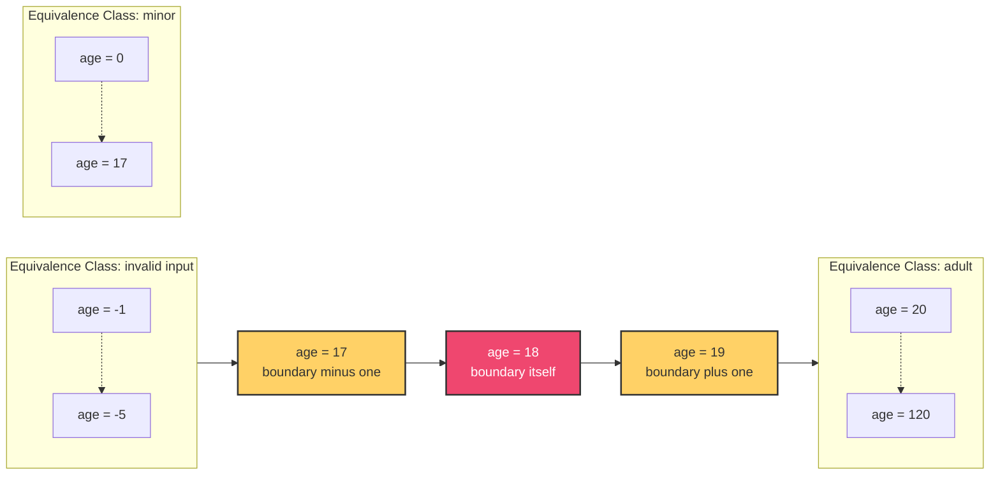
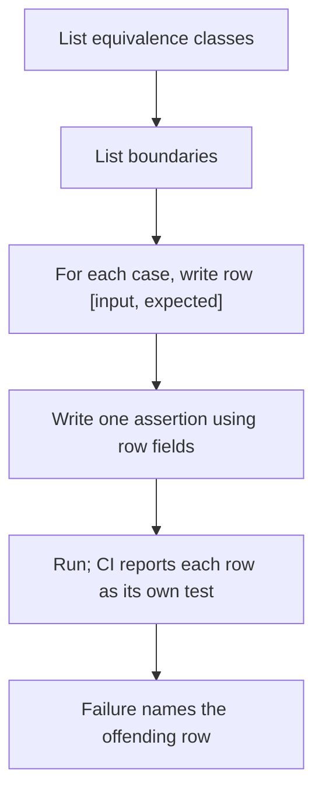
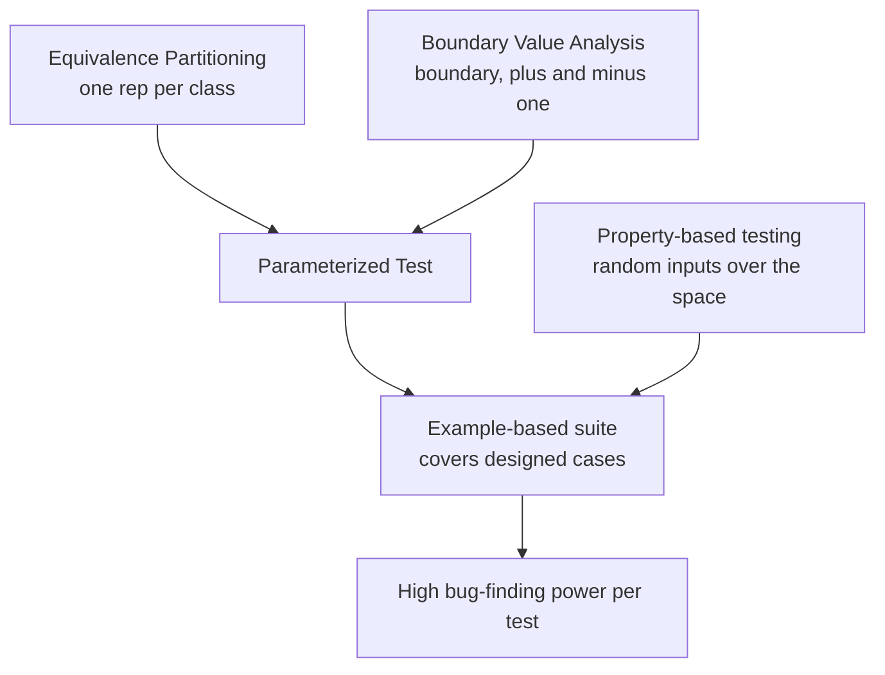
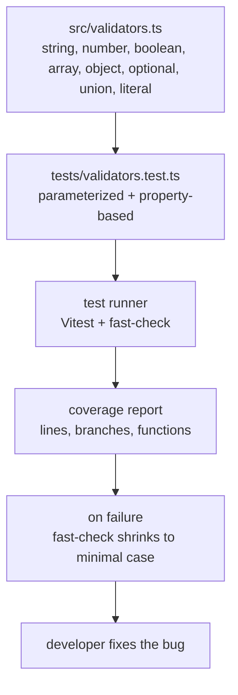

# 5.05 Testing Pure Functions

## 1. Purpose

A pure function is the cleanest unit a program can have. Give it inputs, get an output, repeat. The function never reads the wall clock, never rolls dice, never mutates outer state, and never speaks to the network. This simplicity is not aesthetic — it is operational. When a function is pure, testing collapses to the simplest possible act: pass inputs in, assert the output, done. No mocks. No stubs. No fixtures. No fake timers. No spies on `Math.random`. No database reset between tests. No flakiness because yesterday's run left state behind.

This note answers a single, sharp question: **given that pure functions are easy to test, how do you test them so well that bugs cannot hide**? Easy tests are a temptation to write lazy tests. A developer who would never ship a feature without thinking hard about edge cases will happily ship a test suite that calls the function with two happy inputs and calls it a day. The function is pure, the test passes, coverage is green, and yet a boundary bug at zero, an off-by-one at the empty string, or a NaN propagation through the pipeline is sitting there waiting for production traffic.

To prevent that, this note teaches four techniques that work together:

- **Equivalence partitioning** — divide the input space into classes where the function behaves identically. Pick one representative from each class. Stop testing redundant cases.
- **Boundary value analysis** — bugs cluster at the seams between equivalence classes. Test the boundary itself and one step on each side. For `isAdult(age)` with the cut at 18, that means 17, 18, and 19.
- **Parameterized tests** — when the same assertion shape applies to many inputs, collapse them into one test driven by a table. Jest and Vitest expose this as `it.each` / `test.each`.
- **Property-based testing** — instead of guessing inputs, describe an invariant the function must always satisfy. Let a library like `fast-check` generate hundreds of random inputs and try to falsify the invariant. When it finds a counterexample, it shrinks to the smallest failing case.

The combined goal is **maximum bug-finding power per test**. A test suite of 50 well-chosen parameterized and property-based tests will find more bugs than a suite of 500 hand-written happy-path assertions, run faster, and stay readable.

Pure functions are also the training ground for testing discipline. The habits you build here — boundary thinking, invariant thinking, separating "the function works for one input" from "the function works for the whole space" — transfer to every harder kind of testing: impure functions, async code, integration tests, end-to-end tests. See [[5.04 Unit Testing Fundamentals]] for the test-runner mechanics this note assumes, and [[1.13 Functional Programming Concepts]] for the definition of purity this note builds on.

## 2. Theory and Deep Dive

### 2.1 Determinism, the foundation

A function `f` is **deterministic** when, for any input `x`, the value `f(x)` is the same on every call. Determinism is the precondition for everything in this note. If a function is not deterministic, then no test can ever assert "for this input, the output is that" with confidence, because the next call might produce a different output.

JavaScript makes it alarmingly easy to write a function that looks pure but is not. The classic offenders: reading `Date.now()`, `new Date()`, `performance.now()`, or `process.uptime()`; reading `Math.random()` or `crypto.randomBytes()`; reading `process.env`, `localStorage`, `sessionStorage`, or `document.cookie`; mutating a closed-over variable; iterating a `Map` whose contents can be mutated externally; throwing exceptions whose presence depends on global state. (`Math.PI` is fine — it is a constant.)

A test that exercises such a function might pass on the developer's machine and fail in CI an hour later when the clock advances past midnight, or when `Math.random` happens to return a value that triggers a rare branch. [[1.13 Functional Programming Concepts]] covers purity in depth; here we treat purity as a precondition and focus on testing strategy.

A subtle point: **deterministic does not mean total**. A function can be deterministic and still throw for some inputs. `parseInt` is deterministic; `parseInt(null)` is `NaN`, which is deterministic; a function that throws `RangeError` when given a negative number is also deterministic if the throw is consistent. "Deterministic for testing purposes" means: same input produces the same observable outcome, whether that outcome is a return value or a thrown error.

### 2.2 Equivalence partitioning

Equivalence partitioning (EP) is the technique of dividing the input space into classes such that, if the function behaves correctly for one member of a class, it almost certainly behaves correctly for every member of that class. The hypothesis is that within a class, the function exercises the same code path and the same arithmetic. The test burden shrinks from "test everything" to "test one from each class."

Concretely, take `isAdult(age)` where adulthood begins at 18: Class A is `age < 0` (invalid, expected rejection or thrown error); Class B is `0 <= age < 18` (minors, expected `false`); Class C is `age >= 18` (adults, expected `true`). If `isAdult(7)` returns `false`, it is reasonable to believe `isAdult(12)` also returns `false`, because both inputs walk the same branch. We test one from each class — say `-1`, `7`, and `25` — and call the partition covered.

The cost of skipping EP is twofold. First, you write redundant tests (`isAdult(5)`, `isAdult(10)`, `isAdult(15)` all test the same branch). Second, you can be falsely reassured: you tested 10 inputs in one class but zero in another, and the untested class is where the bug lives.

EP does not require that classes be numeric intervals. For a string validator: empty string, non-empty but no `@`, one `@` with no domain, one `@` with a domain. For a `parseColor` function: `#rgb` short form, `#rrggbb` long form, named color, invalid input. The art is in spotting the **decision points** in the function's logic. Each `if`, each `switch` case, each ternary creates a potential partition. Walk the code, list the decisions, derive the classes.

### 2.3 Boundary value analysis

Boundary value analysis (BVA) is the companion to EP. EP tells you which classes matter; BVA tells you to test exactly where one class becomes another, because that is where bugs live. The hypothesis is empirical: off-by-one errors, `<=` vs `<`, `>` vs `>=`, integer overflow at limits, floating-point precision loss at extremes — all cluster at boundaries.

For `isAdult(age)` with cut at 18: the boundary itself is `age = 18` (expected `true`, assuming inclusive `>=`); one step below is `age = 17` (expected `false`); one step above is `age = 19` (expected `true`, confirms the branch continues to fire correctly). This three-input pattern — `boundary - 1`, `boundary`, `boundary + 1` — is the canonical BVA move. It catches the off-by-one bug where the developer wrote `age > 18` instead of `age >= 18`.

For floating point, "one step" needs interpretation. For a function that switches behavior at `1.0`, test `0.9999999999999999` and `1.0000000000000002` to catch IEEE-754 precision issues. For very large numbers, test `2 ** 53 - 1` (the largest safe integer), `2 ** 53` (which equals `2 ** 53 + 1` due to precision loss), and `Infinity`.

BVA applies to non-numeric domains too:

- Empty string `""` vs single character `"a"` vs two characters `"ab"` for a function with a "must be non-empty" branch.
- Empty array `[]` vs one element `[x]` for a function that takes the first element.
- `null` vs `undefined` vs an actual object for a function that handles optionality.
- UTC midnight vs one millisecond before vs one millisecond after for date logic.
- Leap day `2024-02-29` vs the day before and after for date arithmetic.

### 2.4 The combined diagram

The relationship between equivalence partitioning and boundary value analysis is best seen in a single picture:



The colored nodes are the boundary cases; the dimmed dotted ranges are the equivalence classes, each represented by any one interior point. A complete test suite picks at least one interior point per class plus the three boundary cases around every cut.

### 2.5 Parameterized tests

A parameterized test (also called a data-driven test) is a single test function that runs once per row in a table of inputs. The mechanics differ slightly between Jest and Vitest, but the API is the same: `it.each(table)(name, fn)` or `test.each(table)(name, fn)`.

```javascript
it.each([
  [1, 1, 2],
  [2, 3, 5],
  [10, -5, 5],
  [0, 0, 0],
])('adds %i and %i to get %i', (a, b, expected) => {
  expect(add(a, b)).toBe(expected);
});
```

The `%i` placeholders are filled in per row to produce distinct test names like `adds 1 and 1 to get 2`. This is critical: when the test fails for one row, the failure message tells you exactly which input broke, and CI reports each row as a separate test result.

Parameterized tests are the workhorse of EP and BVA. You list every equivalence class representative and every boundary case as rows in one table, then write the assertion once. The result is a single, readable block of code that exercises dozens of cases.



Both Jest and Vitest support two table shapes. The first is array-of-arrays, where each row is a positional list of arguments and the name string uses `%s`, `%i`, `%d`, `%j`, or `%p` placeholders. The second is array-of-objects, where each row is an object and the name string uses `$propertyName` references. The object form is more readable for tables with many columns and is the form used throughout this note's TypeScript examples because it lets the table be typed as `Case[]`.

### 2.6 Property-based testing

Property-based testing (PBT) is a different mental gear. Instead of guessing inputs, you state an **invariant** — a property that must hold for every input — and let a library generate random inputs to try to break it. The library is `fast-check` in the JavaScript ecosystem; equivalent tools are QuickCheck (Haskell), Hypothesis (Python), `test.check` (Clojure), and `jqwik` (Java).

A property has the shape: **for all `x` in some space, `P(f(x))` is true**. Examples: for all arrays `xs`, `reverse(reverse(xs))` deep-equals `xs`; for all integers `n`, `abs(n) >= 0`; for all `a, b`, `add(a, b) === add(b, a)` (commutativity); for all valid emails `e`, `validateEmail(e)` returns `{ valid: true }`.

In `fast-check`:

```javascript
import fc from 'fast-check';

test('reverse is its own inverse', () => {
  fc.assert(
    fc.property(fc.array(fc.integer()), (xs) => {
      expect(reverse(reverse(xs))).toEqual(xs);
    })
  );
});
```

The library generates 100 (by default) random integer arrays, runs the property on each, and reports success. If any input fails, `fast-check` **shrinks** it: starting from the failing input, it tries smaller and smaller inputs (smaller arrays, smaller integers, shorter strings) until it finds the smallest input that still fails. The shrunken failure is what gets reported. A failing run on `reverse(reverse(xs))` might find a failing input of length 47, but shrink it to length 1, exposing the real bug: `reverse([undefined])` returns `[]` because the implementation does not handle single-element arrays.

PBT finds bugs that example-based testing misses, because humans do not naturally write examples like "an array of 7 elements where the third is `NaN` and the seventh is an empty string." The random generator does. PBT is also a forcing function for understanding your function: if you cannot state an invariant, you do not understand the function well enough to test it.

### 2.7 The four techniques in concert

A complete test plan for a pure function uses all four: equivalence partitioning to decide the input classes; boundary value analysis to find the seam cases; parameterized tests to express the EP and BVA cases as one table-driven test; property-based testing to cover the input space the human-chosen examples missed. The first three give you confidence that the cases you thought of are handled. The fourth gives you confidence that the cases you did not think of are handled too.



### 2.8 Why this beats "test until you feel good"

The naive approach to testing pure functions is to write tests until the developer feels reassured. This approach has three failure modes: the developer writes five tests in the same equivalence class and skips three classes entirely; the developer writes "happy path" tests that miss the boundary bugs that bite in production; and the developer never thinks in invariants, so the function may satisfy every written example yet violate an invariant nobody wrote down. The EP plus BVA plus parameterized plus property-based discipline attacks each failure mode. EP forces coverage of every class. BVA forces the boundary cases. Parameterized tests make the discipline cheap to express. Property-based testing sweeps the space the human missed.

## 3. Mental Models

Mental models are the shorthand phrases that let you reason about a technique without rebuilding the theory from scratch each time. Keep these four in head:

**Pure function: input in, output out, no surprises.** A pure function is a vending machine. Put coins in, get a snack out. The machine does not phone home, does not care what time it is, does not remember the last customer. If you call it twice with the same coins, you get the same snack. Testing a pure function is just calling the vending machine with various coins and checking the snack.

**Equivalence class: all these inputs behave the same, test one.** If you have a coffee machine that brews the same cup for any coin value from one to five, you do not need to test every value. The class is "coins in [1, 5]"; the representative is, say, three. The art is in noticing where the behavior changes — at zero coins, at six coins, at the coin-return button — because each change marks a new class.

**Boundary: where behavior changes, bugs hide here.** Boundaries are the doorways between classes. Doorways are where you trip. The bug is almost never in the middle of the room; it is at the threshold, where one branch ends and another begins. Test the threshold and one step on either side.

**Property: this should always be true, let the computer find a case where it isn't.** A property is a contract the function signs with the universe. "I always commute." "I always return non-negative." "I always round-trip." You hand the contract to a fuzzer, and the fuzzer generates a thousand inputs trying to find a violation. If it finds one, it shrinks the violation to the smallest, most embarrassing input that breaks the contract — and that input is almost always a bug you would never have thought to write a test for.

The fourth model is the most powerful. The shift from examples ("test these specific inputs") to properties ("test any input against this invariant") is the same shift as from unit tests to type checks: you stop enumerating cases and start stating laws. The library does the enumeration. A second metaphor: it is like having a junior developer with infinite patience and creativity who runs your function on every weird input they can imagine, and reports back with the weirdest input that broke it.

The models break down in two places. First, EP assumes that within a class the function takes the same code path. If the function has a hidden branch — say, it special-cases the input `42` for some legacy reason — then EP will miss the bug because all your class representatives avoid `42`. Property-based testing catches this. Second, BVA assumes the function is monotonic around the boundary. If the function has a discontinuity, the standard three-point BVA pattern catches it, but only because you tested the boundary itself, not just its neighbors.

## 4. Real-World Use Cases

**Parsers.** A JSON parser, a URL parser, a date parser, a CSV parser, a TypeScript-to-JavaScript transpiler front end. All are pure functions: bytes in, AST out. Parsers are the canonical example where EP and BVA shine, because the input space is enormous but the equivalence classes are enumerable (empty input, well-formed input, malformed at position 0, malformed at the end, deeply nested, oversized, etc.). Property-based testing is especially devastating here: a fuzzer will find inputs that crash the parser in seconds, inputs no human would write. The `fast-check` documentation uses parsers as a flagship example. The Node `querystring` module, the `URL` constructor, and `JSON.parse` are all pure-function surfaces that benefit.

**Validators.** Email validators, password-strength checkers, IBAN validators, schema validators (think Zod, Joi, Ajv). Validators return `{ valid: boolean, errors: string[] }` and have no side effects. Their input space is enormous, and the equivalence classes are derived from the validation rules. Boundary cases include: empty string, single character, exactly at the length limit, one over the limit, Unicode at the boundaries, embedded null bytes. Property-based tests are excellent for validators: "for any string the generator produces, the validator never throws." A surprising number of validators throw on certain Unicode inputs.

**Calculators.** Tax calculators, currency converters (the conversion function itself, ignoring the network call to fetch the rate), discount appliers, shipping cost calculators, geometry helpers. These are arithmetic-heavy pure functions. Boundary cases include: zero quantity, negative quantity (should it throw or return zero?), maximum representable integer, fractional cents, currency precision (round to 2 decimals or 4?), zero discount, 100 percent discount, 101 percent discount. Property-based tests catch floating-point drift: "for all `a, b` in valid range, `convert(convert(a, USD, EUR), EUR, USD)` is within epsilon of `a`."

**Algorithms.** Sorting, searching, deduplication, set operations, graph traversal, matrix math, cryptographic primitives (where determinism is the whole point). Algorithms are where property-based testing truly earns its keep, because the invariants are mathematically precise: sorting produces a permutation that is monotonic; deduplication preserves the first occurrence; matrix transpose is its own inverse for square matrices. `fast-check` ships with combinators for arrays, records, tuples, and recursive structures, so even complex inputs are easy to generate.

**Numeric functions, boundary at 0, max, min, overflow.** Any function with arithmetic has boundaries at the natural limits of IEEE-754 doubles: `0`, `-0`, `Number.EPSILON`, `2 ** 53 - 1` (the largest safe integer), `2 ** 53` (which equals `2 ** 53 + 1` due to precision loss), `1.7976931348623157e+308` (the largest representable double), `Infinity`, `-Infinity`, `NaN`. Test each. A function like `clamp(n, min, max)` should be tested at `min`, `max`, `min - 1`, `max + 1`, exactly `min`, exactly `max`, and at `NaN` for all three arguments.

**String functions, boundary at empty, single char, max length.** A function that capitalizes strings has boundaries at `""` (empty), `"a"` (single character), `"ab"` (two characters), and a string of length `2 ** 53 - 1` (which you cannot literally construct, so test at a "reasonable" max like 10,000 characters, plus one less and one more than any internal limit). For Unicode, test at the start of a multi-byte sequence, at the boundary between BMP and astral planes (`0xFFFF` vs `0x10000`), and with combining characters that affect string length but not grapheme count.

**Date functions, boundary at midnight, end of month, leap years.** Date arithmetic is the densest source of bugs in production code. Boundary cases: midnight UTC vs midnight local, the last day of a 31-day month vs a 30-day month vs February (28 or 29), February 29 in leap years (2024, 2020) and not in non-leap years (2023, 2100 — note 2100 is not a leap year despite being divisible by 4, because it is divisible by 100 but not 400), daylight saving time transitions (spring forward, fall back), and the Unix epoch boundary (1970-01-01T00:00:00.000Z). Property-based tests catch whole classes of bugs: "for any valid Date `d`, `addDays(d, 0)` equals `d`"; "for any valid Date `d` and integers `m, n`, `addDays(addDays(d, m), n)` equals `addDays(d, m + n)`."

**Library code, high coverage expected.** A library that ships as a package is held to a higher testing standard than application code, because users will pass inputs the maintainers never imagined. Lodash, Ramda, date-fns, `fast-check` itself, Zod, Ajv — all rely on dense test suites combining example-based and property-based tests. Lodash's test suite is a masterclass in BVA: every method has rows for empty input, single-element input, two-element input, and large input. Zod's test suite is a model for validators: every schema type has property-based tests asserting round-trip and parse-print consistency.

## 5. Code Examples

### 5.1 Example A — Minimal and Conceptual

The goal of this minimal example is to take one pure function and apply all four techniques: equivalence partitioning to decide classes, boundary value analysis to find seams, a parameterized test to express the cases compactly, and a property-based test to cover the input space the human missed.

The function under test is `clamp(n, min, max)`, which clamps `n` into the inclusive range `[min, max]`. If `n < min`, return `min`. If `n > max`, return `max`. Otherwise return `n`.

#### Equivalence classes

- Class A: `n < min` — expected output `min`.
- Class B: `n > max` — expected output `max`.
- Class C: `min <= n <= max` — expected output `n`.

#### Boundary cases

- `n = min - 1` (just below the lower bound).
- `n = min` (the lower bound itself).
- `n = min + 1` (just above the lower bound, inside the range).
- `n = max - 1` (just below the upper bound, inside the range).
- `n = max` (the upper bound itself).
- `n = max + 1` (just above the upper bound).

#### Edge cases

- `min === max` (degenerate range of one value).
- `min > max` (invalid range — should the function throw, or swap, or return `NaN`?).
- `n` is `NaN` — should return `NaN` (or throw).
- `min` or `max` is `NaN` — should return `NaN`.
- `Infinity` and `-Infinity` as any argument.

**JavaScript implementation:**

```javascript
// clamp.js

/**
 * Clamp n into the inclusive range [min, max].
 * Returns NaN if any argument is NaN or if min > max.
 */
function clamp(n, min, max) {
  if (Number.isNaN(n) || Number.isNaN(min) || Number.isNaN(max)) return NaN;
  if (min > max) return NaN;
  if (n < min) return min;
  if (n > max) return max;
  return n;
}

module.exports = { clamp };
```

**JavaScript test:**

```javascript
// clamp.test.js
const { clamp } = require('./clamp');
const fc = require('fast-check');

describe('clamp — equivalence and boundary cases', () => {
  test.each([
    // [n, min, max, expected, label]
    [-5, 0, 10, 0, 'n below min returns min'],
    [5, 0, 10, 5, 'n inside range returns n'],
    [15, 0, 10, 10, 'n above max returns max'],
    [-1, 0, 10, 0, 'boundary just below min'],
    [0, 0, 10, 0, 'boundary at min itself'],
    [1, 0, 10, 1, 'boundary just above min'],
    [9, 0, 10, 9, 'boundary just below max'],
    [10, 0, 10, 10, 'boundary at max itself'],
    [11, 0, 10, 10, 'boundary just above max'],
    [5, 5, 5, 5, 'degenerate range of one value'],
  ])('%s', (n, min, max, expected, label) => {
    expect(clamp(n, min, max)).toBe(expected);
  });

  test.each([
    [NaN, 0, 10],
    [5, NaN, 10],
    [5, 0, NaN],
    [5, 10, 0], // min greater than max
    [Infinity, 0, 10],
    [-Infinity, 0, 10],
  ])('returns NaN for invalid input n=%s min=%s max=%s', (n, min, max) => {
    expect(clamp(n, min, max)).toBeNaN();
  });
});

describe('clamp — property-based tests', () => {
  test('result is always within [min, max] when inputs are valid integers', () => {
    fc.assert(
      fc.property(fc.integer(), fc.integer(), fc.integer(), (a, b, c) => {
        const [min, max] = [Math.min(a, b), Math.max(a, b)];
        const result = clamp(c, min, max);
        expect(result).toBeGreaterThanOrEqual(min);
        expect(result).toBeLessThanOrEqual(max);
      })
    );
  });

  test('clamping twice is the same as clamping once', () => {
    fc.assert(
      fc.property(fc.integer(), fc.integer(), fc.integer(), (a, b, c) => {
        const [min, max] = [Math.min(a, b), Math.max(a, b)];
        const once = clamp(c, min, max);
        const twice = clamp(once, min, max);
        expect(twice).toBe(once);
      })
    );
  });

  test('clamp(n, n, n) is always n', () => {
    fc.assert(
      fc.property(fc.integer(), (n) => {
        expect(clamp(n, n, n)).toBe(n);
      })
    );
  });
});
```

**TypeScript implementation:**

```typescript
// clamp.ts

/**
 * Clamp n into the inclusive range [min, max].
 * Returns NaN if any argument is NaN or if min > max.
 */
export function clamp(n: number, min: number, max: number): number {
  if (Number.isNaN(n) || Number.isNaN(min) || Number.isNaN(max)) return NaN;
  if (min > max) return NaN;
  if (n < min) return min;
  if (n > max) return max;
  return n;
}
```

**TypeScript test:**

```typescript
// clamp.test.ts
import { describe, test, expect } from 'vitest';
import fc from 'fast-check';
import { clamp } from './clamp';

type Case = {
  n: number;
  min: number;
  max: number;
  expected: number;
  label: string;
};

const cases: Case[] = [
  { n: -5, min: 0, max: 10, expected: 0, label: 'n below min returns min' },
  { n: 5, min: 0, max: 10, expected: 5, label: 'n inside range returns n' },
  { n: 15, min: 0, max: 10, expected: 10, label: 'n above max returns max' },
  { n: -1, min: 0, max: 10, expected: 0, label: 'boundary just below min' },
  { n: 0, min: 0, max: 10, expected: 0, label: 'boundary at min itself' },
  { n: 1, min: 0, max: 10, expected: 1, label: 'boundary just above min' },
  { n: 9, min: 0, max: 10, expected: 9, label: 'boundary just below max' },
  { n: 10, min: 0, max: 10, expected: 10, label: 'boundary at max itself' },
  { n: 11, min: 0, max: 10, expected: 10, label: 'boundary just above max' },
  { n: 5, min: 5, max: 5, expected: 5, label: 'degenerate range of one value' },
];

describe('clamp — equivalence and boundary cases', () => {
  test.each(cases)('$label', ({ n, min, max, expected }) => {
    expect(clamp(n, min, max)).toBe(expected);
  });

  test.each([
    { n: NaN, min: 0, max: 10, label: 'NaN n' },
    { n: 5, min: NaN, max: 10, label: 'NaN min' },
    { n: 5, min: 0, max: NaN, label: 'NaN max' },
    { n: 5, min: 10, max: 0, label: 'min greater than max' },
    { n: Infinity, min: 0, max: 10, label: 'Infinity n' },
    { n: -Infinity, min: 0, max: 10, label: 'negative Infinity n' },
  ])('returns NaN for invalid input: $label', ({ n, min, max }) => {
    expect(clamp(n, min, max)).toBeNaN();
  });
});

describe('clamp — property-based tests', () => {
  test('result is always within [min, max] when inputs are valid integers', () => {
    fc.assert(
      fc.property(fc.integer(), fc.integer(), fc.integer(), (a, b, c) => {
        const [min, max] = [Math.min(a, b), Math.max(a, b)];
        const result = clamp(c, min, max);
        expect(result).toBeGreaterThanOrEqual(min);
        expect(result).toBeLessThanOrEqual(max);
      })
    );
  });

  test('clamping twice is the same as clamping once (idempotence)', () => {
    fc.assert(
      fc.property(fc.integer(), fc.integer(), fc.integer(), (a, b, c) => {
        const [min, max] = [Math.min(a, b), Math.max(a, b)];
        const once = clamp(c, min, max);
        const twice = clamp(once, min, max);
        expect(twice).toBe(once);
      })
    );
  });

  test('clamp(n, n, n) is always n (degenerate range)', () => {
    fc.assert(
      fc.property(fc.integer(), (n) => {
        expect(clamp(n, n, n)).toBe(n);
      })
    );
  });
});
```

The four techniques are all visible: equivalence classes are listed as comment-grouped rows; boundary cases are explicit rows; parameterized tests express all rows compactly; property-based tests assert invariants over the entire integer space. The TypeScript version adds type safety to the table rows, which prevents the most embarrassing mistake — passing the wrong shape to a row and getting a runtime error far from the source.

### 5.2 Example B — Production-Grade

A production-grade example is a small typed validation library: pure validators that compose, with a property-based test suite asserting the laws validators must satisfy. This mirrors how libraries like Zod, Joi, and `superstruct` are tested internally.

The library has three validators: `string`, `number`, and `array`. Each validator exposes `parse(input): { ok: true, value } | { ok: false, errors: string[] }`. Validators compose via `array(string())` to validate arrays of strings.

**JavaScript implementation:**

```javascript
// validators.js

const ok = (value) => ({ ok: true, value });
const fail = (errors) => ({ ok: false, errors });

const string = () => ({
  parse(input) {
    if (typeof input !== 'string') return fail([`expected string, got ${typeof input}`]);
    return ok(input);
  },
});

const number = () => ({
  parse(input) {
    if (typeof input !== 'number') return fail([`expected number, got ${typeof input}`]);
    if (Number.isNaN(input)) return fail(['expected number, got NaN']);
    return ok(input);
  },
});

const array = (itemValidator) => ({
  parse(input) {
    if (!Array.isArray(input)) return fail([`expected array, got ${typeof input}`]);
    const values = [];
    const errors = [];
    for (let i = 0; i < input.length; i++) {
      const result = itemValidator.parse(input[i]);
      if (result.ok) {
        values.push(result.value);
      } else {
        for (const e of result.errors) errors.push(`[${i}]: ${e}`);
      }
    }
    if (errors.length > 0) return fail(errors);
    return ok(values);
  },
});

module.exports = { ok, fail, string, number, array };
```

**JavaScript test:**

```javascript
// validators.test.js
const { string, number, array } = require('./validators');
const fc = require('fast-check');

describe('string validator', () => {
  test.each([
    ['hello', true],
    ['', true],
    ['a', true],
    [42, false],
    [null, false],
    [undefined, false],
    [Symbol('x'), false],
    [true, false],
  ])('string().parse(%p) ok=%s', (input, expectedOk) => {
    const result = string().parse(input);
    expect(result.ok).toBe(expectedOk);
  });

  test('property: any string passes', () => {
    fc.assert(
      fc.property(fc.string(), (s) => {
        const result = string().parse(s);
        return result.ok === true && result.value === s;
      })
    );
  });
});

describe('number validator', () => {
  test.each([
    [0, true],
    [42, true],
    [3.14, true],
    [2 ** 53 - 1, true],
    [Infinity, true],
    [-Infinity, true],
    [NaN, false],
    ['42', false],
    [null, false],
    [undefined, false],
  ])('number().parse(%p) ok=%s', (input, expectedOk) => {
    const result = number().parse(input);
    expect(result.ok).toBe(expectedOk);
  });

  test('property: any non-NaN number passes', () => {
    fc.assert(
      fc.property(fc.double({ noNaN: true }), (n) => {
        const result = number().parse(n);
        return result.ok === true && result.value === n;
      })
    );
  });
});

describe('array(string) validator', () => {
  test.each([
    [[], true],
    [['a'], true],
    [['a', 'b', 'c'], true],
    [['a', 1], false],
    [42, false],
    [null, false],
    ['not an array', false],
  ])('array(string).parse(%p) ok=%s', (input, expectedOk) => {
    const result = array(string()).parse(input);
    expect(result.ok).toBe(expectedOk);
  });

  test('property: array of strings always passes', () => {
    fc.assert(
      fc.property(fc.array(fc.string()), (arr) => {
        const result = array(string()).parse(arr);
        return result.ok === true && JSON.stringify(result.value) === JSON.stringify(arr);
      })
    );
  });

  test('property: array with one non-string always fails', () => {
    fc.assert(
      fc.property(
        fc.array(fc.string(), { maxLength: 20 }),
        fc.nat({ max: 20 }),
        (arr, n) => {
          const polluted = arr.slice();
          polluted.splice(Math.min(n, arr.length), 0, 42);
          const result = array(string()).parse(polluted);
          return result.ok === false && result.errors.length > 0;
        }
      )
    );
  });

  test('property: round trip — parse(serialize(parsed)) is identity', () => {
    fc.assert(
      fc.property(fc.array(fc.string()), (arr) => {
        const first = array(string()).parse(arr);
        if (!first.ok) return false;
        const serialized = JSON.stringify(first.value);
        const reparsed = array(string()).parse(JSON.parse(serialized));
        return reparsed.ok === true && JSON.stringify(reparsed.value) === serialized;
      })
    );
  });
});
```

**TypeScript implementation:**

```typescript
// validators.ts

export type ParseResult<T> =
  | { ok: true; value: T }
  | { ok: false; errors: string[] };

export interface Validator<T> {
  parse(input: unknown): ParseResult<T>;
}

const ok = <T>(value: T): ParseResult<T> => ({ ok: true, value });
const fail = (errors: string[]): ParseResult<never> => ({ ok: false, errors });

export const string = (): Validator<string> => ({
  parse(input: unknown): ParseResult<string> {
    if (typeof input !== 'string') {
      return fail([`expected string, got ${typeof input}`]);
    }
    return ok(input);
  },
});

export const number = (): Validator<number> => ({
  parse(input: unknown): ParseResult<number> {
    if (typeof input !== 'number') {
      return fail([`expected number, got ${typeof input}`]);
    }
    if (Number.isNaN(input)) return fail(['expected number, got NaN']);
    return ok(input);
  },
});

export const array = <T>(itemValidator: Validator<T>): Validator<T[]> => ({
  parse(input: unknown): ParseResult<T[]> {
    if (!Array.isArray(input)) {
      return fail([`expected array, got ${typeof input}`]);
    }
    const values: T[] = [];
    const errors: string[] = [];
    for (let i = 0; i < input.length; i++) {
      const result = itemValidator.parse(input[i]);
      if (result.ok) {
        values.push(result.value);
      } else {
        for (const e of result.errors) errors.push(`[${i}]: ${e}`);
      }
    }
    if (errors.length > 0) return fail(errors);
    return ok(values);
  },
});
```

**TypeScript test:**

```typescript
// validators.test.ts
import { describe, test, expect } from 'vitest';
import fc from 'fast-check';
import { string, number, array, type Validator, type ParseResult } from './validators';

type StringCase = { input: unknown; expectedOk: boolean; label: string };

const stringCases: StringCase[] = [
  { input: 'hello', expectedOk: true, label: 'non-empty string' },
  { input: '', expectedOk: true, label: 'empty string' },
  { input: 'a', expectedOk: true, label: 'single character' },
  { input: 42, expectedOk: false, label: 'number instead of string' },
  { input: null, expectedOk: false, label: 'null' },
  { input: undefined, expectedOk: false, label: 'undefined' },
  { input: Symbol('x'), expectedOk: false, label: 'symbol' },
  { input: true, expectedOk: false, label: 'boolean' },
];

describe('string validator', () => {
  test.each(stringCases)('$label', ({ input, expectedOk }) => {
    const result = string().parse(input);
    expect(result.ok).toBe(expectedOk);
  });

  test('property: any string passes and round-trips', () => {
    fc.assert(
      fc.property(fc.string(), (s) => {
        const result = string().parse(s);
        if (!result.ok) return false;
        return result.value === s;
      })
    );
  });
});

describe('number validator', () => {
  test.each([
    { input: 0, expectedOk: true, label: 'zero' },
    { input: 42, expectedOk: true, label: 'positive integer' },
    { input: 3.14, expectedOk: true, label: 'float' },
    { input: 2 ** 53 - 1, expectedOk: true, label: 'max safe integer' },
    { input: Infinity, expectedOk: true, label: 'positive infinity' },
    { input: -Infinity, expectedOk: true, label: 'negative infinity' },
    { input: NaN, expectedOk: false, label: 'NaN' },
    { input: '42', expectedOk: false, label: 'string holding a number' },
    { input: null, expectedOk: false, label: 'null' },
    { input: undefined, expectedOk: false, label: 'undefined' },
  ])('$label', ({ input, expectedOk }) => {
    const result = number().parse(input);
    expect(result.ok).toBe(expectedOk);
  });

  test('property: any non-NaN number passes', () => {
    fc.assert(
      fc.property(fc.double({ noNaN: true }), (n) => {
        const result = number().parse(n);
        if (!result.ok) return false;
        return Object.is(result.value, n);
      })
    );
  });
});

describe('array(string) validator', () => {
  test.each([
    { input: [], expectedOk: true, label: 'empty array' },
    { input: ['a'], expectedOk: true, label: 'single element' },
    { input: ['a', 'b', 'c'], expectedOk: true, label: 'multiple elements' },
    { input: ['a', 1], expectedOk: false, label: 'mixed valid and invalid' },
    { input: 42, expectedOk: false, label: 'number instead of array' },
    { input: null, expectedOk: false, label: 'null' },
    { input: 'not an array', expectedOk: false, label: 'string instead of array' },
  ])('$label', ({ input, expectedOk }) => {
    const result = array(string()).parse(input);
    expect(result.ok).toBe(expectedOk);
  });

  test('property: array of strings always passes and round-trips', () => {
    fc.assert(
      fc.property(fc.array(fc.string()), (arr) => {
        const result = array(string()).parse(arr);
        if (!result.ok) return false;
        return JSON.stringify(result.value) === JSON.stringify(arr);
      })
    );
  });

  test('property: array with one non-string always fails', () => {
    fc.assert(
      fc.property(
        fc.array(fc.string(), { maxLength: 20 }),
        fc.nat({ max: 20 }),
        (arr, n) => {
          const polluted = arr.slice();
          polluted.splice(Math.min(n, arr.length), 0, 42);
          const result = array(string()).parse(polluted);
          return result.ok === false && result.errors.length > 0;
        }
      )
    );
  });

  test('property: parse(serialize(parsed)) is identity', () => {
    fc.assert(
      fc.property(fc.array(fc.string()), (arr) => {
        const first = array(string()).parse(arr);
        if (!first.ok) return false;
        const serialized = JSON.stringify(first.value);
        const reparsed = array(string()).parse(JSON.parse(serialized));
        if (!reparsed.ok) return false;
        return JSON.stringify(reparsed.value) === serialized;
      })
    );
  });
});
```

The production-grade test suite combines all four techniques: equivalence partitioning identifies the rows for "valid input, invalid input, edge types (null, undefined, NaN, symbol, boolean)"; boundary value analysis adds "empty array, single element, two elements"; parameterized tests express all these compactly; property-based tests assert the laws (`parse` of valid input succeeds; one invalid element fails the whole array; round-tripping through `JSON.stringify` is identity; error messages are informative). The TypeScript version adds type safety, including the discriminated union `ParseResult<T>` that forces every consumer to handle both branches. See [[2.03 Type Assertions and Guards]] for more on type narrowing with discriminated unions.

## 6. Common Mistakes and Anti-Patterns

### 6.1 Only testing the happy path

The single most common mistake. A developer writes `expect(add(2, 3)).toBe(5)` and moves on. The test passes, coverage is 100 percent for the line `return a + b`, and yet the function might also be called with `add("2", 3)` (returns `"23"` thanks to coercion) or `add(NaN, 5)` (returns `NaN`) or `add(Infinity, -Infinity)` (returns `NaN`) in production. None of those cases is exercised.

**Why it fails:** happy-path tests prove the function works for one input. They prove nothing about the input space. They give false confidence.

**Fix:** apply EP and BVA to enumerate at least one representative from each class and every boundary case. Convert the list to a parameterized test so the cost of adding cases is one row.

### 6.2 Missing boundary values

A developer writes tests for `isAdult(15)` (returns `false`) and `isAdult(25)` (returns `true`), but never tests `isAdult(17)`, `isAdult(18)`, or `isAdult(19)`. The function might be implemented as `return age > 18` (off by one — `isAdult(18)` returns `false` when it should return `true`), and the test suite is green.

**Why it fails:** EP representatives come from the interior of a class. Bugs live at the seams. Without explicit BVA, the seams are untested.

**Fix:** for every comparison in the function, list the boundary value and one step on each side. Test all three.

### 6.3 Testing too many equivalence classes (redundant tests)

A developer writes `isAdult(5)`, `isAdult(10)`, `isAdult(12)`, `isAdult(14)`, `isAdult(16)`, and `isAdult(17)` — six tests, all in the "minor" class, all exercising the same code path. The test suite is large, slow, and provides no more confidence than `isAdult(7)` alone.

**Why it fails:** redundancy without coverage. The developer feels they have tested thoroughly because the test count is high, but the bug in the "adult" class is untested.

**Fix:** partition first, then pick one representative per class. If two tests would exercise the same branch, delete one. The goal is maximum information per test, not maximum tests.

### 6.4 Property-based tests with weak properties

A developer writes:

```javascript
test('add property', () => {
  fc.assert(fc.property(fc.integer(), fc.integer(), (a, b) => {
    expect(typeof add(a, b)).toBe('number');
  }));
});
```

This property is true for `add = (a, b) => 42` and also for `add = (a, b) => a * b`. It asserts almost nothing.

**Why it fails:** a property that is satisfied by a wrong implementation is not a property that catches bugs. The art of PBT is choosing properties that distinguish the correct implementation from plausible wrong ones.

**Fix:** choose properties that pin down the function's behavior: commutativity (`add(a, b) === add(b, a)`), identity (`add(a, 0) === a`), inverse (`add(a, -a) === 0`), distributivity, idempotence (`clamp(clamp(x), ...) === clamp(x)`), round-trip (`decode(encode(x)) === x`), monotonicity, etc. The goal is a property that the correct implementation satisfies and that a buggy implementation violates.

### 6.5 Non-deterministic "pure" functions

A function that looks pure but secretly reads `Date.now()` or `Math.random()`:

```javascript
const generateId = (prefix) => `${prefix}-${Date.now().toString(36)}`;
```

The test `expect(generateId('user')).toBe('user-???')` cannot be written because the output changes every call. The developer either skips the test, writes a weak test (`expect(generateId('user')).toMatch(/^user-/)`), or writes a test that passes today and fails next year.

**Why it fails:** the function is not pure. Tests cannot pin down its behavior. The bug class it hides is large: time-based IDs that collide, randomness that breaks reproducibility, environment reads that behave differently in CI.

**Fix:** extract the impure dependency. Take the time or randomness as an argument:

```javascript
const generateId = (prefix, now = Date.now) => `${prefix}-${now().toString(36)}`;
```

Now the function is pure for testing (inject a fixed `now`), and impure only at the call site where the real `Date.now` is passed. This is the "dependency injection for purity" pattern. See [[1.13 Functional Programming Concepts]] and [[5.03 Testability by Design]].

### 6.6 100 percent coverage with shallow tests

A test suite achieves 100 percent line and branch coverage, and the team ships with confidence. The coverage tool reported that every line ran. What it did not report is that every line ran with one input, and that input was the happy path. The bug at the boundary, the bug in the rare equivalence class, and the bug under NaN propagation are all untested — but every line is "covered."

**Why it fails:** coverage measures execution, not correctness. A line that runs with one input is "covered" by the tool, but the line may be wrong for every other input.

**Fix:** treat coverage as a floor, not a ceiling. Use EP and BVA to ensure every line is exercised by multiple inputs from different classes. Use property-based tests to assert the line behaves correctly for inputs the developer never thought of. 100 percent coverage is the starting point of a good suite, not the finish line.

### 6.7 Ignoring floating-point and integer-overflow edge cases

A developer writes tests for `divide(a, b)` with cases like `divide(10, 2)` and `divide(7, 3)`. They miss `divide(1, 0)` (returns `Infinity` or throws), `divide(0, 0)` (returns `NaN`), `divide(-1, 0)` (returns `-Infinity`), `divide(1.7976931348623157e+308, 0.5)` (returns `Infinity` because the result overflows), and `divide(0.1, 0.3)` (returns `0.33333333333333337` or similar). The function passes every test, and then production hits `divide(total, count)` with `count = 0` and the application crashes or returns `Infinity` and propagates the bad value through ten more computations.

**Why it fails:** IEEE-754 floating point has more edge cases than developers remember. NaN propagation is viral: any arithmetic with NaN returns NaN, and NaN compared to anything (including itself) is false.

**Fix:** for any arithmetic function, test explicitly: `0`, `-0`, `NaN`, `Infinity`, `-Infinity`, `Number.EPSILON`, `2 ** 53 - 1`, `2 ** 53` (which equals `2 ** 53 + 1` due to precision loss), `1.7976931348623157e+308`, very small fractions, very large integers. Use property-based tests with `fc.double({ noNaN: false })` to ensure NaN is in the generated space and the function handles it.

### 6.8 Tests that depend on test order or shared mutable state

A developer writes:

```javascript
let counter = 0;
test('increments', () => { counter++; expect(counter).toBe(1); });
test('increments again', () => { counter++; expect(counter).toBe(2); });
```

This suite passes when run in order. It fails when the test runner shuffles order (Vitest and Jest both can), or when a single test is run in isolation, or when the suite is run in parallel with another file. The root cause is shared mutable state across tests, which is the testing equivalent of impurity.

**Why it fails:** tests are not pure. Their result depends on what ran before.

**Fix:** every test sets up its own state in `beforeEach` or inside the test body. No test reads from a variable another test wrote. Treat tests as pure functions of their setup.

## 7. Best Practices and Design Patterns

**Test happy path, boundaries, and edge cases.** Three layers. The happy path proves the function works at all. Boundaries prove the seams are correct. Edge cases (empty, null, undefined, NaN, Infinity, max, min, negative, zero) prove the function handles the degenerate inputs that production will eventually throw at it. Skipping any layer leaves a hole.

**Use equivalence partitioning to avoid redundancy.** Before writing tests, list the equivalence classes. Pick one representative per class. Resist the urge to test five values in the same class.

**Use boundary value analysis at every comparison.** For every `<`, `>`, `<=`, `>=`, `===`, `!==` in the function, identify the boundary value and test it plus one step on each side. Off-by-one bugs are the most common arithmetic bug; BVA is their nemesis.

**Use parameterized tests for many inputs.** Once you have the EP and BVA list, express it as a single `it.each` table. The table is documentation: every reader can scan the rows and see the input space the developer considered.

**Use property-based testing for invariants.** Once the example-based suite is solid, add property-based tests for the laws the function must satisfy: commutativity, associativity, identity, idempotence, monotonicity, round-trip, distributivity. Properties catch bugs that examples cannot, because they sweep the input space.

**Keep tests deterministic.** No `Date.now()`, no `Math.random()`, no network calls, no file system reads, no shared mutable state across tests. If the function under test needs the current time, inject it. If the test needs randomness, seed the generator. A test that passes 99 percent of the time is a test that fails 1 percent of the time, and that 1 percent will be the CI run that blocks a release on Friday afternoon.

**Test edge cases by name.** Have a row in every parameterized test for: `0`, `-0`, `NaN`, `Infinity`, `-Infinity`, `null`, `undefined`, `""`, `[]`, `{}`, `2 ** 53 - 1`, `1.7976931348623157e+308` (the largest double). Even if the function rejects them, the rejection should be explicit and tested.

**Separate pure from impure at the seam.** Pure functions are easy to test; impure functions are hard. Push impurity to the edges: the function under test takes all its dependencies as arguments (a clock, a random source, a logger, a fetcher), and the test injects deterministic versions. The application wires up the real dependencies at startup. This is the "functional core, imperative shell" pattern from [[1.13 Functional Programming Concepts]] and the dependency-injection pattern from [[5.03 Testability by Design]].

**Write properties that distinguish correct from plausible-wrong implementations.** A good property is one that the correct implementation satisfies and that any bug you can imagine violates. Before writing a property, ask: "what bug would this property catch?" If the answer is "no bug I can think of," the property is too weak.

**Use `fc.pre` to constrain the input space when needed, but sparingly.** Some properties only make sense for a subset of inputs (e.g., "division is the inverse of multiplication" only when the divisor is non-zero). Use `fc.pre(divisor !== 0)` to skip inputs that do not apply. But every `fc.pre` is a hole in the test coverage — if you find yourself using it often, generate the constrained space directly with `fc.tuple` and `fc.integer({ min: 1 })`.

**Seed the random generator for reproducibility.** `fast-check` prints a seed on every failing run. Capture that seed, set it with `fc.assert(..., { seed: <seed> })` or via the `--fastCheckSeed` CLI flag, and the failing run will reproduce exactly. Without the seed, the bug might not reproduce on the next run, and you have a flaky test.

**Document the equivalence classes in the test file.** A comment block at the top of the parameterized test that lists the classes and boundaries makes the test a piece of documentation. A new developer reading the test should understand the input space without reading the function.

**The library that exemplifies this practice.** `fast-check` tests itself with property-based tests, and its documentation is the best reference for PBT in JavaScript. Zod combines dense example-based tests with property-based tests for round-trip. Lodash's table-driven test suite is a masterclass in BVA. date-fns has exhaustive date-arithmetic tests including leap years, DST, and the Gregorian calendar reform.

## 8. Technical Interview Knowledge

### 8.1 What is equivalence partitioning?

**A:** Equivalence partitioning is a test design technique that divides the input space of a function into classes such that, if the function behaves correctly for one member of a class, it is expected to behave correctly for every member. The hypothesis is that within a class, the function takes the same code path. For `isAdult(age)` with the cut at 18, the classes are `age < 0` (invalid), `0 <= age < 18` (minor), and `age >= 18` (adult). One test per class is sufficient if the hypothesis holds. EP reduces redundant tests and forces the developer to think about the input space as a whole rather than as a list of arbitrary examples.

**Trap to avoid:** do not confuse EP with BVA. EP picks representatives from the interior of classes; BVA tests the seams. You need both. A common mistake is to call EP "equivalence class testing" and stop there, missing the boundary bugs.

### 8.2 What is boundary value analysis?

**A:** Boundary value analysis is a test design technique that complements equivalence partitioning by focusing on the boundaries between classes. The empirical observation is that bugs cluster at boundaries — off-by-one errors, `<=` vs `<`, integer overflow, floating-point precision loss. The canonical pattern is to test the boundary itself and one step on each side: for `isAdult(age)` with cut at 18, test 17, 18, and 19. For a function with a cut at `1.0`, test values just below and above with floating-point precision in mind. For non-numeric domains, the "boundary" is the smallest and largest valid input (empty string, single character; empty array, single element; `null` and `undefined` as the boundaries of "present").

**Trap to avoid:** interviewers expect you to mention that boundaries apply to non-numeric domains too. If you only talk about integers, you have given the textbook answer, not the practical one.

### 8.3 What is property-based testing?

**A:** Property-based testing is a technique where the developer states an invariant and a library generates random inputs to try to falsify it. In JavaScript, the standard library is `fast-check`. A property has the shape "for all `x`, `P(f(x))` is true." The library generates hundreds of inputs, runs the property, and on failure shrinks the input to the smallest failing case. Property-based testing catches bugs that example-based testing misses because humans do not naturally write examples like "a 47-element array whose third element is `NaN` and seventh is an empty string." It also forces the developer to think in invariants, which is a deeper understanding of the function than thinking in examples.

**Trap to avoid:** do not say "it generates random tests." It generates random inputs to a single property. The property is hand-written; only the inputs are random.

### 8.4 How do you write a parameterized test?

**A:** In Jest and Vitest, the API is `it.each(table)(name, fn)` or `test.each(table)(name, fn)`. The table is an array of arrays or an array of objects. The name string contains placeholders like `%s`, `%i`, `%d`, `%j`, or, for object tables, `$property` references. Each row runs as a separate test, with its own pass/fail status reported independently. Example:

```javascript
test.each([
  [1, 1, 2],
  [2, 3, 5],
  [10, -5, 5],
])('add(%i, %i) === %i', (a, b, expected) => {
  expect(add(a, b)).toBe(expected);
});
```

Parameterized tests are the workhorse for expressing equivalence partitioning and boundary value analysis compactly.

**Trap to avoid:** interviewers expect you to mention that the placeholder syntax differs between array-of-arrays (`%i`) and array-of-objects (`$property`). Mixing them up is a common bug.

### 8.5 What makes a function pure?

**A:** A function is pure when it satisfies two conditions: (1) determinism — for the same input, it always returns the same output; (2) side-effect freedom — it does not observably change anything outside itself, nor read any state that can change between calls. Concretely: no writes to outer variables, no mutation of arguments, no I/O (console, file, network, database), no reads of the clock (`Date.now`), no reads of randomness (`Math.random`), no reads of global singletons (`process.env`, `localStorage`). A pure function is a mathematical mapping from input to output. Referential transparency — the ability to replace any call with its return value — is the consequence. See [[1.13 Functional Programming Concepts]].

**Trap to avoid:** do not say "it does not mutate its arguments." That is necessary but not sufficient. A function that returns `Date.now()` does not mutate anything, but it is impure because its output depends on the clock.

### 8.6 How do you test edge cases?

**A:** Edge cases are the degenerate inputs at the extremes of the input space. For numbers: `0`, `-0`, `NaN`, `Infinity`, `-Infinity`, `Number.EPSILON`, `2 ** 53 - 1`, `2 ** 53` (which equals `2 ** 53 + 1` due to precision loss), `1.7976931348623157e+308` (the largest double). For strings: empty, single character, very long, Unicode (BMP, astral planes, surrogate pairs). For arrays: empty, single element, sparse arrays with holes. For objects: `{}`, `null`, `undefined`, objects with circular references, frozen objects. For dates: epoch, midnight UTC, leap day, last day of month, DST transition. The discipline is to have a checklist of edge cases and apply it to every function. Parameterized tests make this cheap: each edge case is one row.

**Trap to avoid:** interviewers expect you to mention `NaN` specifically. NaN is viral in arithmetic and compares unequal to itself, which breaks naive equality assertions. `Object.is(NaN, NaN) === true` is the correct comparison.

### 8.7 What is fast-check?

**A:** `fast-check` is a property-based testing library for JavaScript and TypeScript, inspired by Haskell's QuickCheck. It provides arbitraries (generators) for common types: `fc.integer`, `fc.double`, `fc.string`, `fc.array`, `fc.record`, `fc.tuple`, `fc.oneof`, and more. It provides `fc.assert(fc.property(arbitrary, predicate))` to run a property, `fc.pre(condition)` to skip inputs that do not apply, and `fc.context()` to log inside a property. On failure, it shrinks the input to the smallest failing case and reports the seed for reproducibility. It integrates with any test runner (Jest, Vitest, Mocha, Node's built-in test runner) because it is just a function that throws on failure.

**Trap to avoid:** do not say "it is a test runner." It is not. It is a library that runs inside your existing test runner.

### 8.8 How do you find invariants?

**A:** Invariants come from four sources. First, **mathematical laws** the function should satisfy: commutativity (`add(a, b) === add(b, a)`), associativity, identity (`add(a, 0) === a`), inverse (`add(a, -a) === 0`), distributivity, idempotence (`clamp(clamp(x, ...), ...) === clamp(x, ...)`). Second, **round-trip properties**: `decode(encode(x)) === x`, `parse(stringify(x))` deep-equals `x`. Third, **state-machine properties**: applying operation `A` then `B` puts the system in the same state as `B` then `A` (if the operations commute). Fourth, **metamorphic properties**: if `f(x)` produces `y`, then `f(g(x))` produces `h(y)` for known `g` and `h` — e.g., scaling the input of `sum` by `k` scales the output by `k`.

The discipline is: after writing the function, ask "what laws does this function satisfy?" If you cannot think of any, you do not understand the function well enough to test it. Read the function, look at the math, and try again. The hardest part of PBT is choosing properties; the library does the rest.

**Trap to avoid:** interviewers expect you to mention that some functions do not have obvious invariants and that you may need to refactor (e.g., split the function into pure pieces) before properties become natural. Do not claim every function has a trivial property.

## 9. Practical Exercises

### 9.1 Exercise One — Equivalence-partition a function

**Goal:** Take the function `classifyAge(age)` below and produce its equivalence classes, then write parameterized tests covering one representative per class.

```javascript
function classifyAge(age) {
  if (typeof age !== 'number' || Number.isNaN(age)) return 'invalid';
  if (age < 0) return 'invalid';
  if (age < 13) return 'child';
  if (age < 20) return 'teen';
  if (age < 65) return 'adult';
  return 'senior';
}
```

**Steps:**

1. Read the function and list every decision point.
2. Derive equivalence classes from the decisions.
3. Pick one representative per class.
4. Write parameterized tests.

**Full worked solution:**

Decision points: (a) `typeof age !== 'number'`, (b) `Number.isNaN(age)`, (c) `age < 0`, (d) `age < 13`, (e) `age < 20`, (f) `age < 65`.

Equivalence classes:

- Invalid: non-number input (string, boolean, null, undefined, symbol, object).
- Invalid: NaN.
- Invalid: negative number.
- Child: `0 <= age < 13`.
- Teen: `13 <= age < 20`.
- Adult: `20 <= age < 65`.
- Senior: `age >= 65`.

Representatives: `'hello'` (non-number), `NaN`, `-5`, `7`, `15`, `30`, `80`.

```javascript
// classifyAge.test.js
const { classifyAge } = require('./classifyAge');

describe('classifyAge equivalence classes', () => {
  test.each([
    ['hello', 'invalid', 'non-number string'],
    [true, 'invalid', 'boolean'],
    [null, 'invalid', 'null'],
    [undefined, 'invalid', 'undefined'],
    [Symbol('x'), 'invalid', 'symbol'],
    [{}, 'invalid', 'object'],
    [NaN, 'invalid', 'NaN'],
    [-5, 'invalid', 'negative number'],
    [0, 'child', 'zero age'],
    [7, 'child', 'interior of child class'],
    [12, 'child', 'upper boundary of child'],
    [13, 'teen', 'lower boundary of teen'],
    [15, 'teen', 'interior of teen class'],
    [19, 'teen', 'upper boundary of teen'],
    [20, 'adult', 'lower boundary of adult'],
    [30, 'adult', 'interior of adult class'],
    [64, 'adult', 'upper boundary of adult'],
    [65, 'senior', 'lower boundary of senior'],
    [120, 'senior', 'large senior age'],
  ])('classifyAge(%p) === %p (%s)', (input, expected, label) => {
    expect(classifyAge(input)).toBe(expected);
  });
});
```

**TypeScript version:**

```typescript
// classifyAge.test.ts
import { describe, test, expect } from 'vitest';
import { classifyAge } from './classifyAge';

type Case = { input: unknown; expected: string; label: string };

const cases: Case[] = [
  { input: 'hello', expected: 'invalid', label: 'non-number string' },
  { input: true, expected: 'invalid', label: 'boolean' },
  { input: null, expected: 'invalid', label: 'null' },
  { input: undefined, expected: 'invalid', label: 'undefined' },
  { input: Symbol('x'), expected: 'invalid', label: 'symbol' },
  { input: {}, expected: 'invalid', label: 'object' },
  { input: NaN, expected: 'invalid', label: 'NaN' },
  { input: -5, expected: 'invalid', label: 'negative number' },
  { input: 0, expected: 'child', label: 'zero age' },
  { input: 7, expected: 'child', label: 'interior of child class' },
  { input: 12, expected: 'child', label: 'upper boundary of child' },
  { input: 13, expected: 'teen', label: 'lower boundary of teen' },
  { input: 15, expected: 'teen', label: 'interior of teen class' },
  { input: 19, expected: 'teen', label: 'upper boundary of teen' },
  { input: 20, expected: 'adult', label: 'lower boundary of adult' },
  { input: 30, expected: 'adult', label: 'interior of adult class' },
  { input: 64, expected: 'adult', label: 'upper boundary of adult' },
  { input: 65, expected: 'senior', label: 'lower boundary of senior' },
  { input: 120, expected: 'senior', label: 'large senior age' },
];

describe('classifyAge equivalence classes', () => {
  test.each(cases)('$label', ({ input, expected }) => {
    expect(classifyAge(input as number)).toBe(expected);
  });
});
```

**Reasoning:** each row is either an equivalence class representative or a boundary case. The boundary cases (`12`, `13`, `19`, `20`, `64`, `65`) are present because BVA complements EP. The TypeScript version uses an `unknown` input type so all rows are type-checked against the same shape; the `as number` cast at the assertion site is the single unsafe point.

### 9.2 Exercise Two — Boundary-test a numeric function

**Goal:** Take `normalize(score, min, max)` and write a comprehensive boundary test suite.

```javascript
function normalize(score, min, max) {
  if (min >= max) throw new Error('min must be less than max');
  if (score <= min) return 0;
  if (score >= max) return 1;
  return (score - min) / (max - min);
}
```

**Steps:**

1. Identify all boundaries: `min`, `max`, `min - 1`, `min + 1`, `max - 1`, `max + 1`, `0`, `1`.
2. Identify edge cases: `NaN`, `Infinity`, `-Infinity`, `Number.EPSILON`, `2 ** 53 - 1`.
3. Identify invalid inputs: `min >= max`, non-number arguments.
4. Write parameterized tests.

**Full worked solution:**

```javascript
// normalize.test.js
const { normalize } = require('./normalize');

describe('normalize — boundary value analysis', () => {
  test.each([
    // score at the lower boundary
    [0, 0, 10, 0, 'score equals min'],
    [-1, 0, 10, 0, 'score one below min'],
    [1, 0, 10, 0.1, 'score one above min'],
    // score at the upper boundary
    [9, 0, 10, 0.9, 'score one below max'],
    [10, 0, 10, 1, 'score equals max'],
    [11, 0, 10, 1, 'score one above max'],
    // interior point
    [5, 0, 10, 0.5, 'score at midpoint'],
    // min and max are negative
    [-5, -10, 0, 0.5, 'midpoint in negative range'],
    // min and max span zero
    [0, -5, 5, 0.5, 'zero in range spanning zero'],
    // floating-point precision
    [0.1, 0, 1, 0.1, 'small fraction'],
    [Number.EPSILON, 0, 1, Number.EPSILON, 'smallest positive fraction'],
  ])('normalize(%p, %p, %p) === %p (%s)', (score, min, max, expected, label) => {
    expect(normalize(score, min, max)).toBeCloseTo(expected, 10);
  });

  test.each([
    [NaN, 0, 10, 'NaN score'],
    [5, NaN, 10, 'NaN min'],
    [5, 0, NaN, 'NaN max'],
    [Infinity, 0, 10, 'Infinity score'],
    [-Infinity, 0, 10, 'negative Infinity score'],
  ])('throws or returns NaN for edge input: %s', (score, min, max, label) => {
    const result = normalize(score, min, max);
    expect(Number.isNaN(result) || result === 0 || result === 1).toBe(true);
  });

  test.each([
    [5, 10, 0, 'min greater than max'],
    [5, 5, 5, 'all equal'],
    [5, 10, 10, 'min equals max'],
  ])('throws for invalid range: %s', (score, min, max, label) => {
    expect(() => normalize(score, min, max)).toThrow();
  });
});

describe('normalize — property-based tests', () => {
  const fc = require('fast-check');

  test('result is always in [0, 1] for valid inputs', () => {
    fc.assert(
      fc.property(
        fc.integer({ min: -1000, max: 1000 }),
        fc.integer({ min: -1000, max: 1000 }),
        fc.integer({ min: -1000, max: 1000 }),
        (a, b, c) => {
          const [min, max] = a < b ? [a, b] : [b + 1, a + 1];
          const result = normalize(c, min, max);
          expect(result).toBeGreaterThanOrEqual(0);
          expect(result).toBeLessThanOrEqual(1);
        }
      )
    );
  });

  test('normalize(min, min, max) === 0', () => {
    fc.assert(
      fc.property(
        fc.integer({ min: -1000, max: 1000 }),
        fc.integer({ min: 1, max: 1000 }),
        (min, delta) => {
          const max = min + delta;
          expect(normalize(min, min, max)).toBe(0);
        }
      )
    );
  });

  test('normalize(max, min, max) === 1', () => {
    fc.assert(
      fc.property(
        fc.integer({ min: -1000, max: 1000 }),
        fc.integer({ min: 1, max: 1000 }),
        (min, delta) => {
          const max = min + delta;
          expect(normalize(max, min, max)).toBe(1);
        }
      )
    );
  });
});
```

**Reasoning:** the parameterized test rows are organized by boundary: first the lower boundary cases, then the upper, then interior, then alternate ranges (negative, spanning zero), then floating-point precision. The property-based tests assert the invariants that hold across the entire valid input space: result is in `[0, 1]`, and the boundary values are exactly `0` and `1`.

### 9.3 Exercise Three — Write parameterized tests

**Goal:** Take `formatPrice(cents, currency)` and write a parameterized test covering all equivalence classes and boundaries.

```javascript
function formatPrice(cents, currency) {
  if (typeof cents !== 'number' || Number.isNaN(cents)) throw new TypeError('cents must be a number');
  if (!Number.isFinite(cents)) throw new RangeError('cents must be finite');
  if (!Number.isInteger(cents)) throw new TypeError('cents must be an integer');
  if (cents < 0) return `-${currency}${(-cents / 100).toFixed(2)}`;
  return `${currency}${(cents / 100).toFixed(2)}`;
}
```

**Steps:**

1. List equivalence classes: positive integer, zero, negative integer, non-integer number, NaN, Infinity, non-number.
2. List boundary cases: `0`, `-1`, `1`, very large integer, very small negative integer.
3. List currencies: `$`, `€`, `¥`, multi-character currency.
4. Write parameterized tests for both happy and error cases.

**Full worked solution:**

```javascript
// formatPrice.test.js
const { formatPrice } = require('./formatPrice');

describe('formatPrice — happy path', () => {
  test.each([
    [0, '$', '$0.00', 'zero cents'],
    [1, '$', '$0.01', 'one cent'],
    [99, '$', '$0.99', 'just below one dollar'],
    [100, '$', '$1.00', 'exactly one dollar'],
    [101, '$', '$1.01', 'just above one dollar'],
    [12345, '$', '$123.45', 'large amount'],
    [-1, '$', '-$0.01', 'negative one cent'],
    [-100, '$', '-$1.00', 'negative one dollar'],
    [2 ** 53 - 1, '$', `$${((2 ** 53 - 1) / 100).toFixed(2)}`, 'max safe integer'],
    [0, '€', '€0.00', 'euro currency'],
    [12345, 'USD ', 'USD 123.45', 'multi-character currency'],
  ])('formatPrice(%p, %p) === %p (%s)', (cents, currency, expected, label) => {
    expect(formatPrice(cents, currency)).toBe(expected);
  });
});

describe('formatPrice — error cases', () => {
  test.each([
    ['hello', '$', TypeError, 'string cents'],
    [null, '$', TypeError, 'null cents'],
    [undefined, '$', TypeError, 'undefined cents'],
    [true, '$', TypeError, 'boolean cents'],
    [NaN, '$', TypeError, 'NaN cents'],
    [Infinity, '$', RangeError, 'Infinity cents'],
    [-Infinity, '$', RangeError, 'negative Infinity cents'],
    [1.5, '$', TypeError, 'non-integer cents'],
  ])('throws %p for input (%p, %p): %s', (cents, currency, ErrorType, label) => {
    expect(() => formatPrice(cents, currency)).toThrow(ErrorType);
  });
});

describe('formatPrice — property-based tests', () => {
  const fc = require('fast-check');

  test('result always contains the currency symbol', () => {
    fc.assert(
      fc.property(fc.integer(), fc.constantFrom('$', '€', '¥', 'USD '), (cents, currency) => {
        const result = formatPrice(cents, currency);
        return result.includes(currency);
      })
    );
  });

  test('formatPrice(cents) is the inverse of parsePrice(formatPrice(cents))', () => {
    const parsePrice = (s) => {
      const negative = s.startsWith('-');
      const clean = negative ? s.slice(1) : s;
      const currency = clean.match(/^[^0-9]+/)[0];
      const amount = clean.slice(currency.length);
      const cents = Math.round(parseFloat(amount) * 100);
      return negative ? -cents : cents;
    };
    fc.assert(
      fc.property(fc.integer({ min: -1e9, max: 1e9 }), fc.constant('$'), (cents, currency) => {
        const formatted = formatPrice(cents, currency);
        const parsed = parsePrice(formatted);
        return parsed === cents;
      })
    );
  });
});
```

**Reasoning:** the happy-path table covers the equivalence classes (positive, zero, negative, large, small) and boundaries (`0`, `1`, `99`, `100`, `101`, `-1`). The error table covers the invalid classes (non-number, NaN, Infinity, non-integer). The property-based tests assert invariants: the currency symbol always appears, and the function is the inverse of a simple parser. The round-trip property catches bugs that examples miss (e.g., a bug that loses precision for cents like `123456789`).

### 9.4 Exercise Four — Write a property-based test with fast-check

**Goal:** Write a property-based test suite for a `sort` function that asserts the laws a sort must satisfy.

```javascript
function sort(arr) {
  return arr.slice().sort((a, b) => a - b);
}
```

**Steps:**

1. List the laws a correct sort must satisfy.
2. Translate each law into a `fast-check` property.
3. Include the failure-shrinking story.

**Laws:**

- The output is a permutation of the input (same length, same multiset of elements).
- The output is monotonically non-decreasing.
- Sorting an already-sorted array returns the same array (idempotence).
- Sorting the reverse of an array gives the same result as sorting the array.
- `sort([])` is `[]`; `sort([x])` deep-equals `[x]`.

**Full worked solution:**

```javascript
// sort.test.js
const { sort } = require('./sort');
const fc = require('fast-check');

describe('sort — property-based tests', () => {
  test('output is a permutation of input', () => {
    fc.assert(
      fc.property(fc.array(fc.integer()), (arr) => {
        const sorted = sort(arr);
        expect(sorted.length).toBe(arr.length);
        const count = (xs) => {
          const m = new Map();
          for (const x of xs) m.set(x, (m.get(x) || 0) + 1);
          return m;
        };
        const a = count(arr);
        const b = count(sorted);
        expect(a.size).toBe(b.size);
        for (const [k, v] of a) expect(b.get(k)).toBe(v);
      })
    );
  });

  test('output is monotonically non-decreasing', () => {
    fc.assert(
      fc.property(fc.array(fc.integer()), (arr) => {
        const sorted = sort(arr);
        for (let i = 1; i < sorted.length; i++) {
          expect(sorted[i]).toBeGreaterThanOrEqual(sorted[i - 1]);
        }
      })
    );
  });

  test('idempotence: sort(sort(x)) deep-equals sort(x)', () => {
    fc.assert(
      fc.property(fc.array(fc.integer()), (arr) => {
        const once = sort(arr);
        const twice = sort(once);
        expect(twice).toEqual(once);
      })
    );
  });

  test('sorting the reverse gives the same result as sorting the array', () => {
    fc.assert(
      fc.property(fc.array(fc.integer()), (arr) => {
        const a = sort(arr);
        const b = sort(arr.slice().reverse());
        expect(b).toEqual(a);
      })
    );
  });

  test('sort(empty) is empty', () => {
    expect(sort([])).toEqual([]);
  });

  test('sort([x]) deep-equals [x]', () => {
    fc.assert(
      fc.property(fc.integer(), (x) => {
        expect(sort([x])).toEqual([x]);
      })
    );
  });

  test('handles arrays with duplicate elements', () => {
    fc.assert(
      fc.property(
        fc.array(fc.integer({ min: 0, max: 5 }), { minLength: 10, maxLength: 50 }),
        (arr) => {
          const sorted = sort(arr);
          for (let i = 1; i < sorted.length; i++) {
            expect(sorted[i]).toBeGreaterThanOrEqual(sorted[i - 1]);
          }
        }
      )
    );
  });
});
```

**TypeScript version:**

```typescript
// sort.test.ts
import { describe, test, expect } from 'vitest';
import fc from 'fast-check';
import { sort } from './sort';

describe('sort — property-based tests', () => {
  test('output is a permutation of input', () => {
    fc.assert(
      fc.property(fc.array(fc.integer()), (arr: number[]) => {
        const sorted = sort(arr);
        expect(sorted.length).toBe(arr.length);
        const count = (xs: number[]): Map<number, number> => {
          const m = new Map<number, number>();
          for (const x of xs) m.set(x, (m.get(x) ?? 0) + 1);
          return m;
        };
        const a = count(arr);
        const b = count(sorted);
        expect(a.size).toBe(b.size);
        for (const [k, v] of a) expect(b.get(k)).toBe(v);
      })
    );
  });

  test('output is monotonically non-decreasing', () => {
    fc.assert(
      fc.property(fc.array(fc.integer()), (arr: number[]) => {
        const sorted = sort(arr);
        for (let i = 1; i < sorted.length; i++) {
          expect(sorted[i]).toBeGreaterThanOrEqual(sorted[i - 1]);
        }
      })
    );
  });

  test('idempotence: sort(sort(x)) deep-equals sort(x)', () => {
    fc.assert(
      fc.property(fc.array(fc.integer()), (arr: number[]) => {
        const once = sort(arr);
        const twice = sort(once);
        expect(twice).toEqual(once);
      })
    );
  });

  test('sorting the reverse gives the same result as sorting the array', () => {
    fc.assert(
      fc.property(fc.array(fc.integer()), (arr: number[]) => {
        const a = sort(arr);
        const b = sort(arr.slice().reverse());
        expect(b).toEqual(a);
      })
    );
  });

  test('handles arrays with duplicate elements', () => {
    fc.assert(
      fc.property(
        fc.array(fc.integer({ min: 0, max: 5 }), { minLength: 10, maxLength: 50 }),
        (arr) => {
          const sorted = sort(arr);
          for (let i = 1; i < sorted.length; i++) {
            expect(sorted[i]).toBeGreaterThanOrEqual(sorted[i - 1]);
          }
        }
      )
    );
  });
});
```

**Reasoning:** each property asserts a law that any correct sort must satisfy. The permutation property catches a sort that drops or duplicates elements. The monotonicity property catches a sort that orders incorrectly. The idempotence property catches a sort that is unstable on already-sorted input. The reverse property catches a sort that is asymmetric. If any property fails, `fast-check` shrinks the failing input to the smallest array that breaks the law — often length 2 or 3 — which makes the bug easy to diagnose. The TypeScript version adds types to the property predicates, which both documents intent and catches type errors at compile time.

## 10. Mini-Project Blueprint

- **Project name:** `typed-validators` — a tiny validation library with comprehensive property-based tests.
- **Scope:** Build a composable validation library that exposes `string`, `number`, `boolean`, `array`, `object`, `optional`, `union`, and `literal` validators. Each validator returns a `ParseResult<T>` discriminated union. The library is fully pure: no I/O, no side effects, no clocks, no randomness. The test suite combines parameterized tests (for EP and BVA) with property-based tests (for invariants) and achieves 100 percent coverage with substantive assertions, not shallow ones.



- **Key files:**
  - `src/validators.ts` — the library, fully typed.
  - `src/combinators.ts` — `optional`, `union`, `literal`, `object`.
  - `tests/validators.test.ts` — parameterized tests for every validator.
  - `tests/properties.test.ts` — property-based tests for every law.
  - `tests/arbitraries.ts` — custom `fast-check` arbitraries for valid and invalid inputs of each type.

- **Acceptance criteria:**
  - Every validator has a parameterized test with at least 8 rows covering equivalence classes and boundaries.
  - Every validator has at least 2 property-based tests (one for "valid input always succeeds" and one for a law like round-trip or idempotence).
  - Coverage is 100 percent for lines, branches, and functions.
  - The library never throws on `unknown` input — it returns `{ ok: false, errors }` instead.
  - `NaN`, `Infinity`, `-Infinity`, `null`, `undefined`, and symbols are explicitly handled in every validator.
  - The test suite runs in under 5 seconds on a modern laptop, including 1000-trial property-based tests.

- **Stretch goals:**
  - Add a `lazy(() => validator)` combinator for recursive schemas (e.g., a tree node that contains an array of children of the same schema).
  - Add a `brand<T, B>` combinator that tags the output type with a phantom brand, like Zod's `z.brand()`.
  - Add an `asyncValidator` variant for validators that need to call out to a server, and explain why this breaks purity and how to test it (mock the fetcher). See [[5.06 Testing Asynchronous Code]].
  - Generate the test rows from a JSON file, so non-developers can contribute test cases.
  - Add a `bench.ts` that runs the validators on a large input and reports throughput.

This project is the capstone for the unit-testing notes. It exercises every technique in this note: pure functions, equivalence partitioning, boundary value analysis, parameterized tests, and property-based tests. The result is a small library with a test suite denser than most production code.

## 11. Core Connections

**Prerequisites (read these first):**
- [[1.13 Functional Programming Concepts]] — purity, side effects, referential transparency, the foundation this note builds on.
- [[5.04 Unit Testing Fundamentals]] — test runners, assertions, describe/it structure, the mechanics this note assumes.
- [[5.03 Testability by Design]] — designing for testability, dependency injection for purity, the architectural pattern that makes pure functions possible at the seams.
- [[2.03 Type Assertions and Guards]] — TypeScript type guards and assertions, which compose naturally with runtime validators like the ones in the production-grade example.

**Sibling notes (read alongside this one):**
- [[5.02 TDD Methodology]] — how testing shapes design, the red-green-refactor loop, and why pure functions are the natural target of TDD.

**Dependents (notes that build on this one):**
- [[5.06 Testing Asynchronous Code]] — async functions are not pure, but the techniques of EP, BVA, and properties still apply; the difference is the test harness must handle promises and time.

---

**Tags:** #javascript #typescript #testing #unit-testing #property-based-testing #pure-functions #quality-assurance
