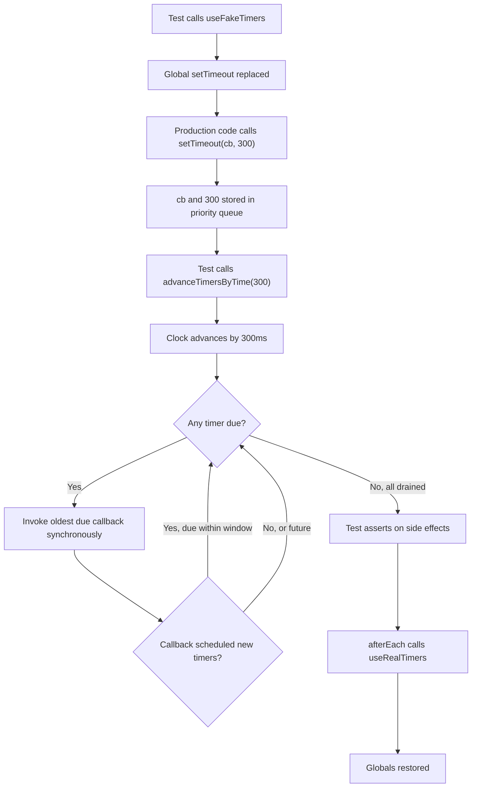
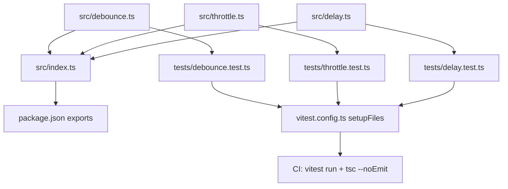

# 5.06 Testing Asynchronous Code

## 1. Purpose

Asynchronous code is the dominant form of real JavaScript. Every `fetch` call, every database query, every `setTimeout`, every WebSocket message, every animation frame, and every `await` keyword introduces a gap between the moment the operation is scheduled and the moment it completes. That gap is small in wall-clock terms (a few milliseconds for a timer, hundreds for a network call) but it is enormous in program-logic terms: by the time the continuation runs, the synchronous part of the test function has already returned, the local variables are no longer in scope of the test runner, and the assertion you wrote has either not yet executed or has executed against a `Promise` object instead of its eventual value.

The fundamental difficulty is that test runners are synchronous engines. A test function is called, runs to completion, and returns. If the test function returns before the asynchronous work finishes, the runner has no way to know that there is still outstanding work to wait for — unless the test function explicitly signals "I am not done yet" by returning a `Promise` (or by being declared `async`, which is the same thing). Forget to return the `Promise`, and the test passes instantly, regardless of what the assertion would have said when the `Promise` eventually settled. This is the **silent-pass bug**, and it is the single most common async-testing mistake in the JavaScript ecosystem. See [[1.20 Promises Specification]] for the formal settlement semantics that make this bug possible.

A second difficulty is time itself. A debounced search input waits 300ms before firing the query. A polling loop fires every 5 seconds. A token expires after 15 minutes. A retry schedule backs off for 1s, 2s, 4s, 8s. If the test waits in real time for these things to happen, the test suite takes minutes to run, becomes flaky on slow CI machines, and is at the mercy of the system clock. The solution is **fake timers**: replace the global `setTimeout`, `setInterval`, `Date.now`, and `performance.now` with deterministic stand-ins whose clock you control. Then you can fast-forward the clock by 300ms or 15 minutes in a single line of code, and the test still runs in milliseconds.

A third difficulty is rejection. A `Promise` that rejects after the test has returned produces an unhandled rejection, which Node prints as a warning and which Jest and Vitest may attribute to the wrong test (or to no test at all). Tests must explicitly assert rejection with `expect(promise).rejects.toThrow(...)` or wrap the call in `try / await / catch` so that the rejection is consumed inside the test's own execution frame.

This note covers the four async test patterns (return the `Promise`, `async / await`, `resolves`, `rejects`), the fake timer API in both Jest and Vitest (`useFakeTimers`, `advanceTimersByTime`, `runAllTimers`, `runOnlyPendingTimers`, `useRealTimers`), the testing of debounced and throttled functions, the testing of intervals and polling loops, the testing of time-based logic such as expiry and scheduling, and the diagnosis of the hanging async test. The goal throughout is the same: **deterministic async tests that complete in milliseconds, never wait on real time, and never silently pass when they should fail.** For the synchronous test model that this note extends, see [[5.04 Unit Testing Fundamentals]] and [[5.05 Testing Pure Functions]].

## 2. Theory and Deep Dive

### 2.1 Why async breaks the synchronous test model

A test runner such as Jest or Vitest invokes each test function as a synchronous callable. The runner pushes a test context onto an internal stack, calls the test function, waits for the function's return value, and then tears down the context. If the function returns `undefined` (which is what a non-async function returns), the runner considers the test done. If the function returns a `Promise`, the runner `await`s that `Promise` before considering the test done; if the `Promise` rejects, the test fails.

This means there are exactly two ways for an async test to signal incompleteness to the runner: return the `Promise`, or declare the function `async` (which causes `return undefined` to become `return Promise.resolve(undefined)`). Forgetting either leaves the runner with no `Promise` to await, and the test passes the instant the synchronous portion finishes — even if the assertion inside the `.then` callback has not yet run and would have failed.

The four canonical patterns are:

```javascript
// Pattern 1: return the promise
test('user is loaded', () => {
  return loadUser(1).then(user => {
    expect(user.name).toBe('Ada');
  });
});

// Pattern 2: async/await
test('user is loaded', async () => {
  const user = await loadUser(1);
  expect(user.name).toBe('Ada');
});

// Pattern 3: resolves matcher
test('user is loaded', () => {
  return expect(loadUser(1)).resolves.toMatchObject({ name: 'Ada' });
});

// Pattern 4: rejects matcher
test('missing user throws', () => {
  return expect(loadUser(999)).rejects.toThrow('not found');
});
```

Pattern 2 (`async / await`) is the most readable and the most common in modern codebases. Pattern 1 (return the promise) is the original form and still appears in older code. Patterns 3 and 4 are useful for one-off assertions where you want to assert the settled state of a `Promise` without writing a full `await` block; they return a `Promise` that the runner must `await`, hence the `return`.

### 2.2 The `resolves` and `rejects` matchers

`expect(promise).resolves` returns a new `expect`-like object that will assert against the fulfilled value of the `Promise`. If the `Promise` rejects, the assertion fails with a clear message indicating that the `Promise` rejected when it was expected to fulfill. `expect(promise).rejects` is the inverse: it asserts that the `Promise` rejects, and chains matchers against the rejection reason (which is typically an `Error`).

Both matchers return a `Promise`. You must either `return` that `Promise` from the test (so the runner awaits it) or `await` it. The most common mistake is to write `expect(promise).resolves.toBe(x)` without returning or awaiting — the matcher kicks off the assertion asynchronously, the test function returns synchronously, and the runner reports success before the assertion has run.

```javascript
// BROKEN: silent pass
test('resolves to 42', () => {
  expect(Promise.resolve(42)).resolves.toBe(42); // no return!
});

// CORRECT: return the matcher promise
test('resolves to 42', () => {
  return expect(Promise.resolve(42)).resolves.toBe(42);
});

// CORRECT: await the matcher promise
test('resolves to 42', async () => {
  await expect(Promise.resolve(42)).resolves.toBe(42);
});
```

The `rejects` matcher deserves special attention because it is the only built-in way to assert that a `Promise` rejects with a specific error. The alternative — `try { await p(); fail('should have thrown'); } catch (e) { expect(e.message).toBe('...'); }` — is verbose and easy to get wrong (forgetting the `fail()` call lets the test pass even if no error is thrown). `expect(p()).rejects.toThrow('...')` is shorter and clearer, and it surfaces the rejection inside the test's own execution frame so no unhandled rejection leaks out.

### 2.3 Fake timers: the API surface

Fake timers replace the host's time-related globals with deterministic implementations. The Jest and Vitest APIs are nearly identical, with Vitest being a superset that also supports `vi.useFakeTimers({ toFake: [...] })` for partial faking.

| Capability | Jest | Vitest | Effect |
| --- | --- | --- | --- |
| Enable fakes | `jest.useFakeTimers()` | `vi.useFakeTimers()` | Replaces setTimeout, setInterval, clearTimeout, clearInterval, Date, performance, requestAnimationFrame, queueMicrotask with fakes |
| Fast-forward | `jest.advanceTimersByTime(ms)` | `vi.advanceTimersByTime(ms)` | Advance the clock by `ms` and run any timers due in that window, in order |
| Run all | `jest.runAllTimers()` | `vi.runAllTimers()` | Runs every queued timer, including timers scheduled by other timers, until the queue is empty (will infinite-loop on a `setInterval` with no end) |
| Run pending only | `jest.runOnlyPendingTimers()` | `vi.runOnlyPendingTimers()` | Runs only the timers currently in the queue; timers scheduled by those timers are deferred to the next call |
| Run microtasks | `jest.runAllTicks()` | `vi.runAllTicks()` | Flushes the microtask queue |
| Set system time | `jest.setSystemTime(date)` | `vi.setSystemTime(date)` | Sets the `Date.now` return value to a specific instant |
| Async advance | `jest.advanceTimersByTime(ms)` then `await Promise.resolve()` | `vi.advanceTimersByTimeAsync(ms)` | Advances and flushes microtasks between timer ticks |
| Restore | `jest.useRealTimers()` | `vi.useRealTimers()` | Restores host timers and `Date` |
| Read real clock | `jest.getRealSystemTime()` | `vi.getRealSystemTime()` | Returns the real `Date.now` even when faked |

Jest 27+ defaults to "modern" fake timers (the `@sinonjs/fake-timers` package under the hood). Vitest uses the same library. The legacy "legacy" fake timers in Jest 26 and below are deprecated and behave slightly differently (they did not fake `Date`).

### 2.4 Fake timer control flow

When `useFakeTimers()` is called, the test runner replaces the global `setTimeout` (and friends) with a function that does not actually schedule anything on the host. Instead, it stores the callback and the delay in an internal priority queue keyed by the scheduled-fire time. The fake clock starts at whatever time it was when `useFakeTimers()` was called (or at the time set by `setSystemTime`).

When `advanceTimersByTime(ms)` is called, the fake clock advances its internal time forward by `ms`, and any callbacks whose scheduled-fire time is now in the past are invoked in order, oldest first. Each callback runs synchronously. If a callback calls `setTimeout` again, that new callback is inserted into the queue with a fire time relative to the (now-advanced) clock. The advance continues to drain newly-scheduled timers whose fire time is within the original `ms` window.

The Mermaid diagram below shows the control flow:



### 2.5 `runAllTimers` vs `runOnlyPendingTimers` vs `advanceTimersByTime`

These three methods are not interchangeable. The choice depends on what the production code does.

- **`runAllTimers()`** drains the queue exhaustively. If a timer's callback schedules another timer, that new timer is also drained, recursively. This is appropriate for one-shot chains: a retry schedule that runs 3 times then stops, a debounced function that fires once, an animation that schedules a final `requestAnimationFrame` to clean up. It is **dangerous** with `setInterval` because the interval reschedules itself forever — `runAllTimers` will hit Jest's recursion limit and throw `Ran 100000 timers, and now stuck!`.
- **`runOnlyPendingTimers()`** drains only the timers currently in the queue at the moment of the call. If a callback schedules another timer, that new timer is NOT run by this call; it remains in the queue for the next call. This is the correct primitive for stepping through an interval one tick at a time: call `runOnlyPendingTimers()` to fire the first interval callback, assert on the side effect, call again to fire the second, and so on.
- **`advanceTimersByTime(ms)`** is the most controlled of the three. It moves the clock forward by a precise amount and runs every timer that becomes due within that window, including timers scheduled by other timers, as long as their fire time falls within the window. This is the correct primitive for debounced functions (advance by the debounce delay, exactly one fire) and for "fast forward 5 minutes" scenarios where multiple timers may fire along the way.

### 2.6 Testing debounced and throttled functions

A debounce function delays the invocation of a callback until `N` ms have elapsed without further calls. The canonical implementation stores the latest arguments and resets the timer on each call. To test:

1. Enable fake timers.
2. Call the debounced function several times in rapid succession.
3. Assert that the callback has NOT been called yet (the timer is still pending).
4. `advanceTimersByTime(debounceMs - 1)`.
5. Assert the callback is still not called.
6. `advanceTimersByTime(1)`.
7. Assert the callback was called exactly once, with the latest arguments.

A throttle function invokes the callback immediately on the first call, then ignores subsequent calls for `N` ms. Testing is similar but the assertions differ: the callback should fire on the first call (no advance needed), and the next fire should happen only after the throttle window elapses and another call is made. See [[1.22 Async Await Runtime]] for the syntax sugar that makes the underlying `Promise`-returning variants of these utilities readable.

### 2.7 Testing intervals

`setInterval` schedules a repeating callback. With fake timers, the test pattern is:

1. Enable fake timers.
2. Start the interval.
3. Assert the callback has been called 0 times.
4. `advanceTimersByTime(intervalMs)` — first tick fires.
5. Assert called 1 time. Assert on the side effect of the first tick.
6. `advanceTimersByTime(intervalMs * 3)` — three more ticks fire.
7. Assert called 4 times.
8. Stop the interval with `clearInterval`.
9. `advanceTimersByTime(intervalMs)` — nothing should fire.
10. Assert called 4 times (no increase).
11. Restore real timers.

If the interval has a side effect that should change over time (for example, a polling loop that records the latest API response), you can assert on the recorded side effect after each advance. The full interaction between interval callbacks and `Promise` microtasks is covered in [[1.26 Event Loop Concurrency Model]] and is the cause of the most common hanging-test symptom in this domain.

### 2.8 Testing `Date.now()` and `performance.now()`

Fake timers also fake `Date` (and `performance` if configured). After `useFakeTimers()`, `Date.now()` returns the fake clock's value. After `advanceTimersByTime(1000)`, `Date.now()` returns the original value plus 1000. `vi.setSystemTime(new Date('2025-06-27T00:00:00Z'))` sets the clock to a specific date — useful for testing "did the token expire?" logic that compares `Date.now()` against a stored expiry.

```javascript
beforeEach(() => vi.useFakeTimers());
afterEach(() => vi.useRealTimers());

test('token is expired after 1 hour', () => {
  vi.setSystemTime(new Date('2025-06-27T12:00:00Z'));
  const token = createToken({ ttlMs: 60 * 60 * 1000 }); // expires at 13:00
  vi.setSystemTime(new Date('2025-06-27T12:59:59Z'));
  expect(isExpired(token)).toBe(false);
  vi.setSystemTime(new Date('2025-06-27T13:00:00Z'));
  expect(isExpired(token)).toBe(true);
});
```

### 2.9 Microtask interactions: why `advanceTimersByTime` is not enough

A timer callback that does `Promise.resolve().then(cb)` schedules a microtask. `advanceTimersByTime` runs the timer callback synchronously, but microtasks drain only when control returns to the event loop (see [[1.26 Event Loop Concurrency Model]] for the drain algorithm). This means a synchronous `advanceTimersByTime(100)` followed immediately by an assertion will see the timer's side effects but NOT the microtask's side effects — the microtask has not yet run.

The fix is to make the test `async` and `await` a microtask flush after the advance. In Vitest, `vi.advanceTimersByTimeAsync(ms)` does this for you. In Jest, you must do it manually: `jest.advanceTimersByTime(100); await Promise.resolve();`. If the production code chains multiple `Promise` continuations, you may need to `await Promise.resolve()` multiple times, once per chain link.

## 3. Mental Models

3.1 **"Return the promise, or the test lies."** The test runner is a synchronous engine with a single escape hatch: the return value. If the return value is a `Promise`, the runner waits. If it is not, the runner does not wait. Every async test is a negotiation: you must tell the runner "I have outstanding work" by returning a `Promise` or by declaring the function `async`.

3.2 **"`resolves` / `rejects` = assert the settled state."** Think of `expect(p).resolves.toBe(x)` as the assertion form of `await p; expect(value).toBe(x)`. It does not change what is being asserted; it changes the shape of the assertion so it can be expressed in one line. Use it when the assertion is simple; switch to `async / await` when the assertion is multi-step.

3.3 **"Fake timers = pause the universe, fast-forward when ready."** After `useFakeTimers()`, the universe of time is paused. `setTimeout` no longer means "in N real milliseconds"; it means "when you choose to advance the clock." The test becomes the director of time: it decides when each beat happens, in what order, with what spacing. This converts flaky real-time waits into deterministic single-line advances.

3.4 **"Advance = jump forward N ms, fire any due timers in order."** The advance operation is not "wait N ms." It is "set the clock forward by N ms, and execute every callback that should have fired in that window, in chronological order." If the window is empty, no callback fires. If ten timers are due at different points in the window, all ten fire, in order.

3.5 **"Where the models break down."** The "pause the universe" model breaks down when production code reaches outside the fake-timer boundary — for example, calling a real `fetch` (which returns a `Promise` that resolves only when the real network responds) or reading `process.uptime()` (which is not faked). The test must additionally mock those non-timer async sources; see [[5.10 Stubs Spies and Mocks]] for the double-test toolkit. The "advance" model breaks down when timers interact with Promises: a timer callback that does `Promise.resolve().then(...)` will not have its `.then` run during `advanceTimersByTime`, because the microtask queue drains only when control returns to the event loop. You must `await` a microtask flush (in Vitest, `await vi.advanceTimersByTimeAsync(ms)`) to drain Promises scheduled inside timers.

## 4. Real-World Use Cases

4.1 **Testing API calls with mocked fetch.** A service function calls `fetch` and returns the parsed JSON. The test mocks `global.fetch` to return a resolved `Promise`, calls the service, and awaits the result. The assertion checks the parsed shape. `resolves.toMatchObject` is concise for this case. This is the most common async test in any web application codebase.

4.2 **Testing debounced search inputs.** A React component debounces the search input by 250ms before calling the search API. The test renders the component, types into the input, advances fake timers by 249ms (asserts no API call), advances by 1ms (asserts one API call with the final query). This is the canonical use case for `advanceTimersByTime` and the one that converts a 250ms slow test into a sub-millisecond fast one.

4.3 **Testing polling intervals.** A status component polls an API every 5 seconds until the status becomes `done`. The test starts the poller, advances by 5s (asserts first API call, status still pending), advances by 5s (asserts second API call, status done, polling stopped). Subsequent advances should not trigger further calls. The combination of `setInterval` with `Promise`-returning fetch is exactly the scenario that requires `advanceTimersByTimeAsync` or a manual `await Promise.resolve()` after each advance.

4.4 **Testing timeouts.** A function returns a `Promise` that rejects with `TimeoutError` if the underlying operation takes longer than 5 seconds. The implementation uses `Promise.race` against a `setTimeout`. The test enables fake timers, kicks off the operation (mocked to never resolve), advances by 4999ms (asserts no rejection), advances by 1ms (asserts rejection with `TimeoutError`). Fake timers convert a 5-second test into a sub-millisecond test.

4.5 **Testing token expiry.** A JWT decoder checks `Date.now()` against the token's `exp` claim. The test sets the system time to before expiry, asserts the token is valid; sets the system time to after expiry, asserts invalid. This uses `vi.setSystemTime` (or `jest.setSystemTime`) rather than `advanceTimersByTime` because the test cares about absolute time, not relative advancement.

4.6 **Testing retry with exponential backoff.** A retry function calls an operation, on failure waits 100ms then retries, on second failure waits 200ms, then 400ms, then 800ms, then gives up. The test enables fake timers, calls the function with a mocked operation that always fails, advances by 100ms (asserts second attempt), advances by 200ms (asserts third attempt), and so on, finally asserting the function rejects with the last error after the total elapsed time.

4.7 **Testing `requestAnimationFrame` chains.** An animation uses `requestAnimationFrame` to step through 60 frames over 1 second. Modern fake timers (Jest 27+, Vitest) fake `requestAnimationFrame` too. The test advances by 16ms per frame (at 60fps) and asserts the animated value after each frame.

4.8 **Testing scheduled jobs.** A cron-like scheduler fires a job at a specific wall-clock time. The test sets the system time to 1 minute before the scheduled fire, advances to the fire time, and asserts the job ran. This combines `setSystemTime` with `advanceTimersByTime` and is the basis of any scheduled-task testing infrastructure.

## 5. Code Examples

### 5.1 Example A — Minimal and Conceptual

The four async patterns and the three fake-timer primitives, in side-by-side JS and TS.

**JavaScript: minimal async patterns**

```javascript
// Function under test
function loadUser(id) {
  return fetch(`/api/users/${id}`).then(r => {
    if (!r.ok) throw new Error(`status ${r.status}`);
    return r.json();
  });
}

// Pattern 1: return the promise
test('loadUser returns the user (return promise)', () => {
  global.fetch = jest.fn(() =>
    Promise.resolve({
      ok: true,
      json: () => Promise.resolve({ id: 1, name: 'Ada' }),
    })
  );
  return loadUser(1).then(user => {
    expect(user.id).toBe(1);
    expect(user.name).toBe('Ada');
  });
});

// Pattern 2: async/await
test('loadUser returns the user (async await)', async () => {
  global.fetch = jest.fn(() =>
    Promise.resolve({
      ok: true,
      json: () => Promise.resolve({ id: 1, name: 'Ada' }),
    })
  );
  const user = await loadUser(1);
  expect(user.id).toBe(1);
  expect(user.name).toBe('Ada');
});

// Pattern 3: resolves matcher
test('loadUser resolves to the user (resolves)', async () => {
  global.fetch = jest.fn(() =>
    Promise.resolve({
      ok: true,
      json: () => Promise.resolve({ id: 1, name: 'Ada' }),
    })
  );
  await expect(loadUser(1)).resolves.toMatchObject({ id: 1, name: 'Ada' });
});

// Pattern 4: rejects matcher
test('loadUser rejects on 404 (rejects)', async () => {
  global.fetch = jest.fn(() =>
    Promise.resolve({
      ok: false,
      status: 404,
      json: () => Promise.resolve({ message: 'not found' }),
    })
  );
  await expect(loadUser(999)).rejects.toThrow('status 404');
});
```

**TypeScript: minimal async patterns**

```typescript
interface User { id: number; name: string; }

async function loadUser(id: number): Promise<User> {
  const res = await fetch(`/api/users/${id}`);
  if (!res.ok) throw new Error(`status ${res.status}`);
  return res.json();
}

test('loadUser returns the user (return promise)', () => {
  (globalThis as any).fetch = jest.fn(() =>
    Promise.resolve({
      ok: true,
      json: () => Promise.resolve({ id: 1, name: 'Ada' }),
    })
  );
  return loadUser(1).then((user: User) => {
    expect(user.id).toBe(1);
    expect(user.name).toBe('Ada');
  });
});

test('loadUser returns the user (async await)', async () => {
  (globalThis as any).fetch = jest.fn(() =>
    Promise.resolve({
      ok: true,
      json: () => Promise.resolve({ id: 1, name: 'Ada' }),
    })
  );
  const user: User = await loadUser(1);
  expect(user.id).toBe(1);
  expect(user.name).toBe('Ada');
});

test('loadUser resolves to the user (resolves)', async () => {
  (globalThis as any).fetch = jest.fn(() =>
    Promise.resolve({
      ok: true,
      json: () => Promise.resolve({ id: 1, name: 'Ada' }),
    })
  );
  await expect(loadUser(1)).resolves.toMatchObject({ id: 1, name: 'Ada' });
});

test('loadUser rejects on 404 (rejects)', async () => {
  (globalThis as any).fetch = jest.fn(() =>
    Promise.resolve({
      ok: false,
      status: 404,
      json: () => Promise.resolve({ message: 'not found' }),
    })
  );
  await expect(loadUser(999)).rejects.toThrow('status 404');
});
```

**JavaScript: minimal fake timer patterns**

```javascript
beforeEach(() => jest.useFakeTimers());
afterEach(() => jest.useRealTimers());

test('advanceTimersByTime fires due timer', () => {
  const cb = jest.fn();
  setTimeout(cb, 100);
  jest.advanceTimersByTime(99);
  expect(cb).not.toHaveBeenCalled();
  jest.advanceTimersByTime(1);
  expect(cb).toHaveBeenCalledTimes(1);
});

test('runAllTimers drains the queue', () => {
  const order = [];
  setTimeout(() => {
    order.push('first');
    setTimeout(() => order.push('second'), 50);
  }, 100);
  jest.runAllTimers();
  expect(order).toEqual(['first', 'second']);
});

test('runOnlyPendingTimers does not recurse', () => {
  const order = [];
  setTimeout(() => {
    order.push('first');
    setTimeout(() => order.push('second'), 50);
  }, 100);
  jest.runOnlyPendingTimers();
  expect(order).toEqual(['first']);
  jest.runOnlyPendingTimers();
  expect(order).toEqual(['first', 'second']);
});

test('interval fires on each advance', () => {
  const cb = jest.fn();
  const handle = setInterval(cb, 1000);
  jest.advanceTimersByTime(1000);
  expect(cb).toHaveBeenCalledTimes(1);
  jest.advanceTimersByTime(3000);
  expect(cb).toHaveBeenCalledTimes(4);
  clearInterval(handle);
  jest.advanceTimersByTime(1000);
  expect(cb).toHaveBeenCalledTimes(4);
});
```

**TypeScript: minimal fake timer patterns**

```typescript
beforeEach(() => jest.useFakeTimers());
afterEach(() => jest.useRealTimers());

test('advanceTimersByTime fires due timer', () => {
  const cb = jest.fn();
  setTimeout(cb, 100);
  jest.advanceTimersByTime(99);
  expect(cb).not.toHaveBeenCalled();
  jest.advanceTimersByTime(1);
  expect(cb).toHaveBeenCalledTimes(1);
});

test('runAllTimers drains the queue', () => {
  const order: string[] = [];
  setTimeout(() => {
    order.push('first');
    setTimeout(() => order.push('second'), 50);
  }, 100);
  jest.runAllTimers();
  expect(order).toEqual(['first', 'second']);
});

test('runOnlyPendingTimers does not recurse', () => {
  const order: string[] = [];
  setTimeout(() => {
    order.push('first');
    setTimeout(() => order.push('second'), 50);
  }, 100);
  jest.runOnlyPendingTimers();
  expect(order).toEqual(['first']);
  jest.runOnlyPendingTimers();
  expect(order).toEqual(['first', 'second']);
});

test('interval fires on each advance', () => {
  const cb = jest.fn();
  const handle = setInterval(cb, 1000);
  jest.advanceTimersByTime(1000);
  expect(cb).toHaveBeenCalledTimes(1);
  jest.advanceTimersByTime(3000);
  expect(cb).toHaveBeenCalledTimes(4);
  clearInterval(handle);
  jest.advanceTimersByTime(1000);
  expect(cb).toHaveBeenCalledTimes(4);
});
```

### 5.2 Example B — Production-Grade

A typed debounce with `cancel` and `flush`, plus a polling utility, with comprehensive timer-based tests.

**JavaScript: production debounce**

```javascript
// debounce.js
function debounce(fn, delayMs, options = {}) {
  const leading = options.leading ?? false;
  const trailing = options.trailing ?? true;
  let timer = null;
  let lastArgs = null;
  let lastThis = null;

  function invoke() {
    if (lastArgs) {
      const args = lastArgs;
      const ctx = lastThis;
      lastArgs = null;
      fn.apply(ctx, args);
    }
  }

  const debounced = function (...args) {
    lastArgs = args;
    lastThis = this;
    if (timer === null && leading) {
      invoke();
    }
    if (timer !== null) clearTimeout(timer);
    if (trailing) {
      timer = setTimeout(() => {
        timer = null;
        if (lastArgs) invoke();
      }, delayMs);
    } else {
      timer = setTimeout(() => { timer = null; }, delayMs);
    }
  };

  debounced.cancel = function () {
    if (timer !== null) clearTimeout(timer);
    timer = null;
    lastArgs = null;
    lastThis = null;
  };

  debounced.flush = function () {
    if (timer !== null) clearTimeout(timer);
    timer = null;
    invoke();
  };

  return debounced;
}

module.exports = { debounce };
```

**TypeScript: production debounce**

```typescript
// debounce.ts
export interface DebounceOptions {
  leading?: boolean;
  trailing?: boolean;
}

export interface DebouncedFunction<A extends unknown[]> {
  (...args: A): void;
  cancel(): void;
  flush(): void;
}

export function debounce<A extends unknown[]>(
  fn: (...args: A) => void,
  delayMs: number,
  options: DebounceOptions = {}
): DebouncedFunction<A> {
  const leading = options.leading ?? false;
  const trailing = options.trailing ?? true;
  let timer: ReturnType<typeof setTimeout> | null = null;
  let lastArgs: A | null = null;
  let lastThis: unknown = null;

  function invoke(): void {
    if (lastArgs) {
      const args = lastArgs;
      const ctx = lastThis;
      lastArgs = null;
      fn.apply(ctx, args);
    }
  }

  const debounced = function (this: unknown, ...args: A): void {
    lastArgs = args;
    lastThis = this;
    if (timer === null && leading) {
      invoke();
    }
    if (timer !== null) clearTimeout(timer);
    if (trailing) {
      timer = setTimeout(() => {
        timer = null;
        if (lastArgs) invoke();
      }, delayMs);
    } else {
      timer = setTimeout(() => { timer = null; }, delayMs);
    }
  } as DebouncedFunction<A>;

  debounced.cancel = function (): void {
    if (timer !== null) clearTimeout(timer);
    timer = null;
    lastArgs = null;
    lastThis = null;
  };

  debounced.flush = function (): void {
    if (timer !== null) clearTimeout(timer);
    timer = null;
    invoke();
  };

  return debounced;
}
```

**JavaScript: comprehensive debounce tests**

```javascript
const { debounce } = require('./debounce');

beforeEach(() => jest.useFakeTimers());
afterEach(() => jest.useRealTimers());

test('trailing debounce fires once after the delay', () => {
  const fn = jest.fn();
  const d = debounce(fn, 250);
  d('a'); d('b'); d('c');
  expect(fn).not.toHaveBeenCalled();
  jest.advanceTimersByTime(249);
  expect(fn).not.toHaveBeenCalled();
  jest.advanceTimersByTime(1);
  expect(fn).toHaveBeenCalledTimes(1);
  expect(fn).toHaveBeenCalledWith('c');
});

test('leading debounce fires immediately then is silent', () => {
  const fn = jest.fn();
  const d = debounce(fn, 250, { leading: true, trailing: false });
  d('a');
  expect(fn).toHaveBeenCalledTimes(1);
  d('b'); d('c');
  expect(fn).toHaveBeenCalledTimes(1);
  jest.advanceTimersByTime(250);
  expect(fn).toHaveBeenCalledTimes(1);
});

test('cancel prevents the trailing fire', () => {
  const fn = jest.fn();
  const d = debounce(fn, 250);
  d('a');
  d.cancel();
  jest.advanceTimersByTime(1000);
  expect(fn).not.toHaveBeenCalled();
});

test('flush invokes immediately with the latest args', () => {
  const fn = jest.fn();
  const d = debounce(fn, 250);
  d('a'); d('b'); d('c');
  d.flush();
  expect(fn).toHaveBeenCalledTimes(1);
  expect(fn).toHaveBeenCalledWith('c');
  jest.advanceTimersByTime(1000);
  expect(fn).toHaveBeenCalledTimes(1);
});

test('polling stops when status becomes done', async () => {
  const responses = ['pending', 'pending', 'done'];
  let i = 0;
  const fetchStatus = jest.fn(() => Promise.resolve(responses[i++]));
  const seen = [];
  function startPolling() {
    return new Promise((resolve) => {
      async function tick() {
        const status = await fetchStatus();
        seen.push(status);
        if (status === 'done') resolve();
        else setTimeout(tick, 5000);
      }
      setTimeout(tick, 5000);
    });
  }
  const done = startPolling();
  jest.advanceTimersByTime(5000);
  await Promise.resolve();
  jest.advanceTimersByTime(5000);
  await Promise.resolve();
  jest.advanceTimersByTime(5000);
  await Promise.resolve();
  await done;
  expect(seen).toEqual(['pending', 'pending', 'done']);
  expect(fetchStatus).toHaveBeenCalledTimes(3);
});
```

**TypeScript: comprehensive debounce tests**

```typescript
import { debounce } from './debounce';

beforeEach(() => jest.useFakeTimers());
afterEach(() => jest.useRealTimers());

test('trailing debounce fires once after the delay', () => {
  const fn = jest.fn<(s: string) => void>();
  const d = debounce(fn, 250);
  d('a'); d('b'); d('c');
  expect(fn).not.toHaveBeenCalled();
  jest.advanceTimersByTime(249);
  expect(fn).not.toHaveBeenCalled();
  jest.advanceTimersByTime(1);
  expect(fn).toHaveBeenCalledTimes(1);
  expect(fn).toHaveBeenCalledWith('c');
});

test('leading debounce fires immediately then is silent', () => {
  const fn = jest.fn<(s: string) => void>();
  const d = debounce(fn, 250, { leading: true, trailing: false });
  d('a');
  expect(fn).toHaveBeenCalledTimes(1);
  d('b'); d('c');
  expect(fn).toHaveBeenCalledTimes(1);
  jest.advanceTimersByTime(250);
  expect(fn).toHaveBeenCalledTimes(1);
});

test('cancel prevents the trailing fire', () => {
  const fn = jest.fn<(s: string) => void>();
  const d = debounce(fn, 250);
  d('a');
  d.cancel();
  jest.advanceTimersByTime(1000);
  expect(fn).not.toHaveBeenCalled();
});

test('flush invokes immediately with the latest args', () => {
  const fn = jest.fn<(s: string) => void>();
  const d = debounce(fn, 250);
  d('a'); d('b'); d('c');
  d.flush();
  expect(fn).toHaveBeenCalledTimes(1);
  expect(fn).toHaveBeenCalledWith('c');
  jest.advanceTimersByTime(1000);
  expect(fn).toHaveBeenCalledTimes(1);
});

test('polling stops when status becomes done', async () => {
  const responses: string[] = ['pending', 'pending', 'done'];
  let i = 0;
  const fetchStatus = jest.fn<() => Promise<string>>(
    () => Promise.resolve(responses[i++])
  );
  const seen: string[] = [];
  function startPolling(): Promise<void> {
    return new Promise((resolve) => {
      async function tick(): Promise<void> {
        const status = await fetchStatus();
        seen.push(status);
        if (status === 'done') resolve();
        else setTimeout(tick, 5000);
      }
      setTimeout(tick, 5000);
    });
  }
  const done = startPolling();
  jest.advanceTimersByTime(5000);
  await Promise.resolve();
  jest.advanceTimersByTime(5000);
  await Promise.resolve();
  jest.advanceTimersByTime(5000);
  await Promise.resolve();
  await done;
  expect(seen).toEqual(['pending', 'pending', 'done']);
  expect(fetchStatus).toHaveBeenCalledTimes(3);
});
```

## 6. Common Mistakes and Anti-Patterns

### 6.1 Forgetting to `await` or `return` — the silent pass

```javascript
// BROKEN: test passes even if the assertion would fail
test('user is loaded', () => {
  loadUser(1).then(user => {
    expect(user.name).toBe('Ada');
  });
});
```

**Why it fails:** the test function returns `undefined` synchronously. The runner sees no `Promise` to await, marks the test as passed, and moves on. The `.then` callback runs later (after the test has already been reported as passing); if it throws, the rejection becomes an unhandled rejection attributed to no test.

**Fix:**

```javascript
test('user is loaded', () => {
  return loadUser(1).then(user => {
    expect(user.name).toBe('Ada');
  });
});
// or
test('user is loaded', async () => {
  const user = await loadUser(1);
  expect(user.name).toBe('Ada');
});
```

### 6.2 Not restoring real timers — leaky tests

```javascript
// BROKEN: fakes leak into the next test
test('uses fake timers', () => {
  jest.useFakeTimers();
  // ... assertions ...
  // missing jest.useRealTimers()
});

test('next test expects real timer', (done) => {
  setTimeout(done, 10); // never fires; fake timer is still active
});
```

**Why it fails:** `useFakeTimers` mutates globals. Without restoration, the next test inherits the fakes. A test that calls `setTimeout(done, 10)` and expects the real timer to fire will hang forever, because the fake timer is paused and nothing ever advances it.

**Fix:** always restore in `afterEach` (or `afterAll`). Even better, scope `useFakeTimers` to `beforeEach` and restore in `afterEach` so the pair cannot be separated.

```javascript
beforeEach(() => jest.useFakeTimers());
afterEach(() => jest.useRealTimers());
```

### 6.3 `useFakeTimers` without advancing — hanging test

```javascript
// BROKEN: test hangs forever
test('debounce fires', () => {
  jest.useFakeTimers();
  const fn = jest.fn();
  const d = debounce(fn, 250);
  d('a');
  // missing jest.advanceTimersByTime(250)
  expect(fn).toHaveBeenCalled(); // never fires; fn was never called
});
```

**Why it fails:** fake timers pause the universe. The callback is queued but never invoked because nothing advances the clock. The assertion fails immediately (the mock was not called), but if the test were waiting on a `Promise` that the timer's callback would have resolved, the test would hang until the test-runner timeout.

**Fix:** advance the clock by at least the delay before asserting.

```javascript
test('debounce fires', () => {
  jest.useFakeTimers();
  const fn = jest.fn();
  const d = debounce(fn, 250);
  d('a');
  jest.advanceTimersByTime(250);
  expect(fn).toHaveBeenCalled();
});
```

### 6.4 Mixing real and fake timers

```javascript
// BROKEN: one timer is faked, the other is real
test('race between timers', () => {
  jest.useFakeTimers();
  const real = jest.fn();
  setTimeout(() => {
    // production code uses Date.now() to schedule a follow-up
    setTimeout(real, Date.now() % 2 === 0 ? 100 : 200);
  }, 50);
  jest.advanceTimersByTime(50);
  jest.advanceTimersByTime(200);
  expect(real).toHaveBeenCalled(); // depends on whether Date was faked
});
```

**Why it fails:** if `Date` is also faked (modern fake timers fake it by default), `Date.now()` returns the fake clock, not the real one. If the test was written assuming `Date.now()` returns the real wall-clock time, the conditional delay computes differently than expected. Mixing `jest.useFakeTimers` with code that calls `process.uptime()` (not faked) or reads the real OS clock via a native addon will also produce inconsistent results.

**Fix:** keep all time-based logic inside the fake-timer world. If you need real wall-clock time, capture it before enabling fakes:

```javascript
const realNow = Date.now();
jest.useFakeTimers({ now: realNow });
```

Or use `jest.getRealSystemTime()` to read the real clock inside a faked context. If you must partially fake (timers but not `Date`), use `vi.useFakeTimers({ toFake: ['setTimeout', 'setInterval'] })` (Vitest) or `jest.useFakeTimers({ doNotFake: ['Date'] })` (Jest 27+).

### 6.5 Not handling promise rejections — unhandled rejection

```javascript
// BROKEN: rejection is unhandled, attributed to wrong test
test('successful path', () => {
  loadUser(1).then(user => {
    expect(user.name).toBe('Ada');
  });
  // if loadUser rejects, no .catch handles it
});
```

**Why it fails:** a `Promise` that rejects without a `.catch` produces an unhandled rejection. Node prints a warning; Jest may attribute the rejection to whatever test happens to be running when the rejection is detected, which is often the WRONG test. This produces confusing failures in unrelated tests.

**Fix:** always consume the `Promise`. Either `await` it (which propagates the rejection to the test), use `.catch`, or use the `rejects` matcher.

```javascript
test('successful path', async () => {
  const user = await loadUser(1);
  expect(user.name).toBe('Ada');
});

test('failure path', async () => {
  await expect(loadUser(999)).rejects.toThrow('not found');
});
```

### 6.6 Testing the implementation (call counts) instead of behavior

```javascript
// QUESTIONABLE: asserts on call count of an internal helper
test('debounce works', () => {
  const fn = jest.fn();
  const d = debounce(fn, 250);
  d('a'); d('b'); d('c');
  jest.advanceTimersByTime(250);
  expect(fn).toHaveBeenCalledTimes(1);
  expect(setTimeout).toHaveBeenCalledTimes(3); // implementation detail!
});
```

**Why it fails:** the test asserts on the internal scheduling strategy (how many times `setTimeout` was called). If a future refactor batches the three calls into a single `setTimeout`, the behavior is unchanged but the test breaks. This is testing the implementation, not the contract.

**Fix:** assert on observable behavior — what the function eventually does, not how it does it.

```javascript
test('debounce works', () => {
  const fn = jest.fn();
  const d = debounce(fn, 250);
  d('a'); d('b'); d('c');
  jest.advanceTimersByTime(250);
  expect(fn).toHaveBeenCalledTimes(1);
  expect(fn).toHaveBeenCalledWith('c'); // behavior, not implementation
});
```

### 6.7 Calling `runAllTimers` on an interval — infinite loop

```javascript
// BROKEN: throws Aborted after 100k iterations
test('interval runs forever', () => {
  jest.useFakeTimers();
  setInterval(() => {}, 1000);
  jest.runAllTimers(); // throws "Ran 100000 timers"
});
```

**Why it fails:** `runAllTimers` drains the queue exhaustively, including timers scheduled by other timers. An interval reschedules itself on every fire, so the queue never empties. Jest aborts after a safety limit.

**Fix:** use `advanceTimersByTime(ms)` to advance by a bounded number of ticks, or `runOnlyPendingTimers` to step one tick at a time.

### 6.8 Forgetting that `advanceTimersByTime` does not flush microtasks

```javascript
// BROKEN: assertion runs before the Promise resolves
test('timer callback that resolves a Promise', () => {
  jest.useFakeTimers();
  let resolved = false;
  setTimeout(() => {
    Promise.resolve().then(() => { resolved = true; });
  }, 100);
  jest.advanceTimersByTime(100);
  expect(resolved).toBe(true); // FAILS: microtask not yet drained
});
```

**Why it fails:** `advanceTimersByTime` runs the timer callback synchronously. The `Promise.resolve().then(...)` schedules a microtask, but microtasks drain only when control returns to the event loop. The synchronous advance returns before the microtask runs.

**Fix:** make the test `async` and `await` a microtask flush (in Vitest, `await vi.advanceTimersByTimeAsync(100)`; in Jest, `jest.advanceTimersByTime(100)` followed by `await Promise.resolve()`).

```javascript
test('timer callback that resolves a Promise', async () => {
  jest.useFakeTimers();
  let resolved = false;
  setTimeout(() => {
    Promise.resolve().then(() => { resolved = true; });
  }, 100);
  jest.advanceTimersByTime(100);
  await Promise.resolve();
  expect(resolved).toBe(true);
});
```

## 7. Best Practices and Design Patterns

7.1 **Use `async / await` for readability.** An `async` test reads top-to-bottom like synchronous code. It is the easiest pattern to reason about, supports multi-step assertions naturally, and propagates rejections automatically. Make it the default in your codebase; reach for the other patterns only when they read better for a specific case.

7.2 **Use `resolves` / `rejects` for one-off assertions.** When you only need to assert the settled state of a single `Promise`, `await expect(p).resolves.toBe(x)` is shorter than a full `async / await` block. Reserve it for the single-assertion case; switch to `async / await` when the test has multiple steps or shared setup across assertions.

7.3 **Use fake timers for all time-based logic.** Anywhere production code uses `setTimeout`, `setInterval`, `Date.now`, or `requestAnimationFrame`, the test should use fake timers. Real-time waits make tests slow (a 250ms debounce becomes a 250ms test) and flaky (CI machines may be slow enough that the wait is too short, or fast enough that a `setTimeout(fn, 0)` race changes order).

7.4 **Always restore real timers in `afterEach`.** Pair `useFakeTimers` with `useRealTimers` so the pair is atomic. Even better, put the pair in `beforeEach / afterEach` at the describe level so every test in the scope inherits fakes cleanly and restores them on completion. Never call `useFakeTimers` inside an individual test without restoring — the next test inherits the fakes and may hang or behave unpredictably.

7.5 **Handle promise rejections explicitly.** Never let a `Promise` reject without a consumer. Use `await` (which propagates the rejection to the test), `.catch`, or the `rejects` matcher. A test that lets a `Promise` reject unhandled produces flaky failures attributed to the wrong test, and on Node 15+ the process may even exit with a non-zero code due to `--unhandled-rejections=throw`.

7.6 **Test behavior, not call counts.** Prefer asserting on observable outcomes (the value returned, the side effect produced, the state change observed) over implementation details (how many times `setTimeout` was called, what arguments were passed to an internal helper). Behavior assertions survive refactors; implementation assertions break under every refactor.

7.7 **Scope fake timers narrowly.** Use `vi.useFakeTimers({ toFake: ['setTimeout', 'setInterval'] })` (Vitest) or `jest.useFakeTimers({ doNotFake: ['Date'] })` (Jest) when you want to fake only the timers you touch. Faking `Date` when production code reads the real wall clock for logging will produce misleading log lines in test output. Faking `performance` when production code uses `performance.mark` for profiling will break the profiling output.

7.8 **Use the async timer API in Vitest.** Vitest provides `vi.advanceTimersByTimeAsync(ms)`, `vi.runAllTimersAsync()`, and `vi.runOnlyPendingTimersAsync()`. These flush microtasks between timer ticks, which is exactly what you want when production code mixes `setTimeout` with Promises. Prefer them over the sync versions in any test that touches both.

7.9 **Prefer `setSystemTime` for absolute-time logic.** When production code compares `Date.now()` against a stored timestamp (expiry, scheduling, deadline), use `setSystemTime` to set the clock to a known absolute date. This makes the test self-documenting (`setSystemTime(new Date('2025-06-27T13:00:00Z'))` reads as "the test runs at 13:00 on June 27") and avoids off-by-one errors from arithmetic on `advanceTimersByTime`.

7.10 **Provide a custom error class for timeouts.** When testing timeout-based rejection, throw a custom `TimeoutError` class rather than a generic `Error`. The test can then assert `instanceof TimeoutError`, which is more robust than matching on a string message that may change.

7.11 **Use lint rules to catch the silent-pass bug.** Enable `no-floating-promises` (TypeScript ESLint) and `jest/valid-expect` (eslint-plugin-jest). These rules catch the most common async-testing mistake — forgetting to `await` or `return` a `Promise` or a matcher — at compile time, before the test ever runs.

7.12 **Use `jest.retryTimes` or Vitest's `retry` option sparingly for async flakiness.** Retry-on-failure is a smell, not a fix. If an async test is flaky, the cause is almost always a missing `await`, a real-time wait, or an unhandled rejection. Find and fix the root cause; do not paper over it with retries.

7.13 **Snapshot test the order of timer callbacks, not the timing.** When testing that a complex sequence of timer-driven operations runs in the correct order, push labels into an array as each callback fires and snapshot or deep-equal the array. This is robust to refactorings that change the exact millisecond scheduling but preserve the order.

## 8. Technical Interview Knowledge

### 8.1 How do you test an async function?

**A:** Three ways. (1) Return the `Promise` from the test function so the runner awaits it. (2) Declare the test function `async` and `await` the call inside it — this is the most readable and the most common. (3) Use the `resolves` / `rejects` matchers to assert the settled state. The key invariant: the test function must signal incompleteness to the runner by returning a `Promise`; otherwise the runner reports success the moment the synchronous portion returns.

**Trap to avoid:** the interviewer wants to hear the silent-pass failure mode — the test that passes because the assertion never ran. Mention it explicitly. The fix is "always return or await."

### 8.2 What are `resolves` and `rejects`?

**A:** They are modifiers on `expect` that assert against the eventual settled state of a `Promise`. `expect(p).resolves.toBe(x)` asserts the `Promise` fulfills with a value equal to `x`. `expect(p).rejects.toThrow('msg')` asserts the `Promise` rejects with an `Error` whose message matches `'msg'`. Both return a `Promise` that must itself be `await`ed or `return`ed; otherwise the assertion kicks off asynchronously and the test passes before it runs.

**Trap to avoid:** the interviewer wants to hear the "you must return/await the matcher" rule. Many candidates forget this. The lint rule `jest/valid-expect` catches it automatically.

### 8.3 How do fake timers work?

**A:** `useFakeTimers()` replaces the global `setTimeout`, `setInterval`, `clearTimeout`, `clearInterval`, `Date` (and optionally `requestAnimationFrame`, `performance`, `queueMicrotask`) with deterministic stand-ins. The fakes store callbacks in a priority queue keyed by scheduled-fire time, but do not actually schedule anything on the host. The test then controls the clock via `advanceTimersByTime(ms)`, `runAllTimers()`, or `runOnlyPendingTimers()`. Restoration via `useRealTimers()` puts the real globals back.

**Trap to avoid:** mention that modern fake timers (Jest 27+, Vitest) fake `Date` by default; older Jest 26 legacy timers did not. Mixing faked and unfaked time sources is a common bug. Mention `setSystemTime` for absolute-time logic.

### 8.4 How do you test a debounced function?

**A:** Enable fake timers. Call the debounced function several times in rapid succession. Assert the callback has not been called yet. `advanceTimersByTime(debounceMs - 1)` and assert still not called. `advanceTimersByTime(1)` and assert called exactly once, with the latest arguments. Restore real timers in `afterEach`. If the debounce mixes with Promises (the callback is async), use `vi.advanceTimersByTimeAsync` or `await Promise.resolve()` after the sync advance to flush microtasks.

**Trap to avoid:** the interviewer wants to hear the "advance to one millisecond before, assert not called; advance one more, assert called" dance. It demonstrates you understand that the assertion depends on the boundary, not the bulk.

### 8.5 How do you test an interval?

**A:** Enable fake timers. Start the interval. `advanceTimersByTime(intervalMs)` to fire the first tick; assert the side effect. `advanceTimersByTime(intervalMs * N)` to fire N more ticks; assert called N+1 times. `clearInterval` and advance again; assert no further calls. Do NOT use `runAllTimers` on an interval — it will infinite-loop because the interval reschedules itself forever.

**Trap to avoid:** mention `runOnlyPendingTimers` as the alternative for stepping one tick at a time when the assertions need to inspect state between ticks. Mention the microtask-flush gotcha if the interval callback does `Promise` work.

### 8.6 How do you test a timeout?

**A:** The typical timeout implementation uses `Promise.race` between the operation and a `setTimeout` that rejects with a `TimeoutError`. In the test, enable fake timers, kick off the operation (mocked to never resolve), `advanceTimersByTime(timeoutMs - 1)` and assert no rejection, `advanceTimersByTime(1)` and assert the `Promise` rejects with `TimeoutError`. Use `expect(p).rejects.toBeInstanceOf(TimeoutError)` for a robust assertion.

**Trap to avoid:** the interviewer wants to hear that the test does NOT actually wait `timeoutMs` in real time. Fake timers convert a 5-second timeout into a sub-millisecond test.

### 8.7 What happens if you do not await an async assertion?

**A:** The test function returns synchronously with `undefined`. The runner sees no `Promise` to await and marks the test as passed. The assertion runs later, after the test has been reported as passing; if it throws, the rejection becomes an unhandled rejection that may be attributed to the wrong test or to no test at all. The test silently passes when it should fail. This is the most common async-testing bug.

**Trap to avoid:** mention ESLint rules `no-floating-promises` (TypeScript) and `jest/valid-expect` (eslint-plugin-jest) as automated defenses. Mention that `async` test functions auto-return a `Promise`, so declaring the function `async` is the easiest defense.

### 8.8 How do you handle promise rejections in tests?

**A:** Three options. (1) `await` the call inside an `async` test — the rejection propagates to the runner and fails the test. (2) `await expect(p).rejects.toThrow('msg')` to assert the rejection matches an expected shape. (3) Wrap in `try { await p(); fail('should have thrown'); } catch (e) { expect(e).toBeInstanceOf(MyError); }` when you need fine-grained control. Never let a `Promise` reject without a consumer — unhandled rejections produce flaky failures attributed to the wrong test.

**Trap to avoid:** the interviewer wants to hear that `rejects.toThrow` is preferred over `try / catch / fail` for its readability, but that `try / catch` is sometimes necessary when the assertion needs to inspect multiple properties of the error.

## 9. Practical Exercises

### 9.1 Exercise One — Test a function returning a Promise

**Goal:** Write four tests for `loadUser(id)` using each of the four async patterns.

**Setup:**

```javascript
async function loadUser(id) {
  const res = await fetch(`/api/users/${id}`);
  if (!res.ok) throw new Error(`status ${res.status}`);
  return res.json();
}
```

**Steps:**

1. Mock `global.fetch` to return a resolved response for `id=1`.
2. Test the success path using each of: return-the-promise, `async / await`, `resolves`.
3. Mock `fetch` to return a 404 for `id=999`.
4. Test the failure path using `rejects`.

**Full worked solution (JavaScript):**

```javascript
describe('loadUser', () => {
  function mockFetch(payload, ok = true, status = 200) {
    global.fetch = jest.fn(() =>
      Promise.resolve({
        ok,
        status,
        json: () => Promise.resolve(payload),
      })
    );
  }

  test('pattern 1: return the promise', () => {
    mockFetch({ id: 1, name: 'Ada' });
    return loadUser(1).then(user => {
      expect(user).toEqual({ id: 1, name: 'Ada' });
    });
  });

  test('pattern 2: async await', async () => {
    mockFetch({ id: 1, name: 'Ada' });
    const user = await loadUser(1);
    expect(user).toEqual({ id: 1, name: 'Ada' });
  });

  test('pattern 3: resolves matcher', async () => {
    mockFetch({ id: 1, name: 'Ada' });
    await expect(loadUser(1)).resolves.toEqual({ id: 1, name: 'Ada' });
  });

  test('pattern 4: rejects matcher', async () => {
    mockFetch({ message: 'not found' }, false, 404);
    await expect(loadUser(999)).rejects.toThrow('status 404');
  });
});
```

**Full worked solution (TypeScript):**

```typescript
interface User { id: number; name: string; }
async function loadUser(id: number): Promise<User> {
  const res = await fetch(`/api/users/${id}`);
  if (!res.ok) throw new Error(`status ${res.status}`);
  return res.json();
}

describe('loadUser', () => {
  function mockFetch(payload: unknown, ok = true, status = 200): void {
    (globalThis as any).fetch = jest.fn(() =>
      Promise.resolve({
        ok,
        status,
        json: () => Promise.resolve(payload),
      })
    );
  }

  test('pattern 1: return the promise', () => {
    mockFetch({ id: 1, name: 'Ada' });
    return loadUser(1).then((user: User) => {
      expect(user).toEqual({ id: 1, name: 'Ada' });
    });
  });

  test('pattern 2: async await', async () => {
    mockFetch({ id: 1, name: 'Ada' });
    const user: User = await loadUser(1);
    expect(user).toEqual({ id: 1, name: 'Ada' });
  });

  test('pattern 3: resolves matcher', async () => {
    mockFetch({ id: 1, name: 'Ada' });
    await expect(loadUser(1)).resolves.toEqual({ id: 1, name: 'Ada' });
  });

  test('pattern 4: rejects matcher', async () => {
    mockFetch({ message: 'not found' }, false, 404);
    await expect(loadUser(999)).rejects.toThrow('status 404');
  });
});
```

**Reasoning:** each pattern exercises the same production code; the differences are purely in test ergonomics. The success-path tests use whichever pattern reads most naturally for the team; the failure-path test almost always uses `rejects` because `try / catch / fail` is verbose.

### 9.2 Exercise Two — Test a debounced function with fake timers

**Goal:** Test a `debounce(fn, 250)` that fires the trailing call after 250ms of silence.

**Setup:** use the `debounce` implementation from Section 5.2.

**Steps:**

1. Enable fake timers in `beforeEach`; restore in `afterEach`.
2. Create a `jest.fn` as the inner callback.
3. Call the debounced function with `'a'`, `'b'`, `'c'` in rapid succession.
4. Advance by 249ms; assert not called.
5. Advance by 1ms; assert called once with `'c'`.
6. Test `cancel()` and `flush()`.

**Full worked solution (JavaScript):**

```javascript
const { debounce } = require('./debounce');

beforeEach(() => jest.useFakeTimers());
afterEach(() => jest.useRealTimers());

describe('debounce trailing', () => {
  test('fires once with the latest args after the delay', () => {
    const fn = jest.fn();
    const d = debounce(fn, 250);
    d('a'); d('b'); d('c');
    jest.advanceTimersByTime(249);
    expect(fn).not.toHaveBeenCalled();
    jest.advanceTimersByTime(1);
    expect(fn).toHaveBeenCalledTimes(1);
    expect(fn).toHaveBeenCalledWith('c');
  });

  test('cancel prevents the trailing fire', () => {
    const fn = jest.fn();
    const d = debounce(fn, 250);
    d('a');
    d.cancel();
    jest.advanceTimersByTime(1000);
    expect(fn).not.toHaveBeenCalled();
  });

  test('flush fires immediately with the latest args', () => {
    const fn = jest.fn();
    const d = debounce(fn, 250);
    d('a'); d('b'); d('c');
    d.flush();
    expect(fn).toHaveBeenCalledTimes(1);
    expect(fn).toHaveBeenCalledWith('c');
    jest.advanceTimersByTime(1000);
    expect(fn).toHaveBeenCalledTimes(1);
  });
});
```

**Full worked solution (TypeScript):**

```typescript
import { debounce } from './debounce';

beforeEach(() => jest.useFakeTimers());
afterEach(() => jest.useRealTimers());

describe('debounce trailing', () => {
  test('fires once with the latest args after the delay', () => {
    const fn = jest.fn<(s: string) => void>();
    const d = debounce(fn, 250);
    d('a'); d('b'); d('c');
    jest.advanceTimersByTime(249);
    expect(fn).not.toHaveBeenCalled();
    jest.advanceTimersByTime(1);
    expect(fn).toHaveBeenCalledTimes(1);
    expect(fn).toHaveBeenCalledWith('c');
  });

  test('cancel prevents the trailing fire', () => {
    const fn = jest.fn<(s: string) => void>();
    const d = debounce(fn, 250);
    d('a');
    d.cancel();
    jest.advanceTimersByTime(1000);
    expect(fn).not.toHaveBeenCalled();
  });

  test('flush fires immediately with the latest args', () => {
    const fn = jest.fn<(s: string) => void>();
    const d = debounce(fn, 250);
    d('a'); d('b'); d('c');
    d.flush();
    expect(fn).toHaveBeenCalledTimes(1);
    expect(fn).toHaveBeenCalledWith('c');
    jest.advanceTimersByTime(1000);
    expect(fn).toHaveBeenCalledTimes(1);
  });
});
```

**Reasoning:** the 249-then-1 dance verifies that the assertion depends on the boundary, not the bulk — it would catch a bug where the debounce fired at 200ms instead of 250ms. The `cancel` and `flush` tests cover the public API surface that callers depend on for cleanup and immediate invocation.

### 9.3 Exercise Three — Test an interval

**Goal:** Test a `pollEvery(fn, intervalMs)` that calls `fn` on each tick and returns a `stop` function.

**Setup:**

```javascript
function pollEvery(fn, intervalMs) {
  let stopped = false;
  const handle = setInterval(() => {
    if (stopped) return;
    fn();
  }, intervalMs);
  return function stop() {
    stopped = true;
    clearInterval(handle);
  };
}
```

**Steps:**

1. Enable fake timers in `beforeEach`; restore in `afterEach`.
2. Create a `jest.fn` as the polling callback.
3. Start the poller with `intervalMs = 1000`.
4. Advance by 1000ms; assert called once.
5. Advance by 3000ms; assert called four times total.
6. Call `stop()`; advance by 1000ms; assert still called four times.

**Full worked solution (JavaScript):**

```javascript
function pollEvery(fn, intervalMs) {
  let stopped = false;
  const handle = setInterval(() => {
    if (stopped) return;
    fn();
  }, intervalMs);
  return function stop() {
    stopped = true;
    clearInterval(handle);
  };
}

beforeEach(() => jest.useFakeTimers());
afterEach(() => jest.useRealTimers());

test('pollEvery fires on each tick and stops on stop()', () => {
  const fn = jest.fn();
  const stop = pollEvery(fn, 1000);
  expect(fn).not.toHaveBeenCalled();

  jest.advanceTimersByTime(1000);
  expect(fn).toHaveBeenCalledTimes(1);

  jest.advanceTimersByTime(3000);
  expect(fn).toHaveBeenCalledTimes(4);

  stop();
  jest.advanceTimersByTime(1000);
  expect(fn).toHaveBeenCalledTimes(4);
});
```

**Full worked solution (TypeScript):**

```typescript
function pollEvery(fn: () => void, intervalMs: number): () => void {
  let stopped = false;
  const handle = setInterval(() => {
    if (stopped) return;
    fn();
  }, intervalMs);
  return function stop(): void {
    stopped = true;
    clearInterval(handle);
  };
}

beforeEach(() => jest.useFakeTimers());
afterEach(() => jest.useRealTimers());

test('pollEvery fires on each tick and stops on stop()', () => {
  const fn = jest.fn<() => void>();
  const stop = pollEvery(fn, 1000);
  expect(fn).not.toHaveBeenCalled();

  jest.advanceTimersByTime(1000);
  expect(fn).toHaveBeenCalledTimes(1);

  jest.advanceTimersByTime(3000);
  expect(fn).toHaveBeenCalledTimes(4);

  stop();
  jest.advanceTimersByTime(1000);
  expect(fn).toHaveBeenCalledTimes(4);
});
```

**Reasoning:** the test exercises the four phases of an interval lifecycle — initial (no fire), first tick (one fire), several ticks (cumulative count), and stopped (no further fires). Each phase asserts on observable behavior, never on `setInterval` call counts.

### 9.4 Exercise Four — Diagnose a hanging test

**Goal:** The following test hangs. Identify the cause and fix it.

**Setup:**

```javascript
let savedToken;
function refreshToken() {
  return fetch('/api/refresh').then(r => r.json()).then(t => { savedToken = t; });
}

beforeEach(() => jest.useFakeTimers());
afterEach(() => jest.useRealTimers());

test('refresh runs every hour', () => {
  setInterval(() => { refreshToken(); }, 60 * 60 * 1000);
  jest.advanceTimersByTime(60 * 60 * 1000);
  expect(savedToken).toEqual({ token: 'new' });
});
```

**Steps:**

1. Run the test; observe it fails with `savedToken` being `undefined`.
2. Reason about why: the interval callback calls `refreshToken()`, which calls `fetch` (not mocked), which returns a `Promise` that never resolves in jsdom or rejects with a network error. Even if `fetch` were mocked, the `Promise` continuations run as microtasks, which do NOT drain during the sync advance.
3. Fix by making the test `async`, mocking `fetch`, and awaiting a microtask flush after the advance.

**Full worked solution (JavaScript):**

```javascript
describe('refresh runs every hour', () => {
  beforeEach(() => {
    jest.useFakeTimers();
    global.fetch = jest.fn(() =>
      Promise.resolve({
        ok: true,
        json: () => Promise.resolve({ token: 'new' }),
      })
    );
  });
  afterEach(() => jest.useRealTimers());

  test('refresh updates savedToken after one hour', async () => {
    let savedToken;
    function refreshToken() {
      return fetch('/api/refresh').then(r => r.json()).then(t => { savedToken = t; });
    }
    setInterval(() => { refreshToken(); }, 60 * 60 * 1000);

    jest.advanceTimersByTime(60 * 60 * 1000);
    await Promise.resolve();   // flush the fetch Promise microtask
    await Promise.resolve();   // flush the .then(r => r.json()) microtask
    await Promise.resolve();   // flush the .then(t => savedToken = t) microtask

    expect(savedToken).toEqual({ token: 'new' });
  });
});
```

**Full worked solution (TypeScript):**

```typescript
interface TokenResponse { token: string; }

describe('refresh runs every hour', () => {
  beforeEach(() => {
    jest.useFakeTimers();
    (globalThis as any).fetch = jest.fn(() =>
      Promise.resolve({
        ok: true,
        json: () => Promise.resolve({ token: 'new' }),
      })
    );
  });
  afterEach(() => jest.useRealTimers());

  test('refresh updates savedToken after one hour', async () => {
    let savedToken: TokenResponse | undefined;
    function refreshToken(): Promise<void> {
      return fetch('/api/refresh')
        .then(r => r.json())
        .then((t: TokenResponse) => { savedToken = t; });
    }
    setInterval(() => { void refreshToken(); }, 60 * 60 * 1000);

    jest.advanceTimersByTime(60 * 60 * 1000);
    await Promise.resolve();
    await Promise.resolve();
    await Promise.resolve();

    expect(savedToken).toEqual({ token: 'new' });
  });
});
```

**Reasoning:** the original test had two bugs. First, `fetch` was not mocked, so the `Promise` rejected with a network error (or, in jsdom, never resolved at all). Second, even with `fetch` mocked, the `.then` chain runs as microtasks, which `advanceTimersByTime` does not flush. The fix is to make the test `async` and `await` microtask flushes (or, in Vitest, use `vi.advanceTimersByTimeAsync` which does it for you). The general lesson: **whenever a timer callback does `Promise` work, the test must await the microtask queue after the advance.**

## 10. Mini-Project Blueprint

**Project name:** Typed `debounce-throttle-ts` — a small library with full async test coverage.

**Scope:** a single-package TypeScript library exporting `debounce`, `throttle`, and `delay`, with comprehensive unit tests covering trailing, leading, mixed, cancel, flush, interval interaction, and `Promise`-aware timer advances. The library is type-safe (generics preserve the wrapped function's parameter and return types), zero-dependency, and ESM-only.

**Architecture sketch:**



**Key files:**

- `src/debounce.ts` — the `debounce<A>` generic with `leading`, `trailing`, `cancel`, `flush`.
- `src/throttle.ts` — the `throttle<A>` generic with `leading`, `trailing`, `cancel`, `flush`.
- `src/delay.ts` — a typed `delay(ms)` that returns a `Promise` controllable by fake timers.
- `src/index.ts` — barrel exports.
- `tests/debounce.test.ts` — eight tests covering trailing, leading, mixed, cancel, flush, mid-flight re-entry, type preservation, and `Promise`-aware advance.
- `tests/throttle.test.ts` — eight tests covering leading fire, throttle window, trailing edge, cancel, flush, type preservation, and `Promise`-aware advance.
- `tests/delay.test.ts` — four tests covering `delay(100)` resolves after `advanceTimersByTime(100)`, rejection via `AbortSignal`, `delay(0)` resolves on next microtask, and `delay` with `Date.now()` integration.
- `tests/setup.ts` — `beforeEach(() => vi.useFakeTimers())` and `afterEach(() => vi.useRealTimers())` for the whole suite.
- `vitest.config.ts` — `test: { setupFiles: ['./tests/setup.ts'], environment: 'node' }`.
- `tsconfig.json` — `strict: true`, `target: 'ES2022'`, `module: 'ESNext'`, `moduleResolution: 'Bundler'`.
- `package.json` — `exports: { ".": "./dist/index.js" }`, `scripts: { test: 'vitest run', typecheck: 'tsc --noEmit' }`.

**Acceptance criteria:**

1. `npm test` runs the full suite in under 1 second wall-clock (because no test waits on real time).
2. `npm run typecheck` passes with no errors.
3. The `debounce` preserves the wrapped function's parameter types — `debounce((x: number, y: string) => {}, 100)` returns a function whose TS signature is `(x: number, y: string) => void`.
4. The `throttle` preserves the wrapped function's return type when `leading: true` — the returned function returns `R | undefined` (undefined when the call was suppressed).
5. Every test that touches a timer uses `vi.useFakeTimers` (set up globally in `tests/setup.ts`) and never calls `setTimeout` with a real delay.
6. The `Promise`-aware tests use `vi.advanceTimersByTimeAsync` to flush microtasks between ticks.
7. `cancel` and `flush` are tested on both `debounce` and `throttle`.
8. The library works in both Node (via `vi environment: 'node'`) and the browser (via a separate `vitest.config.browser.ts` with `environment: 'jsdom'`).

**Stretch goals:**

- Add a `debounceAsync` variant that handles a `Promise`-returning callback: if the callback is in flight when the next call arrives, queue the args and fire after the current `Promise` settles.
- Add a `retryWithBackoff(fn, attempts, baseMs)` that retries with exponential backoff; test the full retry schedule with fake timers.
- Add a `withTimeout(promise, ms)` that races the `Promise` against a `setTimeout`; test that it rejects with `TimeoutError` exactly at `ms`.
- Publish to npm with `npm publish --access public`; verify the types resolve in a downstream consumer project via `tsd`.

## 11. Core Connections

**Prerequisites (read these first):**

- [[1.20 Promises Specification]] — the formal semantics of `Promise` settlement, which underpin `resolves` / `rejects` and the `await` desugaring.
- [[1.22 Async Await Runtime]] — the syntax the test functions use to signal "I have outstanding work" by returning a `Promise`.
- [[1.26 Event Loop Concurrency Model]] — why microtasks drain between timer ticks and why `advanceTimersByTime` alone does not flush `Promise` callbacks.

**Sibling notes (read alongside this one):**

- [[5.04 Unit Testing Fundamentals]] — the synchronous test model that async tests extend.
- [[5.05 Testing Pure Functions]] — the baseline for testing functions with no time or `Promise` dependencies, against which async testing is the natural next step.

**Dependents (notes that build on this one):**

- [[5.10 Stubs Spies and Mocks]] — `jest.fn` and `vi.fn` used throughout this note are formally introduced there, along with the broader test-double taxonomy.

---

**Tags:** #javascript #testing #async #fake-timers #jest #vitest #quality-assurance
