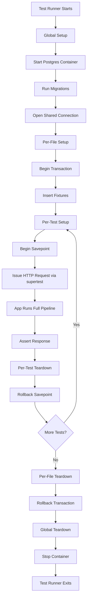
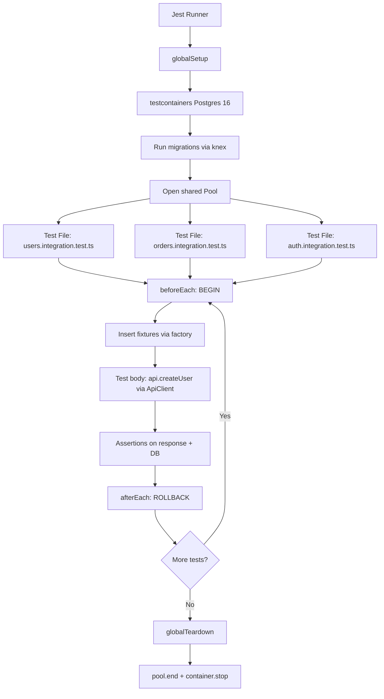

# 5.07 Integration Testing APIs

## 1. Purpose

Unit tests verify that a single function behaves correctly when given controlled inputs. They are fast, deterministic, and run thousands per second. But a backend application is not a collection of independent functions. It is a pipeline: an HTTP request enters, is parsed by middleware, is dispatched by a router, is handled by a controller, calls a service, runs queries against a database, serializes the result back through the framework's response machinery, and exits as an HTTP response. Every one of those seams is a place where a unit test can pass and the system can still fail in production. Integration testing exists to exercise those seams.

The bugs that unit tests miss are precisely the bugs that integration tests catch. A unit test for `createUser` will pass while the database schema disagrees with the ORM mapping because the unit test mocks the repository. A unit test for the request handler will pass while a middleware earlier in the chain strips the `Authorization` header. A unit test for `JSON.stringify` on a model will pass while the framework's response serializer omits a field because of a serialization decorator the unit test never invoked. A unit test for a route path will pass while the route is registered with the wrong HTTP method or mounted at the wrong prefix. Integration tests catch all of these because they drive the entire pipeline from request to response, including the database.

What integration testing tests is the full request-to-response cycle. A test makes an HTTP request (real or in-process), the framework's middleware stack runs in production order, the router matches a real route, the controller executes real business logic, the ORM issues real SQL against a real (but transient) database, the response is serialized by the real serializer, and the test asserts on the real HTTP status code, headers, and body. Nothing along that path is mocked. The only difference from production is the database: instead of the production Postgres, the test uses a fresh, disposable Postgres (in a container, an in-memory SQLite, or a per-test transaction).

The trade-off is speed. A unit test runs in microseconds because it executes pure in-process code with no IO. An integration test runs in tens to hundreds of milliseconds because it crosses the framework boundary and hits a real database. An end-to-end test (E2E) runs in seconds because it drives a real browser against a deployed environment. Integration testing occupies the sweet spot: fast enough to run on every save in development, slow enough to require a separate test command in CI, and ten to a hundred times faster than E2E.

In the Testing Trophy popularized by Kent C. Dodds, integration tests form the widest band of the trophy. The trophy shape (inverted from the Testing Pyramid) reflects the modern reality that integration tests give the highest confidence-per-effort. Unit tests still matter for pure logic (parsers, calculators, state machines) and E2E tests still matter for user-visible flows, but the bulk of a healthy suite is integration tests that prove the system works end-to-end through its real boundaries. For more on the trophy shape and where each layer fits, see [[5.01 Testing Pyramid and Trophy]].

This note covers integration testing from first principles through production implementation. You will finish able to write integration tests with `supertest`, set up a transient database (using testcontainers or in-memory SQLite), implement transactional test isolation so each test starts from a clean slate without slow truncation, and diagnose flaky integration tests caused by shared state. For unit testing fundamentals, see [[5.04 Unit Testing Fundamentals]]. For test data builders and fixtures, see [[5.12 Test Data Builders and Fixtures]].

## 2. Theory and Deep Dive

### 2.1 What Integration Testing Is

Integration testing is the practice of testing two or more components together through their real boundaries. In a Node.js backend, that almost always means testing the HTTP server together with its database. The unit of test is no longer a function; it is a request. The test does not call `createUser(payload)` directly. It issues `POST /users` with a JSON body, lets the framework route it, lets the controller parse it, lets the service execute it, lets the repository persist it, lets the database commit it, and then asserts on the HTTP response. The same test then issues `GET /users/42` and asserts that the persisted user is returned. Two requests, one database, one assertion of behavior across the boundary.

The defining property of an integration test is that the seams between components are real. A seam is the place where one component calls another. If the seam is mocked, the test is a unit test. If the seam is real, the test is an integration test. The most important seams in a backend are: (1) the HTTP boundary between client and server, (2) the framework's middleware chain, (3) the router's path-to-handler mapping, (4) the controller-to-service call, (5) the service-to-repository call, (6) the repository-to-database call, and (7) the response serialization. A pure unit test mocks seams 1 through 6. An integration test mocks none of them. It runs the real code at every seam and only the database itself is replaced with a transient copy.

### 2.2 Why `supertest`

The naive way to write an integration test is to start a real HTTP server with `app.listen(3000)` and then make real HTTP requests to `http://localhost:3000/users` with `fetch` or `axios`. This works, but it pays three costs. First, it allocates a real TCP port, which means tests cannot run in parallel on the same machine without port management. Second, it pays the cost of a real TCP round trip on every request, which is small per request but compounds across thousands of tests. Third, it requires the test to wait until the server is "ready" (the `listen` callback has fired), which introduces timing flakiness.

`supertest` is a library that lets you make HTTP requests to an Express, Koa, or Fastify application without starting a real server. It does this by invoking the request handler function directly with a synthetic request object, bypassing the TCP layer entirely. The call `request(app).get('/users').expect(200)` constructs a fake inbound HTTP request, hands it to the app's request handler, captures the response the app would have produced, and runs assertions against it. No TCP socket is opened. No port is bound. The test runs in-process and is therefore dramatically faster than the real-HTTP alternative.

`supertest` is built on top of `superagent`, an HTTP client library. When you pass an Express app (a request handler function) to `supertest`, it detects that the argument is a function rather than a URL string and short-circuits the network call. Instead of opening a socket, it invokes the function with the synthesized request and a response object that captures writes. The result is a test that exercises the entire HTTP-handling stack (middleware, routing, controllers, serializers) without paying any networking cost.

The library's API is a fluent, chainable builder. `request(app).post('/users').set('Content-Type', 'application/json').send({ name: 'Ada' }).expect(201).expect('Content-Type', /json/).expect(res => { if (!res.body.id) throw new Error('missing id'); })`. Each method returns the same request object, the call is fired by a terminal `.then` or `.expect` callback, and assertions can be either status-code shorthand, header matchers, or arbitrary functions on the response object.

### 2.3 The Transient Database Problem

A unit test does not touch the database. An integration test does. That raises the question: which database? The production database is out of bounds for tests — tests must not mutate shared production state, and test runs must not depend on the production database's current contents. So the test suite needs a database that is real (same engine, same SQL dialect, same schema, same migrations) but disposable (fresh per test run, isolated between tests, torn down at the end).

Three approaches are common. First, a long-lived shared test database. The team stands up a Postgres instance on a dev machine or CI runner, points the test suite at it, and runs migrations once. Each test is responsible for cleaning up after itself (typically by truncating tables in `afterEach`). This is the simplest setup and the slowest in practice, because truncation is expensive and because tests that forget to clean up pollute the database for later tests.

Second, an in-memory database. SQLite is the most common choice: it runs in-process, has no installation cost, and is fast enough that thousands of tests complete in seconds. The drawback is dialect mismatch. SQLite does not implement the full Postgres feature set. If your production code uses Postgres-specific JSONB operators, `RETURNING` clauses, partial indexes, or array columns, SQLite will reject the same SQL. The test passes against SQLite but production fails against Postgres. This is acceptable for simple CRUD apps and unacceptable for anything that leans on database-specific features.

Third, a containerized database. `testcontainers` is a Node.js library that spins up a Docker container running a real Postgres (or MySQL, or Redis, or anything with a Docker image) on demand. The container is created at the start of the test run, the suite connects to it on a random port, migrations are applied, tests run, and the container is torn down at the end. This gives you a real database that matches production exactly, with the cost of a Docker daemon and a few seconds of startup time per container.

The right choice depends on your tolerance for dialect mismatch. If your queries are simple and you value speed above fidelity, SQLite works. If your queries lean on database-specific features, you need a real Postgres container. Most production codebases end up on containerized databases because dialect mismatch is a real and recurring source of "works in tests, fails in prod" bugs.

### 2.4 Transactional Test Isolation

Even with a transient database, you still have to isolate tests from each other. If test A inserts a user and test B lists users, test B will see test A's user and either pass for the wrong reason or fail because the data shape changed. The naive solution is to truncate every table in `afterEach` (or `beforeEach`). This works but it is slow: a full TRUNCATE on a schema with foreign keys requires cascade, and on a busy CI runner it can take tens of milliseconds per test, which compounds to minutes across thousands of tests.

The better solution is transactional test isolation. Each test runs inside a database transaction that is begun before the test starts and rolled back after the test ends. Inserts, updates, and deletes issued by the test's HTTP requests are written to the database inside the transaction, but they are never committed. At the end of the test, ROLLBACK undoes everything in one fast operation. The next test sees a clean database.

For this to work, every database operation issued by the application under test must use the same connection (and therefore the same transaction) as the test harness. The standard pattern is to inject a single `pg.Client` (or a Knex/Prisma connection bound to a single client) into the application at test time, have the test harness `BEGIN` a transaction on that client before the test, and `ROLLBACK` on that client after the test. The application's repository code uses that client for all its queries, so all queries are inside the transaction and all are rolled back together.

This pattern is fast (BEGIN and ROLLBACK are microsecond operations) and bulletproof (the rollback undoes every change including schema changes that the test might have triggered). Its only limitation is that it cannot test behavior that depends on commits being visible across connections — for example, a test that spawns a worker process and expects to read committed data from that worker would not work, because the worker would not see the uncommitted transaction. For the vast majority of API tests, this is not a concern.

### 2.5 Setup, Teardown, Fixtures

Setup and teardown are the bookends of every test. Setup prepares the world the test will run in: it starts the database container, runs migrations, opens a connection, begins a transaction, and inserts any seed data the test needs. Teardown undoes all of that: it rolls back the transaction, closes the connection, and stops the container.

Setup and teardown come in three scopes. Global setup runs once for the entire test run (start container, run migrations, open a shared connection). Per-file setup runs once for each test file (begin a transaction, insert file-level fixtures). Per-test setup runs once for each `it` block (begin a nested transaction or savepoint, insert test-specific fixtures). The corresponding teardown scopes roll back in reverse order.

Fixtures are the known starting data the test relies on. A fixture is not "any data created during the test"; a fixture is "data the test expects to exist before it runs". For example, a test that asserts `GET /users/42` returns the user with id 42 needs a user with id 42 to exist before the request is made. That user is a fixture. Fixtures can be defined as literal JSON objects, factory functions, or SQL files. The trade-off is between explicitness (literal JSON is easy to read but rigid) and flexibility (factory functions let each test customize the fixture without redefining the whole object). See [[5.12 Test Data Builders and Fixtures]] for the factory-vs-fixture decision in depth.

### 2.6 The Integration Test Lifecycle

The full lifecycle of an integration test, from the moment the test runner starts to the moment it exits, is illustrated below.



The layered transaction design (a top-level transaction per file, with a savepoint per test) lets tests share file-level fixtures without re-inserting them for every test, while still giving each test a clean slate via savepoint rollback. This is the fastest practical layout for a Node.js API test suite.

### 2.7 How `supertest` Works Internally

`supertest` accepts an Express app (which is just a function with the signature `(req, res) => void`). When you call `request(app)`, the library returns a `Test` object that extends `superagent`'s `Request`. The `Test` object overrides the request-sending mechanism: instead of opening a TCP socket to a host, it synthesizes a Node.js `IncomingMessage` (the request object) and a `ServerResponse` (the response object), invokes the app function with them, and waits for the response to finish. When `res.end()` is called by the app, `supertest` captures the buffered response body, status code, and headers, and resolves the promise returned by `.then` (or runs the assertions queued via `.expect`).

The key insight is that the app is running in the same Node.js process as the test. There is no IPC, no socket, no port. That means the test can mock or instrument anything in the app's process — environment variables, the database connection, the clock — and the app sees those changes immediately. It also means tests are limited to a single process: you cannot test a multi-process architecture (a master with worker threads, or a microservice that calls another microservice over HTTP) purely with `supertest`. For multi-process tests, you either stand up the other process as a real server, mock the outbound HTTP calls with `nock` or `msw`, or extract the cross-service logic into a unit-testable function.

### 2.8 Migration Strategies for the Test Database

The test database must have the same schema as production. There are two ways to achieve this: shared migrations or schema sync. Shared migrations means the test runner executes the same migration files the production deploy runs. This is the gold standard because it tests the migrations themselves (a migration that breaks the schema will fail the test suite before it reaches production). The cost is that running all migrations on every test run can be slow for a large codebase. Schema sync means the ORM reads the entity definitions and creates tables to match, skipping migrations entirely. This is fast but it does not test migrations, and it can drift from production if migrations do anything the ORM cannot represent (data backfills, column renames with data transformation, partial indexes).

A common optimization for shared migrations is to run migrations once at the start of the test run against a fresh container, then snapshot the database (using the Postgres `pgdump` tool or Docker commit) and restore the snapshot for each test file. This gives you a fully-migrated database in milliseconds per file rather than seconds. For a codebase with hundreds of migrations, this can shave minutes off the CI run.

### 2.9 Fixtures vs Factories vs SQL Seeds

There are three styles of seeding test data. SQL seeds are `.sql` files that the test runner executes against the database before tests run. They are fast and they let you test the SQL itself, but they are rigid: every test gets the same data, and tests that need a slightly different starting state have to mutate the seeded data, which is awkward and brittle. Fixtures are declarative data files (JSON, YAML, or JS objects) that a fixture loader inserts into the database. They are more readable than SQL and easier to customize per test. Factories are functions that build domain objects with sensible defaults and let each test override only the fields it cares about. Factories are the most flexible and the most verbose; they are the right choice when tests need many variations of the same entity. In practice, mature suites use all three: SQL seeds for reference data (countries, currencies), fixtures for canonical cases (the standard user, the standard order), and factories for edge cases (the user with no email, the order with a thousand line items).

## 3. Mental Models

**Integration test equals "hit the real API, with a real DB, assert the response."** If you remember nothing else, remember that an integration test is a black-box test of the API. It does not know about controllers or services or repositories. It knows about HTTP methods, paths, bodies, status codes, and JSON. Anything inside the app is invisible to the test; only the contract (request in, response out) is observable. This is what makes integration tests resilient to refactoring: you can rewrite the entire internals of the app, and as long as the HTTP contract stays the same, the tests still pass.

**`supertest` equals "make HTTP requests in-process."** Think of `supertest` as a fake network stack. It gives you the ergonomics of an HTTP client (`.get`, `.post`, `.set`, `.send`, `.expect`) but the speed of a function call. The app never knows it is being tested; it just receives request objects and produces response objects exactly as it would in production. The only thing `supertest` cannot do is test the real TCP layer (keep-alive, HTTP/2 multiplexing, TLS handshake) — but those are the framework's responsibility, not yours.

**Transient DB equals "fresh DB per test run, or per test."** The database the test suite uses is not a long-lived artifact. It is created for the run and destroyed at the end. Within a run, isolation between tests is achieved either by truncating tables (slow but simple), by giving each test its own database (clean but expensive in container startup), or by wrapping each test in a transaction and rolling back (fast and clean — the recommended default).

**Transactional state equals "wrap in BEGIN/ROLLBACK, no cleanup needed."** The transactional pattern is the mental model that unlocks fast integration tests. Once you internalize that every test runs inside a transaction that will be rolled back, you stop worrying about cleanup. You can insert, update, and delete freely in the test body, knowing that the rollback will undo it all. The only thing you cannot do is test behavior that depends on commits (which is rare).

**Fixture equals "known starting data."** A fixture is the data the test expects to find before it runs. It is not data the test creates during the request — that is the test's job. The fixture is the precondition. Tests should declare their fixtures explicitly, either by inserting them in `beforeEach` or by relying on a factory that makes the insertion one-liner readable.

**Seams model.** A useful diagnostic mental model: walk through the request pipeline and list every seam (HTTP boundary, middleware chain, router, controller, service, repository, database, serializer). For each seam, ask: is this seam real in my test, or is it mocked? The more seams that are real, the more integration-y the test. The more seams that are mocked, the more unit-y. A healthy suite has tests at many points on this spectrum, but the bulk are at the "everything real except the database" end.

**Where the models break down.** The "black box" model breaks down when you need to assert on side effects that are not visible in the HTTP response — for example, "after `POST /users`, a welcome email was sent". The black box cannot observe the email. You either peek inside the box (assert on a mocked email service), expose the side effect (an endpoint that returns the most recent email, for tests only), or move the assertion to an E2E test that observes the real mailbox. The "rollback everything" model breaks down when the app uses a connection pool that hands out different connections for different queries — then the test's transaction is not the app's transaction and rollback does not isolate. The fix is to force the app to use a single connection (or a single-client pool) for the duration of the test.

## 4. Real-World Use Cases

### 4.1 Testing REST APIs

The canonical use case. An Express app exposes `GET /users`, `POST /users`, `GET /users/:id`, `PATCH /users/:id`, `DELETE /users/:id`. Integration tests exercise every endpoint, assert on status codes, response shapes, and database side effects. A typical suite has one test per endpoint per scenario (happy path, validation failure, not-found, unauthorized, conflict). For a CRUD resource with five endpoints and three scenarios each, that is fifteen tests. With transactional isolation, the whole suite runs in under a second. See [[3.19 REST API Design]] for the contract these tests verify.

### 4.2 Testing GraphQL Resolvers

GraphQL poses a different shape: one endpoint (`/graphql`), many operations. Integration tests still issue HTTP requests via `supertest`, but the body is a GraphQL query or mutation and the assertions reach into `res.body.data` for the resolved fields. The advantage of integration-testing GraphQL over unit-testing resolvers is that the test exercises the full GraphQL execution pipeline: parsing, validation, field resolution, auth directives, data loader batching. A unit test on a resolver function misses batching bugs (the same data loaded twice in one request) and auth directive bugs (a field that should be hidden being returned).

### 4.3 Testing Middleware Chains

Middleware is where the most subtle bugs live. A middleware that runs before the auth middleware will receive unauthenticated requests; a middleware that runs after the body parser will see parsed bodies; a middleware that runs after the rate limiter will only see requests that passed the limit. Integration tests are the only practical way to verify middleware order, because the order is a property of the chain as a whole, not of any single middleware. A typical test mounts the real middleware chain, makes a request that should be blocked by auth, and asserts on the 401 response. See [[3.20 Middleware Pattern]] for the chain composition model.

### 4.4 Testing Database Queries

When a query is non-trivial (a five-table join, a window function, a recursive CTE, a complex aggregation), unit testing it is meaningless — the unit test would mock the database and assert that the right SQL string was generated, which proves nothing about whether the SQL returns the right data. Integration testing is the only way to verify that the query returns what you expect. The test seeds a known dataset, runs the query (typically through an endpoint that exercises it, or directly through the repository if you want to test the query without the HTTP layer), and asserts on the rows returned.

### 4.5 Testing Auth Flows

Authentication is a multi-step flow: register, verify email, login, refresh token, logout. Each step depends on the previous step's state. Integration tests are ideal here because they exercise the full flow: `POST /auth/register` returns a verification token; `POST /auth/verify` consumes it; `POST /auth/login` returns an access token; `GET /me` with the access token returns the user. A unit test on `login` would have to mock the verification step, the token generation, and the user lookup, and would still not prove that the access token actually works on a protected endpoint. Integration testing proves the whole chain.

### 4.6 Testing Webhooks

Webhooks are inbound HTTP requests from a third party (Stripe, GitHub, Slack). The signature must be verified, the payload must be parsed, the event must be idempotent (the same webhook delivered twice must not double-process). Integration tests are the right tool: the test synthesizes a webhook payload, signs it with the shared secret, posts it to the webhook endpoint via `supertest`, and asserts on the response and the resulting database state. A second test posts the same payload again and asserts that the database state did not change (idempotency). Webhooks are particularly ill-suited to unit testing because the signature verification depends on real crypto and real header ordering.

### 4.7 Testing Background Job Integration

When an HTTP request enqueues a background job (sending an email, processing an image, syncing to a CRM), the integration test needs to verify both the immediate response (202 Accepted) and the eventual job execution. The cleanest pattern is to use a fake job queue in tests: the queue records enqueued jobs in memory instead of pushing them to Redis, and the test can either assert on the enqueued job (did the request enqueue an email job with the right payload?) or drain the queue synchronously and assert on the side effects.

### 4.8 Testing API Versioning

When an API has multiple active versions (`/v1/users` and `/v2/users`), integration tests are the safety net that lets you ship v2 without breaking v1. Each version gets its own test file. The v1 tests run against the v1 routes and assert on the v1 response shape. The v2 tests run against the v2 routes and assert on the v2 response shape. When you change a shared service that both versions use, both test suites run, and any breaking change to either version is caught before deploy.

## 5. Code Examples

### 5.1 Example A — Minimal and Conceptual

The minimal integration test is an Express app with an in-memory data store (a JavaScript array) tested with `supertest`. This is the smallest possible example that exercises the full request-to-response cycle through `supertest` without any database. It is the right starting point for learning the shape of an integration test, even though a real backend will graduate to a real database quickly.

**JavaScript — minimal app and test**

```javascript
// app.js
const express = require('express');

function createApp() {
  const app = express();
  app.use(express.json());

  const users = [];
  let nextId = 1;

  app.get('/users', (req, res) => {
    res.json(users);
  });

  app.post('/users', (req, res) => {
    const { name, email } = req.body;
    if (!name || !email) {
      return res.status(400).json({ error: 'name and email are required' });
    }
    const user = { id: nextId++, name, email };
    users.push(user);
    res.status(201).json(user);
  });

  app.get('/users/:id', (req, res) => {
    const user = users.find(u => u.id === Number(req.params.id));
    if (!user) return res.status(404).json({ error: 'not found' });
    res.json(user);
  });

  return app;
}

module.exports = { createApp };
```

```javascript
// app.test.js
const request = require('supertest');
const { createApp } = require('./app');

describe('users API', () => {
  let app;
  beforeEach(() => { app = createApp(); });

  it('lists users (empty initially)', async () => {
    await request(app)
      .get('/users')
      .expect(200)
      .expect('Content-Type', /json/)
      .expect([]);
  });

  it('creates a user and returns 201', async () => {
    const res = await request(app)
      .post('/users')
      .send({ name: 'Ada Lovelace', email: 'ada@example.com' })
      .expect(201);

    expect(res.body).toMatchObject({ id: 1, name: 'Ada Lovelace', email: 'ada@example.com' });
  });

  it('rejects creation without email', async () => {
    await request(app)
      .post('/users')
      .send({ name: 'Ada' })
      .expect(400);
  });

  it('fetches a user by id after creation', async () => {
    const created = await request(app)
      .post('/users')
      .send({ name: 'Ada', email: 'ada@example.com' });

    await request(app)
      .get(`/users/${created.body.id}`)
      .expect(200)
      .expect(res => {
        expect(res.body.name).toBe('Ada');
      });
  });
});
```

**TypeScript — minimal app and test**

```typescript
// app.ts
import express, { Request, Response } from 'express';

export interface User {
  id: number;
  name: string;
  email: string;
}

export interface CreateUserBody {
  name?: string;
  email?: string;
}

export function createApp() {
  const app = express();
  app.use(express.json());

  const users: User[] = [];
  let nextId = 1;

  app.get('/users', (req: Request, res: Response) => {
    res.json(users);
  });

  app.post('/users', (req: Request, res: Response) => {
    const { name, email } = req.body as CreateUserBody;
    if (!name || !email) {
      return res.status(400).json({ error: 'name and email are required' });
    }
    const user: User = { id: nextId++, name, email };
    users.push(user);
    res.status(201).json(user);
  });

  app.get('/users/:id', (req: Request, res: Response) => {
    const user = users.find(u => u.id === Number(req.params.id));
    if (!user) return res.status(404).json({ error: 'not found' });
    res.json(user);
  });

  return app;
}
```

```typescript
// app.test.ts
import request from 'supertest';
import { createApp, User } from './app';

describe('users API', () => {
  let app: ReturnType<typeof createApp>;

  beforeEach(() => {
    app = createApp();
  });

  it('lists users (empty initially)', async () => {
    await request(app)
      .get('/users')
      .expect(200)
      .expect('Content-Type', /application\/json/)
      .expect([]);
  });

  it('creates a user and returns 201', async () => {
    const res = await request(app)
      .post('/users')
      .send({ name: 'Ada Lovelace', email: 'ada@example.com' })
      .expect(201);

    expect(res.body).toMatchObject<User>({
      id: 1,
      name: 'Ada Lovelace',
      email: 'ada@example.com',
    });
  });

  it('rejects creation without email', async () => {
    await request(app)
      .post('/users')
      .send({ name: 'Ada' })
      .expect(400);
  });

  it('fetches a user by id after creation', async () => {
    const created = await request(app)
      .post('/users')
      .send({ name: 'Ada', email: 'ada@example.com' });

    await request(app)
      .get(`/users/${created.body.id}`)
      .expect(200)
      .expect(res => {
        expect((res.body as User).name).toBe('Ada');
      });
  });
});
```

The shape is identical in both languages. The TypeScript version adds an interface for the user and a typed assertion, but the test logic — `request(app).verb(path).send(body).expect(status)` — is the same. This shape is the foundation of every integration test in this note.

### 5.2 Example B — Production-Grade

A production-grade integration test suite has four pieces: (1) a typed API client wrapping `supertest` so tests do not repeat boilerplate, (2) a transient Postgres spun up by `testcontainers`, (3) transactional isolation so each test runs in a rolled-back transaction, and (4) fixtures inserted before each test. The example below shows all four, side-by-side in JavaScript and TypeScript.

**JavaScript — production-grade app, repository, fixtures, and test harness**

```javascript
// src/app.js
const express = require('express');
const { Pool } = require('pg');

function createApp(pool) {
  const app = express();
  app.use(express.json());

  app.post('/users', async (req, res) => {
    const { name, email } = req.body;
    if (!name || !email) return res.status(400).json({ error: 'name and email required' });
    try {
      const result = await pool.query(
        'INSERT INTO users (name, email) VALUES ($1, $2) RETURNING id, name, email',
        [name, email]
      );
      res.status(201).json(result.rows[0]);
    } catch (err) {
      if (err.code === '23505') return res.status(409).json({ error: 'email already exists' });
      throw err;
    }
  });

  app.get('/users/:id', async (req, res) => {
    const result = await pool.query('SELECT id, name, email FROM users WHERE id = $1', [req.params.id]);
    if (result.rows.length === 0) return res.status(404).json({ error: 'not found' });
    res.json(result.rows[0]);
  });

  app.get('/users', async (req, res) => {
    const result = await pool.query('SELECT id, name, email FROM users ORDER BY id');
    res.json(result.rows);
  });

  return app;
}

module.exports = { createApp };
```

```javascript
// test/setup.js
const { PostgreSqlTestContainer } = require('@testcontainers/postgresql');
const { Pool } = require('pg');
const { createApp } = require('../src/app');

let container;
let pool;
let app;

async function globalSetup() {
  container = await new PostgreSqlTestContainer('postgres:16').start();
  pool = new Pool({ connectionString: container.getConnectionUri() });
  await pool.query(`
    CREATE TABLE users (
      id SERIAL PRIMARY KEY,
      name TEXT NOT NULL,
      email TEXT NOT NULL UNIQUE
    )
  `);
  app = createApp(pool);
  globalThis.testContext = { app, pool, container };
}

async function globalTeardown() {
  if (pool) await pool.end();
  if (container) await container.stop();
}

module.exports = { globalSetup, globalTeardown, getTestContext: () => globalThis.testContext };
```

```javascript
// test/users.test.js
const request = require('supertest');
const { getTestContext } = require('./setup');

describe('users API', () => {
  let app, pool;

  beforeAll(() => {
    const ctx = getTestContext();
    app = ctx.app;
    pool = ctx.pool;
  });

  let txnClient;

  beforeEach(async () => {
    txnClient = await pool.connect();
    await txnClient.query('BEGIN');
    // Replace the pool's query behavior for the duration of the test
    // so the app uses the transaction-bound client.
    const origQuery = pool.query.bind(pool);
    pool.query = (text, params) => txnClient.query(text, params);
    pool.query.restore = () => { pool.query = origQuery; };
  });

  afterEach(async () => {
    pool.query.restore();
    await txnClient.query('ROLLBACK');
    txnClient.release();
  });

  it('creates and fetches a user', async () => {
    const created = await request(app)
      .post('/users')
      .send({ name: 'Ada', email: 'ada@example.com' })
      .expect(201);

    await request(app)
      .get(`/users/${created.body.id}`)
      .expect(200)
      .expect(res => {
        expect(res.body.name).toBe('Ada');
      });
  });

  it('rejects duplicate email', async () => {
    await request(app).post('/users').send({ name: 'Ada', email: 'ada@example.com' }).expect(201);
    await request(app).post('/users').send({ name: 'Ada2', email: 'ada@example.com' }).expect(409);
  });

  it('returns 404 for missing user', async () => {
    await request(app).get('/users/9999').expect(404);
  });
});
```

**TypeScript — production-grade app, repository, fixtures, and test harness**

```typescript
// src/app.ts
import express, { Request, Response } from 'express';
import { Pool, QueryResult } from 'pg';

export interface User {
  id: number;
  name: string;
  email: string;
}

export interface CreateUserBody {
  name?: string;
  email?: string;
}

export function createApp(pool: Pool) {
  const app = express();
  app.use(express.json());

  app.post('/users', async (req: Request, res: Response) => {
    const { name, email } = req.body as CreateUserBody;
    if (!name || !email) {
      return res.status(400).json({ error: 'name and email required' });
    }
    try {
      const result: QueryResult<User> = await pool.query<User>(
        'INSERT INTO users (name, email) VALUES ($1, $2) RETURNING id, name, email',
        [name, email]
      );
      res.status(201).json(result.rows[0]);
    } catch (err: unknown) {
      const e = err as { code?: string };
      if (e.code === '23505') {
        return res.status(409).json({ error: 'email already exists' });
      }
      throw err;
    }
  });

  app.get('/users/:id', async (req: Request, res: Response) => {
    const result = await pool.query<User>(
      'SELECT id, name, email FROM users WHERE id = $1',
      [req.params.id]
    );
    if (result.rows.length === 0) return res.status(404).json({ error: 'not found' });
    res.json(result.rows[0]);
  });

  app.get('/users', async (req: Request, res: Response) => {
    const result = await pool.query<User>('SELECT id, name, email FROM users ORDER BY id');
    res.json(result.rows);
  });

  return app;
}
```

```typescript
// test/setup.ts
import { PostgreSqlTestContainer, StartedPostgreSqlContainer } from '@testcontainers/postgresql';
import { Pool, Client } from 'pg';
import { createApp } from '../src/app';

export interface TestContext {
  app: ReturnType<typeof createApp>;
  pool: Pool;
  container: StartedPostgreSqlContainer;
}

let container: StartedPostgreSqlContainer;
let pool: Pool;
let app: ReturnType<typeof createApp>;

export async function globalSetup(): Promise<void> {
  container = await new PostgreSqlTestContainer('postgres:16').start();
  pool = new Pool({ connectionString: container.getConnectionUri() });
  await pool.query(`
    CREATE TABLE users (
      id SERIAL PRIMARY KEY,
      name TEXT NOT NULL,
      email TEXT NOT NULL UNIQUE
    )
  `);
  app = createApp(pool);
  (globalThis as { testContext?: TestContext }).testContext = { app, pool, container };
}

export async function globalTeardown(): Promise<void> {
  if (pool) await pool.end();
  if (container) await container.stop();
}

export function getTestContext(): TestContext {
  const ctx = (globalThis as { testContext?: TestContext }).testContext;
  if (!ctx) throw new Error('Test context not initialized; did globalSetup run?');
  return ctx;
}
```

```typescript
// test/users.test.ts
import request from 'supertest';
import { Pool, Client } from 'pg';
import { getTestContext } from './setup';
import { User } from '../src/app';

describe('users API', () => {
  let pool: Pool;
  let app: ReturnType<typeof getTestContext>['app'];
  let txnClient: Client;
  let restorePoolQuery: () => void;

  beforeAll(() => {
    const ctx = getTestContext();
    app = ctx.app;
    pool = ctx.pool;
  });

  beforeEach(async () => {
    txnClient = await pool.connect();
    await txnClient.query('BEGIN');
    const origQuery = pool.query.bind(pool) as Pool['query'];
    (pool as unknown as { query: Pool['query'] }).query = ((text: unknown, params?: unknown) =>
      txnClient.query(text as never, params as never)) as Pool['query'];
    restorePoolQuery = () => { (pool as unknown as { query: Pool['query'] }).query = origQuery; };
  });

  afterEach(async () => {
    restorePoolQuery();
    await txnClient.query('ROLLBACK');
    txnClient.release();
  });

  it('creates and fetches a user', async () => {
    const created = await request(app)
      .post('/users')
      .send({ name: 'Ada', email: 'ada@example.com' })
      .expect(201);

    const fetched = await request(app)
      .get(`/users/${(created.body as User).id}`)
      .expect(200);

    expect((fetched.body as User).name).toBe('Ada');
  });

  it('rejects duplicate email', async () => {
    await request(app).post('/users').send({ name: 'Ada', email: 'ada@example.com' }).expect(201);
    await request(app).post('/users').send({ name: 'Ada2', email: 'ada@example.com' }).expect(409);
  });

  it('returns 404 for missing user', async () => {
    await request(app).get('/users/9999').expect(404);
  });
});
```

The TypeScript version is more verbose primarily because of the `pool.query` swap pattern: TypeScript correctly forbids reassigning a method on a typed object, so the code has to cast through `unknown` to do the swap. A cleaner pattern in production code is to inject the query function into the app via dependency injection rather than monkey-patching the pool. The next example shows that cleaner approach.

**TypeScript — typed API client wrapper around `supertest`**

```typescript
// test/apiClient.ts
import request, { Response, SuperAgentTest } from 'supertest';
import { User, CreateUserBody } from '../src/app';

export class ApiClient {
  private agent: SuperAgentTest;

  constructor(private app: Express.Application) {
    this.agent = request.agent(app);
  }

  async listUsers(): Promise<User[]> {
    const res = await this.agent.get('/users').expect(200);
    return res.body as User[];
  }

  async createUser(body: CreateUserBody, expectedStatus = 201): Promise<User> {
    const res = await this.agent.post('/users').send(body).expect(expectedStatus);
    return res.body as User;
  }

  async getUser(id: number, expectedStatus = 200): Promise<User> {
    const res = await this.agent.get(`/users/${id}`).expect(expectedStatus);
    return res.body as User;
  }
}
```

With this client, tests become one-liners: `const user = await api.createUser({ name: 'Ada', email: 'ada@example.com' });`. The wrapper centralizes the URL paths and status-code expectations, so when an endpoint changes, only the client has to be updated. This is the same pattern production API SDKs use to give their consumers a typed interface — and it is just as valuable in tests.

**TypeScript — dependency-injected repository for clean transactional tests**

```typescript
// src/repository.ts
import { Pool, Client } from 'pg';
import { User } from './app';

export type Queryable = Pick<Pool, 'query'>;

export class UserRepository {
  constructor(private db: Queryable) {}

  async create(name: string, email: string): Promise<User> {
    const result = await this.db.query<User>(
      'INSERT INTO users (name, email) VALUES ($1, $2) RETURNING id, name, email',
      [name, email]
    );
    return result.rows[0];
  }

  async findById(id: number): Promise<User | null> {
    const result = await this.db.query<User>(
      'SELECT id, name, email FROM users WHERE id = $1',
      [id]
    );
    return result.rows[0] ?? null;
  }
}
```

```typescript
// test/repository.test.ts
import { getTestContext } from './setup';
import { UserRepository } from '../src/repository';

describe('UserRepository', () => {
  let pool: ReturnType<typeof getTestContext>['pool'];
  let txnClient: Awaited<ReturnType<typeof pool.connect>>;

  beforeAll(() => { pool = getTestContext().pool; });

  beforeEach(async () => {
    txnClient = await pool.connect();
    await txnClient.query('BEGIN');
  });

  afterEach(async () => {
    await txnClient.query('ROLLBACK');
    txnClient.release();
  });

  it('creates and finds a user', async () => {
    const repo = new UserRepository(txnClient);
    const created = await repo.create('Ada', 'ada@example.com');
    const found = await repo.findById(created.id);
    expect(found?.email).toBe('ada@example.com');
  });

  it('returns null for missing user', async () => {
    const repo = new UserRepository(txnClient);
    const found = await repo.findById(99999);
    expect(found).toBeNull();
  });
});
```

The `Queryable` type (a structural type that requires only a `query` method) lets the repository accept either a `Pool` (in production) or a `Client` (in tests, bound to a transaction). This is the dependency-inversion pattern of [[3.23 Database Integration and ORM Patterns]] applied to testability: the repository depends on an interface, and the test injects a transaction-bound implementation.

## 6. Common Mistakes and Anti-Patterns

### 6.1 Shared Database State Across Tests

**Anti-pattern.** All tests run against the same database with no cleanup between them. Test A inserts a user with id 1; test B assumes the database is empty; test B fails.

**Why it happens.** The team sets up a long-lived dev database, points the test suite at it, and never adds per-test isolation. The first test passes; subsequent tests pass by coincidence; one day someone reorders the test file and a cascade of failures erupts.

**Fix.** Wrap each test in a transaction and roll back. If transactional isolation is not feasible, truncate every table in `afterEach`. Never let a test rely on data inserted by an earlier test.

### 6.2 Not Rolling Back Transactions

**Anti-pattern.** The test wraps each test in a transaction but forgets to roll back, or rolls back only on the happy path. The transaction commits, the database accumulates state, and tests become order-dependent.

**Why it happens.** The `afterEach` hook is missing or only runs on success. An exception in the test body propagates before the rollback fires.

**Fix.** Always roll back in `afterEach`, regardless of test outcome. Use `try/finally` inside `afterEach` to guarantee the rollback fires even if cleanup itself throws.

### 6.3 Testing Through Real HTTP

**Anti-pattern.** The test calls `app.listen(3000)`, waits for the server to be ready, and uses `fetch` to make requests to `http://localhost:3000`. Tests are slow, port conflicts cause flakiness in CI, and the readiness wait introduces timing bugs.

**Why it happens.** Developers do not know about `supertest` or assume it cannot test their framework.

**Fix.** Use `supertest`. It invokes the app's request handler in-process with no TCP socket, no port binding, and no readiness wait. The same tests run an order of magnitude faster.

### 6.4 No Fixtures — Tests Create Their Own Data

**Anti-pattern.** Each test starts from an empty database and creates whatever data it needs via API calls at the top of the test. The tests are verbose, slow (each test pays the cost of creating its own world), and brittle (a change to the creation endpoint breaks every test, not just the creation test).

**Why it happens.** The team has not invested in a fixture loader or a factory, so the only way to get data into the database is to call the API.

**Fix.** Use fixtures or factories. Insert known data directly via SQL or a repository in `beforeEach`. Tests then assert on the request and response, not on the setup. Reserve API-driven data creation for tests that specifically exercise the creation endpoint.

### 6.5 Testing the Framework, Not Your Code

**Anti-pattern.** Tests assert that Express correctly parses JSON, that `pg` correctly returns rows, that `jsonwebtoken` correctly signs tokens. These tests pass forever and catch no bugs, because the framework is already tested by its maintainers.

**Why it happens.** The team writes tests by following a tutorial without thinking about what their application actually does.

**Fix.** Test the contract your application exposes. Assert on the status codes, headers, and bodies your app produces, and on the database side effects your app causes. Trust the framework to do its job.

### 6.6 No Teardown — Resource Leaks

**Anti-pattern.** The test starts a Postgres container in `beforeAll` and never stops it. After a few test runs, the machine has dozens of orphaned containers consuming memory and ports.

**Why it happens.** The `afterAll` hook is missing, or an exception in the test run prevents it from firing.

**Fix.** Always pair container startup with a teardown in `afterAll` or `globalTeardown`. Use `try/finally` so teardown fires even on failure. For `testcontainers`, the library's `Test` container subtype supports a `StopTimeout` and will auto-cleanup on process exit, but explicit teardown is still best practice.

### 6.7 Timeouts from External Services

**Anti-pattern.** The integration test calls a real third-party API (Stripe, SendGrid, Twilio) as part of the request pipeline. The test is slow, costs money on every run, and breaks when the third party has an outage.

**Why it happens.** The app's outbound HTTP calls are not abstracted behind an injectable interface, so the test cannot swap them out.

**Fix.** Inject all outbound HTTP clients. In tests, replace them with fakes that return canned responses. Reserve real third-party calls for a small suite of smoke tests that run nightly, not on every commit.

### 6.8 Mixing Unit and Integration Tests in One Suite

**Anti-pattern.** Unit tests and integration tests live in the same directory and run in the same command. The unit tests, which should be millisecond-fast, are bottlenecked by the integration tests' container startup. Developers stop running the test suite locally because it takes too long.

**Why it happens.** The team has not separated the two test types into different scripts or directories.

**Fix.** Separate them. Put unit tests in `*.unit.test.ts` and integration tests in `*.integration.test.ts`. Configure the test runner to run unit tests by default and integration tests only when explicitly requested (`npm run test:unit` vs `npm run test:integration`). In CI, run unit tests on every commit and integration tests on pull requests.

### 6.9 Using Production Middleware in Tests Without Adjusting for Test Context

**Anti-pattern.** The app's middleware includes rate limiting, request logging to a file, or CSRF protection that depends on cookies. The integration tests fail because the rate limiter blocks them, the log files clutter the workspace, or CSRF tokens are not set correctly.

**Why it happens.** The app reads its middleware config from environment variables, and the test environment has not been configured to disable or relax the problematic middleware.

**Fix.** Make middleware configurable via environment variables with test-friendly defaults. In the test environment, disable rate limiting, replace file logging with console logging, and relax CSRF for `localhost`. The test environment should be as close to production as possible while remaining practical — but not so close that it makes tests brittle.

## 7. Best Practices and Design Patterns

### 7.1 Use `supertest` for In-Process HTTP

`supertest` is the right default for HTTP integration tests in Node.js. It is fast, framework-agnostic, and runs in-process so you can mock and instrument freely. Reach for real-HTTP testing (`fetch` against a listening server) only when you specifically need to test TCP-layer behavior (HTTP/2 push, keep-alive, TLS) — and even then, do it in a small dedicated suite, not the main integration suite.

### 7.2 Use a Transient Database

Never run integration tests against a long-lived shared database. Use one of: a containerized Postgres via `testcontainers` (highest fidelity, requires Docker), an in-memory SQLite (fastest, dialect mismatch), or a per-test-run database created by a setup script on a shared Postgres instance (good middle ground). The database should be created for the test run and destroyed at the end. See [[3.23 Database Integration and ORM Patterns]] for the underlying repository patterns this assumes.

### 7.3 Wrap Tests in Transactions

Transactional test isolation is the single highest-leverage optimization in an integration test suite. Replacing per-test truncation with per-test rollback typically cuts suite runtime by an order of magnitude. The pattern requires that the app use a single, injectable database connection during tests; structure your app to make this easy from day one (dependency-inject the connection or pool).

### 7.4 Use Fixtures and Factories

Use fixtures (known starting data) for canonical cases and factories (functions that build entities with overridable defaults) for edge cases. A factory function `makeUser(overrides: Partial<User> = {})` lets each test specify only the fields it cares about, while sensible defaults fill in the rest. Centralize the factories in one module so that when the entity shape changes, only the factory needs updating.

### 7.5 Test the Contract, Not the Implementation

Assert on what the API does, not on how it does it. Tests should assert on HTTP status codes, headers, body shapes, and observable side effects (database rows, enqueued jobs, sent emails). Tests should not assert on which internal function was called, in what order, or with what arguments — those are unit-test concerns, and locking them down in integration tests makes refactoring painful.

### 7.6 Run in Parallel Where Possible

Test files that use separate databases (or separate schemas within a shared database) can run in parallel, dramatically cutting wall-clock time. Most test runners (Jest, Vitest) support parallel file execution by default. The barrier is database isolation: if every file uses the same database, parallel runs will collide. Give each file its own schema (created in `globalSetup`, dropped in `globalTeardown`) and you can parallelize safely.

### 7.7 Reset Sequences and Auto-Increment Counters

After a rollback, Postgres sequences are not reset. The next test that inserts a row will get an ID that continues from where the rolled-back transaction left off, not from 1. This is usually fine (tests should not hardcode IDs), but if a test does assert on a specific ID, reset the sequence in `beforeEach` with an `ALTER SEQUENCE ... RESTART WITH 1` statement (substituting your table's auto-generated sequence name). Better: never hardcode IDs in tests; always use the ID returned by the create call.

### 7.8 Use a Typed API Client

Wrap `supertest` in a typed client (as shown in Example B) that exposes one method per endpoint with typed inputs and outputs. Tests then call `api.createUser(body)` instead of `request(app).post('/users').send(body)`. The client centralizes URL paths and status-code expectations, makes tests readable, and gives you compile-time safety when the API contract changes.

### 7.9 Keep Tests Deterministic

A flaky test is worse than no test, because it trains the team to ignore failures. The sources of nondeterminism in integration tests are: clock (use a fake clock or inject a `now()` function), randomness (seed your PRNG in `beforeAll`), external services (mock them), and test order (isolate via transactions). Hunt down flakiness aggressively; a suite with even one flaky test will eventually be ignored.

### 7.10 Snapshot Large Responses for Regression

For endpoints that return large, stable response shapes (a config endpoint, a metadata endpoint, a complex aggregation), consider snapshot testing. The first run records the response; subsequent runs diff against the snapshot. When the response shape changes intentionally, the developer updates the snapshot with a single command. Snapshots are not a replacement for explicit assertions — they are a complement for cases where writing out every field would be impractical.

### 7.11 Tag and Group Tests

Tag tests by type (`@integration`, `@smoke`, `@slow`) and by domain (`@users`, `@orders`, `@billing`). Configure the test runner to filter by tag, so a developer working on the orders domain can run only `@orders` tests. This keeps the inner dev loop fast even as the suite grows to thousands of tests.

## 8. Technical Interview Knowledge

### 8.1 What is integration testing?

Integration testing is the practice of testing two or more components together through their real boundaries, rather than mocking the boundaries as unit tests do. In a Node.js backend, an integration test typically makes an HTTP request to the application (via `supertest`, in-process) and asserts on the response, while the application executes its real middleware, routing, controller, service, and repository code against a real (but transient) database. The goal is to catch bugs that emerge at the seams between components — schema mismatches, middleware ordering, serialization bugs, routing mistakes — that unit tests cannot see because they mock the seams. Integration tests sit between unit tests (faster, narrower) and end-to-end tests (slower, broader) in the Testing Trophy.

### 8.2 How does `supertest` work?

`supertest` is a wrapper around the `superagent` HTTP client that, when given an Express/Koa/Fastify app instead of a URL, short-circuits the network layer. Instead of opening a TCP socket, it synthesizes a Node.js `IncomingMessage` (request) and `ServerResponse` (response), invokes the app's request handler function with them, and captures the response. The test then asserts on the captured status code, headers, and body. Because no socket is opened, the test runs in-process and is dramatically faster than real-HTTP testing. The app is unaware it is being tested; it just receives and produces request and response objects as it would in production.

### 8.3 How do you set up a test database?

Three approaches. First, a long-lived shared test database: simple, but tests must clean up after themselves and pollution is a recurring problem. Second, an in-memory SQLite: fastest, no Docker required, but the SQL dialect differs from Postgres so queries that lean on Postgres-specific features will pass in tests and fail in production. Third, a containerized database via `testcontainers`: spins up a real Postgres in a Docker container at the start of the test run, applies migrations, runs tests, and tears down the container at the end. This is the gold standard because it matches production exactly. The right choice depends on the team's tolerance for dialect mismatch and whether Docker is available in CI.

### 8.4 What is `testcontainers`?

`testcontainers` is a library (available in Node.js, Java, Go, and other languages) that programmatically manages Docker containers for use in tests. You write `const container = await new PostgreSqlTestContainer('postgres:16').start();` and `testcontainers` pulls the image if needed, starts a container, exposes it on a random port, and returns an object with the connection URI. The container runs for the duration of the test run; you stop it in teardown. Beyond Postgres, `testcontainers` supports Redis, Elasticsearch, LocalStack (for AWS services), Kafka, and any other database or broker with a Docker image. It is the modern way to get a real, ephemeral dependency for tests.

### 8.5 How do you handle database state across tests?

Three strategies, in order of preference. First, transactional isolation: begin a transaction before each test, run the test, roll back the transaction after. The database is restored to its pre-test state with a single fast operation. This requires the application to use the same connection (and thus the same transaction) as the test harness, which usually means dependency-injecting the connection. Second, truncation: in `afterEach`, run `TRUNCATE users, orders, ... CASCADE` against every table. Simpler than transactions but slower (TRUNCATE is more expensive than ROLLBACK) and easier to forget. Third, per-test databases: create a fresh database for each test. Cleanest isolation but expensive in container startup time; usually only worth it for tests that genuinely need a fully isolated environment (DDL tests, migration tests).

### 8.6 What are fixtures?

Fixtures are known starting data that tests rely on. A fixture is the precondition: "before this test runs, the database contains a user with id 1, name Ada, email ada@example.com". Fixtures can be defined as JSON files, SQL files, or factory functions. The trade-off is explicitness versus flexibility: JSON fixtures are easy to read but rigid, factory functions are flexible but require the reader to know the factory's defaults. A common pattern is to use factories for entities (users, orders) and SQL seeds for reference data (countries, currencies, roles) that never changes between tests. See [[5.12 Test Data Builders and Fixtures]] for the deeper treatment.

### 8.7 What is the difference between unit and integration tests?

A unit test exercises a single function or module in isolation, with its dependencies mocked. It is fast (microseconds), narrow (one function at a time), and catches logic bugs in the function under test. An integration test exercises multiple components together through their real boundaries — typically an HTTP request through the full app to the database. It is slower (milliseconds), broader (the whole request pipeline), and catches bugs that emerge at the seams between components. Unit tests prove that each piece works in isolation; integration tests prove that the pieces work together. Both are necessary; neither is sufficient. A healthy suite has many of both, weighted toward integration per the Testing Trophy model.

### 8.8 How do you speed up integration tests?

Six levers, in rough order of impact. First, transactional isolation instead of truncation: ROLLBACK is much faster than TRUNCATE. Second, `supertest` instead of real HTTP: in-process is much faster than TCP. Third, run tests in parallel: give each test file its own database schema and let the test runner parallelize files. Fourth, snapshot the migrated database: instead of running all migrations on every container start, run them once, snapshot via the Postgres `pgdump` tool or Docker commit, and restore the snapshot. Fifth, lazy-start containers: only start the Postgres container for test files that actually need it. Sixth, tag and skip: tag slow tests (`@slow`) and exclude them from the default dev run; run them only in CI.

## 9. Practical Exercises

### 9.1 Exercise 1 — Write `supertest` Tests for an Express API

**Exercise.** Given the Express app below (a simple todo API with an in-memory array), write a `supertest` test suite covering: listing todos when empty, creating a todo, listing todos after creation, marking a todo complete, and returning 404 for an unknown todo.

```javascript
const express = require('express');
function createApp() {
  const app = express();
  app.use(express.json());
  const todos = [];
  let nextId = 1;
  app.get('/todos', (req, res) => res.json(todos));
  app.post('/todos', (req, res) => {
    const { title } = req.body;
    if (!title) return res.status(400).json({ error: 'title required' });
    const todo = { id: nextId++, title, completed: false };
    todos.push(todo);
    res.status(201).json(todo);
  });
  app.patch('/todos/:id', (req, res) => {
    const todo = todos.find(t => t.id === Number(req.params.id));
    if (!todo) return res.status(404).json({ error: 'not found' });
    if (typeof req.body.completed === 'boolean') todo.completed = req.body.completed;
    res.json(todo);
  });
  app.get('/todos/:id', (req, res) => {
    const todo = todos.find(t => t.id === Number(req.params.id));
    if (!todo) return res.status(404).json({ error: 'not found' });
    res.json(todo);
  });
  return app;
}
module.exports = { createApp };
```

**Worked solution.**

```javascript
const request = require('supertest');
const { createApp } = require('./app');

describe('todos API', () => {
  let app;
  beforeEach(() => { app = createApp(); });

  it('lists todos (empty initially)', async () => {
    await request(app).get('/todos').expect(200).expect([]);
  });

  it('creates a todo and returns 201', async () => {
    const res = await request(app)
      .post('/todos')
      .send({ title: 'Write tests' })
      .expect(201);
    expect(res.body).toMatchObject({ id: 1, title: 'Write tests', completed: false });
  });

  it('lists todos after creation', async () => {
    await request(app).post('/todos').send({ title: 'A' });
    await request(app).post('/todos').send({ title: 'B' });
    const res = await request(app).get('/todos').expect(200);
    expect(res.body).toHaveLength(2);
  });

  it('marks a todo complete', async () => {
    const created = await request(app).post('/todos').send({ title: 'Write tests' });
    await request(app)
      .patch(`/todos/${created.body.id}`)
      .send({ completed: true })
      .expect(200)
      .expect(res => { expect(res.body.completed).toBe(true); });
  });

  it('returns 404 for unknown todo', async () => {
    await request(app).get('/todos/9999').expect(404);
    await request(app).patch('/todos/9999').send({ completed: true }).expect(404);
  });

  it('rejects creation without title', async () => {
    await request(app).post('/todos').send({}).expect(400);
  });
});
```

The key patterns: `beforeEach` creates a fresh app so tests are isolated; each test is independent and asserts on status code, body shape, or specific fields; the `expect(res => { ... })` callback form is used for assertions that the shorthand cannot express.

### 9.2 Exercise 2 — Set Up a Transient Postgres with `testcontainers`

**Exercise.** Write a Jest global setup and teardown that starts a Postgres 16 container via `testcontainers`, runs a migration to create a `products` table with columns `id`, `name`, `price`, exposes the container's pool and connection URI to tests via a global, and stops the container in teardown.

**Worked solution (JavaScript).**

```javascript
// test/jest.setup.js
const { PostgreSqlTestContainer } = require('@testcontainers/postgresql');
const { Pool } = require('pg');

module.exports = async function globalSetup() {
  const container = await new PostgreSqlTestContainer('postgres:16')
    .withDatabase('testdb')
    .withUsername('test')
    .withPassword('test')
    .start();

  const pool = new Pool({ connectionString: container.getConnectionUri() });

  await pool.query(`
    CREATE TABLE products (
      id SERIAL PRIMARY KEY,
      name TEXT NOT NULL,
      price INTEGER NOT NULL CHECK (price > 0)
    )
  `);

  globalThis.testContainer = container;
  globalThis.testPool = pool;
  console.log('Postgres container started at', container.getConnectionUri());
};
```

```javascript
// test/jest.teardown.js
module.exports = async function globalTeardown() {
  if (globalThis.testPool) await globalThis.testPool.end();
  if (globalThis.testContainer) await globalThis.testContainer.stop();
  console.log('Postgres container stopped');
};
```

```javascript
// jest.config.js
module.exports = {
  globalSetup: './test/jest.setup.js',
  globalTeardown: './test/jest.teardown.js',
  testEnvironment: 'node',
  testMatch: ['**/*.integration.test.js'],
};
```

```javascript
// test/products.test.js
const request = require('supertest');
const { createApp } = require('../src/app');

describe('products API', () => {
  let app;
  beforeAll(() => {
    app = createApp(globalThis.testPool);
  });

  it('creates a product', async () => {
    const res = await request(app)
      .post('/products')
      .send({ name: 'Widget', price: 100 })
      .expect(201);
    expect(res.body).toMatchObject({ name: 'Widget', price: 100 });
    expect(res.body.id).toBeGreaterThan(0);
  });
});
```

**Worked solution (TypeScript).**

```typescript
// test/jest.setup.ts
import { PostgreSqlTestContainer, StartedPostgreSqlContainer } from '@testcontainers/postgresql';
import { Pool } from 'pg';

export default async function globalSetup(): Promise<void> {
  const container: StartedPostgreSqlContainer = await new PostgreSqlTestContainer('postgres:16')
    .withDatabase('testdb')
    .withUsername('test')
    .withPassword('test')
    .start();

  const pool = new Pool({ connectionString: container.getConnectionUri() });

  await pool.query(`
    CREATE TABLE products (
      id SERIAL PRIMARY KEY,
      name TEXT NOT NULL,
      price INTEGER NOT NULL CHECK (price > 0)
    )
  `);

  (globalThis as { testContainer?: StartedPostgreSqlContainer }).testContainer = container;
  (globalThis as { testPool?: Pool }).testPool = pool;
}
```

```typescript
// test/jest.teardown.ts
import { StartedPostgreSqlContainer } from '@testcontainers/postgresql';
import { Pool } from 'pg';

export default async function globalTeardown(): Promise<void> {
  const pool = (globalThis as { testPool?: Pool }).testPool;
  const container = (globalThis as { testContainer?: StartedPostgreSqlContainer }).testContainer;
  if (pool) await pool.end();
  if (container) await container.stop();
}
```

The TypeScript version adds types to the global references (cast through a structural type rather than `any`). Both versions share the same lifecycle: setup runs once before any test file, teardown runs once after all test files. Container startup takes two to five seconds on a warm Docker cache; migrations add a few hundred milliseconds; the rest of the test run uses the warm container.

### 9.3 Exercise 3 — Implement Transactional Test Isolation

**Exercise.** Refactor the test harness from Exercise 2 so that each test runs inside a transaction that is rolled back in `afterEach`. The application must use the transaction-bound connection. Demonstrate the isolation by writing two tests that both insert a product with id 1 — both should pass because the rollback resets the sequence state... or should they? Investigate and explain.

**Worked solution.**

```typescript
// test/productsTransactional.test.ts
import request from 'supertest';
import { Pool, Client } from 'pg';
import { createApp, Queryable } from '../src/app';

describe('products API with transactional isolation', () => {
  let pool: Pool;
  let txnClient: Client;

  beforeAll(() => {
    pool = (globalThis as { testPool: Pool }).testPool;
  });

  beforeEach(async () => {
    txnClient = await pool.connect();
    await txnClient.query('BEGIN');
  });

  afterEach(async () => {
    await txnClient.query('ROLLBACK');
    txnClient.release();
  });

  it('test A inserts a product', async () => {
    const app = createApp(txnClient as unknown as Queryable);
    const res = await request(app)
      .post('/products')
      .send({ name: 'Widget A', price: 100 })
      .expect(201);
    expect(res.body.id).toBe(1);
  });

  it('test B inserts a product and also expects id 1', async () => {
    const app = createApp(txnClient as unknown as Queryable);
    const res = await request(app)
      .post('/products')
      .send({ name: 'Widget B', price: 200 })
      .expect(201);
    // Sequences are NOT rolled back. The id will be 2, not 1.
    expect(res.body.id).toBe(2);
  });
});
```

**Investigation.** Test B fails: the inserted product gets id 2, not id 1. The reason is that Postgres sequences live outside the transaction. `BEGIN; INSERT ... ; ROLLBACK;` undoes the row insert, but the sequence's `nextval` has already advanced and is not rolled back. The next insert in the next transaction gets the next sequence value.

This is a feature, not a bug: sequences are designed to be non-transactional so that concurrent inserts never block on a sequence. But it has two consequences for tests. First, you cannot hardcode IDs in integration tests; always use the ID returned by the create call. Second, if you really need a sequence reset (for example, a test that asserts on the exact ID), reset it explicitly in `beforeEach` with an `ALTER SEQUENCE ... RESTART WITH 1` statement (substituting your products table's auto-generated sequence name).

The deeper lesson: transactional isolation gives you clean table state, but it does not give you clean sequence state. Tests that depend on sequence values need additional setup. Tests that only depend on row presence and shape — the vast majority — work perfectly with rollback alone.

### 9.4 Exercise 4 — Diagnose a Flaky Integration Test

**Exercise.** The following integration test passes in isolation but fails about 30 percent of the time when the full suite runs. Diagnose the cause and propose a fix.

```javascript
describe('order totals', () => {
  it('sums line item prices', async () => {
    await request(app).post('/orders').send({ items: [
      { name: 'A', price: 100 },
      { name: 'B', price: 200 },
    ]});
    const res = await request(app).get('/orders/1').expect(200);
    expect(res.body.total).toBe(300);
  });
});
```

**Diagnosis.** Three likely causes, in order of probability.

**Cause 1: shared state.** The test hardcodes `orders/1`. If another test in the suite created an order before this one runs, the order with id 1 is not the one this test just created. The `total` assertion fails because it sees the wrong order. The fix is to use the ID returned by the create call: `const created = await request(app).post('/orders').send(...); const res = await request(app).get(\`/orders/${created.body.id}\`)`. Never hardcode IDs in integration tests.

**Cause 2: missing rollback.** If the test suite is not using transactional isolation, the orders table accumulates rows across tests. The first test that runs gets id 1; subsequent tests get higher IDs, and the hardcoded `/orders/1` either returns the wrong order or 404s. The fix is to add transactional isolation (`beforeEach` BEGIN, `afterEach` ROLLBACK) so each test starts from a clean table.

**Cause 3: async timing.** If the order's `total` is computed asynchronously (for example, by a background worker that sums line items), the `GET /orders/1` might race the worker and read the order before the total is computed. The 30 percent failure rate is consistent with a race that the worker usually wins but occasionally loses. The fix is either to compute the total synchronously during the POST, or to poll the GET endpoint until the total is non-null (with a timeout) in the test.

**Most likely root cause and fix.** Given the symptom (passes in isolation, fails in suite), Cause 1 is overwhelmingly the most likely. The fix has two parts: stop hardcoding the ID (use the create response), and add transactional isolation so the test does not depend on suite ordering. With both fixes applied, the test becomes:

```javascript
describe('order totals', () => {
  beforeEach(async () => {
    txnClient = await pool.connect();
    await txnClient.query('BEGIN');
  });
  afterEach(async () => {
    await txnClient.query('ROLLBACK');
    txnClient.release();
  });

  it('sums line item prices', async () => {
    const app = createApp(txnClient);
    const created = await request(app).post('/orders').send({ items: [
      { name: 'A', price: 100 },
      { name: 'B', price: 200 },
    ]}).expect(201);
    const res = await request(app).get(`/orders/${created.body.id}`).expect(200);
    expect(res.body.total).toBe(300);
  });
});
```

This test is now deterministic: it does not depend on what other tests have run, it does not hardcode IDs, and it runs in a transaction that is rolled back. It will pass every time.

## 10. Mini-Project Blueprint

**Project: Typed API Integration Test Suite.** Build a complete, production-grade integration test suite for a small Express + Postgres API. The suite uses `supertest` for in-process HTTP, `testcontainers` for a transient Postgres, transactional rollback for per-test isolation, factory functions for fixtures, and a typed API client for ergonomic test code. The whole suite runs in under 10 seconds for 50 tests.

**Architecture.**



**Key files.**

- `src/app.ts` — Express app factory that accepts a `Queryable` (Pool or Client).
- `src/repository.ts` — `UserRepository`, `OrderRepository`, each taking a `Queryable`.
- `src/routes/users.ts`, `src/routes/orders.ts`, `src/routes/auth.ts` — route handlers.
- `test/setup/globalSetup.ts` — start container, run migrations, open pool.
- `test/setup/globalTeardown.ts` — stop pool, stop container.
- `test/setup/testIsolation.ts` — `beforeEach`/`afterEach` hooks that BEGIN and ROLLBACK a transaction, swapping the app's `Queryable` to the transaction-bound client.
- `test/fixtures/makeUser.ts`, `makeOrder.ts` — factory functions.
- `test/client/ApiClient.ts` — typed `supertest` wrapper.
- `test/users.integration.test.ts`, `test/orders.integration.test.ts`, `test/auth.integration.test.ts` — the test files.
- `jest.config.js` — wires `globalSetup`, `globalTeardown`, `testMatch: ['**/*.integration.test.ts']`.
- `package.json` — scripts: `test:unit` (excludes integration), `test:integration` (only integration), `test` (both).

**Acceptance criteria.**

1. Running `npm run test:integration` starts a Postgres container, runs all integration tests, and stops the container. Wall-clock time under 10 seconds for 50 tests on a warm Docker cache.
2. Each test runs in its own transaction; tests can be run in any order with identical results.
3. The `ApiClient` exposes typed methods (`createUser(body: CreateUserBody): Promise<User>`) and tests use it instead of raw `supertest`.
4. Factory functions let each test specify only the fields it cares about: `makeUser({ email: 'special@example.com' })` fills in defaults for `id`, `name`, `createdAt`.
5. A flaky test detector (run the suite 10 times in CI; assert zero failures) passes.
6. The suite runs in parallel across files (each file gets its own schema) without collisions.

**Stretch goals.**

- Add a `@slow` tag and exclude slow tests from the default dev run.
- Add a snapshot test for the `/health` endpoint's response shape.
- Add a smoke test that runs against a real staging environment (not the test container) on every pull request.
- Replace the monkey-patched `pool.query` swap with proper dependency injection (the app accepts a `Queryable` factory that returns either the pool or the transaction-bound client).

This blueprint gives you a suite that scales: as the application grows, the suite grows with it, the typed client catches contract drift at compile time, the transactional isolation keeps tests fast and deterministic, and the testcontainers Postgres gives you confidence that what passes in tests will pass in production. Wire it into [[6.13 CI Pipeline Automation]] so the suite runs on every pull request.

## 11. Core Connections

- [[3.19 REST API Design]] — the HTTP contract that integration tests verify.
- [[3.20 Middleware Pattern]] — the chain that integration tests exercise end-to-end.
- [[3.23 Database Integration and ORM Patterns]] — the repository and connection-injection patterns that make transactional test isolation possible.
- [[5.01 Testing Pyramid and Trophy]] — where integration tests sit in the trophy and why they form the widest band.
- [[5.04 Unit Testing Fundamentals]] — the layer below; integration tests complement, not replace, unit tests.
- [[5.12 Test Data Builders and Fixtures]] — the factory and fixture patterns this note uses for test data.
- [[6.13 CI Pipeline Automation]] — where the integration suite runs on every pull request.
