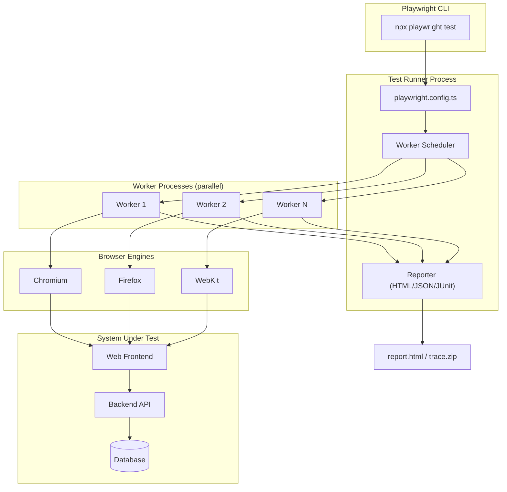

# 5.08 E2E Testing with Playwright

> End-to-end tests are the only tests that actually exercise the system the user uses. Everything below them on the testing pyramid is a faster, cheaper proxy for the truth. Playwright is the current best-in-class tool for that truth, driving real Chromium, Firefox, and WebKit engines in parallel, auto-waiting for the page to settle, and persisting authentication so a hundred tests do not have to log in a hundred times.

## 1. Purpose

End-to-end testing exists because every other test in your suite is, in the end, a lie of omission. A unit test lies by removing the dependencies. An integration test lies by replacing the network with an in-process call. A contract test lies by checking only the shape of the message, never the behavior it triggers. The end-to-end test alone drives a real browser against a real server against a real database, and it clicks the same buttons and reads the same DOM the user does. If it passes, you have positive evidence the system works as a whole. If it fails, you have positive evidence it does not. There is no other kind of test that gives you that level of confidence. This confidence is expensive, and the entire craft of end-to-end engineering is making that expense worth paying.

End-to-end testing matters because the failure modes that escape lower tiers of the pyramid are precisely the failure modes that hurt users most. A unit test cannot catch a misconfigured reverse proxy that strips the `Set-Cookie` header. An integration test cannot catch a Content Security Policy that blocks your analytics script and breaks your funnel. A contract test cannot catch a CSS regression that pushes the checkout button below the fold on Safari. These are real failures that ship to production every week at every company that has not invested in end-to-end coverage. The purpose of end-to-end testing is to catch exactly these integration-level, environment-level, and browser-level failures before they reach users.

Playwright is Microsoft's open-source end-to-end testing framework, first released in 2020 and built on the same team's earlier work on Puppeteer at Google. It drives real browser engines, not simulated ones, and it drives them in three flavors: Chromium (Google Chrome, Microsoft Edge, Brave, Opera, Vivaldi), Firefox (Mozilla's Gecko engine), and WebKit (Apple's Safari engine, used by Safari on macOS and iOS, and by all browsers on iOS). This is true cross-browser coverage. Other frameworks that claim cross-browser support often drive Chromium only and emulate other engines, or they run WebKit in a shim that does not match real Safari. Playwright ships patched builds of all three engines that expose the same automation protocol, so a single test runs against three real engines with no behavioral divergence from the automation layer.

Playwright's positioning in the ecosystem is deliberately distinct from Cypress. Cypress, for years, was the dominant modern end-to-end framework for JavaScript developers, prized for its time-travel debug UI and its developer ergonomics. But Cypress had three structural limitations that Playwright directly addressed. First, Cypress historically ran only in Chromium; Firefox and WebKit support arrived late and remained partial. Second, Cypress ran every test in a single browser tab in a single worker, which made parallelism across files awkward and across tests within a file impossible without paid tiers. Third, Cypress's commercial model gated features like parallel test execution, screenshot capture in CI, and flaky test detection behind a paid dashboard. Playwright, by contrast, ships cross-browser support on day one, runs tests in parallel by default using one OS process per worker, gates no feature behind a paid tier, and includes a full HTML reporter, trace viewer, and flaky detector in the open-source package.

The trade-off is the same trade-off every end-to-end tool makes: high confidence, high cost. End-to-end tests are slow because they drive a real browser, which spins up in hundreds of milliseconds, navigates pages over a real network, and waits for paint, layout, and script execution. End-to-end tests are flaky because they are sensitive to timing, to network conditions, to third-party scripts that load slowly, and to test data that drifts between runs. End-to-end tests are expensive to maintain because every UI change ripples into the test suite and requires selector or flow updates. A well-run end-to-end suite of two hundred tests should run in under ten minutes, fail less than one percent of the time on a clean environment, and require a few hours of maintenance per week. A poorly-run suite of the same size runs for forty minutes, fails randomly on twenty percent of runs, and consumes a full engineer. The difference is almost entirely in the patterns described in this note: locator discipline, auto-wait discipline, authentication state reuse, page object encapsulation, and ruthless scope.

The purpose of this note is to give you the complete picture. By the end you should be able to write a Playwright test with resilient locators, set up authentication state persistence so your suite skips re-login a hundred times, build a Page Object Model that survives UI churn, configure cross-browser testing across all three engines, and run the suite in parallel in CI with confidence. You should also understand the failure modes that make end-to-end suites rot, and the discipline required to keep a suite healthy over years rather than weeks.

## 2. Theory and Deep Dive

### 2.1 Browser Engines: Chromium, Firefox, WebKit

Playwright ships its own patched builds of three browser engines. When you run `npx playwright install`, the tool downloads these builds into a per-user cache directory, separate from any browser you have installed for daily browsing. This separation matters: Playwright controls the exact build it drives, so test runs are reproducible regardless of what you have installed locally. The three engines cover effectively every browser a real user might use.

Chromium is the engine behind Google Chrome, Microsoft Edge, Brave, Opera, Vivaldi, Arc, and most non-Firefox, non-Safari browsers. Driving Chromium covers the majority of desktop traffic globally. Playwright's Chromium build is the upstream open-source project, not branded Chrome, but for testing purposes it is functionally identical. If you need to test against branded Chrome specifically (for example, to verify a Chrome-only enterprise policy), Playwright supports channel selection with `channel: 'chrome'` to drive the installed Chrome instead of the bundled Chromium.

Firefox is Mozilla's engine, used by Firefox on desktop and by Firefox forks. Playwright's Firefox build is a patched version of upstream Firefox that exposes the Playwright automation protocol, which is a superset of the WebDriver BiDi protocol mixed with the older CDP-style commands. Firefox support in Playwright is real and not emulated: the engine layout, the JavaScript runtime (SpiderMonkey, not V8), and the networking stack are all genuine Firefox. This catches Firefox-specific bugs that Chromium-only suites miss, such as differences in CSS cascade interpretation, JavaScript feature support, and cookie handling.

WebKit is Apple's engine, used by Safari on macOS and iOS, by all browsers on iOS (because Apple's App Store policy requires every iOS browser to use WebKit under the hood), and by GNOME Web on Linux. Playwright's WebKit build is a patched version of upstream WebKit that runs on macOS, Linux, and Windows. Driving WebKit is the closest you can get to driving Safari without owning Apple hardware, and it catches the bugs that historically bite web developers most: WebKit's strict SameSite cookie defaults, its historically weaker JavaScript engine (JavaScriptCore, not V8), its particular handling of `100vh` on mobile, and its date parsing quirks.

The matrix of three engines, three operating systems, and multiple viewport sizes is what Playwright calls projects. A project is a named configuration that pins an engine, an OS expectation, viewport dimensions, locale, timezone, color scheme, and any other per-run property. A single `playwright.config.ts` file typically declares three to six projects: one per engine, optionally multiplied by mobile viewport. Each project runs independently, in parallel across workers, and reports its results into a unified HTML report.

### 2.2 Test Structure

A Playwright test is an async function that receives a fixture object containing at minimum a `page` (a fresh browser tab) and a `browser` (the browser instance). The simplest test uses only `page`. The test calls Playwright's locator and assertion APIs to drive the page and verify outcomes. The structure is identical in JavaScript and TypeScript; the only difference is the type annotations TypeScript adds.

The minimal shape is `test('name', async ({ page }) => { ... })`. Inside the callback you navigate with `page.goto(url)`, locate elements with `page.locator(selector)` or `page.getByRole(...)`, interact with `click()`, `fill()`, `press()`, and assert with `expect(locator).toHaveText(...)` or `expect(page).toHaveURL(...)`. Playwright's `expect` is automatically async-aware: it retries the assertion up to a configurable timeout (default five seconds), which gives the page time to settle without you writing manual waits.

A test file is a Node module that imports `test` and `expect` from `@playwright/test`. Multiple tests in the same file share no state by default: each gets a fresh `page`, and Playwright's worker isolation ensures tests in the same file may run in different worker processes depending on the project configuration. If you need setup that runs once per file, use `test.beforeAll`. If you need setup that runs before every test, use `test.beforeEach`. Teardown is symmetric: `test.afterEach` and `test.afterAll`.

### 2.3 Locators

Locators are the central abstraction in Playwright. A locator is a description of how to find an element, not the element itself. This is a critical distinction from older frameworks like Selenium WebDriver, where `findElement` returned a `WebElement` reference that could go stale if the DOM re-rendered. A Playwright locator stays valid across re-renders: each time you call an action on the locator, Playwright re-resolves the description against the current DOM. This is what makes locators resilient to React, Vue, and Svelte re-rendering that destroys and recreates DOM nodes.

Playwright's preferred locators are semantic, not structural. The recommended order of preference is:

1. `page.getByRole(role, { name: ... })` - finds by ARIA role and accessible name. This is the most resilient because it survives CSS restructuring as long as the element remains semantically the same. A button labeled "Submit" is found by `getByRole('button', { name: 'Submit' })` regardless of whether the button is a `<button>`, an `<a role="button">`, or a `<div role="button" tabindex="0">`.
2. `page.getByLabel(labelText)` - finds a form control by its associated label. This is the second most resilient for form fields.
3. `page.getByPlaceholder(text)` - finds by placeholder, acceptable when no label is available.
4. `page.getByText(text)` - finds by visible text, useful for content assertions and for clicking non-control elements.
5. `page.getByTestId(id)` - finds by `data-testid` attribute, the escape hatch when semantic locators are not unique enough.
6. `page.locator(cssSelector)` - CSS selectors, the least resilient option and the last resort. Use only when nothing else works, such as finding the third row of a dynamic table.

The reason role-based locators are preferred is not aesthetic: it is because they reflect how users actually perceive the page. A screen reader user navigates by role and label, not by CSS class. A keyboard user tabs through controls by role. By writing tests that find elements the way users do, you implicitly test the accessibility of your page, and your tests survive visual redesigns that change CSS but not semantics.

### 2.4 Auto-Waiting

Auto-waiting is Playwright's most powerful productivity feature. When you call `await locator.click()`, Playwright does not click immediately. It first performs a series of actionability checks: it waits for the element to be attached to the DOM, to be visible (not `display: none`, not `visibility: hidden`, has non-zero size), to be stable (not animating), to receive events (not covered by another element), and to be enabled (not `disabled`). Only when all checks pass does it click. If the checks do not pass within the action timeout (default thirty seconds), it throws a readable error explaining which check failed.

This eliminates the entire class of manual wait code that older frameworks required. You never write `await page.waitForTimeout(500)` to "give the page time to load." You never write `await page.waitForSelector('.button')` followed by `await page.click('.button')`. You write `await page.getByRole('button', { name: 'Submit' }).click()` and Playwright handles the waiting. If your test fails, it fails because the element genuinely never became actionable, not because your wait was too short.

Auto-waiting applies to all action methods: `click`, `fill`, `press`, `check`, `selectOption`, `hover`, `focus`, and so on. It does not apply to navigations in the same way; for navigations, Playwright waits for the `load` event by default, and you can configure this with `waitUntil: 'networkidle'` or `'domcontentloaded'` to be stricter or laxer. Assertions made with `expect` also auto-wait: `expect(locator).toBeVisible()` retries for up to five seconds by default, so you do not need to write a manual wait before an assertion.

The single biggest source of flaky Playwright tests is developers who do not trust auto-waiting and add manual waits. Manual waits are wrong by construction: a `waitForTimeout(1000)` either sleeps too long (slowing the suite) or too short (causing flakiness when the network is slow). A `waitForSelector('.foo')` followed by `click('.foo')` is redundant because `click` already waits for the selector. The correct pattern is to write the action directly and let Playwright handle the timing.

### 2.5 Authentication State Persistence

Real applications require authentication, and re-logging in before every test is the second biggest source of slow end-to-end suites. A login flow that takes three seconds against a real backend, run before each of two hundred tests, costs ten minutes of pure login time per suite run. The solution is to authenticate once, save the resulting browser state (cookies and localStorage), and reuse that state across all tests that need authentication.

Playwright exposes this through `storageState`. The pattern is: run a single setup test that logs in through the UI, then call `await page.context().storageState({ path: 'auth-state.json' })` to serialize the current browser context's cookies, localStorage, and sessionStorage (depending on configuration) to a JSON file. Subsequent tests, or entire projects, declare `storageState: 'auth-state.json'` in their fixture or project configuration, and Playwright initializes each new browser context with that state already populated. The login flow runs exactly once per suite run, not once per test.

The state file is plain JSON. It contains arrays of cookies (each with name, value, domain, path, expires, httpOnly, secure, sameSite), and an `origins` array mapping each origin to its localStorage entries. You can inspect it, you can commit it (though you should not, because it contains session tokens), and you can generate it programmatically without going through the UI by injecting cookies directly. The programmatic approach is faster and more deterministic: you call your backend's login API to get a session token, then construct the storageState JSON with the cookie set, and write it to disk. No UI navigation, no form filling, no auto-wait. This is the recommended pattern for production suites.

Playwright's `globalSetup` and `globalTeardown` configuration options run a single Node script before and after the entire suite. The global setup script is the natural place to generate the storageState file: it runs once, before any test, and the file is ready by the time the first test starts. This separates authentication concerns from test concerns entirely. Your tests assume an authenticated user exists; they do not care how that user got authenticated.

### 2.6 Page Object Model

The Page Object Model is a structural pattern, not a Playwright feature. It encapsulates the structure and behavior of a page (or a component) behind a class whose methods represent user-facing actions. A `LoginPage` exposes `login(email, password)`; a `DashboardPage` exposes `openProject(name)` and `assertProjectVisible(name)`. The test code reads as a sequence of user actions: `await loginPage.login('a@b.com', 'pass'); await dashboardPage.openProject('Acme');`. The selectors, the waits, and the navigation details are hidden inside the page object.

The benefit is reuse. A login flow appears in dozens of tests. If the login form's selector changes, you update one method in `LoginPage`, not dozens of test files. The benefit is also readability: tests read like user stories, not like DOM manipulation. And the benefit is type safety in TypeScript: a `LoginPage` class can declare its methods with typed parameters, so the compiler catches a typo in an email field name before the test runs.

A page object holds a `Page` reference (or a `Locator` for component-scoped objects) and exposes methods that perform actions and return either void, a value, or another page object representing the resulting page. The navigation between page objects mirrors the user's navigation through the application: `loginPage.login()` returns a `DashboardPage`, `dashboardPage.openProject()` returns a `ProjectPage`. This makes the test read like a script of user intent.

The anti-pattern is to put assertions inside page objects. Page objects should expose state queries (`isProjectVisible(name): Promise<boolean>`) and let the test assert on the result. Mixing assertions into page objects couples the page object to a specific test's expectations and reduces reuse. The disciplined split is: page objects do actions and queries, tests do assertions.

### 2.7 Fixtures

Playwright's fixture system is the mechanism that gives each test its `page`, its `context`, its `browser`, and any custom dependencies. A fixture is a function that takes the previous fixture's value and a `use` callback, sets up the dependency, calls `use` to hand it to the test, and tears down after the test. Fixtures compose: you can declare a custom fixture that depends on `page` and provides an authenticated `LoginPage` instance, and tests that opt into that fixture get the page object pre-configured.

Custom fixtures are how you avoid boilerplate in tests. Instead of every authenticated test starting with `const loginPage = new LoginPage(page); await loginPage.login(...)`, you declare a fixture `authenticatedPage` that does this setup, and tests that depend on `authenticatedPage` start with the page object already logged in. This is the cleanest way to share setup logic across many tests without copy-paste or before-each hooks.

Fixtures are typed in TypeScript. When you extend the base `test` object with custom fixtures, the resulting `test` variable has a type that knows about your fixtures, so the compiler autocompletes fixture names in test signatures. This is a substantial ergonomic win over Cypress's `cy.customCommand` pattern, which is untyped by default.

### 2.8 Parallel Execution

Playwright runs tests in parallel by default. Each test file runs in its own worker process, and within a worker, tests run sequentially. Workers are OS processes, not threads, so a crash in one worker does not affect others. The default number of workers is half the CPU count on local runs and one on CI (where you typically shard across multiple CI runners instead).

Within a file, tests run sequentially by default because they often share a Page Object Model setup that is expensive to construct. If your tests are independent within a file, you can annotate `test.describe.parallel` to run them in parallel across workers, or `test.describe.configure({ mode: 'parallel' })`. Serial mode, `test.describe.serial`, forces tests to run in order even across retries, which is useful for tests that depend on a shared stateful setup.

Parallel execution is the primary mechanism Playwright uses to keep suite runtime acceptable. A suite of three hundred tests on a single worker might take thirty minutes. On eight workers, it takes under four. The constraint is that tests must be independent: no test may depend on the side effects of another test. This is good test hygiene regardless of parallelism, but parallelism makes it mandatory.

### 2.9 Architecture



The CLI loads the config, the config tells the scheduler which projects to run and how many workers to spawn, each worker launches a browser engine and runs its assigned test files serially, each test drives its engine against the system under test, and the reporter aggregates results into a unified output.

## 3. Mental Models

End-to-end testing is "drive a real browser, click like a user, assert what they see." Everything else is implementation detail. If you remember only this, you will write better end-to-end tests than developers who memorize the Playwright API but reach for CSS selectors first. The user does not care that your button has class `btn-primary`; they care that the button labeled "Submit" is visible and clickable. Test what the user sees and does, not what the DOM tree looks like.

Playwright is "the modern Puppeteer." The same team wrote both, and the API shows the lineage. Puppeteer was a library for driving Chromium; Playwright is a framework for driving three engines, with built-in test runner, assertion library, fixture system, and reporter. If you know Puppeteer, you know eighty percent of Playwright's API. The remaining twenty percent is the test runner, the locators (which Puppeteer lacks; you use `page.$` selectors), and the auto-waiting assertions.

A locator is "find the element, resiliently." The locator itself is lazy: it is a query description, not a DOM reference. Each action re-runs the query against the current DOM. This is what makes locators survive React re-renders, where the underlying DOM node is destroyed and recreated. Older frameworks returned a stale reference and your test would fail with "element not attached to DOM." Playwright locators never go stale because they are not references.

Auto-wait is "Playwright waits, you don't." Every action method waits for the element to be actionable before acting. Every `expect` retries the assertion up to the assertion timeout. The only legitimate reason to write `waitFor*` is when you are waiting for something that is not an actionability precondition, such as a network request to complete or a specific URL to be reached. In every other case, write the action directly.

storageState is "save the login, skip re-login every test." Authenticate once per suite run, serialize the browser context's cookies and localStorage to a JSON file, and reuse it for every test that needs an authenticated user. This turns a three-second login per test into a one-time three-second cost for the entire suite. The savings compound: a two-hundred-test suite saves ten minutes of login time per run.

Page Object is "encapsulate the page, reuse across tests." A page object is a class that knows the structure and behavior of one page. Tests use page objects instead of raw selectors, so when the page's structure changes, you update one file instead of dozens. The test code reads as user actions, not DOM manipulation.

The fixture is "the dependency injection of end-to-end tests." A fixture is a setup function that provides a value to the test, runs the test, and tears down. Custom fixtures let you compose setup logic: an `authenticatedPage` fixture builds on the `page` fixture and provides a pre-authenticated page object. Tests opt into fixtures by listing them in their destructuring parameter.

The project is "the cross-browser axis." A project is a named configuration that pins engine, viewport, locale, and other per-run properties. Declaring three projects (chromium, firefox, webkit) makes every test run three times, once per engine. Declaring six projects (three engines times two viewports) makes every test run six times. Projects run in parallel across workers, so the wall-clock cost scales with the worker count, not the project count.

## 4. Real-World Use Cases

The most common real-world use case is the critical user flow: signup, login, checkout, password reset, account deletion. These flows are the conversion paths of the business, and a regression here directly costs revenue. A typical suite covers the top three to five flows end-to-end and covers the rest with integration tests. The decision rule is: if breaking this flow would lose the company money in the next twenty-four hours, it needs an end-to-end test. If breaking it would only annoy users, an integration test suffices.

Cross-browser regression testing is the second use case. A change to a CSS grid property might render correctly in Chromium (which uses the Blink layout engine) and break in WebKit (which uses the WebKit layout engine, with historically different grid implementation). A change to a JavaScript feature might work in V8 (Chromium) and fail in SpiderMonkey (Firefox) if you used a syntax SpiderMonkey has not yet shipped. Running the same end-to-end suite against three engines catches these regressions before they ship. The cost is roughly triple the wall-clock time of a single-engine run, mitigated by parallel workers.

Visual regression testing is the third use case. Playwright can capture a screenshot of a page or element and compare it pixel-by-pixel against a baseline. The `toHaveScreenshot()` assertion handles this: the first run captures the baseline, subsequent runs compare against it, and a difference of more than a configurable threshold (default zero pixels, often set to a small percentage to absorb anti-aliasing differences) fails the test. Visual regression catches CSS changes that break layout but not behavior: a button that moved ten pixels, a font that changed weight, a color shift that hurts accessibility.

Performance testing is an emerging use case. Playwright can collect performance metrics from the browser (page load time, time to first byte, largest contentful paint, cumulative layout shift) and assert on them. This is not load testing in the sense of thousands of concurrent users; it is single-user performance regression testing, ensuring that a change does not slow down the page. For load testing, pair Playwright with a tool like k6 or Artillery.

Accessibility testing is the fifth use case. The `@axe-core/playwright` package integrates the axe accessibility engine into Playwright tests. After navigating to a page, you run `await AxeBuilder({ page }).analyze()` and assert that the returned violations array is empty. This catches WCAG violations that would otherwise require manual audit: missing alt text, insufficient color contrast, missing form labels, ARIA misuse. Running this on every page in the end-to-end suite gives continuous accessibility coverage.

Authentication flow testing is a sixth, less obvious use case. End-to-end tests are the only tests that can verify the full authentication lifecycle: password login, multi-factor authentication, session refresh, token rotation, logout, session timeout, and re-authentication. Integration tests can verify the API layer, but only end-to-end tests verify that the cookie is set correctly, that the redirect after login works, that the session is persisted across tabs, and that logout actually clears the cookie in the browser.

Email and SMS verification flows are a seventh use case. Many applications send a one-time code to email or SMS during signup or password reset. End-to-end testing these flows requires intercepting the email or SMS, which Playwright supports through integrations with services like Mailosaur, Testmail, or through mocking the email service in test environments. The test triggers the email send, polls the email service for the message, extracts the code, and fills it into the form. This is the only way to verify the full signup flow works for a real user.

## 5. Code Examples

### 5.1 Example A — Minimal and Conceptual

A minimal Playwright test exercises a single user flow against a running application. The example below tests a login flow: navigate to the login page, fill the email and password fields, click the submit button, and assert that the dashboard is visible. The JavaScript and TypeScript versions are structurally identical; the TypeScript version adds type annotations that the compiler checks at build time.

The JavaScript version:

```js
// tests/login.spec.js
const { test, expect } = require('@playwright/test');

test('user can log in with valid credentials', async ({ page }) => {
  await page.goto('/login');

  await page.getByLabel('Email').fill('alice@example.com');
  await page.getByLabel('Password').fill('correct-horse-battery-staple');
  await page.getByRole('button', { name: 'Sign in' }).click();

  await expect(page).toHaveURL('/dashboard');
  await expect(page.getByRole('heading', { name: 'Welcome, Alice' })).toBeVisible();
});
```

The TypeScript version:

```ts
// tests/login.spec.ts
import { test, expect, Page } from '@playwright/test';

test('user can log in with valid credentials', async ({ page }: { page: Page }) => {
  await page.goto('/login');

  await page.getByLabel('Email').fill('alice@example.com');
  await page.getByLabel('Password').fill('correct-horse-battery-staple');
  await page.getByRole('button', { name: 'Sign in' }).click();

  await expect(page).toHaveURL('/dashboard');
  await expect(page.getByRole('heading', { name: 'Welcome, Alice' })).toBeVisible();
});
```

The corresponding config file declares which engines to run and where the dev server lives.

JavaScript config:

```js
// playwright.config.js
const { defineConfig, devices } = require('@playwright/test');

module.exports = defineConfig({
  testDir: './tests',
  timeout: 30000,
  expect: { timeout: 5000 },
  fullyParallel: true,
  reporter: [['html'], ['list']],
  use: {
    baseURL: 'http://localhost:3000',
    trace: 'on-first-retry',
    screenshot: 'only-on-failure',
  },
  projects: [
    { name: 'chromium', use: { ...devices['Desktop Chrome'] } },
    { name: 'firefox', use: { ...devices['Desktop Firefox'] } },
    { name: 'webkit', use: { ...devices['Desktop Safari'] } },
  ],
  webServer: {
    command: 'npm run dev',
    url: 'http://localhost:3000',
    reuseExistingServer: !process.env.CI,
    timeout: 60000,
  },
});
```

TypeScript config:

```ts
// playwright.config.ts
import { defineConfig, devices } from '@playwright/test';

export default defineConfig({
  testDir: './tests',
  timeout: 30000,
  expect: { timeout: 5000 },
  fullyParallel: true,
  reporter: [['html'], ['list']],
  use: {
    baseURL: 'http://localhost:3000',
    trace: 'on-first-retry',
    screenshot: 'only-on-failure',
  },
  projects: [
    { name: 'chromium', use: { ...devices['Desktop Chrome'] } },
    { name: 'firefox', use: { ...devices['Desktop Firefox'] } },
    { name: 'webkit', use: { ...devices['Desktop Safari'] } },
  ],
  webServer: {
    command: 'npm run dev',
    url: 'http://localhost:3000',
    reuseExistingServer: !process.env.CI,
    timeout: 60000,
  },
});
```

The `webServer` block tells Playwright to start the dev server before the suite and wait for it to be ready. On CI it starts a fresh server; locally it reuses one already running, which keeps the inner loop fast during development.

### 5.2 Example B — Production-Grade

A production-grade suite has four moving parts: a global setup that authenticates and saves storage state, a Page Object Model that encapsulates the application's pages, a custom fixture that hands authenticated page objects to tests, and a config that runs the suite across all three engines in parallel with retries and trace capture.

The Page Object Model, JavaScript version:

```js
// pages/login-page.js
class LoginPage {
  constructor(page) {
    this.page = page;
    this.emailInput = page.getByLabel('Email');
    this.passwordInput = page.getByLabel('Password');
    this.submitButton = page.getByRole('button', { name: 'Sign in' });
    this.errorMessage = page.getByRole('alert');
  }

  async goto() {
    await this.page.goto('/login');
    return this;
  }

  async login(email, password) {
    await this.emailInput.fill(email);
    await this.passwordInput.fill(password);
    await this.submitButton.click();
    return this;
  }

  async expectErrorMessage(text) {
    await expect(this.errorMessage).toContainText(text);
  }
}

module.exports = { LoginPage };
```

The Page Object Model, TypeScript version:

```ts
// pages/login-page.ts
import { Page, Locator, expect } from '@playwright/test';

export class LoginPage {
  readonly page: Page;
  readonly emailInput: Locator;
  readonly passwordInput: Locator;
  readonly submitButton: Locator;
  readonly errorMessage: Locator;

  constructor(page: Page) {
    this.page = page;
    this.emailInput = page.getByLabel('Email');
    this.passwordInput = page.getByLabel('Password');
    this.submitButton = page.getByRole('button', { name: 'Sign in' });
    this.errorMessage = page.getByRole('alert');
  }

  async goto(): Promise<this> {
    await this.page.goto('/login');
    return this;
  }

  async login(email: string, password: string): Promise<DashboardPage> {
    await this.emailInput.fill(email);
    await this.passwordInput.fill(password);
    await this.submitButton.click();
    return new DashboardPage(this.page);
  }

  async expectErrorMessage(text: string): Promise<void> {
    await expect(this.errorMessage).toContainText(text);
  }
}

import { DashboardPage } from './dashboard-page';
```

The DashboardPage object, JavaScript version:

```js
// pages/dashboard-page.js
class DashboardPage {
  constructor(page) {
    this.page = page;
    this.heading = page.getByRole('heading', { level: 1 });
    this.projectLinks = page.getByRole('link', { name: /Open project .*/ });
    this.newProjectButton = page.getByRole('button', { name: 'New project' });
  }

  async expectLoaded() {
    await expect(this.page).toHaveURL(/\/dashboard/);
    await expect(this.heading).toBeVisible();
  }

  async openProject(name) {
    await this.page.getByRole('link', { name: name }).click();
  }

  async createProject(name) {
    await this.newProjectButton.click();
    await this.page.getByLabel('Project name').fill(name);
    await this.page.getByRole('button', { name: 'Create' }).click();
  }
}

module.exports = { DashboardPage };
```

The DashboardPage object, TypeScript version:

```ts
// pages/dashboard-page.ts
import { Page, Locator, expect } from '@playwright/test';

export class DashboardPage {
  readonly page: Page;
  readonly heading: Locator;
  readonly projectLinks: Locator;
  readonly newProjectButton: Locator;

  constructor(page: Page) {
    this.page = page;
    this.heading = page.getByRole('heading', { level: 1 });
    this.projectLinks = page.getByRole('link', { name: /Open project .*/ });
    this.newProjectButton = page.getByRole('button', { name: 'New project' });
  }

  async expectLoaded(): Promise<void> {
    await expect(this.page).toHaveURL(/\/dashboard/);
    await expect(this.heading).toBeVisible();
  }

  async openProject(name: string): Promise<void> {
    await this.page.getByRole('link', { name: name }).click();
  }

  async createProject(name: string): Promise<void> {
    await this.newProjectButton.click();
    await this.page.getByLabel('Project name').fill(name);
    await this.page.getByRole('button', { name: 'Create' }).click();
  }
}
```

The global setup that authenticates and saves storage state, JavaScript version:

```js
// global-setup.js
const { chromium, expect } = require('@playwright/test');
const { LoginPage } = require('./pages/login-page');

async function globalSetup(config) {
  const { baseURL, storageState } = config.projects[0].use;
  const browser = await chromium.launch();
  const context = await browser.newContext({ baseURL });
  const page = await context.newPage();

  const loginPage = new LoginPage(page);
  await loginPage.goto();
  await loginPage.login(
    process.env.e2eUserEmail,
    process.env.e2eUserPassword,
  );

  await expect(page).toHaveURL(/\/dashboard/);
  await context.storageState({ path: storageState });
  await browser.close();
}

module.exports = globalSetup;
```

The global setup, TypeScript version:

```ts
// global-setup.ts
import { chromium, FullConfig, expect } from '@playwright/test';
import { LoginPage } from './pages/login-page';

async function globalSetup(config: FullConfig): Promise<void> {
  const { baseURL, storageState } = config.projects[0].use;
  const browser = await chromium.launch();
  const context = await browser.newContext({ baseURL });
  const page = await context.newPage();

  const loginPage = new LoginPage(page);
  await loginPage.goto();
  await loginPage.login(
    process.env.e2eUserEmail!,
    process.env.e2eUserPassword!,
  );

  await expect(page).toHaveURL(/\/dashboard/);
  await context.storageState({ path: storageState });
  await browser.close();
}

export default globalSetup;
```

The custom fixture that hands authenticated page objects to tests, JavaScript version:

```js
// fixtures.js
const { test as base, expect } = require('@playwright/test');
const { LoginPage } = require('./pages/login-page');
const { DashboardPage } = require('./pages/dashboard-page');

const test = base.extend({
  authenticatedPage: async ({ page }, use) => {
    const dashboard = new DashboardPage(page);
    await page.goto('/dashboard');
    await dashboard.expectLoaded();
    await use(dashboard);
  },
});

module.exports = { test, expect };
```

The custom fixture, TypeScript version:

```ts
// fixtures.ts
import { test as base, expect, Page } from '@playwright/test';
import { LoginPage } from './pages/login-page';
import { DashboardPage } from './pages/dashboard-page';

type AuthFixtures = {
  authenticatedPage: DashboardPage;
};

export const test = base.extend<AuthFixtures>({
  authenticatedPage: async ({ page }, use) => {
    const dashboard = new DashboardPage(page);
    await page.goto('/dashboard');
    await dashboard.expectLoaded();
    await use(dashboard);
  },
});

export { expect };
```

A test that uses the fixture, JavaScript version:

```js
// tests/dashboard.spec.js
const { test, expect } = require('../fixtures');

test('user can create a project', async ({ authenticatedPage }) => {
  const projectName = `Test Project ${Date.now()}`;
  await authenticatedPage.createProject(projectName);
  await expect(authenticatedPage.page.getByText(projectName)).toBeVisible();
});

test('user can open an existing project', async ({ authenticatedPage }) => {
  await authenticatedPage.openProject('Seed Project');
  await expect(authenticatedPage.page).toHaveURL(/\/projects\/.+/);
});
```

A test that uses the fixture, TypeScript version:

```ts
// tests/dashboard.spec.ts
import { test, expect } from '../fixtures';

test('user can create a project', async ({ authenticatedPage }) => {
  const projectName = `Test Project ${Date.now()}`;
  await authenticatedPage.createProject(projectName);
  await expect(authenticatedPage.page.getByText(projectName)).toBeVisible();
});

test('user can open an existing project', async ({ authenticatedPage }) => {
  await authenticatedPage.openProject('Seed Project');
  await expect(authenticatedPage.page).toHaveURL(/\/projects\/.+/);
});
```

The production config that wires global setup, storage state, and cross-browser projects, JavaScript version:

```js
// playwright.config.js
const { defineConfig, devices } = require('@playwright/test');

module.exports = defineConfig({
  testDir: './tests',
  timeout: 30000,
  expect: { timeout: 5000 },
  fullyParallel: true,
  forbidOnly: !!process.env.CI,
  retries: process.env.CI ? 2 : 0,
  workers: process.env.CI ? 1 : undefined,
  reporter: process.env.CI
    ? [['github'], ['html', { open: 'never' }], ['junit', { outputFile: 'results.xml' }]]
    : [['list'], ['html']],
  globalSetup: require.resolve('./global-setup'),
  use: {
    baseURL: process.env.baseUrl || 'http://localhost:3000',
    trace: 'retain-on-failure',
    screenshot: 'only-on-failure',
    video: 'retain-on-failure',
    storageState: 'auth-state.json',
  },
  projects: [
    {
      name: 'setup',
      testMatch: /.*\.setup\.js/,
      use: { ...devices['Desktop Chrome'] },
    },
    {
      name: 'chromium',
      dependencies: ['setup'],
      use: { ...devices['Desktop Chrome'] },
    },
    {
      name: 'firefox',
      dependencies: ['setup'],
      use: { ...devices['Desktop Firefox'] },
    },
    {
      name: 'webkit',
      dependencies: ['setup'],
      use: { ...devices['Desktop Safari'] },
    },
    {
      name: 'mobile-chrome',
      dependencies: ['setup'],
      use: { ...devices['Pixel 5'] },
    },
    {
      name: 'mobile-safari',
      dependencies: ['setup'],
      use: { ...devices['iPhone 13'] },
    },
  ],
  webServer: {
    command: 'npm run dev',
    url: 'http://localhost:3000',
    reuseExistingServer: !process.env.CI,
    timeout: 120000,
  },
});
```

The production config, TypeScript version:

```ts
// playwright.config.ts
import { defineConfig, devices } from '@playwright/test';

export default defineConfig({
  testDir: './tests',
  timeout: 30000,
  expect: { timeout: 5000 },
  fullyParallel: true,
  forbidOnly: !!process.env.CI,
  retries: process.env.CI ? 2 : 0,
  workers: process.env.CI ? 1 : undefined,
  reporter: process.env.CI
    ? [['github'], ['html', { open: 'never' }], ['junit', { outputFile: 'results.xml' }]]
    : [['list'], ['html']],
  globalSetup: require.resolve('./global-setup'),
  use: {
    baseURL: process.env.baseUrl ?? 'http://localhost:3000',
    trace: 'retain-on-failure',
    screenshot: 'only-on-failure',
    video: 'retain-on-failure',
    storageState: 'auth-state.json',
  },
  projects: [
    {
      name: 'setup',
      testMatch: /.*\.setup\.ts/,
      use: { ...devices['Desktop Chrome'] },
    },
    {
      name: 'chromium',
      dependencies: ['setup'],
      use: { ...devices['Desktop Chrome'] },
    },
    {
      name: 'firefox',
      dependencies: ['setup'],
      use: { ...devices['Desktop Firefox'] },
    },
    {
      name: 'webkit',
      dependencies: ['setup'],
      use: { ...devices['Desktop Safari'] },
    },
    {
      name: 'mobile-chrome',
      dependencies: ['setup'],
      use: { ...devices['Pixel 5'] },
    },
    {
      name: 'mobile-safari',
      dependencies: ['setup'],
      use: { ...devices['iPhone 13'] },
    },
  ],
  webServer: {
    command: 'npm run dev',
    url: 'http://localhost:3000',
    reuseExistingServer: !process.env.CI,
    timeout: 120000,
  },
});
```

The CI workflow that runs the suite on every push to main and on every branch push (which covers pull request branches), JavaScript and TypeScript agnostic (a single workflow file):

```yaml
# .github/workflows/e2e.yml
name: E2E
on:
  push:
    branches: [main, develop, 'feature/**']
jobs:
  test:
    runs-on: ubuntu-latest
    timeout-minutes: 30
    strategy:
      fail-fast: false
      matrix:
        shardIndex: [1, 2, 3, 4]
        shardTotal: [4]
    steps:
      - uses: actions/checkout@v4
      - uses: actions/setup-node@v4
        with:
          node-version: 20
          cache: 'npm'
      - run: npm ci
      - run: npx playwright install --with-deps
      - run: npx playwright test --shard=${{ matrix.shardIndex }}/${{ matrix.shardTotal }}
        env:
          baseUrl: http://localhost:3000
          e2eUserEmail: ${{ secrets.e2eUserEmail }}
          e2eUserPassword: ${{ secrets.e2eUserPassword }}
      - uses: actions/upload-artifact@v4
        if: always()
        with:
          name: playwright-report-shard-${{ matrix.shardIndex }}
          path: playwright-report/
          retention-days: 14
```

This workflow shards the suite across four parallel runners, each handling one quarter of the tests. The total wall-clock time is roughly one quarter of a single-runner run, plus the cost of installing browsers and dependencies once per runner. The HTML report is uploaded as an artifact for every shard, regardless of pass or fail, so developers can download and inspect failures.

## 6. Common Mistakes and Anti-Patterns

### 6.1 Brittle Selectors

The single most common mistake in Playwright suites is reaching for CSS selectors when semantic locators would work. A test that finds the submit button with `page.locator('.btn-primary.submit-form')` is fragile: any refactor that changes the class name breaks the test, even if the button's semantic role and label are unchanged. A test that finds the same button with `page.getByRole('button', { name: 'Submit' })` survives the refactor because it depends on the user-facing semantics, not the developer-facing CSS architecture. The fix is to default to `getByRole` and `getByLabel` and treat CSS selectors as a last resort.

### 6.2 No Auto-Wait Discipline

The second most common mistake is adding manual waits. A test that does `await page.waitForTimeout(1000); await page.click('#submit');` is flaky by construction: the timeout is either too long (slowing the suite) or too short (failing when the network is slow). The correct pattern is `await page.getByRole('button', { name: 'Submit' }).click()`, which auto-waits for the button to be actionable. The only legitimate use of `waitForTimeout` is debugging, and even then it should be removed before the test ships. The fix is to trust auto-waiting and remove every manual wait.

### 6.3 Testing Too Much Per Test

The third mistake is the kitchen-sink test: one test that logs in, navigates to the dashboard, creates a project, edits it, deletes it, logs out, and verifies the login page reappears. This test takes thirty seconds, fails for any of a dozen unrelated reasons, and gives no signal about which behavior broke when it fails. The correct pattern is one user action per test: a test for login, a test for project creation, a test for project editing, a test for project deletion. Each test is short, focused, and when it fails, the failure name tells you what broke. The fix is to decompose kitchen-sink tests into atomic tests.

### 6.4 No Authentication State Reuse

The fourth mistake is re-logging in before every test. A suite of two hundred tests with a three-second login per test burns ten minutes per run on pure login overhead. The fix is `storageState`: authenticate once in a global setup, save the resulting browser context state to a JSON file, and configure every authenticated test (or every project) to reuse that state. The login flow runs once per suite, not once per test. The savings are dramatic and the fix is mechanical.

### 6.5 Testing Everything End-to-End

The fifth mistake is treating end-to-end as the default test type. A team that writes end-to-end tests for every behavior, including pure logic that has no UI surface, ends up with a suite that takes forty minutes to run and is flaky because every test depends on the full stack. The fix is to follow the testing trophy: write unit tests for pure logic, integration tests for component composition, and reserve end-to-end tests for the critical user flows that genuinely require the full stack. A suite of fifty focused end-to-end tests is more valuable than a suite of five hundred kitchen-sink end-to-end tests.

### 6.6 No Parallelism

The sixth mistake is running tests sequentially. A suite of three hundred tests on a single worker takes thirty minutes; on eight workers it takes four. The fix is to ensure `fullyParallel: true` is set in the config, to design tests so they are independent (no shared mutable state, no test ordering dependencies), and to use the parallel describe block when a single file contains independent tests. The fix is also to shard across CI runners when the single-machine parallelism ceiling is hit.

### 6.7 Ignoring Flaky Tests

The seventh mistake is letting flaky tests accumulate. A test that fails once a week is not a flaky test; it is a bug in the test that you have not fixed yet. Every flaky test degrades trust in the suite: developers start ignoring red builds, and real failures slip through. The fix is a zero-tolerance policy for flakiness. When a test flakes, you either fix it immediately, quarantine it (mark it skipped with a ticket to fix), or delete it. You do not let it sit in the suite failing intermittently. Playwright's `retries` config is a safety net for genuinely transient failures (network blips, third-party outages), not a license to ignore flakiness.

### 6.8 Coupling Tests to Implementation

The eighth mistake is testing implementation details. A test that asserts on a specific CSS class (`expect(page.locator('.btn-primary')).toBeVisible()`) or on internal component state (`expect(window.appState.user).toEqual(...)`) is coupled to the implementation. When the implementation changes, the test breaks even though the behavior is unchanged. The fix is to test behavior: assert on what the user sees (visible text, URLs, form values), not on how the implementation achieved it. The user does not care about CSS classes; they care that the button is visible and clickable.

### 6.9 Hardcoded Test Data

The ninth mistake is hardcoding test data that drifts. A test that creates a project named "Acme" and asserts on "Acme" will fail when another test creates a project named "Acme" and clutters the dashboard. The fix is to generate unique test data per run: `const projectName = 'Test Project ' + Date.now();` or use a UUID. Pair this with a teardown that cleans up created data, or with a test database that is reset between runs, to keep tests hermetic.

### 6.10 No Trace Collection on Failure

The tenth mistake is not collecting traces. A test that fails on CI with no trace artifact is impossible to debug: you see "button not visible" but not why. The fix is `trace: 'retain-on-failure'` (or `'on-first-retry'`) in the config, which records a full trace of every failed test: DOM snapshots at each step, network requests, console logs, screenshots. The trace viewer (`npx playwright show-trace trace.zip`) lets you scrub through the test execution and see exactly what happened. The cost is disk space and a small runtime overhead, both worth it.

## 7. Best Practices and Design Patterns

### 7.1 Use Role-Based Locators

Default to `page.getByRole(role, { name: ... })` for interactive elements and `page.getByText(text)` for content assertions. These locators reflect how users perceive the page and survive CSS refactors. Reserve CSS selectors for cases where semantic locators are not unique enough, such as finding the third row of a dynamic table, and even there prefer `getByRole` with a more specific name filter.

### 7.2 Trust Auto-Waiting

Never write `waitForTimeout`. Never write `waitForSelector` followed by an action on the same selector. Write the action directly and let Playwright handle the timing. The only legitimate uses of explicit waits are `waitForURL` (when you need to assert a navigation happened), `waitForResponse` (when you need to assert a network call completed), and `waitForFunction` (when you need to assert an arbitrary condition in the page that is not exposed by an assertion).

### 7.3 Keep Tests Small and Atomic

One user action per test. A test should be readable in thirty seconds and should fail for one reason. If a test does login, navigation, and CRUD, split it into three tests. The aggregate runtime is similar (each test pays a small setup cost), but the debuggability is dramatically better.

### 7.4 Use storageState for Authentication

Authenticate once in a global setup, save the state to a JSON file, and reuse it across all authenticated tests. This is the single biggest performance win available in a Playwright suite. For tests that need different users (admin vs regular user, multi-tenant), generate multiple storage state files and use project dependencies to set up each one.

### 7.5 Run in Parallel

Set `fullyParallel: true`. Design tests to be independent: no shared mutable state, no test ordering dependencies, unique test data per run. Use `test.describe.serial` only when tests genuinely must run in order (for example, a multi-step wizard where each step depends on the previous). Shard across CI runners when single-machine parallelism is exhausted.

### 7.6 Run Only Critical Flows End-to-End

Reserve end-to-end tests for the top three to five user flows that drive business value. Cover the rest with integration tests, which are faster and less flaky. A suite of fifty focused end-to-end tests is more valuable than a suite of five hundred. The decision rule: if breaking this flow would lose the company money in the next twenty-four hours, it deserves an end-to-end test. Otherwise, an integration test suffices.

### 7.7 Use the Page Object Model for Reuse

Encapsulate page-specific logic in classes. A `LoginPage` exposes `login(email, password)`; a `DashboardPage` exposes `createProject(name)`. Tests use page objects instead of raw selectors. When the page's structure changes, you update one file instead of dozens. Page objects should expose actions and queries, not assertions; tests do the assertions. This keeps page objects reusable across tests with different expectations.

### 7.8 Collect Traces and Screenshots on Failure

Configure `trace: 'retain-on-failure'`, `screenshot: 'only-on-failure'`, and `video: 'retain-on-failure'`. These artifacts are the difference between a debuggable CI failure and a black box. The runtime cost is small; the debuggability win is enormous. Upload them as CI artifacts with a reasonable retention window (fourteen to thirty days).

### 7.9 Use Project Dependencies for Setup

Playwright's project dependencies let you declare that one project (the main tests) depends on another project (the setup). The setup project runs first, generates the storage state file, and the main tests consume it. This is cleaner than a single global setup script because it allows multiple setup projects (one per user role, one per test data scenario) and because Playwright's runner handles the dependency ordering automatically.

### 7.10 Hermetic Test Data

Each test should create the data it needs and clean up after itself, or the suite should run against a database that is reset between runs. Tests that depend on pre-existing data are brittle: the data drifts, the test breaks. Tests that create their own data are hermetic: they pass or fail based only on the system under test, not on the state of the test database.

## 8. Technical Interview Knowledge

### 8.1 Q: What is Playwright?

A: Playwright is an open-source end-to-end testing framework developed by Microsoft, first released in 2020. It drives real browser engines (Chromium, Firefox, WebKit) through a unified automation protocol, ships a built-in test runner with fixtures and parallel execution, and includes an assertion library with auto-waiting. It was built by the same team that created Puppeteer at Google, and it addresses Puppeteer's limitations: cross-browser support, a test runner, and an assertion library.

### 8.2 Q: How does Playwright differ from Cypress?

A: Three structural differences. First, Playwright drives Chromium, Firefox, and WebKit; Cypress historically drove only Chromium and added Firefox and WebKit support later, partially. Second, Playwright runs tests in parallel across multiple OS-process workers by default; Cypress runs tests in a single tab in a single worker, with parallel execution gated behind a paid dashboard. Third, Playwright gates no feature behind a paid tier; the HTML reporter, trace viewer, parallel execution, and flaky detection are all in the open-source package. Cypress has stronger developer ergonomics for beginners (time-travel debug UI), but Playwright is more powerful and more cost-effective at scale.

### 8.3 Q: How do you select elements in Playwright?

A: With locators, which are descriptions of how to find an element rather than references to the element itself. The preferred order is `getByRole` (finds by ARIA role and accessible name), `getByLabel` (finds form controls by associated label), `getByPlaceholder`, `getByText`, `getByTestId` (finds by `data-testid` attribute), and finally CSS selectors via `page.locator(css)`. Role-based locators are preferred because they reflect how users perceive the page and survive CSS refactors.

### 8.4 Q: What is auto-waiting?

A: Playwright's mechanism for waiting for elements to be actionable before performing actions on them. When you call `locator.click()`, Playwright waits for the element to be attached to the DOM, visible, stable, receiving events, and enabled, before clicking. If the checks do not pass within the action timeout (default thirty seconds), it throws a readable error explaining which check failed. The `expect` function also auto-waits: assertions retry for up to five seconds by default. Auto-waiting eliminates the need for manual `waitForTimeout` or `waitForSelector` calls and is the primary mechanism for reducing flakiness.

### 8.5 Q: How do you handle authentication in a Playwright suite?

A: With `storageState`. Run a single setup (either a global setup script or a setup project) that logs in through the UI or programmatically obtains a session token, then call `context.storageState({ path: 'auth-state.json' })` to serialize the browser context's cookies, localStorage, and sessionStorage to a JSON file. Configure every authenticated test or project with `storageState: 'auth-state.json'`, and Playwright initializes each new browser context with that state already populated. The login flow runs once per suite, not once per test.

### 8.6 Q: What is the Page Object Model?

A: A structural pattern that encapsulates the structure and behavior of a page behind a class whose methods represent user-facing actions. A `LoginPage` exposes `login(email, password)`; a `DashboardPage` exposes `createProject(name)`. Tests use page objects instead of raw selectors, so when the page's structure changes, you update one file instead of dozens. Page objects should expose actions and queries (returning booleans, strings, or other page objects), not assertions; tests do the assertions to keep page objects reusable across tests with different expectations.

### 8.7 Q: How do you run tests in parallel?

A: Set `fullyParallel: true` in the config. Playwright runs each test file in its own worker process; within a worker, tests run sequentially. The default worker count is half the CPU count locally and one on CI (where you typically shard across multiple CI runners instead). For independent tests within a single file, use `test.describe.parallel` to opt into cross-worker parallelism. For tests that must run in order, use `test.describe.serial`. Tests must be independent (no shared mutable state, no ordering dependencies) for parallelism to be safe.

### 8.8 Q: How do you handle flaky tests?

A: With a zero-tolerance policy. When a test flakes, you either fix it immediately, quarantine it (mark it skipped with a ticket to fix), or delete it. You do not let it sit in the suite failing intermittently. The `retries` config is a safety net for genuinely transient failures (network blips, third-party outages), not a license to ignore flakiness. To diagnose flakiness, collect traces (`trace: 'retain-on-failure'`) and inspect the trace viewer, which shows the DOM state, network calls, and console logs at each step of the failed test. Common root causes are manual waits, brittle selectors, missing auto-wait, shared mutable state, and dependencies on real-time or third-party services.

## 9. Practical Exercises

### 9.1 Exercise 1: Write a Login Flow Test

Write a Playwright test that navigates to a login page, fills the email and password fields, clicks the submit button, and asserts that the user is redirected to the dashboard.

Worked solution, JavaScript:

```js
// tests/login.spec.js
const { test, expect } = require('@playwright/test');

test('user can log in with valid credentials', async ({ page }) => {
  await page.goto('/login');

  await page.getByLabel('Email').fill('alice@example.com');
  await page.getByLabel('Password').fill('correct-horse-battery-staple');
  await page.getByRole('button', { name: 'Sign in' }).click();

  await expect(page).toHaveURL('/dashboard');
  await expect(page.getByRole('heading', { name: 'Welcome, Alice' })).toBeVisible();
});

test('user sees error with invalid credentials', async ({ page }) => {
  await page.goto('/login');

  await page.getByLabel('Email').fill('alice@example.com');
  await page.getByLabel('Password').fill('wrong-password');
  await page.getByRole('button', { name: 'Sign in' }).click();

  await expect(page.getByRole('alert')).toContainText('Invalid email or password');
  await expect(page).toHaveURL('/login');
});
```

Worked solution, TypeScript:

```ts
// tests/login.spec.ts
import { test, expect, Page } from '@playwright/test';

test('user can log in with valid credentials', async ({ page }: { page: Page }) => {
  await page.goto('/login');

  await page.getByLabel('Email').fill('alice@example.com');
  await page.getByLabel('Password').fill('correct-horse-battery-staple');
  await page.getByRole('button', { name: 'Sign in' }).click();

  await expect(page).toHaveURL('/dashboard');
  await expect(page.getByRole('heading', { name: 'Welcome, Alice' })).toBeVisible();
});

test('user sees error with invalid credentials', async ({ page }: { page: Page }) => {
  await page.goto('/login');

  await page.getByLabel('Email').fill('alice@example.com');
  await page.getByLabel('Password').fill('wrong-password');
  await page.getByRole('button', { name: 'Sign in' }).click();

  await expect(page.getByRole('alert')).toContainText('Invalid email or password');
  await expect(page).toHaveURL('/login');
});
```

Why this works: the test uses `getByLabel` and `getByRole` locators that survive CSS refactors. It does not add manual waits because `fill` and `click` auto-wait. The `expect` assertions auto-wait for the URL and the heading. The second test verifies the failure path, which is as important as the success path.

### 9.2 Exercise 2: Set Up storageState for Authentication

Configure a global setup that authenticates a user through the login flow and saves the browser state to a file. Configure the test suite to reuse that state for every authenticated test.

Worked solution, JavaScript global setup:

```js
// global-setup.js
const { chromium, expect } = require('@playwright/test');

async function globalSetup(config) {
  const { baseURL, storageState } = config.projects[0].use;
  const browser = await chromium.launch();
  const context = await browser.newContext({ baseURL });
  const page = await context.newPage();

  await page.goto('/login');
  await page.getByLabel('Email').fill(process.env.e2eUserEmail);
  await page.getByLabel('Password').fill(process.env.e2eUserPassword);
  await page.getByRole('button', { name: 'Sign in' }).click();

  await expect(page).toHaveURL(/\/dashboard/);
  await context.storageState({ path: storageState });
  await browser.close();
}

module.exports = globalSetup;
```

Worked solution, TypeScript global setup:

```ts
// global-setup.ts
import { chromium, FullConfig, expect } from '@playwright/test';

async function globalSetup(config: FullConfig): Promise<void> {
  const { baseURL, storageState } = config.projects[0].use;
  const browser = await chromium.launch();
  const context = await browser.newContext({ baseURL });
  const page = await context.newPage();

  await page.goto('/login');
  await page.getByLabel('Email').fill(process.env.e2eUserEmail!);
  await page.getByLabel('Password').fill(process.env.e2eUserPassword!);
  await page.getByRole('button', { name: 'Sign in' }).click();

  await expect(page).toHaveURL(/\/dashboard/);
  await context.storageState({ path: storageState });
  await browser.close();
}

export default globalSetup;
```

Worked solution, config excerpt (both languages share this shape):

```js
// playwright.config.js (or .ts with import syntax)
module.exports = {
  globalSetup: require.resolve('./global-setup'),
  use: {
    baseURL: 'http://localhost:3000',
    storageState: 'auth-state.json',
  },
  // ... rest of config
};
```

Why this works: the global setup runs once before any test, logs in through the UI (which exercises the real login flow as a side benefit), and saves the resulting browser state to a JSON file. The `storageState` configuration in `use` applies to every project that does not override it, so every authenticated test starts with the user already logged in. The login flow runs once per suite, not once per test.

### 9.3 Exercise 3: Build a Page Object

Create a `LoginPage` class and a `DashboardPage` class that encapsulate their respective pages. Refactor the test from Exercise 1 to use the page objects.

Worked solution, JavaScript page object:

```js
// pages/login-page.js
class LoginPage {
  constructor(page) {
    this.page = page;
    this.emailInput = page.getByLabel('Email');
    this.passwordInput = page.getByLabel('Password');
    this.submitButton = page.getByRole('button', { name: 'Sign in' });
    this.errorMessage = page.getByRole('alert');
  }

  async goto() {
    await this.page.goto('/login');
    return this;
  }

  async login(email, password) {
    await this.emailInput.fill(email);
    await this.passwordInput.fill(password);
    await this.submitButton.click();
    return new DashboardPage(this.page);
  }

  async expectErrorMessage(text) {
    await expect(this.errorMessage).toContainText(text);
  }
}

const { expect } = require('@playwright/test');
const { DashboardPage } = require('./dashboard-page');
module.exports = { LoginPage };
```

Worked solution, TypeScript page object:

```ts
// pages/login-page.ts
import { Page, Locator, expect } from '@playwright/test';
import { DashboardPage } from './dashboard-page';

export class LoginPage {
  readonly page: Page;
  readonly emailInput: Locator;
  readonly passwordInput: Locator;
  readonly submitButton: Locator;
  readonly errorMessage: Locator;

  constructor(page: Page) {
    this.page = page;
    this.emailInput = page.getByLabel('Email');
    this.passwordInput = page.getByLabel('Password');
    this.submitButton = page.getByRole('button', { name: 'Sign in' });
    this.errorMessage = page.getByRole('alert');
  }

  async goto(): Promise<this> {
    await this.page.goto('/login');
    return this;
  }

  async login(email: string, password: string): Promise<DashboardPage> {
    await this.emailInput.fill(email);
    await this.passwordInput.fill(password);
    await this.submitButton.click();
    return new DashboardPage(this.page);
  }

  async expectErrorMessage(text: string): Promise<void> {
    await expect(this.errorMessage).toContainText(text);
  }
}
```

Worked solution, JavaScript test using the page object:

```js
// tests/login.spec.js
const { test, expect } = require('@playwright/test');
const { LoginPage } = require('../pages/login-page');

test('user can log in with valid credentials', async ({ page }) => {
  const loginPage = new LoginPage(page);
  await loginPage.goto();
  const dashboard = await loginPage.login('alice@example.com', 'correct-horse-battery-staple');

  await expect(page).toHaveURL('/dashboard');
  await expect(page.getByRole('heading', { name: 'Welcome, Alice' })).toBeVisible();
});
```

Worked solution, TypeScript test using the page object:

```ts
// tests/login.spec.ts
import { test, expect, Page } from '@playwright/test';
import { LoginPage } from '../pages/login-page';

test('user can log in with valid credentials', async ({ page }: { page: Page }) => {
  const loginPage = new LoginPage(page);
  await loginPage.goto();
  const dashboard = await loginPage.login('alice@example.com', 'correct-horse-battery-staple');

  await expect(page).toHaveURL('/dashboard');
  await expect(page.getByRole('heading', { name: 'Welcome, Alice' })).toBeVisible();
});
```

Why this works: the page object encapsulates the login form's locators and the login flow. If the form's structure changes (the email field gets a different label, the submit button is renamed), you update one method in `LoginPage` instead of every test that logs in. The `login` method returns a `DashboardPage`, mirroring the user's navigation through the application.

### 9.4 Exercise 4: Configure Cross-Browser Testing

Configure the Playwright suite to run every test against Chromium, Firefox, and WebKit in parallel, with retries on CI and trace collection on failure.

Worked solution, JavaScript config:

```js
// playwright.config.js
const { defineConfig, devices } = require('@playwright/test');

module.exports = defineConfig({
  testDir: './tests',
  fullyParallel: true,
  forbidOnly: !!process.env.CI,
  retries: process.env.CI ? 2 : 0,
  workers: process.env.CI ? 1 : undefined,
  reporter: process.env.CI
    ? [['github'], ['html', { open: 'never' }]]
    : [['list'], ['html']],
  use: {
    baseURL: 'http://localhost:3000',
    trace: 'retain-on-failure',
    screenshot: 'only-on-failure',
    video: 'retain-on-failure',
  },
  projects: [
    { name: 'chromium', use: { ...devices['Desktop Chrome'] } },
    { name: 'firefox', use: { ...devices['Desktop Firefox'] } },
    { name: 'webkit', use: { ...devices['Desktop Safari'] } },
    { name: 'mobile-chrome', use: { ...devices['Pixel 5'] } },
    { name: 'mobile-safari', use: { ...devices['iPhone 13'] } },
  ],
  webServer: {
    command: 'npm run dev',
    url: 'http://localhost:3000',
    reuseExistingServer: !process.env.CI,
    timeout: 120000,
  },
});
```

Worked solution, TypeScript config:

```ts
// playwright.config.ts
import { defineConfig, devices } from '@playwright/test';

export default defineConfig({
  testDir: './tests',
  fullyParallel: true,
  forbidOnly: !!process.env.CI,
  retries: process.env.CI ? 2 : 0,
  workers: process.env.CI ? 1 : undefined,
  reporter: process.env.CI
    ? [['github'], ['html', { open: 'never' }]]
    : [['list'], ['html']],
  use: {
    baseURL: 'http://localhost:3000',
    trace: 'retain-on-failure',
    screenshot: 'only-on-failure',
    video: 'retain-on-failure',
  },
  projects: [
    { name: 'chromium', use: { ...devices['Desktop Chrome'] } },
    { name: 'firefox', use: { ...devices['Desktop Firefox'] } },
    { name: 'webkit', use: { ...devices['Desktop Safari'] } },
    { name: 'mobile-chrome', use: { ...devices['Pixel 5'] } },
    { name: 'mobile-safari', use: { ...devices['iPhone 13'] } },
  ],
  webServer: {
    command: 'npm run dev',
    url: 'http://localhost:3000',
    reuseExistingServer: !process.env.CI,
    timeout: 120000,
  },
});
```

Why this works: the `projects` array declares five configurations, one per engine plus two mobile viewports. Each project inherits the `use` defaults and adds engine-specific device settings. Playwright runs projects in parallel across workers, so the wall-clock cost scales with the worker count, not the project count. The `retries: 2` on CI gives a safety net for transient failures. The `trace`, `screenshot`, and `video` settings collect debug artifacts on every failure. The `webServer` block starts the dev server before the suite and waits for it to be ready, so the suite is self-contained.

## 10. Mini-Project Blueprint

Build a typed end-to-end suite for a sample task-management application. The suite should cover the critical user flows (signup, login, create task, complete task, delete task, logout), run across Chromium, Firefox, and WebKit, persist authentication state, use the Page Object Model, and run in CI on every pull request.

The directory structure:

```text
task-app-e2e/
  pages/
    login-page.ts
    signup-page.ts
    dashboard-page.ts
    task-detail-page.ts
  fixtures/
    auth-fixture.ts
    test-data-fixture.ts
  tests/
    signup.spec.ts
    login.spec.ts
    create-task.spec.ts
    complete-task.spec.ts
    delete-task.spec.ts
    logout.spec.ts
  global-setup.ts
  global-teardown.ts
  playwright.config.ts
  package.json
  tsconfig.json
```

The page objects encapsulate each page's structure and behavior. The fixtures compose the page objects with the authenticated state. The tests are short, atomic, and read like user stories. The global setup authenticates a seed user and saves the storage state. The global teardown cleans up any test data that was created. The config declares five projects (chromium, firefox, webkit, mobile-chrome, mobile-safari), runs in parallel locally, shards across CI runners in CI, and collects traces, screenshots, and videos on failure.

The CI workflow runs the suite on every pull request and on every push to main. It uses a matrix strategy to shard across four parallel runners, installs browser dependencies, runs the suite with the `baseUrl` environment variable pointing to a deployed staging environment, and uploads the HTML report as an artifact.

The success criteria: the suite runs in under five minutes locally on a single machine, under two minutes sharded across four CI runners, has a flake rate below one percent on a clean staging environment, and catches regressions in the critical user flows before they reach production.

The extensibility hooks: add a new page object per new page in the application; add a new fixture per new setup concern (different user roles, different test data); add a new project per new engine or viewport; add a new test per new user flow. The structure scales linearly with the application's complexity, and the discipline of page objects and fixtures keeps the maintenance cost predictable.

## 11. Core Connections

- [[5.01 Testing Pyramid and Trophy]] — the strategic context that justifies reserving end-to-end tests for the critical few flows rather than the many. Playwright is the tip of the trophy, not the base.
- [[5.07 Integration Testing APIs]] — the layer below end-to-end. Integration tests cover the API composition that end-to-end tests exercise through the UI. Together they form the middle and top of the testing trophy.
- [[5.09 Contract Testing with Pact]] — an alternative to end-to-end for cross-service verification. Contract tests are faster and cheaper than end-to-end, but they verify only the message shape, not the user-visible behavior. Use contracts between services, end-to-end within a service boundary.
- [[6.13 CI Pipeline Automation]] — where the Playwright suite lives in production. CI runs the suite on every pull request, shards across runners, uploads reports as artifacts, and gates merges on a green suite. The CI configuration is as important as the test code.
- [[3.14 WebSockets and Realtime]] — a specific challenge for end-to-end testing. Realtime features require Playwright to wait for messages to arrive over the WebSocket, which auto-waiting does not handle. The pattern is `page.waitForResponse` on the WebSocket upgrade or `page.waitForFunction` on the DOM change triggered by the message.
