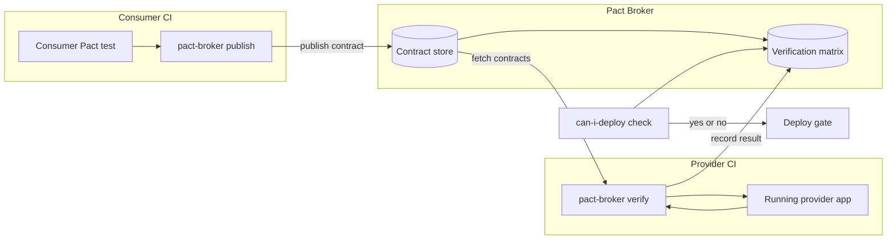

# 5.09 Contract Testing with Pact

> A microservice is never alone. Every call it makes to another service is a bet that the other service still speaks the same dialect of HTTP, returns the same fields, accepts the same payload, and uses the same status codes. Contract testing is the discipline of writing that bet down as an executable specification and letting both sides verify against it without ever standing up the other side. Pact is the most mature tool for this discipline in the JavaScript and TypeScript ecosystem, and the Pact broker is the registry that turns isolated contract files into a cross-team safety net.

## 1. Purpose

Contract testing exists because integration tests do not scale across service boundaries. When a consumer service talks to a provider service over HTTP, the obvious way to verify that they still work together is to spin up both services, run them in the same network, and let the consumer call the provider for real. This works for two services. It does not work for ten. It does not work for fifty. The combinatorial cost of standing up every consumer with every provider, keeping their schemas seeded, keeping their ports free, keeping their databases migrated, and keeping their third-party dependencies mocked turns a clean concept into a CI pipeline that takes an hour and flakes on Tuesday because the staging environment is misconfigured. The integration test pyramid collapses under the weight of cross-service wiring.

Contract testing replaces that expensive wiring with a small, exchangeable artifact: a contract. A contract is a JSON file that records the exact HTTP request a consumer sends to a provider and the exact HTTP response the consumer expects back. The consumer writes a test that produces the contract. The provider reads the contract and replays each request against its own running API, asserting that the response it actually produces matches the response the consumer expected. No consumer is running during provider verification. No provider is running during consumer testing. The two services never have to be stood up together. The contract file is the only thing that crosses the boundary.

This shift is enormous. It changes a quadratic integration problem into a linear one. With ten consumers and ten providers, the integration test approach requires up to one hundred cross-service test setups. The contract approach requires one consumer test per consumer-provider pair, plus one provider verification per pair, with no shared runtime. The cost scales with the number of pairs, not with the topology of the deployment graph. And because contracts are versioned and stored in a shared broker, the verification can run independently in each service's own pipeline, on each service's own schedule, against whichever version of the contract each service is targeting.

The contract itself is consumer-driven. This is the second key idea. In a traditional integration test, the provider defines the API and the consumer verifies it can call the API. The provider is in control. In consumer-driven contracts, the consumer writes the test that defines its expectations, and the provider must satisfy every consumer's expectations. This inversion is deliberate: it makes the consumers' actual needs visible to the provider. A provider that serves five consumers might believe its API is fine because its own unit tests pass; contract testing reveals that three of those consumers depend on a field the provider is about to remove, before the removal ships. The provider learns this from the contract verification failures, not from a production outage.

The Pact broker is the third pillar. A contract file is just a JSON document; without somewhere to publish it, the consumer and provider have to swap files by hand, by email, or by git. The Pact broker is a small web service that stores contracts indexed by consumer name, provider name, and version. Consumers publish contracts to the broker after their tests pass. Providers fetch contracts from the broker before running verification. The broker also records verification results, so the consumer can see whether the latest provider version still satisfies its contract, and so the provider can see whether the latest consumer contract still passes verification. The broker supports the `can-i-deploy` check: given a consumer version and a target environment, the broker answers whether that consumer and the provider version currently deployed in that environment have a verified contract. If yes, deploy is safe. If no, deploy is blocked. This is the missing piece that turns contract testing from a developer convenience into a deployment gate.

The purpose of this note is to give you the complete operational picture. By the end you should be able to explain consumer-driven contracts to a skeptical engineering manager, write a Pact consumer test in JavaScript and TypeScript, set up a provider verification pipeline, deploy a Pact broker, wire `can-i-deploy` into your continuous deployment workflow, and choose between Pact and JSON Schema validation for any given testing problem. You should also understand the failure modes that make contract suites rot: contracts that are too rigid, contracts that are too loose, contracts that never get verified, and contracts that duplicate the unit tests one floor below.

## 2. Theory and Deep Dive

### 2.1 Consumer-Driven Contracts: The Inversion

Consumer-driven contracts flip the traditional API ownership model. The conventional model says the provider owns the API, publishes documentation, and breaks it whenever the provider's roadmap demands. Consumers read the documentation, integrate, and discover breakages when the provider ships a change. The consumer is reactive. The provider is unilateral. Outages are the consumers' problem.

The consumer-driven model says the consumers collectively own the API contract. Each consumer writes a test that captures exactly what it depends on. The provider collects every consumer contract and verifies its implementation against all of them. A change to the provider that would break a consumer fails the provider's build before the change ships. The provider cannot unilaterally break a consumer. The consumers cannot silently depend on undocumented behavior: their dependencies are explicit in the contract.

The inversion works because it aligns incentives. The provider has a single source of truth for what consumers actually use: the set of contracts published to the broker. The provider can refactor freely as long as no contract breaks. The consumers have a single source of truth for what the provider promises: the set of contracts they have published and the provider has verified. New consumers can be added without coordination meetings; they simply publish a contract and the provider's verification extends to cover them.

This inversion is what distinguishes contract testing from specification testing. A specification, such as an OpenAPI document, is provider-authored and provider-owned. It says what the provider intends to do. A contract is consumer-authored. It says what the consumer actually depends on. A provider can be perfectly spec-compliant and still break a consumer, if the consumer depends on an undocumented header or on a specific value in a response field that the spec leaves open. The contract catches this because the consumer's test asserts on the exact value, not on the spec's permission.

### 2.2 The Pact Lifecycle

A Pact interaction is a tuple: a description, a request (method, path, headers, body), and an expected response (status, headers, body). A Pact contract is a JSON file containing one or more interactions, plus metadata about the consumer and provider names and the Pact specification version. The lifecycle of a contract has four phases.

Phase one is consumer testing. The consumer service writes a unit test against its own API client. The API client normally makes HTTP calls to the provider. During the test, Pact intercepts those calls with a mock server. The test sets up an expectation: "if the consumer's client sends this request, the mock server will return this response." The test then calls the client method and asserts on the result. Pact records both the request the client actually made and the response it expected. After the test, Pact writes the recorded interactions to a JSON contract file.

Phase two is contract publication. The consumer's CI pipeline runs the consumer tests, generating the contract file. The pipeline then publishes the contract to the Pact broker, tagging it with the consumer name, consumer version (typically the git commit SHA), and the branch or environment. The broker stores the contract and makes it available for retrieval.

Phase three is provider verification. The provider's CI pipeline fetches contracts from the broker for its provider name. For each contract, the provider starts its own application (typically on a random port) and replays each interaction's request against the running provider. Pact's verifier captures the actual response the provider produced and compares it to the expected response in the contract. If any interaction fails to match, the verification fails and the provider's build is blocked. The provider publishes the verification result back to the broker, recording which provider version verified which consumer version.

Phase four is the deployment check. Before deploying either the consumer or the provider, the CI pipeline asks the broker `can-i-deploy`: given this consumer version and the provider versions currently in the target environment, is there a verified contract between them? The broker answers yes or no. If no, the deployment is blocked. If yes, the deployment proceeds, and the broker is notified of the new deployment so future checks reflect the new state of the environment.

The four phases form a closed loop. The consumer writes the contract, the provider verifies it, the broker records the verification, and the deployment gate consumes the recorded verification. No phase requires the other service to be running. No phase requires coordination meetings. The broker is the only shared state.

### 2.3 Pact Matching: Exact and Flexible

A naive contract records the exact bytes of the request and response. This is fragile: if the provider changes a date by one second or adds a new optional field, the contract breaks even though the consumer does not care. Pact solves this with matching rules.

Exact matching applies to status codes, paths, methods, and any field the consumer asserts on. If the contract says the status is 200, the provider's response must be 200. If the contract says the body's `id` field equals 42, the provider's response must have `id` equal to 42.

Flexible matching applies to fields the consumer does not care about exactly. The most common is `like`, which asserts the type but not the value: `like(42)` matches any number, `like("abc")` matches any string, `like(true)` matches any boolean. The value passed to `like` is a sample, used only to generate the contract file. The verifier checks that the provider's response has a value of the same type at the same path. Another matcher is `eachLike`, which asserts an array where every element matches a given template. A third is `term`, which asserts the value matches a regular expression: `term({ generate: "2024-01-15", matcher: /^\d{4}-\d{2}-\d{2}$/ })` matches any ISO date. A fourth is `datetime`, which asserts a string matches a date format string.

Matching rules compose. A response body can mix exact values, `like`, `eachLike`, and `term` at different paths. The contract file records both the example values and the matching rules, and the verifier applies both. This composition is what makes contracts resilient to harmless changes while still catching real breakage. A contract that says `like({ id: 42, name: "Alice" })` matches any object with numeric `id` and string `name`; the provider can change the `id` value or the `name` value without breaking the contract, but it cannot change `id` to a string or remove `name` entirely.

The discipline of matching is the discipline of contract authoring. Too exact and the contract breaks on every minor provider change. Too loose and the contract permits breakages that hurt the consumer. The right contract asserts exactly what the consumer's code reads and no more. If the consumer reads `id` and `name` and ignores everything else, the contract should assert on `id` and `name` and use `like` for everything else.

### 2.4 Provider States

A consumer test typically asserts on a specific response: "given the provider has a user with id 42 named Alice, when I request that user, I expect a 200 with body containing id 42 and name Alice." The contract records this assertion. But the provider, when verifying, has to actually produce that response. The provider's API returns whatever its database and business logic produce, not whatever the contract expects. The contract has to tell the provider how to set up its state so that the API call returns the expected response.

This is the provider state. Each interaction in a Pact contract carries an optional `providerStates` array, where each state has a `name` and a `params` map. The consumer test sets the provider state when defining the interaction. The provider's verification reads the state name and, before replaying the interaction, calls a provider-state hook that mutates the provider's data to match. The hook can insert a row into the database, set up a mock for an upstream service, configure a feature flag, or anything else that puts the provider into the named state.

For example, the consumer test for "get user by id" sets the provider state `"a user with id 42 exists"`. The provider's verification, before replaying the request `GET /users/42`, calls the state handler for `"a user with id 42 exists"`, which inserts a row with id 42 into the test database. The provider's API then returns that row, the verifier compares the response to the contract, and the verification passes.

Provider states are the seam between the contract's expectations and the provider's reality. Without them, the provider cannot reproduce the conditions under which the consumer's expectations are valid. With them, the provider can verify any contract the consumer writes, no matter how specific the data requirements.

### 2.5 The Pact Broker

The Pact broker is a small Ruby or Docker-deployable web service that stores contracts and verification results. Its data model is straightforward. Consumers have many versions. Each consumer version has many pacts (one per provider). Each pact has many verification results (one per provider version that verified it). Each version can be tagged with environments and branches. The broker's REST API supports publishing pacts, fetching pacts, recording verifications, querying verification status, and asking `can-i-deploy`.

The broker's most important feature is the matrix. The matrix is a table whose rows are (consumer version, provider version) pairs and whose cells are the verification status. The matrix answers the question: "for every consumer and provider that will be deployed together, is there a verified contract between the versions that will be deployed?" The `can-i-deploy` check is a query against the matrix.

A typical broker interaction looks like this. The consumer's CI runs the consumer tests, which produce a contract file. The CI calls `pact-broker publish` with the contract file, the consumer name, the consumer version (the git SHA), and the branch name. The broker stores the contract. Later, the provider's CI runs the provider verification. The CI calls `pact-broker verify` with the provider name, provider version, the broker URL, and the provider's running application URL. The verifier fetches every pact for that provider from the broker, replays each against the running application, and records the result for each (consumer version, provider version) pair. Before either service deploys, its CI calls `pact-broker can-i-deploy` with the service's version and the target environment. The broker returns a yes-or-no answer with a list of any unverified pairs.

The broker is the social object around which consumer and provider teams coordinate. It is the single source of truth for what contracts exist, who verified them, and whether deployment is safe. Without a broker, contracts are email attachments; with a broker, contracts are first-class deployment artifacts.

### 2.6 Schema Testing: A Lighter Alternative

JSON Schema is a vocabulary for describing the shape of JSON data. A schema declares the type of each field, the required fields, the format (string-as-date, string-as-email, string-as-uuid), and constraints like minimum and maximum. A schema validator takes a schema and a JSON instance and returns whether the instance conforms to the schema.

Schema testing applies this to API responses. The provider publishes a schema for each response shape. The test suite, in either the consumer or the provider, takes sample responses and validates them against the schema. If the response shape changes, the schema test fails. If the response shape is stable, the schema test passes. The schema can also serve as documentation and as input to code generation.

Schema testing is lighter than Pact because it does not require a contract file, a broker, provider states, or a verifier. It requires only a schema document and a validator. It is also weaker. A schema says "the response is an object with an `id` field that is a number and a `name` field that is a string." It does not say "when the consumer requests user 42, the response contains id 42 and name Alice." Schema testing verifies shape; Pact verifies interactions.

The two complement each other. Schema testing is excellent for intra-service validation: a single service can validate its own responses against its own schemas in unit tests, ensuring that every code path produces a schema-conformant response. Pact is excellent for cross-service validation: a consumer can assert that its specific requests produce the specific responses it depends on. The right pattern is often to use both: schema tests inside each service, and Pact tests between services.

There are also hybrid approaches. Pact supports embedding JSON Schema in matching rules, so a contract can say "the body must match this JSON Schema" instead of asserting on specific fields. This is useful when the consumer cares about the shape but not about specific values, and the shape is too complex to express with `like` and `term` alone. OpenAPI schemas can be reused as Pact matchers, so a provider with an existing OpenAPI document can extract schemas from it and use them in contracts.

### 2.7 Pact versus Schema Testing

| Aspect | Pact | JSON Schema |
| --- | --- | --- |
| What it tests | Specific interactions (request A produces response B) | Shape of any instance (any response matches this schema) |
| Who writes it | Consumer | Provider, or shared |
| Where it runs | Consumer writes; provider verifies | Either side, in unit tests |
| Artifact | Contract JSON file | Schema JSON file |
| Registry | Pact broker | Any version-controlled file |
| Strength | Catches interaction-level breakage | Catches shape-level breakage |
| Weakness | Requires broker, provider states, more setup | Does not catch interaction-level breakage |
| Best for | Cross-service HTTP contracts | Intra-service response validation |

The choice is not binary. A mature microservices setup uses Pact for the cross-service interactions that matter most and JSON Schema for the intra-service response validation that runs on every code path. Pact catches the consumer-specific breakages; schema catches the structural ones.

### 2.8 The Verification Topology

The Pact verification topology has three nodes: the consumer's CI, the broker, and the provider's CI. The consumer writes the contract and publishes it to the broker. The provider fetches the contract from the broker and verifies it against the running provider. The broker mediates.



This topology is the entire point. The consumer and provider never share a CI pipeline. They never share a runtime. They never share a database. They share only the broker. The broker is the contract registry, the verification ledger, and the deployment gate, all in one.

## 3. Mental Models

### 3.1 The Contract Is the Agreement

Think of the contract as a written agreement between two services. The consumer says "I will send you this kind of request, and I expect this kind of response back." The provider says "I agree that for the kind of request you describe, I will produce the kind of response you expect." The agreement is signed by the consumer writing the test that produces the contract, and it is countersigned by the provider running the verification that passes. Until both have happened, there is no agreement; there is only a request.

### 3.2 Consumer-Driven Means Consumer Writes the Rules

The inversion is the key. In a provider-driven world, the provider publishes an API and the consumer adapts. In a consumer-driven world, the consumer publishes its needs and the provider adapts. The provider's API is the union of what every consumer needs, plus whatever else the provider wants to expose. The provider cannot remove anything a consumer needs without breaking a contract, and breaking a contract fails the provider's build.

### 3.3 Pact Produces and Verifies

Pact has two modes: produce and verify. The consumer's test produces a contract. The provider's test verifies against a contract. The contract file is the only thing that crosses the boundary. The consumer never runs the provider. The provider never runs the consumer. They communicate only through the contract. This is why Pact scales: the cost is linear in the number of contracts, not exponential in the number of services.

### 3.4 The Broker Is the Registry

The broker is the registry of agreements. Without it, contracts are unstructured files floating around git repositories and Slack messages. With it, contracts are first-class deployment artifacts, indexed by consumer, provider, and version, with verification status and deployment records attached. The broker is the difference between "we have contracts" and "we have a contract testing practice."

### 3.5 can-i-deploy Is the Safety Check

`can-i-deploy` is the question "is it safe to deploy this version of this service into this environment, given the versions of the other services currently in that environment?" The broker answers by checking the verification matrix: for every consumer-provider pair that this deployment affects, is there a verified contract between the versions involved? If yes, deploy is safe. If no, deploy is blocked. This turns the broker from a passive registry into an active deployment gate.

### 3.6 Provider States Are the Setup Contract

Provider states are the consumer's way of telling the provider how to set up its data so the interaction makes sense. Without provider states, the consumer's expectations are unmoored from any reproducible provider state. With provider states, every interaction carries its own setup recipe, and the provider's verification can reproduce the exact conditions under which the consumer's expectations are valid. Provider states are the second contract: the contract about test setup, layered on top of the contract about HTTP behavior.

### 3.7 Matching Rules Are the Flex

Exact matching is brittle. Matching rules are the flex that lets contracts survive harmless changes. `like` asserts type, `term` asserts pattern, `eachLike` asserts array shape. The right contract uses exact matching for what the consumer reads and flexible matching for what the consumer ignores. A contract with no matching rules is a contract that breaks on every minor change. A contract with all matching rules is a contract that catches no breakage. The art is in the balance.

### 3.8 Pact Tests Are Not Unit Tests

Pact tests live on the boundary between consumer and provider. They are not unit tests of the consumer's internal logic, and they are not unit tests of the provider's internal logic. They are tests of the agreement. A consumer's unit tests verify that the consumer correctly parses a response; a Pact test verifies that the response the consumer expects is the response the provider will actually produce. The two sets of tests are complementary, not redundant. Duplicating unit tests as Pact tests, or vice versa, is a common mistake.

## 4. Real-World Use Cases

### 4.1 Microservices Decoupling

The canonical use case for Pact is a microservices architecture where services communicate over HTTP. A checkout service calls an inventory service to check stock; the inventory service calls a pricing service to get current prices; the pricing service calls a promotions service to apply discounts. Each of these calls is a contract. Each contract can be tested independently, verified in the provider's pipeline, and gated by `can-i-deploy` before deployment. The result is that a change to the promotions service cannot break the checkout service silently: if the promotions service changes a response shape that the pricing service depends on, the pricing service's contract verification fails, and the promotions service's deployment is blocked. This is the microservices decoupling validation that the task description references: contracts let services evolve independently while preserving the guarantee that they still compose.

### 4.2 API Versioning and Backwards Compatibility

A provider that maintains multiple API versions can use Pact to verify backwards compatibility. Each version's consumers publish contracts against the version they depend on. The provider's verification runs every contract against every version. A change to version 3 that would break a version 2 consumer fails the verification. The provider can refactor, add fields, and deprecate freely as long as no contract breaks. When the provider wants to remove a deprecated field, it first removes the consumers that depend on it by migrating those consumers to a new contract, then removes the field, then verifies that no remaining contract breaks. Pact makes backwards compatibility an executable property of the build, not a hope.

### 4.3 Cross-Team Coordination

Two teams in different time zones, with different release cadences and different on-call schedules, need to coordinate API changes. Without contracts, coordination is meetings, Slack threads, and post-mortems. With contracts, coordination is the broker. Team A's consumer publishes a contract. Team B's provider verifies it. If verification fails, team B sees the failure in their build, with the diff between the expected and actual response. Team A and team B have a shared artifact to discuss: the contract. The contract is the conversation. Changes to the contract are versioned in the broker, so the history of the agreement is auditable.

### 4.4 Third-Party API Integration

A consumer integrating with a third-party API (a payment processor, a shipping provider, a CRM) often has no control over the provider's roadmap. The third party can change its API at any time, and the consumer discovers the change when its production integration breaks. Pact can help even here. The consumer writes a Pact test against the third-party API based on the documented behavior. The contract captures the consumer's expectations. The consumer can periodically replay the contract against the third party's sandbox or test environment to detect breaking changes before they hit production. The third party never publishes to the broker, but the consumer still benefits from having its expectations written down as an executable check.

### 4.5 Event-Driven Architectures

Pact now supports message contracts, not just HTTP contracts. A consumer that subscribes to a Kafka topic or reads from a queue can write a Pact test against the message format. The producer of the message verifies that the messages it produces match the contract. This extends consumer-driven contracts to event-driven architectures, where the consumer and producer never share an HTTP request but do share a message schema.

### 4.6 GraphQL APIs

Pact has experimental support for GraphQL contracts. The consumer writes a Pact test that captures a GraphQL query and the expected response. The provider verifies by replaying the query against its GraphQL endpoint. This is useful when multiple consumers depend on different subsets of a GraphQL schema and the provider wants to verify that schema changes do not break any consumer's queries.

### 4.7 Mobile and Web Frontend Consumers

A web frontend and a mobile app are both consumers of a backend API. Each has different needs: the mobile app may request a smaller response payload to save bandwidth, the web frontend may request additional fields for richer display. Each can publish its own contract, and the backend verifies both. A change that breaks the mobile contract but not the web contract fails verification, alerting the backend team to the mobile-specific breakage before deployment.

### 4.8 Migrating Between Providers

When a consumer migrates from one provider to another (replacing a legacy service with a new one), contracts make the migration safe. The consumer keeps its contract unchanged. The new provider verifies against the same contract. If verification passes, the new provider is a drop-in replacement. If verification fails, the failures describe exactly what the new provider must implement to be compatible. The contract becomes the migration checklist.

## 5. Code Examples

### 5.1 Example A — Minimal and Conceptual

The minimal Pact example has two halves: a consumer test that produces a contract, and a provider verification that consumes it. The consumer is a small API client that fetches a user by ID. The provider is a small Express server that returns a user. The consumer test uses `@pact-foundation/pact` to spin up a mock provider, set up an expectation, call the client, and assert on the result. The provider verification uses the same library to start the real provider, replay the contract, and assert that the responses match.

#### Consumer Test, JavaScript

```javascript
// consumer/user-client.test.js
const path = require('path');
const { Pact } = require('@pact-foundation/pact');
const { fetchUser } = require('../src/user-client');

const provider = new Pact({
  consumer: 'UserServiceConsumer',
  provider: 'UserProvider',
  port: 4001,
  log: path.resolve(process.cwd(), 'logs', 'pact.log'),
  dir: path.resolve(process.cwd(), 'pacts'),
  logLevel: 'warn',
});

describe('User service consumer', () => {
  beforeAll(() => provider.setup());
  afterAll(() => provider.finalize());
  afterEach(() => provider.verify());

  test('fetches a user by id', async () => {
    await provider.addInteraction({
      uponReceiving: 'a request for a user',
      withRequest: {
        method: 'GET',
        path: '/users/42',
        headers: { Accept: 'application/json' },
      },
      willRespondWith: {
        status: 200,
        headers: { 'Content-Type': 'application/json' },
        body: {
          id: 42,
          name: 'Alice',
          email: 'alice@example.com',
        },
      },
    });

    const user = await fetchUser('http://localhost:4001', 42);

    expect(user).toEqual({
      id: 42,
      name: 'Alice',
      email: 'alice@example.com',
    });
  });
});
```

#### Consumer Test, TypeScript

```ts
// consumer/user-client.test.ts
import path from 'path';
import { Pact } from '@pact-foundation/pact';
import { fetchUser } from '../src/user-client';
import type { InteractionObject } from '@pact-foundation/pact';

const provider = new Pact({
  consumer: 'UserServiceConsumer',
  provider: 'UserProvider',
  port: 4001,
  log: path.resolve(process.cwd(), 'logs', 'pact.log'),
  dir: path.resolve(process.cwd(), 'pacts'),
  logLevel: 'warn',
});

interface User {
  id: number;
  name: string;
  email: string;
}

describe('User service consumer', () => {
  beforeAll(() => provider.setup());
  afterAll(() => provider.finalize());
  afterEach(() => provider.verify());

  test('fetches a user by id', async () => {
    const interaction: InteractionObject = {
      uponReceiving: 'a request for a user',
      withRequest: {
        method: 'GET',
        path: '/users/42',
        headers: { Accept: 'application/json' },
      },
      willRespondWith: {
        status: 200,
        headers: { 'Content-Type': 'application/json' },
        body: {
          id: 42,
          name: 'Alice',
          email: 'alice@example.com',
        },
      },
    };
    await provider.addInteraction(interaction);

    const user: User = await fetchUser('http://localhost:4001', 42);

    expect(user).toEqual({
      id: 42,
      name: 'Alice',
      email: 'alice@example.com',
    });
  });
});
```

The consumer client itself is a thin wrapper around `fetch`. Both versions are functionally identical; the TypeScript version adds an interface for the `User` shape and types the function parameters and return value.

#### Consumer Client, JavaScript

```javascript
// consumer/src/user-client.js
async function fetchUser(baseUrl, id) {
  const response = await fetch(`${baseUrl}/users/${id}`, {
    headers: { Accept: 'application/json' },
  });
  if (!response.ok) {
    throw new Error(`Failed to fetch user ${id}: ${response.status}`);
  }
  return response.json();
}

module.exports = { fetchUser };
```

#### Consumer Client, TypeScript

```ts
// consumer/src/user-client.ts
export interface User {
  id: number;
  name: string;
  email: string;
}

export async function fetchUser(baseUrl: string, id: number): Promise<User> {
  const response = await fetch(`${baseUrl}/users/${id}`, {
    headers: { Accept: 'application/json' },
  });
  if (!response.ok) {
    throw new Error(`Failed to fetch user ${id}: ${response.status}`);
  }
  return response.json() as Promise<User>;
}
```

#### Provider Verification, JavaScript

```javascript
// provider/verify.pact.js
const { Verifier } = require('@pact-foundation/pact');
const path = require('path');
const { app } = require('./app');

let server;

beforeAll(async () => {
  server = app.listen(4002);
});

afterAll(async () => {
  await new Promise((resolve) => server.close(resolve));
});

describe('Pact verification', () => {
  test('verifies contracts', async () => {
    const opts = {
      providerBaseUrl: 'http://localhost:4002',
      pactUrls: [
        path.resolve(process.cwd(), 'consumer', 'pacts',
          'userserviceconsumer-userprovider.json'),
      ],
      providerVersion: '1.0.0',
    };

    await new Verifier(opts).verifyProvider();
  }, 30000);
});
```

#### Provider Verification, TypeScript

```ts
// provider/verify.pact.ts
import { Verifier } from '@pact-foundation/pact';
import path from 'path';
import { app } from './app';
import type { Server } from 'http';

let server: Server;

beforeAll(async () => {
  server = app.listen(4002);
});

afterAll(async () => {
  await new Promise<void>((resolve) => server.close(() => resolve()));
});

describe('Pact verification', () => {
  test('verifies contracts', async () => {
    const opts = {
      providerBaseUrl: 'http://localhost:4002',
      pactUrls: [
        path.resolve(process.cwd(), 'consumer', 'pacts',
          'userserviceconsumer-userprovider.json'),
      ],
      providerVersion: '1.0.0',
    };

    await new Verifier(opts).verifyProvider();
  }, 30000);
});
```

#### Provider App, JavaScript

```javascript
// provider/app.js
const express = require('express');

const app = express();

const users = {
  42: { id: 42, name: 'Alice', email: 'alice@example.com' },
};

app.get('/users/:id', (req, res) => {
  const user = users[req.params.id];
  if (!user) {
    return res.status(404).json({ error: 'not found' });
  }
  res.json(user);
});

module.exports = { app };
```

#### Provider App, TypeScript

```ts
// provider/app.ts
import express, { Request, Response } from 'express';

export const app = express();

interface User {
  id: number;
  name: string;
  email: string;
}

const users: Record<string, User> = {
  '42': { id: 42, name: 'Alice', email: 'alice@example.com' },
};

app.get('/users/:id', (req: Request, res: Response) => {
  const user = users[req.params.id];
  if (!user) {
    return res.status(404).json({ error: 'not found' });
  }
  res.json(user);
});
```

The consumer test produces a contract file at `consumer/pacts/userserviceconsumer-userprovider.json`. The provider verification reads that file, starts the real provider on port 4002, replays the request `GET /users/42`, and asserts the response matches. If the provider changed the email field or returned 404, the verification fails with a diff showing the expected and actual responses.

### 5.2 Example B — Production-Grade

The production-grade example extends the minimal one with provider states, broker integration, flexible matching, and full TypeScript typing. The consumer is an orders service that calls a products service. The contract has two interactions: one for a successful product lookup, one for a not-found case. The provider has provider-state hooks that set up the database for each state. Both sides publish to and verify against a Pact broker.

#### Consumer Client, JavaScript

```javascript
// consumer/src/products-client.js
const { like, term } = require('@pact-foundation/pact/src/dsl/matchers');

async function getProduct(baseUrl, id) {
  const response = await fetch(`${baseUrl}/products/${id}`, {
    headers: { Accept: 'application/json' },
  });
  if (response.status === 404) {
    return null;
  }
  if (!response.ok) {
    throw new Error(`Failed to fetch product ${id}: ${response.status}`);
  }
  return response.json();
}

module.exports = { getProduct };
```

#### Consumer Client, TypeScript

```ts
// consumer/src/products-client.ts
import { like, term } from '@pact-foundation/pact/src/dsl/matchers';

export interface Product {
  id: number;
  name: string;
  price: number;
  sku: string;
}

export async function getProduct(baseUrl: string, id: number): Promise<Product | null> {
  const response = await fetch(`${baseUrl}/products/${id}`, {
    headers: { Accept: 'application/json' },
  });
  if (response.status === 404) {
    return null;
  }
  if (!response.ok) {
    throw new Error(`Failed to fetch product ${id}: ${response.status}`);
  }
  return response.json() as Promise<Product>;
}
```

#### Consumer Test, JavaScript

```javascript
// consumer/products-client.test.js
const path = require('path');
const { Pact } = require('@pact-foundation/pact');
const { like, term } = require('@pact-foundation/pact/src/dsl/matchers');
const { getProduct } = require('../src/products-client');

const provider = new Pact({
  consumer: 'OrdersService',
  provider: 'ProductsService',
  port: 4001,
  dir: path.resolve(process.cwd(), 'pacts'),
  logLevel: 'warn',
});

describe('Products service consumer', () => {
  beforeAll(() => provider.setup());
  afterAll(() => provider.finalize());
  afterEach(() => provider.verify());

  test('fetches an existing product', async () => {
    await provider.addInteraction({
      state: 'a product with id 7 exists',
      uponReceiving: 'a request for product 7',
      withRequest: {
        method: 'GET',
        path: '/products/7',
        headers: { Accept: 'application/json' },
      },
      willRespondWith: {
        status: 200,
        headers: { 'Content-Type': 'application/json' },
        body: {
          id: 7,
          name: like('Widget'),
          price: like(19.99),
          sku: term({
            generate: 'WID-007',
            matcher: /^[A-Z]{3}-\d{3}$/,
          }),
        },
      },
    });

    const product = await getProduct('http://localhost:4001', 7);

    expect(product).toEqual({
      id: 7,
      name: 'Widget',
      price: 19.99,
      sku: 'WID-007',
    });
  });

  test('handles missing product', async () => {
    await provider.addInteraction({
      state: 'no product with id 999 exists',
      uponReceiving: 'a request for product 999',
      withRequest: {
        method: 'GET',
        path: '/products/999',
        headers: { Accept: 'application/json' },
      },
      willRespondWith: {
        status: 404,
        headers: { 'Content-Type': 'application/json' },
        body: { error: like('not found') },
      },
    });

    const product = await getProduct('http://localhost:4001', 999);

    expect(product).toBeNull();
  });
});
```

#### Consumer Test, TypeScript

```ts
// consumer/products-client.test.ts
import path from 'path';
import { Pact } from '@pact-foundation/pact';
import { like, term, InteractionObject } from '@pact-foundation/pact/src/dsl/matchers';
import { getProduct, Product } from '../src/products-client';

const provider = new Pact({
  consumer: 'OrdersService',
  provider: 'ProductsService',
  port: 4001,
  dir: path.resolve(process.cwd(), 'pacts'),
  logLevel: 'warn',
});

describe('Products service consumer', () => {
  beforeAll(() => provider.setup());
  afterAll(() => provider.finalize());
  afterEach(() => provider.verify());

  test('fetches an existing product', async () => {
    const interaction: InteractionObject = {
      state: 'a product with id 7 exists',
      uponReceiving: 'a request for product 7',
      withRequest: {
        method: 'GET',
        path: '/products/7',
        headers: { Accept: 'application/json' },
      },
      willRespondWith: {
        status: 200,
        headers: { 'Content-Type': 'application/json' },
        body: {
          id: 7,
          name: like('Widget'),
          price: like(19.99),
          sku: term({
            generate: 'WID-007',
            matcher: /^[A-Z]{3}-\d{3}$/,
          }),
        },
      },
    };
    await provider.addInteraction(interaction);

    const product: Product | null = await getProduct('http://localhost:4001', 7);

    expect(product).toEqual({
      id: 7,
      name: 'Widget',
      price: 19.99,
      sku: 'WID-007',
    });
  });

  test('handles missing product', async () => {
    const interaction: InteractionObject = {
      state: 'no product with id 999 exists',
      uponReceiving: 'a request for product 999',
      withRequest: {
        method: 'GET',
        path: '/products/999',
        headers: { Accept: 'application/json' },
      },
      willRespondWith: {
        status: 404,
        headers: { 'Content-Type': 'application/json' },
        body: { error: like('not found') },
      },
    };
    await provider.addInteraction(interaction);

    const product: Product | null = await getProduct('http://localhost:4001', 999);

    expect(product).toBeNull();
  });
});
```

#### Consumer Publication Script, JavaScript

```javascript
// consumer/publish-pacts.js
const { Publisher } = require('@pact-foundation/pact');
const path = require('path');
const branch = process.env.gitBranch || 'main';
const version = process.env.gitSha || 'local';

new Publisher({
  pactFilesOrDirs: [
    path.resolve(process.cwd(), 'pacts'),
  ],
  pactBroker: process.env.pactBrokerUrl,
  pactBrokerToken: process.env.pactBrokerToken,
  consumerVersion: version,
  consumerVersionTags: [branch],
}).publishPacts();
```

#### Consumer Publication Script, TypeScript

```ts
// consumer/publish-pacts.ts
import { Publisher } from '@pact-foundation/pact';
import path from 'path';

const branch: string = process.env.gitBranch || 'main';
const version: string = process.env.gitSha || 'local';

new Publisher({
  pactFilesOrDirs: [
    path.resolve(process.cwd(), 'pacts'),
  ],
  pactBroker: process.env.pactBrokerUrl as string,
  pactBrokerToken: process.env.pactBrokerToken as string,
  consumerVersion: version,
  consumerVersionTags: [branch],
}).publishPacts();
```

#### Provider App, JavaScript

```javascript
// provider/app.js
const express = require('express');

const app = express();
app.use(express.json());

let products = {};

app.get('/products/:id', (req, res) => {
  const product = products[req.params.id];
  if (!product) {
    return res.status(404).json({ error: 'not found' });
  }
  res.json(product);
});

function setState(state) {
  products = {};
  if (state === 'a product with id 7 exists') {
    products['7'] = {
      id: 7,
      name: 'Widget',
      price: 19.99,
      sku: 'WID-007',
    };
  }
}

module.exports = { app, setState };
```

#### Provider App, TypeScript

```ts
// provider/app.ts
import express, { Request, Response } from 'express';

export const app = express();
app.use(express.json());

export interface Product {
  id: number;
  name: string;
  price: number;
  sku: string;
}

let products: Record<string, Product> = {};

app.get('/products/:id', (req: Request, res: Response) => {
  const product = products[req.params.id];
  if (!product) {
    return res.status(404).json({ error: 'not found' });
  }
  res.json(product);
});

export function setState(state: string): void {
  products = {};
  if (state === 'a product with id 7 exists') {
    products['7'] = {
      id: 7,
      name: 'Widget',
      price: 19.99,
      sku: 'WID-007',
    };
  }
}
```

#### Provider Verification with Broker, JavaScript

```javascript
// provider/verify.pact.js
const { Verifier } = require('@pact-foundation/pact');
const { app, setState } = require('./app');

let server;

beforeAll(async () => {
  server = app.listen(4002);
});

afterAll(async () => {
  await new Promise((resolve) => server.close(resolve));
});

describe('Pact verification', () => {
  test('verifies contracts from broker', async () => {
    const opts = {
      providerBaseUrl: 'http://localhost:4002',
      pactBrokerUrl: process.env.pactBrokerUrl,
      pactBrokerToken: process.env.pactBrokerToken,
      provider: 'ProductsService',
      providerVersion: process.env.gitSha || 'local',
      providerVersionTags: [process.env.gitBranch || 'main'],
      consumerVersionTags: ['main'],
      stateHandlers: {
        'a product with id 7 exists': () => {
          setState('a product with id 7 exists');
          return Promise.resolve();
        },
        'no product with id 999 exists': () => {
          setState('no product with id 999 exists');
          return Promise.resolve();
        },
      },
    };

    await new Verifier(opts).verifyProvider();
  }, 60000);
});
```

#### Provider Verification with Broker, TypeScript

```ts
// provider/verify.pact.ts
import { Verifier } from '@pact-foundation/pact';
import { app, setState } from './app';
import type { Server } from 'http';

let server: Server;

beforeAll(async () => {
  server = app.listen(4002);
});

afterAll(async () => {
  await new Promise<void>((resolve) => server.close(() => resolve()));
});

describe('Pact verification', () => {
  test('verifies contracts from broker', async () => {
    const opts = {
      providerBaseUrl: 'http://localhost:4002',
      pactBrokerUrl: process.env.pactBrokerUrl as string,
      pactBrokerToken: process.env.pactBrokerToken as string,
      provider: 'ProductsService',
      providerVersion: process.env.gitSha || 'local',
      providerVersionTags: [process.env.gitBranch || 'main'],
      consumerVersionTags: ['main'],
      stateHandlers: {
        'a product with id 7 exists': (): Promise<void> => {
          setState('a product with id 7 exists');
          return Promise.resolve();
        },
        'no product with id 999 exists': (): Promise<void> => {
          setState('no product with id 999 exists');
          return Promise.resolve();
        },
      },
    };

    await new Verifier(opts).verifyProvider();
  }, 60000);
});
```

The production-grade setup completes the lifecycle. The consumer test produces contracts with matching rules and provider states. The consumer publishes to the broker with its git SHA as the version. The provider fetches contracts from the broker, applies state handlers before each interaction, replays the requests against its running app, and records the verification result with its own git SHA. Both sides can run `can-i-deploy` before deployment, and the broker answers based on the matrix of recorded verifications.

#### can-i-deploy Check, JavaScript

```javascript
// scripts/can-i-deploy.js
const { canDeploy } = require('@pact-foundation/pact');

async function check() {
  await canDeploy({
    pactBroker: process.env.pactBrokerUrl,
    pactBrokerToken: process.env.pactBrokerToken,
    participant: process.env.pactParticipant,
    version: process.env.gitSha,
    toEnvironment: process.env.targetEnv,
  });
  console.log('safe to deploy');
}

check().catch((err) => {
  console.error('not safe to deploy', err.message);
  process.exit(1);
});
```

#### can-i-deploy Check, TypeScript

```ts
// scripts/can-i-deploy.ts
import { canDeploy } from '@pact-foundation/pact';

async function check(): Promise<void> {
  await canDeploy({
    pactBroker: process.env.pactBrokerUrl as string,
    pactBrokerToken: process.env.pactBrokerToken as string,
    participant: process.env.pactParticipant as string,
    version: process.env.gitSha as string,
    toEnvironment: process.env.targetEnv as string,
  });
  console.log('safe to deploy');
}

check().catch((err: Error) => {
  console.error('not safe to deploy', err.message);
  process.exit(1);
});
```

The `can-i-deploy` script is the deployment gate. It exits zero if the broker reports the participant's version is verified against every counterpart in the target environment, and non-zero otherwise. CI pipelines call this script before the deploy step; a non-zero exit blocks the deploy.

## 6. Common Mistakes and Anti-Patterns

### 6.1 Contracts Too Rigid

A contract that uses exact matching for every field breaks on every minor provider change. The provider changes a timestamp by one second, the contract breaks, the provider's build fails, and the team spends an hour figuring out why. The fix is to use `like` and `term` for fields the consumer does not read exactly. The contract should assert on the fields the consumer reads and use flexible matching for everything else. A good rule of thumb: if the consumer's code does not contain the literal value `19.99`, the contract should not assert on it exactly.

### 6.2 Contracts Too Loose

The opposite mistake is a contract that uses `like` for everything. Such a contract passes even when the provider changes a field the consumer cares about. A contract that asserts only "the response is an object with a numeric `id` field" does not catch a provider that removes the `name` field the consumer's UI displays. The fix is to assert exactly on the fields the consumer reads. Every field the consumer's code accesses should appear in the contract with at least a type assertion, and critical values should be asserted exactly.

### 6.3 No Broker

Teams that use Pact without a broker end up with contracts scattered across git repositories. The consumer's contract is in the consumer's repo. The provider has to clone the consumer's repo to verify. When there are five consumers, the provider has to clone five repos. When the consumers change their contracts, the provider does not find out until the next verification run, which may be days later. The fix is to set up a broker. A broker can be deployed in an afternoon with the official Docker image, and it transforms Pact from a developer convenience into a cross-team coordination mechanism. Without a broker, you have contract files; with a broker, you have a contract practice.

### 6.4 Provider Verification Not in CI

A consumer team that writes Pact tests but whose provider counterpart does not run verification in CI is fooling itself. The consumer tests pass, the contract is generated, but nobody verifies it. The provider can ship breaking changes with impunity because the contract is never checked. The fix is operational: provider verification must run on every provider build, and the provider build must fail if verification fails. This requires the provider team to set up the verifier, the state handlers, and the broker integration. It is not optional. A contract that is never verified is not a contract; it is a wish.

### 6.5 Versioning Contracts Wrong

Pact contracts are versioned by the consumer version. The consumer's git SHA is the canonical version tag. When the consumer publishes a contract, the broker indexes it under that version. When the provider verifies, the broker records the verification under the (consumer version, provider version) pair. Teams that use non-monotonic versions (build numbers that reset, branch names that collide) break the matrix. Teams that publish contracts without a version (or with a constant version like `latest`) overwrite previous contracts and lose history. The fix is to always use the git SHA as the consumer version, to tag with the branch name, and to record the environment on deployment. The broker's matrix depends on correct versioning.

### 6.6 Pact Tests Duplicating Unit Tests

A consumer team that writes Pact tests for behavior its unit tests already cover is wasting effort. Pact tests are for the agreement between consumer and provider. The consumer's internal logic (how it parses the response, how it handles errors, how it caches) is the consumer's own concern and should be tested by the consumer's unit tests. The Pact test should assert that the consumer's client sends the right request and that the response the consumer expects is the response the provider will produce. It should not re-test the consumer's parsing logic. The fix is to keep Pact tests thin: set up the expectation, call the client, assert on the request and the expected response. Do the parsing and error-handling tests in unit tests with hand-crafted fixtures.

### 6.7 Missing Provider States

A consumer writes a contract with a specific response expectation but does not set a provider state. The provider's verification has no way to set up its data to produce that response, so the verification fails for the wrong reason: the provider's database is empty, the contract expects a user with id 42, and the provider returns 404. The fix is to always set a provider state when the interaction depends on specific data. Provider states are not optional for any interaction that depends on provider-side data; they are how the contract communicates its preconditions.

### 6.8 Stale Contracts in the Broker

A consumer publishes a contract, the provider verifies it, both teams move on. Months later, the consumer's code has changed, but the contract has not been re-published. The broker still has the old contract. The provider's verification still passes against the old contract. The consumer's actual behavior has drifted. The fix is to publish contracts on every consumer build and to verify on every provider build. Stale contracts are worse than no contracts because they create a false sense of safety. The broker's matrix is only as accurate as the most recent publication and verification.

### 6.9 Not Handling Headers in the Contract

A consumer's client sends an `Authorization` header. The consumer's Pact test does not include the header in the `withRequest`. The provider's verification replays the request without the header, the provider's auth middleware rejects it with 401, and the verification fails confusingly. The fix is to include in the contract every header the consumer's client actually sends. Headers are part of the request. A contract that omits headers is a contract that does not match real traffic.

### 6.10 Treating Pact as a Full Integration Test

Teams new to Pact sometimes try to use it as a replacement for end-to-end tests, writing contracts that exercise complex multi-step flows across many endpoints. Pact is not designed for this. Each Pact interaction is a single request-response pair. Multi-step flows are sequences of interactions, but Pact does not verify that the sequence makes sense as a whole; it verifies each interaction independently. The fix is to keep Pact tests focused on individual API calls and to use end-to-end tests for multi-step flows. Pact catches interaction-level breakage; end-to-end catches flow-level breakage.

## 7. Best Practices and Design Patterns

### 7.1 Use Pact for Cross-Service Interactions

Pact is designed for the seam between services. Use it there. Do not use it for intra-service testing, where the consumer and provider are the same service. Do not use it for testing a service against its own database. The cost of Pact (broker, provider states, versioning) is justified by the benefit of catching cross-service breakage; for intra-service testing, unit tests and schema tests are cheaper and equally effective.

### 7.2 Use JSON Schema for Shape Validation Within a Service

Within a single service, JSON Schema is the right tool for response shape validation. The service defines a schema for each response, and unit tests assert that every code path produces a schema-conformant response. This catches internal breakage (a code path that returns the wrong shape) without the overhead of a contract. The schema can also serve as documentation and as input to code generation for client libraries.

### 7.3 Use a Broker for Sharing

Always use a broker when there is more than one consumer or more than one provider. The broker is the single source of truth for contracts and verification results. It enables `can-i-deploy`, cross-team visibility, and audit history. Setting up a broker is a one-time cost that pays dividends forever. The official Docker image runs in any container orchestration environment, and the broker's storage backend can be SQLite for small setups or PostgreSQL for production.

### 7.4 Run can-i-deploy Before Every Deployment

Make `can-i-deploy` a hard gate in the deployment pipeline. The script should run before the deploy step, and a non-zero exit should block the deploy. This turns the broker from a passive registry into an active safety net. Without `can-i-deploy`, the broker is informational; with it, the broker is enforceable. The check takes seconds, and the cost of a blocked deploy is always lower than the cost of a broken production integration.

### 7.5 Version Contracts with the Consumer Version

The canonical consumer version is the git SHA. Use it. Tag contracts with the branch name as well, so the broker can filter by branch. Record the environment on deployment, so `can-i-deploy` knows what is currently in each environment. Avoid using semantic versions for contracts; semantic versions are for releases, not for source-of-truth versions. The git SHA is unique, monotonic, and traceable to the exact commit that produced the contract.

### 7.6 Keep Contracts Focused

A contract should capture exactly what the consumer reads and no more. Do not add fields the consumer does not use. Do not add edge cases that belong in unit tests. Do not add assertions on internal provider state. The contract is the minimum specification of the agreement. Every additional assertion is a maintenance cost: it has to be updated when the consumer's needs change, and it has to be verified by the provider on every build. Less is more.

### 7.7 Use Provider States for Data Setup

Always set a provider state when the interaction depends on provider-side data. The state name should be a short, descriptive phrase: "a user with id 42 exists", "the inventory is empty", "the user is authenticated as admin". The state handler on the provider side should set up exactly the data the state describes, no more. The handler should be idempotent: running it twice should produce the same state. The handler should clean up after itself if the verification framework does not.

### 7.8 Use Matching Rules Judiciously

Use exact matching for what the consumer reads exactly (status codes, paths, critical values). Use `like` for type-only assertions (the response has a numeric `id`). Use `term` for format assertions (the response has an ISO date, a UUID, a SKU pattern). Use `eachLike` for array shapes. Do not mix exact and flexible matching for the same field across interactions; pick one and stick with it. The contract's matching rules should reflect the consumer's actual flexibility, not the author's guess.

### 7.9 Publish on Every Build

The consumer's CI should publish contracts to the broker on every build, not just on main. Feature branches should publish contracts tagged with the branch name. This lets the provider verify against in-flight consumer changes before they merge. If a consumer's feature branch introduces a contract that the provider cannot satisfy, the provider's verification fails on the branch, and the consumer can adjust before merging. This is the most powerful use of Pact: catching breakage during development, not after merge.

### 7.10 Verify on Every Build

The provider's CI should verify against the broker on every build. Verification should pull contracts for all consumer branches that the provider team cares about (typically main and any open feature branches). Verification results are recorded per (consumer version, provider version) pair, so the matrix is always up to date. Skipping verification on a build means the matrix is stale for that build, and `can-i-deploy` may give incorrect answers.

### 7.11 Tag with Environments

When a version is deployed to an environment, record the deployment in the broker. The broker uses this to answer `can-i-deploy` against the right versions. Without environment tagging, `can-i-deploy` cannot know what is currently in staging or production, and the check is meaningless. The Pact CLI supports `record-deployment` for this purpose; call it from the deploy step.

### 7.12 Handle Breaking Changes Deliberately

When a consumer needs to change its contract in a way that will break the provider (a new required field, a changed status code), do it in two phases. First, publish the new contract as a new version, tagged with a feature branch. The provider's verification will fail. Coordinate with the provider team to implement the new behavior. Once the provider's verification passes against the new contract, merge the consumer's branch. The broker's matrix shows the entire history of the change, from proposal to verification to merge.

### 7.13 Separate Consumer and Provider Repositories

Keep the consumer and provider in separate repositories, with separate CI pipelines, communicating only through the broker. Do not put both in a monorepo with a shared CI pipeline; that defeats the purpose of contract testing, which is to verify the agreement without running both services together. The broker is the seam between the repos. Each repo's CI publishes its contracts or verifies against the other's contracts, and the broker records the results.

### 7.14 Monitor Broker Health

The broker is a critical piece of infrastructure once `can-i-deploy` is a deployment gate. Monitor it. Set up alerts for broker downtime, for stale contracts (a contract that has not been re-published in N days), and for failed verifications (a (consumer version, provider version) pair that has never been verified). The broker's web UI shows this information; wire it into your monitoring dashboards.

## 8. Technical Interview Knowledge

### 8.1 What is contract testing?

Contract testing is a technique for verifying that two services that communicate over an API agree on the format of their messages. Instead of standing up both services together and running integration tests, each service writes tests against a shared contract: a description of the request the consumer sends and the response the consumer expects. The consumer's test produces the contract; the provider's test verifies against it. The contract is the only artifact that crosses the service boundary. Contract testing scales linearly with the number of consumer-provider pairs, while integration testing scales quadratically with the number of services.

### 8.2 What is consumer-driven contract testing?

Consumer-driven contract testing inverts the traditional API ownership model. In the traditional model, the provider owns the API and the consumer adapts. In consumer-driven, the consumer writes the contract that defines its needs, and the provider verifies its implementation satisfies every consumer's contract. The provider cannot ship a change that breaks a consumer without failing the provider's verification. This makes the consumers' actual needs visible to the provider and prevents the provider from unilaterally breaking consumers. The consumers collectively own the contract; the provider owns the implementation.

### 8.3 How does Pact work?

Pact works in two phases. In the consumer phase, the consumer writes a unit test against its API client. Pact intercepts the client's HTTP calls with a mock server. The test sets up an expectation: "if the client sends this request, return this response." The test calls the client and asserts on the result. Pact records the request and expected response as an interaction in a contract JSON file. In the provider phase, the provider starts its real application and Pact's verifier replays each interaction's request against the running provider. The verifier compares the actual response to the expected response in the contract. If they match, the interaction passes; otherwise it fails. The contract file is the only thing that crosses the boundary.

### 8.4 What is the Pact broker?

The Pact broker is a web service that stores contracts and verification results. Consumers publish contracts to the broker after their tests pass. Providers fetch contracts from the broker before running verification. The broker records verification results indexed by consumer version and provider version, forming a matrix of verification status. The broker supports the `can-i-deploy` check, which answers whether a given version of a participant is safe to deploy to a given environment based on the matrix. The broker is the single source of truth for contracts and verifications across teams.

### 8.5 What is the difference between Pact and schema testing?

Pact tests interactions: specific requests and expected responses. A Pact contract says "when the consumer sends GET /users/42, the provider responds with 200 and a body containing id 42 and name Alice." Schema testing tests shapes: any instance that conforms to a schema. A JSON Schema says "the response is an object with a numeric `id` field and a string `name` field." Pact catches interaction-level breakage (the provider changes the response for a specific request in a way the consumer does not expect). Schema testing catches shape-level breakage (the provider returns a response with the wrong fields). Pact is stronger but more expensive; schema testing is lighter but weaker. The two complement each other: Pact for cross-service interactions, schema for intra-service validation.

### 8.6 When would you use contract testing?

Contract testing is most valuable when you have multiple services communicating over HTTP, especially when those services are owned by different teams with different release cadences. It catches breakages that would otherwise only be caught by integration tests, which are expensive and slow at scale. It is less valuable for monoliths, where the consumer and provider are the same deployable and unit tests suffice. It is also less valuable for services with a single consumer, where a traditional integration test is cheap. The break-even point is roughly three or more consumers per provider, or three or more providers per consumer, or any cross-team boundary.

### 8.7 What is can-i-deploy?

`can-i-deploy` is a Pact broker query that answers: given a participant name, a version, and a target environment, is there a verified contract between that version and every other participant version currently deployed in the target environment? The broker checks its verification matrix and returns yes or no. CI pipelines call `can-i-deploy` before the deploy step; a "no" answer blocks the deploy. This turns the broker from a passive registry into an active deployment gate, ensuring that no version is deployed into an environment where it would break an existing integration.

### 8.8 How do you handle versioning in Pact?

Pact contracts are versioned by the consumer version, which should be the git SHA of the commit that produced the contract. The broker indexes contracts under this version. Contracts are also tagged with branch names (for in-flight work) and environment names (for deployed versions). When a consumer publishes a contract, it provides its version and tags. When a provider verifies, it provides its version and tags. The broker records the verification result for the (consumer version, provider version) pair. When a version is deployed, the deployment is recorded with the target environment. `can-i-deploy` uses all of this information to answer deployment safety questions. The key discipline is to always use the git SHA as the version, to tag with the branch, and to record deployments with the environment.

## 9. Practical Exercises

### 9.1 Write a Consumer Pact Test

Exercise: write a Pact consumer test for a client that fetches a list of products from a provider. The client calls `GET /products` and expects a 200 response with a JSON array of product objects, each having `id` (number), `name` (string), and `price` (number). Use `eachLike` for the array shape and `like` for the individual fields.

Worked solution, JavaScript:

```javascript
// consumer/products-list.test.js
const path = require('path');
const { Pact } = require('@pact-foundation/pact');
const { eachLike, like } = require('@pact-foundation/pact/src/dsl/matchers');
const { listProducts } = require('../src/products-client');

const provider = new Pact({
  consumer: 'Storefront',
  provider: 'ProductsService',
  port: 4001,
  dir: path.resolve(process.cwd(), 'pacts'),
  logLevel: 'warn',
});

describe('Products list consumer', () => {
  beforeAll(() => provider.setup());
  afterAll(() => provider.finalize());
  afterEach(() => provider.verify());

  test('lists all products', async () => {
    await provider.addInteraction({
      uponReceiving: 'a request for all products',
      withRequest: {
        method: 'GET',
        path: '/products',
        headers: { Accept: 'application/json' },
      },
      willRespondWith: {
        status: 200,
        headers: { 'Content-Type': 'application/json' },
        body: eachLike({
          id: like(1),
          name: like('Widget'),
          price: like(9.99),
        }),
      },
    });

    const products = await listProducts('http://localhost:4001');

    expect(Array.isArray(products)).toBe(true);
    expect(products[0]).toHaveProperty('id');
    expect(products[0]).toHaveProperty('name');
    expect(products[0]).toHaveProperty('price');
  });
});
```

Worked solution, TypeScript:

```ts
// consumer/products-list.test.ts
import path from 'path';
import { Pact } from '@pact-foundation/pact';
import { eachLike, like, InteractionObject } from '@pact-foundation/pact/src/dsl/matchers';
import { listProducts, Product } from '../src/products-client';

const provider = new Pact({
  consumer: 'Storefront',
  provider: 'ProductsService',
  port: 4001,
  dir: path.resolve(process.cwd(), 'pacts'),
  logLevel: 'warn',
});

describe('Products list consumer', () => {
  beforeAll(() => provider.setup());
  afterAll(() => provider.finalize());
  afterEach(() => provider.verify());

  test('lists all products', async () => {
    const interaction: InteractionObject = {
      uponReceiving: 'a request for all products',
      withRequest: {
        method: 'GET',
        path: '/products',
        headers: { Accept: 'application/json' },
      },
      willRespondWith: {
        status: 200,
        headers: { 'Content-Type': 'application/json' },
        body: eachLike({
          id: like(1),
          name: like('Widget'),
          price: like(9.99),
        }),
      },
    };
    await provider.addInteraction(interaction);

    const products: Product[] = await listProducts('http://localhost:4001');

    expect(Array.isArray(products)).toBe(true);
    expect(products[0]).toHaveProperty('id');
    expect(products[0]).toHaveProperty('name');
    expect(products[0]).toHaveProperty('price');
  });
});
```

Why this works: the consumer test sets up an expectation with `eachLike` for the array body, telling Pact that the response is an array where every element matches the given template. The template uses `like` for each field, telling Pact that the field's type matters but its value does not. The contract file records both the example values and the matching rules. The consumer's `listProducts` function is called with the mock provider's URL; Pact intercepts the request, returns the example response, and verifies that the request the client actually sent matches the expected request.

### 9.2 Write a Provider Verification

Exercise: write a provider verification that consumes the contract from Exercise 9.1. The provider is an Express app with a `GET /products` endpoint that returns an array of products. Set up a provider state handler for the empty state (no specific data setup needed for the list endpoint, but include the hook for completeness).

Worked solution, JavaScript:

```javascript
// provider/verify.pact.js
const { Verifier } = require('@pact-foundation/pact');
const path = require('path');
const { app } = require('./app');

let server;

beforeAll(async () => {
  server = app.listen(4002);
});

afterAll(async () => {
  await new Promise((resolve) => server.close(resolve));
});

describe('Pact verification', () => {
  test('verifies the products list contract', async () => {
    const opts = {
      providerBaseUrl: 'http://localhost:4002',
      pactUrls: [
        path.resolve(__dirname, '..', 'consumer', 'pacts',
          'storefront-productsservice.json'),
      ],
      providerVersion: '1.0.0',
      stateHandlers: {
        'no specific state': () => Promise.resolve(),
      },
    };

    await new Verifier(opts).verifyProvider();
  }, 30000);
});
```

Worked solution, TypeScript:

```ts
// provider/verify.pact.ts
import { Verifier } from '@pact-foundation/pact';
import path from 'path';
import { app } from './app';
import type { Server } from 'http';

let server: Server;

beforeAll(async () => {
  server = app.listen(4002);
});

afterAll(async () => {
  await new Promise<void>((resolve) => server.close(() => resolve()));
});

describe('Pact verification', () => {
  test('verifies the products list contract', async () => {
    const opts = {
      providerBaseUrl: 'http://localhost:4002',
      pactUrls: [
        path.resolve(__dirname, '..', 'consumer', 'pacts',
          'storefront-productsservice.json'),
      ],
      providerVersion: '1.0.0',
      stateHandlers: {
        'no specific state': (): Promise<void> => Promise.resolve(),
      },
    };

    await new Verifier(opts).verifyProvider();
  }, 30000);
});
```

The provider app, JavaScript:

```javascript
// provider/app.js
const express = require('express');

const app = express();

const products = [
  { id: 1, name: 'Widget', price: 9.99 },
  { id: 2, name: 'Gadget', price: 14.99 },
];

app.get('/products', (req, res) => {
  res.json(products);
});

module.exports = { app };
```

The provider app, TypeScript:

```ts
// provider/app.ts
import express, { Request, Response } from 'express';

export const app = express();

interface Product {
  id: number;
  name: string;
  price: number;
}

const products: Product[] = [
  { id: 1, name: 'Widget', price: 9.99 },
  { id: 2, name: 'Gadget', price: 14.99 },
];

app.get('/products', (req: Request, res: Response) => {
  res.json(products);
});
```

Why this works: the verifier reads the contract file, starts the provider on port 4002, replays the `GET /products` request, and asserts that the response is a 200 with a JSON body matching the contract's matching rules. The provider returns an array of two products; each has `id`, `name`, and `price` fields with the correct types. The matching rules in the contract (`eachLike` with `like` for each field) accept any array of objects with the right types, so the verification passes. If the provider returned an array of strings, or omitted the `price` field, the verification would fail with a diff showing the expected and actual responses.

### 9.3 Set Up a Pact Broker

Exercise: set up a Pact broker using Docker Compose, publish the contract from Exercise 9.1 to it, and verify that the contract appears in the broker's UI.

Worked solution, the Docker Compose file:

```yaml
# docker-compose.yml
version: '3'
services:
  postgres:
    image: postgres:15
    environment:
      POSTGRES_USER: pact
      POSTGRES_PASSWORD: pact
      POSTGRES_DB: pact
    volumes:
      - postgres-data:/var/lib/postgresql/data
    ports:
      - '5432:5432'
  broker:
    image: pactfoundation/pact-broker:2.108.0.1
    depends_on:
      - postgres
    environment:
      PACT_BROKER_DATABASE_ADAPTER: postgres
      PACT_BROKER_DATABASE_HOST: postgres
      PACT_BROKER_DATABASE_USERNAME: pact
      PACT_BROKER_DATABASE_PASSWORD: pact
      PACT_BROKER_DATABASE_NAME: pact
      PACT_BROKER_BASIC_AUTH_USERNAME: pact
      PACT_BROKER_BASIC_AUTH_PASSWORD: pact
    ports:
      - '9292:9292'
volumes:
  postgres-data:
```

Start the broker with `docker compose up -d`. The broker UI is available at `http://localhost:9292` with username `pact` and password `pact`.

Publish the contract, JavaScript:

```javascript
// scripts/publish.js
const { Publisher } = require('@pact-foundation/pact');
const path = require('path');

new Publisher({
  pactFilesOrDirs: [path.resolve(__dirname, '..', 'consumer', 'pacts')],
  pactBroker: 'http://localhost:9292',
  pactBrokerUsername: 'pact',
  pactBrokerPassword: 'pact',
  consumerVersion: process.env.GIT_SHA || '0.1.0',
  consumerVersionTags: ['main'],
}).publishPacts();
```

Publish the contract, TypeScript:

```ts
// scripts/publish.ts
import { Publisher } from '@pact-foundation/pact';
import path from 'path';

new Publisher({
  pactFilesOrDirs: [path.resolve(__dirname, '..', 'consumer', 'pacts')],
  pactBroker: 'http://localhost:9292',
  pactBrokerUsername: 'pact',
  pactBrokerPassword: 'pact',
  consumerVersion: process.env.GIT_SHA || '0.1.0',
  consumerVersionTags: ['main'],
}).publishPacts();
```

Run the publish script with `node scripts/publish.js` (or the compiled TypeScript equivalent). Open the broker UI at `http://localhost:9292`; you should see the `Storefront` consumer and the `ProductsService` provider, with the contract under the `main` tag.

Why this works: the broker is a Ruby application backed by PostgreSQL. The Docker Compose file starts both services. The Publisher CLI reads the contract files from disk and POSTs them to the broker's REST API, which stores them in PostgreSQL. The broker UI queries the database and renders the contracts, versions, and tags in a web interface. Once the contract is in the broker, the provider's verification can fetch it by URL instead of by file path, and `can-i-deploy` can query the verification matrix.

### 9.4 Diagnose a Contract Break

Exercise: a provider team changed their `GET /products` response to include a `currency` field and renamed `price` to `amount`. The consumer's contract from Exercise 9.1 still expects `price`. Run the verification, observe the failure, and diagnose the root cause.

Worked solution, the changed provider app, JavaScript:

```javascript
// provider/app.js (changed)
const express = require('express');

const app = express();

const products = [
  { id: 1, name: 'Widget', amount: 9.99, currency: 'USD' },
  { id: 2, name: 'Gadget', amount: 14.99, currency: 'USD' },
];

app.get('/products', (req, res) => {
  res.json(products);
});

module.exports = { app };
```

The changed provider app, TypeScript:

```ts
// provider/app.ts (changed)
import express, { Request, Response } from 'express';

export const app = express();

interface Product {
  id: number;
  name: string;
  amount: number;
  currency: string;
}

const products: Product[] = [
  { id: 1, name: 'Widget', amount: 9.99, currency: 'USD' },
  { id: 2, name: 'Gadget', amount: 14.99, currency: 'USD' },
];

app.get('/products', (req: Request, res: Response) => {
  res.json(products);
});
```

Run the verification. It fails with output similar to:

```text
Failures:

1) Verifying a pact between Storefront and ProductsService Given no specific state
   a request for all products
      has response body: missing keys [price] at $.price
      has response body: no match for key [amount] (it was not expected)
      has response body: no match for key [currency] (it was not expected)
```

Diagnosis: the verification output tells us three things. First, the expected key `price` is missing from the actual response. Second, the actual response contains keys `amount` and `currency` that the contract does not expect. Pact's matching rules are strict about unexpected keys by default: the contract says the body is an array of objects with `id`, `name`, and `price`; the actual response has objects with `id`, `name`, `amount`, and `currency`; the unexpected keys fail verification.

The root cause is the provider's rename. The consumer's contract expected `price`; the provider now returns `amount`. There are two ways to fix this:

Option A: the provider reverts the rename and adds `currency` as an optional field. This requires the provider team to coordinate with all consumers that depend on `price`.

Option B: the consumer updates its contract to expect `amount` instead of `price`, and adds `currency` to its expectations. This requires the consumer team to update its code and re-publish the contract.

The right option depends on the business context. If many consumers depend on `price`, Option A is cheaper (one revert on the provider side). If only this consumer depends on `price`, Option B is cheaper (one consumer update). The Pact broker's matrix shows how many consumers depend on each contract, which informs the decision.

This exercise demonstrates the value of contract testing: the breakage is caught at verification time, with a clear diff, before either side deploys. Without Pact, the provider would have shipped the rename, the consumer's production integration would have broken, and the diagnosis would have happened in a post-mortem.

## 10. Mini-Project Blueprint

Build a typed consumer-provider pair with Pact, integrated with a Pact broker, with `can-i-deploy` gating the deployment pipeline. The system is a small e-commerce skeleton: an orders service (consumer) that calls a products service (provider) to look up product details when creating an order.

The directory structure:

```text
ecommerce-pact/
  consumer/
    src/
      orders-client.ts
      orders-service.ts
    tests/
      products-consumer.pact.test.ts
    pacts/
    scripts/
      publish-pacts.ts
    package.json
    tsconfig.json
  provider/
    src/
      app.ts
      products-repo.ts
    tests/
      verify.pact.test.ts
    scripts/
      record-deployment.ts
    package.json
    tsconfig.json
  broker/
    docker-compose.yml
  ci/
    can-i-deploy.ts
    README.md
```

The consumer is an orders service that, when creating an order, fetches the product details from the products service to validate the product exists and to capture the current price. The consumer has a Pact test that asserts: given a product with id 7 exists, when the orders service requests product 7, the products service responds with 200 and a body containing id 7, name, and price; given no product with id 999 exists, the products service responds with 404 and an error body.

The consumer test uses `like` for the name and price (the consumer does not care about the exact values, only the types), `term` for the SKU (which has a known format), and exact matching for the status codes and paths. The test sets provider states for both interactions.

The provider is an Express app with a `GET /products/:id` endpoint that reads from an in-memory repository. The repository has provider-state hooks that populate it based on the state name: "a product with id 7 exists" inserts a product with id 7; "no product with id 999 exists" leaves the repository empty. The provider's verification test starts the app on a random port, fetches the contracts from the broker, and replays each interaction against the running app, applying state handlers before each.

The broker is the Docker Compose setup from Exercise 9.3, deployed to a small VM or container service. The consumer's CI pipeline runs the consumer tests, generates the contract, publishes it to the broker with the git SHA as the version and the branch name as a tag, and records the result. The provider's CI pipeline fetches contracts for the `ProductsService` provider from the broker, runs verification against the running provider app, and records the verification result with the provider's git SHA.

The `can-i-deploy` script in the `ci/` directory is called by both the consumer's and the provider's deployment pipelines. It takes the participant name, the version (git SHA), and the target environment as arguments, queries the broker, and exits zero or non-zero. The deployment pipelines call this script before the deploy step; a non-zero exit blocks the deploy.

The TypeScript types are shared between the consumer's client and the consumer's test, ensuring the contract matches the client's expectations. The provider has its own types, which are not shared with the consumer; the contract is the only shared interface. This enforces the boundary between the services and prevents type-level coupling.

The success criteria: the consumer's test passes locally and produces a contract; the contract is published to the broker; the provider's verification passes against the published contract; `can-i-deploy` returns yes for both services against a clean staging environment; a simulated break (the provider renames a field) fails the verification and causes `can-i-deploy` to return no, blocking the provider's deploy.

The extensibility hooks: add a new interaction to the consumer's Pact test for each new API call the consumer makes; add a new provider-state handler for each new state the consumer introduces; add a new consumer to the broker by writing a new consumer test with a new consumer name; add a new provider by writing a new verification test with a new provider name. The structure scales linearly with the number of services and interactions, and the broker's matrix provides a global view of verification status across all of them.

The CI integration: the consumer's pipeline runs `npm test`, then `node scripts/publish-pacts.js`, then on the deploy step `node ci/can-i-deploy.js` before deploying. The provider's pipeline runs `npm test` (which includes the verification), then on the deploy step `node ci/can-i-deploy.js` before deploying, then `node scripts/record-deployment.js` after deploying. Both pipelines fail loudly on any step that returns non-zero, and the broker UI shows the current state of every contract and verification.

This mini-project demonstrates the full Pact lifecycle: consumer test, contract publication, provider verification, deployment recording, and deployment gating. It is the smallest setup that exercises every moving part, and it is the foundation for scaling contract testing across a real microservices estate.

## 11. Core Connections

- [[5.01 Testing Pyramid and Trophy]] — the strategic context that justifies contract testing as a distinct layer between unit tests and end-to-end tests. Contracts are cheaper than end-to-end and stronger than unit tests for cross-service breakage; they occupy the middle of the testing trophy.
- [[5.07 Integration Testing APIs]] — the layer contract testing replaces for cross-service interactions. Integration tests stand up both services; contract tests verify the agreement without standing up either. Use contracts between services, integration tests within a service boundary.
- [[5.08 E2E Testing with Playwright]] — the layer above contract testing. End-to-end tests cover the full user flow; contracts cover the API seams. Together they form the top of the testing trophy, with each catching breakages the other cannot.
- [[3.19 REST API Design]] — the design discipline that produces the APIs Pact verifies. Good REST design (consistent status codes, predictable response shapes, clear versioning) makes contracts easier to write and more stable over time. Bad REST design produces brittle contracts that break on every change.
- [[4.11 Modular Monolith vs Microservices]] — the architectural choice that determines whether contract testing is worth the cost. Monoliths do not need Pact (no service boundary). Microservices need Pact (every service boundary is a contract opportunity). Modular monoliths are in between: internal module boundaries can be contract-tested if the modules communicate over in-process APIs that mimic HTTP.
- [[6.13 CI Pipeline Automation]] — where the Pact lifecycle lives in production. Consumer publication, provider verification, `can-i-deploy`, and deployment recording are all CI steps. The broker is the shared state across pipelines, and `can-i-deploy` is the gate that turns contracts into deployment safety.
