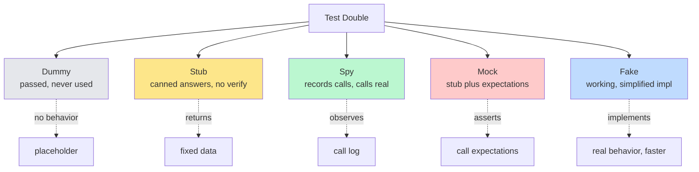
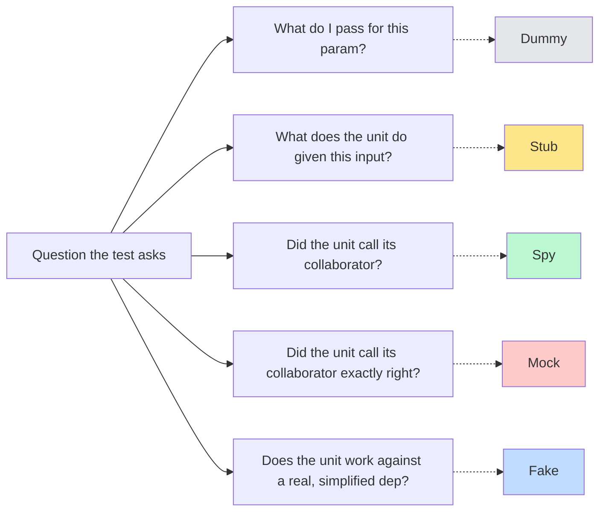

# 5.10 Stubs Spies and Mocks

> A test double is a controlled substitute for a real dependency. Five kinds exist — dummy, stub, spy, mock, fake — and the difference between them is the difference between a test that documents behavior and a test that documents its own mock. Pick the right double and your test survives every refactor; pick the wrong one and you will spend a decade debugging tests that pass in CI and fail in production.

## 1. Purpose

A unit test verifies the behavior of one piece of code, in isolation, fast. "In isolation" means it does not depend on the database, the network, the filesystem, the system clock, or any other slow, stateful, or non-deterministic collaborator. Yet almost no real code is that pure. A service calls a repository, the repository calls a database driver, the driver opens a socket. A controller calls a payment gateway. A job runner emits metrics. A use case publishes an event. The unit under test has dependencies, and those dependencies must exist for the code to run at all.

The solution is substitution: replace the real dependency with a controlled stand-in that the test can program, observe, and reset. That stand-in is called a **test double**, a term coined by Gerard Meszaros in *xUnit Test Patterns* by analogy with the stunt double in film — a body that stands in for the actor when the real one cannot or should not be on set. The test double looks like the real dependency from the outside — same interface, same method names, same argument shapes — but its behavior is whatever the test needs: a canned answer, a recorded call log, a working-but-simplified implementation, or a no-op that satisfies the type checker.

Meszaros identifies five species of test double, distinguished by what they do for the test:

1. **Dummy** — an object passed around but never actually used. It exists to satisfy a parameter list or an interface, not to participate in the test's behavior. The classic example is a logger or a context object that the code under test requires but the test does not exercise.
2. **Stub** — an object that returns predetermined canned answers when its methods are called. The stub does not care what arguments it received, does not record them, and does not verify anything. It exists to feed the unit under test the inputs it expects from its collaborator, so the test can exercise the unit's reaction to those inputs.
3. **Spy** — an object that wraps a real function (or a stub) and records every call made to it: arguments, return value, call count, call order, exceptions thrown. The spy exists so the test can assert, after the fact, that the unit under test called its collaborator in the expected way. A spy still calls the original implementation unless configured otherwise.
4. **Mock** — an object pre-programmed with expectations about the calls it will receive. The mock verifies those expectations itself, either on demand or when the test calls `verify`. Unlike a stub (which only answers) and a spy (which only records), a mock both answers and asserts: it fails the test if the expected calls do not occur, or if unexpected calls do.
5. **Fake** — a working but simplified implementation of the dependency. A fake actually does what the real one does, just in a way that is faster, simpler, or non-persistent. The classic example is an in-memory repository that implements the same `find`, `save`, `delete` interface as the real SQL-backed one, but stores rows in a `Map` instead of in Postgres.

The reason all five exist is that they answer different questions. The dummy answers "what do I pass for this parameter I do not care about?" The stub answers "what does the unit do when its collaborator returns X?" The spy answers "did the unit call its collaborator, and how?" The mock answers "did the unit call its collaborator exactly as agreed?" The fake answers "does the unit work end-to-end against a real, just-simpler, dependency?"

The trade-off across all five is **isolation versus realism**. At the isolation end sits the dummy: zero behavior, zero realism, the unit is maximally isolated from its collaborator. The stub adds canned behavior: still isolated, but the unit is now reacting to a fixed input. The spy adds observability: the unit is still isolated, but the test now sees the calls it made. The mock adds verification: the test now actively checks the calls. At the realism end sits the fake: the unit is no longer isolated from its collaborator's behavior, only from its collaborator's performance characteristics. A unit tested against a fake is almost an integration test; a unit tested against a dummy is the most isolated unit test possible.

Test doubles exist because real dependencies are slow (a Postgres call takes milliseconds, a stubbed call takes microseconds), flaky (a real network call can fail for reasons unrelated to the code), expensive (a real Stripe call costs money), and uncontrollable (you cannot make Stripe return a 502 on demand). Test doubles solve all four problems at once, at the cost of one new risk: the double might not match the real dependency, and tests that pass against the double fail against the real thing. That risk — the **drift problem** — is the central engineering tension in mocking, and it is the reason every test double decision is also a design decision about where to put seams and how to keep them in sync with reality.

This note covers the full vocabulary from Meszaros's taxonomy through the practical mechanics in Jest, Vitest, and Sinon. By the end you should be able to look at any test, name the doubles it uses, decide whether each is the right choice, replace an over-mocked test with a smaller and more honest one, and answer any interview question without hedging. For broader context, see [[5.04 Unit Testing Fundamentals]] and [[5.03 Testability by Design]]. For applying these techniques to the network boundary, see [[5.11 Mocking External Services]].

## 2. Theory and Deep Dive

### 2.1 The Meszaros Taxonomy

Meszaros's five kinds correspond to the five distinct jobs a substitute can do for a test: **passed but unused** (dummy), **return canned answers** (stub), **record calls** (spy), **verify expectations** (mock), or **actually work, simply** (fake). The first four are about replacing behavior; the fifth replaces the implementation while preserving behavior. The first two are passive; the third and fourth are active — they are themselves the assertion.

The clean way to remember the taxonomy:



The taxonomy is exhaustive. A `jest.fn()` configured with `mockResolvedValue(42)` is a stub. The same `jest.fn()` inspected with `expect(fn).toHaveBeenCalledWith('x')` is acting as a mock. A `jest.spyOn(obj, 'method')` with no override is a spy. An in-memory `Map`-backed `UserRepository` is a fake. A `null` passed for an unused `Logger` parameter is a dummy. The vocabulary is small; the mastery is in recognizing which one you need.

### 2.2 The Dummy

The dummy is the simplest double. It exists because the code under test requires a parameter or a dependency that the test does not actually exercise. The classic case is a constructor that takes a logger:

```typescript
// TypeScript
class OrderService {
  constructor(
    private readonly repo: OrderRepository,
    private readonly logger: Logger,   // required, but not exercised by this test
  ) {}
}
```

A test that exercises a code path through `OrderService` which never calls `this.logger` still has to pass something for `logger`, or the constructor will not compile. The something can be `null` (if the type allows), a hand-rolled no-op object (`{ log() {} }`), or an auto-generated dummy from a library. The dummy's contract is only that it satisfies the type; its behavior is irrelevant because the test never invokes it. If the test does invoke it, it is no longer a dummy — it has become a stub or a spy.

Dummies are common when a constructor requires a collaborator a particular code path does not touch (logger, metrics emitter, tracing context, feature-flag client), or when a test data builder requires a field the test does not care about. The risk is that a dummy the test assumes is unused but the production code actually calls will throw a confusing `TypeError`. The mitigation is to make the dummy a real no-op object (`{ log: () => {} }`) rather than `null`, so an unexpected call silently succeeds. A dummy hardened this way is sometimes called a "null object" — a more polite version of the dummy.

### 2.3 The Stub

The stub returns canned answers. Its job is to feed the unit under test the inputs it would have received from a real collaborator, so the test can verify how the unit reacts. The stub does not verify anything; it does not record calls; it does not assert. It just answers.

A stub in Jest or Vitest is a `jest.fn()` (or `vi.fn()`) configured with a return value:

```javascript
// JavaScript, Jest or Vitest
const repo = {
  findById: jest.fn().mockResolvedValue({ id: 1, name: 'Ada' }),
};
const service = createOrderService(repo);
const order = await service.getOrder(1);
expect(order).toEqual({ id: 1, name: 'Ada' });
```

The stub `findById` always returns the same promise of the same user object. The test never asserts on `findById` itself; it asserts on the result of `service.getOrder(1)`. That invisibility is the hallmark of a stub: the assertion is on the unit's output, not on the stub's behavior. Stubs can return different values on successive calls (`mockResolvedValueOnce`), throw (`mockRejectedValue`), or take a custom implementation (`mockImplementation`). The stub remains a stub as long as the test's assertions are about the unit's output, not about the stub's calls.

The risk with stubs is drift: if the stub returns `{ id, name }` but the real repository returns `{ id, name, email }`, the test passes against the stub and the code breaks in production when it expects `email`. The mitigation is contract tests, schema validation, and periodic smoke tests against the real dependency. See [[5.09 Contract Testing with Pact]] for the systematic solution.

### 2.4 The Spy

The spy wraps a real function and records every call made to it: the arguments, the return value, whether it threw, the order of calls. Unlike the stub, the spy still calls the original implementation — unless you configure it not to. The spy exists so the test can assert, after the fact, that the unit under test called its collaborator in the expected way.

In Jest and Vitest, the spy is created with `jest.spyOn(object, 'method')` (or `vi.spyOn`):

```javascript
// JavaScript, Jest or Vitest
const analytics = { track: (event, props) => sendEvent(event, props) };
const trackSpy = jest.spyOn(analytics, 'track');

const service = createOrderService({ repo, analytics });
await service.placeOrder({ id: 1, total: 99 });

expect(trackSpy).toHaveBeenCalledWith('order.placed', { id: 1, total: 99 });
```

The spy wraps `analytics.track` so the test can assert it was called with the right arguments. The original `track` still runs — the spy records the call and passes it through. If the test does not want the original to run (because `sendEvent` makes a real HTTP call), it calls `trackSpy.mockImplementation(...)` to override, making the spy simultaneously a spy (recording) and a stub (returning a canned value). The spy's superpower is observability without modification; its danger is that if you forget to restore it (`trackSpy.mockRestore()` in `afterEach`), the spy persists across tests and pollutes the next test's `analytics.track`.

### 2.5 The Mock

The mock is a stub with expectations. It returns canned answers like a stub, but it also records the calls and the test asserts on those calls. The mock is the most over-used double in modern JavaScript testing, mostly because Jest and Vitest blur the line: a `jest.fn()` is simultaneously a stub (when you configure its return value) and a mock (when you assert on its calls). The same object plays both roles, depending on what the test does with it.

Strictly speaking, the difference between a spy and a mock is the difference between "I observe what happened" and "I declare what must happen." A spy records calls and lets the test query the record. A mock is pre-programmed with expectations checked at verification time. In classical frameworks (Mockito, Moq), this distinction is enforced with separate `when(...).thenReturn(...)` and `verify(...)` steps. In Jest and Vitest, the same `jest.fn()` plays both roles, and verification is done with `expect(fn).toHaveBeenNthCalledWith(1, 'x')`.

In practice, the modern JavaScript usage is:

```javascript
// JavaScript, Jest or Vitest
const sendEmail = jest.fn();              // stub: returns undefined by default
const service = createNotificationService({ sendEmail });

await service.notifyUser({ id: 1, email: 'ada@example.com' }, 'welcome');

expect(sendEmail).toHaveBeenCalledTimes(1);                       // mock assertion
expect(sendEmail).toHaveBeenCalledWith('ada@example.com', 'welcome'); // mock assertion
```

The `sendEmail` function is a stub (returns `undefined` so the service runs without sending email) and a mock (the test asserts it was called once with specific arguments). The mock's job is to verify the unit's interaction with its collaborator, not the unit's output.

The danger of mocks is rigidity. A test that asserts `expect(sendEmail).toHaveBeenCalledWith('ada@example.com', 'welcome', { priority: 'high' })` will fail if the service ever calls `sendEmail` with a slightly different third argument, even if irrelevant to correctness. The test is coupled to the implementation detail of how the service calls `sendEmail`, not just to the outcome. This is the source of "mocks make refactoring painful": every refactor breaks the mock's expectations, even when behavior-preserving. The mitigation is to assert on the minimum necessary and to prefer spies over mocks when you only need to verify that something was called, not exactly how.

### 2.6 The Fake

The fake is a working but simplified implementation of the dependency. Where the stub returns one canned answer per method, the fake actually implements the method, just in a simpler way. The canonical example is the in-memory repository:

```typescript
// TypeScript
class InMemoryUserRepository implements UserRepository {
  private readonly users = new Map<number, User>();
  private nextId = 1;

  async save(data: UserData): Promise<User> {
    const user = { id: this.nextId++, ...data };
    this.users.set(user.id, user);
    return user;
  }

  async findById(id: number): Promise<User | null> {
    return this.users.get(id) ?? null;
  }

  async delete(id: number): Promise<void> {
    this.users.delete(id);
  }
}
```

The fake implements the same `UserRepository` interface as the real SQL-backed repository, with the same method signatures and semantics. The only difference is the storage: a `Map` instead of a Postgres table. The fake is fast, deterministic, and isolated (if each test gets a fresh instance).

The fake's advantage over the stub is realism. A stub returns the same canned answer every time; a fake computes its answer based on prior state — if you `save` a user then `findById` that user's id, you get the user back. A single fake supports arbitrarily complex sequences of operations, where a stub would have to be re-programmed for each call. The fake's disadvantage is implementation cost: you must write it, debug it, and keep it in sync with the real implementation's semantics (uniqueness constraints, soft-delete behavior, etc.). The fake is worth the cost when the dependency has complex stateful behavior — repositories, caches, queues, session stores. It is overkill when the dependency is stateless and one or two stubbed return values are enough.

### 2.7 Frameworks — jest.fn, vi.fn, sinon

Three frameworks dominate JavaScript mocking. **Jest** ships `jest.fn()` (a mock function), `jest.spyOn(obj, 'method')` (a spy on an existing method), and `jest.mock('module', factory)` (whole-module mocking at the import boundary). **Vitest** ships `vi.fn()`, `vi.spyOn`, and `vi.mock` with API-compatible semantics, plus `vi.hoisted` for hoisting mock factories ahead of imports. **Sinon** is the standalone, framework-agnostic library: `sinon.stub(obj, 'method')`, `sinon.spy(obj, 'method')`, `sinon.mock(obj)` (true expectation-based mock), and `sinon.createFakeInstance(Class)`.

The Jest/Vitest mock function is a chameleon. The same `jest.fn()` can be a dummy (if you never configure it and never assert on it), a stub (if you call `mockReturnValue`), a spy (if you wrap a real method with `spyOn` and do not override), or a mock (if you call `expect(fn).toHaveBeenCalledWith`). The framework does not enforce the distinction; the test's intent does. This is convenient but also the source of much confusion: developers say "I am using a mock" when they mean a stub, and the imprecision leaks into how they write tests.

Sinon makes the distinction explicit via separate APIs: `sinon.stub` replaces and returns canned values, `sinon.spy` wraps and records, `sinon.mock` declares expectations up front and verifies at the end. Sinon is more verbose but more honest about which double you are using; it remains the right choice for non-Jest runners (Mocha, node:test) or when you need true expectation-based mocks.

The whole-module mock — `jest.mock('module', factory)` or `vi.mock` — is a fourth pattern, distinct from the five doubles. It replaces an entire imported module with a factory's return value at the module-system level. See [[5.11 Mocking External Services]] for the patterns and pitfalls of whole-module mocking.

### 2.8 Partial Mocks Versus Full Mocks

A **full mock** replaces the entire collaborator; a **partial mock** replaces only some methods of a real object, leaving others to run their real implementations (via `jest.spyOn(obj, 'method').mockImplementation(...)` on select methods). Partial mocks are a smell when overused: if you need most of a real object's behavior but want to stub one method, the right answer is to extract that method into its own collaborator and depend on the collaborator. Partial mocks couple the test to the implementation structure of the real object, so refactoring the real object breaks the test even when behavior is preserved. The legitimate use is testing one method's interaction with another on the same self-contained object — but even that is usually a design smell pointing toward extraction.

### 2.9 Mock-at-the-Boundaries

The single most important rule of mocking is **mock at the boundaries, not in the middle**. A boundary is where your code meets code you do not control: the database driver, the HTTP client, the filesystem, the system clock, the email provider, the message queue. Mocking at the boundaries means introducing a seam at each boundary — your own interface that wraps the external dependency — and mocking that interface in tests. Mocking in the middle means mocking a domain service that is pure business logic, which gives no isolation benefit (it is already fast and deterministic) and breaks the test's connection to real behavior.

The mock-at-the-boundaries rule is the practical application of the dependency inversion principle (see [[4.05 SOLID Dependency Inversion]]). Your code depends on an `HttpClient` interface you own; production wires it to a `fetch`-backed implementation; tests wire it to a mock. The interface is the seam; the mock plugs into the seam. Business logic never touches the network, database, or clock — only interfaces, which are mockable. Tests are fast, deterministic, and isolated. Refactors that swap the implementation behind the interface do not touch the tests.

### 2.10 The Drift Problem

Every test double carries one unavoidable risk: the double might not match the real dependency. The stub returns `{ id, name }` but the real API returns `{ id, name, email }`. The fake enforces no uniqueness constraint but the real database does. The mock expects the service to call `sendEmail(to, subject, body)` but the real `sendEmail` signature is `sendEmail({ to, subject, body })`. The test passes; production breaks.

This is the drift problem, and it is the single biggest source of "works in tests, fails in prod" bugs in mocked codebases. The mitigations, in increasing order of cost and confidence:

1. **Type the double.** If the double is typed to satisfy the same interface as the real dependency, the compiler catches signature drift. A `vi.fn<UserRepository['findById']>()` will not let you return the wrong shape. This catches structural drift but not behavioral drift (the double returns the right shape but the wrong semantics).
2. **Validate with schemas.** Use Zod or JSON Schema to validate every response from the real dependency in production, and to validate every canned response in tests. A schema change forces both sides to update. See [[5.11 Mocking External Services]] for the pattern.
3. **Contract testing.** Use Pact to record consumer-provider interactions and verify them on both sides. The contract is a machine-checked agreement that catches drift automatically. See [[5.09 Contract Testing with Pact]].
4. **Periodic smoke tests.** A small number of tests that hit the real dependency, against a test account, in a separate CI job, run on a schedule rather than per commit. Catches drift before it reaches production, at the cost of slower feedback.
5. **Integration and E2E tests.** The pyramid's upper layers exist precisely to catch what mocks miss. A unit test with mocks verifies the unit's logic; an integration test with real dependencies verifies the unit's wiring. Both are necessary; neither is sufficient alone.

## 3. Mental Models

### 3.1 Dummy = Placeholder, Never Used

The dummy is the placeholder. It exists to satisfy the type checker or the parameter list, not to participate in the test. The dummy is the empty chair at the meeting: required for quorum, silent throughout. If the test ever reads from or writes to the dummy, it is no longer a dummy — it has been promoted to a stub or a spy, and the test should treat it accordingly. The dummy's only job is to be there.

### 3.2 Stub = Canned Answers, No Verify

The stub is the answering machine. You program it with a message ("when asked for user 1, return Ada"), and it plays that message back every time, to every caller. The stub does not care about the caller, does not remember it, does not check it. It just answers. The test's assertion is on the unit's output, never on the stub. The stub is invisible: a means to feed the unit, not a thing the test verifies.

### 3.3 Spy = Records, Still Calls Real

The spy is the wiretap. It wraps a real function, records every call (arguments, return value, exceptions, order), and passes the call through unchanged. The spy observes without interfering. The test can later ask "who called you, with what, and how many times?" The spy is the right tool when you want to verify a call happened but also want the real call to happen — for instance, when the real call is harmless and you want to assert it occurred.

### 3.4 Mock = Stub Plus Expectations

The mock is the actor with a script. You hand it a script ("you will be called once, with these arguments, returning this value"), it performs the script, and at the end it checks whether reality matched. If not, it complains, and the test fails. The mock is both a stub (returns canned answers) and an assertion (verifies the call). The mock's danger is rigidity: every detail in the script is a detail that, if it changes in the real code, breaks the test even when behavior is preserved. Keep scripts minimal.

### 3.5 Fake = Working but Simplified

The fake is the stunt double with real moves. It actually does what the real dependency does — save, find, delete, send — just in a simpler, faster way. You can ask a fake anything, in any order, and it answers based on its internal state. One fake supports arbitrarily complex scenarios; its cost is writing it, debugging it, and keeping it in sync with the real thing's semantics. The fake is the bridge between unit tests and integration tests: realistic enough to catch wiring bugs, fast enough to run thousands of times per second.

### 3.6 The Five Mental Models Side by Side



The diagram is the decision tree. Identify the question the test is asking. The answer tells you which double to use. If you cannot state the question in one of these five forms, you are probably mixing doubles or testing the wrong thing.

## 4. Real-World Use Cases

### 4.1 Stub — Replace a Database Call with a Fixed Response

A `getUserProfile` use case calls `userRepo.findById(id)` and transforms the result into a profile DTO. The test stubs the repository to return a fixed user object and asserts on the DTO. The stub returns the same object every time; the test never touches the real database. If the transformation logic changes, the test changes; if the repository changes (Postgres to Mongo), the test does not.

### 4.2 Spy — Verify a Callback Was Called Without Breaking It

A `BatchProcessor` accepts a `onProgress(percent)` callback and calls it as it works through the batch. The test wants to verify the callback was called with monotonically increasing percentages, but it also wants the processor's real progress tracking to run (because the test also asserts the final result). The test spies on the callback, runs the processor, then asserts on the spy's call log: `expect(spy).toHaveBeenCalledWith(25)`, `expect(spy).toHaveBeenCalledTimes(4)`. The spy records the calls; the real callback (which might update a UI in production) runs harmlessly in the test.

### 4.3 Mock — Verify the Email Service Was Called with the Right Arguments

A `SignupService.signup` creates a user, then calls `emailService.sendWelcome(user.email, user.name)`. The test wants to verify the email was sent with the right arguments, but it must not actually send an email. The test mocks `emailService.sendWelcome` with a `jest.fn()`, runs `signup`, then asserts `expect(sendWelcome).toHaveBeenCalledWith('ada@example.com', 'Ada Lovelace')`. The mock both stubs the method (returns undefined, so signup does not crash) and verifies the call (the assertion fails if signup forgets to send the email, or sends it with the wrong arguments). This is the canonical mock use case: a side-effecting collaborator whose call you must verify but whose real behavior you must suppress.

### 4.4 Fake — In-Memory Repository for a Multi-Step Workflow

A `CheckoutService` orchestrates a five-step workflow: reserve inventory, charge payment, create order, decrement inventory, send confirmation. Each step reads from or writes to the `OrderRepository` and `InventoryRepository`. Stubbing every call sequence would require programming a dozen stubs in the right order. A fake `InMemoryOrderRepository` and `InMemoryInventoryRepository` implement the same interfaces and just work — one fake pair supports dozens of workflow tests with different starting states. The fake is the only practical choice when the dependency's behavior is stateful and the test exercises a multi-step sequence.

### 4.5 Dummy and Real-World Combination

A `TaxCalculator` constructor takes `(rates, logger)`. A test for a pure calculation path passes `{ log: () => {} }` for the logger — a dummy that satisfies the signature but is never asserted on. If a future refactor adds a log call to this path, the dummy silently absorbs it; the test fails, pointing to the refactor.

Real services rarely have one collaborator. A test for `OrderService.placeOrder` typically uses a fake for `orderRepo` (stateful, multi-step), a stub for `paymentGateway` (returns success, no verify), a stub for `inventoryService` (returns availability), a mock for `emailService` (verify the welcome email was sent), and a dummy for `logger` (not exercised on this path). The same test uses all five doubles, each chosen for the question that part of the test is asking. Mastery of test doubles is not picking one and using it everywhere; it is picking the right one for each collaborator in each test.

## 5. Code Examples

### 5.1 Example A — Minimal and Conceptual

Five doubles, five lines each. The goal is to show the shape of each double in its smallest form, in both JavaScript and TypeScript, using Vitest (the API is identical in Jest, swap `vi` for `jest`).

#### 5.1.1 JavaScript

```javascript
// minimalDoubles.test.js
import { vi, test, expect } from 'vitest';

// Dummy: a placeholder logger, never called by this test
const dummyLogger = { log: () => {} };

// Stub: returns a canned user, no assertions on the stub itself
const userStub = { findById: vi.fn().mockResolvedValue({ id: 1, name: 'Ada' }) };

// Spy: wraps a real function, records calls, lets the real function run
const analytics = { track: (event) => `tracked:${event}` };
const trackSpy = vi.spyOn(analytics, 'track');

// Mock: stub plus assertion
const emailMock = vi.fn();

// Fake: working but simplified repository
const fakeRepo = (() => {
  const users = new Map();
  return {
    save: async (u) => { users.set(u.id, u); return u; },
    findById: async (id) => users.get(id) ?? null,
  };
})();

test('all five doubles in one test', async () => {
  const user = await userStub.findById(1);
  expect(user).toEqual({ id: 1, name: 'Ada' });  // assertion on the unit, not the stub

  analytics.track('page.view');
  expect(trackSpy).toHaveBeenCalledWith('page.view');  // spy records the call
  expect(analytics.track('page.view')).toBe('tracked:page.view');  // real function still works

  emailMock('ada@example.com', 'welcome');
  expect(emailMock).toHaveBeenCalledTimes(1);  // mock assertion
  expect(emailMock).toHaveBeenCalledWith('ada@example.com', 'welcome');

  await fakeRepo.save({ id: 7, name: 'Grace' });
  expect(await fakeRepo.findById(7)).toEqual({ id: 7, name: 'Grace' });  // fake has state
  expect(await fakeRepo.findById(99)).toBeNull();

  // dummyLogger is never called; it just satisfies a parameter list
  expect(dummyLogger.log).toBeDefined();
});
```

#### 5.1.2 TypeScript

```typescript
// minimalDoubles.test.ts — type annotations shown; test body mirrors the JS version
import { vi, test, expect } from 'vitest';

interface User { id: number; name: string; }
interface Logger { log(message: string): void; }
interface UserRepository {
  save(user: User): Promise<User>;
  findById(id: number): Promise<User | null>;
}
interface EmailService { send(to: string, subject: string): Promise<void>; }

// Dummy: typed as Logger, never called
const dummyLogger: Logger = { log: () => {} };

// Stub: typed as UserRepository, returns a canned user
const userStub: UserRepository = {
  findById: vi.fn<UserRepository['findById']>().mockResolvedValue({ id: 1, name: 'Ada' }),
  save: vi.fn<UserRepository['save']>().mockResolvedValue({ id: 1, name: 'Ada' }),
};

// Spy: wraps a real function on a typed object
const analytics: { track: (event: string) => string } = { track: (event) => `tracked:${event}` };
const trackSpy = vi.spyOn(analytics, 'track');

// Mock: typed as EmailService['send'], stub plus assertion
const emailMock: EmailService['send'] = vi.fn().mockResolvedValue(undefined);

// Fake: implements UserRepository with in-memory state
const makeFakeRepo = (): UserRepository => {
  const users = new Map<number, User>();
  return {
    save: async (u) => { users.set(u.id, u); return u; },
    findById: async (id) => users.get(id) ?? null,
  };
};
const fakeRepo = makeFakeRepo();

// The test body is identical to the JS version. The `vi.fn<Signature>()` syntax
// makes the mock type-check against the real method signature, so structural
// drift between the double and the real interface is a compile error, not a
// runtime surprise — the single biggest benefit of TypeScript for mocking.
```

### 5.2 Example B — Production-Grade

A production-grade `OrderService` with five collaborators, each demonstrated with the appropriate double. The service has `placeOrder`, `cancelOrder`, and `getOrder`. The tests cover happy path, error propagation, and side-effect verification, with the right double for each question.

#### 5.2.1 JavaScript — Service and Doubles

```javascript
// orderService.js
export const createOrderService = (deps) => {
  const { orderRepo, paymentGateway, inventoryService, emailService, logger, clock } = deps;

  return {
    async placeOrder({ userId, items, paymentMethodId }) {
      const total = items.reduce((sum, i) => sum + i.price * i.qty, 0);
      const available = await inventoryService.checkAvailability(items);
      if (!available) {
        logger.log(`order rejected: out of stock for user ${userId}`);
        return { status: 'rejected', reason: 'out-of-stock' };
      }
      const charge = await paymentGateway.charge({ amount: total, paymentMethodId });
      if (charge.status !== 'succeeded') {
        logger.log(`order rejected: payment failed for user ${userId}`);
        return { status: 'rejected', reason: 'payment-failed' };
      }
      const order = await orderRepo.save({
        userId, items, total, chargeId: charge.id, status: 'confirmed',
        placedAt: clock.now(),
      });
      await emailService.sendOrderConfirmation(userId, order.id);
      return { status: 'confirmed', orderId: order.id, total };
    },

    async cancelOrder(orderId) {
      const order = await orderRepo.findById(orderId);
      if (!order) throw new Error(`order ${orderId} not found`);
      if (order.status === 'cancelled') return order;
      await paymentGateway.refund(order.chargeId);
      const updated = await orderRepo.update(orderId, { status: 'cancelled', cancelledAt: clock.now() });
      await emailService.sendCancellationNotice(order.userId, orderId);
      return updated;
    },

    async getOrder(orderId) {
      return orderRepo.findById(orderId);
    },
  };
};
```

#### 5.2.2 JavaScript — Tests

```javascript
// orderService.test.js
import { vi, describe, test, expect, beforeEach, afterEach } from 'vitest';
import { createOrderService } from './orderService.js';

// Fake: in-memory repository; Stub: payment + inventory + clock; Mock: email; Dummy: logger
const makeDeps = () => {
  const store = new Map(); let nextId = 1;
  return {
    orderRepo: {
      save: vi.fn(async (data) => { const o = { id: nextId++, ...data }; store.set(o.id, o); return o; }),
      findById: vi.fn(async (id) => store.get(id) ?? null),
      update: vi.fn(async (id, patch) => { const cur = store.get(id); const upd = { ...cur, ...patch }; store.set(id, upd); return upd; }),
    },
    paymentGateway: { charge: vi.fn().mockResolvedValue({ id: 'ch-1', status: 'succeeded' }), refund: vi.fn().mockResolvedValue({ id: 'rf-1', status: 'succeeded' }) },
    inventoryService: { checkAvailability: vi.fn().mockResolvedValue(true) },
    emailService: { sendOrderConfirmation: vi.fn().mockResolvedValue(undefined), sendCancellationNotice: vi.fn().mockResolvedValue(undefined) },
    logger: { log: vi.fn() },
    clock: { now: vi.fn(() => new Date('2025-01-01T00:00:00Z')) },
  };
};

describe('OrderService.placeOrder', () => {
  let deps, service;
  beforeEach(() => { deps = makeDeps(); service = createOrderService(deps); });
  afterEach(() => vi.restoreAllMocks());

  test('happy path: confirms order, charges, sends email', async () => {
    const result = await service.placeOrder({ userId: 1, items: [{ price: 50, qty: 2 }], paymentMethodId: 'pm-1' });
    expect(result).toEqual({ status: 'confirmed', orderId: 1, total: 100 });
    // Mock: email was sent with the right args
    expect(deps.emailService.sendOrderConfirmation).toHaveBeenCalledWith(1, 1);
    // Stub (incidental): payment was charged with the right amount
    expect(deps.paymentGateway.charge).toHaveBeenCalledWith({ amount: 100, paymentMethodId: 'pm-1' });
    // Fake has state: the order was persisted
    expect((await service.getOrder(1)).status).toBe('confirmed');
  });

  test('out of stock: rejects without charging or emailing', async () => {
    deps.inventoryService.checkAvailability.mockResolvedValueOnce(false);
    const result = await service.placeOrder({ userId: 1, items: [{ price: 50, qty: 2 }], paymentMethodId: 'pm-1' });
    expect(result).toEqual({ status: 'rejected', reason: 'out-of-stock' });
    expect(deps.paymentGateway.charge).not.toHaveBeenCalled();
    expect(deps.emailService.sendOrderConfirmation).not.toHaveBeenCalled();
    // Dummy was called (the logger logged the rejection)
    expect(deps.logger.log).toHaveBeenCalledWith(expect.stringContaining('out of stock'));
  });

  test('payment failed: rejects without emailing', async () => {
    deps.paymentGateway.charge.mockResolvedValueOnce({ id: 'ch-x', status: 'declined' });
    const result = await service.placeOrder({ userId: 1, items: [{ price: 50, qty: 2 }], paymentMethodId: 'pm-1' });
    expect(result).toEqual({ status: 'rejected', reason: 'payment-failed' });
    expect(deps.emailService.sendOrderConfirmation).not.toHaveBeenCalled();
  });
});

// cancelOrder follows the same pattern: a fake repo with pre-seeded state,
// a stubbed refund, a mocked sendCancellationNotice, and assertions on the
// result plus the email side effect. The idempotency case (already-cancelled
// order returns without refunding) uses the same fake with a 'cancelled' seed.
```

#### 5.2.3 TypeScript — Service and Types

```typescript
// orderService.ts — interface definitions shown; implementation mirrors the JS version
export interface User { id: number; name: string; }
export interface OrderItem { sku: string; price: number; qty: number; }
export interface Order {
  id: number; userId: number; items: OrderItem[]; total: number;
  chargeId: string; status: 'confirmed' | 'cancelled' | 'rejected';
  placedAt?: Date; cancelledAt?: Date;
}
export interface PlaceOrderInput { userId: number; items: OrderItem[]; paymentMethodId: string; }
export type PlaceOrderResult =
  | { status: 'confirmed'; orderId: number; total: number }
  | { status: 'rejected'; reason: 'out-of-stock' | 'payment-failed' };

export interface OrderRepository {
  save(data: Omit<Order, 'id'>): Promise<Order>;
  findById(id: number): Promise<Order | null>;
  update(id: number, patch: Partial<Order>): Promise<Order>;
}
export interface PaymentGateway {
  charge(input: { amount: number; paymentMethodId: string }): Promise<{ id: string; status: 'succeeded' | 'declined' }>;
  refund(chargeId: string): Promise<{ id: string; status: 'succeeded' | 'declined' }>;
}
export interface InventoryService { checkAvailability(items: OrderItem[]): Promise<boolean>; }
export interface EmailService {
  sendOrderConfirmation(userId: number, orderId: number): Promise<void>;
  sendCancellationNotice(userId: number, orderId: number): Promise<void>;
}
export interface Logger { log(message: string): void; }
export interface Clock { now(): Date; }

export interface OrderServiceDeps {
  orderRepo: OrderRepository; paymentGateway: PaymentGateway;
  inventoryService: InventoryService; emailService: EmailService;
  logger: Logger; clock: Clock;
}
export interface OrderService {
  placeOrder(input: PlaceOrderInput): Promise<PlaceOrderResult>;
  cancelOrder(orderId: number): Promise<Order>;
  getOrder(orderId: number): Promise<Order | null>;
}
// createOrderService(deps: OrderServiceDeps): OrderService — body identical to the JS version,
// with the compiler checking every collaborator call against its interface.
```

#### 5.2.4 TypeScript — Fakes, Builders, and Tests

```typescript
// testing/fakes.ts and testing/builders.ts — merged
import { vi } from 'vitest';
import type { OrderRepository, Order, Logger, Clock, PaymentGateway, InventoryService, EmailService } from '../orderService';

export const makeFakeOrderRepo = (): OrderRepository => {
  const store = new Map<number, Order>();
  let nextId = 1;
  return {
    save: async (data) => { const o = { id: nextId++, ...data }; store.set(o.id, o); return o; },
    findById: async (id) => store.get(id) ?? null,
    update: async (id, patch) => { const cur = store.get(id); if (!cur) throw new Error(`order ${id} not found`); const upd = { ...cur, ...patch }; store.set(id, upd); return upd; },
  };
};
export const makeNoopLogger = (): Logger => ({ log: () => {} });
export const makeFixedClock = (iso: string): Clock => ({ now: () => new Date(iso) });

export const makeMockPaymentGateway = (overrides: Partial<PaymentGateway> = {}): PaymentGateway => ({
  charge: vi.fn().mockResolvedValue({ id: 'ch-1', status: 'succeeded' as const }),
  refund: vi.fn().mockResolvedValue({ id: 'rf-1', status: 'succeeded' as const }),
  ...overrides,
});
export const makeMockInventoryService = (overrides: Partial<InventoryService> = {}): InventoryService => ({
  checkAvailability: vi.fn().mockResolvedValue(true), ...overrides,
});
export const makeMockEmailService = (overrides: Partial<EmailService> = {}): EmailService => ({
  sendOrderConfirmation: vi.fn().mockResolvedValue(undefined),
  sendCancellationNotice: vi.fn().mockResolvedValue(undefined),
  ...overrides,
});
```

```typescript
// orderService.test.ts
import { vi, describe, test, expect, beforeEach, afterEach } from 'vitest';
import { createOrderService, type OrderServiceDeps } from './orderService';
import { makeFakeOrderRepo, makeNoopLogger, makeFixedClock, makeMockPaymentGateway, makeMockInventoryService, makeMockEmailService } from './testing';

const makeDeps = (overrides: Partial<OrderServiceDeps> = {}): OrderServiceDeps => ({
  orderRepo: makeFakeOrderRepo(),
  paymentGateway: makeMockPaymentGateway(),
  inventoryService: makeMockInventoryService(),
  emailService: makeMockEmailService(),
  logger: makeNoopLogger(),
  clock: makeFixedClock('2025-01-01T00:00:00Z'),
  ...overrides,
});

describe('OrderService.placeOrder', () => {
  let deps: OrderServiceDeps;
  beforeEach(() => { deps = makeDeps(); });
  afterEach(() => { vi.restoreAllMocks(); });

  test('happy path: confirms order, charges, sends email', async () => {
    const service = createOrderService(deps);
    const result = await service.placeOrder({ userId: 1, items: [{ sku: 'A', price: 50, qty: 2 }], paymentMethodId: 'pm-1' });
    expect(result).toEqual({ status: 'confirmed', orderId: 1, total: 100 });
    expect(deps.emailService.sendOrderConfirmation).toHaveBeenCalledWith(1, 1);
    expect(await service.getOrder(1)).toMatchObject({ status: 'confirmed', placedAt: new Date('2025-01-01T00:00:00Z') });
  });

  test('out of stock: rejects without charging or emailing', async () => {
    deps.inventoryService = makeMockInventoryService({ checkAvailability: vi.fn().mockResolvedValue(false) });
    const result = await createOrderService(deps).placeOrder({ userId: 1, items: [{ sku: 'A', price: 50, qty: 2 }], paymentMethodId: 'pm-1' });
    expect(result).toEqual({ status: 'rejected', reason: 'out-of-stock' });
    expect(deps.paymentGateway.charge).not.toHaveBeenCalled();
  });

  test('payment failed: rejects without emailing', async () => {
    deps.paymentGateway = makeMockPaymentGateway({ charge: vi.fn().mockResolvedValue({ id: 'ch-x', status: 'declined' as const }) });
    const result = await createOrderService(deps).placeOrder({ userId: 1, items: [{ sku: 'A', price: 50, qty: 2 }], paymentMethodId: 'pm-1' });
    expect(result).toEqual({ status: 'rejected', reason: 'payment-failed' });
  });
});
// cancelOrder tests follow the same structure, asserting on result, refund stub, and email mock.
```

The TypeScript version pays off in three places. First, the `OrderServiceDeps` interface means a missing collaborator is a compile error, not a runtime `TypeError`. Second, the `vi.fn<OrderRepository['save']>()` typing (used implicitly through the builders) means a stub returning the wrong shape is a compile error. Third, the discriminated union `PlaceOrderResult` makes incomplete handling of the `'rejected'` cases a compile error. The cost is more code; the benefit is that whole categories of drift become impossible.

## 6. Common Mistakes and Anti-Patterns

### 6.1 Over-Mocking (Over-Isolation)

The most common mistake is mocking everything. Every collaborator becomes a mock, every mock is asserted on with `toHaveBeenCalledTimes` and `toHaveBeenCalledWith`, and the test verifies the implementation's call sequence rather than its behavior. The test passes, but every refactor — even a behavior-preserving one — breaks it, because the call sequence changed. The fix is to identify which mocks are load-bearing (their assertion is the point of the test) and which are incidental. Demote the incidental mocks to stubs: drop the `expect(mock).toHaveBeenCalledWith(...)` lines and only assert on the unit's output. The test now verifies behavior, not call sequence, and survives refactors.

### 6.2 Mocking the Wrong Layer (Mocking the Implementation, Not the Interface)

The second mistake is mocking a concrete class or a third-party module directly, instead of mocking an interface you own. A test that does `jest.mock('aws-sdk', ...)` is coupled to the AWS SDK's import shape; switching to `@aws-sdk/client-s3` v3 breaks every test. The fix is the mock-at-the-boundaries rule: wrap every external dependency in your own interface, depend on the interface, mock the interface. The wrapper is one file; the SDK upgrade touches one file. See [[5.11 Mocking External Services]] and [[4.05 SOLID Dependency Inversion]].

### 6.3 Not Restoring Mocks (Cross-Test Pollution)

The third mistake is forgetting to restore mocks between tests. A `vi.spyOn` that overrides a method persists across tests unless `mockRestore()` is called — the next test's method is still the mock. The symptom is tests that pass in isolation but fail in the suite, or pass in one order and fail in another, or fail only on CI. The fix is discipline: always `afterEach(() => vi.restoreAllMocks())`, set in the test setup file so it runs for every test. The cost is zero; the benefit is eliminating an entire class of order-dependent flakiness.

### 6.4 Testing the Mock Instead of the Code

The fourth mistake is writing a test whose assertion is entirely about the mock, with no assertion about the unit under test. The test calls `service.placeOrder(...)`, then asserts `expect(emailMock).toHaveBeenCalledWith(...)`, and that is the whole test. If the service is later refactored to return an `Order` object instead of a status, the test still passes, because the mock is still called. The fix is to always include at least one assertion on the unit's output (return value, thrown error, state change). Mock assertions supplement output assertions; they do not replace them.

### 6.5 Mocks Too Rigid (Asserting on Irrelevant Arguments)

The fifth mistake is asserting on every argument of every call, including arguments irrelevant to correctness. A test that asserts `expect(emailMock).toHaveBeenCalledWith('ada@example.com', 'welcome', 'en-US', 'html', { priority: 'normal' })` will fail if the service ever changes the priority, even though that change is irrelevant to whether the email was sent. The fix is to assert on the minimum: `expect(emailMock).toHaveBeenCalledWith('ada@example.com', 'welcome', expect.anything(), expect.anything(), expect.anything())` verifies the load-bearing parts and ignores the rest, surviving refactors that change only the irrelevant parts.

### 6.6 Using a Mock When a Fake Is Better

The sixth mistake is using a mock where a fake would be simpler. A test that orchestrates a five-step workflow against a `UserRepository` mocks `save`, `findById`, `update` with `mockResolvedValueOnce` chains — 20 lines of brittle setup that breaks if the workflow ever calls `findById` twice. A fake `InMemoryUserRepository` supports all five steps with no per-test configuration, and the test is 5 lines. Reach for a fake when the dependency has at least two stateful methods that interact (save and findById, or push and pop); stick with stubs for stateless collaborators (a single `charge` call).

## 7. Best Practices and Design Patterns

### 7.1 Mock at the Boundaries

The single most important practice. Identify every boundary — database, HTTP, filesystem, clock, email, queue, third-party SDK — and wrap each in your own interface. Depend on the interface in your business logic; wire it to the real implementation in production and to a mock or fake in tests. The interface is the seam; the mock plugs into the seam. Business logic stays pure (no I/O), tests are fast and deterministic, and the choice of database or HTTP library becomes a deployment detail. See [[5.03 Testability by Design]] and [[4.05 SOLID Dependency Inversion]].

### 7.2 Prefer Fakes for Complex, Stateful Behavior

When a collaborator's behavior is stateful and complex — a repository with save/find/update/delete, a cache with get/set/invalidate, a session store — write a fake. The fake supports arbitrarily complex scenarios with zero per-test configuration, and catches integration bugs that stubs cannot (a workflow that calls `save` then `findById` and expects to get the saved object back). A single fake reused across dozens of tests is cheaper than dozens of stub configurations.

### 7.3 Use Spies to Verify Calls Without Suppressing Behavior

When the collaborator's real behavior is harmless (a synchronous in-memory operation, a logger, a metrics emitter) and you only want to verify the call happened, use a spy instead of a mock. The spy records the call and lets the real implementation run, so the test exercises the real collaborator and verifies the call — more honest than mocking, because it verifies both that the unit called the collaborator and that the collaborator itself works.

### 7.4 Restore Mocks in afterEach

Always. `afterEach(() => vi.restoreAllMocks())` or `afterEach(() => jest.restoreAllMocks())`. Set it once in the test setup file so it applies to every test. The cost is zero; the benefit is eliminating an entire class of cross-test pollution bugs. If you need to keep a mock's state across tests in a single `describe`, do it explicitly with `beforeEach`, not implicitly by forgetting to restore.

### 7.5 Do Not Mock What You Do Not Own (Mock Your Wrapper)

Mocking a third-party module directly couples your tests to that module's import shape and API. When the module upgrades, your tests break even if your code is unchanged. Instead, wrap the third-party module in your own interface (a thin adapter), depend on the interface, and mock the interface. The adapter has its own tests against the real module; your business logic's tests mock the interface and are decoupled from the third-party module's API churn.

### 7.6 Test Behavior, Not Call Counts, When Possible

The strongest tests assert on the unit's observable behavior: return value, thrown error, state change. Call-count and call-argument assertions are weaker because they couple the test to the implementation. When you must assert on calls (because the call itself is the side effect), assert on the minimum necessary: `expect(email).toHaveBeenCalledWith('ada@example.com', 'welcome')` is more resilient than `expect(email).toHaveBeenCalledWith('ada@example.com', 'welcome', 'en-US', 'html', { priority: 'normal' })`, because the first survives a change to the priority and the second does not.

### 7.7 Use Builders and Keep Doubles Close to the Real Interface

Hand-rolling a mock in every test is verbose and inconsistent. Build factories — `makeMockUserRepo`, `makeFakeOrderRepo` — that return fully wired doubles with sensible defaults, each test overriding only what it needs. The factories live in a `testing/` directory and form a single place to update when the real interface changes. Type every double against the real interface (`vi.fn<UserRepository['save']>()`) so structural drift is a compile error. For behavioral drift, validate responses with Zod or JSON Schema; for high-confidence drift detection, use contract testing (see [[5.09 Contract Testing with Pact]]).

### 7.8 Reset State and Document Why

Mock restoration resets call counts but not state in fakes or module-level singletons. A fake `InMemoryUserRepository` that persists across tests will see rows from previous tests, leading to order-dependent failures. Reset fake state in `beforeEach` (construct a fresh fake per test). The rule: every test starts from a clean slate. Finally, document why each double exists: a comment explaining "stub charge to return succeeded so we can verify the happy path without hitting Stripe" survives refactors; the what is what the code already says. A test suite where every mock has a why-comment is a suite that can be refactored with confidence.

## 8. Technical Interview Knowledge

### 8.1 Q: What is the difference between a stub, a spy, and a mock?

A stub returns canned answers when its methods are called. It does not record calls or verify anything; its job is to feed the unit the inputs it expects from its collaborator. A spy wraps a real function and records every call — arguments, return value, count, order — while still calling the original. A mock is a stub with expectations: it returns canned answers like a stub, but the test also asserts on the calls, so the mock is itself part of the verification. In Jest and Vitest, the same `vi.fn()` plays all three roles depending on how the test configures and asserts on it; in Sinon, the three are distinct APIs.

### 8.2 Q: What is a test double?

A test double is any object that stands in for a real dependency during a test, by analogy with a stunt double in film. The double looks like the real dependency from the outside — same interface, same method names — but its behavior is whatever the test needs. Meszaros identifies five kinds: dummy (passed but never used), stub (canned answers), spy (records calls), mock (stub plus expectations), and fake (working but simplified implementation). The double exists because real dependencies are often slow, non-deterministic, expensive, or uncontrollable.

### 8.3 Q: What is a fake?

A fake is a test double that actually implements the dependency's interface, just in a simpler way. The canonical example is an in-memory repository: same `save`, `findById`, `update`, `delete` methods as the real SQL-backed repository, but backed by a `Map` instead of a Postgres table. The fake has state, computes answers based on prior calls, and supports arbitrarily complex sequences of operations. This distinguishes it from a stub, which returns one canned answer per method regardless of prior calls. The trade-off is that the fake must be written, debugged, and kept in sync with the real implementation's semantics.

### 8.4 Q: Mock versus fake — when do you use each?

Use a mock when the test's question is "did the unit call its collaborator in the expected way?" — only the call matters, so the mock stubs the behavior and asserts on the call. Use a fake when the test's question is "does the unit work end-to-end against a real, just-simplified, dependency?" — the behavior matters, the unit exercises a multi-step workflow, and the fake supports it with real state. Rule of thumb: if the collaborator is stateless and the test makes one call, use a mock; if stateful and the test makes a sequence of calls, use a fake.

### 8.5 Q: How do you mock a dependency in JavaScript?

Three mechanisms. First, dependency injection: pass the dependency as a parameter and pass a mock in tests — the cleanest approach, works with any runner. Second, `jest.spyOn`/`vi.spyOn`: wrap an existing method with a spy, optionally override with `mockImplementation`, restore with `mockRestore`. Third, `jest.mock`/`vi.mock`: replace an entire imported module with the factory's return value — necessary for mocking libraries you do not own. Injection is preferred (makes the seam explicit); module mocking is necessary when the dependency is imported directly without an injection seam.

### 8.6 Q: What is the mock-at-the-boundaries rule?

Mock at the boundaries, not in the middle. A boundary is where your code meets code you do not control: the database driver, the HTTP client, the filesystem, the system clock, the email provider. Introduce a seam at each boundary — your own interface that wraps the external dependency — and mock that interface in tests. Do not mock pure business logic: a domain service that is already fast and deterministic does not need a mock; mocking it gives no isolation benefit and breaks the test's connection to real behavior. The rule is the practical application of dependency inversion: depend on interfaces you own, mock those interfaces, leave pure business logic unmocked.

### 8.7 Q: How do you handle mock pollution across tests?

Three practices. First, always restore mocks in `afterEach`: `vi.restoreAllMocks()` or `jest.restoreAllMocks()`. This resets call counts, implementations, and spies — set it once in the test setup file. Second, construct fresh fakes in `beforeEach`: a fake `InMemoryUserRepository` persists state across tests, so each test must get a fresh instance. Third, scope module mocks to files that need them: `jest.mock` applies to the whole file, so unrelated tests should live in separate files. For per-test module mocking, use `jest.doMock` (not hoisted) with dynamic `import()`. The combination — restore mocks, reset fake state, scope module mocks — eliminates cross-test pollution.

### 8.8 Q: What is wrong with over-mocking?

Over-mocking has three costs. First, it couples tests to implementation: every mock assertion on call counts or arguments is a detail the test depends on, so every refactor — even a behavior-preserving one — breaks the test. Second, it isolates the unit from real behavior: if the mock drifts from the real dependency, the test passes but production breaks. Third, it makes the suite harder to maintain: every collaborator needs a mock, every mock needs configuration, every refactor needs mock updates. The fix is to mock only at boundaries, prefer fakes for stateful collaborators, assert on behavior rather than calls, and keep mock assertions minimal.

## 9. Practical Exercises

### 9.1 Exercise 1 — Write Each Double Type

Write a single test file that demonstrates all five doubles (dummy, stub, spy, mock, fake) against a small `UserService` with `getUser`, `createUser`, and `notify` methods. Use Vitest or Jest.

#### 9.1.1 JavaScript Solution

```javascript
// userService.js
export const createUserService = (deps) => {
  const { repo, emailer, logger } = deps;
  return {
    getUser: (id) => repo.findById(id),
    createUser: async (data) => {
      const user = await repo.save(data);
      logger.log(`created user ${user.id}`);
      await emailer.send(user.email, 'welcome');
      return user;
    },
    notify: async (id, message) => {
      const user = await repo.findById(id);
      if (!user) throw new Error('not found');
      await emailer.send(user.email, message);
    },
  };
};
```

```javascript
// userService.test.js
import { vi, test, expect, afterEach } from 'vitest';
import { createUserService } from './userService.js';

afterEach(() => vi.restoreAllMocks());

const makeDeps = (overrides = {}) => ({
  repo: { findById: vi.fn().mockResolvedValue({ id: 1, email: 'a@b.c' }), save: vi.fn() },
  emailer: { send: vi.fn().mockResolvedValue() },
  logger: { log: vi.fn() },
  ...overrides,
});

test('dummy: logger is passed but never asserted on; stub: repo returns a canned user', async () => {
  const service = createUserService(makeDeps());
  const user = await service.getUser(1);
  expect(user).toEqual({ id: 1, email: 'a@b.c' });  // assertion on output, not on the stub or dummy
});

test('spy: emailer.send is wrapped, records calls, real implementation runs', async () => {
  const realEmailer = { send: async (to, subject) => `sent:${to}:${subject}` };
  const sendSpy = vi.spyOn(realEmailer, 'send');
  const service = createUserService(makeDeps({ emailer: realEmailer }));
  await service.notify(1, 'hello');
  expect(sendSpy).toHaveBeenCalledWith('a@b.c', 'hello');
});

test('mock: emailer is asserted on with exact arguments', async () => {
  const deps = makeDeps({ repo: { findById: vi.fn(), save: vi.fn().mockResolvedValue({ id: 7, email: 'a@b.c' }) } });
  await createUserService(deps).createUser({ email: 'a@b.c', name: 'Ada' });
  expect(deps.emailer.send).toHaveBeenCalledTimes(1);
  expect(deps.emailer.send).toHaveBeenCalledWith('a@b.c', 'welcome');
});

test('fake: in-memory repo supports multi-step workflow', async () => {
  const makeFakeRepo = () => {
    const users = new Map(); let nextId = 1;
    return {
      save: async (data) => { const u = { id: nextId++, ...data }; users.set(u.id, u); return u; },
      findById: async (id) => users.get(id) ?? null,
    };
  };
  const service = createUserService(makeDeps({ repo: makeFakeRepo() }));
  const created = await service.createUser({ email: 'a@b.c', name: 'Ada' });
  expect(await service.getUser(created.id)).toEqual(created);
});
```

#### 9.1.2 TypeScript Solution

```typescript
// userService.ts — types shown; implementation mirrors the JS version
export interface User { id: number; email: string; name: string; }
export interface UserData { email: string; name: string; }
export interface UserRepository {
  save(data: UserData): Promise<User>;
  findById(id: number): Promise<User | null>;
}
export interface Emailer { send(to: string, subject: string): Promise<void>; }
export interface Logger { log(message: string): void; }
export interface UserService {
  getUser(id: number): Promise<User | null>;
  createUser(data: UserData): Promise<User>;
  notify(id: number, message: string): Promise<void>;
}
// createUserService(deps): UserService — body identical to JS.
```

```typescript
// userService.test.ts — type annotations shown; test bodies mirror the JS version
import { vi, test, expect, afterEach } from 'vitest';
import { createUserService, type UserRepository, type Emailer, type User } from './userService';

afterEach(() => vi.restoreAllMocks());

const makeDeps = (overrides: Partial<{ repo: UserRepository; emailer: Emailer; logger: { log: (m: string) => void } }> = {}) => ({
  repo: { findById: vi.fn<UserRepository['findById']>().mockResolvedValue({ id: 1, email: 'a@b.c', name: 'Ada' }), save: vi.fn<UserRepository['save']>() } as UserRepository,
  emailer: { send: vi.fn<Emailer['send']>().mockResolvedValue(undefined) } as Emailer,
  logger: { log: vi.fn() },
  ...overrides,
});

test('dummy and stub: output asserted, doubles not', async () => {
  const user = await createUserService(makeDeps()).getUser(1);
  expect(user).toEqual({ id: 1, email: 'a@b.c', name: 'Ada' });
});

test('fake: in-memory repo supports multi-step workflow', async () => {
  const makeFakeRepo = (): UserRepository => {
    const users = new Map<number, User>(); let nextId = 1;
    return {
      save: async (data) => { const u = { id: nextId++, ...data }; users.set(u.id, u); return u; },
      findById: async (id) => users.get(id) ?? null,
    };
  };
  const service = createUserService(makeDeps({ repo: makeFakeRepo() }));
  const created = await service.createUser({ email: 'a@b.c', name: 'Ada' });
  expect(await service.getUser(created.id)).toEqual(created);
});
// The spy and mock tests mirror the JS versions with `vi.fn<Signature>()` type parameters.
```

### 9.2 Exercise 2 — Mock a Database Dependency

A `ReportService` depends on a `ReportRepository` with `findById` and `save`. The service's `generateReport` method loads a report template, fills it with data, and saves the result. Write a test that mocks the repository to verify the service loads the right template and saves the right result.

#### 9.2.1 JavaScript Solution

```javascript
// reportService.js
export const createReportService = (deps) => {
  const { repo, clock } = deps;
  return {
    generateReport: async (templateId, data) => {
      const template = await repo.findById(templateId);
      if (!template) throw new Error(`template ${templateId} not found`);
      const rendered = template.body.replace(/\{\{(\w+)\}\}/g, (unused, key) => data[key] ?? '');
      const report = { templateId, body: rendered, generatedAt: clock.now() };
      return repo.save(report);
    },
  };
};
```

```javascript
// reportService.test.js
import { vi, test, expect, afterEach } from 'vitest';
import { createReportService } from './reportService.js';

afterEach(() => vi.restoreAllMocks());

test('generateReport loads template, renders, and saves', async () => {
  const repo = {
    findById: vi.fn().mockResolvedValue({ id: 't1', body: 'Hello {{name}}, today is {{day}}.' }),
    save: vi.fn().mockImplementation(async (r) => ({ id: 'r1', ...r })),
  };
  const clock = { now: () => new Date('2025-01-01T00:00:00Z') };
  const result = await createReportService({ repo, clock }).generateReport('t1', { name: 'Ada', day: 'Monday' });
  expect(result).toEqual({ id: 'r1', templateId: 't1', body: 'Hello Ada, today is Monday.', generatedAt: new Date('2025-01-01T00:00:00Z') });
  expect(repo.findById).toHaveBeenCalledWith('t1');
  expect(repo.save).toHaveBeenCalledWith({ templateId: 't1', body: 'Hello Ada, today is Monday.', generatedAt: new Date('2025-01-01T00:00:00Z') });
});

test('throws when template does not exist', async () => {
  const repo = { findById: vi.fn().mockResolvedValue(null), save: vi.fn() };
  const service = createReportService({ repo, clock: { now: () => new Date() } });
  await expect(service.generateReport('nope', {})).rejects.toThrow('template nope not found');
  expect(repo.save).not.toHaveBeenCalled();
});
```

#### 9.2.2 TypeScript Solution

```typescript
// reportService.ts — types shown; implementation mirrors the JS version
export interface ReportTemplate { id: string; body: string; }
export interface Report { id?: string; templateId: string; body: string; generatedAt: Date; }
export interface ReportRepository {
  findById(id: string): Promise<ReportTemplate | null>;
  save(report: Omit<Report, 'id'>): Promise<Report>;
}
export interface Clock { now(): Date; }
export interface ReportService {
  generateReport(templateId: string, data: Record<string, string>): Promise<Report>;
}
// createReportService(deps: { repo: ReportRepository; clock: Clock }): ReportService — body identical to JS.
```

```typescript
// reportService.test.ts
import { vi, test, expect, afterEach } from 'vitest';
import { createReportService, type ReportRepository, type Report } from './reportService';

afterEach(() => vi.restoreAllMocks());

const makeMockRepo = (overrides: Partial<ReportRepository> = {}): ReportRepository => ({
  findById: vi.fn<ReportRepository['findById']>().mockResolvedValue(null),
  save: vi.fn<ReportRepository['save']>().mockImplementation(async (r) => ({ id: 'r1', ...r })),
  ...overrides,
});

test('generateReport loads template, renders, and saves', async () => {
  const repo = makeMockRepo({
    findById: vi.fn<ReportRepository['findById']>().mockResolvedValue({ id: 't1', body: 'Hello {{name}}, today is {{day}}.' }),
  });
  const result = await createReportService({ repo, clock: { now: () => new Date('2025-01-01T00:00:00Z') } })
    .generateReport('t1', { name: 'Ada', day: 'Monday' });
  expect(result).toEqual<Report>({ id: 'r1', templateId: 't1', body: 'Hello Ada, today is Monday.', generatedAt: new Date('2025-01-01T00:00:00Z') });
  expect(repo.findById).toHaveBeenCalledWith('t1');
  expect(repo.save).toHaveBeenCalledWith({ templateId: 't1', body: 'Hello Ada, today is Monday.', generatedAt: new Date('2025-01-01T00:00:00Z') });
});

// The 'throws when template does not exist' test mirrors the JS version with `makeMockRepo()`.
```

### 9.3 Exercise 3 — Spy on a Callback

A `BatchProcessor` accepts a `process` function and an `onProgress` callback. It processes items one at a time, calling `onProgress(percent)` after each. Write a test that spies on `onProgress` to verify the callback was called with the right percentages, without breaking the real callback (which updates a UI counter in production).

#### 9.3.1 JavaScript Solution

```javascript
// batchProcessor.js
export const createBatchProcessor = (deps) => {
  const { process, onProgress } = deps;
  return {
    run: async (items) => {
      const results = [];
      for (let i = 0; i < items.length; i++) {
        const result = await process(items[i]);
        results.push(result);
        const percent = Math.round(((i + 1) / items.length) * 100);
        onProgress(percent);
      }
      return results;
    },
  };
};
```

```javascript
// batchProcessor.test.js
import { vi, test, expect, afterEach } from 'vitest';
import { createBatchProcessor } from './batchProcessor.js';

afterEach(() => vi.restoreAllMocks());

test('onProgress is called with monotonically increasing percentages', async () => {
  const handlers = { onProgress: (p) => p };  // real function: returns the percent
  const spy = vi.spyOn(handlers, 'onProgress');
  const processor = createBatchProcessor({ process: async (item) => item * 2, onProgress: handlers.onProgress });
  const results = await processor.run([1, 2, 3, 4]);
  expect(results).toEqual([2, 4, 6, 8]);
  expect(spy).toHaveBeenCalledTimes(4);
  expect(spy).toHaveBeenNthCalledWith(1, 25);
  expect(spy).toHaveBeenNthCalledWith(4, 100);
  expect(spy.mock.results[0].value).toBe(25);  // real function still ran
});

test('onProgress is not called when items is empty', async () => {
  const onProgress = vi.fn();
  const results = await createBatchProcessor({ process: async (x) => x, onProgress }).run([]);
  expect(results).toEqual([]);
  expect(onProgress).not.toHaveBeenCalled();
});
```

#### 9.3.2 TypeScript Solution

```typescript
// batchProcessor.ts — types shown; implementation mirrors the JS version
export interface BatchProcessorDeps<T, R> {
  process(item: T): Promise<R>;
  onProgress(percent: number): void;
}
export interface BatchProcessor<T, R> {
  run(items: T[]): Promise<R[]>;
}
// createBatchProcessor<T, R>(deps): BatchProcessor<T, R> — body identical to JS.
```

```typescript
// batchProcessor.test.ts
import { vi, test, expect, afterEach } from 'vitest';
import { createBatchProcessor, type BatchProcessorDeps } from './batchProcessor';

afterEach(() => vi.restoreAllMocks());

test('onProgress is called with monotonically increasing percentages', async () => {
  const handlers: Pick<BatchProcessorDeps<number, number>, 'onProgress'> = { onProgress: (p: number) => p };
  const spy = vi.spyOn(handlers, 'onProgress');
  const processor = createBatchProcessor<number, number>({ process: async (item) => item * 2, onProgress: handlers.onProgress });
  const results = await processor.run([1, 2, 3, 4]);
  expect(results).toEqual([2, 4, 6, 8]);
  expect(spy).toHaveBeenCalledTimes(4);
  expect(spy).toHaveBeenNthCalledWith(1, 25);
  expect(spy).toHaveBeenNthCalledWith(4, 100);
  expect(spy.mock.results[0].value).toBe(25);
});

// The empty-items test mirrors the JS version with `vi.fn<BatchProcessorDeps<...>['onProgress']>()`.
```

### 9.4 Exercise 4 — Diagnose an Over-Mocked Test

You inherit this test. It passes, but every refactor of `OrderService.placeOrder` breaks it, even refactors that preserve behavior. Diagnose the problem and rewrite the test to be resilient.

```javascript
// The over-mocked test
test('placeOrder works', async () => {
  const repo = { save: jest.fn().mockResolvedValue({ id: 1, userId: 1, items: [], total: 0, chargeId: 'ch-1', status: 'confirmed' }), findById: jest.fn(), update: jest.fn() };
  const payment = { charge: jest.fn().mockResolvedValue({ id: 'ch-1', status: 'succeeded' }), refund: jest.fn() };
  const inventory = { checkAvailability: jest.fn().mockResolvedValue(true) };
  const email = { sendOrderConfirmation: jest.fn().mockResolvedValue(), sendCancellationNotice: jest.fn().mockResolvedValue() };
  const logger = { log: jest.fn() };
  const service = createOrderService({ orderRepo: repo, paymentGateway: payment, inventoryService: inventory, emailService: email, logger });
  const result = await service.placeOrder({ userId: 1, items: [{ sku: 'A', price: 10, qty: 1 }], paymentMethodId: 'pm-1' });
  // Every collaborator is asserted on — no assertion on `result` itself:
  expect(repo.save).toHaveBeenCalledTimes(1);
  expect(repo.save).toHaveBeenCalledWith(expect.objectContaining({ userId: 1, total: 10, status: 'confirmed' }));
  expect(payment.charge).toHaveBeenCalledTimes(1);
  expect(payment.charge).toHaveBeenCalledWith({ amount: 10, paymentMethodId: 'pm-1' });
  expect(inventory.checkAvailability).toHaveBeenCalledTimes(1);
  expect(email.sendOrderConfirmation).toHaveBeenCalledTimes(1);
  expect(email.sendOrderConfirmation).toHaveBeenCalledWith(1, 1);
  expect(logger.log).not.toHaveBeenCalled();
});
```

#### 9.4.1 Diagnosis

The test has three over-mocking problems. First, it asserts on every collaborator's call count and arguments, even incidental ones (`payment.charge`, `inventory.checkAvailability`, `repo.save`). These verify the implementation's call sequence, not its behavior — any refactor that changes the sequence breaks the test even when behavior is preserved. Second, the test has no assertion on the unit's actual output: `result` is captured but never asserted on, so the test would pass even if `placeOrder` returned `undefined`. Third, the test mocks `repo` with stubs when a fake would let assertions on persisted state replace the brittle `expect(repo.save).toHaveBeenCalledWith(...)`.

#### 9.4.2 Rewritten JavaScript Solution

```javascript
// orderService.resilient.test.js
import { vi, test, expect, afterEach } from 'vitest';
import { createOrderService } from './orderService.js';
import { makeFakeOrderRepo, makeNoopLogger, makeFixedClock } from './testing/fakes.js';

const makeDeps = () => ({
  orderRepo: makeFakeOrderRepo(),
  paymentGateway: { charge: vi.fn().mockResolvedValue({ id: 'ch-1', status: 'succeeded' }), refund: vi.fn().mockResolvedValue({ id: 'rf-1', status: 'succeeded' }) },
  inventoryService: { checkAvailability: vi.fn().mockResolvedValue(true) },
  emailService: { sendOrderConfirmation: vi.fn().mockResolvedValue(), sendCancellationNotice: vi.fn().mockResolvedValue() },
  logger: makeNoopLogger(),
  clock: makeFixedClock('2025-01-01T00:00:00Z'),
});

afterEach(() => vi.restoreAllMocks());

test('placeOrder confirms the order and sends a confirmation email', async () => {
  const deps = makeDeps();
  const service = createOrderService(deps);
  const result = await service.placeOrder({ userId: 1, items: [{ sku: 'A', price: 10, qty: 1 }], paymentMethodId: 'pm-1' });
  // Primary: behavior (the result)
  expect(result).toEqual({ status: 'confirmed', orderId: 1, total: 10 });
  // Secondary: persisted state via the fake (not via save-call assertions)
  expect(await service.getOrder(1)).toMatchObject({ userId: 1, total: 10, status: 'confirmed' });
  // Side-effect: the email was sent (the load-bearing mock assertion)
  expect(deps.emailService.sendOrderConfirmation).toHaveBeenCalledWith(1, 1);
  // No assertion on payment.charge, inventory.checkAvailability, repo.save — those are incidental.
});

test('placeOrder rejects when inventory is unavailable, without charging or emailing', async () => {
  const deps = makeDeps();
  deps.inventoryService.checkAvailability.mockResolvedValue(false);
  const result = await createOrderService(deps).placeOrder({ userId: 1, items: [{ sku: 'A', price: 10, qty: 1 }], paymentMethodId: 'pm-1' });
  expect(result).toEqual({ status: 'rejected', reason: 'out-of-stock' });
  expect(deps.paymentGateway.charge).not.toHaveBeenCalled();
  expect(deps.emailService.sendOrderConfirmation).not.toHaveBeenCalled();
});
```

#### 9.4.3 Rewritten TypeScript Solution

```typescript
// orderService.resilient.test.ts
import { vi, test, expect, beforeEach, afterEach } from 'vitest';
import { createOrderService, type OrderServiceDeps, type PlaceOrderResult } from './orderService';
import { makeFakeOrderRepo, makeNoopLogger, makeFixedClock } from './testing/fakes';

const makeDeps = (): OrderServiceDeps => ({
  orderRepo: makeFakeOrderRepo(),
  paymentGateway: {
    charge: vi.fn().mockResolvedValue({ id: 'ch-1', status: 'succeeded' as const }),
    refund: vi.fn().mockResolvedValue({ id: 'rf-1', status: 'succeeded' as const }),
  },
  inventoryService: { checkAvailability: vi.fn().mockResolvedValue(true) },
  emailService: {
    sendOrderConfirmation: vi.fn().mockResolvedValue(undefined),
    sendCancellationNotice: vi.fn().mockResolvedValue(undefined),
  },
  logger: makeNoopLogger(),
  clock: makeFixedClock('2025-01-01T00:00:00Z'),
});

afterEach(() => vi.restoreAllMocks());

test('placeOrder confirms the order and sends a confirmation email', async () => {
  const deps = makeDeps();
  const result: PlaceOrderResult = await createOrderService(deps).placeOrder({ userId: 1, items: [{ sku: 'A', price: 10, qty: 1 }], paymentMethodId: 'pm-1' });
  expect(result).toEqual<PlaceOrderResult>({ status: 'confirmed', orderId: 1, total: 10 });
  expect(await createOrderService(deps).getOrder(1)).toMatchObject({ userId: 1, total: 10, status: 'confirmed' });
  expect(deps.emailService.sendOrderConfirmation).toHaveBeenCalledWith(1, 1);
});
// The out-of-stock test mirrors the JS version, adding `as const` to status literals.
```

The rewritten test asserts on behavior (the result, the persisted state, the email side effect) and drops the brittle call-sequence assertions. It survives refactors that change which collaborators are called, as long as observable behavior is preserved. The fake replaces the stubbed `repo`, so the test asserts on persisted state directly. The mock assertion on `sendOrderConfirmation` remains because the email is the load-bearing side effect.

## 10. Mini-Project Blueprint

Build a typed test double toolkit — a small library that provides all five doubles (dummy, stub, spy, mock, fake) for a `UserRepository` dependency, demonstrated against a real `UserService`. The project's goal is to crystallize the distinction between the five doubles and to provide a reusable pattern for any service-with-repository codebase.

### 10.1 Project Structure

```
doubles-toolkit/
  src/
    types.ts
    userService.ts
    userRepository.ts
  testing/
    dummies.ts
    stubs.ts
    spies.ts
    mocks.ts
    fakes.ts
    builders.ts
  tests/
    userService.dummy.test.ts
    userService.stub.test.ts
    userService.spy.test.ts
    userService.mock.test.ts
    userService.fake.test.ts
  package.json
  vitest.config.ts
```

### 10.2 Stage 1 — Define Types and Implement the Service

In `types.ts`, define `User`, `UserData`, `UserRepository`, `UserService`, `Logger`, `Clock`. Use discriminated unions for operation results (`{ status: 'ok'; user } | { status: 'not-found' }`). In `userService.ts`, implement `createUserService(deps)` with `getUser`, `createUser`, `updateUser`, `deleteUser`. The service depends only on interfaces — `UserRepository`, `Logger`, `Clock` — no concrete classes.

### 10.3 Stage 2 — Build the Dummy and Stubs

In `dummies.ts`, export `makeDummyLogger()` returning `{ log: () => {} }` and `makeDummyClock()` returning `{ now: () => new Date(0) }` — no-op objects that satisfy the interface and are never asserted on. In `stubs.ts`, export `makeStubUserRepo(overrides)` returning an object where every method is a `vi.fn<UserRepository['method']>()` with a default `mockResolvedValue`. Stubs return canned answers; tests assert on the service's output, not on the stubs.

### 10.4 Stage 3 — Build the Spies and Mocks

In `spies.ts`, export `spyOnUserRepo(repo)` that wraps each method in a `vi.spyOn`, returning spy handles. Spies record calls while letting the underlying implementation run — use them when you want to verify calls without suppressing behavior. In `mocks.ts`, export `makeMockUserRepo(overrides)` similar to stubs but documented for assertion. Provide helper matchers: `expectUserSavedWith(mockRepo, expectedUser)`, `expectUserDeleted(mockRepo, id)`. Mocks return canned answers (stub role) and are asserted on (mock role) — use them when the call itself is the side effect being verified.

### 10.5 Stage 4 — Build the Fake and the Builder

In `fakes.ts`, export `makeFakeUserRepo()` backed by a `Map<number, User>`, with `nextId` counter and `save`, `findById`, `update`, `delete` all implementing real semantics. Add an optional uniqueness constraint on email to match the real repository. In `builders.ts`, export `makeDeps(overrides)` returning a fully wired `UserServiceDeps` with sensible defaults: fake repo, mock emailer, dummy logger, fixed clock. The builder is the single entry point for test setup.

### 10.6 Stage 5 — Write Five Test Files and an Equivalence Test

Write five test files, one per double, each testing the same `UserService` methods to demonstrate the question that double answers. Then add `userService.equivalence.test.ts` that runs the same create-get-update-delete scenario against each of the five doubles and asserts identical observable behavior. The equivalence test catches drift between doubles: if the fake and the stub disagree on what `findById` returns for a non-existent id, it fails. It is the single source of truth that all doubles implement the same contract.

### 10.7 Stage 6 — Document and Ship

Write a README documenting each double, when to use it, the question it answers, and the cost it carries. Include the decision tree from section 3.6. The project is done when: all five doubles are typed against the real interfaces; five test files demonstrate each double; the equivalence test confirms agreement; the builder provides a single setup entry point; the README documents the decision tree. The reader who finishes can look at any test, name the doubles, decide whether each is right, and replace an over-mocked test with a smaller and more honest one.

## 11. Core Connections

- [[5.04 Unit Testing Fundamentals]] — Test doubles are the mechanism that makes unit tests isolated, fast, and deterministic. The four properties of a good unit test (fast, isolated, deterministic, focused) are enabled by replacing real dependencies with doubles.
- [[5.05 Testing Pure Functions]] — The contrast: pure functions do not need doubles. Doubles are for the impure boundary where the code meets I/O, the network, the clock, the database. The boundary between "use a double" and "use the real thing" is the boundary between impure and pure code.
- [[5.06 Testing Asynchronous Code]] — Every collaborator that returns a promise is a candidate for a stub returning `mockResolvedValue`. The patterns for testing async code (await, fake timers, async assertion helpers) are foundational for stubbing async dependencies.
- [[5.11 Mocking External Services]] — The application of test doubles to the network boundary. Stubbing `fetch` is a stub; asserting on `fetch`'s call arguments is a mock; wrapping `fetch` in an `HttpClient` interface is the mock-at-the-boundaries rule. This note provides the vocabulary; that note applies it.
- [[5.03 Testability by Design]] — Testability is the design property that makes doubles easy to inject. A service that constructs its own dependencies cannot be mocked; a service that accepts its dependencies can. The mock-at-the-boundaries rule is a direct application of testability by design.
- [[4.05 SOLID Dependency Inversion]] — The dependency inversion principle is the structural rule that makes mocking clean: depend on interfaces you own, not on concrete classes from outside. Mocks plug into the interface; production wires the interface to the real implementation. Without dependency inversion, mocking degrades to monkey-patching.
- [[5.09 Contract Testing with Pact]] — The solution to the drift problem that every double carries. Pact records consumer-provider interactions and verifies them on both sides, catching drift between the double and the real dependency automatically.
- [[5.12 Test Data Builders and Fixtures]] — Builders and fixtures are the input side of testing; doubles are the dependency side. The two compose: a builder constructs the input data, a double provides the dependency's response, the test verifies the unit's behavior given both.
- [[5.01 Testing Pyramid and Trophy]] — Doubles sit at the unit level of the trophy. The decision to use a double (fast, isolated) versus to spin up a real dependency (slow, realistic) is the decision between a unit test and an integration test, which the trophy informs.
- [[5.02 TDD Methodology]] — TDD red-green-refactor depends on fast, isolated tests, which in turn depend on doubles. Without doubles, the red phase is slow (waiting for real dependencies) and the refactor phase is dangerous (cannot tell behavior-preserving refactors from behavior-breaking ones).
