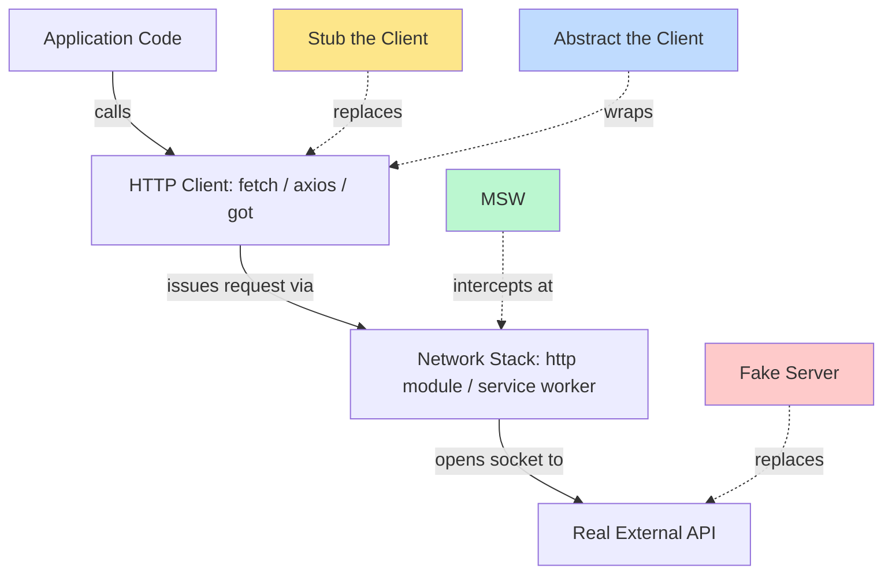

# 5.11 Mocking External Services

## 1. Purpose

Every non-trivial application talks to things it does not control. A frontend talks to a backend API. A backend talks to a database, a payment gateway, an email provider, a cloud object store, a third-party identity provider, an SMS gateway, and a dozen other services that live on the other side of a network cable. The application's correctness depends on its own logic, but its tests must also exercise the code that crosses those network boundaries. The moment a test reaches across a real network boundary, four problems appear: the test becomes slow (network round trips take milliseconds, not microseconds), flaky (networks fail, DNS hiccups, TLS renegotiation times out), expensive (third-party APIs bill per call, and a CI run that fires a thousand Stripe calls per commit will not be cheap for long), and unable to exercise error cases (you cannot make Stripe return a 502 on demand, so the happy path is all you ever test).

Mocking external services is the practice of replacing those real network calls with controlled, deterministic stand-ins so the test can exercise the code that makes the calls without paying any of those costs. The test runs in microseconds instead of seconds, never flakes, costs nothing, and can simulate any error the network can produce: timeouts, 500s, 429 rate limits, malformed JSON, slow trickles, partial responses, certificate errors. A test suite that mocks well can replay the failure modes of every external dependency on every commit — something no test suite that hits real APIs can ever do.

There are three families of approach, and this note covers all of them. The first is to stub the HTTP client: replace `fetch`, `axios`, or `http.request` with a function that returns canned responses. The second is to use a network-layer interceptor like Mock Service Worker (MSW), which sits at the service worker boundary in the browser or at the `http` module boundary in Node and intercepts requests before they leave the process, responding with mock data while still testing the real request shape the application produced. The third is to run a fake server: a real HTTP server bound to a localhost port whose handlers mimic the external API's responses, including its errors and timing. Each approach buys a different level of realism at a different cost in setup and runtime.

A fourth pattern, orthogonal to the three, is to abstract the HTTP client behind your own interface. Instead of calling `fetch` directly in your services, you wrap it in an `HttpClient` interface with methods like `get`, `post`, `put`, `delete`. Production wires the interface to a real `fetch`-backed implementation. Tests wire it to a mock returning canned responses. This decouples the test from the HTTP library, makes it trivial to swap `fetch` for `axios` later, and produces a single, small seam where mocking happens — instead of dozens of call sites that each have to be patched.

The trade-off across all four approaches is the same trade-off that defines all of testing: isolation versus realism. A mock that returns canned data is fast, deterministic, and isolated, but it does not test that the real API still matches the canned shape. A fake server is more realistic, but it is slow and you have to write it. MSW sits in the middle: it tests the real request shape the application produces (URL, method, headers, body, query params) without ever touching a real network. The right choice depends on what you are testing and what failure modes you can afford to miss. For a frontend that talks to a backend you control, MSW has become the de facto standard because it lets you develop the entire frontend without a backend running and lets tests assert on the request shape your code actually produced. For a backend that calls Stripe, abstracting the client is usually the right move because you want to test the business logic around the call, not the call itself.

This note covers all four approaches from first principles through production implementation. You will finish able to choose between stubbing, MSW, and fake servers for any given test; set up MSW for both browser and Node tests; test every error case the network can produce; and build a typed `HttpClient` wrapper that makes mocking trivial. For the fundamentals of test doubles, see [[5.10 Stubs Spies and Mocks]]. For integration testing of your own API, see [[5.07 Integration Testing APIs]].

## 2. Theory and Deep Dive

### 2.1 The Problem with Real Network Calls in Tests

A test that hits a real external API carries five costs. First, latency: a single HTTPS call takes 50-500ms; a file with 50 such calls takes 2.5-25 seconds; a suite with 20 such files takes a minute. Second, flakiness: real networks lose packets, DNS resolvers return stale records, TLS handshakes occasionally take 30 seconds for no reason. A 1 percent flake rate across a thousand tests is ten failures per CI run, every run, forever. Third, cost: Stripe, Twilio, SendGrid, AWS, OpenAI bill per call. A test that creates a real customer on every run creates thousands per week on the test account, costing money and polluting it with garbage. Fourth, error coverage: you cannot make Stripe return a 502 on demand, or make Twilio time out on demand. Tests that hit real APIs only ever test the happy path, and the error-handling code that runs when Stripe is down is never exercised. Fifth, ordering and isolation: real APIs have state, so a test that creates a user then lists users sees every user every other test ever created; tests become order-dependent and pollute each other.

Mocking solves all five. A mocked call takes microseconds, never flakes, costs nothing, can return any status code on demand, and starts from a clean slate every test. The price is that the mock might not match the real API — the single biggest source of "works in tests, fails in prod" bugs. The mitigation is contract testing (see [[5.09 Contract Testing with Pact]]) and disciplined handler maintenance.

### 2.2 Approach 1 — Stubbing the HTTP Client

The simplest mock is to replace the HTTP client function with a stub. In a frontend, replace `globalThis.fetch` with a function returning a `Response`-shaped object. In a backend, replace `axios`, `got`, `node-fetch`, or the `http` module. The mechanism is monkey-patching: the test replaces the client on the global or module scope with a mock function that returns any value, throws any error, or behaves differently on successive calls.

The advantage is simplicity: no infrastructure, no server, no network. The test is fast, deterministic, isolated. The disadvantage is that the test does not verify the request shape. If the service is supposed to call `POST https://api.stripe.com/v1/charges` with a JSON body and an `Authorization` header, a stubbed `fetch` returns whatever you programmed regardless of whether the service called the right URL with the right method and body. A more disciplined version asserts on the mock's call arguments — `expect(fetch).toHaveBeenCalledWith(expectedUrl, expectedInit)` — which catches URL and body construction bugs. But the response the service gets back is still the canned one, not a real one, so bugs in how the service parses a real `Response` (for instance, assuming `response.json()` returns a parsed object when the real response sends `Content-Type: text/plain`) will not be caught.

### 2.3 Approach 2 — Mock Service Worker (MSW)

MSW intercepts HTTP requests at the service worker boundary in the browser and at the `http`/`https` module boundary in Node. Instead of replacing `fetch`, MSW registers a service worker (browser) or patches the `http` module (Node) so any request is intercepted before it leaves the process. The interceptor matches the request against a list of handlers; if a handler matches, its response is returned as if it came from the network; if no handler matches, the request falls through to the real network or errors out, depending on configuration.

The critical difference from stubbing is that MSW sits below the HTTP client. The application calls `fetch('https://api.example.com/users/1')` exactly as in production. The call goes through the normal networking stack, hits the service worker, the service worker matches the URL against its handlers, and the handler returns a mocked response. The application cannot tell the difference between a real and a mocked response. This means MSW tests the real request shape: the handler can read the URL, method, headers, body, query parameters, and assert on them. The handler can also return any response: any status code, headers, body, or delay. So MSW gives you both request-shape verification and response-shape simulation in one tool.

The disadvantage is setup complexity. In the browser, you start the service worker (or install the `msw` interceptor in jsdom). In Node, you call `setupServer` from `msw/node` and start the server before tests run. You write handlers for every endpoint your tests touch. But once written, handlers are reusable across tests and form a living specification of the API contract. MSW has become the standard for frontend testing in the React, Vue, and Svelte ecosystems, and is increasingly used for backend testing. The same handler definitions can be shared between unit tests, integration tests, and the dev server, enabling the "develop against mocks, test against mocks, deploy against real" workflow that is the killer feature of MSW.

### 2.4 Approach 3 — Fake Server

A fake server is a real HTTP server, bound to a localhost port, whose handlers mimic the external API. The test points the application at `http://localhost:3001` instead of `https://api.stripe.com`, and the fake server responds with whatever the test programmed.

The advantage is maximum realism. The application makes a real HTTP call, opens a real TCP socket, performs a real TLS handshake (or skips TLS for localhost), sends real bytes, receives real bytes, parses a real response. Any bug in the application's HTTP handling — wrong content-type parsing, broken streaming, incorrect redirect following, missing timeout handling — will be caught. A fake server can also simulate network-level failures MSW and stubs cannot: close the socket mid-response, send malformed HTTP, hang without responding, return a response with the wrong Content-Length.

The disadvantage is cost. Spinning up a real server, even in-process, takes milliseconds per test. Binding to a port means tests cannot run in parallel without port management. The fake server has to be written and maintained, more code than MSW handlers. Fake servers are most commonly used when testing a backend service that calls another backend service over HTTP and you want to test the integration without spinning up the real dependency, or when you need to test network-level behavior MSW cannot simulate. For most other cases, MSW is better because it gives most of the realism at a fraction of the cost.

### 2.5 Approach 4 — Abstract the HTTP Client

The fourth pattern is orthogonal to the three approaches. Instead of calling `fetch` or `axios` directly, wrap the HTTP library in your own interface with methods like `get(url, config)`, `post(url, body, config)`, `put(url, body, config)`, `delete(url, config)`. Production wires the interface to a real implementation; tests wire it to a mock implementation that returns canned responses.

The advantage is decoupling. Your services depend on an `HttpClient` interface, not on `fetch` or `axios`. Switching HTTP libraries later means changing one implementation, not a hundred call sites. The interface is also the natural place for cross-cutting concerns: authentication, retry logic, request logging, distributed tracing headers, circuit breaking. All of that lives in the real implementation and is bypassed in tests by the mock. The disadvantage is one more layer of indirection: the wrapper has its own tests, and those tests have to exercise the wrapper itself (against a fake server or MSW, not against another mock). The pattern pays off when you have many call sites or anticipate swapping the underlying HTTP library. For a one-off script that calls an API once, it is overkill.

The abstract-the-client pattern combines with all three mocking approaches. Mock the `HttpClient` interface directly in unit tests (fast, simple). Back the real implementation with MSW in integration tests (realistic, tests request shape). Back it with a fake server in end-to-end tests (maximum realism, tests network handling). The interface stays the same; only the wiring changes.

### 2.6 The Layered View

The four approaches operate at different layers of the stack. Understanding which layer each one intercepts at is the key to choosing between them.



The diagram shows the four approaches at the layers where they intercept. Stubbing replaces the HTTP client function. MSW intercepts at the network stack layer, below the client. Fake server replaces the real remote API entirely. Abstraction wraps the client in your own interface so any of the three mocking techniques can be plugged in behind it.

### 2.7 MSW Internals — How It Actually Works

In the browser, MSW registers a service worker at a URL like `/mockServiceWorker.js`. The service worker listens for `fetch` events. Every `fetch` the page makes goes through the service worker, which asks the page (with the MSW client library loaded) whether a handler matches. If yes, the page sends the mocked response back to the service worker, which returns it as the response to the original `fetch`. If no handler matches, the service worker falls through to the real network. This works in modern browsers and Playwright/Puppeteer but not in jsdom (used by Jest and Vitest in default mode), because jsdom has no service worker.

For jsdom and Node, MSW patches the `http` and `https` modules (and `XMLHttpRequest` in jsdom) so any request goes through MSW's matcher first. The `msw/node` package exports `setupServer` which creates and starts this interceptor. In both environments, handlers are functions that take a `request` object (URL, method, headers, body, cookies) and return a `response` (status, headers, body). Handlers can simulate delays, simulate network errors (not just HTTP errors), and pass through to the real network.

### 2.8 Request Shape Versus Response Shape

A common source of confusion is the difference between request shape (what the application sends: URL, method, headers, body, query parameters) and response shape (what the application receives: status code, headers, body). A good mock tests both. Stubbing `fetch` and asserting on call arguments tests request shape but only loosely tests response shape (the service gets the canned response, which may or may not match the real API). MSW tests both: the handler reads the request shape and returns a response shape you control. A fake server tests both with maximum fidelity because it parses real HTTP bytes. "Mock the external service" is two things: verify the request shape your application produced, and simulate the response shape your application will receive. Different tools do these at different levels of fidelity.

### 2.9 The Mocks-Drift-From-Reality Problem

The biggest risk of mocking is that the mock drifts from the real API. The mock says `POST /v1/charges` returns `{ id, amount }`. The real Stripe API changes to return `{ id, amount, currency }`. Your tests pass because they check the mock, but production breaks because it expects a field the mock did not include (or vice versa).

Three mitigations. First, contract testing with Pact (see [[5.09 Contract Testing with Pact]]): records actual consumer-provider interactions and verifies them on both sides, catching drift automatically. Second, schema validation with Zod or JSON Schema: validate every mocked response in tests and every real response in production against the same schema, so a schema change forces both sides to update in lockstep. Third, periodic smoke tests: a small number of tests that hit the real API (against a test account, in a separate CI job, run on a schedule rather than per commit) to catch drift before it reaches production.

### 2.10 When to Use Which Approach

The decision tree is roughly: if you are testing frontend code that calls a backend API, use MSW. If you are testing backend code that calls a third-party API, abstract the client and mock the interface in unit tests; back the real implementation with MSW or a fake server in integration tests. If you need to test network-level failure modes (socket drops, malformed responses), use a fake server. If you have a one-off script that calls an API once, stub `fetch` directly. If you need to verify the contract between consumer and provider, use Pact on top of whatever mocking strategy you choose.

## 3. Mental Models

### 3.1 Stub the Client = "Replace the Function, Return Canned Data"

The mental model for stubbing is the same as for any function stub. You have a function `fetch` that takes a URL and a config and returns a promise of a response. You replace that function with a stub that ignores its inputs (or asserts on them) and returns a promise of a canned response. The application code is unchanged — it still calls `fetch` — but the call goes to the stub. The stub is a chameleon: it looks like `fetch` to the caller, but it is a fixed response in disguise.

### 3.2 MSW = "Intercept the Request Before It Leaves, Respond with Mock Data"

The mental model for MSW is a transparent proxy. The application makes a request as it normally would. The request travels down through the network stack. Before it leaves the process, MSW intercepts it. MSW looks at the URL, method, headers, body. It matches against a list of handlers. If a handler matches, MSW constructs a response and returns it back up the stack, as if it had come from the real network. The application receives the response and processes it normally. The application has no idea the request never left the process. MSW is a man-in-the-middle that you control.

### 3.3 Fake Server = "Run a Real Server That Mimics the External API"

The mental model for a fake server is a stunt double. The real external API is a server running on a remote host. The fake server is a server running on localhost that mimics the real one's behavior. You point your application at the fake server instead of at the real one. The application makes real HTTP requests, opens real sockets, sends real bytes. The fake server receives them and responds with whatever you programmed. The fake server is a full HTTP participant — it parses the request, constructs the response, and can even fail at the network level if you tell it to.

### 3.4 Abstract the Client = "Wrap the HTTP Lib, Mock Your Wrapper"

The mental model for the abstract-the-client pattern is a seam. You introduce a thin interface between your services and the HTTP library. Your services depend on the interface. The real implementation of the interface calls the real HTTP library. The mock implementation returns canned data. The seam is the place where mocking happens — instead of patching a hundred call sites, you patch one interface. The interface also gives you a place to add cross-cutting concerns (auth, retry, tracing) without polluting the services. The pattern is "introduce a seam, mock at the seam."

### 3.5 The Trade-Off Dial and the Handler Library

All four approaches sit on a dial of realism versus simplicity. At the simplest end is stubbing the client: one line of mock setup, no infrastructure, but the test does not verify the request shape. At the most realistic end is a fake server: full HTTP round trip, real network bytes, but slow and complex to set up. MSW is in the middle: it verifies the request shape and simulates the response shape, with moderate setup cost. The abstract-the-client pattern does not sit on this dial — it is a structural choice about where to put the seam, and it works with any of the three approaches behind it.

For MSW and fake servers, the handlers form a library. Each handler is a small function that matches one URL pattern and returns one response. The library grows as the API surface you mock grows. A mature handler library covers every endpoint the application touches, including every error variant the application handles. The library is a living specification of the API contract: if the API changes, the handlers change, and the tests that depend on them either still pass (the change was backward-compatible) or fail (the change broke the contract). Treat the handler library as code, not as test fixture: review it, version it, keep it in sync with the real API.

## 4. Real-World Use Cases

### 4.1 Frontend Testing

The dominant use case for MSW is frontend testing. A React, Vue, or Svelte application calls a backend API to load data. The component test mounts the component, the component's `useEffect` fires and calls `fetch('/api/users')`, MSW intercepts the call and returns a canned list of users, the component renders the list, the test asserts on the rendered output. Without MSW, the test would have to either mock the data-loading function (so it does not verify the component calls the right URL) or hit a real backend (so it is slow and flaky and depends on the backend's state). MSW is also the standard for React Testing Library, Cypress, and Playwright: in Cypress and Playwright, MSW can run in the browser via the service worker and intercept all network calls the page makes, so the entire user flow can be tested against mocked data without a backend running.

### 4.2 Backend Testing

A backend service that calls a third-party API (Stripe, Twilio, SendGrid) needs to mock that API in tests. The standard pattern is to abstract the API behind a client interface (`StripeClient`, `EmailClient`, `SmsClient`) and inject a mock implementation in tests. The mock returns canned responses, throws errors on demand, and records its calls for assertion. This pattern works because the business logic the test cares about is the logic around the API call (what to charge, when to send the email, how to handle a failure), not the call itself. For more realistic integration tests, the same backend can use MSW to intercept the outgoing `https` calls — this tests the real `axios`/`fetch` call construction and response parsing, while still returning canned data.

### 4.3 Testing Error Cases

The single biggest advantage of mocking over real APIs is the ability to test error cases. Real APIs cannot be made to return a 502 on demand. Mocks can. The test cases to cover for any external call are: timeout (the call takes longer than the configured timeout), 5xx server error (500, 502, 503, 504), 4xx client error (400, 401, 403, 404, 429), malformed response (the API returns 200 but the body is not valid JSON, or is missing required fields), network error (the connection is refused, the DNS lookup fails, the TLS handshake fails), and partial response (the connection drops mid-stream). Each corresponds to a different failure mode in production, and each should have a test asserting that the application retries (transient errors), falls back (non-critical failures), or propagates (critical failures). A test suite that only tests the happy path will not catch the bugs production will surface.

### 4.4 Testing Rate Limits

Rate limiting is a special case of error handling. A 429 response typically includes a `Retry-After` header telling the client how long to wait before retrying. The application's behavior in response to a 429 — wait and retry, or fail fast — is business logic that should be tested. With mocking, you can simulate a 429 on the first call and a 200 on the second, and assert that the application waited the right amount of time (using fake timers) and retried. Without mocking, you would have to actually exhaust the rate limit on the real API, which is impractical.

### 4.5 Testing Third-Party APIs Without Hitting Them

Third-party APIs like Stripe, GitHub, Twilio, and OpenAI have test modes, but they are still real network calls — slow, requiring API keys in CI, creating state on the third-party account, and unable to simulate arbitrary errors. Mocking these APIs in tests is the only practical way to test the application's interaction with them. The handler library for a third-party API is typically maintained as a separate package, so multiple services can share the same mocks.

### 4.6 Offline Development

MSW enables a workflow called "develop against mocks". The frontend developer starts the dev server with MSW enabled; MSW intercepts all API calls and returns canned responses, so the frontend can be developed without a backend running. This is useful when the backend is not yet built, when the backend is slow to start (a microservices architecture where starting all services locally is impractical), or when the developer is offline. The same handlers used in tests are used in development, so the mocks are exercised continuously and stay in sync with the frontend's expectations.

### 4.7 Replay-Based Testing

A more advanced pattern is to record real API interactions once and replay them. Tools like `nock` (in Node) and `Polly.js` support this: run the test once in "record" mode, the tool intercepts real API calls and saves request-response pairs to disk. Subsequent runs use "replay" mode, returning the saved responses without hitting the real API. This combines the realism of real API responses with the speed and determinism of mocks. The downside is that recordings drift from the real API over time, so periodic re-recording is necessary.

## 5. Code Examples

### 5.1 Example A — Minimal and Conceptual

The minimal example shows each of the four approaches in roughly ten lines. The service under test is a `getUser` function that calls `GET /api/users/:id` and returns the parsed JSON. Each subsection pairs JS and TS.

#### 5.1.1 JS — Minimal Stub of `fetch`

```javascript
// service.js
export async function getUser(id) {
  const res = await fetch(`/api/users/${id}`);
  if (!res.ok) throw new Error(`HTTP ${res.status}`);
  return res.json();
}

// service.test.js
import { vi, test, expect } from 'vitest';
import { getUser } from './service.js';

test('getUser returns the user', async () => {
  vi.stubGlobal('fetch', vi.fn().mockResolvedValue({
    ok: true,
    status: 200,
    json: async () => ({ id: 1, name: 'Ada' }),
  }));
  const user = await getUser(1);
  expect(user).toEqual({ id: 1, name: 'Ada' });
  expect(fetch).toHaveBeenCalledWith('/api/users/1');
});
```

#### 5.1.2 TS — Minimal Stub of `fetch`

```typescript
// service.ts
export interface User { id: number; name: string; }

export async function getUser(id: number): Promise<User> {
  const res = await fetch(`/api/users/${id}`);
  if (!res.ok) throw new Error(`HTTP ${res.status}`);
  return res.json() as Promise<User>;
}

// service.test.ts
import { vi, test, expect } from 'vitest';
import { getUser, User } from './service.js';

test('getUser returns the user', async () => {
  vi.stubGlobal('fetch', vi.fn().mockResolvedValue({
    ok: true,
    status: 200,
    json: async () => ({ id: 1, name: 'Ada' } satisfies User),
  }));
  const user = await getUser(1);
  expect(user).toEqual({ id: 1, name: 'Ada' });
  expect(fetch).toHaveBeenCalledWith('/api/users/1');
});
```

#### 5.1.3 JS — Minimal MSW Handler

```javascript
// handlers.js
import { http, HttpResponse } from 'msw';

export const handlers = [
  http.get('/api/users/:id', ({ params }) =>
    HttpResponse.json({ id: Number(params.id), name: 'Ada' })
  ),
];

// service.test.js
import { setupServer } from 'msw/node';
import { handlers } from './handlers.js';

const server = setupServer(...handlers);
beforeAll(() => server.listen());
afterEach(() => server.resetHandlers());
afterAll(() => server.close());

test('getUser returns the user', async () => {
  const user = await getUser(1);
  expect(user).toEqual({ id: 1, name: 'Ada' });
});
```

#### 5.1.4 TS — Minimal MSW Handler

```typescript
// handlers.ts
import { http, HttpResponse } from 'msw';
import { User } from './service.js';

export const handlers = [
  http.get('/api/users/:id', ({ params }): Promise<Response> =>
    HttpResponse.json({ id: Number(params.id), name: 'Ada' } satisfies User)
  ),
];

// service.test.ts
import { setupServer } from 'msw/node';
import { handlers } from './handlers.js';
import { getUser } from './service.js';

const server = setupServer(...handlers);
beforeAll(() => server.listen());
afterEach(() => server.resetHandlers());
afterAll(() => server.close());

test('getUser returns the user', async () => {
  const user = await getUser(1);
  expect(user).toEqual({ id: 1, name: 'Ada' });
});
```

#### 5.1.5 JS — Minimal Fake Server

```javascript
// service.test.js
import http from 'node:http';
import { getUser } from './service.js';

let server;
beforeAll((done) => {
  server = http.createServer((req, res) => {
    res.writeHead(200, { 'Content-Type': 'application/json' });
    res.end(JSON.stringify({ id: 1, name: 'Ada' }));
  });
  server.listen(0, () => done());
});
afterAll((done) => server.close(done));

test('getUser returns the user', async () => {
  const port = server.address().port;
  const user = await getUser(`http://localhost:${port}/api/users/1`);
  expect(user).toEqual({ id: 1, name: 'Ada' });
});
```

#### 5.1.6 TS — Minimal Fake Server

```typescript
// service.test.ts
import http from 'node:http';
import { getUser } from './service.js';

let server: http.Server;
beforeAll((done) => {
  server = http.createServer((req, res) => {
    res.writeHead(200, { 'Content-Type': 'application/json' });
    res.end(JSON.stringify({ id: 1, name: 'Ada' }));
  });
  server.listen(0, () => done());
});
afterAll((done) => server.close(done));

test('getUser returns the user', async () => {
  const port = (server.address() as { port: number }).port;
  const user = await getUser(`http://localhost:${port}/api/users/1`);
  expect(user).toEqual({ id: 1, name: 'Ada' });
});
```

#### 5.1.7 JS — Minimal Abstract Client

```javascript
// client.js
export const createHttpClient = (fetchImpl = fetch) => ({
  get: (url) => fetchImpl(url).then((r) => r.json()),
});

// service.js
export const createUserService = (client) => ({
  getUser: (id) => client.get(`/api/users/${id}`),
});

// service.test.js
test('getUser returns the user', async () => {
  const mockClient = { get: vi.fn().mockResolvedValue({ id: 1, name: 'Ada' }) };
  const userService = createUserService(mockClient);
  const user = await userService.getUser(1);
  expect(user).toEqual({ id: 1, name: 'Ada' });
  expect(mockClient.get).toHaveBeenCalledWith('/api/users/1');
});
```

#### 5.1.8 TS — Minimal Abstract Client

```typescript
// client.ts
export interface HttpClient {
  get<T>(url: string): Promise<T>;
  post<T>(url: string, body: unknown): Promise<T>;
}

export const createHttpClient = (fetchImpl: typeof fetch = fetch): HttpClient => ({
  get: <T>(url: string): Promise<T> => fetchImpl(url).then((r) => r.json() as Promise<T>),
  post: <T>(url: string, body: unknown): Promise<T> =>
    fetchImpl(url, { method: 'POST', body: JSON.stringify(body) }).then((r) => r.json() as Promise<T>),
});

// service.ts
export interface User { id: number; name: string; }

export const createUserService = (client: HttpClient) => ({
  getUser: (id: number): Promise<User> => client.get<User>(`/api/users/${id}`),
});

// service.test.ts
test('getUser returns the user', async () => {
  const mockClient: HttpClient = {
    get: vi.fn().mockResolvedValue({ id: 1, name: 'Ada' }),
    post: vi.fn(),
  };
  const userService = createUserService(mockClient);
  const user = await userService.getUser(1);
  expect(user).toEqual({ id: 1, name: 'Ada' });
  expect(mockClient.get).toHaveBeenCalledWith('/api/users/1');
});
```

### 5.2 Example B — Production-Grade

The production-grade example is a typed `PaymentsService` that talks to a fake Stripe-like API. It uses the abstract-the-client pattern for unit tests and MSW for integration tests. It covers happy path, 4xx, 5xx, timeout, rate limit, and malformed response. The service implements retry-with-backoff for transient errors and propagates non-retryable errors to the caller.

#### 5.2.1 JS — Service and Types

```javascript
// paymentsService.js
const RETRYABLE = new Set([408, 425, 429, 500, 502, 503, 504]);

const sleep = (ms) => new Promise((r) => setTimeout(r, ms));

export const createPaymentsService = (client, opts = {}) => {
  const maxRetries = opts.maxRetries ?? 3;
  const baseDelayMs = opts.baseDelayMs ?? 100;

  async function charge({ amount, currency, source }) {
    let lastError;
    for (let attempt = 0; attempt <= maxRetries; attempt++) {
      try {
        const res = await client.post('/v1/charges', { amount, currency, source });
        return res;
      } catch (err) {
        lastError = err;
        if (!RETRYABLE.has(err.status) && err.status !== undefined) throw err;
        if (attempt === maxRetries) break;
        const delay = baseDelayMs * 2 ** attempt;
        if (err.retryAfter) await sleep(err.retryAfter * 1000);
        else await sleep(delay);
      }
    }
    throw lastError;
  }

  return { charge };
};
```

#### 5.2.2 TS — Service and Types

```typescript
// types.ts
export interface ChargeRequest {
  amount: number;
  currency: string;
  source: string;
}

export interface ChargeResponse {
  id: string;
  amount: number;
  currency: string;
  status: 'succeeded' | 'failed' | 'pending';
}

export interface HttpError extends Error {
  status?: number;
  retryAfter?: number;
}

export interface HttpClient {
  get<T>(url: string): Promise<T>;
  post<T>(url: string, body: unknown): Promise<T>;
  put<T>(url: string, body: unknown): Promise<T>;
  delete<T>(url: string): Promise<T>;
}

// paymentsService.ts
import { ChargeRequest, ChargeResponse, HttpClient, HttpError } from './types.js';

const RETRYABLE = new Set<number>([408, 425, 429, 500, 502, 503, 504]);

const sleep = (ms: number): Promise<void> =>
  new Promise((resolve) => setTimeout(resolve, ms));

export interface PaymentsServiceOptions {
  maxRetries?: number;
  baseDelayMs?: number;
}

export interface PaymentsService {
  charge(req: ChargeRequest): Promise<ChargeResponse>;
}

export const createPaymentsService = (
  client: HttpClient,
  opts: PaymentsServiceOptions = {}
): PaymentsService => {
  const maxRetries = opts.maxRetries ?? 3;
  const baseDelayMs = opts.baseDelayMs ?? 100;

  async function charge(req: ChargeRequest): Promise<ChargeResponse> {
    let lastError: HttpError | undefined;
    for (let attempt = 0; attempt <= maxRetries; attempt++) {
      try {
        const res = await client.post<ChargeResponse>('/v1/charges', req);
        return res;
      } catch (err) {
        const httpError = err as HttpError;
        lastError = httpError;
        if (httpError.status !== undefined && !RETRYABLE.has(httpError.status)) {
          throw httpError;
        }
        if (attempt === maxRetries) break;
        const delay = baseDelayMs * 2 ** attempt;
        if (httpError.retryAfter) await sleep(httpError.retryAfter * 1000);
        else await sleep(delay);
      }
    }
    throw lastError;
  }

  return { charge };
};
```

#### 5.2.3 JS — MSW Handlers

```javascript
// handlers.js
import { http, HttpResponse, delay } from 'msw';

export const happyCharge = http.post('https://api.payments.test/v1/charges', async () =>
  HttpResponse.json({ id: 'ch-123', amount: 1000, currency: 'usd', status: 'succeeded' })
);

export const serverError = http.post('https://api.payments.test/v1/charges', async () =>
  HttpResponse.json({ error: 'internal' }, { status: 500 })
);

export const rateLimited = http.post('https://api.payments.test/v1/charges', async () =>
  HttpResponse.json({ error: 'rate limited' }, { status: 429, headers: { 'Retry-After': '2' } })
);

export const badRequest = http.post('https://api.payments.test/v1/charges', async () =>
  HttpResponse.json({ error: 'invalid amount' }, { status: 400 })
);

export const timeout = http.post('https://api.payments.test/v1/charges', async () => {
  await delay('infinite');
  return HttpResponse.json({});
});

export const handlers = [happyCharge];
```

#### 5.2.4 TS — MSW Handlers

```typescript
// handlers.ts
import { http, HttpResponse, delay } from 'msw';
import { ChargeResponse } from './types.js';

const baseUrl = 'https://api.payments.test';

export const happyCharge = http.post(`${baseUrl}/v1/charges`, async () =>
  HttpResponse.json({
    id: 'ch-123',
    amount: 1000,
    currency: 'usd',
    status: 'succeeded',
  } satisfies ChargeResponse)
);

export const serverError = http.post(`${baseUrl}/v1/charges`, async () =>
  HttpResponse.json({ error: 'internal' }, { status: 500 })
);

export const rateLimited = http.post(`${baseUrl}/v1/charges`, async () =>
  HttpResponse.json(
    { error: 'rate limited' },
    { status: 429, headers: { 'Retry-After': '2' } }
  )
);

export const badRequest = http.post(`${baseUrl}/v1/charges`, async () =>
  HttpResponse.json({ error: 'invalid amount' }, { status: 400 })
);

export const timeout = http.post(`${baseUrl}/v1/charges`, async () => {
  await delay('infinite');
  return HttpResponse.json({});
});

export const handlers = [happyCharge];
```

#### 5.2.5 JS — Real `HttpClient` Implementation

```javascript
// realClient.js
export const createRealHttpClient = ({ baseUrl, apiKey, timeoutMs = 5000 }) => ({
  async get(url) {
    return doFetch('GET', baseUrl + url, undefined);
  },
  async post(url, body) {
    return doFetch('POST', baseUrl + url, body);
  },
  async put(url, body) {
    return doFetch('PUT', baseUrl + url, body);
  },
  async delete(url) {
    return doFetch('DELETE', baseUrl + url, undefined);
  },
});

async function doFetch(method, url, body) {
  const controller = new AbortController();
  const timer = setTimeout(() => controller.abort(), 5000);
  try {
    const res = await fetch(url, {
      method,
      headers: {
        'Content-Type': 'application/json',
        Authorization: `Bearer ${apiKey}`,
      },
      body: body ? JSON.stringify(body) : undefined,
      signal: controller.signal,
    });
    if (!res.ok) {
      const err = new Error(`HTTP ${res.status}`);
      err.status = res.status;
      const retryAfter = res.headers.get('Retry-After');
      if (retryAfter) err.retryAfter = Number(retryAfter);
      throw err;
    }
    const contentType = res.headers.get('Content-Type') || '';
    if (!contentType.includes('application/json')) {
      throw new Error(`Unexpected Content-Type: ${contentType}`);
    }
    return res.json();
  } catch (err) {
    if (err.name === 'AbortError') {
      const timeoutErr = new Error('Request timed out');
      timeoutErr.status = 408;
      throw timeoutErr;
    }
    throw err;
  } finally {
    clearTimeout(timer);
  }
}
```

#### 5.2.6 TS — Real `HttpClient` Implementation

```typescript
// realClient.ts
import { HttpClient, HttpError } from './types.js';

export interface RealHttpClientOptions {
  baseUrl: string;
  apiKey: string;
  timeoutMs?: number;
}

export const createRealHttpClient = (opts: RealHttpClientOptions): HttpClient => {
  const { baseUrl, apiKey, timeoutMs = 5000 } = opts;

  async function doFetch<T>(method: string, url: string, body: unknown): Promise<T> {
    const controller = new AbortController();
    const timer = setTimeout(() => controller.abort(), timeoutMs);
    try {
      const res = await fetch(url, {
        method,
        headers: { 'Content-Type': 'application/json', Authorization: `Bearer ${apiKey}` },
        body: body ? JSON.stringify(body) : undefined,
        signal: controller.signal,
      });
      if (!res.ok) {
        const err: HttpError = new Error(`HTTP ${res.status}`);
        err.status = res.status;
        const retryAfter = res.headers.get('Retry-After');
        if (retryAfter) err.retryAfter = Number(retryAfter);
        throw err;
      }
      const contentType = res.headers.get('Content-Type') || '';
      if (!contentType.includes('application/json')) {
        const err: HttpError = new Error(`Unexpected Content-Type: ${contentType}`);
        err.status = 500;
        throw err;
      }
      return (await res.json()) as T;
    } catch (err) {
      if (err instanceof Error && err.name === 'AbortError') {
        const timeoutErr: HttpError = new Error('Request timed out');
        timeoutErr.status = 408;
        throw timeoutErr;
      }
      throw err;
    } finally {
      clearTimeout(timer);
    }
  }

  return {
    get: <T>(url: string) => doFetch<T>('GET', baseUrl + url, undefined),
    post: <T>(url: string, body: unknown) => doFetch<T>('POST', baseUrl + url, body),
    put: <T>(url: string, body: unknown) => doFetch<T>('PUT', baseUrl + url, body),
    delete: <T>(url: string) => doFetch<T>('DELETE', baseUrl + url, undefined),
  };
};
```

#### 5.2.7 JS — Unit Tests with Mock Client

```javascript
// paymentsService.test.js
import { vi, test, expect, describe, beforeEach } from 'vitest';
import { createPaymentsService } from './paymentsService.js';

const makeClient = (overrides = {}) => ({
  post: vi.fn(overrides.post || (() => ({ id: 'ch-1', amount: 1000, currency: 'usd', status: 'succeeded' }))),
  get: vi.fn(),
  put: vi.fn(),
  delete: vi.fn(),
});

const makeHttpError = (status, retryAfter) => {
  const err = new Error(`HTTP ${status}`);
  err.status = status;
  if (retryAfter !== undefined) err.retryAfter = retryAfter;
  return err;
};

describe('paymentsService.charge', () => {
  test('happy path returns the charge', async () => {
    const client = makeClient();
    const service = createPaymentsService(client);
    const res = await service.charge({ amount: 1000, currency: 'usd', source: 'tok-vISA' });
    expect(res.id).toBe('ch-1');
    expect(client.post).toHaveBeenCalledWith('/v1/charges', { amount: 1000, currency: 'usd', source: 'tok-vISA' });
  });

  test('retries on 500 then succeeds', async () => {
    const client = makeClient({
      post: vi.fn().mockRejectedValueOnce(makeHttpError(500))
        .mockResolvedValueOnce({ id: 'ch-2', amount: 1000, currency: 'usd', status: 'succeeded' }),
    });
    const service = createPaymentsService(client, { baseDelayMs: 1 });
    const res = await service.charge({ amount: 1000, currency: 'usd', source: 'tok-vISA' });
    expect(res.id).toBe('ch-2');
    expect(client.post).toHaveBeenCalledTimes(2);
  });

  test('does not retry on 400', async () => {
    const client = makeClient({ post: vi.fn().mockRejectedValue(makeHttpError(400)) });
    const service = createPaymentsService(client, { baseDelayMs: 1 });
    await expect(
      service.charge({ amount: 1000, currency: 'usd', source: 'tok-vISA' })
    ).rejects.toThrow('HTTP 400');
    expect(client.post).toHaveBeenCalledTimes(1);
  });

  test('retries on 429 and respects Retry-After', async () => {
    vi.useFakeTimers();
    const client = makeClient({
      post: vi.fn().mockRejectedValueOnce(makeHttpError(429, 2))
        .mockResolvedValueOnce({ id: 'ch-3', amount: 1000, currency: 'usd', status: 'succeeded' }),
    });
    const service = createPaymentsService(client, { baseDelayMs: 1 });
    const promise = service.charge({ amount: 1000, currency: 'usd', source: 'tok-vISA' });
    await vi.advanceTimersByTimeAsync(2000);
    const res = await promise;
    expect(res.id).toBe('ch-3');
    expect(client.post).toHaveBeenCalledTimes(2);
    vi.useRealTimers();
  });
});
```

#### 5.2.8 TS — Unit Tests with Mock Client

```typescript
// paymentsService.test.ts
import { vi, test, expect, describe } from 'vitest';
import { createPaymentsService } from './paymentsService.js';
import { HttpClient, HttpError, ChargeResponse } from './types.js';

const makeHttpError = (status: number, retryAfter?: number): HttpError => {
  const err: HttpError = new Error(`HTTP ${status}`);
  err.status = status;
  if (retryAfter !== undefined) err.retryAfter = retryAfter;
  return err;
};

const makeClient = (overrides: Partial<HttpClient> = {}): HttpClient => ({
  post:
    overrides.post ??
    (vi.fn().mockResolvedValue({
      id: 'ch-1',
      amount: 1000,
      currency: 'usd',
      status: 'succeeded',
    } satisfies ChargeResponse) as HttpClient['post']),
  get: overrides.get ?? vi.fn(),
  put: overrides.put ?? vi.fn(),
  delete: overrides.delete ?? vi.fn(),
});

describe('paymentsService.charge', () => {
  test('happy path returns the charge', async () => {
    const client = makeClient();
    const service = createPaymentsService(client);
    const res = await service.charge({ amount: 1000, currency: 'usd', source: 'tok-vISA' });
    expect(res.id).toBe('ch-1');
    expect(client.post).toHaveBeenCalledWith('/v1/charges', { amount: 1000, currency: 'usd', source: 'tok-vISA' });
  });

  test('retries on 500 then succeeds', async () => {
    const client = makeClient({
      post: vi.fn().mockRejectedValueOnce(makeHttpError(500))
        .mockResolvedValueOnce({ id: 'ch-2', amount: 1000, currency: 'usd', status: 'succeeded' } satisfies ChargeResponse),
    });
    const service = createPaymentsService(client, { baseDelayMs: 1 });
    const res = await service.charge({ amount: 1000, currency: 'usd', source: 'tok-vISA' });
    expect(res.id).toBe('ch-2');
    expect(client.post).toHaveBeenCalledTimes(2);
  });

  test('does not retry on 400', async () => {
    const client = makeClient({ post: vi.fn().mockRejectedValue(makeHttpError(400)) });
    const service = createPaymentsService(client, { baseDelayMs: 1 });
    await expect(
      service.charge({ amount: 1000, currency: 'usd', source: 'tok-vISA' })
    ).rejects.toThrow('HTTP 400');
    expect(client.post).toHaveBeenCalledTimes(1);
  });

  test('retries on 429 and respects Retry-After', async () => {
    vi.useFakeTimers();
    const client = makeClient({
      post: vi.fn().mockRejectedValueOnce(makeHttpError(429, 2))
        .mockResolvedValueOnce({ id: 'ch-3', amount: 1000, currency: 'usd', status: 'succeeded' } satisfies ChargeResponse),
    });
    const service = createPaymentsService(client, { baseDelayMs: 1 });
    const promise = service.charge({ amount: 1000, currency: 'usd', source: 'tok-vISA' });
    await vi.advanceTimersByTimeAsync(2000);
    const res = await promise;
    expect(res.id).toBe('ch-3');
    expect(client.post).toHaveBeenCalledTimes(2);
    vi.useRealTimers();
  });
});
```

#### 5.2.9 JS — MSW Integration Tests

```javascript
// paymentsService.msw.test.js
import { vi, test, expect, describe, beforeAll, afterAll, afterEach } from 'vitest';
import { setupServer } from 'msw/node';
import { http, HttpResponse } from 'msw';
import { createPaymentsService } from './paymentsService.js';
import { createRealHttpClient } from './realClient.js';

const baseUrl = 'https://api.payments.test';

const server = setupServer();
beforeAll(() => server.listen({ onUnhandledRequest: 'error' }));
afterEach(() => server.resetHandlers());
afterAll(() => server.close());

const makeClient = () =>
  createRealHttpClient({ baseUrl, apiKey: 'sk-test', timeoutMs: 500 });

const happyBody = { id: 'ch-1', amount: 1000, currency: 'usd', status: 'succeeded' };

describe('paymentsService.charge (MSW)', () => {
  test('happy path', async () => {
    server.use(http.post(`${baseUrl}/v1/charges`, () => HttpResponse.json(happyBody)));
    const service = createPaymentsService(makeClient(), { baseDelayMs: 1 });
    const res = await service.charge({ amount: 1000, currency: 'usd', source: 'tok-vISA' });
    expect(res.status).toBe('succeeded');
  });

  test('retries on 500 then succeeds', async () => {
    let calls = 0;
    server.use(http.post(`${baseUrl}/v1/charges`, async () => {
      calls++;
      if (calls === 1) return HttpResponse.json({ error: 'internal' }, { status: 500 });
      return HttpResponse.json(happyBody);
    }));
    const service = createPaymentsService(makeClient(), { baseDelayMs: 1 });
    const res = await service.charge({ amount: 1000, currency: 'usd', source: 'tok-vISA' });
    expect(res.status).toBe('succeeded');
  });

  test('does not retry on 400', async () => {
    server.use(http.post(`${baseUrl}/v1/charges`, () =>
      HttpResponse.json({ error: 'invalid amount' }, { status: 400 })
    ));
    const service = createPaymentsService(makeClient(), { baseDelayMs: 1 });
    await expect(
      service.charge({ amount: 1000, currency: 'usd', source: 'tok-vISA' })
    ).rejects.toThrow('HTTP 400');
  });

  test('rate limited then succeeds after Retry-After', async () => {
    vi.useFakeTimers();
    let calls = 0;
    server.use(http.post(`${baseUrl}/v1/charges`, async () => {
      calls++;
      if (calls === 1) {
        return HttpResponse.json({ error: 'rate' }, { status: 429, headers: { 'Retry-After': '1' } });
      }
      return HttpResponse.json(happyBody);
    }));
    const service = createPaymentsService(makeClient(), { baseDelayMs: 1 });
    const promise = service.charge({ amount: 1000, currency: 'usd', source: 'tok-vISA' });
    await vi.advanceTimersByTimeAsync(1000);
    const res = await promise;
    expect(res.status).toBe('succeeded');
    vi.useRealTimers();
  });
});
```

#### 5.2.10 TS — MSW Integration Tests

```typescript
// paymentsService.msw.test.ts
import { vi, test, expect, describe, beforeAll, afterAll, afterEach } from 'vitest';
import { setupServer } from 'msw/node';
import { http, HttpResponse } from 'msw';
import { createPaymentsService } from './paymentsService.js';
import { createRealHttpClient } from './realClient.js';
import { ChargeResponse } from './types.js';

const baseUrl = 'https://api.payments.test';

const server = setupServer();
beforeAll(() => server.listen());
afterEach(() => server.resetHandlers());
afterAll(() => server.close());

const makeClient = () =>
  createRealHttpClient({ baseUrl, apiKey: 'sk-test', timeoutMs: 500 });

const happyBody: ChargeResponse = {
  id: 'ch-1',
  amount: 1000,
  currency: 'usd',
  status: 'succeeded',
};

describe('paymentsService.charge (MSW)', () => {
  test('happy path', async () => {
    server.use(
      http.post(`${baseUrl}/v1/charges`, () => HttpResponse.json(happyBody))
    );
    const service = createPaymentsService(makeClient(), { baseDelayMs: 1 });
    const res = await service.charge({ amount: 1000, currency: 'usd', source: 'tok-vISA' });
    expect(res.status).toBe('succeeded');
  });

  test('retries on 500 then succeeds', async () => {
    let calls = 0;
    server.use(
      http.post(`${baseUrl}/v1/charges`, async () => {
        calls++;
        if (calls === 1) return HttpResponse.json({ error: 'internal' }, { status: 500 });
        return HttpResponse.json(happyBody);
      })
    );
    const service = createPaymentsService(makeClient(), { baseDelayMs: 1 });
    const res = await service.charge({ amount: 1000, currency: 'usd', source: 'tok-vISA' });
    expect(res.status).toBe('succeeded');
  });

  test('does not retry on 400', async () => {
    server.use(
      http.post(`${baseUrl}/v1/charges`, () =>
        HttpResponse.json({ error: 'invalid amount' }, { status: 400 })
      )
    );
    const service = createPaymentsService(makeClient(), { baseDelayMs: 1 });
    await expect(
      service.charge({ amount: 1000, currency: 'usd', source: 'tok-vISA' })
    ).rejects.toThrow('HTTP 400');
  });

  test('rate limited then succeeds after Retry-After', async () => {
    vi.useFakeTimers();
    let calls = 0;
    server.use(
      http.post(`${baseUrl}/v1/charges`, async () => {
        calls++;
        if (calls === 1) {
          return HttpResponse.json(
            { error: 'rate' },
            { status: 429, headers: { 'Retry-After': '1' } }
          );
        }
        return HttpResponse.json(happyBody);
      })
    );
    const service = createPaymentsService(makeClient(), { baseDelayMs: 1 });
    const promise = service.charge({ amount: 1000, currency: 'usd', source: 'tok-vISA' });
    await vi.advanceTimersByTimeAsync(1000);
    const res = await promise;
    expect(res.status).toBe('succeeded');
    vi.useRealTimers();
  });
});
```

## 6. Common Mistakes and Anti-Patterns

### 6.1 Mocking at the Wrong Layer

A team stubs `fetch` in frontend tests, then ships a bug where the frontend sends the wrong URL to the backend. The tests pass because the stub ignores the URL and returns the canned response. The fix is to mock at a layer that allows request-shape verification. MSW sits at the network layer and lets the handler read the URL, method, headers, and body. If MSW is too heavy for the test, stub `fetch` but assert on the call arguments: `expect(fetch).toHaveBeenCalledWith(expectedUrl, expectedInit)`.

### 6.2 Not Testing Error Cases

Testing only the happy path leaves the error-handling code unexercised. Every external call should have tests for 4xx (each status code), 5xx (each status code), timeout, network error (DNS failure, connection refused), malformed response (wrong content type, invalid JSON, missing fields), and rate limit (429 with Retry-After). If the application retries, test that the retry happens. If it falls back, test the fallback. If it propagates the error, test that the caller receives it.

### 6.3 Mocks Drift from Real API

The mock says the response has fields `{ id, amount, currency }`. The real API adds a `created` field. The mock says the URL is `/v1/charges`. The real API moves to `/v2/charges`. The tests pass, production breaks. Mitigations: contract testing with Pact (see [[5.09 Contract Testing with Pact]]), schema validation with Zod or JSON Schema on both mocked and real responses, periodic smoke tests against the real API, and treating the handler library as production code with its own review and release process.

### 6.4 No Request Shape Validation

Mocks that return data without checking the request miss bugs where the service sends the wrong amount, currency, or auth header. Assert on the request in the handler — read the body, validate against the expected shape, return an error response if it does not match. In unit tests, assert on the mock client's call arguments.

### 6.5 Hitting Real APIs in Tests

This happens when the mock setup is incomplete: a handler is missing, MSW is configured to fall through on unmatched requests, or a stub is not applied in time. The test passes (because the real API responded) but it is slow, costs money, and creates state on the real account. The fix: configure MSW to error on unmatched requests (`server.listen({ onUnhandledRequest: 'error' })`) and assert that no real network calls were made.

### 6.6 No Cleanup — Handlers Leak Across Tests

A test adds a handler for `POST /v1/charges` that returns 500. The next test expects 200 but gets 500 because the previous handler is still registered. The fix: `server.resetHandlers()` in `afterEach` restores the default handler set; `vi.unstubAllGlobals()` restores the real `fetch`. Without cleanup, tests become order-dependent and flaky.

### 6.7 Over-Mocking — Mocking Things You Own

A team mocks their own database in unit tests, then discovers production queries are wrong because the mock did not implement SQL semantics. The rule: mock what you do not own, do not mock what you own. Your own database is your own — test it with a real database (see [[5.07 Integration Testing APIs]]). Third-party APIs are not your own — mock them. If you own both consumer and provider, use contract testing.

### 6.8 Mocking Time Without Fake Timers

Testing retry-with-backoff without fake timers. The test waits for the real backoff delay (100ms, 200ms, 400ms) on every retry, which makes it slow and flaky (CI load can cause timers to fire late). The fix: `vi.useFakeTimers()` and `vi.advanceTimersByTimeAsync(delay)`. The test runs in microseconds and asserts on exact timing.

### 6.9 Testing the Mock Instead of the Code

Tests that verify the mock rather than the code under test. The test sets up a mock that returns X, calls the service, and asserts the service returned X. The test passes, but it has not verified that the service did anything interesting — just that the mock returned X. The fix: assert on side effects — did the service call the mock with the right arguments? Transform the response? Handle the error? Retry?

### 6.10 Hardcoded URLs in Handlers

Hardcoding URLs in handlers and tests. The handler says `http.post('https://api.payments.test/v1/charges', ...)`; the test says `createRealHttpClient({ baseUrl: 'https://api.payments.test' })`. If the URL changes, both have to change. The fix: a single constant for the base URL, used by both handlers and the client. Better yet, share a typed definition of the API's endpoints between handler and client.

## 7. Best Practices and Design Patterns

### 7.1 Use MSW for Frontend Tests

MSW is the standard for frontend testing. It intercepts at the network layer, tests the real request shape, works in jsdom (via `msw/node`) and real browsers (via the service worker), and works with React Testing Library, Cypress, and Playwright.

### 7.2 Use a Wrapped `HttpClient` for Backend Tests

For backend code calling third-party APIs, wrap the HTTP library in your own `HttpClient` interface and inject it into your services. In tests, inject a mock; in production, a real implementation. The interface gives you a single seam for mocking and a single place for cross-cutting concerns (auth, retry, tracing).

### 7.3 Test Error Cases Exhaustively

For every external call, test 4xx (400, 401, 403, 404, 409, 422, 429), 5xx (500, 502, 503, 504), timeout, network error, malformed response, partial response. For each, assert the application retries (transient errors), falls back (non-critical failures), or propagates (critical failures). The happy path is the code that runs when things go right; error cases are the code that runs when things go wrong, which is the code that matters most.

### 7.4 Validate Request Shape in Mocks

Mocks should validate the request, not just return canned responses. In MSW, the handler reads the request body and asserts on it. In unit tests, assert on the mock client's call arguments: `expect(client.post).toHaveBeenCalledWith(expectedUrl, expectedBody)`. This catches bugs where the service constructs the wrong URL, sends the wrong body, omits the auth header, or uses the wrong method.

### 7.5 Keep Mocks in Sync with the Real API

Treat the handler library as production code: version it, review it, keep it in sync with the real API. Use schema validation (Zod, JSON Schema) on both mocked and real responses so a schema change forces both sides to update. Run periodic smoke tests. Use contract testing (see [[5.09 Contract Testing with Pact]]) for high-confidence consumer-provider verification.

### 7.6 Clean Up Handlers Between Tests

`afterEach(() => server.resetHandlers())` restores the default handler set after every test. `afterEach(() => vi.unstubAllGlobals())` restores the real `fetch`. Without cleanup, handlers and stubs from one test leak into the next, causing order-dependent flakiness. Cleanup is not optional.

### 7.7 Configure MSW to Error on Unhandled Requests

`server.listen({ onUnhandledRequest: 'error' })` makes MSW throw if the application makes a request that no handler matches. This catches the "I forgot to mock that endpoint" bug immediately. In development, `onUnhandledRequest: 'warn'` is more appropriate; in tests, `'error'` is the right choice.

### 7.8 Use Fake Timers for Retry Tests

Real timers make retry tests slow (they wait for the real backoff delay) and flaky (CI load can cause timers to fire late). `vi.useFakeTimers()` and `vi.advanceTimersByTimeAsync(delay)` run the retry in microseconds and assert on exact timing. Remember `vi.useRealTimers()` in `afterEach`.

### 7.9 Share Handlers Between Tests and Dev

The same MSW handlers used in tests can be used in development. The dev server starts MSW in the browser, intercepts all API calls, returns canned responses, and the frontend can be developed without a backend running. Handlers stay in sync with the frontend's expectations because they are exercised continuously in dev.

### 7.10 Single Source of Truth for the Base URL, Types, and Handlers

The base URL of the external API should be a single constant, used by the real client, the handlers, and the tests. The response schemas should be typed, and the types should flow from the handler through the client to the service, so a change in the response shape is a compile error. Use `satisfies` to ensure the handler's response matches the type at the point of definition. Define a default set of happy-path handlers as the base; tests that need a different response call `server.use(handlerOverride)`, and `resetHandlers` in `afterEach` restores the defaults.

### 7.11 Test and Monitor the Handler Library

The handler library is code, and code has bugs. Test the handlers: assert the happy-path handler returns the expected response, the error handlers return the expected status codes, the rate-limit handler returns the expected `Retry-After`. In development, configure MSW to log every matched request (so you can see what the frontend is calling) and every unhandled request (so you can see what handlers you need to add).

## 8. Technical Interview Knowledge

### 8.1 Q: How do you mock an external API?

A: Three main approaches. Stub the HTTP client: replace `fetch` or `axios` with a mock returning canned responses — simple, but does not verify the request shape. Use MSW, which intercepts at the service worker or `http` module layer and responds with mock data while still testing the real request shape — the modern standard for frontend testing. Run a fake server: a real HTTP server bound to localhost that mimics the external API — most realistic but slowest. Stubbing fits unit tests of business logic, MSW fits frontend and integration tests needing request-shape verification, fake servers fit tests needing network-level realism.

### 8.2 Q: What is MSW?

A: A library that intercepts HTTP requests at the service worker boundary in the browser (or at the `http`/`https` module boundary in Node via `msw/node`) and responds with mock data based on a list of handlers. The application calls `fetch` or `axios` as usual, the request is intercepted before it leaves the process, the handler is matched, and the mock response is returned as if it came from the network. MSW tests the real request shape (URL, method, headers, body) while simulating any response (status code, headers, body, delay, error). The same handlers can be shared between tests and the dev server.

### 8.3 Q: What is the difference between stubbing `fetch` and using MSW?

A: Stubbing replaces `fetch` with a mock returning a canned response; the mock can assert on call arguments, but the application never makes a real request. MSW does not replace `fetch`; it intercepts at a lower layer (service worker in browser, `http` module in Node). The application calls the real `fetch`, the request goes through the real networking stack, and MSW intercepts before it leaves the process. MSW tests more of the stack (request construction, response parsing) and verifies the request shape in the handler. MSW has more setup; stubbing is one line. For request-shape verification, MSW wins; for pure business-logic unit tests, stubbing suffices.

### 8.4 Q: How do you test error cases like timeouts and 500s?

A: For a 500, the handler returns `HttpResponse.json({ error: 'internal' }, { status: 500 })`. For a timeout, the handler uses `await delay('infinite')` and the client's `AbortController` triggers after the configured timeout. For a 429, return `{ status: 429, headers: { 'Retry-After': '2' } }`. For a network error, throw or return `HttpResponse.error()`. For a malformed response, return 200 with `Content-Type: text/plain` and a non-JSON body. Each error case has a test asserting the application's behavior: retry, fall back, or propagate. Use fake timers for retry tests.

### 8.5 Q: How do you keep mocks in sync with the real API?

A: Three mitigations. Contract testing with Pact: the consumer records interactions with the mock, the provider verifies them against its real implementation, drift is caught in CI. Schema validation with Zod or JSON Schema: validate every mocked response in tests and every real response in production against the same schema; a schema change forces both sides to update. Periodic smoke tests: a small number of tests that hit the real API (against a test account, in a separate CI job, run on a schedule) to catch drift before production. Treat the handler library as production code.

### 8.6 Q: What is the abstract-the-client pattern?

A: Instead of calling `fetch` or `axios` directly, wrap the HTTP library in your own `HttpClient` interface with `get`, `post`, `put`, `delete`. Production wires it to a real implementation; tests wire it to a mock. The pattern decouples the service from the HTTP library, provides a single seam for mocking, and gives a natural place for cross-cutting concerns (auth, retry, tracing). It combines with all three mocking approaches: mock the interface in unit tests, back the real implementation with MSW in integration tests, back it with a fake server in E2E tests.

### 8.7 Q: How do you handle auth in mocked APIs?

A: The mock accepts whatever auth the application sends and either validates it or ignores it. For tests verifying the auth flow, the handler reads the `Authorization` header and returns 401 if missing or invalid. For other tests, the handler ignores auth. The token is typically a fake value (`sk-test`, `Bearer fake-token`) injected via the client's configuration. For OAuth flows, the mock handles the token exchange endpoint and returns a fake access token. The mock simulates the real API's auth behavior, including failure modes (expired token, invalid token, missing scope).

### 8.8 Q: When would you use a fake server instead of MSW?

A: When you need network-level realism that MSW cannot provide. MSW intercepts at the application layer; it cannot simulate a TCP connection dropping mid-response, malformed HTTP, or a DNS failure. A fake server, being a real HTTP server, can do all of these: close the socket mid-response, send raw bytes that violate HTTP, refuse the connection. A fake server is also useful when testing a backend service that calls another backend service and you want to exercise the real HTTP stack (TCP, TLS, HTTP parsing) without spinning up the real dependency. The trade-off is speed and complexity. For most tests, MSW is sufficient; reserve fake servers for cases that genuinely need network-level behavior.

## 9. Practical Exercises

### 9.1 Exercise 1 — Stub `fetch` for a Test

Write a function `getRepo(name)` that calls `GET https://api.github.com/repos/:name` and returns `{ stars, forks }`. Write a test that stubs `fetch` and asserts on the result and on the call.

#### 9.1.1 JS Solution

```javascript
// repo.js
export async function getRepo(name) {
  const res = await fetch(`https://api.github.com/repos/${name}`);
  if (!res.ok) throw new Error(`HTTP ${res.status}`);
  const data = await res.json();
  return { stars: data.stargazersCount, forks: data.forks };
}

// repo.test.js
import { vi, test, expect } from 'vitest';
import { getRepo } from './repo.js';

test('getRepo returns stars and forks', async () => {
  vi.stubGlobal('fetch', vi.fn().mockResolvedValue({
    ok: true,
    status: 200,
    json: async () => ({ stargazersCount: 42, forks: 7 }),
  }));
  const result = await getRepo('facebook/react');
  expect(result).toEqual({ stars: 42, forks: 7 });
  expect(fetch).toHaveBeenCalledWith('https://api.github.com/repos/facebook/react');
  vi.unstubAllGlobals();
});
```

#### 9.1.2 TS Solution

```typescript
// repo.ts
export interface RepoStats { stars: number; forks: number; }
interface GitHubRepoResponse { stargazersCount: number; forks: number; }

export async function getRepo(name: string): Promise<RepoStats> {
  const res = await fetch(`https://api.github.com/repos/${name}`);
  if (!res.ok) throw new Error(`HTTP ${res.status}`);
  const data = (await res.json()) as GitHubRepoResponse;
  return { stars: data.stargazersCount, forks: data.forks };
}

// repo.test.ts
import { vi, test, expect } from 'vitest';
import { getRepo, RepoStats } from './repo.js';

test('getRepo returns stars and forks', async () => {
  vi.stubGlobal('fetch', vi.fn().mockResolvedValue({
    ok: true,
    status: 200,
    json: async () => ({ stargazersCount: 42, forks: 7 }),
  }));
  const result = await getRepo('facebook/react');
  expect(result).toEqual({ stars: 42, forks: 7 } satisfies RepoStats);
  expect(fetch).toHaveBeenCalledWith('https://api.github.com/repos/facebook/react');
  vi.unstubAllGlobals();
});
```

### 9.2 Exercise 2 — Set Up MSW for a Frontend Test

Convert Exercise 1 to use MSW. The handler should match `GET https://api.github.com/repos/:owner/:repo` and return the canned response. The test should not stub `fetch`.

#### 9.2.1 JS Solution

```javascript
// handlers.js
import { http, HttpResponse } from 'msw';

export const repoHandlers = [
  http.get('https://api.github.com/repos/:owner/:repo', ({ params }) =>
    HttpResponse.json({
      stargazersCount: 42,
      forks: 7,
      fullName: `${params.owner}/${params.repo}`,
    })
  ),
];

// repo.msw.test.js
import { setupServer } from 'msw/node';
import { repoHandlers } from './handlers.js';
import { getRepo } from './repo.js';

const server = setupServer(...repoHandlers);
beforeAll(() => server.listen({ onUnhandledRequest: 'error' }));
afterEach(() => server.resetHandlers());
afterAll(() => server.close());

test('getRepo returns stars and forks', async () => {
  const result = await getRepo('facebook/react');
  expect(result).toEqual({ stars: 42, forks: 7 });
});
```

#### 9.2.2 TS Solution

```typescript
// handlers.ts
import { http, HttpResponse } from 'msw';
import { GitHubRepoResponse } from './repo.js';

export const repoHandlers = [
  http.get('https://api.github.com/repos/:owner/:repo', ({ params }) =>
    HttpResponse.json({
      stargazersCount: 42,
      forks: 7,
      fullName: `${params.owner}/${params.repo}`,
    } satisfies GitHubRepoResponse)
  ),
];

// repo.msw.test.ts
import { setupServer } from 'msw/node';
import { repoHandlers } from './handlers.js';
import { getRepo } from './repo.js';

const server = setupServer(...repoHandlers);
beforeAll(() => server.listen({ onUnhandledRequest: 'error' }));
afterEach(() => server.resetHandlers());
afterAll(() => server.close());

test('getRepo returns stars and forks', async () => {
  const result = await getRepo('facebook/react');
  expect(result).toEqual({ stars: 42, forks: 7 });
});
```

### 9.3 Exercise 3 — Test an Error Case (Timeout)

Add a timeout to `getRepo`: the call must complete within 2 seconds or throw. Write a test that simulates the API never responding (the call times out) and asserts that the function throws.

#### 9.3.1 JS Solution

```javascript
// repoWithTimeout.js
export async function getRepo(name, { timeoutMs = 2000 } = {}) {
  const controller = new AbortController();
  const timer = setTimeout(() => controller.abort(), timeoutMs);
  try {
    const res = await fetch(`https://api.github.com/repos/${name}`, { signal: controller.signal });
    if (!res.ok) throw new Error(`HTTP ${res.status}`);
    const data = await res.json();
    return { stars: data.stargazersCount, forks: data.forks };
  } catch (err) {
    if (err.name === 'AbortError') throw new Error('Request timed out');
    throw err;
  } finally {
    clearTimeout(timer);
  }
}

// repoWithTimeout.test.js
import { vi, test, expect, beforeAll, afterAll, afterEach } from 'vitest';
import { setupServer } from 'msw/node';
import { http, delay, HttpResponse } from 'msw';
import { getRepo } from './repoWithTimeout.js';

const server = setupServer();
beforeAll(() => server.listen({ onUnhandledRequest: 'error' }));
afterEach(() => server.resetHandlers());
afterAll(() => server.close());

test('getRepo times out', async () => {
  server.use(
    http.get('https://api.github.com/repos/:owner/:repo', async () => {
      await delay('infinite');
      return HttpResponse.json({});
    })
  );
  await expect(getRepo('facebook/react', { timeoutMs: 50 })).rejects.toThrow(
    'Request timed out'
  );
});
```

#### 9.3.2 TS Solution

```typescript
// repoWithTimeout.ts
export interface RepoStats { stars: number; forks: number; }
interface GitHubRepoResponse { stargazersCount: number; forks: number; }

export interface GetRepoOptions { timeoutMs?: number; }

export async function getRepo(name: string, opts: GetRepoOptions = {}): Promise<RepoStats> {
  const timeoutMs = opts.timeoutMs ?? 2000;
  const controller = new AbortController();
  const timer = setTimeout(() => controller.abort(), timeoutMs);
  try {
    const res = await fetch(`https://api.github.com/repos/${name}`, { signal: controller.signal });
    if (!res.ok) throw new Error(`HTTP ${res.status}`);
    const data = (await res.json()) as GitHubRepoResponse;
    return { stars: data.stargazersCount, forks: data.forks };
  } catch (err) {
    if (err instanceof Error && err.name === 'AbortError') throw new Error('Request timed out');
    throw err;
  } finally {
    clearTimeout(timer);
  }
}

// repoWithTimeout.test.ts
import { vi, test, expect, beforeAll, afterAll, afterEach } from 'vitest';
import { setupServer } from 'msw/node';
import { http, delay, HttpResponse } from 'msw';
import { getRepo } from './repoWithTimeout.js';

const server = setupServer();
beforeAll(() => server.listen({ onUnhandledRequest: 'error' }));
afterEach(() => server.resetHandlers());
afterAll(() => server.close());

test('getRepo times out', async () => {
  server.use(
    http.get('https://api.github.com/repos/:owner/:repo', async () => {
      await delay('infinite');
      return HttpResponse.json({});
    })
  );
  await expect(getRepo('facebook/react', { timeoutMs: 50 })).rejects.toThrow(
    'Request timed out'
  );
});
```

### 9.4 Exercise 4 — Build a Typed `HttpClient` Wrapper with Mocks

Build an `HttpClient` interface with `get`, `post`, `put`, `delete`, a real implementation backed by `fetch` with timeout and auth, a mock implementation for tests, a `UserService` that uses the client, a unit test with the mock client, and an integration test with MSW backing the real client.

#### 9.4.1 JS Solution

```javascript
// httpClient.js
export const createHttpClient = ({ baseUrl, apiKey, timeoutMs = 5000 }) => {
  async function doFetch(method, url, body) {
    const controller = new AbortController();
    const timer = setTimeout(() => controller.abort(), timeoutMs);
    try {
      const res = await fetch(baseUrl + url, {
        method,
        headers: { 'Content-Type': 'application/json', Authorization: `Bearer ${apiKey}` },
        body: body ? JSON.stringify(body) : undefined,
        signal: controller.signal,
      });
      if (!res.ok) {
        const err = new Error(`HTTP ${res.status}`);
        err.status = res.status;
        throw err;
      }
      return res.json();
    } finally {
      clearTimeout(timer);
    }
  }
  return {
    get: (url) => doFetch('GET', url, undefined),
    post: (url, body) => doFetch('POST', url, body),
    put: (url, body) => doFetch('PUT', url, body),
    delete: (url) => doFetch('DELETE', url, undefined),
  };
};

export const createMockClient = (overrides = {}) => ({
  get: overrides.get || vi.fn().mockResolvedValue({}),
  post: overrides.post || vi.fn().mockResolvedValue({}),
  put: overrides.put || vi.fn().mockResolvedValue({}),
  delete: overrides.delete || vi.fn().mockResolvedValue({}),
});

// userService.js
export const createUserService = (client) => ({
  getUser: (id) => client.get(`/users/${id}`),
  createUser: (data) => client.post('/users', data),
  updateUser: (id, data) => client.put(`/users/${id}`, data),
  deleteUser: (id) => client.delete(`/users/${id}`),
});

// userService.test.js
import { vi, test, expect, describe } from 'vitest';
import { createMockClient } from './httpClient.js';
import { createUserService } from './userService.js';

describe('userService', () => {
  test('getUser calls GET /users/:id', async () => {
    const client = createMockClient({
      get: vi.fn().mockResolvedValue({ id: 1, name: 'Ada' }),
    });
    const service = createUserService(client);
    const user = await service.getUser(1);
    expect(user).toEqual({ id: 1, name: 'Ada' });
    expect(client.get).toHaveBeenCalledWith('/users/1');
  });

  test('createUser calls POST /users', async () => {
    const client = createMockClient({ post: vi.fn().mockResolvedValue({ id: 2, name: 'Grace' }) });
    expect((await createUserService(client).createUser({ name: 'Grace' })).id).toBe(2);
    expect(client.post).toHaveBeenCalledWith('/users', { name: 'Grace' });
  });
});

// userService.msw.test.js
import { beforeAll, afterAll, afterEach, test, expect } from 'vitest';
import { setupServer } from 'msw/node';
import { http, HttpResponse } from 'msw';
import { createHttpClient } from './httpClient.js';
import { createUserService } from './userService.js';

const server = setupServer();
beforeAll(() => server.listen({ onUnhandledRequest: 'error' }));
afterEach(() => server.resetHandlers());
afterAll(() => server.close());

test('getUser with real client and MSW', async () => {
  server.use(
    http.get('https://api.example.test/users/:id', ({ params }) =>
      HttpResponse.json({ id: Number(params.id), name: 'Ada' })
    )
  );
  const client = createHttpClient({
    baseUrl: 'https://api.example.test',
    apiKey: 'sk-test',
  });
  const service = createUserService(client);
  const user = await service.getUser(1);
  expect(user).toEqual({ id: 1, name: 'Ada' });
});
```

#### 9.4.2 TS Solution

```typescript
// httpClient.ts
export interface HttpClient {
  get<T>(url: string): Promise<T>;
  post<T>(url: string, body: unknown): Promise<T>;
  put<T>(url: string, body: unknown): Promise<T>;
  delete<T>(url: string): Promise<T>;
}

export interface HttpError extends Error {
  status?: number;
  retryAfter?: number;
}

export interface HttpClientOptions {
  baseUrl: string;
  apiKey: string;
  timeoutMs?: number;
}

export const createHttpClient = (opts: HttpClientOptions): HttpClient => {
  const { baseUrl, apiKey, timeoutMs = 5000 } = opts;

  async function doFetch<T>(method: string, url: string, body: unknown): Promise<T> {
    const controller = new AbortController();
    const timer = setTimeout(() => controller.abort(), timeoutMs);
    try {
      const res = await fetch(baseUrl + url, {
        method,
        headers: { 'Content-Type': 'application/json', Authorization: `Bearer ${apiKey}` },
        body: body ? JSON.stringify(body) : undefined,
        signal: controller.signal,
      });
      if (!res.ok) {
        const err: HttpError = new Error(`HTTP ${res.status}`);
        err.status = res.status;
        throw err;
      }
      return (await res.json()) as T;
    } finally {
      clearTimeout(timer);
    }
  }

  return {
    get: <T>(url: string) => doFetch<T>('GET', url, undefined),
    post: <T>(url: string, body: unknown) => doFetch<T>('POST', url, body),
    put: <T>(url: string, body: unknown) => doFetch<T>('PUT', url, body),
    delete: <T>(url: string) => doFetch<T>('DELETE', url, undefined),
  };
};

export interface MockClientOverrides {
  get?: HttpClient['get'];
  post?: HttpClient['post'];
  put?: HttpClient['put'];
  delete?: HttpClient['delete'];
}

export const createMockClient = (overrides: MockClientOverrides = {}): HttpClient => ({
  get: overrides.get ?? (vi.fn().mockResolvedValue({}) as HttpClient['get']),
  post: overrides.post ?? (vi.fn().mockResolvedValue({}) as HttpClient['post']),
  put: overrides.put ?? (vi.fn().mockResolvedValue({}) as HttpClient['put']),
  delete: overrides.delete ?? (vi.fn().mockResolvedValue({}) as HttpClient['delete']),
});

// userService.ts
export interface User { id: number; name: string; }
export interface UserData { name: string; }

export interface UserService {
  getUser(id: number): Promise<User>;
  createUser(data: UserData): Promise<User>;
  updateUser(id: number, data: UserData): Promise<User>;
  deleteUser(id: number): Promise<void>;
}

export const createUserService = (client: HttpClient): UserService => ({
  getUser: (id) => client.get<User>(`/users/${id}`),
  createUser: (data) => client.post<User>('/users', data),
  updateUser: (id, data) => client.put<User>(`/users/${id}`, data),
  deleteUser: (id) => client.delete<void>(`/users/${id}`),
});

// userService.test.ts
import { vi, test, expect, describe } from 'vitest';
import { createMockClient } from './httpClient.js';
import { createUserService } from './userService.js';
import { User } from './userService.js';

describe('userService', () => {
  test('getUser calls GET /users/:id', async () => {
    const client = createMockClient({
      get: vi.fn().mockResolvedValue({ id: 1, name: 'Ada' } satisfies User),
    });
    const service = createUserService(client);
    const user = await service.getUser(1);
    expect(user).toEqual({ id: 1, name: 'Ada' });
    expect(client.get).toHaveBeenCalledWith('/users/1');
  });

  test('createUser calls POST /users', async () => {
    const client = createMockClient({ post: vi.fn().mockResolvedValue({ id: 2, name: 'Grace' } satisfies User) });
    expect((await createUserService(client).createUser({ name: 'Grace' })).id).toBe(2);
    expect(client.post).toHaveBeenCalledWith('/users', { name: 'Grace' });
  });
});

// userService.msw.test.ts
import { beforeAll, afterAll, afterEach, test, expect } from 'vitest';
import { setupServer } from 'msw/node';
import { http, HttpResponse } from 'msw';
import { createHttpClient } from './httpClient.js';
import { createUserService } from './userService.js';
import { User } from './userService.js';

const baseUrl = 'https://api.example.test';

const server = setupServer();
beforeAll(() => server.listen({ onUnhandledRequest: 'error' }));
afterEach(() => server.resetHandlers());
afterAll(() => server.close());

test('getUser with real client and MSW', async () => {
  server.use(
    http.get(`${baseUrl}/users/:id`, ({ params }) =>
      HttpResponse.json({
        id: Number(params.id),
        name: 'Ada',
      } satisfies User)
    )
  );
  const client = createHttpClient({ baseUrl, apiKey: 'sk-test' });
  const service = createUserService(client);
  const user = await service.getUser(1);
  expect(user).toEqual({ id: 1, name: 'Ada' });
});
```

## 10. Mini-Project Blueprint

Build a typed `PaymentsService` with MSW-based tests. The service wraps a fake Stripe-like API and supports the four standard operations: create a charge, retrieve a charge, refund a charge, list charges. The service implements retry-with-backoff for transient errors and propagates non-retryable errors. The tests cover happy path, 4xx, 5xx, timeout, rate limit, and malformed response.

### 10.1 Project Structure

```
payments-service/
  src/
    types.ts
    httpClient.ts
    paymentsService.ts
  tests/
    handlers.ts
    paymentsService.unit.test.ts
    paymentsService.msw.test.ts
  package.json
  vitest.config.ts
```

### 10.2 Stage 1 — Define Types

Define `ChargeRequest`, `ChargeResponse`, `RefundResponse`, `HttpClient`, `HttpError`. Use `satisfies` in handler responses to ensure they match the types. Export from `types.ts`.

### 10.3 Stage 2 — Build the Real `HttpClient`

Implement `createHttpClient` backed by `fetch`, with `AbortController`-based timeout, `Authorization` header injection, content-type validation, and `HttpError` construction on non-2xx responses. Extract `Retry-After` from 429 responses into the error.

### 10.4 Stage 3 — Build the `PaymentsService`

Implement `createPaymentsService(client, opts)` with `charge`, `getCharge`, `refund`, `listCharges`. Each method calls the corresponding endpoint on the client. The `charge` method retries on the set `{ 408, 425, 429, 500, 502, 503, 504 }` with exponential backoff, respecting `Retry-After` if present, up to `maxRetries`. Non-retryable errors are thrown immediately.

### 10.5 Stage 4 — Write MSW Handlers

Write handlers for each endpoint, covering: happy path, 400 (bad request), 401 (unauthorized), 404 (not found), 429 (rate limited with Retry-After), 500 (server error), 503 (service unavailable), timeout (infinite delay), malformed (text content type). Export each handler individually and a default set of happy-path handlers.

### 10.6 Stage 5 — Write Unit Tests with Mock Client

For each operation, test: happy path, each retryable error followed by success, each retryable error exhausted to max retries, each non-retryable error (no retry). Use fake timers for retry tests. Assert on the mock client's call arguments (URL, body) and on the number of calls.

### 10.7 Stage 6 — Write MSW Integration Tests

For each operation, test: happy path, 500 then success, 400 (no retry), 429 with Retry-After then success, timeout, malformed response. Use `server.use(handler)` to override the default handler per test. Use `server.resetHandlers()` in `afterEach`.

### 10.8 Stage 7 — Add a Contract Test (Stretch)

If the real API supports it, add a smoke test that hits the real test-mode API once and asserts that the response shape matches the type. Run this test in a separate CI job on a schedule (not per commit) to catch drift between the mocks and the real API.

### 10.9 Stage 8 — Document the Handler Library

Write a README that documents each handler, the response shape it returns, and the test cases it covers. The README is the living specification of the API contract as the test suite sees it.

### 10.10 Definition of Done

The project is done when: all unit tests pass, all MSW integration tests pass, the service handles every documented error case, the handler library covers every endpoint the service calls, the types flow from the handler through the client to the service, and a single constant defines the base URL used by both the client and the handlers.

## 11. Core Connections

- [[5.04 Unit Testing Fundamentals]] — Mocking external services applies unit-testing principles (arrange-act-assert, one assertion per test, deterministic inputs) to the network boundary.
- [[5.07 Integration Testing APIs]] — This note covers mocking external services; that note covers testing your own API end-to-end. Mock what you do not own, test what you own.
- [[5.10 Stubs Spies and Mocks]] — The vocabulary of test doubles. Stubbing `fetch` is a stub; asserting on `fetch`'s call arguments is a spy; verifying the service called `fetch` correctly is a mock. This note applies those concepts to the network layer.
- [[5.09 Contract Testing with Pact]] — The solution to mocks drifting from the real API. Pact records consumer-provider interactions and verifies them on both sides, catching drift automatically.
- [[3.12 HTTP and HTTPS Modules]] — The Node.js built-in HTTP modules that MSW patches to intercept requests. Understanding the underlying HTTP stack is essential for choosing the right mocking layer.
- [[5.03 Testability by Design]] — The abstract-the-client pattern is a direct application of testability by design: introduce a seam at the network boundary so the service can be tested without the network.
- [[5.06 Testing Asynchronous Code]] — Every external service call is asynchronous. The patterns for testing async code (await, fake timers, async assertion helpers) are foundational for this note.
- [[5.08 E2E Testing with Playwright]] — MSW can run in the browser during E2E tests, intercepting all network calls the page makes, enabling testing user flows against mocked data without a backend running.
- [[5.05 Testing Pure Functions]] — The contrast: pure functions do not need mocks. Mocks are for the impure boundary where the code meets the network.
- [[5.01 Testing Pyramid and Trophy]] — Mocks sit at the unit level of the trophy. The decision to mock versus to spin up a real dependency is the decision between a unit test and an integration test, which the trophy informs.
