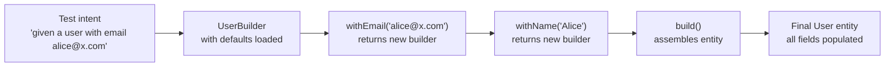
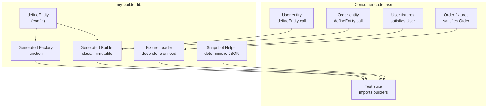

# 5.12 Test Data Builders and Fixtures

> A test data builder is the single most underrated piece of infrastructure in a codebase. It is the difference between a test suite that ages like milk and one that ages like wine. Every test you ever write needs data, and that data has to be constructed somehow. If the construction is repetitive, brittle, and noisy, the tests become repetitive, brittle, and noisy. If the construction is readable, override-friendly, and isolated, the tests become readable, override-friendly, and isolated. The builder pattern — a chainable, immutable factory for test entities — is the discipline that gets you from the former to the latter. Fixtures, the sibling concept, give you known starting state for tests that need it. Together they are the load-bearing walls of any serious test architecture.

## 1. Purpose

Test data builders exist because constructing test data is the most repetitive, most ignored, most consequential activity in a test suite. Every test needs an entity — a user, an order, a product, a request payload, a database row. If you construct those entities inline, by hand, you get tests that are eighty percent setup, ten percent assertion, and ten percent mystery. The setup noise drowns the intent of the test. The mystery is because the next developer cannot tell which fields are there because the test cares about them and which fields are there because the constructor requires them.

A test data builder solves this by giving every entity a single, centralized, fluent construction site. The builder knows the sensible defaults for every field. The test only overrides what it cares about. The rest of the entity is constructed invisibly, from defaults, so the test reads as a one-liner of intent: "given a user with email `alice@x.com`, when I call `resetPassword`, then a token is generated." The reader sees the email because the email is what the test cares about. The reader does not see the `id`, `createdAt`, `role`, `status`, or `lastLoginAt`, because those are noise and the builder hides them behind defaults.

A fixture is a related idea: a known, predetermined piece of starting state — a row in the `users` table, a JSON file on disk, an HTTP response captured from production — that the test infrastructure loads before tests run. Fixtures exist because some tests cannot operate on freshly minted entities. An integration test that joins five tables needs rows in all five. A snapshot test that asserts on a thousand-line response needs that response stored somewhere. A regression test that reproduces a specific production bug needs the exact request that triggered it. In all three cases, hand-rolling the data inside the test would be insane, so the data lives in a fixture file and the test references it by name.

The specific problems builders solve: verbose setup (a forty-line literal becomes a one-line fluent call), hard to modify (a schema change touches one builder line, not two hundred inline literals), hard to read intent (the builder surfaces only what the test cares about), inconsistent defaults (every test file invents its own defaults, causing collisions in aggregate), and state leakage (a test that mutates a shared literal poisons the next test; an immutable builder returns a fresh object every time).

The specific problems fixtures solve: known starting state (integration tests need rows in the database; fixtures load them deterministically), reproducible bugs (a regression test for a production bug needs the exact request that triggered it; that request lives in a fixture file), snapshot data (snapshot tests need a stable, large, captured response), and cross-test reuse (a "verified user with a paid subscription" is a fixture used by thirty tests; define it once, reference it by name).

The purpose of this note is to give you the complete mental model and the practical recipes for both builders and fixtures. By the end you should be able to build a typed, immutable test data builder for any entity in your codebase, choose between the builder and factory styles for any given situation, prevent state leakage across tests, and set up and tear down database fixtures without residue.

Related notes that provide context: [[5.04 Unit Testing Fundamentals]] for the test architecture builders live inside, [[5.10 Stubs Spies and Mocks]] for the sibling concept of test doubles, [[5.11 Mocking External Services]] for the broader mocking landscape this note sits inside, and [[1.15 Object Creation Patterns]] for the Gang-of-Four roots of the builder pattern itself.

## 2. Theory and Deep Dive

### 2.1 The Builder Pattern, Test-Flavored

The classical Gang-of-Four builder pattern, covered in [[1.15 Object Creation Patterns]], separates the construction of a complex object from its representation. A director orchestrates a builder; the builder exposes step methods; the final `build()` returns the product. The motivation in production code is usually to support multiple representations of the same construction process — HTML builder vs PDF builder vs Markdown builder for the same document.

The test data builder is a stripped-down, single-representation variant. There is no director. There is no polymorphic product family. There is one entity, one builder, one set of defaults. The motivation is not multiple representations; it is override-friendly defaults. The test data builder asks one question: "given that this entity has thirty fields and your test cares about two of them, how do I construct a valid entity specifying only those two?"

The answer is a fluent API:

```javascript
const user = new UserBuilder()
  .withName('Alice')
  .withEmail('alice@x.com')
  .build();
```

The three moving parts:

1. **Defaults.** Every field has a sensible default baked into the builder. The default `id` is a generated UUID, the default `email` is `test@example.com`, the default `createdAt` is a fixed timestamp. Defaults are chosen so any test that does not override a field still gets a valid, non-colliding, deterministic entity.
2. **Overrides.** Each `with*` method overrides one default. The method name mirrors the field name (`withName` for `name`, `withEmail` for `email`), so the override reads as English. The method returns the builder (or, in the immutable variant, a new builder), enabling chaining.
3. **Build.** The `build()` method assembles the final entity from the current builder state and returns it. After `build()`, the builder is consumed; calling `build()` again is either an error or returns a fresh copy, depending on the variant.

### 2.2 Mutable vs Immutable Builders

The first architectural decision when designing a builder is mutability. A mutable builder mutates itself on every `with*` call and returns `this`. An immutable builder returns a new builder instance on every `with*` call and never mutates itself.

Mutable is simpler to implement. Immutable is safer to use. The difference matters most when a builder is shared across tests, which happens more often than you would think — a top-level `const baseUser = new UserBuilder().withRole('admin').build()` referenced by ten tests is a shared builder, and if any of those tests mutates it, the next test gets poisoned state.

The recommendation, covered in detail in Section 7, is to default to immutable. The implementation cost is one extra object allocation per `with*` call, which is negligible in tests. The safety benefit is that shared base builders cannot be poisoned.

### 2.3 Factory Functions: The Builder's Sibling

A factory function is a one-call alternative to the builder pattern. Instead of chaining `with*` methods, you pass a partial object of overrides:

```javascript
const user = makeUser({ name: 'Alice', email: 'alice@x.com' });
```

The factory merges the overrides onto the defaults using spread:

```javascript
function makeUser(overrides = {}) {
  return { ...defaultUser(), ...overrides };
}
```

Factories are simpler, terser, and require no class machinery. They are the right choice for entities with fewer than about five fields, or for entities whose overrides are always flat key-value pairs. Builders earn their keep when the entity is complex enough that named methods read better than a partial object literal — typically when there are nested objects, arrays, or conditional defaults.

The two styles are not mutually exclusive. A common pattern is a factory function that delegates to a builder:

```javascript
function makeUser(overrides = {}) {
  let builder = new UserBuilder();
  for (const [key, value] of Object.entries(overrides)) {
    builder = builder[`with${capitalize(key)}`](value);
  }
  return builder.build();
}
```

This gives you the terse factory call site and the rich builder machinery under the hood. Section 5.2 shows a production-grade version of this hybrid.

### 2.4 Fixtures: Known Starting State

A fixture is predetermined data loaded into the test environment before tests run. The four common forms: database fixtures (a YAML or JSON file describing rows to insert into the `users`, `orders`, and `products` tables, rolled back or truncated after the suite); file fixtures (a JSON, JS, or text file in a `fixtures/` directory, imported or read by a test that needs a large stable blob like a captured API response, sample PDF, or sample CSV); in-memory fixtures (a JS module exporting predetermined entities for tests that need a known starting object but do not touch a database); and network fixtures (a recorded HTTP interaction replayed via Nock, Polly.js, or similar "cassettes").

The key property of all four forms is that the data is **known and stable**. The test does not generate the data; the test references it. This makes the test reproducible — same fixture file, same test result, forever — and makes the data auditable: the fixture file is checked into version control and reviewed like any other code.

### 2.5 State Leakage: The Silent Killer

State leakage is the failure mode where one test modifies state that another test reads, causing the second test to pass or fail depending on test order. Leakage is the single most common cause of "works on my machine, fails in CI" test failures, because CI often runs tests in a different order or in parallel, surfacing leakage that sequential local runs hide.

The four sources of leakage in test data: shared mutable objects (a top-level `const user = { ... }` literal mutated by one test and read by the next — fix with a fresh user per test via a builder); shared mutable builders (a top-level `const builder = new UserBuilder()` mutated by `builder.withX(...)` — fix with immutable builders or a fresh builder per test); database residue (a test inserts a row and does not delete it — fix with transactional test isolation or per-test truncation); and module-level caches (a factory that caches its default object returns the same reference to every test — fix with no caching or deep-clone on return).

The unifying principle: **every test must see the same starting state, regardless of what previous tests did**. The two ways to achieve this are (a) immutability — no test can mutate shared state because there is no shared state — and (b) teardown — every test cleans up after itself, restoring the starting state. Immutability is cheaper and more reliable; teardown is necessary when the state lives outside the test process (database rows, files on disk).

### 2.6 The Builder Pattern Flow

The Mermaid diagram below shows the flow from test intent to constructed entity through a builder:



In the mutable variant, `With1` and `With2` mutate the same builder instance. In the immutable variant (shown above as the recommended default), each `with*` returns a new builder, leaving the previous one untouched. The `build()` step reads the current builder state, assembles the entity, and returns it as a plain object.

### 2.7 Default Strategy and the Hybrid Pattern

Choosing defaults is a design decision with consequences. Bad defaults cause tests to pass when they should fail, or to fail in aggregate when they pass in isolation. The four rules for defaults: unique per call for IDs (use a sequence or seeded PRNG, never a constant), deterministic for timestamps (use a fixed date, never `new Date()`), valid for fields with a format (syntactically valid email and URL, never `null` or `undefined` for required fields), and generic for human-readable fields (`Test User`, not `Alice`, so tests do not accidentally rely on the default). The tension between uniqueness and determinism is resolved by a deterministic ID generator: a counter that resets per test run, or a UUID generated from a seeded PRNG.

The most ergonomic pattern in practice is a hybrid: a factory function as the primary API (handling 90% of cases with flat overrides on a complex entity), with a builder available for the rare cases that need conditional defaults, nested object construction, or multi-step builds inspected mid-build. The builder supports callback-style overrides for nested objects (`withAddress(a => a.withCity('Berlin'))`) so the test can fluently configure nested entities without breaking out of the chain. This pattern, used by mature testing libraries, gives the terse factory call site and the rich builder machinery under the hood.

### 2.8 Fixtures vs Builders: When to Use Which

Builders construct fresh entities in memory, in the test, with overrides. Fixtures load predetermined state from a file or database, before the test, with no overrides. The two are complementary. Use a builder when the test cares about one or two fields of a complex entity, when the entity is constructed in memory and passed to a function under test, or when different tests need different values for the same field. Use a fixture when the test needs a known stable large blob (a captured API response, a sample file), when the test needs rows in a database table that other tables reference via foreign keys, or when the test reproduces a production bug and needs the exact request that triggered it.

The gray zone is in-memory fixtures — JS modules that export predetermined entities. These overlap with factory functions. The rule of thumb: if the entity is small and varies per test, use a factory. If the entity is large, stable, and used by many tests verbatim, use an in-memory fixture module.

## 3. Mental Models

Five mental models, one per concept, each phrased as a sentence you can repeat to yourself when designing test infrastructure.

**Builder = defaults plus overrides, fluent API.** The builder holds the defaults. The test overlays overrides. The fluent API (`withName`, `withEmail`, `build`) makes the overlay read as English. The test's call site shows only what the test cares about; everything else is invisible defaults. This is the core mental model. Internalize it and every other decision flows from it.

**Factory = merge overrides onto defaults.** The factory is a one-liner: `makeUser({ name: 'Alice' })`. The defaults live inside the factory. The overrides are a partial object. The factory spreads overrides onto defaults and returns the merged entity. Simpler than a builder, less expressive, the right choice for simple entities.

**Fixture = known starting data.** A fixture is a file or database row set that the test infrastructure loads before tests run. The test does not generate the data; the test references it. Fixtures are for stable, large, shared, or production-captured data. They are not for per-test variation — that is what factories are for.

**Immutable builder = each `with*` returns a new builder, no mutation.** The builder never mutates itself. Each `with*` call returns a new builder instance with the override applied. The original builder is unchanged. This means a shared base builder cannot be poisoned by a test that overrides one field. The cost is one extra object allocation per `with*` call, which is free in tests.

**Fresh per test = no shared state, no leakage.** Every test gets a fresh entity, constructed via a builder or factory, with no reference to any other test's entity. The two ways to guarantee freshness are immutability (the builder returns new objects, so sharing is safe) and per-test construction (the test calls `makeUser()` in its setup, not at module scope). Pick at least one.

These five models compose. A typical mature setup is: immutable builders for complex entities, factory functions for simple entities, file fixtures for captured blobs, database fixtures for integration tests, and per-test construction enforced via `beforeEach` hooks. The five models together give you a test data architecture that scales from ten tests to ten thousand tests without redesign.

## 4. Real-World Use Cases

### 4.1 Building Test Entities

The bread-and-butter use case. Every service layer test that calls `userService.create(input)` needs a `User` to assert against; every repository test needs a `User` to seed the mock with; every controller test needs a request body shaped like a `User`. The entity complexity scales the benefit: a `User` with five fields is fine as a literal, but a `User` with thirty fields (`id`, `email`, `name`, `role`, `status`, `createdAt`, `updatedAt`, `lastLoginAt`, `timezone`, `locale`, `avatarUrl`, `emailVerified`, `mfaEnabled`, `parentId`, `organizationId`, `teamIds`, `permissions`, `metadata`, and so on) is unmanageable as a literal. The builder hides the twenty-eight fields the test does not care about and surfaces the two it does.

### 4.2 Setting Up Database Fixtures

Integration tests that hit a real database need known rows. A `users` fixture file lists the rows to insert:

```yaml
# fixtures/users.yml
- id: "11111111-1111-1111-1111-111111111111"
  email: "alice@x.com"
  role: "admin"
  status: "active"
- id: "22222222-2222-2222-2222-222222222222"
  email: "bob@x.com"
  role: "member"
  status: "active"
```

The test framework's fixture loader reads this file, inserts the rows before the suite, and truncates after. Tests reference the rows by ID. The benefit is that foreign keys just work (an `orders` fixture can reference `userId: "11111111-1111-1111-1111-111111111111"` and the join succeeds). The cost is that the fixture file must be kept in sync with the schema.

### 4.3 Snapshot Data

Snapshot tests assert that a function's output matches a previously captured snapshot, stored as a file in a dedicated snapshots directory. For snapshots of large objects, the input data is also large. A function that converts a `User` entity into a `UserProfileDTO` might take a thirty-field `User` as input. A builder reduces the input construction to one line, and the snapshot captures the output. The builder also makes it trivial to test variations: `makeUser({ role: 'admin' })`, `makeUser({ role: 'member' })`, `makeUser({ status: 'banned' })` — three snapshots, three one-liners.

### 4.4 API Test Payloads

API integration tests send HTTP requests with entity-shaped bodies: `POST /users` takes a `CreateUserInput`, `POST /orders` takes a `CreateOrderInput` with a nested `customerId` and an array of `OrderLineItem` objects. Builders shine here because the payloads are nested and conditionally required. A `CreateOrderInput` builder might expose `withCustomer(c => c.withEmail('alice@x.com'))` for the nested customer, `withLineItem(item => item.withSku('ABC').withQuantity(2))` for each line item, and `withShippingAddress(addr => addr.withCountry('DE'))` for the shipping address. The chain reads as English and the resulting payload is a fully valid request body, ready to send via `supertest` or `fetch`.

### 4.5 Mock Data for Frontend Tests

Frontend component tests need mock data for the API calls the component makes: a `UserProfile` component needs a mock user response, an `OrderList` component needs a mock array of orders. The frontend test typically combines a builder with a mock setup: `mockApi.get('/users/1').reply(200, makeUser({ id: '1', name: 'Alice' }))`. The builder produces the response body; the mock library wires it into the API call. The component renders against the mock data, and the test asserts on the rendered output.

### 4.6 Reproducing Production Bugs

A production bug report says "user Alice with email `alice@x.com` and a deleted organization got a 500 error when she tried to view her dashboard." The builder makes the reproduction trivial: `makeUser({ email: 'alice@x.com', organization: makeOrganization({ deletedAt: '2024-01-01T00:00:00Z' }) })`. Without a builder, the test would need a sixty-line literal; with a builder, the test is two lines and the intent is crystal clear. The bug reproduction becomes a regression test that stays in the suite forever.

### 4.7 Property-Based Testing Inputs

Property-based testing libraries like `fast-check` generate randomized inputs to test invariants. A builder integrates naturally: the generator produces a partial overrides object, and the factory assembles a valid entity from the overrides plus defaults. The generator does not need to know about `id`, `createdAt`, `role`, or `status` — those come from defaults.

```javascript
const userArb = fc.record({
  email: fc.emailAddress(),
  name: fc.string({ minLength: 1 }),
}).map(overrides => makeUser(overrides));
```

## 5. Code Examples

### 5.1 Example A — Minimal and Conceptual

A minimal user builder, factory, and fixture file in their smallest useful form. Side-by-side JavaScript and TypeScript versions.

#### 5.1.1 JavaScript Version

```javascript
// builders/userBuilder.js

const defaultName = 'Test User';
const defaultEmail = 'test@example.com';
const defaultRole = 'member';
const defaultStatus = 'active';
const fixedNow = new Date('2024-01-01T00:00:00Z');

let idCounter = 0;
function nextId() {
  idCounter += 1;
  return `user-${idCounter}`;
}

class UserBuilder {
  constructor(state = {}) {
    this.state = state;
  }

  withName(name) {
    return new UserBuilder({ ...this.state, name });
  }

  withEmail(email) {
    return new UserBuilder({ ...this.state, email });
  }

  withRole(role) {
    return new UserBuilder({ ...this.state, role });
  }

  withStatus(status) {
    return new UserBuilder({ ...this.state, status });
  }

  build() {
    return {
      id: nextId(),
      name: this.state.name ?? defaultName,
      email: this.state.email ?? defaultEmail,
      role: this.state.role ?? defaultRole,
      status: this.state.status ?? defaultStatus,
      createdAt: fixedNow,
    };
  }
}

function makeUser(overrides = {}) {
  let builder = new UserBuilder();
  if (overrides.name) builder = builder.withName(overrides.name);
  if (overrides.email) builder = builder.withEmail(overrides.email);
  if (overrides.role) builder = builder.withRole(overrides.role);
  if (overrides.status) builder = builder.withStatus(overrides.status);
  const user = builder.build();
  return { ...user, ...overrides };
}

module.exports = { UserBuilder, makeUser };
```

```javascript
// fixtures/users.fixture.js

const userFixtures = {
  alice: {
    id: '11111111-1111-1111-1111-111111111111',
    name: 'Alice Lee',
    email: 'alice@x.com',
    role: 'admin',
    status: 'active',
    createdAt: '2024-01-01T00:00:00Z',
  },
  bob: {
    id: '22222222-2222-2222-2222-222222222222',
    name: 'Bob Chen',
    email: 'bob@x.com',
    role: 'member',
    status: 'active',
    createdAt: '2024-01-02T00:00:00Z',
  },
  carol: {
    id: '33333333-3333-3333-3333-333333333333',
    name: 'Carol Park',
    email: 'carol@x.com',
    role: 'member',
    status: 'banned',
    createdAt: '2024-01-03T00:00:00Z',
  },
};

module.exports = userFixtures;
```

```javascript
// userBuilder.test.js

const { UserBuilder, makeUser } = require('./builders/userBuilder');
const userFixtures = require('./fixtures/users.fixture');

describe('UserBuilder', () => {
  it('builds a user with defaults', () => {
    const user = new UserBuilder().build();
    expect(user.name).toBe('Test User');
    expect(user.email).toBe('test@example.com');
    expect(user.role).toBe('member');
    expect(user.status).toBe('active');
    expect(user.id).toMatch(/^user-\d+$/);
  });

  it('overrides only the specified fields', () => {
    const user = new UserBuilder()
      .withName('Alice')
      .withEmail('alice@x.com')
      .build();
    expect(user.name).toBe('Alice');
    expect(user.email).toBe('alice@x.com');
    expect(user.role).toBe('member');
  });

  it('returns a fresh id on every build', () => {
    const a = new UserBuilder().build();
    const b = new UserBuilder().build();
    expect(a.id).not.toBe(b.id);
  });

  it('is immutable: withName does not mutate the original', () => {
    const base = new UserBuilder().withName('Base');
    const derived = base.withName('Derived');
    expect(base.build().name).toBe('Base');
    expect(derived.build().name).toBe('Derived');
  });
});

describe('makeUser factory', () => {
  it('merges overrides onto defaults', () => {
    const user = makeUser({ email: 'alice@x.com' });
    expect(user.email).toBe('alice@x.com');
    expect(user.name).toBe('Test User');
  });
});

describe('userFixtures', () => {
  it('exposes predetermined users by name', () => {
    expect(userFixtures.alice.email).toBe('alice@x.com');
    expect(userFixtures.bob.role).toBe('member');
    expect(userFixtures.carol.status).toBe('banned');
  });
});
```

#### 5.1.2 TypeScript Version

```typescript
// builders/userBuilder.ts

export type UserRole = 'admin' | 'member' | 'guest';
export type UserStatus = 'active' | 'banned' | 'pending';

export interface User {
  readonly id: string;
  readonly name: string;
  readonly email: string;
  readonly role: UserRole;
  readonly status: UserStatus;
  readonly createdAt: Date;
}

export interface UserOverrides {
  readonly name?: string;
  readonly email?: string;
  readonly role?: UserRole;
  readonly status?: UserStatus;
}

const defaultName = 'Test User';
const defaultEmail = 'test@example.com';
const defaultRole: UserRole = 'member';
const defaultStatus: UserStatus = 'active';
const fixedNow = new Date('2024-01-01T00:00:00Z');

let idCounter = 0;
function nextId(): string {
  idCounter += 1;
  return `user-${idCounter}`;
}

export class UserBuilder {
  private readonly state: UserOverrides;

  constructor(state: UserOverrides = {}) {
    this.state = state;
  }

  withName(name: string): UserBuilder {
    return new UserBuilder({ ...this.state, name });
  }

  withEmail(email: string): UserBuilder {
    return new UserBuilder({ ...this.state, email });
  }

  withRole(role: UserRole): UserBuilder {
    return new UserBuilder({ ...this.state, role });
  }

  withStatus(status: UserStatus): UserBuilder {
    return new UserBuilder({ ...this.state, status });
  }

  build(): User {
    return {
      id: nextId(),
      name: this.state.name ?? defaultName,
      email: this.state.email ?? defaultEmail,
      role: this.state.role ?? defaultRole,
      status: this.state.status ?? defaultStatus,
      createdAt: fixedNow,
    };
  }
}

export function makeUser(overrides: UserOverrides = {}): User {
  const builder = new UserBuilder()
    .withName(overrides.name ?? defaultName)
    .withEmail(overrides.email ?? defaultEmail)
    .withRole(overrides.role ?? defaultRole)
    .withStatus(overrides.status ?? defaultStatus);
  return builder.build();
}
```

```typescript
// fixtures/users.fixture.ts

import type { User } from '../builders/userBuilder';

export const userFixtures = {
  alice: {
    id: '11111111-1111-1111-1111-111111111111',
    name: 'Alice Lee',
    email: 'alice@x.com',
    role: 'admin',
    status: 'active',
    createdAt: new Date('2024-01-01T00:00:00Z'),
  },
  bob: {
    id: '22222222-2222-2222-2222-222222222222',
    name: 'Bob Chen',
    email: 'bob@x.com',
    role: 'member',
    status: 'active',
    createdAt: new Date('2024-01-02T00:00:00Z'),
  },
  carol: {
    id: '33333333-3333-3333-3333-333333333333',
    name: 'Carol Park',
    email: 'carol@x.com',
    role: 'member',
    status: 'banned',
    createdAt: new Date('2024-01-03T00:00:00Z'),
  },
} satisfies Record<string, User>;

export type UserFixtures = typeof userFixtures;
```

```typescript
// userBuilder.test.ts

import { describe, it, expect } from 'vitest';
import { UserBuilder, makeUser } from './builders/userBuilder';
import { userFixtures } from './fixtures/users.fixture';

describe('UserBuilder', () => {
  it('builds a user with defaults', () => {
    const user = new UserBuilder().build();
    expect(user.name).toBe('Test User');
    expect(user.email).toBe('test@example.com');
    expect(user.role).toBe('member');
    expect(user.status).toBe('active');
    expect(user.id).toMatch(/^user-\d+$/);
  });

  it('overrides only the specified fields', () => {
    const user = new UserBuilder()
      .withName('Alice')
      .withEmail('alice@x.com')
      .build();
    expect(user.name).toBe('Alice');
    expect(user.email).toBe('alice@x.com');
    expect(user.role).toBe('member');
  });

  it('returns a fresh id on every build', () => {
    const a = new UserBuilder().build();
    const b = new UserBuilder().build();
    expect(a.id).not.toBe(b.id);
  });

  it('is immutable: withName does not mutate the original', () => {
    const base = new UserBuilder().withName('Base');
    const derived = base.withName('Derived');
    expect(base.build().name).toBe('Base');
    expect(derived.build().name).toBe('Derived');
  });
});

describe('makeUser factory', () => {
  it('merges overrides onto defaults', () => {
    const user = makeUser({ email: 'alice@x.com' });
    expect(user.email).toBe('alice@x.com');
    expect(user.name).toBe('Test User');
  });
});

describe('userFixtures', () => {
  it('exposes predetermined users by name', () => {
    expect(userFixtures.alice.email).toBe('alice@x.com');
    expect(userFixtures.bob.role).toBe('member');
    expect(userFixtures.carol.status).toBe('banned');
  });
});
```

Note the structural parallel between the two versions. The TypeScript version adds type annotations on the overrides, the entity, and the builder state, and the `satisfies Record<string, User>` check on the fixture file ensures every fixture entry conforms to the `User` shape without widening the inferred type. The JavaScript version is structurally identical; it just lacks the compile-time guarantees.

### 5.2 Example B — Production-Grade

A production-grade builder library: immutable builders, factories, fixtures, nested entity support, callback-style overrides, snapshot support, sequence support (for indexed entities like `user-1`, `user-2`), and full TypeScript types. The library handles `User`, `Order`, and `OrderLineItem`, with `Order` containing a nested `User` customer and an array of `OrderLineItem`.

#### 5.2.1 JavaScript Version

```javascript
// lib/builders/index.js

const fixedNow = new Date('2024-01-01T00:00:00Z');

function createSequence(prefix) {
  let counter = 0;
  return () => {
    counter += 1;
    return `${prefix}-${counter}`;
  };
}

function deepClone(value) {
  return JSON.parse(JSON.stringify(value));
}

// --- User ---

const nextUserId = createSequence('user');

class UserBuilder {
  constructor(state = {}) {
    this.state = state;
  }

  withId(id) {
    return new UserBuilder({ ...this.state, id });
  }

  withName(name) {
    return new UserBuilder({ ...this.state, name });
  }

  withEmail(email) {
    return new UserBuilder({ ...this.state, email });
  }

  withRole(role) {
    return new UserBuilder({ ...this.state, role });
  }

  withStatus(status) {
    return new UserBuilder({ ...this.state, status });
  }

  withCreatedAt(createdAt) {
    return new UserBuilder({ ...this.state, createdAt });
  }

  build() {
    return deepClone({
      id: this.state.id ?? nextUserId(),
      name: this.state.name ?? 'Test User',
      email: this.state.email ?? 'test@example.com',
      role: this.state.role ?? 'member',
      status: this.state.status ?? 'active',
      createdAt: this.state.createdAt ?? new Date(fixedNow),
    });
  }
}

function makeUser(overrides = {}) {
  let builder = new UserBuilder();
  if (overrides.id !== undefined) builder = builder.withId(overrides.id);
  if (overrides.name !== undefined) builder = builder.withName(overrides.name);
  if (overrides.email !== undefined) builder = builder.withEmail(overrides.email);
  if (overrides.role !== undefined) builder = builder.withRole(overrides.role);
  if (overrides.status !== undefined) builder = builder.withStatus(overrides.status);
  if (overrides.createdAt !== undefined) builder = builder.withCreatedAt(overrides.createdAt);
  return builder.build();
}

// --- OrderLineItem ---

const nextLineItemId = createSequence('line-item');

class OrderLineItemBuilder {
  constructor(state = {}) {
    this.state = state;
  }

  withId(id) {
    return new OrderLineItemBuilder({ ...this.state, id });
  }

  withSku(sku) {
    return new OrderLineItemBuilder({ ...this.state, sku });
  }

  withQuantity(quantity) {
    return new OrderLineItemBuilder({ ...this.state, quantity });
  }

  withUnitPrice(unitPrice) {
    return new OrderLineItemBuilder({ ...this.state, unitPrice });
  }

  build() {
    return deepClone({
      id: this.state.id ?? nextLineItemId(),
      sku: this.state.sku ?? 'SKU-DEFAULT',
      quantity: this.state.quantity ?? 1,
      unitPrice: this.state.unitPrice ?? 1000,
    });
  }
}

function makeOrderLineItem(overrides = {}) {
  let builder = new OrderLineItemBuilder();
  if (overrides.id !== undefined) builder = builder.withId(overrides.id);
  if (overrides.sku !== undefined) builder = builder.withSku(overrides.sku);
  if (overrides.quantity !== undefined) builder = builder.withQuantity(overrides.quantity);
  if (overrides.unitPrice !== undefined) builder = builder.withUnitPrice(overrides.unitPrice);
  return builder.build();
}

// --- Order ---

const nextOrderId = createSequence('order');

class OrderBuilder {
  constructor(state = {}) {
    this.state = state;
  }

  withId(id) {
    return new OrderBuilder({ ...this.state, id });
  }

  withCustomer(customerOrCallback) {
    const customer = typeof customerOrCallback === 'function'
      ? customerOrCallback(new UserBuilder()).build()
      : customerOrCallback;
    return new OrderBuilder({ ...this.state, customer });
  }

  withLineItem(itemOrCallback) {
    const item = typeof itemOrCallback === 'function'
      ? itemOrCallback(new OrderLineItemBuilder()).build()
      : itemOrCallback;
    const items = [...(this.state.lineItems ?? []), item];
    return new OrderBuilder({ ...this.state, lineItems: items });
  }

  withStatus(status) {
    return new OrderBuilder({ ...this.state, status });
  }

  withCreatedAt(createdAt) {
    return new OrderBuilder({ ...this.state, createdAt });
  }

  build() {
    return deepClone({
      id: this.state.id ?? nextOrderId(),
      customer: this.state.customer ?? new UserBuilder().build(),
      lineItems: this.state.lineItems ?? [new OrderLineItemBuilder().build()],
      status: this.state.status ?? 'pending',
      createdAt: this.state.createdAt ?? new Date(fixedNow),
    });
  }
}

function makeOrder(overrides = {}) {
  let builder = new OrderBuilder();
  if (overrides.id !== undefined) builder = builder.withId(overrides.id);
  if (overrides.customer !== undefined) builder = builder.withCustomer(overrides.customer);
  if (overrides.status !== undefined) builder = builder.withStatus(overrides.status);
  if (overrides.createdAt !== undefined) builder = builder.withCreatedAt(overrides.createdAt);
  let order = builder.build();
  if (overrides.lineItems !== undefined) {
    order = { ...order, lineItems: overrides.lineItems.map(makeOrderLineItem) };
  }
  return order;
}

// --- Fixture loader ---

function loadFixture(name) {
  // In real code: read from disk, parse, validate.
  // Here: import from a module.
  const fixtures = require('./fixtures');
  if (!fixtures[name]) {
    throw new Error(`Unknown fixture: ${name}`);
  }
  return deepClone(fixtures[name]);
}

// --- Snapshot helper ---

function snapshot(value) {
  return JSON.stringify(value, null, 2);
}

module.exports = {
  UserBuilder,
  makeUser,
  OrderLineItemBuilder,
  makeOrderLineItem,
  OrderBuilder,
  makeOrder,
  loadFixture,
  snapshot,
};
```

```javascript
// lib/fixtures.js

module.exports = {
  aliceAdmin: {
    id: '11111111-1111-1111-1111-111111111111',
    name: 'Alice Lee',
    email: 'alice@x.com',
    role: 'admin',
    status: 'active',
    createdAt: '2024-01-01T00:00:00Z',
  },
  bobMember: {
    id: '22222222-2222-2222-2222-222222222222',
    name: 'Bob Chen',
    email: 'bob@x.com',
    role: 'member',
    status: 'active',
    createdAt: '2024-01-02T00:00:00Z',
  },
  carolBanned: {
    id: '33333333-3333-3333-3333-333333333333',
    name: 'Carol Park',
    email: 'carol@x.com',
    role: 'member',
    status: 'banned',
    createdAt: '2024-01-03T00:00:00Z',
  },
  orderOneLine: {
    id: 'order-001',
    customer: {
      id: '11111111-1111-1111-1111-111111111111',
      name: 'Alice Lee',
      email: 'alice@x.com',
      role: 'admin',
      status: 'active',
      createdAt: '2024-01-01T00:00:00Z',
    },
    lineItems: [
      {
        id: 'line-item-001',
        sku: 'SKU-001',
        quantity: 2,
        unitPrice: 1500,
      },
    ],
    status: 'pending',
    createdAt: '2024-01-04T00:00:00Z',
  },
};
```

```javascript
// builders.test.js

const {
  UserBuilder,
  makeUser,
  OrderBuilder,
  makeOrder,
  OrderLineItemBuilder,
  loadFixture,
  snapshot,
} = require('./lib/builders');

describe('production-grade builders', () => {
  describe('UserBuilder', () => {
    it('returns fresh entities on each build (no shared references)', () => {
      const a = new UserBuilder().build();
      const b = new UserBuilder().build();
      expect(a).not.toBe(b);
      expect(a.id).not.toBe(b.id);
    });

    it('respects overrides via the factory', () => {
      const user = makeUser({ email: 'alice@x.com', role: 'admin' });
      expect(user.email).toBe('alice@x.com');
      expect(user.role).toBe('admin');
      expect(user.name).toBe('Test User');
    });

    it('is immutable: chaining does not mutate prior builders', () => {
      const base = new UserBuilder().withRole('admin');
      const derived = base.withEmail('admin@x.com');
      expect(base.build().email).toBe('test@example.com');
      expect(derived.build().email).toBe('admin@x.com');
    });
  });

  describe('OrderBuilder', () => {
    it('builds a default order with one line item', () => {
      const order = new OrderBuilder().build();
      expect(order.lineItems).toHaveLength(1);
      expect(order.status).toBe('pending');
      expect(order.customer.email).toBe('test@example.com');
    });

    it('supports callback-style nested overrides', () => {
      const order = new OrderBuilder()
        .withCustomer(c => c.withEmail('alice@x.com').withRole('admin'))
        .withLineItem(i => i.withSku('SKU-001').withQuantity(3))
        .withLineItem(i => i.withSku('SKU-002').withQuantity(1))
        .build();
      expect(order.customer.email).toBe('alice@x.com');
      expect(order.lineItems).toHaveLength(2);
      expect(order.lineItems[0].sku).toBe('SKU-001');
      expect(order.lineItems[0].quantity).toBe(3);
      expect(order.lineItems[1].sku).toBe('SKU-002');
    });

    it('respects overrides via the factory', () => {
      const order = makeOrder({
        customer: makeUser({ email: 'bob@x.com' }),
        lineItems: [
          { sku: 'SKU-X', quantity: 5 },
          { sku: 'SKU-Y', quantity: 2 },
        ],
      });
      expect(order.customer.email).toBe('bob@x.com');
      expect(order.lineItems).toHaveLength(2);
      expect(order.lineItems[0].sku).toBe('SKU-X');
    });
  });

  describe('fixtures', () => {
    it('loads a fixture by name and returns a deep clone', () => {
      const alice = loadFixture('aliceAdmin');
      const aliceAgain = loadFixture('aliceAdmin');
      expect(alice).toEqual(aliceAgain);
      expect(alice).not.toBe(aliceAgain);
      alice.email = 'mutated@x.com';
      expect(loadFixture('aliceAdmin').email).toBe('alice@x.com');
    });

    it('throws on unknown fixture', () => {
      expect(() => loadFixture('unknown')).toThrow(/Unknown fixture/);
    });
  });
});
```

#### 5.2.2 TypeScript Version

```typescript
// lib/builders/index.ts

export type UserRole = 'admin' | 'member' | 'guest';
export type UserStatus = 'active' | 'banned' | 'pending';
export type OrderStatus = 'pending' | 'paid' | 'shipped' | 'cancelled';

export interface User {
  readonly id: string;
  readonly name: string;
  readonly email: string;
  readonly role: UserRole;
  readonly status: UserStatus;
  readonly createdAt: Date;
}

export interface OrderLineItem {
  readonly id: string;
  readonly sku: string;
  readonly quantity: number;
  readonly unitPrice: number;
}

export interface Order {
  readonly id: string;
  readonly customer: User;
  readonly lineItems: readonly OrderLineItem[];
  readonly status: OrderStatus;
  readonly createdAt: Date;
}

export interface UserOverrides {
  readonly id?: string;
  readonly name?: string;
  readonly email?: string;
  readonly role?: UserRole;
  readonly status?: UserStatus;
  readonly createdAt?: Date;
}

export interface OrderLineItemOverrides {
  readonly id?: string;
  readonly sku?: string;
  readonly quantity?: number;
  readonly unitPrice?: number;
}

export interface OrderOverrides {
  readonly id?: string;
  readonly customer?: User;
  readonly lineItems?: readonly OrderLineItemOverrides[];
  readonly status?: OrderStatus;
  readonly createdAt?: Date;
}

const fixedNow = new Date('2024-01-01T00:00:00Z');

function createSequence(prefix: string): () => string {
  let counter = 0;
  return () => {
    counter += 1;
    return `${prefix}-${counter}`;
  };
}

function deepClone<T>(value: T): T {
  return JSON.parse(JSON.stringify(value)) as T;
}

// --- User ---

const nextUserId = createSequence('user');

export class UserBuilder {
  private readonly state: UserOverrides;

  constructor(state: UserOverrides = {}) {
    this.state = state;
  }

  withId(id: string): UserBuilder {
    return new UserBuilder({ ...this.state, id });
  }

  withName(name: string): UserBuilder {
    return new UserBuilder({ ...this.state, name });
  }

  withEmail(email: string): UserBuilder {
    return new UserBuilder({ ...this.state, email });
  }

  withRole(role: UserRole): UserBuilder {
    return new UserBuilder({ ...this.state, role });
  }

  withStatus(status: UserStatus): UserBuilder {
    return new UserBuilder({ ...this.state, status });
  }

  withCreatedAt(createdAt: Date): UserBuilder {
    return new UserBuilder({ ...this.state, createdAt });
  }

  build(): User {
    return deepClone({
      id: this.state.id ?? nextUserId(),
      name: this.state.name ?? 'Test User',
      email: this.state.email ?? 'test@example.com',
      role: this.state.role ?? 'member',
      status: this.state.status ?? 'active',
      createdAt: this.state.createdAt ?? new Date(fixedNow),
    });
  }
}

export function makeUser(overrides: UserOverrides = {}): User {
  return new UserBuilder()
    .withId(overrides.id ?? nextUserId())
    .withName(overrides.name ?? 'Test User')
    .withEmail(overrides.email ?? 'test@example.com')
    .withRole(overrides.role ?? 'member')
    .withStatus(overrides.status ?? 'active')
    .withCreatedAt(overrides.createdAt ?? new Date(fixedNow))
    .build();
}

// --- OrderLineItem ---

const nextLineItemId = createSequence('line-item');

export class OrderLineItemBuilder {
  private readonly state: OrderLineItemOverrides;

  constructor(state: OrderLineItemOverrides = {}) {
    this.state = state;
  }

  withId(id: string): OrderLineItemBuilder {
    return new OrderLineItemBuilder({ ...this.state, id });
  }

  withSku(sku: string): OrderLineItemBuilder {
    return new OrderLineItemBuilder({ ...this.state, sku });
  }

  withQuantity(quantity: number): OrderLineItemBuilder {
    return new OrderLineItemBuilder({ ...this.state, quantity });
  }

  withUnitPrice(unitPrice: number): OrderLineItemBuilder {
    return new OrderLineItemBuilder({ ...this.state, unitPrice });
  }

  build(): OrderLineItem {
    return deepClone({
      id: this.state.id ?? nextLineItemId(),
      sku: this.state.sku ?? 'SKU-DEFAULT',
      quantity: this.state.quantity ?? 1,
      unitPrice: this.state.unitPrice ?? 1000,
    });
  }
}

export function makeOrderLineItem(overrides: OrderLineItemOverrides = {}): OrderLineItem {
  return new OrderLineItemBuilder()
    .withId(overrides.id ?? nextLineItemId())
    .withSku(overrides.sku ?? 'SKU-DEFAULT')
    .withQuantity(overrides.quantity ?? 1)
    .withUnitPrice(overrides.unitPrice ?? 1000)
    .build();
}

// --- Order ---

const nextOrderId = createSequence('order');

type CustomerArg = User | ((builder: UserBuilder) => UserBuilder);
type LineItemArg = OrderLineItem | ((builder: OrderLineItemBuilder) => OrderLineItemBuilder);

export class OrderBuilder {
  private readonly state: {
    readonly id?: string;
    readonly customer?: User;
    readonly lineItems?: readonly OrderLineItem[];
    readonly status?: OrderStatus;
    readonly createdAt?: Date;
  };

  constructor(state: OrderBuilder['state'] = {}) {
    this.state = state;
  }

  withId(id: string): OrderBuilder {
    return new OrderBuilder({ ...this.state, id });
  }

  withCustomer(customerOrCallback: CustomerArg): OrderBuilder {
    const customer: User = typeof customerOrCallback === 'function'
      ? customerOrCallback(new UserBuilder()).build()
      : customerOrCallback;
    return new OrderBuilder({ ...this.state, customer });
  }

  withLineItem(itemOrCallback: LineItemArg): OrderBuilder {
    const item: OrderLineItem = typeof itemOrCallback === 'function'
      ? itemOrCallback(new OrderLineItemBuilder()).build()
      : itemOrCallback;
    const items = [...(this.state.lineItems ?? []), item];
    return new OrderBuilder({ ...this.state, lineItems: items });
  }

  withStatus(status: OrderStatus): OrderBuilder {
    return new OrderBuilder({ ...this.state, status });
  }

  withCreatedAt(createdAt: Date): OrderBuilder {
    return new OrderBuilder({ ...this.state, createdAt });
  }

  build(): Order {
    return deepClone({
      id: this.state.id ?? nextOrderId(),
      customer: this.state.customer ?? new UserBuilder().build(),
      lineItems: this.state.lineItems ?? [new OrderLineItemBuilder().build()],
      status: this.state.status ?? 'pending',
      createdAt: this.state.createdAt ?? new Date(fixedNow),
    });
  }
}

export function makeOrder(overrides: OrderOverrides = {}): Order {
  const builder = new OrderBuilder()
    .withId(overrides.id ?? nextOrderId())
    .withCustomer(overrides.customer ?? makeUser())
    .withStatus(overrides.status ?? 'pending')
    .withCreatedAt(overrides.createdAt ?? new Date(fixedNow));
  const base = builder.build();
  if (overrides.lineItems === undefined) {
    return base;
  }
  return {
    ...base,
    lineItems: overrides.lineItems.map(makeOrderLineItem),
  };
}

// --- Fixture loader ---

import fixtures from './fixtures';

export type FixtureName = keyof typeof fixtures;

export function loadFixture<T extends FixtureName>(name: T): typeof fixtures[T] {
  const value = fixtures[name];
  if (value === undefined) {
    throw new Error(`Unknown fixture: ${name}`);
  }
  return deepClone(value);
}

// --- Snapshot helper ---

export function snapshot<T>(value: T): string {
  return JSON.stringify(value, null, 2);
}
```

```typescript
// lib/fixtures.ts

import type { User, Order } from './builders';

export const fixtures = {
  aliceAdmin: {
    id: '11111111-1111-1111-1111-111111111111',
    name: 'Alice Lee',
    email: 'alice@x.com',
    role: 'admin',
    status: 'active',
    createdAt: new Date('2024-01-01T00:00:00Z'),
  } satisfies User,
  bobMember: {
    id: '22222222-2222-2222-2222-222222222222',
    name: 'Bob Chen',
    email: 'bob@x.com',
    role: 'member',
    status: 'active',
    createdAt: new Date('2024-01-02T00:00:00Z'),
  } satisfies User,
  carolBanned: {
    id: '33333333-3333-3333-3333-333333333333',
    name: 'Carol Park',
    email: 'carol@x.com',
    role: 'member',
    status: 'banned',
    createdAt: new Date('2024-01-03T00:00:00Z'),
  } satisfies User,
  orderOneLine: {
    id: 'order-001',
    customer: {
      id: '11111111-1111-1111-1111-111111111111',
      name: 'Alice Lee',
      email: 'alice@x.com',
      role: 'admin',
      status: 'active',
      createdAt: new Date('2024-01-01T00:00:00Z'),
    },
    lineItems: [
      {
        id: 'line-item-001',
        sku: 'SKU-001',
        quantity: 2,
        unitPrice: 1500,
      },
    ],
    status: 'pending',
    createdAt: new Date('2024-01-04T00:00:00Z'),
  } satisfies Order,
} as const;

export type Fixtures = typeof fixtures;
```

```typescript
// builders.test.ts

import { describe, it, expect } from 'vitest';
import {
  UserBuilder,
  makeUser,
  OrderBuilder,
  makeOrder,
  OrderLineItemBuilder,
  loadFixture,
  snapshot,
} from './lib/builders';

describe('production-grade builders', () => {
  describe('UserBuilder', () => {
    it('returns fresh entities on each build (no shared references)', () => {
      const a = new UserBuilder().build();
      const b = new UserBuilder().build();
      expect(a).not.toBe(b);
      expect(a.id).not.toBe(b.id);
    });

    it('respects overrides via the factory', () => {
      const user = makeUser({ email: 'alice@x.com', role: 'admin' });
      expect(user.email).toBe('alice@x.com');
      expect(user.role).toBe('admin');
      expect(user.name).toBe('Test User');
    });

    it('is immutable: chaining does not mutate prior builders', () => {
      const base = new UserBuilder().withRole('admin');
      const derived = base.withEmail('admin@x.com');
      expect(base.build().email).toBe('test@example.com');
      expect(derived.build().email).toBe('admin@x.com');
    });
  });

  describe('OrderBuilder', () => {
    it('builds a default order with one line item', () => {
      const order = new OrderBuilder().build();
      expect(order.lineItems).toHaveLength(1);
      expect(order.status).toBe('pending');
      expect(order.customer.email).toBe('test@example.com');
    });

    it('supports callback-style nested overrides', () => {
      const order = new OrderBuilder()
        .withCustomer(c => c.withEmail('alice@x.com').withRole('admin'))
        .withLineItem(i => i.withSku('SKU-001').withQuantity(3))
        .withLineItem(i => i.withSku('SKU-002').withQuantity(1))
        .build();
      expect(order.customer.email).toBe('alice@x.com');
      expect(order.lineItems).toHaveLength(2);
      expect(order.lineItems[0].sku).toBe('SKU-001');
      expect(order.lineItems[0].quantity).toBe(3);
      expect(order.lineItems[1].sku).toBe('SKU-002');
    });

    it('respects overrides via the factory', () => {
      const order = makeOrder({
        customer: makeUser({ email: 'bob@x.com' }),
        lineItems: [
          { sku: 'SKU-X', quantity: 5 },
          { sku: 'SKU-Y', quantity: 2 },
        ],
      });
      expect(order.customer.email).toBe('bob@x.com');
      expect(order.lineItems).toHaveLength(2);
      expect(order.lineItems[0].sku).toBe('SKU-X');
    });
  });

  describe('fixtures', () => {
    it('loads a fixture by name and returns a deep clone', () => {
      const alice = loadFixture('aliceAdmin');
      const aliceAgain = loadFixture('aliceAdmin');
      expect(alice).toEqual(aliceAgain);
      expect(alice).not.toBe(aliceAgain);
    });

    it('throws on unknown fixture', () => {
      expect(() => loadFixture('orderOneLine' as never)).not.toThrow();
      // @ts-expect-error unknown fixture name
      expect(() => loadFixture('unknown')).toThrow();
    });
  });
});
```

The TypeScript version's `satisfies User` clause on each fixture entry is the key win: it enforces that the fixture conforms to the entity shape at compile time, so a schema change breaks the build until the fixture is updated. This is the mechanism that keeps fixtures in sync with the schema, discussed further in Sections 6 and 7.

## 6. Common Mistakes and Anti-Patterns

The mistakes below are presented in rough order of frequency. The first three account for the majority of real-world test data pain.

### 6.1 Mutable Builders with Shared State (Leakage)

The classic. A team writes a mutable builder (`with*` returns `this`) and shares it at module scope. Test file A calls `adminUserBuilder.withEmail('a@x.com').build()`; test file B calls `adminUserBuilder.withEmail('b@x.com').build()`; test file C calls `adminUserBuilder.build()` expecting the default email and fails because the builder now permanently has `'b@x.com'`. The shared mutable builder has been poisoned by the previous test.

The fix is immutable builders, where `with*` returns a new builder. Even with immutable builders, sharing the base builder is fine because no one can mutate it. Sharing the built entity is still dangerous if the entity is mutable — see Section 6.2.

### 6.2 Shared Built Entities Mutated Across Tests

Even with immutable builders, the built entity itself is a plain object and is mutable. A team writes `const baseUser = makeUser({ role: 'admin' })` at the top of a test file; test 1 mutates `baseUser.email = 'mutated@x.com'`; test 2 asserts `baseUser.email === 'test@example.com'` and fails. The fix is one of: construct a fresh user per test inside `beforeEach` or at the top of each `it`; make the builder's `build()` return a frozen object via `Object.freeze(entity)`; or deep-clone on `build()` (the production-grade example does this via `deepClone`).

### 6.3 No Defaults, Every Test Specifies Everything

A team adopts builders but writes them without defaults — the `build()` method just spreads `this.state` and every test must specify every field (`withId`, `withName`, `withEmail`, `withRole`, `withStatus`, `withCreatedAt`) just to get a valid entity. The whole point of a builder is to hide defaults. A builder without defaults is just a verbose object literal. The fix is to bake sensible defaults into `build()`, as shown in the examples in Section 5.

### 6.4 Defaults Too Specific (Collide with Assertions)

A team picks defaults that look like real data: `name: 'Alice'`, `email: 'alice@example.com'`. Every test that asserts on the name field accidentally passes, because the test relies on the default. When the team later changes the default to `name: 'Bob'`, fifty tests break, and the team has to track down which tests were asserting on the default and which were genuinely testing the name field.

The fix is generic defaults: `name: 'Test User'`, `email: 'test@example.com'`. Tests that care about the name override it explicitly. Tests that don't care get a generic placeholder that no assertion would accidentally rely on.

### 6.5 Fixture Files Going Stale (Schema Drift)

A team creates a `users.fixture.json` file in January. By July, the `User` schema has gained `timezone`, `locale`, `avatarUrl`, and `emailVerified` fields; the fixture file is unchanged. Tests that load the fixture get an entity missing four fields. The fix is twofold: validate fixtures against the schema on load (TypeScript's `satisfies User` clause does this at compile time; a Zod or Ajv runtime check does it at test startup in JavaScript), and run a fixture-freshness CI check that fails the build when any fixture drifts from the current schema.

### 6.6 Not Cleaning Up Database Fixtures Between Tests

A team loads database fixtures via `beforeAll` and never cleans up. Test 1 inserts a row with `id: '1'`; test 2 inserts a row with `id: '1'` and gets a primary key conflict; test 3 queries the `users` table and sees all the rows from tests 1 and 2 plus the original fixture, breaking assertions about row count. The fix is one of: per-test transactions (`beforeEach` begins a transaction, `afterEach` rolls it back, the fixture never commits — preferred for Postgres, MySQL, SQLite), per-test truncation (`afterEach` truncates all tables — slower but works without nested transactions), or per-test setup (`beforeEach` inserts fresh, `afterEach` deletes — slowest but most explicit). The transactional approach is covered in detail in [[5.07 Integration Testing APIs]].

### 6.7 Builders for Trivial Objects (Over-Engineering)

A team writes a builder for a two-field `Point` entity: `new PointBuilder().withX(3).withY(4).build()`. This is over-engineering. A two-field entity is a partial object literal: `const p = { x: 3, y: 4 }`. The builder pays its complexity cost only when the entity is complex enough that the fluent API reads better than a literal. The threshold is subjective but typically around five fields or any nested object. Below that, use a literal. Above that, use a builder.

### 6.8 Defaults That Are Non-Deterministic (Time, Random)

A team writes `createdAt: new Date()` as a default. Every test run gets a different timestamp. Tests that assert on `createdAt` fail intermittently. Snapshot tests that include `createdAt` in the snapshot produce a new snapshot every run, defeating the purpose.

The fix is fixed timestamps: `createdAt: new Date('2024-01-01T00:00:00Z')`. For IDs that need uniqueness, use a deterministic sequence (`user-1`, `user-2`) or a seeded PRNG. Never use `Date.now()`, `Math.random()`, or `crypto.randomUUID()` (which uses OS entropy) as a default.

### 6.9 Factory That Returns the Same Object Reference (Caching)

A team "optimizes" their factory by caching the default object and mutating it with `Object.assign(cachedDefault, overrides)`. Now every call to `makeUser()` returns the same object reference. Test 1 mutates it; test 2 sees the mutation. The fix is to construct a fresh object on every call: `return { ...defaults, ...overrides }` or `return deepClone(defaults)` then merge.

### 6.10 Builder State Leaking via Nested Object References

A team writes a builder with a nested object default like `customer: this.state.customer ?? { name: 'Default Customer' }` inside `build()`. Two separate `build()` calls share the same default customer object reference. The first test mutates `order1.customer.name = 'Mutated'`; the second test's `order2.customer.name` is now `'Mutated'` because both orders point at the same default object. The fix is to construct the default inside `build()` on every call (a fresh object literal each time), or to deep-clone the result of `build()`. The production-grade example in Section 5.2 uses `deepClone` on `build()` to prevent this entire class of bug.

### 6.11 Using Builders as Production Code

A team likes their test data builders so much they start using them in production code. This is a category error. Builders are for tests, where defaults are acceptable and override-friendly construction is the goal. Production code should construct entities explicitly, validating every field, with no defaults hidden inside a builder. Conflating the two contexts produces production code that silently fills in default values for fields the caller forgot to provide.

## 7. Best Practices and Design Patterns

### 7.1 Use Builders for Complex Entities, Factories for Simple Ones

The decision rule: if the entity has five or more fields, or contains nested objects or arrays, use a builder. If it has fewer than five flat fields, use a factory function. The threshold is not absolute — adjust based on how often the entity appears in tests and how often fields vary. The point is to not over-engineer a builder for a two-field entity and to not under-engineer a literal for a thirty-field one.

### 7.2 Make Builders Immutable

Every `with*` method returns a new builder instance; the original is never mutated. This is a one-line change in most implementations (`return new UserBuilder({ ...this.state, ... })` instead of `this.state.x = x; return this`) and it eliminates the entire class of shared-builder leakage bugs. The performance cost is one extra object allocation per `with*` call, irrelevant in tests.

### 7.3 Provide Sensible Defaults for Every Field

Every field in the entity should have a default in the builder. The defaults should be: unique per call for IDs (use a sequence or seeded PRNG), deterministic for timestamps (use a fixed date), valid for fields with a format (valid email, valid URL), and generic for human-readable fields (`Test User`, not `Alice`).

### 7.4 Clean Up Fixtures Between Tests

For database fixtures, use per-test transactions or per-test truncation. For file fixtures, deep-clone on load so tests cannot mutate the file-backed data. For in-memory fixtures, deep-clone on import or use `Object.freeze` on the fixture object.

### 7.5 Keep Fixture Files in Sync with the Schema

Three mechanisms, in increasing order of rigor: TypeScript `satisfies` clause (each fixture entry is checked against the entity type at compile time, breaking the build on schema change); runtime validation on load (a Zod or Ajv schema validates every fixture at suite startup, producing a runtime error before any test runs); and a CI fixture-freshness check (a dedicated CI job validates every fixture against the current schema and fails the build on drift, catching changes that no test exercises).

### 7.6 Use TypeScript for Builder Types

TypeScript adds three layers of safety: the `User` interface defines the entity shape (the builder's `build()` returns a `User`, the factory accepts `UserOverrides`); the `UserBuilder` class enforces that `withName` takes a `string`, `withRole` takes a `UserRole`, and so on (typos like `withNaem('Alice')` are compile errors); and the `satisfies User` clause on fixtures ensures every fixture entry conforms to the entity shape. Even JavaScript-only codebases benefit from writing builders in TypeScript and compiling to JavaScript for distribution.

### 7.7 Use Callback-Style Overrides for Nested Entities

When an entity contains nested entities (an `Order` contains a `User` customer and an array of `OrderLineItem`), the explicit nested-builder pattern gets clumsy: `new OrderBuilder().withCustomer(new UserBuilder().withEmail('alice@x.com').build()).build()`. The callback style is more fluent: `new OrderBuilder().withCustomer(c => c.withEmail('alice@x.com')).build()`. The `withCustomer` method accepts either a `User` entity or a callback that receives a fresh `UserBuilder` and returns a configured `UserBuilder`; the method calls the callback, builds the entity, and stores it. Popularized by the factory-bot pattern in Ruby and the rosie library in JavaScript, this is the most ergonomic way to handle nested entities.

### 7.8 Snapshot the Built Entities for Documentation

A `snapshot()` helper that serializes a built entity to stable JSON serves two purposes: it lets the team inspect what a builder produces (`console.log(snapshot(new UserBuilder().build()))`), and it enables snapshot tests on the builder itself (`expect(snapshot(makeUser())).toMatchInlineSnapshot()`). The snapshot captures the default entity shape, and any change to defaults produces a visible diff in code review.

### 7.9 Test the Builders Themselves

Builders are code; they have bugs. The tests in Section 5 verify four properties: defaults work, overrides work, immutability holds (chaining does not mutate prior builders), and freshness holds (each `build()` returns a new object reference). Add these four tests for every builder — they are cheap and catch the entire class of builder bugs.

### 7.10 Document, Version, and Centralize the Builders

Three related disciplines. First, document the defaults: a `defaults.md` file or `defaults` export lists every default value for every entity, serving as onboarding material and a checklist when adding fields. Second, version the builders when the schema changes: a new field is non-breaking (existing tests get the default), but a removed or retyped field is breaking and requires a coordinated update. Treat builder changes with the same care as production API changes. Third, centralize via a registry module (`builders/index.ts`) that re-exports every builder, factory, and fixture, so tests import from one place and cross-cutting concerns (ID generation strategy, default timestamp) live in one spot.

## 8. Technical Interview Knowledge

Eight questions and structured answers, calibrated to mid-level and senior engineer interviews.

### Q1: What is a test data builder?

**Answer:** A test data builder is a class or factory that constructs test entities with sensible defaults and override-friendly construction. The builder holds the defaults for every field; the test overrides only the fields it cares about; the `build()` method assembles the final entity. The classic API is fluent: `new UserBuilder().withName('Alice').withEmail('alice@x.com').build()`. The benefit is that tests become one-liners of intent — the test shows only what it cares about, and the rest is invisible defaults. Builders are most valuable for entities with five or more fields or with nested objects.

**Trap to avoid:** Do not confuse a test data builder with the Gang-of-Four builder pattern, which is about separating construction from representation for polymorphic product families. The test data builder is a single-representation, override-focused variant.

### Q2: What is the difference between a builder and a factory?

**Answer:** A factory function is a one-call constructor: `makeUser({ name: 'Alice' })`. It merges a partial overrides object onto defaults and returns the entity. A builder is a chainable, multi-step constructor: `new UserBuilder().withName('Alice').withEmail('alice@x.com').build()`. Factories are simpler and terser; builders are more expressive, especially for nested entities (callback-style `withCustomer(c => c.withEmail('alice@x.com'))`). Factories are the right choice for simple flat entities; builders earn their keep for complex nested ones. The two are not mutually exclusive — a common pattern is a factory that delegates to a builder, giving the terse call site and the rich builder machinery.

### Q3: How do you prevent state leakage in test data?

**Answer:** Four mechanisms, in order of preference: immutable builders (each `with*` returns a new instance, never mutating the original, so shared base builders cannot be poisoned); fresh construction per test (tests call `makeUser()` inside `beforeEach` or at the top of each `it`, not at module scope); deep-clone on build (the `build()` method returns a deep-cloned entity, so even if a test mutates the returned object, the next `build()` produces a fresh one); and `Object.freeze` on built entities (any attempt to mutate throws in strict mode). For database fixtures, add transactional isolation: `beforeEach` begins a transaction, `afterEach` rolls it back. For file fixtures, deep-clone on load. The unifying principle is: every test sees the same starting state, regardless of what previous tests did.

### Q4: What are fixtures, and when do you use them?

**Answer:** A fixture is predetermined, stable data loaded into the test environment before tests run. Four forms: database fixtures (rows to insert), file fixtures (JSON/JS files with large stable blobs), in-memory fixtures (JS modules exporting predetermined entities), and network fixtures (recorded HTTP interactions replayed via Nock or Polly.js). Use fixtures when the test needs known, stable, large, or production-captured data — a captured API response for a snapshot test, a database row set for an integration test, the exact request that triggered a production bug. Do not use fixtures for per-test variation; that is what factories are for.

### Q5: When would you NOT use a builder?

**Answer:** Three cases: trivial entities (a two-field `Point` or `Coordinate` entity is shorter and clearer as a partial object literal); one-off test data (if a test needs a unique entity no other test will ever use, and the entity has only the fields the test cares about, a literal is fine — the builder pays its cost when the entity is reused or complex); and production code (builders are for tests, where defaults are acceptable; production code should construct entities explicitly, validating every field, with no hidden defaults; using a test builder in production silently fills in defaults for fields the caller forgot, which is a bug).

### Q6: How do you handle defaults in a builder?

**Answer:** Four rules: unique per call for IDs (use a sequence like `user-1`, `user-2` or a seeded PRNG; never a constant, never `crypto.randomUUID()` which is non-deterministic); deterministic for timestamps (a fixed date like `new Date('2024-01-01T00:00:00Z')`; never `new Date()` or `Date.now()`); valid for fields with a format (default email is `test@example.com`, default URL is `https://example.com`; never `null` or `undefined` for required fields); and generic for human-readable fields (default name is `Test User`, not `Alice`, so tests do not accidentally rely on the default).

### Q7: How do you keep fixtures in sync with the schema?

**Answer:** Three mechanisms, layered: TypeScript `satisfies` clause (each fixture entry is checked against the entity type at compile time, so a schema change breaks the build until the fixture is updated); runtime validation on load (a Zod schema validates every fixture when the test suite starts, producing a runtime error before any test runs); and a CI fixture-freshness check (a dedicated CI job loads every fixture, validates it against the current schema, and fails the build if any fixture is out of date — this catches drift even when no test exercises the affected field). The combination of the first two is usually sufficient; the third is for high-stakes codebases where fixture drift has caused production incidents.

### Q8: How do you test the builder itself?

**Answer:** Four tests per builder: defaults work (`expect(new UserBuilder().build().name).toBe('Test User')`); overrides work (`expect(new UserBuilder().withName('Alice').build().name).toBe('Alice')`); immutability holds (build two entities from a shared base, override a field on each, and assert the base still produces the original default); and freshness holds (`expect(new UserBuilder().build()).not.toBe(new UserBuilder().build())`). These four tests are cheap and they catch the entire class of builder bugs: missing defaults, broken overrides, shared-state leakage, and stale references.

## 9. Practical Exercises

Four exercises, each with a full worked solution in JavaScript and TypeScript.

### 9.1 Exercise 1: Build a UserBuilder

**Task:** Write a `UserBuilder` for a `User` entity with fields `id`, `name`, `email`, `role` (`'admin' | 'member' | 'guest'`), and `createdAt`. The builder should be fluent (`withName`, `withEmail`, etc.), have sensible defaults, and produce a fresh ID on every `build()`. Write three tests verifying defaults, overrides, and fresh IDs.

#### JavaScript Solution

```javascript
// exercise1/userBuilder.js

let idCounter = 0;
function nextId() {
  idCounter += 1;
  return `user-${idCounter}`;
}

class UserBuilder {
  constructor(state = {}) {
    this.state = state;
  }

  withName(name) {
    return new UserBuilder({ ...this.state, name });
  }

  withEmail(email) {
    return new UserBuilder({ ...this.state, email });
  }

  withRole(role) {
    return new UserBuilder({ ...this.state, role });
  }

  build() {
    return {
      id: nextId(),
      name: this.state.name ?? 'Test User',
      email: this.state.email ?? 'test@example.com',
      role: this.state.role ?? 'member',
      createdAt: new Date('2024-01-01T00:00:00Z'),
    };
  }
}

module.exports = { UserBuilder };
```

```javascript
// exercise1/userBuilder.test.js

const { UserBuilder } = require('./userBuilder');

describe('UserBuilder', () => {
  it('builds with defaults', () => {
    const user = new UserBuilder().build();
    expect(user.name).toBe('Test User');
    expect(user.email).toBe('test@example.com');
    expect(user.role).toBe('member');
    expect(user.createdAt).toEqual(new Date('2024-01-01T00:00:00Z'));
  });

  it('overrides specified fields', () => {
    const user = new UserBuilder()
      .withName('Alice')
      .withEmail('alice@x.com')
      .withRole('admin')
      .build();
    expect(user.name).toBe('Alice');
    expect(user.email).toBe('alice@x.com');
    expect(user.role).toBe('admin');
  });

  it('produces a fresh id on every build', () => {
    const a = new UserBuilder().build();
    const b = new UserBuilder().build();
    expect(a.id).not.toBe(b.id);
  });
});
```

#### TypeScript Solution

```typescript
// exercise1/userBuilder.ts

export type UserRole = 'admin' | 'member' | 'guest';

export interface User {
  readonly id: string;
  readonly name: string;
  readonly email: string;
  readonly role: UserRole;
  readonly createdAt: Date;
}

export interface UserOverrides {
  readonly name?: string;
  readonly email?: string;
  readonly role?: UserRole;
}

let idCounter = 0;
function nextId(): string {
  idCounter += 1;
  return `user-${idCounter}`;
}

export class UserBuilder {
  private readonly state: UserOverrides;

  constructor(state: UserOverrides = {}) {
    this.state = state;
  }

  withName(name: string): UserBuilder {
    return new UserBuilder({ ...this.state, name });
  }

  withEmail(email: string): UserBuilder {
    return new UserBuilder({ ...this.state, email });
  }

  withRole(role: UserRole): UserBuilder {
    return new UserBuilder({ ...this.state, role });
  }

  build(): User {
    return {
      id: nextId(),
      name: this.state.name ?? 'Test User',
      email: this.state.email ?? 'test@example.com',
      role: this.state.role ?? 'member',
      createdAt: new Date('2024-01-01T00:00:00Z'),
    };
  }
}
```

```typescript
// exercise1/userBuilder.test.ts

import { describe, it, expect } from 'vitest';
import { UserBuilder } from './userBuilder';

describe('UserBuilder', () => {
  it('builds with defaults', () => {
    const user = new UserBuilder().build();
    expect(user.name).toBe('Test User');
    expect(user.email).toBe('test@example.com');
    expect(user.role).toBe('member');
    expect(user.createdAt).toEqual(new Date('2024-01-01T00:00:00Z'));
  });

  it('overrides specified fields', () => {
    const user = new UserBuilder()
      .withName('Alice')
      .withEmail('alice@x.com')
      .withRole('admin')
      .build();
    expect(user.name).toBe('Alice');
    expect(user.email).toBe('alice@x.com');
    expect(user.role).toBe('admin');
  });

  it('produces a fresh id on every build', () => {
    const a = new UserBuilder().build();
    const b = new UserBuilder().build();
    expect(a.id).not.toBe(b.id);
  });
});
```

### 9.2 Exercise 2: Implement an Immutable Builder

**Task:** Refactor a mutable builder (where `with*` returns `this`) into an immutable builder (where `with*` returns a new builder). Write a test that proves the original builder is not mutated when a derived builder is created. The starting code:

```javascript
class MutableUserBuilder {
  constructor() { this.state = { name: 'Test User', email: 'test@example.com' }; }
  withName(name) { this.state.name = name; return this; }
  withEmail(email) { this.state.email = email; return this; }
  build() { return { ...this.state }; }
}
```

#### JavaScript Solution

```javascript
// exercise2/immutableUserBuilder.js

class ImmutableUserBuilder {
  constructor(state = {}) {
    this.state = state;
  }

  withName(name) {
    return new ImmutableUserBuilder({ ...this.state, name });
  }

  withEmail(email) {
    return new ImmutableUserBuilder({ ...this.state, email });
  }

  build() {
    return {
      name: this.state.name ?? 'Test User',
      email: this.state.email ?? 'test@example.com',
    };
  }
}

module.exports = { ImmutableUserBuilder };
```

```javascript
// exercise2/immutableUserBuilder.test.js

const { ImmutableUserBuilder } = require('./immutableUserBuilder');

describe('ImmutableUserBuilder', () => {
  it('does not mutate the original builder when derived', () => {
    const base = new ImmutableUserBuilder().withName('Base');
    const derived = base.withName('Derived');

    expect(base.build().name).toBe('Base');
    expect(derived.build().name).toBe('Derived');
  });
});
```

#### TypeScript Solution

```typescript
// exercise2/immutableUserBuilder.ts

export interface UserState {
  readonly name?: string;
  readonly email?: string;
}

export interface User {
  readonly name: string;
  readonly email: string;
}

export class ImmutableUserBuilder {
  private readonly state: UserState;

  constructor(state: UserState = {}) {
    this.state = state;
  }

  withName(name: string): ImmutableUserBuilder {
    return new ImmutableUserBuilder({ ...this.state, name });
  }

  withEmail(email: string): ImmutableUserBuilder {
    return new ImmutableUserBuilder({ ...this.state, email });
  }

  build(): User {
    return {
      name: this.state.name ?? 'Test User',
      email: this.state.email ?? 'test@example.com',
    };
  }
}
```

```typescript
// exercise2/immutableUserBuilder.test.ts

import { describe, it, expect } from 'vitest';
import { ImmutableUserBuilder } from './immutableUserBuilder';

describe('ImmutableUserBuilder', () => {
  it('does not mutate the original builder when derived', () => {
    const base = new ImmutableUserBuilder().withName('Base');
    const derived = base.withName('Derived');

    expect(base.build().name).toBe('Base');
    expect(derived.build().name).toBe('Derived');
  });
});
```

### 9.3 Exercise 3: Create a Fixture File

**Task:** Create a fixture file with three users (alice admin, bob member, carol banned) and a `loadFixture` function that returns a deep clone so tests cannot mutate the original. Write tests verifying that mutating a loaded fixture does not affect subsequent loads.

#### JavaScript Solution

```javascript
// exercise3/fixtures.js

const fixtures = {
  aliceAdmin: {
    id: '11111111-1111-1111-1111-111111111111',
    name: 'Alice Lee',
    email: 'alice@x.com',
    role: 'admin',
    status: 'active',
  },
  bobMember: {
    id: '22222222-2222-2222-2222-222222222222',
    name: 'Bob Chen',
    email: 'bob@x.com',
    role: 'member',
    status: 'active',
  },
  carolBanned: {
    id: '33333333-3333-3333-3333-333333333333',
    name: 'Carol Park',
    email: 'carol@x.com',
    role: 'member',
    status: 'banned',
  },
};

function deepClone(value) {
  return JSON.parse(JSON.stringify(value));
}

function loadFixture(name) {
  if (!fixtures[name]) {
    throw new Error(`Unknown fixture: ${name}`);
  }
  return deepClone(fixtures[name]);
}

module.exports = { loadFixture, fixtures };
```

```javascript
// exercise3/fixtures.test.js

const { loadFixture } = require('./fixtures');

describe('loadFixture', () => {
  it('returns a deep clone on every call', () => {
    const a = loadFixture('aliceAdmin');
    const b = loadFixture('aliceAdmin');
    expect(a).toEqual(b);
    expect(a).not.toBe(b);
  });

  it('mutations to a loaded fixture do not affect subsequent loads', () => {
    const a = loadFixture('aliceAdmin');
    a.email = 'mutated@x.com';
    a.role = 'guest';

    const b = loadFixture('aliceAdmin');
    expect(b.email).toBe('alice@x.com');
    expect(b.role).toBe('admin');
  });

  it('throws on unknown fixture', () => {
    expect(() => loadFixture('unknown')).toThrow(/Unknown fixture/);
  });
});
```

#### TypeScript Solution

```typescript
// exercise3/fixtures.ts

export type UserRole = 'admin' | 'member' | 'guest';
export type UserStatus = 'active' | 'banned' | 'pending';

export interface User {
  readonly id: string;
  readonly name: string;
  readonly email: string;
  readonly role: UserRole;
  readonly status: UserStatus;
}

export const fixtures = {
  aliceAdmin: {
    id: '11111111-1111-1111-1111-111111111111',
    name: 'Alice Lee',
    email: 'alice@x.com',
    role: 'admin',
    status: 'active',
  } satisfies User,
  bobMember: {
    id: '22222222-2222-2222-2222-222222222222',
    name: 'Bob Chen',
    email: 'bob@x.com',
    role: 'member',
    status: 'active',
  } satisfies User,
  carolBanned: {
    id: '33333333-3333-3333-3333-333333333333',
    name: 'Carol Park',
    email: 'carol@x.com',
    role: 'member',
    status: 'banned',
  } satisfies User,
} as const;

export type FixtureName = keyof typeof fixtures;

function deepClone<T>(value: T): T {
  return JSON.parse(JSON.stringify(value)) as T;
}

export function loadFixture<T extends FixtureName>(name: T): typeof fixtures[T] {
  const value = fixtures[name];
  if (value === undefined) {
    throw new Error(`Unknown fixture: ${name}`);
  }
  return deepClone(value);
}
```

```typescript
// exercise3/fixtures.test.ts

import { describe, it, expect } from 'vitest';
import { loadFixture } from './fixtures';

describe('loadFixture', () => {
  it('returns a deep clone on every call', () => {
    const a = loadFixture('aliceAdmin');
    const b = loadFixture('aliceAdmin');
    expect(a).toEqual(b);
    expect(a).not.toBe(b);
  });

  it('mutations to a loaded fixture do not affect subsequent loads', () => {
    const a = loadFixture('aliceAdmin');
    a.email = 'mutated@x.com';
    a.role = 'guest';

    const b = loadFixture('aliceAdmin');
    expect(b.email).toBe('alice@x.com');
    expect(b.role).toBe('admin');
  });

  it('throws on unknown fixture', () => {
    // @ts-expect-error unknown fixture name
    expect(() => loadFixture('unknown')).toThrow(/Unknown fixture/);
  });
});
```

### 9.4 Exercise 4: Diagnose a State-Leakage Bug

**Task:** A test suite has the following code. Tests pass in isolation but fail when run together. Diagnose the bug and fix it.

```javascript
// exercise4/buggy.js

const baseUser = {
  id: '1',
  name: 'Test User',
  email: 'test@example.com',
  role: 'member',
};

function makeUser(overrides = {}) {
  return Object.assign(baseUser, overrides);
}

module.exports = { makeUser };
```

```javascript
// exercise4/buggy.test.js

const { makeUser } = require('./buggy');

describe('makeUser', () => {
  it('test 1: builds a user with email a@x.com', () => {
    const user = makeUser({ email: 'a@x.com' });
    expect(user.email).toBe('a@x.com');
  });

  it('test 2: builds a user with default email', () => {
    const user = makeUser();
    expect(user.email).toBe('test@example.com');
  });

  it('test 3: builds a user with role admin', () => {
    const user = makeUser({ role: 'admin' });
    expect(user.role).toBe('admin');
  });

  it('test 4: builds a user with default role', () => {
    const user = makeUser();
    expect(user.role).toBe('member');
  });
});
```

**Diagnosis:** The `makeUser` function uses `Object.assign(baseUser, overrides)`, which mutates `baseUser` and returns it. Every call to `makeUser` returns the same object reference. Test 1 mutates `baseUser.email` to `'a@x.com'`; test 2 calls `makeUser()` with no overrides but `baseUser.email` is now `'a@x.com'`, so the assertion `expect(user.email).toBe('test@example.com')` fails. Similarly, test 3 mutates `baseUser.role` to `'admin'`, and test 4 fails. The tests pass in isolation (each test resets the module state) but fail in sequence because `baseUser` carries mutations from previous tests.

**Fix:** Construct a fresh object on every call by spreading defaults onto overrides, never mutating the default.

#### JavaScript Solution

```javascript
// exercise4/fixed.js

const defaultUser = () => ({
  id: '1',
  name: 'Test User',
  email: 'test@example.com',
  role: 'member',
});

function makeUser(overrides = {}) {
  return { ...defaultUser(), ...overrides };
}

module.exports = { makeUser };
```

```javascript
// exercise4/fixed.test.js

const { makeUser } = require('./fixed');

describe('makeUser (fixed)', () => {
  it('test 1: builds a user with email a@x.com', () => {
    const user = makeUser({ email: 'a@x.com' });
    expect(user.email).toBe('a@x.com');
    expect(user.name).toBe('Test User');
  });

  it('test 2: builds a user with default email', () => {
    const user = makeUser();
    expect(user.email).toBe('test@example.com');
  });

  it('test 3: builds a user with role admin', () => {
    const user = makeUser({ role: 'admin' });
    expect(user.role).toBe('admin');
  });

  it('test 4: builds a user with default role', () => {
    const user = makeUser();
    expect(user.role).toBe('member');
  });
});
```

#### TypeScript Solution

```typescript
// exercise4/fixed.ts

export type UserRole = 'admin' | 'member' | 'guest';

export interface User {
  readonly id: string;
  readonly name: string;
  readonly email: string;
  readonly role: UserRole;
}

export interface UserOverrides {
  readonly id?: string;
  readonly name?: string;
  readonly email?: string;
  readonly role?: UserRole;
}

const defaultUser = (): User => ({
  id: '1',
  name: 'Test User',
  email: 'test@example.com',
  role: 'member',
});

export function makeUser(overrides: UserOverrides = {}): User {
  return { ...defaultUser(), ...overrides };
}
```

```typescript
// exercise4/fixed.test.ts

import { describe, it, expect } from 'vitest';
import { makeUser } from './fixed';

describe('makeUser (fixed)', () => {
  it('test 1: builds a user with email a@x.com', () => {
    const user = makeUser({ email: 'a@x.com' });
    expect(user.email).toBe('a@x.com');
    expect(user.name).toBe('Test User');
  });

  it('test 2: builds a user with default email', () => {
    const user = makeUser();
    expect(user.email).toBe('test@example.com');
  });

  it('test 3: builds a user with role admin', () => {
    const user = makeUser({ role: 'admin' });
    expect(user.role).toBe('admin');
  });

  it('test 4: builds a user with default role', () => {
    const user = makeUser();
    expect(user.role).toBe('member');
  });
});
```

The `Object.assign(baseUser, overrides)` pattern looks innocent but mutates the shared default. The spread-based fix `{ ...defaultUser(), ...overrides }` constructs a fresh object on every call, eliminating the shared state.

## 10. Mini-Project Blueprint

**Project:** Build a typed test data builder library — a reusable package providing immutable builders, factories, fixtures, snapshot support, and full TypeScript types for any entity. The library exposes `defineEntity` and lets teams define builders in a few lines.

### 10.1 Architecture



### 10.2 Core API

```typescript
// my-builder-lib/index.ts (TypeScript version)

export interface DefineEntityConfig<T> {
  readonly name: string;
  readonly defaults: () => T;
  readonly overrides?: Partial<T>;
}

export interface Builder<T> {
  with<K extends keyof T>(key: K, value: T[K]): Builder<T>;
  build(): T;
  snapshot(): string;
}

export interface Factory<T> {
  (overrides?: Partial<T>): T;
}

export function defineEntity<T>(config: DefineEntityConfig<T>): {
  Builder: new () => Builder<T>;
  factory: Factory<T>;
} {
  class EntityBuilder implements Builder<T> {
    private readonly state: Partial<T>;

    constructor(state: Partial<T> = {}) {
      this.state = state;
    }

    with<K extends keyof T>(key: K, value: T[K]): Builder<T> {
      return new EntityBuilder({ ...this.state, [key]: value });
    }

    build(): T {
      return deepClone({ ...config.defaults(), ...this.state });
    }

    snapshot(): string {
      return JSON.stringify(this.build(), null, 2);
    }
  }

  const factory: Factory<T> = (overrides = {}) => {
    return deepClone({ ...config.defaults(), ...overrides });
  };

  return { Builder: EntityBuilder, factory };
}

function deepClone<T>(value: T): T {
  return JSON.parse(JSON.stringify(value)) as T;
}
```

### 10.3 Consumer Usage

```typescript
// consumer/builders.ts (TypeScript)

import { defineEntity } from 'my-builder-lib';

export type UserRole = 'admin' | 'member' | 'guest';
export type UserStatus = 'active' | 'banned' | 'pending';

export interface User {
  readonly id: string;
  readonly name: string;
  readonly email: string;
  readonly role: UserRole;
  readonly status: UserStatus;
  readonly createdAt: Date;
}

let userIdCounter = 0;
const { Builder: UserBuilderClass, factory: makeUser } = defineEntity<User>({
  name: 'User',
  defaults: () => ({
    id: `user-${++userIdCounter}`,
    name: 'Test User',
    email: 'test@example.com',
    role: 'member',
    status: 'active',
    createdAt: new Date('2024-01-01T00:00:00Z'),
  }),
});

export const UserBuilder = UserBuilderClass;
export { makeUser };
```

```typescript
// consumer/builders.test.ts (TypeScript)

import { describe, it, expect } from 'vitest';
import { UserBuilder, makeUser } from './builders';

describe('defineEntity-generated User builder', () => {
  it('builds with defaults', () => {
    const user = new UserBuilder().build();
    expect(user.name).toBe('Test User');
    expect(user.role).toBe('member');
  });

  it('overrides via with', () => {
    const user = new UserBuilder()
      .with('email', 'alice@x.com')
      .with('role', 'admin')
      .build();
    expect(user.email).toBe('alice@x.com');
    expect(user.role).toBe('admin');
  });

  it('overrides via factory', () => {
    const user = makeUser({ email: 'bob@x.com' });
    expect(user.email).toBe('bob@x.com');
  });

  it('is immutable', () => {
    const base = new UserBuilder().with('role', 'admin');
    const derived = base.with('email', 'admin@x.com');
    expect(base.build().email).toBe('test@example.com');
    expect(derived.build().email).toBe('admin@x.com');
  });

  it('returns fresh objects on each build', () => {
    const a = new UserBuilder().build();
    const b = new UserBuilder().build();
    expect(a).not.toBe(b);
  });
});
```

### 10.4 JavaScript Equivalent

The JavaScript version of `defineEntity` is structurally identical: the same `EntityBuilder` class with `with`, `build`, and `snapshot` methods, the same `factory` function spreading overrides onto defaults, the same `deepClone` helper. The only differences are the missing type annotations on `config`, `state`, `key`, `value`, and the return type, plus `module.exports = { defineEntity }` instead of named exports. JavaScript consumers trade compile-time safety for zero TypeScript tooling cost; the same `defineEntity({ name, defaults })` call works in both runtimes.

### 10.5 Feature Checklist

A complete implementation should include: a `defineEntity` function that generates a Builder class and factory from a config; immutable builders with a generic `with(key, value)` method that returns a new builder; fresh objects on `build()` via deep clone (so tests cannot mutate shared state); a factory function that merges overrides onto defaults; a snapshot helper that produces deterministic JSON for inline snapshot tests; a fixture loader that deep-clones on load with TypeScript `satisfies` integration; callback-style nested overrides for entities with nested entities (the `withCustomer(c => c.withEmail('...'))` pattern); sequence support for deterministic ID generation; TypeScript types for every public API surface with generics constrained via `keyof T` (see [[2.07 Generics and Constraints]]); and builder self-tests verifying defaults, overrides, immutability, and freshness.

### 10.6 Extension Ideas

Once the core library is working, extensions to consider: Faker integration (realistic random defaults via `@faker-js/faker` while keeping determinism via a seeded PRNG), property-based testing integration (a `toArbitrary()` method returning a `fast-check` arbitrary), a database fixture loader (insert rows before tests, truncate after, with transactional isolation), schema validation (Zod or Ajv validating fixtures against a runtime schema on load), builder versioning (multiple schema versions with migration functions between them), and builder composition (support for `OrderBuilder.withUserFrom(UserBuilder)` to reduce boilerplate when one entity always contains another).

This mini-project is the natural endpoint of test data builder mastery. Once built, every new entity in the codebase gets a typed, immutable, override-friendly builder in five lines of config. The test suite becomes terser, more readable, and immune to the entire class of state-leakage bugs.

## 11. Core Connections

- [[5.04 Unit Testing Fundamentals]] — Builders live inside unit tests. Covers the test architecture, the AAA pattern, and the hooks (`beforeEach`, `afterEach`) that builders and fixtures plug into.
- [[5.07 Integration Testing APIs]] — Database fixtures are integration-test infrastructure. Covers transactional test isolation, per-test truncation, and the patterns for keeping integration tests deterministic.
- [[5.10 Stubs Spies and Mocks]] — Builders produce the entities that mocks return. Covers the sibling concept of test doubles and how builders feed data into each.
- [[5.11 Mocking External Services]] — Builders produce the response bodies that mocked external services return. Covers HTTP mocking with Nock and Polly.js, and the cassette pattern for recording and replaying network interactions.
- [[1.15 Object Creation Patterns]] — The Gang-of-Four roots of the builder pattern. Covers the classical builder, abstract factory, and prototype pattern, all of which inform the test data builder's design.
- [[2.07 Generics and Constraints]] — The TypeScript machinery that makes typed builders possible. Covers `keyof T`, `Partial<T>`, `Pick<T, K>`, and the `satisfies` operator, all of which appear in the production-grade builder library in Section 5.2.
- [[5.03 Testability by Design]] — The broader principle that testability is a design property. Covers dependency injection, pure functions, and side-effect isolation.
- [[5.05 Testing Pure Functions]] — Pure functions are the easiest code to test, and builders pair naturally with them: build inputs via a factory, call the pure function, assert on the output.

The thread that runs through these notes is the discipline of treating test code as production code. Builders, fixtures, mocks, stubs, and spies are infrastructure — checked into version control, code-reviewed, type-checked, and tested themselves. A codebase that treats test infrastructure with the same care as production code gets a fast, reliable, maintainable test suite. Make it well.
