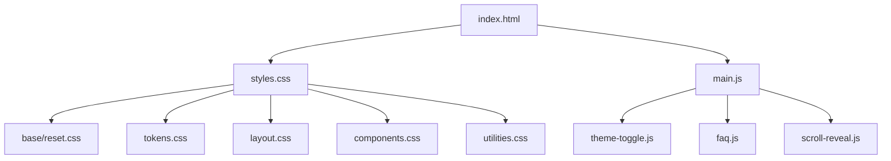
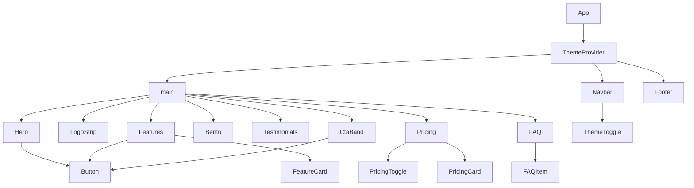
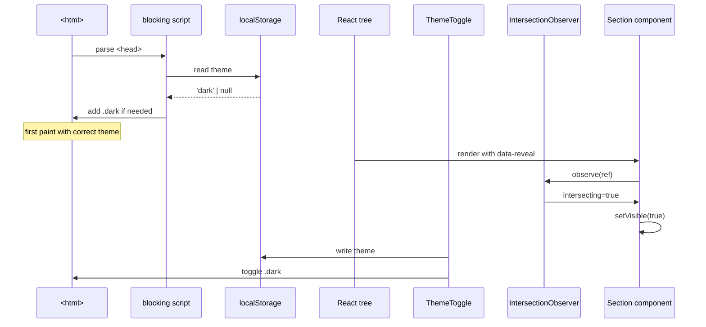

# 5.1 Landing Page

> Build a modern SaaS marketing landing page three different ways — first in vanilla HTML/CSS, then in Tailwind, then in React + Tailwind — so you can directly compare the ergonomics, file sizes, accessibility defaults, and maintainability of each approach. This is the single best project for cementing [[1.7 Responsive Design and Container Queries]], [[1.5 Flexbox]], [[1.6 Grid]], [[1.9 Animations, Transitions, and Transforms]], [[2.3 Responsive Utilities and Dark Mode]], and [[2.5 Layout Patterns in Tailwind]] into muscle memory.

## 5.1.1 Project Objective

By the end of this project you should be able to:

1. Slice a Figma design into semantic HTML, BEM-ish CSS, and a maintainable file structure in under 4 hours — no framework, no build tool beyond a static server.
2. Rebuild the same page in Tailwind with a custom theme (colors, fonts, shadows, container widths) and a documented dark-mode strategy that works without a flash of incorrect theme.
3. Rebuild the page a third time as a React + Tailwind component tree, with a small story file for each section, demonstrating that components compose cleanly when the design tokens were correct from the start.
4. Articulate, with concrete numbers, the trade-offs between the three implementations: bundle size, first paint, time-to-interactive, lines of code, and time spent renaming things.
5. Ship the page to a public URL (GitHub Pages for the vanilla version, Vercel for the React version) and audit it with Lighthouse at 95+ on all four categories.

The deeper objective is **pattern recognition**. After building the same page three times you will see clearly which CSS features Tailwind gives you for free (responsive variants, dark mode, container queries), which it makes harder (deeply nested selectors, complex `:has()` queries), and which React adds value to (reusable section components, prop-driven variants) versus where React is pure overhead (one-off marketing pages that never change).

## 5.1.2 Reinforces Concepts From

- [[1.1 CSS Foundations]] — box-sizing, cascade, reset.
- [[1.3 Box Model and Display]] — content-box vs border-box, margin collapse on hero sections.
- [[1.5 Flexbox]] — hero two-column layout, nav bar, feature card alignment.
- [[1.6 Grid]] — pricing card grid, testimonial masonry, footer multi-column layout.
- [[1.7 Responsive Design and Container Queries]] — mobile-first breakpoints, container queries for the pricing cards.
- [[1.8 Variables, Functions, and Calculations]] — `clamp()` for fluid typography, `min()`/`max()` for spacing.
- [[1.9 Animations, Transitions, and Transforms]] — hero entrance, hover lifts, scroll-triggered reveals with `IntersectionObserver`.
- [[1.10 Pseudo-Elements and Pseudo-Classes]] — gradient text, decorative `::before` blurs, focus-visible rings.
- [[1.11 Accessibility in CSS]] — `prefers-reduced-motion`, color-contrast-safe palette, focus rings.
- [[1.12 CSS Architecture]] — BEM for the vanilla version, the decision to use Tailwind for the others.
- [[2.1 Tailwind Philosophy and Setup]] — utility-first mental model.
- [[2.2 Configuration and Theme Customization]] — `tailwind.config.ts` tokens.
- [[2.3 Responsive Utilities and Dark Mode]] — `dark:` variants and a `class` strategy.
- [[2.4 Component Composition]] — `@apply` discipline for the React component primitives.
- [[2.5 Layout Patterns in Tailwind]] — container, stack, cluster, sidebar patterns.
- [[2.6 Animations and Plugins]] — `@tailwindcss/forms`, `tailwindcss-animate`.
- [[2.7 Tailwind with React and Next.js]] — class-variance-authority for the React rebuild.

## 5.1.3 Requirements

### 5.1.3.1 Functional Requirements

1. **Hero section** with a headline (using fluid typography via `clamp()`), a sub-headline, two CTAs (primary "Start free trial", secondary "Book a demo"), a small social-proof line ("Trusted by 4,000+ teams"), and a hero visual. The hero visual must lazy-load and never cause layout shift.
2. **Logos strip** — a horizontal row of six grayscale customer logos that turn full-color on hover.
3. **Features section** — a 3-column grid (collapses to 2 on tablet, 1 on mobile) of six feature cards. Each card has an icon, title, description, and a "Learn more  --> " link.
4. **Bento grid** — a 4-tile asymmetric grid showcasing the product UI with one large tile (a screenshot) and three smaller tiles (highlights). Must use CSS Grid `grid-template-areas` in the vanilla version.
5. **Testimonials** — three quotes with avatar, name, role, company. Use a masonry-like layout via CSS columns in the vanilla version and a CSS Grid multi-row span in Tailwind.
6. **Pricing** — three tiers (Starter, Pro, Enterprise). The Pro tier is visually highlighted (scaled up 5%, accent border, "Most popular" badge). Monthly/annual toggle that recalculates prices with a 20% discount. Container queries so the card width responds to the parent, not the viewport.
7. **FAQ** — an accordion with six questions. Must be keyboard-accessible (`<details>` is acceptable; if you build custom, you must implement `aria-expanded`, `aria-controls`, and focus management).
8. **CTA band** — full-bleed accent color, white headline, single button.
9. **Footer** — four columns (Product, Company, Resources, Legal), a newsletter signup form, social icons, copyright line.

### 5.1.3.2 Non-Functional Requirements

| Requirement | Target |
|---|---|
| Lighthouse Performance (mobile) | ≥ 95 |
| Lighthouse Accessibility | ≥ 95 |
| Lighthouse Best Practices | ≥ 95 |
| Lighthouse SEO | ≥ 95 |
| First Contentful Paint (mobile, slow 4G) | < 1.5 s |
| Cumulative Layout Shift | < 0.05 |
| Color contrast (WCAG AA) | All text passes |
| Reduced motion | All animations have a static fallback |
| Browser support | Last 2 versions of evergreen browsers |

### 5.1.3.3 Acceptance Criteria

- The page is fully usable from 320px to 2560px with no horizontal scroll at any width.
- Dark mode is togglable via a button in the nav and persists across reloads via `localStorage`. There is no FOUC (flash of unstyled content) on first paint — implement an inline blocking script in `<head>` for the vanilla and Tailwind versions, and a `next-themes`-equivalent inline script for React.
- All interactive elements have a visible `:focus-visible` ring meeting WCAG 2.2 (3:1 contrast against adjacent colors, 2px minimum thickness).
- The FAQ accordion is operable with the keyboard: `Tab` to focus, `Enter`/`Space` to toggle, `Escape` to close.
- Pricing toggle animates between monthly and annual prices without a flash of the wrong number.
- All images use `loading="lazy"` (except the hero, which uses `fetchpriority="high"`), `decoding="async"`, and explicit `width`/`height` attributes.

## 5.1.4 Recommended Architecture

The architecture is intentionally different across the three implementations, because that is the point of the project.

### 5.1.4.1 Vanilla HTML/CSS Architecture

A single `index.html`, a single `styles.css` split with `@import` for clarity during development and concatenated by a tiny build script for production. BEM naming. A `main.js` for the theme toggle, FAQ accordion enhancement, and scroll reveals via `IntersectionObserver`.



### 5.1.4.2 Tailwind Architecture

A single `index.html` is replaced by a small `index.html` + `input.css` + a Vite build. The Tailwind config defines tokens; components are split into partials that get `@apply`-ed into the final CSS only if they are large (the FAQ, the pricing toggle). The default approach is inline utility classes.

### 5.1.4.3 React + Tailwind Architecture

A Vite + React app. Each section is a component. A `Button` component is built with `cva` (class-variance-authority). A `Section` wrapper provides consistent spacing and container width. The theme toggle is a `useTheme` hook with a small context. Data (features, testimonials, pricing tiers, FAQ entries) lives in a single `content.ts` file so a non-developer can edit copy without touching JSX.

## 5.1.5 File Structure

### 5.1.5.1 Vanilla Version

```text
landing-vanilla/
  - index.html
  - styles/
      - tokens.css
      - reset.css
      - base.css
      - layout.css
      - components/
          - nav.css
          - hero.css
          - features.css
          - bento.css
          - testimonials.css
          - pricing.css
          - faq.css
          - cta-band.css
          - footer.css
      - utilities.css
  - scripts/
      - theme-toggle.js
      - faq.js
      - pricing-toggle.js
      - scroll-reveal.js
  - assets/
      - icons/
      - logos/
      - screenshots/
  - README.md
```

### 5.1.5.2 React + Tailwind Version

```text
landing-react/
  - index.html
  - package.json
  - tailwind.config.ts
  - tsconfig.json
  - vite.config.ts
  - src/
      - main.tsx
      - App.tsx
      - components/
          - ui/
              - Button.tsx
              - Container.tsx
              - Section.tsx
              - ThemeToggle.tsx
          - layout/
              - Navbar.tsx
              - Footer.tsx
          - sections/
          - Hero.tsx
          - LogoStrip.tsx
          - Features.tsx
          - Bento.tsx
          - Testimonials.tsx
          - Pricing.tsx
          - FAQ.tsx
          - CtaBand.tsx
      - content/
          - features.ts
          - testimonials.ts
          - pricing.ts
          - faq.ts
      - hooks/
          - useTheme.ts
          - useScrollReveal.ts
          - useMediaQuery.ts
      - styles/
      - globals.css
  - public/
      - fonts/
```

## 5.1.6 Step-by-Step Build Order

### Phase A — Vanilla HTML/CSS (target: 1 evening, 3-4 hours)

1. **Stub the HTML skeleton.** Write all nine sections in semantic HTML in `index.html` with no styling. Use `<header>`, `<nav>`, `<main>`, `<section>`, `<article>`, `<footer>`. Add `aria-label`s to landmark regions. This step exists to force you to think about document outline before any visual decisions.
2. **Add design tokens.** In `tokens.css`, define CSS custom properties for colors (3 brand, 3 neutral, 3 semantic), spacing scale (4px base, 11 steps), font sizes (using `clamp()` for fluid type), radii, shadows, and container widths. Reference [[1.8 Variables, Functions, and Calculations]] for the `clamp()` recipe.
3. **Write the reset.** Modern reset: box-sizing border-box, margin zero, `html { -webkit-text-size-adjust: 100% }`, `img { display: block; max-width: 100% }`, `:focus-visible` outline base. See [[1.1 CSS Foundations]].
4. **Layout primitives.** A `.container` utility with `max-width: 72rem` and `padding-inline: clamp(1rem, 4vw, 2rem)`. A `.section` utility with vertical padding `clamp(4rem, 8vw, 8rem)`. A `.stack` utility using the lobotomized owl selector (`* + *`) for sibling spacing.
5. **Nav.** Flex row, logo left, links center, CTA right. Wrap links in a `<details>` for the mobile menu so it works without JS. Style the mobile menu as a slide-down panel.
6. **Hero.** CSS Grid with `grid-template-columns: 1.1fr 0.9fr` on desktop, single column on mobile. Headline uses `font-size: clamp(2.5rem, 6vw, 4.5rem)`. Decorative blur via a `::before` pseudo-element with `position: absolute; filter: blur(80px); z-index: -1`.
7. **Logos strip.** Flex row, `gap: 2rem`, `flex-wrap: wrap`, `justify-content: center`. Logos are inline SVG with `filter: grayscale(1)` and `:hover { filter: none }`.
8. **Features grid.** `display: grid; grid-template-columns: repeat(auto-fit, minmax(min(100%, 18rem), 1fr))`. This is the single most useful pattern in the project — memorize it.
9. **Bento grid.** `grid-template-columns: repeat(4, 1fr); grid-template-rows: repeat(2, 1fr); grid-template-areas:` with named areas. One tile spans 2×2, others 1×1. See [[1.6 Grid]] for the area-name syntax.
10. **Testimonials.** `columns: 3; column-gap: 1.5rem`. Each card uses `break-inside: avoid` to prevent splitting.
11. **Pricing.** Three cards. Use container queries (`@container`) so the highlighted card can grow when its container is wide, not the viewport. Toggle is a `<input type="checkbox">` styled as a switch with `:has()` to recompute prices.
12. **FAQ.** Use native `<details>`/`<summary>` for the no-JS baseline. Enhance with a small JS that closes other panels when one opens, if `prefers-reduced-motion: no-preference`.
13. **CTA band.** Full-bleed: `margin-inline: calc(50% - 50vw); padding-inline: calc(50vw - 50%);`. Background is an accent gradient. White text.
14. **Footer.** CSS Grid with `grid-template-columns: 2fr 1fr 1fr 1fr 1fr`. Newsletter form is a flex row with `<input>` and `<button>`.
15. **Dark mode.** Inline blocking script in `<head>` reads `localStorage.theme` and adds/removes `.dark` on `<html>` before first paint. Tokens are redefined under `.dark` selector.
16. **Scroll reveal.** `IntersectionObserver` adds `.is-visible` to `[data-reveal]` elements. CSS transitions `opacity` and `transform: translateY(20px)`. Wrapped in a `prefers-reduced-motion` check.
17. **Audit.** Run Lighthouse. Fix contrast issues. Compress images. Add width/height to images.

### Phase B — Tailwind Rebuild (target: 1 evening, 2-3 hours)

1. Scaffold with `npm create vite@latest landing-tailwind -- --template vanilla-ts`, install `tailwindcss @tailwindcss/forms tailwindcss-animate`.
2. Move tokens into `tailwind.config.ts`. Define `colors`, `fontFamily`, `boxShadow`, `borderRadius`, `container`, `screens` (override `xl` to 80rem).
3. Set up dark mode with the `class` strategy.
4. Rebuild each section inline. Resist `@apply` unless a class list exceeds ~15 utilities (the pricing card qualifies; the hero does not).
5. Implement the pricing toggle as a controlled `<input type="checkbox">` with `:has()` and a Tailwind variant — see [[2.3 Responsive Utilities and Dark Mode]] for the `has-[...]` syntax.
6. Implement container queries with the `@container` variant and `@container` typography plugins if needed.

### Phase C — React + Tailwind Rebuild (target: 1 day, 5-7 hours)

1. `npm create vite@landing-react -- --template react-ts`. Install Tailwind, `class-variance-authority`, `clsx`, `tailwind-merge`.
2. Build the `Button` with `cva` — variants: `variant` (primary/secondary/ghost), `size` (sm/md/lg), `as` (button/a).
3. Build the `Container`, `Section`, `ThemeToggle`, and a `useTheme` hook backed by `localStorage` and the `class` strategy.
4. Build each section component. Pass data via props from `content/*.ts`.
5. Add `useScrollReveal` as a hook that wraps `IntersectionObserver` and returns a ref + visible flag.
6. Add Storybook stories for `Button`, `Section`, `PricingCard`, `FAQItem`. (Optional but high-leverage.)
7. Run the Lighthouse audit again. Compare numbers to the other two versions.

## 5.1.7 Code Walkthrough

### 5.1.7.1 Fluid Typography Recipe

```css
/* tokens.css */
:root {
  --font-display: "Inter", system-ui, sans-serif;
  --text-5xl: clamp(2.5rem, 1.5rem + 4vw, 4.5rem);
  --text-3xl: clamp(1.875rem, 1.25rem + 2.4vw, 3rem);
  --text-xl:  clamp(1.25rem, 1rem + 1vw, 1.5rem);
  --text-base: 1rem;
}
```

The formula is `clamp(min, preferred, max)` where the preferred value uses `vw` plus a fixed `rem` so that the type scales with viewport but never falls below the minimum readable size or above the maximum comfortable size.

### 5.1.7.2 The Features Grid (Vanilla)

```css
.features-grid {
  display: grid;
  gap: clamp(1rem, 2vw, 2rem);
  grid-template-columns: repeat(auto-fit, minmax(min(100%, 18rem), 1fr));
  list-style: none;
  padding: 0;
}

.feature-card {
  padding: 1.75rem;
  border: 1px solid var(--border-subtle);
  border-radius: var(--radius-lg);
  background: var(--surface-1);
  transition: transform 200ms ease, box-shadow 200ms ease;
}

.feature-card:hover {
  transform: translateY(-4px);
  box-shadow: var(--shadow-lg);
}

@media (prefers-reduced-motion: reduce) {
  .feature-card { transition: none; }
  .feature-card:hover { transform: none; }
}
```

The `minmax(min(100%, 18rem), 1fr)` trick ensures cards never overflow on small screens (because `min(100%, 18rem)` collapses to `100%` when the viewport is narrower than 18rem) while still allowing flexible growth on wider screens.

### 5.1.7.3 The Bento Grid (Vanilla)

```css
.bento {
  display: grid;
  gap: 1rem;
  grid-template-columns: repeat(4, 1fr);
  grid-template-rows: repeat(2, minmax(12rem, auto));
  grid-template-areas:
    "hero hero hero a"
    "hero hero hero b"
    "c   c   d   d";
}

@media (max-width: 60rem) {
  .bento {
    grid-template-columns: repeat(2, 1fr);
    grid-template-areas:
      "hero hero"
      "a    b"
      "c    d";
  }
}

.bento-tile--hero { grid-area: hero; }
.bento-tile--a    { grid-area: a; }
.bento-tile--b    { grid-area: b; }
.bento-tile--c    { grid-area: c; }
.bento-tile--d    { grid-area: d; }
```

### 5.1.7.4 The Theme Toggle Without FOUC (Vanilla)

```html
<!-- in <head>, blocking -->
<script>
  (function () {
    try {
      var stored = localStorage.getItem("theme");
      var prefersDark = window.matchMedia("(prefers-color-scheme: dark)").matches;
      if (stored === "dark" || (!stored && prefersDark)) {
        document.documentElement.classList.add("dark");
      }
    } catch (e) {}
  })();
</script>
```

```js
// scripts/theme-toggle.js
const root = document.documentElement;
const btn = document.querySelector("[data-theme-toggle]");

btn?.addEventListener("click", () => {
  const isDark = root.classList.toggle("dark");
  localStorage.setItem("theme", isDark ? "dark" : "light");
  btn.setAttribute("aria-pressed", String(isDark));
});
```

### 5.1.7.5 The Pricing Toggle With `:has()`

```css
.pricing [data-toggle] { /* the checkbox */ }
.pricing:has([data-toggle]:checked) [data-price-monthly] { display: none; }
.pricing:has([data-toggle]:checked) [data-price-annual] { display: inline; }
.pricing:not(:has([data-toggle]:checked)) [data-price-monthly] { display: inline; }
.pricing:not(:has([data-toggle]:checked)) [data-price-annual] { display: none; }
```

This requires no JavaScript at all. `:has()` is now baseline-supported across evergreen browsers. See [[1.10 Pseudo-Elements and Pseudo-Classes]].

### 5.1.7.6 The React Button Component (CVA)

```tsx
// src/components/ui/Button.tsx
import { cva, type VariantProps } from "class-variance-authority";
import { clsx, type ClassValue } from "clsx";
import { twMerge } from "tailwind-merge";

export const button = cva(
  "inline-flex items-center justify-center gap-2 rounded-lg font-medium transition focus-visible:outline focus-visible:outline-2 focus-visible:outline-offset-2 disabled:opacity-50 disabled:pointer-events-none",
  {
    variants: {
      variant: {
        primary: "bg-brand-600 text-white hover:bg-brand-500 outline-brand-600",
        secondary: "bg-white text-neutral-900 ring-1 ring-neutral-300 hover:bg-neutral-50 outline-neutral-900",
        ghost: "bg-transparent text-neutral-700 hover:bg-neutral-100 outline-neutral-900",
      },
      size: {
        sm: "h-9 px-3 text-sm",
        md: "h-11 px-5 text-base",
        lg: "h-12 px-7 text-lg",
      },
    },
    defaultVariants: { variant: "primary", size: "md" },
  }
);

export type ButtonProps = React.ButtonHTMLAttributes<HTMLButtonElement> &
  VariantProps<typeof button> & {
    asChild?: boolean;
  };

export function cn(...inputs: ClassValue[]) {
  return twMerge(clsx(inputs));
}

export function Button({ className, variant, size, ...props }: ButtonProps) {
  return <button className={cn(button({ variant, size }), className)} {...props} />;
}
```

### 5.1.7.7 The `useScrollReveal` Hook

```tsx
// src/hooks/useScrollReveal.ts
import { useEffect, useRef, useState } from "react";

export function useScrollReveal<T extends HTMLElement = HTMLDivElement>(options?: IntersectionObserverInit) {
  const ref = useRef<T>(null);
  const [visible, setVisible] = useState(false);

  useEffect(() => {
    if (typeof IntersectionObserver === "undefined") {
      setVisible(true);
      return;
    }
    const prefersReduced = window.matchMedia("(prefers-reduced-motion: reduce)").matches;
    if (prefersReduced) {
      setVisible(true);
      return;
    }
    const el = ref.current;
    if (!el) return;
    const observer = new IntersectionObserver(
      ([entry]) => {
        if (entry.isIntersecting) {
          setVisible(true);
          observer.disconnect();
        }
      },
      { threshold: 0.15, ...options }
    );
    observer.observe(el);
    return () => observer.disconnect();
  }, [options]);

  return { ref, visible };
}
```

### 5.1.7.8 The Pricing Card With Container Queries (Tailwind)

```tsx
// src/components/sections/Pricing.tsx
export function PricingCard({ tier, highlighted }: { tier: PricingTier; highlighted?: boolean }) {
  return (
    <article
      className={cn(
        "@container relative flex flex-col rounded-2xl p-8 ring-1 transition",
        highlighted
          ? "ring-2 ring-brand-500 shadow-xl md:scale-105"
          : "ring-neutral-200 dark:ring-neutral-800"
      )}
    >
      <h3 className="text-lg font-semibold text-neutral-900 dark:text-neutral-100">{tier.name}</h3>
      <p className="mt-2 text-sm text-neutral-600 dark:text-neutral-400">{tier.tagline}</p>

      <div className="mt-6 flex items-baseline gap-1">
        <span className="text-4xl font-bold tracking-tight">
          <span data-price-monthly>${tier.monthly}</span>
          <span data-price-annual className="hidden">${tier.annual}</span>
        </span>
        <span className="text-sm text-neutral-500">/mo</span>
      </div>

      <Button variant={highlighted ? "primary" : "secondary"} className="mt-6 w-full">
        {tier.cta}
      </Button>

      <ul className="mt-8 space-y-3 text-sm">
        {tier.features.map((f) => (
          <li key={f} className="flex items-start gap-2">
            <CheckIcon className="mt-0.5 h-4 w-4 text-brand-500" />
            <span>{f}</span>
          </li>
        ))}
      </ul>

      <p className="mt-8 hidden text-sm text-neutral-500 @[36rem]:block">
        {tier.footnote}
      </p>
    </article>
  );
}
```

The `@[36rem]:` variant activates when the *card's* container is at least 36rem wide — not the viewport. This means the footnote appears whenever there's room, regardless of the page layout.

## 5.1.8 Mermaid Diagrams

### 5.1.8.1 Component Tree (React Version)



### 5.1.8.2 Theme + Reveal Data Flow



## 5.1.9 Common Pitfalls

1. **FOUC on dark mode.** If you toggle the theme class in a `<script>` at the end of the body, the user sees a flash of light mode before dark mode kicks in. Always inline the theme-detection script in `<head>` *before* the stylesheet link, so it runs synchronously before paint.
2. **Using `100vw` causes horizontal scroll on pages with scrollbars.** Use `min(100%, ...)` inside `minmax()` for grid columns, and `100dvw` (dynamic viewport width) instead of `100vw` for full-bleed backgrounds on mobile. See [[1.7 Responsive Design and Container Queries]].
3. **Forgetting `prefers-reduced-motion`.** Any animation that you ship without a `prefers-reduced-motion: reduce` fallback is an accessibility bug. The cost of a `@media` query is zero; the cost of triggering vestibular disorders in users is real.
4. **Hero image layout shift.** If the hero image has no explicit `width`/`height`, the browser doesn't know how much space to reserve, and CLS spikes. Either set dimensions, use `aspect-ratio`, or wrap in a container with `min-height`.
5. **Pricing toggle that flashes the wrong number.** If you compute the annual price client-side after the toggle changes, there's a frame where neither value shows. Use `:has()` (CSS-only) or render both numbers and toggle `display` — never recompute on the fly.
6. **`@apply` everywhere in the Tailwind version.** Reaching for `@apply` to recreate BEM defeats the purpose of utility-first CSS. Use `@apply` only for genuinely repeated primitives (buttons, inputs) and even then prefer `cva` for variants. See [[2.4 Component Composition]].
7. **Masonry via CSS columns that breaks reading order.** `columns: 3` lays out top-to-bottom in column 1, then column 2, then column 3 — meaning a screen reader reads all of column 1's items, then column 2's. For testimonials this is fine; for an ordered feature list it is not. Use Grid instead.
8. **Container queries that never activate.** `@container` requires an ancestor with `container-type: inline-size`. If you forget `container-type`, the `@container` query silently never matches. Always test by resizing the parent in DevTools.
9. **React rebuild that re-introduces global CSS.** If you reach for `globals.css` to fix a one-off layout problem, you've broken the component model. Push the style into the component as a Tailwind class or a `cva` variant.
10. **Lighthouse audit on the dev server.** Vite's dev server is unminified and unoptimized. Always run Lighthouse on the production build (`vite build && vite preview`).

## 5.1.10 Stretch Goals

1. **Internationalized copy.** Add a language switcher and serve English, Spanish, and Japanese. RTL-aware layout for Arabic. This forces you to use logical properties (`padding-inline`, `margin-block`) everywhere — see [[1.3 Box Model and Display]].
2. **A/B test the hero headline.** Use a tiny inline script to pick one of two headlines and persist the choice in `localStorage`. Print the choice to `data-attr` so an analytics tool can read it.
3. **CMS-driven copy.** Replace `content/*.ts` with a fetch from a headless CMS (Sanity, Contentful). Stream the content with React Suspense. See [[3.12 Suspense, Lazy Loading, and Code Splitting]].
4. **Scroll-driven animations.** Use `animation-timeline: view()` and `animation-timeline: scroll()` (CSS scroll-driven animations, baseline in Chrome 115+) for the hero parallax and the testimonials fade-in. Provide a `@supports` fallback.
5. **View Transitions API for theme switch.** Animate the theme toggle as a cross-fade of the entire page using `document.startViewTransition`. See [[1.9 Animations, Transitions, and Transforms]].

## 5.1.11 Self-Assessment Rubric

Score yourself from 0 (not done) to 3 (excellent) on each criterion. A passing score is ≥ 24 out of 30.

| # | Criterion | 0 | 1 | 2 | 3 |
|---|---|---|---|---|---|
| 1 | Visual fidelity to the design | not attempted | rough | close | pixel-perfect at all breakpoints |
| 2 | Responsive coverage | desktop only | 2 breakpoints | 3+ breakpoints, no horizontal scroll at 320–2560px | container queries used where appropriate |
| 3 | Accessibility | no focus styles | visible focus but no reduced-motion | reduced-motion + ARIA on accordion | full WCAG 2.2 AA pass, keyboard-only test passed |
| 4 | Dark mode | missing | present but flashes | no flash, persists | no flash, persists, respects `prefers-color-scheme` on first visit |
| 5 | Performance | Lighthouse < 70 | 70–84 | 85–94 | ≥ 95 on all four categories (mobile, slow 4G) |
| 6 | Code structure | one giant file | split but inconsistent | consistent naming, sensible splits | each file under 200 lines, obvious purpose |
| 7 | Cross-implementation comparison | only one version built | two versions, no notes | three versions, brief notes | three versions with a written comparison table |
| 8 | Component reuse (React) | everything inline | some components | consistent primitives | `Button`, `Section`, `Container` reused across all sections |
| 9 | Documentation | none | README with run instructions | README + design-token reference | README + token reference + a Lighthouse report committed |
| 10 | Shipped publicly | not deployed | deployed, no link shared | deployed, link in README | deployed, link in README, Lighthouse report linked |

## 5.1.12 Related Notes

- [[1.7 Responsive Design and Container Queries]]
- [[1.5 Flexbox]]
- [[1.6 Grid]]
- [[1.9 Animations, Transitions, and Transforms]]
- [[2.3 Responsive Utilities and Dark Mode]]
- [[2.5 Layout Patterns in Tailwind]]
- [[2.7 Tailwind with React and Next.js]]
- [[5.3 Portfolio]] — same skill set, smaller scope, ideal follow-up
- [[5.4 Documentation Website]] — same layout primitives applied to a content-heavy site
