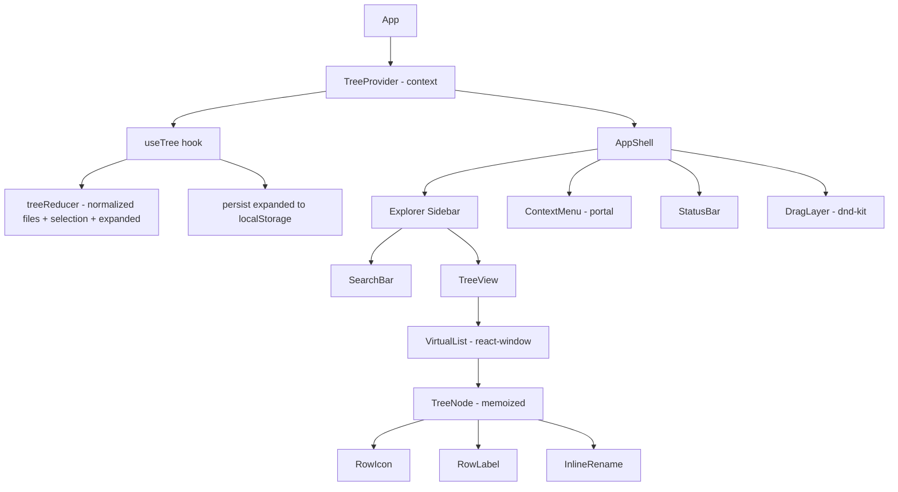
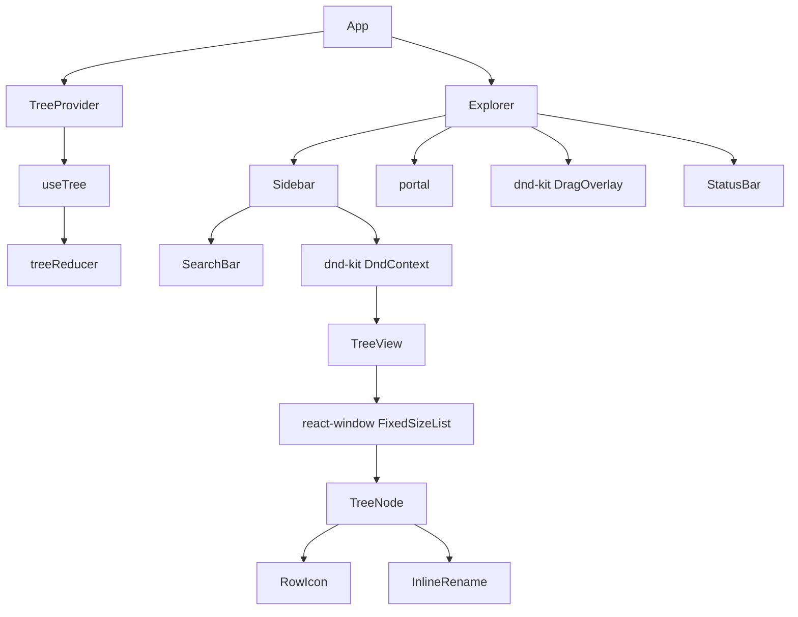
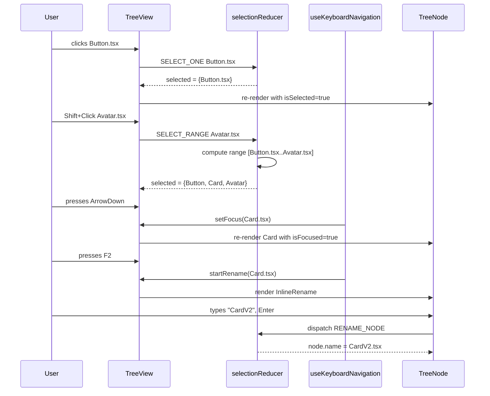

# 5.10 File Explorer UI

> A VS Code-style file explorer: a recursive tree view with expand/collapse, multi-select with `Shift`/`Ctrl` modifiers, a context menu with controlled positioning, drag-and-drop to move files between folders, rename inline, create new file/folder, delete with confirmation, and a status bar showing selection and counts. The tree is fully keyboard-navigable (ARIA `tree` role, arrow keys, `Home`/`End`, type-ahead), backed by `useReducer` for selection state, and virtualized for trees with thousands of nodes. This project reinforces recursive component rendering, controlled context menus with proper positioning, `useReducer` for non-trivial selection state, drag-and-drop with `@dnd-kit`, and accessibility patterns that most frontend engineers get wrong on the first try.

## 5.10.1 Project Objective

By the end of this project you should be able to:

1. Model a file tree as a normalized data structure: `files: Record<id, FileNode>` where `FileNode = { id, name, type: 'file' | 'folder', parentId, expanded?, children?: string[] }`. Normalization makes moves O(1) — you change `parentId` and update two `children` arrays, no deep cloning.
2. Render the tree with a **recursive component** (`<TreeNode>` renders itself and its children). Indentation is driven by `depth` prop (passed down), not by nested DOM — this keeps the DOM flat enough to virtualize.
3. Manage selection state with `useReducer`: actions `SELECT_ONE`, `SELECT_RANGE` (Shift+click), `TOGGLE_SELECTED` (Ctrl+click), `CLEAR_SELECTION`, `SELECT_ARROW` (arrow key navigation with optional Shift extension). The reducer is the single source of truth — inline handlers stay dumb.
4. Implement a context menu with controlled positioning: the menu is a single React portal, positioned at the cursor on `onContextMenu`, closes on outside click / `Esc` / scroll, and flips inside the viewport if it would overflow.
5. Implement drag-and-drop with `@dnd-kit`: drag a file onto a folder to move it; show a drop indicator line between items; reject invalid drops (a folder into its own descendant).
6. Implement inline rename: `F2` or double-click enters rename mode; `Enter` confirms; `Esc` cancels; the input auto-selects the file name without extension.
7. Implement create new file/folder: `Alt+N` new file, `Alt+Shift+N` new folder. Creates as a child of the selected folder (or root if none), enters rename mode immediately.
8. Implement delete: `Delete` key deletes the selection; multi-select deletes all; confirmation dialog for folders (recursive delete).
9. Add full keyboard navigation: arrow keys move focus, `Enter` opens a file, `Space` toggles folder expand, `Right` expands or moves to first child, `Left` collapses or moves to parent, `Home`/`End` jump to first/last visible, typing letters does type-ahead.
10. Virtualize the visible (flattened) tree with `react-window` so a tree with 10k files in one folder scrolls at 60 fps.
11. Persist expand/collapse state to `localStorage` so reload restores the user's view.

## 5.10.2 Reinforces Concepts From

- [[3.3 State and Events]] — keyboard event handling, mouse events, controlled inputs.
- [[3.5 Lists and Keys]] — keys for tree nodes (stable IDs).
- [[3.6 Hooks (Built-In)]] — `useReducer`, `useRef` (for the visible-nodes list, the focused id, the context menu anchor), `useEffect`, `useMemo`, `useCallback`.
- [[3.7 Custom Hooks]] — `useTree`, `useSelection`, `useContextMenu`, `useKeyboardNavigation`, `useDragMove`.
- [[3.8 Effects and Side Effects]] — closing the context menu on outside click / scroll / Esc; persisting expand state.
- [[3.9 Context and Reducers]] — the selection reducer; the tree context.
- [[3.10 Composition and Patterns]] — compound components for the tree (`<Tree>`, `<TreeNode>`, `<TreeContextMenu>`).
- [[3.11 Performance Optimization]] — `React.memo` for `TreeNode`, `useMemo` for the flattened visible list, virtualization.
- [[3.13 Error Boundaries and Debugging]] — wrapping the tree so a render error in one node doesn't crash the explorer.
- [[3.14 Reusable Component Design]] — the `TreeNode` API and the context menu API.
- [[1.11 Accessibility in CSS]] — focus rings, `:focus-visible`, reduced motion.
- [[2.5 Layout Patterns in Tailwind]] — the explorer sidebar layout, indentation via `padding-left`.

## 5.10.3 Requirements

### 5.10.3.1 Functional Requirements

1. **Tree view** (left sidebar, ~280 px wide): a vertical list of files and folders. Folders show a chevron ( collapsed, ▼ expanded) and an icon. Files show an icon based on extension (`.tsx` React, `.css` styles, `.md` doc, etc.).
2. **Expand/collapse**: click a folder's chevron, or click the folder row (configurable), or press `Space`/`Right`/`Left` when focused.
3. **Selection**:
   - Click a file  -->  selects only that file (replaces selection).
   - `Ctrl+Click`  -->  toggles the file in the selection.
   - `Shift+Click`  -->  selects the range from the last focused file to the clicked file (inclusive), preserving the anchor.
4. **Keyboard navigation**: `ArrowDown`/`ArrowUp` move focus through visible nodes; `Right` expands a collapsed folder or moves to first child; `Left` collapses an expanded folder or moves to parent; `Home`/`End` jump to first/last; letters do type-ahead (jump to next visible node whose name starts with the typed letter); `Enter` opens a file (or toggles folder).
5. **Context menu**: right-click a node  -->  menu appears at cursor with items: New File, New Folder, Rename, Cut, Copy, Paste, Duplicate, Delete, Reveal in Finder (disabled). Menu closes on outside click, `Esc`, or scroll. Menu flips inside the viewport if it would overflow.
6. **Drag and drop**: drag a file onto a folder to move it (the folder highlights). Drag onto a file in a folder inserts the file *after* the target (drop indicator line). Reject dropping a folder onto its own descendant (show a "no-drop" cursor).
7. **Rename**: `F2` or double-click  -->  inline editable input pre-populated with the name, extension deselected. `Enter` confirms, `Esc` cancels, blur confirms.
8. **New file/folder**: `Alt+N` file, `Alt+Shift+N` folder. Creates in the currently focused folder (or root), enters rename mode.
9. **Delete**: `Delete` key removes selection; folder delete shows a confirmation (recursive). `Shift+Delete` skips confirmation.
10. **Multi-select actions**: cut/copy/paste works on the whole selection. Paste inserts after the focused node.
11. **Status bar**: at the bottom, shows "N items selected" or the focused node's path (`src/components/Button.tsx`).
12. **Persist expand state**: `localStorage` key `explorer:expanded` stores the set of expanded folder ids. On reload, the tree restores.
13. **Search filter** (top of sidebar): typing filters the tree to matching files (and their parent folders auto-expand). Use `useDeferredValue` so filtering 10k files doesn't block typing.
14. **Breadcrumbs**: optional top bar showing the path of the focused file, click any segment to navigate.

### 5.10.3.2 Non-Functional Requirements

| Requirement | Target |
|---|---|
| Tree with 10k files in one folder | 60 fps scroll (virtualized) |
| Selection update on click | < 16 ms (one frame) |
| Context menu open latency | < 50 ms |
| Drag frame rate | 60 fps |
| Lighthouse Accessibility | ≥ 95 |
| Memory after expand-all on 10k-tree | flat (no listener leaks) |

### 5.10.3.3 Acceptance Criteria

- Expanding a folder with 1,000 children doesn't jank (flattening is memoized; the visible list is virtualized).
- `Shift+Click` from `a.ts` to `z.ts` selects all 26 files in between; clicking outside the range resets the anchor.
- Right-clicking near the right edge of the viewport flips the menu to open to the left (no overflow).
- Dragging a folder into its own descendant shows a "no-drop" cursor and does not move on drop.
- `F2` on `Button.tsx` selects "Button" (not ".tsx"); typing `Tab` in the input does NOT move focus (it inserts a tab — or is prevented, your call, but be deliberate).
- `ArrowDown` from a collapsed folder moves to the next sibling, not into the (hidden) children. `Right` expands first; second `Right` moves to first child.
- Refreshing the page after expanding several folders restores the exact expand state.
- The tree passes an axe accessibility audit: `role="tree"`, `role="treeitem"`, `aria-expanded` on folders, `aria-selected` on selected items, `aria-level` per depth, `aria-activedescendant` for focused item.
- Typing "but" in the search filters the tree to `Button.tsx`, `Button.module.css`, etc., and auto-expands `src/components/`.

## 5.10.4 Recommended Architecture



### 5.10.4.1 Why Normalize the Tree?

A naive shape is `Folder { children: (File | Folder)[] }`. Moving `Button.tsx` from `src/` to `src/components/` requires: deep-cloning `src`, splicing the child out, deep-cloning `src/components`, splicing it in. With 1k files, this is O(n) per move and triggers React to reconcile two deep subtrees.

A normalized shape is `files: Record<id, FileNode>` where `FileNode = { id, name, type, parentId, children?: string[] }`. Moving is: change `parentId`, splice the id out of the old parent's `children`, splice into the new parent's `children`. Three O(1) operations. React reconciles only the affected rows.

> [!tip] Normalization is a transferable idea. The same pattern powers the Kanban board ([[5.6 Kanban Board]]) and the chat UI ([[5.9 Chat UI]]). Anywhere you have entities that move between containers, normalize: one `Record<id, Entity>` plus per-container ordered arrays of ids.

### 5.10.4.2 Why a Flattened Visible List?

Recursive DOM (`<ul><li><ul>...</ul></li></ul>`) is intuitive but impossible to virtualize (you can't slice a nested DOM). The modern approach is to **flatten** the visible tree into an array of `{ node, depth }` pairs (only visible — collapsed folders' descendants are skipped). The recursive component is replaced by a single flat list rendered with `react-window`. Indentation is `paddingLeft: depth * 12px`.

> [!warning] Do not be tempted to keep the recursive DOM "for accessibility" — `role="tree"` works perfectly on a flat list as long as you set `aria-level` per row. The ARIA spec does not require nested DOM.

### 5.10.4.3 Why `useReducer` for Selection?

Selection has 5+ actions (single, range, toggle, clear, arrow-with-shift, cut/copy/paste). With `useState`, each handler is inline and state logic is scattered. With `useReducer`, all transitions live in one place, are unit-testable, and the `dispatch` is stable (safe to pass to memoized children).

## 5.10.5 File Structure

```text
file-explorer/
  - index.html
  - package.json
  - tailwind.config.ts
  - vite.config.ts
  - tsconfig.json
  - src/
      - main.tsx
      - App.tsx
      - routes/
          - ExplorerPage.tsx
      - features/
          - explorer/
          - components/
              - Explorer.tsx
              - Sidebar.tsx
              - SearchBar.tsx
              - TreeView.tsx
              - VirtualTreeList.tsx     # react-window
              - TreeNode.tsx            # memoized
              - RowIcon.tsx
              - InlineRename.tsx
              - ContextMenu.tsx         # portal
              - DragLayer.tsx
              - StatusBar.tsx
          - context/
              - TreeContext.tsx
          - hooks/
              - useTree.ts
              - useSelection.ts
              - useContextMenu.ts
              - useKeyboardNavigation.ts
              - useDragMove.ts
              - useFlattenTree.ts
          - reducer.ts
          - actions.ts
          - selectors.ts
          - lib/
              - icons.ts
              - path.ts
          - types.ts
      - lib/
          - mock-fs.ts                       # seed data
          - id.ts
          - utils.ts
      - styles/
      - globals.css
  - README.md
```

## 5.10.6 Step-by-Step Build Order

1. **Scaffold** Vite + React + TS + Tailwind. Install `@dnd-kit/core`, `@dnd-kit/sortable`, `react-window`, `date-fns`.
2. **Define types** — `FileNode`, `TreeState`, `SelectionState`, `Action` (discriminated union).
3. **Seed mock data** in `lib/mock-fs.ts` — a realistic project tree (src/, components, hooks, lib, public, package.json, README.md) with ~200 files. Add a "Generate 10k files" button for stress testing.
4. **Build the reducer** — actions: `MOVE_NODE`, `RENAME_NODE`, `CREATE_NODE`, `DELETE_NODE`, `TOGGLE_EXPAND`, `SET_EXPANDED` (bulk, from localStorage), `SELECT_ONE`, `SELECT_RANGE`, `TOGGLE_SELECTED`, `CLEAR_SELECTION`, `SET_FOCUS`.
5. **Build the flatten hook** — `useFlattenTree(files, expanded)` returns `{ node, depth }[]` of visible nodes only. Memoize on `files` + `expanded`.
6. **Build the `TreeView`** — render the flattened list (no virtualization yet) with indentation by depth. Get the layout right.
7. **Add `useReducer` selection** — click selects; Ctrl+click toggles; Shift+click extends range.
8. **Add keyboard navigation** — `useKeyboardNavigation` registers a `keydown` handler on the tree container. Implement arrow keys, Home/End, type-ahead, Enter, Space, F2, Delete, Alt+N.
9. **Add the context menu** — `useContextMenu` returns `{ open, x, y, targetId, open(e, id), close() }`. Render the menu in a portal positioned at `(x, y)`. Close on outside click (a `useEffect` with `mousedown` listener), `Esc`, and scroll. Flip inside the viewport.
10. **Add inline rename** — `InlineRename` component shown when `renamingId === node.id`. Auto-select the name without extension (`select(0, name.lastIndexOf('.'))`).
11. **Add drag-and-drop** — `@dnd-kit/core` with a custom collision detection that highlights either a folder (drop-into) or a position between items (drop-before/after). Reject self-or-descendant drops.
12. **Virtualize with `react-window`** — replace the flat list with `FixedSizeList` (rows are 28 px tall). Verify scroll on 10k files.
13. **Add the search filter** — `useDeferredValue` on the query; filter the flattened list to matching files and their ancestor folders (auto-expanded).
14. **Persist expand state** — `useEffect` writes the expanded set to `localStorage` debounced; reads on init.
15. **Add the status bar** — selection count, focused node path.
16. **Accessibility audit** — `role="tree"`, `role="treeitem"`, `aria-expanded`, `aria-selected`, `aria-level`, `aria-activedescendant`. Run axe.

## 5.10.7 Code Walkthrough

### 5.10.7.1 The Normalized State

```ts
// features/explorer/types.ts
export type FileNode = {
  id: string;
  name: string;
  type: 'file' | 'folder';
  parentId: string | null;
  children?: string[]; // ordered list of child ids (folders only)
};

export type TreeState = {
  files: Record<string, FileNode>;
  rootId: string;
  expanded: Set<string>;
  focusedId: string | null;
  renamingId: string | null;
};

export type SelectionState = {
  selected: Set<string>;
  anchorId: string | null; // for Shift+Click ranges
};
```

### 5.10.7.2 The Reducer (Selection)

```ts
// features/explorer/reducer.ts
function selectionReducer(state: SelectionState, action: SelectionAction): SelectionState {
  switch (action.type) {
    case 'SELECT_ONE':
      return { selected: new Set([action.id]), anchorId: action.id };
    case 'TOGGLE_SELECTED': {
      const next = new Set(state.selected);
      if (next.has(action.id)) next.delete(action.id);
      else next.add(action.id);
      return { selected: next, anchorId: action.id };
    }
    case 'SELECT_RANGE': {
      if (!state.anchorId) return { selected: new Set([action.id]), anchorId: action.id };
      const range = getRange(state.anchorId, action.id, visibleNodes);
      return { selected: new Set(range), anchorId: state.anchorId };
    }
    case 'CLEAR_SELECTION':
      return { selected: new Set(), anchorId: null };
    case 'SET_SELECTION':
      return { selected: new Set(action.ids), anchorId: action.ids[0] ?? null };
    default:
      return state;
  }
}
```

### 5.10.7.3 Flattening the Visible Tree

```ts
// features/explorer/hooks/useFlattenTree.ts
export function useFlattenTree(files: Record<string, FileNode>, expanded: Set<string>, rootId: string) {
  return useMemo(() => {
    const out: { node: FileNode; depth: number }[] = [];
    const walk = (id: string, depth: number) => {
      const node = files[id];
      if (!node) return;
      out.push({ node, depth });
      if (node.type === 'folder' && expanded.has(id) && node.children) {
        node.children.forEach((cid) => walk(cid, depth + 1));
      }
    };
    // Start with root's children (root itself is not displayed)
    const root = files[rootId];
    root.children?.forEach((cid) => walk(cid, 0));
    return out;
  }, [files, expanded, rootId]);
}
```

### 5.10.7.4 The Memoized TreeNode

```tsx
// features/explorer/components/TreeNode.tsx
import { memo } from 'react';

type Props = {
  node: FileNode;
  depth: number;
  isSelected: boolean;
  isFocused: boolean;
  isRenaming: boolean;
  onToggle: (id: string) => void;
  onSelect: (id: string, e: React.MouseEvent) => void;
  onContextMenu: (e: React.MouseEvent, id: string) => void;
  onDoubleClick: (id: string) => void;
  onRename: (id: string, name: string) => void;
  onCancelRename: () => void;
};

export const TreeNode = memo(function TreeNode({
  node, depth, isSelected, isFocused, isRenaming,
  onToggle, onSelect, onContextMenu, onDoubleClick, onRename, onCancelRename,
}: Props) {
  return (
    <div
      role="treeitem"
      aria-level={depth + 1}
      aria-expanded={node.type === 'folder' ? isSelected : undefined}
      aria-selected={isSelected}
      tabIndex={isFocused ? 0 : -1}
      style={{ paddingLeft: `${depth * 12 + 8}px` }}
      className={`flex h-7 items-center gap-1 ${
        isSelected ? 'bg-blue-100 dark:bg-blue-900' : 'hover:bg-zinc-100 dark:hover:bg-zinc-800'
      } ${isFocused ? 'ring-1 ring-blue-500' : ''}`}
      onClick={(e) => onSelect(node.id, e)}
      onContextMenu={(e) => onContextMenu(e, node.id)}
      onDoubleClick={() => onDoubleClick(node.id)}
    >
      {node.type === 'folder' && (
        <button
          onClick={(e) => { e.stopPropagation(); onToggle(node.id); }}
          className="w-4"
          aria-label={isSelected ? 'Collapse' : 'Expand'}
        >
          {isSelected ? '▼' : ''}
        </button>
      )}
      <RowIcon name={node.name} type={node.type} />
      {isRenaming ? (
        <InlineRename
          initial={node.name}
          onConfirm={(name) => onRename(node.id, name)}
          onCancel={onCancelRename}
        />
      ) : (
        <span className="truncate">{node.name}</span>
      )}
    </div>
  );
}, (prev, next) => {
  // Custom comparator: only re-render if meaningful props changed
  return (
    prev.node === next.node &&
    prev.depth === next.depth &&
    prev.isSelected === next.isSelected &&
    prev.isFocused === next.isFocused &&
    prev.isRenaming === next.isRenaming
  );
});
```

### 5.10.7.5 Controlled Context Menu

> [!danger] Never use the native browser context menu for your app's actions. The native menu shows "Save link as…", "Inspect", etc. — useless for a file explorer. Always `e.preventDefault()` in `onContextMenu` and render your own. The pattern below is the production approach.

```ts
// features/explorer/hooks/useContextMenu.ts
export function useContextMenu() {
  const [menu, setMenu] = useState<{ x: number; y: number; targetId: string } | null>(null);

  const open = useCallback((e: React.MouseEvent, targetId: string) => {
    e.preventDefault();
    setMenu({ x: e.clientX, y: e.clientY, targetId });
  }, []);

  const close = useCallback(() => setMenu(null), []);

  useEffect(() => {
    if (!menu) return;
    const onDown = (e: MouseEvent) => {
      // Don't close if clicking inside the menu (menu stops propagation)
      if (!(e.target as HTMLElement).closest('[data-context-menu]')) close();
    };
    const onEsc = (e: KeyboardEvent) => { if (e.key === 'Escape') close(); };
    const onScroll = () => close();
    window.addEventListener('mousedown', onDown);
    window.addEventListener('keydown', onEsc);
    window.addEventListener('scroll', onScroll, true);
    return () => {
      window.removeEventListener('mousedown', onDown);
      window.removeEventListener('keydown', onEsc);
      window.removeEventListener('scroll', onScroll, true);
    };
  }, [menu, close]);

  return { menu, open, close };
}
```

```tsx
// features/explorer/components/ContextMenu.tsx
import { createPortal } from 'react-dom';

export function ContextMenu({ menu, onClose }: { menu: MenuState | null; onClose: () => void }) {
  if (!menu) return null;
  // Flip inside viewport
  const menuWidth = 220;
  const menuHeight = 320;
  const x = Math.min(menu.x, window.innerWidth - menuWidth - 8);
  const y = Math.min(menu.y, window.innerHeight - menuHeight - 8);
  return createPortal(
    <div
      data-context-menu
      role="menu"
      className="fixed z-50 rounded-md border bg-white py-1 shadow-lg dark:bg-zinc-900"
      style={{ left: x, top: y, width: menuWidth }}
      onClick={(e) => e.stopPropagation()}
    >
      <MenuItem label="New File" shortcut="Alt+N" onClick={() => actions.newFile(menu.targetId)} />
      <MenuItem label="New Folder" shortcut="Alt+Shift+N" onClick={() => actions.newFolder(menu.targetId)} />
      <MenuItem label="Rename" shortcut="F2" onClick={() => actions.startRename(menu.targetId)} />
      <MenuItem label="Delete" shortcut="Del" onClick={() => actions.delete(menu.targetId)} />
      <MenuItem label="Copy" shortcut="Ctrl+C" onClick={() => actions.copy(menu.targetId)} />
      <MenuItem label="Paste" shortcut="Ctrl+V" onClick={() => actions.paste(menu.targetId)} />
    </div>,
    document.body,
  );
}
```

### 5.10.7.6 Keyboard Navigation

> [!note] The `aria-activedescendant` pattern (set it on the tree container to the focused node's id) is what makes screen readers announce the focused row without moving DOM focus. Without it, the tree is unusable with VoiceOver/NVDA.

```ts
// features/explorer/hooks/useKeyboardNavigation.ts
export function useKeyboardNavigation({ visible, focusedId, setFocus, onAction }: Props) {
  useEffect(() => {
    const handler = (e: KeyboardEvent) => {
      if (!focusedId) return;
      const idx = visible.findIndex((v) => v.node.id === focusedId);
      if (idx === -1) return;
      const node = visible[idx].node;

      switch (e.key) {
        case 'ArrowDown':
          e.preventDefault();
          if (idx + 1 < visible.length) setFocus(visible[idx + 1].node.id);
          break;
        case 'ArrowUp':
          e.preventDefault();
          if (idx > 0) setFocus(visible[idx - 1].node.id);
          break;
        case 'ArrowRight':
          e.preventDefault();
          if (node.type === 'folder' && !expanded.has(node.id)) onAction.toggleExpand(node.id);
          else if (idx + 1 < visible.length && visible[idx + 1].depth > visible[idx].depth)
            setFocus(visible[idx + 1].node.id);
          break;
        case 'ArrowLeft':
          e.preventDefault();
          if (node.type === 'folder' && expanded.has(node.id)) onAction.toggleExpand(node.id);
          else if (node.parentId) setFocus(node.parentId);
          break;
        case 'Home':
          e.preventDefault();
          if (visible.length) setFocus(visible[0].node.id);
          break;
        case 'End':
          e.preventDefault();
          if (visible.length) setFocus(visible[visible.length - 1].node.id);
          break;
        case 'Enter':
          e.preventDefault();
          if (node.type === 'folder') onAction.toggleExpand(node.id);
          else onAction.openFile(node.id);
          break;
        case 'F2':
          e.preventDefault();
          onAction.startRename(node.id);
          break;
        case 'Delete':
          e.preventDefault();
          onAction.delete(node.id);
          break;
        default:
          // Type-ahead: single letter jumps to next matching name
          if (e.key.length === 1 && !e.ctrlKey && !e.metaKey) {
            const q = e.key.toLowerCase();
            for (let i = idx + 1; i < visible.length; i++) {
              if (visible[i].node.name.toLowerCase().startsWith(q)) {
                setFocus(visible[i].node.id);
                break;
              }
            }
          }
      }
    };
    window.addEventListener('keydown', handler);
    return () => window.removeEventListener('keydown', handler);
  }, [visible, focusedId, expanded, setFocus, onAction]);
}
```

### 5.10.7.7 Drag-and-Drop Move (with Self-Descendant Check)

```ts
// features/explorer/hooks/useDragMove.ts
function isDescendant(files: Record<string, FileNode>, ancestorId: string, candidateId: string): boolean {
  let cur: string | null = candidateId;
  while (cur) {
    if (cur === ancestorId) return true;
    cur = files[cur]?.parentId ?? null;
  }
  return false;
}

export function useDragMove() {
  const dispatch = useTreeDispatch();
  return useCallback((draggedId: string, targetId: string, position: 'before' | 'after' | 'inside') => {
    // Reject: drop into self or descendant
    if (draggedId === targetId) return;
    if (position === 'inside' && isDescendant(files, draggedId, targetId)) return;
    dispatch({ type: 'MOVE_NODE', draggedId, targetId, position });
  }, [dispatch, files]);
}
```

## 5.10.8 Mermaid Diagrams

### 5.10.8.1 Component Tree



### 5.10.8.2 Selection + Keyboard Nav Flow



## 5.10.9 Common Pitfalls

1. **Recursive DOM that can't be virtualized.** `<ul><li><ul>...</ul></li></ul>` is intuitive but you can't slice a nested DOM for `react-window`. Flatten to `{ node, depth }[]` and render with `paddingLeft: depth * 12`.
2. **Mutating the `expanded` Set.** `expanded.add(id)` mutates the original Set; React won't detect the change (same reference). Always create a new Set: `new Set([...expanded, id])`.
3. **Context menu that closes on its own click.** If the menu doesn't `stopPropagation` on its `onClick`, the global `mousedown` listener closes the menu before the item's `onClick` fires.
4. **Context menu positioned off-screen.** Right-clicking near the right edge of the viewport places the menu past the edge. Always clamp: `Math.min(e.clientX, window.innerWidth - menuWidth - 8)`.
5. **Keyboard handler that fires while typing in an input.** Global `keydown` listeners catch keystrokes in the rename input or the search box. Check `document.activeElement` — if it's an input, skip the tree's keyboard shortcuts.
6. **`Home`/`End` scrolling the page.** These keys have default browser behavior (scroll). `e.preventDefault()` is mandatory in the handler.
7. **Drop into a descendant folder.** Moving `src/` into `src/components/` creates a cycle. Always check `isDescendant` before allowing the drop.
8. **Stale closure in the keyboard handler.** If `useKeyboardNavigation` captures `visible` and `focusedId` but isn't re-subscribed when they change, the handler operates on stale data. Either include all dependencies in the `useEffect` deps array, or use refs.
9. **`aria-activedescendant` not set.** Screen readers announce the focused tree item via `aria-activedescendant` on the tree container (not the item itself). Without it, the tree is unusable with a screen reader.
10. **Type-ahead that matches the file's full path.** Type-ahead should match the visible name only (`node.name`), not the path. Matching the path is confusing (typing "c" jumps to `src/` because the path starts with `s`… wait, no, but you get the idea).
11. **Inline rename that loses focus on first keystroke.** If the input isn't focused immediately when shown, the first keystroke goes to the tree's keyboard handler (which then does type-ahead). Auto-focus the input in a `useEffect` on mount.
12. **No rollback on failed move.** If the move is optimistic and the server rejects it, the file appears moved but isn't. Capture the previous parent and revert on failure.

## 5.10.10 Stretch Goals

1. **Tabs for open files.** A tab strip above the editor area; double-click a file opens a tab; closing a tab returns focus to the previous. Persists open tabs to localStorage.
2. **File preview pane.** Clicking a file shows its content (read-only) in a right pane. Text files render as code; images render with `next/image`-style optimization.
3. **Git status indicators.** Mock git status: each file shows a colored letter (M, A, U, D) based on its state. A "commit" button stages and commits (mock).
4. **Multi-tab drag reorder.** Tabs are draggable to reorder (a separate `@dnd-kit/sortable` instance).
5. **Workspace switcher.** Multiple roots (e.g., `frontend/` and `backend/`) with a dropdown to switch. Each workspace has its own expand state.

## 5.10.11 Self-Assessment Rubric

| # | Criterion | 0 | 1 | 2 | 3 |
|---|---|---|---|---|---|
| 1 | Tree shape | nested arrays | normalized | normalized + flattened visible | + memoized flatten |
| 2 | Selection | single only | + Ctrl toggle | + Shift range | + reducer with anchor |
| 3 | Keyboard nav | none | arrow keys | + Home/End + Enter/Space | + type-ahead + F2 + Del |
| 4 | Context menu | none | appears | + close on outside/Esc | + viewport flip + portal |
| 5 | Drag-and-drop | none | drag only | + drop into folder | + drop between + self-descendant check |
| 6 | Rename | none | prompt() | inline input | + ext deselected + Tab handling |
| 7 | Virtualization | none | renders all | FixedSizeList | + 10k files smooth |
| 8 | Accessibility | mouse only | + Tab focus | + role=tree | + aria-expanded/selected/level + activedescendant |
| 9 | Persistence | none | expand state | + localStorage | + debounced + versioned |
| 10 | Polish | rough | status bar | + breadcrumbs | + search filter + workspace switcher |

## 5.10.12 Related Notes

- [[3.6 Hooks (Built-In)]]
- [[3.7 Custom Hooks]]
- [[3.9 Context and Reducers]]
- [[3.10 Composition and Patterns]]
- [[3.11 Performance Optimization]]
- [[3.13 Error Boundaries and Debugging]]
- [[3.14 Reusable Component Design]]
- [[1.11 Accessibility in CSS]]
- [[2.5 Layout Patterns in Tailwind]]
- [[5.6 Kanban Board]] — same dnd-kit patterns, different domain
- [[5.8 Notes Application]] — same keyboard shortcut and command palette patterns
- [[5.9 Chat UI]] — same virtualization patterns
