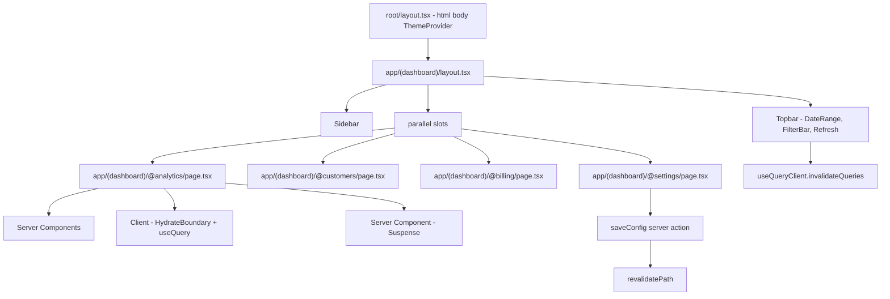
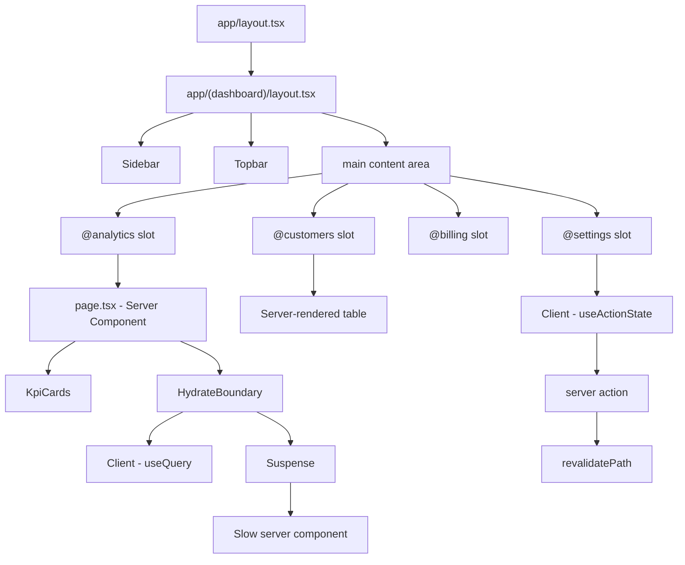
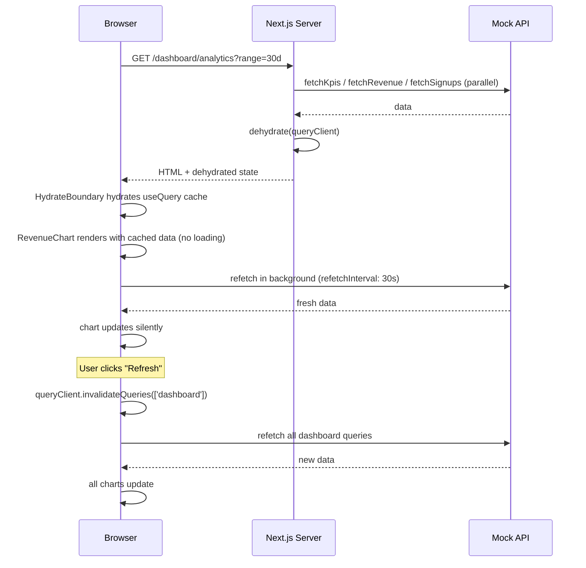

# 5.11 SaaS Dashboard

> A SaaS analytics dashboard (think Stripe, Vercel, Linear) with a persistent sidebar + topbar layout, multiple tabs driven by Next.js **parallel routes** (`@analytics`, `@customers`, `@billing`, `@settings`), interactive Recharts visualizations on the client, TanStack Query for client-side refresh and polling, server actions for saving dashboard configuration (filters, pinned charts, date range presets), server components for the initial data fetch, and streaming with Suspense for slow widgets. This project reinforces the App Router's most powerful layout primitives, the server/client component boundary, TanStack Query's hydration pattern, and server actions for mutations — the exact stack modern SaaS frontends are built on.

## 5.11.1 Project Objective

By the end of this project you should be able to:

1. Use Next.js **parallel routes** (`app/dashboard/@analytics/...`, `@customers/...`) to render multiple panels in the same layout — the dashboard tabs share a single layout (sidebar + topbar) without unmounting when switching tabs.
2. Use the **App Router layout composition** pattern: a root layout for `<html>/<body>`, a `(dashboard)` route group with a `layout.tsx` that owns the sidebar + topbar, and the `@slot` parallel routes inside it.
3. Fetch the initial dashboard data server-side in a Server Component (no client-side waterfall), pass it to a Client Component chart that hydrates from `dehydrate`/`HydrateBoundary` (TanStack Query), and let the client refresh via `useQuery` with `refetchInterval` for near-real-time updates.
4. Build interactive charts with Recharts: line (revenue over time), bar (signups per day), area (cumulative), pie (plan distribution), and a custom composed chart (bar + line on the same axis). All charts must respect dark mode (CSS variables for colors) and resize via a `ResizeObserver`.
5. Build a date range picker with presets (Today, 7d, 30d, 90d, This quarter, Custom). The selected range lives in the URL search params (`?range=7d&from=...&to=...`) so it's shareable and survives reload.
6. Build a filter bar with multi-select dropdowns (Plan, Region, Status). Filters compose with the date range into a single query key for TanStack Query.
7. Save dashboard configuration (pinned widgets, default date range, preferred chart types) via a Server Action with `useFormState` (or `useActionState` in React 19). Optimistic update; rollback on failure; `revalidatePath` on success.
8. Stream slow widgets: the "Revenue by country" widget takes 3s to compute server-side. Wrap it in `<Suspense fallback={<Skeleton />}>` so the rest of the dashboard renders immediately; the widget streams in when ready.
9. Add an "Export CSV" button per chart — calls a Route Handler (`/api/export?chart=revenue&range=7d`) that streams a CSV download.
10. Add a command palette (`Cmd+K`) for navigation between tabs and quick actions ("Refresh", "Export", "Toggle dark mode").

## 5.11.2 Reinforces Concepts From

- [[4.1 App Router Foundations]] — the `app/` directory, file conventions.
- [[4.2 Routing, Layouts, and Templates]] — layouts, parallel routes, route groups, the `@slot` syntax.
- [[4.3 Server and Client Components]] — server component for initial fetch, client component for charts.
- [[4.4 Rendering Strategies]] — static for the shell, dynamic for the data, streaming for slow widgets.
- [[4.5 Data Fetching]] — `fetch` with `next.revalidate` for cached server fetches; `cache()` for memoization across layouts.
- [[4.6 Caching and Revalidation]] — `revalidateTag` for the dashboard data tag; `revalidatePath` after a save.
- [[4.7 Server Actions and Forms]] — the save-config action with `useFormState`/`useActionState`, `revalidatePath`.
- [[4.8 Route Handlers]] — the CSV export endpoint.
- [[4.9 Loading UI, Error Pages, and Streaming]] — `loading.tsx`, `error.tsx`, `<Suspense>` for streaming widgets.
- [[4.10 Metadata and SEO]] — `title.template` for the dashboard pages (less important for SEO, more for tab titles).
- [[4.11 Images, Fonts, and Optimization]] — `next/font` for the dashboard's Inter font.
- [[4.13 Project Organization and Performance]] — feature-based folders, code-splitting chart libraries.
- [[3.6 Hooks (Built-In)]] — `useState`, `useMemo`, `useCallback` for the chart components.
- [[3.10 Composition and Patterns]] — compound components for the chart card (`<ChartCard>`, `<ChartCard.Header>`, `<ChartCard.Body>`).
- [[3.11 Performance Optimization]] — `React.memo` for chart components; `useDeferredValue` for filter inputs.
- [[3.16 API Integration and Data Fetching]] — TanStack Query hydration pattern.

## 5.11.3 Requirements

### 5.11.3.1 Functional Requirements

1. **Layout shell**: persistent sidebar (left, 240 px) with navigation (Analytics, Customers, Billing, Settings), a topbar (60 px) with the date range picker, filter bar, refresh button, and a "Save view" button, and the main content area filling the rest.
2. **Tabs via parallel routes**: each of the four tabs (`@analytics`, `@customers`, `@billing`, `@settings`) is a parallel route slot. The dashboard layout renders `{children}` and the active slot. Switching tabs does NOT remount the layout — the sidebar's expand state, the theme, the filter bar all persist.
3. **Analytics tab**: a grid of 4 KPI cards (MRR, Active Users, Churn Rate, Avg. Session), a large revenue line chart, a signups bar chart, a plan distribution pie chart, and a "Revenue by country" area chart (slow — streams in via Suspense).
4. **Customers tab**: a server-rendered table with pagination, sortable columns, and a row click  -->  detail drawer (intercepted route `@customers/(.)[id]`).
5. **Billing tab**: a list of invoices (server-rendered), each expandable to show line items. A "Generate invoice" button calls a server action.
6. **Settings tab**: a form (workspace name, default date range, preferred chart type, theme). Submitting calls a server action; the layout updates optimistically and `revalidatePath('/dashboard')` refreshes the server-rendered shell.
7. **Date range picker**: a button showing the current range; clicking opens a popover with presets and a custom range (two `date` inputs). The selection updates the URL search params (`?range=7d` or `?from=2026-06-01&to=2026-06-27`).
8. **Filter bar**: multi-select dropdowns for Plan (Free, Pro, Enterprise), Region (NA, EU, APAC, etc.), Status (Active, Trial, Churned). The selection composes into the TanStack Query key.
9. **Charts**: Recharts components, dark-mode aware (colors from CSS variables), responsive (wrap in `ResponsiveContainer`), with tooltips, legends, and accessible alternatives (a `<table>` summary in a `<details>` for screen readers).
10. **Client-side refresh**: a "Refresh" button in the topbar that triggers `queryClient.invalidateQueries`. Optionally, `refetchInterval: 30000` for auto-refresh of the revenue chart.
11. **Save view**: the user adjusts filters and clicks "Save view" — a server action persists the filter combination as a named view. A dropdown of saved views lets them switch.
12. **Export CSV**: per-chart export button. Calls `/api/export?chart=revenue&range=7d&plan=pro` which streams a CSV with the appropriate `Content-Disposition: attachment` header.
13. **Dark mode**: toggle in the topbar; persisted in a cookie (read by the server component so no FOUC).
14. **Command palette** (`Cmd+K`): "Go to Analytics", "Go to Customers", "Refresh", "Export revenue CSV", "Toggle theme".

### 5.11.3.2 Non-Functional Requirements

| Requirement | Target |
|---|---|
| First Contentful Paint (dashboard shell) | < 1.2 s |
| Time to Interactive (charts) | < 2.5 s |
| Slow widget stream-in | < 3 s (with skeleton fallback) |
| Client refresh latency | < 500 ms (cache-then-network) |
| Lighthouse Performance | ≥ 85 |
| Lighthouse Accessibility | ≥ 95 |
| Recharts bundle (gzipped) | < 100 KB (tree-shaken) |

### 5.11.3.3 Acceptance Criteria

- The shell (sidebar, topbar) renders in < 1.2 s; the KPI cards render server-side with the initial data; the charts hydrate client-side without a loading flash (TanStack Query's `HydrateBoundary` provides the dehydrated state).
- Switching from Analytics to Customers does NOT unmount the sidebar (its expand state persists) — this is the parallel routes win.
- The "Revenue by country" widget shows a skeleton for ~3s, then streams in (the rest of the dashboard is already interactive). Wrapping it in `<Suspense>` is what enables this.
- Changing the date range updates the URL (`?range=30d`) and refetches via TanStack Query — the chart shows a brief loading state, then the new data.
- The Settings form submission shows an optimistic update (the new workspace name appears immediately); on server failure, it reverts and shows an error.
- `/api/export?chart=revenue&range=7d` returns a CSV file that downloads as `revenue-7d.csv`. The Content-Type is `text/csv`.
- The dashboard works on mobile: the sidebar collapses to a drawer (hamburger in topbar), the chart grid reflows to 1 column.
- Recharts is not in the initial bundle for the Customers tab (route-level code split).

## 5.11.4 Recommended Architecture



### 5.11.4.1 Why Parallel Routes for Tabs?

The naive approach is one route per tab (`/dashboard/analytics`, `/dashboard/customers`). Switching tabs unmounts the previous tab and its state. The sidebar is in the layout so it persists, but the topbar's filter state would too — except it's in the page, not the layout.

With parallel routes (`@analytics`, `@customers`, etc.), the dashboard layout renders all four slots; only the active one is shown (via conditional rendering based on the URL, or via `default.tsx` for inactive slots). The layout never re-mounts, and you can keep state in the layout's `useState` (e.g., the sidebar collapse).

> [!note] In practice, most SaaS dashboards use parallel routes for layouts that show multiple panels simultaneously (e.g., a master-detail view: `@list` + `@detail`). For pure tab switching, a single route + `useState` for the tab works too. We use parallel routes here because (a) it's the canonical pattern, and (b) it makes the URL reflect the active tab, which is shareable and bookmarkable.

### 5.11.4.2 Why Server Components + TanStack Query Hydration?

Server components fetch data at request time on the server — no client-side waterfall, no auth token in the browser. But you also want client-side refresh (the user clicks "Refresh" or `refetchInterval` polls). The bridge is TanStack Query's `dehydrate`/`HydrateBoundary`: the server component fetches, dehydrates the cache to JSON, ships it in the HTML, and the client `QueryClientProvider` hydrates from it. The first client render sees the data; subsequent `useQuery` calls hit the cache, then refetch in the background.

### 5.11.4.3 Why Server Actions for Save Config?

A save-config mutation traditionally goes via `fetch('/api/config', { method: 'POST' })`. With server actions, the form's `action` attribute is a server function — no fetch, no JSON parsing, no CORS. `useActionState` gives you pending state and the result. `revalidatePath('/dashboard')` refreshes the server-rendered shell. This is the canonical App Router mutation pattern.

## 5.11.5 File Structure

```text
saas-dashboard/
  - app/
      - layout.tsx                          # root: html, body, ThemeProvider, fonts
      - globals.css
      - (dashboard)/
          - layout.tsx                      # sidebar + topbar shell
          - dashboard/
              - page.tsx                    # redirect to /dashboard/analytics
          - @analytics/
              - page.tsx                    # server component, fetches initial data
              - loading.tsx
              - error.tsx
              - revenue-by-country.tsx      # streamed via Suspense
          - @customers/
              - page.tsx
              - default.tsx
              - [id]/
              - page.tsx                # intercepted route detail drawer
          - @billing/
              - page.tsx
          - @settings/
              - page.tsx
          - default.tsx                     # renders null for inactive slots
      - api/
          - export/
          - route.ts                    # CSV export
      - actions/
      - save-config.ts                  # server action
  - components/
      - layout/
          - Sidebar.tsx
          - Topbar.tsx
          - DateRangePicker.tsx             # client
          - FilterBar.tsx                   # client
      - charts/
          - RevenueChart.tsx                # client
          - SignupsChart.tsx                # client
          - PlanDistributionChart.tsx       # client
          - CountryRevenueChart.tsx         # client
          - ChartCard.tsx                   # compound component
      - kpi/
          - KpiCard.tsx                     # server
      - customers/
          - CustomersTable.tsx              # server
      - ui/
      - Button.tsx
      - Skeleton.tsx
      - Toast.tsx
  - lib/
      - api.ts                              # client fetcher
      - queries.ts                          # TanStack Query keys + fns
      - mock-data.ts                        # seed
      - types.ts
  - providers/
      - QueryProvider.tsx                   # client
      - ThemeProvider.tsx
  - next.config.js
  - tailwind.config.ts
  - tsconfig.json
```

## 5.11.6 Step-by-Step Build Order

1. **Scaffold** Next.js (App Router) + TypeScript + Tailwind. Install `@tanstack/react-query`, `recharts`, `date-fns`, `zod`.
2. **Set up providers** — `QueryProvider` (client) wraps the app in `layout.tsx`; `ThemeProvider` reads the theme cookie.
3. **Build the dashboard layout** in `app/(dashboard)/layout.tsx` — sidebar, topbar, and `{children}` + parallel slots.
4. **Set up parallel routes** — create `@analytics/page.tsx`, `@customers/page.tsx`, `@billing/page.tsx`, `@settings/page.tsx`, plus `default.tsx` returning null for inactive slots.
5. **Seed mock data** — `lib/mock-data.ts` generates revenue, signups, customers, invoices for the last 90 days.
6. **Build the analytics page** (server component) — fetch KPIs, render `<KpiCard>`s, dehydrate the TanStack Query cache for the charts, wrap charts in `<HydrateBoundary>`.
7. **Build the chart components** — `RevenueChart`, `SignupsChart`, `PlanDistributionChart`, `CountryRevenueChart`. Each is a client component using `useQuery` with the dehydrated key.
8. **Stream the slow widget** — `RevenueByCountry` is a server component that takes 3s (mock `await new Promise(r => setTimeout(r, 3000))`). Wrap in `<Suspense fallback={<Skeleton />}>` in the analytics page.
9. **Build the date range picker** — `DateRangePicker` is a client component; selecting a preset updates `useSearchParams` and `router.push`.
10. **Build the filter bar** — multi-select dropdowns; the selection composes into the TanStack Query key.
11. **Wire TanStack Query refresh** — the topbar's Refresh button calls `queryClient.invalidateQueries({ queryKey: ['dashboard'] })`. Optional `refetchInterval: 30000` on the revenue chart.
12. **Build the settings form** — server action `saveConfig` writes to a mock store (or a JSON file). `useActionState` wraps it; optimistic update on submit; `revalidatePath('/dashboard')` on success.
13. **Build the CSV export Route Handler** — `/api/export` reads the query params, queries the same mock data, streams a CSV.
14. **Build the customers table** — server-rendered, sortable columns, pagination via search params.
15. **Add the intercepted route** — `@customers/(.)[id]/page.tsx` renders the detail drawer when a customer row is clicked (soft navigation in a modal).
16. **Add dark mode** — toggle in topbar; persisted in a cookie set via a server action; read in `layout.tsx`.
17. **Add the command palette** — `cmdk`-based; lazy-loaded; offers navigation and quick actions.
18. **Polish** — loading skeletons per slot, error.tsx per slot, accessible chart alternatives (`<details><summary>Data table</summary><table>...</table></details>`).

## 5.11.7 Code Walkthrough

### 5.11.7.1 The Dashboard Layout (Parallel Routes)

```tsx
// app/(dashboard)/layout.tsx
import { Sidebar } from '@/components/layout/Sidebar';
import { Topbar } from '@/components/layout/Topbar';
import { cookies } from 'next/headers';

export default async function DashboardLayout({
  children,
  analytics,
  customers,
  billing,
  settings,
}: {
  children: React.ReactNode;
  analytics: React.ReactNode;
  customers: React.ReactNode;
  billing: React.ReactNode;
  settings: React.ReactNode;
}) {
  const theme = (await cookies()).get('theme')?.value ?? 'light';
  return (
    <div className={`flex h-screen ${theme === 'dark' ? 'dark' : ''}`}>
      <Sidebar />
      <div className="flex flex-1 flex-col overflow-hidden">
        <Topbar />
        <main className="flex-1 overflow-auto p-6">
          {/* The active slot is determined by the URL segment */}
          {children}
          {analytics}
          {customers}
          {billing}
          {settings}
        </main>
      </div>
    </div>
  );
}
```

> [!note] Each parallel slot has its own `default.tsx` that returns `null` when inactive. The layout renders all four slots; only one has content at a time (the others return null). This keeps the layout mounted across tab switches.

### 5.11.7.2 Server Component with TanStack Query Hydration

```tsx
// app/(dashboard)/@analytics/page.tsx
import { dehydrate, HydrateBoundary, QueryClient } from '@tanstack/react-query';
import { KpiCard } from '@/components/kpi/KpiCard';
import { RevenueChart } from '@/components/charts/RevenueChart';
import { SignupsChart } from '@/components/charts/SignupsChart';
import { Suspense } from 'react';
import { CountryRevenueChartSkeleton } from '@/components/charts/CountryRevenueChart';
import { fetchKpis, fetchRevenue, fetchSignups } from '@/lib/api';

export default async function AnalyticsPage({
  searchParams,
}: {
  searchParams: { range?: string; plan?: string };
}) {
  const qc = new QueryClient();
  const range = searchParams.range ?? '30d';
  const plan = searchParams.plan ?? 'all';

  // Prefetch on the server — no client waterfall
  await Promise.all([
    qc.prefetchQuery({ queryKey: ['kpis', range, plan], queryFn: () => fetchKpis(range, plan) }),
    qc.prefetchQuery({ queryKey: ['revenue', range, plan], queryFn: () => fetchRevenue(range, plan) }),
    qc.prefetchQuery({ queryKey: ['signups', range, plan], queryFn: () => fetchSignups(range, plan) }),
  ]);

  const kpis = qc.getQueryData(['kpis', range, plan]);

  return (
    <HydrateBoundary state={dehydrate(qc)}>
      <div className="grid grid-cols-1 gap-4 md:grid-cols-2 lg:grid-cols-4">
        {kpis.map((kpi) => <KpiCard key={kpi.label} {...kpi} />)}
      </div>
      <div className="mt-6 grid grid-cols-1 gap-4 lg:grid-cols-2">
        <RevenueChart range={range} plan={plan} />
        <SignupsChart range={range} plan={plan} />
      </div>
      <div className="mt-6">
        <Suspense fallback={<CountryRevenueChartSkeleton />}>
          {/* This server component streams in when ready */}
          <CountryRevenueWidget range={range} plan={plan} />
        </Suspense>
      </div>
    </HydrateBoundary>
  );
}
```

### 5.11.7.3 The Client Chart Component

```tsx
// components/charts/RevenueChart.tsx
'use client';
import { useQuery } from '@tanstack/react-query';
import { LineChart, Line, XAxis, YAxis, Tooltip, ResponsiveContainer, CartesianGrid } from 'recharts';
import { fetchRevenue } from '@/lib/api';
import { ChartCard } from './ChartCard';

export function RevenueChart({ range, plan }: { range: string; plan: string }) {
  const { data, isLoading, isFetching } = useQuery({
    queryKey: ['revenue', range, plan],
    queryFn: () => fetchRevenue(range, plan),
    // The initial data comes from the dehydrated cache; refetch in background
    refetchInterval: 30000,
  });

  return (
    <ChartCard
      title="Revenue"
      subtitle={`Last ${range}`}
      isLoading={isLoading}
      isFetching={isFetching}
      onExport={() => downloadCsv('/api/export?chart=revenue', { range, plan })}
    >
      <ResponsiveContainer width="100%" height={300}>
        <LineChart data={data}>
          <CartesianGrid strokeDasharray="3 3" stroke="var(--grid)" />
          <XAxis dataKey="date" stroke="var(--axis)" />
          <YAxis stroke="var(--axis)" />
          <Tooltip
            contentStyle={{ background: 'var(--tooltip-bg)', border: '1px solid var(--tooltip-border)' }}
          />
          <Line type="monotone" dataKey="value" stroke="var(--accent)" strokeWidth={2} dot={false} />
        </LineChart>
      </ResponsiveContainer>
      <details className="mt-2 text-xs">
        <summary>View data table</summary>
        <table className="mt-2 w-full">
          <tbody>
            {data?.map((row) => (
              <tr key={row.date}>
                <td className="py-1">{row.date}</td>
                <td className="py-1 text-right">${row.value.toLocaleString()}</td>
              </tr>
            ))}
          </tbody>
        </table>
      </details>
    </ChartCard>
  );
}
```

### 5.11.7.4 The Server Action for Save Config

```ts
// app/actions/save-config.ts
'use server';
import { revalidatePath } from 'next/cache';
import { cookies } from 'next/headers';
import { z } from 'zod';

const schema = z.object({
  workspaceName: z.string().min(1).max(50),
  defaultRange: z.enum(['7d', '30d', '90d']),
  preferredChart: z.enum(['line', 'bar', 'area']),
  theme: z.enum(['light', 'dark']),
});

export async function saveConfig(prev: State, formData: FormData): Promise<State> {
  const parsed = schema.safeParse({
    workspaceName: formData.get('workspaceName'),
    defaultRange: formData.get('defaultRange'),
    preferredChart: formData.get('preferredChart'),
    theme: formData.get('theme'),
  });
  if (!parsed.success) {
    return { ok: false, errors: parsed.error.flatten().fieldErrors };
  }
  // Persist to mock store (in production: database)
  await mockSaveConfig(parsed.data);
  // Set theme cookie so the server reads it on next render
  (await cookies()).set('theme', parsed.data.theme, { maxAge: 60 * 60 * 24 * 365 });
  // Refresh the dashboard's server-rendered shell
  revalidatePath('/dashboard');
  return { ok: true };
}
```

```tsx
// app/(dashboard)/@settings/page.tsx
'use client';
import { useActionState } from 'react';
import { saveConfig } from '@/app/actions/save-config';

export default function SettingsPage() {
  const [state, formAction, pending] = useActionState(saveConfig, { ok: false });

  return (
    <form action={formAction} className="max-w-md space-y-4">
      <label className="block">
        Workspace name
        <input name="workspaceName" defaultValue="Acme Inc." className="block w-full rounded border p-2" />
        {state.errors?.workspaceName && <span className="text-red-500">{state.errors.workspaceName[0]}</span>}
      </label>
      <label className="block">
        Default date range
        <select name="defaultRange" className="block w-full rounded border p-2">
          <option value="7d">7 days</option>
          <option value="30d">30 days</option>
          <option value="90d">90 days</option>
        </select>
      </label>
      <label className="block">
        Theme
        <select name="theme" className="block w-full rounded border p-2">
          <option value="light">Light</option>
          <option value="dark">Dark</option>
        </select>
      </label>
      <button type="submit" disabled={pending} className="rounded bg-blue-600 px-4 py-2 text-white">
        {pending ? 'Saving…' : 'Save'}
      </button>
      {state.ok && <p className="text-green-600">Saved</p>}
    </form>
  );
}
```

### 5.11.7.5 The CSV Export Route Handler

```ts
// app/api/export/route.ts
import { NextRequest } from 'next/server';
import { fetchRevenue } from '@/lib/api';

export async function GET(req: NextRequest) {
  const range = req.nextUrl.searchParams.get('range') ?? '30d';
  const plan = req.nextUrl.searchParams.get('plan') ?? 'all';
  const chart = req.nextUrl.searchParams.get('chart') ?? 'revenue';

  const data = await fetchRevenue(range, plan);
  const csv = ['date,value', ...data.map((d) => `${d.date},${d.value}`)].join('\n');

  return new Response(csv, {
    headers: {
      'Content-Type': 'text/csv',
      'Content-Disposition': `attachment; filename="${chart}-${range}.csv"`,
    },
  });
}
```

### 5.11.7.6 The Compound ChartCard

```tsx
// components/charts/ChartCard.tsx
import { ReactNode } from 'react';

type ChartCardProps = { title: string; subtitle?: string; children: ReactNode };
type ChartCardCompound = {
  Header: typeof Header;
  Body: typeof Body;
  Actions: typeof Actions;
};

function ChartCard({ title, subtitle, children }: ChartCardProps) {
  return <div className="rounded-lg border bg-white p-4 shadow-sm dark:bg-zinc-900">{children}</div>;
}

function Header({ title, subtitle }: { title: string; subtitle?: string }) {
  return (
    <div className="mb-3">
      <h3 className="text-sm font-semibold">{title}</h3>
      {subtitle && <p className="text-xs text-zinc-500">{subtitle}</p>}
    </div>
  );
}

function Body({ children }: { children: ReactNode }) {
  return <div>{children}</div>;
}

function Actions({ children }: { children: ReactNode }) {
  return <div className="float-right">{children}</div>;
}

ChartCard.Header = Header;
ChartCard.Body = Body;
ChartCard.Actions = Actions;
export { ChartCard };
```

## 5.11.8 Mermaid Diagrams

### 5.11.8.1 Parallel Routes Layout



### 5.11.8.2 Server Hydration + Client Refresh Sequence



## 5.11.9 Common Pitfalls

1. **Forgetting `default.tsx` for parallel slots.** Without a `default.tsx`, Next.js throws "no default export" for the inactive slots. Each `@slot` needs a `default.tsx` returning `null` (or a placeholder) for when it's not the active slot.
2. **Creating a new `QueryClient` per render.** `new QueryClient()` in a client component's render body creates a new instance every render, busting the cache. Use a `useState` initializer or a module-level singleton (for browser only).
3. **Fetching on the client when you could on the server.** If the analytics page is `'use client'`, the chart data is fetched after hydration — a waterfall. Fetch in the server component, dehydrate, hydrate on the client. The first paint shows data.
4. **Recharts in the server bundle.** `import { LineChart } from 'recharts'` in a server component pulls Recharts into the server bundle (it doesn't work server-side). Chart components must be `'use client'`.
5. **`refetchInterval` that spams the API.** 30s polling is fine; 5s polling for a dashboard with 100 users is 12,000 requests/minute. Use WebSocket or SSE for true real-time; reserve polling for slow-changing data.
6. **Server action without `revalidatePath`.** After a successful mutation, the server-rendered shell is stale. `revalidatePath('/dashboard')` refreshes it; without it, the user sees the old data until a hard refresh.
7. **Dark mode that flashes.** If the theme is read client-side from localStorage, the first paint is light then switches to dark. Read the theme cookie server-side in `layout.tsx` and apply the `dark` class on `<html>`.
8. **Filter state in `useState` instead of the URL.** Filters in component state are lost on reload and aren't shareable. Use `useSearchParams` and `router.push` — the URL is the source of truth.
9. **CSV export that buffers the whole file.** For large exports, `Response(csv)` buffers everything in memory. Use a `ReadableStream` and stream the CSV chunk by chunk.
10. **No accessible alternative for charts.** A `<LineChart>` is a `<svg>` — invisible to screen readers. Add a `<details>` with a `<table>` of the underlying data, or `aria-label` on the chart container with a summary.
11. **`Suspense` boundary that catches the whole page.** Wrapping the entire analytics page in one `<Suspense>` means one slow widget blocks the whole page. Wrap individual slow widgets.
12. **Parallel routes that re-fetch on every tab switch.** If the customers tab is a server component, switching to it triggers a server fetch. Use `loading.tsx` per slot for a skeleton; consider caching the fetch with `next.revalidate`.

## 5.11.10 Stretch Goals

1. **Real-time updates via SSE.** Replace `refetchInterval` with an EventSource connection to a `/api/stream` endpoint that pushes new data points. The chart animates as new points arrive.
2. **Custom chart builder.** Let the user pick a metric (X axis) and a dimension (Y axis) and a chart type, then render a custom chart. Save the configuration as a "custom widget".
3. **Saved views with sharing.** A "Save view" action that captures the current filters + date range as a named view, generates a shareable URL (`/dashboard/analytics?view=abc123`).
4. **Anomaly detection.** A server-side job flags data points that deviate > 2σ from the mean; the chart highlights them in red with a tooltip "Anomaly detected".
5. **Multi-workspace switcher.** A dropdown in the topbar switches between workspaces; each has its own data, saved views, and config. The active workspace is in the URL (`/[workspace]/dashboard/...`).

## 5.11.11 Self-Assessment Rubric

| # | Criterion | 0 | 1 | 2 | 3 |
|---|---|---|---|---|---|
| 1 | Routing | single routes | parallel routes | + default.tsx + intercepted | + route groups + URL state |
| 2 | Data fetching | client-only | server fetch | + TanStack hydration | + streaming + refetchInterval |
| 3 | Charts | none | 1 chart | 3+ Recharts | + dark-mode-aware + accessible alt |
| 4 | Filters/date range | none | local state | URL search params | + shareable + saved views |
| 5 | Server actions | none | save only | + useFormState + validation | + optimistic + revalidatePath |
| 6 | Streaming | none | loading.tsx | Suspense per widget | + skeleton fallbacks |
| 7 | Export | none | JSON | CSV via Route Handler | + streaming + content-disposition |
| 8 | Dark mode | none | toggle in state | + persisted | + cookie + server-rendered |
| 9 | Performance | no code split | route split | + lazy charts | + HydrateBoundary + memoized |
| 10 | Polish | rough | responsive | + command palette | + skeleton states + error.tsx |

## 5.11.12 Related Notes

- [[4.1 App Router Foundations]]
- [[4.2 Routing, Layouts, and Templates]]
- [[4.3 Server and Client Components]]
- [[4.4 Rendering Strategies]]
- [[4.5 Data Fetching]]
- [[4.6 Caching and Revalidation]]
- [[4.7 Server Actions and Forms]]
- [[4.8 Route Handlers]]
- [[4.9 Loading UI, Error Pages, and Streaming]]
- [[3.10 Composition and Patterns]]
- [[3.16 API Integration and Data Fetching]]
- [[5.5 Admin Dashboard]] — same domain, SPA approach (no Next.js) for contrast
- [[5.13 Analytics Dashboard]] — the capstone; everything here plus more
