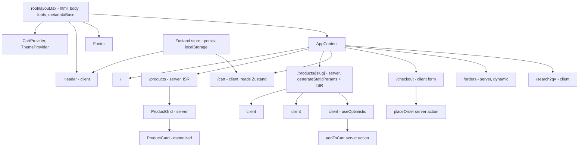
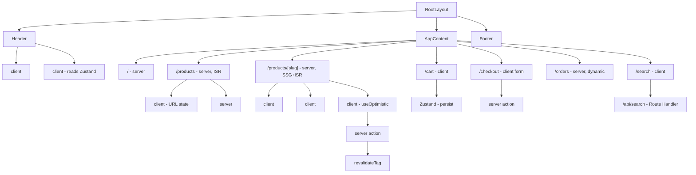
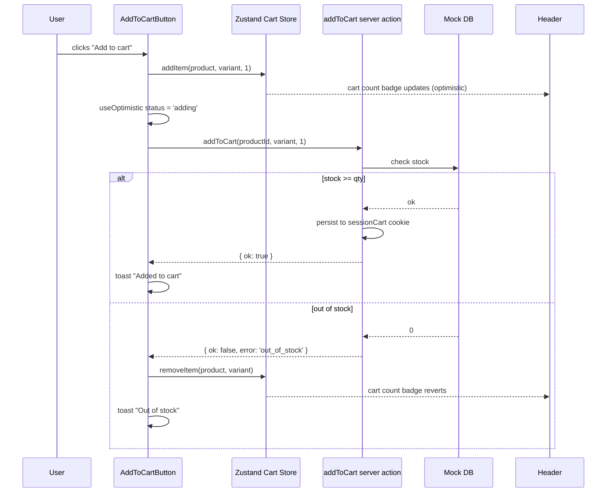

# 5.12 E-commerce Frontend

> An e-commerce storefront (think Allbirds or Outdoor Voices) with a product list, product detail page, cart, checkout (frontend only — no payment processing), and order history. Products are statically generated at build time with `generateStaticParams`; stock and price are kept fresh via ISR (`revalidate = 60`); cart state lives in Zustand with `persist` middleware to localStorage; "add to cart" is optimistic with rollback; product images use `next/image` with `sizes`, `priority` for the PDP hero, and `placeholder=blur`; SEO is handled by the Metadata API with JSON-LD `Product` structured data. This project reinforces every Next.js rendering strategy in a single app, plus the canonical cart pattern and product image optimization pipeline.

## 5.12.1 Project Objective

By the end of this project you should be able to:

1. Build a product list page at `/products` with filtering by category, sorting by price/name, and pagination via URL search params (`?category=shoes&sort=price-asc&page=2`). The list is statically generated at build time; ISR keeps stock counts fresh.
2. Build a product detail page at `/products/[slug]` with `generateStaticParams` returning all slugs at build time. The page is ISR (`revalidate = 60`) so price changes propagate. Use `generateMetadata` for per-product SEO (title, description, OG image, JSON-LD `Product` schema).
3. Build a cart with Zustand + `persist` middleware: add, remove, update quantity, clear. The cart is persisted to `localStorage` and survives reload. On the server, the cart is empty (localStorage is browser-only) — handle the hydration mismatch.
4. Implement optimistic "add to cart": clicking the button on a PDP adds the item to the cart immediately (UI feedback), then calls a server action to validate stock and persist the cart to a server-side session (mock). On failure (out of stock), rollback and show a toast.
5. Build a checkout flow (frontend only): `/cart` shows the cart with line items, `/checkout` collects shipping address and payment info (no real processing — just validation), `/order-confirmation/[id]` shows the placed order. Use server actions for the order placement.
6. Build an order history page at `/orders` (server-rendered, behind a mock auth cookie) listing past orders with status.
7. Optimize product images with `next/image`: `priority` on the PDP hero, `sizes` matching the layout, `placeholder=blur` with a tiny base64 blur, lazy-load the rest. Use `remotePatterns` for the product image CDN.
8. Add SEO: per-product `generateMetadata` with OG images, `metadataBase` in the root layout, JSON-LD `Product` and `BreadcrumbList` structured data, `sitemap.ts`, `robots.ts`.
9. Build a responsive layout: product grid (1 col mobile  -->  2 col tablet  -->  4 col desktop), sticky header with cart badge, mobile bottom nav, a footer.
10. Add an "Add to wishlist" feature (client-only, persisted to localStorage); a wishlist page at `/wishlist`.
11. Add product search: a search bar in the header that queries a Route Handler (`/api/search?q=...`) backed by FlexSearch over the product catalog.
12. Add a "Recently viewed" widget on the PDP that tracks the last 5 viewed products in `localStorage` and renders them below the main product.

## 5.12.2 Reinforces Concepts From

- [[4.1 App Router Foundations]] — the `app/` directory, file conventions.
- [[4.2 Routing, Layouts, and Templates]] — root layout for the header/footer, route groups for `(shop)` vs `(account)`.
- [[4.3 Server and Client Components]] — product list and PDP are server components; cart button, filters, search are client.
- [[4.4 Rendering Strategies]] — SSG for products, ISR for stock freshness, dynamic for `/orders` (per-user).
- [[4.5 Data Fetching]] — `fetch` with `next.revalidate` for the product catalog.
- [[4.6 Caching and Revalidation]] — `revalidateTag('products')` when an admin edits a product; `revalidatePath('/products/[slug]')`.
- [[4.7 Server Actions and Forms]] — add-to-cart, place-order, save-wishlist (optional) actions.
- [[4.8 Route Handlers]] — the search endpoint.
- [[4.9 Loading UI, Error Pages, and Streaming]] — `loading.tsx` for the product list skeleton; `error.tsx` for "product not found".
- [[4.10 Metadata and SEO]] — per-product `generateMetadata`, JSON-LD, sitemap, robots, OG images.
- [[4.11 Images, Fonts, and Optimization]] — `next/image` everywhere with proper `sizes`/`priority`/`placeholder`.
- [[4.12 Middleware (Practical Usage Only)]] — optional: middleware to redirect `/admin` to a login page.
- [[3.3 State and Events]] — cart button click handlers, filter inputs.
- [[3.6 Hooks (Built-In)]] — `useState`, `useOptimistic` (React 19) for add-to-cart.
- [[3.11 Performance Optimization]] — memoize product cards, lazy-load below-the-fold sections.
- [[2.5 Layout Patterns in Tailwind]] — the responsive product grid.
- [[2.3 Responsive Utilities and Dark Mode]] — mobile bottom nav, dark mode (optional).

## 5.12.3 Requirements

### 5.12.3.1 Functional Requirements

1. **Home page** (`/`): a hero banner, featured products (4), new arrivals (8), category tiles. All server-rendered; the hero image is `priority`.
2. **Product list** (`/products`): a filterable, sortable, paginated grid. Filters: category (checkboxes), price range (min/max). Sort: name A-Z, name Z-A, price asc, price desc. Pagination: 12 per page. The state is in the URL (`?category=shoes&sort=price-asc&page=2`).
3. **Product detail** (`/products/[slug]`): gallery (main image + thumbnails), title, price, description, variants (size/color selectors), quantity selector, "Add to cart" button, "Add to wishlist" button, breadcrumbs, recently viewed, related products.
4. **Cart** (`/cart`): line items (image, title, variant, quantity stepper, line total), subtotal, estimated shipping, tax (mock), total. Empty state with "Continue shopping" CTA.
5. **Checkout** (`/checkout`): shipping address form (validated with Zod), payment info form (card number, expiry, CVC — validated but NOT processed), "Place order" button. On submit, a server action creates the order, clears the cart, and redirects to `/order-confirmation/[id]`.
6. **Order confirmation** (`/order-confirmation/[id]`): order number, items, shipping address, total, estimated delivery date.
7. **Order history** (`/orders`): list of past orders with status (Processing, Shipped, Delivered), click to see detail.
8. **Wishlist** (`/wishlist`): grid of wishlisted products with "Move to cart" buttons.
9. **Search**: header search bar; on submit, navigates to `/search?q=...` which calls `/api/search?q=...` and shows results.
10. **Header**: logo, nav (Home, Products, About, Contact), search bar, cart icon with item count badge, wishlist icon with count, account dropdown (mock auth).
11. **Footer**: links, newsletter signup (mock), social icons.
12. **Mobile**: header collapses to a hamburger; bottom nav appears with Home, Search, Cart, Account.
13. **SEO**: per-product `<title>`, meta description, OG image, JSON-LD `Product` and `BreadcrumbList`. `sitemap.ts` lists all products. `robots.ts` allows all.
14. **Accessibility**: all interactive elements keyboard-reachable; product cards have descriptive `aria-label`s; the cart count is `aria-live="polite"` so screen readers announce updates.

### 5.12.3.2 Non-Functional Requirements

| Requirement | Target |
|---|---|
| First Contentful Paint (home) | < 1.0 s |
| LCP (PDP hero) | < 2.0 s (priority + placeholder) |
| Product list with 100 products | 60 fps scroll |
| Time to Interactive | < 2.5 s |
| Lighthouse Performance | ≥ 90 |
| Lighthouse SEO | 100 |
| Lighthouse Accessibility | ≥ 95 |
| Cart badge updates on add | < 16 ms (optimistic) |

### 5.12.3.3 Acceptance Criteria

- Visiting `/products/shoes-running-shoe` returns the statically generated page (check the response header — `x-nextjs-cache: HIT`). Editing the product in the (mock) admin and triggering `revalidateTag('products')` makes the next visit return the updated content.
- The PDP hero image loads with `priority` (check the network tab — it's fetched early, not lazy). The thumbnails below are lazy-loaded. A blur placeholder shows before the image loads.
- Clicking "Add to cart" on a PDP updates the cart badge in the header within one frame (optimistic). If the server action returns "out of stock", the badge reverts and a toast says "Sorry, this item is out of stock".
- Navigating to `/cart` shows the cart with the items. Refreshing the page preserves the cart (Zustand `persist`). The cart is empty on the server's first render (no hydration mismatch — the badge is rendered client-side only).
- The checkout form validates: required fields, valid email, card number with Luhn check, expiry in the future. Errors show inline.
- Placing an order redirects to `/order-confirmation/[id]`. The order appears in `/orders`. The cart is cleared.
- Searching for "running" returns running shoes; the search results page has a proper `<title>Search: running — Acme`.
- The product list page's URL `?category=shoes&sort=price-asc&page=2` is shareable and bookmarkable; reloading preserves the filters.
- Lighthouse SEO audit returns 100 (metadata, sitemap, robots, structured data all correct).

## 5.12.4 Recommended Architecture



### 5.12.4.1 Why SSG + ISR for Products?

A product catalog is mostly static (title, description, images) with a few dynamic fields (price, stock). SSG gives you the speed of pre-rendered HTML (CDN-served, < 50 ms TTFB). ISR (`revalidate = 60`) re-renders the page in the background every 60s, so price changes propagate within a minute. `revalidateTag('products')` allows on-demand revalidation when an admin edits a product (instant, no waiting for the 60s window).

The alternative — fully dynamic SSR — adds 100-300 ms to every product page load and breaks CDN caching. The alternative — pure client-side rendering — kills SEO and LCP. SSG + ISR is the right default for e-commerce catalogs.

### 5.12.4.2 Why Zustand for the Cart?

The cart is shared across the header (badge), the PDP (add button), the cart page (line items), and the checkout (line items). React Context works, but every cart update re-renders all consumers (the entire header, including the nav). Zustand is a tiny store with `useStore(selector)` — only components that select the changed slice re-render. The `persist` middleware handles localStorage serialization; the `skipHydration` option avoids the hydration mismatch (read the store on the client only).

### 5.12.4.3 Why Server Actions for Add to Cart?

A pure client-side cart (just Zustand) works but doesn't validate stock server-side. A server action does: it receives the product id + quantity + variant, checks stock, returns success or failure, and writes to a server-side session cart (for cross-device sync once auth is added). `useOptimistic` updates the UI immediately; on failure, the optimistic state is rolled back.

## 5.12.5 File Structure

```text
ecommerce/
  - app/
      - layout.tsx                          # root: html, body, fonts, metadataBase, Header/Footer
      - globals.css
      - page.tsx                            # home
      - (shop)/
          - products/
              - page.tsx                    # product list (server, ISR)
              - loading.tsx
              - [slug]/
              - page.tsx                # PDP (server, generateStaticParams + ISR)
              - loading.tsx
              - not-found.tsx
              - opengraph-image.tsx     # dynamic OG image
          - cart/
              - page.tsx                    # client
          - checkout/
              - page.tsx                    # client form
          - search/
              - page.tsx                    # client
          - wishlist/
          - page.tsx                    # client
      - (account)/
          - orders/
              - page.tsx                    # server (per-user)
              - [id]/page.tsx
          - order-confirmation/
          - [id]/page.tsx
      - api/
          - search/route.ts
      - actions/
          - cart.ts                         # addToCart, updateQty, removeFromCart
          - order.ts                        # placeOrder
      - sitemap.ts
      - robots.ts
  - components/
      - layout/
          - Header.tsx                      # client (cart badge)
          - Footer.tsx
          - MobileNav.tsx                   # client
          - SearchBar.tsx                   # client
      - product/
          - ProductGrid.tsx                 # server
          - ProductCard.tsx                 # memoized
          - ProductGallery.tsx              # client
          - VariantSelector.tsx             # client
          - QuantitySelector.tsx            # client
          - AddToCartButton.tsx             # client - useOptimistic
          - AddToWishlistButton.tsx         # client
          - RelatedProducts.tsx             # server
      - cart/
          - CartLineItem.tsx
          - CartSummary.tsx
          - EmptyCart.tsx
      - ui/
      - Button.tsx
      - Input.tsx
      - Badge.tsx
      - Toast.tsx
  - lib/
      - products.ts                         # fetch functions
      - search-index.ts                     # FlexSearch build
      - mock-db.ts                          # seed
      - types.ts
  - store/
      - cart.ts                             # Zustand + persist
      - wishlist.ts
  - providers/
      - ThemeProvider.tsx
      - ToastProvider.tsx
  - next.config.js                          # images.remotePatterns
  - tailwind.config.ts
  - tsconfig.json
```

## 5.12.6 Step-by-Step Build Order

1. **Scaffold** Next.js (App Router) + TypeScript + Tailwind. Install `zustand`, `zod`, `flexsearch`, `lucide-react`.
2. **Configure `next.config.js`** — `images.remotePatterns: [{ protocol: 'https', hostname: 'images.acme.com' }]`. Add `images.formats: ['image/avif', 'image/webp']`.
3. **Seed mock data** — `lib/mock-db.ts` generates 50 products across 5 categories with images, prices, stock, variants.
4. **Build the root layout** — fonts (`next/font/google` Inter), `metadataBase`, default metadata with `title.template`.
5. **Build the Header** — logo, nav, search bar (client), cart icon with badge (client, reads Zustand), wishlist icon.
6. **Build the home page** — server component fetching featured products, new arrivals. Hero image with `priority`.
7. **Build the product list** — `fetchProducts({ category, sort, page })`, render `<ProductGrid>`. Filters and sort are in URL search params. `revalidate = 60`.
8. **Build `generateStaticParams` for the PDP** — returns all slugs. `revalidate = 60`.
9. **Build `generateMetadata` for the PDP** — title, description, OG image, JSON-LD `Product` and `BreadcrumbList`.
10. **Build the PDP** — server component renders the product; client components handle the gallery, variant selector, add-to-cart button.
11. **Build the Zustand cart store** — `addItem`, `removeItem`, `updateQty`, `clear`. `persist` middleware with `skipHydration: true`. Call `useStore.persist.rehydrate()` in a `useEffect` on mount.
12. **Build the AddToCartButton** — `useOptimistic` to show "Adding…"  -->  "Added " immediately; calls `addToCart` server action; on failure, rolls back and shows a toast.
13. **Build the cart page** — reads the Zustand store; renders line items, summary, "Proceed to checkout".
14. **Build the checkout page** — form with Zod validation; on submit calls `placeOrder` server action; redirects to `/order-confirmation/[id]`.
15. **Build the order confirmation** — server component fetching the order by id.
16. **Build the order history** — server component, per-user (mock auth cookie), lists past orders.
17. **Build the search** — `/api/search` Route Handler backed by FlexSearch; `/search` page shows results.
18. **Build the wishlist** — Zustand store, `/wishlist` page.
19. **Add SEO** — `sitemap.ts` listing all products, `robots.ts`, JSON-LD on PDP, OG images via `opengraph-image.tsx`.
20. **Polish** — `loading.tsx` skeletons, `error.tsx` for "product not found", `not-found.tsx` for the PDP, accessibility audit (cart count `aria-live`, image alt text, form labels).

## 5.12.7 Code Walkthrough

### 5.12.7.1 `generateStaticParams` and ISR for the PDP

```tsx
// app/(shop)/products/[slug]/page.tsx
import { notFound } from 'next/navigation';
import { getProduct, getProductSlugs, getRelatedProducts } from '@/lib/products';
import { ProductGallery } from '@/components/product/ProductGallery';
import { VariantSelector } from '@/components/product/VariantSelector';
import { AddToCartButton } from '@/components/product/AddToCartButton';
import { RelatedProducts } from '@/components/product/RelatedProducts';
import type { Metadata } from 'next';

// Pre-render all products at build time
export async function generateStaticParams() {
  const slugs = await getProductSlugs();
  return slugs.map((slug) => ({ slug }));
}

// ISR: revalidate every 60 seconds (price/stock freshness)
export const revalidate = 60;

export async function generateMetadata({ params }: { params: { slug: string } }): Promise<Metadata> {
  const product = await getProduct(params.slug);
  if (!product) return {};
  return {
    title: product.name,
    description: product.description.slice(0, 160),
    openGraph: {
      title: product.name,
      description: product.description.slice(0, 160),
      images: [{ url: product.images[0].url, width: 1200, height: 1200 }],
    },
    alternates: { canonical: `/products/${product.slug}` },
  };
}

export default async function ProductPage({ params }: { params: { slug: string } }) {
  const product = await getProduct(params.slug);
  if (!product) notFound();
  const related = await getRelatedProducts(product.id);

  // JSON-LD structured data
  const jsonLd = {
    '@context': 'https://schema.org',
    '@type': 'Product',
    name: product.name,
    image: product.images.map((i) => i.url),
    description: product.description,
    sku: product.sku,
    brand: { '@type': 'Brand', name: 'Acme' },
    offers: {
      '@type': 'Offer',
      price: product.price,
      priceCurrency: 'USD',
      availability: product.stock > 0
        ? 'https://schema.org/InStock'
        : 'https://schema.org/OutOfStock',
    },
  };

  return (
    <article>
      <script type="application/ld+json" dangerouslySetInnerHTML={{ __html: JSON.stringify(jsonLd) }} />
      <div className="grid gap-8 md:grid-cols-2">
        <ProductGallery images={product.images} />
        <div>
          <h1 className="text-2xl font-bold">{product.name}</h1>
          <p className="text-xl text-zinc-700">${product.price.toFixed(2)}</p>
          <p className="mt-4 text-zinc-600">{product.description}</p>
          <VariantSelector variants={product.variants} />
          <AddToCartButton product={product} />
        </div>
      </div>
      <RelatedProducts products={related} />
    </article>
  );
}
```

### 5.12.7.2 The Zustand Cart Store

```ts
// store/cart.ts
import { create } from 'zustand';
import { persist, createJSONStorage } from 'zustand/middleware';

export type CartItem = {
  productId: string;
  slug: string;
  name: string;
  image: string;
  price: number;
  variant: { size: string; color: string };
  quantity: number;
};

type CartState = {
  items: CartItem[];
  addItem: (item: Omit<CartItem, 'quantity'>, qty?: number) => void;
  removeItem: (productId: string, variant: { size: string; color: string }) => void;
  updateQty: (productId: string, variant: { size: string; color: string }, qty: number) => void;
  clear: () => void;
  _hasHydrated: boolean;
  setHasHydrated: (v: boolean) => void;
};

export const useCart = create<CartState>()(
  persist(
    (set) => ({
      items: [],
      addItem: (item, qty = 1) =>
        set((state) => {
          const idx = state.items.findIndex(
            (i) => i.productId === item.productId &&
              i.variant.size === item.variant.size &&
              i.variant.color === item.variant.color,
          );
          if (idx >= 0) {
            const items = [...state.items];
            items[idx] = { ...items[idx], quantity: items[idx].quantity + qty };
            return { items };
          }
          return { items: [...state.items, { ...item, quantity: qty }] };
        }),
      removeItem: (productId, variant) =>
        set((state) => ({
          items: state.items.filter(
            (i) => !(i.productId === productId &&
              i.variant.size === variant.size &&
              i.variant.color === variant.color),
          ),
        })),
      updateQty: (productId, variant, qty) =>
        set((state) => ({
          items: state.items.map((i) =>
            i.productId === productId &&
            i.variant.size === variant.size &&
            i.variant.color === variant.color
              ? { ...i, quantity: Math.max(1, qty) }
              : i,
          ),
        })),
      clear: () => set({ items: [] }),
      _hasHydrated: false,
      setHasHydrated: (v) => set({ _hasHydrated: v }),
    }),
    {
      name: 'cart',
      storage: createJSONStorage(() => localStorage),
      onRehydrateStorage: () => (state) => {
        state?.setHasHydrated(true);
      },
    },
  ),
);
```

> [!warning] The hydration mismatch trap: Zustand's `persist` writes to localStorage, which is browser-only. On the server, the cart is `[]`. On the first client render, the cart is also `[]` (React hasn't hydrated from localStorage yet). After hydration, the cart fills from localStorage. If you render the cart count in the header server-side, the server renders `0`, the client renders `0`, then it jumps to `3` after hydration — a mismatch. The fix: gate the count on `_hasHydrated` (or render it only in a `useEffect`-mounted component).

### 5.12.7.3 Optimistic Add to Cart

```tsx
// components/product/AddToCartButton.tsx
'use client';
import { useOptimistic, useTransition } from 'react';
import { addToCart } from '@/app/actions/cart';
import { useCart } from '@/store/cart';
import { useToast } from '@/providers/ToastProvider';

export function AddToCartButton({ product, variant }: { product: Product; variant: Variant }) {
  const [isPending, startTransition] = useTransition();
  const [optimistic, addOptimistic] = useOptimistic<{ status: 'idle' | 'adding' | 'added' | 'failed' }, void>(
    { status: 'idle' },
    (state) => ({ ...state, status: 'adding' }),
  );
  const addItemToStore = useCart((s) => s.addItem);
  const removeItemFromStore = useCart((s) => s.removeItem);
  const toast = useToast();

  const handleAdd = async () => {
    // Optimistic: add to cart store immediately
    addItemToStore({
      productId: product.id,
      slug: product.slug,
      name: product.name,
      image: product.images[0].url,
      price: product.price,
      variant,
    });
    startTransition(async () => {
      addOptimistic(); // status = 'adding'
      const result = await addToCart(product.id, variant, 1);
      if (!result.ok) {
        // Rollback
        removeItemFromStore(product.id, variant);
        toast.error('Sorry, this item is out of stock.');
      } else {
        toast.success('Added to cart');
      }
    });
  };

  return (
    <button
      onClick={handleAdd}
      disabled={optimistic.status === 'adding' || isPending}
      className="w-full rounded-lg bg-blue-600 px-6 py-3 font-medium text-white hover:bg-blue-700 disabled:opacity-50"
    >
      {optimistic.status === 'adding' ? 'Adding…' : 'Add to cart'}
    </button>
  );
}
```

### 5.12.7.4 The Server Action

```ts
// app/actions/cart.ts
'use server';
import { cookies } from 'next/headers';
import { revalidateTag } from 'next/cache';
import { getProductStock } from '@/lib/products';

export async function addToCart(
  productId: string,
  variant: { size: string; color: string },
  qty: number,
): Promise<{ ok: boolean; error?: string }> {
  const stock = await getProductStock(productId, variant);
  if (stock < qty) {
    return { ok: false, error: 'out_of_stock' };
  }
  // Persist to a server-side session cart (mock: a cookie)
  const sessionCart = JSON.parse((await cookies()).get('sessionCart')?.value ?? '[]');
  sessionCart.push({ productId, variant, qty, addedAt: Date.now() });
  (await cookies()).set('sessionCart', JSON.stringify(sessionCart), {
    httpOnly: true,
    sameSite: 'lax',
    maxAge: 60 * 60 * 24 * 7,
  });
  return { ok: true };
}
```

### 5.12.7.5 Image Optimization on the PDP

```tsx
// components/product/ProductGallery.tsx
import Image from 'next/image';
import { useState } from 'react';

export function ProductGallery({ images }: { images: ProductImage[] }) {
  const [active, setActive] = useState(0);
  return (
    <div>
      <div className="relative aspect-square overflow-hidden rounded-lg bg-zinc-100">
        <Image
          src={images[active].url}
          alt={images[active].alt}
          fill
          sizes="(max-width: 768px) 100vw, 50vw"
          priority={active === 0}
          placeholder="blur"
          blurDataURL={images[active].blurDataURL}
          className="object-cover"
        />
      </div>
      <div className="mt-4 flex gap-2">
        {images.map((img, i) => (
          <button
            key={img.id}
            onClick={() => setActive(i)}
            className="relative h-16 w-16 overflow-hidden rounded-md ring-2 ring-offset-2"
            style={{ '--tw-ring-color': i === active ? '#3b82f6' : 'transparent' } as React.CSSProperties}
          >
            <Image src={img.url} alt={img.alt} fill sizes="64px" className="object-cover" />
          </button>
        ))}
      </div>
    </div>
  );
}
```

> [!tip] The `sizes` attribute is the single most-missed `next/image` optimization. Without it, the browser defaults to `100vw` — it downloads a 4K image even on mobile. With `sizes="(max-width: 768px) 100vw, 50vw"`, the browser downloads the appropriately-sized variant. On a 390 px iPhone with a 2x DPR, it downloads a ~780 px image instead of a 3840 px one — a 25× bandwidth saving.

### 5.12.7.6 The Sitemap and Robots

```ts
// app/sitemap.ts
import type { MetadataRoute } from 'next';
import { getProductSlugs } from '@/lib/products';

export default async function sitemap(): Promise<MetadataRoute.Sitemap> {
  const slugs = await getProductSlugs();
  const productUrls = slugs.map((slug) => ({
    url: `https://acme.com/products/${slug}`,
    lastModified: new Date(),
    changeFrequency: 'weekly' as const,
    priority: 0.8,
  }));
  return [
    { url: 'https://acme.com', lastModified: new Date(), changeFrequency: 'daily', priority: 1 },
    { url: 'https://acme.com/products', lastModified: new Date(), changeFrequency: 'daily', priority: 0.9 },
    ...productUrls,
  ];
}
```

```ts
// app/robots.ts
import type { MetadataRoute } from 'next';
export default function robots(): MetadataRoute.Robots {
  return {
    rules: { userAgent: '*', allow: '/', disallow: ['/api/', '/checkout/', '/cart/', '/orders/'] },
    sitemap: 'https://acme.com/sitemap.xml',
  };
}
```

### 5.12.7.7 The Search Route Handler

```ts
// app/api/search/route.ts
import { NextRequest, NextResponse } from 'next/server';
import { searchIndex } from '@/lib/search-index';

export async function GET(req: NextRequest) {
  const q = req.nextUrl.searchParams.get('q') ?? '';
  if (q.trim().length < 2) return NextResponse.json({ results: [] });
  const results = searchIndex.search(q, { limit: 20 });
  return NextResponse.json({ results });
}
```

## 5.12.8 Mermaid Diagrams

### 5.12.8.1 Component and Routing Tree



### 5.12.8.2 Optimistic Add to Cart Flow



## 5.12.9 Common Pitfalls

1. **Cart hydration mismatch.** Zustand's `persist` reads from localStorage on the client only. The server renders an empty cart; the client renders the persisted cart — a mismatch warning. Gate the count on `_hasHydrated` (or use `skipHydration` and call `rehydrate()` in a `useEffect`).
2. **Missing `generateStaticParams`.** Without it, `/products/[slug]` is dynamically rendered at request time — losing the SSG speed win and the CDN cache. Always return all slugs at build time.
3. **No `revalidate` on the PDP.** Pure SSG means price changes never propagate without a full rebuild. Add `revalidate = 60` (or use `revalidateTag` for on-demand).
4. **`next/image` without `sizes`.** The browser defaults to `100vw`, downloading 4K images on mobile. Always specify `sizes` matching the actual rendered width.
5. **Forgetting `priority` on the PDP hero.** The hero is the LCP element; without `priority`, it's lazy-loaded and LCP suffers by 500 ms+. Add `priority` to the main image only (not the thumbnails).
6. **Cart in React Context.** Works, but every cart update re-renders all consumers (the entire header). Zustand with selector-based subscription re-renders only the badge.
7. **Checkout form without Zod validation.** Ad-hoc validation is incomplete and inconsistent. Use Zod schemas; share them between client and server.
8. **Server action without `revalidatePath`/`revalidateTag`.** After `placeOrder`, the order history is stale. Call `revalidatePath('/orders')` so the next visit shows the new order.
9. **Search as a client-side filter only.** Filtering 10k products on the client is slow. Build a search index (FlexSearch) and query it via a Route Handler.
10. **JSON-LD with wrong schema type.** Use `Product` for products, `BreadcrumbList` for breadcrumbs, `Offer` for pricing. Google's Rich Results test will flag mismatches.
11. **No `not-found.tsx` for the PDP.** Visiting `/products/does-not-exist` returns a generic 404. A per-route `not-found.tsx` can suggest similar products.
12. **Cart quantity not capped at stock.** The user can add 100 of a 5-stock item; the server action rejects, but the UX is jarring. Cap the quantity selector at the available stock.

## 5.12.10 Stretch Goals

1. **Product variants as separate URLs.** `/products/shoes-running-red-9` instead of variant state — better SEO (each variant is indexable) but more pages to manage.
2. **Wishlist sharing.** A "Share wishlist" button generates a URL (`/wishlist/abc123`) that anyone can view (read-only).
3. **Abandoned cart recovery.** A mock email service: if the cart has items and the user navigates away, after 1 hour a "You left items in your cart" email is sent (mock — just log it).
4. **Product reviews.** A review form on the PDP; reviews are stored server-side and rendered with the product. Star rating in JSON-LD.
5. **Subscription products.** A "Subscribe and save 10%" option that adds a recurring item to the cart. The checkout shows the next delivery date.

## 5.12.11 Self-Assessment Rubric

| # | Criterion | 0 | 1 | 2 | 3 |
|---|---|---|---|---|---|
| 1 | Rendering | client only | SSR per request | + generateStaticParams | + ISR + revalidateTag |
| 2 | Cart | local state | Context | Zustand + persist | + hydration-safe + selector-based |
| 3 | Add to cart | no feedback | loading spinner | optimistic | + useOptimistic + rollback + toast |
| 4 | Images | `` | next/image basic | + sizes + priority | + placeholder=blur + remotePatterns |
| 5 | SEO | default metadata | generateMetadata | + OG images + JSON-LD | + sitemap + robots + canonical |
| 6 | Filters/sort | local state | URL search params | + shareable | + saved filters |
| 7 | Checkout | no validation | client validation | + Zod shared | + server action + redirect |
| 8 | Performance | no code split | route split | + lazy components | + memoized cards |
| 9 | Accessibility | mouse only | + Tab focus | + aria-labels | + aria-live cart count + form errors |
| 10 | Polish | rough | responsive | + mobile bottom nav | + skeletons + not-found + toasts |

## 5.12.12 Related Notes

- [[4.1 App Router Foundations]]
- [[4.2 Routing, Layouts, and Templates]]
- [[4.3 Server and Client Components]]
- [[4.4 Rendering Strategies]]
- [[4.5 Data Fetching]]
- [[4.6 Caching and Revalidation]]
- [[4.7 Server Actions and Forms]]
- [[4.8 Route Handlers]]
- [[4.10 Metadata and SEO]]
- [[4.11 Images, Fonts, and Optimization]]
- [[3.6 Hooks (Built-In)]]
- [[3.11 Performance Optimization]]
- [[2.5 Layout Patterns in Tailwind]]
- [[5.2 Blog]] — same ISR + generateStaticParams + sitemap patterns, different domain
- [[5.11 SaaS Dashboard]] — same server-actions + parallel-routes patterns, different domain
- [[5.13 Analytics Dashboard]] — capstone; everything here plus more
