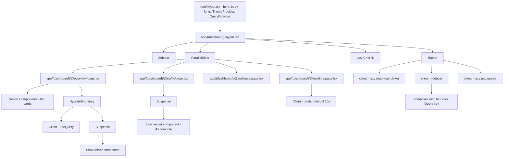
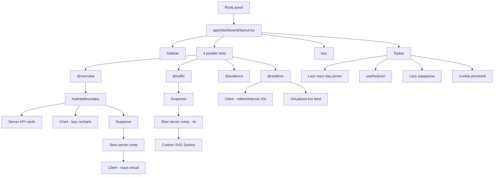
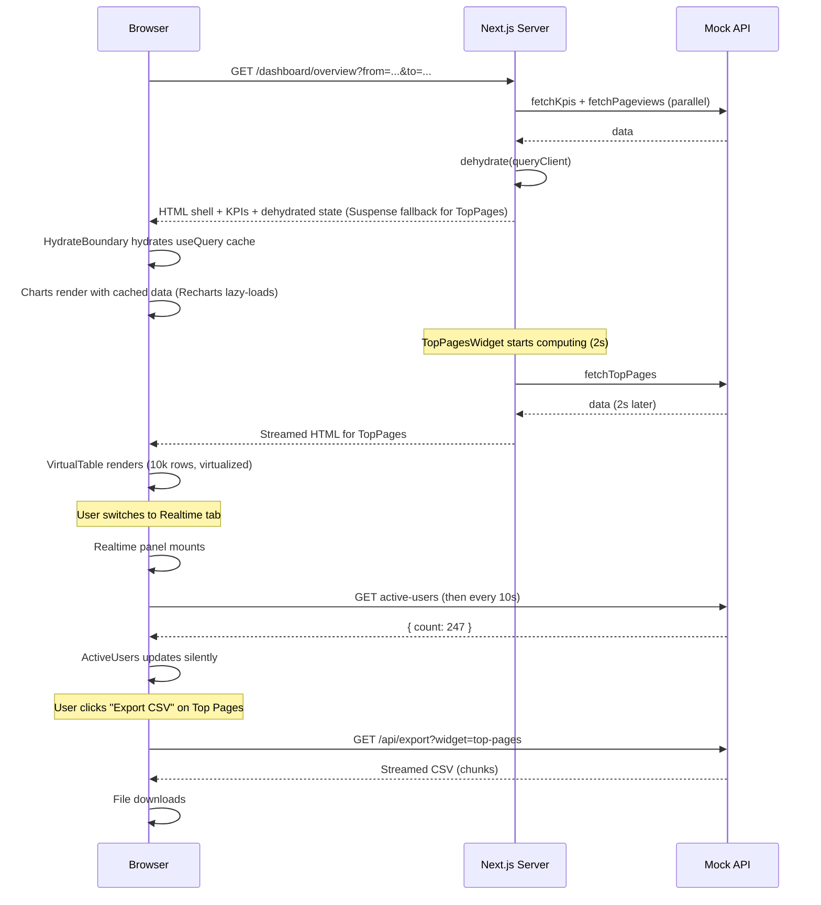

# 5.13 Analytics Dashboard

> The capstone. A Google Analytics-style dashboard with traffic sources, pageviews, user flows, real-time data, custom date ranges, and a dozen interactive widgets. This project reinforces *everything* in the vault: Next.js App Router (parallel routes for multi-panel layouts, layouts for the shell, streaming with Suspense for slow widgets, server components for initial data fetch, client components for interactive charts, server actions for saving dashboard configurations), React (compound components for charts, custom hooks for data fetching with TanStack Query, performance with `useMemo`/`React.memo` for large datasets, virtualized tables for long lists), Tailwind (responsive dashboard layouts, dark mode via class strategy), accessibility (charts must have accessible alternatives — `<details>` tables, `aria-label` on SVG containers, keyboard navigation), and performance (code-split chart libraries via `next/dynamic`, lazy-load the command palette, virtualize 10k-row tables). If you can build this, you can build any frontend.

## 5.13.1 Project Objective

By the end of this project you should be able to:

1. Architect a Next.js App Router dashboard with parallel routes for the four main sections (`@overview`, `@traffic`, `@audience`, `@realtime`), a shared layout for the sidebar + topbar + command palette, and route groups for `(dashboard)` vs `(settings)`.
2. Stream slow widgets with `<Suspense>`: the "User flow" Sankey diagram takes 4s to compute server-side; the "Top pages" table takes 2s for a 90-day range; both stream in independently while the rest of the dashboard is interactive.
3. Build compound chart components: `<Chart>`, `<Chart.Header>`, `<Chart.Body>`, `<Chart.Legend>`, `<Chart.Tooltip>` — a single composable API for line, bar, area, pie, and composed charts. All charts accept the same `data` shape and the same color tokens.
4. Use TanStack Query for client-side data refresh: server component fetches initial data and dehydrates; client components refetch on filter change; `refetchInterval: 10000` for the real-time panel.
5. Build a custom date range picker with calendar UI (`react-day-picker`), presets (Today, Yesterday, Last 7d, Last 30d, This month, Last month, Custom), and URL-synced state (`?from=2026-06-01&to=2026-06-27`).
6. Build a filter system: dimension filters (Country, Device, Browser, Source), comparison mode (compare to previous period), and a "segment" builder (e.g., "Mobile users from US who visited /pricing"). Filters compose into a single TanStack Query key.
7. Implement a real-time panel that updates every 10s via `refetchInterval`: active users right now, top active pages, traffic source breakdown (pie), and a live event feed (virtualized list).
8. Build a virtualized table for "Top pages" (10k rows possible with a wide date range): `@tanstack/react-virtual` for rows, sticky header, sortable columns, per-column filters, and row expansion (click a row to see its traffic breakdown).
9. Build a user flow Sankey diagram (custom SVG, not a library — to demonstrate SVG mastery) showing entry  -->  page sequence  -->  exit. Hover a node to highlight its edges.
10. Add dark mode (class strategy, cookie-persisted, server-rendered — no FOUC), keyboard navigation for every interactive element, and accessible alternatives for every chart (`<details>` with a data table).
11. Code-split chart libraries: Recharts is ~95 KB gzipped; the Sankey is custom. Lazy-load Recharts via `next/dynamic` so the initial bundle stays small. Lazy-load the command palette (`cmdk`), the calendar (`react-day-picker`), and the export library (`papaparse`).
12. Add a command palette (`Cmd+K`): "Go to Overview", "Go to Realtime", "Refresh", "Export CSV", "Toggle dark mode", "Set date range to Last 7 days", "Compare to previous period".
13. Save dashboard configurations (pinned widgets, default date range, custom segments) via server actions with optimistic updates and `revalidatePath`.
14. Add CSV/PDF export: CSV via Route Handler streaming; PDF via `@react-pdf/renderer` (lazy-loaded).
15. Pass a full axe accessibility audit, a Lighthouse Performance audit (≥ 90), and a Lighthouse SEO audit (≥ 95).

## 5.13.2 Reinforces Concepts From

- [[4.1 App Router Foundations]] — the `app/` directory, file conventions.
- [[4.2 Routing, Layouts, and Templates]] — parallel routes, route groups, layouts, intercepted routes for the row-detail drawer.
- [[4.3 Server and Client Components]] — server for initial fetch and Sankey compute; client for charts and filters.
- [[4.4 Rendering Strategies]] — static for the shell, dynamic for the data, streaming for slow widgets.
- [[4.5 Data Fetching]] — `fetch` with `next.revalidate`, `cache()` for memoization, parallel fetching.
- [[4.6 Caching and Revalidation]] — `revalidateTag('analytics')`, `revalidatePath`.
- [[4.7 Server Actions and Forms]] — save config, save segment, save pinned widgets.
- [[4.8 Route Handlers]] — CSV export endpoint, real-time SSE endpoint (optional stretch).
- [[4.9 Loading UI, Error Pages, and Streaming]] — `loading.tsx`, `error.tsx`, `<Suspense>` per widget.
- [[4.10 Metadata and SEO]] — `title.template` for tab titles, `metadataBase`.
- [[4.11 Images, Fonts, and Optimization]] — `next/font` (Inter), `next/image` for any logos.
- [[4.12 Middleware (Practical Usage Only)]] — optional: A/B test two dashboard layouts.
- [[4.13 Project Organization and Performance]] — feature-based folders, code-splitting, bundle analyzer.
- [[3.6 Hooks (Built-In)]] — `useState`, `useMemo`, `useCallback`, `useDeferredValue`, `useOptimistic`, `useSyncExternalStore`.
- [[3.7 Custom Hooks]] — `useAnalyticsQuery`, `useRealtimeFeed`, `useDateRange`, `useFilters`.
- [[3.8 Effects and Side Effects]] — `refetchInterval`, `useEffect` for the Sankey hover state.
- [[3.9 Context and Reducers]] — the filter state as a reducer (multiple interrelated slices).
- [[3.10 Composition and Patterns]] — compound chart components.
- [[3.11 Performance Optimization]] — `React.memo` for chart components, `useDeferredValue` for filter inputs, virtualization for 10k-row tables.
- [[3.12 Suspense, Lazy Loading, and Code Splitting]] — `next/dynamic` for Recharts, lazy command palette, lazy calendar.
- [[3.13 Error Boundaries and Debugging]] — per-widget error boundaries.
- [[3.14 Reusable Component Design]] — the chart API, the filter chip API, the table API.
- [[3.15 Project Architecture and Folder Organization]] — feature-based folders.
- [[3.16 API Integration and Data Fetching]] — TanStack Query hydration.
- [[2.3 Responsive Utilities and Dark Mode]] — responsive grid, class-strategy dark mode.
- [[2.5 Layout Patterns in Tailwind]] — the dashboard grid.
- [[1.8 Variables, Functions, and Calculations]] — CSS variables for chart color tokens.
- [[1.11 Accessibility in CSS]] — focus rings, `:focus-visible`, reduced motion.

## 5.13.3 Requirements

### 5.13.3.1 Functional Requirements

1. **Layout shell**: persistent sidebar (240 px) with the four sections + Settings; topbar (60 px) with the date range picker, filter bar, compare toggle, refresh button, save view button, export menu, dark mode toggle, and the `Cmd+K` palette trigger; main content area filling the rest.
2. **Overview tab** (`@overview`): 4 KPI cards (Pageviews, Unique Users, Bounce Rate, Avg. Session Duration) with sparklines and trend arrows; a large pageviews-over-time area chart; a traffic sources pie; a top-10 pages table; a world map of users by country (custom SVG).
3. **Traffic tab** (`@traffic`): a sources breakdown (Direct, Organic, Referral, Social, Email, Paid) with stacked bar chart; a referrals table (sortable, paginated); a campaigns table; a Sankey user-flow diagram (entry page  -->  next page  -->  exit page).
4. **Audience tab** (`@audience`): a devices breakdown (pie); a browsers breakdown (bar); a countries table (virtualized, 200+ rows); an operating systems breakdown; a "new vs returning" donut.
5. **Realtime tab** (`@realtime`): active users right now (large number, pulses every 10s); top active pages (live list); traffic source breakdown (pie, live); a live event feed (virtualized, appends new events every 2s, capped at 500).
6. **Date range picker**: a button showing the current range; clicking opens a calendar (lazy `react-day-picker`); presets on the left; custom range selection on the right; selecting updates the URL.
7. **Filter bar**: dimension filter chips (Country: US, Device: Mobile); clicking a chip opens a dropdown to remove/change; "Add filter" button opens a filter builder modal.
8. **Compare mode**: a toggle that adds a "previous period" overlay to all charts (dashed line for previous, solid for current). The comparison is in the URL (`?compare=true`).
9. **Top pages table**: virtualized, sortable columns (Page, Pageviews, Unique, Avg. Time, Bounce Rate), per-column filter (text input), row expansion (click to see traffic breakdown chart for that page).
10. **Sankey diagram**: custom SVG. Nodes are pages; edges are user flows (entry  -->  page  -->  exit). Edge width = flow volume. Hover a node to highlight its edges; click to filter the dashboard to that flow.
11. **Save view**: the user adjusts filters + date range, clicks "Save view", names it, and it appears in a "Views" dropdown. Server action persists.
12. **Export**: per-widget CSV export (`/api/export?widget=top-pages&...`); full-dashboard PDF export (lazy `@react-pdf/renderer`).
13. **Command palette** (`Cmd+K`): navigation, refresh, export, theme toggle, date range presets, compare toggle.
14. **Dark mode**: cookie-persisted, server-rendered (no FOUC), toggle in topbar.
15. **Accessibility**: charts have `<details>` data-table alternatives; SVG charts have `role="img"` and `aria-label`; the table is keyboard-navigable; the command palette traps focus; the date picker has full keyboard support.

### 5.13.3.2 Non-Functional Requirements

| Requirement | Target |
|---|---|
| First Contentful Paint (shell) | < 1.0 s |
| Time to Interactive (filters usable) | < 2.0 s |
| Slow widget stream-in (Sankey) | < 4 s (with skeleton) |
| Realtime panel refresh | 10s interval, < 200 ms render |
| Top pages table (10k rows) scroll | 60 fps |
| Initial JS bundle (gzipped) | < 150 KB |
| Lighthouse Performance | ≥ 90 |
| Lighthouse Accessibility | ≥ 95 |
| Lighthouse SEO | ≥ 95 |
| Memory after 1 hour with realtime on | flat |

### 5.13.3.3 Acceptance Criteria

- The shell (sidebar, topbar, KPI cards) renders in < 1.0 s; charts hydrate from TanStack Query's dehydrated state with no loading flash.
- The Sankey diagram shows a skeleton for ~4 s while the server computes the flow data; the rest of the Traffic tab is interactive during that time (each widget has its own Suspense boundary).
- Switching tabs does NOT remount the sidebar/topbar (parallel routes win). Filter state in the URL persists across tab switches.
- The realtime panel's "Active users" number updates every 10 s; the live event feed appends new events every 2 s; the feed is virtualized and capped at 500 events (oldest evicted).
- The top pages table with 10,000 rows scrolls at 60 fps. Sorting by Pageviews re-sorts in < 50 ms (`useMemo`). Typing in a per-column filter uses `useDeferredValue` so the table doesn't block typing.
- The Sankey diagram's edges highlight on node hover; clicking a node filters the rest of the dashboard to that flow.
- The command palette (`Cmd+K`) opens, fuzzy-searches actions, executes "Go to Realtime" by switching tabs, "Toggle dark mode" by setting the cookie and re-rendering.
- Exporting the top-pages table as CSV downloads `top-pages-2026-06-01-to-2026-06-27.csv` with the correct data.
- Lighthouse Performance ≥ 90; Accessibility ≥ 95; SEO ≥ 95. The chart libraries (Recharts) are NOT in the initial bundle (check with `@next/bundle-analyzer`).
- The dashboard works on mobile: sidebar collapses to a drawer; the chart grid reflows to 1 column; the table scrolls horizontally.

## 5.13.4 Recommended Architecture



### 5.13.4.1 Why So Many Suspense Boundaries?

A dashboard has widgets with wildly different latencies: KPIs are fast (< 50 ms), the top-pages table for a 90-day range is slow (~2 s), the Sankey is very slow (~4 s). One Suspense boundary wrapping the whole page means the user sees nothing for 4 s. Per-widget Suspense means the KPIs render instantly, the table streams in at 2 s, the Sankey at 4 s — the user is engaged the whole time.

The rule: every async server component that might take > 500 ms gets its own Suspense boundary with a skeleton fallback.

> [!tip] The skeleton fallback should match the shape of the real widget (a gray rectangle where the chart will go, gray lines for the table rows). This avoids Cumulative Layout Shift (CLS) when the real content streams in.

### 5.13.4.2 Why Compound Chart Components?

Ten different chart components (`LineChart`, `BarChart`, ...) each with their own props is a maintenance nightmare. A compound API (`<Chart type="line" data={data}>...<Chart.Header/>...<Chart.Legend/>...</Chart>`) standardizes the look-and-feel and lets you swap chart types by changing one prop. The compound pattern also lets you compose: `<Chart type="composed"><Chart.Series type="bar" /><Chart.Series type="line" /></Chart>` for a bar+line chart.

### 5.13.4.3 Why Code-Split Chart Libraries?

Recharts is ~95 KB gzipped. Bundled into the initial chunk, it bloats TTI by ~300 ms on a 4G connection. Code-splitting via `next/dynamic(() => import('recharts'), { ssr: false })` means Recharts loads only when the first chart renders — after the shell is interactive. The Sankey is custom SVG (no library) because (a) it's a teaching exercise and (b) Sankey libraries are heavy and inflexible.

> [!warning] `next/dynamic` with `ssr: false` is mandatory for Recharts — it relies on `ResizeObserver` and DOM measurement, which don't exist on the server. Without `ssr: false`, you'll get hydration errors.

### 5.13.4.4 Why Custom Sankey?

Off-the-shelf Sankey libraries (e.g., `react-sankey` or `d3-sankey`) are 30-50 KB and constrain the visual design. A custom SVG Sankey is ~200 lines, gives you full control over hover/click, and demonstrates the SVG mastery that this vault's CSS chapter builds toward. For a production app, evaluate the trade-off honestly — but for the capstone, custom is the right call.

> [!danger] If you ship this dashboard to production with a Sankey that has no accessible alternative, you have failed accessibility. SVG diagrams are invisible to screen readers. Always pair the Sankey with a `<details>` containing a table of the top flows. The same applies to the world map.

## 5.13.5 File Structure

```text
analytics-dashboard/
  - app/
      - layout.tsx                          # root
      - globals.css
      - (dashboard)/
          - layout.tsx                      # sidebar + topbar + palette
          - dashboard/
              - page.tsx                    # redirect to /dashboard/overview
          - @overview/
              - page.tsx                    # server, hydrate
              - loading.tsx
              - error.tsx
              - top-pages-widget.tsx        # streamed server component
          - @traffic/
              - page.tsx
              - loading.tsx
              - referrals-table.tsx
              - sankey-widget.tsx           # streamed server component
          - @audience/
              - page.tsx
              - countries-table.tsx         # streamed, virtualized
          - @realtime/
              - page.tsx                    # client, refetchInterval
          - default.tsx
      - (settings)/
          - settings/
              - page.tsx                    # config form (server action)
          - segments/
          - page.tsx
      - api/
          - export/route.ts                 # CSV streaming
          - realtime/route.ts               # SSE (stretch)
      - actions/
          - save-view.ts
          - save-config.ts
          - save-segment.ts
      - sitemap.ts
      - robots.ts
  - components/
      - layout/
          - Sidebar.tsx
          - Topbar.tsx
          - DateRangePicker.tsx             # lazy react-day-picker
          - FilterBar.tsx
          - FilterChip.tsx
          - ExportMenu.tsx
      - charts/
          - Chart.tsx                       # compound, lazy recharts
          - ChartCard.tsx                   # compound
          - Sparkline.tsx                   # custom SVG
          - Sankey.tsx                      # custom SVG
          - WorldMap.tsx                    # custom SVG
          - colors.ts                       # CSS-var-backed tokens
      - tables/
          - VirtualTable.tsx                # @tanstack/react-virtual
          - TopPagesTable.tsx
          - ReferralsTable.tsx
      - kpi/
          - KpiCard.tsx
      - realtime/
          - ActiveUsers.tsx
          - LiveEventFeed.tsx               # virtualized
          - TopActivePages.tsx
      - command-palette/
          - CommandPalette.tsx              # lazy
      - ui/
      - Button.tsx
      - Skeleton.tsx
      - Toast.tsx
      - Modal.tsx
  - hooks/
      - useAnalyticsQuery.ts                # TanStack Query wrapper
      - useDateRange.ts                     # URL-synced
      - useFilters.ts                       # reducer
      - useRealtimeFeed.ts
  - lib/
      - api.ts
      - queries.ts
      - mock-data.ts                        # generates 90 days of traffic
      - sankey-layout.ts                    # node/edge computation
      - types.ts
  - providers/
      - QueryProvider.tsx
      - ThemeProvider.tsx
      - ToastProvider.tsx
  - store/
      - dashboard-config.ts                # Zustand, client-only prefs
  - next.config.js
  - tailwind.config.ts
  - tsconfig.json
```

## 5.13.6 Step-by-Step Build Order

1. **Scaffold** Next.js (App Router) + TypeScript + Tailwind. Install `@tanstack/react-query`, `@tanstack/react-virtual`, `react-day-picker`, `cmdk`, `papaparse`, `zod`, `date-fns`.
2. **Configure `next.config.js`** — enable `experimental.typedRoutes` if desired; bundle analyzer (`@next/bundle-analyzer`).
3. **Seed mock data** — `lib/mock-data.ts` generates 90 days of traffic: 1M events across 500 pages, 200 countries, 5 devices, 10 browsers. Pre-compute aggregates.
4. **Build the root layout** — fonts (`next/font/google` Inter), `metadataBase`, default metadata, `QueryProvider` (client), `ThemeProvider` (cookie-persisted).
5. **Build the dashboard layout** — sidebar, topbar, command palette root (lazy). Render `{children}` and the four parallel slots.
6. **Set up parallel routes** — `@overview/page.tsx`, `@traffic/page.tsx`, `@audience/page.tsx`, `@realtime/page.tsx`, plus `default.tsx` returning null.
7. **Build the KPI cards** (server) — fetch aggregates, render with Sparkline (custom SVG).
8. **Build the compound Chart component** — wraps Recharts (lazy via `next/dynamic`), supports `type="line" | "bar" | "area" | "pie" | "composed"`. Standardize the data shape and the color tokens (read from CSS variables for dark mode).
9. **Build the date range picker** — lazy `react-day-picker`, presets, URL-synced state.
10. **Build the filter bar** — `useReducer` for filter state (Country, Device, Browser, Source). Each filter is a chip with a remove button. "Add filter" opens a modal.
11. **Build the overview page** — server component fetches KPIs and chart data, dehydrates, wraps charts in `<HydrateBoundary>`. Wrap the top-pages widget in `<Suspense>`.
12. **Build the top-pages widget** — slow server component (mock 2s). Returns a `<TopPagesTable>` (client, virtualized).
13. **Build the virtualized table** — `@tanstack/react-virtual` for rows, sticky header, sortable columns, per-column filters with `useDeferredValue`, row expansion.
14. **Build the Sankey widget** — slow server component (mock 4s). Computes the node/edge layout via `lib/sankey-layout.ts`. Renders a custom SVG Sankey (client component for hover/click).
15. **Build the realtime panel** — client component with `useQuery({ refetchInterval: 10000 })`. Active users, top active pages, source breakdown pie, live event feed (virtualized, capped at 500).
16. **Build the world map** — custom SVG with country paths; color intensity by user count. Hover for tooltip.
17. **Build the save-view / save-config server actions** — `useActionState`, optimistic update, `revalidatePath`.
18. **Build the export Route Handler** — `/api/export?widget=top-pages&from=...&to=...` streams a CSV. Use `ReadableStream` for large exports.
19. **Build the command palette** — `cmdk`-based, lazy-loaded. Actions: navigate, refresh, export, theme, date presets, compare toggle.
20. **Add dark mode** — cookie set via a server action, read in `layout.tsx`, applied on `<html>` class. No FOUC.
21. **Add accessibility** — `<details>` data tables under every chart, `role="img"` + `aria-label` on SVGs, keyboard nav for the table, focus trap for the palette and modals.
22. **Run the bundle analyzer** — verify Recharts, papaparse, react-day-picker, cmdk are NOT in the initial bundle. Run Lighthouse. Iterate until Performance ≥ 90, A11y ≥ 95, SEO ≥ 95.

## 5.13.7 Code Walkthrough

### 5.13.7.1 The Dashboard Layout with Parallel Routes

```tsx
// app/(dashboard)/layout.tsx
import { Sidebar } from '@/components/layout/Sidebar';
import { Topbar } from '@/components/layout/Topbar';
import { CommandPaletteRoot } from '@/components/command-palette/CommandPalette';
import { cookies } from 'next/headers';

export default async function DashboardLayout({
  children, overview, traffic, audience, realtime,
}: {
  children: React.ReactNode;
  overview: React.ReactNode;
  traffic: React.ReactNode;
  audience: React.ReactNode;
  realtime: React.ReactNode;
}) {
  const theme = (await cookies()).get('theme')?.value ?? 'light';
  return (
    <div className={`flex h-screen ${theme === 'dark' ? 'dark' : ''}`}>
      <Sidebar />
      <div className="flex flex-1 flex-col overflow-hidden">
        <Topbar />
        <main className="flex-1 overflow-auto p-6">
          {children}
          {overview}
          {traffic}
          {audience}
          {realtime}
        </main>
      </div>
      <CommandPaletteRoot />
    </div>
  );
}
```

### 5.13.7.2 Streaming with Multiple Suspense Boundaries

```tsx
// app/(dashboard)/@overview/page.tsx
import { dehydrate, HydrateBoundary, QueryClient } from '@tanstack/react-query';
import { Suspense } from 'react';
import { KpiCard } from '@/components/kpi/KpiCard';
import { ChartCard } from '@/components/charts/ChartCard';
import { Chart } from '@/components/charts/Chart';
import { TopPagesWidgetSkeleton, TopPagesWidget } from './top-pages-widget';
import { fetchKpis, fetchPageviews } from '@/lib/api';

export default async function OverviewPage({ searchParams }: { searchParams: SearchParams }) {
  const { from, to, filters } = parseParams(searchParams);
  const qc = new QueryClient();
  await Promise.all([
    qc.prefetchQuery({ queryKey: ['kpis', from, to, filters], queryFn: () => fetchKpis(from, to, filters) }),
    qc.prefetchQuery({ queryKey: ['pageviews', from, to, filters], queryFn: () => fetchPageviews(from, to, filters) }),
  ]);
  const kpis = qc.getQueryData(['kpis', from, to, filters]);

  return (
    <HydrateBoundary state={dehydrate(qc)}>
      <div className="grid grid-cols-1 gap-4 md:grid-cols-2 lg:grid-cols-4">
        {kpis.map((k) => <KpiCard key={k.label} {...k} />)}
      </div>
      <div className="mt-6 grid grid-cols-1 gap-4 lg:grid-cols-3">
        <ChartCard title="Pageviews" className="lg:col-span-2">
          <Chart type="area" queryKey={['pageviews', from, to, filters]} />
        </ChartCard>
        <ChartCard title="Traffic Sources">
          <Chart type="pie" queryKey={['sources', from, to, filters]} />
        </ChartCard>
      </div>
      <div className="mt-6">
        <Suspense fallback={<TopPagesWidgetSkeleton />}>
          {/* Slow server component — streams in independently */}
          <TopPagesWidget from={from} to={to} filters={filters} />
        </Suspense>
      </div>
    </HydrateBoundary>
  );
}
```

### 5.13.7.3 The Compound Chart Component

```tsx
// components/charts/Chart.tsx
'use client';
import dynamic from 'next/dynamic';
import { useQuery } from '@tanstack/react-query';
import { ReactNode, useMemo } from 'react';

// Lazy-load Recharts — keeps it out of the initial bundle
const Recharts = dynamic(() => import('recharts'), { ssr: false });

type ChartType = 'line' | 'bar' | 'area' | 'pie' | 'composed';

type ChartProps = {
  type: ChartType;
  queryKey: readonly unknown[];
  queryFn: () => Promise<any[]>;
  xKey: string;
  yKeys?: { key: string; color?: string; type?: 'line' | 'bar' }[];
};

export function Chart({ type, queryKey, queryFn, xKey, yKeys }: ChartProps) {
  const { data, isLoading } = useQuery({ queryKey, queryFn });
  if (isLoading || !Recharts) return <Skeleton />;
  const { LineChart, Line, BarChart, Bar, AreaChart, Area, PieChart, Pie, Cell,
    XAxis, YAxis, CartesianGrid, Tooltip, ResponsiveContainer, ComposedChart } = await Recharts;

  const colors = useChartColors(); // reads CSS vars

  const chart = useMemo(() => {
    switch (type) {
      case 'line':
        return (
          <LineChart data={data}>
            <CartesianGrid strokeDasharray="3 3" stroke={colors.grid} />
            <XAxis dataKey={xKey} stroke={colors.axis} />
            <YAxis stroke={colors.axis} />
            <Tooltip contentStyle={{ background: colors.tooltipBg }} />
            {yKeys?.map((y) => <Line key={y.key} dataKey={y.key} stroke={y.color ?? colors.primary} />)}
          </LineChart>
        );
      case 'composed':
        return (
          <ComposedChart data={data}>
            <CartesianGrid strokeDasharray="3 3" stroke={colors.grid} />
            <XAxis dataKey={xKey} stroke={colors.axis} />
            <YAxis stroke={colors.axis} />
            <Tooltip contentStyle={{ background: colors.tooltipBg }} />
            {yKeys?.map((y) =>
              y.type === 'bar'
                ? <Bar key={y.key} dataKey={y.key} fill={y.color ?? colors.secondary} />
                : <Line key={y.key} dataKey={y.key} stroke={y.color ?? colors.primary} />,
            )}
          </ComposedChart>
        );
      // ... other cases
    }
  }, [data, type, xKey, yKeys, colors]);

  return (
    <div role="img" aria-label={`${type} chart of ${xKey} over time`}>
      <ResponsiveContainer width="100%" height={300}>{chart}</ResponsiveContainer>
      <details className="mt-2 text-xs">
        <summary>Data table</summary>
        <table className="mt-2 w-full">
          <thead><tr><th>{xKey}</th>{yKeys?.map((y) => <th key={y.key}>{y.key}</th>)}</tr></thead>
          <tbody>
            {data?.map((row, i) => (
              <tr key={i}>
                <td>{row[xKey]}</td>
                {yKeys?.map((y) => <td key={y.key}>{row[y.key]}</td>)}
              </tr>
            ))}
          </tbody>
        </table>
      </details>
    </div>
  );
}
```

### 5.13.7.4 The Custom SVG Sankey

```tsx
// components/charts/Sankey.tsx
'use client';
import { useState, useMemo } from 'react';

type Node = { id: string; label: string; x: number; y: number; height: number };
type Edge = { source: string; target: string; value: number };

export function Sankey({ nodes, edges }: { nodes: Node[]; edges: Edge[] }) {
  const [hovered, setHovered] = useState<string | null>(null);

  const highlightedEdges = useMemo(() => {
    if (!hovered) return new Set(edges.map((e) => `${e.source}->${e.target}`));
    return new Set(
      edges
        .filter((e) => e.source === hovered || e.target === hovered)
        .map((e) => `${e.source}->${e.target}`),
    );
  }, [hovered, edges]);

  return (
    <svg role="img" aria-label="User flow Sankey diagram" className="w-full" viewBox="0 0 800 400">
      {edges.map((e) => {
        const source = nodes.find((n) => n.id === e.source)!;
        const target = nodes.find((n) => n.id === e.target)!;
        const path = sankeyPath(source, target, e.value);
        const id = `${e.source}->${e.target}`;
        const isHighlight = highlightedEdges.has(id);
        return (
          <path
            key={id}
            d={path}
            fill="none"
            stroke={isHighlight ? 'var(--accent)' : 'var(--grid)'}
            strokeWidth={Math.max(1, e.value / 100)}
            strokeOpacity={isHighlight ? 0.8 : 0.3}
          />
        );
      })}
      {nodes.map((n) => (
        <g
          key={n.id}
          onMouseEnter={() => setHovered(n.id)}
          onMouseLeave={() => setHovered(null)}
          onClick={() => onNodeClick?.(n.id)}
          className="cursor-pointer"
        >
          <rect x={n.x} y={n.y} width={20} height={n.height} fill="var(--primary)" />
          <text x={n.x + 25} y={n.y + n.height / 2} fontSize="11" fill="currentColor">
            {n.label}
          </text>
        </g>
      ))}
    </svg>
  );
}

function sankeyPath(source: Node, target: Node, value: number): string {
  const sx = source.x + 20;
  const sy = source.y + source.height / 2;
  const tx = target.x;
  const ty = target.y + target.height / 2;
  const mx = (sx + tx) / 2;
  return `M ${sx} ${sy} C ${mx} ${sy}, ${mx} ${ty}, ${tx} ${ty}`;
}
```

### 5.13.7.5 The Virtualized Table

```tsx
// components/tables/VirtualTable.tsx
'use client';
import { useVirtualizer } from '@tanstack/react-virtual';
import { useDeferredValue, useMemo, useRef, useState } from 'react';

export function TopPagesTable({ rows }: { rows: Row[] }) {
  const [sort, setSort] = useState<{ key: string; dir: 'asc' | 'desc' }>({ key: 'pageviews', dir: 'desc' });
  const [filter, setFilter] = useState('');
  const deferredFilter = useDeferredValue(filter);
  const [expanded, setExpanded] = useState<string | null>(null);

  const sorted = useMemo(() => {
    const filtered = deferredFilter
      ? rows.filter((r) => r.path.toLowerCase().includes(deferredFilter.toLowerCase()))
      : rows;
    return [...filtered].sort((a, b) => {
      const av = a[sort.key], bv = b[sort.key];
      return sort.dir === 'asc' ? av - bv : bv - av;
    });
  }, [rows, sort, deferredFilter]);

  const parentRef = useRef<HTMLDivElement>(null);
  const v = useVirtualizer({
    count: sorted.length,
    getScrollElement: () => parentRef.current,
    estimateSize: () => 40,
    overscan: 10,
  });

  return (
    <div className="rounded-lg border">
      <div className="flex items-center gap-2 border-b p-2">
        <input
          value={filter}
          onChange={(e) => setFilter(e.target.value)}
          placeholder="Filter pages..."
          className="rounded border px-2 py-1 text-sm"
        />
      </div>
      <div ref={parentRef} className="h-[500px] overflow-auto">
        <table className="w-full text-sm">
          <thead className="sticky top-0 bg-zinc-100 dark:bg-zinc-800">
            <tr>
              <Th label="Path" sortKey="path" sort={sort} onSort={setSort} />
              <Th label="Pageviews" sortKey="pageviews" sort={sort} onSort={setSort} align="right" />
              <Th label="Unique" sortKey="unique" sort={sort} onSort={setSort} align="right" />
              <Th label="Avg. Time" sortKey="avgTime" sort={sort} onSort={setSort} align="right" />
              <Th label="Bounce" sortKey="bounceRate" sort={sort} onSort={setSort} align="right" />
            </tr>
          </thead>
          <tbody style={{ height: `${v.getTotalSize()}px` }} className="relative">
            {v.getVirtualItems().map((item) => {
              const row = sorted[item.index];
              return (
                <>
                  <tr
                    key={row.path}
                    onClick={() => setExpanded(expanded === row.path ? null : row.path)}
                    className="cursor-pointer hover:bg-zinc-50 dark:hover:bg-zinc-800/50"
                    style={{ position: 'absolute', top: 0, transform: `translateY(${item.start}px)`, height: item.size, width: '100%' }}
                  >
                    <td className="px-2 py-1">{row.path}</td>
                    <td className="px-2 py-1 text-right">{row.pageviews.toLocaleString()}</td>
                    <td className="px-2 py-1 text-right">{row.unique.toLocaleString()}</td>
                    <td className="px-2 py-1 text-right">{formatTime(row.avgTime)}</td>
                    <td className="px-2 py-1 text-right">{(row.bounceRate * 100).toFixed(1)}%</td>
                  </tr>
                  {expanded === row.path && (
                    <tr style={{ position: 'absolute', top: item.start + item.size, left: 0, right: 0 }}>
                      <td colSpan={5} className="bg-zinc-50 p-4 dark:bg-zinc-800/50">
                        <Chart type="line" queryKey={['page-detail', row.path]} />
                      </td>
                    </tr>
                  )}
                </>
              );
            })}
          </tbody>
        </table>
      </div>
    </div>
  );
}
```

### 5.13.7.6 The Realtime Panel

```tsx
// components/realtime/ActiveUsers.tsx
'use client';
import { useQuery } from '@tanstack/react-query';

export function ActiveUsers() {
  const { data } = useQuery({
    queryKey: ['realtime', 'active-users'],
    queryFn: fetchActiveUsers,
    refetchInterval: 10000, // poll every 10s
    placeholderData: (prev) => prev, // keep previous data while refetching
  });
  return (
    <div className="rounded-lg border p-6 text-center">
      <div className="text-5xl font-bold tabular-nums" aria-live="polite">
        {data?.count ?? '—'}
      </div>
      <div className="mt-2 text-sm text-zinc-500">active users right now</div>
    </div>
  );
}
```

### 5.13.7.7 The Lazy Command Palette

```tsx
// components/command-palette/CommandPalette.tsx
'use client';
import dynamic from 'next/dynamic';
import { useState } from 'react';
import { useHotkeys } from '@/hooks/useHotkeys';

const CommandPaletteImpl = dynamic(() => import('./CommandPaletteImpl'), { ssr: false });

export function CommandPaletteRoot() {
  const [open, setOpen] = useState(false);
  useHotkeys({ 'cmd+k': () => setOpen(true) });
  if (!open) return null;
  return <CommandPaletteImpl open={open} onOpenChange={setOpen} />;
}
```

### 5.13.7.8 The Streaming CSV Export

```ts
// app/api/export/route.ts
import { NextRequest } from 'next/server';

export async function GET(req: NextRequest) {
  const widget = req.nextUrl.searchParams.get('widget') ?? 'top-pages';
  const from = req.nextUrl.searchParams.get('from')!;
  const to = req.nextUrl.searchParams.get('to')!;

  const stream = new ReadableStream({
    async start(controller) {
      const encoder = new TextEncoder();
      controller.enqueue(encoder.encode('path,pageviews,unique,avgTime,bounceRate\n'));
      for await (const row of fetchTopPagesStream(from, to)) {
        controller.enqueue(encoder.encode(`${row.path},${row.pageviews},${row.unique},${row.avgTime},${row.bounceRate}\n`));
      }
      controller.close();
    },
  });

  return new Response(stream, {
    headers: {
      'Content-Type': 'text/csv',
      'Content-Disposition': `attachment; filename="${widget}-${from}-to-${to}.csv"`,
    },
  });
}
```

## 5.13.8 Mermaid Diagrams

### 5.13.8.1 Full Component and Routing Tree



### 5.13.8.2 Streaming + Hydration + Realtime Sequence



## 5.13.9 Common Pitfalls

1. **One Suspense boundary for the whole page.** A 4s Sankey blocks the entire dashboard. Wrap each slow widget in its own Suspense with a skeleton fallback — the rule is "any async server component that might take > 500 ms gets its own boundary".
2. **Recharts in the initial bundle.** Without `next/dynamic`, Recharts (~95 KB gzipped) ships to every visitor. Lazy-load it: `dynamic(() => import('recharts'), { ssr: false })`.
3. **Cartesian chart with no `ResponsiveContainer`.** Recharts components have a default width of 0; without `ResponsiveContainer`, the chart is invisible. Always wrap.
4. **TanStack Query cache key that doesn't include all dependencies.** Forgetting to include `filters` in the key means changing filters returns stale data. The key must be `[queryName, from, to, filters, compare]` — every dependency.
5. **`refetchInterval` that spams the API.** 10s polling for realtime is fine; 1s polling for the same is 60 requests/minute per user. For high-frequency data, use SSE or WebSocket.
6. **Virtualized table without absolute positioning.** `@tanstack/react-virtual` requires the rows to be absolutely positioned (or use the `display: grid` trick). Without it, the browser tries to render all 10k rows.
7. **No `useDeferredValue` on filter inputs.** Typing in a per-column filter triggers a re-sort of 10k rows on every keystroke — 200 ms of jank per key. `useDeferredValue` lets the typing stay responsive; the sort happens in the background.
8. **Dark mode that flashes.** If the theme is read client-side from localStorage, the first paint is light then switches. Read the theme cookie server-side in `layout.tsx` and apply the `dark` class on `<html>` before paint.
9. **SVG charts with no accessible alternative.** A `<svg>` is invisible to screen readers. Add `role="img"` and `aria-label`, AND a `<details>` with a data table — the table is also useful for sighted users who want exact numbers.
10. **Server action without `revalidatePath`.** After saving a view, the sidebar's "Views" dropdown is stale. `revalidatePath('/dashboard')` refreshes the server-rendered shell.
11. **Command palette that doesn't return focus.** When the palette closes, focus should return to the element that opened it. Without this, keyboard users are stranded. Use `finalFocusRef` (or manually restore focus in `onOpenChange`).
12. **Realtime feed that grows unbounded.** A live event feed that appends every 2s for an hour is 1,800 events — the DOM explodes. Cap at 500 (or whatever your virtualizer can handle) and evict the oldest.
13. **CSV export that buffers everything.** For a 100k-row export, `Response(string)` buffers 10 MB in memory. Use a `ReadableStream` and yield rows chunk by chunk.
14. **No error boundary per widget.** A render error in the Sankey (e.g., malformed data) shouldn't blank the whole Traffic tab. Wrap each widget in its own `error.tsx` or `<ErrorBoundary>`.

## 5.13.10 Stretch Goals

1. **Real-time via SSE.** Replace `refetchInterval` polling with an EventSource connection to `/api/realtime` that pushes new events. Lower latency, lower overhead.
2. **Custom segments builder.** A visual builder: "users who [visited /pricing] AND [are from US] AND [use Mobile]". Saves as a reusable segment that can be applied to any chart.
3. **Anomaly detection.** A server-side job flags metrics that deviate > 2σ from the 30-day rolling average. Charts highlight anomalies in red with an explanation tooltip.
4. **Cohort analysis.** A retention cohort table (grid of percentages) showing what % of users from week N returned in week N+1, N+2, etc.
5. **Multi-property support.** Multiple websites under one account; a property switcher in the topbar changes all queries. Each property has its own saved views and segments.

## 5.13.11 Self-Assessment Rubric

| # | Criterion | 0 | 1 | 2 | 3 |
|---|---|---|---|---|---|
| 1 | Routing | single routes | parallel routes | + default.tsx + intercepted | + route groups + URL state everywhere |
| 2 | Streaming | none | loading.tsx | Suspense per widget | + per-widget skeletons + error.tsx |
| 3 | Data fetching | client only | server fetch | + TanStack hydration | + refetchInterval + streaming export |
| 4 | Charts | 1 chart | multiple | compound API | + custom SVG Sankey + lazy recharts |
| 5 | Tables | renders all | paginated | + sortable | + virtualized 10k + filters + expand |
| 6 | Filters/date range | local state | URL state | + presets | + compare mode + segment builder |
| 7 | Server actions | none | save only | + useActionState | + optimistic + revalidatePath |
| 8 | Performance | no code split | route split | + lazy charts | + lazy palette + lazy calendar + bundle < 150 KB |
| 9 | Accessibility | mouse only | + Tab focus | + aria-labels | + chart data tables + focus trap + keyboard nav |
| 10 | Polish | rough | dark mode | + command palette | + toasts + skeletons + saved views + export |

## 5.13.12 Related Notes

- [[4.1 App Router Foundations]]
- [[4.2 Routing, Layouts, and Templates]]
- [[4.3 Server and Client Components]]
- [[4.4 Rendering Strategies]]
- [[4.5 Data Fetching]]
- [[4.6 Caching and Revalidation]]
- [[4.7 Server Actions and Forms]]
- [[4.8 Route Handlers]]
- [[4.9 Loading UI, Error Pages, and Streaming]]
- [[4.11 Images, Fonts, and Optimization]]
- [[4.13 Project Organization and Performance]]
- [[3.6 Hooks (Built-In)]]
- [[3.10 Composition and Patterns]]
- [[3.11 Performance Optimization]]
- [[3.12 Suspense, Lazy Loading, and Code Splitting]]
- [[3.13 Error Boundaries and Debugging]]
- [[2.3 Responsive Utilities and Dark Mode]]
- [[2.5 Layout Patterns in Tailwind]]
- [[1.8 Variables, Functions, and Calculations]]
- [[1.11 Accessibility in CSS]]
- [[5.5 Admin Dashboard]] — same domain, SPA approach (no Next.js) for contrast
- [[5.11 SaaS Dashboard]] — same Next.js + parallel routes + TanStack stack, simpler scope
- [[5.9 Chat UI]] — same virtualization patterns, different domain
- [[5.6 Kanban Board]] — same `useReducer` + memoization patterns, different domain
