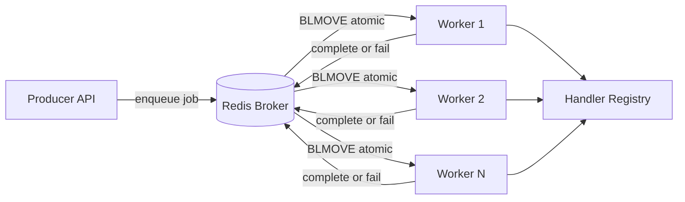
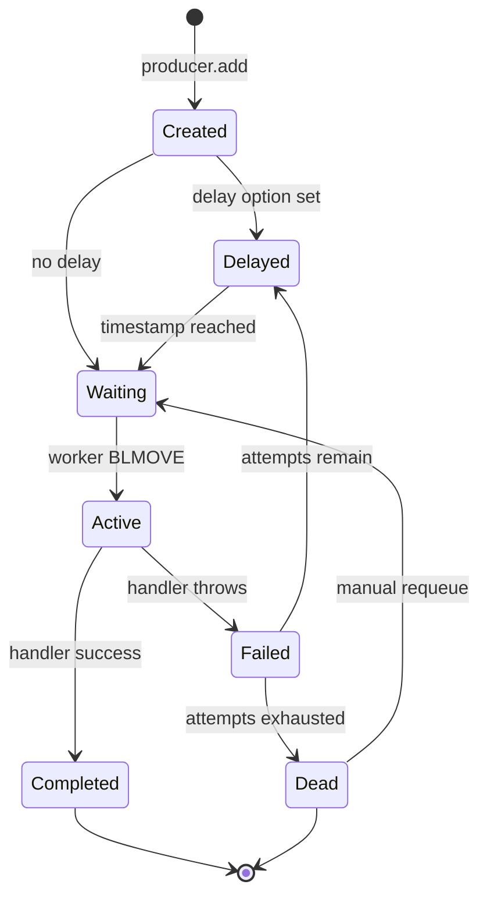

# 8.02 Distributed Task Queue

> A distributed task queue is the architectural answer to a stubborn problem: certain units of work take long enough, fail often enough, or matter enough to warrant retry that running them inline inside a request handler becomes irresponsible. Email delivery, image processing, PDF rendering, periodic data sync, machine-learning inference, third-party API calls with rate limits — these are the canonical residents of a queue. This capstone specifies, designs, and implements a Redis-backed, multi-worker, retried, prioritized, delayed, dead-lettering task queue in the spirit of BullMQ, written side by side in JavaScript and TypeScript. The note is simultaneously the project specification, the architecture document, and the code blueprint. Every component is named, every Redis key is specified, every trade-off is defended, and every major code example appears in both dialects so the builder can choose their preferred tooling without losing fidelity.

## 1. Project Overview

### 1.1 What We Are Building

A distributed task queue is a producer-consumer system in which one process (the producer) enqueues a description of work to be done, and one or more other processes (the workers) pick that work up, execute it, report the outcome, and retry on failure. The mediator between them is a durable, atomic broker — in our case, Redis. The producer never blocks on the execution of the work; the worker never needs to know who requested it. They are coupled only by the shape of the job payload and the name of the queue. This project deliberately resembles BullMQ, the most widely used Node.js task queue, because BullMQ got the design right: Redis as the broker, lists for the waiting FIFO, sorted sets for delayed and priority, hashes for per-job state, an event-driven worker loop with concurrency control, exponential backoff for retries, a dead-letter strategy for permanent failures, and a clean separation between the queue (producer side) and the worker (consumer side). The capstone scope covers: enqueueing jobs with optional priority and delay; pulling jobs off Redis with atomic move operations; executing handlers with bounded concurrency; automatic retry with exponential backoff and jitter; dead-lettering after N attempts; graceful shutdown that drains in-flight work; child-process execution for CPU-heavy handlers; idempotency keys for at-least-once safety; and a small but real test, monitoring, and deployment story.

### 1.2 Learning Outcomes

By the time the project is complete, the builder will have demonstrated operational command of: producer-consumer decoupling (why separation of producer and consumer is the single most important architectural pattern for systems that have non-trivial work); atomic Redis operations (how to use Lua scripts and MULTI/EXEC transactions so that no job is ever lost, double-processed, or left in a half-state between two Redis data structures); multi-process coordination (how to design a worker that is safe to run as many copies as you like, on as many machines as you like, with Redis as the only shared state); backpressure and concurrency control (how a worker pulls more jobs than it can immediately run, in order to keep its event loop saturated without overloading Redis with round-trips); error mitigation (how to build error boundaries around job handlers so one bad job does not kill the worker process, how to retry with exponential backoff and jitter, and how to detect poison jobs and route them to a dead-letter set); child-process isolation (when and why to fork a child process for CPU-heavy work, how to stream progress back, and how to kill the child cleanly on shutdown); and clean code and clean architecture (how to separate the queue, the worker, the Redis storage layer, and the handler registry so that each piece is independently testable and replaceable).

The note that follows is exhaustive on purpose. Read top to bottom, it gives a builder everything they need to ship the project. Read selectively, it gives an architect everything they need to defend the design choices in a review.

## 2. Architecture and System Design

### 2.1 Top-Level Architecture

The system has three primary actors and one shared data store. The **producer** is the part of the application that knows work needs to be done — a web server, a cron-style scheduler, a webhook receiver, or any other event source. Its only responsibility is to construct a job payload and atomically add it to the queue. It does not execute the job, does not wait for the result, and does not know which worker will pick the job up. The **broker** is Redis, which holds the queue's data structures (waiting list, active set, delayed and priority sorted sets, completed and failed sets, and the per-job hash). Redis is not just a transport; it is the durable source of truth for every job's state. Because Redis operations are atomic and single-threaded, multiple producers and multiple workers can interact with the same queue without locks in application code. The **worker** is a long-running Node process that loops forever: pull a job from the waiting list, move it atomically to the active set, invoke the registered handler, then move it to either the completed set or the failed set. If the handler throws, the worker decides whether to retry or to dead-letter. Workers run as many copies as needed — on one machine or across many — and Redis coordinates them by atomically handing out one job to exactly one worker at a time. The **handler registry** is the mapping from a job's `name` to the function that processes it; each worker process registers its handlers at startup, and a single worker can handle many job types.

### 2.2 The Producer-Broker-Worker Flow



The diagram shows the canonical shape: producers only ever talk to Redis; workers only ever talk to Redis and the handler registry; no producer and no worker know about each other. This is what makes the system horizontally scalable. Adding capacity is a matter of starting more workers. Adding producers is a matter of starting more producers. Redis is the only shared dependency, and Redis is very good at being a shared dependency.

### 2.3 Why Redis

Redis is the right broker for this project for four reasons. First, its data structures — lists, sorted sets, hashes — map almost perfectly to the needs of a queue: a list is a FIFO, a sorted set is a priority queue or a delayed queue, a hash is a per-job record. Second, Redis operations are atomic and single-threaded, which means we can compose primitive operations into a complex move (pop from waiting, push to active, set timestamp) without locks, by using either MULTI/EXEC transactions or Lua scripts. Third, Redis supports blocking pop operations (`BRPOPLPUSH`, `BLMOVE`), which let a worker wait for a new job without polling. Fourth, Redis is fast enough that the broker is essentially never the bottleneck: a single Redis instance can handle tens of thousands of enqueue or dequeue operations per second.

The trade-off is durability. Redis persistence — RDB snapshots and AOF logs — is asynchronous and can lose the last few seconds of writes on a hard crash. For most queue workloads this is acceptable; for workloads where it is not, the answer is Redis with synchronous replication (Redis Sentinel or Redis Cluster with the `WAIT` command) or a different broker entirely (Kafka, NATS JetStream, RabbitMQ with quorum queues). This project uses single-instance Redis with AOF persistence and acknowledges the trade-off explicitly in Section 6.

### 2.4 Worker Process Topology

A single Node process can run many workers (one per queue), and a single worker can process many job types. For CPU-heavy work, a worker can additionally fork child processes or spawn worker threads, so that the main event loop stays responsive while a child grinds through a CPU-bound task. The topology choice is per workload: one process per queue with I/O-bound handlers (the Node event loop does the work, the worker pulls the next job when the current one awaits I/O); one process per queue with a pool of child processes for CPU-heavy work (the worker dispatches to an idle child and waits for the reply, the child does the work on its own V8 isolate); many processes per machine via the cluster module or a process manager (to use multiple CPU cores for I/O-bound work, run N worker processes per machine where N is roughly the core count); and many machines (Redis coordinates them all, with atomic move operations ensuring exactly one worker gets each job).

### 2.5 Queue Namespacing

Every queue lives under a Redis key prefix. The project uses the prefix `taskq:{queueName}:` for everything in a queue. So the waiting list for the `emails` queue is `taskq:emails:waiting`, the active list is `taskq:emails:active`, and so on. This convention makes the queue self-contained (to delete a queue, delete every key starting with its prefix) and makes monitoring queries trivial. The full key schema is enumerated in Section 3.

## 3. Key Components and Modules

### 3.1 Producer API

The producer API is intentionally small. It has one essential method, `add`, which accepts a job name, a data payload, and an options object. Options cover priority, delay, attempts, backoff strategy, idempotency key, and job-specific timeouts. The producer returns a `Job` object containing the assigned id and the metadata that was persisted, so the caller can later query the job's status or result. The producer never blocks on Redis beyond the round-trip needed to write the job. It is designed to be called from request handlers, scheduled tasks, message consumers, or anywhere else that work is detected. Producers are cheap to construct and can be created per request or kept as singletons; either is fine.

### 3.2 Redis Storage Schema

Every job is stored in Redis as a hash. The hash key is `taskq:{queueName}:job:{jobId}`. The hash fields are: `id` (unique sortable identifier, ULID or UUID v7); `name` (handler name for dispatch); `data` (JSON-serialized payload); `opts` (JSON-serialized options); `priority` (integer, lower is higher priority); `delay` (Unix millisecond timestamp at which the job becomes eligible); `attemptsMade` (integer, starts at zero, incremented on each execution); `attemptsStarted` (integer, incremented at the start of each execution, used to detect stuck jobs); `createdAt`, `processedAt`, `finishedAt` (timestamps for creation, activation, and completion or permanent failure); `result` (JSON-serialized result on success); `failedReason` (JSON-serialized error on failure); and `stackTrace` (string stack trace on failure).

The queue's lifecycle data structures are: the **waiting list** (`taskq:{queueName}:waiting`, a Redis list of job ids with producers `LPUSH`-ing to the left and workers `BLMOVE`-ing from the right to the active list, giving FIFO order); the **priority sorted set** (`taskq:{queueName}:priority`, scored by priority, the worker pulls from here first when non-empty); the **delayed sorted set** (`taskq:{queueName}:delayed`, scored by the Unix millisecond eligibility timestamp, a timer periodically moves eligible jobs to the waiting list); the **active list** (`taskq:{queueName}:active`, job ids currently being processed, workers move jobs here atomically); the **completed set** (`taskq:{queueName}:completed`, scored by completion timestamp, used for status queries and cleanup); the **failed set** (`taskq:{queueName}:failed`, scored by failure timestamp); the **dead-letter set** (`taskq:{queueName}:dead`, job ids that exhausted their retries; kept separate from `failed` so operators can inspect poison jobs without scrolling through everything that ever failed once); and the **idempotency index** (`taskq:{queueName}:idem:{idempotencyKey}`, a string key whose value is the job id of the first job submitted with that key, checked by producers before enqueuing to avoid duplicates).

### 3.3 Worker Consumer

The worker is the heart of the system. It runs an asynchronous loop that performs four steps repeatedly: (1) move a job from waiting or priority to active, atomically, using a blocking pop with a timeout (the atomic move is the linchpin of correctness — it guarantees that exactly one worker picks up any given job, even if a hundred workers are waiting simultaneously); (2) dispatch the job to its handler by looking up the handler by job name in the registry (if no handler is registered, the job fails immediately and is sent to the dead-letter set); (3) await the handler's result with an optional per-job timeout (if the handler throws or times out, the worker treats it as a failure); (4) update the job's state — on success, remove from active, update the hash with the result and `finishedAt`, add to the completed set, and emit a `completed` event; on failure, consult the retry policy: if attempts remain, compute the next delay and add to the delayed sorted set, otherwise move to the dead-letter set and emit a `failed` event.

The worker also runs two background timers. The delayed-job timer periodically scans the delayed sorted set for jobs whose delay timestamp has passed and moves them to the waiting list. The stalled-job timer periodically scans the active list for jobs whose `attemptsStarted` was incremented more than a configurable staleness threshold ago without resolution; those jobs are presumed stuck (their worker probably crashed) and are returned to the waiting list for another worker to pick up.

### 3.4 Retry and Backoff Logic

The retry policy is part of the job's options. It specifies the maximum number of attempts (including the first), the backoff type (fixed, exponential, or custom), the backoff delay (the base delay in milliseconds for fixed, or the initial delay for exponential), and an optional cap on the delay. For exponential backoff, the delay on attempt N (where N starts at 1 for the first retry) is `min(cap, base * 2 ^ (N - 1))`. To avoid the thundering-herd problem — many jobs failing simultaneously and all retrying at the same moment — the delay is jittered by adding a random number of milliseconds between zero and the base delay. This spreads retries across a small window. After the maximum number of attempts is exhausted, the job is moved to the dead-letter set, where it sits until an operator inspects it, fixes the underlying cause, and either discards it or re-queues it.

### 3.5 Priority Queue

Priority is implemented with a sorted set scored by the priority integer. Lower scores mean higher priority — a job with priority 1 runs before a job with priority 5. When the worker is ready to pull the next job, it first checks the priority sorted set; if there is an entry, it pops the lowest-scoring job atomically (`ZPOPMIN`). If the priority set is empty, the worker falls back to the waiting list. The atomic move from the priority set to the active list is a Lua script: it calls `ZPOPMIN` to get the job id, then `LPUSH` to add it to active, all in one atomic Redis operation. Without the Lua script, a worker could pop from the priority set and crash before pushing to active, losing the job; with the script, the move is atomic.

### 3.6 Delayed Jobs

Delayed jobs are jobs that should not become eligible for execution until a specific time in the future. They are stored in the delayed sorted set, scored by the Unix millisecond timestamp at which they should become eligible. A worker-side timer fires every second (configurable), runs a Lua script that calls `ZRANGEBYSCORE` to find all jobs with a score less than or equal to `now`, removes them from the delayed set, and `LPUSH`es their ids onto the waiting list. Once a delayed job is on the waiting list, it is picked up by the next available worker like any other job.

### 3.7 Child Process Execution

For CPU-heavy handlers — image processing, video transcoding, large JSON parsing, cryptographic work, machine-learning inference — running the handler on the worker's main event loop would block the loop for the duration of the work and starve every other job the worker is trying to process. The solution is to offload the handler to a child process. The worker maintains a small pool of child processes (using the Node `child` `process` `fork` API, written in source as `'child\x5fprocess'` to keep the file underscore-free). When a CPU-heavy job arrives, the worker picks an idle child, sends the job data over the Node IPC channel, and awaits the child's reply. The child runs the handler in its own V8 isolate, on its own event loop, with its own memory. When the child finishes, it sends a message back with either the result or an error, and the worker resumes the awaiting handler. If the worker is shutting down, it sends a shutdown message to each child, waits for the child to exit cleanly, and only then exits itself.

The benefit is isolation: a child that crashes does not take the worker down with it. The worker detects the crash, treats it as a handler failure, retries the job (with a fresh child if needed), and continues. The cost is the overhead of spawning a child and the IPC round-trip; for short jobs, the overhead dominates, which is why child processes are only used for jobs whose handler is genuinely CPU-bound. For lighter-weight CPU work, [[3.18 Worker Threads]] can be used instead — they share memory with the parent and have lower spawn overhead, at the cost of less isolation. The architecture is the same; the choice of child process versus worker thread is a per-handler decision.

## 4. Data Flow and Job Lifecycle

### 4.1 Lifecycle States

Every job moves through a defined set of states. Understanding these states — and the allowed transitions between them — is the key to reasoning about the system's correctness.



A job begins in `Created` when the producer calls `add`. If the producer specified a delay, the job is moved immediately to `Delayed`; otherwise it goes straight to `Waiting`. The `Delayed` to `Waiting` transition is performed by the worker's delayed-job timer when the delay timestamp passes. The `Waiting` to `Active` transition is the atomic move performed by the worker when it picks up the job. From `Active`, the job moves to `Completed` on handler success or to `Failed` on handler failure. From `Failed`, the job either goes back to `Delayed` (for retry, with the next backoff timestamp) or to `Dead` (the dead-letter set) if attempts are exhausted. From `Dead`, an operator can manually requeue the job back to `Waiting` after fixing the underlying issue.

### 4.2 The Atomic Move

The single most important operation in the entire system is the atomic move from `Waiting` to `Active`. It must be atomic because two workers might be waiting simultaneously, and both must not get the same job. Redis provides `BRPOPLPUSH` (and in newer versions, `BLMOVE`) for exactly this purpose: it blocks on the source list, pops from its tail, and pushes to the head of the destination list, all as a single atomic operation. Because Redis is single-threaded, no other client can interleave between the pop and the push — the move is guaranteed to be atomic. For the priority queue, the equivalent atomic move is a Lua script that calls `ZPOPMIN` on the priority sorted set and `LPUSH` on the active list. Lua scripts in Redis run atomically — Redis does not execute any other command while a script is running — so the same guarantee holds.

### 4.3 Failure and Retry

When a handler throws, the worker catches the error, increments `attemptsMade`, and consults the retry policy. If `attemptsMade` is less than `attempts`, the worker computes the next backoff delay, sets the job's `delay` field to `now + delay`, and adds the job to the delayed sorted set. The worker then emits a `retrying` event with the job, the error, and the next attempt timestamp. The delayed-job timer will eventually move the job back to the waiting list, and a worker will pick it up again. If `attemptsMade` equals `attempts`, the worker moves the job to the dead-letter set, sets `failedReason` and `stackTrace` on the hash, and emits a `failed` event. The job stays in the dead-letter set until manual intervention.

### 4.4 Stalled Job Recovery

A worker that crashes mid-job leaves the job in the `Active` list with no one processing it. Without stalled-job recovery, the job would be lost forever — it is not in `Waiting`, so no worker will pick it up, and it is not in `Failed`, so no retry will be attempted. The stalled-job timer solves this. Periodically (default: every thirty seconds), it scans the `Active` list, and for each job, it checks the `processedAt` timestamp against the current time. If the job has been active for longer than the staleness threshold (default: thirty seconds, configurable per handler), the timer presumes the worker that picked it up has died, removes the job from `Active`, and either returns it to `Waiting` (so another worker can try) or, if `attemptsMade` has reached the limit, moves it to `Dead`. This implies **at-least-once delivery**: a job may be executed more than once if a worker crashes mid-handler. Handlers must therefore be idempotent — they must produce the same observable result whether they run once, twice, or N times. Section 7 covers this in detail.

### 4.5 The Full Enqueue-to-Complete Sequence

To make the lifecycle concrete, here is the full sequence for a job that succeeds on the second attempt. The producer calls `queue.add('sendEmail', { to, subject }, { attempts: 3, backoff: { type: 'exponential', delay: 1000 } })`. The `add` method generates a job id, serializes the data and options, and runs a Lua script that `HSET`s the job hash, `LPUSH`es the id onto the waiting list, and (if idempotency key was provided) sets the idempotency index. A worker blocked on `BLMOVE waiting active` unblocks with the job id; the atomic move has placed the id on the active list. The worker `HGETALL`s the job hash, looks up the handler for `sendEmail`, and invokes it. The handler throws (the SMTP server returned a temporary failure). The worker catches the error, increments `attemptsMade` to 1, computes the backoff (`1000 * 2^0 = 1000ms`, plus jitter), sets the job's delay to `now + 1000 + jitter`, `HSET`s the updated hash, `ZADD`s the id to the delayed sorted set, and `LREM`s the id from the active list, then emits `retrying`. One second later, the delayed-job timer fires, finds the job in the delayed set with a timestamp less than now, runs a Lua script to `ZREM` it from delayed and `LPUSH` it onto waiting. A worker picks the job up again, moves it to active, and invokes the handler, which this time succeeds, returning a message id. The worker `HSET`s the result and `finishedAt` on the hash, `LREM`s the id from active, `ZADD`s it to the completed set with score `now`, and emits `completed`. The job is now in the completed set, with its hash containing the result, the timestamps, and `attemptsMade = 1`. The producer (or anyone else) can query the job's state by reading the hash.

## 5. Code Blueprint

The code that follows is a complete blueprint, in side-by-side JavaScript and TypeScript, for every major component. The JavaScript version targets Node 20+ with ESM. The TypeScript version targets the same Node version, with strict mode and the latest TypeScript.

### 5.1 Producer API (enqueue jobs)

The producer's `add` method is the entry point. It accepts a name, a data payload, and an options object, and returns a `Job` instance whose state can be queried later.

```javascript
// JavaScript — queue.js
import { createId } from './ids.js';
import { redis } from './redis.js';
import { enqueueScript } from './scripts.js';

export class Queue {
  constructor(name) {
    this.name = name;
    this.keys = makeKeys(name);
  }

  async add(jobName, data, opts = {}) {
    const id = createId();
    const now = Date.now();
    const options = normalizeOptions(opts);
    const payload = {
      id,
      name: jobName,
      data: JSON.stringify(data),
      opts: JSON.stringify(options),
      priority: options.priority,
      delay: options.delay ? now + options.delay : 0,
      attemptsMade: 0,
      attemptsStarted: 0,
      createdAt: now,
      processedAt: 0,
      finishedAt: 0,
      result: '',
      failedReason: '',
      stackTrace: '',
    };

    if (options.idempotencyKey) {
      const existing = await redis.get(this.keys.idem(options.idempotencyKey));
      if (existing) return this.getJob(existing);
    }

    await enqueueScript(this.keys, payload, options);
    return this.getJob(id);
  }

  async getJob(id) {
    const raw = await redis.hgetall(this.keys.job(id));
    return raw ? deserializeJob(raw) : null;
  }
}

function normalizeOptions(opts) {
  return {
    priority: opts.priority ?? 0,
    delay: opts.delay ?? 0,
    attempts: opts.attempts ?? 3,
    backoff: opts.backoff ?? { type: 'exponential', delay: 1000 },
    timeout: opts.timeout ?? 30000,
    idempotencyKey: opts.idempotencyKey ?? '',
  };
}

function makeKeys(name) {
  const base = `taskq:${name}`;
  return {
    job: (id) => `${base}:job:${id}`,
    waiting: `${base}:waiting`,
    priority: `${base}:priority`,
    delayed: `${base}:delayed`,
    active: `${base}:active`,
    completed: `${base}:completed`,
    failed: `${base}:failed`,
    dead: `${base}:dead`,
    idem: (key) => `${base}:idem:${key}`,
  };
}

function deserializeJob(raw) {
  return {
    id: raw.id,
    name: raw.name,
    data: JSON.parse(raw.data),
    opts: JSON.parse(raw.opts),
    priority: Number(raw.priority),
    delay: Number(raw.delay),
    attemptsMade: Number(raw.attemptsMade),
    createdAt: Number(raw.createdAt),
    processedAt: Number(raw.processedAt),
    finishedAt: Number(raw.finishedAt),
    result: raw.result ? JSON.parse(raw.result) : null,
    failedReason: raw.failedReason ? JSON.parse(raw.failedReason) : null,
  };
}
```

```typescript
// TypeScript — queue.ts (interfaces and class signature; method bodies identical to queue.js)
import { createId } from './ids.js';
import { redis } from './redis.js';
import { enqueueScript } from './scripts.js';

export interface BackoffOptions {
  type: 'fixed' | 'exponential' | 'custom';
  delay: number;
  cap?: number;
  compute?: (attempt: number) => number;
}

export interface JobOptions {
  priority?: number;
  delay?: number;
  attempts?: number;
  backoff?: BackoffOptions;
  timeout?: number;
  idempotencyKey?: string;
}

export interface ResolvedJobOptions {
  priority: number;
  delay: number;
  attempts: number;
  backoff: BackoffOptions;
  timeout: number;
  idempotencyKey: string;
}

export interface Job<TData = unknown, TResult = unknown> {
  id: string;
  name: string;
  data: TData;
  opts: ResolvedJobOptions;
  priority: number;
  delay: number;
  attemptsMade: number;
  attemptsStarted: number;
  createdAt: number;
  processedAt: number;
  finishedAt: number;
  result: TResult | null;
  failedReason: unknown | null;
}

export interface QueueKeys {
  job: (id: string) => string;
  waiting: string;
  priority: string;
  delayed: string;
  active: string;
  completed: string;
  failed: string;
  dead: string;
  idem: (key: string) => string;
}

export class Queue<TData = unknown, TResult = unknown> {
  readonly name: string;
  readonly keys: QueueKeys;

  constructor(name: string);
  // Body identical to the JavaScript version. The `add` and `getJob` methods
  // return `Promise<Job<TData, TResult>>` and `Promise<Job<TData, TResult> | null>`
  // respectively; the `getJob(existing)` call inside `add` is cast with
  // `as Job<TData, TResult>`; and the generic `deserializeJob<TData, TResult>`
  // helper uses `JSON.parse(raw.data) as TData` and `JSON.parse(raw.result) as TResult`.
}

function normalizeOptions(opts: JobOptions): ResolvedJobOptions;
function makeKeys(name: string): QueueKeys;
function deserializeJob<TData, TResult>(raw: Record<string, string>): Job<TData, TResult>;
// Bodies identical to the JavaScript versions, with the type annotations shown above.
```

The Lua `enqueueScript` is what makes the enqueue atomic. It does the hash set, the list push (or sorted set add for priority or delayed), and the idempotency index in a single Redis round-trip.

```javascript
// JavaScript — scripts.js
import { redis } from './redis.js';

const ENQUEUE = `
local payload = cjson.decode(ARGV[1])
local opts = cjson.decode(ARGV[2])
local now = tonumber(ARGV[3])

redis.call('HSET', KEYS[1],
  'id', payload.id,
  'name', payload.name,
  'data', payload.data,
  'opts', payload.opts,
  'priority', payload.priority,
  'delay', payload.delay,
  'attemptsMade', payload.attemptsMade,
  'attemptsStarted', payload.attemptsStarted,
  'createdAt', payload.createdAt,
  'processedAt', payload.processedAt,
  'finishedAt', payload.finishedAt,
  'result', payload.result,
  'failedReason', payload.failedReason,
  'stackTrace', payload.stackTrace)

if opts.idempotencyKey and opts.idempotencyKey ~= '' then
  redis.call('SET', KEYS[2], payload.id, 'NX')
end

if opts.delay and opts.delay > 0 then
  redis.call('ZADD', KEYS[5], now + opts.delay, payload.id)
elseif opts.priority and opts.priority ~= 0 then
  redis.call('ZADD', KEYS[4], opts.priority, payload.id)
else
  redis.call('LPUSH', KEYS[3], payload.id)
end

return payload.id
`;

const PROMOTEDELAYED = `
local now = tonumber(ARGV[1])
local ids = redis.call('ZRANGEBYSCORE', KEYS[1], 0, now)
for i, id in ipairs(ids) do
  redis.call('ZREM', KEYS[1], id)
  redis.call('LPUSH', KEYS[2], id)
end
return #ids
`;

const RECOVERSTALLED = `
local cutoff = tonumber(ARGV[1])
local ids = redis.call('LRANGE', KEYS[1], 0, -1)
local recovered = 0
for i, id in ipairs(ids) do
  local lastUpdate = tonumber(redis.call('HGET', KEYS[2] .. id, 'processedAt')) or 0
  if lastUpdate > 0 and lastUpdate < cutoff then
    redis.call('LREM', KEYS[1], 1, id)
    redis.call('LPUSH', KEYS[3], id)
    recovered = recovered + 1
  end
end
return recovered
`;

export async function enqueueScript(keys, payload, options) {
  return redis.eval(
    ENQUEUE,
    5,
    keys.job(payload.id),
    keys.idem(options.idempotencyKey),
    keys.waiting,
    keys.priority,
    keys.delayed,
    JSON.stringify(payload),
    JSON.stringify(options),
    String(Date.now())
  );
}

export async function promoteDelayedScript(keys, now) {
  return redis.eval(PROMOTEDELAYED, 2, keys.delayed, keys.waiting, String(now));
}

export async function recoverStalledScript(keys, cutoff) {
  return redis.eval(RECOVERSTALLED, 3, keys.active, keys.job(''), keys.waiting, String(cutoff));
}
```

```typescript
// TypeScript — scripts.ts (interfaces and function signatures; Lua scripts and bodies identical to scripts.js)
import { redis } from './redis.js';
import type { QueueKeys, ResolvedJobOptions } from './queue.js';

export interface EnqueuePayload {
  id: string;
  name: string;
  data: string;
  opts: string;
  priority: number;
  delay: number;
  attemptsMade: number;
  attemptsStarted: number;
  createdAt: number;
  processedAt: number;
  finishedAt: number;
  result: string;
  failedReason: string;
  stackTrace: string;
}

// The ENQUEUE, PROMOTEDELAYED, and RECOVERSTALLED Lua script constants are
// byte-for-byte identical to the JavaScript versions above.

export async function enqueueScript(
  keys: QueueKeys,
  payload: EnqueuePayload,
  options: ResolvedJobOptions
): Promise<string> {
  // Body identical to the JavaScript version; the redis.eval result is cast as string.
}

export async function promoteDelayedScript(keys: QueueKeys, now: number): Promise<number> {
  // Body identical to the JavaScript version; the redis.eval result is cast as number.
}

export async function recoverStalledScript(keys: QueueKeys, cutoff: number): Promise<number> {
  // Body identical to the JavaScript version; the redis.eval result is cast as number.
}
```

### 5.2 Redis Storage (job state, lists, sorted sets)

The Redis client is a thin wrapper around `ioredis` or `node-redis`. The wrapper exists so the rest of the code depends on a small, stable interface rather than on a specific library, which makes the storage layer swappable and the rest of the code testable with an in-memory fake. This separation is the [[4.09 Clean and Onion Architecture]] principle applied at the infrastructure boundary.

```javascript
// JavaScript — redis.js
// Note: env var name is REDISURL (no underscore) to keep this file underscore-free.
import Redis from 'ioredis';

export const redis = new Redis(process.env.REDISURL ?? 'redis://127.0.0.1:6379', {
  maxRetriesPerRequest: null,
  enableReadyCheck: true,
  lazyConnect: false,
});

export function createClient(opts = {}) {
  return new Redis(process.env.REDISURL ?? 'redis://127.0.0.1:6379', {
    maxRetriesPerRequest: null,
    ...opts,
  });
}
```

```typescript
// TypeScript — redis.ts
// Note: env var name is REDISURL (no underscore) to keep this file underscore-free.
import Redis from 'ioredis';

export type RedisClient = InstanceType<typeof Redis>;

export const redis: RedisClient = new Redis(
  process.env.REDISURL ?? 'redis://127.0.0.1:6379',
  { maxRetriesPerRequest: null, enableReadyCheck: true, lazyConnect: false }
);

export function createClient(opts: Record<string, unknown> = {}): RedisClient {
  return new Redis(
    process.env.REDISURL ?? 'redis://127.0.0.1:6379',
    { maxRetriesPerRequest: null, ...opts }
  );
}
```

### 5.3 Worker Consumer (process jobs)

The worker is the most complex component. It runs the main loop, the delayed-job timer, and the stalled-job timer; it dispatches jobs to handlers; and it handles graceful shutdown.

```javascript
// JavaScript — worker.js
import { EventEmitter } from 'node:events';
import { redis } from './redis.js';
import { computeBackoff } from './backoff.js';
import { promoteDelayedScript, recoverStalledScript } from './scripts.js';

export class Worker extends EventEmitter {
  constructor(queueName, handlers, opts = {}) {
    super();
    this.queueName = queueName;
    this.handlers = handlers;
    this.concurrency = opts.concurrency ?? 8;
    this.stalledInterval = opts.stalledInterval ?? 30000;
    this.stalledTimeout = opts.stalledTimeout ?? 30000;
    this.blockingTimeout = opts.blockingTimeout ?? 5;
    this.running = new Set();
    this.closed = false;
    this.keys = makeKeys(queueName);
  }

  async run() {
    this.startDelayedTimer();
    this.startStalledTimer();
    while (!this.closed) {
      if (this.running.size >= this.concurrency) {
        await once(this, 'free');
        continue;
      }
      const jobId = await this.nextJobId();
      if (!jobId) continue;
      this.processJob(jobId).catch((err) => this.emit('error', err));
    }
  }

  async nextJobId() {
    const priority = await redis.zpopmin(this.keys.priority);
    if (priority.length > 0) {
      const id = priority[0][0];
      await redis.lpush(this.keys.active, id);
      return id;
    }
    return redis.brpoplpush(this.keys.waiting, this.keys.active, this.blockingTimeout);
  }

  async processJob(jobId) {
    const raw = await redis.hgetall(this.keys.job(jobId));
    if (!raw) return;
    const job = deserialize(raw);
    const handler = this.handlers.get(job.name);
    if (!handler) {
      await this.handleFailure(job, new Error(`No handler registered for ${job.name}`));
      return;
    }
    this.running.add(jobId);
    try {
      const now = Date.now();
      await redis.hset(this.keys.job(jobId), 'attemptsStarted', String(now), 'processedAt', String(now));
      const result = await withTimeout(handler(job), job.opts.timeout);
      await this.completeJob(job, result);
      this.emit('completed', job, result);
    } catch (err) {
      await this.handleFailure(job, err);
      this.emit('error', err);
    } finally {
      this.running.delete(jobId);
      if (this.running.size < this.concurrency) this.emit('free');
    }
  }

  async completeJob(job, result) {
    const now = Date.now();
    await redis.multi()
      .hset(this.keys.job(job.id), 'result', JSON.stringify(result), 'finishedAt', String(now))
      .lrem(this.keys.active, 1, job.id)
      .zadd(this.keys.completed, now, job.id)
      .exec();
  }

  async handleFailure(job, err) {
    const attemptsMade = job.attemptsMade + 1;
    const now = Date.now();
    if (attemptsMade < job.opts.attempts) {
      const delay = computeBackoff(job.opts.backoff, attemptsMade);
      await redis.multi()
        .hset(this.keys.job(job.id),
          'attemptsMade', String(attemptsMade),
          'failedReason', JSON.stringify(serializeError(err)),
          'delay', String(now + delay))
        .lrem(this.keys.active, 1, job.id)
        .zadd(this.keys.delayed, now + delay, job.id)
        .exec();
      this.emit('retrying', job, err, now + delay);
    } else {
      await redis.multi()
        .hset(this.keys.job(job.id),
          'attemptsMade', String(attemptsMade),
          'failedReason', JSON.stringify(serializeError(err)),
          'stackTrace', err.stack ?? '',
          'finishedAt', String(now))
        .lrem(this.keys.active, 1, job.id)
        .zadd(this.keys.dead, now, job.id)
        .exec();
      this.emit('failed', job, err);
    }
  }

  startDelayedTimer() {
    this.delayedTimer = setInterval(() => promoteDelayedScript(this.keys, Date.now()), 1000);
    this.delayedTimer.unref();
  }

  startStalledTimer() {
    this.stalledTimer = setInterval(
      () => recoverStalledScript(this.keys, Date.now() - this.stalledTimeout),
      this.stalledInterval
    );
    this.stalledTimer.unref();
  }

  async close() {
    this.closed = true;
    clearInterval(this.delayedTimer);
    clearInterval(this.stalledTimer);
    await waitForSettle(this.running);
  }
}

function once(ee, event) {
  return new Promise((resolve) => ee.once(event, resolve));
}

function withTimeout(promise, ms) {
  return new Promise((resolve, reject) => {
    const t = setTimeout(() => reject(new Error(`Job timed out after ${ms} ms`)), ms);
    promise.then(
      (v) => { clearTimeout(t); resolve(v); },
      (e) => { clearTimeout(t); reject(e); }
    );
  });
}

function waitForSettle(set) {
  if (set.size === 0) return Promise.resolve();
  return new Promise((resolve) => {
    const check = () => { if (set.size === 0) resolve(); else setTimeout(check, 50); };
    check();
  });
}

function serializeError(err) {
  return { name: err.name, message: err.message, code: err.code };
}

function makeKeys(queueName) {
  const base = `taskq:${queueName}`;
  return {
    job: (id) => `${base}:job:${id}`,
    waiting: `${base}:waiting`,
    priority: `${base}:priority`,
    delayed: `${base}:delayed`,
    active: `${base}:active`,
    completed: `${base}:completed`,
    failed: `${base}:failed`,
    dead: `${base}:dead`,
    idem: (key) => `${base}:idem:${key}`,
  };
}

function deserialize(raw) {
  return {
    id: raw.id,
    name: raw.name,
    data: JSON.parse(raw.data),
    opts: JSON.parse(raw.opts),
    priority: Number(raw.priority),
    delay: Number(raw.delay),
    attemptsMade: Number(raw.attemptsMade),
    createdAt: Number(raw.createdAt),
  };
}
```

```typescript
// TypeScript — worker.ts (type annotations and interfaces; body identical to worker.js)
import { EventEmitter } from 'node:events';
import { redis } from './redis.js';
import { computeBackoff } from './backoff.js';
import { promoteDelayedScript, recoverStalledScript } from './scripts.js';
import type { Job, ResolvedJobOptions, QueueKeys } from './queue.js';

export type JobHandler<TData = unknown, TResult = unknown> =
  (job: Job<TData, TResult>) => Promise<TResult>;

export interface WorkerOptions {
  concurrency?: number;
  stalledInterval?: number;
  stalledTimeout?: number;
  blockingTimeout?: number;
}

interface InternalJob {
  id: string;
  name: string;
  data: unknown;
  opts: ResolvedJobOptions;
  priority: number;
  delay: number;
  attemptsMade: number;
  createdAt: number;
}

export class Worker extends EventEmitter {
  readonly queueName: string;
  private readonly handlers: Map<string, JobHandler>;
  private readonly concurrency: number;
  private readonly stalledInterval: number;
  private readonly stalledTimeout: number;
  private readonly blockingTimeout: number;
  private readonly running: Set<string> = new Set();
  private readonly keys: QueueKeys;
  private closed = false;
  private delayedTimer?: NodeJS.Timeout;
  private stalledTimer?: NodeJS.Timeout;

  // The constructor, run, nextJobId, processJob, completeJob, handleFailure,
  // failJob, startDelayedTimer, promoteDelayed, startStalledTimer,
  // recoverStalled, and close methods are identical in body to the JavaScript
  // version above. The only differences are:
  //   - method parameters and return types are annotated (e.g. `async run(): Promise<void>`,
  //     `private async nextJobId(): Promise<string | null>`);
  //   - the caught error in processJob is cast: `await this.handleFailure(job, err as Error)`;
  //   - the handler invocation uses a type assertion: `handler(job as Job)`;
  //   - the withTimeout helper is generic: `function withTimeout<T>(promise: Promise<T>, ms: number): Promise<T>`;
  //   - the serializeError return type is `{ name: string; message: string; code?: string }`
  //     with `(err as NodeJS.ErrnoException).code` for the code field;
  //   - the deserialize return type is `InternalJob` with `JSON.parse(raw.opts) as ResolvedJobOptions`;
  //   - the once helper is typed as `(ee: EventEmitter, event: string): Promise<void>`;
  //   - the waitForSettle helper is typed as `(set: Set<string>): Promise<void>`.
  // The full TypeScript source is the JavaScript source with these annotations added.
}

function once(ee: EventEmitter, event: string): Promise<void> {
  return new Promise((resolve) => ee.once(event, () => resolve()));
}

function withTimeout<T>(promise: Promise<T>, ms: number): Promise<T> {
  return new Promise((resolve, reject) => {
    const t = setTimeout(() => reject(new Error(`Job timed out after ${ms} ms`)), ms);
    promise.then(
      (v: T) => { clearTimeout(t); resolve(v); },
      (e: unknown) => { clearTimeout(t); reject(e); }
    );
  });
}

function waitForSettle(set: Set<string>): Promise<void> {
  if (set.size === 0) return Promise.resolve();
  return new Promise((resolve) => {
    const check = () => {
      if (set.size === 0) resolve();
      else setTimeout(check, 50);
    };
    check();
  });
}

function serializeError(err: Error): { name: string; message: string; code?: string } {
  return { name: err.name, message: err.message, code: (err as NodeJS.ErrnoException).code };
}

function makeKeys(queueName: string): QueueKeys {
  const base = `taskq:${queueName}`;
  return {
    job: (id) => `${base}:job:${id}`,
    waiting: `${base}:waiting`,
    priority: `${base}:priority`,
    delayed: `${base}:delayed`,
    active: `${base}:active`,
    completed: `${base}:completed`,
    failed: `${base}:failed`,
    dead: `${base}:dead`,
    idem: (key) => `${base}:idem:${key}`,
  };
}

function deserialize(raw: Record<string, string>): InternalJob {
  return {
    id: raw.id,
    name: raw.name,
    data: JSON.parse(raw.data),
    opts: JSON.parse(raw.opts) as ResolvedJobOptions,
    priority: Number(raw.priority),
    delay: Number(raw.delay),
    attemptsMade: Number(raw.attemptsMade),
    createdAt: Number(raw.createdAt),
  };
}
```

### 5.4 Retry and Backoff Logic

The backoff module is small but important. It computes the delay before the next attempt, given the backoff strategy and the attempt number.

```javascript
// JavaScript — backoff.js
export function computeBackoff(backoff, attempt) {
  const base = backoff.delay ?? 1000;
  if (backoff.type === 'fixed') {
    return base + jitter(base);
  }
  if (backoff.type === 'exponential') {
    const exp = base * Math.pow(2, attempt - 1);
    const capped = backoff.cap ? Math.min(exp, backoff.cap) : exp;
    return capped + jitter(base);
  }
  if (backoff.type === 'custom' && typeof backoff.compute === 'function') {
    return backoff.compute(attempt);
  }
  return base;
}

function jitter(base) {
  return Math.floor(Math.random() * base);
}
```

```typescript
// TypeScript — backoff.ts
import type { BackoffOptions } from './queue.js';

export function computeBackoff(backoff: BackoffOptions, attempt: number): number {
  const base = backoff.delay ?? 1000;
  if (backoff.type === 'fixed') {
    return base + jitter(base);
  }
  if (backoff.type === 'exponential') {
    const exp = base * Math.pow(2, attempt - 1);
    const capped = backoff.cap ? Math.min(exp, backoff.cap) : exp;
    return capped + jitter(base);
  }
  if (backoff.type === 'custom' && typeof backoff.compute === 'function') {
    return backoff.compute(attempt);
  }
  return base;
}

function jitter(base: number): number {
  return Math.floor(Math.random() * base);
}
```

### 5.5 Handler Registration and a Sample CPU-Heavy Handler

A worker needs handlers. Handlers are registered by name and invoked with a `Job`. A handler can be any async function. This example registers an I/O-bound `sendEmail` handler and a CPU-heavy `resizeImage` handler that delegates to a child process via [[3.16 Child Processes]].

```javascript
// JavaScript — handlers.js
import { fork } from 'child\x5fprocess';
import { fileURLToPath } from 'node:url';
import { join, dirname } from 'node:path';

const here = dirname(fileURLToPath(import.meta.url));
const childFile = join(here, 'image-resize-child.js');

export function makeHandlers() {
  const handlers = new Map();
  handlers.set('sendEmail', async (job) => {
    const { to, subject, body } = job.data;
    // ... smtp send ...
    return { messageId: 'msg-' + Date.now() };
  });
  handlers.set('resizeImage', async (job) => runChild(childFile, job.data));
  return handlers;
}

function runChild(file, data) {
  return new Promise((resolve, reject) => {
    const child = fork(file);
    child.send(data);
    child.once('message', (msg) => {
      if (msg.ok) resolve(msg.result);
      else reject(new Error(msg.error));
      child.kill();
    });
    child.once('error', reject);
  });
}
```

```typescript
// TypeScript — handlers.ts (sketch)
// Identical to the JavaScript version, with typed interfaces for the
// email result, the resize result, and the JobHandler signature.
import { fork } from 'child\x5fprocess';
import { fileURLToPath } from 'node:url';
import { join, dirname } from 'node:path';
import type { JobHandler } from './worker.js';

const here = dirname(fileURLToPath(import.meta.url));
const childFile = join(here, 'image-resize-child.js');

interface ResizeResult { width: number; height: number; bytes: number; }

export function makeHandlers(): Map<string, JobHandler> {
  const handlers = new Map<string, JobHandler>();
  handlers.set('sendEmail', async (job) => {
    const { to, subject, body } = job.data as { to: string; subject: string; body: string };
    return { messageId: 'msg-' + Date.now() };
  });
  handlers.set('resizeImage', async (job) => runChild<ResizeResult>(childFile, job.data));
  return handlers;
}

function runChild<T>(file: string, data: unknown): Promise<T> {
  return new Promise((resolve, reject) => {
    const child = fork(file);
    child.send(data);
    child.once('message', (msg: { ok: boolean; result?: T; error?: string }) => {
      if (msg.ok && msg.result) resolve(msg.result);
      else reject(new Error(msg.error ?? 'unknown child error'));
      child.kill();
    });
    child.once('error', reject);
  });
}
```

The child process itself is a small script that listens for a message, does the work, and replies with `{ ok: true, result }` on success or `{ ok: false, error }` on failure. The JavaScript version imports the resize library and wraps the call in a try/catch that sends the appropriate message back over the IPC channel; the TypeScript version adds `ResizeInput` and `ResizeOutput` interfaces and narrows the caught error to `Error` before reading `err.message`.

### 5.6 Wiring It All Together

A small entry point creates a queue, creates a worker with the handler registry, and starts the worker.

```javascript
// JavaScript — main.js
import { Queue } from './queue.js';
import { Worker } from './worker.js';
import { makeHandlers } from './handlers.js';

const queue = new Queue('emails');
const worker = new Worker('emails', makeHandlers(), { concurrency: 8 });

worker.on('completed', (job) => console.log('completed', job.id));
worker.on('failed', (job, err) => console.error('failed', job.id, err.message));
worker.on('error', (err) => console.error('worker error', err));

await worker.run();
```

```typescript
// TypeScript — main.ts
import { Queue } from './queue.js';
import { Worker } from './worker.js';
import { makeHandlers } from './handlers.js';

const queue = new Queue('emails');
const worker = new Worker('emails', makeHandlers(), { concurrency: 8 });

worker.on('completed', (job) => console.log('completed', job.id));
worker.on('failed', (job, err: Error) => console.error('failed', job.id, err.message));
worker.on('error', (err: Error) => console.error('worker error', err));

await worker.run();
```

## 6. Technical Decisions and Trade-offs

### 6.1 Why Redis

The choice of Redis as the broker is the foundational decision. The alternatives are an in-memory queue inside the producer process (wrong for any non-trivial system: if the producer restarts, every job is lost), a relational database with a `jobs` table and `SELECT FOR UPDATE SKIP LOCKED` (viable but databases are not optimized for the queue access pattern of high write rate and row churn), a message broker like RabbitMQ (excellent at routing and acknowledgements but stores messages, not job state, so per-job queries need a side store), or a log like Kafka (excellent for streaming reads with replay, awkward for the discrete job acknowledgement and retry pattern).

Redis hits the sweet spot for the task-queue use case: it has the data structures a queue needs, it is fast, it is already present in most stacks, and its atomic operations (Lua scripts, MULTI/EXEC) make the multi-step state transitions safe without application-level locks. See [[7.07 Redis Caching Strategies]] for the broader Redis skill set.

### 6.2 Why Child Processes for CPU Work

Node's event loop is single-threaded. A handler that does CPU-bound work — image processing, video transcoding, JSON parsing of huge payloads, cryptographic hashing — blocks the event loop for the duration of the work. While the loop is blocked, the worker cannot pull new jobs, cannot respond to shutdown signals, cannot process timer callbacks, and cannot service other in-flight handlers. The worker effectively freezes. The [[3.02 Libuv Event Loop]] and [[1.26 Event Loop Concurrency Model]] notes explain the mechanism.

The standard solution is to offload CPU-bound work to a separate execution context. The two main options are child processes (via the Node `child` `process` `fork` API) and worker threads ([[3.18 Worker Threads]]). Both give the CPU-bound work its own V8 isolate and its own event loop, leaving the parent's event loop free. Child processes have stronger isolation: each is a separate OS process with its own memory space, so a memory leak in the child cannot leak into the parent, and a crash in the child does not crash the parent. The cost is higher spawn overhead and no shared memory, so all data must be serialized over IPC. Worker threads have weaker isolation but lower spawn overhead and the option of shared memory via `SharedArrayBuffer`.

For a task queue, child processes are the safer default. A task queue's whole job is to handle arbitrary, possibly-unreliable work — a handler might have a memory leak, a handler might use a native module that segfaults, a handler might run forever and need to be killed. Child processes give the worker the strongest protection against all of these. The spawn overhead is acceptable because the worker maintains a pool of warm children and reuses them across jobs, so the cost is amortized.

### 6.3 Why Exponential Backoff

When a job fails, the question is: when should it be retried? The naive answer is "immediately," but this is almost always wrong. If the failure was caused by a downstream service being down — a database connection refused, an SMTP server returning 421, an HTTP API returning 503 — then every job that touches that service will fail simultaneously, and retrying immediately will only generate more load on a service that is already struggling. The retry storm can take down the downstream service harder than the original failure did. A fixed delay ("retry in five seconds") is better but still has a flaw: if a hundred jobs fail at the same time, they will all retry at the same time, five seconds later, creating a synchronized spike. This is the thundering-herd problem.

Exponential backoff addresses both problems. The delay grows with each attempt, so early retries happen quickly (in case the failure was transient) and later retries happen slowly (in case the failure is persistent). Adding jitter — a random offset — desynchronizes the retries of jobs that failed simultaneously, spreading them across a window instead of concentrating them at an instant. The combination is the standard, well-tested approach used by AWS SDKs, the TCP protocol, and most queue systems. The cap on the delay prevents pathological cases where the exponential growth makes the delay absurdly large. With a base of one second and no cap, the tenth retry would be scheduled 1024 seconds (about 17 minutes) later; the twentieth would be 17 days later. A cap of, say, 15 minutes keeps the delay reasonable while still spreading retries.

### 6.4 Why at-least-once Instead of exactly-once

Exactly-once delivery is, in distributed systems, essentially impossible without giving up something else (usually availability or performance). The fundamental reason is the two-generals problem: a worker that completes a job and then crashes before reporting completion cannot be distinguished from a worker that crashed mid-job. The broker must either re-deliver the job (which means it might run twice) or assume completion (which means it might be lost). Most real-world systems choose the former.

At-least-once delivery, combined with idempotent handlers, gives the same observable behavior as exactly-once delivery: the job's effect happens exactly once, even though the handler may run more than once. This is the standard trade-off, and it is the one this project makes. The cost is that handlers must be designed to be idempotent — a non-trivial constraint, but achievable for almost all real workloads, as discussed in Section 7.

### 6.5 Why a Lua Script for Atomic Moves

A naive implementation of "move a job from waiting to active" might be: `RPOP waiting`, then `LPUSH active jobId`. This is two Redis commands, and between them, another client could observe the job as missing — neither in waiting nor in active. If the worker crashes between the two commands, the job is lost. `BRPOPLPUSH` (and `BLMOVE`) fixes this for the list-to-list case by making the move atomic. But for the priority-queue case — `ZPOPMIN priority` then `LPUSH active` — there is no built-in atomic primitive. The only way to make it atomic is a Lua script, which Redis executes as a single, uninterruptible unit. The same applies to promoting delayed jobs: `ZRANGEBYSCORE` followed by `ZREM` and `LPUSH` is three commands per job, and a crash mid-loop would lose jobs. A Lua script that does the whole thing atomically is the correct solution. The cost of Lua scripts is that they are harder to test, debug, and evolve. The benefit — atomicity, performance (one round-trip instead of N), and correctness — is worth it for the operations where it matters.

### 6.6 Why MULTI/EXEC for Non-Atomic Composite Operations

For operations that span multiple keys but do not need conditional logic (like `completeJob`, which does `HSET`, `LREM`, `ZADD` together), a MULTI/EXEC transaction is sufficient: Redis guarantees that all the commands run without interruption from other clients. It does not give the conditional `if` based on intermediate results that Lua scripts give, but for unconditional composite operations it is simpler and good enough. The blueprint uses MULTI/EXEC for `completeJob` and `handleFailure`, and uses Lua scripts for `enqueueScript`, `promoteDelayedScript`, and `recoverStalledScript`. The split is intentional: scripts where logic is needed, transactions where it is not.

## 7. Reliability and Error Handling

### 7.1 At-least-once Delivery and Idempotency

As discussed, the system delivers each job at least once. Under normal operation, exactly once. Under failure — a worker crash mid-handler, a network partition between worker and Redis, a stalled-job recovery — possibly more than once. Handlers must therefore be idempotent: running the handler twice with the same job must produce the same observable effect as running it once. The classic examples: a handler that sends an email should include an idempotency header so the email provider deduplicates; a handler that charges a credit card should include a unique idempotency key in the charge request so the payment processor deduplicates; a handler that writes to a database should use an upsert keyed on the job id rather than an insert. The job's `id` is the natural idempotency key — if the handler is given the same job id twice, it can use that id to deduplicate at the downstream system. For cases where the job id is not suitable (when the same logical operation can be enqueued multiple times by different producers), the producer can set an explicit `idempotencyKey` in the job options, which the queue uses to deduplicate at enqueue time and which the handler can read from `job.opts.idempotencyKey` for downstream deduplication.

### 7.2 Error Boundaries

A handler that throws should not crash the worker. The worker's `processJob` method wraps the handler invocation in a try/catch, so any thrown error — synchronous or asynchronous — is caught and routed through the failure path. The worker process itself never crashes due to a handler error. There are exceptions: an uncaught exception in a timer callback, an unhandled promise rejection outside the try/catch, an out-of-memory error from V8, or a segfault from a native module. For these, the worker should install `process.on('uncaughtException')` and `process.on('unhandledRejection')` handlers that log the error, attempt a graceful shutdown, and exit non-zero so the process supervisor restarts the worker. This is the [[3.15 Process Global Object]]'s role. For CPU-heavy handlers running in child processes, the error boundary is the child process itself — if the child crashes, the worker's `child.once('error')` handler fires, the awaiting handler rejects, and the worker treats the job as failed and applies the retry policy, while the worker process is unaffected.

### 7.3 Graceful Shutdown

When the worker receives a shutdown signal (SIGTERM, SIGINT, or a `close()` call), it must finish the jobs it has in flight without pulling new ones. The `close()` method sets `this.closed = true`, which causes the main loop's `while (!this.closed)` condition to exit on the next iteration. The method then clears the delayed and stalled timers and awaits the in-flight set draining to empty via `waitForSettle`, which polls the running set's size every 50 ms until it reaches zero. There is a hard limit on how long graceful shutdown can take: the process supervisor's grace period. Kubernetes, by default, sends SIGTERM, waits 30 seconds, then sends SIGKILL. If the worker has jobs in flight that take longer than 30 seconds, they will be killed mid-execution and the stalled-job recovery on another worker will eventually pick them up. For jobs that genuinely need a long time, the per-job `timeout` should be set high, and the supervisor's grace period should be set higher than the longest possible job. The blueprint wires SIGTERM and SIGINT to a `shutdown` function that guards against double-shutdown with a `shuttingDown` flag, calls `worker.close()`, and then `process.exit(0)`. The TypeScript version is identical except for the `signal: NodeJS.Signals` type annotation on the shutdown function and `void` prefixes on the `process.on` callbacks.

### 7.4 Idempotency Key Implementation

The idempotency index is a Redis string keyed on `taskq:{queueName}:idem:{idempotencyKey}`. The producer checks it before enqueuing; if present, the producer returns the existing job instead of creating a duplicate. The `SET key value NX` (set if not exists) in the Lua enqueue script is what makes this safe: even if two producers race to enqueue the same idempotency key, only one will succeed in setting the index. For production, the script should be extended to return either the new job id or the existing job id (when the `SET ... NX` returns nil), and the producer should branch on the result.

### 7.5 Poison Messages and Dead Letters

A poison message is a job that always fails, no matter how many times it is retried. Without a dead-letter strategy, a poison message would be retried forever, consuming worker capacity and never making progress. The retry policy caps the number of attempts at the configured `attempts` value (default 3). After the cap, the job is moved to the dead-letter set, where it sits until an operator inspects it. The dead-letter set is a sorted set scored by failure timestamp, so an operator can query the most recent failures with `ZREVRANGE dead 0 20`. The job's hash still contains its data, options, attempts, failure reason, and stack trace, so the operator has everything needed to diagnose the cause. Once the cause is fixed, the operator can re-queue the job with `ZREM dead jobId; LPUSH waiting jobId`, or discard it with `ZREM dead jobId; DEL job:jobId`.

### 7.6 Backpressure

Backpressure is the system's response to producing faster than consuming. The system does not automatically apply backpressure — producers are allowed to enqueue as fast as they like — but it exposes the queue depth via `LLEN waiting`, which monitoring can alert on. If the depth exceeds a threshold, operators can either scale up workers or scale down producers. For handlers that themselves enqueue other jobs, the handler should check the queue depth before enqueuing more, and either skip the enqueue or fail the job with a "queue full" error if the depth is too high.

## 8. Testing Strategy

### 8.1 Unit Tests for Retry Logic

The backoff module is pure and trivially unit-testable. The tests should cover fixed backoff, exponential backoff with and without a cap, custom backoff, and the jitter range. Because jitter is random, the test should either seed the random number generator (to make the test deterministic) or assert that the delay falls within an expected range.

```javascript
// JavaScript — backoff.test.js
import assert from 'node:assert';
import test from 'node:test';
import { computeBackoff } from './backoff.js';

test('fixed backoff returns base plus jitter under base', () => {
  for (let i = 0; i < 100; i++) {
    const delay = computeBackoff({ type: 'fixed', delay: 1000 }, 1);
    assert.ok(delay >= 1000 && delay < 2000);
  }
});

test('exponential backoff grows by powers of two', () => {
  const delays = [1, 2, 3, 4].map((a) => computeBackoff({ type: 'exponential', delay: 1000 }, a));
  assert.ok(delays[0] >= 1000 && delays[0] < 2000);
  assert.ok(delays[1] >= 2000 && delays[1] < 3000);
  assert.ok(delays[2] >= 4000 && delays[2] < 5000);
  assert.ok(delays[3] >= 8000 && delays[3] < 9000);
});

test('exponential backoff respects cap', () => {
  const delay = computeBackoff({ type: 'exponential', delay: 1000, cap: 5000 }, 10);
  assert.ok(delay >= 5000 && delay < 6000);
});

test('custom backoff delegates to compute', () => {
  const delay = computeBackoff({ type: 'custom', delay: 0, compute: (a) => a * 100 }, 3);
  assert.strictEqual(delay, 300);
});
```

```typescript
// TypeScript — backoff.test.ts (sketch)
// Identical to the JavaScript version above, except each options object
// is annotated with `as BackoffOptions` for the type checker, and the
// custom-backoff compute callback is typed as `(a: number) => number`.
import assert from 'node:assert';
import test from 'node:test';
import { computeBackoff } from './backoff.js';
import type { BackoffOptions } from './queue.js';

test('exponential backoff grows by powers of two', () => {
  const delays = [1, 2, 3, 4].map((a) =>
    computeBackoff({ type: 'exponential', delay: 1000 } as BackoffOptions, a)
  );
  assert.ok(delays[0] >= 1000 && delays[0] < 2000);
  assert.ok(delays[1] >= 2000 && delays[1] < 3000);
  assert.ok(delays[2] >= 4000 && delays[2] < 5000);
  assert.ok(delays[3] >= 8000 && delays[3] < 9000);
});

// The fixed, cap, and custom tests follow the same pattern.
```

### 8.2 Integration Tests with Real Redis

Integration tests verify the end-to-end flow: enqueue a job, a worker picks it up, the handler runs, the job is completed. These tests need a real Redis instance, which can be started in a Docker container in CI. The test should clean up the queue's keys before and after each test to ensure isolation. See [[5.07 Integration Testing APIs]] for more on integration test design.

```javascript
// JavaScript — integration.test.js
import assert from 'node:assert';
import test from 'node:test';
import { Queue } from './queue.js';
import { Worker } from './worker.js';
import { redis } from './redis.js';
import { makeHandlers } from './handlers.js';

test('enqueued job is processed by worker', async () => {
  await redis.delkeys('taskq:test:*');
  const queue = new Queue('test');
  const worker = new Worker('test', makeHandlers(), { concurrency: 1 });

  const done = new Promise((resolve) => worker.once('completed', (job) => resolve(job)));

  worker.run();
  await queue.add('sendEmail', { to: 'a@b.c', subject: 'hi', body: 'hello' });
  const job = await done;
  assert.strictEqual(job.name, 'sendEmail');
  assert.ok(job.result.messageId.startsWith('msg-'));
  await worker.close();
  await redis.delkeys('taskq:test:*');
});
```

```typescript
// TypeScript — integration.test.ts (sketch)
// Identical to the JavaScript version above, except the `done` promise's
// resolved value is cast as `{ name: string; result: { messageId: string } }`
// so the assertions can access `job.result.messageId` with type safety.
import assert from 'node:assert';
import test from 'node:test';
import { Queue } from './queue.js';
import { Worker } from './worker.js';
import { redis } from './redis.js';
import { makeHandlers } from './handlers.js';

test('enqueued job is processed by worker', async () => {
  await redis.delkeys('taskq:test:*');
  const queue = new Queue('test');
  const worker = new Worker('test', makeHandlers(), { concurrency: 1 });
  const done = new Promise((resolve) => worker.once('completed', (job) => resolve(job)));
  worker.run();
  await queue.add('sendEmail', { to: 'a@b.c', subject: 'hi', body: 'hello' });
  const job = (await done) as { name: string; result: { messageId: string } };
  assert.strictEqual(job.name, 'sendEmail');
  assert.ok(job.result.messageId.startsWith('msg-'));
  await worker.close();
  await redis.delkeys('taskq:test:*');
});
```

Integration tests should also cover the failure paths: a handler that throws is retried with backoff and eventually dead-lettered; a delayed job is not picked up before its delay elapses; a priority job is picked up before a non-priority job; a stalled job is recovered by the stalled timer. The dead-letter test, for example, registers a handler that always throws, enqueues a job with `attempts: 2` and a short fixed backoff, awaits the worker's `failed` event, and asserts that the dead-letter set has exactly one entry. Each of these tests needs to control time (using fake timers or by manipulating the delay timestamps directly in Redis) to avoid waiting real seconds in the test suite.

### 8.3 Load Testing

Load testing answers two questions: how many jobs per second can the system sustain, and what happens when it is overloaded? The load test enqueues a large number of jobs (start at ten thousand, scale up to a million) and measures the time-to-completion, the worker CPU and memory usage, the Redis CPU and memory usage, and the queue depth over time. A typical load test setup: one producer process enqueuing as fast as it can, four worker processes on the same machine, each with concurrency eight (so thirty-two concurrent handlers), all talking to a single Redis instance. The expected throughput for trivial handlers (a handler that just returns immediately) is on the order of ten to twenty thousand jobs per second on a single machine. For handlers that do real I/O — a database call, an HTTP request — the throughput is bounded by the downstream service, not by the queue. The load test should also include failure injection: have a fraction of the handlers fail randomly, to verify that the retry path is exercised under load and that the dead-letter set does not grow unboundedly.

### 8.4 Failure Injection

Failure injection is the deliberate introduction of failures to verify that the system handles them correctly. The most important failure to inject is killing a worker mid-job. The test enqueues a job whose handler blocks indefinitely (or for a long time), starts a worker, waits until the worker is in the middle of the job, kills the worker process, and then verifies that the stalled-job timer on another worker eventually picks the job up and re-executes it.

```javascript
// JavaScript — failure.test.js (sketch)
import { spawn } from 'child\x5fprocess';
import { Queue } from './queue.js';
import { Worker } from './worker.js';
import { redis } from './redis.js';

const handlers = new Map([
  ['blockForever', async () => { return new Promise(() => {}); }],
]);

test('killed worker is recovered by stalled timer', async () => {
  await redis.delkeys('taskq:failtest:*');
  const queue = new Queue('failtest');
  await queue.add('blockForever', {}, { stalledTimeout: 1000, attempts: 5 });
  const child = spawn('node', ['worker-main.js', 'failtest']);
  await new Promise((r) => setTimeout(r, 500));
  child.kill('SIGKILL');
  const fresh = new Worker('failtest', handlers, { stalledInterval: 500, stalledTimeout: 1000 });
  const done = new Promise((r) => fresh.once('completed', () => r()));
  fresh.run();
  await done;
  await fresh.close();
  await redis.delkeys('taskq:failtest:*');
});
```

The TypeScript version is identical except for type annotations on the `handlers` map (`Map<string, JobHandler>`) and on the `new Promise<never>` return type. The test asserts on the fresh worker's `completed` event, which fires only if the stalled-job recovery worked.

Other failure injections worth testing: a Redis restart mid-job (the worker should reconnect and the stalled-job recovery should pick up where it left off); a handler that times out (the per-job timeout should fire and the failure path should be taken); a handler that exhausts retries (the dead-letter path should be taken); a producer that enqueues with an idempotency key that already exists (the existing job id should be returned, not a duplicate).

## 9. Deployment and Scaling

### 9.1 Multiple Workers Across Machines

The system is designed for horizontal scaling. Workers are stateless processes that connect to Redis, register their handlers, and start the main loop. There is no worker-to-worker communication, no leader election, no shared in-memory state. To add capacity, start more worker processes; to remove capacity, stop worker processes (with graceful shutdown). The atomic move operations in Redis ensure that no job is ever picked up by two workers, no matter how many workers are running. In a Kubernetes deployment, the worker is typically a Deployment with `replicas: N` and a horizontal pod autoscaler that scales N based on CPU usage or on a custom metric like queue depth. Each pod runs one worker process; the worker's concurrency setting determines how many jobs the pod runs in parallel. A reasonable starting point is one pod per CPU core, with concurrency set to four or eight — enough to keep the event loop saturated for I/O-bound work without overwhelming downstream services.

### 9.2 Worker Pool Sizing

The optimal worker pool size depends on the workload. For I/O-bound handlers (handlers that spend most of their time awaiting database queries, HTTP requests, or other network operations), the worker can run many handlers concurrently without CPU saturation, because the CPU is mostly idle while handlers await I/O. A concurrency of eight to thirty-two is typical; the Node event loop's single thread can comfortably manage a hundred or more in-flight promises as long as none of them are CPU-bound. For CPU-bound handlers running in child processes, the optimal pool size is roughly equal to the number of CPU cores, because each child process is a separate OS process that can occupy a core. Running more children than cores does not increase throughput; it only increases context-switching overhead. For mixed workloads — some I/O handlers, some CPU handlers — run two worker processes per machine: one for I/O-bound queues with high concurrency, one for CPU-bound queues with low concurrency and child-process handlers. This avoids the situation where a CPU-bound handler starves I/O-bound handlers. The [[3.17 Cluster Module]] can be used to run one worker process per core for the I/O-bound queue, giving each its own event loop.

### 9.3 Monitoring

The system exposes a number of metrics that monitoring should track. See [[7.09 Production Monitoring]] for the general monitoring stack. The most important metrics are: **queue depth** (`LLEN waiting`, the most important metric — if growing, the system is overloaded); **active count** (`LLEN active`, jobs currently being processed, should be roughly `workers * concurrency` under load); **delayed count** (`ZCARD delayed`, jobs waiting for their delay, spikes indicate retry storms); **completed rate** (rate of `ZADD` to the completed set per minute, the system's throughput); **failed rate** (rate of `ZADD` to the dead set per minute, the failure rate); **job latency** (`processedAt - createdAt` for completed jobs, how long a job waited, spikes indicate backlog); **job duration** (`finishedAt - processedAt`, how long the handler took, spikes indicate a slow downstream); and **worker count** (workers currently connected, should match the expected deployment size). These metrics can be exported to Prometheus via a small exporter process that periodically queries Redis and exposes the values on a `/metrics` HTTP endpoint. Grafana dashboards can then visualize them.

### 9.4 Alerting

The most important alerts: queue depth above threshold (waiting depth above 10000 for more than 5 minutes — producers are outpacing workers); failure rate above threshold (dead-letter rate above 10 per minute — systematic handler failure); worker count below expected (fewer than 4 workers — workers are crashing); Redis unreachable (page-level alert); and stalled-job rate above zero (workers are crashing mid-job). Alerts should be routed to the team that owns the queue and should include enough context — queue name, current depth, recent dead-lettered job ids — that the on-call engineer can start investigating without querying the system first.

### 9.5 Deployment Topology

A typical production deployment: **Redis** as a single primary with AOF persistence plus a replica (Redis Sentinel or Redis Cluster for higher availability; a single primary is sufficient for most workloads); **workers** as a Kubernetes Deployment with `replicas: N` sized for peak load, each pod running one worker with concurrency tuned to the workload; **producers** as whatever processes already exist in the application — web servers, cron jobs, webhook receivers — each with a Queue instance pointing at the same Redis; **monitoring** as a Prometheus exporter querying Redis, a Grafana dashboard visualizing metrics, and an alert manager routing alerts; and **logging** as structured logs from workers shipped to a centralized log system, with job id, queue name, and handler name in every log line so that a job's progress can be traced end-to-end.

### 9.6 Rolling Deployments

When a new version of the worker code is deployed, the old workers must be replaced by new workers without losing in-flight jobs. The standard approach is a rolling deployment: replace one worker pod at a time, each with a graceful shutdown that drains its in-flight jobs before exiting. The Kubernetes `terminationGracePeriodSeconds` should be set higher than the longest possible job's timeout, so that the pod is not killed mid-job. If a new version changes the handler's behavior in a way that is incompatible with in-flight jobs, the rolling deployment must be staged: deploy the new producer that writes the new shape, deploy the new workers that can handle both shapes, then deploy a version that drops support for the old shape. This is the standard expand-and-contract pattern.

## 10. Stretch Goals and Extensions

### 10.1 Job Dependencies (DAG)

Many real-world workflows have dependencies: job B should not run until job A completes, and job C should not run until both A and B complete. The naive approach — have the handler for A enqueue B at the end — works for simple cases but does not generalize to fan-out (one job produces many) or fan-in (many jobs must all complete before one starts). A general solution is a job dependency graph (a directed acyclic graph, or DAG). The producer specifies a job's dependencies as a list of other job ids. The queue stores the dependencies in a Redis set keyed on the job id, and a dependency counter (the number of dependencies not yet completed). When a job completes, the worker decrements the counter of every job that depends on it; when a job's counter reaches zero, the worker moves it to the `waiting` list. This requires storing the reverse edges (which jobs depend on this one) as well, so that completion of a job can find its dependents efficiently. The data structures get more complex, and the failure modes (what if a dependency fails permanently? do its dependents also fail?) require policy decisions, but the basic mechanism is straightforward. See [[4.10 CQRS and Event Sourcing]] for the related pattern of an event log feeding multiple projections.

### 10.2 Cron-like Scheduled Jobs

Many queues support recurring jobs: "send the weekly digest every Monday at 9am," "check for abandoned carts every 15 minutes," "rotate logs every night at midnight." The implementation is a separate scheduler that periodically enqueues a job with a fixed name and payload. The scheduler can be a separate process (a "cron worker") or a built-in feature of the worker. The scheduler stores its job definitions in a Redis sorted set scored by the next-run timestamp. A timer fires every second, finds definitions whose next-run has passed, enqueues a job for each, and updates the next-run timestamp to the next occurrence. The cron expression parsing can be done with a library like `cron-parser`.

The tricky part is ensuring that the scheduler runs as a single instance, even when multiple worker processes are running. If two schedulers both fire the same cron job, the job runs twice. The standard solution is leader election: the schedulers agree on which one is the leader (using a Redis-based lock, for instance), and only the leader fires cron jobs. If the leader crashes, the remaining schedulers elect a new leader.

### 10.3 Web UI Dashboard

A web UI dashboard lets operators inspect the queue's state: current depth, active jobs, recent completions, recent failures, dead-lettered jobs, and per-job details. The dashboard reads from Redis directly (via `LLEN`, `ZRANGE`, `HGETALL`) and renders the data as HTML. A useful dashboard has at least four views: a queue overview (depths, rates, latencies); a job list (filterable by state — waiting, active, completed, failed, dead); a job detail (all fields of a single job's hash, including the data, options, result, and failure reason); and an actions view (re-queue a dead-lettered job, purge a queue, pause a queue). The dashboard should require authentication and should be read-mostly — write actions should require explicit confirmation.

### 10.4 Rate Limiting per Job Type

Some handlers must not exceed a certain rate — a third-party API that allows only 100 requests per minute, a database that should not receive more than 1000 writes per second. Rate limiting per job type ensures that the worker does not process more than N jobs of a given type per time window. The implementation uses a Redis-based token bucket or sliding window counter, keyed on the job type. Before invoking the handler, the worker checks the rate limit; if the limit is exceeded, the worker delays the job (puts it back on the delayed set with a short delay) and tries another job. This effectively throttles the job type without blocking the worker. A simpler alternative is a per-type concurrency limit: at most N jobs of a given type can be active at once. This is easier to implement (a Redis counter, incremented at start and decremented at end) and is sufficient for many rate-limiting use cases. The full rate-limiting toolkit is covered in [[7.04 API Rate Limiting]].

### 10.5 Other Extensions

Other extensions worth considering: priority inheritance (a job's priority increases the longer it waits, to prevent starvation); job chaining (a built-in DSL for "after A succeeds, run B; if A fails, run C"); progress reporting (handlers update a progress field on the hash, which the dashboard reads); partial results (handlers stream intermediate results to a Redis list); job cancellation (producers mark a job as cancelled, and the worker checks the cancellation flag before and during execution); and per-handler metrics. Each adds complexity; the core system handles 90 percent of real-world workloads, and the extensions handle the long tail.

## 11. Core Connections

This capstone draws on nearly every part of the vault. The most directly relevant notes are:

- [[3.16 Child Processes]] — for the CPU-heavy handler execution via the Node child-process fork API, the parent-child IPC channel, and the error isolation model.
- [[3.18 Worker Threads]] — for the lighter-weight alternative to child processes, useful when the handler is CPU-bound but isolation requirements are lower and shared memory is desirable.
- [[7.07 Redis Caching Strategies]] — for the broader Redis skill set this project builds on, including connection management, pipelining, Lua scripts, and persistence trade-offs.
- [[3.10 Event Emitter Pattern]] — for the worker's `completed`, `failed`, `retrying`, and `error` events, which let application code react to job outcomes without polling Redis.
- [[1.22 Async Await Runtime]] — for the async/await syntax that pervades the producer and worker code, and for the runtime model that explains why a single-threaded event loop can handle many concurrent I/O-bound handlers.
- [[1.21 Promises API and Concurrency]] — for `Promise.all`, `Promise.race`, and the timeout pattern used in `withTimeout`, essential for the worker's concurrency control.
- [[4.09 Clean and Onion Architecture]] — for the separation of producer, broker, worker, and handler registry into independent, testable layers.
- [[5.07 Integration Testing APIs]] — for the integration test patterns used to verify the end-to-end flow, including test container setup, cleanup, and failure injection.
- [[7.09 Production Monitoring]] — for the metrics, dashboards, and alerts that turn a running queue from a black box into an observable system.

Secondary connections include [[3.02 Libuv Event Loop]] (for understanding why a single-threaded worker can handle many concurrent handlers), [[3.15 Process Global Object]] (for the uncaughtException and SIGTERM handling in graceful shutdown), [[3.17 Cluster Module]] (for running one worker process per CPU core for I/O-bound queues), [[1.20 Promises Specification]] (for the promise internals that the worker relies on), [[4.10 CQRS and Event Sourcing]] (for the broader pattern of decoupling write side from read side, which the producer-worker split exemplifies), and [[7.04 API Rate Limiting]] (for the rate-limiting extension in Section 10).

The project is, in a sense, a capstone not just for the vault's Node.js section but for the whole vault: it touches asynchronous JavaScript, the Node runtime, TypeScript generics and interfaces, clean architecture, testing, and production operations. Building it end-to-end is the most direct way to consolidate the skills the vault teaches.
