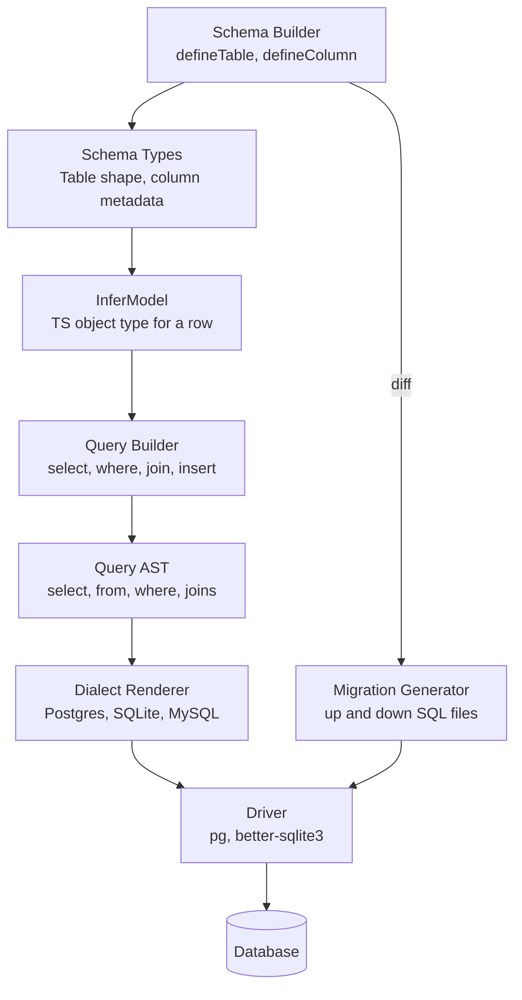

# 8.03 Type-Safe Custom ORM

> A capstone project that builds a lightweight object-relational mapper from scratch in pure TypeScript, where every column name, every comparison operator, every join target, and every migration is enforced by the compiler — not the runtime. The schema is a TypeScript value; the TypeScript compiler derives every type that the query builder consumes. There is no code generation step, no annotation processor, no separate domain-specific schema file.

## 1. Project Overview

This capstone specifies, designs, and implements a lightweight object-relational mapper (ORM) built strictly in TypeScript. The deliverable is a single publishable package that supports complex `SELECT` statements, dynamic filter assertions, type-safe join query mappings, and migration scripts — all checked at compile time against a schema defined in TypeScript itself. The schema is a TypeScript value, and the TypeScript compiler derives every type that the query builder consumes. The project's working name throughout this note is **Torm**, short for "type-safe ORM".

The motivation for building a custom ORM, when Prisma, TypeORM, MikroORM, Drizzle, and Kysely already exist, is twofold. First, building one is the most efficient way to internalise the advanced TypeScript features that production-grade type-safe libraries depend on — there is no better vehicle for learning conditional types, mapped types, template literal types, recursive type aliases, and distributive conditionals than a project whose entire value proposition is "the compiler catches bugs the runtime never would". Second, the existing ORMs make different trade-offs that are visible only when you build one yourself: Prisma generates code from a separate schema file, Drizzle couples the schema to a dialect-specific column constructor, Kysely requires hand-written row types. Torm is the minimal viable design that maximises type-level inference while minimising ceremony.

Learning outcomes, in concrete order of difficulty:

1. **Advanced generics with constraints** — `defineColumn<T extends SqlType>()`, `defineTable<TName extends string, TColumns extends Columns>()`. The schema builder cannot enforce that column types are valid without these constraints. See [[2.07 Generics and Constraints]].
2. **Conditional types** — `T extends SqlType ? MappedType : never`, used to derive the TS type for a column declared as `integer`, `text`, `boolean`, `timestamptz`, `jsonb`, etc.
3. **Template literal types** — `defineTable<"users", ...>` captures the table name as a string literal type; column names are derived via `keyof TColumns`. See [[2.13 Template Literal Types]].
4. **Mapped types** — `InferModel<Schema>` walks the column map and produces a TypeScript object whose keys are the column names and whose values are the inferred types. See [[2.09 Mapped Types]].
5. **Type inference in conditional types** — `infer` extracts the column type from `defineColumn("integer")` so the model can be derived without runtime inspection. See [[2.12 Type Inference in Conditionals]].
6. **Recursive type-level operations** — `DeepOptional<Schema>` for nullable columns, `JoinPath<...>` for nested joins, `FlattenJoined<...>` for projecting joined rows. See [[2.14 Recursive Type-Level Operations]].
7. **Structural design patterns and API design** — fluent builder, interpreter, visitor for SQL emission, factory for the schema, internal DSL for the query builder. The public surface area is small, and the types do the talking. See [[2.17 API Design with Types]].

The deliverable is a package whose public API looks like this at the surface:

```typescript
// TS
import { defineTable, defineColumn, db } from "torm";

export const users = defineTable("users", {
  id: defineColumn("integer").primaryKey(),
  email: defineColumn("text").notNull().unique(),
  age: defineColumn("integer").notNull(),
  createdAt: defineColumn("timestamptz").default("now()"),
});

const adults = await db.selectFrom(users)
  .where(u => u.age.greaterThan(18))
  .orderBy(u => u.email)
  .execute();

// adults: { id: number; email: string; age: number; createdAt: Date | null }[]
```

The compiler refuses `where(u => u.email.greaterThan(18))` because `email` is a `text` column and `greaterThan` is not available on text columns. It refuses `select(u => u.nope)` because `nope` is not a column on `users`. It refuses a join to a table that does not exist. It refuses an `insert` that omits a `notNull` column without a default. Every one of those refusals is the type system doing work that an untyped ORM would do at three in the morning in production.

This is the capstone of the TypeScript Mastery section because it exercises every advanced type-level feature in a single coherent codebase. It is the capstone of the broader vault because it ties together the language, the Node.js runtime, software-engineering principles, and tooling. The next sections describe the architecture, the components, the code, the trade-offs, the techniques, the testing strategy, the publishing workflow, and the extensions that would turn Torm from a learning project into a publishable library.

## 2. Architecture and Type System Design

Torm is layered. Each layer consumes the output of the layer below it; each layer exposes a public surface area whose types are derived from the schema layer at the bottom. The whole system can be read from the schema up: a schema value produces schema types; schema types produce model types; model types feed the query builder; the query builder emits an AST; the AST is rendered to SQL by the dialect; the SQL is executed by a driver. Migration generation sits alongside this stack, diffing two schema versions and emitting a SQL migration file.



The layers, from bottom to top:

- **Schema Builder.** A small fluent API. `defineColumn("integer")` returns a column descriptor. Methods like `.notNull()`, `.unique()`, `.primaryKey()`, `.default(value)`, `.references(other)` mutate and return the descriptor. `defineTable("users", { id: ..., email: ... })` returns a table descriptor. The descriptor is a runtime value carrying column metadata, and its TS type carries the same information in the type space.
- **Schema Types.** The TS types that describe the schema. `Column<TType, TNullable, TDefault>` is the descriptor type. `Columns` is a record of column-name to descriptor. `Table<TName, TColumns>` is the table descriptor type.
- **Type Inference.** `InferModel<Table>` walks `TColumns`, looks up each `Column<TType, ...>`, maps `TType` to a TS type (`integer` to `number`, `text` to `string`, `timestamptz` to `Date`, `boolean` to `boolean`, `jsonb` to `unknown`), and produces `{ [K in keyof TColumns]: InferredType }` with optionality for nullable columns.
- **Query Builder.** A chainable builder. `selectFrom(table)` returns a builder. `.where(predicate)` accepts a function whose parameter is a *column proxy* — an object whose keys are the columns of the table and whose values are operator-objects specific to the column type. `.join(other, predicate)` accepts a function whose parameters are the two column proxies. `.select(projection)` accepts a function returning a column or an object of columns. Each method returns a new builder typed with the accumulated state.
- **Query AST.** A plain discriminated union of `SelectNode`, `WhereNode`, `JoinNode`, `OrderByNode`, `LimitNode`, etc. The builder accumulates AST nodes; it never renders SQL until `.execute()` is called.
- **Dialect Renderer.** A visitor over the AST that produces a SQL string and a parameter array. The Postgres renderer emits `$1`, `$2` placeholders; the SQLite renderer emits `?`, `?`. The renderer is the only dialect-specific module.
- **Driver.** A thin adapter over `pg`, `better-sqlite3`, or `mysql2`. The driver takes the SQL string and the parameters and returns rows.
- **Migration Generator.** A separate module that takes two schemas (the current and the next) and emits `up` and `down` SQL strings. Diffing is structural: added tables, dropped tables, added columns, dropped columns, type changes, nullability changes, default changes.

The data flow is one-directional at compile time (schema to types to queries) and two-directional at runtime (queries to SQL to rows; schema to migrations to SQL to driver). The type system never sees runtime data; the runtime never sees types. The bridge between the two is the schema value, which exists in both worlds: it is a runtime value (a plain object) and a typed value (its type carries the metadata).

This separation matters because it makes each layer testable in isolation. The schema builder can be unit-tested without a database. The query builder can be tested by inspecting the AST without executing SQL. The renderer can be tested by feeding it a fixed AST and asserting the SQL string. The driver can be tested against a real database. The migration generator can be tested by diffing two schemas and asserting the emitted SQL. Each layer has a single responsibility, and the boundary between layers is a pure data structure — the AST.

The architectural pattern is the Interpreter pattern: the query builder constructs an AST, the renderer interprets it. It is also the Builder pattern: the chainable methods accumulate state immutably. And it is the Repository pattern at the public surface: `db.selectFrom(users)` reads like a repository method, with the table acting as the entity. Within a single `selectFrom` call, the caller chains `.where(...)`, `.join(...)`, `.select(...)`, each of which invokes the proxy to record an AST node; `.execute()` hands the AST to the renderer, which produces SQL, which the driver sends to the database. The caller never touches the proxy, the AST, the renderer, or the driver directly. Each layer speaks only to its immediate neighbours, and the type system rides on top of the same chain — every step carries a type, and the type narrows at each step until it arrives at the caller as a typed array of rows. See [[4.09 Clean and Onion Architecture]] and [[3.23 Database Integration and ORM Patterns]] for the architectural placement.

## 3. Key Components and Modules

Torm is organised into nine modules. Each module corresponds to a single file in the published package and a single concern in the architecture.

**1. `schema.ts` — Schema Builder.** Exports `defineColumn` and `defineTable`. The column builder is a small fluent class:

- `defineColumn(type)` returns a `ColumnBuilder` initialised with the given SQL type.
- `.notNull()` removes `null` from the column's value type.
- `.unique()` adds a uniqueness constraint (used by the migration generator).
- `.primaryKey()` marks the column as primary key (used by the migration generator and the type inference for ID columns).
- `.default(value)` sets a default; the default can be a literal or a SQL fragment like `"now()"`.
- `.references(other)` declares a foreign key; the type system narrows the column type to match the referenced column.

The table builder is a single function:

- `defineTable(name, columns)` returns a `Table` object. The `name` is captured as a string literal type. The `columns` is captured as a record of column-name to column descriptor.

**2. `infer.ts` — Type Inference.** Exports `InferModel<Table>`, `InferInsert<Table>`, `InferUpdate<Table>`, `InferColumn<Column>`. These are pure type aliases — no runtime code. They walk the schema types and produce TS types. `InferModel` produces the row type for `SELECT`. `InferInsert` produces the row type for `INSERT` (omits columns with defaults, makes primary-key columns optional if they are auto-incremented). `InferUpdate` produces the row type for `UPDATE` (all columns optional).

**3. `proxy.ts` — Column Proxy.** Exports `ColumnProxy<Table>`, the type of the parameter passed to `.where` and `.join` predicate functions. The proxy is a mapped type: for each column, the proxy has a property whose type is the operator-object for that column's SQL type — `StringOperators` (`equals`, `like`, `inArray`, `isNull`), `NumberOperators` (`equals`, `greaterThan`, `lessThan`, `between`, `inArray`, `isNull`), `DateOperators`, `BooleanOperators`, or `JsonbOperators` (`equals`, `hasKey`, `hasPath`, `isNull`).

The runtime proxy is a Proxy object (see [[1.31 Proxy and Reflect APIs]]) that records calls as AST nodes. `u.age.greaterThan(18)` records a `WhereNode` with column `age`, operator `>`, value `18`. The proxy returns `undefined` cast to whatever type the operator-object declares — the return type is for the type checker, the runtime never reads it.

**4. `builder.ts` — Query Builder.** Exports `SelectBuilder`, `InsertBuilder`, `UpdateBuilder`, `DeleteBuilder`. Each is a class whose methods return new instances (immutability). Each method has a carefully designed type signature that accumulates state: `.where` accepts a predicate over the current proxy type; `.join` accepts a table and a predicate over a pair of proxies; `.select` accepts a projection function whose return type narrows the result type. The result type is computed by `InferResult<BuilderState>` — a recursive type alias that walks the accumulated AST and produces the row type the query will return.

**5. `dialect.ts` — Dialect Renderer.** Exports `PostgresDialect`, `SqliteDialect`, `MysqlDialect`. Each is a class with a `render(ast)` method returning `{ sql: string; params: unknown[] }`. The renderer is a visitor over the AST; it switches on the `kind` field of each node and emits the appropriate SQL fragment. The Postgres renderer emits `$1` placeholders; the SQLite renderer emits `?`. Identifiers are escaped with double quotes; string literals are never concatenated — they always go through parameters.

**6. `driver.ts` — Driver Adapter.** Exports `createDriver(options)` which returns a `Driver` object with `query<T>(sql, params): Promise<T[]>`. Internally, the driver wraps `pg`, `better-sqlite3`, or `mysql2`. The wrapper is thin; it does no SQL manipulation. The driver is the only module that touches the network or the filesystem.

**7. `migrations.ts` — Migration Generator.** Exports `diffSchemas(from, to): Migration`. The `Migration` is an object with `up: string[]` and `down: string[]` arrays of SQL statements. The diff is structural: walk tables and columns, classifying each as added, dropped, or type-changed. The generator emits `CREATE TABLE`, `DROP TABLE`, `ALTER TABLE ADD COLUMN`, `ALTER TABLE DROP COLUMN`, `ALTER TABLE ALTER COLUMN`. Reversibility is achieved by emitting the inverse in the `down` array.

**8. `db.ts` — Public Entry Point.** Exports `db`, the object every consumer imports. `db` is created by `createDb({ dialect, driver })`. It exposes `selectFrom`, `insertInto`, `updateTable`, `deleteFrom`, `transaction`, and `raw` (the escape hatch). This is the only object the consumer touches; everything else is an internal module.

**9. `index.ts` — Package Surface.** Re-exports the public types and values. This file is what `package.json`'s `exports` field points at. It is the contract between Torm and its consumers.

File layout:

```
src/
  schema.ts
  infer.ts
  proxy.ts
  builder.ts
  dialect.ts
  driver.ts
  migrations.ts
  db.ts
  index.ts
test/
  schema.test.ts
  builder.test.ts
  dialect.test.ts
  migrations.test.ts
  types.test.ts        // type-level tests
  runtime.test.ts      // runtime tests against an in-memory SQLite
examples/
  blog.ts
  shop.ts
docs/
  getting-started.md
  schema.md
  queries.md
  migrations.md
```

This layout matches the layered architecture: each file is one layer, each layer depends only on layers below it, and the dependency graph has no cycles. The consumer-facing `index.ts` is the only file that knows about all layers; the rest are independent modules testable in isolation. See [[4.09 Clean and Onion Architecture]] for the rationale behind inward-pointing dependency graphs.

## 4. Schema Definition and Type Inference

The schema is the single source of truth. Every type the query builder consumes — the model type, the insert type, the update type, the column proxy, the join result — is derived from the schema via a chain of type aliases. This section walks that chain end-to-end with a concrete example: a small blog schema with `users`, `posts`, and `comments` tables.

The schema, written with the fluent API:

```typescript
// TS
import { defineTable, defineColumn } from "torm";

export const users = defineTable("users", {
  id: defineColumn("integer").primaryKey(),
  email: defineColumn("text").notNull().unique(),
  age: defineColumn("integer").notNull(),
  bio: defineColumn("text"),
  createdAt: defineColumn("timestamptz").default("now()"),
});

export const posts = defineTable("posts", {
  id: defineColumn("integer").primaryKey(),
  authorId: defineColumn("integer").notNull().references(() => users.id),
  title: defineColumn("text").notNull(),
  body: defineColumn("text").notNull(),
  publishedAt: defineColumn("timestamptz"),
});

export const comments = defineTable("comments", {
  id: defineColumn("integer").primaryKey(),
  postId: defineColumn("integer").notNull().references(() => posts.id),
  authorId: defineColumn("integer").notNull().references(() => users.id),
  body: defineColumn("text").notNull(),
});
```

The runtime value of `users` is a plain object. Its TS type, after the compiler has finished inferring, is approximately:

```typescript
// TS
type UsersTable = {
  readonly name: "users";
  readonly columns: {
    readonly id: Column<"integer", true, true, false, false, never, undefined>;
    readonly email: Column<"text", true, false, true, false, never, undefined>;
    readonly age: Column<"integer", true, false, false, false, never, undefined>;
    readonly bio: Column<"text", false, false, false, false, never, undefined>;
    readonly createdAt: Column<"timestamptz", false, false, false, true, "now()", undefined>;
  };
};
```

The exact shape is an implementation detail; what matters is that every column carries its SQL type, its nullability, its primary-key flag, its uniqueness, and its default — all as type parameters. The runtime value carries the same information as plain data.

From this schema, the inference aliases produce the model types:

```typescript
// TS
type User = InferModel<typeof users>;
// { id: number; email: string; age: number; bio: string | null; createdAt: Date | null }

type Post = InferModel<typeof posts>;
// { id: number; authorId: number; title: string; body: string; publishedAt: Date | null }

type NewUser = InferInsert<typeof users>;
// { email: string; age: number; bio?: string | null }  // id is auto, createdAt has default
```

The inference chain, end to end:

```mermaid
flowchart LR
    SchemaValue["const users = defineTable(...)"] -->|typeof| SchemaType["Table&lt;...&gt;"]
    SchemaType -->|walk columns| ColumnType["Column&lt;TType, TNullable, ...&gt;"]
    ColumnType -->|map TType| TsType["number, string, Date, boolean, unknown"]
    TsType -->|union null if nullable| ModelField["string \| null"]
    ModelField -->|gather| Model["InferModel: User shape"]
    Model --> Builder["where&lt;User&gt;, select&lt;User&gt;"]
```



The crucial property is that every name and every type is *derived*. There is no second source of truth. If you add a column to the schema, the model type, the proxy type, and the migration generator all see it. If you change a column's nullability, every `where` clause that touches it adjusts accordingly. If you rename a column, every query that references it breaks at compile time — exactly the behaviour you want.

The `where` clause demonstrates this most clearly:

```typescript
// TS
db.selectFrom(users)
  .where(u => u.email.equals("alice@example.com"))   // OK: email is text
  .where(u => u.age.greaterThan(18))                  // OK: age is integer
  // .where(u => u.email.greaterThan(18))             // ERROR: greaterThan not on StringOperators
  // .where(u => u.nope.equals(1))                    // ERROR: nope not a column on users
  // .where(u => u.age.equals("eighteen"))            // ERROR: equals expects number, got string
  .execute();
```

The first two calls compile. The third fails because `StringOperators` has no `greaterThan`. The fourth fails because `nope` is not a key of `InferModel<typeof users>`. The fifth fails because `NumberOperators.equals` takes `number`, not `string`. Four classes of bug — wrong operator, wrong column, wrong value type, missing column — caught at compile time, with no test execution, no runtime, no database connection.

The same guarantee extends to joins:

```typescript
// TS
db.selectFrom(users)
  .join(posts, (u, p) => u.id.equals(p.authorId))     // OK: both columns are integer
  // .join(posts, (u, p) => u.email.equals(p.title))  // ERROR: joining text columns is allowed but flagged
  // .join(posts, (u, p) => u.id.equals(p.body))      // ERROR: id is number, body is string
  .select((u, p) => ({ email: u.email, title: p.title }))
  .execute();
// result: { email: string; title: string }[]
```

The join's predicate takes two proxies — one for each table — and the `on` clause must compare compatible columns. The `select` projection returns an object whose shape becomes the result type. Every name is checked, every type is checked, every join is verified before a single SQL string is emitted. Every other component of Torm exists to make this work and to extend the same guarantee to inserts, updates, deletes, and migrations.

## 5. Code Blueprint

This section is the longest. It walks the four most technically demanding modules side by side in JavaScript (the emitted runtime code) and TypeScript (the type-level code that constrains it). Each subsection covers one module: the schema builder, the type-level query builder, the filter assertions, and the migration generator.

### 5.1 Schema Builder (fluent API)

The schema builder is the foundation. Its runtime code is a small fluent class. Its type code is a set of generic constraints that capture the column metadata as type parameters.

**JavaScript (emitted runtime):**

```javascript
// JS — emitted from src/schema.ts
export function defineColumn(type) {
  return new ColumnBuilder({
    type,
    notNull: false,
    primaryKey: false,
    unique: false,
    hasDefault: false,
    defaultValue: undefined,
    references: undefined,
  });
}

class ColumnBuilder {
  constructor(state) {
    this.state = state;
  }
  notNull() {
    return new ColumnBuilder({ ...this.state, notNull: true });
  }
  primaryKey() {
    return new ColumnBuilder({ ...this.state, primaryKey: true, notNull: true });
  }
  unique() {
    return new ColumnBuilder({ ...this.state, unique: true });
  }
  default(value) {
    return new ColumnBuilder({ ...this.state, hasDefault: true, defaultValue: value });
  }
  references(other) {
    const ref = other();
    return new ColumnBuilder({ ...this.state, references: ref.table ?? ref.name });
  }
  build() {
    return Object.freeze({ ...this.state });
  }
}

export function defineTable(name, columns) {
  const built = {};
  for (const [key, builder] of Object.entries(columns)) {
    built[key] = builder.build();
  }
  return Object.freeze({ name, columns: Object.freeze(built) });
}
```

**TypeScript (type-level):**

```typescript
// TS — src/schema.ts
export type SqlType =
  | "integer"
  | "text"
  | "boolean"
  | "timestamptz"
  | "jsonb"
  | "numeric"
  | "uuid";

export type Column<
  TType extends SqlType = SqlType,
  TNotNull extends boolean = false,
  TPrimaryKey extends boolean = false,
  TUnique extends boolean = false,
  THasDefault extends boolean = false,
  TDefault = never,
  TReferences extends string | undefined = undefined
> = {
  readonly type: TType;
  readonly notNull: TNotNull;
  readonly primaryKey: TPrimaryKey;
  readonly unique: TUnique;
  readonly hasDefault: THasDefault;
  readonly defaultValue: TDefault;
  readonly references: TReferences;
};

export interface ColumnBuilder<
  TType extends SqlType,
  TNotNull extends boolean = false,
  TPrimaryKey extends boolean = false,
  TUnique extends boolean = false,
  THasDefault extends boolean = false,
  TDefault = never,
  TReferences extends string | undefined = undefined
> {
  notNull(): ColumnBuilder<TType, true, TPrimaryKey, TUnique, THasDefault, TDefault, TReferences>;
  primaryKey(): ColumnBuilder<TType, true, true, TUnique, THasDefault, TDefault, TReferences>;
  unique(): ColumnBuilder<TType, TNotNull, TPrimaryKey, true, THasDefault, TDefault, TReferences>;
  default<TValue>(value: TValue): ColumnBuilder<TType, TNotNull, TPrimaryKey, TUnique, true, TValue, TReferences>;
  references<TRef extends string>(
    other: () => { readonly name: TRef }
  ): ColumnBuilder<TType, TNotNull, TPrimaryKey, TUnique, THasDefault, TDefault, TReferences>;
  build(): Column<TType, TNotNull, TPrimaryKey, TUnique, THasDefault, TDefault, TReferences>;
}

export declare function defineColumn<TType extends SqlType>(
  type: TType
): ColumnBuilder<TType, false, false, false, false, never, undefined>;

type Columns = Record<string, ColumnBuilder<any, any, any, any, any, any, any>>;

export interface Table<TName extends string, TColumns extends Columns> {
  readonly name: TName;
  readonly columns: TColumns;
}

export declare function defineTable<TName extends string, TColumns extends Columns>(
  name: TName,
  columns: TColumns
): Table<TName, TColumns>;
```

The TS side does the heavy lifting. Each method returns a `ColumnBuilder` with one type parameter flipped. `notNull()` flips `TNotNull` to `true`. `primaryKey()` flips both `TPrimaryKey` and `TNotNull` (a primary key is non-nullable by definition). `default<TValue>(value)` simultaneously sets `THasDefault` to `true` and captures the value's type as `TDefault`. The `references` method captures the referenced table's name as a string literal type — used by the migration generator to emit `REFERENCES "users" ("id")`.

The `defineTable` function uses two generic parameters: `TName extends string` captures the table name as a literal type (so `"users"` stays `"users"` rather than widening to `string`), and `TColumns extends Columns` captures the column map. The `Columns` constraint is `Record<string, ColumnBuilder<...>>`, which is permissive but sufficient; the inference alias `InferModel` does the strict type-checking downstream.

A note on the `ColumnBuilder` interface rather than class. The interface declares the *type-level* shape of the builder — what methods exist and what they return. The runtime class implements those methods, and TypeScript structurally matches the class instance to the interface, so consumers see the interface's type signatures even though the runtime is a plain class. This makes the type-level code easier to read in isolation and lets the type signatures evolve independently of the runtime.

### 5.2 Type-Level Query Builder

The query builder is where the type system earns its keep. Each method on the builder has a signature that reflects what the method does to the *type* of the result. `select` narrows the result to the projected columns. `join` widens the result to include the joined table's columns. `where` does not change the result type but constrains the predicate. `orderBy` does not change the result type but constrains the column.

**JavaScript (emitted runtime):**

```javascript
// JS — emitted from src/builder.ts
import { makeProxy, toAst, applyProjection } from "./proxy.js";
import { currentDialect, currentDriver } from "./db.js";

export class SelectBuilder {
  constructor(state) {
    this.state = state; // { table, wheres, joins, orders, limit, projection, distinct }
  }
  where(predicate) {
    const filter = predicate(makeProxy(this.state.table));
    return new SelectBuilder({ ...this.state, wheres: [...this.state.wheres, filter] });
  }
  join(other, predicate) {
    const filter = predicate(makeProxy(this.state.table), makeProxy(other));
    return new SelectBuilder({
      ...this.state,
      joins: [...this.state.joins, { table: other, on: filter, kind: "inner" }],
    });
  }
  leftJoin(other, predicate) {
    const filter = predicate(makeProxy(this.state.table), makeProxy(other));
    return new SelectBuilder({
      ...this.state,
      joins: [...this.state.joins, { table: other, on: filter, kind: "left" }],
    });
  }
  select(projection) {
    const node = projection(makeProxy(this.state.table));
    return new SelectBuilder({ ...this.state, projection: node });
  }
  orderBy(projection, direction = "asc") {
    const node = projection(makeProxy(this.state.table));
    return new SelectBuilder({ ...this.state, orders: [...this.state.orders, { node, direction }] });
  }
  limit(n) { return new SelectBuilder({ ...this.state, limit: n }); }
  distinct() { return new SelectBuilder({ ...this.state, distinct: true }); }
  async execute() {
    const ast = toAst(this.state);
    const { sql, params } = this.state.dialect.render(ast);
    const rows = await this.state.driver.query(sql, params);
    return rows.map(row => applyProjection(row, this.state.projection));
  }
}

export function selectFrom(table) {
  return new SelectBuilder({
    table,
    wheres: [],
    joins: [],
    orders: [],
    limit: null,
    projection: null,
    distinct: false,
    dialect: currentDialect,
    driver: currentDriver,
  });
}
```

**TypeScript (type-level):**

```typescript
// TS — src/builder.ts
import type { Table } from "./schema";
import type { InferModel } from "./infer";
import type { ColumnProxy, Filter } from "./proxy";

interface SelectState<
  TTable extends Table<any, any>,
  TJoins extends ReadonlyArray<{ table: Table<any, any> }> = [],
  TProjection = null
> {
  readonly table: TTable;
  readonly wheres: ReadonlyArray<Filter>;
  readonly joins: TJoins;
  readonly orders: ReadonlyArray<{ column: string; direction: "asc" | "desc" }>;
  readonly limit: number | null;
  readonly projection: TProjection;
  readonly distinct: boolean;
}

type InferJoined<
  TTable extends Table<any, any>,
  TJoins extends ReadonlyArray<{ table: Table<any, any> }>
> =
  TJoins extends ReadonlyArray<infer J>
    ? J extends { table: infer JT extends Table<any, any> }
      ? InferModel<TTable> & InferModel<JT>
      : InferModel<TTable>
    : InferModel<TTable>;

type InferResult<S extends SelectState<any, any, any>> =
  S extends SelectState<infer TTable, infer TJoins, infer TProj>
    ? TProj extends null
      ? InferJoined<TTable, TJoins>
      : TProj extends (proxy: any) => infer R
        ? R
        : never
    : never;

export interface SelectBuilder<
  S extends SelectState<any, any, any> = SelectState<Table<any, any>, [], null>
> {
  where<TPredicate extends (proxy: ColumnProxy<S["table"]>) => Filter>(
    predicate: TPredicate
  ): SelectBuilder<{ ...S; wheres: ReadonlyArray<Filter> }>;

  join<
    TOther extends Table<any, any>,
    TPredicate extends (a: ColumnProxy<S["table"]>, b: ColumnProxy<TOther>) => Filter
  >(
    other: TOther,
    predicate: TPredicate
  ): SelectBuilder<{ ...S; joins: [...S["joins"], { table: TOther; kind: "inner" }] }>;

  leftJoin<
    TOther extends Table<any, any>,
    TPredicate extends (a: ColumnProxy<S["table"]>, b: ColumnProxy<TOther>) => Filter
  >(
    other: TOther,
    predicate: TPredicate
  ): SelectBuilder<{ ...S; joins: [...S["joins"], { table: TOther; kind: "left" }] }>;

  select<TProjection extends (proxy: ColumnProxy<S["table"]>) => any>(
    projection: TProjection
  ): SelectBuilder<{ ...S; projection: TProjection }>;

  orderBy<TProjection extends (proxy: ColumnProxy<S["table"]>) => any>(
    projection: TProjection,
    direction?: "asc" | "desc"
  ): SelectBuilder<S>;

  limit(n: number): SelectBuilder<S>;
  distinct(): SelectBuilder<S>;
  execute(): Promise<InferResult<S>[]>;
}

export declare function selectFrom<TTable extends Table<any, any>>(
  table: TTable
): SelectBuilder<SelectState<TTable, [], null>>;
```

There are three type-level tricks worth highlighting.

First, the builder carries its state as a single type parameter `S`. Each method returns a `SelectBuilder` with a *modified* `S` — using the spread-on-type-level `{ ...S; wheres: ... }` syntax that TypeScript 4.7+ supports for type-level object updates. This means the state is structurally immutable at the type level: each method returns a new state, and the old state's type is preserved. See [[2.09 Mapped Types]] and [[2.10 Utility Types Deep Dive]] for the underlying mechanics.

Second, the `join` method uses a variadic tuple type `[...S["joins"], { table: TOther; ... }]` to append the joined table to the state's `joins` array. Variadic tuples preserve order and length, so the type system tracks exactly which tables have been joined and in what order. `InferJoined` then walks the `joins` array (via the distributive conditional `TJoins extends ReadonlyArray<infer J>`) and produces an intersection of all the joined models.

Third, `InferResult` is a *conditional* type alias. If `TProjection` is `null` (no `select` was called), the result is the full joined model. If `TProjection` is a function, the result is the function's return type — extracted via `TProj extends (proxy: any) => infer R ? R : never`. This is the `infer` keyword at work; see [[2.12 Type Inference in Conditionals]].

The runtime `execute` method renders the AST and returns rows. The TS-side `execute` returns `Promise<InferResult<S>[]>`. The two are completely decoupled — the runtime does not know what `InferResult<S>` is, and the type system does not know what `rows.map(...)` does. They share only the schema.

### 5.3 Type-Safe Filter Assertions

The filter assertions are the operators available on each column proxy. Each SQL type has its own operator set. The operators are typed to accept only values of the right type — `greaterThan` on an `integer` column accepts only `number`, never `string` or `Date`.

**JavaScript (emitted runtime):**

```javascript
// JS — emitted from src/proxy.ts
export function makeProxy(table) {
  return new Proxy({}, {
    get(target, column) {
      if (typeof column !== "string") return undefined;
      const col = table.columns[column];
      if (!col) throw new Error(`Unknown column ${column} on ${table.name}`);
      return makeOperatorProxy(table.name, column, col.type);
    },
  });
}

function makeOperatorProxy(table, column, type) {
  const handlers = {
    integer: {
      equals: (v) => ({ kind: "compare", table, column, op: "=", value: v }),
      greaterThan: (v) => ({ kind: "compare", table, column, op: ">", value: v }),
      lessThan: (v) => ({ kind: "compare", table, column, op: "<", value: v }),
      between: (lo, hi) => ({ kind: "between", table, column, lo, hi }),
      inArray: (arr) => ({ kind: "in", table, column, values: arr }),
      isNull: () => ({ kind: "isNull", table, column, negated: false }),
      isNotNull: () => ({ kind: "isNull", table, column, negated: true }),
    },
    text: {
      equals: (v) => ({ kind: "compare", table, column, op: "=", value: v }),
      like: (v) => ({ kind: "compare", table, column, op: "LIKE", value: v }),
      inArray: (arr) => ({ kind: "in", table, column, values: arr }),
      isNull: () => ({ kind: "isNull", table, column, negated: false }),
      isNotNull: () => ({ kind: "isNull", table, column, negated: true }),
    },
    timestamptz: {
      equals: (v) => ({ kind: "compare", table, column, op: "=", value: v }),
      greaterThan: (v) => ({ kind: "compare", table, column, op: ">", value: v }),
      lessThan: (v) => ({ kind: "compare", table, column, op: "<", value: v }),
      isNull: () => ({ kind: "isNull", table, column, negated: false }),
      isNotNull: () => ({ kind: "isNull", table, column, negated: true }),
    },
    boolean: {
      equals: (v) => ({ kind: "compare", table, column, op: "=", value: v }),
      isNull: () => ({ kind: "isNull", table, column, negated: false }),
    },
    jsonb: {
      equals: (v) => ({ kind: "compare", table, column, op: "=", value: v }),
      hasKey: (k) => ({ kind: "jsonHasKey", table, column, key: k }),
      hasPath: (p) => ({ kind: "jsonHasPath", table, column, path: p }),
      isNull: () => ({ kind: "isNull", table, column, negated: false }),
    },
  };
  return handlers[type] ?? handlers.text;
}

export function and(...filters) { return { kind: "and", children: filters }; }
export function or(...filters) { return { kind: "or", children: filters }; }
export function not(filter) { return { kind: "not", child: filter }; }

export function toAst(state) {
  return {
    kind: "select",
    table: state.table.name,
    joins: state.joins,
    wheres: state.wheres.length === 0 ? null : state.wheres.length === 1 ? state.wheres[0] : { kind: "and", children: state.wheres },
    orders: state.orders,
    limit: state.limit,
    distinct: state.distinct,
    projection: state.projection,
  };
}

export function applyProjection(row, projection) {
  if (projection === null) return row;
  // The projection was already evaluated against the proxy during .select();
  // here we just walk the recorded shape and pick the matching keys.
  return projection.applyProjector ? projection.applyProjector(row) : row;
}
```

**TypeScript (type-level):**

```typescript
// TS — src/proxy.ts
import type { Table, SqlType } from "./schema";

export type Filter =
  | { kind: "compare"; table: string; column: string; op: string; value: unknown }
  | { kind: "between"; table: string; column: string; lo: unknown; hi: unknown }
  | { kind: "in"; table: string; column: string; values: unknown[] }
  | { kind: "isNull"; table: string; column: string; negated: boolean }
  | { kind: "jsonHasKey"; table: string; column: string; key: string }
  | { kind: "jsonHasPath"; table: string; column: string; path: ReadonlyArray<string> }
  | { kind: "and"; children: Filter[] }
  | { kind: "or"; children: Filter[] }
  | { kind: "not"; child: Filter };

export interface NumberOperators<TValue extends number = number> {
  equals(value: TValue): Filter;
  greaterThan(value: TValue): Filter;
  lessThan(value: TValue): Filter;
  between(lo: TValue, hi: TValue): Filter;
  inArray(values: ReadonlyArray<TValue>): Filter;
  isNull(): Filter;
  isNotNull(): Filter;
}

export interface StringOperators<TValue extends string = string> {
  equals(value: TValue): Filter;
  like(value: TValue): Filter;
  inArray(values: ReadonlyArray<TValue>): Filter;
  isNull(): Filter;
  isNotNull(): Filter;
}

export interface DateOperators<TValue extends Date = Date> {
  equals(value: TValue): Filter;
  greaterThan(value: TValue): Filter;
  lessThan(value: TValue): Filter;
  isNull(): Filter;
  isNotNull(): Filter;
}

export interface BooleanOperators {
  equals(value: boolean): Filter;
  isNull(): Filter;
  isNotNull(): Filter;
}

export interface JsonbOperators {
  equals(value: unknown): Filter;
  hasKey(key: string): Filter;
  hasPath(path: ReadonlyArray<string>): Filter;
  isNull(): Filter;
}

export type OperatorsFor<TType extends SqlType> =
  TType extends "integer" | "numeric" ? NumberOperators<number> :
  TType extends "text" | "uuid" ? StringOperators<string> :
  TType extends "timestamptz" ? DateOperators<Date> :
  TType extends "boolean" ? BooleanOperators :
  TType extends "jsonb" ? JsonbOperators :
  never;

export type ColumnProxy<TTable extends Table<any, any>> = {
  readonly [K in keyof TTable["columns"]]:
    TTable["columns"][K] extends { readonly type: infer TType extends SqlType }
      ? OperatorsFor<TType>
      : never;
};

export declare function and(...filters: Filter[]): Filter;
export declare function or(...filters: Filter[]): Filter;
export declare function not(filter: Filter): Filter;
```

The type-level `OperatorsFor` is the conditional that maps each `SqlType` literal to its operator interface. Note the careful use of `extends` on the union members: `TType extends "integer" | "numeric" ? NumberOperators<number> :` distributes over the union, so both `"integer"` and `"numeric"` map to `NumberOperators`. This is *distributive conditional types* in action; see [[2.11 Conditional Types]].

The `ColumnProxy` mapped type iterates over the keys of `TTable["columns"]` and produces an operator-object for each one. The `extends { readonly type: infer TType extends SqlType }` pattern uses `infer` with a constraint (TypeScript 4.7+) to extract the column's `type` field as a narrowed `SqlType` literal, then maps it through `OperatorsFor`.

The combinator functions `and`, `or`, `not` allow building complex filters:

```typescript
// TS
db.selectFrom(users).where(u =>
  or(
    u.email.like("%@example.com"),
    and(u.age.greaterThan(30), u.bio.isNotNull()),
  ),
);
```

The runtime versions of `and`, `or`, `not` wrap their arguments in the corresponding `Filter` node. The type-level versions accept and return `Filter`, so they compose without further ceremony. The crucial property: `u.email.greaterThan(18)` is a *type error* — `greaterThan` is not a method on `StringOperators`. `u.age.equals("eighteen")` is a type error — `equals` on `NumberOperators` takes `number`, not `string`. These errors are not runtime assertions; they are compiler errors that prevent the code from compiling at all.

### 5.4 Migration Generator

The migration generator diffs two schemas and emits SQL. It is the only module that emits SQL strings directly (rather than via the renderer) — migrations are SQL-first, dialect-specific, and meant to be reviewed by a human before they are applied.

**JavaScript (emitted runtime):**

```javascript
// JS — emitted from src/migrations.ts
export function diffSchemas(from, to) {
  const up = [];
  const down = [];
  const fromTables = new Map(from.tables.map(t => [t.name, t]));
  const toTables = new Map(to.tables.map(t => [t.name, t]));

  // added tables
  for (const [name, table] of toTables) {
    if (!fromTables.has(name)) {
      up.push(renderCreateTable(table));
      down.push(`DROP TABLE "${name}";`);
    }
  }
  // dropped tables
  for (const [name, table] of fromTables) {
    if (!toTables.has(name)) {
      up.push(`DROP TABLE "${name}";`);
      down.push(renderCreateTable(table));
    }
  }
  // changed tables
  for (const [name, toTable] of toTables) {
    const fromTable = fromTables.get(name);
    if (!fromTable) continue;
    const colDiff = diffColumns(fromTable, toTable);
    up.push(...colDiff.up);
    down.push(...colDiff.down);
  }
  return { up, down };
}

function renderCreateTable(table) {
  const cols = Object.entries(table.columns).map(([name, col]) => {
    const parts = [`"${name}" ${col.type.toUpperCase()}`];
    if (col.notNull) parts.push("NOT NULL");
    if (col.primaryKey) parts.push("PRIMARY KEY");
    if (col.unique) parts.push("UNIQUE");
    if (col.hasDefault) parts.push(`DEFAULT ${col.defaultValue}`);
    if (col.references) parts.push(`REFERENCES "${col.references}"`);
    return parts.join(" ");
  });
  return `CREATE TABLE "${table.name}" (\n  ${cols.join(",\n  ")}\n);`;
}

function renderColumnConstraints(col) {
  const parts = [`"${col.type.toUpperCase()}"`];
  if (col.notNull) parts.push("NOT NULL");
  if (col.primaryKey) parts.push("PRIMARY KEY");
  if (col.unique) parts.push("UNIQUE");
  if (col.hasDefault) parts.push(`DEFAULT ${col.defaultValue}`);
  return parts.join(" ");
}

function diffColumns(fromTable, toTable) {
  const up = [];
  const down = [];
  const fromCols = new Map(Object.entries(fromTable.columns));
  const toCols = new Map(Object.entries(toTable.columns));
  for (const [name, col] of toCols) {
    if (!fromCols.has(name)) {
      up.push(`ALTER TABLE "${fromTable.name}" ADD COLUMN "${name}" ${renderColumnConstraints(col)};`);
      down.push(`ALTER TABLE "${fromTable.name}" DROP COLUMN "${name}";`);
    }
  }
  for (const [name, col] of fromCols) {
    if (!toCols.has(name)) {
      up.push(`ALTER TABLE "${fromTable.name}" DROP COLUMN "${name}";`);
      down.push(`ALTER TABLE "${fromTable.name}" ADD COLUMN "${name}" ${renderColumnConstraints(col)};`);
    }
  }
  return { up, down };
}
```

**TypeScript (type-level):**

```typescript
// TS — src/migrations.ts
import type { Table, Column, SqlType } from "./schema";

export interface Schema {
  readonly tables: ReadonlyArray<Table<any, any>>;
}

export interface Migration {
  readonly up: ReadonlyArray<string>;
  readonly down: ReadonlyArray<string>;
}

export declare function diffSchemas(from: Schema, to: Schema): Migration;

type AnyColumn = Column<any, any, any, any, any, any, any>;

export type ColumnChange =
  | { kind: "added"; name: string; column: AnyColumn }
  | { kind: "dropped"; name: string; column: AnyColumn }
  | { kind: "typeChanged"; name: string; from: SqlType; to: SqlType }
  | { kind: "nullabilityChanged"; name: string; fromNotNull: boolean; toNotNull: boolean }
  | { kind: "defaultChanged"; name: string; fromDefault: unknown; toDefault: unknown };

export type TableChange =
  | { kind: "added"; table: Table<any, any> }
  | { kind: "dropped"; table: Table<any, any> }
  | { kind: "columnsChanged"; table: Table<any, any>; columnChanges: ReadonlyArray<ColumnChange> };

export type DiffResult = ReadonlyArray<TableChange>;

type TypeChanged<
  F extends AnyColumn,
  T extends AnyColumn
> = F["type"] extends T["type"] ? false : true;

type NullabilityChanged<
  F extends AnyColumn,
  T extends AnyColumn
> = F["notNull"] extends T["notNull"] ? false : true;

type ColumnChanges<
  F extends Table<any, any>,
  T extends Table<any, any>
> = {
  readonly [K in keyof T["columns"]]:
    K extends keyof F["columns"]
      ? TypeChanged<F["columns"][K], T["columns"][K]> extends true
        ? { kind: "typeChanged"; name: K; from: F["columns"][K]["type"]; to: T["columns"][K]["type"] }
        : NullabilityChanged<F["columns"][K], T["columns"][K]> extends true
          ? { kind: "nullabilityChanged"; name: K; fromNotNull: F["columns"][K]["notNull"]; toNotNull: T["columns"][K]["notNull"] }
          : never
      : { kind: "added"; name: K; column: T["columns"][K] };
}[keyof T["columns"]];

export type Diff<F extends Schema, T extends Schema> = {
  readonly [K in keyof T["tables"]]:
    K extends keyof F["tables"]
      ? ColumnChanges<F["tables"][K], T["tables"][K]> extends never
        ? never
        : { kind: "columnsChanged"; table: T["tables"][K]; columnChanges: ColumnChanges<F["tables"][K], T["tables"][K]> }
      : { kind: "added"; table: T["tables"][K] };
};
```

The migration generator has two halves: a runtime diff function that emits SQL, and a type-level diff that produces a structured description of the changes. The runtime half is what ships in the published package; the type-level half is used internally for type-level tests (see Section 8) and could in principle be exposed as a "dry-run" type that surfaces the diff in the IDE before the migration is run.

The runtime diff walks tables and columns, classifies each as added, dropped, or changed, and emits SQL. The interesting work is in rendering each `ALTER TABLE` statement, which must include the right constraints. `renderColumnConstraints(col)` emits the column type, `NOT NULL` if applicable, `DEFAULT` if applicable, and `REFERENCES` if applicable — mirroring the `CREATE TABLE` rendering but for a single column.

The `down` array is the inverse of `up`: adding a table in `up` means dropping it in `down`; dropping a column in `up` means adding it back in `down`. This is reversible by construction, as long as the `from` schema is preserved — which is why migrations are versioned: each migration carries its `from` schema as the previous migration's `to` schema.

The type-level `ColumnChanges` uses a mapped type over the keys of `T["columns"]`, with a nested conditional for each column: if the column exists in `F["columns"]`, check whether the type changed (via `TypeChanged`) or the nullability changed (via `NullabilityChanged`); otherwise, the column is `added`. The result is indexed by `[keyof T["columns"]]` to flatten the mapped object into a union of `ColumnChange` variants. `never` filters out unchanged columns, so the union contains only the actual changes.

## 6. Technical Decisions and Trade-offs

Every architectural choice in Torm reflects a trade-off — building a custom ORM is itself a trade-off, making it type-safe is another, exposing the schema as a fluent builder rather than a decorator or a separate file is a third. This section enumerates the major trade-offs.

**Why build a custom ORM at all?** No learning experience matches building one. Prisma's type safety comes from a code generator that emits a 50,000-line TypeScript file — you cannot read it and learn from it. TypeORM is class-based with decorators; it teaches decorators, not type-level programming. Drizzle is closest to Torm's design but is a production library with hundreds of contributors, dialect-specific column constructors, and a release cadence that obscures the educational core. Building Torm is the only way to see, end to end, how a schema value's type flows through a query builder's methods to produce a typed result. The trade-off: Torm will not be production-quality — it will not support every dialect, every edge case, every performance optimisation. It is a teaching artefact whose value is the building, not the using.

**Why type-safe?** The promise of type safety is that the compiler catches bugs the runtime never would. In database code, the bugs the runtime catches are expensive: a typo in a column name surfaces only when the query runs, which may be in production at three in the morning. A type-safe ORM moves that failure to compile time, when the developer is at their keyboard and the database is not involved.

The trade-off: type-safe code is harder to write. The types are dense, the error messages are sometimes inscrutable, and the compile times can suffer. The team that adopts a type-safe ORM needs to be comfortable reading conditional types and mapped types, or the type safety becomes a liability.

**Why a fluent builder for the schema, not a decorator or a separate file?** A fluent builder is the only design that captures the schema as a single TypeScript value, with its type derived from the value. Decorators (see [[2.19 Decorators and Metaprogramming]]) require classes, which add ceremony and which the TypeScript team has not yet stabilised in the ECMAScript spec. A separate schema file (Prisma's approach) requires a code generator, which adds a build step and a separate language to learn. The fluent builder is the most TypeScript-native design.

The trade-off: a fluent builder is verbose. Each column needs `defineColumn("integer").notNull()`, which is more characters than a decorator alternative. The verbosity is the cost of the type-level information; the alternative is a code generator that infers the types from a different source.

**Why a single state type parameter on the builder?** Carrying the entire builder state as one type parameter `S` makes the type signatures uniform: every method takes `S` and returns `SelectBuilder<{ ...S; ... }>`. This is easy to read and easy to extend. The alternative is multiple type parameters — `SelectBuilder<TTable, TJoins, TProjection, TOrders, ...>` — which composes badly: adding a new piece of state requires changing every method signature.

The trade-off: spread-on-type-level objects (`{ ...S; ... }`) is a relatively recent TypeScript feature (4.7+) and is not as well-optimised as the multi-parameter form. Very large state types can be slow to instantiate.

**Why an AST, not direct SQL emission?** Building an AST and then rendering it decouples the query builder from the dialect. The same `SelectBuilder` can render to Postgres, SQLite, or MySQL by swapping the dialect renderer. Direct SQL emission would couple the builder to one dialect and make multi-DB support (a stretch goal) impossible.

The trade-off: the AST adds a layer of indirection. Each query goes through two passes — construction and rendering — instead of one. The performance cost is negligible (the AST is small and the rendering is fast), but the code is more complex.

**Why a runtime Proxy for the column proxy?** The column proxy needs to record calls as AST nodes without the user writing boilerplate. `u.age.greaterThan(18)` is far more readable than `filter("age", ">", 18)`. A Proxy (see [[1.31 Proxy and Reflect APIs]]) intercepts property access and method calls, recording the AST node and returning a typed object that satisfies the operator interface. The trade-off: Proxies are slower than direct property access (irrelevant for a query builder that constructs one AST per query) and obscure stack traces — an error inside a Proxy trap shows up as `<anonymous>` rather than at the user's call site.

**Why conditional types for operator mapping, not a union of interfaces?** Mapping each `SqlType` literal to its operator interface via `OperatorsFor<TType>` lets the column proxy be derived uniformly: `{ [K in keyof T]: OperatorsFor<T[K]["type"]> }`. The alternative — a union of interfaces and a type guard — would require the user to narrow the proxy before using it, which defeats the purpose. The trade-off: conditional types distribute over unions, which can cause confusing error messages; the mitigation is to keep `SqlType` literals narrow at the call site, which the fluent builder does by construction.

**Why are complex types slow to compile, and what do we do about it?** The TypeScript checker is a single-pass interpreter with a recursion budget. Every conditional type, every mapped type, every `infer` consumes budget. The `InferResult` alias, which walks the builder state and produces the result type, can instantiate hundreds of types for a complex query with several joins. Incremental compilation, which should take 50 milliseconds, can take 500 milliseconds — a 10x slowdown. The mitigation is to keep the types tail-recursive where possible (see [[2.14 Recursive Type-Level Operations]]), to use `infer` sparingly, and to cache the results of expensive aliases via helper types that pre-compute common shapes. There is no silver bullet; the trade-off is between type safety and compile speed.

**Why emit SQL strings rather than using a query builder library?** Torm's purpose is to teach type-level programming, not to compete with Knex. Emitting SQL strings directly keeps the code small and the lessons clear. The trade-off: direct SQL emission is a security-sensitive operation. String concatenation is forbidden; every value goes through a parameter. The renderer is the only place SQL strings are constructed, and it is the only place that needs to be audited for injection.

## 7. Type-Level Programming Techniques Used

Torm is a tour through the TypeScript type system — every major type-level feature is in use. This section catalogues them with examples drawn from the codebase.

### 7.1 Conditional types

A conditional type is `T extends U ? X : Y` — the compiler evaluates to `X` if `T` is assignable to `U`, otherwise `Y`. Torm uses conditional types everywhere, most prominently in `OperatorsFor`, which maps each `SqlType` literal to its operator interface:

```typescript
// TS
type OperatorsFor<TType extends SqlType> =
  TType extends "integer" | "numeric" ? NumberOperators<number> :
  TType extends "text" | "uuid" ? StringOperators<string> :
  TType extends "timestamptz" ? DateOperators<Date> :
  TType extends "boolean" ? BooleanOperators :
  TType extends "jsonb" ? JsonbOperators :
  never;
```

Each branch is a conditional; the compiler evaluates them in order and returns the first match. If no branch matches, the result is `never`, surfacing as a type error at the call site. See [[2.11 Conditional Types]].

### 7.2 Mapped types

A mapped type is `{ [K in keyof T]: U }` — it iterates over the keys of `T` and produces a new object type with the same keys whose values are `U` (which can depend on `K`). Torm's most important mapped type is `InferModel`:

```typescript
// TS
type InferModel<TTable extends Table<any, any>> = {
  readonly [K in keyof TTable["columns"]]:
    TTable["columns"][K] extends Column<infer TType, infer TNotNull, any, any, any, any, any>
      ? InferColumn<TType> extends infer TInferred
        ? TNotNull extends true ? TInferred : TInferred | null
        : never
      : never;
};

type InferColumn<TType extends SqlType> =
  TType extends "integer" | "numeric" ? number :
  TType extends "text" | "uuid" ? string :
  TType extends "timestamptz" ? Date :
  TType extends "boolean" ? boolean :
  TType extends "jsonb" ? unknown :
  never;
```

The mapped type iterates over the column names. For each column, it uses `infer` to extract the SQL type and nullability from the `Column<...>` type parameter, then maps the SQL type to a TS type and unions `null` if the column is nullable. The result is a TS object whose shape matches the table's row shape. See [[2.09 Mapped Types]] and [[2.10 Utility Types Deep Dive]].

### 7.3 Template literal types

A template literal type is `` `${prefix}${suffix}` ``. It concatenates string literal types at the type level. Torm uses template literal types to capture table names, to build column-qualified identifiers, and to construct foreign-key constraint strings:

```typescript
// TS
type QualifiedColumn<TTable extends string, TColumn extends string> = `${TTable}.${TColumn}`;

type ForeignKeyConstraint<
  TColumn extends string,
  TRefTable extends string,
  TRefColumn extends string
> = `FOREIGN KEY ("${TColumn}") REFERENCES "${TRefTable}" ("${TRefColumn}")`;

type MigrationFileName<TTimestamp extends string, TName extends string> =
  `${TTimestamp}-${TName}.sql`;
```

The migration generator uses these to emit constraint strings whose types are constrained to valid table and column names — meaning a typo in a constraint string is a compile-time error. See [[2.13 Template Literal Types]].

### 7.4 Recursive types

A recursive type is one that references itself. Torm uses recursion in three places: `DeepOptional` (which makes every property of a nested object optional), `FlattenJoined` (which flattens a joined-row shape into a single object), and `JoinPath` (which computes the type of a nested join path):

```typescript
// TS
type DeepOptional<T> = T extends object
  ? { [K in keyof T]?: DeepOptional<T[K]> }
  : T;

type JoinPath<TProxy, TPath extends ReadonlyArray<string>> =
  TPath extends readonly [infer First, ...infer Rest]
    ? First extends keyof TProxy
      ? Rest extends ReadonlyArray<string>
        ? JoinPath<TProxy[First], Rest>
        : TProxy[First]
      : never
    : TProxy;

type FlattenJoined<T> = T extends object
  ? T extends ReadonlyArray<any>
    ? T[number]
    : { [K in keyof T as T[K] extends object ? FlattenJoined<T[K]> : K]: FlattenJoined<T[K]> }
  : T;
```

`DeepOptional` walks an object's properties and marks them all optional, recursively. `JoinPath` walks a tuple of strings and indexes into the proxy type step by step, returning the type at the end of the path. `FlattenJoined` flattens nested objects (the result of a `select` that picks fields from a joined row) into a single-level object. All three are tail-recursive (the recursive call is in tail position), so they benefit from TypeScript 4.5's tail-call elimination and can handle paths up to 1000 segments deep. See [[2.14 Recursive Type-Level Operations]].

### 7.5 Type inference in conditional types (`infer`)

The `infer` keyword extracts a type from another type inside a conditional. Torm uses `infer` to extract the column's SQL type from its `Column<...>` type, to extract the projection's return type from the projection function, and to extract the joined tables from the builder's state:

```typescript
// TS
type SqlTypeOf<C> = C extends Column<infer TType, any, any, any, any, any, any> ? TType : never;

type ProjectionResult<P> = P extends (proxy: any) => infer R ? R : never;

type JoinedTables<S> = S extends SelectState<any, infer TJoins, any> ? TJoins : never;
```

`infer` is the workhorse of type-level extraction. Without it, every type parameter would have to be threaded through every alias explicitly, which would make the aliases unreadable. See [[2.12 Type Inference in Conditionals]].

### 7.6 Distributive conditional types

When a conditional type's checked-type parameter is a *naked* type parameter (i.e., not wrapped in a tuple or array), the conditional distributes over the union. `OperatorsFor<"integer" | "text">` evaluates to `NumberOperators<number> | StringOperators<string>`, not to `NumberOperators<number> & StringOperators<string>` or to `never`. This is distribution.

Torm uses distribution intentionally in `OperatorsFor` (so a column whose type is a union gets the union of operator interfaces) and unintentionally in a few places where distribution causes confusing error messages. To *prevent* distribution, wrap the type parameter in a tuple: `[T] extends [U] ? X : Y` does not distribute.

```typescript
// TS
type DistributedOperators<TType extends SqlType> = TType extends SqlType ? OperatorsFor<TType> : never;
type NonDistributedOperators<TType extends SqlType> = [TType] extends [SqlType] ? OperatorsFor<TType> : never;
```

The first distributes; the second does not. The choice between them depends on whether the caller wants the union of operator interfaces or a single (narrowed) interface. See [[2.11 Conditional Types]] for the full mechanics of distribution and how to recognise when it is happening.

### 7.7 Variadic tuple types

A variadic tuple type is `[...T, ...U]` or `[...T, X]`. It concatenates tuples at the type level, preserving order and length. Torm uses variadic tuples to track the join history in the builder state:

```typescript
// TS
type AppendJoin<
  TJoins extends ReadonlyArray<{ table: Table<any, any> }>,
  TOther extends Table<any, any>
> = [...TJoins, { table: TOther; kind: "inner" }];
```

Each call to `.join` appends to the tuple. The `InferJoined` alias then walks the tuple (via distribution) and intersects all the joined models. Variadic tuples are the only way to track ordered, length-typed collections at the type level; arrays lose their length and their order at the type level. The combination of variadic tuples with conditional `infer` (as in `TJoins extends ReadonlyArray<infer J>`) is what makes the type-level join machinery possible.

### 7.8 Keyof, typeof, lookup types

`keyof T` produces the union of `T`'s keys. `typeof v` produces the type of a value. `T[K]` is a lookup (indexed access) type. Torm uses all three constantly:

```typescript
// TS
type ColumnsOf<TTable extends Table<any, any>> = keyof TTable["columns"];
type ColumnType<TTable extends Table<any, any>, K extends ColumnsOf<TTable>> = TTable["columns"][K];
type TableName<TTable extends Table<any, any>> = TTable["name"];
```

`keyof TTable["columns"]` produces the union of column names — which is what the `where` clause iterates over when it builds the proxy. `TTable["columns"][K]` is a *lookup type* (also called indexed access) that returns the type of column `K` on table `TTable`. `TTable["name"]` extracts the table's name as a string literal type. See [[2.08 Typeof Keyof Lookup]] for the full suite of lookup operations.

### 7.9 Generic constraints

A generic constraint is `<T extends U>`. It restricts what `T` can be, which lets the alias use `T`'s properties. Torm uses constraints everywhere: `TType extends SqlType`, `TName extends string`, `TColumns extends Columns`. Without constraints, the compiler would not let you access `T["type"]` or `T["name"]`, because it would not know they exist. See [[2.07 Generics and Constraints]].

The capstone's pedagogical value is precisely that every advanced TypeScript feature is in use in a single coherent codebase, each one earning its place by solving a concrete problem in the schema-to-query pipeline.

## 8. Testing Strategy (type-level tests)

Testing a type-safe library has two halves: type-level tests, which assert that the types are what the developer expects, and runtime tests, which assert that the runtime behaviour is correct. Torm has both, plus a third category — property-based tests — that generates random schemas and asserts invariants over them.

### 8.1 Type-level tests

A type-level test is a TypeScript expression that compiles if and only if the types are correct. The canonical pattern is the `expect` function paired with an `Equal` type alias:

```typescript
// TS — test/type-utils.ts
function expect<T>(...args: T[]): void {}
type Equal<X, Y> =
  (<T>() => T extends X ? 1 : 2) extends (<T>() => T extends Y ? 1 : 2) ? true : false;
type Expect<T extends true> = T;
```

`Equal<X, Y>` is `true` if and only if `X` and `Y` are *exactly* the same type — not just mutually assignable, but identical. The trick is the higher-order function `() => T extends X ? 1 : 2`, which compares the conditional types rather than the types themselves; this distinguishes `any` from `unknown` and other edge cases that ordinary assignability would conflate.

A type-level test then looks like:

```typescript
// TS — test/types.test.ts
import { defineTable, defineColumn } from "torm";
import type { InferModel } from "torm";
import { expect, Equal, Expect } from "./type-utils";

const users = defineTable("users", {
  id: defineColumn("integer").primaryKey(),
  email: defineColumn("text").notNull(),
  bio: defineColumn("text"),
  createdAt: defineColumn("timestamptz").default("now()"),
});

type Actual = InferModel<typeof users>;
type Expected = {
  id: number;
  email: string;
  bio: string | null;
  createdAt: Date | null;
};

expect<Equal<Actual, Expected>>(true);       // compiles iff Actual === Expected
expect<Expect<Equal<Actual, Expected>>>();   // alternative form: errors if not true
```

If `InferModel` produces a type that does not exactly match `Expected`, the `expect<...>(true)` call fails to compile because `Equal<Actual, Expected>` is `false`, which is not assignable to `true`. This is a compile-time assertion: no test runner is needed; the compiler is the test runner.

Torm has type-level tests for `InferModel` (every column type and nullability combination), `InferInsert` (columns with defaults are optional; primary-key columns optional if auto-incremented), `InferUpdate` (every column optional), `ColumnProxy` (every column type has the right operator interface), `OperatorsFor` (every `SqlType` literal maps to the right interface), `InferResult` (every builder state produces the right result type), `JoinPath` (every nested-join path produces the right type), and `Diff` (every schema difference produces the right structured change type).

Negative tests are equally important. A negative test asserts that an *incorrect* usage fails to compile:

```typescript
// TS — test/types.test.ts (negative cases)
import { db } from "torm";

// @ts-expect-error: greaterThan does not exist on StringOperators
db.selectFrom(users).where(u => u.email.greaterThan(18));

// @ts-expect-error: nope is not a column on users
db.selectFrom(users).where(u => u.nope.equals(1));

// @ts-expect-error: equals expects number, got string
db.selectFrom(users).where(u => u.age.equals("eighteen"));

// @ts-expect-error: cannot insert without required columns
db.insertInto(users).values({ id: 1 });

// @ts-expect-error: cannot join on incompatible column types
db.selectFrom(users).join(posts, (u, p) => u.id.equals(p.title));
```

The `@ts-expect-error` directive tells the compiler that the next line is expected to fail. If the line compiles, the compiler emits an error ("Unused @ts-expect-error directive"), which fails the test. This is how Torm asserts that the type system rejects the bugs it is supposed to reject.

### 8.2 Runtime tests

Runtime tests assert that the queries produce the correct SQL and the correct rows. Torm uses Vitest. The tests fall into four categories: schema tests (assert `defineTable` produces the right runtime value, with frozen columns and the right `type`/`notNull`/`primaryKey` flags); builder tests (assert the builder accumulates the right AST — e.g. `where(u => u.age.greaterThan(18))` produces a `WhereNode` with `column` `"age"`, `op` `">"`, `value` `18`); renderer tests (assert the dialect renderer produces the right SQL — Postgres emits `$1` placeholders, SQLite emits `?`); and end-to-end tests (assert the query, executed against an in-memory SQLite via `better-sqlite3`, returns the right rows).

```typescript
// TS — test/runtime.test.ts
import { describe, it, expect, beforeAll } from "vitest";
import { createDb, defineTable, defineColumn, sqliteDialect } from "torm";
import Database from "better-sqlite3";

const sqlite = new Database(":memory:");
const db = createDb({
  dialect: sqliteDialect,
  driver: { query: (sql, params) => sqlite.prepare(sql).all(...params) },
});

const users = defineTable("users", {
  id: defineColumn("integer").primaryKey(),
  email: defineColumn("text").notNull(),
  age: defineColumn("integer").notNull(),
});

beforeAll(() => {
  sqlite.exec(`CREATE TABLE users (id INTEGER PRIMARY KEY, email TEXT NOT NULL, age INTEGER NOT NULL)`);
  sqlite.exec(`INSERT INTO users (email, age) VALUES ('alice@example.com', 30), ('bob@example.com', 20)`);
});

describe("selectFrom", () => {
  it("filters by age", async () => {
    const result = await db.selectFrom(users)
      .where(u => u.age.greaterThan(25))
      .execute();
    expect(result).toEqual([{ id: 1, email: "alice@example.com", age: 30 }]);
  });

  it("joins posts to users", async () => {
    sqlite.exec(`CREATE TABLE posts (id INTEGER PRIMARY KEY, authorId INTEGER NOT NULL, title TEXT NOT NULL)`);
    sqlite.exec(`INSERT INTO posts (authorId, title) VALUES (1, 'Hello'), (2, 'World')`);
    const posts = defineTable("posts", {
      id: defineColumn("integer").primaryKey(),
      authorId: defineColumn("integer").notNull(),
      title: defineColumn("text").notNull(),
    });
    const result = await db.selectFrom(users)
      .join(posts, (u, p) => u.id.equals(p.authorId))
      .select((u, p) => ({ email: u.email, title: p.title }))
      .execute();
    expect(result).toEqual([
      { email: "alice@example.com", title: "Hello" },
      { email: "bob@example.com", title: "World" },
    ]);
  });
});
```

### 8.3 Property-based tests

Property-based tests generate random inputs and assert invariants over them. For Torm, the inputs are random schemas, and the invariants are: `InferModel<typeof schema>` is always an object type with the right keys; `diffSchemas(schema, schema)` always returns `{ up: [], down: [] }`; `diffSchemas(from, to)` followed by `diffSchemas(to, from)` produces `down` and `up` arrays that are inverses (modulo ordering); and the renderer always produces parameterised SQL — never a string-concatenated value.

Property-based tests are written with `fast-check`. A random schema is generated by picking a random number of tables (1 to 5), a random number of columns per table (1 to 5), and a random `SqlType`, nullability, and primary-key flag per column. The test then asserts the invariants over the generated schema. Property-based tests catch edge cases that hand-written tests miss — empty schemas, schemas with all-null columns, schemas with cycles in the foreign-key graph.

### 8.4 CI integration

Type-level tests run as part of `tsc --noEmit` in CI. Runtime tests run as part of `vitest run`. Property-based tests run as part of `vitest run` with `fast-check` configured to run 1000 iterations per property. The CI pipeline: `pnpm install` then `pnpm typecheck` (runs `tsc --noEmit`; fails if any type-level test fails), `pnpm test` (runs `vitest run`; fails if any runtime or property-based test fails), `pnpm lint` (ESLint), `pnpm build` (`tsc` to emit the package). The type-level tests are the slowest part of the pipeline; the runtime tests are fast because the in-memory SQLite is fast. The full pipeline finishes in under a minute, fast enough for a continuous-integration workflow that runs on every push. See [[6.13 CI Pipeline Automation]] for the broader CI picture.

## 9. Publishing and Documentation

Torm is a publishable package. The publishing workflow is the same as for any TypeScript library (see [[6.03 Publishing Libraries]]), but the type-level surface area adds two extra concerns: the `exports` field must point at the type definitions, and the TSDoc comments must include type-level examples.

### 9.1 Package layout

The package has three entry points: the main module, the type definitions, and the CommonJS fallback. The `package.json` `exports` field:

```json
{
  "name": "torm",
  "version": "0.1.0",
  "type": "module",
  "main": "./dist/index.js",
  "types": "./dist/index.d.ts",
  "exports": {
    ".": {
      "types": "./dist/index.d.ts",
      "import": "./dist/index.js",
      "require": "./dist/index.cjs"
    },
    "./schema": {
      "types": "./dist/schema.d.ts",
      "import": "./dist/schema.js"
    },
    "./package.json": "./package.json"
  },
  "files": ["dist", "README.md", "LICENSE"],
  "sideEffects": false,
  "engines": { "node": ">=18" }
}
```

The `exports` field has three conditions: `types` (TypeScript consumers, must come first per the TypeScript team's resolution rules), `import` (ESM), and `require` (CJS). The `sideEffects: false` field tells bundlers that the package is tree-shakeable, so consumers who only use `defineTable` do not pull the migration generator into their bundle. The `files` field limits what gets published to npm — only `dist`, `README.md`, and `LICENSE` are included; the source, tests, and examples are excluded, keeping the published tarball small and preventing accidental publication of internal modules.

### 9.2 Build

The build is a two-step process: `tsc` emits the type definitions and the ESM bundle; `esbuild` emits the CommonJS bundle. The `tsconfig.json` is:

```json
{
  "compilerOptions": {
    "target": "ES2022",
    "module": "NodeNext",
    "moduleResolution": "NodeNext",
    "lib": ["ES2022"],
    "declaration": true,
    "declarationMap": true,
    "sourceMap": true,
    "outDir": "./dist",
    "rootDir": "./src",
    "strict": true,
    "noUncheckedIndexedAccess": true,
    "exactOptionalPropertyTypes": true,
    "noFallthroughCasesInSwitch": true,
    "noImplicitOverride": true,
    "stripInternal": true
  },
  "include": ["src"]
}
```

`strict: true` is non-negotiable. `noUncheckedIndexedAccess` is on because Torm's types depend on indexed access being precise. `exactOptionalPropertyTypes` is on because `InferInsert` distinguishes between "property absent" and "property present but undefined" — a distinction that matters for `INSERT` statements. See [[2.16 TSConfig Deep Dive]].

`stripInternal` strips `@internal`-tagged declarations from the emitted `.d.ts` files. This lets Torm expose internal helpers (like `OperatorsFor` and `InferJoined`) in the source for testing, while hiding them from consumers.

### 9.3 Documentation

Torm's documentation is in three layers: TSDoc comments on every exported declaration (description, parameter descriptions, and at least one fenced TypeScript example that the documentation generator can extract and test); a README that answers "what is this, why should I use it, and how do I start" in under five minutes; and a docs site (Vitepress or Astro Starlight) with four tutorial sections — Getting Started, Schema, Queries, Migrations. The examples are extracted from the TSDoc comments and tested in CI via `@microsoft/api-extractor` or a custom extractor that runs each fenced code block through `tsc --noEmit`. See [[4.14 Documentation as Code]] for the broader documentation-as-code methodology.

```typescript
// TS — src/schema.ts
/**
 * Defines a column on a table.
 *
 * @param type - The SQL type of the column (e.g. "integer", "text", "timestamptz").
 * @returns A `ColumnBuilder` for chaining `.notNull()`, `.primaryKey()`, etc.
 *
 * @example
 * ```ts
 * const users = defineTable("users", {
 *   id: defineColumn("integer").primaryKey(),
 *   email: defineColumn("text").notNull().unique(),
 * });
 * ```
 */
export declare function defineColumn<TType extends SqlType>(
  type: TType
): ColumnBuilder<TType, false, false, false, false, never, undefined>;
```

### 9.4 Examples

The `examples/` directory contains complete, runnable projects that use Torm. Each example is a small application — a blog, a shop, a chat — that exercises one aspect of the library:

- `examples/blog.ts` — schema with `users`, `posts`, `comments`; queries with joins; migrations.
- `examples/shop.ts` — schema with `products`, `orders`, `lineItems`; transactions; complex `WHERE` clauses.
- `examples/chat.ts` — schema with `users`, `channels`, `messages`; JSON columns; full-text search.

Each example is run in CI as a smoke test. If an example fails to compile or run, the CI pipeline fails. This catches regressions that unit tests miss — particularly regressions in the public API's ergonomics, where a small change to a type signature can make a previously-elegant query verbose.

## 10. Stretch Goals and Extensions

Torm's MVP supports `SELECT`, `INSERT`, `UPDATE`, `DELETE`, joins, and migrations, against SQLite. The stretch goals extend it in five directions.

### 10.1 Relations (has-many, belongs-to)

The MVP supports joins but does not support relations — the high-level "a user has many posts" abstraction. Relations would let the consumer write `db.selectFrom(users).with("posts").execute()` and get back `{ id: 1, email: "...", posts: [{ id: 1, title: "..." }] }` — a nested object rather than a flat row.

Implementing relations requires:

- A `.relations()` method on the schema that declares `hasMany`, `belongsTo`, `hasOne`.
- A `.with()` method on the builder that loads the related rows.
- A `RelationLoader` that issues the necessary queries (typically a separate `SELECT` per relation, batched by foreign key — the "dataloader" pattern).
- A type-level `InferRelations<Schema>` that produces the relation map; the `with` method's parameter is typed against this map.

The tricky part is the type-level: `with("posts")` should narrow the result type to include `posts: Post[]`. This requires a recursive type alias that walks the relation path and produces the nested shape. The performance risk is real — deeply nested relations can produce large types that take seconds to instantiate. The mitigation is to limit the relation depth (e.g., three levels) and to use a code generator for deeper paths.

### 10.2 Transactions

The MVP does not support transactions. Adding transactions requires:

- A `db.transaction(async (tx) => { ... })` method that issues `BEGIN`, runs the callback, and issues `COMMIT` or `ROLLBACK` depending on whether the callback throws.
- A `tx` object that is structurally identical to `db` but routes queries through the transaction's connection.
- Type-level: `tx.selectFrom(...)` should return the same builder as `db.selectFrom(...)`, so the consumer's code does not change.

The tricky part is the connection management. The driver must hand out a connection from the pool, hold it for the duration of the callback, and return it on `COMMIT` or `ROLLBACK`. This is a classic unit-of-work pattern; see [[3.23 Database Integration and ORM Patterns]].

### 10.3 Multi-DB support (Postgres, SQLite, MySQL)

The MVP supports SQLite. Adding Postgres and MySQL requires a dialect renderer for each (Postgres uses `$1` placeholders, MySQL and SQLite use `?` placeholders but have different type names), a driver adapter for each (`pg` for Postgres, `mysql2` for MySQL, `better-sqlite3` for SQLite), a type-mapping table for each dialect (Postgres has `serial`, MySQL has `autoincrement`, SQLite has `integer primary key`), and a dialect-aware schema (`defineColumn("integer")` maps to `INTEGER` in SQLite, `INTEGER` in Postgres, `INT` in MySQL). The `SqlType` union is dialect-agnostic; the renderer translates it to the dialect-specific name. The migration generator must also be dialect-aware, because `ALTER TABLE` syntax varies (Postgres supports `ALTER COLUMN`, MySQL supports `MODIFY COLUMN`, SQLite has limited `ALTER TABLE` support and often requires a table rebuild for column changes).

### 10.4 Raw SQL escape hatch

The MVP emits all SQL via the renderer. A raw SQL escape hatch lets the consumer write arbitrary SQL while still getting typed results:

```typescript
// TS
const result = await db.raw<User>`SELECT * FROM users WHERE age > ${18}`;
// result: User[]
```

Implementing the escape hatch requires a `raw<T>` tagged template function that parses the template, extracts the parameters, and returns a typed result. The type parameter `T` is supplied by the consumer; the escape hatch does not infer it from the SQL (that would require a SQL parser, out of scope). The runtime concatenates SQL fragments with `$1`, `$2` placeholders, never with values directly. The escape hatch is dangerous because it bypasses the type system; it should be used sparingly — for queries the builder cannot express (a recursive CTE, a window function, a PostgreSQL-specific extension). The convention is to require a code comment explaining why the escape hatch was needed, enforced by an ESLint rule.

### 10.5 Decorator-based alternative API

The MVP uses a fluent builder. An alternative API, based on decorators, would let the consumer define a schema as a class:

```typescript
// TS
import { Entity, Column, PrimaryKey } from "torm/decorators";

@Entity("users")
class User {
  @PrimaryKey()
  @Column("integer")
  id!: number;

  @Column("text")
  email!: string;

  @Column("integer")
  age!: number;

  @Column("text")
  bio: string | null = null;

  @Column("timestamptz")
  createdAt: Date | null = null;
}

const result = await db.selectFrom(User).where(u => u.age.greaterThan(18)).execute();
```

Implementing the decorator API requires:

- The `@Entity` and `@Column` decorators, which use `Reflect.metadata` (see [[1.32 Well-Known Symbols]] and [[2.19 Decorators and Metaprogramming]]) to store the schema on the class.
- A `selectFrom(User)` overload that reads the metadata and constructs the schema value.
- A type-level `InferModelFromConstructor<T>` that produces the model type from the class's instance type.

The decorator API is more familiar to Java and C# developers but is less TypeScript-native than the fluent builder. It is also subject to the ongoing instability of the decorators specification in ECMAScript. Torm's decorator API would be experimental, gated behind a separate entry point (`torm/decorators`), and clearly marked as subject to change.

## 11. Core Connections

This capstone ties together threads from across the vault. The links below are the prerequisite notes that supply the techniques Torm relies on, and the architectural notes that supply the patterns Torm embodies.

- [[2.07 Generics and Constraints]] — the foundation. Every alias in Torm uses generics with constraints; without `TType extends SqlType`, the schema builder cannot enforce that column types are valid.
- [[2.08 Typeof Keyof Lookup]] — `typeof users`, `keyof TColumns`, `T["columns"][K]`. These three operations are the building blocks of every type alias in Torm.
- [[2.09 Mapped Types]] — `InferModel`, `ColumnProxy`, and every "build an object type from a schema" alias is a mapped type. Mapped types are the workhorse of type-level ORM design.
- [[2.10 Utility Types Deep Dive]] — `Readonly`, `Pick`, `Omit`, `Partial`, `Record` are used throughout. Torm also defines its own utility types (`DeepOptional`, `FlattenJoined`, `JoinPath`) that extend the standard set.
- [[2.11 Conditional Types]] — `OperatorsFor`, `InferColumn`, `TypeChanged`. Conditional types are the type-level equivalent of `if` statements; Torm uses them to switch on SQL types, on column flags, and on builder state.
- [[2.12 Type Inference in Conditionals]] — the `infer` keyword. `InferModel` uses `infer` to extract the column's SQL type from the `Column<...>` type; `InferResult` uses `infer` to extract the projection's return type from the projection function.
- [[2.13 Template Literal Types]] — table names, column-qualified identifiers, foreign-key constraint strings, migration file names. Template literal types let Torm build string-literal types from other string-literal types.
- [[2.14 Recursive Type-Level Operations]] — `DeepOptional`, `JoinPath`, `FlattenJoined`. Recursive types walk arbitrarily nested structures; Torm uses them for nested joins and deep schema transformations.
- [[2.17 API Design with Types]] — the public API is small, the types are dense, and the compiler does the talking. This note supplies the design principles that govern Torm's surface area.
- [[3.23 Database Integration and ORM Patterns]] — the runtime patterns Torm implements: connection pooling, query building, migrations, the unit-of-work pattern. This note supplies the architectural context.
- [[4.09 Clean and Onion Architecture]] — Torm's layered architecture (schema, inference, builder, renderer, driver) is a small example of clean architecture: dependencies point inward, the schema knows nothing about the driver, the driver knows nothing about the schema.

The reader who finishes this capstone has built, from scratch, a type-safe ORM that exercises every advanced TypeScript feature in a single coherent codebase. The next capstones in this section extend the design: the Event-Sourced System applies the same type-level techniques to a different domain (event logs, projections, idempotency), and the Compiler Capstone applies them to a parser and code generator. The techniques transfer; the domain changes.
