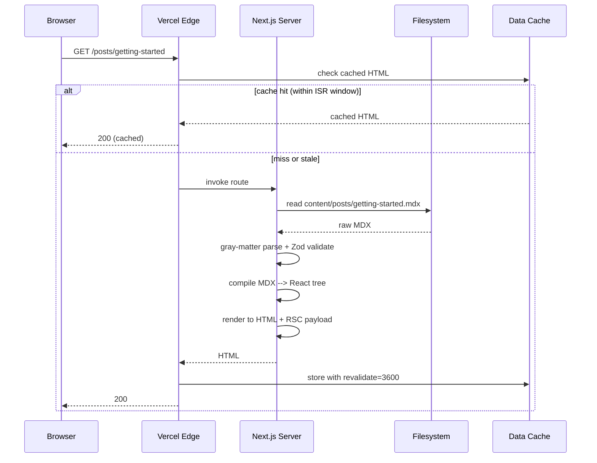
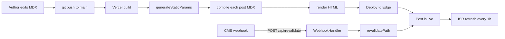

# 5.2 Blog

> A production-quality blog built on Next.js App Router with MDX content collections, static generation via `generateStaticParams`, ISR for revalidation on a schedule, full metadata API usage, `sitemap.ts` and `robots.ts`, an RSS feed generated by a Route Handler, syntax highlighting with Shiki, OG image generation with `next/og`, and reading-time estimation. This project is the single best way to internalize why the App Router exists — it touches routing, layouts, rendering strategies, the metadata API, and Route Handlers in a way that no tutorial example ever does.

## 5.2.1 Project Objective

By the end of this project you should be able to:

1. Model a content collection in the filesystem (a `content/posts/` directory with one MDX file per post, plus a typed frontmatter schema), validate it with Zod, and generate TypeScript types from that schema.
2. Render posts with `@next/mdx` (or `next-mdx-remote` for content stored outside the repo), with custom components mapping MDX elements to React components (`pre`  -->  a Shiki-highlighted code block, `img`  -->  `next/image`, `a`  -->  a component that adds external-link icons and `rel="noopener"`).
3. Use `generateStaticParams` to pre-render every post at build time, and `revalidate` to refresh the post on a schedule (ISR).
4. Use the App Router `metadata` and `generateMetadata` APIs to produce per-post title, description, OpenGraph, Twitter card, canonical URL, and JSON-LD `Article` schema.
5. Generate `sitemap.ts` and `robots.ts` so search engines can find every post.
6. Generate an RSS feed (Atom or RSS 2.0) at `/feed.xml` via a Route Handler, including the rendered excerpt and a link to each post.
7. Generate per-post OG images at `/api/og?slug=...` using `next/og` (`ImageResponse`) so social shares look professional.
8. Implement a category system with `/category/[slug]` routes, a tag system with `/tag/[slug]` routes, and a search page that filters posts client-side (or via a Route Handler if the post count grows large).

## 5.2.2 Reinforces Concepts From

- [[4.1 App Router Foundations]] — file-based routing, route segments.
- [[4.2 Routing, Layouts, and Templates]] — root layout, nested layouts, route groups for `(content)` vs `(marketing)`.
- [[4.3 Server and Client Components]] — almost the entire blog is Server Components; only the search input and the theme toggle are Client Components.
- [[4.4 Rendering Strategies]] — SSG for posts, ISR for revalidation, dynamic for search.
- [[4.5 Data Fetching]] — reading the filesystem from the server.
- [[4.6 Caching and Revalidation]] — `revalidate`, `revalidateTag`, on-demand revalidation via a webhook Route Handler.
- [[4.8 Route Handlers]] — RSS feed, OG image endpoint, on-demand revalidation webhook.
- [[4.9 Loading UI, Error Pages, and Streaming]] — `loading.tsx` for the post list, `error.tsx` for missing posts.
- [[4.10 Metadata and SEO]] — `metadata` object, `generateMetadata`, `viewport`, `sitemap.ts`, `robots.ts`, JSON-LD.
- [[4.11 Images, Fonts, and Optimization]] — `next/image` for hero images, `next/font` for Inter and a serif body face.
- [[3.5 Lists and Keys]] — post list, related posts.
- [[3.7 Custom Hooks]] — `useSearch` hook for client-side search.
- [[3.11 Performance Optimization]] — keeping the post list fast as the post count grows.

## 5.2.3 Requirements

### 5.2.3.1 Functional Requirements

1. **Home page** (`/`) — site header, hero with site tagline, latest six posts as cards (cover image, title, excerpt, reading time, date, category), newsletter signup, footer.
2. **Post list** (`/posts`) — paginated list of all posts, 10 per page. Pagination via query string (`?page=2`) or via path segments (`/posts/page/2`) — your choice, but be consistent. Sort by date descending.
3. **Post detail** (`/posts/[slug]`) — cover image (via `next/image`), title, subtitle, author block (avatar, name, role, bio), publish date, last updated date, reading time, category and tags as links, the MDX body rendered with custom components, a table of contents (auto-generated from H2/H3 headings), prev/next post navigation, related posts (three posts sharing at least one tag), and a footer CTA.
4. **Category pages** (`/category/[slug]`) — list of posts in that category, with the category name as the page title.
5. **Tag pages** (`/tag/[slug]`) — list of posts with that tag.
6. **Author pages** (`/author/[slug]`) — author bio and list of their posts.
7. **Search** (`/search?q=...`) — server-side filter on title, excerpt, and body. For small blogs (< 200 posts) you can do this with a simple `String.includes`; for larger blogs you'll want a Route Handler with an in-memory index.
8. **RSS feed** (`/feed.xml`) — RSS 2.0 (or Atom) feed with the latest 20 posts.
9. **Sitemap** (`/sitemap.xml`) — generated by `sitemap.ts`.
10. **Robots** (`/robots.txt`) — generated by `robots.ts`.
11. **OG images** (`/api/og?slug=...`) — per-post social card image with the title overlaid on a brand gradient.
12. **404 page** — friendly, with a search input and links to popular posts.

### 5.2.3.2 Non-Functional Requirements

| Requirement | Target |
|---|---|
| Lighthouse Performance (post detail, mobile) | ≥ 95 |
| Lighthouse SEO | 100 |
| First Contentful Paint (mobile, slow 4G) | < 1.2 s |
| Largest Contentful Paint | < 2.0 s |
| Cumulative Layout Shift | < 0.05 |
| Total page weight (post detail, no images) | < 100 KB gzipped |
| Build time for 100 posts | < 60 s |
| Revalidation interval (ISR) | 1 hour (configurable per route) |

### 5.2.3.3 Content Collection Requirements

- Every post is a single `.mdx` file in `content/posts/`.
- Frontmatter includes: `title`, `description`, `publishedAt` (ISO date), `updatedAt` (optional ISO date), `category` (one of a fixed enum), `tags` (array of strings), `author` (reference to an author file), `coverImage` (path or URL), `coverAlt` (string), `draft` (boolean, default false), `featured` (boolean, default false).
- Frontmatter is validated by a Zod schema. A post with invalid frontmatter fails the build.
- Authors live in `content/authors/` as `.json` files with `name`, `role`, `bio`, `avatar`, `twitter`, `website`.

### 5.2.3.4 Acceptance Criteria

- Every post URL returns 200 at build time (no runtime errors).
- Every post has a unique `<title>`, `<meta name="description">`, OpenGraph image, Twitter card, and JSON-LD `Article` schema.
- The RSS feed validates at `https://validator.w3.org/feed/`.
- `sitemap.xml` lists every published post, category, and tag page.
- `robots.txt` allows all crawlers and points to the sitemap.
- Draft posts (`draft: true`) are never visible in production, but are visible in development.
- Editing a post and pushing to `main` triggers a Vercel rebuild, and the post is live within the build time plus ISR interval.
- The OG image endpoint returns a 1200×630 PNG in under 200 ms.

## 5.2.4 Recommended Architecture

The blog is split into three logical layers:

```mermaid
flowchart TD
  subgraph ContentLayer[Content Layer - filesystem]
    MDX[content/posts/*.mdx]
    Authors[content/authors/*.json]
  end

  subgraph DataLayer[Data Layer - lib/content]
    Schema[Zod schema]
    Loader[loadPost, loadAllPosts, loadByTag]
    Index[search index builder]
  end

  subgraph RouteLayer[Route Layer - app/]
    Home[/]
    PostsList[/posts]
    PostDetail[/posts/slug]
    Category[/category/slug]
    Tag[/tag/slug]
    AuthorPage[/author/slug]
    Search[/search]
    Rss[/feed.xml]
    Og[/api/og]
    Revalidate[/api/revalidate]
  end

  ContentLayer --> DataLayer
  DataLayer --> RouteLayer
```

The **content layer** is the source of truth. The **data layer** reads it, validates it, and exposes typed functions. The **route layer** is thin — it calls the data layer, sets metadata, and renders components. This separation lets you swap the content source (filesystem  -->  CMS  -->  database) without touching the routes.

### 5.2.4.1 Why MDX (not just Markdown)?

MDX lets you import React components into your prose. You can drop a `<Callout>` inside a paragraph, embed a `<Chart>` component, or pull in a `<CodeSandbox>` embed. For a blog, this means your content can be interactive without the entire page being a React component.

### 5.2.4.2 Why `@next/mdx` (not `next-mdx-remote`)?

`@next/mdx` compiles MDX at build time, producing zero runtime cost. `next-mdx-remote` compiles at request time, which is necessary if your content is fetched from a CMS at runtime but is slower for filesystem content. Use `@next/mdx` for this project.

## 5.2.5 File Structure

```text
blog/
  - app/
      - (content)/
          - layout.tsx           # sidebar with categories, tags
          - posts/
              - page.tsx         # /posts
              - [slug]/
              - page.tsx     # /posts/[slug]
              - opengraph-image.tsx  # static OG fallback
          - category/[slug]/page.tsx
          - tag/[slug]/page.tsx
          - author/[slug]/page.tsx
      - (marketing)/
          - layout.tsx           # minimal header, no sidebar
          - page.tsx             # /
          - about/page.tsx
      - search/page.tsx
      - api/
          - og/route.tsx         # dynamic OG images
          - revalidate/route.ts  # on-demand ISR webhook
          - search/route.ts      # search index endpoint
      - feed.xml/route.ts        # RSS feed
      - sitemap.ts
      - robots.ts
      - layout.tsx               # root layout, fonts, metadata
      - loading.tsx
      - error.tsx
      - not-found.tsx
      - globals.css
  - content/
      - posts/
          - getting-started.mdx
          - ...
      - authors/
      - ada.json
      - ...
  - components/
      - PostCard.tsx
      - PostBody.tsx             # MDX components map
      - TableOfContents.tsx
      - AuthorCard.tsx
      - Pagination.tsx
      - SearchInput.tsx          # client component
      - mdx/
      - Pre.tsx              # Shiki-highlighted code block
      - Callout.tsx
      - Image.tsx
  - lib/
      - content/
          - schema.ts            # Zod schemas
          - posts.ts             # loadPost, loadAllPosts, etc.
          - authors.ts
          - search-index.ts
      - mdx.ts                   # compileMDX wrapper
      - reading-time.ts
      - utils.ts
  - mdx-components.tsx           # global MDX components map
  - next.config.mjs
  - tailwind.config.ts
  - tsconfig.json
  - package.json
  - README.md
```

## 5.2.6 Step-by-Step Build Order

1. **Scaffold**. `npx create-next-app@latest blog --ts --app --tailwind --eslint`. Install `@next/mdx @mdx-js/loader @mdx-js/react @types/mdx`, `shiki`, `zod`, `gray-matter`, `reading-time`, `feed` (for RSS generation, optional — you can hand-roll it).
2. **Configure MDX**. Edit `next.config.mjs` to add the MDX plugin and register `pageExtensions: ["ts", "tsx", "md", "mdx"]`.
3. **Define the schema**. In `lib/content/schema.ts`, write Zod schemas for `FrontmatterSchema` and `AuthorSchema`. Export inferred types.
4. **Write the data layer**. `loadAllPosts()` reads `content/posts/*.mdx`, parses frontmatter with `gray-matter`, validates with the schema, and returns a sorted array. `loadPost(slug)` returns one post plus its compiled MDX. `loadByTag(tag)` and `loadByCategory(category)` filter the array. Memoize at module scope so multiple calls in one request don't re-read the filesystem.
5. **Build the root layout**. Add `next/font` for Inter and a serif (Lora or Source Serif). Set base `metadata` with `metadataBase`, title template, default OpenGraph. Add `sitemap.ts` and `robots.ts`.
6. **Build the home page**. Hero, latest posts grid, newsletter form. Static generation (no `revalidate` — the home page can be rebuilt on deploy).
7. **Build the post list**. `/posts` with pagination. Use `generateStaticParams` to pre-render the first 5 pages; deeper pages are dynamic.
8. **Build the post detail page**. This is the heart of the project.
   - `generateStaticParams` returns `slugs` for every published post.
   - `generateMetadata` returns title, description, OG image URL, Twitter card, canonical, JSON-LD.
   - `revalidate = 3600` (one hour ISR).
   - The body renders MDX via the `mdx-components.tsx` map.
   - Reading time computed at build time from the raw MDX source.
   - Table of contents generated by parsing the MDX AST for H2/H3 (use `mdast-util-toc` or a regex on rendered HTML — the former is more correct).
9. **Build the MDX components map**. `Pre` uses Shiki to highlight code blocks. `Image` wraps `next/image` with sensible defaults. `a` adds external-link icons. `Callout` is a custom component used in MDX as `<Callout type="note">`.
10. **Build category, tag, and author pages**. All use `generateStaticParams` to enumerate the possible slugs.
11. **Build the search page**. For a small blog, build a `loadSearchIndex()` that returns `{ slug, title, description, body }[]` and serialize it to JSON in the page. A Client Component `SearchInput` filters it. For a larger blog, expose `/api/search?q=...` as a Route Handler that does server-side filtering.
12. **Build the RSS feed Route Handler**. `app/feed.xml/route.ts` reads the latest 20 posts, builds an RSS 2.0 XML string, and returns it with `Content-Type: application/rss+xml; charset=utf-8`.
13. **Build the OG image endpoint**. `app/api/og/route.tsx` uses `ImageResponse` from `next/og` to render a 1200×630 PNG with the post title, author, and date overlaid on a brand gradient. Cache with `Cache-Control: s-maxage=86400`.
14. **Build the on-demand revalidation webhook**. `app/api/revalidate/route.ts` accepts a POST with a secret token and a slug, and calls `revalidatePath('/posts/' + slug)` and `revalidatePath('/posts')`. This is what you call from your CMS webhook when content changes.
15. **Add JSON-LD**. In `generateMetadata`, set `alternates: { canonical }`. Use a `<script type="application/ld+json">` in the page body for the `Article` schema (the metadata API doesn't yet support JSON-LD directly).
16. **Add loading and error states**. `loading.tsx` for the post list shows a skeleton. `error.tsx` for the post detail shows a friendly message and a link back to `/posts`. `not-found.tsx` for missing slugs shows a search input.
17. **Audit**. Run Lighthouse. Check the RSS feed in a validator. Submit the sitemap to Google Search Console. Test the OG image by sharing a post URL in Slack.

## 5.2.7 Code Walkthrough

### 5.2.7.1 The Zod Frontmatter Schema

```ts
// lib/content/schema.ts
import { z } from "zod";

export const FrontmatterSchema = z.object({
  title: z.string().min(1).max(120),
  description: z.string().min(1).max(300),
  publishedAt: z.coerce.date(),
  updatedAt: z.coerce.date().optional(),
  category: z.enum(["Engineering", "Design", "Product", "Company"]),
  tags: z.array(z.string()).default([]),
  author: z.string().refine((s) => /^[a-z0-9-]+$/.test(s), "slug format"),
  coverImage: z.string(),
  coverAlt: z.string(),
  draft: z.boolean().default(false),
  featured: z.boolean().default(false),
});

export type Frontmatter = z.infer<typeof FrontmatterSchema>;

export const AuthorSchema = z.object({
  slug: z.string(),
  name: z.string(),
  role: z.string(),
  bio: z.string(),
  avatar: z.string(),
  twitter: z.string().optional(),
  website: z.string().url().optional(),
});
export type Author = z.infer<typeof AuthorSchema>;
```

### 5.2.7.2 Loading All Posts

```ts
// lib/content/posts.ts
import fs from "node:fs/promises";
import path from "node:path";
import matter from "gray-matter";
import readingTime from "reading-time";
import { FrontmatterSchema, type Frontmatter } from "./schema";

const POSTS_DIR = path.join(process.cwd(), "content", "posts");

export type PostMeta = Frontmatter & {
  slug: string;
  readingMinutes: number;
};

export type Post = PostMeta & {
  content: string; // raw MDX source
};

let _allPosts: Post[] | null = null;

export async function loadAllPosts({ includeDrafts = false } = {}): Promise<Post[]> {
  if (_allPosts) return _allPosts;
  const files = await fs.readdir(POSTS_DIR);
  const posts: Post[] = [];
  for (const file of files) {
    if (!file.endsWith(".mdx")) continue;
    const raw = await fs.readFile(path.join(POSTS_DIR, file), "utf8");
    const { data, content } = matter(raw);
    const fm = FrontmatterSchema.parse(data);
    if (fm.draft && !includeDrafts) continue;
    const slug = file.replace(/\.mdx$/, "");
    posts.push({
      ...fm,
      slug,
      content,
      readingMinutes: Math.max(1, Math.round(readingTime(content).minutes)),
    });
  }
  posts.sort((a, b) => b.publishedAt.getTime() - a.publishedAt.getTime());
  _allPosts = posts;
  return posts;
}

export async function loadPost(slug: string): Promise<Post | null> {
  const all = await loadAllPosts({ includeDrafts: process.env.NODE_ENV === "development" });
  return all.find((p) => p.slug === slug) ?? null;
}

export async function loadRelated(post: Post, limit = 3): Promise<PostMeta[]> {
  const all = await loadAllPosts();
  return all
    .filter((p) => p.slug !== post.slug)
    .map((p) => ({ p, score: p.tags.filter((t) => post.tags.includes(t)).length }))
    .filter(({ score }) => score > 0)
    .sort((a, b) => b.score - a.score)
    .slice(0, limit)
    .map(({ p }) => p);
}
```

> [!tip] Module-scope memoization
> The `_allPosts` cache survives for the lifetime of a server process. In development with hot reload, Next.js invalidates it correctly. In production, each serverless function invocation starts fresh — so the cache helps within a single request but not across requests. For cross-request caching, use `unstable_cache` from `next/cache`.

### 5.2.7.3 The Post Detail Page

```tsx
// app/(content)/posts/[slug]/page.tsx
import { notFound } from "next/navigation";
import { loadAllPosts, loadPost, loadRelated } from "@/lib/content/posts";
import { loadAuthor } from "@/lib/content/authors";
import { PostBody } from "@/components/PostBody";
import { TableOfContents } from "@/components/TableOfContents";
import { AuthorCard } from "@/components/AuthorCard";
import { PostCard } from "@/components/PostCard";
import { format } from "@/lib/utils";

export const revalidate = 3600; // ISR: refresh every hour

type Params = { params: { slug: string } };

export async function generateStaticParams() {
  const posts = await loadAllPosts();
  return posts.map((p) => ({ slug: p.slug }));
}

export async function generateMetadata({ params }: Params) {
  const post = await loadPost(params.slug);
  if (!post) return {};
  const url = `/posts/${post.slug}`;
  return {
    title: post.title,
    description: post.description,
    alternates: { canonical: url },
    openGraph: {
      type: "article",
      title: post.title,
      description: post.description,
      url,
      publishedTime: post.publishedAt.toISOString(),
      modifiedTime: post.updatedAt?.toISOString(),
      authors: [post.author],
      images: [`/api/og?slug=${post.slug}`],
    },
    twitter: {
      card: "summary_large_image",
      title: post.title,
      description: post.description,
      images: [`/api/og?slug=${post.slug}`],
    },
  };
}

export default async function PostPage({ params }: Params) {
  const post = await loadPost(params.slug);
  if (!post) notFound();
  const author = await loadAuthor(post.author);
  const related = await loadRelated(post);

  const jsonLd = {
    "@context": "https://schema.org",
    "@type": "BlogPosting",
    headline: post.title,
    description: post.description,
    image: `/api/og?slug=${post.slug}`,
    datePublished: post.publishedAt.toISOString(),
    dateModified: post.updatedAt?.toISOString(),
    author: { "@type": "Person", name: author?.name },
    mainEntityOfPage: { "@type": "WebPage", "@id": `/posts/${post.slug}` },
  };

  return (
    <article className="mx-auto max-w-3xl px-6 py-16">
      <script type="application/ld+json" dangerouslySetInnerHTML={{ __html: JSON.stringify(jsonLd) }} />
      <header className="mb-10">
        <p className="text-sm text-neutral-500">
          {post.category} · {format(post.publishedAt, "MMMM d, yyyy")} · {post.readingMinutes} min read
        </p>
        <h1 className="mt-2 text-4xl font-bold tracking-tight">{post.title}</h1>
        <p className="mt-4 text-lg text-neutral-600">{post.description}</p>
      </header>
      {author && <AuthorCard author={author} />}
      <TableOfContents source={post.content} />
      <PostBody source={post.content} />
      {related.length > 0 && (
        <section className="mt-16 border-t pt-10">
          <h2 className="mb-6 text-2xl font-semibold">Related posts</h2>
          <div className="grid gap-6 sm:grid-cols-3">
            {related.map((p) => <PostCard key={p.slug} post={p} />)}
          </div>
        </section>
      )}
    </article>
  );
}
```

### 5.2.7.4 MDX Components Map With Shiki

```tsx
// mdx-components.tsx
import type { MDXComponents } from "mdx/types";
import Image from "next/image";
import Link from "next/link";
import { HighlightedCode } from "@/components/mdx/Pre";
import { Callout } from "@/components/mdx/Callout";

export function useMDXComponents(components: MDXComponents): MDXComponents {
  return {
    h1: (props) => <h1 className="mt-10 mb-4 text-3xl font-bold tracking-tight" {...props} />,
    h2: (props) => <h2 className="mt-10 mb-4 text-2xl font-semibold" {...props} />,
    h3: (props) => <h3 className="mt-8 mb-3 text-xl font-semibold" {...props} />,
    p: (props) => <p className="my-4 leading-7 text-neutral-700" {...props} />,
    a: ({ href, children }) => {
      const external = href?.startsWith("http");
      return external ? (
        <a href={href} rel="noopener noreferrer" target="_blank" className="text-brand-600 underline">
          {children}
        </a>
      ) : (
        <Link href={href!} className="text-brand-600 underline">{children}</Link>
      );
    },
    pre: HighlightedCode,
    img: (props) => (
      <Image
        src={props.src!}
        alt={props.alt ?? ""}
        width={1200}
        height={675}
        className="rounded-lg my-8"
      />
    ),
    Callout,
    ...components,
  };
}
```

```tsx
// components/mdx/Pre.tsx
import { getHighlighter } from "shiki";

const highlighterPromise = getHighlighter({
  themes: ["github-light", "github-dark"],
  langs: ["ts", "tsx", "js", "jsx", "bash", "css", "json", "md"],
});

export async function HighlightedCode({ children }: { children: React.ReactNode }) {
  const code = String(children).replace(/\n$/, "");
  const highlighter = await highlighterPromise;
  const lang = "tsx"; // In real usage, parse from className
  const html = highlighter.codeToHtml(code, {
    lang,
    themes: { light: "github-light", dark: "github-dark" },
    defaultColor: false,
  });
  return <div className="my-6 overflow-x-auto rounded-lg" dangerouslySetInnerHTML={{ __html: html }} />;
}
```

### 5.2.7.5 The RSS Feed Route Handler

```ts
// app/feed.xml/route.ts
import { loadAllPosts } from "@/lib/content/posts";
import { loadAuthor } from "@/lib/content/authors";

const SITE_URL = process.env.NEXT_PUBLIC_SITE_URL ?? "http://localhost:3000";

export async function GET() {
  const posts = await loadAllPosts();
  const items = posts.slice(0, 20).map((p) => `
    <item>
      <title>${escapeXml(p.title)}</title>
      <link>${SITE_URL}/posts/${p.slug}</link>
      <guid isPermaLink="true">${SITE_URL}/posts/${p.slug}</guid>
      <description>${escapeXml(p.description)}</description>
      <pubDate>${p.publishedAt.toUTCString()}</pubDate>
      <category>${escapeXml(p.category)}</category>
    </item>`).join("\n");

  const xml = `<?xml version="1.0" encoding="UTF-8"?>
<rss version="2.0" xmlns:atom="http://www.w3.org/2005/Atom">
  <channel>
    <title>The Blog</title>
    <link>${SITE_URL}</link>
    <description>Essays on frontend engineering</description>
    <language>en-us</language>
    <atom:link href="${SITE_URL}/feed.xml" rel="self" type="application/rss+xml" />
    ${items}
  </channel>
</rss>`;

  return new Response(xml, {
    headers: {
      "Content-Type": "application/rss+xml; charset=utf-8",
      "Cache-Control": "s-maxage=3600, stale-while-revalidate",
    },
  });
}

function escapeXml(s: string) {
  return s.replace(/[<>&'"]/g, (c) =>
    ({ "<": "&lt;", ">": "&gt;", "&": "&amp;", "'": "&apos;", '"': "&quot;" }[c]!)
  );
}
```

### 5.2.7.6 The OG Image Route Handler

```tsx
// app/api/og/route.tsx
import { ImageResponse } from "next/og";
import { loadPost } from "@/lib/content/posts";
import { loadAuthor } from "@/lib/content/authors";

export const runtime = "edge";
export const size = { width: 1200, height: 630 };
export const contentType = "image/png";

export async function GET(req: Request) {
  const { searchParams } = new URL(req.url);
  const slug = searchParams.get("slug");
  if (!slug) return new Response("Missing slug", { status: 400 });
  const post = await loadPost(slug);
  if (!post) return new Response("Not found", { status: 404 });
  const author = await loadAuthor(post.author);

  return new ImageResponse(
    (
      <div style={{
        display: "flex",
        flexDirection: "column",
        justifyContent: "space-between",
        width: "100%",
        height: "100%",
        background: "linear-gradient(135deg, #0f172a 0%, #1e3a8a 100%)",
        color: "white",
        padding: 80,
        fontFamily: "sans-serif",
      }}>
        <div style={{ display: "flex", alignItems: "center", gap: 16 }}>
          <div style={{ fontSize: 28, opacity: 0.8 }}>{post.category}</div>
        </div>
        <div style={{ display: "flex", fontSize: 64, fontWeight: 700, lineHeight: 1.1, letterSpacing: -1 }}>
          {post.title}
        </div>
        <div style={{ display: "flex", justifyContent: "space-between", alignItems: "flex-end" }}>
          <div style={{ display: "flex", fontSize: 28 }}>{author?.name}</div>
          <div style={{ display: "flex", fontSize: 28, opacity: 0.7 }}>theblog.com</div>
        </div>
      </div>
    ),
    { ...size }
  );
}
```

### 5.2.7.7 The Sitemap and Robots Files

```ts
// app/sitemap.ts
import { loadAllPosts } from "@/lib/content/posts";
import { loadAllAuthors } from "@/lib/content/authors";

const SITE_URL = process.env.NEXT_PUBLIC_SITE_URL ?? "http://localhost:3000";

export default async function sitemap() {
  const posts = await loadAllPosts();
  const authors = await loadAllAuthors();
  const categories = ["Engineering", "Design", "Product", "Company"];
  const tags = Array.from(new Set(posts.flatMap((p) => p.tags)));

  const postUrls = posts.map((p) => ({
    url: `${SITE_URL}/posts/${p.slug}`,
    lastModified: p.updatedAt ?? p.publishedAt,
    changeFrequency: "monthly" as const,
    priority: 0.8,
  }));
  const categoryUrls = categories.map((c) => ({
    url: `${SITE_URL}/category/${c.toLowerCase()}`,
    lastModified: new Date(),
    changeFrequency: "weekly" as const,
    priority: 0.4,
  }));
  const tagUrls = tags.map((t) => ({
    url: `${SITE_URL}/tag/${t}`,
    lastModified: new Date(),
    changeFrequency: "weekly" as const,
    priority: 0.3,
  }));
  const authorUrls = authors.map((a) => ({
    url: `${SITE_URL}/author/${a.slug}`,
    lastModified: new Date(),
    changeFrequency: "monthly" as const,
    priority: 0.4,
  }));

  return [
    { url: SITE_URL, lastModified: new Date(), changeFrequency: "weekly", priority: 1 },
    { url: `${SITE_URL}/posts`, lastModified: new Date(), changeFrequency: "daily", priority: 0.9 },
    ...postUrls, ...categoryUrls, ...tagUrls, ...authorUrls,
  ];
}
```

```ts
// app/robots.ts
import type { MetadataRoute } from "next";
const SITE_URL = process.env.NEXT_PUBLIC_SITE_URL ?? "http://localhost:3000";
export default function robots(): MetadataRoute.Robots {
  return {
    rules: { userAgent: "*", allow: "/", disallow: ["/api/"] },
    sitemap: `${SITE_URL}/sitemap.xml`,
    host: SITE_URL,
  };
}
```

### 5.2.7.8 The Table of Contents Component

```tsx
// components/TableOfContents.tsx
import { toc } from "mdast-util-toc";
import { fromMarkdown } from "mdast-util-from-markdown";
import { toString } from "mdast-util-to-string";

export function TableOfContents({ source }: { source: string }) {
  const tree = fromMarkdown(source);
  const result = toc(tree, { heading: "Contents|Table of Contents" });
  if (!result.map) return null;

  const items: { depth: number; slug: string; text: string }[] = [];
  walk(result.map, items);

  return (
    <nav aria-label="Table of contents" className="my-10 rounded-lg bg-neutral-50 p-6">
      <p className="mb-3 text-sm font-semibold uppercase text-neutral-500">On this page</p>
      <ul className="space-y-1 text-sm">
        {items.map((it) => (
          <li key={it.slug} style={{ paddingLeft: (it.depth - 2) * 12 }}>
            <a href={`#${it.slug}`} className="text-neutral-600 hover:text-brand-600">
              {it.text}
            </a>
          </li>
        ))}
      </ul>
    </nav>
  );
}

function walk(node: any, out: any[]) {
  if (node.type === "listItem") {
    const heading = node.children?.[0];
    if (heading?.type === "paragraph") {
      const text = toString(heading);
      out.push({ depth: 2, slug: slugify(text), text });
    }
  }
  if (node.children) node.children.forEach((c: any) => walk(c, out));
}

function slugify(s: string) {
  return s.toLowerCase().replace(/[^\w\s-]/g, "").replace(/\s+/g, "-");
}
```

## 5.2.8 Mermaid Diagrams

### 5.2.8.1 Request Lifecycle for a Post



### 5.2.8.2 Content Edit  -->  Live Flow



## 5.2.9 Common Pitfalls

1. **Reading the filesystem in a Client Component.** `fs.readFile` is server-only. If you accidentally import a server-only module into a Client Component, Next.js throws a build error. Keep all content-loading code in `lib/` and only import it from Server Components or Route Handlers. Mark the file `// @ts-expect-error server-only` or use the `server-only` package to enforce this.
2. **Forgetting `generateStaticParams`** for a dynamic route. Without it, the route is dynamic — every request hits the server. With it, the route is pre-rendered at build time. ISR (`revalidate`) requires `generateStaticParams` to be useful.
3. **RSS feed that doesn't escape XML.** A `&` in a post title breaks the entire feed. Always run your strings through an XML-escape function. Better yet, use the `feed` npm package which handles this for you.
4. **OG images that don't render in Slack.** Slack aggressively caches OG images. If you regenerate an image, Slack won't refresh for hours. Use `Cache-Control: s-maxage=86400` and version the URL with the post's `updatedAt` timestamp.
5. **Shiki loaded on every request.** `getHighlighter` is expensive (~500ms). Cache the promise at module scope, as in the code above. Better yet, pre-highlight at build time and store the HTML — for a blog, you don't need runtime highlighting.
6. **Draft posts visible in production.** If you forget the `if (fm.draft && !includeDrafts) continue;` check, drafts go live. Always test with `NODE_ENV=production next build` before deploying.
7. **Reading time computed on the rendered HTML.** Compute reading time on the raw MDX source, not the rendered HTML — otherwise code blocks count as words and inflate the estimate.
8. **Forgetting the `<link rel="alternate" type="application/rss+xml">`.** Add it in your root layout's metadata so RSS readers can auto-discover your feed. Without it, readers have to type the URL manually.
9. **JSON-LD with a relative URL.** Google requires absolute URLs in JSON-LD. Always prefix with your `NEXT_PUBLIC_SITE_URL`.
10. **Search that loads the entire post body into the client.** For 100 posts this is fine (~200KB). For 1000 posts it's not. Build a search index that's just `{ slug, title, description, tags }` and skip body search, or use a real search solution like Pagefind or Algolia.

## 5.2.10 Stretch Goals

1. **Pagefind for full-text search.** Pagefind generates a static search index at build time. Add it as a post-build step. The Client Component calls `import { search } from '@pagefind/default-ui'` and gets sub-50ms search across the entire blog.
2. **View counts.** Add a Route Handler that increments a counter in Upstash Redis (free tier) and a Client Component that fetches and displays the count. Display "X views" on each post.
3. **Comments via Giscus.** Embed GitHub Discussions as a comment system. Zero backend, zero cost, ties to your repo.
4. **Newsletter integration.** Wire the form to Buttondown or ConvertKit's API via a Server Action. Validate email with Zod, show success/error states, double-opt-in.
5. **Per-post analytics.** Use Vercel Analytics (free) to get per-page views without writing any code. For event-level analytics (clicks on CTAs, scroll depth), use the `analytics` package's `track()` function.

## 5.2.11 Self-Assessment Rubric

| # | Criterion | 0 | 1 | 2 | 3 |
|---|---|---|---|---|---|
| 1 | Content collection schema | none | JS object | Zod schema, no types exported | Zod + inferred types + draft handling |
| 2 | MDX integration | markdown only | MDX but no custom components | custom components for code/links/images | custom components + Shiki + Callout |
| 3 | Static generation | dynamic only | SSG without `generateStaticParams` | SSG + `generateStaticParams` | SSG + ISR + on-demand revalidation |
| 4 | Metadata | title only | title + description | OG + Twitter + canonical | OG + Twitter + JSON-LD + per-post OG image |
| 5 | RSS feed | missing | hand-rolled, doesn't validate | validates but no caching | validates, cached, discoverable via `<link>` |
| 6 | sitemap.ts + robots.ts | missing | sitemap only | both, hardcoded URLs | both, generated from content |
| 7 | Search | missing | client-side filter on titles | server-side Route Handler | Pagefind or equivalent |
| 8 | Performance (Lighthouse mobile) | < 70 | 70–84 | 85–94 | ≥ 95 |
| 9 | Draft workflow | no draft support | drafts visible in prod | drafts hidden in prod | drafts hidden + preview deploy shows them |
| 10 | Documentation | none | README | README + content authoring guide | README + guide + screenshot of search console |

## 5.2.12 Related Notes

- [[4.1 App Router Foundations]]
- [[4.2 Routing, Layouts, and Templates]]
- [[4.4 Rendering Strategies]]
- [[4.5 Data Fetching]]
- [[4.6 Caching and Revalidation]]
- [[4.8 Route Handlers]]
- [[4.10 Metadata and SEO]]
- [[4.11 Images, Fonts, and Optimization]]
- [[5.3 Portfolio]] — same primitives, smaller scope, single author
- [[5.4 Documentation Website]] — same MDX setup with extra nav complexity
