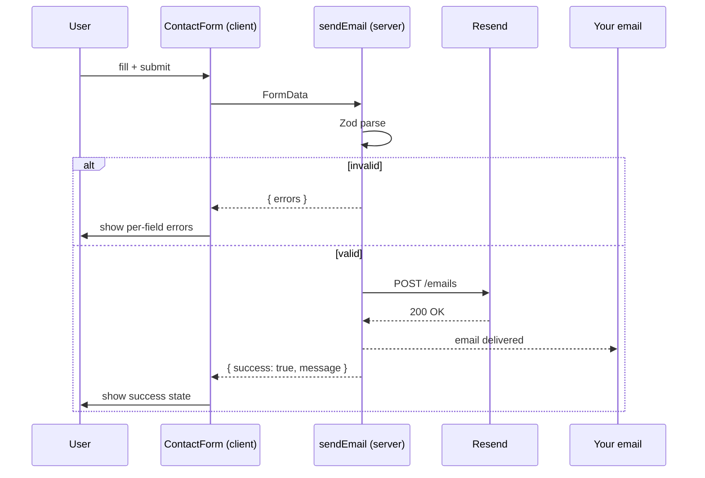

# 5.3 Portfolio

> A personal portfolio website deployed to Vercel that showcases your work, your writing, and a way to contact you. It is intentionally smaller in scope than [[5.2 Blog]] — a single author, a handful of projects, optional blog section — but it is the project most likely to be seen by recruiters and hiring managers. Every detail matters: the typography, the load time, the OG image, the contact form's success state. This project reinforces responsive design, animations, accessibility, static generation, the metadata API, `next/image`, and `next/font` in a focused, ship-it-quality context.

## 5.3.1 Project Objective

By the end of this project you should be able to:

1. Design a single-author content site in Next.js App Router where every page is statically generated at build time — no server runtime required, no ISR needed (the content changes only when you push to `main`).
2. Use `next/font` to self-host Inter for UI text and a display face (e.g., General Sans, Cabinet Grotesk, or a Google Font) for headlines. No FOUT, no layout shift, no external requests.
3. Use `next/image` for every raster image — cover images, project screenshots, avatars — with proper `width`/`height`, `sizes`, `priority` for above-the-fold, and `loading="lazy"` for below.
4. Use the metadata API to produce per-page titles, descriptions, OpenGraph images, and a JSON-LD `Person` schema on the home page.
5. Build a contact form that uses a Server Action to email you via a transactional service (Resend, Postmark) without exposing the API key to the client. Validate input with Zod. Show success and error states without a full page reload.
6. Build a projects showcase with filtering by tag, modal previews, and keyboard navigation.
7. Deploy to Vercel, set up a custom domain, configure DNS, and verify the deployment with a Lighthouse audit.
8. Write an "about" page that doubles as a resume: skills, experience timeline, education, and a downloadable PDF (generated by a Route Handler that returns `application/pdf`).

## 5.3.2 Reinforces Concepts From

- [[1.7 Responsive Design and Container Queries]] — projects grid, timeline.
- [[1.9 Animations, Transitions, and Transforms]] — hero entrance, project card hover, modal transitions.
- [[1.11 Accessibility in CSS]] — focus rings, reduced motion, color contrast.
- [[4.1 App Router Foundations]] — file structure.
- [[4.2 Routing, Layouts, and Templates]] — root layout with header/footer.
- [[4.3 Server and Client Components]] — almost everything is a Server Component; only the contact form, theme toggle, and project filter are Client Components.
- [[4.4 Rendering Strategies]] — SSG for every page.
- [[4.7 Server Actions and Forms]] — the contact form.
- [[4.10 Metadata and SEO]] — per-page metadata, JSON-LD.
- [[4.11 Images, Fonts, and Optimization]] — `next/image`, `next/font`.
- [[2.7 Tailwind with React and Next.js]] — `cn` utility, `cva` for buttons.
- [[3.4 Forms and Conditional Rendering]] — contact form state.
- [[3.13 Error Boundaries and Debugging]] — error UI for the contact form.

## 5.3.3 Requirements

### 5.3.3.1 Functional Requirements

1. **Home page** (`/`) — a hero with your name, your one-line value proposition, two CTAs ("View work", "Get in touch"), a small set of social links (GitHub, LinkedIn, Twitter/X, email), and a "selected work" preview (3 projects).
2. **About page** (`/about`) — a longer bio, a skills section grouped by category (Languages, Frameworks, Tools, Soft skills), an experience timeline (reverse chronological), education, and a link to download your resume as PDF.
3. **Projects page** (`/projects`) — a grid of all projects with a tag filter (e.g., "All", "React", "Next.js", "TypeScript", "CSS"). Clicking a project opens a modal with larger screenshots, a longer description, the tech stack, and links to live demo + source.
4. **Project detail** (`/projects/[slug]`) — a standalone page for each project (in case someone links directly). Same content as the modal but in a full page layout with a "next project" link at the bottom.
5. **Blog section** (`/writing`) — optional but recommended. If you've completed [[5.2 Blog]], reuse the same content layer; if not, link to your dev.to or Medium profile.
6. **Contact page** (`/contact`) — a form with name, email, subject, message. Server Action validates with Zod and emails you via Resend. Success state shows a confirmation message; error state shows per-field errors inline.
7. **404 page** — friendly, on-brand, with a link back home.
8. **PDF resume** (`/resume.pdf`) — generated by a Route Handler using `@react-pdf/renderer` (or, simpler, a static PDF in `public/`). The dynamic version lets you regenerate from a data file.

### 5.3.3.2 Non-Functional Requirements

| Requirement | Target |
|---|---|
| Lighthouse Performance (mobile) | ≥ 98 |
| Lighthouse Accessibility | 100 |
| Lighthouse Best Practices | 100 |
| Lighthouse SEO | 100 |
| First Contentful Paint | < 0.8 s |
| Largest Contentful Paint | < 1.2 s |
| Total page weight (home, no images) | < 80 KB gzipped |
| Cumulative Layout Shift | 0 |
| Custom domain | `yourname.dev` (or equivalent) |
| HTTPS | Automatic via Vercel |
| HTTP/2 | Automatic via Vercel |

### 5.3.3.3 Acceptance Criteria

- Every page returns 200 and is pre-rendered at build time (verify with `next build` output showing `○ (Static)` for every route).
- The contact form works end-to-end: filling it out sends you an email, the user sees a success state, and invalid input shows inline errors.
- The projects filter is keyboard-accessible (`Tab` to focus a filter chip, `Enter` to apply).
- All images have explicit `width` and `height` (or `aspect-ratio`), `alt` text, and use `next/image` so they're served as WebP/AVIF at appropriate sizes.
- The site has no horizontal scroll on any viewport from 320px to 2560px.
- The site is deployed to a custom domain on Vercel.
- A Lighthouse report (mobile, slow 4G, throttled CPU) scores 98+ on all four categories on the home page.
- The OG image for the home page is a 1200×630 PNG with your name, role, and a small portrait or logo.

## 5.3.4 Recommended Architecture

The portfolio is a static site. There is no database, no CMS, no server-side state. Content lives in TypeScript data files so you get type safety and IDE autocomplete. The contact form is the only dynamic piece — it's a Server Action that calls Resend's API.

```mermaid
flowchart TD
  subgraph DataLayer[data/ - TypeScript content]
    Projects[data/projects.ts]
    Experience[data/experience.ts]
    Skills[data/skills.ts]
    Socials[data/socials.ts]
  end

  subgraph AppRouter[app/]
    Layout[layout.tsx - fonts, metadata, ThemeProvider]
    Home[/]
    About[/about]
    ProjectsPage[/projects]
    ProjectDetail[/projects/slug]
    Contact[/contact]
    NotFound[not-found.tsx]
    ResumePDF[/resume.pdf]
  end

  subgraph ServerActions[Server Actions]
    ContactAction[contact.ts - sendEmail]
  end

  DataLayer --> AppRouter
  AppRouter --> ServerActions
  ServerActions --> Resend[Resend API]
```

### 5.3.4.1 Why Not Use a CMS?

For a portfolio that changes a few times a year, a CMS is overkill. TypeScript data files give you:
- Type safety (a typo in a project's `slug` is a build error, not a 404).
- Version control (your content is in git, with full history).
- Zero runtime cost (no CMS API calls).
- IDE autocomplete when editing.

If you start writing more frequently, graduate to a headless CMS — but only when the friction of editing TS files outweighs the cost of maintaining the CMS integration.

### 5.3.4.2 Why Server Actions for the contact form?

A Server Action runs on the server, so your Resend API key never ships to the client. The form is progressively enhanced — it works without JavaScript. There's no CORS configuration, no separate API route to maintain. See [[4.7 Server Actions and Forms]].

## 5.3.5 File Structure

```text
portfolio/
  - app/
      - layout.tsx
      - page.tsx                      # /
      - about/page.tsx
      - projects/
          - page.tsx                  # /projects
          - [slug]/page.tsx           # /projects/[slug]
      - contact/
          - page.tsx                  # Server Component shell
          - contact-form.tsx          # Client Component
      - writing/page.tsx              # optional
      - resume.pdf/route.ts           # dynamic PDF generation
      - opengraph-image.tsx           # default OG image
      - not-found.tsx
      - globals.css
  - components/
      - ui/
          - Button.tsx
          - Container.tsx
          - ThemeToggle.tsx
      - layout/
          - Navbar.tsx
          - Footer.tsx
      - home/
          - Hero.tsx
          - SelectedWork.tsx
          - SocialLinks.tsx
      - projects/
          - ProjectGrid.tsx
          - ProjectCard.tsx
          - ProjectFilter.tsx         # client component
          - ProjectModal.tsx          # client component
      - about/
      - Timeline.tsx
      - Skills.tsx
      - DownloadResume.tsx
  - data/
      - site.ts                       # name, role, bio, avatar, socials
      - projects.ts
      - experience.ts
      - skills.ts
      - writing.ts                    # if you have a blog
  - lib/
      - actions/
          - contact.ts                # sendEmail Server Action
      - schema/
          - contact.ts                # Zod schema
      - utils.ts
  - public/
      - images/                       # project screenshots
      - avatar.jpg
      - favicon.ico
  - next.config.mjs
  - tailwind.config.ts
  - tsconfig.json
  - package.json
```

## 5.3.6 Step-by-Step Build Order

1. **Scaffold**. `npx create-next-app@latest portfolio --ts --app --tailwind --eslint`.
2. **Set up fonts**. In `app/layout.tsx`, configure `next/font/google` for Inter (body) and a display face for headlines. Assign CSS variables (`--font-sans`, `--font-display`) and use them in Tailwind's `fontFamily` config.
3. **Set up the theme**. Inline blocking script in `<head>` for no-FOUC dark mode. Tailwind `darkMode: "class"`. A `ThemeToggle` Client Component.
4. **Build the data layer**. Write `data/site.ts` first (your name, role, bio, avatar path, socials). Then `data/projects.ts` with a typed `Project` interface. Then `data/experience.ts` and `data/skills.ts`. Use TypeScript `as const` for enums.
5. **Build the layout**. `Navbar` with logo (your name), nav links (Work, About, Writing, Contact), and the theme toggle. `Footer` with social links, copyright, and "built with Next.js" line. Both are Server Components (the toggle is a child Client Component).
6. **Build the home page**. Hero with name, value prop, CTAs. SelectedWork previews three featured projects. SocialLinks with icon SVGs. Animate the hero entrance with a CSS animation that respects `prefers-reduced-motion`.
7. **Build the about page**. Long-form bio (3-5 paragraphs). Skills section as a 2-column grid grouped by category. Experience timeline as a vertical list with year, role, company, and 1-2 sentences. DownloadResume button linking to `/resume.pdf`.
8. **Build the projects list**. `ProjectGrid` is a Server Component that reads `data/projects.ts`. `ProjectFilter` is a Client Component that takes the projects as props and filters by tag. Each `ProjectCard` opens a `ProjectModal` (also Client) on click.
9. **Build the project detail page**. `generateStaticParams` for every project slug. `generateMetadata` for title, description, OG image. Same content as the modal, but full-page. "Next project" link at the bottom (computed from the project list).
10. **Build the contact form**. Zod schema for name, email, subject, message. Server Action `sendEmail` that calls Resend. `ContactForm` Client Component uses `useActionState` (React 19) for state, `useFormStatus` for the submit button's pending state. Show per-field errors from the Zod result.
11. **Build the resume PDF Route Handler**. Either place a static `resume.pdf` in `public/` (simplest) or use `@react-pdf/renderer` to render a PDF from `data/experience.ts` and `data/skills.ts` dynamically. The dynamic version means updating your data file also updates your resume.
12. **Build the OG image**. `app/opengraph-image.tsx` uses `next/og`'s `ImageResponse` to render your name, role, and a small portrait. Cache for 24 hours.
13. **Build the 404 page**. On-brand, with a link home.
14. **Deploy to Vercel**. Push to GitHub. Import the repo into Vercel. Set the `RESEND_API_KEY` environment variable. Deploy.
15. **Configure the custom domain**. Buy a domain (Namecheap, Porkbun). Add it to your Vercel project. Update DNS: an `A` record pointing to Vercel's `76.76.21.21`, and a `CNAME` for `www` pointing to `cname.vercel-dns.com`. Verify HTTPS is automatic.
16. **Audit**. Run Lighthouse on the production URL. Fix any issues. Submit the sitemap to Google Search Console. Share the URL.

## 5.3.7 Code Walkthrough

### 5.3.7.1 The Root Layout With Fonts and Theme

```tsx
// app/layout.tsx
import type { Metadata } from "next";
import { Inter, Fraunces } from "next/font/google";
import { site } from "@/data/site";
import { ThemeProvider } from "@/components/ThemeProvider";
import { Navbar } from "@/components/layout/Navbar";
import { Footer } from "@/components/layout/Footer";
import "./globals.css";

const inter = Inter({
  subsets: ["latin"],
  variable: "--font-sans",
  display: "swap",
});

const fraunces = Fraunces({
  subsets: ["latin"],
  variable: "--font-display",
  display: "swap",
});

export const metadata: Metadata = {
  metadataBase: new URL(site.url),
  title: { default: `${site.name} — ${site.role}`, template: `%s — ${site.name}` },
  description: site.bio,
  openGraph: {
    type: "website",
    url: site.url,
    title: `${site.name} — ${site.role}`,
    description: site.bio,
    siteName: site.name,
  },
  twitter: { card: "summary_large_image", creator: site.socials.twitter },
  robots: { index: true, follow: true },
};

export default function RootLayout({ children }: { children: React.ReactNode }) {
  return (
    <html lang="en" suppressHydrationWarning className={`${inter.variable} ${fraunces.variable}`}>
      <head>
        <script
          dangerouslySetInnerHTML={{
            __html: `(function(){try{var t=localStorage.getItem('theme');var d=window.matchMedia('(prefers-color-scheme: dark)').matches;if(t==='dark'||(!t&&d))document.documentElement.classList.add('dark');}catch(e){}})();`,
          }}
        />
      </head>
      <body className="min-h-screen bg-white font-sans text-neutral-900 antialiased dark:bg-neutral-950 dark:text-neutral-100">
        <ThemeProvider>
          <Navbar />
          <main>{children}</main>
          <Footer />
        </ThemeProvider>
      </body>
    </html>
  );
}
```

### 5.3.7.2 The Projects Data File

```ts
// data/projects.ts
export type Project = {
  slug: string;
  title: string;
  tagline: string;
  description: string;
  year: number;
  tags: string[];
  cover: string;            // path in /public/images
  coverAlt: string;
  screenshots: { src: string; alt: string }[];
  techStack: string[];
  links: { live?: string; source?: string };
  featured: boolean;
};

export const projects: Project[] = [
  {
    slug: "kanban-board",
    title: "Trellix",
    tagline: "A Trello-lite kanban board with drag-and-drop",
    description: "Built with React 19, dnd-kit, and useReducer. Persists to localStorage, supports optimistic updates and keyboard-driven card movement.",
    year: 2025,
    tags: ["React", "TypeScript", "dnd-kit"],
    cover: "/images/projects/trellix/cover.png",
    coverAlt: "Trellix kanban board showing three columns of cards",
    screenshots: [
      { src: "/images/projects/trellix/board.png", alt: "Full board view" },
      { src: "/images/projects/trellix/card-detail.png", alt: "Card detail modal" },
    ],
    techStack: ["React 19", "TypeScript", "Tailwind", "dnd-kit", "Vite"],
    links: { live: "https://trellix.example.com", source: "https://github.com/you/trellix" },
    featured: true,
  },
  // ...more projects
];
```

### 5.3.7.3 The Project Detail Page

```tsx
// app/projects/[slug]/page.tsx
import { notFound } from "next/navigation";
import Image from "next/image";
import { projects } from "@/data/projects";
import { Button } from "@/components/ui/Button";
import Link from "next/link";

export function generateStaticParams() {
  return projects.map((p) => ({ slug: p.slug }));
}

export function generateMetadata({ params }: { params: { slug: string } }) {
  const project = projects.find((p) => p.slug === params.slug);
  if (!project) return {};
  return {
    title: project.title,
    description: project.tagline,
    openGraph: {
      title: project.title,
      description: project.tagline,
      images: [project.cover],
    },
  };
}

export default function ProjectPage({ params }: { params: { slug: string } }) {
  const project = projects.find((p) => p.slug === params.slug);
  if (!project) notFound();

  const idx = projects.findIndex((p) => p.slug === project.slug);
  const next = projects[(idx + 1) % projects.length];

  return (
    <article className="mx-auto max-w-3xl px-6 py-16">
      <Link href="/projects" className="text-sm text-neutral-500 hover:text-brand-600"> <--  All projects</Link>
      <header className="mt-6 mb-10">
        <h1 className="font-display text-4xl font-semibold tracking-tight">{project.title}</h1>
        <p className="mt-3 text-lg text-neutral-600 dark:text-neutral-400">{project.tagline}</p>
        <div className="mt-4 flex flex-wrap gap-2">
          {project.techStack.map((tech) => (
            <span key={tech} className="rounded-full bg-neutral-100 px-3 py-1 text-xs dark:bg-neutral-800">
              {tech}
            </span>
          ))}
        </div>
      </header>
      <Image
        src={project.cover}
        alt={project.coverAlt}
        width={1600}
        height={1000}
        priority
        sizes="(max-width: 768px) 100vw, 768px"
        className="rounded-lg"
      />
      <div className="prose mt-10 max-w-none">
        <p>{project.description}</p>
      </div>
      <div className="mt-10 flex gap-4">
        {project.links.live && <Button asChild><a href={project.links.live}>Visit live  --> </a></Button>}
        {project.links.source && <Button variant="secondary" asChild><a href={project.links.source}>View source</a></Button>}
      </div>
      <div className="mt-16 border-t pt-8">
        <Link href={`/projects/${next.slug}`} className="text-brand-600 hover:underline">
          Next project: {next.title}  --> 
        </Link>
      </div>
    </article>
  );
}
```

### 5.3.7.4 The Contact Form (Server Action + Client Component)

```ts
// lib/schema/contact.ts
import { z } from "zod";

export const contactSchema = z.object({
  name: z.string().min(2, "Name is required"),
  email: z.string().email("Enter a valid email"),
  subject: z.string().min(3, "Subject is required"),
  message: z.string().min(20, "Message must be at least 20 characters"),
});

export type ContactInput = z.infer<typeof contactSchema>;
```

```ts
// lib/actions/contact.ts
"use server";
import { Resend } from "resend";
import { contactSchema } from "@/lib/schema/contact";
import { site } from "@/data/site";

const resend = new Resend(process.env.RESEND_API_KEY);

export type ContactState = {
  errors?: Partial<Record<keyof ContactInput, string>>;
  success?: boolean;
  message?: string;
};

export async function sendEmail(_prev: ContactState, formData: FormData): Promise<ContactState> {
  const parsed = contactSchema.safeParse({
    name: formData.get("name"),
    email: formData.get("email"),
    subject: formData.get("subject"),
    message: formData.get("message"),
  });

  if (!parsed.success) {
    const errors: ContactState["errors"] = {};
    for (const issue of parsed.error.issues) {
      const key = issue.path[0] as keyof ContactInput;
      errors[key] = issue.message;
    }
    return { errors };
  }

  try {
    await resend.emails.send({
      from: `Portfolio <onboarding@resend.dev>`,
      to: site.email,
      subject: `[Portfolio] ${parsed.data.subject}`,
      replyTo: parsed.data.email,
      text: `Name: ${parsed.data.name}\nEmail: ${parsed.data.email}\n\n${parsed.data.message}`,
    });
    return { success: true, message: "Thanks! I'll get back to you within 48 hours." };
  } catch (e) {
    return { success: false, message: "Something went wrong. Please email me directly." };
  }
}
```

```tsx
// app/contact/contact-form.tsx
"use client";
import { useActionState } from "react";
import { useFormStatus } from "react-dom";
import { sendEmail, type ContactState } from "@/lib/actions/contact";
import { Button } from "@/components/ui/Button";

const initial: ContactState = {};

export function ContactForm() {
  const [state, formAction] = useActionState(sendEmail, initial);
  const { pending } = useFormStatus();

  if (state.success) {
    return (
      <div className="rounded-lg border border-green-500 bg-green-50 p-6 dark:bg-green-950">
        <h3 className="font-semibold text-green-700 dark:text-green-400">Message sent</h3>
        <p className="mt-2 text-sm">{state.message}</p>
      </div>
    );
  }

  return (
    <form action={formAction} className="space-y-5">
      <Field label="Name" name="name" error={state.errors?.name} />
      <Field label="Email" name="email" type="email" error={state.errors?.email} />
      <Field label="Subject" name="subject" error={state.errors?.subject} />
      <Field label="Message" name="message" textarea error={state.errors?.message} />
      <Button type="submit" disabled={pending}>
        {pending ? "Sending…" : "Send message"}
      </Button>
      {state.message && !state.success && (
        <p className="text-sm text-red-600">{state.message}</p>
      )}
    </form>
  );
}

function Field({
  label, name, type = "text", textarea, error,
}: { label: string; name: string; type?: string; textarea?: boolean; error?: string }) {
  return (
    <div>
      <label htmlFor={name} className="block text-sm font-medium">{label}</label>
      {textarea ? (
        <textarea id={name} name={name} rows={5} className="mt-1 w-full rounded-md border border-neutral-300 p-3 dark:border-neutral-700" />
      ) : (
        <input id={name} name={name} type={type} className="mt-1 w-full rounded-md border border-neutral-300 p-3 dark:border-neutral-700" />
      )}
      {error && <p className="mt-1 text-sm text-red-600">{error}</p>}
    </div>
  );
}
```

### 5.3.7.5 The Hero Section With Reduced-Motion Animation

```tsx
// components/home/Hero.tsx
import Link from "next/link";
import { Button } from "@/components/ui/Button";
import { site } from "@/data/site";

export function Hero() {
  return (
    <section className="relative overflow-hidden">
      <div
        aria-hidden
        className="absolute -top-32 left-1/2 -translate-x-1/2 blur-3xl"
        style={{
          width: "40rem",
          height: "40rem",
          background: "radial-gradient(closest-side, rgba(99,102,241,0.25), transparent)",
        }}
      />
      <div className="relative mx-auto max-w-3xl px-6 py-32 text-center">
        <p className="animate-fade-in-up text-sm font-medium text-brand-600 dark:text-brand-400">
          {site.role}
        </p>
        <h1 className="mt-4 font-display text-5xl font-bold tracking-tight sm:text-7xl animate-fade-in-up" style={{ animationDelay: "100ms" }}>
          {site.name}
        </h1>
        <p className="mx-auto mt-6 max-w-xl text-lg text-neutral-600 dark:text-neutral-400 animate-fade-in-up" style={{ animationDelay: "200ms" }}>
          {site.bio}
        </p>
        <div className="mt-10 flex justify-center gap-4 animate-fade-in-up" style={{ animationDelay: "300ms" }}>
          <Button asChild size="lg"><Link href="/projects">View work</Link></Button>
          <Button asChild size="lg" variant="secondary"><Link href="/contact">Get in touch</Link></Button>
        </div>
      </div>
    </section>
  );
}
```

```css
/* globals.css */
@keyframes fade-in-up {
  from { opacity: 0; transform: translateY(16px); }
  to { opacity: 1; transform: translateY(0); }
}
.animate-fade-in-up {
  animation: fade-in-up 600ms cubic-bezier(0.16, 1, 0.3, 1) both;
}
@media (prefers-reduced-motion: reduce) {
  .animate-fade-in-up { animation: none; }
}
```

### 5.3.7.6 The Dynamic Resume PDF Route Handler

```tsx
// app/resume.pdf/route.tsx
import { pdf } from "@react-pdf/renderer";
import { ResumeDocument } from "@/components/ResumeDocument";
import { site } from "@/data/site";
import { experience } from "@/data/experience";
import { skills } from "@/data/skills";

export const dynamic = "force-static";

export async function GET() {
  const blob = await pdf(
    <ResumeDocument site={site} experience={experience} skills={skills} />
  ).toBlob();
  const buf = await blob.arrayBuffer();
  return new Response(buf, {
    headers: {
      "Content-Type": "application/pdf",
      "Content-Disposition": `inline; filename="${site.name.toLowerCase().replace(/\s/g, "-")}-resume.pdf"`,
      "Cache-Control": "public, max-age=86400",
    },
  });
}
```

### 5.3.7.7 The Default OG Image

```tsx
// app/opengraph-image.tsx
import { ImageResponse } from "next/og";
import { site } from "@/data/site";

export const runtime = "edge";
export const size = { width: 1200, height: 630 };
export const contentType = "image/png";

export default function OpengraphImage() {
  return new ImageResponse(
    (
      <div style={{
        display: "flex",
        flexDirection: "column",
        justifyContent: "center",
        alignItems: "flex-start",
        width: "100%", height: "100%",
        background: "#0a0a0a",
        color: "white",
        padding: 100,
        fontFamily: "sans-serif",
      }}>
        <div style={{ display: "flex", fontSize: 32, color: "#818cf8", marginBottom: 20 }}>{site.role}</div>
        <div style={{ display: "flex", fontSize: 96, fontWeight: 700, letterSpacing: -2 }}>{site.name}</div>
        <div style={{ display: "flex", fontSize: 32, marginTop: 24, opacity: 0.7 }}>{site.url.replace("https://", "")}</div>
      </div>
    ),
    { ...size }
  );
}
```

## 5.3.8 Mermaid Diagrams

### 5.3.8.1 Page Map and Rendering Strategy

```mermaid
flowchart TD
  Root[layout.tsx - SSG]
  Root --> Home[/ - SSG]
  Root --> About[/about - SSG]
  Root --> ProjectsList[/projects - SSG]
  Root --> ProjectDetail[/projects/slug - SSG via generateStaticParams]
  Root --> Contact[/contact - SSG, action is dynamic]
  Root --> Resume[/resume.pdf - SSG, returns PDF]
  Root --> NotFound[not-found.tsx]
  Contact -->|form POST| ContactAction[sendEmail Server Action]
  ContactAction -->|fetch| Resend[Resend API]
```

### 5.3.8.2 Contact Form Submission Flow



## 5.3.9 Common Pitfalls

1. **Using `` instead of `next/image`.** This skips optimization and ships the full-resolution image. Even on a small portfolio, this can mean 5MB of images on the home page. Always use `next/image` for raster images.
2. **Forgetting `priority` on the hero image.** Without `priority`, `next/image` lazy-loads the hero, which delays LCP. Mark above-the-fold images `priority`.
3. **Self-hosting fonts via `<link>` to Google Fonts.** This adds a render-blocking request and a third-party dependency. Use `next/font/google` (or `next/font/local` for licensed fonts) to self-host.
4. **No-FOUC theme script missing.** Same as [[5.1 Landing Page]] — inline the theme-detection script in `<head>` before the stylesheet.
5. **Contact form without progressive enhancement.** If you wire the form to `onSubmit` and call `fetch`, the form breaks when JavaScript fails. Use the `action` attribute with a Server Action — it works without JS.
6. **Exposing the Resend API key to the client.** Any code that imports `new Resend(...)` must be in a file marked `"use server"` or in `lib/`. Never import it from a Client Component.
7. **Forgetting `metadataBase`.** Without `metadataBase`, relative OG image URLs don't resolve, and social shares show no image. Always set `metadataBase: new URL(site.url)` in your root metadata.
8. **Project modal that traps focus incorrectly.** When the modal opens, focus should move to the modal's first focusable element. When it closes, focus should return to the card that opened it. Use `@radix-ui/react-dialog` or implement this manually — never skip it.
9. **PDF generation that runs on every request.** If you use `@react-pdf/renderer`, mark the route `force-static` so it pre-renders at build time. Otherwise, every download spins up a heavy render.
10. **404 page that returns 200.** Next.js handles this correctly by default, but if you build a custom `not-found.tsx` that calls `notFound()` from a layout, verify the response code is 404 in production.

## 5.3.10 Stretch Goals

1. **A "now" page.** A single page that lists what you're currently working on, reading, and listening to. Update it whenever things change — it's a low-pressure way to keep the site fresh. Inspired by nownownow.com.
2. **A uses page.** List your development setup: editor, terminal, keyboard, mouse, desk, chair. Recruiters and engineers love these.
3. **A reading log.** Pull your Goodreads RSS feed (or a manual list) and render books you've read this year, with covers via `next/image` from OpenLibrary Covers API.
4. **A web mentions feed.** Use webmention.io to display mentions of your site from elsewhere on the web. Pair with a Route Handler that receives webmentions and stores them in Upstash Redis.
5. **A play button on the home page.** Embed a 30-second intro video of yourself using `next/image` for the poster and a `<video>` element with `preload="none"`. Recruiters who click get a personal pitch.

## 5.3.11 Self-Assessment Rubric

| # | Criterion | 0 | 1 | 2 | 3 |
|---|---|---|---|---|---|
| 1 | Visual design | default Tailwind look | custom colors only | custom typography + colors | a coherent design system with personality |
| 2 | Performance (Lighthouse mobile) | < 80 | 80–89 | 90–97 | ≥ 98 on all four categories |
| 3 | Accessibility | no alt text | alt text present | full keyboard nav + reduced motion | WCAG 2.2 AA, screen reader test passed |
| 4 | SEO | title only | title + description | + OG + sitemap | + JSON-LD Person + per-page OG images |
| 5 | Image optimization | none | `next/image` used | + `priority` + `sizes` | + AVIF/WebP + explicit dimensions |
| 6 | Fonts | `<link>` to Google Fonts | `next/font` self-hosted | + display face + variable fonts | + zero layout shift |
| 7 | Contact form | mailto link only | form, no validation | form + Zod validation | + Server Action + Resend + success/error states |
| 8 | Projects showcase | list only | grid with covers | + filter + modal | + keyboard nav + per-project page |
| 9 | Deployment | local only | deployed to Vercel subdomain | + custom domain | + HTTPS + analytics + sitemap submitted |
| 10 | Documentation | none | README | + screenshot | + Lighthouse report committed + deploy link in README |

## 5.3.12 Related Notes

- [[1.7 Responsive Design and Container Queries]]
- [[1.9 Animations, Transitions, and Transforms]]
- [[1.11 Accessibility in CSS]]
- [[4.3 Server and Client Components]]
- [[4.7 Server Actions and Forms]]
- [[4.10 Metadata and SEO]]
- [[4.11 Images, Fonts, and Optimization]]
- [[5.1 Landing Page]] — same layout skills, three implementations
- [[5.2 Blog]] — same content layer pattern, larger scope
- [[5.4 Documentation Website]] — same Next.js primitives, more routing complexity
