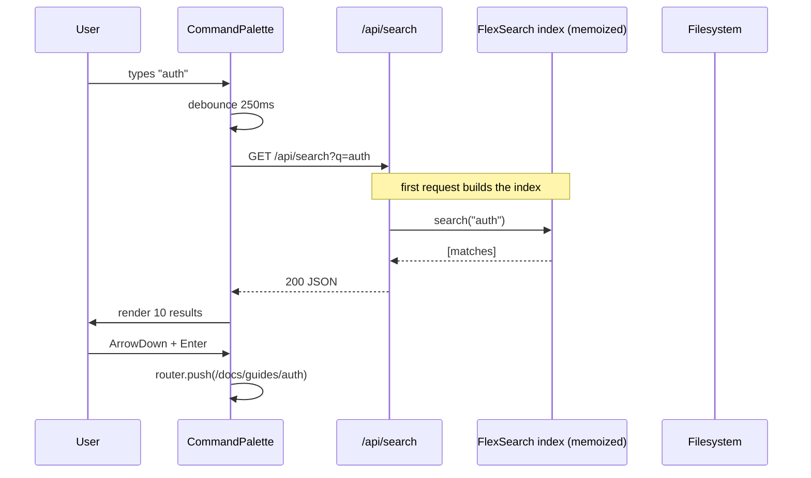

# 5.4 Documentation Website

> Build a documentation website modeled on the Next.js docs: nested route groups for sections, a sidebar with collapsible navigation, an in-page table of contents, an MDX-powered content layer with Shiki syntax highlighting, an ISR-driven content pipeline so edits go live in minutes, a search Route Handler backed by an in-memory inverted index, server actions for the "was this page helpful?" feedback widget, and full metadata. This is the Chapter 4 final project — it touches every App Router concept you've learned in one cohesive build.

## 5.4.1 Project Objective

By the end of this project you should be able to:

1. Design a sidebar navigation data structure that mirrors a nested filesystem of MDX files, render it recursively with collapsible sections, highlight the active route, and persist collapsed/expanded state in `localStorage`.
2. Generate a table of contents for every doc page by parsing the rendered MDX for headings, with smooth-scroll anchors that respect `prefers-reduced-motion`.
3. Implement search via a Route Handler that builds an in-memory inverted index at boot, accepts a `?q=` query, and returns ranked results. For larger doc sets, swap in Pagefind without changing the search UI.
4. Implement a "was this helpful?" feedback widget as a Server Action that writes to a database (or, for this project, an in-memory store with a Vercel KV fallback).
5. Use ISR (`revalidate: 60`) on doc pages so content edits in the repo go live within a minute of a deploy, without requiring a full rebuild.
6. Configure Shiki with dual themes (light/dark) using CSS variables so the code blocks respond to the user's theme without a flash.
7. Configure `next/font` for the body text and a monospace face for code blocks.
8. Generate per-section OG images, a sitemap, and a JSON-LD `TechArticle` schema for every doc page.

## 5.4.2 Reinforces Concepts From

- [[4.1 App Router Foundations]] — route groups, nested layouts.
- [[4.2 Routing, Layouts, and Templates]] — `(docs)` route group with its own layout.
- [[4.3 Server and Client Components]] — server-rendered content, client-rendered sidebar/feedback.
- [[4.4 Rendering Strategies]] — ISR with `revalidate`.
- [[4.5 Data Fetching]] — reading MDX from the filesystem at request time.
- [[4.6 Caching and Revalidation]] — `revalidate`, `revalidateTag`, on-demand revalidation.
- [[4.7 Server Actions and Forms]] — feedback widget.
- [[4.8 Route Handlers]] — search endpoint, OG image endpoint, revalidation webhook.
- [[4.9 Loading UI, Error Pages, and Streaming]] — `loading.tsx` for the search page.
- [[4.10 Metadata and SEO]] — `generateMetadata`, `sitemap.ts`, JSON-LD.
- [[4.11 Images, Fonts, and Optimization]] — `next/font`, `next/image` for screenshots in MDX.
- [[3.5 Lists and Keys]] — recursive sidebar tree.
- [[3.7 Custom Hooks]] — `useSearch`, `useActiveHeading`.
- [[3.11 Performance Optimization]] — keeping the search index small.
- [[2.5 Layout Patterns in Tailwind]] — the classic docs layout (sidebar + content + TOC).

## 5.4.3 Requirements

### 5.4.3.1 Functional Requirements

1. **Home page** (`/`) — marketing landing for the docs site itself: hero, "Get started" CTA linking to `/docs/getting-started`, featured links.
2. **Docs shell** (`/docs/...`) — a three-column layout: fixed sidebar on the left, content in the middle, table of contents on the right. On mobile, the sidebar collapses to a hamburger menu and the TOC becomes a `<details>` at the top of the page.
3. **Doc pages** (`/docs/[section]/[...slug]`) — MDX-rendered content with custom components (`CodeBlock`, `Callout`, `Steps`, `Tabs`, `CardGrid`), prev/next navigation at the bottom, an "Edit this page" link to GitHub, last updated date, and a feedback widget.
4. **Search** — a `Cmd+K` (or `Ctrl+K`) command palette that opens a modal, queries the search Route Handler, and shows ranked results with the matching section name and a snippet. Keyboard navigation (up/down/enter).
5. **Sidebar** — a tree of sections, each with nested pages. Sections are collapsible. The active page is highlighted. State is persisted in `localStorage` so a refresh preserves the user's expanded sections.
6. **Table of contents** — auto-generated from H2 and H3 in the rendered MDX. Highlights the currently visible section as the user scrolls (via `IntersectionObserver`).
7. **404 page** — suggests similar pages based on fuzzy matching of the URL.
8. **Versioning** — `/docs/v1/...` and `/docs/v2/...` for different versions of the docs. A version switcher in the top bar. (Stretch goal — see 5.4.10.)
9. **Feedback widget** — "Was this page helpful?" with  /  buttons. On click, a Server Action records the vote and shows a "Thanks for your feedback!" message.
10. **Mobile responsive** — the sidebar is a slide-in drawer; the TOC collapses into a `<details>` above the content.

### 5.4.3.2 Non-Functional Requirements

| Requirement | Target |
|---|---|
| Lighthouse Performance (doc page, mobile) | ≥ 95 |
| First Contentful Paint | < 1.0 s |
| Largest Contentful Paint | < 2.0 s |
| Search response time (p95) | < 50 ms |
| Total page weight (doc page, no images) | < 120 KB gzipped |
| ISR revalidation interval | 60 seconds |
| Build time for 100 doc pages | < 90 s |
| Search index size (100 pages) | < 200 KB |

### 5.4.3.3 Acceptance Criteria

- Every doc page is statically generated with ISR (`revalidate: 60`).
- The sidebar reflects the file structure under `content/docs/`.
- The active sidebar item is highlighted, and its parent sections are expanded.
- The TOC highlights the section currently in view as the user scrolls.
- `Cmd+K` opens the search modal; typing filters results; arrow keys navigate; `Enter` navigates.
- The feedback widget records votes without a page reload; the same user cannot vote twice on the same page in the same session (use a cookie or `sessionStorage`).
- Editing a doc's MDX, pushing to `main`, and waiting 60 seconds shows the new content without a manual rebuild (verifiable via the on-demand revalidation webhook OR via Vercel's auto-rebuild on push).
- The OG image for a doc page includes the section name and the page title.
- A JSON-LD `TechArticle` schema is present on every doc page.

## 5.4.4 Recommended Architecture

```mermaid
flowchart LR
  subgraph Content[content/docs - MDX files]
    File1[getting-started.mdx]
    File2[guides/auth.mdx]
    File3[api/reference.mdx]
  end

  subgraph Nav[lib/docs - navigation + index]
    NavTree[buildNavTree - from filesystem]
    SearchIndex[buildSearchIndex - inverted index]
    Loader[loadDoc - MDX  -->  compiled]
  end

  subgraph Routes[app/(docs)/docs]
    Layout[layout.tsx - sidebar + TOC shell]
    CatchAll[[...slug]/page.tsx]
    ApiSearch[/api/search/route.ts]
    ApiFeedback[/api/feedback - Server Action]
    ApiRevalidate[/api/revalidate/route.ts]
  end

  Content --> Nav
  Nav --> Routes
```

The architecture is divided into three layers — content (MDX files), navigation (a typed tree built from the filesystem at build time, plus a search index), and routes (the Next.js App Router that consumes both). The navigation tree is built once at module load and cached; the search index is the same data, restructured for fast substring and prefix matching.

### 5.4.4.1 Why a Recursive Sidebar?

A flat list of pages doesn't scale past 20 pages. A tree lets users collapse sections they don't care about, and lets you add new sections without restructuring the UI. The tree is generated from the filesystem — `content/docs/guides/auth.mdx` becomes `{ section: "guides", slug: "guides/auth", title: ... }`. This means the filesystem IS the source of truth.

### 5.4.4.2 Why a Route Handler for Search?

For ≤ 100 doc pages, a client-side search (load a JSON index, filter in JS) is fine. For ≥ 500 pages, the index gets too large to ship to the client. A Route Handler lets you keep the index server-side and return only the top 10 results. It also lets you swap in Pagefind, Meilisearch, or Algolia later without touching the client.

### 5.4.4.3 Why Server Actions for Feedback?

A Server Action runs on the server, so you can write to a database without exposing credentials. It also gives you progressive enhancement — the feedback form works without JavaScript. And you can call `revalidateTag("feedback")` to invalidate cached vote counts if you display them.

## 5.4.5 File Structure

```text
docs-site/
  - app/
      - (marketing)/
          - layout.tsx
          - page.tsx                   # /
      - (docs)/
          - layout.tsx                 # sidebar + TOC shell
          - docs/
              - [[...slug]]/
              - page.tsx           # /docs/...
              - loading.tsx
          - components/
          - Sidebar.tsx            # client component
          - TableOfContents.tsx    # client component
          - DocFooter.tsx          # prev/next + edit
          - FeedbackWidget.tsx     # client component
          - CommandPalette.tsx     # client component
      - api/
          - search/route.ts            # GET ?q=
          - revalidate/route.ts        # POST webhook
          - og/route.tsx               # dynamic OG images
      - layout.tsx
      - opengraph-image.tsx
      - sitemap.ts
      - robots.ts
      - not-found.tsx
      - globals.css
  - components/
      - mdx/
      - CodeBlock.tsx              # Shiki
      - Callout.tsx
      - Steps.tsx
      - Tabs.tsx                   # client
      - CardGrid.tsx
  - content/
      - docs/
      - getting-started.mdx
      - installation.mdx
      - guides/
          - auth.mdx
          - deployment.mdx
      - api/
      - reference.mdx
      - errors.mdx
  - lib/
      - docs/
          - nav.ts                     # buildNavTree
          - search-index.ts            # buildSearchIndex
          - loader.ts                  # loadDoc
          - schema.ts                  # Zod frontmatter
      - actions/
      - feedback.ts                # recordVote Server Action
  - mdx-components.tsx
  - next.config.mjs
  - tailwind.config.ts
  - tsconfig.json
  - package.json
```

## 5.4.6 Step-by-Step Build Order

1. **Scaffold**. `npx create-next-app@latest docs-site --ts --app --tailwind`. Install `@next/mdx @mdx-js/loader @mdx-js/react @types/mdx`, `shiki`, `zod`, `gray-matter`, `match-sorter` (for fuzzy search) or `flexsearch` (for a real inverted index).
2. **Set up MDX**. Configure `next.config.mjs` with the MDX plugin and `pageExtensions: ["ts", "tsx", "md", "mdx"]`. Create `mdx-components.tsx` mapping MDX elements to your custom components.
3. **Define the schema**. In `lib/docs/schema.ts`, write a Zod schema for doc frontmatter: `title`, `description`, `section`, `order` (number for sorting), `draft`.
4. **Build the navigation tree**. `lib/docs/nav.ts` walks `content/docs/`, parses each file's frontmatter, and returns a typed tree: `type NavTree = NavSection[]` where `NavSection = { title, slug, items: NavItem[] }`. The tree is sorted by `order` then by `title`.
5. **Build the doc loader**. `lib/docs/loader.ts` exposes `loadDoc(slug)`, `loadAllDocs()`, `loadDocSlugs()`. Each loads the MDX file, parses frontmatter, validates with Zod, and returns `{ meta, content }`. The compiled MDX is rendered by the page via `next-mdx-remote` or by importing the `.mdx` file directly (if you've configured `@next/mdx`).
6. **Build the search index**. `lib/docs/search-index.ts` exposes `buildSearchIndex()` that returns an array of `{ slug, title, description, section, headings: string[], body: string }`. The Route Handler builds the index at boot (memoized at module scope) and uses `flexsearch` or `match-sorter` to query it.
7. **Build the docs layout**. `app/(docs)/layout.tsx` is a Server Component that renders the three-column shell: `<Sidebar nav={await buildNavTree()} />` (client), `{children}` (server), `<TableOfContents />` (client, populated by the page). Mobile: sidebar is a drawer; TOC is `<details>`.
8. **Build the catch-all doc route**. `app/(docs)/docs/[[...slug]]/page.tsx` uses optional catch-all because the docs index (`/docs`) is also a doc. `generateStaticParams` enumerates every slug. `revalidate = 60` for ISR. `generateMetadata` returns title, description, OG, JSON-LD.
9. **Build the sidebar component**. Recursive `<NavItem>` and `<NavSection>`. Sections are collapsible via `useState`. The active item is determined by `usePathname()`. State is persisted in `localStorage` (key: `docs:nav-state`).
10. **Build the table of contents**. The page passes `headings` (extracted from MDX) as props to the `<TableOfContents>` client component. It uses `IntersectionObserver` to highlight the heading currently in view. Smooth-scrolls on click, respecting `prefers-reduced-motion`.
11. **Build the search Route Handler**. `GET /api/search?q=foo` calls `buildSearchIndex()`, filters with `flexsearch`, returns the top 10 results as JSON. Cache with `Cache-Control: s-maxage=3600, stale-while-revalidate`.
12. **Build the command palette**. A Client Component that listens for `Cmd+K` (and `Ctrl+K`), opens a modal, debounces the query (250ms), fetches `/api/search?q=...`, and renders results with keyboard navigation (up/down/enter/escape). Use `cmdk` (the library that powers Vercel's command palette) or build it from scratch.
13. **Build the feedback widget**. A Client Component with two buttons ( / ). On click, calls the `recordVote` Server Action via `useTransition`. After vote, shows "Thanks!" and disables both buttons. Tracks voted slugs in `sessionStorage` to prevent double-voting.
14. **Build the `recordVote` Server Action**. Validates the slug and vote with Zod. Writes to Vercel KV (or in-memory store for local dev). Returns `{ success: true }`. Calls `revalidateTag("feedback:" + slug)` if you display vote counts.
15. **Build the doc footer**. Prev/next links computed from the nav tree (the next item in the flattened order). "Edit this page" link to `https://github.com/you/docs-site/edit/main/content/docs/{slug}.mdx`. "Last updated" date from git (use `git log -1 --format=%cd` at build time).
16. **Build the MDX components**. `CodeBlock` uses Shiki (with `getHighlighter` cached at module scope). `Callout` is a styled `<aside>` with variants (note, warning, tip, danger). `Steps` is an ordered list with connecting lines. `Tabs` is a client component using `useState`. `CardGrid` is a responsive grid.
17. **Build the on-demand revalidation webhook**. `POST /api/revalidate` with a secret token and a slug. Calls `revalidatePath("/docs/" + slug)`. Use this when you edit a doc and want it live immediately, without waiting for the 60-second ISR window.
18. **Build the marketing home page**. Hero, "Get started" CTA, featured links to top docs. Keep this minimal — the docs are the product.
19. **Build the OG image endpoint**. `/api/og?slug=...` returns a 1200×630 PNG with the section name and the page title. Cache for 24 hours.
20. **Build sitemap and robots**. `sitemap.ts` enumerates every doc slug plus the marketing pages. `robots.ts` allows all and points to the sitemap.
21. **Build the 404 page**. Uses `match-sorter` to suggest similar doc slugs based on the URL. Shows top 3 matches with links.
22. **Audit and deploy**. Lighthouse, validate search, test the feedback widget, deploy to Vercel.

## 5.4.7 Code Walkthrough

### 5.4.7.1 The Navigation Tree Builder

```ts
// lib/docs/nav.ts
import fs from "node:fs/promises";
import path from "node:path";
import matter from "gray-matter";
import { frontmatterSchema, type Frontmatter } from "./schema";

const DOCS_DIR = path.join(process.cwd(), "content", "docs");

export type NavItem = { slug: string; title: string; order: number };
export type NavSection = {
  slug: string;            // e.g., "guides"
  title: string;           // e.g., "Guides"
  items: NavItem[];
};

let _tree: NavSection[] | null = null;

export async function buildNavTree(): Promise<NavSection[]> {
  if (_tree) return _tree;
  const sections: Record<string, NavItem[]> = {};
  const slugs: { slug: string; meta: Frontmatter }[] = [];

  async function walk(dir: string, prefix: string) {
    const entries = await fs.readdir(dir, { withFileTypes: true });
    for (const entry of entries) {
      const fullPath = path.join(dir, entry.name);
      if (entry.isDirectory()) {
        await walk(fullPath, prefix ? `${prefix}/${entry.name}` : entry.name);
      } else if (entry.name.endsWith(".mdx")) {
        const raw = await fs.readFile(fullPath, "utf8");
        const { data } = matter(raw);
        const meta = frontmatterSchema.parse(data);
        const slug = prefix ? `${prefix}/${entry.name.replace(/\.mdx$/, "")}` : entry.name.replace(/\.mdx$/, "");
        const sectionKey = prefix.split("/")[0] || "root";
        sections[sectionKey] ??= [];
        sections[sectionKey].push({ slug, title: meta.title, order: meta.order });
        slugs.push({ slug, meta });
      }
    }
  }
  await walk(DOCS_DIR, "");

  _tree = Object.entries(sections).map(([section, items]) => ({
    slug: section,
    title: section.charAt(0).toUpperCase() + section.slice(1),
    items: items.sort((a, b) => a.order - b.order || a.title.localeCompare(b.title)),
  }));
  return _tree;
}

export async function flattenNav(): Promise<NavItem[]> {
  const tree = await buildNavTree();
  return tree.flatMap((s) => s.items);
}
```

### 5.4.7.2 The Sidebar Component

```tsx
// app/(docs)/components/Sidebar.tsx
"use client";
import Link from "next/link";
import { usePathname } from "next/navigation";
import { useEffect, useState } from "react";
import type { NavSection } from "@/lib/docs/nav";

export function Sidebar({ tree }: { tree: NavSection[] }) {
  const pathname = usePathname();
  const [collapsed, setCollapsed] = useState<Record<string, boolean>>({});

  // Restore state from localStorage
  useEffect(() => {
    const stored = localStorage.getItem("docs:nav-state");
    if (stored) setCollapsed(JSON.parse(stored));
  }, []);

  // Persist state
  useEffect(() => {
    localStorage.setItem("docs:nav-state", JSON.stringify(collapsed));
  }, [collapsed]);

  // Auto-expand the section containing the active page on first render
  useEffect(() => {
    const activeSection = tree.find((s) => pathname.startsWith(`/docs/${s.slug}`));
    if (activeSection && collapsed[activeSection.slug] === undefined) {
      setCollapsed((c) => ({ ...c, [activeSection.slug]: false }));
    }
  }, [pathname, tree, collapsed]);

  return (
    <nav aria-label="Docs navigation" className="space-y-4">
      {tree.map((section) => {
        const isCollapsed = collapsed[section.slug];
        const isActive = pathname.startsWith(`/docs/${section.slug}`);
        return (
          <div key={section.slug}>
            <button
              type="button"
              onClick={() => setCollapsed((c) => ({ ...c, [section.slug]: !c[section.slug] }))}
              aria-expanded={!isCollapsed}
              className={`flex w-full items-center justify-between rounded px-3 py-2 text-sm font-semibold ${isActive ? "bg-neutral-100 dark:bg-neutral-800" : ""}`}
            >
              {section.title}
              <ChevronIcon className={`h-4 w-4 transition ${isCollapsed ? "" : "rotate-90"}`} />
            </button>
            {!isCollapsed && (
              <ul className="mt-1 space-y-1 border-l border-neutral-200 pl-3 dark:border-neutral-800">
                {section.items.map((item) => {
                  const url = `/docs/${item.slug}`;
                  const active = pathname === url;
                  return (
                    <li key={item.slug}>
                      <Link
                        href={url}
                        className={`block rounded px-3 py-1.5 text-sm ${active ? "bg-brand-50 text-brand-700 dark:bg-brand-950 dark:text-brand-300" : "text-neutral-600 hover:bg-neutral-100 dark:text-neutral-400 dark:hover:bg-neutral-800"}`}
                      >
                        {item.title}
                      </Link>
                    </li>
                  );
                })}
              </ul>
            )}
          </div>
        );
      })}
    </nav>
  );
}

function ChevronIcon(props: React.SVGProps<SVGSVGElement>) {
  return (
    <svg viewBox="0 0 16 16" fill="none" {...props}>
      <path d="M6 4l4 4-4 4" stroke="currentColor" strokeWidth="1.5" strokeLinecap="round" strokeLinejoin="round" />
    </svg>
  );
}
```

### 5.4.7.3 The Doc Page (Catch-All With ISR)

```tsx
// app/(docs)/docs/[[...slug]]/page.tsx
import { notFound } from "next/navigation";
import { loadDoc, loadDocSlugs } from "@/lib/docs/loader";
import { flattenNav } from "@/lib/docs/nav";
import { MDXRemote } from "next-mdx-remote/rsc";
import { mdxComponents } from "@/mdx-components";
import { FeedbackWidget } from "../../components/FeedbackWidget";
import { DocFooter } from "../../components/DocFooter";

export const revalidate = 60; // ISR

type Params = { params: { slug?: string[] } };

export async function generateStaticParams() {
  const slugs = await loadDocSlugs();
  return slugs.map((slug) => ({ slug: slug.split("/") }));
}

export async function generateMetadata({ params }: Params) {
  const slug = params.slug?.join("/") ?? "";
  const doc = await loadDoc(slug);
  if (!doc) return {};
  return {
    title: doc.meta.title,
    description: doc.meta.description,
    openGraph: {
      type: "article",
      title: doc.meta.title,
      description: doc.meta.description,
      url: `/docs/${slug}`,
      images: [`/api/og?slug=${slug}`],
    },
  };
}

export default async function DocPage({ params }: Params) {
  const slug = params.slug?.join("/") ?? "";
  const doc = await loadDoc(slug);
  if (!doc) notFound();

  const flat = await flattenNav();
  const idx = flat.findIndex((i) => i.slug === slug);
  const prev = idx > 0 ? flat[idx - 1] : null;
  const next = idx < flat.length - 1 ? flat[idx + 1] : null;

  const jsonLd = {
    "@context": "https://schema.org",
    "@type": "TechArticle",
    headline: doc.meta.title,
    description: doc.meta.description,
    author: { "@type": "Organization", name: "Docs Inc" },
    dateModified: doc.meta.updatedAt?.toISOString(),
  };

  return (
    <article className="mx-auto max-w-3xl px-6 py-12">
      <script type="application/ld+json" dangerouslySetInnerHTML={{ __html: JSON.stringify(jsonLd) }} />
      <header className="mb-8">
        <p className="text-sm text-neutral-500">{doc.meta.section}</p>
        <h1 className="mt-1 text-4xl font-bold tracking-tight">{doc.meta.title}</h1>
        <p className="mt-3 text-lg text-neutral-600 dark:text-neutral-400">{doc.meta.description}</p>
      </header>
      <div className="prose prose-neutral max-w-none dark:prose-invert">
        <MDXRemote source={doc.content} components={mdxComponents} />
      </div>
      <DocFooter slug={slug} prev={prev} next={next} updatedAt={doc.meta.updatedAt} />
      <FeedbackWidget slug={slug} />
    </article>
  );
}
```

### 5.4.7.4 The Search Route Handler

```ts
// app/api/search/route.ts
import { buildSearchIndex } from "@/lib/docs/search-index";
import FlexSearch from "flexsearch";

let _index: FlexSearch.Document | null = null;

async function getIndex() {
  if (_index) return _index;
  const docs = await buildSearchIndex();
  const index = new FlexSearch.Document({
    tokenize: "forward",
    cache: 100,
    document: { id: "slug", index: ["title", "description", "body"], store: ["title", "description", "section", "slug"] },
  });
  for (const doc of docs) index.add(doc);
  _index = index;
  return index;
}

export async function GET(req: Request) {
  const { searchParams } = new URL(req.url);
  const q = searchParams.get("q")?.trim();
  if (!q) return Response.json({ results: [] });

  const index = await getIndex();
  const results = index.search(q, { limit: 10 });
  const seen = new Set<string>();
  const merged: any[] = [];
  for (const field of results) {
    for (const r of field.result) {
      if (seen.has(r as string)) continue;
      seen.add(r as string);
      const doc = (index as any).get(r);
      if (doc) merged.push(doc);
    }
  }

  return Response.json({ results: merged.slice(0, 10) }, {
    headers: { "Cache-Control": "s-maxage=3600, stale-while-revalidate" },
  });
}
```

### 5.4.7.5 The Command Palette

```tsx
// app/(docs)/components/CommandPalette.tsx
"use client";
import { useEffect, useState, useCallback } from "react";
import { useRouter } from "next/navigation";
import Link from "next/link";

type SearchResult = { slug: string; title: string; description: string; section: string };

export function CommandPalette() {
  const [open, setOpen] = useState(false);
  const [query, setQuery] = useState("");
  const [results, setResults] = useState<SearchResult[]>([]);
  const [active, setActive] = useState(0);
  const router = useRouter();

  const openPalette = useCallback(() => setOpen(true), []);
  const closePalette = useCallback(() => setOpen(false), []);

  useEffect(() => {
    function onKey(e: KeyboardEvent) {
      if ((e.metaKey || e.ctrlKey) && e.key === "k") {
        e.preventDefault();
        setOpen((o) => !o);
      }
      if (e.key === "Escape") setOpen(false);
    }
    window.addEventListener("keydown", onKey);
    return () => window.removeEventListener("keydown", onKey);
  }, []);

  useEffect(() => {
    if (!query.trim()) { setResults([]); return; }
    const t = setTimeout(async () => {
      const res = await fetch(`/api/search?q=${encodeURIComponent(query)}`);
      const data = await res.json();
      setResults(data.results ?? []);
      setActive(0);
    }, 250);
    return () => clearTimeout(t);
  }, [query]);

  useEffect(() => {
    if (!open) return;
    function onKey(e: KeyboardEvent) {
      if (e.key === "ArrowDown") { e.preventDefault(); setActive((a) => Math.min(a + 1, results.length - 1)); }
      if (e.key === "ArrowUp") { e.preventDefault(); setActive((a) => Math.max(a - 1, 0)); }
      if (e.key === "Enter" && results[active]) {
        router.push(`/docs/${results[active].slug}`);
        setOpen(false);
      }
    }
    window.addEventListener("keydown", onKey);
    return () => window.removeEventListener("keydown", onKey);
  }, [open, results, active, router]);

  if (!open) return null;

  return (
    <div className="fixed inset-0 z-50 flex items-start justify-center bg-black/50 p-4 pt-32" onClick={closePalette}>
      <div className="w-full max-w-xl overflow-hidden rounded-xl bg-white shadow-2xl dark:bg-neutral-900" onClick={(e) => e.stopPropagation()}>
        <input
          autoFocus
          value={query}
          onChange={(e) => setQuery(e.target.value)}
          placeholder="Search docs..."
          className="w-full border-b border-neutral-200 px-4 py-4 text-lg outline-none dark:border-neutral-800 dark:bg-neutral-900"
        />
        <ul className="max-h-96 overflow-y-auto">
          {results.length === 0 && query && (
            <li className="px-4 py-8 text-center text-sm text-neutral-500">No results for "{query}"</li>
          )}
          {results.map((r, i) => (
            <li key={r.slug}>
              <Link
                href={`/docs/${r.slug}`}
                onClick={() => setOpen(false)}
                className={`block px-4 py-3 ${i === active ? "bg-brand-50 dark:bg-brand-950" : ""}`}
              >
                <div className="flex items-center gap-2">
                  <span className="text-xs text-neutral-500">{r.section}</span>
                  <span className="font-medium">{r.title}</span>
                </div>
                <p className="mt-1 text-sm text-neutral-500 line-clamp-1">{r.description}</p>
              </Link>
            </li>
          ))}
        </ul>
      </div>
    </div>
  );
}
```

### 5.4.7.6 The Feedback Server Action

```ts
// lib/actions/feedback.ts
"use server";
import { revalidateTag } from "next/cache";
import { kv } from "@vercel/kv"; // optional; falls back to in-memory

const _mem: Record<string, { up: number; down: number }> = {};

export async function recordVote(slug: string, vote: "up" | "down") {
  if (!slug || !/^[a-z0-9/-]+$/.test(slug)) {
    throw new Error("Invalid slug");
  }
  const key = `feedback:${slug}`;
  if (process.env.KV_REST_API_URL) {
    await kv.hincrby(key, vote, 1);
  } else {
    _mem[key] ??= { up: 0, down: 0 };
    _mem[key][vote]++;
  }
  revalidateTag(key);
  return { success: true };
}
```

```tsx
// app/(docs)/components/FeedbackWidget.tsx
"use client";
import { useTransition } from "react";
import { recordVote } from "@/lib/actions/feedback";

export function FeedbackWidget({ slug }: { slug: string }) {
  const [state, setState] = useState<"idle" | "up" | "down">("idle");
  const [pending, startTransition] = useTransition();

  useEffect(() => {
    const voted = sessionStorage.getItem(`feedback:${slug}`);
    if (voted) setState(voted as "up" | "down");
  }, [slug]);

  function vote(v: "up" | "down") {
    if (state !== "idle") return;
    sessionStorage.setItem(`feedback:${slug}`, v);
    setState(v);
    startTransition(async () => {
      await recordVote(slug, v);
    });
  }

  if (state !== "idle") {
    return (
      <p className="mt-12 border-t pt-6 text-sm text-neutral-600 dark:text-neutral-400">
        Thanks for your feedback!
      </p>
    );
  }

  return (
    <div className="mt-12 border-t pt-6">
      <p className="text-sm font-medium">Was this page helpful?</p>
      <div className="mt-3 flex gap-3">
        <button
          type="button"
          onClick={() => vote("up")}
          disabled={pending}
          className="rounded-md border px-4 py-2 text-sm hover:bg-neutral-50 dark:border-neutral-700 dark:hover:bg-neutral-800"
        > Yes</button>
        <button
          type="button"
          onClick={() => vote("down")}
          disabled={pending}
          className="rounded-md border px-4 py-2 text-sm hover:bg-neutral-50 dark:border-neutral-700 dark:hover:bg-neutral-800"
        > No</button>
      </div>
    </div>
  );
}

import { useEffect, useState } from "react";
```

### 5.4.7.7 The Table of Contents With Active Heading

```tsx
// app/(docs)/components/TableOfContents.tsx
"use client";
import { useEffect, useState } from "react";

export type Heading = { depth: number; slug: string; text: string };

export function TableOfContents({ headings }: { headings: Heading[] }) {
  const [activeId, setActiveId] = useState<string>("");

  useEffect(() => {
    if (headings.length === 0) return;
    const observer = new IntersectionObserver(
      (entries) => {
        const visible = entries.filter((e) => e.isIntersecting).sort((a, b) => a.boundingClientRect.top - b.boundingClientRect.top);
        if (visible[0]) setActiveId(visible[0].target.id);
      },
      { rootMargin: "0% 0% -80% 0%", threshold: 1.0 }
    );
    for (const h of headings) {
      const el = document.getElementById(h.slug);
      if (el) observer.observe(el);
    }
    return () => observer.disconnect();
  }, [headings]);

  if (headings.length === 0) return null;

  return (
    <nav aria-label="Table of contents" className="sticky top-24 max-h-[calc(100vh-8rem)] overflow-y-auto">
      <p className="mb-3 text-sm font-semibold">On this page</p>
      <ul className="space-y-2 text-sm">
        {headings.map((h) => (
          <li key={h.slug} style={{ paddingLeft: (h.depth - 2) * 12 }}>
            <a
              href={`#${h.slug}`}
              className={`block ${activeId === h.slug ? "text-brand-600 font-medium" : "text-neutral-500 hover:text-neutral-900 dark:hover:text-neutral-300"}`}
            >
              {h.text}
            </a>
          </li>
        ))}
      </ul>
    </nav>
  );
}
```

### 5.4.7.8 The CodeBlock With Shiki (Dual Theme)

```tsx
// components/mdx/CodeBlock.tsx
import { getHighlighter } from "shiki";

const highlighterPromise = getHighlighter({
  themes: ["github-light", "github-dark"],
  langs: ["ts", "tsx", "js", "jsx", "bash", "css", "json", "md", "html"],
});

export async function CodeBlock({ children, className }: { children: string; className?: string }) {
  const lang = (className?.replace(/^language-/, "") ?? "bash") as any;
  const highlighter = await highlighterPromise;
  const html = highlighter.codeToHtml(children.replace(/\n$/, ""), {
    lang,
    themes: { light: "github-light", dark: "github-dark" },
    defaultColor: false,
  });
  return <div className="my-6 overflow-x-auto rounded-lg text-sm" dangerouslySetInnerHTML={{ __html: html }} />;
}
```

The `defaultColor: false` option makes Shiki emit CSS variables for both themes, then your CSS controls which one shows based on `.dark`:

```css
/* globals.css */
html:not(.dark) .shiki, html:not(.dark) .shiki span {
  color: var(--shiki-light) !important;
  background-color: var(--shiki-light-bg) !important;
}
html.dark .shiki, html.dark .shiki span {
  color: var(--shiki-dark) !important;
  background-color: var(--shiki-dark-bg) !important;
}
```

## 5.4.8 Mermaid Diagrams

### 5.4.8.1 Docs Layout (Three-Column)

```mermaid
flowchart LR
  subgraph Shell[app/(docs)/layout.tsx]
    direction LR
    Sidebar[Sidebar - client] --> Content[children - server-rendered MDX]
    Content --> TOC[TableOfContents - client]
  end
  Topbar[Topbar - logo, search trigger, theme toggle] --> Shell
  Palette[CommandPalette - global] -.Cmd+K.-> Topbar
```

### 5.4.8.2 Search Request Flow



## 5.4.9 Common Pitfalls

1. **Catch-all that doesn't handle `/docs` itself.** Use `[[...slug]]` (optional catch-all) so `/docs` (with no further segments) renders the index page. With `[...slug]` (required catch-all), `/docs` 404s.
2. **Sidebar that loses state on navigation.** If the sidebar is a Server Component, it can't hold state. Make it a Client Component and pass the tree as serializable props. Persist collapse state in `localStorage`.
3. **TOC `IntersectionObserver` that highlights the wrong heading.** The default `threshold: 0` fires as soon as any heading enters the viewport. Use `rootMargin: "0% 0% -80% 0%"` and `threshold: 1.0` so a heading is "active" only when it's near the top of the viewport.
4. **Shiki loaded on every request.** `getHighlighter` is expensive. Cache the promise at module scope (as in the code above). Even better, pre-highlight at build time.
5. **Search index built on every request.** Memoize at module scope. In serverless, this means the first request after a cold start is slow, but subsequent requests are fast. If this matters, use `unstable_cache` with a tag.
6. **Feedback widget double-voting.** Without client-side de-duplication, a user can vote repeatedly. Track voted slugs in `sessionStorage` and disable buttons after the first vote.
7. **`revalidate: 60` on a page that doesn't change.** ISR is wasted work for pages that only change on deploy. Use `revalidate: false` (or omit it) for truly static pages. Use ISR only for content that changes between deploys.
8. **Markdown headings without stable IDs.** If you render headings without `id` attributes, the TOC anchors don't work. Use a rehype plugin (`rehype-slug`) or generate IDs in your MDX components map.
9. **Mobile sidebar that's not a drawer.** On mobile, a fixed sidebar eats the screen. Use a slide-in drawer with a backdrop. Use `prefers-reduced-motion` to disable the slide animation.
10. **`Cmd+K` that doesn't preventDefault.** Without `e.preventDefault()`, the browser's default `Cmd+K` (which is "search page" in some browsers) also fires.

## 5.4.10 Stretch Goals

1. **Versioned docs.** Add a `/docs/v1/...` and `/docs/v2/...` namespace with a version switcher in the top bar. Store both versions in `content/docs/v1/` and `content/docs/v2/`. Generate the nav tree per version. Mark old versions as "frozen" (no edits) in the footer.
2. **Inline code playground.** For code blocks tagged with `tsx live`, render an actual interactive React component (using Sandpack or a custom iframe sandbox). Useful for component library docs.
3. **Multi-language.** Add `/docs/es/...`, `/docs/ja/...` with translated content. Use the same nav tree but per-language. Add a language switcher.
4. **Search analytics.** Log every search query (anonymized) to Vercel KV or PostHog. Show a "popular searches" list on the search page when empty.
5. **Page-level "Edit on GitHub" with a "Propose edit" flow.** Instead of linking to the editor, link to a GitHub Action that creates a PR from a fork. Users can edit a doc and submit a PR without leaving your site.

## 5.4.11 Self-Assessment Rubric

| # | Criterion | 0 | 1 | 2 | 3 |
|---|---|---|---|---|---|
| 1 | Sidebar navigation | flat list | nested but not collapsible | collapsible, no state persistence | collapsible + persisted + active highlight + auto-expand |
| 2 | Table of contents | missing | manual | auto-generated, no scroll spy | auto + scroll spy + smooth scroll |
| 3 | Search | none | client-side filter | Route Handler with debounce | + keyboard nav + Cmd+K + analytics |
| 4 | MDX components | plain markdown | + CodeBlock | + Callout + Tabs + Steps | + live playground for tagged blocks |
| 5 | Syntax highlighting | none | prism.js client-side | Shiki build-time | Shiki + dual theme + line numbers + copy button |
| 6 | Feedback widget | missing | buttons only | + Server Action + dedupe | + revalidation + vote counts displayed |
| 7 | ISR / revalidation | none | `revalidate: 60` | + on-demand webhook | + tag-based + per-route |
| 8 | Metadata | title only | + description | + OG image | + JSON-LD + per-section OG |
| 9 | Mobile responsive | desktop only | sidebar collapses | drawer + TOC in details | drawer + TOC + no horizontal scroll |
| 10 | Performance (Lighthouse mobile) | < 80 | 80–89 | 90–94 | ≥ 95 |

## 5.4.12 Related Notes

- [[4.1 App Router Foundations]]
- [[4.2 Routing, Layouts, and Templates]]
- [[4.4 Rendering Strategies]]
- [[4.6 Caching and Revalidation]]
- [[4.7 Server Actions and Forms]]
- [[4.8 Route Handlers]]
- [[4.10 Metadata and SEO]]
- [[4.11 Images, Fonts, and Optimization]]
- [[5.2 Blog]] — same MDX setup, simpler navigation
- [[5.3 Portfolio]] — same primitives, smaller scope
