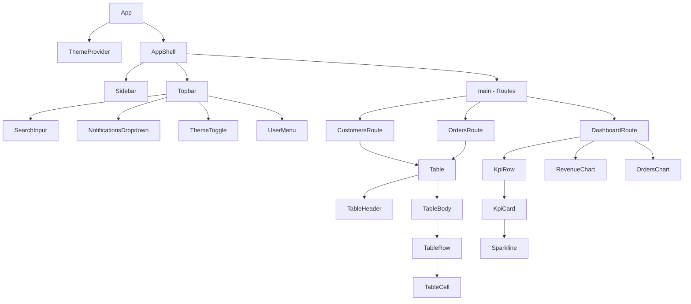
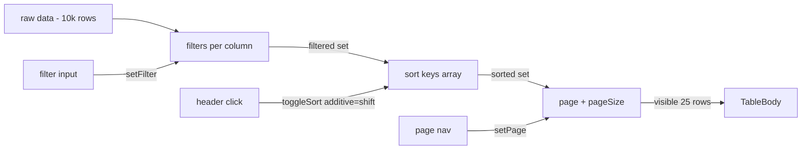

# 5.5 Admin Dashboard

> An admin dashboard with a collapsible sidebar, top bar with notifications, a KPI card row, multiple chart types (line, bar, area, pie) built with Recharts or custom SVG, a sortable/filterable/paginated data table with compound components, dark mode, and full mobile responsiveness. This project reinforces React's compound component pattern, custom hooks for data, context for theme, and Tailwind's responsive utilities. It is the canonical "data-heavy UI" project.

## 5.5.1 Project Objective

By the end of this project you should be able to:

1. Build a complex layout (sidebar + topbar + content area) that is responsive: sidebar collapses to a drawer on mobile, topbar adapts, content area reflows. No horizontal scroll at any width.
2. Implement a theme (light/dark/system) using React Context + `useReducer`, persisted to `localStorage`, with no flash of incorrect theme on first paint (inline blocking script).
3. Build a data table with the compound components pattern: `<Table>`, `<TableHeader>`, `<TableBody>`, `<TableRow>`, `<TableCell>`, `<TableHead>`, plus `<TablePagination>`, `<TableFilter>`, `<TableSort>`. Each is a small component; together they compose into a powerful abstraction.
4. Implement sorting (multi-column with shift-click), filtering (per-column text search), and pagination (server-side if data is large, client-side if not). All state lives in a `useDataTable` hook.
5. Build at least four chart types using Recharts (or hand-rolled SVG): line, bar, area, pie/donut. Add tooltips, legends, and responsive containers.
6. Build a KPI card row with trend indicators (up/down arrows, percent change), sparklines, and color-coded status.
7. Implement virtualization for large lists (1000+ rows) using `react-window` or `@tanstack/react-virtual`.
8. Wire the dashboard to a mock data layer (MSW for local dev, or a Next.js Route Handler that returns generated data) so the dashboard works end-to-end without a real backend.

## 5.5.2 Reinforces Concepts From

- [[3.2 Components and Props]] — compound components.
- [[3.6 Hooks (Built-In)]] — `useState`, `useMemo`, `useCallback`, `useReducer`, `useContext`, `useRef`.
- [[3.7 Custom Hooks]] — `useTheme`, `useDataTable`, `useMediaQuery`, `useLocalStorage`.
- [[3.9 Context and Reducers]] — theme context, table state.
- [[3.10 Composition and Patterns]] — compound components, render props, slots.
- [[3.11 Performance Optimization]] — `memo`, `useMemo`, `useCallback`, virtualization.
- [[3.14 Reusable Component Design]] — designing the table API.
- [[3.15 Project Architecture and Folder Organization]] — feature-based folders.
- [[2.3 Responsive Utilities and Dark Mode]] — sidebar collapse, dark mode variants.
- [[2.5 Layout Patterns in Tailwind]] — sidebar + main layout.
- [[1.7 Responsive Design and Container Queries]] — table responsiveness.
- [[1.6 Grid]] — KPI card grid.

## 5.5.3 Requirements

### 5.5.3.1 Functional Requirements

1. **Sidebar** — fixed on desktop (collapsible to a narrow rail with icons only), drawer on mobile. Sections: Dashboard, Analytics, Customers, Orders, Products, Settings. Each item has an icon and a label. Active item is highlighted. Collapsed state persists per-user in `localStorage`.
2. **Topbar** — global search input, notifications bell with a badge and dropdown, theme toggle (light/dark/system cycle), user avatar with a dropdown menu (profile, settings, logout).
3. **Dashboard home** (`/`) — KPI card row (4 cards: Revenue, Orders, Customers, Conversion Rate, each with value, delta vs last week, and a sparkline), a revenue line chart (last 30 days), an orders bar chart (last 7 days), a top customers table (5 rows), and a recent activity feed.
4. **Analytics page** (`/analytics`) — date range picker, larger charts (area chart for traffic, bar chart for sources, pie chart for device breakdown), and a comparison toggle (this period vs previous).
5. **Customers page** (`/customers`) — the data table: columns (name, email, plan, status, MRR, signup date). Features: column sorting (click header, shift-click for multi-sort), per-column text filter, status filter (multi-select), pagination (10/25/50/100 per page), row click  -->  detail drawer.
6. **Orders page** (`/orders`) — similar table with columns (id, customer, date, total, status, items count). Bulk select with checkboxes. Bulk action bar appears when rows are selected.
7. **Settings page** (`/settings`) — profile form, notification preferences (toggles), appearance (theme picker), API keys (masked, with copy button).
8. **404 page** — on-brand, with a link back to the dashboard.
9. **Loading states** — skeletons for every async section. Suspense boundaries around charts.
10. **Empty states** — every table has an empty state ("No customers match your filters") with a "Clear filters" button.

### 5.5.3.2 Non-Functional Requirements

| Requirement | Target |
|---|---|
| First Contentful Paint (with mock data) | < 1.0 s |
| Largest Contentful Paint | < 2.0 s |
| Cumulative Layout Shift | < 0.05 |
| Customer table with 10,000 rows | renders in < 200 ms (virtualized) |
| Theme switch | no flash, persisted |
| Mobile responsiveness | works on 360px to 2560px |
| Lighthouse Performance | ≥ 90 |
| Lighthouse Accessibility | ≥ 95 |

### 5.5.3.3 Acceptance Criteria

- The sidebar collapses to a 64px rail on desktop when the toggle is clicked, and the labels fade out. State persists across reloads.
- On mobile (< 768px), the sidebar is hidden by default and slides in as a drawer when the menu button is clicked. There is a backdrop that closes the drawer on click.
- The customer table supports: clicking a header to sort (asc  -->  desc  -->  none), shift-clicking a second header for multi-sort, typing in the per-column filter, selecting statuses from a dropdown, and changing the page size.
- Sorting and filtering compose: if you sort by MRR descending AND filter status to "active", you get active customers sorted by MRR descending.
- Charts resize when the sidebar collapses (no clipping, no overflow). Test by toggling the sidebar with a chart in view.
- The theme toggle cycles light  -->  dark  -->  system  -->  light. The system option respects `prefers-color-scheme` and updates live if the OS theme changes.
- Selecting rows in the orders table shows a bulk action bar at the bottom of the screen with "Delete", "Export", and "Cancel" actions.
- All interactive elements have visible focus rings and are operable by keyboard.

## 5.5.4 Recommended Architecture

The dashboard is a Vite + React SPA (no Next.js needed — there's no SEO requirement for an admin tool). State is local; data comes from MSW (Mock Service Worker) in dev and could come from a real API in production.

```mermaid
flowchart TD
  App[App] --> ThemeProvider
  App --> DataProvider[DataProvider - mock data + fetch helpers]
  App --> Layout[Layout]
  Layout --> Sidebar[Sidebar - responsive]
  Layout --> Topbar[Topbar]
  Layout --> Main[main - routes]
  Main --> DashboardRoute[/]
  Main --> AnalyticsRoute[/analytics]
  Main --> CustomersRoute[/customers]
  Main --> OrdersRoute[/orders]
  Main --> SettingsRoute[/settings]
  CustomersRoute --> DataTable[DataTable - compound]
  DataTable --> useDataTable[useDataTable hook]
  OrdersRoute --> DataTable
  DashboardRoute --> KpiRow[KpiRow]
  DashboardRoute --> RevenueChart[RevenueChart]
  DashboardRoute --> OrdersChart[OrdersChart]
  DashboardRoute --> TopCustomers[TopCustomers - DataTable]
```

### 5.5.4.1 Why an SPA, not Next.js?

Admin dashboards sit behind auth and don't need SEO. The benefits of Next.js (SSR, file-based routing, metadata) are mostly irrelevant. An SPA is simpler to deploy (static files), faster to iterate on, and easier to wrap in an auth shell. If you later need server-side data fetching, you can migrate to Next.js — the React component code is portable.

### 5.5.4.2 Why Compound Components for the Table?

A typical table component has dozens of features: sorting, filtering, pagination, selection, expandable rows, column resizing, column hiding, sticky headers, virtualization. Putting all of this behind a single `<Table columns={...} data={...} />` API produces a giant props object that's impossible to extend. The compound pattern (`<Table>`, `<TableHeader>`, etc.) lets users compose the parts they need and skip the rest. Each part is small, testable, and replaceable.

## 5.5.5 File Structure

```text
dashboard/
  - index.html
  - package.json
  - tailwind.config.ts
  - vite.config.ts
  - tsconfig.json
  - src/
      - main.tsx
      - App.tsx
      - routes/
          - Dashboard.tsx
          - Analytics.tsx
          - Customers.tsx
          - Orders.tsx
          - Settings.tsx
      - components/
          - layout/
              - AppShell.tsx
              - Sidebar.tsx
              - Topbar.tsx
              - NotificationsDropdown.tsx
              - UserMenu.tsx
          - ui/
              - Button.tsx
              - Input.tsx
              - Select.tsx
              - Badge.tsx
              - Card.tsx
              - Skeleton.tsx
              - Toggle.tsx
              - Tooltip.tsx
              - Drawer.tsx
          - table/
              - Table.tsx              # exports Table, TableHeader, TableBody, TableRow, TableCell, TableHead
              - TablePagination.tsx
              - TableFilter.tsx
              - TableSelectBar.tsx
              - EmptyState.tsx
          - charts/
              - LineChart.tsx
              - BarChart.tsx
              - AreaChart.tsx
              - PieChart.tsx
              - Sparkline.tsx
              - ChartContainer.tsx
          - dashboard/
          - KpiCard.tsx
          - KpiRow.tsx
          - ActivityFeed.tsx
      - hooks/
          - useTheme.ts
          - useMediaQuery.ts
          - useLocalStorage.ts
          - useDataTable.ts
          - useDebounce.ts
      - context/
          - ThemeContext.tsx
          - DataContext.tsx
      - lib/
          - data/
              - mock.ts                # generates fake data
              - customers.ts
              - orders.ts
              - analytics.ts
          - sort.ts                    # multi-key sort
          - filter.ts
          - utils.ts
      - styles/
          - globals.css
      - types/
      - index.ts
  - public/
      - mockServiceWorker.js          # MSW
  - README.md
```

## 5.5.6 Step-by-Step Build Order

1. **Scaffold**. `npm create vite@latest dashboard -- --template react-ts`. Install Tailwind, `recharts`, `clsx`, `tailwind-merge`, `class-variance-authority`, `lucide-react` (icons), `react-router-dom`, `msw` (mock data), `@faker-js/faker` (fake data), `@tanstack/react-virtual` (virtualization).
2. **Set up the theme system**. Inline blocking script in `index.html` for no-FOUC. `ThemeContext` with `useReducer` for `{ theme: "light" | "dark" | "system", resolvedTheme: "light" | "dark" }`. The `useTheme` hook exposes `theme`, `setTheme`, `cycleTheme`, and `resolvedTheme`. On `system`, listen to `matchMedia("(prefers-color-scheme: dark)")` and update `resolvedTheme` live.
3. **Build the AppShell**. CSS Grid: `grid-template-columns: auto 1fr; grid-template-rows: auto 1fr;`. Sidebar in column 1, topbar in row 1 column 2, content in row 2 column 2. On mobile, sidebar becomes a fixed-position drawer.
4. **Build the Sidebar**. Two states: expanded (240px) and collapsed (64px). Toggle via a button in the topbar. State persists in `localStorage`. On mobile, the sidebar is hidden by default; a hamburger opens it as a drawer with a backdrop.
5. **Build the Topbar**. Search input (debounced), notifications bell (with a dropdown populated from mock data), theme toggle (cycles light/dark/system), user avatar (with a dropdown). Each dropdown closes on outside click and on Escape.
6. **Build the UI primitives**. `Button` (with `cva`), `Input`, `Select`, `Badge`, `Card`, `Skeleton`, `Toggle`, `Tooltip`, `Drawer`. These are the building blocks for everything else.
7. **Build the chart components**. Wrap Recharts in `ChartContainer` (consistent height, responsive, dark-mode-aware). Build `LineChart`, `BarChart`, `AreaChart`, `PieChart`, and `Sparkline` (a tiny SVG line for KPI cards).
8. **Build the KPI card and KPI row**. `KpiCard` takes `{ label, value, delta, sparkData, status }`. The delta shows up/down arrow + percent, color-coded. The sparkline is a tiny `Sparkline`.
9. **Build the Dashboard route**. KPI row (4 cards), revenue line chart, orders bar chart, top customers table (5 rows), activity feed. Wrap each section in a `Card`.
10. **Build the data table compound components**. The `Table` family is the centerpiece — see code walkthrough below.
11. **Build the `useDataTable` hook**. Manages sort state (array of `{ key, direction }`), filter state (per-column string), selection state (Set of row ids), pagination (page, pageSize). Exposes `sortedData`, `filteredData`, `paginatedData`, `toggleSort`, `setFilter`, `toggleSelection`, `setPage`, etc.
12. **Build the Customers route**. Configure the table with columns: name, email, plan, status, MRR, signupDate. Add per-column filters and a status multi-select. Add pagination with page-size selector.
13. **Build the Orders route**. Same table, different columns. Add row selection with checkboxes. Add a bulk action bar that appears when ≥ 1 row is selected.
14. **Build the Analytics route**. Date range picker (a `<select>` with presets: 7d, 30d, 90d, 12m). Larger charts. A "compare to previous period" toggle that overlays a faded line.
15. **Build the Settings route**. Profile form (name, email, avatar upload), notification toggles, theme picker (radio group), API keys (masked, copy button).
16. **Add loading skeletons**. Every async section has a skeleton that matches its layout.
17. **Add empty states**. Tables show "No results" with a "Clear filters" button.
18. **Add virtualization**. For the orders table with 10,000+ rows, swap `TableBody` for a virtualized version using `@tanstack/react-virtual`. Test that sorting, filtering, and selection still work.
19. **Set up MSW**. Intercept `/api/customers`, `/api/orders`, `/api/analytics` and return mock data. This simulates a real API and lets you test loading and error states.
20. **Audit**. Lighthouse, keyboard test, screen reader test. Fix focus rings, ARIA, color contrast.

## 5.5.7 Code Walkthrough

### 5.5.7.1 The Theme Context

```tsx
// src/context/ThemeContext.tsx
import { createContext, useContext, useEffect, useReducer } from "react";

type Theme = "light" | "dark" | "system";
type Resolved = "light" | "dark";
type State = { theme: Theme; resolved: Resolved };
type Action =
  | { type: "set"; theme: Theme }
  | { type: "cycle" }
  | { type: "resolve"; resolved: Resolved };

function resolve(theme: Theme): Resolved {
  if (theme !== "system") return theme;
  return window.matchMedia("(prefers-color-scheme: dark)").matches ? "dark" : "light";
}

function reducer(state: State, action: Action): State {
  switch (action.type) {
    case "set":   return { theme: action.theme, resolved: resolve(action.theme) };
    case "cycle": {
      const next: Theme = state.theme === "light" ? "dark" : state.theme === "dark" ? "system" : "light";
      return { theme: next, resolved: resolve(next) };
    }
    case "resolve": return { ...state, resolved: action.resolved };
  }
}

const ThemeContext = createContext<{
  theme: Theme; resolved: Resolved; setTheme: (t: Theme) => void; cycleTheme: () => void;
} | null>(null);

export function ThemeProvider({ children }: { children: React.ReactNode }) {
  const [state, dispatch] = useReducer(reducer, { theme: "system", resolved: "light" });

  // Initialize from localStorage
  useEffect(() => {
    const stored = (localStorage.getItem("theme") as Theme) ?? "system";
    dispatch({ type: "set", theme: stored });
  }, []);

  // Persist on change
  useEffect(() => {
    if (state.theme !== "system" || localStorage.getItem("theme")) {
      localStorage.setItem("theme", state.theme);
    }
  }, [state.theme]);

  // Apply class to <html>
  useEffect(() => {
    document.documentElement.classList.toggle("dark", state.resolved === "dark");
  }, [state.resolved]);

  // Listen for OS theme changes when in "system" mode
  useEffect(() => {
    if (state.theme !== "system") return;
    const mq = window.matchMedia("(prefers-color-scheme: dark)");
    const handler = (e: MediaQueryListEvent) => dispatch({ type: "resolve", resolved: e.matches ? "dark" : "light" });
    mq.addEventListener("change", handler);
    return () => mq.removeEventListener("change", handler);
  }, [state.theme]);

  return (
    <ThemeContext.Provider value={{
      theme: state.theme, resolved: state.resolved,
      setTheme: (t) => dispatch({ type: "set", theme: t }),
      cycleTheme: () => dispatch({ type: "cycle" }),
    }}>
      {children}
    </ThemeContext.Provider>
  );
}

export function useTheme() {
  const ctx = useContext(ThemeContext);
  if (!ctx) throw new Error("useTheme must be used inside ThemeProvider");
  return ctx;
}
```

### 5.5.7.2 The Compound Table Components

```tsx
// src/components/table/Table.tsx
import { createContext, useContext, useMemo, useState, type ReactNode } from "react";
import { cn } from "@/lib/utils";

// ---- Context that ties the compound together ----
type TableContextValue = {
  selected: Set<string>;
  toggleSelection: (id: string) => void;
  toggleAll: (ids: string[]) => void;
  allSelected: (ids: string[]) => boolean;
};
const TableContext = createContext<TableContextValue | null>(null);
export function useTableContext() {
  const ctx = useContext(TableContext);
  if (!ctx) throw new Error("Table subcomponents must be rendered inside <Table>");
  return ctx;
}

export function Table({
  children,
  selectable = false,
  data,
  getRowId,
}: {
  children: ReactNode;
  selectable?: boolean;
  data: any[];
  getRowId: (row: any) => string;
}) {
  const [selected, setSelected] = useState<Set<string>>(new Set());
  const ctx: TableContextValue = useMemo(() => ({
    selected,
    toggleSelection: (id) => setSelected((prev) => {
      const next = new Set(prev);
      next.has(id) ? next.delete(id) : next.add(id);
      return next;
    }),
    toggleAll: (ids) => setSelected((prev) => {
      const allSelected = ids.every((id) => prev.has(id));
      return allSelected ? new Set() : new Set(ids);
    }),
    allSelected: (ids) => ids.every((id) => selected.has(id)),
  }), [selected]);

  return (
    <TableContext.Provider value={ctx}>
      <div className="overflow-x-auto rounded-lg border border-neutral-200 dark:border-neutral-800">
        <table className="w-full text-sm">{children}</table>
      </div>
    </TableContext.Provider>
  );
}

export function TableHeader({ children }: { children: ReactNode }) {
  return <thead className="bg-neutral-50 dark:bg-neutral-900">{children}</thead>;
}
export function TableBody({ children }: { children: ReactNode }) {
  return <tbody className="divide-y divide-neutral-200 dark:divide-neutral-800">{children}</tbody>;
}
export function TableRow({ children, selected, onClick }: { children: ReactNode; selected?: boolean; onClick?: () => void }) {
  return (
    <tr
      onClick={onClick}
      className={cn(
        "transition-colors hover:bg-neutral-50 dark:hover:bg-neutral-900",
        selected && "bg-brand-50 dark:bg-brand-950"
      )}
    >
      {children}
    </tr>
  );
}
export function TableHead({ children, onClick, sortDir }: { children: ReactNode; onClick?: () => void; sortDir?: "asc" | "desc" | null }) {
  return (
    <th
      onClick={onClick}
      className={cn(
        "px-4 py-3 text-left font-semibold text-neutral-700 dark:text-neutral-300",
        onClick && "cursor-pointer select-none hover:bg-neutral-100 dark:hover:bg-neutral-800"
      )}
    >
      <span className="inline-flex items-center gap-1">
        {children}
        {sortDir === "asc" && " ↑"}
        {sortDir === "desc" && " ↓"}
      </span>
    </th>
  );
}
export function TableCell({ children, className }: { children: ReactNode; className?: string }) {
  return <td className={cn("px-4 py-3", className)}>{children}</td>;
}
```

### 5.5.7.3 The `useDataTable` Hook

```ts
// src/hooks/useDataTable.ts
import { useMemo, useState, useCallback } from "react";

type SortKey = { key: string; direction: "asc" | "desc" };
type Filters = Record<string, string>;

export function useDataTable<T>(data: T[], getRowId: (row: T) => string) {
  const [sortKeys, setSortKeys] = useState<SortKey[]>([]);
  const [filters, setFilters] = useState<Filters>({});
  const [page, setPage] = useState(0);
  const [pageSize, setPageSize] = useState(25);

  const toggleSort = useCallback((key: string, additive: boolean) => {
    setSortKeys((prev) => {
      const existing = prev.find((s) => s.key === key);
      if (existing) {
        if (existing.direction === "asc") {
          const next = prev.map((s) => s.key === key ? { ...s, direction: "desc" as const } : s);
          return additive ? next : next.filter((s) => s.key === key);
        } else {
          // remove
          return prev.filter((s) => s.key !== key);
        }
      }
      const newKey: SortKey = { key, direction: "asc" };
      return additive ? [...prev, newKey] : [newKey];
    });
  }, []);

  const setFilter = useCallback((key: string, value: string) => {
    setFilters((prev) => {
      const next = { ...prev };
      if (value) next[key] = value; else delete next[key];
      return next;
    });
    setPage(0);
  }, []);

  const filtered = useMemo(() => {
    return data.filter((row) =>
      Object.entries(filters).every(([key, val]) =>
        String((row as any)[key] ?? "").toLowerCase().includes(val.toLowerCase())
      )
    );
  }, [data, filters]);

  const sorted = useMemo(() => {
    if (sortKeys.length === 0) return filtered;
    const copy = [...filtered];
    copy.sort((a, b) => {
      for (const { key, direction } of sortKeys) {
        const av = (a as any)[key];
        const bv = (b as any)[key];
        if (av === bv) continue;
        const cmp = av > bv ? 1 : -1;
        return direction === "asc" ? cmp : -cmp;
      }
      return 0;
    });
    return copy;
  }, [filtered, sortKeys]);

  const total = sorted.length;
  const pageCount = Math.ceil(total / pageSize);
  const paginated = useMemo(
    () => sorted.slice(page * pageSize, page * pageSize + pageSize),
    [sorted, page, pageSize]
  );

  return {
    data: paginated,
    total, pageCount, page, pageSize,
    sortKeys, filters,
    setPage, setPageSize, toggleSort, setFilter,
    getRowId,
  };
}
```

### 5.5.7.4 The Customers Page Using the Table

```tsx
// src/routes/Customers.tsx
import { useState } from "react";
import { useDataTable } from "@/hooks/useDataTable";
import { Table, TableHeader, TableBody, TableRow, TableHead, TableCell, useTableContext } from "@/components/table/Table";
import { TablePagination } from "@/components/table/TablePagination";
import { TableFilter } from "@/components/table/TableFilter";
import { Badge } from "@/components/ui/Badge";
import { customers as data } from "@/lib/data/customers";

const columns = [
  { key: "name", label: "Name" },
  { key: "email", label: "Email" },
  { key: "plan", label: "Plan" },
  { key: "status", label: "Status" },
  { key: "mrr", label: "MRR" },
  { key: "signupDate", label: "Signed up" },
];

export function Customers() {
  const table = useDataTable(data, (c) => c.id);

  return (
    <div className="space-y-4">
      <h1 className="text-2xl font-semibold">Customers</h1>

      <Table data={table.data} getRowId={table.getRowId}>
        <TableHeader>
          <tr>
            {columns.map((col) => (
              <TableHead
                key={col.key}
                onClick={() => table.toggleSort(col.key, false)}
                sortDir={table.sortKeys.find((s) => s.key === col.key)?.direction ?? null}
              >
                {col.label}
              </TableHead>
            ))}
          </tr>
          <tr>
            {columns.map((col) => (
              <th key={col.key} className="bg-neutral-100 px-4 py-2 dark:bg-neutral-950">
                <TableFilter value={table.filters[col.key] ?? ""} onChange={(v) => table.setFilter(col.key, v)} placeholder="Filter..." />
              </th>
            ))}
          </tr>
        </TableHeader>
        <TableBody>
          {table.data.length === 0 && (
            <tr>
              <td colSpan={columns.length} className="px-4 py-12 text-center text-neutral-500">
                No customers match your filters.
              </td>
            </tr>
          )}
          {table.data.map((row) => (
            <TableRow key={row.id}>
              <TableCell className="font-medium">{row.name}</TableCell>
              <TableCell className="text-neutral-500">{row.email}</TableCell>
              <TableCell>{row.plan}</TableCell>
              <TableCell>
                <Badge variant={row.status === "active" ? "success" : "muted"}>{row.status}</Badge>
              </TableCell>
              <TableCell>${row.mrr.toLocaleString()}</TableCell>
              <TableCell className="text-neutral-500">{new Date(row.signupDate).toLocaleDateString()}</TableCell>
            </TableRow>
          ))}
        </TableBody>
      </Table>

      <TablePagination
        page={table.page}
        pageCount={table.pageCount}
        pageSize={table.pageSize}
        total={table.total}
        onPageChange={table.setPage}
        onPageSizeChange={table.setPageSize}
      />
    </div>
  );
}
```

### 5.5.7.5 The Responsive Sidebar

```tsx
// src/components/layout/Sidebar.tsx
import { NavLink } from "react-router-dom";
import { useLocalStorage } from "@/hooks/useLocalStorage";
import { useMediaQuery } from "@/hooks/useMediaQuery";
import { cn } from "@/lib/utils";
import { LayoutDashboard, BarChart3, Users, ShoppingCart, Package, Settings } from "lucide-react";

const items = [
  { to: "/", label: "Dashboard", icon: LayoutDashboard },
  { to: "/analytics", label: "Analytics", icon: BarChart3 },
  { to: "/customers", label: "Customers", icon: Users },
  { to: "/orders", label: "Orders", icon: ShoppingCart },
  { to: "/products", label: "Products", icon: Package },
  { to: "/settings", label: "Settings", icon: Settings },
];

export function Sidebar({ open, onClose }: { open: boolean; onClose: () => void }) {
  const isDesktop = useMediaQuery("(min-width: 768px)");
  const [collapsed, setCollapsed] = useLocalStorage("sidebar:collapsed", false);
  const width = isDesktop ? (collapsed ? 64 : 240) : 240;

  return (
    <>
      {open && !isDesktop && (
        <div className="fixed inset-0 z-30 bg-black/50 md:hidden" onClick={onClose} />
      )}
      <aside
        className={cn(
          "fixed inset-y-0 left-0 z-40 flex flex-col border-r border-neutral-200 bg-white transition-all dark:border-neutral-800 dark:bg-neutral-950",
          isDesktop ? "translate-x-0" : open ? "translate-x-0" : "-translate-x-full"
        )}
        style={{ width }}
      >
        <div className="flex h-16 items-center border-b border-neutral-200 px-4 dark:border-neutral-800">
          {!collapsed && <span className="text-lg font-bold">Acme Inc</span>}
        </div>
        <nav className="flex-1 space-y-1 p-2">
          {items.map((item) => (
            <NavLink
              key={item.to}
              to={item.to}
              end={item.to === "/"}
              onClick={onClose}
              className={({ isActive }) =>
                cn(
                  "flex items-center gap-3 rounded-lg px-3 py-2 text-sm font-medium",
                  isActive
                    ? "bg-brand-50 text-brand-700 dark:bg-brand-950 dark:text-brand-300"
                    : "text-neutral-700 hover:bg-neutral-100 dark:text-neutral-300 dark:hover:bg-neutral-800"
                )
              }
              title={collapsed ? item.label : undefined}
            >
              <item.icon className="h-5 w-5 flex-shrink-0" />
              {!collapsed && <span>{item.label}</span>}
            </NavLink>
          ))}
        </nav>
        {isDesktop && (
          <button
            onClick={() => setCollapsed(!collapsed)}
            className="border-t border-neutral-200 p-3 text-sm hover:bg-neutral-50 dark:border-neutral-800 dark:hover:bg-neutral-900"
          >
            {collapsed ? " --> " : " <--  Collapse"}
          </button>
        )}
      </aside>
    </>
  );
}
```

### 5.5.7.6 The Sparkline (Custom SVG)

```tsx
// src/components/charts/Sparkline.tsx
export function Sparkline({ data, width = 100, height = 30, color = "#10b981" }: {
  data: number[]; width?: number; height?: number; color?: string;
}) {
  if (data.length === 0) return null;
  const max = Math.max(...data);
  const min = Math.min(...data);
  const range = max - min || 1;
  const step = width / (data.length - 1);
  const points = data.map((v, i) => `${i * step},${height - ((v - min) / range) * height}`);
  const path = `M ${points.join(" L ")}`;

  return (
    <svg width={width} height={height} className="overflow-visible">
      <path d={path} fill="none" stroke={color} strokeWidth={1.5} strokeLinejoin="round" strokeLinecap="round" />
    </svg>
  );
}
```

### 5.5.7.7 The KPI Card

```tsx
// src/components/dashboard/KpiCard.tsx
import { ArrowDownIcon, ArrowUpIcon } from "lucide-react";
import { Sparkline } from "@/components/charts/Sparkline";
import { Card } from "@/components/ui/Card";
import { cn } from "@/lib/utils";

export function KpiCard({ label, value, delta, spark, trend }: {
  label: string; value: string; delta: number; spark: number[]; trend: "up" | "down" | "neutral";
}) {
  const positive = delta >= 0;
  return (
    <Card className="p-5">
      <p className="text-sm text-neutral-500">{label}</p>
      <p className="mt-2 text-3xl font-bold tracking-tight">{value}</p>
      <div className="mt-2 flex items-center gap-2">
        <span className={cn(
          "inline-flex items-center gap-0.5 text-xs font-medium",
          positive ? "text-green-600" : "text-red-600"
        )}>
          {positive ? <ArrowUpIcon className="h-3 w-3" /> : <ArrowDownIcon className="h-3 w-3" />}
          {Math.abs(delta)}%
        </span>
        <span className="text-xs text-neutral-500">vs last week</span>
      </div>
      <div className="mt-3">
        <Sparkline data={spark} color={positive ? "#10b981" : "#ef4444"} />
      </div>
    </Card>
  );
}
```

### 5.5.7.8 The Theme Toggle (Cycling)

```tsx
// src/components/layout/ThemeToggle.tsx
import { useTheme } from "@/context/ThemeContext";
import { SunIcon, MoonIcon, MonitorIcon } from "lucide-react";

export function ThemeToggle() {
  const { theme, cycleTheme } = useTheme();
  const Icon = theme === "light" ? SunIcon : theme === "dark" ? MoonIcon : MonitorIcon;
  return (
    <button
      onClick={cycleTheme}
      aria-label={`Theme: ${theme}. Click to change.`}
      className="rounded-md p-2 hover:bg-neutral-100 dark:hover:bg-neutral-800"
    >
      <Icon className="h-5 w-5" />
    </button>
  );
}
```

## 5.5.8 Mermaid Diagrams

### 5.5.8.1 Component Tree



### 5.5.8.2 Table State Flow



## 5.5.9 Common Pitfalls

1. **Sidebar that doesn't account for the main content's width.** If the sidebar is `position: fixed` and the main content doesn't have `margin-left: 240px`, the sidebar covers the content. Use CSS Grid for the shell (column 1 = sidebar, column 2 = main) so the layout adjusts automatically.
2. **Theme flash on first paint.** Same as [[5.1 Landing Page]] — inline the theme-detection script in `index.html` before the React bundle.
3. **Table sort that mutates the original data.** Always sort a copy (`[...data].sort(...)`) so the source array is unchanged. Otherwise, switching sort columns gives wrong results because the data is already partially sorted.
4. **Multi-sort without visual indication.** If you support shift-click for multi-sort, you must show the order of sort keys (e.g., a small "1", "2" badge next to each sorted column header). Otherwise, users can't tell which column is the primary sort.
5. **Charts that don't resize.** Recharts' `<ResponsiveContainer>` works, but if the parent's width changes via CSS transition (like the sidebar collapsing), the chart doesn't redraw until the next resize event. Listen for the transition end or use a `ResizeObserver`.
6. **Notifications dropdown that doesn't close on outside click.** Use a `useEffect` that adds a `mousedown` listener on `document` and checks whether the click target is inside the dropdown ref.
7. **Bulk action bar that covers content on mobile.** The bar should be `position: fixed; bottom: 0;` and the main content should get `padding-bottom` to compensate. Otherwise, the bar covers the last row of the table.
8. **Virtualization that breaks selection.** When rows are virtualized, only the visible rows are mounted. Your selection state must be in the parent (a `Set` of IDs), not in the row component — otherwise, selecting a row and scrolling away loses the selection.
9. **No empty state.** When filters return zero rows, showing an empty table is confusing. Show a friendly message with a "Clear filters" button.
10. **Dark mode that doesn't update chart colors.** Recharts uses inline SVG attributes for colors, which Tailwind's `dark:` variant can't override. Pass the colors as props derived from `resolvedTheme` (e.g., `axisStroke = resolvedTheme === "dark" ? "#475569" : "#cbd5e1"`).

## 5.5.10 Stretch Goals

1. **Real-time updates.** Use a mock WebSocket (or `setInterval` in MSW) to push new orders. The orders table prepends new rows with a highlight animation that fades out.
2. **Saved views.** Let users save a filter/sort combination as a "view" (e.g., "High-value customers"). Store views in `localStorage`. Add a dropdown to switch between saved views.
3. **Column customization.** A "Columns" button that opens a popover with checkboxes to show/hide columns. Persist per-user.
4. **CSV export.** A button that exports the current filtered+sorted data as CSV. Generate client-side with `Blob` + `URL.createObjectURL`.
5. **Server-side pagination.** Replace the in-memory pagination with a Route Handler that accepts `?page=1&pageSize=25&sort=name&filter=foo`. Add a `keepPreviousData` flag to avoid flashing empty state during fetch.

## 5.5.11 Self-Assessment Rubric

| # | Criterion | 0 | 1 | 2 | 3 |
|---|---|---|---|---|---|
| 1 | Responsive layout | desktop only | sidebar collapses | sidebar + topbar adapt | no horizontal scroll 360–2560px, drawer on mobile |
| 2 | Theme system | light only | light/dark toggle | + system option | + no FOUC + live OS change listener |
| 3 | Data table | static | sortable | + filter + pagination | + multi-sort + selection + virtualization |
| 4 | Compound components | one big Table | some subcomponents | full compound API | + context + extension points |
| 5 | Charts | none | 1 type | 3 types | 4+ types + tooltips + responsive + dark-aware |
| 6 | KPI cards | static numbers | + delta | + sparkline | + trend indicator + color-coded |
| 7 | Accessibility | no focus states | visible focus | + keyboard nav | + screen reader test + ARIA on dropdowns |
| 8 | Performance | janky | basic | memoized | virtualized 10k rows < 200ms |
| 9 | Loading/empty states | none | spinners | skeletons | skeletons + empty states with CTAs |
| 10 | Code organization | one folder | split by type | feature-based | + barrel exports + consistent naming |

## 5.5.12 Related Notes

- [[3.6 Hooks (Built-In)]]
- [[3.7 Custom Hooks]]
- [[3.9 Context and Reducers]]
- [[3.10 Composition and Patterns]]
- [[3.11 Performance Optimization]]
- [[3.14 Reusable Component Design]]
- [[2.3 Responsive Utilities and Dark Mode]]
- [[2.5 Layout Patterns in Tailwind]]
- [[5.6 Kanban Board]] — same React/Tailwind stack, focus on DnD and state
- [[5.1 Landing Page]] — same Tailwind + theme skills, marketing context
