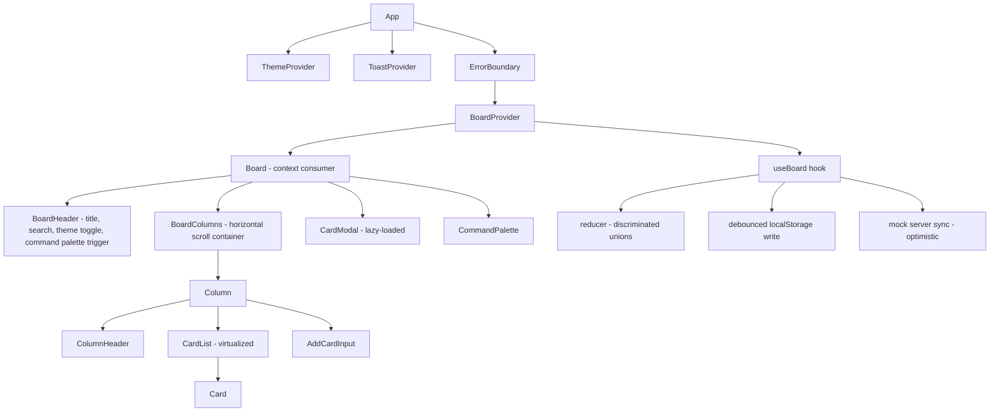
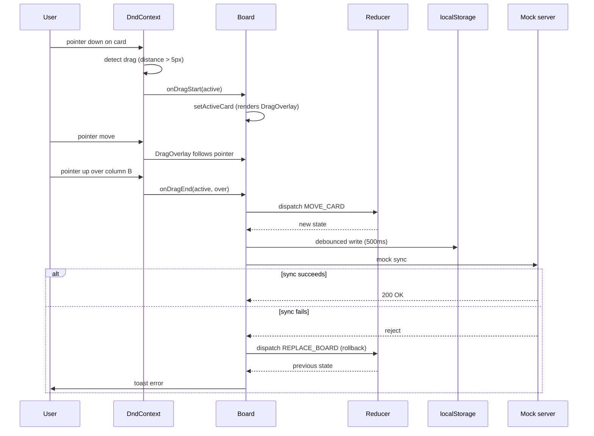

# 5.6 Kanban Board

> A Trello-lite kanban board with drag-and-drop columns and cards, optimistic updates, localStorage persistence, keyboard-driven card movement, custom hooks for the data layer, `useReducer` for state, error boundaries, and performance optimization for large boards. This is the **Chapter 3 final project** — it is the single project that, more than any other, forces you to internalize React's state model, the reducer pattern, memoization, and the difference between optimistic and pessimistic updates.

## 5.6.1 Project Objective

By the end of this project you should be able to:

1. Model a kanban board's state with `useReducer`: columns (ordered), cards (per column, ordered), and a normalized shape that allows O(1) card moves. Write the reducer with discriminated union actions (`MOVE_CARD`, `ADD_CARD`, `EDIT_CARD`, `DELETE_CARD`, `ADD_COLUMN`, `RENAME_COLUMN`, `DELETE_COLUMN`, `REORDER_COLUMN`).
2. Implement drag-and-drop with `@dnd-kit/core` (or, as a stretch, hand-rolled with pointer events) supporting card-to-card, card-to-column, card-to-empty-column, column reordering, and cross-board drops.
3. Persist state to `localStorage` on every change with a debounced write (don't write on every drag move — write on drag end).
4. Implement optimistic updates: when a card is moved, the UI updates immediately; if a (simulated) server sync fails, the change is rolled back and a toast is shown.
5. Add keyboard accessibility: `Tab` to focus a card, `Space` to enter "move mode", arrow keys to move the card between columns and positions, `Enter` to confirm, `Escape` to cancel.
6. Wrap the board in an error boundary so a render error in one card doesn't crash the entire app. Show a friendly fallback with a "Reset board" button.
7. Memoize card components so dragging one card doesn't re-render all the others. Use `React.memo` with a custom comparator.
8. Build custom hooks: `useBoard` (the reducer + persistence), `useDragCard` (dnd-kit wiring), `useKeyboardMove` (keyboard-driven card movement).
9. Support a board with 500+ cards without jank. Use `useDeferredValue` for search filtering, and `@tanstack/react-virtual` for virtualizing long columns.
10. Add a small command palette (`Cmd+K`) for actions: "New card in Inbox", "Jump to card...", "Toggle dark mode".

## 5.6.2 Reinforces Concepts From

- [[3.3 State and Events]] — controlled inputs, event handling.
- [[3.5 Lists and Keys]] — keys for cards (must be stable IDs, not array indices).
- [[3.6 Hooks (Built-In)]] — `useReducer`, `useCallback`, `useMemo`, `useRef`, `useEffect`, `useDeferredValue`, `useTransition`.
- [[3.7 Custom Hooks]] — `useBoard`, `useDragCard`, `useKeyboardMove`, `useLocalStorage`.
- [[3.8 Effects and Side Effects]] — persisting to `localStorage`, syncing with a (mock) server.
- [[3.9 Context and Reducers]] — the reducer pattern, normalized state.
- [[3.10 Composition and Patterns]] — compound components for the board/column/card.
- [[3.11 Performance Optimization]] — `memo`, `useMemo`, `useCallback`, `useDeferredValue`, virtualization.
- [[3.12 Suspense, Lazy Loading, and Code Splitting]] — lazy-load the card detail modal.
- [[3.13 Error Boundaries and Debugging]] — error boundary around the board.
- [[3.14 Reusable Component Design]] — the card and column APIs.
- [[3.15 Project Architecture and Folder Organization]] — feature-based folders.
- [[2.3 Responsive Utilities and Dark Mode]] — board that works on touch and mouse.

## 5.6.3 Requirements

### 5.6.3.1 Functional Requirements

1. **Board** with at least 4 default columns: Inbox, To Do, In Progress, Done. Each column has a title, a card count badge, an "add card" button, and a column menu (rename, delete, clear, move left/right).
2. **Cards** with: title, description (markdown), labels (colored chips), due date, assignee avatar, priority (low/medium/high/urgent). Click a card to open a detail modal that lets you edit all fields.
3. **Drag and drop**:
   - Drag a card to a different position in the same column.
   - Drag a card to a different column.
   - Drag a card to an empty column.
   - Drag a column to reorder it.
   - Touch support (mobile and tablet).
4. **Keyboard navigation**:
   - `Tab` to focus a card.
   - `Space` to enter "move mode" for that card.
   - Arrow keys ( <-- / --> ) move the card to the previous/next column.
   - Arrow keys (↑/↓) move the card up/down within its column.
   - `Enter` confirms the move; `Escape` cancels.
5. **Add card**: type in the "add card" input at the bottom of a column and press `Enter`. The card is added to that column.
6. **Edit card**: click the card title (or press `E` when focused) to edit inline. Press `Enter` to save, `Escape` to cancel.
7. **Delete card**: hover a card  -->  click the trash icon  -->  confirm in a small popover.
8. **Search**: a search input in the top bar that filters cards by title (case-insensitive). Non-matching cards are hidden (or dimmed — your choice). Use `useDeferredValue` so typing doesn't block the drag interactions.
9. **Persistence**: every change is saved to `localStorage` under `kanban:board:<id>`. On reload, the board is restored. Provide a "Reset to default" action in the board menu.
10. **Mock server sync**: every change is also "synced" to a mock server (an in-memory `setTimeout`-based promise that resolves 95% of the time and rejects 5%). On rejection, the change is rolled back and a toast is shown.
11. **Dark mode** toggle in the top bar.
12. **Command palette** (`Cmd+K`): "New card in [column]", "Jump to card", "Toggle theme", "Reset board".

### 5.6.3.2 Non-Functional Requirements

| Requirement | Target |
|---|---|
| First Contentful Paint | < 1.0 s |
| Drag frame rate (60 cards visible) | 60 fps |
| Drag frame rate (500 cards visible) | 30 fps minimum |
| Time to save to localStorage | < 16 ms (debounced) |
| Memory growth during a 10-minute drag session | flat (no leaks) |
| Lighthouse Performance | ≥ 90 |
| Lighthouse Accessibility | ≥ 95 |
| Touch support | works on iOS Safari and Android Chrome |

### 5.6.3.3 Acceptance Criteria

- Dragging a card from column A to column B updates the UI within one frame (no flicker, no jump).
- If the mock server rejects a move, the card animates back to its original position and a toast says "Move failed — rolled back".
- Refreshing the page after a series of moves restores the board exactly as you left it.
- Pressing `Space` on a focused card enters move mode; arrow keys move it; `Enter` confirms. The visual feedback is clear (a focus ring around the card, an indicator showing which direction it will move).
- Searching for "foo" with `useDeferredValue` doesn't freeze the UI while typing — drags remain responsive.
- Wrapping the board in an error boundary: throw an error in a card's render (e.g., temporarily render `null.title`) and verify the boundary catches it, shows a fallback, and lets the user reset.
- With 500 cards in one column, scrolling is smooth (virtualized). Dragging a card from the bottom to the top works (auto-scroll on drag near edges).
- The board works on touch — long-press to start a drag on mobile (dnd-kit's `activationConstraint: { delay: 200, tolerance: 5 }`).

## 5.6.4 Recommended Architecture



### 5.6.4.1 Why a Normalized State Shape?

A naive shape is `Board = { columns: { id, title, cards: Card[] }[] }`. Moving a card from column A to column B requires splicing it out of A's cards array and into B's. With `useReducer`, this triggers a re-render of both columns.

A normalized shape is `Board = { columnIds: string[], columns: Record<string, Column>, cards: Record<string, Card> }` where `Column = { id, title, cardIds: string[] }` and `Card = { id, title, ... }`. Moving a card is two array operations on `cardIds` — no card data is copied. React's reconciliation re-renders only the two affected columns. See [[3.9 Context and Reducers]].

### 5.6.4.2 Why `useReducer` (not `useState`)?

A kanban board has 8+ distinct action types. With `useState`, you'd write a series of inline functions, each calling `setBoard` with a different transformation. With `useReducer`, all state transitions live in one place (the reducer), are unit-testable in isolation, and the dispatch function is stable across renders (so you can pass it to memoized children without busting their memo).

### 5.6.4.3 Why dnd-kit?

`@dnd-kit` is the modern React DnD library. It's:
- Modular (you compose sensors, strategies, and collision detection).
- Accessible (built-in keyboard sensor).
- Performant (uses `transform` CSS, not state, during drag).
- Small (~10KB gzipped).

The older `react-beautiful-dnd` is deprecated. Hand-rolling pointer-event-based DnD is a worthwhile stretch goal but not the default.

## 5.6.5 File Structure

```text
kanban/
  - index.html
  - package.json
  - tailwind.config.ts
  - vite.config.ts
  - tsconfig.json
  - src/
      - main.tsx
      - App.tsx
      - routes/
          - BoardPage.tsx
      - features/
          - board/
          - components/
              - Board.tsx
              - BoardHeader.tsx
              - BoardColumns.tsx
              - Column.tsx
              - ColumnHeader.tsx
              - CardList.tsx
              - Card.tsx
              - CardModal.tsx          # lazy-loaded
              - AddCardInput.tsx
              - DragOverlay.tsx
          - context/
              - BoardContext.tsx
          - hooks/
              - useBoard.ts
              - useDragCard.ts
              - useKeyboardMove.ts
              - useLocalStorage.ts
          - reducer.ts
          - actions.ts
          - types.ts
          - selectors.ts
          - defaults.ts
      - components/
          - ui/
              - Button.tsx
              - Input.tsx
              - Modal.tsx
              - Toast.tsx
              - Avatar.tsx
          - CommandPalette.tsx
      - lib/
          - mock-server.ts
          - id.ts
          - utils.ts
      - context/
          - ThemeContext.tsx
          - ToastContext.tsx
      - hooks/
          - useTheme.ts
          - useMediaQuery.ts
      - types/
          - index.ts
      - styles/
      - globals.css
  - README.md
```

## 5.6.6 Step-by-Step Build Order

1. **Scaffold**. `npm create vite@latest kanban -- --template react-ts`. Install Tailwind, `@dnd-kit/core @dnd-kit/sortable @dnd-kit/utilities`, `clsx`, `tailwind-merge`, `class-variance-authority`, `lucide-react`, `nanoid`.
2. **Define the types**. In `features/board/types.ts`, define `Card`, `Column`, `Board`, and the discriminated union `Action`.
3. **Write the reducer**. Start with `MOVE_CARD` (the hardest action — it handles all three cases: same-column reorder, cross-column move, move to empty column). Then add the others. Unit-test the reducer in isolation (a `reducer.test.ts` file with `expect(reducer(state, action)).toEqual(expected)`).
4. **Build `useLocalStorage`**. Generic hook that reads, writes, and debounces. Use it as the persistence layer for the board.
5. **Build `useBoard`**. Wraps `useReducer`, persists to `localStorage` on every change (debounced 500ms), and exposes `board`, `dispatch`, and a `syncToServer` function (mock).
6. **Build the mock server**. A `mock-server.ts` that exposes `syncChange(change): Promise<void>` which resolves after a random 100-300ms delay and rejects ~5% of the time. Used to test optimistic updates.
7. **Build the BoardContext**. Provides the board state and dispatch to all children. Consumers: `Board`, `Column`, `Card`, `CardModal`, `CommandPalette`.
8. **Build the static UI first**. Render the board, columns, and cards with NO drag. Verify the reducer works for `ADD_CARD`, `EDIT_CARD`, `DELETE_CARD`, `MOVE_CARD` (via buttons or test inputs). This step exists to validate the data model before adding DnD complexity.
9. **Add dnd-kit for card dragging**. Wrap the board in `<DndContext>`. Wrap each `CardList` in `<SortableContext>`. Make `Card` a `useSortable` item. Handle `onDragEnd` to dispatch `MOVE_CARD`.
10. **Add the `DragOverlay`**. While dragging, render a clone of the dragged card that follows the pointer. This is what makes dnd-kit feel native — the original card stays in place (dimmed) and the overlay floats.
11. **Add column reordering**. Wrap the columns container in another `<SortableContext>` with a horizontal strategy. Handle `onDragEnd` for column moves (distinguish by `active.data.current.type`).
12. **Add touch support**. Configure the `TouchSensor` with `activationConstraint: { delay: 200, tolerance: 5 }` so a tap doesn't start a drag.
13. **Add keyboard accessibility**. The `KeyboardSensor` from dnd-kit handles arrow-key movement during an active drag. But you also want a "move mode" that doesn't require picking up the card — build `useKeyboardMove` for that.
14. **Add the card detail modal**. Lazy-load it with `React.lazy` and `Suspense`. Opens when a card is clicked. Edits dispatch `EDIT_CARD`.
15. **Add search**. A debounced input in the header. Filter cards with `useDeferredValue` so typing doesn't block drags.
16. **Add the command palette**. `Cmd+K` opens a modal with actions: "New card in [column]", "Jump to card [fuzzy search]", "Toggle theme", "Reset board".
17. **Add the toast system**. A `ToastContext` with `toast.success`, `toast.error`, `toast.info`. Used for sync failures and other notifications.
18. **Add the error boundary**. Wraps the board. On error, renders a fallback with "Reset board" (clears `localStorage` and reloads).
19. **Add dark mode**. Inline blocking script + `ThemeContext` (same as [[5.5 Admin Dashboard]]).
20. **Add virtualization**. For long columns (50+ cards), swap `CardList` for a virtualized version using `@tanstack/react-virtual`. Verify dnd-kit still works (you'll need to compute the virtualized items' positions for the sortable context).
21. **Stress-test with 500 cards**. Use the dev tools to insert 500 cards. Verify drag is still smooth. Profile with the React DevTools Profiler — confirm only the affected columns re-render.
22. **Audit**. Lighthouse, keyboard test, screen reader test, touch test on a real device.

## 5.6.7 Code Walkthrough

### 5.6.7.1 The State Shape and Actions

```ts
// src/features/board/types.ts
export type Priority = "low" | "medium" | "high" | "urgent";

export type Card = {
  id: string;
  title: string;
  description: string;
  labels: string[];          // label IDs
  dueDate: string | null;    // ISO date
  assigneeId: string | null;
  priority: Priority;
  createdAt: string;
  updatedAt: string;
};

export type Column = {
  id: string;
  title: string;
  cardIds: string[];
};

export type Board = {
  id: string;
  title: string;
  columnIds: string[];
  columns: Record<string, Column>;
  cards: Record<string, Card>;
};

export type Action =
  | { type: "MOVE_CARD"; payload: { cardId: string; fromColumnId: string; toColumnId: string; toIndex: number } }
  | { type: "ADD_CARD"; payload: { columnId: string; card: Card } }
  | { type: "EDIT_CARD"; payload: { cardId: string; patch: Partial<Card> } }
  | { type: "DELETE_CARD"; payload: { cardId: string; columnId: string } }
  | { type: "ADD_COLUMN"; payload: { column: Column } }
  | { type: "RENAME_COLUMN"; payload: { columnId: string; title: string } }
  | { type: "DELETE_COLUMN"; payload: { columnId: string } }
  | { type: "REORDER_COLUMN"; payload: { fromIndex: number; toIndex: number } }
  | { type: "REPLACE_BOARD"; payload: { board: Board } }
  | { type: "RESET"; payload: { board: Board } };
```

### 5.6.7.2 The Reducer

```ts
// src/features/board/reducer.ts
import type { Action, Board } from "./types";

export function boardReducer(state: Board, action: Action): Board {
  switch (action.type) {
    case "MOVE_CARD": {
      const { cardId, fromColumnId, toColumnId, toIndex } = action.payload;
      const fromCol = state.columns[fromColumnId];
      const toCol = state.columns[toColumnId];
      if (!fromCol || !toCol) return state;

      const fromCardIds = fromCol.cardIds.filter((id) => id !== cardId);
      const toCardIds = fromColumnId === toColumnId ? fromCardIds : [...toCol.cardIds];
      // Adjust toIndex if moving within the same column (the removal shifts indices)
      const adjustedIndex = fromColumnId === toColumnId && toIndex > fromCol.cardIds.indexOf(cardId)
        ? toIndex - 1 : toIndex;
      toCardIds.splice(adjustedIndex, 0, cardId);

      return {
        ...state,
        columns: {
          ...state.columns,
          [fromColumnId]: { ...fromCol, cardIds: fromCardIds },
          [toColumnId]: { ...toCol, cardIds: toCardIds },
        },
      };
    }
    case "ADD_CARD": {
      const { columnId, card } = action.payload;
      const col = state.columns[columnId];
      if (!col) return state;
      return {
        ...state,
        cards: { ...state.cards, [card.id]: card },
        columns: {
          ...state.columns,
          [columnId]: { ...col, cardIds: [...col.cardIds, card.id] },
        },
      };
    }
    case "EDIT_CARD": {
      const { cardId, patch } = action.payload;
      const card = state.cards[cardId];
      if (!card) return state;
      return {
        ...state,
        cards: {
          ...state.cards,
          [cardId]: { ...card, ...patch, updatedAt: new Date().toISOString() },
        },
      };
    }
    case "DELETE_CARD": {
      const { cardId, columnId } = action.payload;
      const col = state.columns[columnId];
      if (!col) return state;
      const { [cardId]: _removed, ...rest } = state.cards;
      return {
        ...state,
        cards: rest,
        columns: {
          ...state.columns,
          [columnId]: { ...col, cardIds: col.cardIds.filter((id) => id !== cardId) },
        },
      };
    }
    case "ADD_COLUMN": {
      const { column } = action.payload;
      return {
        ...state,
        columnIds: [...state.columnIds, column.id],
        columns: { ...state.columns, [column.id]: column },
      };
    }
    case "RENAME_COLUMN": {
      const { columnId, title } = action.payload;
      const col = state.columns[columnId];
      if (!col) return state;
      return {
        ...state,
        columns: { ...state.columns, [columnId]: { ...col, title } },
      };
    }
    case "DELETE_COLUMN": {
      const { columnId } = action.payload;
      const col = state.columns[columnId];
      if (!col) return state;
      const newCards = { ...state.cards };
      for (const cardId of col.cardIds) delete newCards[cardId];
      const { [columnId]: _r, ...restCols } = state.columns;
      return {
        ...state,
        columnIds: state.columnIds.filter((id) => id !== columnId),
        columns: restCols,
        cards: newCards,
      };
    }
    case "REORDER_COLUMN": {
      const { fromIndex, toIndex } = action.payload;
      const newIds = [...state.columnIds];
      const [moved] = newIds.splice(fromIndex, 1);
      newIds.splice(toIndex, 0, moved);
      return { ...state, columnIds: newIds };
    }
    case "REPLACE_BOARD":
    case "RESET":
      return action.payload.board;
    default:
      return state;
  }
}
```

### 5.6.7.3 The `useBoard` Hook With Persistence and Optimistic Sync

```ts
// src/features/board/hooks/useBoard.ts
import { useCallback, useEffect, useReducer, useRef } from "react";
import { boardReducer } from "../reducer";
import { defaultBoard } from "../defaults";
import type { Action, Board } from "../types";

const STORAGE_KEY = "kanban:board:default";

function loadBoard(): Board {
  try {
    const raw = localStorage.getItem(STORAGE_KEY);
    if (raw) return JSON.parse(raw) as Board;
  } catch {}
  return defaultBoard();
}

export function useBoard() {
  const [board, dispatch] = useReducer(boardReducer, undefined, loadBoard);
  const saveTimer = useRef<ReturnType<typeof setTimeout> | null>(null);
  const previousBoard = useRef(board);

  // Debounced persistence
  useEffect(() => {
    if (board === previousBoard.current) return;
    previousBoard.current = board;
    if (saveTimer.current) clearTimeout(saveTimer.current);
    saveTimer.current = setTimeout(() => {
      try { localStorage.setItem(STORAGE_KEY, JSON.stringify(board)); } catch {}
    }, 500);
  }, [board]);

  // Optimistic sync wrapper
  const dispatchWithSync = useCallback(async (action: Action) => {
    const prev = previousBoard.current;
    dispatch(action);
    try {
      await mockSync(action);
    } catch {
      // Rollback
      dispatch({ type: "REPLACE_BOARD", payload: { board: prev } });
      window.dispatchEvent(new CustomEvent("kanban:sync-failed"));
    }
  }, []);

  useEffect(() => {
    const handler = () => toast.error("Sync failed — change rolled back");
    window.addEventListener("kanban:sync-failed", handler);
    return () => window.removeEventListener("kanban:sync-failed", handler);
  }, []);

  return { board, dispatch: dispatchWithSync, rawDispatch: dispatch };
}

async function mockSync(action: Action): Promise<void> {
  await new Promise((resolve, reject) => {
    setTimeout(() => {
      if (Math.random() < 0.05) reject(new Error("Network error"));
      else resolve(undefined);
    }, 100 + Math.random() * 200);
  });
}
```

### 5.6.7.4 The Card Component (Memoized)

```tsx
// src/features/board/components/Card.tsx
import { memo } from "react";
import { useSortable } from "@dnd-kit/sortable";
import { CSS } from "@dnd-kit/utilities";
import type { Card as CardType } from "../types";
import { cn } from "@/lib/utils";

type Props = {
  card: CardType;
  isDragging?: boolean;
  isOverlay?: boolean;
  onClick?: () => void;
};

function CardImpl({ card, isDragging, isOverlay, onClick }: Props) {
  const { attributes, listeners, setNodeRef, transform, transition, isDragging: isSortableDragging } = useSortable({
    id: card.id,
    data: { type: "card", card },
  });

  const style = {
    transform: CSS.Transform.toString(transform),
    transition,
  };

  return (
    <div
      ref={setNodeRef}
      style={style}
      {...attributes}
      {...listeners}
      onClick={onClick}
      tabIndex={0}
      className={cn(
        "group relative cursor-grab rounded-lg border border-neutral-200 bg-white p-3 shadow-sm transition active:cursor-grabbing dark:border-neutral-700 dark:bg-neutral-900",
        "hover:shadow-md focus:outline-none focus-visible:ring-2 focus-visible:ring-brand-500",
        (isDragging || isSortableDragging) && "opacity-50",
        isOverlay && "rotate-3 shadow-xl"
      )}
    >
      <div className="flex items-start justify-between gap-2">
        <p className="text-sm font-medium">{card.title}</p>
        <PriorityDot priority={card.priority} />
      </div>
      {card.labels.length > 0 && (
        <div className="mt-2 flex flex-wrap gap-1">
          {card.labels.map((label) => (
            <span key={label} className="h-2 w-8 rounded-full bg-brand-500" />
          ))}
        </div>
      )}
      {(card.dueDate || card.assigneeId) && (
        <div className="mt-2 flex items-center justify-between text-xs text-neutral-500">
          {card.dueDate && <span>{new Date(card.dueDate).toLocaleDateString()}</span>}
          {card.assigneeId && <Avatar id={card.assigneeId} />}
        </div>
      )}
    </div>
  );
}

// Custom comparator: only re-render if the card's own data changed
export const Card = memo(CardImpl, (prev, next) => {
  return prev.card.id === next.card.id
    && prev.card.title === next.card.title
    && prev.card.priority === next.card.priority
    && prev.card.dueDate === next.card.dueDate
    && prev.card.assigneeId === next.card.assigneeId
    && prev.card.labels.join(",") === next.card.labels.join(",")
    && prev.isDragging === next.isDragging
    && prev.isOverlay === next.isOverlay;
});
```

### 5.6.7.5 The Board With DnD

```tsx
// src/features/board/components/Board.tsx
import { DndContext, DragOverlay, PointerSensor, KeyboardSensor, TouchSensor, useSensor, useSensors, closestCorners, type DragEndEvent, type DragStartEvent } from "@dnd-kit/core";
import { SortableContext, sortableKeyboardCoordinates, horizontalListSortingStrategy, verticalListSortingStrategy } from "@dnd-kit/sortable";
import { useState } from "react";
import { useBoard } from "../hooks/useBoard";
import { Column } from "./Column";
import { Card } from "./Card";
import type { Card as CardType } from "../types";

export function Board() {
  const { board, dispatch } = useBoard();
  const [activeCard, setActiveCard] = useState<CardType | null>(null);

  const sensors = useSensors(
    useSensor(PointerSensor, { activationConstraint: { distance: 5 } }),
    useSensor(TouchSensor, { activationConstraint: { delay: 200, tolerance: 5 } }),
    useSensor(KeyboardSensor, { coordinateGetter: sortableKeyboardCoordinates })
  );

  function onDragStart(e: DragStartEvent) {
    const type = e.active.data.current?.type;
    if (type === "card") setActiveCard(e.active.data.current?.card ?? null);
  }

  async function onDragEnd(e: DragEndEvent) {
    setActiveCard(null);
    const { active, over } = e;
    if (!over) return;
    const activeType = active.data.current?.type;
    const activeId = String(active.id);
    const overId = String(over.id);

    if (activeType === "column") {
      const fromIndex = board.columnIds.indexOf(activeId);
      const toIndex = board.columnIds.indexOf(overId);
      if (fromIndex !== -1 && toIndex !== -1 && fromIndex !== toIndex) {
        await dispatch({ type: "REORDER_COLUMN", payload: { fromIndex, toIndex } });
      }
      return;
    }

    if (activeType === "card") {
      // Find source column
      const fromColumnId = Object.values(board.columns).find((c) => c.cardIds.includes(activeId))?.id;
      if (!fromColumnId) return;
      // Determine target column and index
      let toColumnId: string;
      let toIndex: number;
      if (board.columnIds.includes(overId)) {
        // Dropped on a column (empty area)
        toColumnId = overId;
        toIndex = board.columns[overId].cardIds.length;
      } else {
        const targetCol = Object.values(board.columns).find((c) => c.cardIds.includes(overId));
        if (!targetCol) return;
        toColumnId = targetCol.id;
        toIndex = targetCol.cardIds.indexOf(overId);
      }
      if (fromColumnId === toColumnId && toIndex === board.columns[fromColumnId].cardIds.indexOf(activeId)) return;
      await dispatch({ type: "MOVE_CARD", payload: { cardId: activeId, fromColumnId, toColumnId, toIndex } });
    }
  }

  return (
    <DndContext
      sensors={sensors}
      collisionDetection={closestCorners}
      onDragStart={onDragStart}
      onDragEnd={onDragEnd}
    >
      <div className="flex gap-4 overflow-x-auto p-4">
        <SortableContext items={board.columnIds} strategy={horizontalListSortingStrategy}>
          {board.columnIds.map((id) => (
            <Column key={id} column={board.columns[id]} cards={board.columns[id].cardIds.map((cid) => board.cards[cid])} />
          ))}
        </SortableContext>
      </div>
      <DragOverlay>
        {activeCard ? <Card card={activeCard} isOverlay /> : null}
      </DragOverlay>
    </DndContext>
  );
}
```

### 5.6.7.6 The Column

```tsx
// src/features/board/components/Column.tsx
import { useSortable } from "@dnd-kit/sortable";
import { CSS } from "@dnd-kit/utilities";
import { SortableContext, verticalListSortingStrategy } from "@dnd-kit/sortable";
import type { Card as CardType, Column as ColumnType } from "../types";
import { Card } from "./Card";
import { ColumnHeader } from "./ColumnHeader";
import { AddCardInput } from "./AddCardInput";

export function Column({ column, cards }: { column: ColumnType; cards: CardType[] }) {
  const { attributes, listeners, setNodeRef, transform, transition, isDragging } = useSortable({
    id: column.id,
    data: { type: "column", column },
  });

  const style = { transform: CSS.Transform.toString(transform), transition };

  return (
    <div
      ref={setNodeRef}
      style={style}
      className={`flex w-72 flex-shrink-0 flex-col rounded-xl bg-neutral-100 dark:bg-neutral-900 ${isDragging ? "opacity-50" : ""}`}
    >
      <ColumnHeader column={column} dragHandleProps={{ ...attributes, ...listeners }} />
      <SortableContext items={column.cardIds} strategy={verticalListSortingStrategy}>
        <div className="flex-1 space-y-2 p-2">
          {cards.map((card) => (
            <Card key={card.id} card={card} />
          ))}
        </div>
      </SortableContext>
      <AddCardInput columnId={column.id} />
    </div>
  );
}
```

### 5.6.7.7 The Error Boundary

```tsx
// src/components/ErrorBoundary.tsx
import { Component, type ReactNode } from "react";

type Props = { children: ReactNode; fallback: (error: Error, reset: () => void) => ReactNode };
type State = { error: Error | null };

export class ErrorBoundary extends Component<Props, State> {
  state: State = { error: null };

  static getDerivedStateFromError(error: Error): State {
    return { error };
  }

  componentDidCatch(error: Error, info: React.ErrorInfo) {
    console.error("ErrorBoundary caught:", error, info);
  }

  reset = () => {
    this.setState({ error: null });
    localStorage.removeItem("kanban:board:default");
    window.location.reload();
  };

  render() {
    if (this.state.error) {
      return this.props.fallback(this.state.error, this.reset);
    }
    return this.props.children;
  }
}
```

### 5.6.7.8 Search With `useDeferredValue`

```tsx
// src/features/board/components/BoardHeader.tsx
import { useDeferredValue, useState } from "react";
import { useBoard } from "../hooks/useBoard";

export function BoardHeader() {
  const { board } = useBoard();
  const [query, setQuery] = useState("");
  const deferredQuery = useDeferredValue(query);

  const isMatch = (title: string) =>
    deferredQuery === "" || title.toLowerCase().includes(deferredQuery.toLowerCase());

  const totalMatches = Object.values(board.cards).filter((c) => isMatch(c.title)).length;

  return (
    <header className="flex items-center justify-between gap-4 p-4">
      <h1 className="text-xl font-bold">{board.title}</h1>
      <input
        value={query}
        onChange={(e) => setQuery(e.target.value)}
        placeholder="Search cards..."
        className="w-64 rounded-md border px-3 py-1.5 text-sm dark:border-neutral-700 dark:bg-neutral-900"
      />
      {query && <span className="text-sm text-neutral-500">{totalMatches} matches</span>}
    </header>
  );
}
```

The `Card` component reads `deferredQuery` (via context or prop) and applies `opacity-30` to non-matching cards. Because `deferredQuery` updates during idle time, typing in the search box doesn't block the drag animations.

### 5.6.7.9 The Keyboard Move Hook (Stretch)

```ts
// src/features/board/hooks/useKeyboardMove.ts
import { useEffect, useState } from "react";

export function useKeyboardMove(cardId: string | null, onMove: (direction: "up" | "down" | "left" | "right") => void) {
  const [active, setActive] = useState(false);

  useEffect(() => {
    if (!cardId) return;
    function onKey(e: KeyboardEvent) {
      if (!active) {
        if (e.code === "Space" && document.activeElement?.dataset.cardId === cardId) {
          e.preventDefault();
          setActive(true);
        }
        return;
      }
      switch (e.code) {
        case "ArrowUp":    e.preventDefault(); onMove("up"); break;
        case "ArrowDown":  e.preventDefault(); onMove("down"); break;
        case "ArrowLeft":  e.preventDefault(); onMove("left"); break;
        case "ArrowRight": e.preventDefault(); onMove("right"); break;
        case "Enter":      setActive(false); break;
        case "Escape":     setActive(false); break;
      }
    }
    window.addEventListener("keydown", onKey);
    return () => window.removeEventListener("keydown", onKey);
  }, [cardId, active, onMove]);

  return { active, setActive };
}
```

## 5.6.8 Mermaid Diagrams

### 5.6.8.1 State Shape (Normalized)

```mermaid
flowchart TD
  Board[Board] --> ColumnIds[columnIds: string[]]
  Board --> Columns[columns: Record id to Column]
  Board --> Cards[cards: Record id to Card]
  Column[Column] --> Id[id]
  Column --> Title[title]
  Column --> CardIds[cardIds: string[]]
  Card[Card] --> CId[id]
  Card --> CTitle[title]
  Card --> Priority[priority]
  Card --> DueDate[dueDate]
  ColumnIds -.references.-> Columns
  CardIds -.references.-> Cards
```

### 5.6.8.2 Drag Lifecycle



## 5.6.9 Common Pitfalls

1. **Using array index as key for cards.** When cards are reordered (or moved between columns), React reconciles by key. Using the array index causes the wrong card to "become" the dragged card after the move. Always use the stable card ID.
2. **Mutating state in the reducer.** `state.columns[fromColumnId].cardIds.splice(...)` mutates the original array, which React won't detect. Always return new arrays (`[...col.cardIds]` then `.splice`).
3. **Persisting on every drag move.** `onDragMove` fires many times per second. Only persist on `onDragEnd`, and debounce the write further (500ms) to coalesce rapid changes.
4. **Forgetting `DragOverlay`.** Without it, the dragged card disappears from its original position and re-renders at the cursor — causing flicker. The overlay is a separate, floating clone.
5. **Touch sensor that fires on tap.** Without `activationConstraint: { delay: 200, tolerance: 5 }`, tapping a card to open the detail modal accidentally starts a drag. The constraint requires a 200ms hold before drag activates.
6. **Memoized card that re-renders anyway.** If you pass a new `onClick` function on every render (inline arrow), `React.memo` can't help. Wrap the handler in `useCallback` or pass a stable reference.
7. **No rollback on sync failure.** Optimistic updates without rollback leave the UI in an inconsistent state with the server. Always capture the previous state before dispatch and dispatch `REPLACE_BOARD` on failure.
8. **`closestCorners` collision detection that's wrong for empty columns.** An empty column has no corners to detect. Use `rectIntersection` or include the column's empty drop zone as a separate droppable area.
9. **Memory leaks during long drag sessions.** If you attach global `mousemove` listeners and don't clean them up, they accumulate. Use dnd-kit's built-in sensors (which handle this) or clean up in `useEffect` returns.
10. **Error boundary that catches too broadly.** Wrapping the entire app in one boundary means a single card error blanks the whole screen. Wrap smaller regions — the board, individual columns — so a card error shows a fallback only for that card.

## 5.6.10 Stretch Goals

1. **Multi-board support.** A board switcher in the header that lists all boards in `localStorage`. Each board is a separate state, persisted under `kanban:board:<id>`.
2. **Undo/redo.** Keep a history stack of states (cap at 50). `Cmd+Z` undoes the last action; `Cmd+Shift+Z` redoes. Be careful with the optimistic sync rollback — undo should also rollback to the server.
3. **Collaborative editing.** Use Yjs or a similar CRDT library to sync board state across tabs (via BroadcastChannel) or across users (via a WebSocket). This is a large stretch — start with same-tab sync.
4. **Card templates.** Pre-defined card templates ("Bug report", "Feature request") that pre-fill fields when added.
5. **Calendar view.** A toggle that switches the board to a calendar showing cards grouped by due date. Drag a card to a different day to change its due date.

## 5.6.11 Self-Assessment Rubric

| # | Criterion | 0 | 1 | 2 | 3 |
|---|---|---|---|---|---|
| 1 | State shape | nested arrays | flat but unnormalized | normalized | normalized + discriminated actions + selectors |
| 2 | Reducer | inline setBoard | single reducer | + all actions | + unit-tested |
| 3 | DnD | none | basic drag | + cross-column + empty column | + column reorder + touch + keyboard |
| 4 | Persistence | none | on every change | debounced | debounced + versioned + reset action |
| 5 | Optimistic updates | none | optimistic, no rollback | + rollback on failure | + toast + retry |
| 6 | Performance | re-renders everything | memoized cards | + useCallback everywhere | + virtualization for 500 cards |
| 7 | Error boundary | none | app-level | board-level | per-column + reset button |
| 8 | Accessibility | mouse only | + Tab focus | + keyboard sensor | + custom move mode + screen reader labels |
| 9 | Search | none | filters immediately | + debounced | + useDeferredValue |
| 10 | Polish | rough | functional | + dark mode + toasts | + command palette + card modal lazy-loaded |

## 5.6.12 Related Notes

- [[3.6 Hooks (Built-In)]]
- [[3.7 Custom Hooks]]
- [[3.8 Effects and Side Effects]]
- [[3.9 Context and Reducers]]
- [[3.10 Composition and Patterns]]
- [[3.11 Performance Optimization]]
- [[3.12 Suspense, Lazy Loading, and Code Splitting]]
- [[3.13 Error Boundaries and Debugging]]
- [[3.14 Reusable Component Design]]
- [[5.5 Admin Dashboard]] — same React/Tailwind stack, focus on data tables and charts
- [[5.7 Weather Application]] — same hooks + API integration, simpler state
