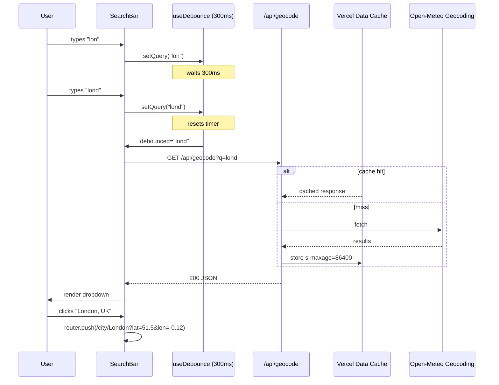

# 5.7 Weather Application

> A weather application with city search (with autocomplete), current weather, 5-day forecast, geolocation, recent searches, units toggle (°C/°F), and graceful handling of loading, error, and empty states. The app proxies the free, keyless Open-Meteo API through Next.js Route Handlers (so you can swap providers or add caching without touching the client), uses Server Components for the initial render, and falls back to Client Components for interactivity. This project reinforces custom hooks for fetching, error boundaries, loading states, and the Server/Client component boundary.

## 5.7.1 Project Objective

By the end of this project you should be able to:

1. Use the Open-Meteo API (no key required, free, generous rate limits) to fetch current weather and 5-day forecasts by latitude/longitude.
2. Use the Open-Meteo Geocoding API to search cities by name with autocomplete (debounced).
3. Build the app in Next.js App Router where the *initial* city's weather is fetched server-side (Server Component) and subsequent searches happen client-side (Client Component with a custom hook).
4. Proxy all third-party API calls through Next.js Route Handlers (`/api/weather`, `/api/geocode`) so the client never sees Open-Meteo directly. This lets you add caching, swap providers, or rate-limit without changing client code.
5. Build a `useGeolocation` hook that requests the user's location, handles permission denial, and falls back to a default city.
6. Build a `useDebounce` hook (or `useDeferredValue`) to throttle the autocomplete input.
7. Build a `useWeather` hook that fetches via the Route Handler, manages loading/error/data state, and supports cancellation (abort the previous request when a new one starts).
8. Build an error boundary around the forecast section so a forecast failure doesn't blank the current weather.
9. Persist recent searches in `localStorage` (last 8 cities). Clicking a recent search refetches.
10. Toggle units (°C/°F, km/h vs mph) with the choice persisted.

## 5.7.2 Reinforces Concepts From

- [[3.6 Hooks (Built-In)]] — `useState`, `useEffect`, `useRef`, `useCallback`.
- [[3.7 Custom Hooks]] — `useWeather`, `useGeolocation`, `useDebounce`, `useRecentSearches`.
- [[3.8 Effects and Side Effects]] — fetch on mount, fetch on city change, abort on unmount.
- [[3.13 Error Boundaries and Debugging]] — error boundary around the forecast.
- [[3.16 API Integration and Data Fetching]] — the entire data layer.
- [[4.3 Server and Client Components]] — Server Component for initial render, Client Component for interactivity.
- [[4.4 Rendering Strategies]] — dynamic rendering for the initial city (since we want fresh data).
- [[4.8 Route Handlers]] — `/api/weather` and `/api/geocode` proxies.
- [[4.9 Loading UI, Error Pages, and Streaming]] — `loading.tsx`, `error.tsx`, Suspense around the forecast.
- [[2.3 Responsive Utilities and Dark Mode]] — mobile-first layout, dark mode.

## 5.7.3 Requirements

### 5.7.3.1 Functional Requirements

1. **Home page** (`/`) — shows the user's current-location weather by default (if geolocation is granted), or a default city (e.g., San Francisco) otherwise. Layout: large current weather card (temperature, condition, high/low, "feels like", humidity, wind, sunrise/sunset), 5-day forecast strip below, and a search bar at the top.
2. **Search bar** — autocomplete dropdown. As the user types, debounce 300ms, call `/api/geocode?q=...`, show up to 8 results. Clicking a result navigates to `/city/[name]?lat=...&lon=...`.
3. **City page** (`/city/[name]?lat=...&lon=...`) — same layout as the home page but for the selected city. The page is a Server Component that fetches the weather at request time using the query params.
4. **Recent searches** — a dropdown or section showing the last 8 cities the user has viewed. Persisted in `localStorage`. Clicking a recent search navigates to that city's page.
5. **Units toggle** — a button in the top bar that toggles between metric (°C, km/h, hPa) and imperial (°F, mph, inHg). Choice persists. The current temperature, the forecast, and all derived values update instantly.
6. **5-day forecast** — daily high/low, condition icon, precipitation chance. Clicking a day expands an hourly breakdown (24 hours of temperature + precipitation).
7. **Geolocation button** — "Use my location" in the top bar. Calls `navigator.geolocation.getCurrentPosition`. If denied, shows a friendly message and falls back to the default city.
8. **Loading states** — skeletons for the current weather card and the forecast strip. Show skeletons during the initial Server Component render (via `loading.tsx`) and during client-side refetches (via the `useWeather` hook's `loading` flag).
9. **Error states** — if the forecast fails but current weather succeeds, show the current weather with an error message in the forecast section. If everything fails, show a friendly "Couldn't load weather" with a retry button.
10. **404 page** — friendly, with a link back home and a search input.

### 5.7.3.2 Non-Functional Requirements

| Requirement | Target |
|---|---|
| First Contentful Paint (with default city) | < 1.0 s |
| Largest Contentful Paint | < 2.0 s |
| Time to autocomplete results (p95) | < 300 ms (debounced) |
| Cache hit ratio for `/api/weather` | > 80% (popular cities) |
| Lighthouse Performance | ≥ 95 |
| Lighthouse Accessibility | ≥ 95 |
| Total page weight (no images) | < 100 KB gzipped |
| Works without JavaScript | home page renders server-side; subsequent interactions require JS |

### 5.7.3.3 Acceptance Criteria

- The home page renders server-side with the default city's weather — disabling JavaScript and reloading still shows the current temperature.
- Typing "lon" in the search bar shows "London, UK" and "London, Canada" within 300ms.
- Clicking "London, UK" navigates to `/city/London?lat=51.5&lon=-0.12` and shows London's weather, fetched server-side.
- The geolocation button prompts for permission; on grant, the page navigates to the user's location and shows weather for it.
- Toggling units updates all displayed values without a refetch.
- Recent searches appear after viewing a city; clicking one navigates to that city.
- If Open-Meteo is down, the forecast section shows "Couldn't load forecast — retry" without affecting the current weather.
- The app never makes more than one in-flight weather request for the same city at the same time (the `useWeather` hook aborts the previous request when a new one starts).

## 5.7.4 Recommended Architecture

```mermaid
flowchart TD
  subgraph Browser[Browser]
    Home[Home - Server Component] -->|reads| DefaultCity
    Home --> CurrentWeatherCard[CurrentWeatherCard - Server]
    Home --> ForecastStrip[ForecastStrip - Client, Suspense]
    CityPage[City Page - Server] --> CurrentWeatherCard
    CityPage --> ForecastStrip
    SearchBar[SearchBar - Client] -->|debounced fetch| GeocodeAPI[/api/geocode]
    SearchBar -->|navigate| CityPage
    GeolocationBtn[Geolocation Button - Client] -->|getCurrentPosition| CityPage
    UnitsToggle[Units Toggle - Client] -->|context| CurrentWeatherCard
    UnitsToggle --> ForecastStrip
  end

  subgraph Server[Next.js Server - Route Handlers]
    WeatherAPI[/api/weather?lat&lon] --> OpenMeteoWeather[Open-Meteo Forecast API]
    GeocodeAPI --> OpenMeteoGeocode[Open-Meteo Geocoding API]
    WeatherAPI --> Cache[Vercel Data Cache - 10 min]
  end

  CurrentWeatherCard -->|server-side fetch| WeatherAPI
  ForecastStrip -->|client-side fetch via useWeather| WeatherAPI
```

### 5.7.4.1 Why Proxy Through Route Handlers?

Three reasons:

1. **Caching.** Open-Meteo's API doesn't set cache headers. By proxying, you control caching (10-minute `s-maxage` is plenty for weather). Popular cities hit the cache and respond in < 50ms.
2. **Provider swap.** If Open-Meteo shuts down or you outgrow its rate limit, you swap to WeatherAPI or OpenWeatherMap by changing only the Route Handler — the client never knows.
3. **Key hiding.** Open-Meteo is keyless, but most weather APIs require a key. Proxying keeps the key server-side.

### 5.7.4.2 Why Server Components for the Initial Render?

The home page's first paint includes the current weather. If you fetch it client-side, the user sees a loading skeleton for 500ms-1s. If you fetch it server-side (in the Server Component), the HTML arrives with the data baked in — the user sees the weather immediately. Subsequent interactions (searching, toggling units) happen client-side.

### 5.7.4.3 Why a Custom `useWeather` Hook?

The hook centralizes: URL construction, fetch, abort, JSON parsing, error handling, and state. Every component that needs weather data uses the same hook, so behavior is consistent. The hook is also testable in isolation.

## 5.7.5 File Structure

```text
weather/
  - app/
      - layout.tsx
      - page.tsx                       # / - default city weather (Server)
      - city/
          - [name]/
          - page.tsx               # /city/[name] - Server
          - loading.tsx
      - api/
          - weather/route.ts           # GET ?lat&lon
          - geocode/route.ts           # GET ?q
      - loading.tsx
      - error.tsx
      - not-found.tsx
      - globals.css
  - components/
      - SearchBar.tsx                  # client
      - CurrentWeatherCard.tsx         # server-renderable
      - ForecastStrip.tsx              # client (Suspense)
      - ForecastDay.tsx                # client (expandable)
      - HourlyBreakdown.tsx
      - RecentSearches.tsx             # client
      - GeolocationButton.tsx          # client
      - UnitsToggle.tsx                # client
      - WeatherIcon.tsx                # SVG icons mapped to weather codes
      - ui/
      - Skeleton.tsx
      - Card.tsx
      - Button.tsx
  - hooks/
      - useWeather.ts
      - useGeolocation.ts
      - useDebounce.ts
      - useRecentSearches.ts
  - context/
      - UnitsContext.tsx
  - lib/
      - weather/
          - types.ts                   # Open-Meteo response types
          - codes.ts                   # WMO weather code  -->  { label, icon }
          - format.ts                  # temperature, wind, pressure formatting
          - fetch.ts                   # server-side fetch (used by Route Handler AND Server Components)
      - storage.ts
  - next.config.mjs
  - tailwind.config.ts
  - tsconfig.json
  - package.json
```

## 5.7.6 Step-by-Step Build Order

1. **Scaffold**. `npx create-next-app@latest weather --ts --app --tailwind`.
2. **Read the Open-Meteo docs**. The Forecast API is `https://api.open-meteo.com/v1/forecast?latitude=...&longitude=...&current=temperature_2m,weather_code,wind_speed_10m,...&daily=weather_code,temperature_2m_max,temperature_2m_min,...&hourly=temperature_2m,precipitation_probability&timezone=auto`. The Geocoding API is `https://geocoding-api.open-meteo.com/v1/search?name=london&count=8&language=en&format=json`.
3. **Define types**. In `lib/weather/types.ts`, type the Open-Meteo responses (current, daily, hourly). The WMO weather code is a number 0-99; map it to `{ label, icon }` in `codes.ts`.
4. **Build the server-side fetch helper**. `lib/weather/fetch.ts` exports `fetchWeather(lat, lon)` and `fetchGeocode(q)`. These are used by both the Route Handlers and the Server Components. They use `fetch` with Next.js's `next: { revalidate: 600 }` option for 10-minute caching.
5. **Build the Route Handlers**. `/api/weather` and `/api/geocode` are thin wrappers around the fetch helpers. They validate query params with Zod, call the helper, and return JSON.
6. **Build the `useWeather` hook**. Client-side hook that fetches from `/api/weather?lat=...&lon=...`. Manages `{ data, error, loading }`. Aborts the previous request when called again.
7. **Build the `useGeolocation` hook**. Wraps `navigator.geolocation.getCurrentPosition` in a promise. Returns `{ coords, error, loading, request }`.
8. **Build the `useDebounce` hook**. Returns a debounced value of the input.
9. **Build the `useRecentSearches` hook**. Reads/writes `localStorage["weather:recent"]`. Exposes `{ recent, add, clear }`.
10. **Build the UnitsContext**. Provides `{ units: "metric" | "imperial", toggle, setUnits }`. Persists to `localStorage["weather:units"]`. Reads on mount with no FOUC.
11. **Build the WeatherIcon component**. Maps WMO codes to inline SVGs (sun, cloud, rain, snow, fog). Use Lucide icons or hand-rolled SVGs.
12. **Build the CurrentWeatherCard**. Renders temperature, condition, high/low, feels like, humidity, wind, sunrise/sunset. Can be rendered server-side (takes `data` as a prop) or client-side (uses `useWeather`).
13. **Build the ForecastStrip**. Client component. Uses `useWeather` (or receives data as prop). Renders 5 days. Clicking a day expands the HourlyBreakdown.
14. **Build the SearchBar**. Client component. Debounced input. Calls `/api/geocode`. Shows results in a dropdown. Clicking a result navigates via `router.push`.
15. **Build the RecentSearches**. Client component. Reads `useRecentSearches`. Renders a list of recent cities. Clicking navigates.
16. **Build the GeolocationButton**. Client component. Uses `useGeolocation`. On success, navigates to `/city/My Location?lat=...&lon=...`.
17. **Build the UnitsToggle**. Client component. Calls `toggle` from `UnitsContext`.
18. **Build the home page**. Server Component. Reads a default city (San Francisco: lat 37.77, lon -122.42). Calls `fetchWeather` directly (server-side). Renders `SearchBar`, `GeolocationButton`, `UnitsToggle`, `CurrentWeatherCard` (with server-fetched data), and `ForecastStrip` (also with server-fetched data, since we already have it).
19. **Build the city page**. Server Component. Reads `params.name` and `searchParams.lat/lon`. Calls `fetchWeather`. Renders the same components. Adds the city to recent searches (via a small client component that calls `useRecentSearches().add` on mount).
20. **Add loading and error states**. `loading.tsx` shows skeletons. `error.tsx` shows a friendly message with a retry button.
21. **Wrap the ForecastStrip in an error boundary**. If the forecast fails, the current weather still shows. Use a client error boundary component.
22. **Audit and deploy**. Lighthouse, test on mobile, deploy to Vercel.

## 5.7.7 Code Walkthrough

### 5.7.7.1 WMO Weather Codes

```ts
// lib/weather/codes.ts
export type WeatherInfo = { label: string; icon: "clear" | "cloudy" | "partly-cloudy" | "fog" | "drizzle" | "rain" | "snow" | "thunderstorm" };

const map: Record<number, WeatherInfo> = {
  0:  { label: "Clear sky", icon: "clear" },
  1:  { label: "Mainly clear", icon: "clear" },
  2:  { label: "Partly cloudy", icon: "partly-cloudy" },
  3:  { label: "Overcast", icon: "cloudy" },
  45: { label: "Fog", icon: "fog" },
  48: { label: "Depositing rime fog", icon: "fog" },
  51: { label: "Light drizzle", icon: "drizzle" },
  53: { label: "Moderate drizzle", icon: "drizzle" },
  55: { label: "Dense drizzle", icon: "drizzle" },
  61: { label: "Slight rain", icon: "rain" },
  63: { label: "Moderate rain", icon: "rain" },
  65: { label: "Heavy rain", icon: "rain" },
  71: { label: "Slight snow", icon: "snow" },
  73: { label: "Moderate snow", icon: "snow" },
  75: { label: "Heavy snow", icon: "snow" },
  80: { label: "Rain showers", icon: "rain" },
  81: { label: "Heavy rain showers", icon: "rain" },
  82: { label: "Violent rain showers", icon: "rain" },
  95: { label: "Thunderstorm", icon: "thunderstorm" },
  96: { label: "Thunderstorm with hail", icon: "thunderstorm" },
  99: { label: "Severe thunderstorm with hail", icon: "thunderstorm" },
};

export function weatherCode(code: number): WeatherInfo {
  return map[code] ?? { label: "Unknown", icon: "cloudy" };
}
```

### 5.7.7.2 The Server-Side Fetch Helper

```ts
// lib/weather/fetch.ts
import type { WeatherResponse, GeocodeResponse } from "./types";

const FORECAST_URL = "https://api.open-meteo.com/v1/forecast";
const GEOCODE_URL = "https://geocoding-api.open-meteo.com/v1/search";

export async function fetchWeather(lat: number, lon: number): Promise<WeatherResponse> {
  const params = new URLSearchParams({
    latitude: String(lat),
    longitude: String(lon),
    current: "temperature_2m,relative_humidity_2m,apparent_temperature,weather_code,wind_speed_10m,wind_direction_10m,surface_pressure",
    daily: "weather_code,temperature_2m_max,temperature_2m_min,sunrise,sunset,precipitation_probability_max",
    hourly: "temperature_2m,precipitation_probability",
    timezone: "auto",
    forecast_days: "5",
  });
  const res = await fetch(`${FORECAST_URL}?${params}`, {
    next: { revalidate: 600 }, // 10-minute cache
  });
  if (!res.ok) throw new Error(`Weather API returned ${res.status}`);
  return res.json();
}

export async function fetchGeocode(query: string): Promise<GeocodeResponse> {
  const params = new URLSearchParams({
    name: query,
    count: "8",
    language: "en",
    format: "json",
  });
  const res = await fetch(`${GEOCODE_URL}?${params}`, {
    next: { revalidate: 86400 }, // cities don't move; cache 24h
  });
  if (!res.ok) throw new Error(`Geocode API returned ${res.status}`);
  return res.json();
}
```

### 5.7.7.3 The Route Handlers

```ts
// app/api/weather/route.ts
import { NextRequest, NextResponse } from "next/server";
import { fetchWeather } from "@/lib/weather/fetch";

export async function GET(req: NextRequest) {
  const { searchParams } = new URL(req.url);
  const lat = parseFloat(searchParams.get("lat") ?? "");
  const lon = parseFloat(searchParams.get("lon") ?? "");
  if (Number.isNaN(lat) || Number.isNaN(lon) || lat < -90 || lat > 90 || lon < -180 || lon > 180) {
    return NextResponse.json({ error: "Invalid lat/lon" }, { status: 400 });
  }
  try {
    const data = await fetchWeather(lat, lon);
    return NextResponse.json(data, {
      headers: { "Cache-Control": "s-maxage=600, stale-while-revalidate=3600" },
    });
  } catch (e) {
    return NextResponse.json({ error: "Weather service unavailable" }, { status: 502 });
  }
}
```

```ts
// app/api/geocode/route.ts
import { NextRequest, NextResponse } from "next/server";
import { fetchGeocode } from "@/lib/weather/fetch";

export async function GET(req: NextRequest) {
  const { searchParams } = new URL(req.url);
  const q = searchParams.get("q")?.trim();
  if (!q || q.length < 2) return NextResponse.json({ results: [] });
  try {
    const data = await fetchGeocode(q);
    return NextResponse.json(data, {
      headers: { "Cache-Control": "s-maxage=86400, stale-while-revalidate" },
    });
  } catch {
    return NextResponse.json({ error: "Geocode failed" }, { status: 502 });
  }
}
```

### 5.7.7.4 The `useWeather` Hook (With Abort)

```ts
// src/hooks/useWeather.ts
"use client";
import { useEffect, useState } from "react";
import type { WeatherResponse } from "@/lib/weather/types";

type State =
  | { status: "idle" }
  | { status: "loading" }
  | { status: "success"; data: WeatherResponse }
  | { status: "error"; error: string };

export function useWeather(lat: number | null, lon: number | null) {
  const [state, setState] = useState<State>({ status: "idle" });

  useEffect(() => {
    if (lat == null || lon == null) {
      setState({ status: "idle" });
      return;
    }
    const controller = new AbortController();
    setState({ status: "loading" });
    (async () => {
      try {
        const res = await fetch(`/api/weather?lat=${lat}&lon=${lon}`, { signal: controller.signal });
        if (!res.ok) throw new Error(`HTTP ${res.status}`);
        const data: WeatherResponse = await res.json();
        setState({ status: "success", data });
      } catch (e: any) {
        if (e.name === "AbortError") return;
        setState({ status: "error", error: e.message ?? "Failed to load weather" });
      }
    })();
    return () => controller.abort();
  }, [lat, lon]);

  return state;
}
```

### 5.7.7.5 The `useDebounce` Hook

```ts
// src/hooks/useDebounce.ts
"use client";
import { useEffect, useState } from "react";

export function useDebounce<T>(value: T, delay = 300): T {
  const [debounced, setDebounced] = useState(value);
  useEffect(() => {
    const t = setTimeout(() => setDebounced(value), delay);
    return () => clearTimeout(t);
  }, [value, delay]);
  return debounced;
}
```

### 5.7.7.6 The `useGeolocation` Hook

```ts
// src/hooks/useGeolocation.ts
"use client";
import { useCallback, useState } from "react";

type State =
  | { status: "idle" }
  | { status: "loading" }
  | { status: "success"; coords: { lat: number; lon: number } }
  | { status: "error"; error: string };

export function useGeolocation() {
  const [state, setState] = useState<State>({ status: "idle" });

  const request = useCallback(() => {
    if (typeof navigator === "undefined" || !navigator.geolocation) {
      setState({ status: "error", error: "Geolocation not supported" });
      return;
    }
    setState({ status: "loading" });
    navigator.geolocation.getCurrentPosition(
      (pos) => setState({
        status: "success",
        coords: { lat: pos.coords.latitude, lon: pos.coords.longitude },
      }),
      (err) => {
        const messages: Record<number, string> = {
          1: "Permission denied. Please allow location access in your browser settings.",
          2: "Location unavailable. Please try searching for a city instead.",
          3: "Location request timed out. Please try again.",
        };
        setState({ status: "error", error: messages[err.code] ?? err.message });
      },
      { enableHighAccuracy: false, timeout: 10_000, maximumAge: 600_000 }
    );
  }, []);

  return { ...state, request };
}
```

### 5.7.7.7 The SearchBar (Client Component)

```tsx
// components/SearchBar.tsx
"use client";
import { useState, useEffect } from "react";
import { useRouter } from "next/navigation";
import { useDebounce } from "@/hooks/useDebounce";
import type { GeocodeResult } from "@/lib/weather/types";

export function SearchBar() {
  const [query, setQuery] = useState("");
  const [results, setResults] = useState<GeocodeResult[]>([]);
  const [open, setOpen] = useState(false);
  const debounced = useDebounce(query, 300);
  const router = useRouter();

  useEffect(() => {
    if (debounced.trim().length < 2) { setResults([]); return; }
    let cancelled = false;
    (async () => {
      const res = await fetch(`/api/geocode?q=${encodeURIComponent(debounced)}`);
      const data = await res.json();
      if (!cancelled) {
        setResults(data.results ?? []);
        setOpen(true);
      }
    })();
    return () => { cancelled = true; };
  }, [debounced]);

  function select(result: GeocodeResult) {
    const name = `${result.name}${result.admin1 ? `, ${result.admin1}` : ""}${result.country_code ? `, ${result.country_code}` : ""}`;
    router.push(`/city/${encodeURIComponent(result.name)}?lat=${result.latitude}&lon=${result.longitude}&label=${encodeURIComponent(name)}`);
    setQuery("");
    setOpen(false);
  }

  return (
    <div className="relative w-full max-w-md">
      <input
        type="search"
        value={query}
        onChange={(e) => setQuery(e.target.value)}
        onFocus={() => results.length > 0 && setOpen(true)}
        onBlur={() => setTimeout(() => setOpen(false), 200)}
        placeholder="Search city..."
        className="w-full rounded-lg border border-neutral-300 px-4 py-2 text-sm dark:border-neutral-700 dark:bg-neutral-900"
        aria-expanded={open}
        aria-controls="search-results"
        role="combobox"
      />
      {open && results.length > 0 && (
        <ul id="search-results" role="listbox" className="absolute z-10 mt-1 max-h-80 w-full overflow-y-auto rounded-lg border border-neutral-200 bg-white shadow-lg dark:border-neutral-800 dark:bg-neutral-900">
          {results.map((r, i) => (
            <li key={`${r.id}-${i}`} role="option" aria-selected="false">
              <button
                type="button"
                onClick={() => select(r)}
                className="block w-full px-4 py-2 text-left text-sm hover:bg-neutral-100 dark:hover:bg-neutral-800"
              >
                <span className="font-medium">{r.name}</span>
                <span className="text-neutral-500">{r.admin1 ? `, ${r.admin1}` : ""} {r.country_code ? `(${r.country_code})` : ""}</span>
              </button>
            </li>
          ))}
        </ul>
      )}
    </div>
  );
}
```

### 5.7.7.8 The Home Page (Server Component)

```tsx
// app/page.tsx
import { fetchWeather } from "@/lib/weather/fetch";
import { CurrentWeatherCard } from "@/components/CurrentWeatherCard";
import { ForecastStrip } from "@/components/ForecastStrip";
import { SearchBar } from "@/components/SearchBar";
import { GeolocationButton } from "@/components/GeolocationButton";
import { UnitsToggle } from "@/components/UnitsToggle";
import { RecentSearches } from "@/components/RecentSearches";

const DEFAULT_CITY = { name: "San Francisco", lat: 37.7749, lon: -122.4194 };

export default async function HomePage() {
  const weather = await fetchWeather(DEFAULT_CITY.lat, DEFAULT_CITY.lon);

  return (
    <div className="mx-auto max-w-3xl space-y-6 p-6">
      <header className="flex flex-wrap items-center justify-between gap-4">
        <h1 className="text-2xl font-bold">Weather</h1>
        <div className="flex items-center gap-2">
          <GeolocationButton />
          <UnitsToggle />
        </div>
      </header>
      <SearchBar />
      <RecentSearches />
      <CurrentWeatherCard city={DEFAULT_CITY.name} weather={weather} />
      <ForecastStrip weather={weather} />
    </div>
  );
}
```

### 5.7.7.9 The City Page (Server Component)

```tsx
// app/city/[name]/page.tsx
import { fetchWeather } from "@/lib/weather/fetch";
import { CurrentWeatherCard } from "@/components/CurrentWeatherCard";
import { ForecastStrip } from "@/components/ForecastStrip";
import { SearchBar } from "@/components/SearchBar";
import { GeolocationButton } from "@/components/GeolocationButton";
import { UnitsToggle } from "@/components/UnitsToggle";
import { RecentSearches } from "@/components/RecentSearches";
import { AddToRecent } from "@/components/AddToRecent";

type Params = { params: { name: string }; searchParams: { lat: string; lon: string; label?: string } };

export async function generateMetadata({ params, searchParams }: Params) {
  const label = searchParams.label ?? decodeURIComponent(params.name);
  return { title: `Weather in ${label}` };
}

export default async function CityPage({ params, searchParams }: Params) {
  const lat = parseFloat(searchParams.lat);
  const lon = parseFloat(searchParams.lon);
  if (Number.isNaN(lat) || Number.isNaN(lon)) {
    throw new Error("Invalid coordinates");
  }
  const label = searchParams.label ?? decodeURIComponent(params.name);
  const weather = await fetchWeather(lat, lon);

  return (
    <div className="mx-auto max-w-3xl space-y-6 p-6">
      <header className="flex flex-wrap items-center justify-between gap-4">
        <h1 className="text-2xl font-bold">Weather in {label}</h1>
        <div className="flex items-center gap-2">
          <GeolocationButton />
          <UnitsToggle />
        </div>
      </header>
      <SearchBar />
      <RecentSearches />
      <AddToRecent city={{ name: label, lat, lon }} />
      <CurrentWeatherCard city={label} weather={weather} />
      <ForecastStrip weather={weather} />
    </div>
  );
}
```

### 5.7.7.10 The CurrentWeatherCard (Server-Renderable)

```tsx
// components/CurrentWeatherCard.tsx
import { WeatherIcon } from "./WeatherIcon";
import { weatherCode } from "@/lib/weather/codes";
import { useUnits } from "@/context/UnitsContext";
import type { WeatherResponse } from "@/lib/weather/types";

// This component renders on the server (no "use client"). It uses a child
// client component (UnitsAware) to apply unit formatting interactively.

export function CurrentWeatherCard({ city, weather }: { city: string; weather: WeatherResponse }) {
  const current = weather.current;
  const info = weatherCode(current.weather_code);
  const today = weather.daily;
  const sunrise = new Date(today.sunrise[0]).toLocaleTimeString([], { hour: "2-digit", minute: "2-digit" });
  const sunset = new Date(today.sunset[0]).toLocaleTimeString([], { hour: "2-digit", minute: "2-digit" });

  return (
    <section className="rounded-2xl border border-neutral-200 bg-white p-6 shadow-sm dark:border-neutral-800 dark:bg-neutral-900">
      <div className="flex items-start justify-between">
        <div>
          <h2 className="text-lg font-semibold">{city}</h2>
          <p className="text-sm text-neutral-500">{info.label}</p>
        </div>
        <WeatherIcon icon={info.icon} className="h-12 w-12" />
      </div>
      <div className="mt-4 flex items-baseline gap-4">
        <span className="text-6xl font-bold">
          <UnitValue celsius={current.temperature_2m} />
        </span>
        <div className="text-sm text-neutral-500">
          <div>H: <UnitValue celsius={today.temperature_2m_max[0]} /></div>
          <div>L: <UnitValue celsius={today.temperature_2m_min[0]} /></div>
        </div>
      </div>
      <div className="mt-6 grid grid-cols-2 gap-4 text-sm sm:grid-cols-4">
        <Stat label="Feels like" value={<UnitValue celsius={current.apparent_temperature} />} />
        <Stat label="Humidity" value={`${current.relative_humidity_2m}%`} />
        <Stat label="Wind" value={<WindValue kmh={current.wind_speed_10m} dir={current.wind_direction_10m} />} />
        <Stat label="Sunrise" value={sunrise} />
      </div>
    </section>
  );
}

function Stat({ label, value }: { label: string; value: React.ReactNode }) {
  return (
    <div>
      <p className="text-neutral-500">{label}</p>
      <p className="font-medium">{value}</p>
    </div>
  );
}

// Client component that formats based on current unit
import { UnitsDisplay } from "./UnitsDisplay";
function UnitValue({ celsius }: { celsius: number }) {
  return <UnitsDisplay type="temperature" value={celsius} />;
}
function WindValue({ kmh, dir }: { kmh: number; dir: number }) {
  return <UnitsDisplay type="wind" value={kmh} direction={dir} />;
}
```

> [!note] Why split server/client?
> The card itself is a Server Component (no `"use client"`), so it renders into HTML on the server. The `UnitsDisplay` is a Client Component that reads `useUnits()` and formats the number. On the server, `UnitsDisplay` renders with the default unit (metric); on the client, it hydrates and may swap to imperial if the user previously chose it. This causes a brief flash on hydration — acceptable, or you can avoid it by always rendering units on the client only.

### 5.7.7.11 The ForecastStrip (Client Component With Error Boundary)

```tsx
// components/ForecastStrip.tsx
"use client";
import { useState } from "react";
import { ForecastDay } from "./ForecastDay";
import { ErrorBoundary } from "./ErrorBoundary";
import type { WeatherResponse } from "@/lib/weather/types";

export function ForecastStrip({ weather }: { weather: WeatherResponse }) {
  const [expanded, setExpanded] = useState<number | null>(null);
  const days = weather.daily.time;

  return (
    <ErrorBoundary fallback={<ForecastError />}>
      <section className="rounded-2xl border border-neutral-200 bg-white p-4 dark:border-neutral-800 dark:bg-neutral-900">
        <h2 className="mb-3 text-lg font-semibold">5-day forecast</h2>
        <ul className="divide-y divide-neutral-200 dark:divide-neutral-800">
          {days.map((day, i) => (
            <li key={day}>
              <ForecastDay
                day={day}
                index={i}
                weather={weather}
                expanded={expanded === i}
                onToggle={() => setExpanded(expanded === i ? null : i)}
              />
            </li>
          ))}
        </ul>
      </section>
    </ErrorBoundary>
  );
}

function ForecastError() {
  return (
    <div className="rounded-2xl border border-red-200 bg-red-50 p-6 text-sm text-red-700 dark:border-red-900 dark:bg-red-950 dark:text-red-300">
      Couldn't load forecast. <button onClick={() => location.reload()} className="underline">Retry</button>
    </div>
  );
}
```

### 5.7.7.12 The UnitsContext

```tsx
// context/UnitsContext.tsx
"use client";
import { createContext, useContext, useEffect, useState, type ReactNode } from "react";

type Units = "metric" | "imperial";
type Ctx = { units: Units; setUnits: (u: Units) => void; toggle: () => void };
const UnitsContext = createContext<Ctx | null>(null);

export function UnitsProvider({ children }: { children: ReactNode }) {
  const [units, setUnitsState] = useState<Units>("metric");

  useEffect(() => {
    const stored = localStorage.getItem("weather:units") as Units | null;
    if (stored === "metric" || stored === "imperial") setUnitsState(stored);
  }, []);

  const setUnits = (u: Units) => {
    setUnitsState(u);
    localStorage.setItem("weather:units", u);
  };
  const toggle = () => setUnits(units === "metric" ? "imperial" : "metric");

  return <UnitsContext.Provider value={{ units, setUnits, toggle }}>{children}</UnitsContext.Provider>;
}

export function useUnits() {
  const ctx = useContext(UnitsContext);
  if (!ctx) throw new Error("useUnits must be used inside UnitsProvider");
  return ctx;
}
```

## 5.7.8 Mermaid Diagrams

### 5.7.8.1 Component and Data Flow

```mermaid
flowchart TD
  Home[app/page.tsx - Server] -->|fetchWeather lat/lon| FetchWeather[lib/weather/fetch.ts]
  FetchWeather -->|fetch with next.revalidate 600| OpenMeteo[Open-Meteo]
  Home --> SearchBar[SearchBar - client]
  SearchBar -->|debounced fetch| GeocodeRoute[/api/geocode]
  GeocodeRoute --> FetchGeocode --> OpenMeteoGeocode[Open-Meteo Geocoding]
  SearchBar -->|router.push| CityPage[app/city/name - Server]
  CityPage --> FetchWeather
  Home --> CurrentCard[CurrentWeatherCard - server]
  CurrentCard --> UnitsDisplay[UnitsDisplay - client]
  UnitsDisplay --> UnitsCtx[UnitsContext]
  Home --> ForecastStrip[ForecastStrip - client]
  ForecastStrip --> ErrorBoundary
  ForecastStrip --> ForecastDay[ForecastDay - client]
  GeolocationBtn -->|getCurrentPosition| CityPage
  RecentSearches -->|localStorage| LS[localStorage]
```

### 5.7.8.2 Search Autocomplete Flow



## 5.7.9 Common Pitfalls

1. **Calling `fetch` in a Server Component without `next.revalidate`.** Next.js defaults to `no-store` for `fetch` in Server Components, which means every request hits the upstream API. Always set `next: { revalidate: 600 }` for weather data.
2. **Forgetting to abort the previous fetch.** If the user types fast in the search bar, multiple `/api/geocode` requests fire. The responses arrive out of order, and the dropdown shows stale results. Use `AbortController` (as in the `useWeather` and `SearchBar` code above).
3. **Geolocation that hangs on denial.** `getCurrentPosition`'s error callback fires on permission denial, but only after a delay. Show a loading state and a manual "Search city" fallback so the user isn't stuck.
4. **No loading state on the initial server-side render.** If the Server Component's `await fetchWeather` takes 2 seconds, the user sees a blank page. Add `loading.tsx` so Next.js shows a skeleton during the await.
5. **Client/server unit mismatch causing hydration errors.** If the server renders in metric but the client hydrates in imperial (from `localStorage`), React throws a hydration mismatch. Either render units client-only (with a fallback) or accept the brief flash. See the note in 5.7.7.10.
6. **Forecast failure that blanks the whole page.** If the forecast fetch fails and you don't have an error boundary, the entire page crashes. Wrap the forecast in a boundary so only that section shows an error.
7. **`localStorage` access during SSR.** `localStorage` doesn't exist on the server. Always access it inside `useEffect` (which only runs on the client) or guard with `typeof window !== "undefined"`.
8. **Rate-limiting Open-Meteo.** Open-Meteo is free but rate-limited (~10k requests/day). Without caching, a popular deployment can blow through this in hours. The 10-minute `revalidate` on `/api/weather` keeps most requests in cache.
9. **No empty state for search.** If the user types "xyzzy" and there are no matches, show "No cities found" — don't just show an empty dropdown.
10. **Weather icons that don't match the WMO code.** The Open-Meteo `weather_code` is a WMO code (0-99), not OpenWeatherMap's code. Don't use an OpenWeatherMap icon set; map WMO codes yourself (as in `codes.ts`).

## 5.7.10 Stretch Goals

1. **Weather map.** Embed a Leaflet map with a precipitation overlay from RainViewer. Center on the current city. This adds ~50KB but is visually impressive.
2. **Push notifications for severe weather.** Use the Web Notifications API to alert the user when the forecast includes a thunderstorm (code 95+) in the next 24 hours.
3. **Multi-city dashboard.** A `/dashboard` route that shows the weather for 4 saved cities side-by-side. Useful for tracking weather in cities you travel between.
4. **Air quality.** Open-Meteo has an Air Quality API. Add an AQI card next to the current weather.
5. **Historical weather.** Open-Meteo's Archive API lets you fetch past weather. Add a "This day last year" section.

## 5.7.11 Self-Assessment Rubric

| # | Criterion | 0 | 1 | 2 | 3 |
|---|---|---|---|---|---|
| 1 | API integration | client-side, no proxy | client-side proxy | Route Handler + Server Component initial | + caching + abort + error handling |
| 2 | Search | manual submit | debounced, no abort | + abort + dropdown | + keyboard nav + recent searches |
| 3 | Geolocation | missing | button only | + permission denial | + fallback city + loading state |
| 4 | Loading states | none | spinner | skeletons | server-side loading.tsx + client skeletons |
| 5 | Error handling | none | app-level error page | + per-section error boundary | + retry + graceful degradation |
| 6 | Units toggle | missing | hardcoded metric | + toggle | + persisted + no hydration mismatch |
| 7 | Forecast | current only | + 5-day strip | + expandable day | + hourly breakdown + precipitation chance |
| 8 | Performance | unmeasured | Lighthouse 70-84 | 85-94 | ≥ 95 with 10-min cache |
| 9 | Accessibility | no ARIA | + alt text | + ARIA on combobox | + keyboard test + screen reader test |
| 10 | Code organization | one file | split by type | feature-based | + typed Open-Meteo responses + helpers |

## 5.7.12 Related Notes

- [[3.7 Custom Hooks]]
- [[3.8 Effects and Side Effects]]
- [[3.13 Error Boundaries and Debugging]]
- [[3.16 API Integration and Data Fetching]]
- [[4.3 Server and Client Components]]
- [[4.4 Rendering Strategies]]
- [[4.8 Route Handlers]]
- [[4.9 Loading UI, Error Pages, and Streaming]]
- [[5.6 Kanban Board]] — same hooks stack, focus on DnD and state
- [[5.2 Blog]] — same Next.js patterns, focus on content
