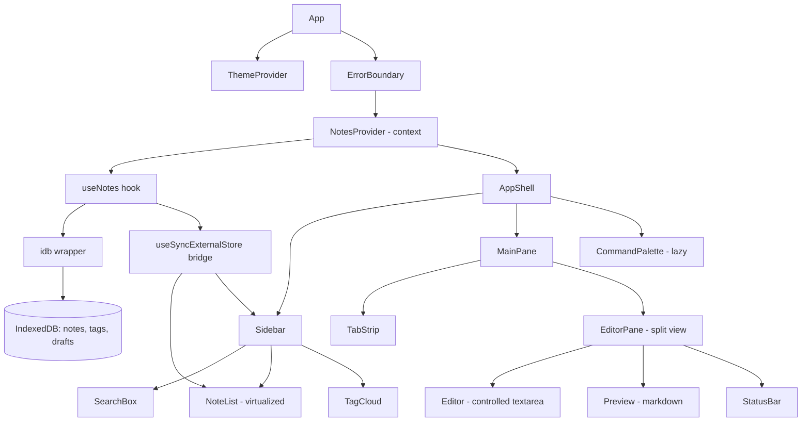
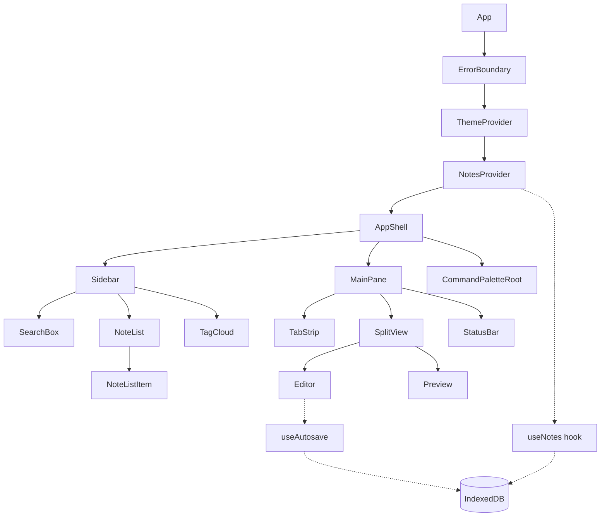
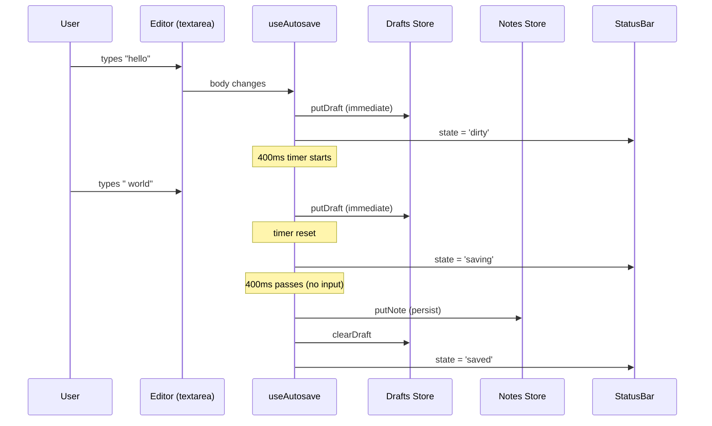

# 5.8 Notes Application

> A markdown notes app in the spirit of Bear or Obsidian-lite: a sidebar with notes, a tag filter, an instant fuzzy search, a live markdown preview, and a command palette that drives every action from the keyboard. Notes persist to IndexedDB (not localStorage) because note bodies grow without bound and the 5 MB localStorage quota is a real production cliff. A debounced autosave hook writes on idle; a `Cmd+K` command palette navigates, creates, tags, and deletes; `marked` (or `remark` + `rehype`) renders markdown safely with XSS scrubbing. This project reinforces controlled textareas, debounced effects, custom hooks, IndexedDB as a first-class client database, the command palette pattern, and fuzzy search — the exact stack that real note-taking products are built on.

## 5.8.1 Project Objective

By the end of this project you should be able to:

1. Model a notes database in IndexedDB with a single `notes` object store keyed by `id`, plus a `tags` store and a `fts` (full-text search) index. Use `idb` (the tiny wrapper by Jake Archibald) so you never hand-write `onupgradeneeded` boilerplate again.
2. Build a `useNotes` hook that opens the DB once (memoized with a module-level promise so multiple components share one connection), exposes CRUD actions, and notifies subscribers via a `useSyncExternalStore` bridge so React 18's concurrent renderer never sees tearing.
3. Implement debounced autosave: the editor's textarea is controlled, but the actual write to IndexedDB is debounced 400 ms after the user stops typing. Show a "Saving…"  -->  "Saved" indicator. Show "Unsaved changes" the moment the textarea diverges from the persisted value.
4. Render markdown with `marked` (or `remark` + `rehype-sanitize`) — never use `dangerouslySetInnerHTML` on raw user input. Configure a renderer that adds heading anchors, link `rel="noopener noreferrer"` and `target="_blank"`, and code block syntax classes.
5. Implement fuzzy search with `fuse.js` over note titles and bodies. Results show match highlights (the matched substring wrapped in `<mark>`). The search box is keyboard-first: `/` focuses it from anywhere, `Esc` clears.
6. Build a command palette (`Cmd+K` / `Ctrl+K`) with `cmdk` (or a hand-rolled equivalent) that surfaces every action: new note, delete note, toggle tag, jump to note, toggle preview, export, change theme. The palette is the primary navigation — the sidebar is secondary.
7. Implement a tag system: inline `#tag` syntax in the note body is parsed and synced to the `tags` store on save. The sidebar shows a tag cloud; clicking a tag filters notes.
8. Add keyboard shortcuts everywhere: `Cmd+N` new note, `Cmd+K` palette, `Cmd+P` toggle preview, `Cmd+/` show shortcuts, `Cmd+Backspace` delete (with confirm), `Cmd+↑/↓` prev/next note, `Cmd+F` search.
9. Support multiple notes open in a tab strip (like a browser) — each tab is a note. Switching tabs is instant because the editor's local state is keyed by note id, so React preserves per-note undo history.
10. Export notes as `.md` files (single note or all as a `.zip` via `jszip`). Import `.md` files via drag-and-drop onto the sidebar.

## 5.8.2 Reinforces Concepts From

- [[3.3 State and Events]] — controlled textarea, `onChange`, `onKeyDown` for shortcuts.
- [[3.4 Forms and Conditional Rendering]] — the editor form, the conditional preview pane.
- [[3.5 Lists and Keys]] — note list, tag list, command palette items (stable IDs, never array indices).
- [[3.6 Hooks (Built-In)]] — `useState`, `useEffect`, `useRef`, `useMemo`, `useCallback`, `useDeferredValue` for the search filter, `useSyncExternalStore` to bridge IndexedDB.
- [[3.7 Custom Hooks]] — `useNotes`, `useDebouncedEffect`, `useLocalStorage`, `useHotkeys`, `useIndexedDB`.
- [[3.8 Effects and Side Effects]] — the debounced autosave effect, the markdown re-parse effect, the DB subscription effect.
- [[3.9 Context and Reducers]] — the editor state (which note, which tab, preview on/off) as a reducer.
- [[3.10 Composition and Patterns]] — compound components for the command palette (`<Command>`, `<Command.Input>`, `<Command.List>`, `<Command.Item>`).
- [[3.11 Performance Optimization]] — `React.memo` for note list items, `useDeferredValue` for search, `useMemo` for parsed markdown, virtualization for 10k+ notes.
- [[3.12 Suspense, Lazy Loading, and Code Splitting]] — lazy-load the markdown renderer and the export zip library only when first used.
- [[3.13 Error Boundaries and Debugging]] — wrap the editor so a markdown parse error doesn't crash the app.
- [[3.14 Reusable Component Design]] — the editor, the tag chip, the command palette item as reusable units.
- [[3.15 Project Architecture and Folder Organization]] — feature-based folders (`features/notes`, `features/editor`, `features/command-palette`).
- [[3.16 API Integration and Data Fetching]] — IndexedDB is the "API" here; the same async patterns apply.
- [[1.8 Variables, Functions, and Calculations]] — CSS variables for the theme tokens the palette and editor use.
- [[2.7 Tailwind with React and Next.js]] — Tailwind for layout, dark mode via `class` strategy.

## 5.8.3 Requirements

### 5.8.3.1 Functional Requirements

1. **Note list** in a left sidebar: title (first non-empty line of body), snippet (next 80 chars), relative timestamp ("2m ago"), and a small pin indicator. Click to open; double-click to rename inline.
2. **Editor** in the center: a controlled `<textarea>` with monospace font, line numbers (optional), and a live word count in the status bar.
3. **Preview pane** on the right (toggleable with `Cmd+P`): rendered markdown with the configured sanitization pipeline.
4. **Autosave**: 400 ms after the user stops typing, the note is written to IndexedDB. The status bar shows "Saving…", "Saved at HH:MM", or "Unsaved changes" based on the diff between local and persisted.
5. **Fuzzy search**: a search box at the top of the sidebar. Typing filters notes by title and body using `fuse.js`. Matches are highlighted in the snippet.
6. **Tags**: any `#tag` token in the note body is parsed and stored. The sidebar shows a tag list with counts; clicking a tag filters the note list to notes with that tag.
7. **Command palette** (`Cmd+K`): fuzzy-searchable list of every action. Includes "Jump to note…" which sub-searches notes by title.
8. **Keyboard shortcuts**: a single `useHotkeys` hook registers `Cmd+N`, `Cmd+K`, `Cmd+P`, `Cmd+/`, `Cmd+Backspace`, `Cmd+↑/↓`, `Cmd+F`, `Cmd+S` (force-save now), `Cmd+Shift+E` (export current).
9. **Multiple tabs**: each opened note is a tab in a strip above the editor. `Cmd+W` closes the current tab. Closing the last tab shows an empty state.
10. **Export**: `Cmd+Shift+E` exports the current note as `title.md`. `Cmd+Shift+A` exports all notes as a `.zip` (lazy-loads `jszip`).
11. **Import**: drag-and-drop `.md` files onto the sidebar. Each becomes a new note with the file name as the title and the file contents as the body.
12. **Dark mode**: toggle in the status bar, persisted to localStorage, applied before first paint (inline script in `index.html` to avoid FOUC).
13. **Word count / reading time**: the status bar shows word count, char count, and estimated reading time (words / 200).

### 5.8.3.2 Non-Functional Requirements

| Requirement | Target |
|---|---|
| Note list with 5,000 notes, search filter | < 16 ms frame time (use `useDeferredValue` and virtualization) |
| Autosave write to IndexedDB | < 5 ms (debounced 400 ms) |
| Markdown render of a 10k-word note | < 50 ms (memoized on body change) |
| Initial DB open | < 100 ms |
| Lighthouse Performance | ≥ 90 |
| Lighthouse Accessibility | ≥ 95 |
| Memory after 1 hour of editing 50 notes | flat (no listener leaks) |
| Storage ceiling | IndexedDB quota (effectively unlimited; browser will prompt past ~1 GB) |

### 5.8.3.3 Acceptance Criteria

- Typing in a note shows "Unsaved changes" within one frame; 400 ms after the last keystroke it shows "Saving…" briefly, then "Saved at HH:MM:SS". Refreshing the page after autosave restores the note exactly.
- Opening a second tab does NOT lose the first tab's undo history (the textarea is keyed by note id).
- Searching for "react hooks" with `fuse.js` highlights matches in the snippet and ranks by relevance (title matches above body matches).
- `Cmd+K` opens the palette; typing "new" shows "New note"; pressing `Enter` creates a note and focuses the editor. `Esc` closes the palette and returns focus to the editor.
- Dragging a `.md` file onto the sidebar creates a new note with the file's content. The note appears at the top of the list with a brief highlight animation.
- Force-quitting the browser mid-edit, then reopening, shows a recovery prompt: "You have unsaved changes in 'Note title'. Restore?" — this works because the editor writes a draft to a separate `drafts` store on every keystroke (not debounced).
- A note with `<script>alert(1)</script>` in the body renders the script as escaped text in the preview, not as executable HTML. (Sanitization pipeline is on.)
- The app works offline — IndexedDB is local, the markdown renderer is bundled, no network calls.

## 5.8.4 Recommended Architecture



### 5.8.4.1 Why IndexedDB, not localStorage?

`localStorage` is synchronous, blocks the main thread, caps at 5 MB per origin, and stores strings only. A notes app with 200 notes averaging 5 KB each is already 1 MB; with embedded images (base64) you blow past 5 MB in days. IndexedDB is asynchronous, stores structured data (no `JSON.parse` round-trip), supports indexes (the `tags` index lets you query "all notes with tag X" without scanning), and is effectively unbounded (browser prompts past ~1 GB). The only reason to use localStorage in this project is for tiny preferences (theme, sidebar width) — never for note bodies.

### 5.8.4.2 Why `useSyncExternalStore`?

IndexedDB is an external store: writes happen outside React's render cycle. The naive approach is `useState` + a manual refresh, but that breaks under concurrent rendering — two tabs editing the same note can tear. `useSyncExternalStore` is React 18's official bridge: you provide a `subscribe` callback (called once per consumer), a `getSnapshot` callback (must return a cached, referentially-stable value), and React handles tearing, batching, and concurrent safety. The pattern below shows the bridge in full.

### 5.8.4.3 Why a separate `drafts` store?

Autosave is debounced 400 ms. If the browser crashes 200 ms into a typing burst, those 200 ms of changes are lost. A `drafts` store writes the current editor contents to IndexedDB on **every keystroke** (cheap, because IndexedDB writes are async and the draft is small). On next launch, the app checks for drafts newer than the persisted note and offers recovery. This is the same trick VS Code uses for unsaved file buffers.

## 5.8.5 File Structure

```text
notes-app/
  - index.html
  - package.json
  - tailwind.config.ts
  - vite.config.ts
  - tsconfig.json
  - src/
      - main.tsx
      - App.tsx
      - routes/
          - NotesPage.tsx
      - features/
          - notes/
              - components/
                  - NoteList.tsx
                  - NoteListItem.tsx
                  - SearchBox.tsx
                  - TagCloud.tsx
              - context/
                  - NotesContext.tsx
              - hooks/
                  - useNotes.ts
                  - useNoteSearch.ts
              - lib/
                  - db.ts                 # idb wrapper
                  - notesRepository.ts    # CRUD
                  - tags.ts               # parse #tags
                  - search.ts             # fuse.js instance
              - types.ts
          - editor/
              - components/
                  - Editor.tsx
                  - Preview.tsx
                  - StatusBar.tsx
                  - TabStrip.tsx
              - hooks/
                  - useAutosave.ts
                  - useEditorState.ts
              - lib/
              - markdown.ts           # marked + sanitize
              - shortcuts.ts
          - command-palette/
          - components/
              - CommandPalette.tsx    # lazy-loaded
          - hooks/
          - useHotkeys.ts
      - components/
          - ui/
          - Button.tsx
          - Input.tsx
          - Tooltip.tsx
      - lib/
          - id.ts
          - export.ts                     # lazy jszip
      - context/
          - ThemeContext.tsx
      - styles/
      - globals.css
  - README.md
```

## 5.8.6 Step-by-Step Build Order

1. **Scaffold** Vite + React + TypeScript + Tailwind. Add `idb`, `marked`, `dompurify`, `fuse.js`, `cmdk`, `jszip` (lazy).
2. **Define types** in `features/notes/types.ts`: `Note { id, title, body, tags, createdAt, updatedAt }`, `Tag { name, count }`.
3. **Build the DB layer** in `features/notes/lib/db.ts` — open the DB, create stores (`notes` keyed by `id`, `tags` keyed by `name`, `drafts` keyed by `noteId`), create indexes (`notes.byUpdatedAt`, `notes.byTag` via multi-entry index on `tags`).
4. **Build the repository** in `notesRepository.ts` — `listNotes()`, `getNote(id)`, `putNote(note)`, `deleteNote(id)`, `listTags()`, `reindexTags()`.
5. **Build the `useNotes` hook** with `useSyncExternalStore`. The hook exposes `notes`, `tags`, and stable action callbacks (`createNote`, `updateNote`, `deleteNote`).
6. **Build the sidebar** — `SearchBox`, `NoteList` (virtualized with `react-window` once you have > 200 notes), `TagCloud`. Wire selection: clicking a note sets the active id.
7. **Build the editor** — controlled `<textarea>` bound to the active note's body. Local state lives in `useEditorState`, keyed by note id (so switching tabs preserves undo).
8. **Add autosave** — `useAutosave(noteId, body)` debounces 400 ms then calls `putNote`. Also writes to `drafts` on every keystroke (not debounced).
9. **Add the preview pane** — `Preview` renders `markdown.render(body)` through `dompurify`. Memoize on `body`.
10. **Add fuzzy search** — `useNoteSearch(notes, query)` returns filtered + highlighted notes. Use `useDeferredValue(query)` so typing doesn't block the editor.
11. **Add the tag system** — `parseTags(body)` returns an array of tag strings; on save, the repository updates the `tags` store counts.
12. **Add the command palette** — `cmdk`-based. Register commands: new note, delete note, toggle preview, export, jump to note (sub-search), toggle theme.
13. **Add keyboard shortcuts** — `useHotkeys` registers all shortcuts globally. Each shortcut calls the same handler the palette uses (single source of truth).
14. **Add tabs** — `TabStrip` shows open notes; `Cmd+W` closes; closing the last tab shows an empty state.
15. **Add export/import** — lazy-load `jszip` only when exporting all. Drag-and-drop `.md` files onto the sidebar.
16. **Add dark mode** — inline script in `index.html` to prevent FOUC; `ThemeContext` reads from localStorage.
17. **Add error boundary** around the editor — a markdown parse error or a DB corruption shouldn't blank the app.
18. **Polish** — recovery prompt for drafts, focus management (palette returns focus to editor on close), accessibility audit (ARIA roles for the tree, the palette, the editor).

## 5.8.7 Code Walkthrough

### 5.8.7.1 The IndexedDB Layer

```ts
// features/notes/lib/db.ts
import { openDB, type DBSchema, type IDBPDatabase } from 'idb';

interface NotesDB extends DBSchema {
  notes: {
    key: string;
    value: Note;
    indexes: { 'by-updated-at': number; 'by-tag': string };
  };
  tags: {
    key: string;
    value: { name: string; count: number };
  };
  drafts: {
    key: string; // noteId
    value: { noteId: string; body: string; savedAt: number };
  };
}

let dbPromise: Promise<IDBPDatabase<NotesDB>> | null = null;

export function getDB() {
  if (!dbPromise) {
    dbPromise = openDB<NotesDB>('notes-app', 1, {
      upgrade(db) {
        const notes = db.createObjectStore('notes', { keyPath: 'id' });
        notes.createIndex('by-updated-at', 'updatedAt');
        // multi-entry index: a note with ['react','hooks'] creates 2 index entries
        notes.createIndex('by-tag', 'tags', { multiEntry: true });
        db.createObjectStore('tags', { keyPath: 'name' });
        db.createObjectStore('drafts', { keyPath: 'noteId' });
      },
    });
  }
  return dbPromise;
}
```

> [!note] The `multiEntry: true` option on the `by-tag` index is what makes `db.getAllFromIndex('notes', 'by-tag', 'react')` return every note tagged `react` without scanning. This is the single biggest reason IndexedDB beats localStorage for tagged content.

### 5.8.7.2 The `useSyncExternalStore` Bridge

```ts
// features/notes/hooks/useNotes.ts
import { useSyncExternalStore, useCallback } from 'react';
import { getDB } from '../lib/db';
import { listNotes, putNote, deleteNote, createNote } from '../lib/notesRepository';

type Listener = () => void;
const listeners = new Set<Listener>();
let cache: Note[] = [];
let cacheVersion = 0;

function emit() {
  cacheVersion++;
  listeners.forEach((l) => l());
}

export function useNotes() {
  const subscribe = useCallback((cb: Listener) => {
    listeners.add(cb);
    // Initial load if first subscriber
    if (listeners.size === 1) {
      listNotes().then((notes) => {
        cache = notes;
        cb();
      });
    }
    return () => {
      listeners.delete(cb);
    };
  }, []);

  const getSnapshot = useCallback(() => cache, []);

  // useSyncExternalStore requires getSnapshot to return a stable reference
  // if nothing changed. We achieve this by replacing `cache` only on writes.
  const notes = useSyncExternalStore(subscribe, getSnapshot, () => []);

  const create = useCallback(async () => {
    const note = await createNote();
    cache = [note, ...cache];
    emit();
    return note;
  }, []);

  const update = useCallback(async (note: Note) => {
    await putNote(note);
    cache = cache.map((n) => (n.id === note.id ? note : n));
    emit();
  }, []);

  const remove = useCallback(async (id: string) => {
    await deleteNote(id);
    cache = cache.filter((n) => n.id !== id);
    emit();
  }, []);

  return { notes, create, update, remove };
}
```

> [!warning] The #1 mistake with `useSyncExternalStore` is returning a fresh array from `getSnapshot` on every call. React calls `getSnapshot` after every render; if it returns `notes.filter(...)`, the reference is always new, and React enters an infinite render loop. Always return a cached array and replace it (not mutate) when data changes.

### 5.8.7.3 Debounced Autosave

```ts
// features/editor/hooks/useAutosave.ts
import { useEffect, useRef, useState } from 'react';
import { putNote, putDraft } from '../../notes/lib/notesRepository';

type SaveState = 'idle' | 'dirty' | 'saving' | 'saved';

export function useAutosave(noteId: string, body: string, debounceMs = 400) {
  const [saveState, setSaveState] = useState<SaveState>('idle');
  const timer = useRef<number>();
  const lastSaved = useRef(body);

  // Write a draft on every keystroke (cheap, un-debounced).
  useEffect(() => {
    if (body !== lastSaved.current) {
      putDraft(noteId, body);
      setSaveState('dirty');
    }
  }, [body, noteId]);

  // Debounced persist to the notes store.
  useEffect(() => {
    if (body === lastSaved.current) return;
    setSaveState('saving');
    clearTimeout(timer.current);
    timer.current = window.setTimeout(async () => {
      await putNote({ id: noteId, body, updatedAt: Date.now() } as Note);
      lastSaved.current = body;
      setSaveState('saved');
      // Clear draft — we've persisted the real note.
      await clearDraft(noteId);
    }, debounceMs);
    return () => clearTimeout(timer.current);
  }, [body, noteId, debounceMs]);

  return saveState;
}
```

### 5.8.7.4 Markdown Rendering with Sanitization

```ts
// features/editor/lib/markdown.ts
import { marked } from 'marked';
import DOMPurify from 'dompurify';

marked.setOptions({
  gfm: true,
  breaks: false,
  headerIds: true,
  mangle: false,
});

export function renderMarkdown(src: string): string {
  const raw = marked.parse(src, { async: false }) as string;
  return DOMPurify.sanitize(raw, {
    ADD_ATTR: ['target', 'rel'],
    FORBID_TAGS: ['style', 'iframe'],
    FORBID_ATTR: ['onerror', 'onload', 'onclick'],
  });
}
```

> [!danger] Never call `dangerouslySetInnerHTML` on raw `marked` output. `marked` does not sanitize by default — a note containing `` will execute the handler. Always pass marked output through `dompurify`. This is non-negotiable for any app that stores user markdown.

### 5.8.7.5 Fuzzy Search with `fuse.js`

```ts
// features/notes/lib/search.ts
import Fuse from 'fuse.js';
import { useMemo } from 'react';

const fuseOptions: Fuse.IFuseOptions<Note> = {
  keys: [
    { name: 'title', weight: 0.7 },
    { name: 'body', weight: 0.3 },
  ],
  includeMatches: true,
  threshold: 0.4, // 0 = exact, 1 = anything
  ignoreLocation: true,
};

export function useNoteSearch(notes: Note[], query: string) {
  const deferred = useDeferredValue(query);
  return useMemo(() => {
    if (!deferred.trim()) return notes;
    const fuse = new Fuse(notes, fuseOptions);
    return fuse.search(deferred).map((r) => ({
      note: r.item,
      matches: r.matches ?? [],
    }));
  }, [notes, deferred]);
}
```

### 5.8.7.6 The Command Palette

```tsx
// features/command-palette/components/CommandPalette.tsx
import { Command } from 'cmdk';
import { lazy, Suspense } from 'react';

const CommandPalette = lazy(() => import('./CommandPaletteImpl'));

export function CommandPaletteRoot(props: { open: boolean; onOpenChange: (o: boolean) => void }) {
  if (!props.open) return null;
  return (
    <Suspense fallback={null}>
      <CommandPalette {...props} />
    </Suspense>
  );
}
```

```tsx
// features/command-palette/components/CommandPaletteImpl.tsx
import { Command } from 'cmdk';

export default function CommandPaletteImpl({ open, onOpenChange }: Props) {
  return (
    <div className="fixed inset-0 z-50 flex items-start justify-center bg-black/40" onClick={() => onOpenChange(false)}>
      <Command
        loop
        label="Command Palette"
        className="mt-32 w-full max-w-xl rounded-lg border bg-white shadow-xl dark:bg-zinc-900"
      >
        <Command.Input placeholder="Type a command or search…" autoFocus />
        <Command.List className="max-h-80 overflow-auto p-2">
          <Command.Empty>No results found.</Command.Empty>
          <Command.Group heading="Notes">
            <Command.Item onSelect={() => actions.createNote()}>New note</Command.Item>
            <Command.Item onSelect={() => actions.deleteCurrent()}>Delete current note</Command.Item>
          </Command.Group>
          <Command.Group heading="View">
            <Command.Item onSelect={() => actions.togglePreview()}>Toggle preview</Command.Item>
            <Command.Item onSelect={() => actions.toggleTheme()}>Toggle theme</Command.Item>
          </Command.Group>
        </Command.List>
      </Command>
    </div>
  );
}
```

### 5.8.7.7 Keyboard Shortcuts Hook

```ts
// features/command-palette/hooks/useHotkeys.ts
import { useEffect } from 'react';

type Handler = (e: KeyboardEvent) => void;

export function useHotkeys(map: Record<string, Handler>) {
  useEffect(() => {
    function onKey(e: KeyboardEvent) {
      const parts: string[] = [];
      if (e.metaKey) parts.push('cmd');
      if (e.ctrlKey) parts.push('ctrl');
      if (e.shiftKey) parts.push('shift');
      if (e.altKey) parts.push('alt');
      parts.push(e.key.toLowerCase());
      const combo = parts.join('+');
      const handler = map[combo];
      if (handler) {
        e.preventDefault();
        handler(e);
      }
    }
    window.addEventListener('keydown', onKey);
    return () => window.removeEventListener('keydown', onKey);
  }, [map]);
}

// Usage:
useHotkeys({
  'cmd+k': () => setPaletteOpen(true),
  'cmd+n': () => createNote(),
  'cmd+p': () => togglePreview(),
  'cmd+w': () => closeCurrentTab(),
});
```

## 5.8.8 Mermaid Diagrams

### 5.8.8.1 Component Tree



### 5.8.8.2 Autosave Data Flow



## 5.8.9 Common Pitfalls

1. **Returning a fresh array from `getSnapshot`.** `useSyncExternalStore` calls `getSnapshot` after every render. If it returns `notes.filter(...)`, the reference is always new, React thinks the store changed, and you get an infinite render loop. Always cache the array and replace (not mutate) on writes.
2. **Debouncing the draft write.** If you debounce the `putDraft` call, you defeat its purpose — a crash mid-debounce loses the draft. Drafts must be written on every keystroke; only the persist-to-notes step is debounced.
3. **Using `dangerouslySetInnerHTML` on raw `marked` output.** `marked` does not sanitize. A `<script>` tag in a note will execute. Always pipe through `dompurify`.
4. **Forgetting to clear drafts after persist.** If you persist a note but don't clear its draft, the recovery prompt fires on every launch even when the note is fully saved.
5. **Array index as key for the note list.** When you delete a note, the list shifts; React reconciles by key, so index-keyed items "become" the wrong note. Always use the note's `id`.
6. **IndexedDB schema migrations that drop data.** Bumping the DB version with a naive `upgrade` handler that calls `createObjectStore` on an existing store throws. Always check `db.objectStoreNames.contains(name)` first, and prefer additive migrations.
7. **`fuse.js` instance created on every render.** `new Fuse(notes, options)` is O(n) to build. Wrap in `useMemo` keyed on `notes` so it's rebuilt only when the note set changes.
8. **Editor loses undo history on tab switch.** If the editor's local state lives in the parent, switching tabs replaces it. The fix is to key the `<textarea>` (or its wrapping component) by note id, so React preserves a separate instance per note.
9. **`onKeyDown` shortcuts that fire inside inputs.** `Cmd+K` should work everywhere, but plain `N` should not — otherwise typing "N" in the editor creates a note. Use modifier checks (`e.metaKey || e.ctrlKey`) for all shortcuts, or maintain a whitelist of combos.
10. **Memory leak from `useSyncExternalStore` listeners.** If you `listeners.add(cb)` but forget the cleanup `listeners.delete(cb)`, listeners accumulate across hot reloads and slow the app. Always return a cleanup from `subscribe`.
11. **Markdown re-parsing on every keystroke.** `renderMarkdown(body)` on a 10k-word note takes ~50 ms. Memoize on `body` so it only re-parses when the body changes — not when the cursor moves or the theme toggles.
12. **Export zip loaded eagerly.** `jszip` is ~100 KB. Don't bundle it into the main chunk. Lazy-load it (`import('jszip')`) only when the user triggers "Export all".

## 5.8.10 Stretch Goals

1. **Backlinks.** Parse `[[note title]]` syntax in note bodies; render a "Linked references" panel at the bottom of each note showing other notes that link to it. Requires a `links` index in IndexedDB.
2. **Full-text search with highlighting and ranking.** Replace `fuse.js` with a custom inverted index built on top of IndexedDB's `by-tag` pattern, but for words. Store a `tokens` array on each note and use a multi-entry index.
3. **Sync via a mock server.** Add a "Sync" button that POSTs all notes to a mock server (an in-memory `setTimeout` promise). Conflict resolution: last-write-wins on `updatedAt`.
4. **Collaborative editing.** Use Yjs to sync a note across browser tabs via BroadcastChannel. This is a large stretch — start with single-tab.
5. **Markdown extensions.** Add support for math (KaTeX), diagrams (Mermaid in the preview), and callouts (`> [!note]` syntax). Each is a `marked` extension.

## 5.8.11 Self-Assessment Rubric

| # | Criterion | 0 | 1 | 2 | 3 |
|---|---|---|---|---|---|
| 1 | Persistence | localStorage | IndexedDB raw | `idb` wrapper + repo | + `useSyncExternalStore` bridge |
| 2 | Autosave | none | on blur | debounced | debounced + drafts store + recovery prompt |
| 3 | Markdown | plain text | `marked` raw | `marked` + DOMPurify | + extensions (callouts, anchors) |
| 4 | Search | none | `filter()` | `fuse.js` | + `useDeferredValue` + highlight |
| 5 | Tags | none | inline only | parsed on save | + tag cloud + multi-entry index |
| 6 | Command palette | none | menu | cmdk palette | + every action + fuzzy + keyboard nav |
| 7 | Keyboard shortcuts | none | 2-3 | 5+ | + help overlay (`Cmd+/`) + per-context |
| 8 | Tabs | single note | multiple notes | + close + persist | + undo history per tab |
| 9 | Performance | re-renders all | memoized list | + virtualization | + lazy markdown + lazy jszip |
| 10 | Polish | rough | dark mode | + status bar + word count | + export/import + recovery + a11y audit |

## 5.8.12 Related Notes

- [[3.6 Hooks (Built-In)]]
- [[3.7 Custom Hooks]]
- [[3.8 Effects and Side Effects]]
- [[3.9 Context and Reducers]]
- [[3.10 Composition and Patterns]]
- [[3.11 Performance Optimization]]
- [[3.12 Suspense, Lazy Loading, and Code Splitting]]
- [[3.13 Error Boundaries and Debugging]]
- [[3.16 API Integration and Data Fetching]]
- [[5.6 Kanban Board]] — same localStorage/IndexedDB persistence patterns, different domain
- [[5.9 Chat UI]] — same `useSyncExternalStore` bridge pattern, applied to a WebSocket instead of IndexedDB
- [[5.10 File Explorer UI]] — same recursive component rendering and keyboard nav patterns
