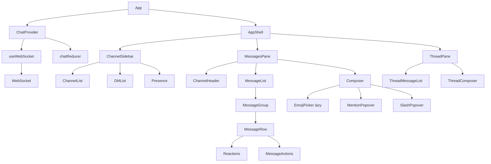
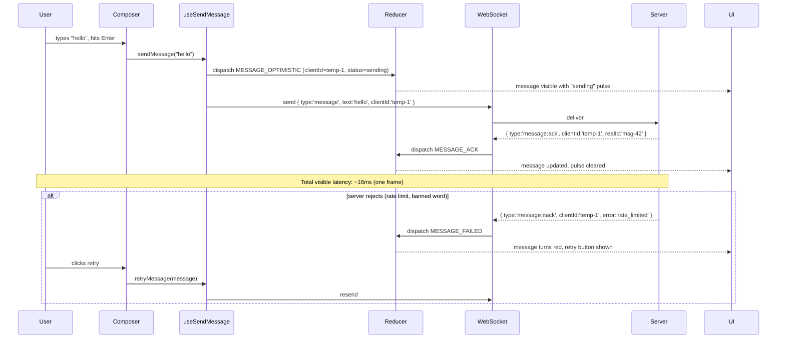

# 5.9 Chat UI

> A real-time chat interface in the spirit of Slack or Discord: a channel sidebar, a virtualized message list with infinite scroll, an input composer with emoji picker and slash commands, optimistic message sending, a debounced typing indicator, presence, and a WebSocket connection with reconnection logic (exponential backoff, heartbeat, dead-connection detection). This project reinforces virtualized lists (`react-window`), optimistic UI with rollback, custom hooks that own a long-lived side effect (a WebSocket), Tailwind's chat bubble layout patterns, message grouping by author and time, and the WebSocket lifecycle — every concept that a frontend engineer needs to ship a real chat product.

## 5.9.1 Project Objective

By the end of this project you should be able to:

1. Build a WebSocket client in a custom `useWebSocket` hook that handles open/close, reconnection with exponential backoff (1s  -->  2s  -->  4s  -->  … capped at 30s), heartbeat ping/pong every 25s (server-side load balancers kill idle connections at 60s), and graceful degradation when offline.
2. Virtualize the message list with `react-window`'s `VariableSizeList` (messages have variable heights — single-line text vs multi-line vs image attachments). Implement bidirectional infinite scroll: scroll up loads older messages, scroll down keeps the list pinned to the bottom when new messages arrive (unless the user has scrolled up).
3. Implement optimistic message sending: when the user hits Enter, the message appears immediately with a "sending" indicator; on server ACK, the indicator clears; on failure, the message is marked red with a "retry" affordance.
4. Implement a typing indicator: when the user types, send a `typing` event (debounced 2s — don't spam the server). Show "Alice is typing…" for other users; clear after 3s of no new typing events.
5. Group messages by author and time: consecutive messages from the same author within 5 minutes collapse into a group (no repeated avatar). Cross the 5-minute boundary or switch authors  -->  new group.
6. Build the composer: a textarea that grows with content (up to a max height), emoji picker (lazy-loaded), `@mention` autocomplete (queries the channel member list), `/slash` command autocomplete (`/me`, `/giphy`, `/poll`), and `Enter` to send / `Shift+Enter` for newline.
7. Build the channel sidebar: list of channels, DMs, presence dots (online/away/offline), unread badges, mentions badges (`@` red), and a "jump to present" button when the user has scrolled up.
8. Persist read state to `localStorage` so a reload restores the scroll position and unread counts. Use the `useSyncExternalStore` pattern from [[5.8 Notes Application]] to bridge the WebSocket to React.
9. Add message actions on hover: react with an emoji, edit (within 5 minutes), delete (within 5 minutes), reply (thread), copy text, mark as unread.
10. Add accessibility: the message list is a `role="log"` with `aria-live="polite"` so screen readers announce new messages; the composer has `role="textbox"` with `aria-multiline`; the channel list is a `role="tree"` with full keyboard navigation.

## 5.9.2 Reinforces Concepts From

- [[3.3 State and Events]] — controlled composer, keyboard event handling (`Enter` vs `Shift+Enter`).
- [[3.5 Lists and Keys]] — message list keys (must be stable server IDs, never array indices; retry sends must update the same optimistic placeholder).
- [[3.6 Hooks (Built-In)]] — `useState`, `useRef` (WebSocket ref, scroll position ref), `useEffect` (lifecycle), `useCallback`, `useMemo`, `useSyncExternalStore` (tearing-safe subscription to the WS message stream).
- [[3.7 Custom Hooks]] — `useWebSocket`, `useMessages`, `useTypingIndicator`, `useChannelMembers`, `usePresence`.
- [[3.8 Effects and Side Effects]] — the WebSocket lifecycle effect (open on mount, close on unmount, re-subscribe on URL change).
- [[3.9 Context and Reducers]] — the chat state reducer (channels, messages per channel, typing per channel, presence), normalized by channel id.
- [[3.10 Composition and Patterns]] — compound components for the message row (`<Message>`, `<Message.Avatar>`, `<Message.Body>`, `<Message.Actions>`).
- [[3.11 Performance Optimization]] — `React.memo` for message rows, `useDeferredValue` for the member search, `react-window` for virtualization, `useMemo` for grouping.
- [[3.12 Suspense, Lazy Loading, and Code Splitting]] — lazy-load the emoji picker and the file upload dialog.
- [[3.13 Error Boundaries and Debugging]] — wrap the message list so a render error in one message (e.g., malformed attachment) doesn't crash the channel.
- [[3.14 Reusable Component Design]] — the `Composer`, `MessageRow`, `ChannelItem` APIs.
- [[3.16 API Integration and Data Fetching]] — REST for history pagination, WebSocket for live updates.
- [[2.5 Layout Patterns in Tailwind]] — the three-pane chat layout (sidebar | messages | thread), the chat bubble.
- [[2.3 Responsive Utilities and Dark Mode]] — collapsible sidebar on mobile, dark mode.

## 5.9.3 Requirements

### 5.9.3.1 Functional Requirements

1. **Channel sidebar** (left): server name, channel list (public), DM list, presence per user. Clicking a channel switches the main pane. Unread badge per channel. Mention badge (red `@`) when the user is `@mentioned`.
2. **Messages pane** (center): channel header (name, description, members count), virtualized message list, composer at the bottom.
3. **Thread pane** (right, toggleable): when the user clicks "Reply in thread" on a message, a right pane opens with the parent message and the thread replies.
4. **Bidirectional infinite scroll**: scrolling to the top of the list fetches older messages (REST `GET /api/channels/:id/messages?before=<msgId>&limit=50`). New messages from the WebSocket append to the bottom; if the user is pinned to the bottom, auto-scroll; if they've scrolled up, show a "1 new message" pill.
5. **Optimistic sending**: `Enter` in the composer sends the message. The UI inserts a temporary message with `status: 'sending'` immediately. On server ACK (`message:ack` event with the real id), the placeholder is replaced. On server NACK or WS disconnect, the message is marked `status: 'failed'` with a retry button.
6. **Typing indicator**: while the user types, the client emits `typing` events (debounced 2s). The server broadcasts these to other clients. The receiver shows "Alice is typing…" for 3s after the last `typing` event, then clears.
7. **Message grouping**: consecutive messages from the same author within 5 minutes are grouped — only the first shows the avatar and name; subsequent ones are indented under the avatar.
8. **Emoji picker**: a button in the composer opens a picker (lazy-loaded `emoji-mart`). Selecting an emoji inserts it at the cursor.
9. **`@mentions`**: typing `@` opens a popover listing channel members filtered by the text after `@`. Arrow keys navigate, `Enter` selects, `Esc` closes.
10. **`/slash` commands**: typing `/` opens a command list (`/me`, `/giphy`, `/poll`, `/topic`). Selecting one inserts a template.
11. **Reactions**: hover a message  -->  click the smiley  -->  pick an emoji  -->  reaction is added (optimistic). Aggregated reactions show below the message: " 3" with the reactors on hover.
12. **Edit / delete**: hover a message  -->  "…" menu  -->  Edit (within 5 min) opens an inline editor; Delete (within 5 min) removes with confirmation. Edited messages show "(edited)".
13. **Presence**: each user has a presence dot (green = active, yellow = away, gray = offline). Presence updates arrive over the WebSocket.
14. **Reconnection**: if the WebSocket drops, the UI shows a "Reconnecting…" banner. The client retries with exponential backoff. On reconnect, it requests missed messages since the last seen id.

### 5.9.3.2 Non-Functional Requirements

| Requirement | Target |
|---|---|
| Render 10,000 messages in a channel | smooth scroll (60 fps) — virtualized |
| Message send  -->  optimistic render | < 16 ms (one frame) |
| WebSocket reconnect on drop | < 30s (backoff cap) |
| Memory with 100 channels open | flat (only active channel's messages in memory; others evicted) |
| Lighthouse Performance | ≥ 85 |
| Lighthouse Accessibility | ≥ 95 |
| Emoji picker bundle | lazy-loaded, < 50 KB on demand |

### 5.9.3.3 Acceptance Criteria

- Sending a message in a channel shows it immediately with a subtle "sending" pulse; on ACK, the pulse clears; on failure (simulate by stopping the mock server), the message turns red with a retry button.
- Scrolling up to the top of a 10k-message channel triggers a fetch of the previous 50; the scroll position does NOT jump (the new messages are prepended and the list keeps the user at the same visual position).
- Receiving a new message while pinned to the bottom auto-scrolls to it. Receiving one while scrolled up shows a "↓ 1 new" pill; clicking it scrolls to the bottom.
- Typing in the composer fires `typing` events debounced 2s; other clients see "Alice is typing…" within ~250 ms and it clears 3s after the last event.
- Killing the mock server shows a "Reconnecting…" banner; the client retries at 1s, 2s, 4s, 8s, 16s, 30s. Restarting the server within 30s reconnects and backfills missed messages.
- Three consecutive messages from Alice within 4 minutes show one avatar (the first); the next two are indented. A message from Bob breaks the group; a message from Alice 6 minutes later starts a new group.
- The message list is `role="log"` with `aria-live="polite"` — a screen reader announces "New message from Alice: hello" without focus moving.
- The emoji picker is not in the main bundle (check the network tab — it loads on first open).

## 5.9.4 Recommended Architecture

```mermaid
flowchart TD
  App --> ChatProvider[ChatProvider - context]
  ChatProvider --> ws[useWebSocket hook]
  ws --> WS[WebSocket]
  ChatProvider --> chatReducer[chatReducer - normalized]
  chatReducer --> channelsState[channels: Record id, Channel]
  chatReducer --> messagesState[messages: Record channelId, Message[]]
  chatReducer --> typingState[typing: Record channelId, UserId[]]
  chatReducer --> presenceState[presence: Record userId, Status]
  ChatProvider --> AppShell
  AppShell --> ChannelSidebar
  AppShell --> MessagesPane
  AppShell --> ThreadPane[ThreadPane - conditional]
  ChannelSidebar --> ChannelList
  ChannelSidebar --> DMList
  ChannelSidebar --> Presence
  MessagesPane --> ChannelHeader
  MessagesPane --> MessageList[MessageList - react-window VariableSizeList]
  MessageList --> MessageGroup
  MessageGroup --> MessageRow
  MessagesPane --> Composer
  Composer --> EmojiPicker[EmojiPicker - lazy]
  Composer --> MentionPopover
  Composer --> SlashPopover
```

### 5.9.4.1 Why a Reducer for Chat State?

Chat state has 4+ interrelated slices (channels, messages per channel, typing per channel, presence). Each WebSocket event touches one or more. A reducer centralizes the transitions; `useReducer` gives you a stable `dispatch` you can pass to the WebSocket hook (which lives outside React). The WebSocket hook becomes: `onmessage = (e) => dispatch(parseEvent(e))`.

### 5.9.4.2 Why `react-window` not `react-virtual`?

Both work. `react-window` is the established choice with stable APIs for `VariableSizeList` (chat messages have variable heights — you cannot use `FixedSizeList`). `@tanstack/react-virtual` is newer and headless (you build the container yourself); it's a fine alternative. Pick one and stick with it — the patterns transfer.

### 5.9.4.3 Why Normalize by Channel?

A naive shape is `Channel { messages: Message[] }`. Switching channels forces React to unmount/remount the message list (losing scroll position). A normalized shape `messages: Record<channelId, Message[]>` lets you keep all channels' messages in memory and switch instantly. Eviction: cap at 20 channels in memory; on the 21st, evict the LRU.

## 5.9.5 File Structure

```text
chat-ui/
  - index.html
  - package.json
  - tailwind.config.ts
  - vite.config.ts
  - tsconfig.json
  - src/
      - main.tsx
      - App.tsx
      - routes/
          - ChatPage.tsx
      - features/
          - chat/
              - components/
                  - ChannelSidebar.tsx
                  - ChannelItem.tsx
                  - DMItem.tsx
                  - MessagesPane.tsx
                  - ChannelHeader.tsx
                  - MessageList.tsx         # react-window
                  - MessageGroup.tsx
                  - MessageRow.tsx          # memoized
                  - MessageActions.tsx
                  - Reactions.tsx
                  - ThreadPane.tsx
                  - Composer.tsx
                  - EmojiPicker.tsx         # lazy
                  - MentionPopover.tsx
                  - SlashPopover.tsx
              - context/
                  - ChatContext.tsx
              - hooks/
                  - useWebSocket.ts
                  - useChat.ts
                  - useMessages.ts
                  - useTypingIndicator.ts
                  - useChannelMembers.ts
                  - usePresence.ts
              - reducer.ts
              - actions.ts
              - selectors.ts
              - types.ts
          - composer/
          - lib/
              - autocomplete.ts
              - commands.ts
          - hooks/
          - useAutoGrow.ts
      - lib/
          - mock-ws-server.ts                # in-browser mock
          - id.ts
          - utils.ts
      - styles/
      - globals.css
  - README.md
```

## 5.9.6 Step-by-Step Build Order

1. **Scaffold** Vite + React + TS + Tailwind. Install `react-window`, `emoji-mart` (lazy), `date-fns`, `zustand` (optional — Context + reducer works too).
2. **Define types** — `Channel`, `Message`, `User`, `TypingEvent`, `Presence`, `WsEvent` (discriminated union of all server  -->  client events).
3. **Build the mock WebSocket server** in `lib/mock-ws-server.ts` — a class that mimics a WebSocket (open, message, close events) and broadcasts messages to all connected clients. Seed with 5 channels, 10 users, 100 messages per channel.
4. **Build `useWebSocket`** — opens the connection, exposes `status` (`connecting` | `open` | `closed`), `send(event)`, and a `subscribe(cb)` function. Handles reconnection with exponential backoff and heartbeat.
5. **Build the chat reducer** — actions: `MESSAGE_RECEIVED`, `MESSAGE_ACK`, `MESSAGE_FAILED`, `TYPING_STARTED`, `TYPING_STOPPED`, `PRESENCE_UPDATED`, `CHANNEL_JOINED`, `MESSAGES_LOADED` (history pagination), `MESSAGE_REACTION_ADDED`.
6. **Build the `ChatProvider`** — owns the reducer and the WebSocket; dispatches every incoming event.
7. **Build the channel sidebar** — channel list, DM list, presence. Clicking switches active channel.
8. **Build the messages pane** — header, list, composer. Start with a non-virtualized list to get the layout right, then virtualize.
9. **Virtualize with `react-window`'s `VariableSizeList`** — implement `itemSize(index)` to return the measured height of each message group. Use a `ResizeObserver` to re-measure when content changes (image loads, edit expands).
10. **Implement bidirectional infinite scroll** — `onItemsRendered` callback fires when the first visible item is near index 0; trigger a fetch. Keep a ref of the scroll position; on prepend, adjust the scroll offset so the user doesn't jump.
11. **Implement optimistic sending** — `sendMessage(text)` dispatches `MESSAGE_OPTIMISTIC` with a temp id, calls `ws.send({ type: 'message', text, clientId })`, and on `message:ack` replaces the temp with the real message. On failure, mark `status: 'failed'`.
12. **Implement the typing indicator** — `useTypingIndicator` debounces `ws.send({ type: 'typing' })` by 2s. On the receiver, `TYPING_STARTED` sets a 3s timer to clear; each new event resets the timer.
13. **Implement message grouping** — `useMemo` over the message array; group by `authorId` and `5-minute` window. Each group is one item in the virtualized list.
14. **Build the composer** — auto-growing textarea, `Enter` to send, `Shift+Enter` newline, emoji button (lazy-loads picker), `@mention` popover, `/slash` popover.
15. **Add reactions** — hover a message, click smiley, pick emoji, optimistic dispatch.
16. **Add edit / delete** — within 5 minutes; inline editor; "(edited)" suffix.
17. **Add presence** — presence dots per user; updates over WS.
18. **Add the thread pane** — toggles on "Reply in thread"; shows parent + thread replies.
19. **Add reconnection banner** — when `status === 'closed'`, show a banner; on reconnect, request missed messages since last seen id.
20. **Accessibility audit** — `role="log"` on the list, `aria-live="polite"`, keyboard navigation for the channel tree, focus management for the composer and popovers.

## 5.9.7 Code Walkthrough

### 5.9.7.1 The WebSocket Hook

```ts
// features/chat/hooks/useWebSocket.ts
import { useEffect, useRef, useState, useCallback } from 'react';

type Status = 'connecting' | 'open' | 'closed';
type Listener = (event: WsEvent) => void;

export function useWebSocket(url: string) {
  const [status, setStatus] = useState<Status>('connecting');
  const wsRef = useRef<WebSocket | null>(null);
  const listeners = useRef<Set<Listener>>(new Set());
  const retryCount = useRef(0);
  const heartbeatRef = useRef<number>();
  const lastSeenEventId = useRef<string | null>(null);

  const connect = useCallback(() => {
    setStatus('connecting');
    const ws = new WebSocket(url);
    wsRef.current = ws;

    ws.addEventListener('open', () => {
      setStatus('open');
      retryCount.current = 0;
      // Heartbeat every 25s (load balancers kill at 60s)
      heartbeatRef.current = window.setInterval(() => {
        if (ws.readyState === WebSocket.OPEN) ws.send(JSON.stringify({ type: 'ping' }));
      }, 25000);
      // Request backfill since last seen event
      if (lastSeenEventId.current) {
        ws.send(JSON.stringify({ type: 'backfill', since: lastSeenEventId.current }));
      }
    });

    ws.addEventListener('message', (e) => {
      const evt = JSON.parse(e.data) as WsEvent;
      if (evt.id) lastSeenEventId.current = evt.id;
      listeners.current.forEach((l) => l(evt));
    });

    ws.addEventListener('close', () => {
      setStatus('closed');
      if (heartbeatRef.current) clearInterval(heartbeatRef.current);
      // Exponential backoff capped at 30s
      const delay = Math.min(1000 * 2 ** retryCount.current, 30000);
      retryCount.current += 1;
      setTimeout(connect, delay);
    });
  }, [url]);

  useEffect(() => {
    connect();
    return () => {
      wsRef.current?.close();
      if (heartbeatRef.current) clearInterval(heartbeatRef.current);
    };
  }, [connect]);

  const send = useCallback((event: WsEvent) => {
    if (wsRef.current?.readyState === WebSocket.OPEN) {
      wsRef.current.send(JSON.stringify(event));
    }
  }, []);

  const subscribe = useCallback((cb: Listener) => {
    listeners.current.add(cb);
    return () => { listeners.current.delete(cb); };
  }, []);

  return { status, send, subscribe };
}
```

> [!warning] A common mistake is to reconnect with a fixed 1s delay. A flapping server then hammers it with one reconnect per second per client. Exponential backoff (1  -->  2  -->  4  -->  8  -->  16  -->  30s cap) spreads the load. Add jitter (`delay + Math.random() * 500`) for large fleets to avoid the thundering herd.

### 5.9.7.2 The Chat Reducer

```ts
// features/chat/reducer.ts
type ChatState = {
  channels: Record<string, Channel>;
  channelOrder: string[];
  messages: Record<string, Message[]>; // by channelId
  typing: Record<string, Record<string, number>>; // channelId -> userId -> timestamp
  presence: Record<string, PresenceStatus>;
};

function reducer(state: ChatState, action: ChatAction): ChatState {
  switch (action.type) {
    case 'MESSAGE_RECEIVED': {
      const { channelId, message } = action;
      const existing = state.messages[channelId] ?? [];
      // Dedup by id (backfill + live can overlap)
      if (existing.some((m) => m.id === message.id)) return state;
      return {
        ...state,
        messages: { ...state.messages, [channelId]: [...existing, message] },
      };
    }
    case 'MESSAGES_LOADED': {
      // Prepend older messages, dedup
      const { channelId, messages: older } = action;
      const existing = state.messages[channelId] ?? [];
      const ids = new Set(existing.map((m) => m.id));
      const fresh = older.filter((m) => !ids.has(m.id));
      return {
        ...state,
        messages: { ...state.messages, [channelId]: [...fresh, ...existing] },
      };
    }
    case 'MESSAGE_ACK': {
      const { channelId, clientId, realMessage } = action;
      const list = state.messages[channelId] ?? [];
      return {
        ...state,
        messages: {
          ...state.messages,
          [channelId]: list.map((m) =>
            m.clientId === clientId ? { ...realMessage, status: 'sent' } : m,
          ),
        },
      };
    }
    case 'MESSAGE_FAILED': {
      const { channelId, clientId } = action;
      const list = state.messages[channelId] ?? [];
      return {
        ...state,
        messages: {
          ...state.messages,
          [channelId]: list.map((m) =>
            m.clientId === clientId ? { ...m, status: 'failed' } : m,
          ),
        },
      };
    }
    case 'TYPING_STARTED': {
      const { channelId, userId } = action;
      return {
        ...state,
        typing: {
          ...state.typing,
          [channelId]: { ...(state.typing[channelId] ?? {}), [userId]: Date.now() },
        },
      };
    }
    // ... other cases
    default:
      return state;
  }
}
```

### 5.9.7.3 Virtualized Message List

```tsx
// features/chat/components/MessageList.tsx
import { VariableSizeList, type ListChildComponentProps } from 'react-window';
import { useMemo, useRef, useCallback, useState, useEffect } from 'react';
import { MessageGroup } from './MessageGroup';

export function MessageList({ channelId }: { channelId: string }) {
  const groups = useMessageGroups(channelId); // memoized grouping
  const listRef = useRef<VariableSizeList>(null);
  const sizeMap = useRef<Record<number, number>>({});
  const [atBottom, setAtBottom] = useState(true);
  const [newCount, setNewCount] = useState(0);

  const getItemSize = useCallback((index: number) => sizeMap.current[index] ?? 60, []);
  const setItemSize = useCallback((index: number, size: number) => {
    sizeMap.current = { ...sizeMap.current, [index]: size };
    listRef.current?.resetAfterIndex(index);
  }, []);

  // Auto-scroll on new message if pinned to bottom
  useEffect(() => {
    if (atBottom && groups.length > 0) {
      listRef.current?.scrollToItem(groups.length - 1, 'end');
    } else if (!atBottom) {
      setNewCount((c) => c + 1);
    }
  }, [groups.length, atBottom]);

  const onItemsRendered = useCallback(
    ({ visibleStartIndex }: { visibleStartIndex: number }) => {
      if (visibleStartIndex === 0) {
        loadOlderMessages(channelId); // bidirectional infinite scroll
      }
    },
    [channelId],
  );

  const Row = ({ index, style }: ListChildComponentProps) => (
    <div style={style}>
      <MessageGroup
        group={groups[index]}
        onResize={(size) => setItemSize(index, size)}
      />
    </div>
  );

  return (
    <div className="relative h-full">
      <VariableSizeList
        ref={listRef}
        height={window.innerHeight - 200}
        width="100%"
        itemCount={groups.length}
        itemSize={getItemSize}
        onItemsRendered={onItemsRendered}
        onScroll={({ scrollOffset, scrollDirection }) => {
          const max = (groups.length - 1) * 60; // approximate
          setAtBottom(scrollOffset > max - 100);
        }}
        role="log"
        aria-live="polite"
      >
        {Row}
      </VariableSizeList>
      {!atBottom && newCount > 0 && (
        <button
          onClick={() => { listRef.current?.scrollToItem(groups.length - 1, 'end'); setNewCount(0); }}
          className="absolute bottom-4 left-1/2 -translate-x-1/2 rounded-full bg-blue-600 px-3 py-1 text-sm text-white shadow"
        >
          ↓ {newCount} new
        </button>
      )}
    </div>
  );
}
```

### 5.9.7.4 Optimistic Send

```ts
// features/chat/hooks/useChat.ts
export function useSendMessage(channelId: string) {
  const { send } = useWebSocket();
  const dispatch = useChatDispatch();

  return useCallback(async (text: string) => {
    const clientId = crypto.randomUUID();
    const optimistic: Message = {
      id: clientId,
      clientId,
      channelId,
      text,
      authorId: currentUserId,
      createdAt: Date.now(),
      status: 'sending',
    };
    dispatch({ type: 'MESSAGE_OPTIMISTIC', channelId, message: optimistic });
    send({ type: 'message', channelId, text, clientId });
    // The ack/fail arrives via the WS subscription and updates the message.
  }, [channelId, send, dispatch]);
}

// Retry a failed message
export function useRetryMessage(channelId: string) {
  const { send } = useWebSocket();
  return useCallback((message: Message) => {
    dispatch({ type: 'MESSAGE_ACK_PENDING', channelId, clientId: message.clientId });
    send({ type: 'message', channelId, text: message.text, clientId: message.clientId });
  }, [channelId, send]);
}
```

### 5.9.7.5 Typing Indicator (Debounced)

```ts
// features/chat/hooks/useTypingIndicator.ts
export function useTypingIndicator(channelId: string) {
  const { send } = useWebSocket();
  const lastSent = useRef(0);
  const timer = useRef<number>();

  return useCallback(() => {
    const now = Date.now();
    // Send at most once every 2s
    if (now - lastSent.current > 2000) {
      send({ type: 'typing', channelId });
      lastSent.current = now;
    }
    // Also send a 'stop' 3s after the last keystroke
    clearTimeout(timer.current);
    timer.current = window.setTimeout(() => {
      send({ type: 'stop_typing', channelId });
    }, 3000);
  }, [channelId, send]);
}

// Receiver side: clear typing after 3s of silence
export function useTypingUsers(channelId: string) {
  const typing = useChatState((s) => s.typing[channelId] ?? {});
  const [, force] = useState(0);
  useEffect(() => {
    const t = setInterval(() => force((n) => n + 1), 1000);
    return () => clearInterval(t);
  }, []);
  // Filter out entries older than 3s
  return Object.entries(typing)
    .filter(([, ts]) => Date.now() - ts < 3000)
    .map(([userId]) => userId);
}
```

### 5.9.7.6 Message Grouping

```ts
// features/chat/selectors.ts
export function groupMessages(messages: Message[]): MessageGroup[] {
  const groups: MessageGroup[] = [];
  for (const msg of messages) {
    const last = groups[groups.length - 1];
    if (
      last &&
      last.authorId === msg.authorId &&
      msg.createdAt - last.lastAt < 5 * 60 * 1000
    ) {
      last.messages.push(msg);
      last.lastAt = msg.createdAt;
    } else {
      groups.push({ authorId: msg.authorId, lastAt: msg.createdAt, messages: [msg] });
    }
  }
  return groups;
}
```

### 5.9.7.7 The Composer

```tsx
// features/chat/components/Composer.tsx
export function Composer({ channelId }: { channelId: string }) {
  const [text, setText] = useState('');
  const taRef = useRef<HTMLTextAreaElement>(null);
  const sendMessage = useSendMessage(channelId);
  const onTyping = useTypingIndicator(channelId);
  const { grow } = useAutoGrow(taRef, { max: 200 });

  const handleKeyDown = (e: React.KeyboardEvent<HTMLTextAreaElement>) => {
    if (e.key === 'Enter' && !e.shiftKey) {
      e.preventDefault();
      if (text.trim()) {
        sendMessage(text.trim());
        setText('');
        grow();
      }
    }
  };

  return (
    <div className="border-t border-zinc-200 p-3 dark:border-zinc-800">
      <div className="relative flex items-end gap-2">
        <button
          onClick={() => import('./EmojiPicker').then(({ open }) => open(taRef.current!))}
          className="rounded p-2 hover:bg-zinc-100 dark:hover:bg-zinc-800"
          aria-label="Insert emoji"
        >
          
        </button>
        <textarea
          ref={taRef}
          value={text}
          onChange={(e) => { setText(e.target.value); onTyping(); grow(); }}
          onKeyDown={handleKeyDown}
          rows={1}
          placeholder="Message #general"
          className="flex-1 resize-none rounded-md border border-zinc-300 p-2 dark:border-zinc-700 dark:bg-zinc-900"
          role="textbox"
          aria-multiline="true"
          aria-label="Message input"
        />
      </div>
    </div>
  );
}
```

## 5.9.8 Mermaid Diagrams

### 5.9.8.1 Component Tree



### 5.9.8.2 Optimistic Send + Ack Flow



## 5.9.9 Common Pitfalls

1. **Auto-scroll that fights the user.** If you scroll to the bottom on every new message, a user trying to read older messages gets yanked down. Track `atBottom` (or `stickToBottom`); only auto-scroll when the user is within ~100 px of the bottom.
2. **Index as key for messages.** When optimistic messages are inserted or failed messages are removed, indices shift. Always key by `message.id` (or `clientId` for optimistic).
3. **Re-rendering every message on each new arrival.** Without `React.memo`, a new message re-renders the entire list. Memoize `MessageRow` with a custom comparator on `id`, `text`, `status`, `reactions`.
4. **WebSocket reconnect without backoff.** A fixed 1s retry under a flapping server creates a thundering herd. Use exponential backoff (1  -->  2  -->  4  -->  8  -->  16  -->  30s) plus jitter.
5. **No heartbeat  -->  dead connections.** Load balancers and proxies kill idle WS connections at 60s. Send a `ping` every 25s; the server replies `pong`; if no pong in 5s, force reconnect.
6. **Spamming typing events.** A user typing fast can fire `onChange` 20 times per second. Debounce the `typing` send to once per 2s; send a `stop_typing` 3s after the last keystroke.
7. **Memory growth with many channels.** If you keep all channels' messages in memory, a long session balloons. Cap at 20 channels; evict LRU. Alternatively, only the active channel is in memory; switching channels re-fetches.
8. **Scroll jump on prepend.** When older messages are prepended, `react-window`'s default behavior is to keep the scroll offset, which makes the visible content jump. You must measure the new items' total height and call `scrollTo(scrollOffset + addedHeight)` immediately after the data update.
9. **`VariableSizeList` returning stale heights.** If a message's content changes (image loads, edit expands), the cached height is wrong. Use a `ResizeObserver` per row and call `resetAfterIndex(index)`.
10. **Optimistic messages with no rollback.** If the server NACKs and you don't update the message to `failed`, the user sees a "sending" pulse forever. Always handle the nack case.
11. **`dangerouslySetInnerHTML` for messages with markdown.** If you render message text as HTML (e.g., for markdown), sanitize with DOMPurify. Users *will* paste `<script>` tags.
12. **No accessibility on the live region.** A `<div>` with no `role` and no `aria-live` is invisible to screen readers. The message list must be `role="log"` with `aria-live="polite"` so new messages are announced.

## 5.9.10 Stretch Goals

1. **Threads.** Implement full Slack-style threads: a message can have a `threadId`; replies go in the thread pane; the parent shows a "N replies" link.
2. **Message search.** A search bar in the channel header that queries a REST endpoint for messages matching the query, with snippet highlighting and a "jump to message" action.
3. **File uploads.** Drag-and-drop a file onto the composer; show an upload progress bar; on completion, insert an attachment message. Use a `ReadableStream` for large files.
4. **Notifications.** When a message `@mentions` the user and the tab is in the background, fire a browser Notification (with permission). Clicking the notification focuses the tab and scrolls to the message.
5. **Voice messages.** A "hold to record" button that captures audio via `MediaRecorder`, uploads it, and renders a waveform player in the message.

## 5.9.11 Self-Assessment Rubric

| # | Criterion | 0 | 1 | 2 | 3 |
|---|---|---|---|---|---|
| 1 | WebSocket lifecycle | manual open/close | in `useEffect` | + reconnection | + backoff + heartbeat + backfill |
| 2 | Virtualization | none | FixedSizeList | VariableSizeList | + bidirectional infinite scroll + no scroll jump |
| 3 | Optimistic send | none | optimistic, no rollback | + ack + fail | + retry + dedup |
| 4 | Typing indicator | none | sends on every keystroke | debounced send | + 3s timeout + multi-user display |
| 5 | Message grouping | flat list | grouped by author | + 5-min window | + sticky date separators |
| 6 | Composer | plain input | auto-grow | + Enter/Shift+Enter | + emoji picker + mentions + slash commands |
| 7 | Reactions | none | add only | + aggregated display | + toggle + reactors list |
| 8 | Edit/delete | none | delete only | + edit inline | + 5-min window + "(edited)" |
| 9 | Accessibility | mouse only | + Tab focus | + role=log + aria-live | + keyboard nav everywhere |
| 10 | Polish | rough | presence dots | + reconnect banner | + read state + threads + notifications |

## 5.9.12 Related Notes

- [[3.6 Hooks (Built-In)]]
- [[3.7 Custom Hooks]]
- [[3.8 Effects and Side Effects]]
- [[3.9 Context and Reducers]]
- [[3.10 Composition and Patterns]]
- [[3.11 Performance Optimization]]
- [[3.12 Suspense, Lazy Loading, and Code Splitting]]
- [[3.13 Error Boundaries and Debugging]]
- [[3.16 API Integration and Data Fetching]]
- [[5.6 Kanban Board]] — same optimistic-update-with-rollback pattern, different transport
- [[5.8 Notes Application]] — same `useSyncExternalStore` bridge pattern, IndexedDB instead of WebSocket
- [[5.10 File Explorer UI]] — same keyboard navigation and recursive rendering patterns
- [[5.13 Analytics Dashboard]] — same virtualization and large-dataset patterns, applied to tables
