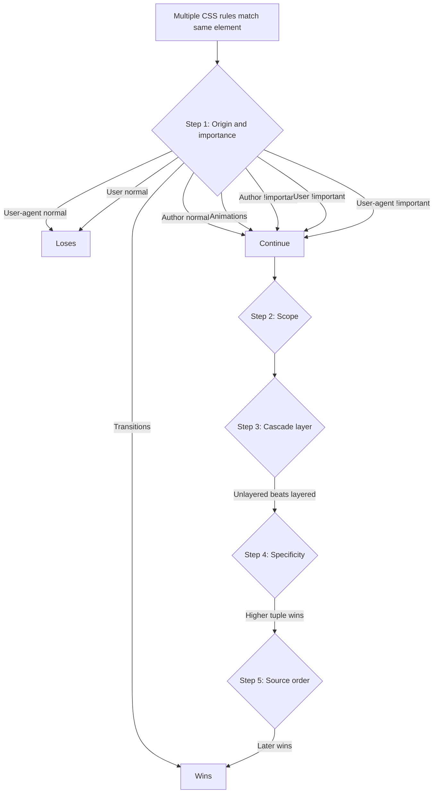
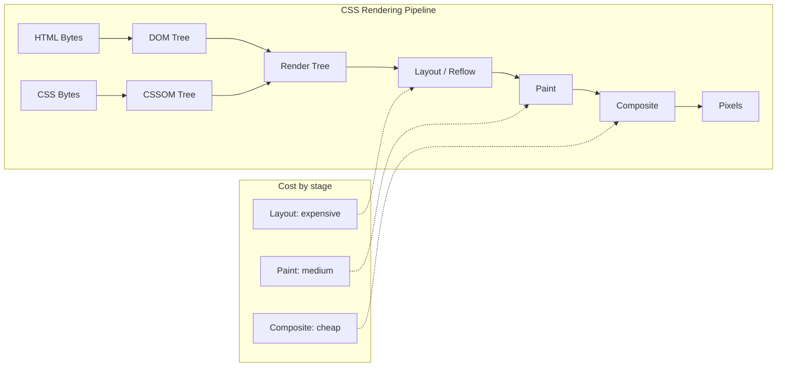
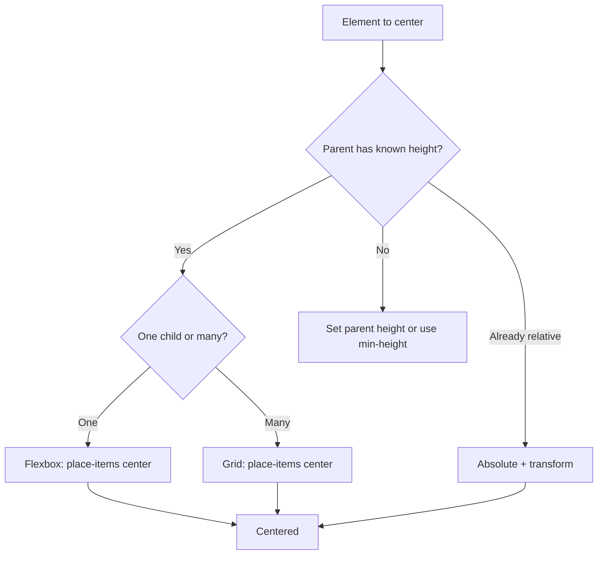

# 6.1 CSS Interview Questions

> The CSS round is where candidates reveal whether they have actually shipped layout bugs to production or merely completed a tutorial. Interviewers probe the cascade, the box model, positioning, flexbox and grid, centering, stacking contexts, the block formatting context, and modern CSS features such as `:has()`, container queries, and cascade layers. This note gives you twenty deep questions, each with a model answer, the reasoning, common wrong answers, and the follow-up questions that will probably come next.

## 6.1.1 How To Use This Note

Read each question, then close the note and speak your answer out loud as if the interviewer were in the room. Open the note only after you have spoken. If your spoken answer diverges from the model answer in substance (not just wording), return to the corresponding chapter note and re-read it. Do not memorize the model answers verbatim — interviewers can tell. Internalize the *reasoning* so you can adapt it to whatever variant they ask.

Every question here has four parts:

1. **Model Answer** — the answer a senior engineer would give in 60–120 seconds.
2. **The Reasoning** — the underlying concept that makes the model answer correct.
3. **Common Wrong Answers** — the answers weaker candidates give, and why they fail.
4. **Follow-up Questions an Interviewer Might Ask** — what they will probably ask next if your answer is correct.

If you finish the question set without being asked at least one follow-up, your answers were probably too shallow. The follow-ups are the real interview.

> [!tip] Use the Mock Interview Sequence at the end
> Section 6.1.9 contains a full back-and-forth between a candidate and an interviewer. Read it last, after you have studied the questions. It demonstrates the rhythm of a good interview: short answer, then probing, then a deeper question.

## 6.1.2 Foundational Questions

### Question 1: What is the CSS cascade and how does it decide which rule wins?

**Difficulty:** Easy

**Model Answer:**

The cascade is the algorithm the browser uses to resolve conflicts when multiple CSS rules apply to the same element and set the same property. The modern cascade, as defined in the CSS Cascading module level 4, resolves declarations through five ordered steps:

1. **Origin and importance.** Declarations are partitioned into origin tiers: user-agent (browser defaults), user (user stylesheet), author (your stylesheet), and their `!important` counterparts. Order from lowest to highest priority: user-agent normal  -->  user normal  -->  author normal  -->  animations  -->  author `!important`  -->  user `!important`  -->  user-agent `!important`  -->  transitions.
2. **Scope.** Declarations in a closer scope (shadow DOM, `@scope`) can win over outer scope. This is rarely the deciding factor in day-to-day CSS.
3. **Cascade layers.** Declarations inside an `@layer` are ordered by the layer order declared in the stylesheet. Unlayered styles win over layered styles.
4. **Specificity.** For declarations still tied after layering, specificity breaks the tie. Specificity is a tuple `(a, b, c)` where `a` counts ID selectors, `b` counts class selectors, attribute selectors, and pseudo-classes, and `c` counts type selectors and pseudo-elements. The tuple is compared lexicographically.
5. **Order of appearance.** If everything else is tied, the declaration that appears later in the source wins.

Only after all five steps does the cascade produce a "cascaded value" for each property. The browser then computes the used value through the property's own resolution stages (computed value, used value, actual value).

**The Reasoning:**

The cascade is not just "specificity." Many candidates jump straight to specificity and forget origin, layer, and source order. The reason the cascade has so many steps is historical and practical: it lets authors override defaults, lets users override authors for accessibility (with `!important`), and lets frameworks isolate themselves with layers. Knowing the order explains why `@layer` was added — to give authors a *deliberate* ordering mechanism that does not depend on specificity hacks.

**Common Wrong Answers:**

- "The cascade is just specificity, and the rule with the highest specificity wins." — Wrong because it ignores origin, layer, and source order. `!important` alone is a different origin tier that overrides any specificity.
- "Inline styles always win." — Wrong because `!important` from external rules overrides inline. Inline is high specificity but the cascade still ranks origins first.
- "The last rule wins." — Only true when everything else is tied. This is a common misconception from people who have never debugged a specificity war.

**Follow-up Questions an Interviewer Might Ask:**

- Walk me through how `!important` interacts with specificity.
- What is the difference between `@layer` and specificity?
- Why does the user-agent `!important` style for `required` form fields sometimes override author styles?
- If two `@layer` blocks declare the same layer name, what happens?

---

### Question 2: Calculate the specificity of `#nav .item a:hover` and compare it to `nav ul li.active a`.

**Difficulty:** Easy

**Model Answer:**

For `#nav .item a:hover`:
- `#nav` is one ID  -->  `a = 1`
- `.item` is one class  -->  `b = 1`
- `a:hover` — `a` is a type selector (`c += 1`) and `:hover` is a pseudo-class (`b += 1`)
- Total: `(1, 2, 1)`

For `nav ul li.active a`:
- No IDs  -->  `a = 0`
- `.active` is one class  -->  `b = 1`
- `nav`, `ul`, `li`, `a` are four type selectors  -->  `c = 4`
- Total: `(0, 1, 4)`

Compare lexicographically: `(1, 2, 1)` vs `(0, 1, 4)`. The first tuple has `a = 1` vs `a = 0`, so the first selector wins. Specificity comparison never reaches the `c` component here.

**The Reasoning:**

Specificity is a tuple, not a sum. Many candidates compute `1 + 2 + 1 = 4` vs `0 + 1 + 4 = 5` and incorrectly conclude the second selector wins. The tuple comparison means an ID outweighs any number of classes, which outweighs any number of types. This is the single most common CSS interview mistake.

**Common Wrong Answers:**

- Adding the tuple components together to get a single number — the entire point of the tuple is that the comparison is lexicographic.
- Forgetting that pseudo-classes (`:hover`, `:focus`, `:not()`, `:is()`, `:has()`) count as class-level specificity while pseudo-elements (`::before`, `::after`) count as type-level.
- Treating `:not()` as zero specificity. `:not()` itself contributes nothing, but the selectors *inside* it count toward the selector's specificity. The same is true for `:is()` and `:has()`.

**Follow-up Questions an Interviewer Might Ask:**

- What is the specificity of `:not(.a, .b)`? (Answer: the most specific selector inside the list, so `(0, 1, 0)`.)
- What about `:is(#nav, .item)`? (Answer: `(1, 0, 0)` — `:is()` takes the specificity of its most specific argument.)
- What about `:where(.a)`? (Answer: `(0, 0, 0)` — `:where()` always has zero specificity. That is its only purpose.)
- How would you write a "reset" that cannot be accidentally overridden by a high-specificity rule elsewhere? (Answer: wrap it in `@layer` and put the layer first.)

---

### Question 3: Explain the CSS box model.

**Difficulty:** Easy

**Model Answer:**

The box model is the model by which CSS computes the size of every element. Every element is a rectangular box with four regions, from inside out: `content`, `padding`, `border`, `margin`. The `width` and `height` properties, by default, set the size of the *content* area only. The total space the box occupies on the page is `content + padding + border + margin` (with some quirks around margin collapsing).

The `box-sizing` property changes this:
- `content-box` (default): `width` = content width. Adding padding or border grows the box outward.
- `border-box`: `width` = content + padding + border. Padding and border are subtracted from the declared width, so the box's outer size is stable.

Almost every project sets `*, *::before, *::after { box-sizing: border-box; }` because `border-box` is far easier to reason about: if you say `width: 200px` and add `padding: 20px`, the box stays 200px wide.

Margin collapsing is a related behavior: vertical margins of adjacent block-level elements merge rather than add. The larger margin wins. Margins do not collapse inside a flex or grid container, or when there is a border, padding, or a new block formatting context between them.

**The Reasoning:**

The box model exists because early CSS needed to support both "designers" who wanted pixel-perfect layouts and "document authors" who wanted flowing text. `content-box` made sense for documents where you set the text width and let padding flow around it. `border-box` made sense for components with fixed outer dimensions. The default remained `content-box` for backward compatibility, which is why we override it globally.

**Common Wrong Answers:**

- "Box model is content, padding, border, margin in that order, and that's it." — Missing margin collapsing, missing the `box-sizing` distinction, missing the fact that `display` changes how the box participates in layout.
- "Padding is inside the border, margin is outside." — True but trivially so. The interviewer wants the *implications*.
- "Box model has nothing to do with `display`." — Wrong; `display: inline` boxes ignore `width`, `height`, and vertical margins.

**Follow-up Questions an Interviewer Might Ask:**

- Why do margins collapse, and when do they not?
- What happens to `width: 50%` on an inline element? (Ignored.)
- How does the box model differ for replaced elements like `img`?
- What does `box-sizing: inherit` do, and why would you use it?

---

### Question 4: What are the values of the `position` property and how do they differ?

**Difficulty:** Easy

**Model Answer:**

The `position` property has five values:

- **`static`** (default): The element flows in normal document order. `top`, `right`, `bottom`, `left`, and `z-index` have no effect.
- **`relative`**: The element is positioned relative to its normal position. Visual offsets via `top`/`left`/etc. apply, but the element still occupies its original space in the flow — siblings are not reflowed around it. Establishes a containing block for absolutely-positioned descendants.
- **`absolute`**: The element is removed from normal flow and positioned relative to its nearest positioned ancestor (an ancestor with `position` other than `static`). If no such ancestor exists, it is positioned relative to the initial containing block (the viewport for most practical purposes). Other elements flow as if it did not exist.
- **`fixed`**: Like `absolute`, but positioned relative to the viewport (or a descendant containing block with a `transform`, `filter`, or `perspective` property set). It does not move when the page scrolls.
- **`sticky`**: A hybrid. The element flows normally until it reaches a threshold defined by `top`/`left`/etc., at which point it behaves like `fixed`. The threshold is relative to its nearest scrollport. Sticky requires the parent to have height; otherwise it has nothing to stick within.

There is a modern addition, `position: absolute` with the new "anchor positioning" API (CSS Anchor Positioning), but it is not yet broadly supported.

**The Reasoning:**

Position values are fundamentally about *containing blocks*. The browser needs to know which rectangle to compute offsets against. `static` uses the normal flow; `relative` uses the element's own original box; `absolute` and `fixed` walk the ancestor chain looking for a positioned element; `sticky` switches between `relative` and `fixed` based on scroll position. Knowing this lets you debug "why is my absolute element in the wrong place" — the answer is almost always that an ancestor unexpectedly has `position: relative`.

**Common Wrong Answers:**

- "Sticky is just fixed with a starting position." — Wrong; sticky is bound to its scroll container, not the viewport, and respects the bounds of its parent.
- "Fixed elements are always relative to the viewport." — Wrong since 2012; a `transform` on an ancestor creates a new containing block for fixed elements.
- "Absolute removes the element from the DOM." — No, it removes it from normal flow. The DOM is unaffected.

**Follow-up Questions an Interviewer Might Ask:**

- Why does setting `transform: translateZ(0)` on a parent break my `position: fixed` child?
- When does `sticky` not work? (Parent with `overflow: hidden`, parent with no height, ancestor with `display: contents`.)
- What is the difference between `inset: 0` and `top: 0; right: 0; bottom: 0; left: 0`? (None; `inset` is the shorthand.)

---

### Question 5: Center a div both horizontally and vertically. Give at least three ways.

**Difficulty:** Easy

**Model Answer:**

**Method 1 — Flexbox:**

```css
.parent {
  display: flex;
  align-items: center;
  justify-content: center;
  min-height: 100vh;
}
```

**Method 2 — CSS Grid:**

```css
.parent {
  display: grid;
  place-items: center;
  min-height: 100vh;
}
```

**Method 3 — Absolute positioning with transform:**

```css
.parent { position: relative; min-height: 100vh; }
.child {
  position: absolute;
  top: 50%;
  left: 50%;
  transform: translate(-50%, -50%);
}
```

**Method 4 — Grid with `margin: auto`:**

```css
.parent { display: grid; min-height: 100vh; }
.child { margin: auto; }
```

**Method 5 — Flexbox with `margin: auto`:**

```css
.parent { display: flex; min-height: 100vh; }
.child { margin: auto; }
```

**The Reasoning:**

Each method exploits a different layout primitive. Flexbox uses `align-items` (cross-axis) and `justify-content` (main-axis). Grid's `place-items: center` is the same idea expressed in one property. The absolute+transform method relies on `top: 50%` being relative to the parent's height and `translate(-50%, -50%)` being relative to the element's own size, which combines into a perfect center. The `margin: auto` trick works because both flexbox and grid will distribute free space into auto margins.

**Common Wrong Answers:**

- Using `text-align: center` on the parent. This only centers inline content (text, inline-block children), not block children.
- Using `margin: 0 auto` alone. This only centers horizontally, not vertically.
- Using `vertical-align: middle` on the parent. `vertical-align` only applies to inline-level and table-cell elements.
- Forgetting to give the parent a height. Without a known height, vertical centering has nothing to center against.

**Follow-up Questions an Interviewer Might Ask:**

- Which method is most performant, and why?
- What if the child has dynamic content and an unknown size?
- How would you center a fixed-position modal?
- Why does `transform: translate(-50%, -50%)` work for centering but `margin-left: -50%` does not?

---

### Question 6: What is the difference between `display: none` and `visibility: hidden`?

**Difficulty:** Easy

**Model Answer:**

- **`display: none`**: The element is removed from the render tree entirely. It occupies no space, cannot be interacted with, is not in the accessibility tree, and is not announced by screen readers. Siblings reflow to fill the space.
- **`visibility: hidden`**: The element is still in the render tree, occupies space, and participates in layout, but is invisible. It cannot receive focus (for focusable elements) but is *announced* by some screen readers in some modes. Children can override with `visibility: visible` to become visible again.
- **`opacity: 0`**: The element is fully transparent. It still occupies space, can receive focus and clicks, and is in the accessibility tree. Use this for fade transitions where you need the element to remain interactive during the fade.

There is also `content-visibility: hidden`, which is a modern performance-oriented property that hides the element and skips its rendering work while preserving its layout box (with `contain-intrinsic-size`).

**The Reasoning:**

Each property hides at a different stage of the pipeline. `display: none` removes from the render tree (so layout, paint, and composite all skip it). `visibility: hidden` skips paint only. `opacity: 0` paints but with zero alpha. This is why `opacity: 0` can be transitioned smoothly (the browser only needs to composite differently) while `display: none` cannot (the element pops in and out because it changes the render tree).

**Common Wrong Answers:**

- "`visibility: hidden` does not take up space." — Wrong; it does.
- "Screen readers ignore both." — Mostly wrong; behavior varies. Use `aria-hidden="true"` for guaranteed hiding.
- "They are interchangeable." — Wrong; they have different layout, a11y, and performance implications.

**Follow-up Questions an Interviewer Might Ask:**

- How would you hide content visually but keep it for screen readers? (Use the `.sr-only` pattern with a 1px clip.)
- How would you animate an element from hidden to visible?
- What is `content-visibility: auto` and when should you use it?

---

### Question 7: What is a stacking context, and what creates one?

**Difficulty:** Medium

**Model Answer:**

A stacking context is a self-contained, ordered group of elements that the browser paints together. Within a stacking context, child elements are painted in a defined order relative to each other. A child stacking context is atomically painted as a unit when its parent context is painted, which means a `z-index: 9999` child inside a low-priority stacking context cannot appear above an element in a higher-priority sibling context.

Stacking contexts are created by:

- The root element (`<html>`).
- Positioned elements (`position: absolute` or `relative`) with `z-index` other than `auto`.
- Position `fixed` and `sticky` (always, in modern browsers).
- Flex/grid items with `z-index` other than `auto`.
- Elements with `opacity` less than 1.
- Elements with `transform`, `filter`, `perspective`, `clip-path`, `mask`, `backdrop-filter`, or `will-change` set to a value other than the initial.
- Elements with `mix-blend-mode` other than `normal`.
- Elements with `isolation: isolate`.
- Elements with `contain: layout`, `contain: paint`, or `contain: strict`/`contain: content`.

Within a stacking context, the paint order (bottom to top) is roughly:

1. Backgrounds and borders of the element that establishes the context.
2. Negative z-index children.
3. Block-level descendants in normal flow.
4. Floating descendants.
5. Inline descendants in normal flow.
6. z-index: auto / 0 positioned descendants.
7. Positive z-index descendants.

**The Reasoning:**

Stacking contexts exist because the browser needs a deterministic painting order. Without them, every element would be a free-for-all and `z-index` would have to be globally unique. The isolation rule means a parent can "lock in" its children, preventing them from poking through into other parts of the page. This is why `isolation: isolate` is the modern, side-effect-free way to create a stacking context (versus `transform: translateZ(0)`).

**Common Wrong Answers:**

- "Higher `z-index` always wins." — Only true within the same stacking context.
- "Setting `position: relative` creates a stacking context." — Only if `z-index` is also set (or for sticky/fixed).
- "Transform creates a stacking context because it makes the element a new layer." — Layers and stacking contexts are different concepts. Transform creates both, but the reason for the stacking context is the spec, not the layer.

**Follow-up Questions an Interviewer Might Ask:**

- Why does my modal with `z-index: 1000` appear below a sibling's child with `z-index: 1`?
- What is the difference between `isolation: isolate` and `transform: translateZ(0)` for creating a stacking context?
- How does `will-change` affect performance and stacking?

---

## 6.1.3 Intermediate Questions

### Question 8: What is a Block Formatting Context (BFC) and how do you create one?

**Difficulty:** Medium

**Model Answer:**

A Block Formatting Context is a region of the page in which block-level boxes are laid out according to the normal-flow rules, but the region is *isolated* from its surroundings in three important ways:

1. Margins inside the BFC do not collapse with margins outside it.
2. The BFC contains its floating descendants (it does not overlap floats, and it expands to contain them).
3. Floats outside the BFC do not push into the BNC's content.

A BFC is created by:
- The root element.
- Floats (`float` other than `none`).
- Absolutely positioned elements (`position: absolute` or `fixed`).
- `display: inline-block`, `table-cell`, `table-caption`, `flow-root`.
- Elements with `overflow` other than `visible` (the classic clearfix trick).
- Flex items, grid items, and multi-column containers.
- Elements with `contain: layout`, `contain: content`, or `contain: strict`.
- Elements with `display: flow-root` (the modern, intentional way to create a BFC).

The most common modern use is `display: flow-root` to clear floats without side effects. Older hacks used `overflow: hidden` or `overflow: auto`, but those have side effects (clipping, scrollbars).

**The Reasoning:**

The BFC exists because the spec needed a way to make certain layout regions self-contained. Before flexbox and grid, float-based layouts were common, and floats do not expand their parent. The BFC was the escape hatch: by triggering a BFC on the parent, you forced it to contain its floats. Today, the same property is also the cleanest way to prevent margin collapsing between a parent and its first child.

**Common Wrong Answers:**

- "BFC is the same as a stacking context." — Different concepts; some properties create both, but they are governed by different parts of the spec.
- "You create a BFC with `display: block`." — No, `display: block` does not create a BFC by itself.
- "Clearfix is the only reason to use a BFC." — No; preventing margin collapse and isolating floats from neighbors are both valid uses.

**Follow-up Questions an Interviewer Might Ask:**

- Why does `overflow: hidden` clear floats? What are its side effects?
- How does `display: flow-root` differ from `display: block`?
- Write a clearfix without using `overflow: hidden`.

---

### Question 9: Flexbox vs Grid — when do you use each?

**Difficulty:** Medium

**Model Answer:**

Flexbox is one-dimensional. It lays items out along a single axis (row or column). It excels at distributing space among items whose sizes are dynamic or unknown, and at aligning items within a single row or column. Use flexbox for nav bars, button groups, toolbars, card headers, single-row card lists, and any layout where items flow in one direction and you want them to size themselves.

Grid is two-dimensional. It lays items out in rows and columns simultaneously, with explicit control over both. Use grid for full page layouts, dashboards with sidebars, photo galleries with fixed cell sizes, and any layout where you need to align items in two dimensions.

A useful heuristic: **flexbox is for components, grid is for pages.** A card is a flexbox; the page that holds the card grid is a grid. A navbar is a flexbox; the dashboard that arranges navbars and content is a grid.

Both can overlap: you can use `display: grid` for the parent and `display: flex` for the child, and you can switch the axes of flexbox with `flex-direction`. But the *mental model* should match the layout's natural axis count.

**The Reasoning:**

Flexbox was designed for adaptive UI: items that grow, shrink, and reorder along one axis. Grid was designed for explicit, two-dimensional structure: tracks of known size, areas with names, and the ability to place items at specific grid lines. Choosing the wrong tool does not just make CSS harder; it makes the layout brittle when the content changes.

**Common Wrong Answers:**

- "Grid is newer so it's better." — They are different tools, not versions of each other.
- "Use flexbox for everything." — Try building a 12-column dashboard with row-spans in flexbox; you will fight it.
- "Grid cannot center things." — Grid centers with `place-items: center` in one line.

**Follow-up Questions an Interviewer Might Ask:**

- Build a 3-column responsive layout that collapses to 1 column on mobile using grid.
- What is the difference between `auto-fit` and `auto-fill` in `repeat()`?
- When does flexbox's `flex-basis` matter?
- How does `gap` differ between flexbox and grid?

---

### Question 10: What are CSS custom properties (variables), and what are their benefits?

**Difficulty:** Medium

**Model Answer:**

CSS custom properties, written `--name: value;` and consumed via `var(--name)`, are author-defined properties that the CSS engine stores and resolves at use-time. Unlike preprocessor variables (Sass, Less), CSS custom properties:

- **Live in the DOM.** They are properties of an element, inherit through the cascade, and can be inspected and overridden in DevTools.
- **Are dynamic.** Changing a custom property re-runs style recalculation for the elements that use it.
- **Are scoped.** You can set `--color-primary` on `:root` for a global default and override it on any element.
- **Work across media queries and container queries.** You can change `--breakpoint` based on viewport, and any element using it updates.
- **Can be manipulated in JavaScript** via `element.style.setProperty('--x', value)` or `getComputedStyle(element).getPropertyValue('--x')`.
- **Cannot be used in media query syntax** (`@media (min-width: var(--bp))` is invalid), but the value can be changed *inside* a media query.

Common uses: theming (light/dark via `:root` overrides), spacing scales, type scales, responsive design (changing a value at breakpoints), animation (you can transition a custom property if you register it with `@property`).

**The Reasoning:**

Custom properties fill a gap that preprocessor variables could not: runtime dynamism. Sass variables are compiled away; CSS variables persist into the browser. This is why dark mode, theme switching, and animation can now be done in pure CSS without recompiling or JavaScript class swapping. The `@property` rule (CSS Houdini) extends this further by allowing typed custom properties that can be animated smoothly.

**Common Wrong Answers:**

- "CSS variables are just like Sass variables." — No; Sass variables are static, compile-time, and scoped to the stylesheet, not the DOM.
- "CSS variables have no performance cost." — Wrong; every change triggers style recalc. For high-frequency updates (e.g., mouse position), you may need `@property` and the right CSS animations to avoid layout thrashing.
- "You can use them in media queries." — Not directly in the syntax; only by re-declaring them inside a media query block.

**Follow-up Questions an Interviewer Might Ask:**

- How do you implement a dark mode toggle using only CSS custom properties?
- What is `@property` and why would you use it?
- How would you animate a gradient using custom properties?
- What is the difference between `var(--x, fallback)` and setting `--x` to `initial`?

---

### Question 11: What is responsive design and what approaches do you use?

**Difficulty:** Medium

**Model Answer:**

Responsive design is the practice of building layouts that adapt to the viewing context — viewport size, device capabilities, orientation, user preferences — without serving entirely separate pages. The core tools, in order of preference for modern work:

1. **Fluid layouts** using percentages, `fr` units, `min()`, `max()`, `clamp()`. The layout adapts continuously rather than at fixed breakpoints.
2. **Flexbox and Grid** with `auto-fit` / `auto-fill` and `minmax()` for intrinsic, content-aware sizing.
3. **Media queries** for breakpoint-driven changes. Mobile-first: write the base styles for small screens, then progressively enhance with `min-width` queries.
4. **Container queries** for component-level responsiveness. A component responds to its container's size, not the viewport. This is the right tool when the same component is used in a sidebar and a main column.
5. **Responsive images** via `` and `<picture>` to serve the right resolution.
6. **Modern units**: `rem`/`em` for typography, `ch` for character-based widths, `dvh`/`dvw` for viewport units that handle mobile browser chrome correctly.
7. **User preference media queries**: `prefers-reduced-motion`, `prefers-color-scheme`, `prefers-contrast`.
8. **`clamp()` for fluid typography**: `font-size: clamp(1rem, 2vw + 1rem, 2rem);` gives smooth scaling between min and max.

The shift in modern responsive design is from "design desktop, then add breakpoints for mobile" to "design the smallest screen first, then progressively enhance." Container queries push this further by making components independent of the page layout.

**The Reasoning:**

Responsive design exists because the web is consumed on an enormous range of devices. The original approach — separate mobile sites (m.example.com) — duplicated content and broke URLs. Responsive design keeps one URL and one content model, and lets CSS do the adaptation. The progression from media queries to container queries is the natural next step: components should be reusable in any context.

**Common Wrong Answers:**

- "Responsive design is just adding media queries." — Media queries are one tool; the modern stack is much broader.
- "Use Bootstrap's grid." — Bootstrap is fine, but the interviewer wants you to know the underlying primitives.
- "Mobile-first means design mobile and stop." — Mobile-first is the *base*; you then progressively enhance.

**Follow-up Questions an Interviewer Might Ask:**

- What is the difference between `100vh` and `100dvh`?
- When would you use a container query instead of a media query?
- How does `clamp()` work, and what are its failure modes?
- How do you handle responsive images for art direction vs resolution switching?

---

### Question 12: What are container queries and when should you use them?

**Difficulty:** Medium

**Model Answer:**

Container queries let a component respond to the size of its container rather than the viewport. You opt an element into being a query container with `container-type: inline-size` (or `size`, or `normal`). Then descendants use `@container (min-width: 400px) { ... }` to apply styles based on the container's size.

```css
.card-container { container-type: inline-size; }

.card { display: block; }
@container (min-width: 400px) {
  .card { display: grid; grid-template-columns: 1fr 2fr; }
}
```

Use container queries when the same component is reused in multiple contexts (a sidebar widget, a main column, a modal) and you want it to adapt to its actual available space. Media queries adapt to the viewport, which is wrong when the component's available space does not correlate with the viewport — for example, a card that lives in a 300px sidebar on a 1920px screen.

Limitations:
- `container-type: size` requires the container to have a determinate size in both dimensions, or it is treated as `normal`.
- Container queries do not work for properties that affect the container itself (you cannot resize the container based on its own query).
- Style queries (`@container style(--theme: dark)`) are still evolving and not universally supported.

**The Reasoning:**

Container queries are the missing piece of responsive design. Components have always wanted to adapt to their context, but the only tool was media queries, which describe the viewport. The reason it took the CSSWG over a decade to ship container queries was the infinite loop problem: if a container's size depends on its content, and the content depends on the container's size, you have a cycle. The solution was `container-type: inline-size`, which restricts the query to the inline axis and breaks the cycle.

**Common Wrong Answers:**

- "Container queries replace media queries." — They complement them. Use media queries for page-level layout and container queries for component-level adaptation.
- "You can use container queries on any element." — You must opt the element in with `container-type`.
- "Container queries work in all browsers." — They do now (since 2023 in all evergreen browsers), but verify your target support.

**Follow-up Questions an Interviewer Might Ask:**

- What is the difference between `container-type: inline-size` and `container-type: size`?
- What are container query units (`cqw`, `cqh`, `cqi`, `cqb`)?
- Can a component query an ancestor other than its immediate parent?
- How does this interact with `@property` and `style()` queries?

---

### Question 13: Explain the CSS rendering pipeline.

**Difficulty:** Medium

**Model Answer:**

When the browser loads a page, CSS participates in this pipeline:

1. **Parse HTML  -->  DOM.** The browser parses the HTML bytes into tokens, then into nodes, then into the DOM tree.
2. **Parse CSS  -->  CSSOM.** Stylesheets (linked, embedded, inline) are fetched and parsed into the CSS Object Model, a tree of rules and declarations.
3. **Style recalculation (compute styles).** For every DOM node, the browser finds all matching rules, resolves them through the cascade, and computes a final value for every property. The output is the "computed style" for every element.
4. **Layout (reflow).** The browser computes geometry: position and size of every element. This is where the box model is realized, flex/grid algorithms run, and text is wrapped.
5. **Paint.** The browser rasterizes each element into layers: text, colors, borders, shadows, images. Painting is done per layer.
6. **Composite.** Layers are composited together into the final image, applying transforms and opacity. This is done on the GPU when possible.

Performance implications:
- **Style recalculation** cost is proportional to the number of elements and the number of selectors. Avoid universal selectors (`*`) and deep descendant chains.
- **Layout** is expensive. Changing width, height, font-size, or anything that affects geometry triggers layout for the entire affected subtree.
- **Paint** is medium-cost. Changing color, background, or shadows triggers paint but not layout.
- **Composite** is cheap. Changing `transform` and `opacity` only triggers composite, which is why they are the only properties you can animate at 60fps.

The mental model "trigger as little of the pipeline as possible" is the foundation of CSS performance work.

**The Reasoning:**

The pipeline is staged because each stage has different costs. By knowing which properties trigger which stages, you can write CSS that animates smoothly. The browser vendors exposed this through the CSS Triggers website and the Performance panel in DevTools. Senior engineers reason about CSS in terms of pipeline stages, not just properties.

**Common Wrong Answers:**

- "CSS is applied in one step." — There are at least four distinct stages after parsing.
- "Animation always causes reflow." — Only if you animate layout properties. `transform` and `opacity` are composite-only.
- "The CSSOM is the same as the DOM." — No; CSSOM is for CSS, DOM is for HTML. They feed into the render tree.

**Follow-up Questions an Interviewer Might Ask:**

- Which properties trigger layout? Paint? Composite?
- How would you animate a `box-shadow` performantly? (Animate a pseudo-element with `opacity` instead.)
- What is the difference between layout and reflow? (Nothing; they are synonyms.)
- How does `will-change` affect the pipeline?

---

### Question 14: How do you optimize CSS performance?

**Difficulty:** Medium

**Model Answer:**

CSS performance work targets three areas: load time, style recalculation, and rendering.

**Load time:**
- Minify and gzip CSS.
- Reduce the total bytes; ship only what is used. Tools like PurgeCSS or Tailwind's JIT remove unused rules.
- Inline critical CSS for above-the-fold content; defer the rest with `media="print" onload="this.media='all'"` or preload patterns.
- Avoid `@import` — it serializes stylesheet downloads.
- Use HTTP/2 so multiple stylesheets parallelize.

**Style recalculation:**
- Avoid universal selectors (`* { ... }`) and deep descendant chains (`nav ul li a`).
- Prefer class selectors over type selectors; they match faster.
- Reduce selector complexity. BEM-style single-class selectors are optimal.
- Use `contain: layout` / `contain: content` to isolate subtrees so style changes do not recalculate the whole document.
- Use `content-visibility: auto` to skip rendering offscreen content.

**Rendering:**
- Animate only `transform` and `opacity` to stay in the composite-only path.
- Use `will-change: transform` sparingly to promote elements to their own layer (do not leave it on; it costs memory).
- Avoid layout thrashing (read-then-write-then-read layout properties in a loop).
- Prefer CSS transitions and animations over JavaScript-driven animation; the main thread is freed.
- Use `prefers-reduced-motion` to disable animations for users who request it.

**The Reasoning:**

CSS performance is rarely about the CSS itself; it is about how the CSS interacts with the browser's pipeline. The single biggest lever is "do not trigger layout." The second is "ship fewer bytes." The third is "isolate subtrees so changes stay local." Modern CSS gives you tools (`contain`, `content-visibility`, `will-change`) that previous generations did not have.

**Common Wrong Answers:**

- "Just use `will-change: transform` on everything." — `will-change` consumes memory and too much of it degrades performance.
- "CSS performance is not a real concern anymore." — Wrong on low-end devices and complex SPAs.
- "Minifying is enough." — Minifying saves bytes; it does not help runtime recalculation.

**Follow-up Questions an Interviewer Might Ask:**

- What is `content-visibility: auto` and how does it help?
- How would you measure CSS performance in a real app? (DevTools Performance tab, Coverage tab, Lighthouse.)
- What is layout thrashing and how do you avoid it?
- When is `will-change` appropriate?

---

## 6.1.4 Advanced Questions

### Question 15: Explain modern CSS selectors — `:has`, `:is`, `:where`, `:not`.

**Difficulty:** Hard

**Model Answer:**

These four functional pseudo-classes (all taking a selector list) are the most important additions to CSS selectors in the past decade:

- **`:is(selector-list)`** matches any element that matches any selector in the list. It is a grouping shorthand. Its specificity is the *highest* specificity of any selector in its argument list. `:is(a, .btn, #nav)` has specificity `(1, 0, 0)`.

- **`:where(selector-list)`** is identical to `:is()` except its specificity is *always zero* — `(0, 0, 0)`. This is its only purpose. It lets you write complex matching logic that downstream styles can easily override.

- **`:not(selector-list)`** matches elements that match none of the selectors in the list. Its specificity, like `:is()`, is the highest specificity in its argument. Modern `:not()` accepts a list (legacy `:not()` only accepted a single simple selector).

- **`:has(relative-selector-list)`** is the "parent selector" (and more). It matches an element that *has* a descendant matching the relative selector. `a:has(> img)` matches `a` elements that have an `img` as a direct child. Its specificity is the highest specificity of its argument. `:has()` is the most powerful because it lets you style an element based on its descendants — something CSS previously could not do.

Example: a card that has an image gets one style, a card without an image gets another:

```css
.card { padding: 2rem; }
.card:has(img) { padding: 0; }
.card:has(.badge) { border-color: gold; }
```

**The Reasoning:**

For 25 years, CSS was strictly top-down: you could select descendants of an element, but never ancestors. This forced JavaScript to add classes (`card--with-image`) whenever a child's presence should change the parent's style. `:has()` eliminates that pattern. `:where()` solves the inverse problem: as CSS grows more complex, specificity wars make overrides painful. `:where()` lets authors write powerful selectors that downstream code can override with single-class rules.

**Common Wrong Answers:**

- "`:has()` is slow and you should not use it." — Modern engines optimize it; benchmarks show it is fast for typical use. Avoid `:has()` in deeply nested universal selectors.
- "`:where()` is useless because it has zero specificity." — That is exactly why it is useful.
- "`:not(.a, .b)` is not supported." — It is, in all modern browsers (since 2022 in Safari, earlier in Chrome and Firefox).

**Follow-up Questions an Interviewer Might Ask:**

- Use `:has()` to style a form input that has an error message sibling.
- Why is `:where()` better than wrapping styles in `@layer` for a third-party reset?
- Write a selector that matches every `li` that is not the last child of a list with more than three children.
- What is the specificity of `:not(.a) #b`?

---

### Question 16: How does accessibility intersect with CSS?

**Difficulty:** Hard

**Model Answer:**

CSS affects accessibility in several ways:

1. **Visibility vs accessibility.** `display: none` and `visibility: hidden` both remove content from the accessibility tree. `opacity: 0` does not. To hide content visually but keep it for screen readers, use the `.sr-only` pattern:
   ```css
   .sr-only {
     position: absolute;
     width: 1px; height: 1px;
     padding: 0; margin: -1px;
     overflow: hidden;
     clip: rect(0, 0, 0, 0);
     white-space: nowrap;
     border: 0;
   }
   ```

2. **Color contrast.** WCAG AA requires 4.5:1 for body text and 3:1 for large text (24px or 19px bold). AAA requires 7:1 and 4.5:1 respectively. CSS authors must verify contrast, not just aesthetics.

3. **Focus visibility.** Never remove `:focus` outline without replacing it. Use `:focus-visible` to show a focus indicator only for keyboard users, not mouse users:
   ```css
   :focus { outline: none; }
   :focus-visible { outline: 2px solid currentColor; outline-offset: 2px; }
   ```

4. **Motion.** Respect `prefers-reduced-motion`:
   ```css
   @media (prefers-reduced-motion: reduce) {
     *, *::before, *::after {
       animation-duration: 0.01ms !important;
       transition-duration: 0.01ms !important;
     }
   }
   ```

5. **Color schemes.** Respect `prefers-color-scheme`:
   ```css
   :root { color-scheme: light dark; }
   ```

6. **Reading order.** CSS that reorders content visually (`flex-direction: row-reverse`, `order`, CSS grid with explicit placement) does not change the DOM order. Screen readers read the DOM. If your visual order differs from the DOM, keyboard and screen reader users get a confusing experience.

7. **Hit targets.** Interactive elements should be at least 24×24 CSS pixels (WCAG 2.2 Target Size Minimum). Use `min-width`/`min-height` or padding.

8. **`prefers-contrast` and `forced-colors`.** Windows High Contrast mode maps CSS colors to a user-chosen palette. Use system colors (`Canvas`, `ButtonText`) or test your UI in forced-colors mode.

**The Reasoning:**

CSS is presentation, and accessibility is about presentation as much as semantics. A semantic HTML structure can be made inaccessible by CSS that hides content, removes focus indicators, or reorders the visual reading order. The senior engineer treats CSS as part of the accessibility contract, not separate from it.

**Common Wrong Answers:**

- "Accessibility is HTML's job." — HTML provides semantics; CSS controls presentation. Both contribute.
- "Outline: none is fine if you use a border." — Borders are not focus indicators; they do not change on focus.
- "Screen readers ignore CSS." — Mostly true, but they do honor `display: none` and `visibility: hidden`.

**Follow-up Questions an Interviewer Might Ask:**

- How would you implement a skip link?
- Write CSS for a button that is accessible in both light and dark mode.
- How do you test contrast programmatically?
- What is the difference between `aria-hidden` and `display: none`?

---

### Question 17: What is BEM and how does it compare to other CSS architectures?

**Difficulty:** Hard

**Model Answer:**

BEM (Block, Element, Modifier) is a naming convention for CSS classes that gives every class a single, predictable structure:

- **Block**: a standalone entity. `.card`, `.nav`, `.button`.
- **Element**: a part of a block, named with double underscores. `.card__title`, `.nav__item`.
- **Modifier**: a variant of a block or element, named with double dashes. `.button--primary`, `.card--compact`.

```html
<div class="card card--compact">
  <h2 class="card__title">Title</h2>
  <p class="card__body">Body</p>
</div>
```

Benefits:
- Every selector is a single class, so specificity is uniform at `(0, 1, 0)`. No specificity wars.
- The naming makes the structure visible: `card__title` is obviously part of `card`.
- Modifiers are explicit; you never override `.button` to make a primary button, you add `.button--primary`.

Comparison to other methodologies:

- **OOCSS** (Object-Oriented CSS): separates structure from skin, container from content. BEM is similar in spirit but more prescriptive about naming.
- **SMACSS** (Scalable and Modular Architecture for CSS): categorizes rules into base, layout, module, state, theme. Less prescriptive than BEM.
- **ITCSS** (Inverted Triangle CSS): organizes the codebase into layers from generic to explicit (settings, tools, generic, elements, objects, components, utilities). Combines well with BEM for component naming.
- **Atomic CSS / Utility-first** (Tailwind): no components at the CSS level; everything is a utility class. Moves the composition into HTML. Tailwind is the modern expression of this idea.
- **CSS-in-JS** (styled-components, Emotion): scoping is automatic, no naming convention needed. Trades CSS-file conventions for JS-runtime concerns.

In modern practice, BEM is still used by teams that ship CSS files (or SCSS) — banking, e-commerce, large marketing sites. Newer projects often adopt Tailwind for utilities and may combine it with BEM-style component classes for complex composite components. ITCSS as a *layering* concept lives on in `@layer`, even when the ITCSS name does not.

**The Reasoning:**

CSS architecture exists to solve two problems: specificity conflicts and naming. BEM solves both by flattening specificity (everything is one class) and making names structured. The newer approaches solve them differently: Tailwind by eliminating component CSS, CSS-in-JS by auto-scoping. Each is a valid answer; the senior engineer knows when each is appropriate.

**Common Wrong Answers:**

- "BEM is dead because of Tailwind." — BEM is still the right tool in CSS-file codebases and in design-system teams that ship plain CSS.
- "BEM prevents all specificity issues." — It prevents most, but `!important` and inline styles still cause problems.
- "ITCSS is a naming convention." — ITCSS is a layering strategy; it is naming-agnostic.

**Follow-up Questions an Interviewer Might Ask:**

- When would you choose BEM over Tailwind?
- How does `@layer` change the calculus for ITCSS?
- What is the difference between OOCSS and BEM?
- How would you organize a 200-component design system?

---

### Question 18: How does CSS `@layer` work and when should you use it?

**Difficulty:** Hard

**Model Answer:**

`@layer` declares a cascade layer. Styles inside a layer are ordered by the layer's position in the declaration list, not by source order or specificity. Unlayered styles always win over layered styles.

```css
@layer reset, base, components, utilities;

@layer reset {
  * { box-sizing: border-box; margin: 0; }
}

@layer base {
  body { font-family: system-ui; }
}

@layer components {
  .btn { padding: 0.5rem 1rem; }
}

@layer utilities {
  .text-center { text-align: center; }
}
```

Within each layer, normal specificity rules apply. Across layers, the *later* layer wins, regardless of specificity. So a `.text-center` utility in the `utilities` layer beats a `.btn` rule in the `components` layer, even though both have specificity `(0, 1, 0)`. This is exactly the behavior utility-first frameworks need.

Use `@layer` when:
- You are building a design system and want a guaranteed ordering of reset  -->  base  -->  components  -->  utilities.
- You are integrating third-party CSS (e.g., a date picker) and want your customizations to win without `!important`.
- You want a "reset" that is easy to override by anything else.

Avoid `@layer` when:
- Your CSS is small enough that source order is sufficient.
- Your team does not understand the layer order; an undocumented layer ordering is worse than no layers.

**The Reasoning:**

`@layer` was added because the cascade's source-order tiebreaker was insufficient for modern component-based design. Without layers, frameworks resorted to specificity escalation (`!important`, ID selectors, increasing class depth) just to beat each other. Layers restore authorial intent: you say "this layer wins over that layer" once, declaratively.

**Common Wrong Answers:**

- "Layers replace specificity." — No; specificity still applies within a layer.
- "Unlayered styles lose to layered styles." — Wrong; unlayered styles win. This is intentional so that quick fixes can override framework styles.
- "Layers are for organizing files." — They are for ordering the cascade. File organization is a separate concern.

**Follow-up Questions an Interviewer Might Ask:**

- What happens if you declare `@layer components` twice?
- How do you import a third-party stylesheet into a layer? (`@import "lib.css" layer(lib);`)
- How do `!important` declarations interact with layers? (They invert: an `!important` in an earlier layer wins over `!important` in a later layer.)
- How would you migrate an existing BEM codebase to layers?

---

### Question 19: What is the difference between `em`, `rem`, `ch`, `ex`, `vw`, `vh`, `dvh`, `svh`, `lvh`?

**Difficulty:** Hard

**Model Answer:**

- **`em`** is relative to the *current element's* `font-size`. Compounds in nested elements: a `2em` inside a `2em` inside `16px` becomes `64px`. Good for spacing that should scale with the element's text.
- **`rem`** is relative to the *root element's* `font-size` (typically `<html>`, default `16px`). Does not compound. The right unit for most spacing and typography.
- **`ch`** is the width of the `0` character in the current font. Useful for limiting line length: `max-width: 65ch` gives a readable measure for prose.
- **`ex`** is the height of the `x` character. Rarely used directly.
- **`vw`** / **`vh`** are 1% of the viewport's width / height. On mobile, `100vh` is unreliable because the browser chrome (address bar) appears and disappears, causing jumps. Use the dynamic units instead.
- **`dvw`** / **`dvh`** are dynamic viewport units. They update as the browser chrome appears and disappears. The right units for full-screen mobile layouts.
- **`svw`** / **`svh`** are small viewport units. They are the smallest possible viewport size (when all chrome is shown). Useful for ensuring content is never hidden by the address bar.
- **`lvw`** / **`lvh`** are large viewport units — the largest possible size (when all chrome is hidden). Use sparingly; can cause content to be hidden when the address bar appears.

For modern responsive design, prefer `rem` for type and spacing, `ch` for line lengths, `dvh`/`dvw` for full-screen mobile layouts.

**The Reasoning:**

Units exist on a spectrum from "absolute" (px, pt) to "relative to the user" (rem, ch) to "relative to the viewport" (vw, vh, dvh). The right choice depends on what the value should scale with. Type and spacing should scale with the user's font-size preference, so `rem`. Line length should scale with the font, so `ch`. Full-screen layouts should scale with the actual visible viewport, so `dvh`. Mixing these up causes the classic bugs: text that does not zoom with the user's settings, layouts that jump on mobile, content hidden by the address bar.

**Common Wrong Answers:**

- "Use `px` everywhere for consistency." — Pixel-based layouts break user accessibility preferences.
- "`vh` is the same as `dvh`." — Wrong on mobile browsers with dynamic chrome.
- "`em` and `rem` are interchangeable." — Wrong; `em` compounds, `rem` does not.

**Follow-up Questions an Interviewer Might Ask:**

- Why does `font-size: 62.5%` on `<html>` exist as a pattern, and what are its tradeoffs?
- How does `clamp()` interact with viewport units for fluid typography?
- What is the difference between `vw` and `vi` (inline viewport)?
- How do you handle safe areas on notched devices? (`env(safe-area-inset-*)`.)

---

### Question 20: How would you debug a CSS layout that looks wrong?

**Difficulty:** Hard

**Model Answer:**

A systematic approach:

1. **Reproduce reliably.** Find the minimum set of steps that produces the bug. Note the browser, viewport size, zoom level, and device.
2. **Open DevTools  -->  Elements panel.** Inspect the element. Look at:
   - The **Computed tab**: what is the final value of `display`, `width`, `height`, `padding`, `margin`, `position`, `z-index`, `flex`/`grid` properties? Compare to your expectation.
   - The **Styles tab**: which rules apply? Are any crossed out (overridden)? Hover the crossed-out rule to see why (specificity, source order, layer).
   - The **Layout panel** (Chrome): for flex/grid, this shows the box's role in the layout and lets you toggle overlay visualizations.
3. **Inspect the parent.** Many "child" bugs are parent bugs. Is the parent a flex/grid container? Does it have a defined height? Does it have `overflow: hidden` that is clipping the child?
4. **Check for unintended stacking contexts.** Set `z-index: 9999` temporarily and `position: relative`. If it does not appear above where you expect, an ancestor has a stacking context.
5. **Check for unintended BFCs.** An ancestor with `overflow: hidden` can collapse margins differently.
6. **Toggle properties one at a time.** Disable `overflow`, `transform`, `position`, `display`, `flex-wrap` etc. in DevTools to see which is causing the issue.
7. **Use the Rendering panel.** Toggle "Paint flashing" to see what is being repainted. Toggle "Layout Shift Regions" to see CLS.
8. **Reduce the test case.** Copy the broken HTML and CSS into a CodePen. Delete things until the bug disappears. The last thing you deleted is the cause.
9. **Check browser-specific behavior.** Safari has known flexbox quirks; Firefox handles some grid edge cases differently. Use `@supports` for feature detection.
10. **Read the spec.** When in doubt, the W3C CSS specs (or MDN) are authoritative. They are dense but precise.

**The Reasoning:**

CSS bugs are rarely about a single property; they are about how a property interacts with the cascade, the layout algorithm, and the surrounding DOM. The systematic approach works because it isolates each layer. Senior engineers debug by forming a hypothesis ("the parent is not a flex container, so `justify-content` does nothing") and verifying it in DevTools, not by changing CSS randomly.

**Common Wrong Answers:**

- "I just add `!important` until it works." — This is the antithesis of debugging.
- "I restart the dev server." — CSS bugs are not server bugs.
- "I switch to Tailwind." — The bug follows you because it is about layout, not syntax.

**Follow-up Questions an Interviewer Might Ask:**

- A `position: sticky` element is not sticking. How do you debug? (Check parent's `overflow`, parent's height, ancestor stacking context.)
- A `z-index: 9999` element is below a sibling with `z-index: 1`. Why?
- A flex child is not shrinking. Why? (Check `flex-shrink: 0`, `min-width: auto`.)
- A grid item is overflowing its track. Why?

---

## 6.1.5 Practical Coding Exercises

### Exercise 1: Build a 2-column layout with a sticky footer

**Requirements:** Header at top, sidebar on left, main content on right, footer pinned to bottom even when content is short.

```css
body {
  margin: 0;
  min-height: 100vh;
  display: grid;
  grid-template-rows: auto 1fr auto;
  grid-template-columns: 240px 1fr;
  grid-template-areas:
    "header header"
    "sidebar main"
    "footer footer";
}
.header { grid-area: header; }
.sidebar { grid-area: sidebar; }
.main { grid-area: main; }
.footer { grid-area: footer; }
```

```html
<div class="header">Header</div>
<aside class="sidebar">Sidebar</aside>
<main class="main">Main content</main>
<div class="footer">Footer</div>
```

**Reasoning:** Grid template areas give a visual map of the layout. The `1fr` row in the middle pushes the footer to the bottom even when main is empty. This is cleaner than the old flexbox + `margin-top: auto` trick.

**Pitfalls:**
- Forgetting `min-height: 100vh` on `body` — the grid does not fill the viewport.
- Using `height: 100vh` instead — content longer than viewport overflows.

**Extension:** Add a responsive breakpoint that stacks the sidebar above main on small screens, using `grid-template-areas` reassigned in a media query.

---

### Exercise 2: Build a card grid with hover effects

**Requirements:** Responsive grid of cards, 3 per row on desktop, 2 on tablet, 1 on mobile. Cards lift on hover with a smooth transition. Hover effect respects `prefers-reduced-motion`.

```css
.grid {
  display: grid;
  gap: 1.5rem;
  grid-template-columns: repeat(auto-fit, minmax(280px, 1fr));
}

.card {
  background: white;
  border-radius: 0.5rem;
  padding: 1.5rem;
  box-shadow: 0 1px 3px rgba(0,0,0,0.1);
  transition: transform 200ms ease, box-shadow 200ms ease;
}

.card:hover {
  transform: translateY(-4px);
  box-shadow: 0 10px 30px rgba(0,0,0,0.15);
}

@media (prefers-reduced-motion: reduce) {
  .card { transition: none; }
  .card:hover { transform: none; }
}
```

**Reasoning:** `auto-fit` with `minmax` gives intrinsic responsiveness without media queries. Animating `transform` and `box-shadow` keeps the animation off the layout thread (transform only) — though `box-shadow` does trigger paint. For pure performance, animate a pseudo-element's `opacity` instead.

**Pitfalls:**
- Animating `top` or `margin` — triggers layout.
- Forgetting the reduced-motion fallback.

**Extension:** Add a focus-visible style so keyboard users see the same lift when focused.

---

### Exercise 3: Build a responsive navigation bar

**Requirements:** Logo on the left, links on the right on desktop, hamburger menu on mobile that toggles open. Use only CSS for the toggle (the checkbox hack) or a single line of JS.

```css
.nav {
  display: flex;
  justify-content: space-between;
  align-items: center;
  padding: 1rem;
}
.nav__links {
  display: flex;
  gap: 1rem;
}
.nav__toggle { display: none; }

@media (max-width: 768px) {
  .nav__links {
    display: none;
    flex-direction: column;
    position: absolute;
    top: 100%;
    right: 0;
    background: white;
    box-shadow: 0 4px 12px rgba(0,0,0,0.1);
    padding: 1rem;
  }
  .nav__links.is-open { display: flex; }
  .nav__toggle { display: block; }
}
```

**Reasoning:** Mobile-first is not followed here (we use `max-width`), but the override pattern is clean: base styles are desktop, mobile overrides collapse the menu. The toggle is a JS one-liner: `button.addEventListener('click', () => links.classList.toggle('is-open'))`.

**Pitfalls:**
- Not closing the menu when a link is clicked.
- Not closing on outside click or Escape key.
- Not making the toggle keyboard-accessible (`aria-expanded`).

**Extension:** Add a CSS-only version using the checkbox hack, and discuss the a11y tradeoffs (the checkbox is not a button to a screen reader without `role="button"`).

---

### Exercise 4: Build a centering exercise

**Requirements:** A modal card centered both vertically and horizontally, with a backdrop. The modal should be vertically centered even when taller than the viewport (scroll if needed).

```css
.backdrop {
  position: fixed;
  inset: 0;
  background: rgba(0,0,0,0.5);
  display: grid;
  place-items: center;
  padding: 1rem;
  overflow: auto;
}
.modal {
  background: white;
  padding: 2rem;
  border-radius: 0.5rem;
  max-width: 500px;
  width: 100%;
  max-height: calc(100vh - 2rem);
  overflow: auto;
}
```

**Reasoning:** `place-items: center` centers in both axes. The `padding: 1rem` on the backdrop and `max-height: calc(100vh - 2rem)` on the modal together ensure the modal never touches the screen edge and can scroll within the backdrop if its content is taller than the viewport. The naive `position: absolute; top: 50%; transform: translate(-50%, -50%)` pattern fails when the modal is taller than the viewport — its top is pushed off-screen.

**Pitfalls:**
- Using `100vh` on mobile — use `100dvh` for dynamic viewport.
- Forgetting `overflow: auto` on the modal for tall content.

**Extension:** Add focus trap and Escape-to-close. Animate in with `opacity` and `transform` together, with a `prefers-reduced-motion` fallback.

---

### Exercise 5: Build a CSS-only tooltip

**Requirements:** A tooltip appears on hover, with an arrow pointing to the trigger. No JavaScript.

```css
.tooltip {
  position: relative;
  display: inline-block;
}
.tooltip__content {
  position: absolute;
  bottom: 100%;
  left: 50%;
  transform: translateX(-50%) translateY(-8px);
  background: #222;
  color: white;
  padding: 0.5rem 0.75rem;
  border-radius: 0.25rem;
  white-space: nowrap;
  opacity: 0;
  visibility: hidden;
  transition: opacity 150ms ease, transform 150ms ease;
  pointer-events: none;
}
.tooltip__content::after {
  content: "";
  position: absolute;
  top: 100%;
  left: 50%;
  transform: translateX(-50%);
  border: 6px solid transparent;
  border-top-color: #222;
}
.tooltip:hover .tooltip__content,
.tooltip:focus-within .tooltip__content {
  opacity: 1;
  visibility: visible;
  transform: translateX(-50%) translateY(-4px);
}
```

**Reasoning:** `:focus-within` shows the tooltip for keyboard users focusing the trigger. `pointer-events: none` prevents the tooltip from blocking clicks. The arrow is a CSS triangle made from a 0-size element with a thick transparent border, with one border colored. `visibility: hidden` keeps the tooltip from being read by screen readers until shown (though for true a11y, you should use `aria-describedby` and JavaScript-driven show/hide).

**Pitfalls:**
- Forgetting `:focus-within` — keyboard users never see the tooltip.
- Tooltip overflowing the viewport edge — needs JS for edge detection in real apps.
- Tooltip text not announced by screen readers — wrap in `role="tooltip"`.

**Extension:** Add edge detection by using `:has()` and a parent with `overflow: visible` to flip the tooltip above or below based on viewport position. (In real code, this is usually a JS concern.)

---

## 6.1.6 Mermaid Diagrams







## 6.1.7 Common Wrong Answers and Why They Fail

The most common failure mode in CSS interviews is **conflating unrelated concepts**. Candidates say "BFC" when they mean "stacking context," or "specificity" when they mean "source order." The interviewer hears this and concludes the candidate has not debugged enough layout bugs in production.

The second most common failure is **memorizing without understanding**. A candidate who recites the cascade steps but cannot compute the specificity of `#nav .item a:hover` has memorized the surface, not the substance. The interviewer will ask the calculation specifically to expose this.

The third is **over-reliance on frameworks**. Saying "I would just use Tailwind" to a question about the cascade tells the interviewer you do not know what Tailwind compiles to. Senior engineers know what their tools do under the hood.

The fourth is **ignoring accessibility**. A centering answer that does not mention keyboard focus is incomplete. A modal answer that does not mention focus trap is incomplete. Modern interviews treat a11y as part of correctness, not as a bonus.

The fifth is **not knowing the difference between layout properties**. Animating `top` instead of `transform`, using `height: 100vh` instead of `min-height: 100vh`, or setting `width` on an inline element — each of these signals that the candidate has not internalized the box model and the pipeline.

> [!warning] The single most common mistake
> Treating CSS as a collection of tricks rather than a system. Interviewers want to see you reason from the cascade downward. If you can articulate "this is what the spec says, this is what the browser does, this is why my code is correct," you will pass almost any CSS round.

## 6.1.8 Tips For Acing The Interview

1. **Speak in spec terms.** Say "cascade," "specificity tuple," "containing block," "stacking context," "block formatting context." Precise vocabulary signals expertise.
2. **Acknowledge tradeoffs.** When comparing flexbox and grid, do not declare a winner. Say "flexbox for one dimension, grid for two, and here is the heuristic I use."
3. **Mention accessibility unprompted.** When asked to build a tooltip, mention `aria-describedby` and `:focus-within`. This is a senior signal.
4. **Mention performance unprompted.** When discussing animations, say "I would animate `transform` and `opacity` to stay on the compositor thread." When discussing selectors, mention selector matching cost.
5. **Cite the browser.** DevTools is your friend. Mention "I would verify this in the Computed tab" or "I would use Paint Flashing to check repaints."
6. **Admit when you do not know.** Then say how you would find out. "I do not remember the exact list of properties that create a stacking context, but I would look at MDN's stacking context page and verify in DevTools by toggling properties."
7. **Draw the layout.** Use a whiteboard or text sketch to show the box hierarchy. Visual communication signals senior thinking.
8. **Do not over-engineer.** A junior adds a `@layer` system to a 50-line stylesheet. A senior writes the 50 lines and refactors when there is a real specificity conflict.

## 6.1.9 Mock Interview Sequence

**Interviewer:** "Tell me how you would center a div both horizontally and vertically."

**Candidate:** "There are several ways; my default is flexbox. I would set the parent to `display: flex`, `align-items: center`, `justify-content: center`, and give it a `min-height` so there is something to center against. If I am in a grid context, I would use `place-items: center` instead, which is one property instead of two. For absolutely-positioned elements like modals, I would use `top: 50%; left: 50%; transform: translate(-50%, -50%)`, but with a caveat: that approach fails when the modal is taller than the viewport, because the top is pushed off-screen. For modals I actually prefer `display: grid; place-items: center` on the backdrop, with `overflow: auto` on the backdrop and `max-height: calc(100dvh - 2rem)` on the modal."

**Interviewer:** "Walk me through why the absolute-positioning approach fails for tall modals."

**Candidate:** "`top: 50%` is 50% of the containing block's height. If the containing block is the viewport, `top: 50%` places the top edge of the modal at the vertical middle. Then `transform: translate(-50%, -50%)` shifts the modal up by half its own height. If the modal is taller than the viewport, half its height exceeds half the viewport's height, so the top edge ends up above the viewport — the top of the modal is clipped and unreachable. The grid approach instead distributes free space, and if there is no free space, the modal fills the container and scrolls within it."

**Interviewer:** "Good. What if the modal needs to animate in?"

**Candidate:** "I would animate `opacity` from 0 to 1 and `transform` from `scale(0.96)` to `scale(1)`. Both are compositor-only properties, so the animation runs off the main thread. I would also respect `prefers-reduced-motion`: in that media query, I would set `transition-duration: 0.01ms` so the modal appears instantly for users who request reduced motion. For the focus, I would trap focus inside the modal while it is open, return focus to the trigger on close, and listen for Escape to close."

**Interviewer:** "How would you implement the focus trap?"

**Candidate:** "I would collect all focusable elements inside the modal — `a[href]`, `button:not([disabled])`, `input:not([disabled])`, `select`, `textarea`, `[tabindex]:not([tabindex='-1'])` — and on Tab keydown, if the active element is the last focusable and Shift is not held, I would preventDefault and focus the first. Same logic in reverse for Shift+Tab on the first focusable. There are libraries like `focus-trap-react` that do this correctly, and I would reach for one rather than reimplement, because the edge cases (Shadow DOM, iframes) are subtle."

**Interviewer:** "Last question: how would you make sure the modal is announced to screen reader users?"

**Candidate:** "I would use `role="dialog"` and `aria-modal="true"` on the modal element, give it an `aria-labelledby` pointing to its heading, and an optional `aria-describedby` for additional context. When the modal opens, I move focus into it — typically to the heading or the first focusable control. The `role="dialog"` tells screen readers to treat the modal as a separate context; combined with `aria-modal="true"`, modern screen readers will hide the rest of the page from the accessibility tree while the modal is open."

**Interviewer:** "Strong. One more: what is the `100dvh` you mentioned, and why use it instead of `100vh`?"

**Candidate:** "`100vh` is 100% of the viewport's larger dimension, but on mobile browsers the viewport size changes as the address bar appears and disappears. With `100vh`, the layout is computed against the larger viewport, so when the address bar is visible, content at the bottom is hidden behind it. `100dvh` — dynamic viewport height — updates as the chrome appears and disappears, so the layout always matches what the user can actually see. There are also `100svh` (small viewport, the smallest it ever gets) and `100lvh` (large viewport, the largest it ever gets). For modals and full-screen layouts on mobile, `100dvh` is the right default."

This is the rhythm of a strong interview answer: short, direct answer; then the caveat; then the extension; then the related concern (a11y, performance, edge cases). Practice speaking in this rhythm.

## 6.1.10 Self-Assessment Checklist

- [ ] I can compute the specificity of any selector by hand, including `:is()`, `:where()`, `:has()`, `:not()`.
- [ ] I can name the five cascade steps in order.
- [ ] I can list at least five properties that create a stacking context.
- [ ] I can list at least five properties that create a BFC.
- [ ] I can center a div in at least three ways and explain when each is appropriate.
- [ ] I can explain when to use flexbox vs grid in one sentence.
- [ ] I can name three properties that trigger layout, three that trigger paint, and two that are compositor-only.
- [ ] I can write a CSS-only tooltip with a focus-within fallback.
- [ ] I can write a sticky footer with grid template areas.
- [ ] I can explain `@layer` and when I would (and would not) use it.
- [ ] I can describe the CSS rendering pipeline in order.
- [ ] I can name at least three modern CSS units and explain when each is appropriate.
- [ ] I can build a responsive grid without media queries using `auto-fit` and `minmax`.
- [ ] I can explain what container queries solve that media queries do not.
- [ ] I can articulate at least three accessibility concerns in CSS.

## 6.1.11 Related Notes

- [[1.1 CSS Foundations]]
- [[1.2 Selectors and Cascade]]
- [[1.3 Box Model and Display]]
- [[1.4 Positioning and Normal Flow]]
- [[1.5 Flexbox]]
- [[1.6 Grid]]
- [[1.7 Responsive Design and Container Queries]]
- [[1.8 Variables, Functions, and Calculations]]
- [[1.11 Accessibility in CSS]]
- [[1.12 CSS Architecture]]
- [[1.13 CSS Performance]]
- [[6.2 Tailwind Interview Questions]]
- [[6.5 Frontend Architecture Questions]]
- [[6.7 Accessibility Questions]]
