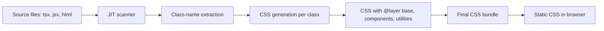
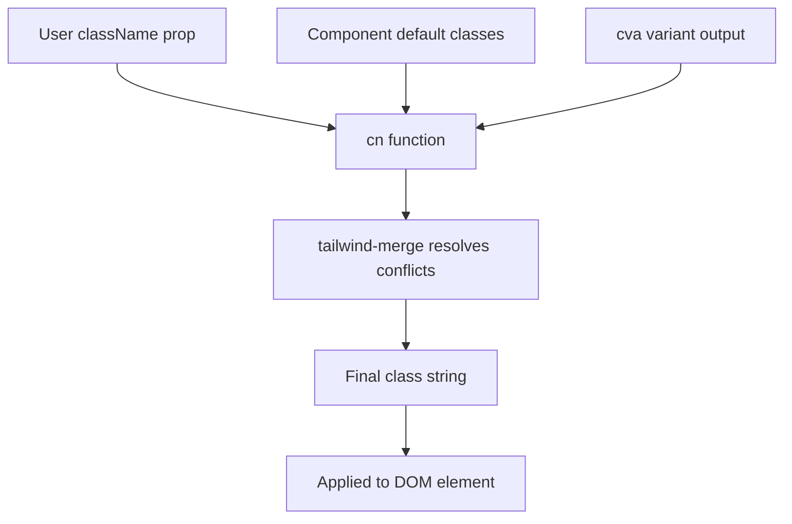
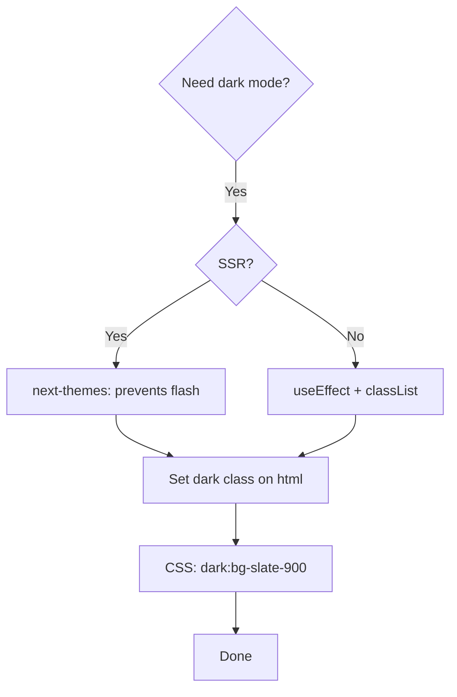

# 6.2 Tailwind Interview Questions

> Tailwind is the dominant utility-first CSS framework of the modern web. An interviewer probing Tailwind wants to confirm three things: that you understand *why* utility-first is a defensible philosophy (not just a habit), that you know how the JIT engine works (because the v3 --> v4 transition changed the calculus), and that you can compose reusable React components on top of Tailwind without falling into the "wall of classes" trap. This note has fifteen deep questions, five practical exercises, and a mock interview that exposes the most common Tailwind interview failure: candidates who reach for `@apply` for the wrong reasons.

## 6.2.1 How To Use This Note

Read each question, then close the note and speak your answer aloud. Open the note only after you have spoken. Tailwind questions are deceptive: the surface answers are easy, but the interviewer will probe for the tradeoffs. If you cannot articulate *why* Tailwind is better than CSS-in-JS for one team and worse for another, you have not internalized the philosophy.

Every question has four parts: a model answer, the reasoning, common wrong answers, and follow-up questions. The follow-ups are the real interview.

> [!tip] Read this note after [[6.1 CSS Interview Questions]]
> Tailwind questions frequently reduce to CSS questions. If your CSS fundamentals are weak, Tailwind answers will sound hollow. Confirm your CSS first.

## 6.2.2 Foundational Questions

### Question 1: What is the utility-first philosophy, and what are its tradeoffs?

**Difficulty:** Easy

**Model Answer:**

Utility-first CSS means you build UI by composing small, single-purpose utility classes directly in your markup (`flex`, `pt-4`, `text-center`, `rotate-90`) instead of writing custom CSS class names (`.card`, `.card__title`) that you then style in a separate CSS file. Tailwind is the dominant implementation of this idea.

The tradeoffs:

**Benefits:**
- **No naming.** You do not invent class names for `padding: 0.75rem` containers. The utility name is the class.
- **No dead CSS.** Tailwind's JIT compiler scans your source and emits only the utilities you actually use. The final CSS bundle is tiny (typically 10–30 KB gzipped).
- **No context switching.** You stay in the markup. You do not jump to a CSS file to add a rule.
- **Constraints by design.** The spacing scale (`p-2`, `p-4`, `p-8`) and color palette (`slate-500`, `blue-700`) are predefined. You cannot accidentally use `padding: 13px`; you choose between `p-3` (12px) and `p-4` (16px). This produces consistent visual systems.
- **Responsive variants compose.** `md:grid-cols-3` reads as "three columns on medium screens." The modifier is part of the class.

**Costs:**
- **Markup gets verbose.** A complex component can have 20+ utility classes on one element. This is the most common objection.
- **Learning curve.** You have to learn the utility vocabulary. Initially slower than writing CSS.
- **Refactoring is harder.** Changing a design system value requires hunting through the markup, not editing one CSS rule.
- **Composition is HTML-bound.** Reusing a styled element means duplicating the class list unless you extract a component (in React) or a class (via `@apply`).

The defense of utility-first is that the costs are mitigated by component extraction (you write the class list once per component, not once per use) and by tooling (the Tailwind IntelliSense extension makes the vocabulary discoverable).

**The Reasoning:**

Utility-first exists because the alternative — semantic class names with custom CSS — has historically led to two failure modes: dead CSS (classes that no element uses) and specificity wars (overriding a class requires higher specificity). Utility-first sidesteps both by making the class list the single source of truth and using zero-specificity (single-class) selectors. The verbosity objection is real but is mitigated by component-based frameworks (React, Vue, Svelte) where the class list lives inside the component, not in copy-pasted HTML.

**Common Wrong Answers:**

- "Tailwind is just inline styles." — Wrong; Tailwind utilities are real CSS classes, governed by the cascade, with responsive variants and pseudo-class modifiers that inline styles cannot express.
- "Tailwind makes your HTML ugly, that's bad." — This is an aesthetic objection, not a technical one. The senior answer is to acknowledge the verbosity and explain why the team accepted it.
- "Utility-first is always better." — Wrong; teams with strong CSS architecture (BEM + ITCSS) and design-system constraints get similar benefits without the verbosity.

**Follow-up Questions an Interviewer Might Ask:**

- When would you not use Tailwind?
- How do you handle team members who keep inventing one-off utility classes?
- How does Tailwind's approach compare to CSS-in-JS libraries like styled-components?

---

### Question 2: How does Tailwind's JIT engine work?

**Difficulty:** Medium

**Model Answer:**

Tailwind v3 introduced the Just-In-Time compiler, replacing the v2 engine that shipped a pre-built CSS file with every utility class. The JIT engine scans your source files (configured in `content`) for class names, then generates CSS for only the classes it finds.

Key properties of JIT:

1. **Source scanning.** Tailwind reads your `.html`, `.tsx`, `.jsx`, `.vue`, `.svelte`, `.php`, `.md` files and extracts strings that look like class names. It uses a regex-based extractor that is intentionally permissive (any token-like string is a candidate).
2. **On-demand generation.** For each detected class, Tailwind generates the corresponding CSS rule. Classes that are not in the source do not exist in the output.
3. **Arbitrary values.** JIT enables `top-[117px]`, `bg-[#bada55]`, `grid-cols-[1fr_2fr_1fr]` — arbitrary values that were impossible in v2's pre-built CSS.
4. **Variants on everything.** `hover:`, `focus:`, `md:`, `dark:`, `disabled:`, `[&:nth-child(3)]:` — JIT generates the variant's selector only when used.
5. **Faster builds.** Instead of purging a 10 MB CSS file down to 50 KB, JIT starts from zero and adds only what you use. Build times drop dramatically.
6. **No purge step.** v2 had a "purge" config that ran post-build to remove unused classes. JIT obsoletes purge by never generating the unused classes in the first place.

The `content` config is critical: if you forget to include a file, the classes used in that file will silently not be generated. This is the most common Tailwind bug.

In v4, JIT is the only engine. The config is auto-detected (no `content` array needed; Tailwind scans the project automatically) and the engine is rewritten in Rust for additional speed.

**The Reasoning:**

JIT was the architectural change that made Tailwind viable at scale. v2's pre-built file was ~3.5 MB unminified; shipping that to production required aggressive purging, and even then the dev experience was slow because every change rebuilt the whole file. JIT inverted the model: start empty, add only what is used. This enabled arbitrary values (the single most-requested feature for years) and made the framework competitive with CSS-in-JS for dev-loop speed.

**Common Wrong Answers:**

- "JIT generates CSS at runtime in the browser." — No; JIT runs at build time. The browser receives static CSS.
- "You still need to configure purge in v3." — No; purge was replaced by the `content` config and is automatic.
- "JIT means any class name works." — Only if the extractor finds it. Dynamically constructed class names like `` `bg-${color}-500` `` are not detected because the extractor is regex-based, not a JS evaluator.

**Follow-up Questions an Interviewer Might Ask:**

- Why does `` `bg-${color}-500` `` not work, and how do you fix it?
- How does Tailwind detect classes in a `.tsx` file?
- What is the difference between JIT in v3 and v4?

---

### Question 3: What is the difference between Tailwind v3 and v4?

**Difficulty:** Medium

**Model Answer:**

Tailwind v4 (released 2025) is a ground-up rewrite. The headline changes:

1. **Rust-based engine.** v3 was written in JavaScript/PostCSS; v4's core is Rust (the `@tailwindcss/oxide` crate). Build times drop by an order of magnitude for large projects.
2. **No `tailwind.config.js` by default.** v4 auto-detects the source files and the theme. Configuration moves into CSS using `@theme` and `@import "tailwindcss"`. A JS config file is still supported for backward compatibility but is no longer the primary path.
3. **CSS-first config.** Custom colors, fonts, and breakpoints are declared in CSS:
   ```css
   @import "tailwindcss";
   @theme {
     --color-brand-500: #6366f1;
     --font-display: "Inter", sans-serif;
     --breakpoint-3xl: 1920px;
   }
   ```
   This generates `bg-brand-500`, `font-display`, `3xl:...` automatically.
4. **Native cascade layers.** v4 uses `@layer` for its base, components, and utilities. This means your custom CSS in `@layer` can predictably override or be overridden by Tailwind's layers.
5. **No PostCSS plugin required.** v4 ships as a Vite plugin, a standalone CLI, or a PostCSS plugin. The recommended setup is the Vite plugin (`@tailwindcss/vite`), which is much faster than the PostCSS path.
6. **Modern CSS by default.** v4 uses `color-mix()`, `oklch()` colors, and other modern features. It targets evergreen browsers.
7. **Container queries built-in.** `@container` and `@min-[300px]:` etc. are first-class.
8. **3rd-party plugin changes.** Plugins are now CSS files using `@plugin` directive, not JS modules.

Migration from v3 to v4 is non-trivial because of the config-file change, the PostCSS-to-Vite-plugin change, and the default color space change (some colors look slightly different in oklch vs sRGB).

**The Reasoning:**

v4 reflects the maturation of the Tailwind philosophy. The team learned that JS config was a bottleneck for build performance and for the editor experience (no native CSS validation), and that PostCSS was a legacy build step. Moving to a Rust core plus CSS-first config gives both speed and a more "native CSS" feel. The breaking changes are the price of these gains.

**Common Wrong Answers:**

- "v4 is just a performance upgrade." — Wrong; the config-file model and CSS-first theming are architectural changes.
- "v4 removed `@apply`." — Wrong; `@apply` still works.
- "v4 requires Vite." — Wrong; v4 ships a standalone CLI and a PostCSS plugin, though Vite is recommended.

**Follow-up Questions an Interviewer Might Ask:**

- How would you migrate a v3 project to v4?
- What breaks when migrating?
- Why did the team switch to oklch colors?
- How do plugins work in v4?

---

### Question 4: How do you customize the theme in Tailwind?

**Difficulty:** Easy

**Model Answer:**

**v3 approach:** Edit `tailwind.config.js`:

```js
module.exports = {
  theme: {
    extend: {
      colors: {
        brand: {
          50: '#eff6ff',
          500: '#3b82f6',
          900: '#1e3a8a',
        },
      },
      fontFamily: {
        display: ['"Inter"', 'sans-serif'],
      },
      screens: {
        '3xl': '1920px',
      },
    },
  },
};
```

Use `extend` to add to the defaults; replace the top-level `theme` keys to override entirely (e.g., `colors: { ... }` without `extend` removes the default palette).

**v4 approach:** Edit your main CSS file:

```css
@import "tailwindcss";

@theme {
  --color-brand-50: #eff6ff;
  --color-brand-500: #3b82f6;
  --color-brand-900: #1e3a8a;
  --font-display: "Inter", sans-serif;
  --breakpoint-3xl: 1920px;
}
```

The convention is: `--color-{name}` for colors, `--font-{name}` for font families, `--breakpoint-{name}` for breakpoints, `--spacing-{name}` for spacing values, `--text-{name}` for typography, `--radius-{name}` for border radii, etc. The utility class names are derived from the variable suffix.

To override a default (rather than extend), prefix the variable with `--color-*: initial;` to clear the defaults first:

```css
@theme {
  --color-*: initial;  /* remove all default colors */
  --color-brand-500: #3b82f6;
}
```

**The Reasoning:**

Customization is the escape hatch from the default palette. Without it, every Tailwind site would look the same (the "Tailwind look"). The theme config lets you express your design system's tokens as CSS variables that generate utilities. The v4 move to CSS-first config reflects that design tokens *are* CSS variables, and treating them as such gives you runtime theming (you can override `--color-brand-500` in a media query or under a `.dark` class) for free.

**Common Wrong Answers:**

- "You can only customize colors." — No; you can customize spacing, fonts, breakpoints, shadows, radii, animations, transitions, opacity, z-index, and more.
- "Custom colors are static and cannot change at runtime." — In v4 they are CSS variables, so they can be overridden at runtime in any selector.
- "I have to use the default palette." — No; you can replace it entirely.

**Follow-up Questions an Interviewer Might Ask:**

- How would you implement a runtime theme switcher (light/dark/brand) using v4?
- What is the difference between `extend.colors` and replacing `colors`?
- How do you add a custom shadow utility?

---

### Question 5: How do you add a custom utility class in Tailwind?

**Difficulty:** Medium

**Model Answer:**

Three approaches, in increasing order of formality:

**1. Arbitrary values inline.** For a one-off, use square brackets:

```html
<div class="top-[117px] bg-[#bada55] grid-cols-[1fr_2fr_1fr]"></div>
```

This generates the CSS on the fly. Good for values that do not need to be reused.

**2. The `@utility` directive (v4).** For a reusable utility that participates in variants:

```css
@utility content-grid {
  display: grid;
  grid-template-columns: minmax(0, 1fr) min(1200px, 100%) minmax(0, 1fr);
}
```

You can now use `content-grid`, `md:content-grid`, `hover:content-grid`, etc. This is the modern replacement for v3's `plugin()` API for simple utilities.

**3. A plugin (v3 and v4).** For utilities that need configuration:

```js
// v3
plugin(({ addUtilities }) => {
  addUtilities({
    '.content-grid': {
      display: 'grid',
      'grid-template-columns': 'minmax(0, 1fr) min(1200px, 100%) minmax(0, 1fr)',
    },
  });
});
```

```css
/* v4 */
@plugin "my-plugin";
```

**4. Plain CSS in `@layer utilities`.** For utilities that are just CSS:

```css
@layer utilities {
  .text-balance {
    text-wrap: balance;
  }
}
```

This works but does not get variant support unless you also wrap it in the plugin system.

**The Reasoning:**

Tailwind's design system is a starting point, not a prison. The framework gives you four escape hatches of increasing formality so you can match the right tool to the right need. Inline arbitrary values handle one-offs; `@utility` handles reusable single-purpose classes; plugins handle configurable systems; plain CSS handles anything else. Knowing which to use signals seniority.

**Common Wrong Answers:**

- "Just use `@apply`." — `@apply` is for composing existing utilities, not for creating new ones.
- "Custom utilities break the design system." — They do not, if you scope them to your design tokens.
- "You have to write a plugin for every custom utility." — No; `@utility` and `@layer` cover most cases.

**Follow-up Questions an Interviewer Might Ask:**

- How would you add a custom animation utility?
- What is the difference between `@utility` and `@layer utilities`?
- How do variants work with custom utilities?

---

## 6.2.3 Intermediate Questions

### Question 6: What is `@apply` and when should you use it?

**Difficulty:** Medium

**Model Answer:**

`@apply` is a directive that inlines Tailwind utilities into a custom CSS rule:

```css
.btn {
  @apply inline-flex items-center justify-center rounded-md px-4 py-2 text-sm font-medium;
}
```

This compiles to:

```css
.btn {
  display: inline-flex;
  align-items: center;
  justify-content: center;
  border-radius: 0.375rem;
  padding-left: 1rem;
  padding-right: 1rem;
  padding-top: 0.5rem;
  padding-bottom: 0.5rem;
  font-size: 0.875rem;
  font-weight: 500;
}
```

**When to use `@apply`:**

- You are working in a context where you cannot use a component (e.g., a Markdown renderer that outputs raw HTML you cannot edit).
- You are integrating Tailwind into a non-component framework (Rails ERB, plain PHP).
- You want a single named class for a deeply-nested third-party component you cannot easily pass classes to.

**When NOT to use `@apply`:**

- In React/Vue/Svelte components, where extracting a component is the better answer. `@apply` creates an indirection: the reader has to jump between the JSX and the CSS to understand the styles. Component extraction keeps the styles colocated with the markup.
- For styles that need responsive variants — `@apply` does support variants (`@apply hover:bg-blue-600`), but the resulting class loses the discoverability of inline utilities.
- For one-off styles — just use the utilities inline.
- To "clean up" a long class list — the verbosity is a feature, not a bug; the reader sees exactly what styles apply.

The Tailwind team's official guidance is to prefer component extraction over `@apply`. The directive exists for contexts where component extraction is not possible.

**The Reasoning:**

`@apply` was created before utility-first was a fully developed philosophy. Early Tailwind users wanted a bridge from semantic-class CSS to utility-first, and `@apply` was that bridge. Today, with component frameworks as the norm, the bridge is less necessary. Senior engineers treat `@apply` as a code smell: not wrong, but a signal that the architecture might be fighting the framework.

**Common Wrong Answers:**

- "Use `@apply` whenever the class list gets long." — Wrong; the long class list is the API. Extract a component instead.
- "`@apply` makes your CSS smaller." — It does not; the generated CSS is the same.
- "`@apply` is deprecated." — It is not; it still works in v4 and is supported.

**Follow-up Questions an Interviewer Might Ask:**

- Show me how you would extract a long class list into a React component.
- When does `@apply` break? (Custom variants, plugins that depend on context, etc.)
- Why does the Tailwind team recommend against `@apply` in component frameworks?

---

### Question 7: How do you handle dark mode in Tailwind?

**Difficulty:** Medium

**Model Answer:**

Tailwind's `dark:` variant applies styles only when dark mode is active. The default in v3 was `prefers-color-scheme: media`, meaning the variant activates based on the user's OS preference. To support a manual toggle (user clicks a button), you switch to the `class` strategy:

```js
// v3 tailwind.config.js
module.exports = {
  darkMode: 'class',
};
```

Then the `dark:` variant activates whenever a parent (typically `<html>`) has the `dark` class. You toggle it in JS:

```ts
useEffect(() => {
  const isDark = localStorage.theme === 'dark' ||
    (!('theme' in localStorage) && window.matchMedia('(prefers-color-scheme: dark)').matches);
  document.documentElement.classList.toggle('dark', isDark);
}, []);
```

```html
<html class="dark">
  <body class="bg-white dark:bg-slate-900 text-slate-900 dark:text-slate-100">
    ...
  </body>
</html>
```

In v4, the strategy is configured in CSS:

```css
@import "tailwindcss";
@custom-variant dark (&:where(.dark, .dark *));
```

This says: the `dark:` variant matches when the element or any ancestor has the `.dark` class. To use OS preference instead:

```css
@custom-variant dark (&:where(@media (prefers-color-scheme: dark)));
```

For robust implementations, use `next-themes` (Next.js) or `@radix-ui/react-theme` to handle SSR flash prevention, system preference detection, and persistence. The naive `useEffect`-based toggle causes a flash of light theme on dark-mode users because the class is added after hydration.

**The Reasoning:**

Dark mode is a UX problem, not just a CSS problem. The CSS side (the `dark:` variant) is trivial. The hard parts are: preventing the flash on first paint (which requires SSR or an inline script), persisting the user's choice (localStorage), respecting the OS preference as the default, and handling the toggle's accessibility (`aria-pressed`, focus management). Senior engineers know that "implement dark mode" includes all of these.

**Common Wrong Answers:**

- "Just use `prefers-color-scheme`." — This gives no user toggle, which most modern apps require.
- "Add the `dark` class with `useEffect`." — Causes a flash on SSR.
- "Use a separate dark mode stylesheet." — Defeats the utility-first approach.

**Follow-up Questions an Interviewer Might Ask:**

- How do you prevent the flash of incorrect theme on SSR?
- How would you implement a three-way toggle (light/dark/system)?
- How do you handle theme color in meta tags?

---

### Question 8: What is the difference between `sm:` and `max-sm:`?

**Difficulty:** Medium

**Model Answer:**

Tailwind's responsive variants are mobile-first by default. `sm:` means "this style applies at `min-width: 640px` and up." `max-sm:` is the inverse: "this style applies below `max-width: 639px`."

| Variant | Generated media query |
|---------|----------------------|
| `sm:` | `@media (min-width: 640px)` |
| `md:` | `@media (min-width: 768px)` |
| `lg:` | `@media (min-width: 1024px)` |
| `max-sm:` | `@media (max-width: 639px)` |
| `max-md:` | `@media (max-width: 767px)` |

The key insight is that `max-sm:` is *not* the same as `sm:` negated — they use different media queries with different boundary semantics. `max-sm:` ends at `639px`, `sm:` starts at `640px`. There is no overlap.

When to use which:
- **Mobile-first (`sm:`, `md:`, ...)** is the default. Write base styles for mobile, then progressively enhance at each breakpoint. Use this when the mobile design is the foundation.
- **Desktop-first (`max-sm:`, `max-md:`, ...)** is appropriate when you have a desktop design and want to override for smaller screens. Use sparingly; mixing mobile-first and desktop-first in the same component creates confusing precedence.

A common pattern is mobile-first base styles with `max-` for one-off mobile overrides:

```html
<div class="grid grid-cols-1 md:grid-cols-3 max-md:gap-2">
  ...
</div>
```

Here, the grid is 1 column on mobile, 3 on `md` and up. The `max-md:gap-2` overrides the gap to `2` only on mobile. This is clearer than `gap-2 md:gap-4` when the mobile value is the override.

**The Reasoning:**

Mobile-first was the original Tailwind philosophy because it forces you to design for the smallest screen first, which produces better mobile UX. The `max-*` variants were added later to support desktop-first codebases that wanted to adopt Tailwind without rewriting. Knowing both lets you read any codebase, but you should default to mobile-first in new work.

**Common Wrong Answers:**

- "`max-sm:` is the same as `sm:` with `not-`." — There is no `not-sm:` variant; the syntax is different.
- "`sm:` means small screens." — It means "640px and up," which is more than just small phones.
- "You should always use `max-*` for mobile overrides." — Wrong; the default is mobile-first.

**Follow-up Questions an Interviewer Might Ask:**

- What is the difference between `min-w-*` and `max-w-*` variants?
- How would you target only tablet sizes?
- How do container query variants compare (`@sm:` vs `sm:`)?

---

### Question 9: What is the `cn()` utility pattern and why is `tailwind-merge` needed?

**Difficulty:** Hard

**Model Answer:**

`cn()` is a small utility (popularized by shadcn/ui) that combines `clsx` (or `classnames`) with `tailwind-merge`:

```ts
import { clsx, type ClassValue } from 'clsx';
import { twMerge } from 'tailwind-merge';

export function cn(...inputs: ClassValue[]) {
  return twMerge(clsx(inputs));
}
```

`clsx` handles conditional classes: `cn('px-4', isActive && 'bg-blue-500', variant === 'ghost' && 'text-slate-500')` returns a single string.

`tailwind-merge` resolves conflicts. If you write `cn('px-4 py-2', 'px-6')`, the result is `'py-2 px-6'` — the later `px-6` overrides the earlier `px-4`. Without `tailwind-merge`, you would get `'px-4 py-2 px-6'`, and CSS source order would decide which wins. In Tailwind v3, all utilities are in the same `@layer utilities`, so the last one in the CSS file wins, which is *not necessarily* the one you wrote last in your JSX.

The reason `tailwind-merge` is needed is the **class-list conflict problem**. Without it, composing components is fragile:

```tsx
<Button className="px-8" />  // user wants wider padding
// Inside Button: <button className={cn('px-4 py-2', className)} />
// Without tailwind-merge: 'px-4 py-2 px-8' — CSS source order decides
// With tailwind-merge: 'py-2 px-8' — the user's px-8 wins
```

`tailwind-merge` knows that `px-4` and `px-8` conflict (both set `padding-left` and `padding-right`), and that `pl-4` conflicts with `px-4` (the `pl` is more specific). It also handles variants: `hover:px-4 hover:px-8` resolves to `hover:px-8`.

**The Reasoning:**

`tailwind-merge` exists because Tailwind's class-based styling model has no built-in precedence for conflicting utilities. In a CSS-in-JS system, the last applied style wins because the JS evaluation order is deterministic. In Tailwind, the CSS source order is fixed by the build, and the class order in your HTML does not affect it. `tailwind-merge` restores the expectation that "later overrides earlier" by preprocessing the class list before it reaches the DOM.

**Common Wrong Answers:**

- "You only need `clsx`." — Wrong; `clsx` does not resolve conflicts, it just joins strings conditionally.
- "Tailwind handles this natively in v4." — It does not; you still need `tailwind-merge` (or to be very careful with your class composition).
- "`tailwind-merge` is a runtime cost." — Yes, but it is small (microseconds per call) and runs at component render, not per pixel.

**Follow-up Questions an Interviewer Might Ask:**

- How does `tailwind-merge` know which classes conflict?
- What is the performance impact of `tailwind-merge` in a large app?
- How would you handle conflicts for custom utilities?
- How does this compare to CSS-in-JS's automatic conflict resolution?

---

### Question 10: How do you extract a reusable component in React with Tailwind?

**Difficulty:** Medium

**Model Answer:**

The pattern is: write the class list inside a React component, accept a `className` prop, and use `cn()` to merge user-supplied classes:

```tsx
import { cn } from '@/lib/utils';

interface ButtonProps extends React.ButtonHTMLAttributes<HTMLButtonElement> {
  variant?: 'primary' | 'ghost' | 'danger';
  size?: 'sm' | 'md' | 'lg';
}

export function Button({ variant = 'primary', size = 'md', className, ...props }: ButtonProps) {
  return (
    <button
      className={cn(
        'inline-flex items-center justify-center rounded-md font-medium transition-colors',
        'focus-visible:outline-none focus-visible:ring-2 focus-visible:ring-blue-500',
        'disabled:opacity-50 disabled:pointer-events-none',
        {
          'bg-blue-600 text-white hover:bg-blue-700': variant === 'primary',
          'bg-transparent text-slate-900 hover:bg-slate-100': variant === 'ghost',
          'bg-red-600 text-white hover:bg-red-700': variant === 'danger',
        },
        {
          'h-8 px-3 text-sm': size === 'sm',
          'h-10 px-4 text-base': size === 'md',
          'h-12 px-6 text-lg': size === 'lg',
        },
        className,
      )}
      {...props}
    />
  );
}
```

Usage:

```tsx
<Button variant="ghost" size="lg" className="w-full">Click me</Button>
```

The user's `className` is appended last so `tailwind-merge` (inside `cn`) lets it override the component's defaults. The component spreads `...props` so all native button attributes (`onClick`, `disabled`, `type`, `aria-*`) work.

**The Reasoning:**

Component extraction is the answer to the verbosity objection. Instead of writing the 15-class string in 50 places, you write it once and import it. The `cn()` + `tailwind-merge` pattern gives users a clean override mechanism: pass any utility class and it sensibly overrides the default. This is the same pattern that shadcn/ui uses, and it is the de facto standard for Tailwind-based component libraries in 2025.

**Common Wrong Answers:**

- "Use `@apply` instead." — Loses the colocated-class benefit and creates indirection.
- "Just inline the classes everywhere." — Duplicates the API; refactoring a design change requires touching every site.
- "Use a CSS-in-JS library for components and Tailwind for layout." — Mixing two styling systems creates cognitive overhead and bundle bloat.

**Follow-up Questions an Interviewer Might Ask:**

- How would you handle a polymorphic `as` prop (render as `button` or `a`)?
- How would you build a `Card` compound component (`Card.Header`, `Card.Body`)?
- How does shadcn/ui's approach differ from a traditional component library?

---

### Question 11: What is the `cva` pattern and when do you use it?

**Difficulty:** Hard

**Model Answer:**

`cva` (Class Variance Authority) is a tiny library by Joe Bell that lets you define a component's variant API declaratively:

```tsx
import { cva, type VariantProps } from 'class-variance-authority';

const button = cva('inline-flex items-center justify-center rounded-md font-medium', {
  variants: {
    variant: {
      primary: 'bg-blue-600 text-white hover:bg-blue-700',
      ghost: 'bg-transparent text-slate-900 hover:bg-slate-100',
      danger: 'bg-red-600 text-white hover:bg-red-700',
    },
    size: {
      sm: 'h-8 px-3 text-sm',
      md: 'h-10 px-4 text-base',
      lg: 'h-12 px-6 text-lg',
    },
  },
  compoundVariants: [
    { variant: 'danger', size: 'lg', className: 'uppercase tracking-wide' },
  ],
  defaultVariants: {
    variant: 'primary',
    size: 'md',
  },
});

type ButtonProps = React.ButtonHTMLAttributes<HTMLButtonElement> &
  VariantProps<typeof button>;

export function Button({ variant, size, className, ...props }: ButtonProps) {
  return <button className={cn(button({ variant, size }), className)} {...props} />;
}
```

Advantages over the inline-object pattern:

1. **Type inference.** `VariantProps<typeof button>` generates the prop types automatically — no manual union of `'primary' | 'ghost' | 'danger'`.
2. **Compound variants.** When `variant === 'danger' && size === 'lg'`, apply an extra class. The inline-object pattern requires nested conditionals.
3. **Composable.** You can import and reuse the `button` function — e.g., a `Link` that wants to look like a Button can call `button({ variant: 'primary' })` to get the same classes.
4. **Testable.** The variant definitions are plain data; you can snapshot-test them.

Use `cva` when a component has more than two variant dimensions or has compound variants. For a simple Button with just `variant`, the inline object is fine. For a complex component (Input, Card, Tooltip, Dropdown), `cva` pays for itself.

**The Reasoning:**

`cva` exists because the inline-object pattern does not scale. Once you have 3+ variant dimensions or compound conditions, the JSX becomes unreadable. `cva` externalizes the variant definitions, makes them type-safe, and lets you share them across components. It is the bridge between Tailwind's class-based styling and the variant API of a component library like Radix.

**Common Wrong Answers:**

- "You always need `cva`." — No; for simple components, the inline pattern is clearer.
- "`cva` replaces `cn`." — No; you use `cva` to generate the class string and `cn` to merge the user's `className` on top.
- "`cva` is a CSS-in-JS library." — It is not; it is a pure JS function that returns a class name string.

**Follow-up Questions an Interviewer Might Ask:**

- How would you share variants between two components?
- How does `cva` compare to Radix UI's variant approach?
- How would you write a polymorphic `as` prop with `cva`?

---

### Question 12: How does Tailwind compare to CSS-in-JS?

**Difficulty:** Hard

**Model Answer:**

| Dimension | Tailwind | CSS-in-JS (styled-components, Emotion) |
|-----------|----------|----------------------------------------|
| Styling location | In the markup (class list) | In JS, often colocated with the component |
| Scope | Global CSS file with utility classes | Auto-scoped class names per component |
| Dead CSS | None (JIT removes unused) | None (each style is component-scoped) |
| Bundle size | ~10–30 KB CSS, no JS | ~12 KB JS (runtime) + per-component CSS |
| Runtime cost | Zero (static CSS) | Non-zero (style injection, name generation) |
| Theming | CSS variables, `@theme` | JS theme object, props |
| Server components (RSC) | Works (CSS is static) | Most CSS-in-JS libs do not (they need a runtime that breaks RSC) |
| TypeScript integration | None for class names (string) | Strong (props are typed) |
| Learning curve | Vocabulary of utilities | API of the library |
| Editor support | Tailwind IntelliSense extension | IDE support varies |
| Performance | Excellent (no runtime) | Slower (runtime injection, especially in dev) |
| Refactoring | Find/replace class strings | Rename JS variables |

**When to choose Tailwind:**
- Next.js App Router / RSC (CSS-in-JS breaks RSC unless you use the new zero-runtime variants like Linaria or vanilla-extract).
- Performance-critical apps where the runtime cost of CSS-in-JS is unacceptable.
- Teams that want a strict design system without writing one.
- Multi-framework codebases (the same Tailwind classes work in React, Vue, Svelte, plain HTML).

**When to choose CSS-in-JS:**
- You need dynamic styles based on complex JS state (though `style` attribute often suffices).
- Your team has a strong existing CSS-in-JS investment.
- You need scoped styles without the verbosity of utility classes.

**The new middle ground:** Zero-runtime CSS-in-JS (Linaria, vanilla-extract, PandaCSS, PigmentCSS) compiles away at build time, leaving static CSS. These give you the type safety and scoping of CSS-in-JS without the runtime cost. PandaCSS in particular is API-similar to Stitches and works well with RSC.

**The Reasoning:**

The CSS-in-JS vs Tailwind debate was heated from 2018 to 2022 but has largely settled. The forcing function was React Server Components: most CSS-in-JS libraries (styled-components, Emotion) need a runtime that breaks RSC. Tailwind works because its CSS is static. The zero-runtime CSS-in-JS libraries (PandaCSS, PigmentCSS) emerged as the RSC-compatible alternative for teams that prefer JS APIs. Today, Tailwind is the default for new Next.js projects; CSS-in-JS is a deliberate choice for specific use cases.

**Common Wrong Answers:**

- "Tailwind is faster than CSS-in-JS in every case." — Not strictly true; for very dynamic styles, CSS-in-JS can be competitive with `style` attributes.
- "CSS-in-JS is dead." — Wrong; it has a smaller market but is still actively developed, especially zero-runtime variants.
- "Tailwind is the only RSC-compatible option." — Wrong; vanilla-extract, PandaCSS, CSS Modules, and plain CSS all work.

**Follow-up Questions an Interviewer Might Ask:**

- How would you migrate a styled-components codebase to Tailwind?
- What is zero-runtime CSS-in-JS, and how does it work?
- When does dynamic styling warrant CSS-in-JS over Tailwind?

---

## 6.2.4 Advanced Questions

### Question 13: How do you handle performance considerations in Tailwind?

**Difficulty:** Hard

**Model Answer:**

Tailwind's performance has two dimensions: build-time and runtime.

**Build-time:**
- Use the v4 Rust-based engine for large projects (10x faster builds than v3).
- In v3, ensure your `content` config includes all files that use classes. Missed files mean regenerated CSS; over-broad configs (e.g., `node_modules/**/*`) mean slow scans.
- Avoid `@apply` in deeply nested selectors; it expands at build time.
- Use the standalone CLI for non-JS projects; it is faster than the PostCSS plugin.

**Runtime (browser):**
- Tailwind generates one class per utility. The browser's style recalculation is proportional to selector complexity, and Tailwind's selectors are single-class (specificity `(0, 1, 0)`). This is optimal.
- The CSS file size is small (10–30 KB gzipped) because JIT removes unused utilities. There is no further runtime work.
- Animations should still respect the same rules as plain CSS: animate `transform` and `opacity`, not `width` or `top`. Tailwind does not change the rendering pipeline.

**Class list size in the DOM:**
- A complex component can have 30+ classes on one element. The DOM size grows, but only by bytes. Style recalc is unaffected because each class is a separate selector match.
- If you are concerned about DOM size (e.g., a virtualized list with 100,000 items), extract the classes to a single named class via `@apply` or `@utility`. This trades CSS bundle size for DOM size.

**Specificity:**
- All Tailwind utilities are at `(0, 1, 0)`. Custom CSS that uses an ID or nested selectors will override them. Use `@layer` to ensure predictable ordering.

**Caching:**
- Tailwind's CSS is static; it is cached by the browser like any other CSS file. Set long `Cache-Control` headers with content-hash filenames.

**The Reasoning:**

Tailwind is, by construction, one of the most performant ways to ship CSS. The JIT engine ensures no dead CSS, the single-class selectors ensure fast style recalc, and the static output enables aggressive caching. The remaining performance work is the same as any CSS: animate the right properties, scope recalc with `contain`, and avoid layout thrashing.

**Common Wrong Answers:**

- "Tailwind is slow because of the long class lists." — Wrong; class count does not affect style recalc.
- "Tailwind generates CSS at runtime." — Wrong; JIT is build-time.
- "You should purge Tailwind CSS in production." — JIT already does this; there is no separate purge step in v3+.

**Follow-up Questions an Interviewer Might Ask:**

- How would you measure Tailwind's CSS bundle size?
- What is the impact of `@apply` on bundle size?
- How does Tailwind handle CSS source maps in dev?

---

### Question 14: What are the common criticisms of Tailwind, and what are the rebuttals?

**Difficulty:** Hard

**Model Answer:**

**Criticism 1: "The class lists are ugly and verbose."**

Rebuttal: Verbosity is real, but it is mitigated by component extraction. In a React codebase, you write the class list once per component, not once per use. The reader sees the styles inline, which is faster to reason about than jumping to a CSS file. Aesthetic objections to long class lists are not technical objections.

**Criticism 2: "You lose the semantic meaning of class names."**

Rebuttal: Semantic class names (`.card`, `.nav`) describe what an element *is*, but they require a separate CSS file to describe what it *looks like*. The indirection is the cost. In component frameworks, the *component name* (`<Card>`, `<Nav>`) is the semantic layer; the classes are implementation details.

**Criticism 3: "It is hard to refactor."**

Rebuttal: True for class-string refactors (changing `text-slate-900` to `text-slate-700` everywhere requires find/replace). False for design-system refactors (changing the `--color-slate-900` token updates every use). Component extraction limits the blast radius of refactors.

**Criticism 4: "It does not support complex selectors like `:has()`."**

Rebuttal: Tailwind supports arbitrary variants: `[&:has(.active)]:bg-blue-50`. The syntax is uglier than hand-written CSS, but it works. For complex selector logic, write a custom utility in CSS.

**Criticism 5: "Vendor lock-in."**

Rebuttal: Tailwind classes are not portable to a non-Tailwind codebase, true. But the same is true of any framework's primitives. The escape hatch is `@apply` (which extracts classes into named CSS rules that can be moved) or a full rewrite.

**Criticism 6: "All Tailwind sites look the same."**

Rebuttal: True if you use the default palette and the default spacing without customization. False if you customize the theme. The "Tailwind look" is the default-config look; a customized Tailwind site is indistinguishable from a hand-written CSS site.

**Criticism 7: "It is not accessible by default."**

Rebuttal: Tailwind does not enforce accessibility (you can build inaccessible UIs with it), but it does not prevent it either. Tools like `focus-visible:ring-2` make accessible focus states easy. Accessibility is an engineering discipline, not a framework feature.

**The Reasoning:**

Every framework has legitimate criticisms. The senior engineer acknowledges them and articulates the rebuttals. This signals that you have used Tailwind enough to know its limitations, not that you have adopted it as a tribal identity. Interviewers specifically probe for this nuance.

**Common Wrong Answers:**

- "Tailwind has no downsides." — Tribal and wrong.
- "Tailwind is bad for large projects." — Wrong; many large projects (GitHub, Vercel, Shopify parts) use it.
- "I would never use Tailwind because the class lists are ugly." — This is a preference, not a technical argument.

**Follow-up Questions an Interviewer Might Ask:**

- When would you choose not to use Tailwind?
- How do you handle the "Tailwind look" criticism in a design system?
- How would you migrate off Tailwind if you had to?

---

### Question 15: How do you organize a large Tailwind project?

**Difficulty:** Hard

**Model Answer:**

**Folder structure:**

```text
src/
  components/
    ui/                 # design-system primitives (Button, Input, Card)
      button.tsx
      input.tsx
    features/           # feature-specific composite components
      checkout/
        CheckoutForm.tsx
        OrderSummary.tsx
  lib/
    utils.ts            # cn() and other small utilities
  styles/
    globals.css         # @import "tailwindcss"; @theme; custom base styles
    animations.css      # custom @keyframes if needed
  app/                  # Next.js App Router pages
    layout.tsx
    page.tsx
```

**Conventions:**

1. **Design-system primitives in `components/ui/`.** These are the building blocks: Button, Input, Select, Card, Dialog, Tabs. Each component uses `cva` for variants and `cn()` for class merging. These are the only files that should have long Tailwind class lists.

2. **Feature components compose primitives.** A `CheckoutForm` uses `<Button>` and `<Input>`, not raw `<button>` and `<input>` with utility classes. This keeps feature code clean and ensures design-system consistency.

3. **Theme tokens in `globals.css`.** Custom colors, fonts, spacing, and breakpoints are declared once in `@theme`. No scattered color values.

4. **Avoid `@apply` except for third-party integration.** If you must style a third-party component (e.g., a Markdown-rendered `<prose>` block), use `@apply` in a `typography.css` file. Otherwise, extract a component.

5. **Centralize `cn()`.** One utility file, imported everywhere. Do not let `tailwind-merge` be re-imported in 50 files.

6. **Use the `prettier-plugin-tailwindcss` plugin.** It sorts Tailwind classes in a canonical order, which makes diffs cleaner and reviews faster.

7. **Use shadcn/ui as a starting point, not a dependency.** The shadcn/ui CLI copies component source into your project, so you own the code. This is the right model: you get a polished starting point and can refactor freely.

8. **Document variant APIs.** Each design-system component should have a TypeScript prop interface that documents its variants. The `cva` definition is the source of truth.

**The Reasoning:**

Large Tailwind projects fail when every file has long class lists with no abstraction. The discipline is: primitives own the class lists, features compose primitives. This keeps the codebase readable, ensures design-system consistency, and makes refactors tractable. The same discipline applies to any CSS architecture; Tailwind does not exempt you from it.

**Common Wrong Answers:**

- "Just put Tailwind classes everywhere." — Leads to unmaintainable code.
- "Use `@apply` for every component." — Loses the colocated-class benefit.
- "Tailwind replaces the need for a component library." — Wrong; you still build a component library on top of Tailwind.

**Follow-up Questions an Interviewer Might Ask:**

- How would you handle a design-system update that affects 50 components?
- How do you test design-system components?
- How do you document the variant API for non-technical stakeholders?

---

## 6.2.5 Practical Coding Exercises

### Exercise 1: Build a Button component with variants using `cva`

```tsx
import { cva, type VariantProps } from 'class-variance-authority';
import { cn } from '@/lib/utils';

const button = cva(
  'inline-flex items-center justify-center rounded-md font-medium transition-colors focus-visible:outline-none focus-visible:ring-2 focus-visible:ring-offset-2 disabled:opacity-50 disabled:pointer-events-none',
  {
    variants: {
      variant: {
        primary: 'bg-blue-600 text-white hover:bg-blue-700 focus-visible:ring-blue-500',
        secondary: 'bg-slate-100 text-slate-900 hover:bg-slate-200 focus-visible:ring-slate-400',
        ghost: 'bg-transparent text-slate-900 hover:bg-slate-100 focus-visible:ring-slate-400',
        destructive: 'bg-red-600 text-white hover:bg-red-700 focus-visible:ring-red-500',
      },
      size: {
        sm: 'h-8 px-3 text-sm',
        md: 'h-10 px-4 text-base',
        lg: 'h-12 px-6 text-lg',
        icon: 'h-10 w-10',
      },
    },
    compoundVariants: [
      { variant: 'destructive', size: 'lg', className: 'uppercase tracking-wide' },
    ],
    defaultVariants: { variant: 'primary', size: 'md' },
  },
);

export interface ButtonProps
  extends React.ButtonHTMLAttributes<HTMLButtonElement>,
    VariantProps<typeof button> {}

export function Button({ variant, size, className, ...props }: ButtonProps) {
  return <button className={cn(button({ variant, size }), className)} {...props} />;
}
```

**Reasoning:** `cva` externalizes the variant definitions. The `ButtonProps` interface uses `VariantProps<typeof button>` to derive types from the `cva` config, so adding a new variant is a one-line change. The `cn()` call lets users override any class via `className`.

**Pitfalls:**
- Forgetting `{...props}` — native attributes (`onClick`, `disabled`) break.
- Forgetting `focus-visible:ring-*` — keyboard accessibility fails.
- Hard-coding colors instead of theme tokens.

**Extension:** Add a polymorphic `as` prop so the button can render as an `<a>` for Next.js `<Link>`.

---

### Exercise 2: Build a responsive card grid

```tsx
export function CardGrid({ children }: { children: React.ReactNode }) {
  return (
    <div className="grid gap-6 sm:grid-cols-2 lg:grid-cols-3 xl:grid-cols-4">
      {children}
    </div>
  );
}

export function Card({ title, children }: { title: string; children: React.ReactNode }) {
  return (
    <div className="rounded-lg border border-slate-200 bg-white p-6 shadow-sm transition-shadow hover:shadow-md">
      <h3 className="mb-2 text-lg font-semibold text-slate-900">{title}</h3>
      <div className="text-sm text-slate-600">{children}</div>
    </div>
  );
}
```

**Reasoning:** Mobile-first responsive grid: 1 column by default, 2 at `sm` (640px), 3 at `lg` (1024px), 4 at `xl` (1280px). The `gap-6` provides consistent spacing at all breakpoints. The card's hover effect uses `shadow-md` which triggers paint but no layout.

**Pitfalls:**
- Forgetting the base case (1 column on mobile).
- Using fixed pixel widths instead of `grid-cols-*`.
- Animating `transform` without `transition-transform`.

**Extension:** Add a `featured` variant that uses a different border color and adds a "Featured" badge.

---

### Exercise 3: Build a dark mode toggle

```tsx
'use client';
import { useEffect, useState } from 'react';

export function ThemeToggle() {
  const [theme, setTheme] = useState<'light' | 'dark'>('light');

  useEffect(() => {
    const stored = localStorage.getItem('theme');
    const prefersDark = window.matchMedia('(prefers-color-scheme: dark)').matches;
    const initial = stored ? (stored as 'light' | 'dark') : prefersDark ? 'dark' : 'light';
    setTheme(initial);
    document.documentElement.classList.toggle('dark', initial === 'dark');
  }, []);

  function toggle() {
    const next = theme === 'dark' ? 'light' : 'dark';
    setTheme(next);
    localStorage.setItem('theme', next);
    document.documentElement.classList.toggle('dark', next === 'dark');
  }

  return (
    <button
      onClick={toggle}
      aria-label={`Switch to ${theme === 'dark' ? 'light' : 'dark'} mode`}
      className="rounded-md p-2 hover:bg-slate-100 dark:hover:bg-slate-800"
    >
      {theme === 'dark' ? '' : ''}
    </button>
  );
}
```

For production, use `next-themes` to prevent the SSR flash:

```tsx
// app/providers.tsx
'use client';
import { ThemeProvider } from 'next-themes';

export function Providers({ children }: { children: React.ReactNode }) {
  return <ThemeProvider attribute="class" defaultTheme="system" enableSystem>{children}</ThemeProvider>;
}
```

**Reasoning:** The naive `useEffect` approach causes a flash on SSR. `next-themes` injects an inline script before hydration that sets the `class` attribute on `<html>`, preventing the flash.

**Pitfalls:**
- Flash of incorrect theme on SSR.
- Not handling system preference.
- Forgetting `aria-label` on the toggle button.

**Extension:** Add a three-way toggle (light / dark / system) with a dropdown.

---

### Exercise 4: Build a navigation bar with a mobile menu

```tsx
'use client';
import { useState } from 'react';
import { cn } from '@/lib/utils';

export function Navbar() {
  const [open, setOpen] = useState(false);

  return (
    <nav className="border-b border-slate-200 bg-white">
      <div className="mx-auto flex max-w-7xl items-center justify-between px-4 py-3">
        <a href="/" className="text-lg font-bold text-slate-900">Logo</a>

        <ul className="hidden md:flex md:items-center md:gap-6">
          <li><a href="/" className="text-sm text-slate-700 hover:text-slate-900">Home</a></li>
          <li><a href="/about" className="text-sm text-slate-700 hover:text-slate-900">About</a></li>
          <li><a href="/contact" className="text-sm text-slate-700 hover:text-slate-900">Contact</a></li>
        </ul>

        <button
          onClick={() => setOpen(!open)}
          className="md:hidden rounded-md p-2 hover:bg-slate-100"
          aria-label="Toggle menu"
          aria-expanded={open}
        >
          <svg className="h-6 w-6" fill="none" stroke="currentColor" viewBox="0 0 24 24">
            {open ? (
              <path strokeLinecap="round" strokeLinejoin="round" strokeWidth={2} d="M6 18L18 6M6 6l12 12" />
            ) : (
              <path strokeLinecap="round" strokeLinejoin="round" strokeWidth={2} d="M4 6h16M4 12h16M4 18h16" />
            )}
          </svg>
        </button>
      </div>

      <div className={cn('md:hidden', open ? 'block' : 'hidden')}>
        <ul className="space-y-1 px-4 py-3">
          <li><a href="/" className="block rounded-md px-3 py-2 text-sm text-slate-700 hover:bg-slate-100">Home</a></li>
          <li><a href="/about" className="block rounded-md px-3 py-2 text-sm text-slate-700 hover:bg-slate-100">About</a></li>
          <li><a href="/contact" className="block rounded-md px-3 py-2 text-sm text-slate-700 hover:bg-slate-100">Contact</a></li>
        </ul>
      </div>
    </nav>
  );
}
```

**Reasoning:** Mobile-first: the desktop menu is `hidden md:flex` (hidden on mobile, flex on md+). The mobile menu is `md:hidden` (visible on mobile, hidden on md+). The toggle button is `md:hidden`. This avoids duplicating the link list — both menus render the same links, just in different containers.

**Pitfalls:**
- Duplicating the link list — leads to drift when one is updated.
- Not closing the menu on link click.
- Not handling Escape key to close.
- Missing `aria-expanded` on the toggle.

**Extension:** Add focus trap when the mobile menu is open. Add `prefers-reduced-motion` for the open/close animation.

---

### Exercise 5: Build a form with Tailwind styling

```tsx
'use client';
import { useState } from 'react';

export function ContactForm() {
  const [email, setEmail] = useState('');
  const [message, setMessage] = useState('');
  const [error, setError] = useState<string | null>(null);

  function onSubmit(e: React.FormEvent) {
    e.preventDefault();
    if (!email.includes('@')) {
      setError('Please enter a valid email.');
      return;
    }
    if (message.length < 10) {
      setError('Message must be at least 10 characters.');
      return;
    }
    setError(null);
    // Submit...
  }

  return (
    <form onSubmit={onSubmit} className="mx-auto max-w-md space-y-4">
      <div>
        <label htmlFor="email" className="block text-sm font-medium text-slate-700">
          Email
        </label>
        <input
          id="email"
          type="email"
          value={email}
          onChange={(e) => setEmail(e.target.value)}
          className="mt-1 block w-full rounded-md border border-slate-300 px-3 py-2 text-slate-900 shadow-sm focus:border-blue-500 focus:outline-none focus:ring-1 focus:ring-blue-500"
          aria-invalid={!!error}
          aria-describedby={error ? 'error' : undefined}
        />
      </div>

      <div>
        <label htmlFor="message" className="block text-sm font-medium text-slate-700">
          Message
        </label>
        <textarea
          id="message"
          value={message}
          onChange={(e) => setMessage(e.target.value)}
          rows={4}
          className="mt-1 block w-full rounded-md border border-slate-300 px-3 py-2 text-slate-900 shadow-sm focus:border-blue-500 focus:outline-none focus:ring-1 focus:ring-blue-500"
        />
      </div>

      {error && (
        <p id="error" role="alert" className="text-sm text-red-600">
          {error}
        </p>
      )}

      <button
        type="submit"
        className="w-full rounded-md bg-blue-600 px-4 py-2 text-white hover:bg-blue-700 focus:outline-none focus:ring-2 focus:ring-blue-500 focus:ring-offset-2"
      >
        Send
      </button>
    </form>
  );
}
```

**Reasoning:** Accessibility is baked in: `htmlFor`/`id` pairs, `aria-invalid`, `aria-describedby`, `role="alert"`. The focus styles use `focus:ring-2 focus:ring-offset-2` which is the standard accessible focus indicator. The `max-w-md` constrains the form width; `space-y-4` provides consistent vertical rhythm.

**Pitfalls:**
- Missing `htmlFor` on labels.
- Missing `aria-invalid` and `aria-describedby`.
- Using placeholder text as a label.
- No focus styles.

**Extension:** Extract a reusable `TextField` component with built-in label, error display, and focus styles.

---

## 6.2.6 Mermaid Diagrams







## 6.2.7 Common Wrong Answers and Why They Fail

The most common Tailwind interview failure is **reaching for `@apply` to "clean up" class lists**. This signals that the candidate has not internalized utility-first. The senior answer is to extract a component.

The second is **not knowing how JIT works**. A candidate who says "Tailwind ships a big CSS file" has not used v3+. The interviewer concludes the candidate has not shipped Tailwind in production.

The third is **ignoring `tailwind-merge`**. A candidate who composes classes by string concatenation without conflict resolution will produce buggy components. The interviewer will probe this with the `cn()` question.

The fourth is **treating Tailwind as a CSS-in-JS replacement**. The two solve different problems. A candidate who says "Tailwind replaced styled-components for me" without acknowledging the tradeoffs has not understood either tool.

The fifth is **not knowing v4 changes**. A candidate who describes v3's `tailwind.config.js` as if it were current in 2025 has not kept up. The interviewer will ask about v4 specifically to expose this.

> [!warning] The single most common mistake
> Building an inaccessible component. Tailwind makes it easy to forget `focus-visible:ring-*`, `aria-*` attributes, and `prefers-reduced-motion`. A senior engineer treats accessibility as part of the component API, not as an add-on.

## 6.2.8 Tips For Acing The Interview

1. **Default to component extraction.** When asked how to handle a long class list, your first answer is "extract a component," not "`@apply`."
2. **Know the v3/v4 differences.** Be able to articulate the Rust engine, CSS-first config, and `@theme` directive.
3. **Mention `tailwind-merge` unprompted.** When discussing component composition, mention conflict resolution and the `cn()` pattern.
4. **Use `cva` for non-trivial variants.** When asked how to build a Button with multiple variant dimensions, reach for `cva`.
5. **Discuss performance in terms of the CSS pipeline.** Tailwind does not exempt you from animating `transform` instead of `width`.
6. **Acknowledge the criticisms.** Verbosity, refactoring pain, "Tailwind look" — articulate them and the rebuttals.
7. **Treat accessibility as part of the API.** Every component answer should include focus styles, ARIA, and reduced-motion.
8. **Cite shadcn/ui.** It is the de facto standard. Knowing it signals you are current with the ecosystem.

## 6.2.9 Mock Interview Sequence

**Interviewer:** "Walk me through how you would build a Button component with Tailwind."

**Candidate:** "I would use `cva` to define the variant API, then wrap it in a React component that uses `cn()` to merge user-supplied classes. The `cva` definition lives outside the component so it is reusable and so TypeScript can derive the prop types. The component itself spreads `...props` so all native button attributes work."

**Interviewer:** "Show me the structure."

**Candidate:** (writes the cva pattern from Exercise 1). "The base classes set layout, typography, and focus styles. Variants set the visual style per state. The `compoundVariants` handle cases where two variants interact — for example, a destructive large button might be uppercase. The default variants give a sensible out-of-the-box button."

**Interviewer:** "Why `cva` instead of inline objects?"

**Candidate:** "For a simple two-variant button, inline objects are fine. `cva` pays off when you have three or more variant dimensions, or compound variants, or when you want to share variants between components. A `Link` component that should look like a Button can call the same `button()` function and get the same classes. It also gives you free TypeScript types via `VariantProps<typeof button>`, so adding a variant is a one-line change in one place."

**Interviewer:** "How does the user override styles?"

**Candidate:** "Via the `className` prop. The component appends `className` last in the `cn()` call, and `cn()` uses `tailwind-merge` to resolve conflicts. So if the component default is `px-4` and the user passes `px-8`, the final class string is `px-8` (the user's value wins). Without `tailwind-merge`, the user's `px-8` would only win if it happened to be later in the generated CSS file, which is not guaranteed."

**Interviewer:** "Why is `tailwind-merge` necessary? Why doesn't Tailwind handle this natively?"

**Candidate:** "Because Tailwind's CSS source order is determined by the build, not by the order of classes in your HTML. All utilities are at the same specificity (`0,1,0`) and in the same `@layer utilities`, so the last one in the CSS file wins. If `px-4` is defined after `px-8` in the file, the user's `px-8` loses. `tailwind-merge` fixes this by preprocessing the class list: it removes the earlier conflicting class before the string reaches the DOM, so only `px-8` is applied."

**Interviewer:** "How would you handle accessibility?"

**Candidate:** "Three things. First, focus visibility: the base classes include `focus-visible:outline-none focus-visible:ring-2 focus-visible:ring-blue-500 focus-visible:ring-offset-2`, which gives keyboard users a clear focus indicator without showing it for mouse clicks. Second, disabled state: `disabled:opacity-50 disabled:pointer-events-none` so disabled buttons are visually distinct and non-interactive. Third, the button should support `aria-*` attributes via the spread props, and the consumer is responsible for `aria-label` when the button has only an icon."

**Interviewer:** "What about `prefers-reduced-motion`?"

**Candidate:** "The transition is `transition-colors`, which is a color transition — those are usually fine even with reduced motion because they do not involve movement. But to be safe, I would add a media query in the global CSS that disables all transitions for users who request reduced motion:

```css
@media (prefers-reduced-motion: reduce) {
  *, *::before, *::after {
    animation-duration: 0.01ms !important;
    transition-duration: 0.01ms !important;
  }
}
```

This is a project-level decision, not a per-component one, but I would advocate for it."

**Interviewer:** "Good. Last question: how would you make this Button polymorphic — able to render as a `<button>` or an `<a>`?"

**Candidate:** "I would use a polymorphic `as` prop, or accept an `asChild` prop that delegates rendering to a Radix `Slot`. The Radix `Slot` pattern is what shadcn/ui uses — the Button renders its styles, but the actual DOM element is whatever the child is. So `<Button asChild><Link href='/about'>About</Link></Button>` renders an `<a>` with the Button's classes. This is cleaner than a polymorphic `as` prop because it does not require conditional rendering logic in the Button itself, and it composes with any element."

**Interviewer:** "Strong answer."

This is the rhythm: short answer, then code, then the why, then the edge cases (a11y, reduced-motion, polymorphism). Practice it.

## 6.2.10 Self-Assessment Checklist

- [ ] I can explain utility-first and articulate its tradeoffs.
- [ ] I can describe how JIT works and why it replaced the v2 purge model.
- [ ] I can list at least three differences between v3 and v4.
- [ ] I can customize the theme in both v3 (JS config) and v4 (CSS-first).
- [ ] I can add a custom utility using `@utility` and `@layer`.
- [ ] I can articulate when to use `@apply` and when not to.
- [ ] I can implement dark mode with class strategy and prevent the SSR flash.
- [ ] I can explain the difference between `sm:` and `max-sm:`.
- [ ] I can implement the `cn()` pattern with `clsx` and `tailwind-merge`.
- [ ] I can build a Button component using `cva` with TypeScript types.
- [ ] I can compare Tailwind to CSS-in-JS across at least five dimensions.
- [ ] I can articulate at least three criticisms of Tailwind and their rebuttals.
- [ ] I can describe the folder structure for a large Tailwind project.
- [ ] I can list at least three accessibility considerations in a Tailwind component.
- [ ] I can explain why `tailwind-merge` is needed and what problem it solves.

## 6.2.11 Related Notes

- [[2.1 Tailwind Philosophy and Setup]]
- [[2.2 Configuration and Theme Customization]]
- [[2.3 Responsive Utilities and Dark Mode]]
- [[2.4 Component Composition]]
- [[2.5 Layout Patterns in Tailwind]]
- [[2.6 Animations and Plugins]]
- [[2.7 Tailwind with React and Next.js]]
- [[2.8 Organizing Large Tailwind Projects]]
- [[6.1 CSS Interview Questions]]
- [[6.3 React Interview Questions]]
- [[6.5 Frontend Architecture Questions]]
