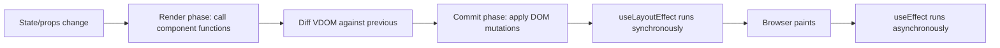
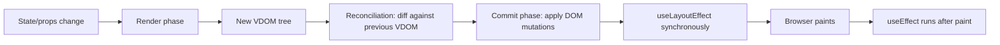
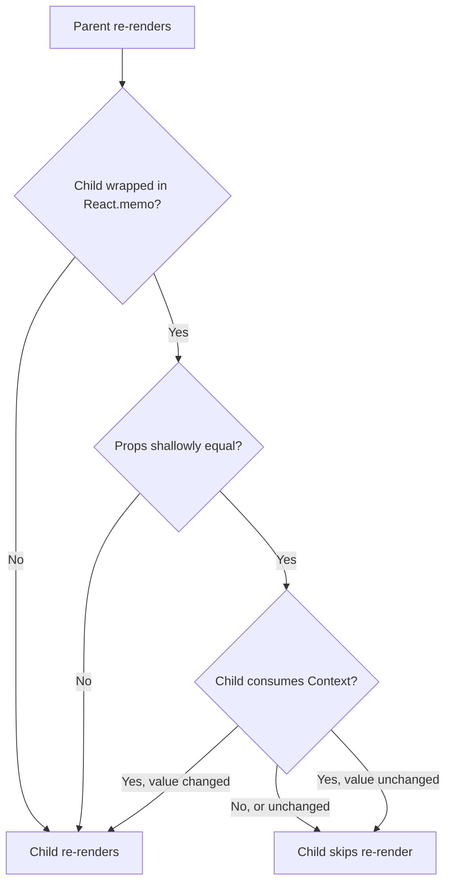
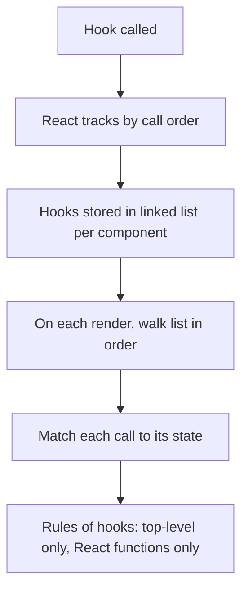

# 6.3 React Interview Questions

> React is the most-probed frontend topic in interviews. Senior interviewers care less about syntax and more about the *mental model*: the render-and-commit cycle, reconciliation, why keys matter, the rules of hooks, when effects fire, the stale closure problem, when memoization helps and when it hurts, and how the React 19 compiler changes the calculus. This note has twenty-five deep questions, five practical exercises with full solutions, and a mock interview that walks through the most common React interview failure: confusing "what triggers a re-render" with "what causes a side effect."

## 6.3.1 How To Use This Note

Read each question, then speak your answer aloud. The React round rewards clarity over breadth — a candidate who can explain *why* an effect re-runs in a particular case will beat a candidate who has memorized the API surface. The follow-up questions are where the interviewer probes depth; if you cannot answer them, return to the corresponding chapter note.

Every question has four parts: a model answer, the reasoning, common wrong answers, and follow-up questions. Do not skip the wrong-answers section — interviewers specifically listen for them.

> [!tip] This note is the longest in the vault
> React is the biggest topic. Read it in two sittings if needed. Re-read the questions on hooks, effects, and memoization the night before any interview.

## 6.3.2 Foundational Questions

### Question 1: What is React, and what problem does it solve?

**Difficulty:** Easy

**Model Answer:**

React is a declarative, component-based JavaScript library for building user interfaces. It was created at Facebook (now Meta) in 2013 to solve a specific problem: building large, stateful UIs that stay correct as state changes.

The core ideas:

1. **Declarative.** You describe what the UI should look like for a given state, and React figures out how to update the DOM to match. You do not write imperative DOM mutations (`document.querySelector`, `el.appendChild`).
2. **Component-based.** UIs are composed of nested components. Each component is a function that takes props and returns JSX. Components can be reused and composed.
3. **One-way data flow.** State lives in components and flows down via props. Changes flow up via callbacks. There is no two-way binding, which makes data flow predictable.
4. **Virtual DOM.** React maintains an in-memory representation of the UI and uses a diffing algorithm to compute the minimal set of DOM mutations needed to update the actual DOM.

React solves the problem of building complex, stateful UIs by giving you a mental model where UI is a pure function of state: `UI = f(state)`. When state changes, React re-runs `f` and reconciles the result with the DOM.

**The Reasoning:**

Before React, the dominant pattern was jQuery-style imperative DOM manipulation. Each state change required manually updating every affected DOM node, which led to bugs when state and UI got out of sync. React's declarative model eliminates the synchronization problem: you always re-render from state, and React handles the diff. The virtual DOM is the implementation detail that makes the re-render cheap enough to be practical.

**Common Wrong Answers:**

- "React is a framework." — React's own docs call it a library. The distinction matters because routing, data fetching, and state management are not built-in.
- "React uses two-way data binding." — Wrong; data flows one way. Form libraries like `react-hook-form` may *appear* to do two-way binding but they are built on one-way flow.
- "The virtual DOM is faster than the real DOM." — Wrong in general. The virtual DOM is faster than naive imperative updates but slower than hand-tuned imperative updates. Its real value is the developer experience, not raw performance.

**Follow-up Questions an Interviewer Might Ask:**

- What is the difference between a library and a framework?
- Why is React's one-way data flow valuable?
- What does "UI is a pure function of state" mean, and what are the exceptions?

---

### Question 2: What is the virtual DOM, and how does React use it?

**Difficulty:** Easy

**Model Answer:**

The virtual DOM (VDOM) is an in-memory tree of plain JavaScript objects that represents the UI at a given moment. Each React element (the result of JSX) is a plain object with a `type`, `props`, and `children`. React keeps two VDOM trees: the current one (what is on screen) and the in-progress one (what the next render produces).

When state or props change, React:

1. Calls your component functions to produce a new VDOM tree.
2. Diffs the new tree against the previous tree using the **reconciliation** algorithm.
3. Computes a list of changes (DOM mutations) needed to bring the real DOM in sync.
4. Applies those mutations in the **commit phase**.

The VDOM is not a performance optimization by itself. The performance benefit comes from batching DOM mutations and applying them together, which avoids layout thrashing. The bigger benefit is developer ergonomics: you write code as if the entire UI is rebuilt on every state change, and React figures out the minimal diff.

React 18+ uses a "concurrent" reconciler that can pause, resume, and abandon work. This lets React keep the main thread responsive during large renders, prioritize urgent updates (user input) over non-urgent ones (data fetching), and prepare new UIs offscreen before showing them.

**The Reasoning:**

The VDOM exists because direct DOM manipulation is slow due to layout thrashing — interleaved reads and writes force the browser to recalculate layout repeatedly. By computing the entire diff in memory and applying mutations in one pass, React lets the browser batch layout calculations. The diff algorithm itself is O(n) thanks to heuristic assumptions (see the next question), which is what makes it practical.

**Common Wrong Answers:**

- "The VDOM is a copy of the real DOM." — It is a JavaScript object tree, not a DOM tree. It does not have all the DOM's properties and methods.
- "React re-renders the entire DOM on every state change." — Wrong; React re-renders the VDOM, then diffs, then patches the real DOM.
- "VDOM is always faster than direct DOM manipulation." — Wrong for simple updates; a single `el.textContent = 'new'` is faster than a React render.

**Follow-up Questions an Interviewer Might Ask:**

- What is the time complexity of React's diffing algorithm?
- What is concurrent React, and how does it change the VDOM model?
- Could React work without a VDOM? (Yes — SolidJS does fine-grained reactivity without one.)

---

### Question 3: Explain React's reconciliation and diffing algorithm.

**Difficulty:** Medium

**Model Answer:**

Reconciliation is the algorithm React uses to diff two VDOM trees and decide what DOM mutations to apply. The full tree-diff problem is O(n³), which is impractical. React reduces it to O(n) using two heuristic assumptions:

1. **Different element types produce different trees.** If the type of an element changes (e.g., `<div>`  -->  `<span>`), React tears down the old tree (including its state) and builds a new one.
2. **Siblings are identified by `key`.** When diffing a list of siblings, React uses the `key` prop to match elements across renders. Without keys, React uses index, which causes subtle bugs when items are reordered or inserted.

The algorithm walks both trees in lockstep:

- If the elements have different types, React unmounts the old and mounts the new.
- If they have the same type (e.g., both `<div>`), React updates the props (DOM attributes) and recurses into children.
- For lists of children, React matches by `key` and reorders DOM nodes as needed.

This means:
- Moving an item from the end to the start of a list is cheap if keys are stable.
- Inserting an item at the start of a list with index keys causes every item to be re-rendered (because index 0 now has different props).
- Changing the type of a component unmounts it, losing its state.

**The Reasoning:**

The diff algorithm makes a tradeoff: it is not optimal (it cannot detect that a subtree moved from one part of the tree to another), but it is fast enough for practical UIs. The two heuristics are based on the observation that real UIs rarely change types or reorder siblings without an obvious identifier. By requiring the developer to provide keys for lists, React offloads the matching problem to the developer, who knows the identity of each item.

**Common Wrong Answers:**

- "React diffs the real DOM." — Wrong; it diffs VDOM trees.
- "Keys are for performance optimization." — They are also for correctness. Wrong keys cause state to bleed between items.
- "The diff algorithm is O(n log n)." — Wrong; it is O(n) thanks to the heuristics.

**Follow-up Questions an Interviewer Might Ask:**

- What happens if you use array index as a key?
- Why does changing a component's type reset its state?
- How does React Fiber change the reconciliation algorithm?

---

### Question 4: Why do lists need keys, and what makes a good key?

**Difficulty:** Medium

**Model Answer:**

Keys are how React identifies which items in a list have changed, been added, or been removed. Without keys, React uses the array index, which leads to subtle bugs when the list is mutated.

Consider this list rendered with index keys:

```tsx
['Apple', 'Banana', 'Cherry'].map((fruit, i) => <li key={i}>{fruit}</li>);
```

If you prepend `'Apricot'` to get `['Apricot', 'Apple', 'Banana', 'Cherry']`, React sees:

- Index 0: was `Apple`, now `Apricot`  -->  update text
- Index 1: was `Banana`, now `Apple`  -->  update text
- Index 2: was `Cherry`, now `Banana`  -->  update text
- Index 3: new  -->  mount

React re-renders every `<li>`, even though the only logical change is one new item. Worse, if each `<li>` contained a stateful component (e.g., an input with typed text), the state would stay attached to the index, so the input that was on `Banana` is now on `Apple` — the user's typed text appears to "move" with the index, not the item.

With stable, unique keys (e.g., `fruit.id`):

```tsx
fruits.map(fruit => <li key={fruit.id}>{fruit.name}</li>);
```

React sees:

- `id: 4` is new  -->  mount
- `id: 1`, `id: 2`, `id: 3`  -->  unchanged, just reordered

React moves the DOM nodes instead of re-rendering their content, and state stays attached to the correct item.

**A good key:**
- Is **stable** across renders (same item always has the same key).
- Is **unique** among siblings (no two items in the same list have the same key).
- Is **not the index** (unless the list is read-only and never reordered).
- Is **not a random value generated on each render** (defeats the purpose — React sees a "new" item every time).

Good sources for keys: database IDs, UUIDs, composite identifiers (`${parentId}-${childId}`). Bad sources: array index, `Math.random()`, `Date.now()`.

**The Reasoning:**

Keys are the developer's contract with React: "this is the identity of this item." Without identity, React can only reason about positions, and positions are unstable when the list mutates. With identity, React can preserve state and minimize DOM mutations.

**Common Wrong Answers:**

- "Keys must be globally unique." — They only need to be unique among siblings.
- "Using index as a key is fine if the list is static." — Mostly true, but fragile; if the list becomes dynamic later, the bug is silent.
- "Keys are only for performance." — Wrong; they also affect correctness when state is involved.

**Follow-up Questions an Interviewer Might Ask:**

- What happens if two siblings have the same key?
- When is index as a key acceptable?
- How does React handle keys with `Fragment`?

---

### Question 5: What are the rules of hooks?

**Difficulty:** Easy

**Model Answer:**

React defines two rules for hooks:

1. **Only call hooks at the top level.** Do not call hooks inside loops, conditions, or nested functions. Always use them at the top level of your component or custom hook. This ensures hooks are called in the same order on every render.

2. **Only call hooks from React functions.** Call hooks from function components or from other custom hooks. Do not call them from regular JavaScript functions, class components, or event handlers.

**Why these rules exist:** React identifies hooks by their call order. Internally, React maintains a linked list of hooks per component. On every render, it walks the list in order, matching each hook call to its state. If you call a hook conditionally, the order can change between renders, and React's match breaks — it would associate the wrong state with the wrong hook.

```tsx
// WRONG — conditional hook call
function Component({ enabled }) {
  if (enabled) {
    const [state, setState] = useState(0); // order changes based on `enabled`
  }
}

// CORRECT — hook at top level, condition inside
function Component({ enabled }) {
  const [state, setState] = useState(0);
  if (!enabled) return null;
  // ...
}
```

The `eslint-plugin-react-hooks` plugin enforces these rules at lint time. Treat its warnings as errors.

**The Reasoning:**

Hooks are identified by call order, not by name or by a stable ID. This was a deliberate design choice: it avoids the boilerplate of naming every hook, and it works because function execution is deterministic. The tradeoff is that you cannot conditionally call hooks. The ESLint plugin makes the rule enforceable.

**Common Wrong Answers:**

- "Hooks can be called anywhere." — Wrong; only at the top level and only from React functions.
- "Hooks are async." — Wrong; they are called synchronously during render.
- "You can disable the rules-of-hooks lint rule." — You can, but you should not. It will cause runtime bugs that are hard to diagnose.

**Follow-up Questions an Interviewer Might Ask:**

- Why does React identify hooks by call order rather than name?
- How does the `eslint-plugin-react-hooks` plugin work?
- Can you call a hook inside a `useCallback`?

---

### Question 6: `useState` vs `useReducer` — when do you use each?

**Difficulty:** Medium

**Model Answer:**

`useState` is for independent, simple state values: a string, a number, a boolean, a small object. You provide the initial value and a setter that replaces the value.

`useReducer` is for state with multiple sub-values that change together, or when the next state depends on complex logic. You provide a reducer function `(state, action) => newState` and an initial state. You dispatch actions instead of setting state directly.

```tsx
// useState for a counter
const [count, setCount] = useState(0);

// useReducer for a form with multiple fields
type State = { username: string; email: string; errors: Record<string, string> };
type Action =
  | { type: 'setField'; field: string; value: string }
  | { type: 'setError'; field: string; error: string }
  | { type: 'reset' };

function reducer(state: State, action: Action): State {
  switch (action.type) {
    case 'setField':
      return { ...state, [action.field]: action.value };
    case 'setError':
      return { ...state, errors: { ...state.errors, [action.field]: action.error } };
    case 'reset':
      return initialState;
    default:
      return state;
  }
}
```

**Use `useState` when:**
- The state is a single primitive or shallow object.
- Updates are independent (you can call multiple `setState`s in a row without them interfering).
- The logic for computing the next state is trivial.

**Use `useReducer` when:**
- Multiple state values change together (e.g., a form's fields and errors).
- The next state depends on the previous in complex ways (e.g., a multi-step wizard).
- You want to decouple the state logic from the component (the reducer is testable in isolation).
- You want to pass dispatch down instead of multiple setters (dispatch is stable, setters are not always).

A common pattern: start with `useState`. When you find yourself with three or more related `useState` calls, refactor to `useReducer`.

**The Reasoning:**

`useState` is the 80% case. `useReducer` shines when state transitions are complex or when multiple values are coupled. The reducer pattern also makes state changes testable: you can write unit tests for `reducer(state, action)  -->  newState` without rendering a component. The dispatch function is referentially stable, so passing it down does not cause re-renders, unlike passing multiple setters.

**Common Wrong Answers:**

- "`useReducer` is faster." — No; both have similar performance characteristics.
- "`useState` cannot handle objects." — Wrong; you just have to spread the previous state when updating.
- "You must use one or the other." — You can mix them in the same component.

**Follow-up Questions an Interviewer Might Ask:**

- How do you test a reducer?
- Can you use `useReducer` with Context?
- How do you handle async actions in a reducer?

---

### Question 7: Explain `useEffect` and the dependency array.

**Difficulty:** Medium

**Model Answer:**

`useEffect` lets you perform side effects (subscriptions, network requests, DOM manipulation, timers) in function components. It runs after the render is committed to the screen.

The signature is `useEffect(setup, dependencies?)`:
- `setup` is a function that runs the effect. It can optionally return a cleanup function.
- `dependencies` is an optional array of values. The effect only re-runs when one of them changes (compared by `Object.is`).

```tsx
useEffect(() => {
  const subscription = subscribe(id);
  return () => subscription.unsubscribe();
}, [id]);
```

**Effect timing:**
- On mount: the effect runs after the first render.
- On updates: if a dependency changed, the cleanup runs (with the previous values), then the effect runs (with the new values).
- On unmount: the cleanup runs.

**Dependency array variations:**
- `useEffect(fn)` — no array. Effect runs after *every* render. Almost never what you want.
- `useEffect(fn, [])` — empty array. Effect runs only on mount; cleanup runs only on unmount.
- `useEffect(fn, [a, b])` — runs on mount and whenever `a` or `b` changes.

**The dependency array is not a "when to skip" list — it is a claim about what the effect depends on.** If you write an effect that reads `props.userId` but omit `userId` from the array, the effect uses a stale value. The `eslint-plugin-react-hooks` plugin's `exhaustive-deps` rule catches this. Do not disable it.

**Common pitfalls:**
- **Stale closure:** reading a prop or state inside an effect without listing it as a dependency. The effect captures the value from the render when it was last run.
- **Infinite loop:** setting state inside an effect that depends on that state. The state change triggers a re-render, the effect runs again, sets state, etc.
- **Missing cleanup:** subscribing to something and not unsubscribing. The subscription accumulates across renders.

```tsx
// BUG: infinite loop
const [count, setCount] = useState(0);
useEffect(() => {
  setCount(count + 1);
}, [count]);

// FIX: use functional update, drop count from deps
useEffect(() => {
  setCount(c => c + 1);
}, []);
```

**The Reasoning:**

Effects exist because pure render functions cannot perform side effects. The dependency array is React's way of knowing when to re-run an effect without re-running it on every render (which would be wasteful and often buggy). The exhaustive-deps rule exists because omitting a dependency is almost always a bug — it means the effect silently uses stale data.

**Common Wrong Answers:**

- "`useEffect(fn, [])` is the same as `componentDidMount`." — Mostly, but the effect captures the initial values of props/state forever (stale closure). `componentDidMount` had the same issue with class fields, but the mental model is different.
- "Empty array means 'run once'." — It means "run on mount and not on updates." Cleanup still runs on unmount.
- "Disable the exhaustive-deps rule for performance." — Almost always wrong. If you need to skip a dependency, use a ref or refactor.

**Follow-up Questions an Interviewer Might Ask:**

- How do you handle async functions in `useEffect`?
- What is the difference between `useEffect` and `useLayoutEffect`?
- How would you debug an infinite loop in an effect?

---

## 6.3.3 Intermediate Questions

### Question 8: What is the stale closure problem, and how do you solve it?

**Difficulty:** Medium

**Model Answer:**

A closure is a function that captures variables from its enclosing scope. A **stale closure** is a function that captures a value that has since changed, but the function still references the old value.

In React, every render creates new closures. An effect created in render N captures the values from render N. If the effect does not re-run when those values change, it uses the stale captured value.

```tsx
function Counter() {
  const [count, setCount] = useState(0);

  useEffect(() => {
    const id = setInterval(() => {
      // BUG: `count` is captured from the first render, always 0
      setCount(count + 1);
    }, 1000);
    return () => clearInterval(id);
  }, []); // empty deps — effect never re-runs

  return <p>{count}</p>;
}
```

The counter will tick to 1 and then never increase, because `count` in the interval callback is always 0 (the value from the first render).

**Solutions:**

1. **Use the functional updater.** `setCount(c => c + 1)` reads the latest state inside the setter, bypassing the closure:
   ```tsx
   setCount(c => c + 1);
   ```

2. **Add `count` to the dependency array.** But this re-creates the interval every second, which is wasteful and can cause missed ticks.

3. **Use a ref to hold the latest value:**
   ```tsx
   const countRef = useRef(count);
   useEffect(() => { countRef.current = count; });

   useEffect(() => {
     const id = setInterval(() => {
       setCount(countRef.current + 1);
     }, 1000);
     return () => clearInterval(id);
   }, []);
   ```

4. **Use the `useEvent` pattern** (or `useEventCallback` from community libraries) for callbacks that should always see fresh values without re-creating:
   ```tsx
   function useEvent<T extends (...args: any[]) => any>(handler: T): T {
     const handlerRef = useRef(handler);
     useEffect(() => { handlerRef.current = handler; });
     return useCallback((...args: Parameters<T>) => handlerRef.current(...args), []) as T;
   }
   ```

**The Reasoning:**

Stale closures are a consequence of how hooks work: each render has its own scope, and effects capture that scope. The exhaustive-deps rule prevents most stale closures by forcing you to list dependencies. The escape hatches (functional updaters, refs) are for cases where re-running the effect is undesirable.

**Common Wrong Answers:**

- "Just remove the dependency array." — Makes the effect run every render, which is usually wrong and still might capture stale values within a single render.
- "Use `useCallback` to memoize the function." — Does not solve the staleness; it just preserves the same stale function.
- "Closures are a React bug." — No; they are a JavaScript feature. React's effects just expose them.

**Follow-up Questions an Interviewer Might Ask:**

- How would you build `useInterval` correctly?
- How does the `useEvent` proposal solve this?
- Why does `useRef` not have this problem?

---

### Question 9: When should you use `useMemo` and `useCallback`, and when should you NOT?

**Difficulty:** Medium

**Model Answer:**

`useMemo` memoizes the result of a computation, recomputing only when its dependencies change. `useCallback` memoizes a function, returning the same reference across renders unless dependencies change.

**When to use them:**

1. **Expensive computations.** If a calculation takes >1ms and its inputs rarely change, wrap it in `useMemo`. Example: sorting a large list, deriving complex state.

2. **Referential equality for props passed to memoized children.** If you pass an object, array, or function as a prop to a `React.memo`-wrapped child, the child re-renders whenever the parent re-renders — *unless* the prop is referentially stable. `useMemo` and `useCallback` provide that stability.

3. **Referential equality for dependencies of other hooks.** If you use an object as a dependency of `useEffect`, you want it to be stable:
   ```tsx
   const options = useMemo(() => ({ url, headers }), [url, headers]);
   useEffect(() => { fetchData(options); }, [options]);
   ```

**When NOT to use them:**

1. **For primitive values.** `useMemo(() => a + b, [a, b])` where `a` and `b` are numbers is slower than just `a + b`. The comparison cost exceeds the computation cost.

2. **For most event handlers.** Unless the handler is passed to a memoized child or used as a hook dependency, the cost of `useCallback` exceeds the benefit.

3. **For values that always change.** If the dependencies change on every render, memoization buys nothing.

4. **For cheap computations.** Mapping an array of 100 items is microseconds; `useMemo`'s overhead exceeds the savings.

5. **To "optimize" without measuring.** Premature memoization is a tax: every `useMemo` and `useCallback` costs memory and a dependency comparison on every render. Reach for them only when a Profiler trace shows a real problem.

**The React 19 compiler changes this calculus.** The React Compiler (formerly React Forget) automatically memoizes values and functions that need it. In a codebase with the compiler enabled, you should write code without `useMemo`/`useCallback` and let the compiler add them. Manual memoization becomes a code smell except for cases the compiler cannot handle (e.g., memoizing for external equality checks).

**The Reasoning:**

`useMemo` and `useCallback` exist because React's default behavior is to recompute everything on every render. This is fine for most UIs but breaks down for expensive computations and for memoization chains. The hooks are escape hatches, not defaults. The React Compiler automates the escape hatches, which is the long-term direction.

**Common Wrong Answers:**

- "Always wrap functions in `useCallback`." — Premature optimization; the cost often exceeds the benefit.
- "`useMemo` makes your app faster." — Only for genuinely expensive computations; otherwise it makes it slower.
- "You need `useCallback` for every event handler." — Only if the handler is passed to a memoized child or used as a hook dependency.

**Follow-up Questions an Interviewer Might Ask:**

- How does the React Profiler tell you if a memoization is helping?
- What does `React.memo` do, and how does it interact with `useCallback`?
- How does the React Compiler decide what to memoize?

---

### Question 10: What is Context, and what are its performance implications?

**Difficulty:** Medium

**Model Answer:**

Context is React's built-in mechanism for passing data through the component tree without prop drilling. A Provider holds a value; any descendant Consumer (or component using `useContext`) reads that value, no matter how deep it is.

```tsx
const ThemeContext = createContext('light');

function App() {
  const [theme, setTheme] = useState('light');
  return (
    <ThemeContext.Provider value={theme}>
      <Page />
    </ThemeContext.Provider>
  );
}

function Button() {
  const theme = useContext(ThemeContext);
  return <button className={theme}>Click</button>;
}
```

**Performance implications:**

When a Provider's `value` prop changes, every component that consumes that Context re-renders, **even if they are wrapped in `React.memo`**. Context bypasses the memo check.

This is fine for low-frequency state (theme, locale, current user). It is a problem for high-frequency state (mouse position, scroll position, rapidly updating counter) because every consumer re-renders on every change.

**Mitigations:**

1. **Split contexts.** Separate the part of the state that changes often from the part that changes rarely. Two Providers, two Contexts.

2. **Memoize the value.** If the value is an object, create it once:
   ```tsx
   const value = useMemo(() => ({ theme, setTheme }), [theme]);
   ```
   Otherwise, every render creates a new object, and every consumer re-renders.

3. **Use a state management library for high-frequency state.** Zustand, Jotai, Redux, and Valtio all use external stores that subscribe selectively, so only the components reading the changed slice re-render.

4. **Pass selectors instead of values.** Some libraries (including `use-context-selector`) let consumers subscribe to a slice of the context. Native Context does not support this.

5. **For Redux-style state, use `useSyncExternalStore`.** This is the hook that powers Redux, Zustand, and others. It subscribes to an external store and re-renders only when the selected slice changes.

**The Reasoning:**

Context is a dependency-injection mechanism, not a state manager. Its purpose is to avoid prop drilling for values that are read by many descendants and change infrequently (theme, locale, current user, router). When used for high-frequency state, the "every consumer re-renders" model breaks down. The community has converged on external stores (Zustand, Redux) for that case.

**Common Wrong Answers:**

- "Context replaces Redux." — Only for low-frequency, global state. For complex state with selectors, external stores are better.
- "Context is slow." — It is not slow per se; it just has a specific re-render model that does not fit high-frequency updates.
- "You can avoid re-renders by wrapping consumers in `React.memo`." — Wrong; Context bypasses `React.memo`.

**Follow-up Questions an Interviewer Might Ask:**

- How would you split a Context that holds both `user` and `theme`?
- How does `useSyncExternalStore` work?
- When would you choose Zustand over Context?

---

### Question 11: What is the compound component pattern?

**Difficulty:** Hard

**Model Answer:**

Compound components are a pattern where multiple components work together as a single API, with implicit state shared via Context. The user composes them in JSX:

```tsx
<Tabs defaultValue="profile">
  <TabsList>
    <TabsTrigger value="profile">Profile</TabsTrigger>
    <TabsTrigger value="settings">Settings</TabsTrigger>
  </TabsList>
  <TabsContent value="profile">Profile content</TabsContent>
  <TabsContent value="settings">Settings content</TabsContent>
</Tabs>
```

Each sub-component (`TabsList`, `TabsTrigger`, `TabsContent`) accesses the parent `Tabs`'s state via Context. The user does not pass state explicitly between them.

**Implementation:**

```tsx
type TabsContextValue = { value: string; setValue: (v: string) => void };
const TabsContext = createContext<TabsContextValue | null>(null);

function useTabs() {
  const ctx = useContext(TabsContext);
  if (!ctx) throw new Error('useTabs must be used within <Tabs>');
  return ctx;
}

function Tabs({ defaultValue, children }: { defaultValue: string; children: React.ReactNode }) {
  const [value, setValue] = useState(defaultValue);
  return (
    <TabsContext.Provider value={{ value, setValue }}>
      <div role="tablist">{children}</div>
    </TabsContext.Provider>
  );
}

function TabsTrigger({ value, children }: { value: string; children: React.ReactNode }) {
  const { value: current, setValue } = useTabs();
  const isActive = current === value;
  return (
    <button
      role="tab"
      aria-selected={isActive}
      onClick={() => setValue(value)}
      style={{ fontWeight: isActive ? 'bold' : 'normal' }}
    >
      {children}
    </button>
  );
}

function TabsContent({ value, children }: { value: string; children: React.ReactNode }) {
  const { value: current } = useTabs();
  if (current !== value) return null;
  return <div role="tabpanel">{children}</div>;
}

Tabs.Trigger = TabsTrigger;
Tabs.Content = TabsContent;
Tabs.List = TabsList;
```

**Benefits:**
- **Composability.** The user controls the layout, ordering, and styling of sub-components.
- **Implicit state.** No prop drilling; the sub-components share state via Context.
- **Readable API.** The JSX reads like the final HTML.

**Tradeoffs:**
- Sub-components must be children of the parent (enforced by the `useTabs` check).
- The parent's state is implicit, which can be surprising to users who want to control it.
- For controlled usage (user manages state), you need to expose `value` and `onChange` props.

Radix UI and shadcn/ui use compound components extensively. They are the modern standard for building flexible component APIs.

**The Reasoning:**

Compound components solve the "inversion of control" problem: the parent provides the state and the API, the sub-components consume it. Without the pattern, you would have to thread state through every prop (`<Tabs selected="profile" onChange={...} items={[...]}>`), which is rigid and verbose. The pattern gives the user compositional flexibility while keeping state centralized.

**Common Wrong Answers:**

- "Compound components are just nested components." — No; the key is the implicit shared state via Context.
- "You can implement this without Context." — You can pass props explicitly, but you lose the compositional flexibility.
- "Compound components are slow because of Context." — Only if the state changes frequently; for tab selection, it is fine.

**Follow-up Questions an Interviewer Might Ask:**

- How would you make the Tabs controlled (user manages state)?
- How would you handle keyboard navigation in Tabs?
- How does Radix UI implement this pattern?

---

### Question 12: What is the difference between controlled and uncontrolled components?

**Difficulty:** Medium

**Model Answer:**

A controlled component has its value controlled by React state. The component receives its value via props and notifies changes via callbacks. React is the single source of truth.

```tsx
function ControlledInput() {
  const [value, setValue] = useState('');
  return <input value={value} onChange={(e) => setValue(e.target.value)} />;
}
```

An uncontrolled component manages its own state internally, in the DOM. React does not track the value; you read it via a ref when needed (e.g., on submit).

```tsx
function UncontrolledInput() {
  const inputRef = useRef<HTMLInputElement>(null);
  function handleSubmit() {
    console.log(inputRef.current?.value);
  }
  return <input ref={inputRef} defaultValue="" />;
}
```

**When to use which:**

- **Controlled** when you need to validate, transform, or display the value as the user types (e.g., a search input that filters a list, a password field with a strength meter).
- **Uncontrolled** when the value is only needed on submit (e.g., a simple contact form). Less re-rendering, less code.

In practice, most form libraries (React Hook Form, Formik) default to uncontrolled (using refs) for performance, then expose controlled APIs on top for fields that need live validation.

**Key behaviors:**
- A controlled input with `value` but no `onChange` is a React warning. The user cannot type.
- `defaultValue` sets the initial value of an uncontrolled input; `value` overrides it.
- You can switch from uncontrolled to controlled by changing the prop, but React warns about it.

**The Reasoning:**

Controlled components make React the source of truth, which is consistent with the "UI is a function of state" model. Uncontrolled components delegate state to the DOM, which is faster (no re-render on each keystroke) but harder to integrate with React state. The tradeoff is performance vs. consistency. Form libraries resolve this by using uncontrolled internally and exposing controlled APIs where needed.

**Common Wrong Answers:**

- "Uncontrolled components are wrong." — They are appropriate for simple forms.
- "Controlled components are always slower." — Only for inputs that cause large re-renders; for most, the difference is negligible.
- "`defaultValue` is the same as `value`." — Wrong; `defaultValue` is the initial value of an uncontrolled input.

**Follow-up Questions an Interviewer Might Ask:**

- How does React Hook Form handle this tradeoff?
- How would you convert an uncontrolled form to controlled?
- What is the `key` reset trick for uncontrolled inputs?

---

### Question 13: What is "lifting state up," and when do you do it?

**Difficulty:** Easy

**Model Answer:**

Lifting state up means moving state from a child component to a common ancestor so that multiple children can share it. React's one-way data flow means siblings cannot directly share state; they must do so through their common parent.

```tsx
function Parent() {
  const [text, setText] = useState('');
  return (
    <>
      <Input value={text} onChange={setText} />
      <Preview text={text} />
    </>
  );
}
```

Here, `Input` and `Preview` are siblings. They cannot share `text` directly; the `Parent` holds the state and passes it down to both.

**When to lift state up:**
- When two siblings need the same state.
- When a parent needs to coordinate children's behavior.

**When NOT to lift state up too far:**
- Lifting to the root for state used by only two deeply-nested components causes every intermediate component to re-render. Use Context or a state manager instead.

**The heuristic:** lift state to the lowest common ancestor of all components that need it. If that ancestor is far from the consumers, use Context to avoid prop drilling, or a state manager to avoid re-rendering intermediates.

**The Reasoning:**

React's one-way data flow makes state ownership explicit: state lives in exactly one component, and that component is the one that needs to read or write it. If multiple components need it, you lift it to their common ancestor. This is simpler than two-way binding (which creates implicit dependencies) but requires deliberate state placement. The "lowest common ancestor" rule prevents both prop drilling (state too low) and excessive re-renders (state too high).

**Common Wrong Answers:**

- "Always lift state to the root." — Causes unnecessary re-renders.
- "Use Context to avoid lifting." — Context is a delivery mechanism, not a state location. You still lift; you just deliver via Context.
- "Siblings can share state directly." — They cannot; data flows through the parent.

**Follow-up Questions an Interviewer Might Ask:**

- How do you decide between lifting state, using Context, and using a state manager?
- What is prop drilling, and when is it actually a problem?
- How does lifting state affect performance?

---

### Question 14: What are the React rendering phases?

**Difficulty:** Medium

**Model Answer:**

React's rendering has three logical phases:

1. **Render phase.** React calls your component functions to compute the new VDOM. This phase is pure: it should not have side effects. With concurrent React, this phase can be paused, resumed, or abandoned. The component functions may be called more than once for a single commit (e.g., during a retry).

2. **Commit phase.** React applies the diff to the DOM (insertions, updates, deletions). This phase is synchronous. After the DOM is updated, React runs `useLayoutEffect` cleanup and setup, then `useEffect` setup asynchronously.

3. **Passive effects phase.** `useEffect` callbacks run after the browser has painted. This is when most side effects (network requests, subscriptions, analytics) should happen.



**Why this matters:**
- Side effects in the render phase (e.g., mutating a global, writing to a ref during render) cause bugs because the render phase can be retried or abandoned.
- `useLayoutEffect` blocks paint; use it only when you need to read DOM layout and synchronously apply changes (e.g., measuring a tooltip position before it is shown).
- `useEffect` runs after paint, so it does not block the user from seeing the update.

**Concurrent React** introduces additional nuances:
- Updates can be **interrupted** by higher-priority updates (e.g., a keystroke interrupts a large render).
- Updates can be **transitioned** with `useTransition` to mark them as non-urgent.
- `useDeferredValue` lets you defer a value's update to keep the UI responsive.

**The Reasoning:**

The phase separation exists to keep the main thread responsive. The render phase is the expensive part (calling all the component functions), and React 18's concurrent features let the browser interrupt it for user input. The commit phase is fast (DOM mutations). The passive effect phase is asynchronous so that side effects (which can be slow) do not block paint.

**Common Wrong Answers:**

- "The render phase updates the DOM." — No; the commit phase does.
- "`useLayoutEffect` is the same as `useEffect`." — No; `useLayoutEffect` is synchronous and blocks paint.
- "Side effects in the render phase are fine." — They are not; they cause bugs with concurrent React.

**Follow-up Questions an Interviewer Might Ask:**

- What is the difference between `useEffect` and `useLayoutEffect`?
- When should you use `useTransition`?
- What does it mean for the render phase to be "pure"?

---

### Question 15: What triggers a re-render in React?

**Difficulty:** Medium

**Model Answer:**

A component re-renders when:

1. **Its state changes.** Calling `setState` (from `useState` or `useReducer`) with a value that is not equal (by `Object.is`) to the current state. Note: calling `setState` with the same value *bails out* early — React skips the re-render. But calling `setState` with a new object that happens to have the same contents (e.g., `{...state}`) does trigger a re-render, because `Object.is` compares by reference.

2. **Its parent re-renders.** By default, when a parent re-renders, all its children re-render, regardless of whether their props changed. To prevent this, wrap the child in `React.memo`. The memoized child only re-renders if its props are not shallowly equal.

3. **A Context it consumes changes.** When a Provider's value changes (by `Object.is`), every consumer re-renders, bypassing `React.memo`.

4. **`forceUpdate` (class components) or `useSyncExternalStore` (function components) triggers it.** External stores (Zustand, Redux) use `useSyncExternalStore`, which subscribes to the store and re-renders when the selected slice changes.

What does NOT trigger a re-render:
- Mutating a ref (`ref.current = ...`). Refs are not reactive.
- Mutating state directly (`state.x = 2` without `setState`). React does not see the change.
- Calling a `setState` with the same primitive value. React bails out.

**Common gotchas:**
- Creating a new object/array as a prop on every render causes memoized children to re-render. Use `useMemo` to stabilize the reference.
- Calling `setState` inside an effect with a value derived from props often causes a double render. Compute the value during render instead.
- `React.memo` does a shallow comparison of props. Nested objects and arrays are compared by reference, not by contents.

**The Reasoning:**

React's re-render model is based on referential equality for state and Context, and shallow equality for `React.memo`'d props. This is fast but requires the developer to stabilize references when needed. The React Compiler automates this stabilization, which is why it changes the memoization calculus.

**Common Wrong Answers:**

- "Mutating state triggers a re-render." — No; React does not see mutations. Use `setState` with a new object.
- "Calling `setState` with the same value triggers a re-render." — No; React bails out for primitive equal values. For objects, the new reference does trigger.
- "`React.memo` prevents all re-renders." — Only if props are shallowly equal. Context bypasses it.

**Follow-up Questions an Interviewer Might Ask:**

- How would you prevent a child from re-rendering when its parent does?
- What is the difference between `useState` and `useRef` for triggering re-renders?
- How does the React Compiler change this?

---

### Question 16: What are render props and higher-order components (HOCs), and are they still relevant?

**Difficulty:** Medium

**Model Answer:**

**Render props** is a pattern where a component takes a function as a prop (commonly called `render` or as a child function) and calls it to determine what to render. The function receives data from the component.

```tsx
<MouseTracker render={(position) => <Cursor {...position} />} />

// Or as a child function
<MouseTracker>
  {(position) => <Cursor {...position} />}
</MouseTracker>
```

**Higher-order components (HOCs)** are functions that take a component and return a new component with additional behavior.

```tsx
function withAuth(Component) {
  return function Authenticated(props) {
    if (!useAuth()) return <Login />;
    return <Component {...props} />;
  };
}

const ProtectedPage = withAuth(Page);
```

**Are they still relevant?**

Both patterns have been largely superseded by **hooks**. The migration was:
- Render props  -->  custom hooks. `useMousePosition()` replaces `<MouseTracker render={...} />`.
- HOCs  -->  custom hooks. `useAuth()` replaces `withAuth(Component)`.

Hooks are simpler because:
- They do not create wrapper components (no extra DOM nodes, no display-name issues).
- They compose naturally (you can call multiple hooks; HOCs require nesting).
- They do not have the prop-collision problems HOCs have.

**When HOCs and render props are still useful:**
- HOCs for non-React concerns (e.g., `withLogging(Component)` that wraps the component for analytics).
- Render props for components whose primary purpose is to render different things based on internal state (e.g., `<Tabs>` letting the user render custom triggers).
- Forwarding refs and other low-level concerns.

In modern React, prefer hooks. Use HOCs/render props only when they solve a problem hooks cannot.

**The Reasoning:**

Render props and HOCs were the pre-hooks solutions to logic reuse. Both work but have ergonomic problems: HOCs create deep component trees, hide prop sources, and have display-name issues. Render props lead to "callback hell" in JSX. Hooks solve the same problem (logic reuse) without these costs. The React team officially recommends hooks for new code.

**Common Wrong Answers:**

- "HOCs are deprecated." — They are not; they are just less idiomatic.
- "Render props are always wrong." — They have legitimate uses, especially for compound components.
- "Hooks replaced HOCs entirely." — Mostly, but HOCs survive in some libraries (e.g., Next.js's `withRouter` in the Pages Router, though the App Router uses hooks).

**Follow-up Questions an Interviewer Might Ask:**

- How would you migrate an HOC to a hook?
- When would you still use a render prop?
- What is the difference between a render prop and a component as a child?

---

### Question 17: What is an error boundary, and how do you use it?

**Difficulty:** Medium

**Model Answer:**

An error boundary is a React component that catches JavaScript errors anywhere in its child component tree, logs them, and displays a fallback UI. Without an error boundary, an uncaught error in render causes the entire app to unmount.

Error boundaries are **class components** (function components cannot be error boundaries yet) that implement either or both of:
- `static getDerivedStateFromError(error)` — update state to render a fallback.
- `componentDidCatch(error, info)` — log the error to a service.

```tsx
class ErrorBoundary extends React.Component<
  { children: React.ReactNode; fallback: React.ReactNode },
  { hasError: boolean }
> {
  state = { hasError: false };

  static getDerivedStateFromError() {
    return { hasError: true };
  }

  componentDidCatch(error: Error, info: React.ErrorInfo) {
    console.error(error, info);
    // logErrorToService(error, info);
  }

  render() {
    if (this.state.hasError) return this.props.fallback;
    return this.props.children;
  }
}
```

Usage:

```tsx
<ErrorBoundary fallback={<p>Something went wrong.</p>}>
  <RiskyComponent />
</ErrorBoundary>
```

**What error boundaries do NOT catch:**
- Errors in event handlers (use try/catch).
- Errors in async code (setTimeout, promises) — use try/catch or `.catch()`.
- Errors in server-side rendering.
- Errors thrown in the error boundary itself.

**Best practices:**
- Use multiple, granular boundaries. One at the app root is a minimum; finer-grained boundaries around widgets (a chart, a chat panel) isolate failures.
- Reset the boundary by changing its `key` prop, which forces a remount.
- For Next.js App Router, use `error.tsx` files which are route-level error boundaries.

**The Reasoning:**

Error boundaries exist because uncaught errors in React 16+ unmount the entire tree — a deliberate design choice to avoid leaving the UI in an inconsistent state. Boundaries let you recover gracefully, showing a fallback for the broken subtree while keeping the rest of the app functional. The class component requirement is a limitation that may be lifted in future React versions.

**Common Wrong Answers:**

- "Error boundaries catch all errors." — They only catch errors in the render and lifecycle phases of their children.
- "You can write an error boundary as a function component." — Not yet; only class components work.
- "Try/catch in components does the same thing." — Try/catch in render is not a substitute; the boundary catches errors from deeply nested children.

**Follow-up Questions an Interviewer Might Ask:**

- How do you reset an error boundary?
- How do you handle errors in event handlers?
- How does Next.js's `error.tsx` work?

---

### Question 18: What is Suspense, and how does it work?

**Difficulty:** Medium

**Model Answer:**

Suspense is a React component that lets you display a fallback while a child is "waiting" for something — typically data fetching or lazy-loaded code. The child "suspends" by throwing a promise (or having a Suspense-enabled data source throw one), and the nearest Suspense boundary catches it and shows the fallback.

```tsx
<Suspense fallback={<Spinner />}>
  <LazyComponent />
</Suspense>
```

**Suspense for code splitting:**

```tsx
const OtherComponent = React.lazy(() => import('./OtherComponent'));

<Suspense fallback={<Spinner />}>
  <OtherComponent />
</Suspense>
```

`React.lazy` returns a component that, on first render, throws a promise. The Suspense boundary catches the promise, shows the fallback, and retries when the promise resolves.

**Suspense for data fetching:**

React 19 includes native Suspense support for promises. A component can read a promise and suspend until it resolves:

```tsx
// React 19
import { use } from 'react';

function UserProfile({ userPromise }: { userPromise: Promise<User> }) {
  const user = use(userPromise);  // suspends until resolved
  return <h1>{user.name}</h1>;
}

// Parent
<Suspense fallback={<Spinner />}>
  <UserProfile userPromise={fetchUser()} />
</Suspense>
```

Frameworks like Next.js use this for server components: the server can pass a promise to a client component, which suspends until the data is ready.

**How it works internally:**

1. A child throws a promise (or React detects a pending resource).
2. The nearest Suspense boundary catches the thrown promise.
3. Suspense renders the fallback.
4. When the promise resolves, React re-renders the child.

**Streaming SSR:** On the server, Suspense lets React stream HTML as it becomes available. The initial HTML includes the fallback, and the resolved content is streamed in later via a script tag that swaps the fallback for the real content. This is the foundation of Next.js App Router's streaming.

**The Reasoning:**

Suspense unifies the loading-state pattern. Before Suspense, every async thing had its own loading state (`if (loading) return <Spinner />`); with Suspense, the loading state is declarative and composable. The "throw a promise" mechanism is unusual but elegant: it lets any component opt into suspense without changing its API.

**Common Wrong Answers:**

- "Suspense fetches data for you." — No; you still need a data-fetching library (or `use()` with a promise). Suspense just shows the fallback while waiting.
- "Suspense is only for code splitting." — No; React 19 supports Suspense for promises, and frameworks use it for data.
- "You can use Suspense without React.lazy or a Suspense-enabled source." — Without something that throws a promise, Suspense never activates.

**Follow-up Questions an Interviewer Might Ask:**

- How does Suspense interact with error boundaries?
- How does streaming SSR work with Suspense?
- What is `use()` and how does it differ from `useEffect` for data?

---

## 6.3.4 Advanced Questions

### Question 19: How does the React 19 compiler change memoization?

**Difficulty:** Hard

**Model Answer:**

The React Compiler (formerly React Forget) is a Babel plugin that automatically memoizes values and functions during compilation. It analyzes your component and inserts `useMemo` and `useCallback` calls where they are needed for correctness (preserving referential equality for props and hook dependencies).

Before the compiler, you had to manually memoize:

```tsx
function Component({ items, filter }) {
  const filtered = useMemo(() => items.filter(filter), [items, filter]);
  const handleClick = useCallback(() => { /* ... */ }, []);
  return <List items={filtered} onClick={handleClick} />;
}
```

With the compiler, you write plain code:

```tsx
function Component({ items, filter }) {
  const filtered = items.filter(filter);
  const handleClick = () => { /* ... */ };
  return <List items={filtered} onClick={handleClick} />;
}
```

The compiler analyzes which values are derived from which inputs and inserts the appropriate memoization. The generated code is equivalent to the manual version.

**What this changes:**

1. **`useMemo` and `useCallback` become rare.** You write them only for cases the compiler cannot handle: external equality checks (passing a stable reference to a non-React library), expensive computations whose cost the compiler cannot estimate, and manual cache invalidation.

2. **`React.memo` is less necessary.** The compiler ensures props are referentially stable when their inputs do not change, so children do not re-render unnecessarily even without `React.memo`.

3. **Mental model simplifies.** You no longer think "should I memoize this?" — the compiler does it. You think about correctness and readability.

4. **Existing manual memoization is preserved.** The compiler does not remove your `useMemo` calls; it adds to them where needed.

**Limitations:**
- The compiler requires your components to follow the Rules of React (purity, no side effects in render). If you violate them, the compiler may produce incorrect results.
- Adoption is gradual — you can enable it per-folder.
- It does not optimize everything; it optimizes for referential equality, not for algorithmic complexity.

**The Reasoning:**

The compiler exists because manual memoization is a tax on developer ergonomics. The Rules of Hooks forced developers to think about memoization constantly, which was friction. The compiler automates it, letting developers write straightforward code while preserving performance. This is the biggest shift in React's programming model since hooks.

**Common Wrong Answers:**

- "The compiler makes React as fast as SolidJS." — No; SolidJS uses fine-grained reactivity (signals), which is fundamentally different from React's VDOM diffing. The compiler reduces unnecessary re-renders but does not eliminate the diffing cost.
- "You can disable the Rules of Hooks with the compiler." — No; the compiler requires you to follow the rules.
- "The compiler replaces `useEffect`." — No; it memoizes values and functions, not side effects.

**Follow-up Questions an Interviewer Might Ask:**

- What are the Rules of React that the compiler enforces?
- How would you migrate a codebase to the compiler?
- What does the compiler output look like?

---

### Question 20: What is the `use()` hook, and how does it differ from other hooks?

**Difficulty:** Hard

**Model Answer:**

`use()` is a React 19 hook that reads a resource — a promise or a context — and "suspends" if the resource is not ready. Unlike other hooks, `use()` can be called conditionally (inside `if` statements, inside loops) because it does not need to be called in a consistent order.

```tsx
import { use } from 'react';

function UserProfile({ userPromise }: { userPromise: Promise<User> }) {
  const user = use(userPromise);  // suspends if not resolved
  return <h1>{user.name}</h1>;
}
```

If `userPromise` is not yet resolved, `use` throws the promise, and the nearest Suspense boundary shows its fallback. When the promise resolves, the component re-renders with the value.

For Context:

```tsx
const theme = use(ThemeContext);
// equivalent to useContext(ThemeContext), but can be called conditionally
```

**Key differences from other hooks:**

1. **`use()` can be called conditionally.** Other hooks cannot, because React identifies them by call order. `use()` does not need a stable call order because it is essentially "unwrap this resource" — there is no state to remember.

2. **`use()` works with promises.** Other hooks do not. `use()` is the bridge between async resources and the React render model.

3. **`use()` integrates with Suspense.** Other hooks do not suspend.

4. **`use()` for Context is a strict superset of `useContext`.** You can call it inside conditionals and early returns, which you cannot do with `useContext`.

**Limitations:**
- The promise passed to `use()` should be created outside the render function (or memoized), otherwise a new promise is created on every render and never resolves. The pattern is to create the promise in a parent component or in a server component.
- `use()` does not have a way to handle errors; you need an error boundary around the Suspense.
- `use()` for promises works in client components only if the promise is created outside the render (or memoized). In server components, you can create the promise inline.

**The Reasoning:**

`use()` unifies two previously separate concerns: reading context and reading async resources. It also fixes a long-standing complaint about hooks — that they cannot be called conditionally. The escape hatch is that `use()` does not need to track state across renders (it just unwraps a resource), so the call-order rule does not apply.

**Common Wrong Answers:**

- "`use()` replaces `useContext`." — It supersedes it for new code, but `useContext` still works.
- "`use()` makes async code in components easy." — The promise lifecycle is still your responsibility; `use()` just unwraps it.
- "You can use `use()` to read any async value." — Only promises and contexts, not observables or callbacks.

**Follow-up Questions an Interviewer Might Ask:**

- How does `use()` differ from `await`?
- Can you call `use()` inside a `useEffect`?
- How does `use()` work with React Server Components?

---

### Question 21: What are React Server Components, and how do they differ from client components?

**Difficulty:** Hard

**Model Answer:**

React Server Components (RSC) are components that render only on the server and never ship their code to the client. Their output is a serialized React tree that the client hydrates.

**Key properties:**

- **No JavaScript shipped.** The component's code (and its imports) stays on the server. Only the rendered output is sent.
- **Direct access to server resources.** RSCs can read from databases, files, environment variables, and call server-only APIs directly.
- **No state, no effects.** RSCs are stateless. They cannot use `useState`, `useEffect`, or any hook that depends on client-side reactivity. They can use `use()` to await promises.
- **No event handlers.** RSCs cannot attach `onClick`, `onChange`, etc., because those require client-side JavaScript.
- **Can import client components.** An RSC can render a client component, passing serializable props (strings, numbers, arrays, objects, but not functions or class instances).

Client components are the components you are used to: they ship to the browser, can use hooks, can attach event handlers. You opt into client components with the `'use client'` directive at the top of the file.

```tsx
// app/page.tsx (server component by default)
import { db } from '@/lib/db';
import { Button } from './Button';

export default async function Page() {
  const users = await db.user.findMany();  // direct database access
  return (
    <ul>
      {users.map(u => <li key={u.id}>{u.name} <Button onClick={...}>Edit</Button></li>)}
    </ul>
  );
}
```

```tsx
// app/Button.tsx
'use client';
import { useState } from 'react';

export function Button({ onClick, children }) {
  const [clicked, setClicked] = useState(false);
  return <button onClick={() => { setClicked(true); onClick(); }}>{children}</button>;
}
```

**The boundary:** The `'use client'` directive marks a file as a client component. Once you cross into a client component, all its descendants are client components too (unless explicitly made server components, which is uncommon). The boundary is at the file level, not the component level.

**Why this matters:**
- **Smaller bundles.** Server-only code (database clients, markdown parsers, large utility libraries) does not ship to the browser.
- **Direct data access.** No need for an API layer for read-only data; the server component reads the database directly.
- **Security.** Secrets stay on the server; no risk of leaking through the bundle.
- **SEO.** Server components render HTML on the server.

**The Reasoning:**

RSCs split the React rendering model: some components render on the server (where they have direct access to data and do not need to ship code), and some render on the client (where they handle interactivity). This is a fundamental shift from "everything is a client component" and is the foundation of Next.js's App Router. The tradeoff is complexity: the developer must understand the boundary and the constraints on each side.

**Common Wrong Answers:**

- "Server components are SSR." — No; SSR renders client components to HTML on the server. RSCs are a different model where the component code never ships to the client.
- "You cannot use any hooks in server components." — You can use `use()` to await promises, but not state or effect hooks.
- "Server components are slower because they require a server round-trip." — They reduce the client bundle, which is usually a net win.

**Follow-up Questions an Interviewer Might Ask:**

- How does the `'use client'` directive work?
- Can a server component import a client component?
- How does data fetching differ between server and client components?

---

### Question 22: How do you split code in a React application?

**Difficulty:** Medium

**Model Answer:**

Code splitting means shipping less JavaScript initially and loading more on demand. The tools:

1. **`React.lazy` + `Suspense`.** Lazy-load a component on first render:

   ```tsx
   const Settings = React.lazy(() => import('./Settings'));

   <Suspense fallback={<Spinner />}>
     <Settings />
   </Suspense>
   ```

   The `import()` returns a promise; `React.lazy` wraps it in a component that suspends until the chunk loads.

2. **Route-based splitting.** In Next.js's App Router, each route is a separate chunk by default. In the Pages Router, `next/dynamic` does the same. In React Router, `React.lazy` per route is the standard pattern.

3. **Conditional splitting.** Load a heavy component only when needed (e.g., a chart library when the user opens the analytics tab).

4. **Below-the-fold splitting.** Split large below-the-fold sections so the initial bundle is smaller.

5. **Component-level splitting.** Heavy components (rich text editors, chart libraries, 3D viewers) are good candidates for `React.lazy`.

**Best practices:**
- Preload chunks on hover or on focus for perceived performance.
- Use a fallback that approximates the loaded content's size to avoid layout shift.
- Avoid splitting too aggressively — each chunk has HTTP overhead.
- Measure with the Coverage tab in Chrome DevTools to find unused code.

**In Next.js App Router**, route-level splitting is automatic. Server components are not shipped at all (they only render server-side). Client components are split by route. Additional `React.lazy` is rarely needed inside the App Router.

**The Reasoning:**

Code splitting exists because JavaScript bundles grow with the app, and shipping megabytes of JS on first load kills performance (especially on mobile). The principle is: ship the minimum needed for first paint, load the rest on demand. Route-based splitting is the highest-leverage starting point; component-level splitting is for heavy widgets.

**Common Wrong Answers:**

- "Code splitting makes the app faster." — It makes first load faster but adds latency for subsequent loads. Measure.
- "You should split every component." — Each chunk has HTTP and parsing overhead. Split where it matters.
- "Tree shaking is the same as code splitting." — No; tree shaking removes unused exports at build time, while code splitting creates multiple chunks loaded on demand.

**Follow-up Questions an Interviewer Might Ask:**

- How would you preload a lazy component on hover?
- How do you handle Suspense fallbacks to avoid layout shift?
- How does code splitting interact with SSR?

---

### Question 23: What is `useSyncExternalStore`, and when would you use it?

**Difficulty:** Hard

**Model Answer:**

`useSyncExternalStore` is a React hook for subscribing to external stores — data sources outside React's state system. It is the hook that powers Redux, Zustand, Jotai, Valtio, and most state management libraries.

```tsx
function useStore<T>(
  subscribe: (onStoreChange: () => void) => () => void,
  getSnapshot: () => T,
  getServerSnapshot?: () => T,
): T;
```

Usage:

```tsx
function useOnlineStatus() {
  return useSyncExternalStore(
    (callback) => {
      window.addEventListener('online', callback);
      window.addEventListener('offline', callback);
      return () => {
        window.removeEventListener('online', callback);
        window.removeEventListener('offline', callback);
      };
    },
    () => navigator.onLine,
    () => true,  // SSR snapshot
  );
}
```

**Why it exists:**

Before `useSyncExternalStore`, libraries used `useState` + `useEffect` to subscribe to external stores. This had two problems:

1. **Tearing.** In concurrent React, a render could be interrupted. If the store changed during the interruption, the rendered UI could show inconsistent values (some parts from before the change, some from after). `useSyncExternalStore` detects this and re-renders synchronously.

2. **SSR.** Reading `navigator.onLine` during SSR crashes (no `navigator`). The `getServerSnapshot` parameter solves this by providing a server-side value.

**When to use it:**

- Building a state management library (just use Zustand or Redux instead).
- Subscribing to browser APIs (`navigator.onLine`, `window.matchMedia`, `IntersectionObserver`).
- Subscribing to non-React data sources (a WebSocket, a Redux store).

For most application code, you do not need `useSyncExternalStore` directly — use a library that wraps it. But knowing it exists helps you understand how those libraries work.

**The Reasoning:**

Concurrent React broke the assumption that a render is atomic — it can be paused and resumed, which means the store can change mid-render. `useSyncExternalStore` is React's answer: it gives libraries a way to subscribe that is compatible with concurrent rendering, preventing the tearing bug.

**Common Wrong Answers:**

- "`useSyncExternalStore` is for global state." — It is for *external* state, not React state. Use `useState`/`useReducer`/Context for React state.
- "You should use it instead of Context." — Wrong; Context is for dependency injection. `useSyncExternalStore` is for non-React data sources.
- "It is async." — No; it returns a snapshot synchronously. The subscription is what is async.

**Follow-up Questions an Interviewer Might Ask:**

- How does Zustand use `useSyncExternalStore`?
- What is the tearing problem?
- How does it work with SSR?

---

### Question 24: What is `useTransition`, and when would you use it?

**Difficulty:** Hard

**Model Answer:**

`useTransition` lets you mark a state update as non-urgent. React will keep the current UI responsive while computing the new state in the background, then swap to the new UI when ready.

```tsx
const [isPending, startTransition] = useTransition();

function handleSearch(query) {
  setQuery(query);  // urgent: update the input
  startTransition(() => {
    setResults(filterLargeList(query));  // non-urgent: update the results
  });
}
```

**What it does:**
- Updates inside `startTransition` are marked as transitions. React can interrupt them to handle urgent updates (keystrokes, clicks).
- The UI stays interactive during the transition. The user can keep typing; React will abandon the in-progress transition and start a new one with the latest input.
- `isPending` is true while the transition is in progress. You can use it to show a subtle loading indicator (e.g., dimming the results area).

**Use cases:**
- Filtering/searching a large list. The input updates immediately (urgent); the filtered list updates as a transition.
- Tab switching. The active tab indicator updates immediately; the new tab's content renders as a transition.
- Navigating in a SPA. The URL updates immediately; the new page renders as a transition (Next.js App Router uses this for route transitions).

**Compared to `useDeferredValue`:** `useDeferredValue` is the dual. With `useTransition`, you wrap the setter call. With `useDeferredValue`, you wrap the value being read:

```tsx
const deferredQuery = useDeferredValue(query);
const results = useMemo(() => filterLargeList(deferredQuery), [deferredQuery]);
```

Use `useTransition` when you control the update (you are calling the setter). Use `useDeferredValue` when you receive a value from props and cannot control the setter.

**Limitations:**
- Transitions must be CPU-bound (rendering work), not I/O-bound (network requests). For async work, use Suspense.
- The transition's content cannot depend on external state that changed during the transition (it would tear).
- Not all updates are safe to defer — interactive feedback (a button press) should be urgent.

**The Reasoning:**

Before concurrent React, all updates were equally urgent, which meant a large re-render could block the main thread and make the UI feel janky. `useTransition` lets the developer prioritize: "this update can wait; keep the user's input responsive." It is the user-facing API of concurrent React.

**Common Wrong Answers:**

- "`useTransition` makes async code faster." — It does not; it makes render work interruptible.
- "Use `useTransition` for network requests." — No; for async work, use Suspense.
- "`useTransition` and `useDeferredValue` are interchangeable." — They are duals; use the one that fits your control of the update.

**Follow-up Questions an Interviewer Might Ask:**

- How does Next.js App Router use `useTransition`?
- What is the difference between `useTransition` and `useDeferredValue`?
- When should you NOT use `useTransition`?

---

### Question 25: How do you debug a React component that re-renders too much?

**Difficulty:** Hard

**Model Answer:**

A systematic approach:

1. **Confirm the problem.** Use the React DevTools Profiler to record a session. Look for components that render more often than expected, or that render for longer than expected.

2. **Find the cause.** For each unwanted re-render, ask: did state change? Did a parent re-render? Did a Context value change?

   - **State change:** Look at the component's `useState` and `useReducer` calls. Are you creating new objects/arrays on every render? `setState({...state})` triggers a re-render even if the contents are the same.
   - **Parent re-render:** Walk up the tree. Is the parent re-rendering unnecessarily? Same questions apply recursively.
   - **Context change:** Is the component consuming a Context whose Provider's value is changing? Check that the Provider's value is memoized.

3. **Apply the fix:**
   - For new-object props: memoize with `useMemo` or `useCallback` (or let the React Compiler do it).
   - For parent re-renders: wrap the child in `React.memo`. Ensure the props passed to it are referentially stable.
   - For Context: memoize the Provider's value with `useMemo`. Consider splitting the Context if some consumers do not need all the values.
   - For expensive renders: split the component so the expensive part is isolated and memoized.

4. **Verify.** Re-record the Profiler. The component should render less often or take less time.

5. **Consider not fixing it.** Many re-renders are fine. React is fast. Only optimize when the Profiler shows a real problem (e.g., >16ms render time, or janky user experience).

**Common pitfalls:**
- **Inline object/array props.** `<Child config={{ a: 1 }} />` creates a new object every render. Memoize or hoist.
- **Inline function props.** `<Child onClick={() => ...} />` creates a new function every render. Use `useCallback` or extract.
- **Context value not memoized.** `<Provider value={{ a, b }}>` creates a new object every render.
- **`useState` with new object.** `setState({...state, x: 1})` when `x` did not change still triggers a re-render (new reference).

**Tools:**
- **React DevTools Profiler.** Records renders, shows what triggered them, and the time taken.
- **`<Profiler>` component.** Wrap a subtree to get programmatic callbacks.
- **`why-did-you-render` library.** Logs why a component re-rendered. Useful in dev.
- **Chrome DevTools Performance tab.** For overall page performance, not just React.

**The Reasoning:**

React's default behavior is to re-render liberally, which is correct but can be wasteful. The Profiler tells you where the waste is; the fix is usually referential stability (memoization) or scoping (split components). The React Compiler automates most of this, but understanding the manual process is still valuable for debugging.

**Common Wrong Answers:**

- "Wrap everything in `React.memo`." — Causes more harm than good; `React.memo` has a comparison cost.
- "Use `useMemo` for everything." — Same; `useMemo` has overhead.
- "Re-renders are always bad." — No; React is fast. Optimize when there is a real problem.

**Follow-up Questions an Interviewer Might Ask:**

- How does the React Profiler work?
- What is the difference between `React.memo` and `useMemo`?
- How would you profile a Next.js app?

---

## 6.3.5 Practical Coding Exercises

### Exercise 1: Build a `useDebounce` custom hook

```tsx
import { useEffect, useState } from 'react';

export function useDebounce<T>(value: T, delay: number): T {
  const [debounced, setDebounced] = useState(value);

  useEffect(() => {
    const id = setTimeout(() => setDebounced(value), delay);
    return () => clearTimeout(id);
  }, [value, delay]);

  return debounced;
}
```

**Reasoning:** The effect re-runs whenever `value` or `delay` changes. Each run sets a new timeout. The cleanup clears the previous timeout, so only the last call's timeout fires. This is the canonical debounce pattern.

**Pitfalls:**
- Returning `value` instead of `debounced` — defeats the purpose.
- Forgetting the cleanup — multiple timeouts fire.
- Using `setTimeout` without storing the ID — cannot clean up.

**Extension:** Add a `flush()` method to immediately set the latest value, and a `cancel()` method to clear the timer.

---

### Exercise 2: Build a controlled form with validation

```tsx
'use client';
import { useState } from 'react';

type Errors = { email?: string; password?: string };

export function SignupForm() {
  const [email, setEmail] = useState('');
  const [password, setPassword] = useState('');
  const [errors, setErrors] = useState<Errors>({});

  function validate(): boolean {
    const next: Errors = {};
    if (!email.match(/^[^\s@]+@[^\s@]+\.[^\s@]+$/)) next.email = 'Invalid email.';
    if (password.length < 8) next.password = 'Must be at least 8 characters.';
    setErrors(next);
    return Object.keys(next).length === 0;
  }

  function onSubmit(e: React.FormEvent) {
    e.preventDefault();
    if (validate()) {
      // Submit...
    }
  }

  return (
    <form onSubmit={onSubmit} noValidate>
      <div>
        <label htmlFor="email">Email</label>
        <input
          id="email"
          type="email"
          value={email}
          onChange={(e) => setEmail(e.target.value)}
          aria-invalid={!!errors.email}
          aria-describedby={errors.email ? 'email-error' : undefined}
        />
        {errors.email && <p id="email-error" role="alert">{errors.email}</p>}
      </div>
      <div>
        <label htmlFor="password">Password</label>
        <input
          id="password"
          type="password"
          value={password}
          onChange={(e) => setPassword(e.target.value)}
          aria-invalid={!!errors.password}
          aria-describedby={errors.password ? 'password-error' : undefined}
        />
        {errors.password && <p id="password-error" role="alert">{errors.password}</p>}
      </div>
      <button type="submit">Sign up</button>
    </form>
  );
}
```

**Reasoning:** Controlled inputs (value + onChange). Validation runs on submit; errors are stored in state and rendered next to each field. `aria-invalid` and `aria-describedby` make the errors accessible to screen readers. `noValidate` disables the browser's built-in validation so we control it.

**Pitfalls:**
- Forgetting `noValidate` — browser validation interferes.
- Missing `aria-invalid` and `aria-describedby` — screen readers do not announce errors.
- Validating on every keystroke — usually too aggressive; validate on blur or submit.

**Extension:** Add real-time validation on blur, password strength meter, and async email availability check.

---

### Exercise 3: Build a `useFetch` hook with AbortController

```tsx
import { useEffect, useState } from 'react';

type State<T> =
  | { status: 'idle' }
  | { status: 'loading' }
  | { status: 'success'; data: T }
  | { status: 'error'; error: Error };

export function useFetch<T>(url: string | null): State<T> {
  const [state, setState] = useState<State<T>>({ status: 'idle' });

  useEffect(() => {
    if (!url) {
      setState({ status: 'idle' });
      return;
    }

    const controller = new AbortController();
    setState({ status: 'loading' });

    (async () => {
      try {
        const res = await fetch(url, { signal: controller.signal });
        if (!res.ok) throw new Error(`HTTP ${res.status}`);
        const data = await res.json();
        setState({ status: 'success', data });
      } catch (err) {
        if (err instanceof DOMException && err.name === 'AbortError') return;
        setState({ status: 'error', error: err as Error });
      }
    })();

    return () => controller.abort();
  }, [url]);

  return state;
}
```

**Reasoning:** The hook subscribes to `url`. When it changes, the previous request is aborted (via the cleanup function) and a new one starts. The state machine (`idle`/`loading`/`success`/`error`) makes the consumer's logic explicit. Aborted requests do not set error state — they are expected when the URL changes.

**Pitfalls:**
- Not aborting the previous request — the user can see stale data arrive after a newer request.
- Setting state after unmount — the abort in cleanup prevents this (the promise rejects with AbortError, which we ignore).
- Not handling the `null` URL case.

**Extension:** Add retry, deduplication, and integration with Suspense (throw the promise instead of returning loading state).

---

### Exercise 4: Build a Tabs compound component

```tsx
import { createContext, useContext, useState, type ReactNode } from 'react';

type TabsContextValue = {
  value: string;
  setValue: (v: string) => void;
};
const TabsContext = createContext<TabsContextValue | null>(null);

function useTabs() {
  const ctx = useContext(TabsContext);
  if (!ctx) throw new Error('Tabs sub-components must be used within <Tabs>');
  return ctx;
}

export function Tabs({
  defaultValue,
  children,
  className,
}: {
  defaultValue: string;
  children: ReactNode;
  className?: string;
}) {
  const [value, setValue] = useState(defaultValue);
  return (
    <TabsContext.Provider value={{ value, setValue }}>
      <div className={className}>{children}</div>
    </TabsContext.Provider>
  );
}

export function TabsList({ children, className }: { children: ReactNode; className?: string }) {
  return <div role="tablist" className={className}>{children}</div>;
}

export function TabsTrigger({
  value,
  children,
  className,
}: {
  value: string;
  children: ReactNode;
  className?: string;
}) {
  const { value: current, setValue } = useTabs();
  const isActive = current === value;
  return (
    <button
      role="tab"
      aria-selected={isActive}
      tabIndex={isActive ? 0 : -1}
      onClick={() => setValue(value)}
      className={className}
    >
      {children}
    </button>
  );
}

export function TabsContent({
  value,
  children,
  className,
}: {
  value: string;
  children: ReactNode;
  className?: string;
}) {
  const { value: current } = useTabs();
  if (current !== value) return null;
  return <div role="tabpanel" className={className}>{children}</div>;
}
```

**Reasoning:** The parent `Tabs` holds the state and provides it via Context. Sub-components consume the context. The user composes them in JSX. `aria-selected` and `role="tab"` provide accessibility; `tabIndex` implements roving focus (only the active tab is in the tab order).

**Pitfalls:**
- Not using Context (prop drilling defeats the pattern).
- Missing accessibility attributes (`role`, `aria-selected`, `tabIndex`).
- Not handling keyboard navigation (arrow keys to move between tabs).

**Extension:** Add keyboard navigation (arrow keys, Home, End), controlled mode (user manages state via `value` + `onValueChange`), and animation between tabs.

---

### Exercise 5: Build an optimistic update for a like button

```tsx
'use client';
import { useTransition, useState } from 'react';

export function LikeButton({ initialLikes, postId }: { initialLikes: number; postId: string }) {
  const [likes, setLikes] = useState(initialLikes);
  const [isPending, startTransition] = useTransition();

  function toggleLike() {
    const wasLiked = likes > initialLikes;  // simplified
    // Optimistic update
    setLikes(l => wasLiked ? l - 1 : l + 1);

    startTransition(async () => {
      try {
        const res = await fetch(`/api/posts/${postId}/like`, {
          method: wasLiked ? 'DELETE' : 'POST',
        });
        if (!res.ok) throw new Error('Failed');
        // Server returns the authoritative count; sync it
        const { likes: serverLikes } = await res.json();
        setLikes(serverLikes);
      } catch (err) {
        // Rollback on error
        setLikes(l => wasLiked ? l + 1 : l - 1);
      }
    });
  }

  return (
    <button onClick={toggleLike} disabled={isPending}>
       {likes}
    </button>
  );
}
```

**Reasoning:** The optimistic update happens immediately (`setLikes`) so the user sees instant feedback. The actual API call runs in a transition, so the UI stays responsive. On success, the server's authoritative count is synced. On error, the update is rolled back.

In React 19, you can use the `useOptimistic` hook for a cleaner API:

```tsx
const [optimisticLikes, addOptimisticLike] = useOptimistic(
  likes,
  (state, action: 'like' | 'unlike') => action === 'like' ? state + 1 : state - 1,
);

async function toggleLike() {
  const wasLiked = likes > initialLikes;
  addOptimisticLike(wasLiked ? 'unlike' : 'like');
  // Server call...
}
```

**Pitfalls:**
- Not rolling back on error.
- Disabling the button during the transition — bad UX; let the user toggle again.
- Not syncing the server's authoritative count — drift if other users also liked.

**Extension:** Add a "liked" state (not just count), handle race conditions (multiple clicks in flight), and add a toast notification on error.

---

## 6.3.6 Mermaid Diagrams







## 6.3.7 Common Wrong Answers and Why They Fail

The most common React interview failure is **confusing rendering with side effects**. A candidate who puts a network request in the render function (instead of `useEffect`) does not understand the rendering phases. The interviewer will probe this with a "what triggers a re-render" question.

The second is **misusing `useEffect`**. Either over-using it (effects for derived state, effects for transformations) or under-using it (no cleanup, missing dependencies). The exhaustive-deps rule is non-negotiable.

The third is **misunderstanding memoization**. Either applying it everywhere (premature optimization) or nowhere (causing unnecessary re-renders). The senior answer is "measure with the Profiler, then memoize where it helps."

The fourth is **not knowing the rules of hooks**. A candidate who cannot articulate why hooks must be at the top level has not internalized the model.

The fifth is **ignoring the React 19 changes**. The compiler, `use()`, server components, and `useOptimistic` are the current state of the art. A candidate who describes React 16 hooks as if they were the latest thing has not kept up.

> [!warning] The single most common mistake
> Reaching for `useEffect` to derive state. If a value can be computed from existing state and props, compute it during render — do not put it in an effect. This is the most common React anti-pattern and the most reliable signal that a candidate has not internalized the model.

## 6.3.8 Tips For Acing The Interview

1. **Always mention the rendering phases.** When discussing any React behavior, frame it in terms of render, commit, and passive effects.
2. **Distinguish state from derived values.** If a value can be computed from existing state, it is derived — compute it during render, not in an effect.
3. **Know the Rules of Hooks by heart.** And know *why* they exist (call-order identity).
4. **Be precise about the dependency array.** The exhaustive-deps rule is correct 99% of the time. Disabling it is a red flag.
5. **Mention accessibility in component questions.** Tabs, modals, dropdowns — all have ARIA patterns. Knowing them signals seniority.
6. **Know the React 19 features.** Compiler, `use()`, server components, `useOptimistic`, `useFormState`.
7. **Profile before optimizing.** Never claim "this is slow, I should memoize" without a Profiler trace.
8. **Know when NOT to use React.** Static content, marketing pages with no interactivity, and simple landing pages may be better as plain HTML or a static site generator.

## 6.3.9 Mock Interview Sequence

**Interviewer:** "Walk me through what happens when a user types in a controlled input."

**Candidate:** "The user types a character. The browser fires a `change` event on the input. The React synthetic event handler calls `setValue(e.target.value)` from the `useState` hook. React compares the new value to the old via `Object.is`; since they differ, React schedules a re-render. During the render phase, React calls the component function with the new state. The component returns JSX with the input's `value` prop set to the new state. React diffs this against the previous VDOM and finds that the input's `value` attribute changed. In the commit phase, React updates the DOM input's `value` property. The browser paints the new value. No `useEffect` is involved — this is all render and commit."

**Interviewer:** "What if the input also triggers a network request, like a search-as-you-type?"

**Candidate:** "I would put the network request in a `useEffect` that depends on the search value. But I would debounce it — calling `fetch` on every keystroke would overwhelm the server. The pattern is:

```tsx
const [query, setQuery] = useState('');
const debouncedQuery = useDebounce(query, 300);
const results = useFetch(debouncedQuery ? `/api/search?q=${debouncedQuery}` : null);
```

`useDebounce` returns the value after 300ms of quiet. `useFetch` does the request, with `AbortController` to cancel stale requests. If `null`, it does not fetch. This gives a clean separation: the input is urgent (updates immediately), the network request is debounced (waits for the user to pause), and the request is cancellable (no stale data)."

**Interviewer:** "What if the search results render is slow?"

**Candidate:** "I would mark the results render as a transition so it does not block the input:

```tsx
const [isPending, startTransition] = useTransition();
const [query, setQuery] = useState('');

function onChange(e) {
  setQuery(e.target.value);  // urgent
  startTransition(() => {
    setResultsQuery(e.target.value);  // non-urgent
  });
}
```

The input updates immediately; the results render in a transition. If the user types again before the transition finishes, React abandons it and starts a new one with the latest query. I would also use `useDeferredValue` as an alternative:

```tsx
const deferredQuery = useDeferredValue(query);
const results = useMemo(() => filterLargeList(deferredQuery), [deferredQuery]);
```

Both achieve the same effect — the input stays responsive while the heavy work happens in the background."

**Interviewer:** "How would you handle the loading state?"

**Candidate:** "With `useTransition`, `isPending` is true while the transition is in progress. I would show a subtle indicator — a spinner in the results area, or a dimming of the previous results. I would not show a full-screen loading state, because that would be jarring on every keystroke. If I were using Suspense, the fallback would show in place of the results:

```tsx
<Suspense fallback={<ResultsSkeleton />}>
  <Results query={deferredQuery} />
</Suspense>
```

But Suspense for client-side data fetching requires a Suspense-enabled data source, like React 19's `use()` with a promise, or a library like Relay or TanStack Query's Suspense mode."

**Interviewer:** "Last question: how does the React 19 compiler affect this code?"

**Candidate:** "The compiler would automatically memoize `deferredQuery` and the `filterLargeList` result, so the `useMemo` would be unnecessary. I would write:

```tsx
const deferredQuery = useDeferredValue(query);
const results = filterLargeList(deferredQuery);
```

The compiler sees that `results` depends on `deferredQuery` and inserts the memoization. The same applies to any function or object I create — `useCallback` and `useMemo` become rare. The mental model simplifies: write straightforward code, and the compiler handles performance. I would still need `useDeferredValue` itself — the compiler does not replace concurrent features, only memoization."

**Interviewer:** "Strong."

This is the rhythm: trace the data flow through the phases, identify the optimizations, mention the tradeoffs, and connect to the latest React features. Practice it.

## 6.3.10 Self-Assessment Checklist

- [ ] I can explain the virtual DOM and the diffing algorithm's two heuristics.
- [ ] I can articulate why keys matter and what makes a good key.
- [ ] I can recite the Rules of Hooks and explain *why* they exist.
- [ ] I can list the differences between `useState` and `useReducer`.
- [ ] I can explain the dependency array and the exhaustive-deps rule.
- [ ] I can describe the stale closure problem and three solutions.
- [ ] I know when to use `useMemo` and `useCallback` (and when not to).
- [ ] I can articulate Context's performance implications.
- [ ] I can implement a compound component with Context.
- [ ] I can explain controlled vs uncontrolled components.
- [ ] I can describe the render, commit, and passive effect phases.
- [ ] I can list what triggers a re-render and what does not.
- [ ] I can explain error boundaries and what they do NOT catch.
- [ ] I can describe Suspense for code splitting and for data.
- [ ] I can explain how the React 19 compiler changes memoization.
- [ ] I can describe `use()` and how it differs from other hooks.
- [ ] I can articulate the difference between server and client components.
- [ ] I can implement code splitting with `React.lazy` and Suspense.
- [ ] I can explain `useSyncExternalStore` and tearing.
- [ ] I can describe `useTransition` and `useDeferredValue`.
- [ ] I can debug a component that re-renders too much.

## 6.3.11 Related Notes

- [[3.1 JSX and Rendering]]
- [[3.2 Components and Props]]
- [[3.3 State and Events]]
- [[3.4 Forms and Conditional Rendering]]
- [[3.5 Lists and Keys]]
- [[3.6 Hooks (Built-In)]]
- [[3.7 Custom Hooks]]
- [[3.8 Effects and Side Effects]]
- [[3.9 Context and Reducers]]
- [[3.10 Composition and Patterns]]
- [[3.11 Performance Optimization]]
- [[3.12 Suspense, Lazy Loading, and Code Splitting]]
- [[3.13 Error Boundaries and Debugging]]
- [[3.14 Reusable Component Design]]
- [[6.4 Next.js Interview Questions]]
- [[6.5 Frontend Architecture Questions]]
- [[6.6 Performance Questions]]
- [[6.8 Practical Coding and Debugging Exercises]]
