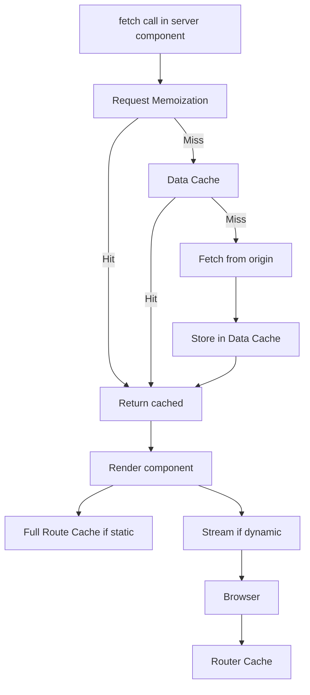
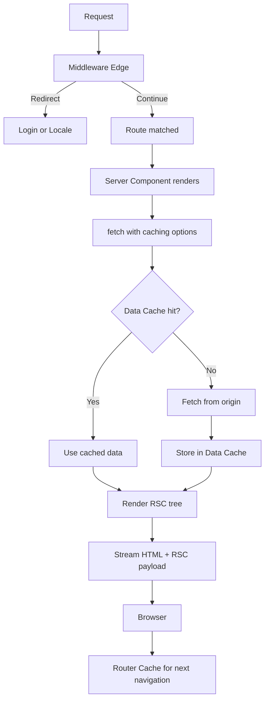
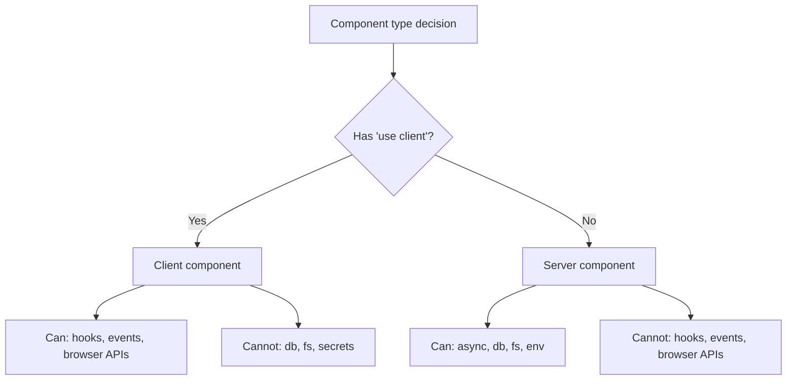
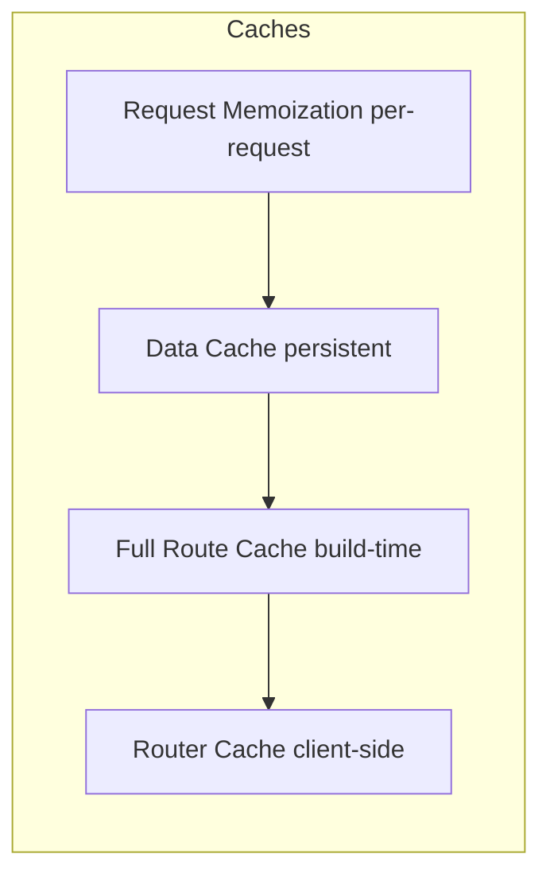

# 6.4 Next.js Interview Questions

> Next.js is the dominant React framework in 2025, and the App Router is its dominant paradigm. An interviewer probing Next.js wants to confirm you understand the server/client boundary, the rendering strategies (static, dynamic, ISR, streaming), the four caches, and the file-based conventions (`loading.tsx`, `error.tsx`, `not-found.tsx`). This note has twenty deep questions, five practical exercises with full solutions, and a mock interview that exposes the most common Next.js interview failure: confusing SSR with RSC.

## 6.4.1 How To Use This Note

Read each question, then speak your answer aloud. Next.js questions have a lot of overlap with React questions; if your React fundamentals (especially server components) are weak, Next.js answers will sound hollow. Confirm your React first, especially [[6.3 React Interview Questions]] question 21 (server components).

Every question has four parts: model answer, reasoning, common wrong answers, and follow-up questions. The follow-ups are the real interview.

> [!tip] Read this note after [[6.3 React Interview Questions]]
> Next.js is built on React. The App Router's server components, Suspense, and hooks are React concepts that Next.js orchestrates. Without React fundamentals, Next.js is magic you cannot debug.

## 6.4.2 Foundational Questions

### Question 1: What is the difference between the App Router and the Pages Router?

**Difficulty:** Easy

**Model Answer:**

The **Pages Router** (Next.js's original routing system, used in versions 1–12 and still supported) is built on the `pages/` directory. Each file (`pages/index.tsx`, `pages/about.tsx`) becomes a route. Pages are client components by default; data fetching is done via `getServerSideProps`, `getStaticProps`, and `getInitialProps`.

The **App Router** (introduced in Next.js 13, stable in 13.4, default in 14+) is built on the `app/` directory. Each folder is a route segment; `page.tsx` defines the route's UI. Pages are server components by default. The App Router supports nested layouts, loading states, error boundaries, streaming, and server components natively.

**Key differences:**

| Dimension | Pages Router | App Router |
|-----------|--------------|------------|
| File-based routing | `pages/about.tsx`  -->  `/about` | `app/about/page.tsx`  -->  `/about` |
| Default component type | Client | Server |
| Data fetching | `getServerSideProps`, `getStaticProps` | `fetch` with caching options, `async` components |
| Layouts | Per-page `_app.tsx`, custom | Nested layouts via `layout.tsx` |
| Loading states | Manual | `loading.tsx` |
| Error handling | `_error.tsx` | `error.tsx` per segment |
| Streaming | Limited | Built-in via Suspense |
| Caching | Per-request, simple | Four caches, complex |
| Server components | Not supported | First-class |

The App Router is the future; the Pages Router is in maintenance mode. New Next.js projects should use the App Router. Existing Pages Router projects can migrate incrementally — the two routers can coexist (Pages routes in `pages/`, App routes in `app/`).

**The Reasoning:**

The Pages Router was designed before React Server Components existed. Its data-fetching model (`getServerSideProps` returning JSON to a client-rendered page) was a hack on top of React's client-only model. The App Router was designed *for* server components: it makes the server the default and treats client components as opt-in. The shift is fundamental, not cosmetic.

**Common Wrong Answers:**

- "The App Router is just a new folder structure." — Wrong; it is a different rendering model with server components as the default.
- "The Pages Router is deprecated." — It is in maintenance; it still receives bug fixes but no new features.
- "You cannot use both in the same project." — You can; they coexist during migration.

**Follow-up Questions an Interviewer Might Ask:**

- How would you migrate a Pages Router project to the App Router?
- What breaks during migration?
- Can you mix server and client components in the Pages Router?

---

### Question 2: What is the difference between server components and client components?

**Difficulty:** Medium

**Model Answer:**

(See [[6.3 React Interview Questions]] question 21 for the React answer; this question focuses on the Next.js-specific implications.)

In Next.js App Router:

- **Server components** (default) render on the server. They can be `async`, can access databases and the filesystem, and ship zero JavaScript to the client. They cannot use `useState`, `useEffect`, event handlers, or browser APIs.

- **Client components** (marked with `'use client'` at the top of the file) render on the server for the initial HTML (SSR) and then hydrate on the client. They can use hooks, event handlers, and browser APIs. Their JavaScript ships to the client.

**The boundary:** The `'use client'` directive marks a file as a client component. Once you cross into a client component, all its descendants are client components too (you cannot go back to server components inside a client component, except via children passed as props).

**Patterns:**

- A server component fetches data and passes it to a client component for interactivity:
  ```tsx
  // app/page.tsx (server)
  import { db } from '@/lib/db';
  import { LikeButton } from './LikeButton';
  
  export default async function Page() {
    const post = await db.post.findUnique({ where: { id: 1 } });
    return (
      <article>
        <h1>{post.title}</h1>
        <LikeButton postId={post.id} initialLikes={post.likes} />
      </article>
    );
  }
  
  // app/LikeButton.tsx
  'use client';
  import { useState } from 'react';
  
  export function LikeButton({ postId, initialLikes }: { postId: string; initialLikes: number }) {
    const [likes, setLikes] = useState(initialLikes);
    return <button onClick={() => setLikes(l => l + 1)}> {likes}</button>;
  }
  ```

- A server component can pass a client component as `children` to another client component, preserving the server/client boundary:
  ```tsx
  // app/Layout.tsx (server)
  <ClientSidebar>
    <ServerContent />  {/* remains a server component */}
  </ClientSidebar>
  ```

**The Reasoning:**

The server/client boundary exists because the two have different constraints and capabilities. Server components have access to secrets and server-only code; client components have interactivity. The `'use client'` directive is the explicit opt-in to the client side. By defaulting to server components, Next.js minimizes the JavaScript shipped to the browser.

**Common Wrong Answers:**

- "Server components are SSR." — Wrong; SSR renders client components to HTML on the server. Server components never ship to the client.
- "You cannot use hooks in client components." — Wrong; client components are exactly the components you are used to, with all hooks available.
- "All components in the `app/` directory are server components." — Wrong; client components (with `'use client'`) are also in `app/`.

**Follow-up Questions an Interviewer Might Ask:**

- How does `'use client'` work at the file level vs the component level?
- Can a server component import a client component? (Yes.)
- Can a client component import a server component? (Not directly; only via children.)

---

### Question 3: What is the `'use client'` directive, and when do you need it?

**Difficulty:** Medium

**Model Answer:**

`'use client'` is a directive placed at the top of a file (before any imports) to mark it as a client component. Once marked, the file's exports are client components, and they ship to the browser.

**When you need `'use client`:**
- The component uses `useState`, `useReducer`, `useEffect`, `useLayoutEffect`, `useRef`, `useContext`, or any other client-only hook.
- The component attaches event handlers (`onClick`, `onChange`, etc.).
- The component uses browser APIs (`window`, `document`, `localStorage`, `IntersectionObserver`).
- The component uses a third-party library that depends on client-only behavior (most UI libraries).

**When you do NOT need `'use client`:**
- The component only renders UI from props and server-fetched data.
- The component imports server-only code (database clients, secrets).
- The component is a wrapper that passes `children` through.

**The boundary is at the file level.** Once a file has `'use client'`, all components in that file are client components, and all components they import are also bundled for the client (unless those imports themselves are server components passed as `children`).

**The "children escape hatch":** A client component can render server components passed to it as `children`:

```tsx
// app/page.tsx (server)
import { ClientLayout } from './ClientLayout';
import { ServerContent } from './ServerContent';

export default function Page() {
  return (
    <ClientLayout>
      <ServerContent />  {/* stays a server component */}
    </ClientLayout>
  );
}

// app/ClientLayout.tsx
'use client';
export function ClientLayout({ children }: { children: React.ReactNode }) {
  const [open, setOpen] = useState(true);
  return <div>{open && children}</div>;
}
```

This pattern lets you wrap server components with client-side interactivity without losing the server benefits.

**The Reasoning:**

The directive exists because the bundler needs to know which files to ship to the client. By putting it at the file level (rather than the component level), Next.js can statically determine the client bundle. The "children escape hatch" preserves composability — you can wrap server content in client interactivity without forcing all of it to the client.

**Common Wrong Answers:**

- "Put `'use client'` at the top of every file to be safe." — Wrong; this ships all your code to the client, defeating the purpose of server components.
- "`'use client'` makes the component client-only." — Wrong; client components still render on the server for the initial HTML (SSR), then hydrate.
- "You can use `'use client'` per-component in the same file." — No; it is per-file.

**Follow-up Questions an Interviewer Might Ask:**

- What is `'use server'`, and when do you use it?
- Can a client component call a server-only function?
- How does the bundler determine the client bundle?

---

### Question 4: When do you use server actions vs route handlers?

**Difficulty:** Medium

**Model Answer:**

**Server actions** are async functions that run on the server and are called from client components (or server components, in some cases). They are defined with the `'use server'` directive and are typically used for **mutations** — form submissions, button clicks that change data.

```tsx
// app/actions.ts
'use server';

export async function createPost(formData: FormData) {
  await db.post.create({ data: { title: formData.get('title') as string } });
  revalidatePath('/');
}

// app/PostForm.tsx
'use client';
import { createPost } from './actions';

export function PostForm() {
  return (
    <form action={createPost}>
      <input name="title" />
      <button type="submit">Create</button>
    </form>
  );
}
```

**Route handlers** are functions that handle HTTP requests at a specific URL. They are defined in `route.ts` files and are typically used for **APIs** — webhooks, third-party integrations, REST endpoints, CORS-protected endpoints.

```tsx
// app/api/webhooks/stripe/route.ts
export async function POST(request: Request) {
  const event = await request.json();
  // Handle the webhook...
  return new Response('OK', { status: 200 });
}
```

**When to use which:**

| Use case | Use |
|----------|-----|
| Form submission | Server action |
| Button click that mutates data | Server action |
| Webhook from Stripe/GitHub/etc. | Route handler |
| Public API for third parties | Route handler |
| CORS-protected endpoint | Route handler |
| File upload from a form | Server action (with `FormData`) |
| Streaming response | Route handler |
| Anything called via `fetch` from client | Route handler |

**Rule of thumb:** Server actions are for UI-driven mutations; route handlers are for HTTP endpoints.

**The Reasoning:**

Server actions are a Next.js feature that lets you call server-side code from a form's `action` prop, without writing an API. They are progressive enhancement: the form works without JavaScript (the browser submits a POST and Next.js routes it to the action). Route handlers are the traditional API pattern — a URL that responds to HTTP methods.

**Common Wrong Answers:**

- "Server actions replace APIs." — Wrong; they replace form-submission APIs. Public APIs and webhooks still need route handlers.
- "Route handlers are old; use server actions." — Wrong; they serve different purposes.
- "Server actions are insecure because they are called from the client." — They are secure if you validate input and authorize the user; the same is true for route handlers.

**Follow-up Questions an Interviewer Might Ask:**

- How do server actions handle authentication?
- Can a server action return data to the client?
- How do you handle errors in server actions?

---

### Question 5: What are the rendering strategies in Next.js, and when do you use each?

**Difficulty:** Medium

**Model Answer:**

Next.js supports four rendering strategies:

1. **Static Generation (SSG).** The page is rendered at build time. The HTML is cached and served from a CDN. Use for: marketing pages, blog posts, documentation, any content that does not change per-request.

   ```tsx
   // app/page.tsx
   export default async function Page() {
     const data = await fetch('https://api.example.com/data');  // cached by default
     return <pre>{JSON.stringify(data)}</pre>;
   }
   ```

2. **Server-Side Rendering (SSR / Dynamic).** The page is rendered on every request. Use for: personalized pages, dashboards, anything that depends on the request (cookies, search params).

   ```tsx
   export const dynamic = 'force-dynamic';
   
   export default async function Page() {
     const data = await fetch('https://api.example.com/data', { cache: 'no-store' });
     return <pre>{JSON.stringify(data)}</pre>;
   }
   ```

3. **Incremental Static Regeneration (ISR).** The page is rendered at build time, then re-rendered in the background at a configurable interval. Use for: e-commerce catalogs, news sites, any content that changes periodically but not per-request.

   ```tsx
   export const revalidate = 60;  // revalidate every 60 seconds
   
   export default async function Page() {
     const data = await fetch('https://api.example.com/data');
     return <pre>{JSON.stringify(data)}</pre>;
   }
   ```

4. **Streaming.** The page is rendered progressively, with parts sent as they become ready. Use for: pages with multiple data sources where some are slow.

   ```tsx
   export default function Page() {
     return (
       <>
         <h1>Dashboard</h1>
         <Suspense fallback={<Spinner />}>
           <SlowChart />
         </Suspense>
         <Suspense fallback={<Spinner />}>
           <SlowTable />
         </Suspense>
       </>
     );
   }
   ```

**How Next.js decides by default:**

With the App Router, Next.js statically renders a route by default if it can. If the route uses dynamic functions (`cookies()`, `headers()`, `searchParams`), reads the request, or sets `dynamic = 'force-dynamic'`, it becomes dynamic.

**Per-route opt-in:**
- `export const dynamic = 'force-static'` — force static.
- `export const dynamic = 'force-dynamic'` — force dynamic.
- `export const revalidate = N` — ISR with N-second revalidation.
- `export const dynamicParams = true/false` — whether to generate on-demand for params not in `generateStaticParams`.

**The Reasoning:**

Different content has different freshness requirements. Static content is fastest (CDN-cached) but cannot be personalized. Dynamic content is personalized but slower (rendered per-request). ISR is the middle ground. Streaming lets you serve the static parts immediately while the dynamic parts load, improving perceived performance.

**Common Wrong Answers:**

- "SSG is always best." — Wrong; personalized content cannot be SSG.
- "SSR is slower than SSG, so always use SSG." — Wrong; the choice depends on freshness needs.
- "ISR is the same as SSR." — No; ISR serves stale content while regenerating; SSR always renders fresh.

**Follow-up Questions an Interviewer Might Ask:**

- How does Next.js decide if a route is static or dynamic?
- What is the difference between `revalidate` and `expire`?
- How does streaming interact with SSR?

---

### Question 6: What are the four Next.js caches, and what does each cache?

**Difficulty:** Hard

**Model Answer:**

Next.js (App Router) has four distinct caches:

1. **Request Memoization.** Deduplicates `fetch` calls within a single server request. If you call `fetch('https://api.example.com/user')` twice in the same render, the second call returns the cached result. Scope: per-request, in-memory, does not persist across requests.

2. **Data Cache.** Stores `fetch` responses across requests and deployments. The cache key includes the URL and headers. Lives until manually invalidated or until the `revalidate` time expires. Scope: persistent across requests.

3. **Full Route Cache.** Stores the fully-rendered HTML and RSC payload for static routes. The route is rendered at build time and served from the cache until revalidated. Scope: persistent, build-time.

4. **Router Cache (Client-side Cache).** Stores the RSC payload in the browser's memory for previously-visited routes. Enables instant back/forward navigation without re-fetching. Scope: per-user, in-memory, browser session.

**Relationship between them:**



**How to invalidate:**

- **Request Memoization:** automatic, per-request.
- **Data Cache:** `revalidate` option in `fetch`, `revalidateTag(tag)`, `revalidatePath(path)`, or `cache: 'no-store'` to opt out.
- **Full Route Cache:** invalidated when the underlying Data Cache entries are invalidated. Can also be force-invalidated with `revalidatePath`.
- **Router Cache:** automatic, with a staleness timeout. Refreshed on navigation. Can be programmatically refreshed with `router.refresh()`.

**The Reasoning:**

The four caches serve different scopes and lifetimes. Without them, every request would re-fetch data and re-render the entire tree, which is slow. The caches let Next.js serve cached HTML, cached data, and cached RSC payloads at different levels, dramatically reducing server work. The tradeoff is complexity: you must understand which cache holds what to debug stale-content issues.

**Common Wrong Answers:**

- "Next.js has one cache." — Wrong; there are four, with different scopes.
- "The Data Cache and the Full Route Cache are the same." — No; Data Cache is for `fetch` responses, Full Route Cache is for rendered HTML/RSC.
- "Disabling the Data Cache (`cache: 'no-store'`) disables the Full Route Cache." — No; it makes the route dynamic, but the Router Cache still works in the browser.

**Follow-up Questions an Interviewer Might Ask:**

- How would you debug stale content in a Next.js app?
- What does `revalidateTag` do, and when would you use it?
- How does the Router Cache affect back/forward navigation?

---

### Question 7: How do you invalidate the Data Cache?

**Difficulty:** Medium

**Model Answer:**

Three mechanisms:

1. **Time-based revalidation.** Set `revalidate` in the `fetch` call or in the route segment config:

   ```tsx
   // Per-fetch
   const data = await fetch('https://api.example.com/data', { next: { revalidate: 60 } });
   
   // Per-route
   export const revalidate = 3600;
   ```

   Next.js serves the cached data and revalidates in the background after the time elapses. The first request after the timeout gets the stale data; subsequent requests get the fresh data.

2. **On-demand revalidation with `revalidateTag`.** Tag the fetch, then revalidate by tag (typically from a server action or route handler after a mutation):

   ```tsx
   // Fetch with tag
   const data = await fetch('https://api.example.com/posts', { next: { tags: ['posts'] } });
   
   // Revalidate after mutation
   import { revalidateTag } from 'next/cache';
   await revalidateTag('posts');
   ```

   Use this when you know the data changed (e.g., after creating a post).

3. **On-demand revalidation with `revalidatePath`.** Revalidate everything associated with a path:

   ```tsx
   import { revalidatePath } from 'next/cache';
   await revalidatePath('/posts');
   ```

   Use this when a mutation affects an entire route.

4. **Opt out entirely.** `cache: 'no-store'` skips the Data Cache for that fetch:

   ```tsx
   const data = await fetch('https://api.example.com/data', { cache: 'no-store' });
   ```

   Use this for data that must always be fresh.

**Pattern: mutate-then-revalidate.**

```tsx
'use server';
import { revalidatePath } from 'next/cache';
import { db } from '@/lib/db';

export async function createPost(formData: FormData) {
  await db.post.create({ data: { title: formData.get('title') as string } });
  revalidatePath('/posts');
  revalidatePath(`/posts/${newPost.id}`);
}
```

After the mutation, call `revalidatePath` to invalidate the cache. The next request will fetch fresh data and re-render.

**The Reasoning:**

Caching is a tradeoff between freshness and performance. Time-based revalidation is the simplest; on-demand is the most precise. The mutate-then-revalidate pattern is the standard for forms: the user sees their change immediately because the cache is invalidated after the mutation.

**Common Wrong Answers:**

- "Set `revalidate: 0` to disable caching." — In Next.js 14, `revalidate: 0` is equivalent to `cache: 'no-store'`. In Next.js 15, the default changed — `fetch` is no longer cached by default.
- "`revalidatePath` works on the browser cache." — No; it invalidates the Data Cache and Full Route Cache on the server. The Router Cache (browser) refreshes on navigation.
- "Tags are global." — Tags are scoped to your application; multiple apps on the same domain share the tag namespace.

**Follow-up Questions an Interviewer Might Ask:**

- What is the difference between `revalidateTag` and `revalidatePath`?
- How does Next.js 15 change the default caching behavior?
- How would you implement a "preview" mode that bypasses the cache?

---

### Question 8: What is `generateStaticParams`, and when do you use it?

**Difficulty:** Medium

**Model Answer:**

`generateStaticParams` is a function you export from a dynamic route (`app/[slug]/page.tsx`) to specify which parameter values should be statically generated at build time.

```tsx
// app/posts/[slug]/page.tsx
export async function generateStaticParams() {
  const posts = await db.post.findMany();
  return posts.map(post => ({ slug: post.slug }));
}

export default async function Page({ params }: { params: { slug: string } }) {
  const post = await db.post.findUnique({ where: { slug: params.slug } });
  return <article><h1>{post.title}</h1>{post.body}</article>;
}
```

At build time, Next.js calls `generateStaticParams`, then renders the page for each returned parameter. The result is a set of static HTML pages (one per slug).

**Behavior for un-listed params:**

- `dynamicParams = true` (default): if a user visits a slug not in the generated list, Next.js renders it on-demand at request time and caches the result.
- `dynamicParams = false`: visiting an un-listed slug returns a 404.

**When to use it:**
- Blog posts, product pages, documentation pages — any dynamic route where you know the build-time set of params.
- For very large sets, generate the most popular at build time and let the rest be on-demand.

**The Reasoning:**

`generateStaticParams` is the App Router's replacement for `getStaticPaths` from the Pages Router. It lets you pre-render the pages that will actually be visited, avoiding per-request rendering for popular content. The `dynamicParams` flag controls fallback behavior — generate on demand or 404.

**Common Wrong Answers:**

- "`generateStaticParams` is required for dynamic routes." — No; without it, the route is rendered on-demand per request.
- "It only works for SSG." — It works for ISR too; the generated pages are revalidated per the route's `revalidate` config.
- "It cannot be async." — It can; you can fetch the list of params from a database or API.

**Follow-up Questions an Interviewer Might Ask:**

- What is the difference between `generateStaticParams` and `getStaticPaths`?
- How does ISR interact with `generateStaticParams`?
- What happens if `generateStaticParams` returns an empty array?

---

## 6.4.3 Intermediate Questions

### Question 9: What is the Metadata API, and how does it work?

**Difficulty:** Medium

**Model Answer:**

The Metadata API lets you define SEO metadata (title, description, Open Graph tags, Twitter cards, canonical URLs, robots, etc.) in your route files. Next.js collects the metadata from all segments and renders the appropriate `<head>` tags.

**Static metadata:**

```tsx
// app/layout.tsx
import type { Metadata } from 'next';

export const metadata: Metadata = {
  title: { default: 'My Site', template: '%s | My Site' },
  description: 'A description of my site.',
  openGraph: { images: ['/og.png'] },
};

export default function RootLayout({ children }) {
  return <html><body>{children}</body></html>;
}
```

**Dynamic metadata:**

```tsx
// app/posts/[slug]/page.tsx
import type { Metadata, ResolvingMetadata } from 'next';

export async function generateMetadata(
  { params }: { params: { slug: string } },
  parent: ResolvingMetadata,
): Promise<Metadata> {
  const post = await fetchPost(params.slug);
  return {
    title: post.title,
    description: post.excerpt,
    openGraph: { images: [post.coverImage] },
  };
}
```

**Features:**
- **Title templates.** `{ template: '%s | My Site' }` lets child routes set just the page name; the template adds the suffix.
- **Inheritance.** Child segments inherit and override parent metadata. A child's `openGraph.images` overrides the parent's.
- **File conventions.** `favicon.ico`, `icon.png`, `apple-icon.png`, `opengraph-image.png`, `twitter-image.png` in a route segment automatically generate the appropriate `<link>` tags.
- **robots.txt and sitemap.xml.** Generate them dynamically with `app/robots.ts` and `app/sitemap.ts`.

**The Reasoning:**

Before the Metadata API, you had to manually manage the `<head>` with `next/head` (Pages Router). This was error-prone — easy to forget a tag, easy to duplicate. The Metadata API treats metadata as data: you declare it in the route file, and Next.js handles the rendering. Inheritance and templates make it easy to maintain consistent metadata across a large site.

**Common Wrong Answers:**

- "You need `next/head` in the App Router." — Wrong; `next/head` does not work in the App Router. Use the Metadata API.
- "Metadata is only for the root layout." — No; each route segment can have its own metadata.
- "You cannot generate metadata dynamically." — Wrong; `generateMetadata` is the async equivalent.

**Follow-up Questions an Interviewer Might Ask:**

- How does the Metadata API handle streaming?
- How would you generate a dynamic Open Graph image?
- How does metadata interact with SSR and SSG?

---

### Question 10: Why does `next/image` matter, and how do you use it?

**Difficulty:** Medium

**Model Answer:**

`next/image` is Next.js's image component. It addresses the common performance problems with ``:

1. **Serving modern formats.** `next/image` automatically converts images to WebP or AVIF (based on browser support), reducing file size by 30–50%.
2. **Responsive sizing.** You specify the source image's dimensions; Next.js generates multiple sizes and the browser picks the right one via `srcset`.
3. **Lazy loading.** Images below the fold are lazy-loaded by default.
4. **Avoiding layout shift.** The `width` and `height` props reserve space, preventing CLS.
5. **Optimizing on-demand.** Images are optimized at request time, not build time, so you do not need a build step for new images.

```tsx
import Image from 'next/image';

<Image
  src="/hero.jpg"
  alt="Hero"
  width={1200}
  height={630}
  priority  // load eagerly (for LCP images)
  sizes="(max-width: 768px) 100vw, 50vw"
/>
```

**The `sizes` prop** is critical for responsive images. It tells the browser how wide the image will be at each breakpoint, so the browser can pick the right source from `srcset`. Without `sizes`, the browser may download a much larger image than needed.

**The `priority` prop** tells Next.js to preload the image. Use it for the LCP image (the largest image visible on first paint). Do not use it for all images — that defeats lazy loading.

**For remote images**, configure `next.config.js`:

```js
module.exports = {
  images: {
    remotePatterns: [{ protocol: 'https', hostname: 'cdn.example.com' }],
  },
};
```

This is required for security — Next.js only optimizes images from whitelisted hosts.

**The Reasoning:**

Images are the largest payload on most web pages. Unoptimized images are a major cause of slow LCP and high bandwidth. `next/image` automates the optimizations that every site should do but most do not. The `sizes` prop and `priority` prop let you fine-tune per-image.

**Common Wrong Answers:**

- "`next/image` is just a wrapper around ``." — Wrong; it generates optimized images on-demand via the `/_next/image` endpoint.
- "You have to use it." — You do not, but you should. The performance wins are significant.
- "It only works for local images." — No; configure `remotePatterns` for remote images.

**Follow-up Questions an Interviewer Might Ask:**

- What is the `sizes` prop, and why does it matter?
- How would you handle a CMS-driven image with unknown dimensions?
- What happens if you do not whitelist a remote host?

---

### Question 11: How does `next/font` eliminate FOUT?

**Difficulty:** Medium

**Model Answer:**

FOUT (Flash of Unstyled Text) is the brief moment when text appears in a fallback font before the web font loads. It is visually jarring. FOIT (Flash of Invisible Text) is the opposite: text is invisible until the font loads, which delays LCP.

`next/font` eliminates both by:

1. **Self-hosting the font at build time.** The font files are downloaded during the build and served from your own domain. No third-party request to Google Fonts.
2. **Generating a CSS `@font-face` declaration with `size-adjust`.** This adjusts the fallback font's metrics to match the web font's, so the layout does not shift when the font swaps.
3. **Inlining the font CSS.** The `@font-face` declaration is inlined into the HTML, so there is no extra request.
4. **Using `font-display: optional` or `swap` automatically.** The font loads in the background and swaps in without a flash.

```tsx
// app/layout.tsx
import { Inter } from 'next/font/google';

const inter = Inter({
  subsets: ['latin'],
  display: 'swap',
  variable: '--font-inter',
});

export default function RootLayout({ children }) {
  return (
    <html className={inter.variable}>
      <body>{children}</body>
    </html>
  );
}
```

**Local fonts:**

```tsx
import localFont from 'next/font/local';

const myFont = localFont({
  src: './fonts/MyFont.woff2',
  display: 'swap',
  variable: '--font-my',
});
```

**The Reasoning:**

Fonts are a notorious source of layout shift and slow LCP. The traditional solution — loading from Google Fonts with a `<link>` — adds a third-party request, blocks render, and causes FOUT/FOIT. `next/font` moves the font-loading into the build, self-hosts the files, and generates a fallback-adjusted `@font-face` so the swap is invisible.

**Common Wrong Answers:**

- "`next/font` makes fonts load instantly." — No; it eliminates the flash. The font still takes time to download.
- "You cannot use Google Fonts with `next/font`." — Wrong; `next/font/google` is the most common usage.
- "It works only at the root layout." — No; you can use it in any component, though the root layout is most common.

**Follow-up Questions an Interviewer Might Ask:**

- What is the difference between `font-display: swap` and `font-display: optional`?
- How would you handle a font with multiple weights?
- What is `size-adjust` and why does it matter?

---

### Question 12: What is middleware, and what can/cannot you do in it?

**Difficulty:** Medium

**Model Answer:**

Middleware is code that runs on the Edge before a request is routed to a page or route handler. It is defined in `middleware.ts` at the root of the project (or in `src/`).

```ts
// middleware.ts
import { NextResponse } from 'next/server';
import type { NextRequest } from 'next/server';

export function middleware(request: NextRequest) {
  const token = request.cookies.get('token')?.value;
  if (!token && request.nextUrl.pathname.startsWith('/dashboard')) {
    return NextResponse.redirect(new URL('/login', request.url));
  }
  return NextResponse.next();
}

export const config = {
  matcher: ['/dashboard/:path*', '/admin/:path*'],
};
```

**What middleware CAN do:**
- Inspect and modify request headers.
- Inspect and modify response headers.
- Redirect requests.
- Rewrite requests (serve a different route without changing the URL).
- Set cookies.
- Read the user's geolocation, locale, and user-agent (via headers).
- Run on the Edge (low latency, globally distributed).

**What middleware CANNOT do:**
- Use the Node.js APIs (`fs`, `crypto.subtle` for some operations, etc.). Middleware runs in the Edge runtime, which has a restricted API surface.
- Access environment variables that are not prefixed with `NEXT_PUBLIC_` (without `export const runtime = 'nodejs'`, which opts out of the Edge).
- Run for very long — there is a timeout (typically 30 seconds, but lower on some platforms).
- Use server-only code that depends on `await`-ing heavy operations.
- Run on every route by default — you must configure `matcher`.

**Common use cases:**
- Authentication checks (redirect to login if no session cookie).
- Locale detection and routing (`/about`  -->  `/en/about` or `/fr/about`).
- A/B testing (rewrite to a variant).
- Bot detection and rate limiting.
- Setting security headers (CSP, HSTS).

**The Reasoning:**

Middleware exists for cross-cutting concerns that apply to many routes but do not require rendering. Running on the Edge gives low latency; the restrictions (no Node.js APIs, short timeout) are the price. Use middleware for routing decisions and header manipulation, not for business logic.

**Common Wrong Answers:**

- "Middleware can fetch data from a database." — Wrong; the Edge runtime does not have database drivers, and the timeout is too short.
- "Middleware replaces server components." — No; it runs before server components and is for routing, not rendering.
- "Middleware runs on the client." — No; it runs on the Edge, before the request reaches your app.

**Follow-up Questions an Interviewer Might Ask:**

- How do you handle authentication in middleware?
- What is the difference between the Edge runtime and the Node.js runtime?
- How would you implement A/B testing with middleware?

---

### Question 13: What are `loading.tsx` and `error.tsx`?

**Difficulty:** Easy

**Model Answer:**

`loading.tsx` and `error.tsx` are special files in the App Router that create Suspense boundaries and error boundaries for their segment, respectively.

**`loading.tsx`:**

```tsx
// app/dashboard/loading.tsx
export default function Loading() {
  return <div>Loading...</div>;
}
```

Next.js wraps the segment's `page.tsx` in a `<Suspense fallback={<Loading />}>`. While the page's server component is fetching data, the loading UI is shown.

**`error.tsx`:**

```tsx
// app/dashboard/error.tsx
'use client';

export default function Error({ error, reset }: { error: Error; reset: () => void }) {
  return (
    <div>
      <h2>Something went wrong!</h2>
      <p>{error.message}</p>
      <button onClick={reset}>Try again</button>
    </div>
  );
}
```

`error.tsx` must be a client component (because error boundaries are class components under the hood, and they need to handle the reset action). The `reset` function retries the render.

**`not-found.tsx`:**

```tsx
// app/not-found.tsx
export default function NotFound() {
  return <div>404 - Page Not Found</div>;
}
```

Shown when the `notFound()` function is called or when a route does not match.

**`global-error.tsx`:**

```tsx
// app/global-error.tsx
'use client';

export default function GlobalError({ error, reset }: { error: Error; reset: () => void }) {
  return (
    <html>
      <body>
        <h2>Something went wrong!</h2>
        <button onClick={reset}>Try again</button>
      </body>
    </html>
  );
}
```

A top-level error boundary that catches errors in the root layout itself. Note that it must render `<html>` and `<body>` because the root layout does not render when this boundary activates.

**The Reasoning:**

Before these conventions, you had to manually wrap routes in Suspense and ErrorBoundary components. The file-based conventions make it automatic: drop a `loading.tsx` in a segment, and you get a loading state for free. This is one of the App Router's biggest ergonomic wins over the Pages Router.

**Common Wrong Answers:**

- "`error.tsx` can be a server component." — No; it must be a client component because error boundaries need state and event handlers.
- "`loading.tsx` runs after the page renders." — No; it runs *while* the page is rendering (during Suspense).
- "`global-error.tsx` replaces the root layout." — It replaces the root layout's render when an error occurs in it, so it must render `<html>` and `<body>`.

**Follow-up Questions an Interviewer Might Ask:**

- How does `loading.tsx` interact with streaming?
- How do you reset an error boundary?
- What is the difference between `error.tsx` and `global-error.tsx`?

---

### Question 14: How do you handle authentication on the Edge?

**Difficulty:** Hard

**Model Answer:**

The challenge: middleware runs on the Edge, which has restricted APIs (no Node.js `crypto`, no database drivers). But authentication typically requires verifying a JWT or session cookie, which is a cryptographic operation.

**Approach 1: Verify JWT in middleware with WebCrypto.**

The Edge runtime supports the Web Crypto API. You can verify a JWT signature using `crypto.subtle.verify`:

```ts
// middleware.ts
import { NextResponse } from 'next/server';
import type { NextRequest } from 'next/server';
import { jwtVerify } from 'jose';  // jose uses Web Crypto

export async function middleware(request: NextRequest) {
  const token = request.cookies.get('token')?.value;
  if (!token) return NextResponse.redirect(new URL('/login', request.url));

  try {
    const { payload } = await jwtVerify(token, new TextEncoder().encode(process.env.JWT_SECRET));
    // Optionally attach user info to request headers for downstream use
    const response = NextResponse.next();
    response.headers.set('x-user-id', payload.sub as string);
    return response;
  } catch {
    return NextResponse.redirect(new URL('/login', request.url));
  }
}
```

Use `jose` (not `jsonwebtoken`) — `jose` is designed for the Web Crypto API and works in the Edge runtime.

**Approach 2: Session cookie lookup.**

If you use a session ID (not a JWT), the middleware cannot look it up in a database (no DB driver on Edge). Options:
- Use Upstash Redis (HTTP-based, Edge-compatible) to store sessions.
- Use a stateless JWT instead of a server-side session.
- Move the auth check to the server component (which runs in Node.js).

**Approach 3: Defer to server components.**

For routes that do not need Edge-level protection, do the auth check in the server component:

```tsx
// app/dashboard/page.tsx
import { redirect } from 'next/navigation';
import { getSession } from '@/lib/auth';

export default async function Dashboard() {
  const session = await getSession();
  if (!session) redirect('/login');
  // ...
}
```

This runs in Node.js and has full database access. The downside is that the redirect happens after the page starts rendering (slightly slower than middleware).

**Pattern: middleware for routing, server component for authorization.**

Use middleware to check "is there a token?" and redirect unauthenticated users. Use server components to check "does this user have permission for this resource?" — because permission checks often need database access.

**The Reasoning:**

Edge authentication is a tradeoff: low latency (Edge) vs. full capabilities (Node.js). For stateless JWTs, Edge works. For stateful sessions, you need either an Edge-compatible store or a Node.js-side check. The hybrid pattern (Edge for auth check, Node.js for authorization) gives you both speed and flexibility.

**Common Wrong Answers:**

- "You can use Prisma in middleware." — No; Prisma requires Node.js.
- "JWT verification is too slow on Edge." — No; it is sub-millisecond with Web Crypto.
- "Middleware is the only place to do auth." — No; server components and route handlers can also do auth checks.

**Follow-up Questions an Interviewer Might Ask:**

- How would you implement role-based access control?
- What is the difference between `jose` and `jsonwebtoken`?
- How does NextAuth.js / Auth.js handle middleware?

---

### Question 15: When would you use `dynamic = 'force-dynamic'`?

**Difficulty:** Medium

**Model Answer:**

`export const dynamic = 'force-dynamic'` in a route segment forces the route to be rendered on every request (SSR), opting out of static generation and the Full Route Cache.

```tsx
// app/dashboard/page.tsx
export const dynamic = 'force-dynamic';

export default async function Dashboard() {
  const data = await fetch('https://api.example.com/data');
  return <pre>{JSON.stringify(data)}</pre>;
}
```

**When to use it:**
- The page depends on request-specific data (cookies, headers, search params) that you read directly.
- The page must always show fresh data, even at the cost of performance.
- You are debugging and want to rule out caching as the cause of stale content.
- The page is behind authentication and shows user-specific content.

**When NOT to use it:**
- The page is static (a marketing page, a blog post). Use the default static rendering.
- The page uses ISR. Set `revalidate` instead.
- The page uses dynamic functions (`cookies()`, `headers()`, `searchParams`) — Next.js automatically makes it dynamic; you do not need `force-dynamic`.

**Closely related options:**
- `dynamic = 'force-static'` — force static rendering. Errors if you use dynamic functions.
- `dynamic = 'error'` — error at build time if the route cannot be statically rendered. Useful for catching accidental dynamic behavior.
- `revalidate = N` — ISR with N-second revalidation.
- `dynamicParams = false` — 404 for un-listed params (with `generateStaticParams`).

**In Next.js 15+**, the default `fetch` caching changed: `fetch` is no longer cached by default. This means more routes are dynamic by default. `force-dynamic` is still useful for forcing the route to be dynamic even when `fetch` calls do not opt out.

**The Reasoning:**

Next.js's default is static rendering, which is fast but wrong for personalized content. `force-dynamic` is the explicit opt-out: "I know this page must render per-request." Use it sparingly — most dynamic behavior is automatic when you use `cookies()`, `headers()`, or `searchParams`.

**Common Wrong Answers:**

- "`force-dynamic` disables the Data Cache." — It does not; it disables the Full Route Cache. Individual `fetch` calls still cache unless you opt out.
- "`force-dynamic` is required for authenticated pages." — Not necessarily; if you read `cookies()`, the route is dynamic automatically.
- "You should always set `dynamic` explicitly." — No; the default behavior is correct for most routes.

**Follow-up Questions an Interviewer Might Ask:**

- What is the difference between `force-dynamic` and reading `cookies()`?
- How does `force-static` interact with `fetch` calls?
- When would you use `dynamic = 'error'`?

---

## 6.4.4 Advanced Questions

### Question 16: How does streaming SSR work in Next.js?

**Difficulty:** Hard

**Model Answer:**

Streaming SSR sends HTML to the browser as it becomes available, instead of waiting for the entire page to render. This lets the user see the static parts immediately while dynamic parts load.

**How it works:**

1. The server starts rendering the page. Static parts (the shell, layout) are rendered and sent immediately.
2. When the server encounters a Suspense boundary with a pending async resource (a slow `fetch`, a server component reading from a database), it sends the fallback HTML and continues rendering the rest.
3. When the pending resource resolves, the server sends a `<script>` tag with the resolved HTML. The browser swaps the fallback for the real content.
4. The browser never blocks waiting for the entire page.

```tsx
// app/dashboard/page.tsx
export default function Dashboard() {
  return (
    <>
      <h1>Dashboard</h1>
      <Suspense fallback={<ChartSkeleton />}>
        <SlowChart />  {/* takes 2 seconds */}
      </Suspense>
      <Suspense fallback={<TableSkeleton />}>
        <SlowTable />  {/* takes 3 seconds */}
      </Suspense>
    </>
  );
}
```

The browser receives the shell + chart skeleton + table skeleton immediately. The chart arrives at 2 seconds; the table arrives at 3 seconds. The user sees the shell at 0s, the chart at 2s, and the table at 3s — instead of waiting until 3s for everything.

**Next.js's implementation:**

- Server components are inherently async and stream naturally.
- Each Suspense boundary in a server component creates a streamable chunk.
- The RSC payload is also streamed, so client components can hydrate incrementally.
- `loading.tsx` files are automatically wrapped in Suspense boundaries.

**Benefits:**
- Faster TTFB (Time to First Byte) — the browser receives the shell immediately.
- Faster LCP — the largest visible content appears as soon as it is ready, not when the slowest part finishes.
- Better UX — progressive rendering feels faster than waiting.

**The Reasoning:**

Traditional SSR blocks until the entire page is rendered, then sends the full HTML. For pages with multiple data sources, this means the user waits for the slowest one. Streaming lets the server send what it has, when it has it. React 18's Suspense on the server is what made this possible; Next.js's App Router is built around it.

**Common Wrong Answers:**

- "Streaming requires client components." — No; server components stream natively.
- "Streaming disables caching." — No; cached routes still serve from the Full Route Cache, but if the cache misses, the response streams.
- "Streaming only works for SSR." — It also works for static generation (the HTML is generated at build time, but the streaming protocol is the same).

**Follow-up Questions an Interviewer Might Ask:**

- How does streaming interact with the Full Route Cache?
- Can you stream from a route handler?
- How does the browser know when the stream is complete?

---

### Question 17: How do you do SEO with Next.js?

**Difficulty:** Medium

**Model Answer:**

SEO in Next.js combines several features:

1. **The Metadata API.** Define `title`, `description`, `openGraph`, `twitter`, `robots`, `canonical`, etc. in your route files. Next.js renders the `<head>` tags.

   ```tsx
   export const metadata: Metadata = {
     title: 'My Page',
     description: 'A description.',
     openGraph: { images: ['/og.png'] },
     alternates: { canonical: '/my-page' },
     robots: { index: true, follow: true },
   };
   ```

2. **Dynamic metadata.** For dynamic routes (`/posts/[slug]`), use `generateMetadata` to fetch the title and description from the database.

3. **Static generation.** Static pages are pre-rendered with their metadata at build time. Search engines see fully-formed HTML.

4. **SSR with proper tags.** Dynamic pages render on the server with their metadata, so crawlers see the right tags even for personalized content (though you typically want to keep crawlers away from personalized pages).

5. **`robots.txt` and `sitemap.xml`.** Generate them dynamically:

   ```tsx
   // app/robots.ts
   export default function robots(): MetadataRoute.Robots {
     return {
       rules: { userAgent: '*', allow: '/', disallow: ['/admin'] },
       sitemap: 'https://example.com/sitemap.xml',
     };
   }
   
   // app/sitemap.ts
   export default async function sitemap(): Promise<MetadataRoute.Sitemap> {
     const posts = await db.post.findMany();
     return posts.map(post => ({
       url: `https://example.com/posts/${post.slug}`,
       lastModified: post.updatedAt,
     }));
   }
   ```

6. **Structured data.** Render JSON-LD in your pages for rich results:

   ```tsx
   <script type="application/ld+json" dangerouslySetInnerHTML={{ __html: JSON.stringify({
     '@context': 'https://schema.org',
     '@type': 'Article',
     headline: post.title,
     datePublished: post.publishedAt,
   }) }} />
   ```

7. **Performance.** LCP, CLS, and INP are ranking factors. Use `next/image`, `next/font`, and streaming to hit Core Web Vitals.

8. **`next/script`.** Load third-party scripts (analytics, ads) with the right strategy (`afterInteractive`, `lazyOnload`) to avoid blocking render.

**The Reasoning:**

SEO is about giving crawlers the right HTML and the right metadata. Next.js makes both first-class: the Metadata API handles the tags, and server rendering produces the HTML. The performance features (`next/image`, `next/font`, streaming) handle the Core Web Vitals ranking factor. Together, they make Next.js one of the most SEO-friendly frameworks.

**Common Wrong Answers:**

- "SEO requires static generation." — No; SSR also works for SEO. Static is faster but not required.
- "You need a sitemap for SEO." — Helpful but not strictly required for indexing.
- "The Metadata API handles everything." — No; structured data, performance, and content quality also matter.

**Follow-up Questions an Interviewer Might Ask:**

- How would you generate a dynamic Open Graph image?
- What is the difference between `next/script` strategies?
- How does Next.js handle crawlers vs. users?

---

### Question 18: How do you handle authentication in Next.js (App Router)?

**Difficulty:** Hard

**Model Answer:**

A layered approach:

**Layer 1: Middleware (Edge).** Check for a session cookie or JWT. Redirect unauthenticated users away from protected routes. This is fast (Edge) but limited (no DB access).

```ts
// middleware.ts
export function middleware(request: NextRequest) {
  const session = request.cookies.get('session');
  if (!session && request.nextUrl.pathname.startsWith('/dashboard')) {
    return NextResponse.redirect(new URL('/login', request.url));
  }
}
```

**Layer 2: Server components (Node.js).** For routes that pass middleware, do the full authorization in the server component. This can read from the database, check permissions, and render personalized content.

```tsx
// app/dashboard/page.tsx
import { redirect } from 'next/navigation';
import { getSession } from '@/lib/auth';

export default async function Dashboard() {
  const session = await getSession();
  if (!session) redirect('/login');
  if (!session.user.isAdmin) redirect('/dashboard/user');
  // Render admin dashboard...
}
```

**Layer 3: Server actions (Node.js).** For mutations, validate the session inside the server action. Never trust the client.

```tsx
'use server';
import { getSession } from '@/lib/auth';
import { revalidatePath } from 'next/cache';

export async function deletePost(id: string) {
  const session = await getSession();
  if (!session?.user.isAdmin) throw new Error('Forbidden');
  await db.post.delete({ where: { id } });
  revalidatePath('/posts');
}
```

**Layer 4: Route handlers (Node.js).** For APIs, validate the session in the handler.

```tsx
// app/api/posts/route.ts
export async function GET(request: Request) {
  const session = await getSession();
  if (!session) return new Response('Unauthorized', { status: 401 });
  // ...
}
```

**Libraries:**
- **Auth.js / NextAuth.js** is the most popular. It handles OAuth, session management, and provides a `getSession` helper that works in middleware, server components, and route handlers.
- **Clerk** is a hosted alternative with a generous free tier.
- **Lucia** is a lightweight, framework-agnostic auth library.

**The Reasoning:**

Authentication is a cross-cutting concern that touches every layer. The Edge middleware is fast but limited; the Node.js layers have full access. The pattern is "broad check at the Edge, precise check in the server component or action." This balances latency and capability.

**Common Wrong Answers:**

- "Auth is only in middleware." — Wrong; middleware is the first check, not the only one.
- "Server actions are inherently authenticated." — Wrong; they are public endpoints and must validate the session.
- "You cannot use NextAuth.js with the App Router." — You can; Auth.js (the App Router successor to NextAuth) is designed for it.

**Follow-up Questions an Interviewer Might Ask:**

- How would you implement OAuth with Auth.js?
- How do you handle session expiration?
- How does middleware authenticate without DB access?

---

### Question 19: How do you handle state in a Next.js App Router project?

**Difficulty:** Hard

**Model Answer:**

State in Next.js lives at multiple levels:

1. **URL state.** Search params, pathname, hash. The source of truth for "where the user is." Use `useSearchParams`, `usePathname`, `useRouter` from `next/navigation`. URL state survives refreshes and is shareable.

2. **Server state.** Data fetched from the server. Use:
   - **Server components** with `fetch` and the Data Cache for read-only data.
   - **Server actions** with `revalidatePath` / `revalidateTag` for mutations.
   - **TanStack Query** for client-side mutations, optimistic updates, and caching beyond what Next.js provides.
   - **SWR** as a lighter alternative to TanStack Query.

3. **Client state.** UI state that does not belong in the URL: form input values, modal open/close, dropdown state. Use `useState`, `useReducer`, or a state manager.

4. **Global client state.** State shared across many client components: theme, current user (after hydration), cart. Use:
   - **Context** for low-frequency state (theme, locale).
   - **Zustand** for medium-complexity state with selectors.
   - **Redux** for complex state with strong tooling needs (rare in modern Next.js).

5. **Form state.** Use **React Hook Form** with Zod for validation. It integrates well with server actions.

**Decision tree:**

- Is the state in the URL?  -->  URL state.
- Is the state on the server?  -->  Server component / server action.
- Is the state shared across many client components?  -->  Context (low-freq) or Zustand (medium).
- Is the state in a form?  -->  React Hook Form.
- Is the state client-only and local?  -->  `useState`.

**Anti-patterns:**
- Putting server data in global client state (Context, Zustand). Use TanStack Query or server components instead.
- Putting transient UI state in the URL (e.g., `?modal=open` when the modal is local).
- Using Redux for everything. Redux's overhead is rarely justified in Next.js.

**The Reasoning:**

Next.js's server/client split changes the state calculus. Most "global state" is actually server state (the current user, the cart contents, the product list) that should live on the server, not in a client store. The state manager you choose for client state should be small and focused. TanStack Query is the standard for server state because it handles caching, deduplication, and optimistic updates that Next.js's Data Cache does not.

**Common Wrong Answers:**

- "Use Redux for everything." — Overkill in Next.js; server components handle most data.
- "Use Context for the current user." — Fine for low-frequency state, but the user is server state; read it in a server component and pass it down.
- "You need a state manager for forms." — No; React Hook Form handles form state natively.

**Follow-up Questions an Interviewer Might Ask:**

- How does TanStack Query interact with the Next.js Data Cache?
- When would you use Zustand over Context?
- How do you handle optimistic updates in a server action?

---

### Question 20: How would you migrate a Pages Router project to the App Router?

**Difficulty:** Hard

**Model Answer:**

Migration is incremental. The two routers can coexist in the same project.

**Step 1: Audit.** List your routes, data-fetching methods (`getServerSideProps`, `getStaticProps`, `getInitialProps`), and any custom `_app.tsx` / `_document.tsx` logic. Identify the simplest routes to migrate first.

**Step 2: Create the `app/` directory.** Add `app/layout.tsx` (the root layout) and `app/page.tsx` (the home page). The two routers run in parallel — Next.js serves `pages/index.tsx` for `/` until you delete it.

**Step 3: Migrate the root layout.** Move global styles, providers, and the `<html>`/`<body>` structure from `_app.tsx` and `_document.tsx` to `app/layout.tsx`.

**Step 4: Migrate routes one at a time.** For each route:
- Move the file from `pages/foo.tsx` to `app/foo/page.tsx`.
- Replace `getServerSideProps` with `async` server component + `fetch` with `cache: 'no-store'`.
- Replace `getStaticProps` with `async` server component + default static fetching + `generateStaticParams` for dynamic routes.
- Replace `getStaticPaths` with `generateStaticParams`.
- Replace `next/head` with the Metadata API.
- Replace `next/router`'s `useRouter` with `next/navigation`'s `useRouter` (different API).
- Replace `Link` import paths (mostly compatible).
- Mark interactive components with `'use client'`.

**Step 5: Migrate API routes.** Move `pages/api/foo.ts` to `app/api/foo/route.ts`. Replace the request handler signature (Next.js's `NextApiRequest`/`NextApiResponse` becomes `Request`/`Response`).

**Step 6: Migrate data fetching.** Decide whether each piece of data should be server-fetched (server component) or client-fetched (TanStack Query). The default should be server.

**Step 7: Test thoroughly.** Common issues:
- Stale data due to caching differences.
- Hydration mismatches (server-rendered HTML differs from client).
- Missing `'use client'` directives.
- `useRouter` API differences.
- Custom `_document.tsx` logic that does not transfer.

**Step 8: Delete the `pages/` directory** once everything is migrated.

**The Reasoning:**

Migration is incremental because big-bang migrations are risky. The two routers coexist, so you can migrate one route at a time, ship, and verify. The biggest gotchas are the API differences (especially `useRouter`) and the data-fetching model (server components vs. `getServerSideProps`).

**Common Wrong Answers:**

- "You must migrate everything at once." — Wrong; incremental is the supported path.
- "Migration is just moving files." — Wrong; the data-fetching and routing APIs are different.
- "You cannot use the Pages Router after migrating." — You can; the two coexist.

**Follow-up Questions an Interviewer Might Ask:**

- What breaks during migration?
- How do you handle `getInitialProps` during migration?
- How long should a migration take?

---

## 6.4.5 Practical Coding Exercises

### Exercise 1: Build a blog with ISR

```tsx
// app/posts/[slug]/page.tsx
import { notFound } from 'next/navigation';
import type { Metadata } from 'next';
import { db } from '@/lib/db';

export const revalidate = 60;  // revalidate every 60 seconds

export async function generateStaticParams() {
  const posts = await db.post.findMany({ where: { published: true } });
  return posts.map(post => ({ slug: post.slug }));
}

export async function generateMetadata({ params }: { params: { slug: string } }): Promise<Metadata> {
  const post = await db.post.findUnique({ where: { slug: params.slug } });
  if (!post) return {};
  return {
    title: post.title,
    description: post.excerpt,
    openGraph: { images: [post.coverImage] },
  };
}

export default async function PostPage({ params }: { params: { slug: string } }) {
  const post = await db.post.findUnique({ where: { slug: params.slug } });
  if (!post) notFound();

  return (
    <article>
      <h1>{post.title}</h1>
      <p>{post.publishedAt.toLocaleDateString()}</p>
      <div dangerouslySetInnerHTML={{ __html: post.body }} />
    </article>
  );
}
```

**Reasoning:** `generateStaticParams` pre-renders all published posts at build time. `revalidate = 60` regenerates the page in the background every 60 seconds. New posts (not in the build-time list) are rendered on-demand and cached. `generateMetadata` provides per-post SEO.

**Pitfalls:**
- Forgetting `revalidate` — pages never update.
- Not calling `notFound()` for missing posts — users see a 500 instead of 404.
- Forgetting `generateStaticParams` — every page is rendered on-demand.

**Extension:** Add an admin UI to create posts, with `revalidateTag('posts')` after creation.

---

### Exercise 2: Build a route handler for a webhook

```tsx
// app/api/webhooks/stripe/route.ts
import { NextResponse } from 'next/server';
import Stripe from 'stripe';
import { db } from '@/lib/db';

const stripe = new Stripe(process.env.STRIPE_SECRET_KEY!, { apiVersion: '2024-06-20' });

export async function POST(request: Request) {
  const body = await request.text();
  const signature = request.headers.get('stripe-signature');

  if (!signature) {
    return NextResponse.json({ error: 'Missing signature' }, { status: 400 });
  }

  let event: Stripe.Event;
  try {
    event = stripe.webhooks.constructEvent(body, signature, process.env.STRIPE_WEBHOOK_SECRET!);
  } catch (err) {
    return NextResponse.json({ error: 'Invalid signature' }, { status: 400 });
  }

  switch (event.type) {
    case 'checkout.session.completed':
      const session = event.data.object as Stripe.Checkout.Session;
      await db.subscription.create({
        data: { userId: session.metadata!.userId, stripeSubscriptionId: session.subscription as string },
      });
      break;
    case 'customer.subscription.deleted':
      const subscription = event.data.object as Stripe.Subscription;
      await db.subscription.deleteMany({ where: { stripeSubscriptionId: subscription.id } });
      break;
  }

  return NextResponse.json({ received: true });
}
```

**Reasoning:** Webhooks must be route handlers (not server actions) because they are called by external services via HTTP. The signature verification ensures the request is from Stripe. `request.text()` (not `request.json()`) is used because Stripe signs the raw body.

**Pitfalls:**
- Using `request.json()` — breaks signature verification.
- Not verifying the signature — anyone can send fake webhooks.
- Long-running handlers — Stripe has a 30-second timeout; do async work in a queue if it takes longer.

**Extension:** Add idempotency (store processed event IDs to avoid duplicates), queue slow work, and add logging.

---

### Exercise 3: Build a server action for a contact form

```tsx
// app/actions.ts
'use server';
import { z } from 'zod';
import { resend } from '@/lib/resend';
import { revalidatePath } from 'next/cache';

const schema = z.object({
  name: z.string().min(1, 'Name is required'),
  email: z.string().email('Invalid email'),
  message: z.string().min(10, 'Message must be at least 10 characters'),
});

export async function submitContact(formData: FormData) {
  const parsed = schema.safeParse({
    name: formData.get('name'),
    email: formData.get('email'),
    message: formData.get('message'),
  });

  if (!parsed.success) {
    return { errors: parsed.error.flatten().fieldErrors };
  }

  await resend.emails.send({
    from: 'contact@example.com',
    to: 'owner@example.com',
    subject: `New contact from ${parsed.data.name}`,
    text: parsed.data.message,
  });

  return { success: true };
}

// app/ContactForm.tsx
'use client';
import { useActionState } from 'react';
import { submitContact } from './actions';

export function ContactForm() {
  const [state, formAction, isPending] = useActionState(submitContact, null);

  return (
    <form action={formAction}>
      <input name="name" aria-invalid={!!state?.errors?.name} />
      {state?.errors?.name && <p role="alert">{state.errors.name[0]}</p>}
      <input name="email" type="email" aria-invalid={!!state?.errors?.email} />
      {state?.errors?.email && <p role="alert">{state.errors.email[0]}</p>}
      <textarea name="message" aria-invalid={!!state?.errors?.message} />
      {state?.errors?.message && <p role="alert">{state.errors.message[0]}</p>}
      <button type="submit" disabled={isPending}>Send</button>
      {state?.success && <p>Thanks!</p>}
    </form>
  );
}
```

**Reasoning:** The server action validates input with Zod, sends an email, and returns either errors or success. The client form uses `useActionState` (React 19) to track the action's state. The form works without JavaScript (progressive enhancement) — the browser submits a POST, Next.js routes it to the action, and the response renders.

**Pitfalls:**
- Not validating on the server — client-side validation is for UX, not security.
- Not handling the pending state — the user might submit twice.
- Not using `aria-invalid` and `role="alert"` — screen readers do not announce errors.

**Extension:** Add rate limiting, store submissions in a database, and add a honeypot field for spam.

---

### Exercise 4: Build a middleware for locale detection

```ts
// middleware.ts
import { NextResponse } from 'next/server';
import type { NextRequest } from 'next/server';

const locales = ['en', 'fr', 'es'];
const defaultLocale = 'en';

function getLocale(request: NextRequest): string {
  // 1. Check cookie
  const cookieLocale = request.cookies.get('locale')?.value;
  if (cookieLocale && locales.includes(cookieLocale)) return cookieLocale;

  // 2. Check Accept-Language header
  const acceptLanguage = request.headers.get('accept-language');
  if (acceptLanguage) {
    const headerLocale = acceptLanguage.split(',')[0].split('-')[0];
    if (locales.includes(headerLocale)) return headerLocale;
  }

  // 3. Default
  return defaultLocale;
}

export function middleware(request: NextRequest) {
  const pathname = request.nextUrl.pathname;
  const pathnameIsMissingLocale = locales.every(
    locale => !pathname.startsWith(`/${locale}/`) && pathname !== `/${locale}`
  );

  if (pathnameIsMissingLocale) {
    const locale = getLocale(request);
    return NextResponse.redirect(new URL(`/${locale}${pathname}`, request.url));
  }
}

export const config = {
  matcher: ['/((?!api|_next/static|_next/image|favicon.ico).*)'],
};
```

**Reasoning:** The matcher excludes API routes and static assets. The middleware checks for a locale prefix in the URL; if missing, it redirects to the URL with the detected locale prepended. Detection order: cookie, then Accept-Language header, then default.

**Pitfalls:**
- Not excluding API routes and static assets — they get redirected too, breaking things.
- Not handling the cookie case — users cannot override the detected locale.
- Forgetting that the redirect is permanent (use 307, not 301) — search engines cache 301s.

**Extension:** Add locale switching UI, persist the choice in a cookie, and use `next-intl` or `next-i18n-router` for content translation.

---

### Exercise 5: Build a streaming page with Suspense

```tsx
// app/dashboard/page.tsx
import { Suspense } from 'react';
import { db } from '@/lib/db';

export default function Dashboard() {
  return (
    <>
      <h1>Dashboard</h1>
      <Suspense fallback={<ChartSkeleton />}>
        <RevenueChart />
      </Suspense>
      <Suspense fallback={<TableSkeleton />}>
        <RecentOrders />
      </Suspense>
    </>
  );
}

async function RevenueChart() {
  const data = await db.order.findMany({ /* slow query */ });
  return <Chart data={data} />;
}

async function RecentOrders() {
  const orders = await db.order.findMany({ orderBy: { createdAt: 'desc' }, take: 10 });
  return <OrdersTable orders={orders} />;
}

function ChartSkeleton() {
  return <div className="h-64 animate-pulse rounded bg-slate-200" />;
}

function TableSkeleton() {
  return (
    <div className="space-y-2">
      {[1, 2, 3].map(i => <div key={i} className="h-8 animate-pulse rounded bg-slate-200" />)}
    </div>
  );
}
```

**Reasoning:** Each `Suspense` boundary creates a streamable chunk. The shell + chart skeleton + table skeleton arrive immediately. The chart and table arrive as their queries finish. The user sees progress instead of waiting for the slowest query.

**Pitfalls:**
- Wrapping the entire page in one Suspense — no streaming benefit.
- Skeletons that do not match the loaded content's size — causes layout shift (CLS).
- Slow queries that are not actually async — they block the render.

**Extension:** Add error boundaries around each Suspense (via `error.tsx` per segment), and add a timeout so a stuck query does not block forever.

---

## 6.4.6 Mermaid Diagrams







## 6.4.7 Common Wrong Answers and Why They Fail

The most common Next.js interview failure is **confusing SSR with RSC**. A candidate who says "server components render on the server" is correct, but a candidate who says "server components are SSR" is wrong — SSR renders client components to HTML on the server; RSC never ships to the client. The distinction matters.

The second is **not knowing the four caches**. A candidate who says "Next.js caches everything" has not debugged a stale-content issue. The interviewer will ask "why is my page stale?" and the candidate who cannot name the caches cannot answer.

The third is **overusing `'use client'`**. A candidate who puts it at the top of every file ships the entire app to the browser, defeating the purpose of server components. The senior answer is "only where needed."

The fourth is **not knowing the rendering strategies**. A candidate who defaults every page to `force-dynamic` does not understand static generation. The senior answer is "static by default, dynamic when needed."

The fifth is **treating middleware as a server-side catch-all**. A candidate who puts database queries in middleware does not understand the Edge runtime. The senior answer is "Edge for routing, Node.js for business logic."

> [!warning] The single most common mistake
> Not knowing the difference between a server action and a route handler. Server actions are for UI-driven mutations; route handlers are for HTTP endpoints. Using one where the other belongs is a red flag.

## 6.4.8 Tips For Acing The Interview

1. **Know the four caches by name and scope.** This is the most common Next.js question.
2. **Default to server components.** When asked "where would you put this?", the default answer is "in a server component, unless it needs interactivity."
3. **Be precise about the server/client boundary.** `'use client'` is file-level; once you cross, you cannot go back (except via children).
4. **Know the rendering strategies.** Static, dynamic, ISR, streaming — and when to use each.
5. **Use `next/image` and `next/font` unprompted.** Mentioning them signals you care about performance.
6. **Understand middleware's limitations.** Edge runtime, no DB, short timeout.
7. **Mention server actions for mutations.** They are the modern pattern; route handlers are for APIs.
8. **Know the migration path.** Pages Router  -->  App Router is incremental; the two coexist.

## 6.4.9 Mock Interview Sequence

**Interviewer:** "Walk me through what happens when a user visits a Next.js App Router page."

**Candidate:** "The request hits the Edge, where middleware runs first if configured. Middleware can redirect, rewrite, or set headers. If it lets the request through, Next.js matches the route to a segment in the `app/` directory. The matched route's server component renders. If the route is static (no dynamic functions, no `force-dynamic`), Next.js serves the cached HTML from the Full Route Cache if available; otherwise it renders and caches. If the route is dynamic, it renders per-request."

**Interviewer:** "What does 'renders' mean?"

**Candidate:** "React calls the server component function. If it is `async`, it awaits any promises. `fetch` calls hit the Data Cache first; on a miss, they go to the origin and store the result. The component returns JSX, which React serializes into the RSC payload. As the tree renders, Suspense boundaries create streamable chunks — the shell is sent immediately, and slow chunks are sent as they resolve. The browser receives HTML for the shell plus the fallbacks, then receives script tags that swap in the resolved chunks. After hydration, client components become interactive."

**Interviewer:** "How does caching work here?"

**Candidate:** "Four caches. Request Memoization dedupes `fetch` calls within a single request — useful when multiple components in the same render fetch the same URL. The Data Cache stores `fetch` responses across requests, keyed by URL and headers, with a `revalidate` time or until manually invalidated. The Full Route Cache stores the rendered HTML and RSC payload for static routes. The Router Cache is client-side — the browser stores RSC payloads for visited routes, enabling instant back/forward navigation."

**Interviewer:** "How would you invalidate the cache after a mutation?"

**Candidate:** "In a server action, after the mutation, I would call `revalidateTag` or `revalidatePath`. `revalidateTag` is more precise — I tag the relevant `fetch` calls with `next: { tags: ['posts'] }`, and `revalidateTag('posts')` invalidates only those. `revalidatePath` is broader — it invalidates the entire route's cache. After invalidation, the next request fetches fresh data, re-renders, and re-caches. The Router Cache on the client refreshes on the next navigation, or I can call `router.refresh()` to force it."

**Interviewer:** "What if the page is behind authentication?"

**Candidate:** "I would add a middleware that checks for a session cookie. If absent, redirect to login. The middleware runs on the Edge, so it cannot do a database lookup — it can only verify a JWT or check for a cookie. For finer-grained authorization (admin vs. user), I would check in the server component, which runs in Node.js and has DB access. The pattern is: broad check at the Edge, precise check in the server component."

**Interviewer:** "How would you handle a slow database query in the page?"

**Candidate:** "I would wrap the slow part in a Suspense boundary so the rest of the page streams immediately. The shell and any fast parts arrive first; the slow part arrives when its query finishes. I would also use `loading.tsx` for the segment, which automatically wraps the page in a Suspense boundary with the loading UI as the fallback. If the query is consistently slow, I would consider caching it with `revalidate`, indexing the database, or moving the query to a background job with a polling UI."

**Interviewer:** "Last question: how does the React 19 compiler affect this?"

**Candidate:** "The compiler affects the client side — it auto-memoizes values and functions in client components, so I would write less `useMemo` and `useCallback`. It does not change the server-side rendering model. Server components still render on the server; the Data Cache, Full Route Cache, and Router Cache are unaffected. The compiler's main impact on Next.js is simplifying client component code."

**Interviewer:** "Strong. One more: what is the difference between a server action and a route handler?"

**Candidate:** "Server actions are async functions called from client components, typically from form `action` props or button onClicks. They are for UI-driven mutations. They support progressive enhancement — the form works without JavaScript. Route handlers are HTTP endpoints defined in `route.ts`, called via `fetch` or by external services. They are for APIs, webhooks, and any HTTP-based interaction. Use server actions for form submissions and button-driven mutations; use route handlers for webhooks, public APIs, and anything called via `fetch`."

**Interviewer:** "Good."

This is the rhythm: trace the request through the layers, name the caches, mention the optimizations, and connect to the latest features. Practice it.

## 6.4.10 Self-Assessment Checklist

- [ ] I can articulate the difference between the App Router and Pages Router.
- [ ] I can explain server components vs client components and the boundary.
- [ ] I know when to use `'use client'` and when not to.
- [ ] I can choose between server actions and route handlers.
- [ ] I can list the four rendering strategies and when to use each.
- [ ] I can name the four caches and what each caches.
- [ ] I can invalidate the Data Cache with `revalidate`, `revalidateTag`, and `revalidatePath`.
- [ ] I can use `generateStaticParams` for dynamic routes.
- [ ] I can use the Metadata API for SEO.
- [ ] I can explain why `next/image` matters and how to use it.
- [ ] I can explain how `next/font` eliminates FOUT.
- [ ] I know what middleware can and cannot do.
- [ ] I can use `loading.tsx`, `error.tsx`, and `not-found.tsx`.
- [ ] I can handle authentication at multiple layers.
- [ ] I know when to use `force-dynamic`.
- [ ] I can explain streaming SSR with Suspense.
- [ ] I can implement SEO with the Metadata API and structured data.
- [ ] I can articulate the state management decision tree.
- [ ] I can describe the migration path from Pages to App Router.

## 6.4.11 Related Notes

- [[4.1 App Router Foundations]]
- [[4.2 Routing, Layouts, and Templates]]
- [[4.3 Server and Client Components]]
- [[4.4 Rendering Strategies]]
- [[4.5 Data Fetching]]
- [[4.6 Caching and Revalidation]]
- [[4.7 Server Actions and Forms]]
- [[4.8 Route Handlers]]
- [[4.9 Loading UI, Error Pages, and Streaming]]
- [[4.10 Metadata and SEO]]
- [[4.11 Images, Fonts, and Optimization]]
- [[4.12 Middleware (Practical Usage Only)]]
- [[4.13 Project Organization and Performance]]
- [[6.3 React Interview Questions]]
- [[6.5 Frontend Architecture Questions]]
- [[6.6 Performance Questions]]
