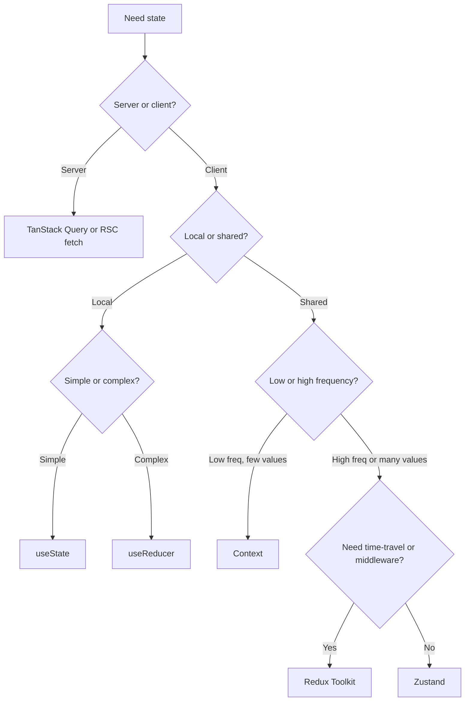
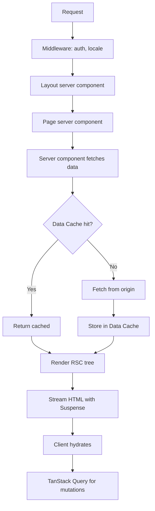
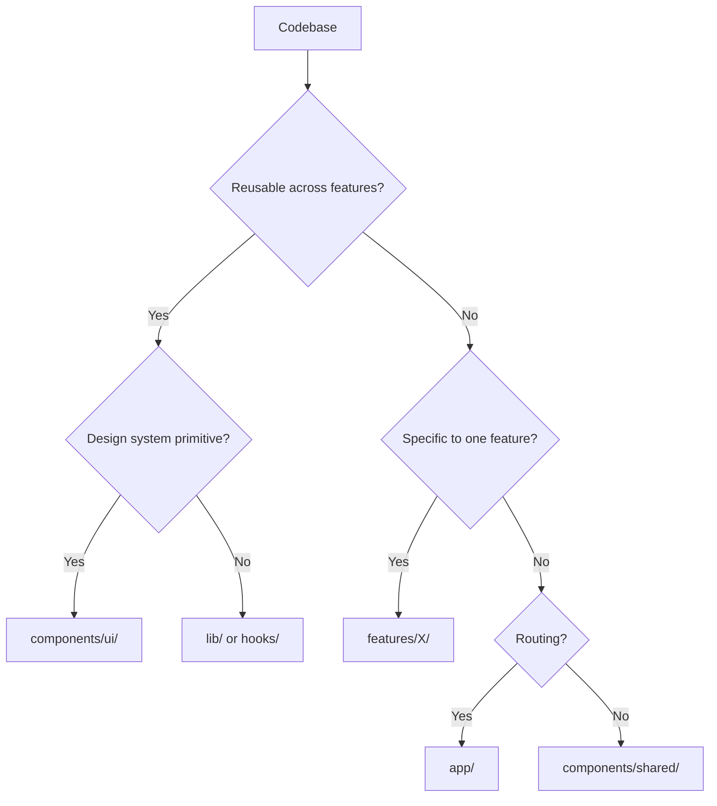
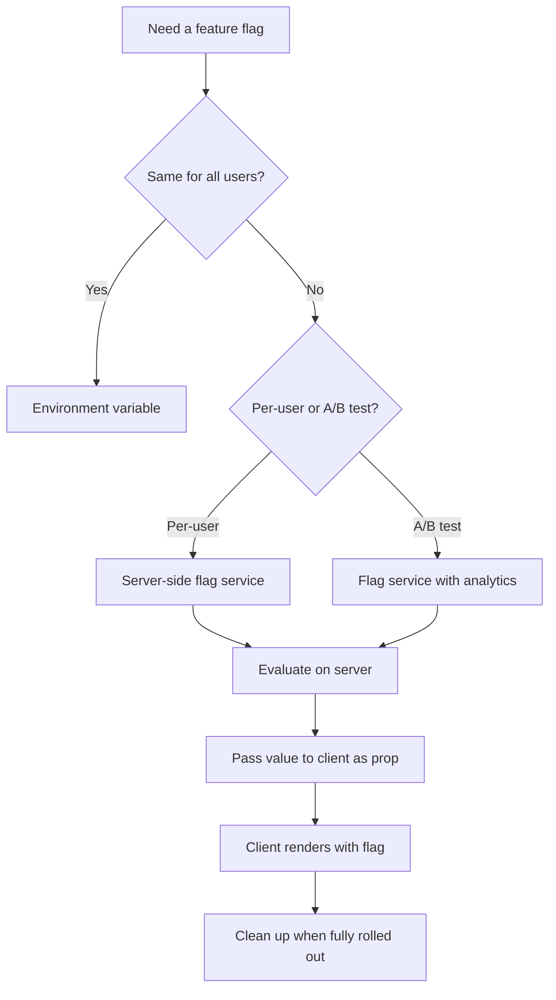

# 6.5 Frontend Architecture Questions

> Architecture interviews test your ability to make tradeoffs at scale. The questions are open-ended — "how would you structure a 50-engineer React app?" — and the interviewer cares less about your specific choice than about your reasoning. They want to see you weigh alternatives, name the failure modes, and articulate a defensible decision. This note has seventeen architectural questions covering folder structure, component extraction, custom hooks, the state-management decision tree, server vs client state, forms at scale, API integration, component libraries, theming, Next.js App Router organization, feature flags, internationalization, testing strategy, code splitting, observability, monorepos, and design systems.

## 6.5.1 How To Use This Note

For each question, sketch your answer on paper before reading the model answer. Architecture questions have multiple defensible answers; the goal is not to match the model answer exactly but to demonstrate that you have considered the tradeoffs. If your answer diverges significantly, ask yourself: did I consider the alternative? Did I name its failure mode?

Every question has four parts: **Model Answer**, **The Reasoning**, **Common Wrong Answers**, and **Follow-up Questions**. The follow-ups are where the interviewer probes depth — they will pick one of them and turn it into a new question.

> [!tip] Architecture questions are conversational
> Unlike coding questions, architecture questions are a back-and-forth. The interviewer will propose constraints ("what if the team doubles?") and see how your answer adapts. Be prepared to revise. Saying "given that new constraint, I would change X to Y" is a strong signal.

> [!warning] Do not memorize the model answers
> Memorized answers sound memorized. Internalize the reasoning instead. If you cannot rebuild the answer from first principles, you do not understand it.

## 6.5.2 Foundational Questions

### Question 1: How would you structure a large React application?

**Difficulty:** Medium

**Model Answer:**

Two main approaches: **type-based** and **feature-based**.

**Type-based** organizes by file type:

```text
src/
  components/
    Button.tsx
    Card.tsx
    Navbar.tsx
  hooks/
    useFetch.ts
    useDebounce.ts
  utils/
    format.ts
    validate.ts
  pages/
    Home.tsx
    About.tsx
  store/
    userSlice.ts
```

**Feature-based** organizes by domain feature:

```text
src/
  features/
    auth/
      components/
        LoginForm.tsx
        SignupForm.tsx
      hooks/
        useAuth.ts
      api.ts
      store.ts
      types.ts
    posts/
      components/
        PostList.tsx
        PostCard.tsx
      hooks/
        usePosts.ts
      api.ts
      types.ts
  components/
    ui/  /* shared design-system primitives */
      Button.tsx
      Card.tsx
  lib/
    utils.ts
  app/
    layout.tsx
    page.tsx
```

The senior answer is **feature-based, with a shared `components/ui/` for design-system primitives**.

Reasoning:
- **Locality of reference.** A feature's components, hooks, API, and types live together. You do not have to navigate across the codebase to understand one feature.
- **Deletion is easy.** Removing a feature means deleting one folder. In a type-based structure, deleting a feature means hunting through `components/`, `hooks/`, `utils/`, and `pages/` for related files.
- **Team boundaries.** Different teams can own different feature folders without stepping on each other.
- **Shared primitives are still shared.** `components/ui/` holds design-system components used across features.

**Tradeoffs:**
- Feature-based can lead to duplication if features share logic. Mitigation: extract shared logic to `lib/` or a separate `shared/` folder.
- The boundaries between features can be fuzzy. Mitigation: a feature is "a cohesive set of functionality that a user can describe in one sentence."

**Folder structure for Next.js App Router:**

```text
app/                    /* routing only */
  (marketing)/
    layout.tsx
    page.tsx
  (dashboard)/
    layout.tsx
    dashboard/
      page.tsx
  posts/
    [slug]/
      page.tsx
features/               /* feature modules */
  auth/
  posts/
components/             /* shared design system */
  ui/
lib/                    /* cross-cutting utilities */
  utils.ts
  db.ts
  auth.ts
```

The `app/` directory is for routing only; feature logic lives in `features/` and is imported by `app/` pages.

**The Reasoning:**

Type-based organization is the default for small projects because it is simple. It breaks down as the codebase grows: a 50-component `components/` folder is unnavigable, and a feature's logic is scattered across folders. Feature-based organization keeps related code together, which scales better. The shared `components/ui/` prevents duplication of design-system primitives.

**Common Wrong Answers:**

- "Put everything in `components/`." — Does not scale past a handful of files.
- "Organize by file type for simplicity." — Works for tiny projects, fails for large ones.
- "Use a monorepo with one package per feature." — Overkill unless you have multiple apps sharing features.

**Follow-up Questions:**

- How do you handle shared logic between features?
- When would you extract a feature into a separate package?
- How does this change for a monorepo with multiple apps?

---

### Question 2: When do you extract a component vs. leave it inline?

**Difficulty:** Medium

**Model Answer:**

Extract a component when **any** of these are true:

1. **The component is reused.** If the same UI appears in two places, extract it. Duplication is the strongest signal.
2. **The component has its own state.** A `Modal` with open/close state, a `Tabs` with selected tab, a `Dropdown` with open state — these have state that does not belong in the parent.
3. **The component has a non-trivial render.** If a single component's JSX exceeds ~50 lines or has more than two levels of nesting, extracting sub-components improves readability.
4. **The component has its own effects.** A component that subscribes to a WebSocket, manages a timer, or does any non-trivial side effect should be extracted so the effect's lifecycle is isolated.
5. **The component represents a meaningful concept.** A `UserAvatar`, a `ProductCard`, a `SearchBar` — these are concepts that have a stable identity, even if they are currently used in one place.
6. **The component is complex enough to deserve a test.** If you want to write tests for a piece of UI, extract it.
7. **The component is part of the design system.** Buttons, inputs, cards, modals — these belong in `components/ui/` from day one.

Do NOT extract a component when:
- It is used in exactly one place and is conceptually part of its parent.
- Extraction would require passing 5+ props back and forth (the parent-child interface becomes verbose).
- The "component" is just a few lines of JSX with no state.

**The heuristic:** extract on the second use, not the first. The first use does not reveal the right abstraction; the second use reveals the common shape.

**The Reasoning:**

Premature extraction creates bad abstractions. You extract a `Button` from one use, then a second use appears with a slightly different shape, and your `Button` grows props to handle both — eventually becoming a leaky abstraction. Extracting on the second use lets you see the common shape and design the abstraction correctly.

**Common Wrong Answers:**

- "Extract every component you can." — Leads to over-fragmented code with excessive prop drilling.
- "Never extract; keep everything in the page." — Leads to 1000-line files.
- "Extract based on lines of code." — A 50-line JSX block can be a single concept; a 10-line block can be two concepts. Lines are a weak signal.

**Follow-up Questions:**

- How do you decide the right abstraction level?
- When do you refactor an existing component?
- How does the design system differ from feature components?

---

### Question 3: When do you extract a custom hook?

**Difficulty:** Medium

**Model Answer:**

Extract a custom hook when **any** of these are true:

1. **The hook is reused.** Two components need the same logic (e.g., `useDebounce`, `useFetch`).
2. **The logic is non-trivial.** An effect with multiple state updates, complex cleanup, or a state machine is easier to understand when extracted.
3. **The logic has its own concern.** A `useAuth` hook that wraps the auth state, a `useTheme` hook that manages dark mode, a `useLocalStorage` hook that syncs state to localStorage — each is a single concern.
4. **The component is too long.** If a component has 3+ `useState` calls and 2+ `useEffect` calls, extracting some of the logic into a hook makes the component's purpose clearer.
5. **The logic is testable in isolation.** Hooks can be tested with `renderHook` from `@testing-library/react`, which is easier than testing a full component.

Do NOT extract a hook when:
- The logic is a single `useState` or `useEffect` used in one place. Inlining is clearer.
- The "hook" would just be a wrapper around another hook with no added logic.
- The logic is so tightly coupled to the component's render that extraction would require passing the entire component state.

**Naming convention:** `use<Noun>` for stateful hooks (`useAuth`, `useTheme`), `use<Verb>` for action hooks (`useSubmitForm`, `useDeletePost`). Be consistent.

**Examples of hooks worth extracting:**
- `useDebounce(value, delay)` — debounces a value.
- `useFetch(url)` — fetches data with loading/error states and `AbortController`.
- `useLocalStorage(key, initial)` — syncs state to localStorage.
- `useAuth()` — reads the current user from Context.
- `useForm(validations)` — wraps React Hook Form with project-specific conventions.
- `useMediaQuery(query)` — subscribes to a media query.

**The Reasoning:**

Custom hooks are the React-native way to reuse logic. Without them, you would either duplicate logic or use HOCs/render props (which are more verbose). The decision to extract is the same as for components: extract on reuse or when the logic deserves its own name.

**Common Wrong Answers:**

- "Extract a hook for every `useState`." — Premature; most `useState` calls are fine inline.
- "Hooks are only for reuse." — No; hooks are also for readability and testability.
- "Hooks cannot call other hooks." — Wrong; hooks can call hooks (that is the whole point of composition).

**Follow-up Questions:**

- How do you test a custom hook?
- When would you use a hook vs. a Context?
- How do you handle hooks that depend on each other?

---

### Question 4: How do you decide between `useState`, `useReducer`, Context, Zustand, and Redux?

**Difficulty:** Hard

**Model Answer:**

A decision tree:

1. **Is the state server state (data fetched from an API)?**  -->  Use **TanStack Query** (or SWR). Server state has different requirements: caching, invalidation, refetching, race-condition handling. Do not put server state in Redux or Zustand.
2. **Is the state local to one component?**  -->  Use **`useState`**. If the state transitions are complex (multiple related fields, conditional updates), use **`useReducer`**.
3. **Is the state shared across many components, but low-frequency (changes rarely)?**  -->  Use **Context**. Examples: theme, current user, locale.
4. **Is the state shared and high-frequency (changes often)?**  -->  Use **Zustand**. Examples: shopping cart, real-time UI state. Context causes re-renders for every consumer on every change; Zustand allows components to subscribe to slices.
5. **Do you need time-travel debugging, middleware, or a strictly enforced unidirectional flow?**  -->  Use **Redux Toolkit**. Examples: complex enterprise apps, teams already familiar with Redux.
6. **Are you joining an existing Redux codebase?**  -->  Keep using Redux. Do not introduce a second state manager.

**Concrete comparison:**

```tsx
// useState: local, simple
const [count, setCount] = useState(0);

// useReducer: local, complex transitions
const [state, dispatch] = useReducer(reducer, initial);

// Context: shared, low-frequency
const ThemeContext = createContext<'light' | 'dark'>('light');
function useTheme() { return useContext(ThemeContext); }

// Zustand: shared, high-frequency
const useCart = create<Cart>((set) => ({
  items: [],
  add: (item) => set((s) => ({ items: [...s.items, item] })),
}));

// Redux Toolkit: shared, complex, time-travel
const store = configureStore({ reducer: rootReducer });
```

**When to upgrade:**
- `useState`  -->  `useReducer` when you have ≥3 related `useState` calls.
- Context  -->  Zustand when consumers re-render too often.
- Zustand  -->  Redux when you need middleware, time-travel, or strict patterns.

**The Reasoning:**

Each tool optimizes for a different shape of state. `useState` is the cheapest; reach for it first. `useReducer` adds structure when transitions get complex. Context adds cross-tree sharing without a library. Zustand adds selective subscriptions for high-frequency updates. Redux adds the full machinery — middleware, time-travel, devtools — at the cost of boilerplate. The senior answer is to use the lightest tool that solves the problem.

**Common Wrong Answers:**

- "Use Redux for everything." — Overkill. Adds boilerplate and indirection.
- "Use Context for everything." — Causes performance issues with high-frequency state.
- "Never use Redux; it is outdated." — Wrong. Redux Toolkit is modern and excellent for the right use case.
- "Put server state in Zustand." — Loses caching, deduplication, invalidation. Use TanStack Query.

**Follow-up Questions:**

- How do you measure whether Context is causing re-renders?
- When would you use Jotai or Recoil instead of Zustand?
- How do you test a Zustand store?

---

### Question 5: When do you use server state vs. client state?

**Difficulty:** Hard

**Model Answer:**

**Server state** is data that originates from the server: a list of posts, the current user, a product catalog. It is:
- Asynchronous (fetched, not synchronous).
- Owned by the server (the client is a cache).
- Stale-prone (changes on the server without the client knowing).
- Shared across components.

**Client state** is data that originates from the client: a modal's open/close state, a form's draft, the selected theme. It is:
- Synchronous.
- Owned by the client.
- Stable (changes only when the user changes it).
- Usually local to one part of the UI.

**The rule:** server state belongs in TanStack Query (or React Server Components in Next.js). Client state belongs in `useState`/`useReducer`/Context/Zustand. Never mix the two in a single store.

**The hybrid pattern (very common):**

```tsx
// Server state: the list of todos
const { data: todos } = useQuery({
  queryKey: ['todos'],
  queryFn: fetchTodos,
});

// Client state: the "create todo" draft
const [draft, setDraft] = useState('');

// Client state: the selected filter
const [filter, setFilter] = useState<'all' | 'active' | 'done'>('all');

// Derived state: filtered list (client state applied to server state)
const visibleTodos = todos?.filter((t) =>
  filter === 'all' ? true : filter === 'active' ? !t.done : t.done
);
```

**In Next.js App Router:** server state can be fetched directly in server components — no TanStack Query needed for the initial render. TanStack Query is still useful for client-side mutations and refetching.

**The Reasoning:**

Server state and client state have different lifecycles. Server state needs caching, invalidation, refetching, and race-condition handling. Client state needs none of that. Putting server state in a state manager forces you to reimplement caching and invalidation by hand — which is exactly what TanStack Query does for you.

**Common Wrong Answers:**

- "Store everything in Redux." — Loses server-state features.
- "Store everything in TanStack Query." — TanStack Query is not designed for client state; use it for server data only.
- "Sync Redux with the server via a thunk." — Reinvents TanStack Query poorly.

**Follow-up Questions:**

- How do you handle optimistic updates with TanStack Query?
- What is the difference between server state and React Server Components?
- How do you invalidate server state after a mutation?

---

### Question 6: How do you handle forms at scale?

**Difficulty:** Hard

**Model Answer:**

**React Hook Form** is the default choice for new projects. It is:
- **Performant** — uncontrolled by default; does not re-render on every keystroke.
- **Type-safe** — integrates with Zod via `zodResolver`.
- **Feature-complete** — validation, error messages, array fields, async validation, submit handling.

**Formik** is still common in legacy codebases. It is controlled by default (re-renders on every keystroke), which is fine for small forms but slow for large ones.

**Native forms** (no library) work for trivial forms (a single input, a contact form). Use the `FormData` API on submit and validate with a Zod schema:

```tsx
async function handleSubmit(formData: FormData) {
  'use server';
  const parsed = schema.safeParse({
    email: formData.get('email'),
    password: formData.get('password'),
  });
  if (!parsed.success) {
    return { errors: parsed.error.flatten().fieldErrors };
  }
  // ... create user
}
```

**At scale:**

1. **Define a Zod schema** for every form. The schema is the source of truth for validation, types, and error messages.
2. **Use React Hook Form** with `zodResolver(schema)`. The schema's types flow into `useForm<z.infer<typeof schema>>()`.
3. **Build a `<FormField>` component** in the design system. It takes `name`, `label`, and `type`, and wires up registration, error display, and accessibility (`aria-invalid`, `aria-describedby`).
4. **Multi-step forms:** use a single schema with a `step` discriminator, or compose schemas per step. Keep the form state in React Hook Form's `useForm`; do not reset between steps unless you intend to.
5. **Server-side validation:** re-run the same Zod schema on the server. The client schema is for UX; the server schema is for security. Never trust the client.
6. **Async validation:** validate on blur, not on every keystroke. Use React Hook Form's `trigger('fieldName')`.
7. **Submit state:** use the `isSubmitting` flag to disable the button and show a spinner.

**Full example:**

```tsx
const schema = z.object({
  email: z.string().email('Enter a valid email'),
  password: z.string().min(8, 'At least 8 characters'),
});

type FormValues = z.infer<typeof schema>;

function SignupForm() {
  const { register, handleSubmit, formState: { errors, isSubmitting } } =
    useForm<FormValues>({ resolver: zodResolver(schema) });

  const onSubmit = async (values: FormValues) => {
    await api.signup(values);
  };

  return (
    <form onSubmit={handleSubmit(onSubmit)}>
      <FormField name="email" label="Email" error={errors.email?.message}>
        <input {...register('email')} type="email" />
      </FormField>
      <FormField name="password" label="Password" error={errors.password?.message}>
        <input {...register('password')} type="password" />
      </FormField>
      <button type="submit" disabled={isSubmitting}>Sign up</button>
    </form>
  );
}
```

**The Reasoning:**

Forms are where most frontend bugs live. A schema-first approach (Zod) eliminates an entire class of bugs: invalid data reaching the server. React Hook Form's uncontrolled approach eliminates the performance class of bugs (re-rendering on every keystroke). Building a `<FormField>` component eliminates the duplication class of bugs (every field wired up correctly).

**Common Wrong Answers:**

- "Use Formik for new projects." — Slower than React Hook Form for large forms.
- "Build forms by hand without a library." — Reinvents validation, error display, accessibility.
- "Validate only on the client." — Security hole; the server must validate.
- "Use one giant schema for a multi-step form." — Hard to validate per step; use per-step schemas.

**Follow-up Questions:**

- How do you handle dependent fields (e.g., country  -->  city)?
- How do you handle file uploads with React Hook Form?
- How do you test a form?

---

### Question 7: How do you handle API integration: TanStack Query vs. SWR vs. vanilla fetch?

**Difficulty:** Hard

**Model Answer:**

**Vanilla `useEffect + fetch`** is fine for learning. In production it has six problems:
1. Race conditions (rapid requests return out of order).
2. No caching (every mount re-fetches).
3. No deduplication (multiple components fetch the same data).
4. No invalidation (you must manually refetch after mutations).
5. No retry on failure.
6. Stale state on unmount (the "set state on unmounted component" warning).

**TanStack Query** solves all six:
- `queryKey` enables caching and deduplication.
- `useMutation` + `invalidateQueries` handles invalidation.
- Built-in retry, refetch-on-focus, refetch-on-reconnect.
- Request cancellation via `AbortController`.
- Optimistic updates via `onMutate` / `onError` rollback.

**SWR** is similar to TanStack Query but more minimal. It has the core (cache, dedup, revalidation) but fewer features (no built-in mutations API, no infinite query as polished). Choose SWR if you want a smaller bundle; choose TanStack Query if you want the full feature set.

**RTK Query** is the Redux-integrated option. Choose it if you are already using Redux Toolkit.

**Decision:**
- New project, no Redux  -->  **TanStack Query**.
- New project, already on Redux Toolkit  -->  **RTK Query**.
- Want the smallest bundle and minimal API  -->  **SWR**.
- Next.js App Router with mostly server components  -->  often **no library at all**; fetch directly in server components, use TanStack Query only for client mutations.

**Vanilla fetch is appropriate when:**
- The data is one-shot (a config file loaded once at startup).
- The data is client-only (reading from IndexedDB).
- You need full control over the request lifecycle (rare).

**The Reasoning:**

Vanilla fetch reinvents what TanStack Query gives you for free. The cost of TanStack Query (~13 KB gzipped) is far less than the cost of building and maintaining custom caching, invalidation, and retry logic.

**Common Wrong Answers:**

- "Vanilla fetch is fine; we just need a `useEffect`." — Race conditions, no caching, no invalidation.
- "Use Redux Thunks for data fetching." — Reinvents TanStack Query poorly.
- "TanStack Query replaces the need for a state manager." — Only for server state; you still need client state management.

**Follow-up Questions:**

- How do you handle optimistic updates?
- How do you test a component that uses TanStack Query?
- How do you prefetch data on hover?

---

## 6.5.3 Intermediate Questions

### Question 8: Build vs. buy vs. shadcn/ui for the component library?

**Difficulty:** Hard

**Model Answer:**

Three options:

1. **Build from scratch.** You write every component (`Button`, `Input`, `Modal`, etc.) using Tailwind. Pros: full control, no dependencies. Cons: you reimplement accessibility (focus traps, ARIA, keyboard nav), which is hard and easy to get wrong.

2. **Buy a library.** MUI, Chakra, Mantine, Ant Design. Pros: complete, accessible, documented. Cons: opinionated theming that is hard to override, large bundle, runtime CSS-in-JS (not RSC-compatible without adapters), look-alike UI.

3. **shadcn/ui.** Not a library — a CLI that copies component source into your project. Built on Radix UI (accessibility) and Tailwind (styling). Pros: full ownership of source (modify anything), accessible by default (Radix primitives), RSC-compatible, no runtime CSS-in-JS, looks exactly how you theme it. Cons: no version updates — you must re-pull or manually patch.

**Decision tree:**
- Small team, want it done fast, no Tailwind  -->  **MUI or Mantine**.
- Tailwind project, want ownership and accessibility  -->  **shadcn/ui**.
- Need a fully bespoke design system, have an accessibility expert  -->  **build from scratch on Radix primitives**.
- Enterprise with strict design system, multi-brand  -->  **build a custom system with Style Dictionary + Radix + Tailwind**.

**The senior default for a new Tailwind + Next.js project:** shadcn/ui.

**The Reasoning:**

shadcn/ui splits the difference: you get accessibility for free (Radix), styling for free (Tailwind), and ownership for free (source in your repo). The cost is keeping components up to date — but most teams modify components anyway, so the "automatic updates" of a traditional library are less valuable than they appear.

**Common Wrong Answers:**

- "Always build from scratch." — Accessibility is hard; you will get it wrong.
- "Always use MUI." — Opinionated theming; RSC compatibility is awkward.
- "shadcn/ui is a library." — It is not; it is a CLI that copies code into your repo. That is the point.

**Follow-up Questions:**

- How do you keep shadcn/ui components up to date?
- How do you handle a custom design system with non-standard tokens?
- When would you choose Mantine over shadcn/ui?

---

### Question 9: How do you handle theming: CSS variables vs. Tailwind config vs. styled-components?

**Difficulty:** Hard

**Model Answer:**

**CSS variables** (with Tailwind v4's `@theme` directive) is the modern default:

```css
@theme {
  --color-background: #ffffff;
  --color-foreground: #1a1a1a;
  --color-primary: #3b82f6;
}

.dark {
  --color-background: #0a0a0a;
  --color-foreground: #f5f5f5;
  --color-primary: #60a5fa;
}
```

```tsx
<div className="bg-background text-foreground">
  <button className="bg-primary text-white">Click</button>
</div>
```

**Why CSS variables win:**
- **Runtime-switchable.** Toggle a class on `<html>`; no re-render needed.
- **RSC-compatible.** Variables are CSS, not JS; server components can use them.
- **No runtime cost.** Unlike styled-components, no JS parses styles at runtime.
- **Theme-able by users.** Users can override variables in their own CSS.

**Tailwind config (v3)** stores colors in `tailwind.config.ts`:

```ts
theme: {
  extend: {
    colors: {
      primary: '#3b82f6',
    },
  },
},
```

This works but is **build-time only** — you cannot switch themes at runtime without a separate config. Use this for projects that do not need runtime theming.

**styled-components / emotion** is runtime CSS-in-JS. It is:
- Dynamic (props generate styles).
- Slow (runtime parsing, larger bundle).
- Not RSC-compatible (needs `"use client"`).

Avoid runtime CSS-in-JS in Next.js App Router projects. If you need dynamic styling, use CSS variables with conditional classes.

**Dark mode specifically:**
- Use `next-themes` to avoid the SSR flash.
- Define both light and dark variables in `@theme`.
- Use `dark:` Tailwind variants for one-off overrides.

**The Reasoning:**

CSS variables are the native browser primitive for theming. They predate every CSS-in-JS library and work everywhere. The combination of CSS variables + Tailwind gives you the ergonomics of Tailwind (`bg-primary`) and the runtime flexibility of CSS variables.

**Common Wrong Answers:**

- "Use styled-components for theming." — Runtime cost; RSC incompatibility.
- "Store themes in JS state and pass them down." — Re-renders the whole tree.
- "Use Tailwind config for dark mode." — Build-time only; cannot switch at runtime.

**Follow-up Questions:**

- How do you handle multi-tenant theming (each customer has their own brand)?
- How do you avoid the SSR flash for dark mode?
- How do you test themes?

---

### Question 10: What folder structure do you use for a Next.js App Router project?

**Difficulty:** Hard

**Model Answer:**

```text
app/                    /* routing only */
  (marketing)/          /* route group: not in URL */
    layout.tsx          /* marketing layout (nav, footer) */
    page.tsx            /* / */
    about/
      page.tsx          /* /about */
    pricing/
      page.tsx          /* /pricing */
  (dashboard)/          /* route group: not in URL */
    layout.tsx          /* dashboard layout (sidebar, topbar) */
    dashboard/
      page.tsx          /* /dashboard */
    settings/
      page.tsx          /* /settings */
  posts/
    page.tsx            /* /posts */
    [slug]/
      page.tsx          /* /posts/:slug */
  layout.tsx            /* root layout: <html>, <body>, providers */
  loading.tsx           /* root loading UI */
  error.tsx             /* root error boundary */
  global-error.tsx      /* catches errors in root layout */
  not-found.tsx         /* 404 */

features/               /* feature modules (imported by app/) */
  auth/
    components/
      LoginForm.tsx
      SignupForm.tsx
    actions.ts          /* server actions */
    api.ts              /* client-side API calls */
    schema.ts           /* Zod schemas */
    types.ts
  posts/
    components/
      PostList.tsx
      PostCard.tsx
    actions.ts
    schema.ts
    types.ts

components/             /* shared design system */
  ui/                   /* shadcn/ui components */
    button.tsx
    input.tsx
    dialog.tsx
  shared/               /* app-specific shared components */
    PageHeader.tsx
    EmptyState.tsx

lib/                    /* cross-cutting utilities */
  utils.ts              /* cn() helper, formatters */
  db.ts                 /* Prisma client */
  auth.ts               /* auth helpers */
  constants.ts

hooks/                  /* shared hooks (not feature-specific) */
  use-debounce.ts
  use-media-query.ts

stores/                 /* Zustand stores (if any) */
  cart.ts

types/                  /* global TypeScript types */
  next-auth.d.ts        /* module augmentation */
```

**Rules:**
1. `app/` is for routing only. Page files are thin: they fetch data and render feature components. No business logic in `app/`.
2. Feature modules in `features/` are self-contained: components, hooks, server actions, schemas, types.
3. Shared design system in `components/ui/`. Shared app components in `components/shared/`.
4. Cross-cutting utilities in `lib/`. Anything used by 2+ features belongs here.
5. Server actions live next to their feature, not in a global `actions/` folder.

**Colocating tests:** put `LoginForm.test.tsx` next to `LoginForm.tsx`. Do not use a separate `__tests__/` folder; colocation keeps tests visible.

**The Reasoning:**

The App Router is opinionated about routing (file-system based) but silent on the rest. Without a convention, `app/` becomes a dumping ground. The rule "routing only in `app/`" keeps page files thin and forces feature logic into testable, removable modules.

**Common Wrong Answers:**

- "Put feature components in `app/`." — Couples routing and logic; hard to test or reuse.
- "Use a `pages/` folder like the old router." — Confuses the App Router convention.
- "One giant `components/` folder for everything." — Unnavigable past 30 files.

**Follow-up Questions:**

- How do you handle route groups vs. folders?
- Where do server components live vs. client components?
- How do you organize a monorepo with multiple Next.js apps?

---

### Question 11: How do you handle feature flags?

**Difficulty:** Hard

**Model Answer:**

Three types of flags, three different strategies:

**1. Build-time flags (same for all users).** Environment variables. Use when the flag is global (e.g., `NEXT_PUBLIC_ENABLE_ANALYTICS`). Read via `process.env.NEXT_PUBLIC_...`. The value is inlined at build time.

```ts
// lib/flags.ts
export const flags = {
  analytics: process.env.NEXT_PUBLIC_ENABLE_ANALYTICS === 'true',
  newDashboard: process.env.NEXT_PUBLIC_NEW_DASHBOARD === 'true',
} as const;
```

**2. Per-user flags (server-side evaluation).** Use a flag service (LaunchDarkly, PostHog, Statsig, Flagsmith). Evaluate on the server, pass to the client as a prop. This avoids leaking flag rules to the client and avoids hydration mismatches.

```tsx
// app/dashboard/page.tsx (server component)
import { flags } from '@/lib/flags-server';

export default async function DashboardPage() {
  const user = await getUser();
  const showNewUi = await flags.evaluate('new-dashboard-ui', user);
  return <Dashboard showNewUi={showNewUi} />;
}
```

**3. A/B tests.** Same service, with analytics integration. Bucket users by a stable hash of their user ID. Track conversion events per bucket.

**Rules:**
- Define all flag names in a typed `flags.ts` file. No stringly-typed flag lookups.
- Default to **off** for new features. A flag that fails open (defaults to on) defeats the purpose.
- Clean up flags when features are fully rolled out. Dead flags cause dead code.
- For hydration safety, the server and client must agree on the flag value on first render. The server evaluates and passes the value to the client as a prop. The client does not re-evaluate on mount.

**Pattern:**

```tsx
function Feature({ flag, children, fallback = null }: {
  flag: boolean;
  children: ReactNode;
  fallback?: ReactNode;
}) {
  return flag ? <>{children}</> : <>{fallback}</>;
}

// usage
<Feature flag={showNewUi}>
  <NewDashboard />
</Feature>
```

**The Reasoning:**

Feature flags decouple deploy from release. Without them, every deploy is a release — risky. With them, you can deploy code that is hidden, then enable it for a subset of users, then expand. The cost is flag hygiene: dead flags accumulate as dead code.

**Common Wrong Answers:**

- "Use a query string parameter." — Users can self-enable features; no analytics.
- "Evaluate flags on the client." — Leaks rules; hydration mismatch.
- "Never remove flags." — Dead code; confusing for new engineers.

**Follow-up Questions:**

- How do you handle gradual rollouts (e.g., 10% of users)?
- How do you A/B test conversion?
- How do you handle flag dependencies (flag B only if flag A is on)?

---

### Question 12: How do you handle internationalization (i18n)?

**Difficulty:** Hard

**Model Answer:**

Three concerns: **routing**, **translation**, and **formatting**.

**1. Routing.** Use locale-prefixed URLs: `/en/dashboard`, `/fr/dashboard`. In Next.js App Router, use `[locale]` as the first segment, with middleware to detect the user's locale from the `Accept-Language` header and redirect.

```tsx
// app/[locale]/layout.tsx
export async function generateStaticParams() {
  return locales.map((locale) => ({ locale }));
}

export default async function LocaleLayout({
  children,
  params: { locale },
}: {
  children: ReactNode;
  params: { locale: string };
}) {
  const messages = await getMessages(locale);
  return (
    <NextIntlClientProvider locale={locale} messages={messages}>
      {children}
    </NextIntlClientProvider>
  );
}
```

```ts
// middleware.ts
export function middleware(request: NextRequest) {
  const locale = negotiateLocale(request.headers.get('accept-language'));
  return NextResponse.redirect(new URL(`/${locale}${pathname}`, request.url));
}
```

**2. Translation.** Use `next-intl` (App Router native) or `react-i18next`. Store translations as JSON keyed by locale, with namespaces for major sections:

```json
// messages/en/dashboard.json
{
  "title": "Dashboard",
  "welcome": "Welcome back, {name}",
  "stats": {
    "revenue": "Revenue",
    "users": "Active users"
  }
}
```

```tsx
const t = useTranslations('dashboard');
<h1>{t('title')}</h1>
<p>{t('welcome', { name: user.name })}</p>
```

**3. Formatting.** Use the `Intl` API for dates, numbers, and currency. Never hardcode a date format.

```ts
new Intl.DateTimeFormat(locale, { dateStyle: 'medium' }).format(date);
new Intl.NumberFormat(locale, { style: 'currency', currency: 'USD' }).format(price);
```

**Rules:**
- Translation keys are stable; the English text changes, the key does not.
- Pluralization: use ICU MessageFormat (`{count, plural, one {# item} other {# items}}`).
- RTL: when locale is `ar` or `he`, set `dir="rtl"` on `<html>`. Tailwind v3.3+ supports `rtl:` and `ltr:` variants.
- Translation files are loaded per-route to avoid shipping all translations.

**The Reasoning:**

i18n is three problems (routing, translation, formatting), each with a different solution. Mixing them — e.g., hardcoding date formats in translation strings — creates bugs that surface only in production.

**Common Wrong Answers:**

- "Use Google Translate on the client." — Slow, inaccurate, leaks content.
- "Hardcode English and translate later." — Refactoring pain.
- "Store translations in a database." — Adds latency; translations are static.
- "Build a custom i18n library." — Reinvents ICU MessageFormat poorly.

**Follow-up Questions:**

- How do you handle RTL languages?
- How do you handle missing translations in production?
- How do you handle locale-specific content (different images, different layouts)?

---

### Question 13: How do you handle testing: unit vs. integration vs. e2e?

**Difficulty:** Hard

**Model Answer:**

Three layers, each with a different purpose:

**1. Unit tests.** Test functions and hooks in isolation. Use Vitest (or Jest) with React Testing Library's `renderHook`. Fast, run on every save.

```ts
// utils/format.test.ts
test('formatCurrency formats USD', () => {
  expect(formatCurrency(1234.56, 'en-US', 'USD')).toBe('$1,234.56');
});

// hooks/use-debounce.test.ts
test('useDebounce debounces', async () => {
  const { result } = renderHook(() => useDebounce('a', 100));
  expect(result.current).toBe('a');
  await act(async () => {
    // wait 100ms
  });
});
```

**2. Integration tests.** Test components and features together, with the network mocked. Use React Testing Library + MSW (Mock Service Worker). Run on every PR.

```tsx
test('signup form submits valid data', async () => {
  server.use(
    http.post('/api/signup', () => HttpResponse.json({ ok: true })),
  );
  render(<SignupForm />);
  await user.type(screen.getByLabelText(/email/i), 'a@b.com');
  await user.type(screen.getByLabelText(/password/i), 'password');
  await user.click(screen.getByRole('button', { name: /sign up/i }));
  expect(await screen.findByText(/success/i)).toBeInTheDocument();
});
```

**3. E2E tests.** Test the full app, including the network, in a real browser. Use Playwright. Run on every deploy. E2E tests are slow; keep them focused on critical paths (login, checkout, signup).

```ts
test('user can log in', async ({ page }) => {
  await page.goto('/login');
  await page.fill('[name=email]', 'test@example.com');
  await page.fill('[name=password]', 'password');
  await page.click('button[type=submit]');
  await expect(page).toHaveURL('/dashboard');
});
```

**Distribution:**
- Unit: 70% of tests. Fast, comprehensive.
- Integration: 20% of tests. Feature-level.
- E2E: 10% of tests. Critical paths only.

**Rules:**
- **Test behavior, not implementation.** Assert what the user sees, not what the state is.
- **Mock at the boundaries.** Mock the network (MSW) and the database (test DB). Do not mock your own components.
- **Tests are code.** Refactor them, lint them, type-check them.
- **Tests fail loudly.** A flaky test is a bug; do not disable it without investigating.

**The Reasoning:**

Each layer catches a different class of bug. Unit tests catch logic bugs (wrong calculation, wrong format). Integration tests catch wiring bugs (wrong prop, wrong event handler). E2E tests catch system bugs (broken API, broken auth). Skipping a layer leaves a gap; overinvesting in one layer wastes time.

**Common Wrong Answers:**

- "We have e2e tests; we do not need unit tests." — E2e is slow; logic bugs are easier to debug in unit tests.
- "We have unit tests; we do not need e2e." — Unit tests do not catch wiring bugs.
- "Test implementation details." — Tests break on every refactor.
- "Mock everything." — Tests do not test the real code; they test the mocks.

**Follow-up Questions:**

- How do you handle flaky tests?
- How do you test hooks that use timers?
- How do you test components that use TanStack Query?

---

### Question 14: How do you handle code splitting and lazy loading at scale?

**Difficulty:** Hard

**Model Answer:**

Three layers of splitting:

**1. Route-level (automatic).** Next.js App Router splits by route. Each route is a separate chunk. No configuration needed.

**2. Heavy widgets (manual).** Lazy-load components that are large or rarely used: rich text editors, charts, maps, date pickers. Use `React.lazy` + `Suspense`.

```tsx
import { lazy, Suspense } from 'react';

const RichTextEditor = lazy(() => import('./RichTextEditor'));

function PostEditor() {
  const [showEditor, setShowEditor] = useState(false);
  return (
    <>
      <button onClick={() => setShowEditor(true)}>Edit</button>
      {showEditor && (
        <Suspense fallback={<EditorSkeleton />}>
          <RichTextEditor />
        </Suspense>
      )}
    </>
  );
}
```

**3. Below-the-fold sections.** Lazy-load sections that are not visible on initial render (a long footer, a "related products" carousel). Use `next/dynamic` with `ssr: false` for client-only components, or just `React.lazy` for shared.

**Measuring:**

Use `@next/bundle-analyzer` to see what is in each chunk:

```bash
ANALYZE=true npm run build
```

Look for:
- Chunks > 200 KB (gzipped) — candidates for splitting.
- Code that is unused on the homepage but in the initial bundle — candidates for lazy loading.
- Duplicate dependencies across chunks — candidates for `tsconfig` `paths` or shared chunks.

**In Next.js App Router:** route-level splitting is automatic. Server components are not shipped at all. Client components are split by route. Additional `React.lazy` is rarely needed beyond heavy widgets.

**The Reasoning:**

Code splitting is a performance optimization that trades initial bundle size for on-demand loading. The right granularity is at the route level (default) and at heavy widgets (lazy). Over-splitting adds HTTP overhead; under-splitting ships unused code. Measure with bundle analyzers and Lighthouse to find the right balance.

**Common Wrong Answers:**

- "Split every component." — HTTP overhead exceeds the savings.
- "Never split; the bundle is fine." — Wrong for large apps; users on mobile suffer.
- "Lazy loading is the same as code splitting." — Lazy loading is a runtime concern; code splitting is a build-time concern. They usually go together.

**Follow-up Questions:**

- How would you measure the impact of code splitting?
- How do you handle Suspense fallbacks to avoid CLS?
- How does code splitting interact with SSR?

---

## 6.5.4 Advanced Questions

### Question 15: How do you handle error handling and observability at scale?

**Difficulty:** Hard

**Model Answer:**

Three layers:

**Layer 1: Component-level errors.** Use error boundaries (`error.tsx` in Next.js App Router). Each major section (dashboard, settings, profile) should have its own error boundary so a failure in one section does not take down the whole page.

```tsx
// app/dashboard/error.tsx
'use client';
export default function DashboardError({ error, reset }: { error: Error; reset: () => void }) {
  useEffect(() => {
    reportErrorToSentry(error);
  }, [error]);

  return (
    <div>
      <h2>Something went wrong.</h2>
      <button onClick={reset}>Try again</button>
    </div>
  );
}
```

**Layer 2: Server-level errors.** Server components and server actions should catch expected errors and return user-friendly messages. Unexpected errors should be logged and re-thrown (Next.js's `error.tsx` catches them).

```tsx
'use server';
export async function createPost(formData: FormData) {
  try {
    await db.post.create({ data: { /* ... */ } });
    revalidatePath('/posts');
  } catch (err) {
    if (err instanceof Prisma.PrismaClientKnownRequestError) {
      if (err.code === 'P2002') return { error: 'Title already exists.' };
    }
    throw err;  /* unexpected; error boundary will catch */
  }
}
```

**Layer 3: Global errors.** `app/global-error.tsx` catches errors in the root layout. It must render `<html>` and `<body>` itself.

**Observability:**
- **Error tracking.** Sentry, Bugsnag, Datadog, Rollbar. Capture client-side and server-side errors, with sourcemaps for readable stack traces.
- **Performance monitoring.** Sentry Performance, Datadog APM, Vercel Analytics. Track page load times, API response times, Core Web Vitals.
- **Logging.** Structured logs (Winston, Pino) on the server. Ship to a log aggregator (Datadog, Logtail, CloudWatch).
- **Real User Monitoring (RUM).** Vercel Speed Insights, Akamai mPulse, Datadog RUM. Track actual user experience, not synthetic.
- **Analytics.** PostHog, Mixpanel, Amplitude. Track user behavior to understand which features are used.

**Best practices:**
- **Sourcemaps.** Upload sourcemaps to Sentry at build time so stack traces are readable.
- **Release tracking.** Tag errors with the release version so you can correlate regressions to deploys.
- **User context.** Include the user ID (not PII) in error reports so you can see who is affected.
- **Sampling.** For high-traffic apps, sample performance data to control cost.
- **Alerting.** Set up alerts for error rate spikes; do not rely on users reporting issues.

**The Reasoning:**

Errors are inevitable. The system's quality is measured by how it handles them: graceful degradation (error boundaries), clear user messages, and rapid diagnosis (observability). Without error tracking, you only learn about errors when users complain. Without performance monitoring, you do not know which pages are slow.

**Common Wrong Answers:**

- "Just use `try/catch`." — Catches the error but does not track it or recover the UI.
- "We have logs; that's enough." — Logs are for debugging; error tracking is for aggregating and alerting.
- "Observability is a backend concern." — Wrong; frontend errors and performance are equally important.

**Follow-up Questions:**

- How do you handle sourcemaps in production?
- How do you correlate a frontend error with a backend error?
- How do you handle PII in error reports?

---

### Question 16: How do you structure a monorepo with multiple Next.js apps sharing a design system?

**Difficulty:** Hard

**Model Answer:**

Use **Turborepo** with **pnpm workspaces** (or npm/yarn workspaces). The structure:

```text
my-monorepo/
  apps/
    marketing/         /* Next.js app: marketing site */
    dashboard/         /* Next.js app: SaaS dashboard */
    docs/              /* Next.js app: docs site */
  packages/
    ui/                /* shared design system */
    eslint-config/     /* shared ESLint config */
    tsconfig/          /* shared tsconfig */
    utils/             /* shared utilities */
    types/             /* shared types */
  turbo.json
  pnpm-workspace.yaml
```

**Workspace setup:**

```yaml
# pnpm-workspace.yaml
packages:
  - "apps/*"
  - "packages/*"
```

**Shared UI package:**

```json
// packages/ui/package.json
{
  "name": "@myorg/ui",
  "exports": {
    "./button": "./src/button.tsx",
    "./input": "./src/input.tsx",
    "./dialog": "./src/dialog.tsx"
  },
  "peerDependencies": {
    "react": "^18.0.0",
    "react-dom": "^18.0.0"
  }
}
```

```tsx
// apps/dashboard/app/page.tsx
import { Button } from '@myorg/ui/button';
```

**Turborepo config:**

```json
// turbo.json
{
  "pipeline": {
    "build": {
      "dependsOn": ["^build"],
      "outputs": [".next/**", "!.next/cache/**"]
    },
    "dev": { "cache": false, "persistent": true },
    "lint": {},
    "test": { "dependsOn": ["^build"] }
  }
}
```

**Rules:**
1. **Apps depend on packages, not on each other.** If `dashboard` needs logic from `marketing`, extract it to a package.
2. **Packages depend on packages, not on apps.** A package can depend on `@myorg/utils` but not on `@myorg/dashboard`.
3. **Mark React as a peer dependency** in packages, not a regular dependency. This avoids duplicate React copies (which break hooks).
4. **Use `exports` in `package.json`** to define the public API of each package. Internal files are not importable.
5. **Share configs.** ESLint, tsconfig, Tailwind preset, PostCSS config — all in packages, extended by apps.
6. **Build cache.** Turborepo caches builds; unchanged packages are not rebuilt.

**When to use a monorepo:**
- Multiple apps sharing a design system or business logic.
- One team owns all the apps (otherwise, polyrepo with published packages).
- You need atomic commits across apps and packages.

**When NOT to use a monorepo:**
- Single app. Use a single repo.
- Multiple teams that do not coordinate. Polyrepo with published packages is cleaner.
- Apps with very different tech stacks. The shared tooling savings do not materialize.

**The Reasoning:**

A monorepo's value is atomic commits and shared tooling. The cost is setup complexity and the need for tooling (Turborepo, Nx) to manage it. For a single team with multiple apps, the value exceeds the cost. For multiple teams that do not coordinate, polyrepo with published packages is simpler.

**Common Wrong Answers:**

- "Use a monorepo for every project." — Overkill for single-app projects.
- "Share code via npm packages in a polyrepo." — Loses atomic commits; publishing becomes a chore.
- "Put every component in its own package." — Package explosion; navigation hell.

**Follow-up Questions:**

- How do you handle versioning of internal packages?
- How do you set up CI for a monorepo?
- How do you handle a package that depends on a server-side API?

---

### Question 17: How do you build and maintain a design system at scale?

**Difficulty:** Hard

**Model Answer:**

A design system is more than a component library. It is:
1. **Tokens** (colors, spacing, typography) — the source of truth for visual decisions.
2. **Components** — built on tokens, accessible, documented.
3. **Patterns** — common compositions (a form layout, a card grid, a page header).
4. **Documentation** — Storybook, MDX, usage guidelines.
5. **Governance** — who can change what, and how.

**Tokens:**

Use the W3C Design Token Format. Author in JSON, transform with Style Dictionary, output as CSS variables (and Tailwind config if needed).

```json
// tokens/color.json
{
  "color": {
    "primary": { "value": "#3b82f6", "type": "color" },
    "background": { "value": "#ffffff", "type": "color" },
    "foreground": { "value": "#1a1a1a", "type": "color" }
  }
}
```

```js
// sd.config.js
export default {
  source: ['tokens/**/*.json'],
  platforms: {
    css: {
      transformGroup: 'css',
      buildPath: 'build/',
      files: [{ destination: 'tokens.css', format: 'css/variables' }],
    },
  },
};
```

**Components:**

Build on Radix UI primitives (accessibility for free) with Tailwind (styling). Each component:
- Has a documented API (props, slots, variants).
- Has a Storybook story.
- Has accessibility tests (axe).
- Has visual regression tests (Chromatic, Percy).

**Documentation:**

Storybook with MDX. Each component has:
- A playground (interactive props).
- Usage examples.
- Do/Don't patterns.
- Accessibility notes.

**Governance:**

- Tokens are owned by the design system team. App teams cannot override.
- Components are owned by the design system team, but app teams can request changes.
- Patterns are owned by app teams; the design system team curates.

**Deprecation workflow:**

When a component changes in a breaking way:
1. Add the new version alongside the old.
2. Mark the old as deprecated (TypeScript `@deprecated`).
3. Write a codemod (`jscodeshift`) to migrate consumers.
4. Run the codemod across apps.
5. Remove the old version in the next major release.

```js
// codemod: rename PrimaryButton to Button variant="primary"
module.exports = function (file, api) {
  const j = api.jscodeshift;
  return j(file.source)
    .find(j.JSXOpeningElement, { name: { name: 'PrimaryButton' } })
    .forEach((path) => {
      path.node.name.name = 'Button';
      path.node.attributes.push(
        j.jsxAttribute(j.jsxIdentifier('variant'), j.literal('primary'))
      );
    })
    .toSource();
};
```

**The Reasoning:**

A design system without governance decays. App teams override tokens, fork components, and the system fragments. The governance model — design system team owns tokens and components, app teams own patterns — keeps the system coherent.

**Common Wrong Answers:**

- "A design system is just a component library." — Missing tokens, patterns, documentation, governance.
- "App teams can override tokens." — Fragmentation.
- "No codemods; just break things." — App teams stop upgrading.
- "Build everything from scratch; no Radix." — Accessibility is hard; you will get it wrong.

**Follow-up Questions:**

- How do you version a design system?
- How do you handle theming for white-label apps?
- How do you measure design system adoption?

---

## 6.5.5 Practical Coding Exercises

### Exercise 1: State management decision

You are building a SaaS dashboard. State includes: the current user (rarely changes), the list of projects (fetched from API, refreshed on action), the selected project filter (local UI state), the dark mode preference, and a shopping cart for an in-app store (high-frequency updates). Choose a state tool for each.

```ts
// lib/state.ts

// 1. Current user — server state via TanStack Query (or RSC fetch)
const userQuery = useQuery({
  queryKey: ['user', 'me'],
  queryFn: () => api.get<User>('/me'),
  staleTime: 5 * 60 * 1000,  // 5 min
});

// 2. Projects list — server state via TanStack Query
const projectsQuery = useQuery({
  queryKey: ['projects'],
  queryFn: () => api.get<Project[]>('/projects'),
});

// 3. Selected project filter — local UI state
const [filter, setFilter] = useState<'all' | 'active' | 'archived'>('all');

// 4. Dark mode — Context (low-frequency, shared across tree)
const { theme, setTheme } = useTheme();  // next-themes

// 5. Shopping cart — Zustand (high-frequency, shared across tree)
const useCart = create<Cart>((set) => ({
  items: [] as CartItem[],
  add: (item) => set((s) => ({ items: [...s.items, item] })),
  remove: (id) => set((s) => ({ items: s.items.filter((i) => i.id !== id) })),
}));
```

**Reasoning:** Each piece of state has a different shape. Server state (user, projects) needs caching and invalidation — TanStack Query. Local UI state (filter) is trivial — `useState`. Low-frequency shared state (theme) is fine in Context. High-frequency shared state (cart) needs selective subscriptions — Zustand.

**Pitfalls:**
- Putting server state in Zustand — you reinvent caching.
- Putting the cart in Context — every cart update re-renders every consumer.
- Using Redux for everything — boilerplate without benefit.

**Extension:** Add an optimistic "add to cart" animation that reverts if the API call fails.

---

### Exercise 2: Feature-based folder structure

Reorganize this type-based project into a feature-based structure for a blog + admin dashboard:

```text
src/
  components/
    PostCard.tsx
    PostList.tsx
    AdminSidebar.tsx
    UserTable.tsx
    Button.tsx
    Input.tsx
  hooks/
    usePosts.ts
    useUsers.ts
    useDebounce.ts
  pages/
    index.tsx
    posts/[slug].tsx
    admin/users.tsx
  utils/
    formatDate.ts
    validateEmail.ts
```

```text
src/
  app/
    layout.tsx
    page.tsx                    /* homepage */
    posts/
      [slug]/
        page.tsx
    admin/
      layout.tsx                /* admin layout with AdminSidebar */
      users/
        page.tsx
  features/
    blog/
      components/
        PostCard.tsx
        PostList.tsx
      hooks/
        usePosts.ts
      types.ts
      api.ts
    admin/
      components/
        UserTable.tsx
        AdminSidebar.tsx
      hooks/
        useUsers.ts
      types.ts
      api.ts
  components/
    ui/
      Button.tsx
      Input.tsx
  lib/
    utils.ts                    /* formatDate, validateEmail */
  hooks/
    useDebounce.ts              /* shared, not feature-specific */
```

**Reasoning:** `blog` and `admin` are independent features with their own components, hooks, and types. The shared design system (`Button`, `Input`) lives in `components/ui/`. The shared utilities (`formatDate`, `validateEmail`) live in `lib/utils.ts`. The shared `useDebounce` lives in `hooks/` because it is not feature-specific.

**Pitfalls:**
- Putting `Button` in `features/blog/` — it is shared, not blog-specific.
- Putting `useDebounce` in `features/blog/` — same reason.
- Forgetting `app/admin/layout.tsx` — the sidebar should be in the layout, not the page.

**Extension:** Add a `settings` feature with its own components and hooks.

---

### Exercise 3: Theming implementation

Implement a runtime-switchable theme (light/dark) with no SSR flash, using Tailwind v4 and `next-themes`.

```css
/* app/globals.css */
@import "tailwindcss";

@theme {
  --color-background: #ffffff;
  --color-foreground: #1a1a1a;
  --color-primary: #3b82f6;
  --color-primary-foreground: #ffffff;
  --color-muted: #f5f5f5;
  --color-border: #e5e5e5;
}

.dark {
  --color-background: #0a0a0a;
  --color-foreground: #f5f5f5;
  --color-primary: #60a5fa;
  --color-primary-foreground: #0a0a0a;
  --color-muted: #1a1a1a;
  --color-border: #2a2a2a;
}
```

```tsx
// app/layout.tsx
import { ThemeProvider } from 'next-themes';

export default function RootLayout({ children }: { children: ReactNode }) {
  return (
    <html lang="en" suppressHydrationWarning>
      <body>
        <ThemeProvider
          attribute="class"
          defaultTheme="system"
          enableSystem
          disableTransitionOnChange
        >
          {children}
        </ThemeProvider>
      </body>
    </html>
  );
}
```

```tsx
// components/ThemeToggle.tsx
'use client';
import { useTheme } from 'next-themes';
import { useEffect, useState } from 'react';

export function ThemeToggle() {
  const { theme, setTheme } = useTheme();
  const [mounted, setMounted] = useState(false);
  useEffect(() => setMounted(true), []);
  if (!mounted) return <div className="h-10 w-10" />;  /* avoid hydration mismatch */
  return (
    <button
      onClick={() => setTheme(theme === 'dark' ? 'light' : 'dark')}
      className="rounded-md bg-background p-2 text-foreground border border-border"
      aria-label="Toggle theme"
    >
      {theme === 'dark' ? '' : ''}
    </button>
  );
}
```

**Reasoning:** CSS variables in `@theme` give Tailwind utilities like `bg-background` and `text-foreground` that respond to the `.dark` class. `next-themes` sets the class on `<html>` before React hydrates (via an inline script), avoiding the flash. `suppressHydrationWarning` on `<html>` is required because the class differs between server and client. `mounted` guards the toggle to avoid hydration mismatch on the icon.

**Pitfalls:**
- Forgetting `suppressHydrationWarning` — React warns about the class mismatch.
- Using `useTheme` in a server component — it requires `"use client"`.
- Hardcoding the icon before mount — causes a flash of the wrong icon.

**Extension:** Add a third theme (e.g., "high contrast") and a system default.

---

### Exercise 4: Feature flag integration

Implement a typed feature flag system with server-side evaluation and hydration-safe client usage.

```ts
// lib/flags.ts
export const FLAG_NAMES = ['newDashboard', 'betaFeatures', 'checkoutV2'] as const;
export type FlagName = (typeof FLAG_NAMES)[number];
export type Flags = Record<FlagName, boolean>;

export const defaultFlags: Flags = {
  newDashboard: false,
  betaFeatures: false,
  checkoutV2: false,
};

// Server-side: evaluate via flag service
export async function evaluateFlags(userId: string): Promise<Flags> {
  const service = getFlagService();
  const results = await Promise.all(
    FLAG_NAMES.map(async (name) => [name, await service.evaluate(name, userId)] as const)
  );
  return Object.fromEntries(results) as Flags;
}
```

```tsx
// app/dashboard/page.tsx (server component)
import { evaluateFlags } from '@/lib/flags';
import { getCurrentUser } from '@/lib/auth';

export default async function DashboardPage() {
  const user = await getCurrentUser();
  const flags = user ? await evaluateFlags(user.id) : defaultFlags;
  return <Dashboard flags={flags} />;
}
```

```tsx
// features/dashboard/components/Dashboard.tsx
'use client';
import { type Flags } from '@/lib/flags';

export function Dashboard({ flags }: { flags: Flags }) {
  return (
    <div>
      {flags.newDashboard ? <NewDashboard /> : <OldDashboard />}
      {flags.betaFeatures && <BetaBanner />}
    </div>
  );
}
```

```tsx
// components/Feature.tsx
export function Feature({
  flag,
  children,
  fallback = null,
}: {
  flag: boolean;
  children: ReactNode;
  fallback?: ReactNode;
}) {
  return <>{flag ? children : fallback}</>;
}
```

**Reasoning:** Server-side evaluation avoids leaking flag rules to the client and avoids hydration mismatches (the server's value is the first value the client sees). Typed `FlagName` prevents typos. `defaultFlags` ensures a safe default if the flag service fails.

**Pitfalls:**
- Evaluating flags on the client — leaks rules, hydration mismatch.
- Using string flag names — typos go unnoticed.
- Defaulting to `true` — a failed flag service enables features for everyone.

**Extension:** Add gradual rollout (10% of users) via a stable hash of the user ID.

---

### Exercise 5: i18n setup

Set up i18n for a Next.js App Router project with two locales (en, fr), locale-prefixed URLs, and middleware to detect the user's locale.

```ts
// i18n/config.ts
export const locales = ['en', 'fr'] as const;
export type Locale = (typeof locales)[number];
export const defaultLocale: Locale = 'en';
```

```ts
// middleware.ts
import { NextResponse, type NextRequest } from 'next/server';
import { locales, defaultLocale } from '@/i18n/config';

export function middleware(request: NextRequest) {
  const pathname = request.nextUrl.pathname;
  const hasLocale = locales.some((l) => pathname.startsWith(`/${l}/`) || pathname === `/${l}`);
  if (hasLocale) return;

  const acceptLang = request.headers.get('accept-language') ?? '';
  const detected = detectLocale(acceptLang);
  const url = request.nextUrl.clone();
  url.pathname = `/${detected}${pathname}`;
  return NextResponse.redirect(url);
}

function detectLocale(header: string): Locale {
  for (const part of header.split(',')) {
    const code = part.split(';')[0].split('-')[0].toLowerCase();
    if (locales.includes(code as Locale)) return code as Locale;
  }
  return defaultLocale;
}

export const config = {
  matcher: ['/((?!_next|api|.*\\..*).*)'],
};
```

```tsx
// app/[locale]/layout.tsx
import { locales, type Locale } from '@/i18n/config';
import { NextIntlClientProvider } from 'next-intl';

export async function generateStaticParams() {
  return locales.map((locale) => ({ locale }));
}

export default async function LocaleLayout({
  children,
  params: { locale },
}: {
  children: ReactNode;
  params: { locale: Locale };
}) {
  const messages = (await import(`@/messages/${locale}.json`)).default;
  return (
    <html lang={locale}>
      <body>
        <NextIntlClientProvider locale={locale} messages={messages}>
          {children}
        </NextIntlClientProvider>
      </body>
    </html>
  );
}
```

```tsx
// app/[locale]/dashboard/page.tsx
'use client';
import { useTranslations } from 'next-intl';

export default function DashboardPage() {
  const t = useTranslations('dashboard');
  return (
    <div>
      <h1>{t('title')}</h1>
      <p>{t('welcome', { name: 'Alice' })}</p>
    </div>
  );
}
```

```json
// messages/en.json
{
  "dashboard": {
    "title": "Dashboard",
    "welcome": "Welcome back, {name}"
  }
}
```

```json
// messages/fr.json
{
  "dashboard": {
    "title": "Tableau de bord",
    "welcome": "Bienvenue, {name}"
  }
}
```

**Reasoning:** Locale-prefixed URLs are bookmarkable and shareable. Middleware detects the user's locale and redirects. `generateStaticParams` pre-renders all locales at build time. `next-intl` provides the `useTranslations` hook and ICU MessageFormat for pluralization.

**Pitfalls:**
- Forgetting `generateStaticParams` — locales are rendered on-demand, not pre-built.
- Hardcoding the locale in `<html lang>` — use `params.locale`.
- Using string interpolation instead of ICU — breaks pluralization.

**Extension:** Add an RTL locale (Arabic) and verify layout direction.

---

## 6.5.6 Mermaid Diagrams









## 6.5.7 Common Wrong Answers and Why They Fail

The most common architecture interview failure is **not justifying the choice**. A candidate who says "I would use Redux" without naming the tradeoffs has not thought about it. The senior answer is "I would use Zustand for X reasons, but Redux would be appropriate if Y."

The second is **over-engineering**. A candidate who proposes a monorepo with one package per feature for a 5-engineer team is adding complexity without benefit. The senior answer matches the solution to the team size and project complexity.

The third is **ignoring team dynamics**. Architecture is not just a technical decision; it affects how teams work. A candidate who does not mention team boundaries, code ownership, or review processes has missed the point.

The fourth is **not knowing the alternatives**. A candidate who recommends Zustand but cannot articulate why not Redux, Context, or Jotai has not actually chosen; they have defaulted.

The fifth is **treating architecture as static**. A candidate who designs for the current state without considering how it will evolve has missed the point. Architecture is about enabling change.

The sixth is **confusing server state with client state**. Putting server data in Redux (or Zustand) reinvents caching and invalidation. Server state belongs in TanStack Query (or RSC fetches).

The seventh is **skipping observability**. An architecture without error tracking, performance monitoring, and logging is incomplete. "How do you know if it works in production?" is a question every interviewer asks.

> [!warning] The single most common mistake
> Reaching for a state manager (Redux, Zustand) for server state. Server state has different requirements (caching, invalidation, refetching) that state managers do not handle. Use TanStack Query for server state; use state managers for client state.

## 6.5.8 Tips For Acing The Interview

1. **Name the tradeoffs.** Every choice has costs. Articulate them.
2. **Match the solution to the team.** A 5-engineer team and a 50-engineer team need different architectures.
3. **Consider evolution.** How will this architecture handle 2x growth? 10x?
4. **Cite specific tools.** "TanStack Query" beats "a data fetching library." Specificity signals experience.
5. **Acknowledge the alternatives.** When you choose Zustand, mention Redux, Context, and Jotai, and why you did not pick them.
6. **Mention testing and observability.** Architecture is not just about code organization; it includes how you verify and monitor.
7. **Be honest about your experience.** If you have not used a tool, say so. Inventing experience is obvious.
8. **Sketch on a whiteboard.** Architecture is visual. Diagrams make your thinking clear.
9. **Ask clarifying questions.** "Is this a new project or an existing codebase?" changes the answer.
10. **Have a default.** When asked "how would you structure X?", lead with your default and then explain when you would deviate.

## 6.5.9 Mock Interview Sequence

**Interviewer:** "You are building a SaaS dashboard for a 10-engineer team. How would you structure the codebase?"

**Candidate:** "I would use a feature-based folder structure with the Next.js App Router for routing. The `app/` directory contains only routing files — pages, layouts, loading, error. Feature logic lives in `features/`, with each feature (auth, posts, billing, settings) having its own folder containing components, hooks, server actions, API calls, and Zod schemas. A shared `components/ui/` folder holds the design system, built on shadcn/ui. A `lib/` folder holds cross-cutting utilities like the database client, auth helpers, and formatters."

**Interviewer:** "Why feature-based over type-based?"

**Candidate:** "Locality of reference. When you work on the billing feature, you want everything — components, hooks, actions, types — in one folder, not scattered across `components/`, `hooks/`, `actions/`. It also makes deletion easy: if you remove a feature, you delete one folder. And it scales to multiple teams — each team owns a feature folder without stepping on others. Type-based works for small projects but breaks down past 30 components or so."

**Interviewer:** "How do you handle state?"

**Candidate:** "I split server state from client state. Server state goes through TanStack Query — it handles caching, deduplication, and invalidation, which I do not want to build myself. For client state, I use `useState` and `useReducer` for local state, Context for low-frequency shared state like theme and current user, and Zustand for higher-frequency shared state like a shopping cart. Forms use React Hook Form with Zod, and the same Zod schema runs on the server for server actions."

**Interviewer:** "Why not just use Redux for everything?"

**Candidate:** "Redux's overhead — boilerplate, the store setup, the reducer patterns — is rarely justified in modern Next.js. Server components handle most of the data fetching that Redux used to centralize. TanStack Query handles the client-side mutations and refetching. Redux is the right tool if you need time-travel debugging, complex middleware, or you are joining an existing Redux codebase. For a new SaaS dashboard, Zustand plus TanStack Query is simpler and faster to develop."

**Interviewer:** "How do you handle theming and dark mode?"

**Candidate:** "I use CSS variables in Tailwind's `@theme` directive. The variables are defined in `:root` for the default theme, and overridden in a `.dark` selector for dark mode. The `dark` class is toggled on `<html>` based on the user's preference, detected via `next-themes` to prevent the SSR flash. This gives me runtime-switchable themes, type-safe utilities like `bg-background` and `text-foreground`, and compatibility with React Server Components — which runtime CSS-in-JS libraries do not have."

**Interviewer:** "How do you handle feature flags?"

**Candidate:** "Depends on the type. Build-time flags that are the same for all users — environment variables. Per-user flags — server-side evaluation in a server component, reading from a flag service like LaunchDarkly or PostHog. A/B tests — the same service, with analytics integration. I would define all flag names in a `flags.ts` file with TypeScript types, default to off, and clean up flags when features are fully rolled out. For hydration safety, the server and client must agree on the flag value on first render — so the server evaluates and passes the value to the client as a prop."

**Interviewer:** "How do you test this?"

**Candidate:** "Three layers. Unit tests with Vitest and React Testing Library for utility functions, hooks, and isolated components — fast, run on every save. Integration tests with MSW mocking the API for feature-level flows like checkout or signup — run on every PR. E2E tests with Playwright for the critical user paths — login, checkout, dashboard load — run on every deploy. I focus on testing behavior, not implementation — assert what the user sees, not what the state is. And I mock at the boundaries — the network, the database — not at the component level."

**Interviewer:** "Last question: how do you handle observability?"

**Candidate:** "Sentry for error tracking on both client and server, with sourcemaps uploaded at build time so stack traces are readable. Vercel Analytics for Core Web Vitals and page-level performance. Structured logging on the server with Pino, shipped to a log aggregator. Release tracking in Sentry so we can correlate regressions to deploys. And alerting — if the error rate spikes above 1%, the on-call engineer gets paged. The combination of error tracking, performance monitoring, and logging covers the three things you need to debug production issues: what broke, when, and for whom."

**Interviewer:** "Strong answer. You mentioned shadcn/ui for the design system. Why not MUI or Mantine?"

**Candidate:** "Three reasons. First, accessibility: shadcn/ui is built on Radix UI primitives, which have best-in-class focus management, ARIA, and keyboard navigation. Second, ownership: the CLI copies component source into my project, so I can modify anything without fighting the library's API. MUI's theming system is powerful but opinionated; if I want to change something it does not expose, I am stuck. Third, RSC compatibility: shadcn/ui components are Tailwind-based, so they work with React Server Components. MUI and Mantine have RSC-compatible variants now, but the migration is not as clean. For a Tailwind-based Next.js project, shadcn/ui is the path of least resistance."

**Interviewer:** "Good."

This is the rhythm: clear choice, then the why, then the alternatives, then the tradeoffs. Practice it.

## 6.5.10 Self-Assessment Checklist

- [ ] I can articulate feature-based vs type-based folder structure and defend my choice.
- [ ] I know when to extract a component and when to leave it inline.
- [ ] I know when to extract a custom hook.
- [ ] I can walk through the state management decision tree (useState, useReducer, Context, Zustand, Redux).
- [ ] I can articulate the difference between server state and client state.
- [ ] I can choose between React Hook Form, Formik, and native forms.
- [ ] I can compare TanStack Query, SWR, and vanilla fetch.
- [ ] I can defend a choice between building, buying, and shadcn/ui.
- [ ] I can implement theming with CSS variables and Tailwind.
- [ ] I can describe a Next.js App Router folder structure.
- [ ] I can implement feature flags at multiple layers (build-time, per-user, A/B test).
- [ ] I can handle i18n with routing, translation, and formatting.
- [ ] I can describe a testing strategy with unit, integration, and e2e.
- [ ] I can handle code splitting at scale.
- [ ] I can set up error handling and observability (error boundaries, Sentry, logging).
- [ ] I can structure a monorepo with Turborepo.
- [ ] I can describe how to build and maintain a design system (tokens, components, governance).

## 6.5.11 Related Notes

- [[3.15 Project Architecture and Folder Organization]]
- [[3.14 Reusable Component Design]]
- [[3.9 Context and Reducers]]
- [[3.16 API Integration and Data Fetching]]
- [[4.13 Project Organization and Performance]]
- [[2.8 Organizing Large Tailwind Projects]]
- [[6.3 React Interview Questions]]
- [[6.4 Next.js Interview Questions]]
- [[6.6 Performance Questions]]
- [[6.7 Accessibility Questions]]
- [[6.8 Practical Coding and Debugging Exercises]]
