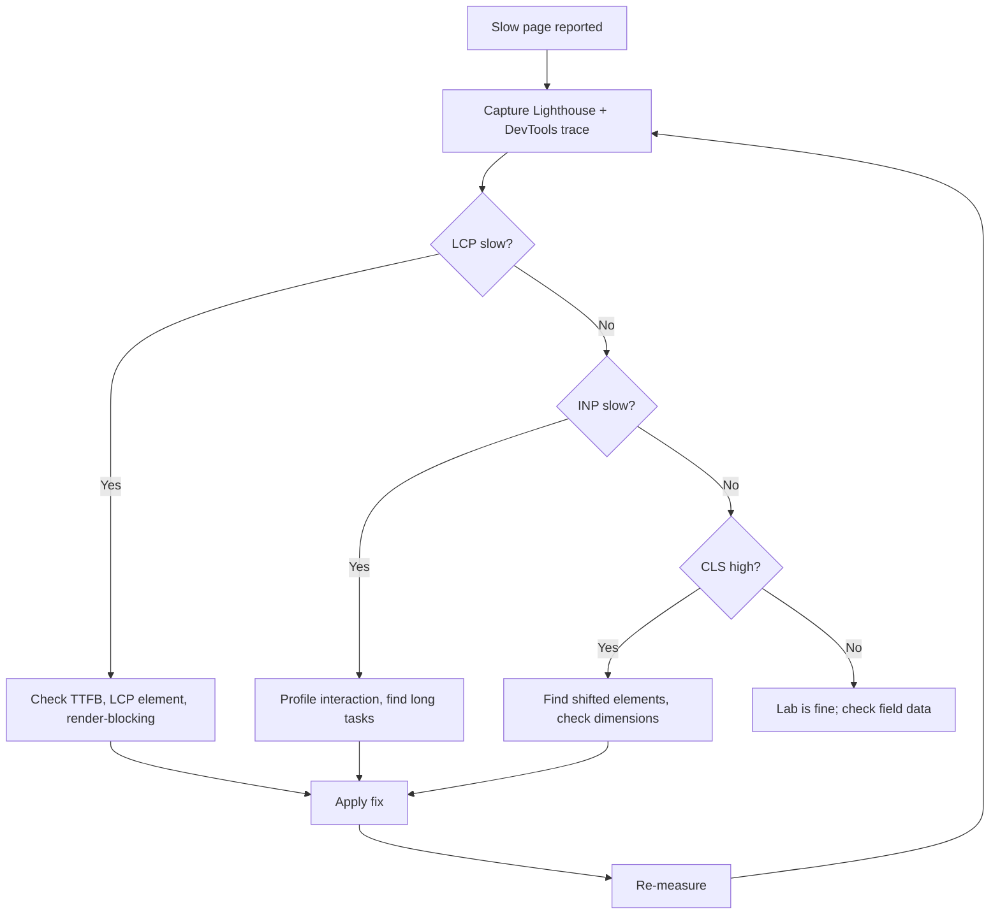
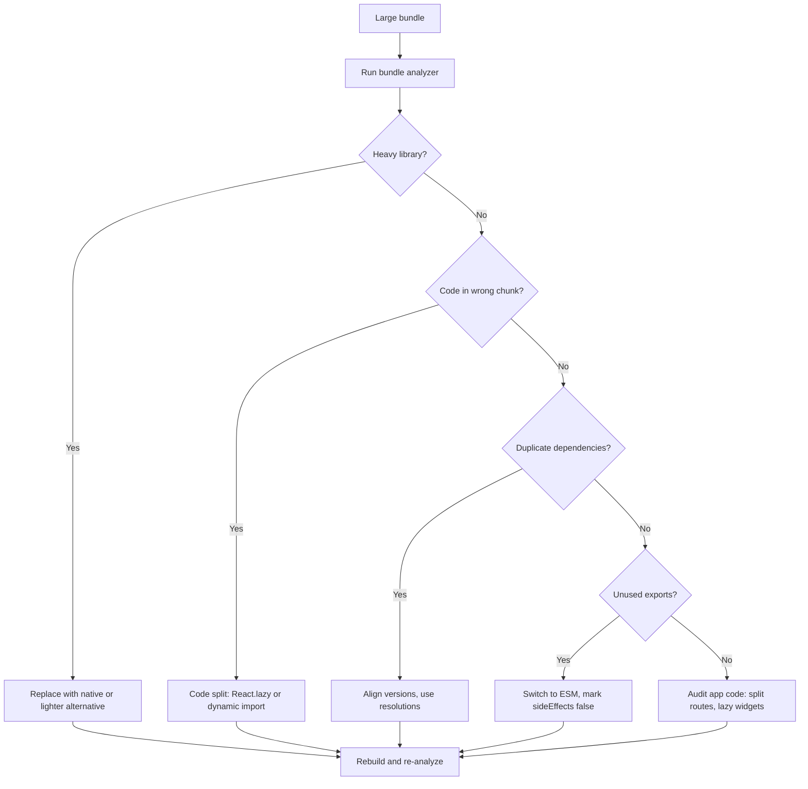
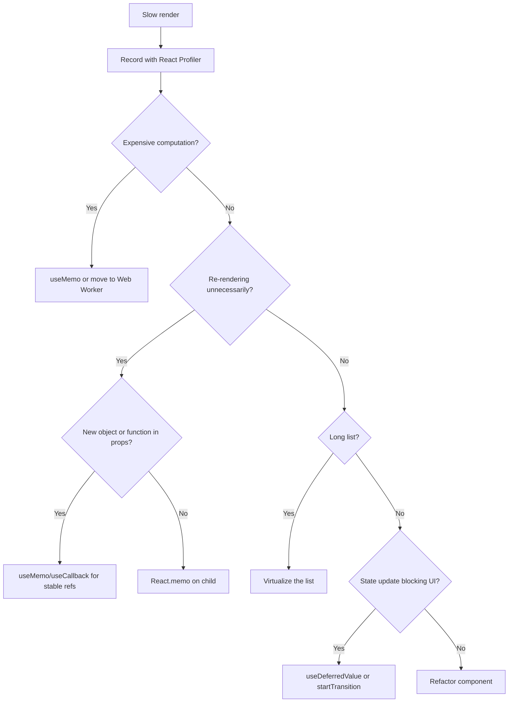

# 6.6 Performance Questions

> Performance interviews test whether you can measure, diagnose, and fix slow web apps. The questions move from definitions ("what is LCP?") to debugging ("a page loads in 5 seconds, where do you start?") to architecture ("how do you keep a 100-route app fast as it grows?"). The interviewer wants to see that you understand Core Web Vitals, know your way around Chrome DevTools and Lighthouse, can name the common React and Next.js performance anti-patterns, and have a measurement discipline — never optimize without measuring first. This note has seventeen questions plus three debugging exercises.

## 6.6.1 How To Use This Note

For each question, sketch your answer before reading the model answer. Performance questions reward specificity — vague answers like "optimize the bundle" fail. The senior answer names a specific metric, a specific tool, and a specific change.

Every question has four parts: **Model Answer**, **The Reasoning**, **Common Wrong Answers**, and **Follow-up Questions**. The three debugging exercises in 6.6.5 are full worked walkthroughs — read them, then re-do them from memory.

> [!tip] Always measure first
> Performance work without measurement is superstition. Before optimizing, capture a Lighthouse report, a DevTools Performance trace, and a React Profiler recording. After optimizing, capture the same three and compare. If you cannot show the improvement in numbers, you did not improve anything.

> [!warning] The "fast on my machine" trap
> Your dev machine is fast. Your users' phones are not. Always test on a throttled connection (Slow 3G, 4x CPU slowdown) in DevTools. A page that loads in 1 second on your M2 MacBook can take 12 seconds on a mid-range Android over 4G.

## 6.6.2 Foundational Questions

### Question 1: What are Core Web Vitals and why do they matter?

**Difficulty:** Easy

**Model Answer:**

Core Web Vitals are Google's three user-centric metrics for page experience:

1. **LCP (Largest Contentful Paint)** — the time until the largest visible element (usually a hero image or heading) renders. Target: ≤ 2.5 seconds.
2. **INP (Interaction to Next Paint)** — the time between a user interaction (click, tap, keypress) and the next paint. Replaced FID (First Input Delay) in 2024. Target: ≤ 200 milliseconds.
3. **CLS (Cumulative Layout Shift)** — the sum of unexpected layout shifts during the page's lifetime. Target: ≤ 0.1.

**Why they matter:**
- **SEO.** Google uses Core Web Vitals as a ranking signal (the "page experience" update). Slow pages rank lower.
- **User experience.** Pages that meet the targets feel instant. Pages that miss them feel sluggish.
- **Business.** Studies (Pinterest, BBC, Vodafone) show that improving Core Web Vitals correlates with increased conversions and decreased bounce rate.

**Other important metrics (not Core Web Vitals, but worth tracking):**
- **TTFB (Time to First Byte)** — server responsiveness. Target: ≤ 800 ms.
- **FCP (First Contentful Paint)** — first sign the page is loading. Target: ≤ 1.8 seconds.
- **TBT (Total Blocking Time)** — total time the main thread was blocked. Lab equivalent of INP. Target: ≤ 200 ms.
- **TTI (Time to Interactive)** — when the page is fully interactive. Deprecated in favor of INP but still useful.

**Measurement:** Chrome UX Report (CrUX) for field data (real users), Lighthouse for lab data (synthetic). The two can diverge significantly — field data is the truth, lab data is for diagnosis.

**The Reasoning:**

Core Web Vitals are user-centric: they measure what the user perceives, not what the browser does. LCP measures perceived load speed. INP measures interactivity. CLS measures visual stability. Together they capture the three dimensions of "does this page feel fast."

**Common Wrong Answers:**

- "Page load time." — Vague; not user-centric.
- "Time to interactive." — Deprecated; INP is the modern metric.
- "DOM Content Loaded." — A browser event, not a user experience.
- "Lighthouse score." — A weighted aggregate; the individual metrics matter more.

**Follow-up Questions:**

- What is the difference between lab data and field data?
- How does Core Web Vitals affect SEO?
- What is a "good" LCP for a content-heavy page?

---

### Question 2: What causes a slow LCP, and how do you fix it?

**Difficulty:** Medium

**Model Answer:**

LCP measures the largest visible element. The most common LCP elements are: hero images, hero background images, large text blocks, and video posters.

**Common causes:**

1. **Slow server response (high TTFB).** The browser cannot render the LCP element until the server sends HTML. If TTFB is 2 seconds, LCP is at least 2 seconds.
2. **Render-blocking CSS and JS.** The browser must download and parse CSS before rendering. Large CSS files block LCP.
3. **Slow LCP resource download.** If the LCP element is an image, the image download time is the bottleneck.
4. **Client-side rendering.** SPAs that fetch data on mount delay LCP — the browser shows a blank page until React mounts and fetches data.
5. **Third-party scripts.** Analytics, ads, embeds — they compete for bandwidth and main thread time.
6. **Web fonts.** If the LCP text uses a custom font, the browser may delay rendering until the font loads (or fall back, causing a flash).

**Fixes (in order of impact):**

1. **Server-side render.** Next.js App Router renders on the server by default. The LCP element is in the initial HTML.
2. **Optimize the LCP image.** Use `next/image` for automatic format negotiation (WebP/AVIF), responsive sizes, and lazy-loading of below-the-fold images.
3. **Preload the LCP image.** `<link rel="preload" as="image" href="...">` tells the browser to start downloading before it parses the HTML.
4. **Inline critical CSS.** Extract the CSS needed for above-the-fold content and inline it in `<head>`.
5. **Defer non-critical JS.** Use `defer` (or `async` for analytics) on scripts that are not needed for first paint.
6. **Use `next/font`.** Self-hosts fonts, applies `font-display: swap`, and avoids layout shift.
7. **Reduce third-party scripts.** Audit with Lighthouse's "Reduce JavaScript execution time" opportunity. Move tags to a tag manager; defer non-essential ones.
8. **Use a CDN.** Serve static assets from the edge, close to the user.

**Diagnosing:**

Open Chrome DevTools  -->  Performance tab  -->  Record a page load. Look at the "Main" track for long tasks. Look at the "Network" track for slow requests. The LCP element is marked with a red line in the "Timings" track.

**The Reasoning:**

LCP is the sum of TTFB + resource download + render time. Improving any of the three improves LCP. The biggest wins are usually SSR (eliminates the client-side fetch delay) and image optimization (modern formats are 30-50% smaller).

**Common Wrong Answers:**

- "Just lazy-load everything." — Lazy-loading the LCP element delays it.
- "Add more caching." — Does not help if the bottleneck is the image download.
- "Use a CDN." — Helps for static assets but not for slow server logic.

**Follow-up Questions:**

- How do you measure LCP in production?
- What is the difference between `preload` and `prefetch`?
- How does SSR improve LCP?

---

### Question 3: What causes a slow INP, and how do you fix it?

**Difficulty:** Medium

**Model Answer:**

INP measures the time between a user interaction (click, tap, keypress) and the next paint. A slow INP means the page feels unresponsive — clicks take a noticeable delay to register.

**Common causes:**

1. **Long tasks on the main thread.** JavaScript that runs > 50 ms blocks the main thread, delaying the next paint.
2. **Expensive event handlers.** A click handler that does heavy work (sorting, filtering, syncing to localStorage) delays the next paint.
3. **Render-blocking JS.** If a script is executing when the user clicks, the click is queued.
4. **Large re-renders.** A click that triggers a state update causing many components to re-render.
5. **Third-party scripts.** Analytics, ads, embeds running long tasks.

**Fixes:**

1. **Break up long tasks.** Use `setTimeout` (yields to the main thread), `requestIdleCallback`, or the new `scheduler.yield()` API.

```ts
async function processItems(items: Item[]) {
  for (const item of items) {
    doWork(item);
    if (shouldYield()) {
      await new Promise((r) => setTimeout(r, 0));
    }
  }
}
```

2. **Debounce or throttle expensive handlers.** A search input that filters 10,000 items should debounce.

3. **Use `useDeferredValue` for non-urgent updates.** React 18's `useDeferredValue` lets urgent updates (typing) paint immediately while deferred updates (filtered list) render in the background.

```tsx
const [query, setQuery] = useState('');
const deferredQuery = useDeferredValue(query);
const filtered = useMemo(() => filter(items, deferredQuery), [items, deferredQuery]);
```

4. **Memoize expensive renders.** `React.memo`, `useMemo`, `useCallback` prevent re-renders of unchanged subtrees.

5. **Move work off the main thread.** Use a Web Worker for CPU-heavy work (parsing, sorting, image processing).

6. **Defer third-party scripts.** Load analytics with `async` or after `load` event.

**Diagnosing:**

Chrome DevTools  -->  Performance  -->  Record while interacting. Look for long tasks (red triangles) between the interaction and the next paint. The "Interactions" track shows INP directly.

For field data: use `web-vitals` library to log INP to analytics.

```ts
import { onINP } from 'web-vitals';
onINP((metric) => {
  navigator.sendBeacon('/analytics', JSON.stringify({ inp: metric.value }));
});
```

**The Reasoning:**

INP is a main-thread metric. The fix is to keep the main thread free: break up long tasks, defer non-urgent work, and move CPU-heavy work to Web Workers. React 18's concurrent features (`useDeferredValue`, `startTransition`) are designed for exactly this.

**Common Wrong Answers:**

- "INP is about network speed." — No, it is about main thread responsiveness.
- "Just add `useMemo` everywhere." — Memoization helps re-renders, not long tasks.
- "Disable third-party scripts." — Helps, but you usually need them.

**Follow-up Questions:**

- How does `useDeferredValue` differ from debouncing?
- When would you use a Web Worker?
- How do you measure INP in production?

---

### Question 4: What causes layout shift (CLS), and how do you fix it?

**Difficulty:** Medium

**Model Answer:**

CLS measures unexpected layout shifts — when elements move after the page has rendered. Common causes:

1. **Images without dimensions.** An `` without `width` and `height` reserves no space; when it loads, the content below shifts down.
2. **Web fonts.** A custom font that has different metrics than the fallback causes a "FOIT" (flash of invisible text) or "FOUT" (flash of unstyled text) shift.
3. **Ads and embeds.** Late-loading ads push content down.
4. **Dynamically injected content.** A banner that appears after load shifts the page.
5. **Async hydration.** Server-rendered HTML that hydrates into a different shape shifts.

**Fixes:**

1. **Always set dimensions on images and videos.** Use `width` and `height` attributes (or `aspect-ratio` CSS). The browser reserves space before the image loads.

```tsx

```

2. **Use `next/image`.** Automatically sets dimensions, serves modern formats, and lazy-loads below-the-fold images.

3. **Use `next/font`.** Self-hosts fonts, applies `font-display: swap`, and uses `size-adjust` to match the fallback font's metrics, eliminating the font shift.

4. **Reserve space for ads and embeds.** Use a placeholder `min-height` container.

```css
.ad-slot { min-height: 250px; }
```

5. **Avoid injecting content above existing content.** If you must (a cookie banner, a notification), use `transform` or `position: absolute` so it does not push content down.

6. **Set `aspect-ratio` for responsive media.**

```css
.video-container {
  aspect-ratio: 16 / 9;
}
```

**Diagnosing:** Chrome DevTools  -->  Performance  -->  Record a page load. Look at the "Experience" track — red bars indicate layout shifts. Click a shift to see what moved. Lighthouse's "Avoid large layout shifts" audit lists the offending elements.

**The Reasoning:**

Layout shift is jarring — the user clicks a button, the button moves, and they click the wrong thing. The fix is to reserve space before the content loads. Dimensions on images, `aspect-ratio` for responsive media, and font metric matching are the three biggest wins.

**Common Wrong Answers:**

- "Lazy-load images to fix CLS." — Lazy-loading without dimensions causes more shift.
- "Just use `position: fixed` for everything." — Fixed positioning breaks layouts.
- "Hide the layout shift with a loading state." — Hides the symptom, not the cause.

**Follow-up Questions:**

- How does `next/font` eliminate font shift?
- What is `aspect-ratio` and when do you use it?
- How do you measure CLS for single-page app navigations?

---

### Question 5: How do you measure web performance?

**Difficulty:** Medium

**Model Answer:**

Two kinds of data:

**1. Lab data (synthetic).** Measured in a controlled environment (Lighthouse, WebPageTest). Useful for diagnosing issues and CI checks. Does not reflect real users.

**2. Field data (real user monitoring, RUM).** Measured from real users' browsers via the `web-vitals` library. Reflects actual experience. The truth.

**Tools:**

| Tool | Type | Use |
|------|------|-----|
| Lighthouse | Lab | Quick audit; CI checks |
| WebPageTest | Lab | Deep dive (waterfall, filmstrip) |
| Chrome DevTools Performance | Lab | Profile a specific interaction |
| Chrome DevTools Network | Lab | See request waterfall |
| React Profiler | Lab | See why components re-render |
| `web-vitals` library | Field | Log LCP/INP/CLS to analytics |
| CrUX (Chrome UX Report) | Field | Field data for any origin |
| Vercel Speed Insights | Field | Plug-and-play RUM for Next.js |
| Datadog RUM | Field | Enterprise RUM with traces |

**Lab workflow:**

1. Open Chrome DevTools.
2. Go to Performance tab.
3. Set CPU throttling to 4x slowdown and Network to Slow 3G (or Fast 3G for a less extreme test).
4. Click Record, reload the page, do the interaction you want to profile.
5. Stop recording. Analyze the flame chart, the Main track, the Network track.

**Field workflow:**

1. Install `web-vitals` library.
2. Log LCP, INP, CLS to your analytics (PostHog, Mixpanel, Datadog, Sentry).
3. Aggregate by percentile (P75 is the Core Web Vitals threshold).
4. Slice by device (mobile vs desktop), connection (4G vs 3G), and country.

```tsx
// app/layout.tsx
import { Analytics } from '@vercel/analytics/react';
import { SpeedInsights } from '@vercel/speed-insights/react';

export default function RootLayout({ children }) {
  return (
    <html>
      <body>
        {children}
        <Analytics />
        <SpeedInsights />
      </body>
    </html>
  );
}
```

**The Reasoning:**

Lab data is for diagnosis — you control the environment and can profile deeply. Field data is for truth — real users' phones on real networks. You need both: lab data to find issues, field data to know if they matter.

**Common Wrong Answers:**

- "Lighthouse score is the metric." — The score is a weighted aggregate; the underlying metrics matter more.
- "Field data is too noisy." — Use percentiles (P75) to smooth noise.
- "I'll just test on my machine." — Your machine is not your users' phones.

**Follow-up Questions:**

- How do you set up a Lighthouse CI check?
- What is the difference between Lighthouse and PageSpeed Insights?
- How do you handle P75 vs P95 metrics?

---

## 6.6.3 Intermediate Questions

### Question 6: How do you optimize bundle size?

**Difficulty:** Hard

**Model Answer:**

Four levers:

**1. Code splitting.** Split the bundle into per-route chunks. Next.js App Router does this automatically. For heavy widgets (rich text editors, charts), use `React.lazy` + `Suspense`.

**2. Tree shaking.** Modern bundlers (webpack, esbuild, Turbopack) eliminate unused exports. But tree shaking only works if the library is ESM and does not have side effects.

```json
// library's package.json
{
  "sideEffects": false
}
```

Check for accidental side effects that prevent tree shaking (top-level `console.log`, polyfill installation).

**3. Dynamic imports.** Import a module only when needed.

```tsx
const encoder = await import('blurhash');
const decoded = encoder.decode(/* ... */);
```

**4. Replace heavy dependencies.** Common offenders:
- `moment.js` (235 KB)  -->  `date-fns` (5 KB per function) or `Intl.DateTimeFormat`.
- `lodash` (full import)  -->  `lodash-es` (tree-shakeable) or native methods.
- `axios` (12 KB)  -->  native `fetch` (0 KB).
- A full charting library when you only need a bar chart  -->  a minimal chart lib or SVG.

**Measuring:**

```bash
# install
npm install @next/bundle-analyzer

# next.config.js
const withBundleAnalyzer = require('@next/bundle-analyzer')({ enabled: process.env.ANALYZE === 'true' });
module.exports = withBundleAnalyzer({ /* ... */ });

# run
ANALYZE=true npm run build
```

The analyzer shows a treemap of every chunk. Look for:
- Chunks > 200 KB gzipped — candidates for splitting.
- Unexpected dependencies — libraries you forgot you imported.
- Duplicate dependencies — the same library in multiple chunks (caused by version mismatches).

**Rules of thumb:**
- Initial JS < 200 KB gzipped for content sites, < 300 KB for apps.
- No single chunk > 200 KB unless it is a heavy widget.
- Audit dependencies quarterly. Remove unused.

**The Reasoning:**

Every byte of JS must be downloaded, parsed, and executed. JS is the most expensive asset type — far more expensive than HTML, CSS, or images of the same size. Cutting JS cuts parse time, which improves INP and TBT.

**Common Wrong Answers:**

- "Minification is enough." — Minification saves 30-50%; code splitting can save 80%.
- "Use gzip and you're done." — Gzip does not eliminate unused code.
- "Just remove dependencies." — Hard to do without measuring first.

**Follow-up Questions:**

- How do you handle a dependency that is not tree-shakeable?
- What is the difference between gzip and Brotli?
- How do you set up bundle size checks in CI?

---

### Question 7: How do you optimize images?

**Difficulty:** Hard

**Model Answer:**

In Next.js, use `next/image`. It handles:
- **Modern formats.** Serves WebP or AVIF based on the browser's `Accept` header.
- **Responsive sizes.** Generates multiple sizes and serves the right one via `srcset`.
- **Lazy loading.** Below-the-fold images load as the user scrolls.
- **Blocking layout shift.** Requires `width` and `height` (or `fill` with a sized parent).
- **Caching.** Served from the Next.js image optimizer with a long cache lifetime.

```tsx
import Image from 'next/image';

<Image
  src="/hero.jpg"
  alt="Hero"
  width={1200}
  height={630}
  priority  /* for above-the-fold images */
/>
```

**Without Next.js, the rules are:**

1. **Always set `width` and `height`.** Prevents layout shift.
2. **Use `srcset` and `sizes`.** Serve the right size for the viewport.
3. **Use modern formats.** WebP (97% browser support) or AVIF (92%).
4. **Lazy-load with `loading="lazy"`.** Default in modern browsers for below-the-fold images.
5. **Preload the LCP image.** `<link rel="preload" as="image" href="..." fetchpriority="high">`.
6. **Compress.** Use a tool like Squoosh or ImageOptim. Aim for ~100 KB or less for hero images.

```tsx

```

**Background images:** avoid for above-the-fold hero sections — they cannot be preloaded and they block LCP. Use `` instead.

**SVGs:** inline small SVGs as React components. For larger SVGs, use `` with proper caching.

**The Reasoning:**

Images are usually the heaviest assets on a page. Modern formats cut size 30-50%. Responsive `srcset` cuts size another 50% on mobile. Lazy loading defers below-the-fold images entirely. Together, these can cut image payload by 70-80%.

**Common Wrong Answers:**

- "Just compress the image." — Without `srcset`, mobile users download a desktop image.
- "Use a CDN." — Helps delivery but not size.
- "Background images for the hero." — Cannot be preloaded; hurts LCP.

**Follow-up Questions:**

- When do you use `priority` on `next/image`?
- How do you handle images from a CMS?
- What is AVIF and why use it?

---

### Question 8: How do you optimize fonts?

**Difficulty:** Medium

**Model Answer:**

In Next.js, use `next/font`. It:
- **Self-hosts the font.** No request to Google Fonts, no third-party connection.
- **Preloads the font.** Adds `<link rel="preload">`.
- **Uses `font-display: swap`.** Text renders with the fallback immediately, swaps when the custom font loads.
- **Eliminates layout shift.** Uses `size-adjust` to match the fallback's metrics.

```tsx
// app/layout.tsx
import { Inter } from 'next/font/google';

const inter = Inter({
  subsets: ['latin'],
  display: 'swap',
  variable: '--font-inter',
});

export default function RootLayout({ children }) {
  return (
    <html lang="en" className={inter.variable}>
      <body>{children}</body>
    </html>
  );
}
```

**Without `next/font`:**

1. **Self-host the font.** Download the WOFF2 file; serve from your domain. Avoids the Google Fonts third-party connection (which adds a DNS lookup, TCP handshake, and TLS negotiation).
2. **Use `font-display: swap`.** Do not use `font-display: block` — it causes FOIT (flash of invisible text) and hurts LCP.
3. **Preload the font.** `<link rel="preload" as="font" type="font/woff2" href="..." crossorigin>`.
4. **Subset the font.** Include only the characters you need (e.g., Latin subset for English sites). Cuts file size by 80%.
5. **Match metrics to the fallback.** Use `size-adjust`, `ascent-override`, `descent-override` to match the fallback font's metrics, eliminating the layout shift on swap.

```css
@font-face {
  font-family: 'Inter';
  src: url('/fonts/inter-latin.woff2') format('woff2');
  font-display: swap;
  size-adjust: 100%;
  ascent-override: 90%;
  descent-override: 22%;
}
```

**Rules:**
- Limit to 1-2 font families. Each family adds load time.
- Limit weights. Use 400 and 700, not 100/300/400/500/600/700/900.
- Use variable fonts when possible — one file for all weights.

**The Reasoning:**

Fonts are a unique problem: they are needed for text rendering (high priority) but they are large (50-300 KB). `font-display: swap` lets text render immediately with a fallback, then swaps. Self-hosting eliminates the third-party connection. Metric matching eliminates the swap shift.

**Common Wrong Answers:**

- "Use Google Fonts' `<link>`." — Adds a third-party connection; slower.
- "Use `font-display: block`." — Causes FOIT; hurts LCP.
- "Load all weights for design flexibility." — Each weight is a separate file.

**Follow-up Questions:**

- How do you handle fonts for multiple languages?
- What is a variable font?
- How do you measure font loading impact?

---

### Question 9: How do you optimize CSS?

**Difficulty:** Medium

**Model Answer:**

1. **Use Tailwind.** Tailwind purges unused classes at build time. Your final CSS is only what you actually use — typically 10-30 KB gzipped for a large app.

2. **Critical CSS.** Extract the CSS needed for above-the-fold content and inline it in `<head>`. Defers the rest. Next.js does this automatically.

3. **Avoid `@import`.** `@import` in CSS is render-blocking and serial. Use `<link rel="stylesheet">` or, in Tailwind v4, the `@import "tailwindcss"` directive (processed at build time).

4. **Avoid deep selectors.** `body div ul li a` is slower to match than `a`. Use classes.

5. **Avoid `*` selectors.** `* { box-sizing: border-box }` is fine; `* { transition: all 0.3s }` is expensive (forces transition on every property change).

6. **Avoid expensive properties.** `box-shadow`, `filter`, `backdrop-filter`, `transform` (with non-GPU values) can cause repaints. Use `will-change` sparingly to hint the browser to GPU-accelerate.

7. **Reduce animations on the main thread.** Animate `transform` and `opacity` (GPU-accelerated, compositor thread). Avoid animating `width`, `height`, `top`, `left` (main thread, causes layout).

8. **Use `content-visibility: auto`.** Skips rendering off-screen elements.

```css
.long-list-item {
  content-visibility: auto;
  contain-intrinsic-size: 100px;
}
```

9. **Purge unused CSS.** If you are not using Tailwind, use PurgeCSS or UnCSS. Bootstrap without purging is 180 KB; purged it is 10-20 KB.

**The Reasoning:**

CSS is render-blocking — the browser will not paint until CSS is parsed. Smaller CSS means faster first paint. Tailwind's purge is the easiest win; critical CSS inlining (Next.js default) is the second.

**Common Wrong Answers:**

- "Use CSS-in-JS." — Runtime CSS-in-JS is slower (parse at runtime) and not RSC-compatible.
- "Inline all styles." — Loses caching; bloats HTML.
- "Always use `will-change`." — Browser hint, not a free speedup; overuse causes memory issues.

**Follow-up Questions:**

- What is critical CSS?
- How does Tailwind purge work?
- What is `content-visibility`?

---

### Question 10: How do you optimize React rendering performance?

**Difficulty:** Hard

**Model Answer:**

Six techniques, in order of importance:

**1. Profile first.** Use React DevTools Profiler to find slow renders. Do not optimize blindly.

**2. Memoize expensive components.** `React.memo` prevents re-renders when props are unchanged.

```tsx
const ExpensiveItem = React.memo(function ExpensiveItem({ item }: { item: Item }) {
  return <div>{/* ... */}</div>;
});
```

**3. Memoize expensive computations.** `useMemo` for derived data; `useCallback` for stable function references.

```tsx
const sorted = useMemo(() => items.sort(byDate), [items]);
const handleClick = useCallback(() => { /* ... */ }, []);
```

> [!warning] React 19 + React Compiler
> With the React Compiler (stable in React 19), `useMemo` and `useCallback` are often unnecessary — the compiler inserts them automatically. Use them only when profiling shows they help.

**4. Virtualize long lists.** For lists > 100 items, render only the visible window with `@tanstack/react-virtual` or `react-window`.

```tsx
import { useVirtualizer } from '@tanstack/react-virtual';

function BigList({ items }: { items: Item[] }) {
  const parentRef = useRef<HTMLDivElement>(null);
  const virtualizer = useVirtualizer({
    count: items.length,
    getScrollElement: () => parentRef.current,
    estimateSize: () => 50,
  });

  return (
    <div ref={parentRef} style={{ height: 600, overflow: 'auto' }}>
      <div style={{ height: virtualizer.getTotalSize(), position: 'relative' }}>
        {virtualizer.getVirtualItems().map((vi) => (
          <div
            key={vi.key}
            style={{
              position: 'absolute',
              top: 0,
              left: 0,
              transform: `translateY(${vi.start}px)`,
            }}
          >
            {items[vi.index].name}
          </div>
        ))}
      </div>
    </div>
  );
}
```

**5. Split state.** If one `useState` causes 10 components to re-render, split it. Use `useReducer` for related state, or move some state to a `ref` if it does not affect render.

**6. Use `useDeferredValue` and `startTransition`.** For non-urgent updates (filtering, search), defer them so urgent updates (typing) paint immediately.

```tsx
const [query, setQuery] = useState('');
const deferredQuery = useDeferredValue(query);
const filtered = useMemo(() => filter(items, deferredQuery), [items, deferredQuery]);
const isStale = query !== deferredQuery;
```

**Anti-patterns to avoid:**
- Creating new objects/arrays in render (`style={{ color: 'red' }}` on every render — new object, breaks memo).
- Inline functions in render (`onClick={() => handleClick(item)}` — new function, breaks memo).
- Index as `key` in lists (causes state to bleed between items).
- Storing derived state in `useState` (compute it in render with `useMemo`).

**The Reasoning:**

React's default behavior is to re-render everything when state changes. Most re-renders are cheap; the expensive ones are the bottleneck. Profile to find them, then apply the cheapest fix: `memo`, `useMemo`, virtualization, or splitting state.

**Common Wrong Answers:**

- "Wrap everything in `useMemo`." — Adds overhead; memoization is not free.
- "Always use `React.memo`." — Same — adds overhead.
- "Use Context for everything." — Causes re-renders for every consumer on every change.
- "Use Redux to avoid re-renders." — Redux can cause the same problem; only selectors help.

**Follow-up Questions:**

- How does the React Profiler work?
- When do you use `useDeferredValue` vs `startTransition`?
- How do you virtualize a list?

---

### Question 11: How do you optimize Next.js performance?

**Difficulty:** Hard

**Model Answer:**

Next.js gives you four rendering strategies. Choose per route:

**1. Static Generation (SSG).** Pre-rendered at build time. Fastest. Use for content that rarely changes: marketing pages, blog posts, docs.

```tsx
// app/posts/[slug]/page.tsx
export const revalidate = 3600;  // ISR: revalidate every hour

export async function generateStaticParams() {
  const posts = await db.post.findMany();
  return posts.map((p) => ({ slug: p.slug }));
}
```

**2. Incremental Static Regeneration (ISR).** Static pages that revalidate in the background. Use for content that updates occasionally: news, product pages.

**3. Server-Side Rendering (SSR).** Rendered on every request. Use for personalized content: dashboards, user settings.

```tsx
export const dynamic = 'force-dynamic';
```

**4. Streaming.** Render the page shell immediately, stream slower parts with `<Suspense>`. Use when parts of a page are slow (a slow API call).

```tsx
export default function Page() {
  return (
    <div>
      <h1>Dashboard</h1>
      <Suspense fallback={<ChartSkeleton />}>
        <Chart />  {/* slow; streamed */}
      </Suspense>
      <Suspense fallback={<TableSkeleton />}>
        <Table />  {/* slow; streamed */}
      </Suspense>
    </div>
  );
}
```

**Other optimizations:**
- **`next/image`** for all images.
- **`next/font`** for all fonts.
- **`next/script`** for third-party scripts (defers based on `strategy`).
- **Route segment config** (`export const revalidate`, `export const dynamic`, `export const fetchCache`) to control caching per route.
- **Metadata API** for SEO (auto-generates Open Graph tags).
- **`@next/bundle-analyzer`** to inspect the bundle.
- **React Server Components** to ship less JS (server components are not in the client bundle).

**Common Next.js performance anti-patterns:**
- Using `"use client"` at the top of the root layout — opts the whole tree into client rendering.
- Fetching data in a client component when a server component could do it.
- Not using `generateStaticParams` for dynamic routes — every request renders from scratch.
- Forgetting `revalidate` — pages never update.
- Putting slow database queries in a layout — blocks every page.

**The Reasoning:**

Next.js's superpower is choosing the right rendering strategy per route. A marketing page should be static; a dashboard should be dynamic; a page with a slow API call should stream. The default is "as static as possible" — Next.js will statically render anything it can, falling back to dynamic only when needed (using `cookies()`, `headers()`, dynamic route params without `generateStaticParams`, etc.).

**Common Wrong Answers:**

- "Always use SSR." — Slower for static content.
- "Always use SSG." — Stale for personalized content.
- "Use `force-dynamic` everywhere." — Loses caching benefits.
- "Put everything in a single page." — Loses code splitting.

**Follow-up Questions:**

- When do you use ISR vs SSR?
- How does streaming work in Next.js?
- How do you cache data in the App Router?

---

### Question 12: How do you use the React Profiler to find slow renders?

**Difficulty:** Medium

**Model Answer:**

**Setup:**
1. Install React DevTools (browser extension or standalone).
2. Open DevTools  -->  "Profiler" tab.
3. Click the record button (circle).
4. Interact with the app (click a button, type in an input).
5. Stop recording.

**Reading the flame chart:**

- Each bar is a component render.
- Width = render time.
- Color: gray (not re-rendered), yellow (re-rendered, fast), red (re-rendered, slow).
- Click a bar to see the "why did this render?" panel — shows which props/state changed.

**Identifying issues:**

- A wide red bar is a slow render. Look at the component — is it doing expensive work? Memoize or refactor.
- A component re-rendering on every state change, even when its props are unchanged — the parent is passing a new object/function. Memoize the parent or use `useCallback`/`useMemo`.
- A list re-rendering on every keystroke — filter the list with `useDeferredValue`.

**Why did this render?**

Click a bar  -->  "Why did this render?" panel shows:
- "This component rendered because the state X changed."
- "This component rendered because prop Y changed."
- "This component rendered because its parent rendered."

The third case is the most common — and the one `React.memo` fixes.

**The Reasoning:**

The Profiler turns "this feels slow" into "this specific component is slow because of this specific prop change." Without it, you are guessing. With it, you can target the exact fix.

**Common Wrong Answers:**

- "Just add `useMemo` to everything." — Adds overhead; not targeted.
- "Profile in production." — Production builds strip the Profiler hooks. Profile in development.
- "Use `console.log` to count renders." — Works but is slower and less precise.

**Follow-up Questions:**

- How do you profile a production build?
- What is `useMemo`'s overhead?
- How do you profile React Native?

---

### Question 13: How do you use Chrome DevTools Performance tab?

**Difficulty:** Medium

**Model Answer:**

**Setup:**
1. Open DevTools  -->  "Performance" tab.
2. Set CPU throttling to 4x slowdown (matches a low-end phone).
3. Set Network to Slow 3G (matches a poor connection).
4. Click the reload icon (records a page load) or the record button (records an interaction).

**Reading the trace:**

- **Network track.** Waterfall of requests. Look for: long requests, render-blocking requests (CSS, sync JS), third-party domains.
- **Main track.** Flame chart of JavaScript execution. Look for: wide bars (long tasks > 50 ms), red triangles (long tasks).
- **Timings track.** Markers for FP, FCP, LCP, DCL, L. Click LCP to see the LCP element.
- **Experience track.** Red bars indicate layout shifts. Click to see what shifted.
- **Interactions track.** Click-to-paint times. The INP metric.
- **Frames track.** Each frame; look for dropped frames.

**Common diagnoses:**

- **Long task before LCP.** A render-blocking script. Defer or async it.
- **Long task on interaction.** A click handler doing heavy work. Break it up.
- **Layout thrashing.** Alternating reads and writes to layout (`element.offsetWidth` then `element.style.width`). Batch reads, then writes.
- **Large reflow.** A DOM mutation causing the browser to re-layout. Avoid animating layout properties.

**The Reasoning:**

The Performance tab is the closest thing to a "why is this slow" answer. The flame chart shows exactly which function took how long. The timings track shows user-centric metrics.

**Common Wrong Answers:**

- "Use the Network tab." — Network only shows requests, not JS execution.
- "Profile without throttling." — Hides mobile issues.
- "Look at the Lighthouse score." — Lighthouse gives you the what; DevTools gives you the why.

**Follow-up Questions:**

- What is a "long task"?
- How do you detect layout thrashing?
- What is the difference between render and paint?

---

## 6.6.4 Advanced Questions

### Question 14: What are common React performance anti-patterns?

**Difficulty:** Hard

**Model Answer:**

**1. Index as `key`.** Causes state to bleed between items when the list reorders.

```tsx
// BAD
{items.map((item, i) => <ListItem key={i} item={item} />)}

// GOOD
{items.map((item) => <ListItem key={item.id} item={item} />)}
```

**2. New objects in render.** Breaks `React.memo` because the object reference changes every render.

```tsx
// BAD
<ExpensiveItem config={{ color: 'red' }} />  // new object every render

// GOOD
const config = useMemo(() => ({ color: 'red' }), []);
<ExpensiveItem config={config} />
```

**3. Inline functions in render.** Same — breaks `React.memo`.

```tsx
// BAD
<ExpensiveItem onClick={() => handleClick(item)} />

// GOOD
const handleClick = useCallback((item) => { /* ... */ }, []);
<ExpensiveItem onClick={() => handleClick(item)} />  // still bad — new function

// BEST
const handleClick = useCallback((id: string) => { /* ... */ }, []);
<ExpensiveItem id={item.id} onClick={handleClick} />
```

**4. State in `useEffect`.** Deriving state in an effect causes an extra render.

```tsx
// BAD
const [filteredList, setFilteredList] = useState([]);
useEffect(() => {
  setFilteredList(items.filter(...));
}, [items]);

// GOOD
const filteredList = useMemo(() => items.filter(...), [items]);
```

**5. Context for high-frequency state.** Every consumer re-renders on every change.

```tsx
// BAD — every theme change re-renders every consumer
const ThemeContext = createContext({ theme: 'light', toggle: () => {} });

// FINE — theme rarely changes
// BAD — every cart update re-renders every consumer
const CartContext = createContext({ items: [], add: () => {} });

// GOOD — use Zustand for the cart
const useCart = create<Cart>((set) => ({ /* ... */ }));
```

**6. Lifting state too high.** State at the root causes the whole tree to re-render.

**7. Not memoizing expensive children.** A parent re-rendering re-renders all children unless they are memoized.

**8. Spreading props.** `{...props}` passes new object references; breaks memo.

**9. Conditional hooks.** Breaks the rules of hooks; causes bugs that are hard to find.

**10. Heavy work in render.** A `useMemo` is cheaper than recomputing in render.

**The Reasoning:**

React's render model is "re-render everything when state changes." Most re-renders are cheap, but they add up. The anti-patterns above either cause unnecessary re-renders (2, 3, 5, 6, 7, 8) or do expensive work in render (1, 4, 9, 10). The fixes are stable references, memoization, and `useMemo`.

**Common Wrong Answers:**

- "Just use Redux." — Same problem; only selectors help.
- "Wrap everything in `React.memo`." — Adds overhead; not targeted.
- "Use `PureComponent`." — Class component; deprecated in favor of `React.memo`.

**Follow-up Questions:**

- How does `React.memo` do its equality check?
- When does `useCallback` hurt performance?
- How does the React Compiler change these answers?

---

### Question 15: How do you handle performance for a large list?

**Difficulty:** Hard

**Model Answer:**

For lists > 100 items, virtualize. For lists > 10,000 items, also paginate and consider a Web Worker for filtering.

**Virtualization:**

Render only the visible window plus a buffer. Use `@tanstack/react-virtual` (headless, framework-agnostic) or `react-window` (opinionated, smaller API).

```tsx
import { useVirtualizer } from '@tanstack/react-virtual';

function BigList({ items }: { items: Item[] }) {
  const parentRef = useRef<HTMLDivElement>(null);
  const virtualizer = useVirtualizer({
    count: items.length,
    getScrollElement: () => parentRef.current,
    estimateSize: () => 50,
    overscan: 5,  // render 5 items above and below the viewport
  });

  return (
    <div ref={parentRef} style={{ height: 600, overflow: 'auto' }}>
      <div style={{ height: virtualizer.getTotalSize(), position: 'relative' }}>
        {virtualizer.getVirtualItems().map((vi) => (
          <div
            key={vi.key}
            style={{
              position: 'absolute',
              top: 0,
              left: 0,
              width: '100%',
              height: vi.size,
              transform: `translateY(${vi.start}px)`,
            }}
          >
            <ListItem item={items[vi.index]} />
          </div>
        ))}
      </div>
    </div>
  );
}
```

**Pagination:**

For very large datasets, paginate at the API level. Load page 1, then load page 2 when the user scrolls near the bottom (infinite scroll).

```tsx
const { data, fetchNextPage, hasNextPage, isFetchingNextPage } = useInfiniteQuery({
  queryKey: ['items'],
  queryFn: ({ pageParam = 0 }) => api.get(`/items?page=${pageParam}`),
  getNextPageParam: (last) => last.nextPage,
});
```

**Web Worker for filtering:**

If filtering 10,000 items takes > 50 ms, move it to a Web Worker.

```tsx
const worker = new Worker(new URL('./filter.worker.ts', import.meta.url));
worker.postMessage({ items, query });
worker.onmessage = (e) => setFiltered(e.data);
```

**Memoization:**

Wrap `ListItem` in `React.memo` so unchanged items do not re-render when one item changes.

**Stable keys:**

Use a stable `id` as the key. Never use the index — items reordering causes state to bleed.

**The Reasoning:**

Virtualization reduces DOM nodes from N to ~20 (visible + buffer). This reduces memory, paint time, and re-render cost. Pagination reduces the dataset on the client. Web Workers keep filtering off the main thread, protecting INP.

**Common Wrong Answers:**

- "Just render all 10,000 items." — Crashes the browser.
- "Use CSS `display: none` for off-screen items." — Still in the DOM; still costs memory.
- "Use `content-visibility: auto`." — Helps but is not as effective as virtualization for very large lists.

**Follow-up Questions:**

- How do you handle variable-height items in a virtualized list?
- How do you handle scroll restoration?
- How do you test a virtualized list?

---

### Question 16: How do you handle performance for a third-party script heavy app?

**Difficulty:** Hard

**Model Answer:**

Third-party scripts (analytics, ads, chat widgets, A/B tests) are a major performance drain. Strategy:

**1. Audit.** Use Lighthouse's "Reduce JavaScript execution time" and WebPageTest's "Breakdown" to see every third-party script and its cost.

**2. Use `next/script` with the right strategy:**

```tsx
import Script from 'next/script';

<Script src="..." strategy="afterInteractive" />  {/* default; runs after hydration */}
<Script src="..." strategy="lazyOnload" />  {/* runs after the page is fully loaded */}
<Script src="..." strategy="beforeInteractive" />  {/* runs before hydration; use sparingly */}
```

| Strategy | When | Use for |
|----------|------|---------|
| `beforeInteractive` | Before hydration | Critical scripts (bot detection, early A/B tests) |
| `afterInteractive` | Right after hydration | Analytics, tag manager |
| `lazyOnload` | During idle time | Chat widgets, feedback widgets, ads |

**3. Use a tag manager.** Google Tag Manager, Segment, Partytown. One script loads; the rest are loaded by the tag manager (often on a Web Worker, via Partytown).

**4. Lazy-load chat widgets.** Load the widget only when the user scrolls or after a delay.

```tsx
useEffect(() => {
  const timer = setTimeout(() => {
    const script = document.createElement('script');
    script.src = 'https://widget.example.com/embed.js';
    document.body.appendChild(script);
  }, 5000);
  return () => clearTimeout(timer);
}, []);
```

**5. Defer ads.** Use `lazyOnload` for ad scripts. Lazy-load ad slots when they scroll into view.

**6. Self-host what you can.** Some analytics (Plausible, Umami, PostHog) can be self-hosted, eliminating the third-party connection.

**7. Remove what you don't need.** Every script has a cost. Audit quarterly. Remove scripts that are no longer used.

**The Reasoning:**

Third-party scripts are the most common cause of slow INP and slow LCP on otherwise-optimized sites. They run on the main thread, they fetch additional resources, and they often cannot be cached. The fix is to defer them as late as possible and to use a tag manager (or Partytown) to run them off the main thread.

**Common Wrong Answers:**

- "Block all third-party scripts." — Loses analytics and revenue.
- "Load them all eagerly." — Destroys performance.
- "Use a tag manager and you're done." — A tag manager is a script too; if it loads eagerly, it is the problem.

**Follow-up Questions:**

- What is Partytown?
- How do you measure third-party script impact?
- How do you handle a third-party script that must load before the page?

---

### Question 17: How do you set up performance budgets and CI checks?

**Difficulty:** Hard

**Model Answer:**

**Performance budgets** are limits on metrics or asset sizes. They turn "performance is important" into "performance is enforced."

**Types of budgets:**
- **Asset budgets.** "Initial JS ≤ 200 KB gzipped." "CSS ≤ 50 KB." "Hero image ≤ 100 KB."
- **Metric budgets.** "LCP ≤ 2.5s." "INP ≤ 200ms." "CLS ≤ 0.1."
- **Third-party budgets.** "Max 3 third-party scripts." "Third-party JS ≤ 100 KB."

**Tools:**

1. **`@next/bundle-analyzer`** — visualizes bundles. Run in CI; fail if any chunk exceeds the limit.

2. **Lighthouse CI** — runs Lighthouse on every PR. Fails if scores drop or metrics regress.

```yaml
# .github/workflows/lighthouse.yml
name: Lighthouse CI
on: [pull_request]
jobs:
  lighthouse:
    runs-on: ubuntu-latest
    steps:
      - uses: actions/checkout@v4
      - uses: actions/setup-node@v4
        with: { node-version: 20 }
      - run: npm ci
      - run: npm run build
      - run: npm run start &
      - uses: treosh/lighthouse-ci-action@v11
        with:
          urls: |
            http://localhost:3000/
            http://localhost:3000/posts
          budgetPath: ./lighthouse-budget.json
          uploadArtifacts: true
```

```json
// lighthouse-budget.json
{
  "budgets": [
    {
      "path": "/",
      "resourceCounts": [
        { "resourceType": "script", "budget": 10 }
      ],
      "resourceSizes": [
        { "resourceType": "script", "budget": 200 },
        { "resourceType": "total", "budget": 500 }
      ],
      "timings": [
        { "metric": "largest-contentful-paint", "budget": 2500 },
        { "metric": "cumulative-layout-shift", "budget": 0.1 }
      ]
    }
  ]
}
```

3. **Bundle size checkers** — `size-limit`, `bundlesize`. Compare the bundle size on each PR to the main branch.

```json
// package.json
{
  "size-limit": [
    { "path": "dist/main.js", "limit": "200 KB" }
  ]
}
```

4. **Field data monitoring** — `web-vitals` library logs to analytics. Set up alerts for P75 regressions.

**Process:**
- Define budgets upfront. Get team agreement.
- Enforce in CI. PRs that break the budget are blocked.
- Review budgets quarterly. As the app grows, budgets may need to grow — but only with discussion.
- When a budget is exceeded, the fix is either optimize or raise the budget (with a note explaining why).

**The Reasoning:**

Performance budgets turn performance from a "nice to have" into a "must have." Without budgets, performance regresses over time as features are added. With budgets, regressions are caught at PR time, before they reach users.

**Common Wrong Answers:**

- "We have Lighthouse in CI; that's enough." — Lighthouse alone does not enforce budgets.
- "Set budgets once and forget." — Budgets need periodic review.
- "Budgets are too strict." — They are a forcing function for design discussions.

**Follow-up Questions:**

- How do you handle budgets for legacy code?
- How do you measure field data in CI?
- What is the right budget for a content site vs an app?

---

## 6.6.5 Practical Coding Exercises

### Exercise 1: Diagnose a slow page

**Scenario:** A Next.js marketing page has LCP = 5.2s. Walk through the diagnosis.

**Step 1: Capture a trace.**

Open Chrome DevTools  -->  Performance  -->  set CPU 4x slowdown, Network Slow 3G  -->  record a page reload.

**Step 2: Read the trace.**

```text
[Network] — hero.jpg takes 3.8s to download (1.2 MB)
[Network] — analytics.js takes 800ms (render-blocking)
[Main]    — long task at 2.1s (React hydration, 800ms)
[Timings] — LCP at 5.2s (the hero image)
```

**Step 3: Diagnose.**

The LCP element is the hero image. It is 1.2 MB (unoptimized JPEG). It is not preloaded. The analytics script is render-blocking. React hydration is slow because the page is a client component.

**Step 4: Fix.**

```tsx
// 1. Optimize the image: use next/image
import Image from 'next/image';

<Image
  src="/hero.jpg"
  alt="Hero"
  width={1600}
  height={900}
  priority  // preload
/>

// 2. Defer analytics
import Script from 'next/script';
<Script src="/analytics.js" strategy="afterInteractive" />

// 3. Make the page a server component (remove "use client" if present)
// Move client-only logic to a child component
```

**Step 5: Measure.**

Re-run the trace. Expected improvements:
- Image: 1.2 MB  -->  150 KB (WebP, resized) = 3.8s  -->  600ms.
- Analytics: not render-blocking.
- Hydration: server component, no client JS for the hero.

Expected LCP: ~1.2s (down from 5.2s).

**Reasoning:** The bottleneck was the unoptimized hero image (74% of LCP). `next/image` cuts the size and preloads. The secondary issue was the render-blocking analytics script, fixed by deferring. The tertiary issue was client-side hydration, fixed by using a server component.

**Pitfalls:**
- Adding `priority` to a below-the-fold image — preloads the wrong image.
- Forgetting `width` and `height` on `next/image` — causes layout shift.
- Deferring analytics too much — loses data for early bounces.

**Extension:** What if the LCP is text instead of an image? (Answer: check fonts — `next/font`, `font-display: swap`, preload.)

---

### Exercise 2: Diagnose a slow render

**Scenario:** A search input feels laggy. Each keystroke causes a 200ms delay before the filtered list updates. Walk through the diagnosis.

**Step 1: Profile with React Profiler.**

Open React DevTools  -->  Profiler  -->  record  -->  type in the search input  -->  stop.

**Step 2: Read the flame chart.**

```text
[SearchInput]    — 2ms (cheap)
[ListContainer]  — 180ms (slow!)
  - filter() call: 120ms
  - rendering 5000 items: 60ms
```

**Step 3: Diagnose.**

Two issues:
1. The `filter()` call is O(n) over 5000 items on every keystroke — 120ms.
2. Rendering 5000 items takes 60ms (DOM updates).

**Step 4: Fix.**

```tsx
// 1. Defer the filter with useDeferredValue
const [query, setQuery] = useState('');
const deferredQuery = useDeferredValue(query);
const filtered = useMemo(
  () => items.filter((i) => i.name.includes(deferredQuery)),
  [items, deferredQuery]
);

// 2. Virtualize the list
import { useVirtualizer } from '@tanstack/react-virtual';
const virtualizer = useVirtualizer({
  count: filtered.length,
  getScrollElement: () => parentRef.current,
  estimateSize: () => 40,
});
```

**Step 5: Measure.**

Re-profile. Expected improvements:
- Typing is now instant (urgent state update paints immediately).
- Filtering runs in the background (deferred).
- Only ~20 items render (virtualization).

Expected INP: ~10ms (down from 200ms).

**Reasoning:** The two bottlenecks were the synchronous filter (CPU) and rendering 5000 items (DOM). `useDeferredValue` lets the keystroke paint immediately while the filter runs in the background. Virtualization reduces DOM updates from 5000 to ~20.

**Pitfalls:**
- Debouncing instead of `useDeferredValue` — adds artificial delay; does not help rendering.
- Using index as `key` in the virtualized list — state bleeds between items.
- Filtering on every keystroke without `useMemo` — re-runs even if `items` did not change.

**Extension:** What if there are 100,000 items? (Answer: move filtering to a Web Worker.)

---

### Exercise 3: Diagnose a large bundle

**Scenario:** A Next.js app's initial JS bundle is 800 KB gzipped. Walk through the diagnosis.

**Step 1: Run the bundle analyzer.**

```bash
ANALYZE=true npm run build
```

Open the treemap.

**Step 2: Read the treemap.**

```text
[main.js]  — 800 KB
  - moment.js           — 235 KB (used in 2 files for date formatting)
  - lodash              — 75 KB (used for debounce and cloneDeep)
  - @apollo/client      — 95 KB (used for one GraphQL query)
  - react-datepicker    — 60 KB (used in one admin route)
  - chart.js            — 180 KB (used in dashboard)
  - app code            — 155 KB
```

**Step 3: Diagnose.**

- `moment.js` (235 KB) is used for date formatting — replaceable with `Intl.DateTimeFormat`.
- `lodash` (75 KB) is imported as `import _ from 'lodash'` — pulls in everything. Replace with `lodash-es` and named imports, or with native methods.
- `@apollo/client` (95 KB) is used for one query — replaceable with TanStack Query + fetch.
- `react-datepicker` (60 KB) is in the main bundle but only used in admin route — should be lazy-loaded.
- `chart.js` (180 KB) is in the main bundle but only used in dashboard — should be lazy-loaded.

**Step 4: Fix.**

```tsx
// 1. Replace moment.js
const formatted = new Intl.DateTimeFormat('en-US', { dateStyle: 'medium' }).format(date);

// 2. Replace lodash (or use lodash-es with named imports)
import debounce from 'lodash-es/debounce';
// or:
const debounced = (fn: Function, ms: number) => {
  let timer: number;
  return (...args: any[]) => {
    clearTimeout(timer);
    timer = setTimeout(() => fn(...args), ms);
  };
};

// 3. Replace Apollo with TanStack Query
const { data } = useQuery({ queryKey: ['user'], queryFn: () => fetch('/api/user').then(r => r.json()) });

// 4. Lazy-load datepicker and chart
const ReactDatepicker = lazy(() => import('react-datepicker'));
const Chart = lazy(() => import('./Chart'));
```

**Step 5: Measure.**

Re-run the analyzer. Expected improvements:
- `moment.js`: 235 KB  -->  0 KB.
- `lodash`: 75 KB  -->  5 KB (or 0 KB with native).
- `@apollo/client`: 95 KB  -->  0 KB.
- `react-datepicker`: 60 KB  -->  in a lazy chunk.
- `chart.js`: 180 KB  -->  in a lazy chunk.

Expected main bundle: ~165 KB (down from 800 KB).

**Reasoning:** Three categories of fixes: replace heavy libraries with native or lighter alternatives (moment, lodash, Apollo); split code by route (datepicker, chart). The first cuts bytes; the second moves them out of the initial bundle.

**Pitfalls:**
- Replacing lodash with native methods without testing — some lodash methods have different semantics.
- Lazy-loading without a Suspense fallback — causes a flash of empty content.
- Removing Apollo when GraphQL is core to the app — keep Apollo, just optimize queries.

**Extension:** What if the bundle is still 400 KB after these fixes? (Answer: audit the app code itself — split routes, lazy-load heavy widgets, profile what is actually in the initial bundle.)

---

## 6.6.6 Mermaid Diagrams







## 6.6.7 Common Wrong Answers and Why They Fail

1. **"Just add caching."** — Caching helps repeated visits, not first paint. The user is still waiting for the first byte.
2. **"Use a CDN."** — Helps for static assets, not for slow server logic or large bundles.
3. **"Minify everything."** — Modern bundlers minify by default. The savings are already captured.
4. **"Wrap everything in `useMemo`."** — Adds overhead; not targeted. Profile first.
5. **"Lazy-load everything."** — Lazy-loading the LCP element delays it.
6. **"Use Redux to avoid re-renders."** — Redux can cause the same problem; only selectors help.
7. **"Lighthouse score is 100; we're done."** — Lab data; check field data.
8. **"Performance is a backend problem."** — Frontend is responsible for LCP, INP, CLS, bundle size, and render performance.
9. **"Test on your dev machine."** — Your machine is fast; users' phones are not. Throttle.
10. **"Optimize without measuring."** — Superstition. Always measure before and after.

> [!danger] The most dangerous mistake
> Optimizing without measuring. If you cannot show the improvement in numbers, you did not improve anything — and you may have made things worse (added complexity, added overhead from unnecessary memoization).

## 6.6.8 Tips For Acing The Interview

1. **Name the metric.** "LCP" beats "load time." Specificity signals expertise.
2. **Name the tool.** "Chrome DevTools Performance tab" beats "a profiler."
3. **Measure before and after.** If you cannot show the improvement, you did not improve anything.
4. **Throttle.** Always mention CPU 4x and Slow 3G when describing your testing setup.
5. **Differentiate lab and field data.** Mention both; explain when each matters.
6. **Mention the big three.** LCP, INP, CLS — name them, name their targets, name common causes.
7. **Know the React-specific tools.** React DevTools Profiler, `useMemo`, `useCallback`, `React.memo`, `useDeferredValue`, `startTransition`, virtualization.
8. **Know the Next.js-specific tools.** `next/image`, `next/font`, `next/script`, React Server Components, streaming, route segment config.
9. **Mention performance budgets.** CI enforcement shows maturity.
10. **Be honest about tradeoffs.** "Memoization adds overhead; I only use it when profiling shows it helps."

## 6.6.9 Mock Interview Sequence

**Interviewer:** "A user reports that the dashboard is slow. How do you start?"

**Candidate:** "First, I'd ask what 'slow' means — is it the initial load, or interactions after load? Slow initial load points to LCP or bundle size. Slow interactions point to INP. I'd then check our field data — Vercel Speed Insights or the `web-vitals` library logs — to confirm. Lab data alone can mislead; field data tells me what real users experience."

**Interviewer:** "Let's say it's slow initial load. LCP is 4 seconds."

**Candidate:** "I'd open Chrome DevTools, throttle to 4x CPU and Slow 3G, and record a page load. I'd look at the Timings track for the LCP element. Most LCP issues fall into one of three buckets: slow TTFB, slow LCP resource download, or render-blocking JS. If it's the hero image, I'd switch to `next/image` with `priority`, which serves modern formats and preloads. If TTFB is high, I'd check if the route is dynamic when it could be static — adding `revalidate` or moving to `generateStaticParams`. If it's render-blocking JS, I'd check the bundle analyzer and split or defer."

**Interviewer:** "What about INP — say it's 400ms."

**Candidate:** "INP is a main-thread problem. I'd profile the interaction with React DevTools Profiler and Chrome DevTools Performance. Look for long tasks — anything over 50ms. The most common cause is an expensive event handler. If the handler filters or sorts a large list, I'd defer with `useDeferredValue` so the click paints immediately and the filter runs in the background. If the handler does heavy computation, I'd move it to a Web Worker. If the click triggers a large re-render, I'd memoize the children or split the state."

**Interviewer:** "How would you measure INP in production?"

**Candidate:** "Use the `web-vitals` library. It logs LCP, INP, CLS, and other metrics. I'd send those to analytics — Vercel Speed Insights is the easiest for Next.js; Datadog RUM or Sentry for more detail. The metric I care about is the P75 — that's the Core Web Vitals threshold. If P75 INP is above 200ms, I have a problem to fix."

**Interviewer:** "Let's say the bundle is 800 KB gzipped. Walk me through shrinking it."

**Candidate:** "First, run `@next/bundle-analyzer` to see the treemap. Common offenders: `moment.js` (replace with `Intl.DateTimeFormat`), full `lodash` imports (switch to `lodash-es` named imports or native), unused chart libraries (lazy-load with `React.lazy`). I'd also check for code that should be in a route chunk but is in the main bundle — usually because it's imported by the root layout. Splitting by route is automatic in Next.js App Router, so anything in the main bundle is either a shared dependency or a layout import."

**Interviewer:** "How do you prevent regressions?"

**Candidate:** "Performance budgets in CI. Lighthouse CI runs on every PR and fails if metrics regress or budgets are exceeded. Bundle size checks with `size-limit` block PRs that grow the bundle beyond a limit. I'd also set up alerts on field data — if P75 LCP crosses 2.5s, the on-call gets paged. The combination catches regressions at PR time (lab) and at runtime (field)."

**Interviewer:** "Strong. One last question — how do you handle a third-party script that's destroying performance?"

**Candidate:** "First, audit with Lighthouse's 'Reduce JavaScript execution time' opportunity — that lists every third-party script and its cost. Then use `next/script` with the right strategy: `afterInteractive` for analytics, `lazyOnload` for chat widgets and ads. For tag-heavy setups, I'd use Partytown to run third-party scripts on a Web Worker, freeing the main thread. And I'd audit quarterly — scripts accumulate, and removing unused ones is the easiest win."

**Interviewer:** "Good."

## 6.6.10 Self-Assessment Checklist

- [ ] I can name the three Core Web Vitals, their targets, and their causes.
- [ ] I can explain the difference between lab data and field data.
- [ ] I can diagnose a slow LCP and list at least five fixes.
- [ ] I can diagnose a slow INP and list at least five fixes.
- [ ] I can diagnose high CLS and list at least five fixes.
- [ ] I can use Chrome DevTools Performance tab to find long tasks.
- [ ] I can use React DevTools Profiler to find slow renders.
- [ ] I can set up Lighthouse CI with performance budgets.
- [ ] I can use `@next/bundle-analyzer` to find heavy dependencies.
- [ ] I can list at least five common React performance anti-patterns.
- [ ] I can virtualize a long list with `@tanstack/react-virtual`.
- [ ] I can use `useDeferredValue` and `startTransition` correctly.
- [ ] I know when to use `React.memo`, `useMemo`, and `useCallback` (and when not to).
- [ ] I can explain the four Next.js rendering strategies and when to use each.
- [ ] I can use `next/image`, `next/font`, and `next/script` correctly.
- [ ] I can list common heavy dependencies and their lighter alternatives.

## 6.6.11 Related Notes

- [[1.13 CSS Performance]]
- [[3.11 Performance Optimization]]
- [[3.12 Suspense, Lazy Loading, and Code Splitting]]
- [[4.11 Images, Fonts, and Optimization]]
- [[4.13 Project Organization and Performance]]
- [[6.3 React Interview Questions]]
- [[6.4 Next.js Interview Questions]]
- [[6.5 Frontend Architecture Questions]]
- [[6.7 Accessibility Questions]]
- [[6.8 Practical Coding and Debugging Exercises]]
