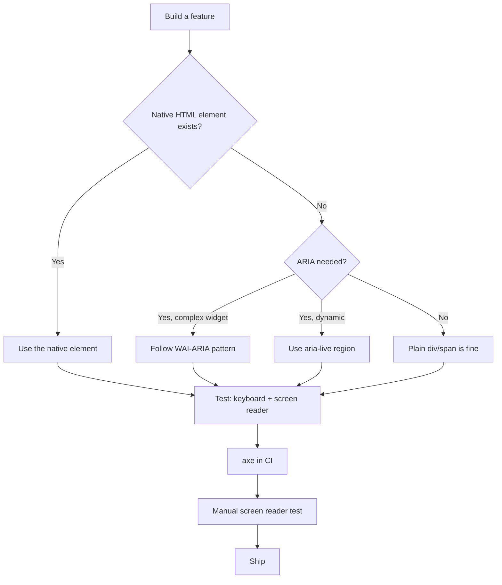
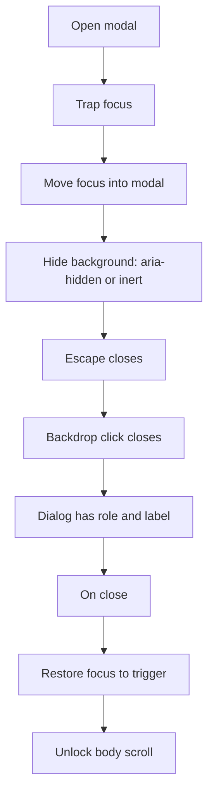
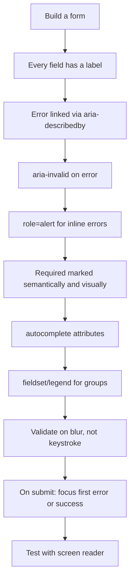

# 6.7 Accessibility Questions

> Accessibility interviews test whether you can build interfaces that everyone — including users of screen readers, keyboard navigation, switch devices, and voice control — can use. The questions range from "what is WCAG?" to "audit this modal for accessibility." The interviewer wants to see that you understand the POUR principles, know when to use ARIA (and when not to), can implement keyboard navigation and focus management, and have actually tested with a screen reader. Accessibility is not a checklist; it is a discipline. This note has seventeen questions plus three audit exercises.

## 6.7.1 How To Use This Note

For each question, sketch your answer before reading the model answer. Accessibility questions reward specificity — "add ARIA" fails. The senior answer names the specific role, the specific attribute, and the specific reason.

Every question has four parts: **Model Answer**, **The Reasoning**, **Common Wrong Answers**, and **Follow-up Questions**. The three audit exercises in 6.7.5 are full worked walkthroughs — read them, then re-do them from memory.

> [!tip] Test with a screen reader
> Reading about accessibility is not enough. Install VoiceOver (macOS, free), NVDA (Windows, free), or TalkBack (Android, free). Use your app with your eyes closed. The first time you do this, you will discover problems you did not know existed.

> [!warning] Accessibility is not optional
> In many jurisdictions (US with ADA, EU with EAA, UK with Equality Act), inaccessible websites are illegal. Beyond legality, accessibility is the right thing to do — 15% of the world's population has a disability. Excluding them is excluding customers.

## 6.7.2 Foundational Questions

### Question 1: What is web accessibility, and why does it matter?

**Difficulty:** Easy

**Model Answer:**

**Web accessibility** means building websites and apps that everyone can use, including people with disabilities:
- **Visual impairments** — blindness, low vision, color blindness.
- **Motor impairments** — limited dexterity, no use of hands (keyboard/switch users).
- **Hearing impairments** — deafness, hard of hearing.
- **Cognitive impairments** — dyslexia, ADHD, memory issues.

**Why it matters:**

1. **Ethical.** The web is a basic service. Excluding people with disabilities is wrong.
2. **Legal.** The Americans with Disabilities Act (ADA), the European Accessibility Act (EAA, effective June 2025), the UK Equality Act, and Section 508 (US federal) all require accessible websites. Lawsuits are rising — over 4,500 ADA web accessibility lawsuits were filed in the US in 2023.
3. **Business.** 15% of the world's population has a disability. Accessible sites reach more users. SEO improves (semantic HTML, alt text). Overall code quality improves.
4. **Universal benefit.** Captions help people in quiet environments. High contrast helps people in bright sunlight. Keyboard navigation helps power users. Curb cuts help everyone.

**The standard:** WCAG (Web Content Accessibility Guidelines), currently WCAG 2.2 (with WCAG 3.0 in draft). WCAG has three conformance levels: A (minimum), AA (the target for most organizations), AAA (highest, not required for entire sites).

**The Reasoning:**

Accessibility is a quality dimension. Just as you would not ship a feature with broken functionality or poor performance, you should not ship a feature that excludes users. The legal and business cases are strong, but the ethical case is the strongest: the web should be for everyone.

**Common Wrong Answers:**

- "Accessibility is for screen reader users." — Only one user group. Also includes keyboard users, switch users, voice control users, users with cognitive disabilities.
- "We'll add accessibility later." — retrofitting is 10x more expensive than building it in.
- "We use an accessibility overlay (e.g., accessiBe); we're done." — Overlays do not work; they often make things worse. The National Federation of the Blind sued accessiBe.
- "Accessibility is the designer's job." — It is everyone's job: design, content, engineering, QA.

**Follow-up Questions:**

- What is the difference between WCAG 2.2 and WCAG 3.0?
- What is ADA Title III?
- How does accessibility affect SEO?

---

### Question 2: What are the WCAG POUR principles?

**Difficulty:** Easy

**Model Answer:**

WCAG is organized around four principles, called **POUR**:

1. **Perceivable.** Information and user interface components must be presentable to users in ways they can perceive.
   - Text alternatives for non-text content (alt text, captions).
   - Captions and transcripts for audio and video.
   - Content is adaptable to different presentations (e.g., larger text, simpler layout).
   - Sufficient color contrast.

2. **Operable.** User interface components and navigation must be operable.
   - All functionality is available from a keyboard.
   - Users have enough time to read and use content (no surprise timeouts).
   - No content that causes seizures (no flashing > 3 times per second).
   - Users can navigate, find content, and determine where they are.

3. **Understandable.** Content and operation of the user interface must be understandable.
   - Text content is readable.
   - Content appears and operates in predictable ways.
   - Users can avoid and correct mistakes.

4. **Robust.** Content must be robust enough to be interpreted reliably by a wide variety of user agents, including assistive technologies.
   - Valid HTML.
   - Compatible with current and future tools (use ARIA correctly, follow standards).

**For each principle, WCAG lists success criteria** at levels A, AA, and AAA. For example, "1.4.3 Contrast (Minimum)" is a Level AA criterion under Perceivable — text must have a contrast ratio of at least 4.5:1.

**The Reasoning:**

POUR organizes accessibility into four orthogonal dimensions. Perceivable addresses the input (can the user perceive the content?). Operable addresses the interaction (can the user control it?). Understandable addresses the cognition (can the user understand it?). Robust addresses the implementation (does it work with assistive technology?). Together they cover the full accessibility surface.

**Common Wrong Answers:**

- "WCAG is a checklist." — It is principles-based; the success criteria are checkpoints, but the principles guide judgment.
- "Level AAA is the target." — AAA is not required for entire sites; some criteria cannot be met for all content (e.g., sign language for all video).
- "POUR is for content, not code." — It is for both; e.g., "Robust" is about implementation.

**Follow-up Questions:**

- What is a Level AA criterion you know?
- How do you test for "Perceivable"?
- What is "Robust" in practice?

---

### Question 3: What is the accessibility tree?

**Difficulty:** Medium

**Model Answer:**

The **accessibility tree** is a parallel structure to the DOM that browsers build for assistive technologies (screen readers, switches, voice control). It contains only the information an assistive technology needs:
- **Role** — what is this element? (button, link, heading, image).
- **Name** — what is it called? (visible text, alt text, aria-label).
- **Description** — additional info (title attribute, aria-describedby).
- **State** — current state (checked, expanded, disabled).
- **Value** — for inputs (current value).
- **Properties** — other attributes (level for headings, setsize/posinset for lists).

**How it is built:**
1. Browser parses HTML  -->  DOM.
2. Browser walks the DOM  -->  builds accessibility tree.
3. Assistive technologies (via platform APIs: Accessibility on macOS, UIAutomation on Windows) read the accessibility tree.

**Implications:**
- **Semantic HTML produces the right tree for free.** `<button>` has role "button"; `<h1>` has role "heading" level 1; `<nav>` has role "navigation".
- **Non-semantic HTML (`<div>`, `<span>`) produces no tree entry** unless you add ARIA.
- **CSS can affect the tree.** `display: none` and `visibility: hidden` remove elements from the tree. `aria-hidden="true"` also removes them.
- **ARIA can override the tree.** `role="button"` on a `<div>` makes it a button in the tree — but does not add keyboard behavior. You must implement that.

**Inspecting the tree:**
- Chrome DevTools  -->  Elements  -->  Accessibility pane (shows the tree for the selected element).
- macOS Accessibility Inspector.
- Firefox DevTools  -->  Accessibility tab.

**The Reasoning:**

The accessibility tree is the contract between your HTML and assistive technologies. If your HTML is semantic, the tree is correct automatically. If you use `<div>` for everything, you must add ARIA — and you must also implement the keyboard behavior that the semantic element would have provided for free.

**Common Wrong Answers:**

- "ARIA makes things accessible." — ARIA can override the tree, but if your HTML is semantic, you usually do not need ARIA. "No ARIA is better than bad ARIA."
- "Screen readers read the DOM." — They read the accessibility tree, which is derived from the DOM.
- "CSS does not affect accessibility." — `display: none`, `visibility: hidden`, `content`, `:focus-visible` all affect it.

**Follow-up Questions:**

- How do you inspect the accessibility tree?
- What is the difference between `aria-hidden` and `display: none`?
- How does CSS affect accessibility?

---

### Question 4: Why is semantic HTML the foundation of accessibility?

**Difficulty:** Easy

**Model Answer:**

**Semantic HTML** uses elements for their meaning, not their appearance. `<button>` for clickables, `<a>` for links, `<h1>`-`<h6>` for headings, `<nav>` for navigation, `<main>` for main content, `<form>` for forms, `<label>` for input labels.

**Why semantic HTML is the foundation:**

1. **Free accessibility.** A `<button>` is keyboard-accessible (Enter and Space activate it), has role "button" in the accessibility tree, and is announced as "button" by screen readers. A `<div onClick>` has none of these — you must add them all manually.

2. **Free behavior.** A `<button>` can be activated with Enter, Space, mouse, touch, and voice control. A `<div onClick>` works only with mouse and touch.

3. **Free SEO.** Semantic HTML helps search engines understand your content. Headings, `<main>`, `<nav>`, `<article>`, `<section>` all signal structure.

4. **Free default styling.** Browsers style semantic elements consistently. You can override with CSS, but the defaults are sensible.

5. **Future-proof.** New assistive technologies and browsers will understand standard HTML. Custom ARIA patterns may not.

**The comparison:**

```tsx
// BAD — div with onClick
<div onClick={handleClick} className="button-like">
  Submit
</div>
/* Not keyboard accessible. Not in accessibility tree as a button. */

// GOOD — semantic button
<button onClick={handleClick} type="submit">
  Submit
</button>
/* Keyboard accessible (Enter, Space). Role "button" in tree. */
```

**Common semantic elements:**
- `<button>` — clickable action.
- `<a href>` — navigation.
- `<input>` with `<label>` — form input.
- `<select>` — dropdown.
- `<textarea>` — multi-line input.
- `<h1>`-`<h6>` — headings (only one `<h1>` per page).
- `<nav>` — navigation region.
- `<main>` — main content (only one per page).
- `<header>` — site header or section header.
- `<footer>` — site footer or section footer.
- `<aside>` — complementary content (sidebar).
- `<article>` — self-contained content (blog post).
- `<section>` — thematic grouping (with a heading).
- `<figure>` and `<figcaption>` — image with caption.
- `<table>`, `<thead>`, `<tbody>`, `<th scope>` — data tables.

**The Reasoning:**

Semantic HTML is the path of least resistance to accessibility. The browser does the work for you. Using `<div>` for everything forces you to reimplement what the browser already provides — and you will get it wrong. The first rule of ARIA is "if you can use a native HTML element or attribute with the semantics and behavior you require already built-in, instead of re-purposing an element and adding an ARIA role, state or property to make it accessible, then do so."

**Common Wrong Answers:**

- "I'll add ARIA later." — You usually do not need ARIA if your HTML is semantic.
- "Divs are easier to style." — Buttons can be styled the same way; reset the defaults.
- "Buttons cannot contain divs." — They can; the content model allows phrasing content. (But not interactive content.)

**Follow-up Questions:**

- When is a `<div>` with `role="button"` appropriate?
- What is the difference between `<section>` and `<article>`?
- How do you make a custom dropdown accessible?

---

### Question 5: When do you use ARIA, and when do you NOT?

**Difficulty:** Medium

**Model Answer:**

**The five rules of ARIA** (from W3C):

1. **If you can use a native HTML element or attribute with the semantics and behavior you require already built-in, instead of re-purposing an element and adding an ARIA role, state or property to make it accessible, then do so.** (Use `<button>`, not `<div role="button">`.)

2. **Do not change native semantics, unless you really have to.** (Do not add `role="button"` to an `<h1>`; if you need a button, use `<button>`.)

3. **All interactive ARIA controls must be usable with the keyboard.** (If you add `role="button"` to a `<div>`, you must handle Enter and Space.)

4. **Do not use `role="presentation"` or `aria-hidden="true"` on a focusable element.** (Hides it from screen readers but it is still keyboard-focusable — confusing.)

5. **All interactive elements must have an accessible name.** (A button with no text and no `aria-label` is invisible to screen readers.)

**When to use ARIA:**

1. **Dynamic regions.** `aria-live="polite"` or `aria-live="assertive"` announces content changes (toast notifications, chat messages, score updates).

```tsx
<div aria-live="polite" role="status">
  {message}
</div>
```

2. **Complex widgets with no native equivalent.** Tabs, accordions, comboboxes, tree views, carousels. Use the ARIA design pattern from the WAI-ARIA Authoring Practices.

3. **Form validation errors.** `aria-invalid="true"` and `aria-describedby` linking to the error message.

```tsx
<input
  id="email"
  aria-invalid={!!error}
  aria-describedby={error ? 'email-error' : undefined}
/>
{error && <p id="email-error" role="alert">{error}</p>}
```

4. **Loading states.** `aria-busy="true"` on a region being updated.

5. **Expandable content.** `aria-expanded` on a button that toggles content.

```tsx
<button aria-expanded={isOpen} aria-controls="panel">
  Toggle
</button>
<div id="panel" hidden={!isOpen}>Content</div>
```

6. **Current page in navigation.** `aria-current="page"`.

```tsx
<a href="/about" aria-current="page">About</a>
```

7. **Visually hidden text.** When a control has no visible label (icon button), add `aria-label`.

```tsx
<button aria-label="Close">
  <XIcon />
</button>
```

**When NOT to use ARIA:**

1. **When semantic HTML suffices.** `<button>` instead of `<div role="button">`.
2. **To override native semantics for no reason.** Do not add `role="heading"` to a `<div>`; use `<h2>`.
3. **As a replacement for visible labels.** `aria-label` is for invisible labels; if a label can be visible, make it visible.
4. **On non-interactive elements** that do not need it. Adding `role="region"` to every `<div>` clutters the accessibility tree.
5. **Redundantly.** `<button role="button">` — the role is already there.

> [!warning] The first rule of ARIA
> "No ARIA is better than bad ARIA." ARIA overrides native semantics; getting it wrong is worse than not using it.

**The Reasoning:**

ARIA is a tool for cases where semantic HTML cannot express what you need. Most UI can be built with semantic HTML. Reach for ARIA only when you cannot use semantic HTML — complex widgets, dynamic regions, validation errors. The WAI-ARIA Authoring Practices document every pattern with the required roles, states, and keyboard behavior.

**Common Wrong Answers:**

- "Add ARIA to everything." — Clutters the tree; often wrong.
- "ARIA replaces semantic HTML." — No; ARIA augments when HTML is insufficient.
- "Add `role="button"` to a div." — Use a `<button>`.

**Follow-up Questions:**

- What is the WAI-ARIA Authoring Practices?
- How do you announce a dynamic change to a screen reader?
- What is `aria-live` and when do you use it?

---

### Question 6: How do you handle keyboard navigation?

**Difficulty:** Medium

**Model Answer:**

**Principle:** every interactive element must be operable with a keyboard. The user must be able to:
1. Reach every interactive element using Tab (and Shift+Tab).
2. Activate every element using Enter and/or Space.
3. See which element is currently focused (visible focus indicator).
4. Navigate within complex widgets using arrow keys (tabs, menus, comboboxes).

**Implementation:**

1. **Use semantic HTML.** `<button>`, `<a>`, `<input>`, `<select>`, `<textarea>` are all keyboard-accessible by default. `<div>` and `<span>` are not.

2. **Never remove focus outlines without replacing them.** `outline: none` without an alternative is an accessibility violation. Use `:focus-visible` to show outlines only for keyboard users (not mouse users).

```css
/* BAD */
* { outline: none; }

/* GOOD */
:focus { outline: none; }
:focus-visible {
  outline: 2px solid currentColor;
  outline-offset: 2px;
}
```

3. **Manage tab order.** The tab order follows the DOM order. Do not use `tabindex` with positive values (it breaks the natural order); use `tabindex={0}` to make a non-interactive element focusable (rare — usually you should use a semantic element instead).

4. **Remove from tab order when hidden.** `display: none` and `visibility: hidden` remove from the tab order. `aria-hidden="true"` does NOT — combine with `inert` or `tabindex="-1"`.

5. **Skip links.** The first focusable element should be a "Skip to main content" link, visible on focus, that jumps past the navigation.

```tsx
<a href="#main" className="skip-link">Skip to main content</a>
<nav>{/* navigation */}</nav>
<main id="main">{/* content */}</main>
```

```css
.skip-link {
  position: absolute;
  top: -40px;
  left: 0;
  background: black;
  color: white;
  padding: 8px;
}
.skip-link:focus {
  top: 0;
}
```

6. **Complex widgets.** Follow the WAI-ARIA Authoring Practices for keyboard behavior:
   - **Tabs:** Tab to the tab list, arrow keys to move between tabs, Tab to move into the panel.
   - **Menu:** Arrow keys to move, Enter to activate, Escape to close.
   - **Combobox:** Type to filter, arrow keys to navigate, Enter to select, Escape to close.
   - **Dialog:** Trap focus inside, Escape to close, return focus to the trigger on close.

**The Reasoning:**

Keyboard navigation is non-negotiable — many users (motor impairments, screen reader users, power users) rely on it. The default behavior of semantic HTML covers 80% of cases. Complex widgets require following the WAI-ARIA patterns, which are the consensus on how keyboard users expect custom widgets to behave.

**Common Wrong Answers:**

- "Tab order with positive tabindex." — Breaks natural order; never use positive tabindex.
- "Remove outline globally." — Removes the only focus indicator for keyboard users.
- "Make every div focusable." — Clutters the tab order; use semantic elements.
- "Mouse-only interactions." — Excludes keyboard users.

**Follow-up Questions:**

- What is `:focus-visible`?
- How do you trap focus in a modal?
- How do you handle skip links?

---

## 6.7.3 Intermediate Questions

### Question 7: How do you manage focus in a React app?

**Difficulty:** Medium

**Model Answer:**

Focus management is the #1 accessibility challenge in SPAs. Three scenarios:

**1. Route changes.** When the route changes in a client-side router, screen readers do not announce the new page. Move focus to the new page's heading.

```tsx
import { useEffect, useRef } from 'react';
import { useLocation } from 'react-router-dom';

function App() {
  const location = useLocation();
  const mainRef = useRef<HTMLElement>(null);

  useEffect(() => {
    mainRef.current?.focus();
  }, [location.pathname]);

  return <main ref={mainRef} tabIndex={-1}>{/* routes */}</main>;
}
```

**2. Modals.** When a modal opens, focus moves into the modal. When it closes, focus returns to the trigger.

```tsx
function Modal({ isOpen, onClose, triggerRef, children }) {
  const modalRef = useRef<HTMLDivElement>(null);

  useEffect(() => {
    if (isOpen) {
      const previousFocus = document.activeElement as HTMLElement;
      modalRef.current?.focus();
      return () => previousFocus?.focus();
    }
  }, [isOpen]);

  if (!isOpen) return null;
  return (
    <div ref={modalRef} tabIndex={-1} role="dialog" aria-modal="true">
      {children}
      <button onClick={onClose}>Close</button>
    </div>
  );
}
```

**3. Dynamic content.** When content updates (a search filter, a sort), move focus to the updated region or announce it with `aria-live`.

**4. Skip-to-content link.** The first focusable element on the page.

**5. Focusable elements that are not interactive.** Use `tabIndex={-1}` to make an element programmatically focusable (you can call `.focus()` on it) without adding it to the tab order.

**Libraries:** `react-focus-lock` (traps focus in a region), `focus-trap-react`, `@react-aria/focus` (Adobe's accessible primitives).

**The Reasoning:**

In a multi-page app, the browser handles focus on navigation — focus moves to the top of the new page. In a SPA, the URL changes but the page does not reload, so focus stays where it was. Without manual focus management, screen reader users are stranded. The fix is to move focus programmatically on route change and modal open/close.

**Common Wrong Answers:**

- "Focus management is the browser's job." — In SPAs, it is yours.
- "Move focus to the body." — Body is not focusable; move to a heading with `tabIndex={-1}`.
- "Use `aria-live` for everything." — `aria-live` is for announcements; focus management is for navigation.

**Follow-up Questions:**

- How do you restore focus when a modal closes?
- How do you handle focus with React Router?
- What is `tabIndex={-1}` for?

---

### Question 8: How do you build an accessible modal (dialog)?

**Difficulty:** Hard

**Model Answer:**

An accessible modal must:

1. **Trap focus.** Tab cycles within the modal; Tab on the last focusable element moves to the first; Shift+Tab on the first moves to the last.
2. **Move focus into the modal on open.** Focus the modal container or the first focusable element.
3. **Restore focus on close.** Focus returns to the element that opened the modal.
4. **Close on Escape.**
5. **Close on backdrop click.** (Optional but expected.)
6. **Be announced as a dialog.** `role="dialog"` and `aria-modal="true"`.
7. **Have a label.** `aria-labelledby` (pointing to a heading) or `aria-label`.
8. **Hide the rest of the page.** `aria-hidden="true"` on the rest, or use `inert`.

**Implementation:**

```tsx
import { useEffect, useRef } from 'react';

function Modal({
  isOpen,
  onClose,
  title,
  children,
}: {
  isOpen: boolean;
  onClose: () => void;
  title: string;
  children: ReactNode;
}) {
  const dialogRef = useRef<HTMLDivElement>(null);
  const previousFocus = useRef<HTMLElement | null>(null);

  useEffect(() => {
    if (!isOpen) return;
    previousFocus.current = document.activeElement as HTMLElement;
    dialogRef.current?.focus();

    const handleKey = (e: KeyboardEvent) => {
      if (e.key === 'Escape') onClose();
      if (e.key === 'Tab') {
        // focus trap
        const focusable = dialogRef.current?.querySelectorAll(
          'button, [href], input, select, textarea, [tabindex]:not([tabindex="-1"])'
        );
        if (!focusable || focusable.length === 0) return;
        const first = focusable[0] as HTMLElement;
        const last = focusable[focusable.length - 1] as HTMLElement;
        if (e.shiftKey && document.activeElement === first) {
          e.preventDefault();
          last.focus();
        } else if (!e.shiftKey && document.activeElement === last) {
          e.preventDefault();
          first.focus();
        }
      }
    };
    document.addEventListener('keydown', handleKey);
    document.body.style.overflow = 'hidden';  // prevent background scroll
    return () => {
      document.removeEventListener('keydown', handleKey);
      document.body.style.overflow = '';
      previousFocus.current?.focus();
    };
  }, [isOpen, onClose]);

  if (!isOpen) return null;

  return (
    <div
      className="fixed inset-0 bg-black/50"
      onClick={(e) => { if (e.target === e.currentTarget) onClose(); }}
    >
      <div
        ref={dialogRef}
        role="dialog"
        aria-modal="true"
        aria-labelledby="modal-title"
        tabIndex={-1}
        className="bg-white p-6 max-w-md mx-auto mt-20"
      >
        <h2 id="modal-title">{title}</h2>
        {children}
        <button onClick={onClose}>Close</button>
      </div>
    </div>
  );
}
```

**Better: use Radix UI.** Radix's `Dialog` component handles all of this for you.

```tsx
import * as Dialog from '@radix-ui/react-dialog';

<Dialog.Root>
  <Dialog.Trigger>Open</Dialog.Trigger>
  <Dialog.Portal>
    <Dialog.Overlay className="fixed inset-0 bg-black/50" />
    <Dialog.Content className="fixed inset-0 m-auto max-w-md bg-white p-6">
      <Dialog.Title>Title</Dialog.Title>
      {/* content */}
      <Dialog.Close>Close</Dialog.Close>
    </Dialog.Content>
  </Dialog.Portal>
</Dialog.Root>
```

**The Reasoning:**

A modal that does not trap focus lets Tab escape into the background — keyboard users get lost. A modal that does not restore focus leaves the user stranded after closing. Radix (and shadcn/ui, which uses Radix) handles both correctly. Building it from scratch is a 100-line exercise that is easy to get wrong.

**Common Wrong Answers:**

- "Just `position: fixed` and `display: block`." — Visual only; not accessible.
- "Hide the background with `display: none`." — Loses state and is jarring.
- "Trap focus with `tabindex` manipulation." — Fragile; use a library.

**Follow-up Questions:**

- What is `inert` and when do you use it?
- How do you handle nested modals?
- What is the difference between `role="dialog"` and `role="alertdialog"`?

---

### Question 9: How do you build accessible tabs?

**Difficulty:** Hard

**Model Answer:**

The WAI-ARIA tab pattern requires:
1. A tab list (`role="tablist"`) containing tabs (`role="tab"`).
2. Each tab controls a tab panel (`role="tabpanel"`).
3. `aria-selected` on the active tab.
4. `aria-controls` on each tab pointing to its panel.
5. `aria-labelledby` on each panel pointing to its tab.
6. **Keyboard behavior:**
   - Tab moves focus to the active tab.
   - Arrow keys move between tabs (Left/Right in LTR, Right/Left in RTL).
   - Tab (Tab key) moves into the panel.
   - Home/End move to first/last tab.
   - (Optional) Ctrl+PageUp/PageDown moves between tabs without focusing them.

**Implementation:**

```tsx
function Tabs({ tabs }: { tabs: { id: string; label: string; content: ReactNode }[] }) {
  const [activeId, setActiveId] = useState(tabs[0].id);
  const tabRefs = useRef<Record<string, HTMLButtonElement>>({});

  const handleKeyDown = (e: KeyboardEvent, index: number) => {
    const lastIndex = tabs.length - 1;
    let newIndex = index;
    if (e.key === 'ArrowRight') newIndex = index === lastIndex ? 0 : index + 1;
    if (e.key === 'ArrowLeft') newIndex = index === 0 ? lastIndex : index - 1;
    if (e.key === 'Home') newIndex = 0;
    if (e.key === 'End') newIndex = lastIndex;
    if (newIndex !== index) {
      e.preventDefault();
      const newId = tabs[newIndex].id;
      setActiveId(newId);
      tabRefs.current[newId]?.focus();
    }
  };

  return (
    <div>
      <div role="tablist" aria-label="Settings">
        {tabs.map((tab, index) => (
          <button
            key={tab.id}
            ref={(el) => { if (el) tabRefs.current[tab.id] = el; }}
            role="tab"
            id={`tab-${tab.id}`}
            aria-selected={activeId === tab.id}
            aria-controls={`panel-${tab.id}`}
            tabIndex={activeId === tab.id ? 0 : -1}
            onClick={() => setActiveId(tab.id)}
            onKeyDown={(e) => handleKeyDown(e, index)}
          >
            {tab.label}
          </button>
        ))}
      </div>
      {tabs.map((tab) => (
        <div
          key={tab.id}
          role="tabpanel"
          id={`panel-${tab.id}`}
          aria-labelledby={`tab-${tab.id}`}
          hidden={activeId !== tab.id}
          tabIndex={0}
        >
          {tab.content}
        </div>
      ))}
    </div>
  );
}
```

**Better: use Radix UI.**

```tsx
import * as Tabs from '@radix-ui/react-tabs';

<Tabs.Root defaultValue="account">
  <Tabs.List>
    <Tabs.Trigger value="account">Account</Tabs.Trigger>
    <Tabs.Trigger value="password">Password</Tabs.Trigger>
  </Tabs.List>
  <Tabs.Content value="account">Account settings</Tabs.Content>
  <Tabs.Content value="password">Password settings</Tabs.Content>
</Tabs.Root>
```

**The Reasoning:**

Tabs are a deceptively complex widget — the keyboard behavior is non-obvious (arrow keys, not Tab, move between tabs), the ARIA wiring is verbose, and getting one detail wrong breaks the experience. The WAI-ARIA Authoring Practices is the canonical reference; Radix implements it correctly.

**Common Wrong Answers:**

- "Use Tab to move between tabs." — Wrong; Tab moves into the panel. Arrow keys move between tabs.
- "Hide inactive panels with `display: none` only." — Works visually but `hidden` attribute is more semantically correct.
- "No `aria-selected`." — Screen readers cannot tell which tab is active.

**Follow-up Questions:**

- How do you handle vertical tabs?
- How do you handle tabs that load content lazily?
- What is the "roving tabindex" pattern?

---

### Question 10: How do you handle color contrast?

**Difficulty:** Medium

**Model Answer:**

WCAG contrast requirements:
- **Level AA:** text 4.5:1, large text (18pt+ or 14pt+ bold) 3:1, UI components and graphics 3:1.
- **Level AAA:** text 7:1, large text 4.5:1.

**How to measure:** contrast ratio = (L1 + 0.05) / (L2 + 0.05), where L1 and L2 are the relative luminance of the lighter and darker colors. Use a contrast checker:
- WebAIM Contrast Checker (webaim.org/resources/contrastchecker).
- Chrome DevTools  -->  Elements  -->  Colors (shows contrast ratio).
- axe DevTools (browser extension).

**Common contrast issues:**
- Gray text on white (`#888` on `#fff` = 4.5:1, just barely AA; `#aaa` on `#fff` = 2.3:1, fails).
- White text on light backgrounds (the classic "ghost button" with `text-white border-white` on a `bg-gray-100`).
- Placeholder text (`placeholder-gray-400` on white = 3.5:1, fails).
- Disabled state (often too low contrast; WCAG does not require contrast for disabled, but users struggle).

**Designing for contrast:**
- Use a token system. Define `--color-text`, `--color-text-muted`, `--color-bg`, etc. Validate each combination.
- Test in dark mode too — dark mode often has worse contrast than light mode.
- Test in high-contrast mode (Windows High Contrast Mode).
- Use `currentColor` for icons so they inherit text contrast.
- Avoid color as the only signal — color blindness affects 8% of men. Pair color with text or icon.

**The Reasoning:**

Low contrast is the most common accessibility failure — over 80% of sites fail contrast checks. The fix is a token system with validated combinations, plus contrast checks in CI (axe, Lighthouse). Color-blind users and users with low vision benefit most.

**Common Wrong Answers:**

- "It looks fine to me." — You are not the user. Measure.
- "4.5:1 is too strict." — It is the minimum; aim higher (7:1 for AAA).
- "Color-blind users see differently, so contrast doesn't matter." — Color blindness affects hue, not luminance; contrast still applies.

**Follow-up Questions:**

- What is the difference between AA and AAA?
- How do you test color blindness?
- How do you handle disabled state?

---

### Question 11: How do you build accessible forms?

**Difficulty:** Hard

**Model Answer:**

Every form field needs:
1. **A label.** `<label>` with `for` pointing to the input's `id`, or wrap the input in the label.
2. **An accessible name.** The label becomes the input's accessible name. If the label is not visible (icon input), use `aria-label`.
3. **Error messages linked.** `aria-describedby` pointing to the error message element.
4. **Invalid state announced.** `aria-invalid="true"`.
5. **Required fields marked.** `required` attribute (also adds to the accessibility tree) and visual indicator (asterisk with `aria-hidden` or text "required").
6. **Help text linked.** `aria-describedby` can point to multiple elements (space-separated IDs).
7. **Proper input type.** `<input type="email">`, `type="tel"`, `type="url"` — triggers the right keyboard on mobile and validates the format.
8. **Autocomplete attributes.** `autocomplete="email"`, `autocomplete="current-password"` — helps password managers and browser autofill.

**Implementation:**

```tsx
function FormField({
  id,
  label,
  type = 'text',
  required,
  error,
  helpText,
  ...rest
}: FormFieldProps) {
  const describedBy = [
    error ? `${id}-error` : null,
    helpText ? `${id}-help` : null,
  ].filter(Boolean).join(' ') || undefined;

  return (
    <div>
      <label htmlFor={id}>
        {label}
        {required && <span aria-hidden="true" className="text-red-500">*</span>}
        {!required && <span className="sr-only"> (optional)</span>}
      </label>
      <input
        id={id}
        type={type}
        required={required}
        aria-invalid={!!error}
        aria-describedby={describedBy}
        aria-required={required}
        {...rest}
      />
      {helpText && <p id={`${id}-help`} className="text-sm">{helpText}</p>}
      {error && (
        <p id={`${id}-error`} role="alert" className="text-red-600 text-sm">
          {error}
        </p>
      )}
    </div>
  );
}
```

**Grouping:**
- Radio buttons and checkboxes: `<fieldset>` with `<legend>`.
- Related fields (address): `<fieldset>` with `<legend>`.

```tsx
<fieldset>
  <legend>Shipping address</legend>
  <FormField id="street" label="Street" />
  <FormField id="city" label="City" />
  <FormField id="zip" label="ZIP code" />
</fieldset>
```

**Validation:**
- Validate on blur (not on every keystroke — annoying).
- Announce errors with `role="alert"` (announced immediately) or `aria-live="polite"`.
- Do not move focus on error — let the user finish, then list errors at the top with links to the fields.
- After submit, move focus to the first error or to a success message.

**The Reasoning:**

Forms are the most common interaction on the web. Without labels, screen reader users have no idea what each field is. Without `aria-invalid` and `aria-describedby`, they do not know there is an error. The pattern above is the minimum for every form field — and it is what shadcn/ui's `FormField` provides out of the box.

**Common Wrong Answers:**

- "Use a placeholder as a label." — Placeholder disappears on type; no accessible name.
- "Mark required with a red asterisk only." — No accessible indication; screen readers do not announce color.
- "Validate on every keystroke." — Annoying for everyone, especially screen reader users (errors announced constantly).

**Follow-up Questions:**

- How do you handle autocomplete?
- How do you announce form submission errors?
- How do you handle multi-step forms?

---

### Question 12: How do you build accessible navigation?

**Difficulty:** Medium

**Model Answer:**

1. **Use `<nav>` with `aria-label`.** Multiple navs need distinct labels.

```tsx
<nav aria-label="Main">
  <ul>
    <li><a href="/">Home</a></li>
    <li><a href="/about">About</a></li>
  </ul>
</nav>

<nav aria-label="Footer">
  <ul>{/* footer links */}</ul>
</nav>
```

2. **Skip link as the first focusable element.**

```tsx
<a href="#main" className="skip-link">Skip to main content</a>
<nav aria-label="Main">{/* ... */}</nav>
<main id="main" tabIndex={-1}>{/* ... */}</main>
```

3. **Mark the current page.** `aria-current="page"`.

```tsx
<a href="/about" aria-current="page">About</a>
```

4. **Mobile menu.** Use a `<button>` (not a `<div>`) to toggle. `aria-expanded` and `aria-controls`.

```tsx
<button
  aria-expanded={isOpen}
  aria-controls="mobile-menu"
  onClick={() => setOpen(!isOpen)}
>
  Menu
</button>
<nav id="mobile-menu" hidden={!isOpen} aria-label="Mobile">
  {/* links */}
</nav>
```

5. **Dropdown menus.** Use a `<button>` (not a link — links navigate, buttons toggle). `aria-haspopup="menu"` and `aria-expanded`. Arrow keys to navigate within the menu, Escape to close.

6. **Breadcrumbs.** `<nav aria-label="Breadcrumb">` with an `<ol>`. Mark the current page with `aria-current="page"`.

```tsx
<nav aria-label="Breadcrumb">
  <ol>
    <li><a href="/">Home</a></li>
    <li><a href="/blog">Blog</a></li>
    <li><a href="/blog/post" aria-current="page">Post</a></li>
  </ol>
</nav>
```

**The Reasoning:**

Navigation is how users orient and move. Without `<nav>` and labels, screen reader users cannot find the navigation. Without `aria-current`, they cannot tell which page they are on. Without a skip link, they must Tab through every nav link on every page.

**Common Wrong Answers:**

- "Just use a div with class 'nav'." — Not in the accessibility tree as a navigation region.
- "Use a link to toggle the mobile menu." — Links navigate; buttons toggle.
- "Hide the current page link." — Loses context; use `aria-current`.

**Follow-up Questions:**

- How do you handle a mega menu?
- How do you test navigation with a screen reader?
- What is `aria-current`?

---

### Question 13: How do you handle screen reader testing?

**Difficulty:** Medium

**Model Answer:**

Three main screen readers, one per platform:

| Screen reader | Platform | Cost |
|---------------|----------|------|
| VoiceOver | macOS, iOS | Free (built-in) |
| NVDA | Windows | Free (open source) |
| JAWS | Windows | Paid (most enterprises) |
| TalkBack | Android | Free (built-in) |

**VoiceOver (macOS) basics:**
- Turn on: Cmd+F5.
- Navigate: Ctrl+Option+Arrow keys.
- Read next/previous item: Ctrl+Option+Right/Left Arrow.
- Read by heading: Ctrl+Option+Cmd+H.
- Read by link: Ctrl+Option+Cmd+L.
- Jump to landmark: Ctrl+Option+U (rotor).
- Activate: Ctrl+Option+Space.
- Turn off: Cmd+F5.

**NVDA (Windows) basics:**
- Turn on: Ctrl+Alt+N (if installed).
- Navigate: Arrow keys (down to read next, up to read previous).
- Read by heading: H.
- Read by link: K.
- Jump to landmark: D.
- Activate: Enter or Space.
- Turn off: Insert+Q.

**Testing workflow:**
1. Turn on the screen reader.
2. Close your eyes (or turn off your monitor).
3. Try to complete a task: sign up, find a product, check out.
4. Note where you get stuck.
5. Fix and re-test.

**Common issues you will find:**
- Buttons with no accessible name (icon-only buttons without `aria-label`).
- Form fields with no label.
- Headings used for styling (`<div className="text-2xl">` instead of `<h2>`).
- Missing alt text on images.
- Dynamic changes not announced (no `aria-live`).
- Modal that does not trap focus.
- Tab order that jumps around the page.

**The Reasoning:**

Automated tools (axe, Lighthouse) catch about 30% of accessibility issues. The rest require manual testing with a screen reader. Reading about screen reader behavior is no substitute for using one — the experience is qualitatively different, and you will discover problems you did not know existed.

**Common Wrong Answers:**

- "Lighthouse catches everything." — Catches ~30%. Manual testing catches the rest.
- "I'll test once at the end." — Too late; accessibility is hard to retrofit.
- "Use an accessibility overlay." — Overlays do not work and often break screen readers.

**Follow-up Questions:**

- What is the difference between VoiceOver and NVDA?
- How do you test on mobile?
- What is the rotor in VoiceOver?

---

## 6.7.4 Advanced Questions

### Question 14: How do you handle `prefers-reduced-motion` and `prefers-color-scheme`?

**Difficulty:** Medium

**Model Answer:**

**`prefers-reduced-motion`:** Respect users who set "Reduce motion" in their OS settings (motion sensitivity, vestibular disorders).

```css
@media (prefers-reduced-motion: reduce) {
  *, *::before, *::after {
    animation-duration: 0.01ms !important;
    animation-iteration-count: 1 !important;
    transition-duration: 0.01ms !important;
    scroll-behavior: auto !important;
  }
}
```

In Tailwind: `motion-safe:` and `motion-reduce:` variants.

```tsx
<div className="motion-safe:animate-fade-in motion-reduce:opacity-100">
  Content
</div>
```

**`prefers-color-scheme`:** Respect users who set "Dark mode" in their OS.

```css
@media (prefers-color-scheme: dark) {
  :root {
    --color-background: #0a0a0a;
    --color-foreground: #f5f5f5;
  }
}
```

In Tailwind v3: `dark:` variant with `media` strategy. In Tailwind v4 / Next.js: use `next-themes` with `defaultTheme="system"` and `enableSystem`.

**Other useful media queries:**
- `prefers-contrast: more` — user wants higher contrast.
- `prefers-reduced-transparency` — user wants less transparency.
- `forced-colors: active` — Windows High Contrast Mode.

**Rules:**
- **Always** provide a reduced-motion fallback. Animations are decoration; functionality is essential.
- **Default to system preference.** Let the OS setting drive the initial theme; let the user override.
- **Persist user override.** If the user picks "dark mode" on your site, remember it (localStorage).
- **Avoid pure black on pure white.** Pure black on pure white is harsh; use `#0a0a0a` on `#ffffff` or off-white on off-black.

**The Reasoning:**

Users set OS preferences for a reason. Respecting them is the difference between a usable app and a painful one. The CSS media queries are free; ignoring them is a choice.

**Common Wrong Answers:**

- "Animations are essential." — They are not; functionality is. Respect the user's preference.
- "Force light mode." — Disrespects the user's preference.
- "Use a toggle for everything." — Default to system; let the user override.

**Follow-up Questions:**

- How do you handle high contrast mode?
- How do you avoid the SSR flash for dark mode?
- What is `forced-colors`?

---

### Question 15: How do you test accessibility in CI?

**Difficulty:** Hard

**Model Answer:**

Three layers:

**1. Automated testing (axe).** Catches ~30% of issues. Fast, runs on every PR.

```tsx
import { render } from '@testing-library/react';
import { axe, toHaveNoViolations } from 'jest-axe';
expect.extend(toHaveNoViolations);

test('Button has no violations', async () => {
  const { container } = render(<Button>Click</Button>);
  const results = await axe(container);
  expect(results).toHaveNoViolations();
});
```

Or with Playwright + axe:

```ts
import { AxeBuilder } from '@axe-core/playwright';

test('homepage has no violations', async ({ page }) => {
  await page.goto('/');
  const results = await new AxeBuilder({ page }).analyze();
  expect(results.violations).toEqual([]);
});
```

**2. Lighthouse accessibility audit.** Runs axe plus a few extra checks. Part of Lighthouse CI.

```yaml
# .github/workflows/lighthouse.yml
- uses: treosh/lighthouse-ci-action@v11
  with:
    urls: |
      http://localhost:3000/
    budgetPath: ./lighthouse-budget.json
```

```json
// lighthouse-budget.json
{
  "budgets": [
    {
      "path": "/",
      "resourceCounts": [],
      "resourceSizes": [],
      "timings": [],
      "categories": [
        { "id": "accessibility", "minimumScore": 0.95 }
      ]
    }
  ]
}
```

**3. Manual testing.** Required for the ~70% of issues automated tools miss. Test with:
- Keyboard only (unplug the mouse).
- A screen reader (VoiceOver or NVDA).
- Zoom to 200%.
- High contrast mode.
- Mobile viewport.

**What axe catches:**
- Missing labels on inputs.
- Missing alt text on images.
- Insufficient color contrast (most cases).
- Duplicate IDs.
- Empty headings or buttons.
- Invalid ARIA usage.

**What axe misses:**
- Focus management on route changes.
- Focus trapping in modals.
- Keyboard behavior in complex widgets (arrow keys in tabs).
- Heading order (skipped levels).
- Logical tab order.
- Visible focus indicators.
- Dynamic content announcements.
- Touch target size.

**The Reasoning:**

Automated tests catch the obvious issues. Manual testing catches the rest. Both are required — automated tests in CI prevent regressions; manual testing catches issues automated tests cannot. The combination of axe + Lighthouse + manual screen reader testing covers ~95% of accessibility issues.

**Common Wrong Answers:**

- "axe catches everything." — Catches ~30%. Manual testing is required.
- "Lighthouse score of 100 means accessible." — Lighthouse checks the page it was run on, not the whole app. And it misses many issues.
- "Manual testing once at the end." — Too late; build accessibility in.

**Follow-up Questions:**

- What does axe miss?
- How do you handle dynamic content in axe tests?
- How do you set up Lighthouse CI?

---

### Question 16: How do you handle accessibility in SPAs and dynamic content?

**Difficulty:** Hard

**Model Answer:**

SPAs have unique accessibility challenges:

**1. Route changes are not announced.** When the route changes client-side, screen reader users do not know the page changed. Fix: move focus to a heading on the new page (see Question 7).

**2. Dynamic content updates are not announced.** When content updates without a page reload (search results, toast notifications, score updates), use `aria-live`.

```tsx
// Polite: announce when the user is idle
<div aria-live="polite" role="status">
  {resultCount} results found
</div>

// Assertive: announce immediately (interrupts)
<div aria-live="assertive" role="alert">
  {errorMessage}
</div>
```

**3. Loading states.** Use `aria-busy="true"` on a region being updated, or announce "Loading" with `aria-live`.

**4. Inline errors.** `role="alert"` announces immediately. Use for form errors that appear after submission.

**5. Modals.** Trap focus, restore focus, Escape to close (see Question 8).

**6. Toast notifications.** `role="status"` with `aria-live="polite"`. Stack them; do not pile multiple `aria-live` regions (each one announces, causing overlap).

**7. Live regions must exist before content changes.** If you add `aria-live` to a div, then update its content, it is announced. If you add the div with the content already changed, it is NOT announced. Put empty `aria-live` regions in the initial render, then update them.

```tsx
// BAD — div is added with content; not announced
function Toast({ message }) {
  if (!message) return null;
  return <div aria-live="polite">{message}</div>;
}

// GOOD — div exists; content updates are announced
function ToastRegion({ message }) {
  return <div aria-live="polite" role="status">{message}</div>;
}
```

**8. Drag and drop.** Provide keyboard alternatives (Up/Down arrows to move, Enter to drop). Announce the position.

**9. Infinite scroll.** Provide a "Load more" button as an alternative. Screen reader users may not know new content was added.

**The Reasoning:**

SPAs break the implicit contract of multi-page apps — the URL changes but the page does not reload. Screen readers rely on page reloads to announce changes. The fix is to recreate the announcements manually: focus management for navigation, `aria-live` for content updates, and explicit role/label for dynamic widgets.

**Common Wrong Answers:**

- "Add `aria-live` to the body." — Announces every change, including layout updates — overwhelming.
- "Just announce everything." — Users get spammed; tune to important changes.
- "Skip live regions; the user will figure it out." — They will not; the change is invisible to them.

**Follow-up Questions:**

- How do you handle toast notifications?
- How do you handle infinite scroll accessibly?
- How do you announce form submission success?

---

### Question 17: How do you handle accessibility for icons and visual-only content?

**Difficulty:** Medium

**Model Answer:**

**Decorative icons** (next to visible text — the icon adds nothing):
- `aria-hidden="true"` so screen readers skip them.

```tsx
<button>
  <SearchIcon aria-hidden="true" />
  Search
</button>
```

**Functional icons** (icon-only buttons — no visible text):
- `aria-label` on the button (not on the icon).

```tsx
<button aria-label="Search" onClick={...}>
  <SearchIcon aria-hidden="true" />
</button>
```

**Informative icons** (convey information without text — status icons):
- `aria-label` on the icon, or a visually-hidden text next to it.

```tsx
<CheckIcon aria-label="Saved" />
{/* or */}
<CheckIcon aria-hidden="true" />
<span className="sr-only">Saved</span>
```

**SVGs:**
- Decorative: `aria-hidden="true"`.
- Informative: `<title>` inside the SVG, or `role="img"` with `aria-label`.

```tsx
<svg role="img" aria-label="Chart showing 30% growth">
  <title>30% growth</title>
  {/* paths */}
</svg>
```

**Visually hidden text** (the `.sr-only` pattern — visible to screen readers, hidden visually):

```css
.sr-only {
  position: absolute;
  width: 1px;
  height: 1px;
  padding: 0;
  margin: -1px;
  overflow: hidden;
  clip: rect(0, 0, 0, 0);
  white-space: nowrap;
  border: 0;
}
```

In Tailwind: `sr-only` (hide) and `not-sr-only` (show).

**Images:**
- Informative: `alt="description"`.
- Decorative: `alt=""` (empty — screen readers skip).
- Complex (charts, diagrams): `alt` for short summary, `longdesc` or a separate text description for details.

**The Reasoning:**

Screen readers read everything in the accessibility tree. Decorative icons clutter the experience — "Search, search button" is worse than "Search button." The fix is `aria-hidden` for decorative, `aria-label` or visually-hidden text for informative.

**Common Wrong Answers:**

- `alt="image"` or `alt="icon"` — Useless to a screen reader user.
- `alt=""` on informative images — Hides information.
- No `alt` attribute at all — Some screen readers read the filename.
- `aria-label` on a decorative icon — Adds noise.

**Follow-up Questions:**

- What is the `.sr-only` pattern?
- How do you handle complex images (charts)?
- How do you handle emoji accessibly?

---

## 6.7.5 Practical Coding Exercises

### Exercise 1: Audit a form

**Scenario:** The following form has multiple accessibility issues. Find and fix them.

```tsx
function SignupForm() {
  const [email, setEmail] = useState('');
  const [password, setPassword] = useState('');
  const [error, setError] = useState('');

  const handleSubmit = (e) => {
    e.preventDefault();
    if (password.length < 8) {
      setError('Password too short');
      return;
    }
    // submit
  };

  return (
    <form onSubmit={handleSubmit}>
      <div>
        <input
          type="email"
          placeholder="Email"
          value={email}
          onChange={(e) => setEmail(e.target.value)}
        />
      </div>
      <div>
        <input
          type="password"
          placeholder="Password"
          value={password}
          onChange={(e) => setPassword(e.target.value)}
        />
        {error && <span style={{ color: 'red' }}>{error}</span>}
      </div>
      <div>
        <input type="checkbox" /> I agree to the terms
        <button>Submit</button>
      </div>
    </form>
  );
}
```

**Issues found:**

1. **No labels.** Placeholders disappear on type and are not accessible names.
2. **Error not linked.** `aria-describedby` and `aria-invalid` missing.
3. **Error only signaled by color.** Color blindness; no icon, no text indicator.
4. **Checkbox has no label.** "I agree to the terms" is not associated.
5. **No autocomplete attributes.** Browser autofill cannot help.
6. **Error role missing.** No `role="alert"`, so the error is not announced when it appears.
7. **No fieldset for grouping.** Minor, but the terms checkbox should be its own group.

**Fixed:**

```tsx
function SignupForm() {
  const [email, setEmail] = useState('');
  const [password, setPassword] = useState('');
  const [error, setError] = useState('');

  const handleSubmit = (e: FormEvent) => {
    e.preventDefault();
    if (password.length < 8) {
      setError('Password must be at least 8 characters');
      return;
    }
    // submit
  };

  return (
    <form onSubmit={handleSubmit}>
      <div>
        <label htmlFor="email">Email</label>
        <input
          id="email"
          type="email"
          autoComplete="email"
          required
          value={email}
          onChange={(e) => setEmail(e.target.value)}
        />
      </div>
      <div>
        <label htmlFor="password">Password</label>
        <input
          id="password"
          type="password"
          autoComplete="new-password"
          required
          aria-describedby={error ? 'password-error' : 'password-help'}
          aria-invalid={!!error}
          value={password}
          onChange={(e) => setPassword(e.target.value)}
        />
        {!error && <p id="password-help" className="text-sm">At least 8 characters</p>}
        {error && (
          <p id="password-error" role="alert" className="text-red-600 text-sm">
            <span aria-hidden="true"> </span>{error}
          </p>
        )}
      </div>
      <fieldset>
        <legend>Terms</legend>
        <label>
          <input type="checkbox" required />
          I agree to the terms
        </label>
      </fieldset>
      <button type="submit">Submit</button>
    </form>
  );
}
```

**Reasoning:** Every field has a label. The error is linked via `aria-describedby`, marked invalid via `aria-invalid`, and announced via `role="alert"`. The error has both color and icon (not color alone). The checkbox is wrapped in a label. Autocomplete attributes help password managers.

**Pitfalls:**
- Using `placeholder` as a label — disappears on type.
- Signaling error with color only — color blindness.
- No `role="alert"` — error not announced when it appears.

**Extension:** Add live validation on blur (not on every keystroke).

---

### Exercise 2: Audit a modal

**Scenario:** The following modal has accessibility issues. Find and fix them.

```tsx
function Modal({ isOpen, onClose, children }) {
  if (!isOpen) return null;
  return (
    <div className="overlay" onClick={onClose}>
      <div className="modal">
        <div className="modal-header">
          <h3>Settings</h3>
          <button onClick={onClose}>X</button>
        </div>
        <div className="modal-body">{children}</div>
      </div>
    </div>
  );
}
```

**Issues found:**

1. **No `role="dialog"` or `aria-modal`.** Screen readers do not announce it as a dialog.
2. **No label.** `aria-labelledby` or `aria-label` missing.
3. **No focus trap.** Tab escapes into the background.
4. **No focus on open.** Focus stays on the trigger; the modal is not the focused context.
5. **No focus restore on close.** Focus is lost.
6. **No Escape handler.**
7. **Close button has no accessible name.** "X" is not a label.
8. **Background not hidden.** Screen readers can read the background through the modal.
9. **Background scroll not locked.** Scrolling the modal scrolls the body.

**Fixed:**

```tsx
import { useEffect, useRef } from 'react';

function Modal({
  isOpen,
  onClose,
  title,
  children,
}: {
  isOpen: boolean;
  onClose: () => void;
  title: string;
  children: ReactNode;
}) {
  const dialogRef = useRef<HTMLDivElement>(null);
  const triggerRef = useRef<HTMLElement | null>(null);

  useEffect(() => {
    if (!isOpen) return;
    triggerRef.current = document.activeElement as HTMLElement;
    // focus the dialog
    dialogRef.current?.focus();

    const handleKey = (e: KeyboardEvent) => {
      if (e.key === 'Escape') {
        onClose();
        return;
      }
      if (e.key === 'Tab') {
        const focusable = dialogRef.current?.querySelectorAll<HTMLElement>(
          'button, [href], input, select, textarea, [tabindex]:not([tabindex="-1"])'
        );
        if (!focusable || focusable.length === 0) return;
        const first = focusable[0];
        const last = focusable[focusable.length - 1];
        if (e.shiftKey && document.activeElement === first) {
          e.preventDefault();
          last.focus();
        } else if (!e.shiftKey && document.activeElement === last) {
          e.preventDefault();
          first.focus();
        }
      }
    };
    document.addEventListener('keydown', handleKey);
    document.body.style.overflow = 'hidden';
    return () => {
      document.removeEventListener('keydown', handleKey);
      document.body.style.overflow = '';
      triggerRef.current?.focus();
    };
  }, [isOpen, onClose]);

  if (!isOpen) return null;

  return (
    <div
      className="overlay"
      onClick={(e) => { if (e.target === e.currentTarget) onClose(); }}
    >
      <div
        ref={dialogRef}
        role="dialog"
        aria-modal="true"
        aria-labelledby="modal-title"
        tabIndex={-1}
        className="modal"
      >
        <div className="modal-header">
          <h3 id="modal-title">{title}</h3>
          <button onClick={onClose} aria-label="Close">
            <XIcon aria-hidden="true" />
          </button>
        </div>
        <div className="modal-body">{children}</div>
      </div>
    </div>
  );
}
```

**Reasoning:** The dialog has a role and label. Focus moves into the dialog on open and back to the trigger on close. Tab is trapped. Escape closes. The close button has an accessible name. The background scroll is locked. (For production, use Radix UI's `Dialog` which handles all of this.)

**Pitfalls:**
- Forgetting to restore focus on close.
- Forgetting the close button's accessible name.
- Trapping focus but allowing Tab on the overlay to escape.

**Extension:** Add `inert` to the background to prevent screen reader access.

---

### Exercise 3: Audit a navigation menu

**Scenario:** The following navigation has accessibility issues. Find and fix them.

```tsx
function Navigation() {
  return (
    <div className="nav">
      <div className="logo">Acme</div>
      <div className="links">
        <a href="/">Home</a>
        <a href="/about">About</a>
        <a href="/blog">Blog</a>
      </div>
      <div className="actions">
        <button onClick={toggleSearch}>
          <SearchIcon />
        </button>
        <button onClick={openMenu}>
          <MenuIcon />
        </button>
      </div>
    </div>
  );
}
```

**Issues found:**

1. **No `<nav>` element.** Not in the accessibility tree as a navigation region.
2. **No `aria-label`.** If there are multiple navs, they need distinct labels.
3. **No skip link.** Users must Tab through the nav on every page.
4. **No `aria-current="page"`.** Users cannot tell which page they are on.
5. **Icon buttons have no `aria-label`.** Screen readers announce "button" with no name.
6. **Icons not hidden.** Screen readers may announce "search icon" — noise.
7. **Mobile menu button has no `aria-expanded` or `aria-controls`.** Screen readers do not know what the button does.

**Fixed:**

```tsx
function Navigation({ currentPath }: { currentPath: string }) {
  const [menuOpen, setMenuOpen] = useState(false);
  const links = [
    { href: '/', label: 'Home' },
    { href: '/about', label: 'About' },
    { href: '/blog', label: 'Blog' },
  ];

  return (
    <>
      <a href="#main" className="skip-link">Skip to main content</a>
      <nav aria-label="Main">
        <div className="logo">
          <a href="/">Acme</a>
        </div>
        <ul className="links">
          {links.map((link) => (
            <li key={link.href}>
              <a
                href={link.href}
                aria-current={currentPath === link.href ? 'page' : undefined}
              >
                {link.label}
              </a>
            </li>
          ))}
        </ul>
        <div className="actions">
          <button onClick={toggleSearch} aria-label="Search">
            <SearchIcon aria-hidden="true" />
          </button>
          <button
            onClick={() => setMenuOpen(!menuOpen)}
            aria-label="Open menu"
            aria-expanded={menuOpen}
            aria-controls="mobile-menu"
          >
            <MenuIcon aria-hidden="true" />
          </button>
        </div>
      </nav>
      <main id="main" tabIndex={-1}>{/* page content */}</main>
    </>
  );
}
```

```css
.skip-link {
  position: absolute;
  top: -40px;
  left: 0;
  background: black;
  color: white;
  padding: 8px 16px;
  z-index: 100;
}
.skip-link:focus {
  top: 0;
}
```

**Reasoning:** The `<nav>` with `aria-label="Main"` puts it in the accessibility tree as a navigation landmark. The skip link is the first focusable element. `aria-current="page"` marks the current page. Icon buttons have `aria-label`; icons are `aria-hidden`. The mobile menu button has `aria-expanded` and `aria-controls` so screen readers know its state and target.

**Pitfalls:**
- Forgetting the skip link — users Tab through the nav on every page.
- Icon button with no `aria-label` — announced as just "button".
- Mobile menu button without `aria-expanded` — screen reader users do not know if the menu is open.

**Extension:** Add a dropdown submenu with proper ARIA (`aria-haspopup`, `aria-expanded`, arrow-key navigation).

---

## 6.7.6 Mermaid Diagrams







## 6.7.7 Common Wrong Answers and Why They Fail

1. **"Just add ARIA."** — "No ARIA is better than bad ARIA." Use semantic HTML first.
2. **"Lighthouse score of 100 = accessible."** — Lighthouse catches ~30%. Manual testing required.
3. **"We'll add accessibility later."** — 10x more expensive to retrofit.
4. **"Use an overlay."** — Overlays do not work and often break screen readers.
5. **"Placeholder as a label."** — Disappears on type; no accessible name.
6. **"Color alone for state."** — Color blindness; pair with text or icon.
7. **"Remove focus outlines."** — Removes the only keyboard indicator. Use `:focus-visible`.
8. **"Div with onClick for buttons."** — Not keyboard accessible; not in the tree as a button.
9. **"Test only with mouse."** — Keyboard and screen reader users excluded.
10. **"Accessibility is the designer's job."** — It is everyone's job.

> [!danger] The most dangerous mistake
> Treating accessibility as an afterthought. Retrofitting accessibility is 10x more expensive than building it in, and the result is always worse. Build accessibility in from the first commit, test with a screen reader weekly, and enforce with axe in CI.

## 6.7.8 Tips For Acing The Interview

1. **Name the WCAG principle.** "Perceivable" beats "I think it should be accessible."
2. **Name the ARIA attribute and its purpose.** "aria-expanded indicates whether the controlled element is open."
3. **Cite the WAI-ARIA Authoring Practices.** It is the canonical reference for complex widgets.
4. **Mention the screen reader you test with.** "I test with VoiceOver weekly" signals experience.
5. **Differentiate automated and manual testing.** "axe catches 30%; the rest is manual."
6. **Know the keyboard patterns.** Arrow keys for tabs, Escape for modals, Tab to enter a panel.
7. **Mention shadcn/ui or Radix.** "I use Radix because it handles focus management correctly."
8. **Talk about the legal/business case.** ADA, EAA, 15% of users — these are real.
9. **Be honest about edge cases.** "Drag and drop is hard; I provide keyboard alternatives."
10. **Show, don't tell.** If you have a portfolio, mention its Lighthouse accessibility score.

## 6.7.9 Mock Interview Sequence

**Interviewer:** "How do you make a React app accessible?"

**Candidate:** "I start with semantic HTML — `<button>` for clickables, `<a>` for links, `<h1>`-`<h6>` for headings, `<nav>` for navigation, `<main>` for main content. Semantic HTML gives you 80% of accessibility for free: keyboard behavior, ARIA roles, screen reader announcements. For complex widgets — modals, tabs, comboboxes — I use Radix UI, which implements the WAI-ARIA Authoring Practices correctly. For forms, every field has a label, errors are linked with `aria-describedby` and `aria-invalid`, and I announce them with `role='alert'`."

**Interviewer:** "How do you handle focus management in a SPA?"

**Candidate:** "Three scenarios. First, route changes — when the URL changes client-side, screen reader users do not know. I move focus to the new page's main heading using a `ref` and `tabIndex={-1}`. Second, modals — I trap focus inside the modal, move focus to the modal on open, and restore focus to the trigger on close. Third, dynamic content — I use `aria-live` regions to announce updates like search results or toast notifications. The key insight is that SPAs break the implicit contract of page reloads; I have to recreate the announcements manually."

**Interviewer:** "How do you test accessibility?"

**Candidate:** "Three layers. Automated: I use jest-axe in unit tests and axe-core in Playwright e2e tests. This catches about 30% of issues — missing labels, contrast, invalid ARIA. Lighthouse in CI catches the same plus a few extras. Manual: I test every feature with the keyboard only — unplug the mouse — and with VoiceOver. I also test at 200% zoom and in high contrast mode. The combination of automated and manual covers ~95% of accessibility issues."

**Interviewer:** "What does axe miss?"

**Candidate:** "Axe misses anything that requires interaction or context. Focus management on route changes. Focus trapping in modals. Keyboard behavior in complex widgets — arrow keys in tabs, Escape in menus. Heading order — skipped levels. Logical tab order. Visible focus indicators. Dynamic content announcements — whether the right `aria-live` region exists. Touch target size. These all require manual testing."

**Interviewer:** "How would you build an accessible modal?"

**Candidate:** "I'd use Radix UI's Dialog component, which handles everything correctly. But if I had to build it from scratch: `role='dialog'` and `aria-modal='true'` on the container, `aria-labelledby` pointing to the title. On open, save the currently focused element, focus the dialog. Trap Tab — when Tab on the last focusable element, wrap to the first; Shift+Tab on the first, wrap to the last. Escape closes. Backdrop click closes. On close, restore focus to the saved element. Hide the background with `inert` or `aria-hidden`. Lock body scroll. That's about 100 lines of code, and it's easy to get wrong — which is why I prefer Radix."

**Interviewer:** "How do you handle color contrast?"

**Candidate:** "I use a design token system where every color combination is validated. Light mode and dark mode are both checked. I run axe in CI, which flags contrast issues. The targets are 4.5:1 for normal text and 3:1 for large text and UI components, per WCAG AA. For AAA, it's 7:1. I also avoid using color alone to convey state — I pair it with an icon or text, because color blindness affects 8% of men."

**Interviewer:** "How do you handle `prefers-reduced-motion`?"

**Candidate:** "I have a global CSS rule that disables animations and transitions when the user has set 'Reduce motion' in their OS. In Tailwind, I use the `motion-safe:` and `motion-reduce:` variants. Animations are decoration; if a user has asked for reduced motion, I respect that. Same for `prefers-color-scheme` — I default to the system preference, with `next-themes` to avoid the SSR flash, and let the user override."

**Interviewer:** "Strong. One last question — how do you make an icon-only button accessible?"

**Candidate:** "Two ways. If the icon is purely decorative and there's visible text, I hide the icon with `aria-hidden='true'` — the visible text is the accessible name. If the button is icon-only — like a close button with just an X — I add `aria-label='Close'` to the button, and `aria-hidden='true'` on the icon. The label goes on the button, not the icon, because the button is the interactive element. I never use the icon's `alt` or `aria-label` alone, because the button itself needs the accessible name in the accessibility tree."

**Interviewer:** "Good."

## 6.7.10 Self-Assessment Checklist

- [ ] I can name the four WCAG POUR principles.
- [ ] I can explain the difference between A, AA, and AAA.
- [ ] I know the five rules of ARIA.
- [ ] I can list at least 10 semantic HTML elements and their roles.
- [ ] I can implement a focus trap in a modal.
- [ ] I can restore focus when a modal closes.
- [ ] I can implement keyboard navigation for tabs (arrow keys, roving tabindex).
- [ ] I can build an accessible form (labels, errors, required, autocomplete).
- [ ] I can build accessible navigation (skip link, aria-current, aria-label).
- [ ] I can handle `prefers-reduced-motion` and `prefers-color-scheme`.
- [ ] I can test with at least one screen reader (VoiceOver or NVDA).
- [ ] I can set up axe in CI.
- [ ] I know what axe misses and what requires manual testing.
- [ ] I can use `aria-live` for dynamic content.
- [ ] I can make icon-only buttons accessible.
- [ ] I can explain why semantic HTML is preferred over ARIA.

## 6.7.11 Related Notes

- [[1.11 Accessibility in CSS]]
- [[3.2 Components and Props]]
- [[3.4 Forms and Conditional Rendering]]
- [[3.10 Composition and Patterns]]
- [[3.14 Reusable Component Design]]
- [[4.3 Server and Client Components]]
- [[6.1 CSS Interview Questions]]
- [[6.3 React Interview Questions]]
- [[6.5 Frontend Architecture Questions]]
- [[6.6 Performance Questions]]
- [[6.8 Practical Coding and Debugging Exercises]]
