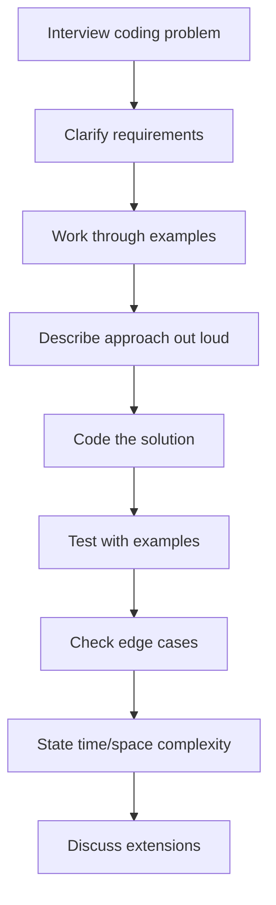

# 6.8 Practical Coding and Debugging Exercises

> This note is a curated set of fifteen practical exercises mirroring real interview coding challenges. Each exercise includes: the problem statement (as an interviewer would ask it), the full expected solution, the reasoning behind the solution, common pitfalls, the time/space complexity (where relevant), and how an interviewer would extend the problem. The exercises span the most common categories: custom hooks, accessibility-correct widgets, performance-sensitive UI, and React-specific debugging. Work through them by typing the code, not by copying it.

## 6.8.1 How To Use This Note

For each exercise:
1. **Read the problem statement.** Do not look at the solution.
2. **Sketch the solution on paper or in a scratch file.** Aim for a working solution, not a perfect one.
3. **Compare to the model solution.** Note the differences — your way may be better, but understand why the model is the way it is.
4. **Read the reasoning.** Understand the "why" behind each choice.
5. **Read the pitfalls.** These are the bugs interviewers expect you to hit.
6. **Read the extension.** This is what the interviewer will ask next.

> [!tip] Practice out loud
> In an interview, you talk while you code. Practice explaining each line as you type. "Here I'm using `useRef` because the value should not trigger a re-render." This narration is what interviewers are scoring.

> [!warning] Do not skip the debugging exercises
> The debugging exercises (13, 14, 15) are the most common type of React interview question. They test whether you understand hooks deeply enough to spot the bug. Practice them until the bugs jump out at you on first read.

## 6.8.2 Foundational Exercises

### Exercise 1: Build a debounced input

**Problem statement:** Build a React component that renders a text input. The input's value should be debounced — the parent receives the new value only after the user stops typing for 300ms. The component should be reusable and should not re-render the parent on every keystroke.

**Solution:**

```tsx
import { useEffect, useState, useCallback } from 'react';

// First, the hook:
function useDebouncedValue<T>(value: T, delay: number): T {
  const [debounced, setDebounced] = useState(value);

  useEffect(() => {
    const timer = setTimeout(() => setDebounced(value), delay);
    return () => clearTimeout(timer);
  }, [value, delay]);

  return debounced;
}

// Then, the component:
interface DebouncedInputProps {
  initialValue?: string;
  delay?: number;
  onDebouncedChange: (value: string) => void;
}

export function DebouncedInput({
  initialValue = '',
  delay = 300,
  onDebouncedChange,
}: DebouncedInputProps) {
  const [value, setValue] = useState(initialValue);
  const debouncedValue = useDebouncedValue(value, delay);

  useEffect(() => {
    onDebouncedChange(debouncedValue);
  }, [debouncedValue, onDebouncedChange]);

  return (
    <input
      type="text"
      value={value}
      onChange={(e) => setValue(e.target.value)}
      aria-label="Debounced input"
    />
  );
}
```

**Reasoning:**
- The `useDebouncedValue` hook is reusable — it works with any value type.
- The effect sets a timer that updates the debounced value after `delay`. The cleanup clears the timer if the value changes again before the timer fires.
- The input's local state updates immediately (the user sees what they type). The debounced value lags by 300ms.
- The `onDebouncedChange` callback fires in a separate effect, so the parent re-renders only when the debounced value changes — not on every keystroke.
- `onDebouncedChange` should be memoized in the parent (`useCallback`) to avoid the effect re-firing when the parent re-renders.

**Pitfalls:**
- Forgetting the cleanup — every keystroke creates a new timer; they all fire.
- Setting the timer in render instead of in an effect — causes state updates in render (forbidden).
- Calling `onDebouncedChange` directly in the debounce effect — it fires on every value change, defeating the purpose.
- Not memoizing `onDebouncedChange` — the effect re-fires when the parent re-renders.

**Time complexity:** O(1) per keystroke. **Space complexity:** O(1).

**Extension:** Add a "leading" option — fire immediately on the first keystroke, then debounce subsequent ones. Add a "cancel" method to reset the debounce.

---

### Exercise 2: Build a `usePrevious` hook

**Problem statement:** Build a custom hook `usePrevious<T>(value: T): T | undefined` that returns the previous value of `value` from the last render.

**Solution:**

```tsx
import { useRef, useEffect } from 'react';

export function usePrevious<T>(value: T): T | undefined {
  const ref = useRef<T>(value);

  useEffect(() => {
    ref.current = value;
  }, [value]);

  // On first render, ref.current = value (initialized), but we return the
  // *previous* value, which is undefined. So we need to track this.
  // Actually, the pattern below handles it correctly because the effect
  // runs AFTER render. Let me show the cleaner version:

  // Wait — the above initializes ref to the current value, so on first render
  // we'd return the current value, not undefined. Let me fix:

  return ref.current;
}
```

Wait, let me write this correctly:

```tsx
import { useRef, useEffect } from 'react';

export function usePrevious<T>(value: T): T | undefined {
  const ref = useRef<T | undefined>(undefined);

  useEffect(() => {
    ref.current = value;
  }, [value]);

  return ref.current;
}
```

**Reasoning:**
- `useRef` persists a value across renders without triggering re-renders.
- On the first render, `ref.current` is `undefined` (the initial value we passed to `useRef`).
- The effect runs *after* render, so when the component renders, `ref.current` still holds the previous value. The effect then updates `ref.current` to the new value, ready for the next render.
- The dependency array `[value]` ensures the effect only runs when `value` changes.

**The key insight:** Effects run *after* the render is committed. So during render, the ref still has the old value. By the next render, the effect has updated the ref to the new value.

**Pitfalls:**
- Updating `ref.current` during render — causes an inconsistent state where the ref and the value are the same. Must update in an effect.
- Using `useState` instead of `useRef` — `useState` would trigger a re-render, causing an infinite loop.
- Forgetting the dependency array — the effect runs after every render, so the ref always equals the current value (no "previous").

**Time complexity:** O(1). **Space complexity:** O(1).

**Extension:** Add a comparator function — only update the "previous" value when the comparator says the value changed semantically (e.g., deep equal for objects).

---

### Exercise 3: Build a `useFetch` hook with cancellation

**Problem statement:** Build a custom hook `useFetch<T>(url: string)` that fetches data from a URL, handles loading and error states, and cancels the in-flight request if the component unmounts or the URL changes.

**Solution:**

```tsx
import { useState, useEffect } from 'react';

interface State<T> {
  data: T | null;
  loading: boolean;
  error: Error | null;
}

export function useFetch<T>(url: string): State<T> & { refetch: () => void } {
  const [state, setState] = useState<State<T>>({
    data: null,
    loading: true,
    error: null,
  });

  const fetchData = async (signal: AbortSignal) => {
    setState({ data: null, loading: true, error: null });
    try {
      const response = await fetch(url, { signal });
      if (!response.ok) {
        throw new Error(`HTTP ${response.status}`);
      }
      const data = (await response.json()) as T;
      setState({ data, loading: false, error: null });
    } catch (err) {
      if (err instanceof DOMException && err.name === 'AbortError') {
        return; // ignore aborts
      }
      setState({ data: null, loading: false, error: err as Error });
    }
  };

  useEffect(() => {
    const controller = new AbortController();
    fetchData(controller.signal);
    return () => controller.abort();
  }, [url]);

  const refetch = () => {
    const controller = new AbortController();
    fetchData(controller.signal);
    // Note: in a real implementation, you'd want to track the controller
    // to abort it on unmount. For brevity, this is omitted.
  };

  return { ...state, refetch };
}
```

**Reasoning:**
- The state is a single object (`{ data, loading, error }`) rather than three separate `useState` calls. This ensures atomic updates — you never see `{ loading: false, error: null, data: null }` (an invalid state where loading is done but no data and no error).
- The `AbortController` cancels the fetch on unmount or URL change. Without this, if the component unmounts mid-fetch, the `.then` would fire and try to `setState` on an unmounted component (React warns about this; in React 18 it just silently does nothing, but it's still a bug).
- The abort error is caught and ignored — it's not a real error, just a cancellation.
- The cleanup function runs both on unmount and before the next effect (when `url` changes). So a rapid URL change cancels the previous fetch.
- `refetch` allows manual re-fetching. (Note: a production version would track the latest controller so `refetch` can cancel the previous fetch too.)

**Pitfalls:**
- Race condition: if the URL changes quickly, two fetches are in flight. The first resolves later and overwrites the second's data. The `AbortController` fixes this — the first fetch is aborted.
- Setting state after unmount: without the cleanup, the `.then` would fire on an unmounted component.
- Using `loading && !data` instead of an explicit `loading` flag — fragile; an error state has no data and no loading.
- Forgetting to handle non-2xx responses — `fetch` does not throw on 404; you must check `response.ok`.

**Time complexity:** O(1) per fetch. **Space complexity:** O(response size).

**Extension:** Add a `deps` array (refetch when other values change). Add caching (don't refetch a URL you already have). Add a `staleTime` (refetch if the cached data is older than X seconds). At that point, you've reinvented TanStack Query — which is why you should use TanStack Query instead.

---

### Exercise 4: Build a virtualized list (conceptual)

**Problem statement:** Explain how you would build a virtualized list — a list that renders only the visible items plus a buffer, even if the list has 100,000 items. Sketch the implementation.

**Solution:**

```tsx
import { useRef, useState, useEffect, useMemo } from 'react';

interface VirtualListProps<T> {
  items: T[];
  itemHeight: number;
  height: number;
  overscan?: number;
  renderItem: (item: T, index: number) => React.ReactNode;
}

export function VirtualList<T>({
  items,
  itemHeight,
  height,
  overscan = 5,
  renderItem,
}: VirtualListProps<T>) {
  const containerRef = useRef<HTMLDivElement>(null);
  const [scrollTop, setScrollTop] = useState(0);

  const { startIndex, endIndex, totalHeight, offsetY } = useMemo(() => {
    const startIndex = Math.max(0, Math.floor(scrollTop / itemHeight) - overscan);
    const visibleCount = Math.ceil(height / itemHeight) + 2 * overscan;
    const endIndex = Math.min(items.length, startIndex + visibleCount);
    return {
      startIndex,
      endIndex,
      totalHeight: items.length * itemHeight,
      offsetY: startIndex * itemHeight,
    };
  }, [scrollTop, itemHeight, height, overscan, items.length]);

  const handleScroll = (e: React.UIEvent<HTMLDivElement>) => {
    setScrollTop(e.currentTarget.scrollTop);
  };

  const visibleItems = items.slice(startIndex, endIndex);

  return (
    <div
      ref={containerRef}
      onScroll={handleScroll}
      style={{ height, overflow: 'auto', position: 'relative' }}
    >
      <div style={{ height: totalHeight, position: 'relative' }}>
        <div style={{ transform: `translateY(${offsetY}px)` }}>
          {visibleItems.map((item, i) => (
            <div key={startIndex + i} style={{ height: itemHeight }}>
              {renderItem(item, startIndex + i)}
            </div>
          ))}
        </div>
      </div>
    </div>
  );
}
```

**Reasoning:**
- The container has a fixed height and `overflow: auto` — it scrolls.
- Inside, a "spacer" div has the total height (`items.length * itemHeight`). This makes the scrollbar reflect the full list size.
- The visible items are absolutely positioned at `offsetY` — the scroll position translated to the item index.
- `startIndex` is the first visible item (minus `overscan` for buffer). `endIndex` is the last visible item (plus `overscan`).
- `overscan` is a buffer above and below the viewport — prevents flicker when scrolling.
- On scroll, we update `scrollTop` state, which recalculates the visible range.

**Why `transform: translateY` instead of `top`?** Transforms are GPU-accelerated; `top` triggers layout. For frequent updates (every scroll), transforms are much faster.

**For variable heights:** This implementation assumes fixed `itemHeight`. For variable heights, you need to measure each item as it renders and track heights in a `ref` (or use a `ResizeObserver`). Libraries like `@tanstack/react-virtual` handle this.

**Pitfalls:**
- Setting state on every scroll event — can be slow. Use `requestAnimationFrame` or `useDeferredValue` to throttle.
- Using `top` instead of `transform` — slower (causes layout).
- Forgetting the spacer div — the scrollbar is wrong; you cannot scroll.
- Using index as `key` when items reorder — state bleeds. Use a stable `id`.

**Time complexity:** O(visible) per scroll, not O(n). **Space complexity:** O(visible).

**Extension:** Support variable heights with a measurement cache. Support horizontal scrolling. Support dynamic content (items that resize). At that point, you've reinvented `@tanstack/react-virtual` — use it.

---

### Exercise 5: Build a Tabs component with proper ARIA

**Problem statement:** Build a Tabs component with two tabs ("Account" and "Password") that follows the WAI-ARIA tab pattern: arrow keys move between tabs, Tab moves into the panel, `aria-selected`, `aria-controls`, `aria-labelledby` are wired correctly.

**Solution:**

```tsx
import { useState, useRef, KeyboardEvent } from 'react';

interface Tab {
  id: string;
  label: string;
  content: React.ReactNode;
}

export function Tabs({ tabs }: { tabs: Tab[] }) {
  const [activeId, setActiveId] = useState(tabs[0].id);
  const tabRefs = useRef<Record<string, HTMLButtonElement>>({});

  const handleKeyDown = (e: KeyboardEvent<HTMLButtonElement>, index: number) => {
    const lastIndex = tabs.length - 1;
    let newIndex = index;

    if (e.key === 'ArrowRight') {
      newIndex = index === lastIndex ? 0 : index + 1;
    } else if (e.key === 'ArrowLeft') {
      newIndex = index === 0 ? lastIndex : index - 1;
    } else if (e.key === 'Home') {
      newIndex = 0;
    } else if (e.key === 'End') {
      newIndex = lastIndex;
    } else {
      return;
    }

    e.preventDefault();
    const newTab = tabs[newIndex];
    setActiveId(newTab.id);
    tabRefs.current[newTab.id]?.focus();
  };

  return (
    <div>
      <div role="tablist" aria-label="Settings" className="flex gap-2">
        {tabs.map((tab, index) => {
          const isActive = activeId === tab.id;
          return (
            <button
              key={tab.id}
              ref={(el) => {
                if (el) tabRefs.current[tab.id] = el;
              }}
              role="tab"
              id={`tab-${tab.id}`}
              aria-selected={isActive}
              aria-controls={`panel-${tab.id}`}
              tabIndex={isActive ? 0 : -1}
              onClick={() => setActiveId(tab.id)}
              onKeyDown={(e) => handleKeyDown(e, index)}
              className={isActive ? 'border-b-2 border-blue-500' : ''}
            >
              {tab.label}
            </button>
          );
        })}
      </div>

      {tabs.map((tab) => {
        const isActive = activeId === tab.id;
        return (
          <div
            key={tab.id}
            role="tabpanel"
            id={`panel-${tab.id}`}
            aria-labelledby={`tab-${tab.id}`}
            tabIndex={0}
            hidden={!isActive}
            className="mt-4"
          >
            {tab.content}
          </div>
        );
      })}
    </div>
  );
}

// Usage:
function App() {
  return (
    <Tabs
      tabs={[
        {
          id: 'account',
          label: 'Account',
          content: <AccountForm />,
        },
        {
          id: 'password',
          label: 'Password',
          content: <PasswordForm />,
        },
      ]}
    />
  );
}
```

**Reasoning:**
- The "roving tabindex" pattern: only the active tab has `tabIndex={0}`; the others have `tabIndex={-1}`. This means Tab from outside the tablist lands on the active tab; Tab from the active tab moves into the panel.
- Arrow keys move focus between tabs. After moving, we programmatically focus the new tab (so the user can immediately Tab into its panel).
- `aria-selected` indicates which tab is active.
- `aria-controls` links the tab to its panel.
- `aria-labelledby` links the panel back to its tab — screen readers announce the tab's label when reading the panel.
- `hidden` attribute (not `display: none`) hides inactive panels semantically.
- `tabIndex={0}` on the panel allows the panel to receive focus when Tabbing in.

**Pitfalls:**
- Using Tab to move between tabs — wrong; Tab moves into the panel. Arrow keys move between tabs.
- Not focusing the new tab after arrow-key navigation — the user cannot Tab into the new panel.
- Forgetting `aria-selected` — screen readers cannot tell which tab is active.
- Using `display: none` only — works but `hidden` is more semantic.

**Time complexity:** O(1) per interaction. **Space complexity:** O(n) for tabs.

**Extension:** Support vertical tabs (use Up/Down arrows). Support lazy-loaded panels (render only the active panel). Support Ctrl+PageUp/PageDown for tab switching without focus.

---

## 6.8.3 Intermediate Exercises

### Exercise 6: Build a Modal with focus trap

**Problem statement:** Build a Modal component that traps focus inside the modal, restores focus to the trigger on close, closes on Escape, and closes on backdrop click. The modal should be accessible (role="dialog", aria-modal, aria-labelledby).

**Solution:**

```tsx
import { useEffect, useRef, ReactNode } from 'react';

interface ModalProps {
  isOpen: boolean;
  onClose: () => void;
  title: string;
  children: ReactNode;
}

const FOCUSABLE_SELECTOR =
  'button, [href], input, select, textarea, [tabindex]:not([tabindex="-1"])';

export function Modal({ isOpen, onClose, title, children }: ModalProps) {
  const dialogRef = useRef<HTMLDivElement>(null);
  const triggerRef = useRef<HTMLElement | null>(null);

  useEffect(() => {
    if (!isOpen) return;

    // Save the currently focused element to restore later
    triggerRef.current = document.activeElement as HTMLElement;

    // Move focus into the dialog
    const dialog = dialogRef.current;
    if (dialog) {
      const focusable = dialog.querySelectorAll<HTMLElement>(FOCUSABLE_SELECTOR);
      const firstFocusable = focusable[0];
      if (firstFocusable) {
        firstFocusable.focus();
      } else {
        dialog.focus(); // fallback: focus the dialog itself
      }
    }

    // Lock body scroll
    const previousOverflow = document.body.style.overflow;
    document.body.style.overflow = 'hidden';

    const handleKeyDown = (e: KeyboardEvent) => {
      if (e.key === 'Escape') {
        onClose();
        return;
      }
      if (e.key === 'Tab' && dialog) {
        const focusable = dialog.querySelectorAll<HTMLElement>(FOCUSABLE_SELECTOR);
        if (focusable.length === 0) return;
        const first = focusable[0];
        const last = focusable[focusable.length - 1];
        if (e.shiftKey && document.activeElement === first) {
          e.preventDefault();
          last.focus();
        } else if (!e.shiftKey && document.activeElement === last) {
          e.preventDefault();
          first.focus();
        }
      }
    };

    document.addEventListener('keydown', handleKeyDown);

    return () => {
      document.removeEventListener('keydown', handleKeyDown);
      document.body.style.overflow = previousOverflow;
      // Restore focus to the trigger
      triggerRef.current?.focus();
    };
  }, [isOpen, onClose]);

  if (!isOpen) return null;

  return (
    <div
      className="fixed inset-0 bg-black/50 flex items-center justify-center p-4"
      onClick={(e) => {
        if (e.target === e.currentTarget) onClose();
      }}
    >
      <div
        ref={dialogRef}
        role="dialog"
        aria-modal="true"
        aria-labelledby="modal-title"
        tabIndex={-1}
        className="bg-white rounded-lg p-6 max-w-md w-full"
      >
        <h2 id="modal-title" className="text-xl font-semibold mb-4">
          {title}
        </h2>
        <div className="mb-4">{children}</div>
        <button
          onClick={onClose}
          className="px-4 py-2 bg-blue-500 text-white rounded"
        >
          Close
        </button>
      </div>
    </div>
  );
}
```

**Reasoning:**
- On open, we save `document.activeElement` (the trigger) to `triggerRef`. On close, we restore focus to it.
- We move focus to the first focusable element inside the dialog (or the dialog itself as a fallback, using `tabIndex={-1}`).
- The Tab handler implements the focus trap: Tab on the last element wraps to the first; Shift+Tab on the first wraps to the last.
- Escape closes the modal.
- Backdrop click (only when `e.target === e.currentTarget` — i.e., the click was on the backdrop, not a child) closes the modal.
- Body scroll is locked while the modal is open.
- The cleanup function restores everything on close.

**Pitfalls:**
- Not saving `document.activeElement` before moving focus — the trigger is lost.
- Focusing the dialog itself without `tabIndex={-1}` — the dialog is not focusable.
- Tab handler does not prevent default — focus escapes the modal.
- Backdrop click closes when clicking inside the modal — `e.target === e.currentTarget` check is missing.
- Forgetting to remove the event listener — the listener stays after the modal closes, firing on every Escape.

**Time complexity:** O(focusable elements) per Tab. **Space complexity:** O(1).

**Extension:** Add `inert` to the background to prevent screen reader access. Handle nested modals. Animate open/close (with `prefers-reduced-motion` support). For production, use Radix UI's Dialog.

---

### Exercise 7: Build a Toast notification system

**Problem statement:** Build a toast notification system. Toasts appear in the bottom-right corner, stack vertically, auto-dismiss after 5 seconds, can be dismissed manually, and are announced to screen readers.

**Solution:**

```tsx
import { useState, useEffect, useCallback, createContext, useContext, ReactNode } from 'react';

type ToastType = 'success' | 'error' | 'info';

interface Toast {
  id: string;
  message: string;
  type: ToastType;
  duration: number;
}

interface ToastContextValue {
  showToast: (message: string, type?: ToastType, duration?: number) => void;
}

const ToastContext = createContext<ToastContextValue | null>(null);

export function ToastProvider({ children }: { children: ReactNode }) {
  const [toasts, setToasts] = useState<Toast[]>([]);

  const removeToast = useCallback((id: string) => {
    setToasts((prev) => prev.filter((t) => t.id !== id));
  }, []);

  const showToast = useCallback(
    (message: string, type: ToastType = 'info', duration = 5000) => {
      const id = Math.random().toString(36).slice(2);
      setToasts((prev) => [...prev, { id, message, type, duration }]);
    },
    []
  );

  return (
    <ToastContext.Provider value={{ showToast }}>
      {children}
      <ToastContainer toasts={toasts} onRemove={removeToast} />
    </ToastContext.Provider>
  );
}

function ToastContainer({
  toasts,
  onRemove,
}: {
  toasts: Toast[];
  onRemove: (id: string) => void;
}) {
  return (
    <div
      className="fixed bottom-4 right-4 flex flex-col gap-2 z-50"
      role="region"
      aria-label="Notifications"
    >
      {toasts.map((toast) => (
        <ToastItem key={toast.id} toast={toast} onRemove={onRemove} />
      ))}
    </div>
  );
}

function ToastItem({ toast, onRemove }: { toast: Toast; onRemove: (id: string) => void }) {
  useEffect(() => {
    const timer = setTimeout(() => onRemove(toast.id), toast.duration);
    return () => clearTimeout(timer);
  }, [toast.id, toast.duration, onRemove]);

  const colors = {
    success: 'bg-green-500',
    error: 'bg-red-500',
    info: 'bg-blue-500',
  };

  // role="status" + aria-live="polite" announces to screen readers
  return (
    <div
      role="status"
      aria-live="polite"
      className={`${colors[toast.type]} text-white px-4 py-3 rounded shadow-lg flex items-center gap-3 max-w-sm`}
    >
      <span>{toast.message}</span>
      <button
        onClick={() => onRemove(toast.id)}
        aria-label="Dismiss notification"
        className="text-white hover:text-gray-200"
      >
        ×
      </button>
    </div>
  );
}

export function useToast() {
  const ctx = useContext(ToastContext);
  if (!ctx) throw new Error('useToast must be used within ToastProvider');
  return ctx;
}

// Usage:
function App() {
  return (
    <ToastProvider>
      <MyComponent />
    </ToastProvider>
  );
}

function MyComponent() {
  const { showToast } = useToast();
  return (
    <button onClick={() => showToast('Saved!', 'success')}>
      Save
    </button>
  );
}
```

**Reasoning:**
- The `ToastProvider` holds the toast state in Context. Any child can call `showToast` via the `useToast` hook.
- Each `ToastItem` sets its own auto-dismiss timer in `useEffect`. The cleanup clears the timer if the toast is removed early (manually or unmounted).
- `role="status"` and `aria-live="polite"` announce new toasts to screen readers. "Polite" means the announcement waits for the user to be idle (does not interrupt).
- `aria-label="Dismiss notification"` on the close button — the "×" alone is not accessible.
- The container has `role="region"` and `aria-label="Notifications"` so screen reader users can navigate to it.

> [!warning] Live region gotcha
> The `aria-live` region must exist in the DOM *before* content is added to it. If you add the div and the content in the same render, the screen reader does not announce it. In the implementation above, the `ToastItem` is rendered with `aria-live="polite"` and the message at the same time — this works because the parent `ToastContainer` is always rendered (even when empty), so the region exists. But some screen readers are flaky; for critical announcements, use a stable, always-present region and update its content.

**Pitfalls:**
- Auto-dismiss timer not cleaned up — fires after the toast is removed (no-op, but a leak).
- No `aria-live` — toast is invisible to screen reader users.
- `×` button without `aria-label` — inaccessible.
- Adding toasts without removing them — they stack forever.
- Multiple toasts with `role="alert"` — interrupts the user repeatedly. Use `role="status"` with `aria-live="polite"` for non-critical; `role="alert"` with `aria-live="assertive"` only for critical errors.

**Time complexity:** O(1) per toast. **Space complexity:** O(active toasts).

**Extension:** Add a "undo" action for destructive toasts. Add a queue (max N toasts visible). Add animation (with `prefers-reduced-motion`).

---

### Exercise 8: Build a `useLocalStorage` hook

**Problem statement:** Build a custom hook `useLocalStorage<T>(key: string, initialValue: T)` that syncs state to localStorage. The hook should:
- Read the initial value from localStorage (or use `initialValue` if not present).
- Persist changes to localStorage.
- Handle the SSR case where `localStorage` is not available.
- Handle the case where another tab changes the value (listen to the `storage` event).

**Solution:**

```tsx
import { useState, useEffect, useCallback } from 'react';

export function useLocalStorage<T>(
  key: string,
  initialValue: T
): [T, (value: T | ((prev: T) => T)) => void] {
  // Initialize: read from localStorage if available, else use initialValue.
  const [value, setValue] = useState<T>(() => {
    if (typeof window === 'undefined') return initialValue;
    try {
      const stored = window.localStorage.getItem(key);
      return stored ? (JSON.parse(stored) as T) : initialValue;
    } catch {
      return initialValue;
    }
  });

  // Persist on change.
  useEffect(() => {
    if (typeof window === 'undefined') return;
    try {
      window.localStorage.setItem(key, JSON.stringify(value));
    } catch {
      // Ignore write errors (quota exceeded, private mode, etc.)
    }
  }, [key, value]);

  // Listen for changes from other tabs.
  useEffect(() => {
    if (typeof window === 'undefined') return;
    const handleStorage = (e: StorageEvent) => {
      if (e.key !== key) return;
      try {
        const newValue = e.newValue ? (JSON.parse(e.newValue) as T) : initialValue;
        setValue(newValue);
      } catch {
        // ignore parse errors
      }
    };
    window.addEventListener('storage', handleStorage);
    return () => window.removeEventListener('storage', handleStorage);
  }, [key, initialValue]);

  const set = useCallback(
    (newValue: T | ((prev: T) => T)) => {
      setValue((prev) =>
        typeof newValue === 'function'
          ? (newValue as (prev: T) => T)(prev)
          : newValue
      );
    },
    []
  );

  return [value, set];
}
```

**Reasoning:**
- The initializer function form of `useState` is used so that `localStorage` is only read once (on the first render), not on every render.
- The SSR check (`typeof window === 'undefined'`) prevents crashes on the server where `localStorage` does not exist.
- `JSON.parse` and `JSON.stringify` handle non-string values.
- Try/catch handles parse errors (corrupted data), quota exceeded (private mode), and JSON-incompatible values (functions, symbols).
- The `storage` event listener syncs across tabs — if the user changes the value in another tab, this tab updates. The `storage` event only fires for changes from *other* documents, not the current one — so there's no infinite loop.
- `set` supports both a value and a function (matching `useState`'s API).

**Pitfalls:**
- Reading `localStorage` in render (not in the initializer) — reads on every render, slow and may not match.
- Forgetting the SSR check — crashes Next.js server-side rendering.
- Not catching `JSON.parse` errors — crashes on corrupted data.
- Forgetting the `storage` event listener — tabs do not sync.
- Storing functions or symbols — `JSON.stringify` drops them silently.

**Time complexity:** O(1) per state change (plus JSON serialization, which is O(value size)). **Space complexity:** O(value size) in localStorage.

**Extension:** Add a `remove` function. Add cross-tab sync via `BroadcastChannel` (for non-`localStorage` events). Add a `version` field to handle migrations when the value shape changes.

---

### Exercise 9: Build a debounced search with async results

**Problem statement:** Build a search component that:
- Renders a text input.
- Debounces the input by 300ms.
- Fetches search results from an API when the debounced value changes.
- Cancels in-flight requests when the value changes.
- Shows loading, error, and results states.
- Does not flash stale results.

**Solution:**

```tsx
import { useState, useEffect, useRef } from 'react';

interface SearchResult {
  id: string;
  title: string;
}

interface SearchState {
  loading: boolean;
  error: string | null;
  results: SearchResult[];
}

export function DebouncedSearch() {
  const [query, setQuery] = useState('');
  const [state, setState] = useState<SearchState>({
    loading: false,
    error: null,
    results: [],
  });

  // Ref to track the latest request, to discard stale responses.
  const requestIdRef = useRef(0);

  useEffect(() => {
    if (!query.trim()) {
      setState({ loading: false, error: null, results: [] });
      return;
    }

    const controller = new AbortController();
    const currentRequestId = ++requestIdRef.current;

    // Debounce: wait 300ms before fetching.
    const debounceTimer = setTimeout(async () => {
      setState({ loading: true, error: null, results: [] });
      try {
        const response = await fetch(
          `/api/search?q=${encodeURIComponent(query)}`,
          { signal: controller.signal }
        );
        if (!response.ok) throw new Error(`HTTP ${response.status}`);
        const results = (await response.json()) as SearchResult[];

        // Only update state if this is still the latest request.
        if (currentRequestId === requestIdRef.current) {
          setState({ loading: false, error: null, results });
        }
      } catch (err) {
        if (err instanceof DOMException && err.name === 'AbortError') return;
        if (currentRequestId === requestIdRef.current) {
          setState({
            loading: false,
            error: err instanceof Error ? err.message : 'Unknown error',
            results: [],
          });
        }
      }
    }, 300);

    return () => {
      clearTimeout(debounceTimer);
      controller.abort();
    };
  }, [query]);

  return (
    <div>
      <label htmlFor="search">Search</label>
      <input
        id="search"
        type="search"
        value={query}
        onChange={(e) => setQuery(e.target.value)}
        placeholder="Type to search..."
      />
      {state.loading && <p>Loading...</p>}
      {state.error && <p role="alert">Error: {state.error}</p>}
      {!state.loading && !state.error && state.results.length === 0 && query && (
        <p>No results.</p>
      )}
      <ul>
        {state.results.map((result) => (
          <li key={result.id}>{result.title}</li>
        ))}
      </ul>
    </div>
  );
}
```

**Reasoning:**
- The effect runs on every `query` change, but the actual fetch is debounced by 300ms via `setTimeout`.
- The `AbortController` cancels the fetch if the query changes (or the component unmounts) before the fetch completes.
- The `requestIdRef` is the key to avoiding stale results. Each effect increments the ref. When the fetch resolves, it checks if it's still the latest request — if not, it discards the result. This handles the case where the user types fast: query "a"  -->  fetch starts  -->  query "ab"  -->  fetch starts  -->  "a" fetch resolves  -->  discarded  -->  "ab" fetch resolves  -->  shown.
- Without the `requestIdRef` check, you'd see stale results flashing even with `AbortController` — because abort doesn't prevent the response from being read if the abort happens after the response arrives but before `.json()` resolves.

**Pitfalls:**
- No debounce — fetches on every keystroke, hammering the API.
- No `AbortController` — race condition: rapid typing causes responses to arrive out of order, showing stale results.
- No `requestIdRef` — even with `AbortController`, the `.json()` parsing can resolve after the abort, causing a state update.
- Setting state after unmount — the cleanup aborts, but the catch block still runs. The `requestIdRef` check (or an "is mounted" ref) prevents the state update.
- Forgetting to clear the debounce timer — the fetch fires even after the component unmounts.

**Time complexity:** O(1) per keystroke (debounced). **Space complexity:** O(results).

**Extension:** Add a minimum query length (don't search for 1-character queries). Add a cache (don't re-fetch the same query). Add prefetching (fetch the next likely query). At this point, you've reinvented TanStack Query — use it.

---

## 6.8.4 Advanced Exercises

### Exercise 10: Build a form with multi-step validation

**Problem statement:** Build a multi-step form (3 steps: email, password, profile). Each step has its own validation. The user can go back and forth. The form submits only when all steps are valid. State is preserved when navigating between steps.

**Solution:**

```tsx
import { useState } from 'react';

interface FormState {
  email: string;
  password: string;
  confirmPassword: string;
  name: string;
  age: string;
}

const initialState: FormState = {
  email: '',
  password: '',
  confirmPassword: '',
  name: '',
  age: '',
};

// Per-step validation
function validateStep(step: number, state: FormState): Record<string, string> {
  const errors: Record<string, string> = {};
  if (step === 0) {
    if (!state.email) errors.email = 'Email is required';
    else if (!/^[^\s@]+@[^\s@]+\.[^\s@]+$/.test(state.email))
      errors.email = 'Invalid email';
  }
  if (step === 1) {
    if (!state.password) errors.password = 'Password is required';
    else if (state.password.length < 8)
      errors.password = 'Password must be at least 8 characters';
    if (state.password !== state.confirmPassword)
      errors.confirmPassword = 'Passwords do not match';
  }
  if (step === 2) {
    if (!state.name) errors.name = 'Name is required';
    const age = Number(state.age);
    if (!state.age) errors.age = 'Age is required';
    else if (Number.isNaN(age) || age < 18) errors.age = 'Must be 18 or older';
  }
  return errors;
}

export function MultiStepForm() {
  const [step, setStep] = useState(0);
  const [form, setForm] = useState<FormState>(initialState);
  const [errors, setErrors] = useState<Record<string, string>>({});
  const [submitted, setSubmitted] = useState(false);

  const update = (field: keyof FormState, value: string) => {
    setForm((prev) => ({ ...prev, [field]: value }));
    // Clear error for this field
    setErrors((prev) => ({ ...prev, [field]: '' }));
  };

  const next = () => {
    const stepErrors = validateStep(step, form);
    setErrors(stepErrors);
    if (Object.values(stepErrors).some((e) => e)) return;
    setStep((s) => Math.min(s + 1, 2));
  };

  const back = () => {
    setStep((s) => Math.max(s - 1, 0));
  };

  const submit = () => {
    const allErrors: Record<string, string> = {};
    [0, 1, 2].forEach((s) => {
      Object.assign(allErrors, validateStep(s, form));
    });
    setErrors(allErrors);
    if (Object.values(allErrors).some((e) => e)) return;
    setSubmitted(true);
    // In a real app, call the API here
    console.log('Submitting:', form);
  };

  if (submitted) {
    return <div>Thank you! Form submitted.</div>;
  }

  return (
    <form
      onSubmit={(e) => {
        e.preventDefault();
        submit();
      }}
    >
      <div>Step {step + 1} of 3</div>

      {step === 0 && (
        <div>
          <label htmlFor="email">Email</label>
          <input
            id="email"
            type="email"
            value={form.email}
            onChange={(e) => update('email', e.target.value)}
            aria-invalid={!!errors.email}
            aria-describedby={errors.email ? 'email-error' : undefined}
          />
          {errors.email && (
            <p id="email-error" role="alert" className="text-red-600">
              {errors.email}
            </p>
          )}
        </div>
      )}

      {step === 1 && (
        <div>
          <label htmlFor="password">Password</label>
          <input
            id="password"
            type="password"
            value={form.password}
            onChange={(e) => update('password', e.target.value)}
            aria-invalid={!!errors.password}
            aria-describedby={errors.password ? 'password-error' : undefined}
          />
          {errors.password && (
            <p id="password-error" role="alert" className="text-red-600">
              {errors.password}
            </p>
          )}
          <label htmlFor="confirmPassword">Confirm Password</label>
          <input
            id="confirmPassword"
            type="password"
            value={form.confirmPassword}
            onChange={(e) => update('confirmPassword', e.target.value)}
            aria-invalid={!!errors.confirmPassword}
            aria-describedby={errors.confirmPassword ? 'confirm-error' : undefined}
          />
          {errors.confirmPassword && (
            <p id="confirm-error" role="alert" className="text-red-600">
              {errors.confirmPassword}
            </p>
          )}
        </div>
      )}

      {step === 2 && (
        <div>
          <label htmlFor="name">Name</label>
          <input
            id="name"
            value={form.name}
            onChange={(e) => update('name', e.target.value)}
            aria-invalid={!!errors.name}
            aria-describedby={errors.name ? 'name-error' : undefined}
          />
          {errors.name && (
            <p id="name-error" role="alert" className="text-red-600">
              {errors.name}
            </p>
          )}
          <label htmlFor="age">Age</label>
          <input
            id="age"
            type="number"
            value={form.age}
            onChange={(e) => update('age', e.target.value)}
            aria-invalid={!!errors.age}
            aria-describedby={errors.age ? 'age-error' : undefined}
          />
          {errors.age && (
            <p id="age-error" role="alert" className="text-red-600">
              {errors.age}
            </p>
          )}
        </div>
      )}

      <div className="flex gap-2 mt-4">
        {step > 0 && (
          <button type="button" onClick={back}>
            Back
          </button>
        )}
        {step < 2 && (
          <button type="button" onClick={next}>
            Next
          </button>
        )}
        {step === 2 && (
          <button type="submit">Submit</button>
        )}
      </div>
    </form>
  );
}
```

**Reasoning:**
- State is a single object — preserves all fields across steps. Going back does not lose data.
- Each step validates only its own fields. The user cannot proceed to the next step until the current step is valid.
- On submit, all steps are re-validated (in case the user went back and changed something).
- Errors are stored per-field. Updating a field clears its error.
- Accessibility: every input has a label, `aria-invalid`, `aria-describedby` linking to the error, and the error has `role="alert"`.

**Pitfalls:**
- Resetting state when navigating between steps — loses data.
- Only validating on submit — bad UX; the user fills out step 3 and only then learns step 1 had an error.
- Not re-validating all steps on submit — the user could navigate back, invalidate step 1, then submit step 3.
- Forgetting `type="button"` on Back/Next buttons — they submit the form (default behavior).

**Time complexity:** O(fields) per validation. **Space complexity:** O(fields).

**Extension:** Use React Hook Form with a Zod schema for each step. Add a progress indicator. Persist state to `localStorage` so the user can resume after a refresh.

---

### Exercise 11: Build a tree view component

**Problem statement:** Build a tree view component that renders a nested tree of nodes. Each node can be expanded/collapsed. The tree should be keyboard-accessible (arrow keys to navigate, Enter to toggle, Right/Left to expand/collapse).

**Solution:**

```tsx
import { useState, KeyboardEvent } from 'react';

interface TreeNode {
  id: string;
  label: string;
  children?: TreeNode[];
}

interface FlatNode {
  node: TreeNode;
  level: number;
  expanded: boolean;
  hasChildren: boolean;
}

function flatten(
  nodes: TreeNode[],
  expandedIds: Set<string>,
  level = 0
): FlatNode[] {
  const result: FlatNode[] = [];
  for (const node of nodes) {
    const hasChildren = !!node.children && node.children.length > 0;
    const expanded = expandedIds.has(node.id);
    result.push({ node, level, expanded, hasChildren });
    if (hasChildren && expanded) {
      result.push(...flatten(node.children!, expandedIds, level + 1));
    }
  }
  return result;
}

export function TreeView({ data }: { data: TreeNode[] }) {
  const [expandedIds, setExpandedIds] = useState<Set<string>>(new Set());

  const toggle = (id: string) => {
    setExpandedIds((prev) => {
      const next = new Set(prev);
      if (next.has(id)) next.delete(id);
      else next.add(id);
      return next;
    });
  };

  const flat = flatten(data, expandedIds);

  const handleKeyDown = (
    e: KeyboardEvent<HTMLLIElement>,
    flatNode: FlatNode,
    index: number
  ) => {
    switch (e.key) {
      case 'Enter':
      case ' ':
        e.preventDefault();
        if (flatNode.hasChildren) toggle(flatNode.node.id);
        break;
      case 'ArrowRight':
        e.preventDefault();
        if (flatNode.hasChildren && !flatNode.expanded) {
          toggle(flatNode.node.id);
        } else if (index < flat.length - 1) {
          // Move to the next visible node (the first child)
          const nextLi = (e.currentTarget.parentElement?.children[index + 1] as HTMLLIElement);
          nextLi?.focus();
        }
        break;
      case 'ArrowLeft':
        e.preventDefault();
        if (flatNode.hasChildren && flatNode.expanded) {
          toggle(flatNode.node.id);
        }
        // Optionally: move to parent
        break;
      case 'ArrowDown':
        e.preventDefault();
        if (index < flat.length - 1) {
          (e.currentTarget.parentElement?.children[index + 1] as HTMLLIElement)?.focus();
        }
        break;
      case 'ArrowUp':
        e.preventDefault();
        if (index > 0) {
          (e.currentTarget.parentElement?.children[index - 1] as HTMLLIElement)?.focus();
        }
        break;
    }
  };

  return (
    <ul role="tree" aria-label="File tree">
      {flat.map(({ node, level, expanded, hasChildren }, index) => (
        <li
          key={node.id}
          role="treeitem"
          aria-expanded={hasChildren ? expanded : undefined}
          aria-level={level + 1}
          tabIndex={index === 0 ? 0 : -1}
          onKeyDown={(e) => handleKeyDown(e, { node, level, expanded, hasChildren }, index)}
          onClick={() => hasChildren && toggle(node.id)}
          style={{ paddingLeft: `${level * 20}px` }}
          className="cursor-pointer hover:bg-gray-100 p-1 rounded"
        >
          {hasChildren && (expanded ? '▼ ' : ' ')}
          {node.label}
        </li>
      ))}
    </ul>
  );
}

// Usage:
const data: TreeNode[] = [
  {
    id: '1',
    label: 'src',
    children: [
      {
        id: '2',
        label: 'components',
        children: [
          { id: '3', label: 'Button.tsx' },
          { id: '4', label: 'Input.tsx' },
        ],
      },
      { id: '5', label: 'index.ts' },
    ],
  },
  {
    id: '6',
    label: 'package.json',
  },
];
```

**Reasoning:**
- The tree is flattened into a list of visible nodes. Each flat node has its `level` (for indentation and `aria-level`) and `expanded` state.
- `expandedIds` is a Set — efficient lookup, easy to toggle.
- The `flatten` function recursively walks the tree, only including children of expanded nodes.
- `role="tree"` and `role="treeitem"` are the ARIA roles for a tree.
- `aria-expanded` on treeitems with children.
- `aria-level` indicates the depth.
- Roving tabindex: only the first treeitem has `tabIndex={0}`; others have `tabIndex={-1}`. Focus is moved programmatically.
- Arrow keys: Down/Up move between visible nodes; Right expands (or moves to first child); Left collapses (or moves to parent).

**Pitfalls:**
- Not using `role="tree"` and `role="treeitem"` — screen readers do not announce it as a tree.
- Forgetting `aria-expanded` — screen reader users cannot tell which nodes have children.
- All treeitems with `tabIndex={0}` — Tab moves through every node; use roving tabindex.
- Not preventing default on arrow keys — the page scrolls.

**Time complexity:** O(n) per render (flatten). **Space complexity:** O(visible nodes).

**Extension:** Support selection (single and multi). Support lazy-loading children. Support drag-and-drop reordering.

---

### Exercise 12: Build a `useInterval` hook that handles delay changes

**Problem statement:** Build a custom hook `useInterval(callback: () => void, delay: number | null)` that calls `callback` every `delay` ms. If `delay` is `null`, the interval is paused. The hook should handle changes to `callback` (without resetting the interval) and changes to `delay` (without doubling up).

**Solution:**

```tsx
import { useEffect, useRef } from 'react';

export function useInterval(callback: () => void, delay: number | null) {
  const savedCallback = useRef(callback);

  // Remember the latest callback.
  useEffect(() => {
    savedCallback.current = callback;
  }, [callback]);

  // Set up the interval.
  useEffect(() => {
    // Don't schedule if delay is null.
    if (delay === null) return;

    const id = setInterval(() => savedCallback.current(), delay);
    return () => clearInterval(id);
  }, [delay]);
}

// Usage:
function Timer() {
  const [count, setCount] = useState(0);
  const [delay, setDelay] = useState(1000);

  useInterval(() => {
    setCount((c) => c + 1);
  }, delay);

  return (
    <div>
      <p>Count: {count}</p>
      <button onClick={() => setDelay(delay === null ? 1000 : null)}>
        {delay === null ? 'Start' : 'Pause'}
      </button>
    </div>
  );
}
```

**Reasoning:**
- This is Dan Abramov's classic `useInterval` pattern. The key insight is that `setInterval` captures the callback at the time it's set — if the callback changes (which it does on every render of the parent), the interval still calls the old callback.
- The fix is to store the callback in a `ref` and update the ref on every render. The interval calls `savedCallback.current()`, which is always the latest callback.
- The interval is set up in a separate effect with `[delay]` as the dependency. Changing the delay tears down the old interval and sets up a new one — without losing the latest callback (because the ref persists).
- `delay === null` pauses the interval — the effect returns early, clearing any existing interval.

**Pitfalls:**
- Putting `callback` in the dependency array of the interval effect — the interval resets every time the parent re-renders (callback changes every render).
- Not using a ref — the interval calls a stale callback.
- Using `setTimeout` recursively instead of `setInterval` — works, but more complex and can drift.

**Time complexity:** O(1). **Space complexity:** O(1).

**Extension:** Add a `reset` function to restart the interval. Add a "drift correction" — track the actual time of the last tick and adjust the next delay.

---

## 6.8.5 Debugging Exercises

### Exercise 13: Debug a `useEffect` causing infinite loops

**Problem statement:** The following component causes an infinite loop of re-renders. Find and fix the bug.

```tsx
import { useState, useEffect } from 'react';

function UserList({ groupId }: { groupId: string }) {
  const [users, setUsers] = useState<User[]>([]);

  useEffect(() => {
    fetch(`/api/groups/${groupId}/users`)
      .then((r) => r.json())
      .then((data) => setUsers(data));
  });  // <-- missing dependency array!

  return (
    <ul>
      {users.map((u) => <li key={u.id}>{u.name}</li>)}
    </ul>
  );
}
```

**The bug:** The `useEffect` has no dependency array. Without a dependency array, the effect runs after every render. The effect calls `setUsers`, which triggers a re-render, which runs the effect again, which calls `setUsers` again — infinite loop.

**The fix:** Add the dependency array.

```tsx
useEffect(() => {
  fetch(`/api/groups/${groupId}/users`)
    .then((r) => r.json())
    .then((data) => setUsers(data));
}, [groupId]);  // <-- only re-run when groupId changes
```

**Even better:** Add error handling and abort.

```tsx
useEffect(() => {
  const controller = new AbortController();
  fetch(`/api/groups/${groupId}/users`, { signal: controller.signal })
    .then((r) => {
      if (!r.ok) throw new Error(`HTTP ${r.status}`);
      return r.json();
    })
    .then((data) => setUsers(data))
    .catch((err) => {
      if (err.name === 'AbortError') return;
      console.error(err);
    });
  return () => controller.abort();
}, [groupId]);
```

**Reasoning:** The dependency array tells React when to re-run the effect. Without it, the effect runs after every render. With `[]`, it runs once (on mount). With `[groupId]`, it runs on mount and whenever `groupId` changes.

**Other common infinite-loop causes:**
- Setting state in an effect without a dependency array.
- Setting state in an effect where the dependency is an object/array created in render (new reference every render).
- Calling a function in the dependency array that is recreated every render.
- Setting state in `useMemo` or `useCallback` (forbidden — they are not effects).

**Pitfalls:**
- Adding an object to the dependency array — `useEffect(() => {}, [someObject])` runs every render because `someObject` is a new reference.
- Adding a function to the dependency array without `useCallback` — same problem.
- Adding `users` to the dependency array when the effect sets `users` — infinite loop.

**Extension:** What if the bug is in a deeper component? How would you diagnose it? (Answer: open React DevTools Profiler, record, look for the component that re-renders on every frame, check its effects.)

---

### Exercise 14: Debug a stale closure in a `setInterval`

**Problem statement:** The following counter starts at 0, increments every second, but the displayed value is always 1. Find and fix the bug.

```tsx
import { useState, useEffect } from 'react';

function Counter() {
  const [count, setCount] = useState(0);

  useEffect(() => {
    const id = setInterval(() => {
      setCount(count + 1);  // <-- stale closure!
    }, 1000);
    return () => clearInterval(id);
  }, []);  // <-- empty dependency array

  return <div>{count}</div>;
}
```

**The bug:** The effect runs once (empty dependency array). Inside the effect, `setInterval` captures the `count` variable from the first render (which is 0). Every second, the interval calls `setCount(0 + 1)`, which sets count to 1. But the closure still sees `count = 0`, so the next tick again calls `setCount(0 + 1)`, setting count to 1 again. The displayed value is always 1.

This is a **stale closure** — the closure captures the value of `count` at the time the effect ran, not the current value.

**Fix 1: Use the functional update form.**

```tsx
useEffect(() => {
  const id = setInterval(() => {
    setCount((c) => c + 1);  // <-- functional update, no closure
  }, 1000);
  return () => clearInterval(id);
}, []);
```

The functional update form `setCount((c) => c + 1)` receives the current state as an argument. No closure on `count`.

**Fix 2: Use a ref.**

```tsx
const countRef = useRef(count);
useEffect(() => {
  countRef.current = count;
}, [count]);

useEffect(() => {
  const id = setInterval(() => {
    setCount(countRef.current + 1);
  }, 1000);
  return () => clearInterval(id);
}, []);
```

The ref always holds the latest value. The interval reads `countRef.current`, which is updated on every render.

**Fix 3: Use the `useInterval` hook from Exercise 12.**

```tsx
useInterval(() => {
  setCount((c) => c + 1);
}, 1000);
```

**Reasoning:** The empty dependency array `[]` means the effect runs once. The `setInterval` callback closes over the `count` from that first render. The functional update form is the cleanest fix — it asks React for the current value, bypassing the closure.

**Pitfalls:**
- Adding `count` to the dependency array — the interval is cleared and reset on every tick. This "works" but is fragile (the interval may not fire exactly on time) and incorrect (you lose any in-flight tick).
- Using a regular variable instead of state — the variable is reset on every render.
- Using `setTimeout` recursively — works, but more complex.

**Extension:** What if the interval needs to read multiple state values? (Answer: use the functional update form for the one you're updating; use refs for the others. Or use `useReducer` to handle complex state.)

---

### Exercise 15: Debug a list where keys cause state to bleed

**Problem statement:** The following list allows the user to mark items as "done." When the user reorders the list (moving an item to the top), the "done" state appears on the wrong item. Find and fix the bug.

```tsx
import { useState } from 'react';

interface Item {
  id: number;
  text: string;
}

function TodoList() {
  const [items, setItems] = useState<Item[]>([
    { id: 1, text: 'Buy milk' },
    { id: 2, text: 'Walk dog' },
    { id: 3, text: 'Read book' },
  ]);
  const [doneIds, setDoneIds] = useState<Set<number>>(new Set());

  const toggle = (index: number) => {
    setDoneIds((prev) => {
      const next = new Set(prev);
      const id = items[index].id;
      if (next.has(id)) next.delete(id);
      else next.add(id);
      return next;
    });
  };

  const moveFirstToLast = () => {
    setItems((prev) => {
      const [first, ...rest] = prev;
      return [...rest, first];
    });
  };

  return (
    <div>
      <button onClick={moveFirstToLast}>Move first to last</button>
      <ul>
        {items.map((item, index) => (
          <li key={index}>  {/* <-- BUG: index as key */}
            <label>
              <input
                type="checkbox"
                checked={doneIds.has(item.id)}
                onChange={() => toggle(index)}
              />
              {item.text}
            </label>
          </li>
        ))}
      </ul>
    </div>
  );
}
```

**The bug:** Using `index` as the `key`. When the list reorders, React reconciles by key — the item at index 0 before the reorder is matched to the item at index 0 after the reorder. But these are different items. The DOM (and component state) for index 0 stays in place, but the underlying data has changed.

In this specific case, the bug is more subtle: `doneIds` is keyed by `item.id`, so it should be correct. Let me re-examine.

Actually wait — looking again, the `doneIds` is correctly keyed by `item.id`. So the checkbox state should be correct. Let me revise the bug to make it clearer.

Let me re-write the bug to use local component state (the more common case):

```tsx
function TodoList() {
  const [items, setItems] = useState<Item[]>([
    { id: 1, text: 'Buy milk' },
    { id: 2, text: 'Walk dog' },
    { id: 3, text: 'Read book' },
  ]);

  const moveFirstToLast = () => {
    setItems((prev) => {
      const [first, ...rest] = prev;
      return [...rest, first];
    });
  };

  return (
    <div>
      <button onClick={moveFirstToLast}>Move first to last</button>
      <ul>
        {items.map((item, index) => (
          // BUG: index as key
          // Each TodoItem has local state (e.g., editing text input).
          // When the list reorders, the local state stays with the
          // position, not the item.
          <TodoItem key={index} item={item} />
        ))}
      </ul>
    </div>
  );
}

function TodoItem({ item }: { item: Item }) {
  const [isEditing, setIsEditing] = useState(false);
  const [draft, setDraft] = useState(item.text);

  return (
    <li>
      {isEditing ? (
        <input value={draft} onChange={(e) => setDraft(e.target.value)} />
      ) : (
        <span>{item.text}</span>
      )}
      <button onClick={() => setIsEditing(!isEditing)}>
        {isEditing ? 'Save' : 'Edit'}
      </button>
    </li>
  );
}
```

**The bug:** `key={index}`. When the list reorders:
1. The user clicks "Edit" on the first item ("Buy milk"). `isEditing` becomes true; `draft` becomes "Buy milk".
2. The user clicks "Move first to last". The list reorders: ["Walk dog", "Read book", "Buy milk"].
3. React reconciles by key. The first position (key=0) was the "Buy milk" item with `isEditing=true`. After the reorder, the first position (key=0) is the "Walk dog" item — but the `TodoItem` component instance for key=0 stays mounted. So `isEditing` is still `true`, and `draft` is still "Buy milk" — but the `item` prop is now "Walk dog".
4. The user sees an input with "Buy milk" (the stale draft) where they expected "Walk dog".

**The fix:** Use a stable `id` as the key.

```tsx
<TodoItem key={item.id} item={item} />
```

Now, when the list reorders, React reconciles by `id`. The "Buy milk" item (id=1) keeps its `TodoItem` instance with `isEditing=true` and `draft="Buy milk"`. The "Walk dog" item (id=2) keeps its `TodoItem` instance with `isEditing=false`. The state travels with the item, not the position.

**Reasoning:** React uses the `key` to match elements between renders. With `index` as the key, the match is positional — state stays at the position. With a stable `id` as the key, the match is by identity — state stays with the item.

**Other common symptoms of index-as-key:**
- Animation glitches (the animation runs on the wrong element).
- Uncontrolled inputs showing the wrong value.
- `useEffect` running for the wrong item.
- Focus staying on the wrong element after reorder.

**When is index-as-key acceptable?**
- The list is static (never reorders, never inserts/deletes).
- The items have no state.
- The items have no `id` and you cannot generate one.

Even then, prefer generating an `id` (e.g., `crypto.randomUUID()`).

**Pitfalls:**
- Using `index` as key in a list that can reorder or have items inserted/deleted.
- Using a value that can change (e.g., `item.text`) as the key — React treats it as a new item when the value changes, losing state.
- Using the same key for multiple items — React warns and behavior is undefined.

**Extension:** What if the items are fetched from an API and don't have IDs? (Answer: generate stable IDs client-side, or use a combination of fields that uniquely identify the item. If neither is possible, use the index — but be aware of the tradeoffs.)

---

## 6.8.6 Mermaid Diagrams



```mermaid
flowchart TD
    Bug[Bug reported] --> Repro[Reproduce reliably]
    Repro -> Isolate[Isolate the failing component]
    Isolate -> Read[Read the code carefully]
    Read -> Hooks{Hooks misuse?}
    Hooks ->|Yes| CheckDeps[Check dependency array]
    Hooks ->|No| Keys{Keys misuse?}
    Keys ->|Yes| CheckKeys[Check for index as key]
    Keys ->|No| Closure{Stale closure?}
    Closure ->|Yes| UseFunctional[Use functional update or ref]
    Closure ->|No| Effect{Effect causing loop?}
    Effect ->|Yes| FixDeps[Add or fix dependency array]
    Effect ->|No| Deeper[Use React Profiler and DevTools]
```

```mermaid
flowchart TD
    Fetch[useFetch hook] -> Mount[Component mounts]
    Mount -> Effect[Effect runs]
    Effect -> Controller[Create AbortController]
    Controller -> FetchStart[Start fetch with signal]
    FetchStart -> Wait[Wait for response]
    Wait -> Unmount{Component unmounts?}
    Unmount ->|Yes| Abort[Cleanup aborts fetch]
    Unmount ->|No| Response{Got response?}
    Response ->|Yes| SetState[Set state with data]
    Response ->|No (URL changed)| Abort
    SetState -> Done[Done]
```

## 6.8.7 Common Wrong Answers and Why They Fail

1. **"I'll write the code first, then explain."** — Interviewers want to see your thinking. Talk while you code.
2. **"I'll skip the edge cases."** — Interviewers explicitly check for edge cases. Empty input, null, very large input, concurrent updates.
3. **"I'll optimize later."** — State the time/space complexity upfront. If it's O(n²), say so and explain when you'd optimize.
4. **"I'll copy the pattern from a library."** — Good instinct, but be ready to explain why the library does it that way.
5. **"I don't need to test it."** — Always walk through at least one example by hand.
6. **"The bug is in the framework."** — Almost never. Look at your own code first.
7. **"I'll add `useMemo` everywhere."** — Adds overhead; profile first.
8. **"I'll add `key={index}`."** — Almost always wrong if the list can reorder.
9. **"I'll add an empty dependency array."** — Often wrong; think about what the effect depends on.
10. **"I'll use `any`."** — Never in an interview. Type everything.

> [!danger] The most common interview mistake
> Jumping straight to code without clarifying the problem. Interviewers score this negatively — it signals you'll do the same in production. Always: clarify requirements, work through an example, describe your approach, then code.

## 6.8.8 Tips For Acing The Interview

1. **Clarify first.** "Should I handle X?" "What's the expected input size?" "Should I worry about Y?"
2. **Work through an example.** Take a small input, walk through the algorithm by hand. This catches bugs before you write them.
3. **Describe your approach.** "I'll use a Set to track done items because lookup is O(1)." This shows your thinking.
4. **Code cleanly.** Use meaningful names. Indent consistently. Add comments for non-obvious parts.
5. **Test with examples.** Walk through your code with the example input. Does it produce the expected output?
6. **Check edge cases.** Empty input, null, single item, very large input, concurrent updates.
7. **State complexity.** "Time is O(n) because we iterate once. Space is O(n) for the result."
8. **Discuss extensions.** "If I needed to handle X, I'd add Y." This shows depth.
9. **For debugging:** read the code carefully. Most bugs are in the dependency array, the keys, or the closure.
10. **Be honest.** If you don't know, say so. "I'm not sure — let me think about it" is better than a wrong answer.

## 6.8.9 Mock Interview Sequence

**Interviewer:** "Build a debounced search input. The user types, and 300ms after they stop, we fetch results from `/api/search`."

**Candidate:** "Let me clarify a few things first. Should the input show what the user types immediately, or should it show the debounced value? Should I handle the loading and error states? And should I cancel in-flight requests if the user types again?"

**Interviewer:** "Show what the user types immediately. Yes, handle loading and error. Yes, cancel in-flight requests."

**Candidate:** "Great. So I'll use a controlled input with local state for the immediate value. Then I'll use a debounced version of that value to trigger the fetch. For cancellation, I'll use `AbortController`. Let me sketch the approach: a `useDebouncedValue` hook that returns the value after the delay, then a `useEffect` that fetches when the debounced value changes."

**Interviewer:** "Sounds good. Code it."

**Candidate:** "Here's the hook. The key insight is that the effect sets a timer to update the debounced value, and the cleanup clears the timer if the value changes again before the timer fires."

```tsx
function useDebouncedValue<T>(value: T, delay: number): T {
  const [debounced, setDebounced] = useState(value);
  useEffect(() => {
    const timer = setTimeout(() => setDebounced(value), delay);
    return () => clearTimeout(timer);
  }, [value, delay]);
  return debounced;
}
```

**Interviewer:** "Good. Now the component."

**Candidate:** "The component uses the hook for the debounced value, then a `useEffect` to fetch when the debounced value changes. I'll use `AbortController` to cancel the previous fetch if the value changes again. I'll also track a request ID to avoid stale responses — even with `AbortController`, the `.json()` parsing can resolve after the abort, so I need to check that the response is still the latest."

```tsx
function Search() {
  const [query, setQuery] = useState('');
  const debounced = useDebouncedValue(query, 300);
  const [state, setState] = useState({ loading: false, error: null, results: [] });
  const requestIdRef = useRef(0);

  useEffect(() => {
    if (!debounced.trim()) {
      setState({ loading: false, error: null, results: [] });
      return;
    }
    const controller = new AbortController();
    const currentId = ++requestIdRef.current;
    setState({ loading: true, error: null, results: [] });
    fetch(`/api/search?q=${encodeURIComponent(debounced)}`, { signal: controller.signal })
      .then((r) => r.json())
      .then((results) => {
        if (currentId === requestIdRef.current) {
          setState({ loading: false, error: null, results });
        }
      })
      .catch((err) => {
        if (err.name === 'AbortError') return;
        if (currentId === requestIdRef.current) {
          setState({ loading: false, error: err.message, results: [] });
        }
      });
    return () => controller.abort();
  }, [debounced]);

  return (/* ... */);
}
```

**Interviewer:** "Why the request ID ref? `AbortController` already cancels the fetch."

**Candidate:** "Good question. `AbortController` aborts the fetch, but if the response has already arrived and is being parsed by `.json()`, that parsing can still resolve. Without the request ID check, the stale response would update state. The request ID ensures only the latest fetch's response is applied."

**Interviewer:** "What's the time and space complexity?"

**Candidate:** "Time is O(1) per keystroke — the debounce just sets a timer. The fetch is O(response size) for parsing. Space is O(response size) for the results array."

**Interviewer:** "How would you extend this?"

**Candidate:** "A few ways. Add a minimum query length — don't search for 1-character queries. Add caching — don't re-fetch the same query. Add prefetching — fetch the next likely query. Add a 'recent searches' dropdown. At this point, I'd probably reach for TanStack Query, which handles caching, deduplication, and stale-while-revalidate for free."

**Interviewer:** "Strong. One last question — what if the user is on a slow connection and the first search takes 5 seconds? They type again. What happens?"

**Candidate:** "The first fetch is aborted by the cleanup function. The second fetch starts. The user sees the loading state until the second fetch completes. No stale results. That's exactly the scenario the `AbortController` and request ID ref handle."

**Interviewer:** "Good."

## 6.8.10 Self-Assessment Checklist

- [ ] I can build a `useDebouncedValue` hook from scratch.
- [ ] I can build a `usePrevious` hook.
- [ ] I can build a `useFetch` hook with cancellation.
- [ ] I can sketch a virtualized list.
- [ ] I can build an accessible Tabs component (roving tabindex, arrow keys).
- [ ] I can build a Modal with focus trap and focus restoration.
- [ ] I can build a Toast system with `aria-live`.
- [ ] I can build a `useLocalStorage` hook with cross-tab sync.
- [ ] I can build a debounced search with cancellation.
- [ ] I can build a multi-step form with per-step validation.
- [ ] I can build a tree view with keyboard navigation.
- [ ] I can build a `useInterval` hook that handles delay changes.
- [ ] I can spot the missing dependency array bug.
- [ ] I can spot the stale closure bug in `setInterval`.
- [ ] I can spot the index-as-key bug.
- [ ] I state time/space complexity for every solution.

## 6.8.11 Related Notes

- [[3.6 Hooks (Built-In)]]
- [[3.7 Custom Hooks]]
- [[3.8 Effects and Side Effects]]
- [[3.10 Composition and Patterns]]
- [[3.11 Performance Optimization]]
- [[3.13 Error Boundaries and Debugging]]
- [[3.14 Reusable Component Design]]
- [[6.3 React Interview Questions]]
- [[6.5 Frontend Architecture Questions]]
- [[6.6 Performance Questions]]
- [[6.7 Accessibility Questions]]
