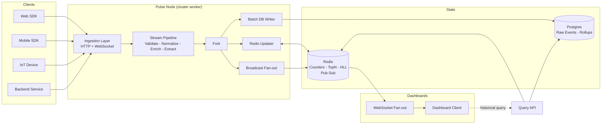
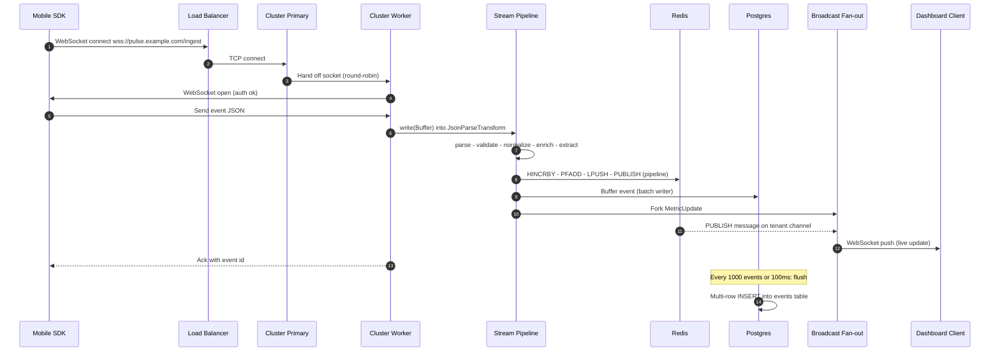

# 8.01 Real-time Analytics Engine

> A real-time analytics engine is the project that forces every Node subsystem you have learned in isolation to cooperate on a single event: the HTTP server that receives it, the parser that decodes it, the Transform stream that validates and enriches it, the Redis cache that aggregates it, the batch writer that persists it, the WebSocket fan-out that pushes it to a live dashboard, the cluster module that fans the whole pipeline across every CPU core, the worker thread that runs the CPU-heavy aggregation, the heap snapshot that catches the leak before it kills the process, and the Prometheus endpoint that tells you, second by second, whether any of it is healthy. Build this and you have built Node.js end to end.

This is the first capstone of the vault. The concept notes taught you the primitives; this note teaches you how to combine them into a system that could carry production traffic. Every section assumes you have read the linked concept notes; the wikilinks in section 11 are the prerequisites, not optional reading.

---

## 1. Project Overview

### 1.1 What this project is

Pulse is a real-time analytics engine. It accepts a high-volume stream of structured events from web clients, mobile SDKs, backend services, and IoT devices; transforms each event through a streaming pipeline; maintains rolling aggregates in Redis; persists raw events and time-bucketed rollups to a Postgres-compatible database; and pushes live metric updates to subscribed dashboards over WebSocket. It also exposes a query API for historical reads, a health endpoint for orchestrators, and a metrics endpoint in Prometheus exposition format.

The shape of the system is familiar — it is what Mixpanel, Amplitude, Heap, and PostHog do for product analytics; what Datadog and New Relic do for infrastructure metrics; what Stripe and Uber build internally for payment and trip telemetry. Pulse is a teaching-grade version of those systems: simpler in scope, but architecturally identical in the parts that matter.

Concrete functional requirements:

1. **Ingest events over HTTP and WebSocket.** An event is a small JSON document — a tenant identifier, an event type, a timestamp, a payload of arbitrary properties, and an optional session identifier. HTTP ingestion is for fire-and-forget clients; WebSocket ingestion is for clients that want a persistent low-latency channel and a server-driven ack.
2. **Validate, normalize, and enrich each event.** Schema validation rejects malformed events before they reach the cache or the database. Normalization converts timestamps to UTC milliseconds, lowercases event types, and trims string properties. Enrichment adds geo-data from the client IP, user-agent classification, and a server-side received timestamp.
3. **Compute rolling aggregates in Redis.** For every (tenant, metric, time bucket) tuple, Pulse maintains counters (event counts, sums of numeric properties), top-N sorted sets (most active users, most popular pages), and HyperLogLog cardinality estimators (unique users, unique sessions). Buckets are minute-grained by default and configurable per metric.
4. **Persist raw events in batches.** Raw events are written to Postgres in batches of 1,000 or every 100 milliseconds, whichever comes first. This keeps the write throughput high enough to keep up with ingest while keeping per-row overhead low.
5. **Persist aggregate rollups.** Minute-bucketed aggregates are flushed to a time-series table (Postgres with a TimescaleDB-style hypertable, or vanilla Postgres with a partitioned table) every minute. Rollups survive Redis restarts and backfill historical queries.
6. **Push live updates to dashboards.** Dashboards subscribe to a tenant and a metric set over WebSocket. When a metric changes, Pulse publishes the new value to a Redis pub/sub channel; every cluster worker subscribed to that channel fans the update out to its connected dashboards.
7. **Expose a historical query API.** Dashboards also issue historical queries (last hour, last day, last week). The query API reads from rollup tables, falls back to raw events for sub-minute resolution, and returns aggregated time-series responses.
8. **Stay healthy under load.** Pulse targets 10,000 events per second sustained per node, p99 ingest latency under 50 milliseconds, p99 cache read under 1 millisecond, and 99.9 percent monthly availability. These targets drive every architectural decision in section 6.

### 1.2 Why this is a capstone

A capstone project in this vault is a single system that exercises every major topic area: JavaScript language, TypeScript type system, Node core APIs, software engineering patterns, testing, tooling, and production operations. Pulse does all of it. The map from capstone section to vault module is:

- **Streams.** The processing pipeline is built from custom `Transform` streams composed with `pipeline`. Backpressure from a slow database write propagates upstream to the HTTP ingestion point and slows the producer. See [[3.07 Streams Fundamentals]] and [[3.08 Streams Advanced Backpressure]].
- **TCP and custom protocols.** The WebSocket layer is layered on a raw TCP socket managed by the `net` module; the ingestion server can also expose a custom binary protocol for high-throughput IoT clients. See [[3.11 Net Module TCP Sockets]].
- **HTTP and HTTPS.** The ingestion server and the query API are built directly on `node:http` (and `node:https` in production), not on Express or Fastify, so that the request body can be piped into a Transform stream without an intermediate buffer. See [[3.12 HTTP and HTTPS Modules]].
- **WebSockets and realtime.** Both ingestion and dashboard fan-out use WebSockets. See [[3.14 WebSockets and Realtime]].
- **Cluster module.** Production runs in cluster mode with one worker per CPU core; the primary round-robins incoming connections. See [[3.17 Cluster Module]].
- **Worker threads.** CPU-heavy aggregation (HyperLogLog merge, percentile estimation over large sliding windows) is offloaded to a worker pool so the event loop stays responsive. See [[3.18 Worker Threads]].
- **Redis caching.** Hot aggregates live in Redis; cross-worker fan-out uses Redis pub/sub. See [[7.07 Redis Caching Strategies]] (a sibling note in the production module).
- **Memory and the event loop.** Heap snapshots, garbage collection tuning, and event loop monitoring are first-class concerns. See [[1.29 Memory Leaks Diagnostic]], [[1.27 Memory Lifecycles and Allocation]], and [[7.03 Event Loop Monitoring]].
- **Production monitoring.** Prometheus metrics, structured logging, health checks, and graceful shutdown are built in from day one. See [[7.09 Production Monitoring]].
- **TypeScript type system.** The TS blueprint exercises generics, discriminated unions for event types, branded types for tenant identifiers, and runtime validation with `zod`-style parsers hand-rolled to avoid an external dependency.

If you can build Pulse, you can build any Node system this vault prepares you for.

### 1.3 Learning outcomes

By the end of this capstone, you will be able to: design a streaming pipeline that respects backpressure end to end (from HTTP socket through every Transform to the database write) and explain why memory stays bounded when one stage slows; implement a custom HTTP server on `node:http` that streams the request body directly into a Transform pipeline without buffering it in memory; build separate WebSocket ingestion and fan-out endpoints and explain why they have different semantics; use Redis as a hot aggregation cache (counters via `HINCRBY`, top-N via `ZADD` and `ZREVRANGE`, cardinality via `PFADD` and `PFMERGE`) and as a cross-worker pub/sub bus; write a batched Postgres writer that flushes on size or time, handles backpressure, and never blocks the event loop; bootstrap a cluster-mode Node process with shared listening sockets and graceful shutdown; offload CPU-bound aggregation to a worker pool using `postMessage`; capture and analyze V8 heap snapshots under load and fix leaks before they trigger an OOM kill; instrument the service with Prometheus metrics and build Grafana dashboards; and load-test the system with k6 against SLO thresholds, reading flame graphs produced by `clinic flame` to find hot functions.

These ten outcomes are the acceptance criteria for the capstone. If any one of them is shaky, the system is not done.

---

## 2. Architecture and System Design

### 2.1 High-level shape

Pulse is a **modular monolith**. It runs as a single Node process (or, in production, a cluster of N processes on one host, and M hosts behind a load balancer). Inside the process, it is divided into modules with strict boundaries: ingestion, pipeline, cache, persistence, broadcast, query, observability, and bootstrap. Each module exposes a small typed interface; no module reaches into another's internals. The codebase is structured so any module could be extracted into a separate process later, but it does not pay the cost of cross-process communication until it has to.

The alternative — starting with microservices from day one — is rejected for the reasons covered in [[4.11 Modular Monolith vs Microservices]]. In short: a modular monolith has lower operational complexity, lower latency (no network hops between pipeline stages), easier local development, and easier refactoring. Pulse is sized so that one well-tuned node handles the target throughput; when it does not, the first move is to scale horizontally (more nodes behind the load balancer), not to split the monolith.

### 2.2 The full pipeline at a glance

An event enters Pulse through one of two ingestion endpoints — HTTP `POST /events` or WebSocket `wss://host/ingest`. Both endpoints normalize the event into the same internal `IngestionEvent` shape and push it into the same in-process pipeline. The pipeline is a chain of `Transform` streams: validation, normalization, enrichment, and metric extraction. The output is forked into three sinks: a Redis updater (writes the aggregate counters), a batch database writer (writes the raw event), and a broadcast fan-out (publishes the change to a Redis pub/sub channel for dashboards).

Reads — dashboard queries for historical data — go through a separate HTTP `GET /metrics` endpoint that reads directly from Redis (for the most recent minute) and from Postgres (for older buckets). Reads never touch the write pipeline.

### 2.3 Architecture diagram



### 2.4 Process model

In production, Pulse runs under the Node `cluster` module (see [[3.17 Cluster Module]]). The primary process forks one worker per CPU core, hands each worker the same listening socket for ports 8080 (HTTP ingestion) and 8081 (WebSocket), and monitors worker health. Workers handle incoming connections independently; the OS and Node's primary cooperate to round-robin connections across workers.

Each worker runs the full pipeline in its own V8 isolate with its own heap. State shared across workers — the Redis aggregates and the Postgres tables — lives outside the process. There is no in-process shared state, which means a worker crash never corrupts another worker's view of the world.

For CPU-heavy work that would stall a single worker's event loop — sliding-window percentile computation over the last hour of metrics, HyperLogLog merges across tenants, anomaly detection — Pulse uses a small pool of Worker threads (see [[3.18 Worker Threads]]) inside each cluster worker. The cluster gives you parallelism across requests; the worker pool gives you parallelism within a single heavy request.

### 2.5 Data stores

Two stores, with sharply different roles:

- **Redis** is the hot path. It holds aggregate counters (minute buckets per tenant per metric, written with `HINCRBY` and `HINCRBYFLOAT`), top-N sorted sets (`ZADD` with a sliding-window eviction), HyperLogLog estimators for unique counts (`PFADD`, `PFMERGE`, `PFCOUNT`), a small set of recent raw events per tenant for the live dashboard tail (`LPUSH` + `LTRIM`), and the pub/sub channels that propagate updates to dashboard fan-out workers. Redis is single-threaded but in-memory; for the throughput targets in this capstone, one Redis instance with persistence disabled (or AOF every second) is sufficient. Beyond 50k events per second, move to a Redis Cluster with tenant-based sharding.
- **Postgres** is the cold path. It holds the raw events table (append-only, partitioned by day or by tenant) and the rollup table (one row per tenant per metric per minute bucket). With TimescaleDB, the rollup table is a hypertable and the raw events table is a second hypertable; vanilla Postgres achieves similar results with declarative partitioning plus BRIN indexes on the timestamp column. Postgres is the system of record: if Redis is lost, rollups are rebuilt from Postgres; raw events are never lost.

### 2.6 Why no message queue

A common variant of this architecture inserts a message queue (Kafka, NATS, Kinesis) between ingestion and the pipeline. Pulse deliberately does not, for three reasons. First, the capstone is about Node, not about operating Kafka. Second, for the target throughput (10k events per second per node), the in-process pipeline is faster than any queue could be. Third, the queue adds an operational burden (broker management, consumer-group rebalancing, offset tracking) that obscures the lessons about streams, backpressure, and the cluster module. The architecture is shaped so that adding a queue later is a local change: the ingestion endpoint writes to Kafka instead of pushing into the pipeline; a Kafka consumer in each worker pulls from the topic and pushes into the same pipeline. Nothing else changes.

---

## 3. Key Components and Modules

### 3.1 Event ingestion

Two endpoints, one logical operation: accept an event from a client and hand it to the pipeline.

- **HTTP ingestion** (`POST /events`). The client posts a single event (or a batch of up to 100) as a JSON body. The server reads the request body as a stream and pipes it through a JSON parser (a Transform that accumulates bytes and emits parsed objects) directly into the validation Transform. The response is sent only when the pipeline has accepted the event (200 OK with an event id) or rejected it (400 with a validation error). The body is never buffered in memory in full; the parser emits objects as it finds them, which lets the server handle batches larger than the high-water mark without growing the heap.
- **WebSocket ingestion** (`wss://host/ingest`). The client opens a WebSocket, sends one event per message (or a batched array), and expects an ack message back with the event id and a server timestamp. The server treats each incoming message as the equivalent of one HTTP request body and pushes it through the same pipeline. WebSocket ingestion is preferred for high-frequency clients (mobile sessions, real-time dashboards reporting their own usage) because it amortizes the TCP and TLS handshake cost across many events.

Both endpoints share a `PipelineSink` interface: a writable that accepts `IngestionEvent` objects. The endpoints differ only in how they turn a network message into an `IngestionEvent`.

### 3.2 Stream processing

The pipeline is a chain of `Transform` streams composed with `node:stream`'s `pipeline` function (see [[3.07 Streams Fundamentals]] and [[3.08 Streams Advanced Backpressure]]). Each Transform has a single responsibility and a single function shape: receive a chunk, do one thing, push zero or more outputs, call the callback. The chain is:

1. **JsonParseTransform.** Accepts raw bytes, accumulates them, parses JSON objects as they complete, and pushes parsed objects. Reuses a small accumulated buffer; rejects malformed JSON with a structured error.
2. **ValidateTransform.** Accepts a parsed object, runs it through a schema validator (a hand-rolled validator that checks required fields and types, returning a typed result), pushes valid events and emits invalid events to a separate `errors` Writable for dead-letter handling.
3. **NormalizeTransform.** Accepts a valid event, lowercases the event type, converts the timestamp to UTC milliseconds (or assigns the server's received-at timestamp if missing), trims string properties, drops empty properties.
4. **EnrichTransform.** Accepts a normalized event, adds a `geo` field derived from the source IP (using a local MaxMind-style lookup, not a remote API), adds a `client` field derived from the user-agent (browser, os, device class), and adds a `receivedAt` timestamp.
5. **ExtractTransform.** Accepts an enriched event and emits one or more `MetricUpdate` records derived from it: a count for the event type, a unique-session increment if a session id is present, a numeric property sum for any numeric property in the payload. One event typically fans out into 3 to 10 metric updates.

Each Transform operates in object mode with a high-water mark tuned to the expected event size. The chain is composed with `pipeline` so that backpressure from a slow sink (the database writer, when Postgres is saturated) propagates all the way back to the HTTP socket: when the database pauses, the transforms pause, the JSON parser pauses, and the HTTP server stops reading from the socket. The client experiences this as a slower response, not as a server crash.

### 3.3 Redis caching layer

The Redis updater is the first sink on the fork after `ExtractTransform`. For each `MetricUpdate` it applies the appropriate Redis operation:

- **Counters.** `HINCRBY` on a hash keyed by `tenant:metric:bucket` (where bucket is the minute timestamp). For floating-point sums, `HINCRBYFLOAT`.
- **Top-N.** `ZADD` on a sorted set keyed by `tenant:metric:topN:bucket`, with the score being the metric value and the member being the dimension (a user id, a page URL, a country code). On read, `ZREVRANGE` returns the top-N. The set is bounded by `ZREMRANGEBYRANK` after each write to prevent unbounded growth.
- **Unique counts.** `PFADD` on a HyperLogLog keyed by `tenant:metric:unique:bucket`, with the member being the unique identifier (user id, session id). `PFCOUNT` returns the estimate; `PFMERGE` combines buckets for longer windows.
- **Recent events tail.** `LPUSH` + `LTRIM` on a list keyed by `tenant:recent`, keeping the last 100 events for the dashboard's live tail.
- **Pub/sub.** `PUBLISH` on a channel named `tenant:metric:updates` with the new counter value, so any dashboard fan-out worker subscribed to that channel can push the update to its connected dashboard clients.

Redis operations are pipelined where possible: the updater batches operations for a single event into one `MULTI`/`EXEC` transaction (or, for higher throughput, a single non-transactional pipeline) to amortize round-trip latency. A Redis client with connection pooling (one connection per cluster worker, plus a dedicated connection for pub/sub) is essential; the capstone uses `ioredis` for its built-in pipeline and cluster support.

### 3.4 Database persistence

The batch database writer is the second sink. It accumulates enriched events into an in-memory buffer and flushes to Postgres when one of two thresholds is hit: 1,000 events or 100 milliseconds since the first event in the buffer. On flush, it issues a single multi-row `INSERT` with parameter binding (using the `pg` driver's bulk insert support). Failed inserts (database down, constraint violation, timeout) are retried with exponential backoff; events that fail all retries are written to a dead-letter table for manual inspection.

The writer is a `Writable` stream in object mode. Its `write(chunk)` method appends to the buffer and returns `false` when the buffer is full (the high-water mark is 2,000 events — twice the flush threshold — so there is headroom for in-flight flushes). Its `final(callback)` implementation hook (passed as a constructor option) flushes the remaining buffer on shutdown. The writer also exposes a `flushNow()` method that the graceful-shutdown handler calls when `SIGTERM` arrives, so no events are lost on deploy.

Rollups are written by a separate process — a one-minute `setInterval` job that reads the last minute of counters from Redis, computes aggregate rollup rows, writes them to the `rollups` table, and expires the Redis keys for the previous minute bucket (with a small overlap window for late-arriving events). The rollup job is in the same codebase as the main server but runs as a separate cluster worker role.

### 3.5 Dashboard broadcast

The dashboard fan-out is the third sink. It does not write to Redis directly (the Redis updater already published the update); instead, it maintains a subscription to the Redis pub/sub channels for every tenant that has at least one connected dashboard. When a message arrives on a channel, the fan-out worker pushes it to every WebSocket client subscribed to that tenant. If the worker has no clients for that tenant, it does not subscribe — subscription is demand-driven to avoid wasted pub/sub traffic.

The fan-out worker runs in every cluster worker. Each worker maintains its own set of connected dashboards. A dashboard connects to one worker (whichever the load balancer picks); updates are delivered through that worker's pub/sub subscription. There is no cross-worker broadcast of dashboard messages — Redis pub/sub does the fan-out, not the cluster.

### 3.6 Query API

The query API (`GET /metrics?tenant=X&metric=Y&from=...&to=...`) reads from Redis for the most recent minute (the live bucket that has not yet been rolled up) and from Postgres for older buckets. For sub-minute resolution, it falls back to scanning raw events; this is expensive and rate-limited. Responses are JSON time-series arrays suitable for direct rendering in a charting library.

The query API is read-only and lives in the same process as the write pipeline. It shares the Redis connection pool but uses a separate Postgres connection pool (read replicas in production) so that a heavy historical query cannot starve the write path of database connections.

### 3.7 Observability

Every module emits structured logs (JSON to stdout, picked up by the log shipper) and updates a small set of Prometheus counters and histograms: events ingested, events rejected, pipeline queue depth, Redis operation latency, Postgres insert latency, WebSocket clients connected, event loop lag, heap usage. The `/metrics` endpoint is served on the same port as the query API; the orchestrator scrapes it every 15 seconds.

A `/health` endpoint reports liveness (is the event loop turning over, is the Redis connection alive, is the Postgres connection alive). A `/ready` endpoint reports readiness (has the worker finished bootstrapping, is it caught up on its pub/sub subscriptions, is it below a queue-depth threshold). The orchestrator uses these to decide whether to route traffic to the worker.

---

## 4. Data Flow and Event Lifecycle

### 4.1 The lifecycle of one event

Consider an event that arrives at Pulse: a mobile SDK sends `{"type":"app.open","tenant":"acme","ts":"2024-05-01T10:00:00Z","session":"s123","userId":"u456","props":{"screen":"home"}}`. The lifecycle is:

1. The mobile SDK opens a WebSocket to `wss://pulse.example.com/ingest` (or, if it has only one event to send, posts to `https://pulse.example.com/events`).
2. The load balancer routes the connection to one Pulse node.
3. The cluster primary on that node hands the connection to a worker via round-robin socket distribution.
4. The worker's WebSocket server accepts the connection, authenticates the SDK (validates a tenant API key in the connection header), and registers the connection.
5. The SDK sends the event as a JSON text message.
6. The WebSocket message handler converts the message to a `Buffer` and writes it into the pipeline's `JsonParseTransform`.
7. `JsonParseTransform` parses the JSON and pushes an `IngestionEvent` object to `ValidateTransform`.
8. `ValidateTransform` checks required fields, types, and tenant whitelist; the event passes and is pushed to `NormalizeTransform`.
9. `NormalizeTransform` lowercases the type to `app.open`, parses `ts` to `1714557600000` (UTC milliseconds), trims `props.screen` to `home`.
10. `EnrichTransform` adds `geo: {country:"US", city:"..."}` from the source IP, `client: {browser:"safari", os:"ios", device:"phone"}` from the user-agent, `receivedAt: 1714557600123`.
11. `ExtractTransform` emits three `MetricUpdate` records (count, unique-user, unique-session) and forks each to the Redis updater, the batch DB writer, and the broadcast fan-out.
12. The Redis updater issues a pipelined batch: `HINCRBY acme:app.open:count:1714557600000 1 1`, `PFADD acme:app.open:uniqueUsers:1714557600000 u456`, `PFADD acme:app.open:uniqueSessions:1714557600000 s123`, `LPUSH acme:recent {event...}`, `LTRIM acme:recent 0 99`, `PUBLISH acme:app.open:updates {count:1,...}`.
13. The batch DB writer appends the enriched event to its buffer. If the buffer reaches 1,000 events or 100 milliseconds elapses, it flushes to Postgres with a multi-row `INSERT` into the `events` table.
14. The broadcast fan-out, subscribed to `acme:app.open:updates` because at least one dashboard is connected for tenant `acme`, receives the published message and pushes it to every connected dashboard WebSocket for tenant `acme`.
15. The dashboard client receives the update and re-renders its live chart.
16. The ingestion handler sends an ack back to the SDK: `{"ack":true,"id":"evt-...","ts":1714557600123}`.

Steps 1 through 16 take, in total, between 2 and 8 milliseconds on a warm worker with a healthy Redis and Postgres. The slowest step is almost always the Redis round-trip (step 12); pipelining keeps it under a millisecond per event in steady state.

### 4.2 Sequence diagram



### 4.3 Backpressure in the lifecycle

The interesting failure mode is what happens when Postgres slows down. Suppose a long-running analytical query holds a lock on the rollup table; inserts into the `events` table start taking 200 milliseconds each. The batch writer's flush takes longer; its buffer fills; its `write()` returns `false`. The fork that feeds the batch writer pauses. The other fork consumers (Redis updater, broadcast) keep running, but the fork's internal queue grows.

The fork is implemented with a `Writable` that writes to all sinks in parallel and respects the slowest sink's backpressure. When the slowest sink (the batch writer) signals `false`, the fork stops accepting new events from `ExtractTransform`. `ExtractTransform`'s `push()` calls start returning `false`; it stops calling `callback()` on new chunks. The transform pauses. The same happens up the chain: `EnrichTransform` pauses, `NormalizeTransform` pauses, `ValidateTransform` pauses, `JsonParseTransform` pauses, the HTTP/WebSocket ingestion stops reading from the socket. The client's TCP send buffer fills; the client's `send()` call blocks (or, for HTTP, the request body upload stalls).

From the outside, this looks like the server is slow. From the inside, every queue in the system is bounded and no memory is growing without limit. This is the entire point of building on streams instead of fire-and-forget promises: backpressure is automatic, memory is bounded, and the system degrades gracefully under load instead of crashing.

---

## 5. Code Blueprint

This section contains side-by-side JavaScript and TypeScript implementations of the four core components. The TypeScript version is the source of truth; the JavaScript version is what you get if you strip the types. Every example is production-shaped: error handling, logging hooks, and shutdown semantics are included, not elided.

### 5.1 Event ingestion (HTTP + WebSocket)

The ingestion server is built directly on `node:http` and the `ws` library, not on a framework. The request body is piped into the pipeline; no intermediate buffering.

**JavaScript:**

```javascript
// server.js
const http = require('node:http');
const { WebSocketServer } = require('ws');
const { pipeline } = require('node:stream');
const { makePipeline } = require('./pipeline');
const { authenticate } = require('./auth');
const { log } = require('./logger');

function createServer(deps) {
  const httpServer = http.createServer(async (req, res) => {
    if (req.method === 'POST' && req.url === '/events') {
      return handleHttpIngest(req, res, deps);
    }
    if (req.method === 'GET' && req.url === '/health') {
      res.statusCode = 200;
      return res.end(JSON.stringify({ ok: true, uptime: process.uptime() }));
    }
    res.statusCode = 404;
    res.end(JSON.stringify({ error: 'not found' }));
  });

  const wsServer = new WebSocketServer({ noServer: true });
  httpServer.on('upgrade', (req, socket, head) => {
    if (req.url !== '/ingest') {
      socket.destroy();
      return;
    }
    const auth = authenticate(req);
    if (!auth.ok) {
      socket.write('HTTP/1.1 401 Unauthorized\r\n\r\n');
      socket.destroy();
      return;
    }
    wsServer.handleUpgrade(req, socket, head, (ws) => {
      ws.tenant = auth.tenant;
      handleWsIngest(ws, deps);
    });
  });

  return { httpServer, wsServer };
}

function handleHttpIngest(req, res, deps) {
  const sink = deps.pipelineSink();
  const pl = makePipeline(deps);
  res.setHeader('content-type', 'application/json');
  pipeline(req, pl, sink, (err) => {
    if (err) {
      log.warn({ err: err.message }, 'ingest pipeline failed');
      if (!res.headersSent) {
        res.statusCode = 400;
        res.end(JSON.stringify({ error: err.message }));
      }
      return;
    }
    res.statusCode = 200;
    res.end(JSON.stringify({ ok: true, count: sink.accepted }));
  });
}

function handleWsIngest(ws, deps) {
  const sink = deps.pipelineSink();
  const pl = makePipeline(deps);
  // ws -> pipeline -> sink
  ws.on('message', (data, isBinary) => {
    if (isBinary) {
      ws.close(1003, 'binary not supported');
      return;
    }
    const ok = pl.write(data);
    if (!ok) ws.send('{"type":"backpressure"}');
  });
  pl.on('drain', () => ws.send('{"type":"drain"}'));
  pl.on('error', (err) => {
    ws.send(JSON.stringify({ type: 'error', message: err.message }));
  });
  pl.on('finish', () => ws.close(1000, 'shutdown'));
  ws.on('close', () => pl.end());
}

module.exports = { createServer };
```

**TypeScript:**

```typescript
// server.ts
import http from 'node:http';
import { WebSocketServer, WebSocket } from 'ws';
import { pipeline } from 'node:stream';
import { makePipeline, Pipeline } from './pipeline';
import { authenticate, AuthResult } from './auth';
import { log } from './logger';

export interface ServerDeps {
  pipelineSink: () => PipelineSink;
  transformFactories: TransformFactory[];
  redisClient: RedisClient;
  pgPool: PgPool;
}

export interface PipelineSink {
  accepted: number;
  write(chunk: unknown): boolean;
  end(): void;
}

export interface TransformFactory {
  new (deps: ServerDeps): Pipeline;
}

export interface RedisClient { /* elided */ }
export interface PgPool { /* elided */ }

export interface IngestionServer {
  httpServer: http.Server;
  wsServer: WebSocketServer;
}

export function createServer(deps: ServerDeps): IngestionServer {
  const httpServer = http.createServer(async (req, res) => {
    if (req.method === 'POST' && req.url === '/events') {
      return handleHttpIngest(req, res, deps);
    }
    if (req.method === 'GET' && req.url === '/health') {
      res.statusCode = 200;
      res.setHeader('content-type', 'application/json');
      return res.end(JSON.stringify({ ok: true, uptime: process.uptime() }));
    }
    res.statusCode = 404;
    res.setHeader('content-type', 'application/json');
    res.end(JSON.stringify({ error: 'not found' }));
  });

  const wsServer = new WebSocketServer({ noServer: true });
  httpServer.on('upgrade', (req, socket, head) => {
    if (req.url !== '/ingest') {
      socket.destroy();
      return;
    }
    const auth: AuthResult = authenticate(req);
    if (!auth.ok) {
      socket.write('HTTP/1.1 401 Unauthorized\r\n\r\n');
      socket.destroy();
      return;
    }
    wsServer.handleUpgrade(req, socket, head, (ws: WebSocket & { tenant?: string }) => {
      ws.tenant = auth.tenant;
      handleWsIngest(ws, deps);
    });
  });

  return { httpServer, wsServer };
}

function handleHttpIngest(req: http.IncomingMessage, res: http.ServerResponse, deps: ServerDeps): void {
  const sink = deps.pipelineSink();
  const pl = makePipeline(deps);
  res.setHeader('content-type', 'application/json');
  pipeline(req, pl, sink, (err?: NodeJS.ErrnoException | null) => {
    if (err) {
      log.warn({ err: err.message }, 'ingest pipeline failed');
      if (!res.headersSent) {
        res.statusCode = 400;
        res.end(JSON.stringify({ error: err.message }));
      }
      return;
    }
    res.statusCode = 200;
    res.end(JSON.stringify({ ok: true, count: sink.accepted }));
  });
}

function handleWsIngest(ws: WebSocket & { tenant?: string }, deps: ServerDeps): void {
  const sink = deps.pipelineSink();
  const pl = makePipeline(deps);
  ws.on('message', (data: Buffer, isBinary: boolean) => {
    if (isBinary) {
      ws.close(1003, 'binary not supported');
      return;
    }
    const ok = pl.write(data);
    if (!ok) ws.send('{"type":"backpressure"}');
  });
  pl.on('drain', () => ws.send('{"type":"drain"}'));
  pl.on('error', (err: Error) => {
    ws.send(JSON.stringify({ type: 'error', message: err.message }));
  });
  pl.on('finish', () => ws.close(1000, 'shutdown'));
  ws.on('close', () => pl.end());
}
```

The TypeScript version adds types for `ServerDeps`, `PipelineSink`, `IngestionServer`, and the augmented `WebSocket` (annotated with a `tenant` field). The runtime behavior is identical.

### 5.2 Stream processing (Transform Streams)

The pipeline is a chain of `Transform` streams. Each transform is small, single-purpose, and testable in isolation. The example shows the `ValidateTransform` and the `ExtractTransform`; the others follow the same shape.

**JavaScript:**

```javascript
// transforms.js
const { Transform } = require('node:stream');

function makeValidateTransform({ tenantWhitelist }) {
  return new Transform({
    objectMode: true,
    transform(chunk, encoding, callback) {
      const result = validateEvent(chunk, tenantWhitelist);
      if (result.ok) {
        this.push(result.value);
      } else {
        this.emit('invalid', { event: chunk, error: result.error });
      }
      callback();
    },
  });
}

function validateEvent(raw, tenantWhitelist) {
  if (raw === null || typeof raw !== 'object') {
    return { ok: false, error: 'event must be an object' };
  }
  if (typeof raw.tenant !== 'string' || !tenantWhitelist.has(raw.tenant)) {
    return { ok: false, error: 'unknown tenant' };
  }
  if (typeof raw.type !== 'string' || raw.type.length === 0 || raw.type.length > 100) {
    return { ok: false, error: 'invalid event type' };
  }
  if (raw.props !== undefined && (typeof raw.props !== 'object' || Array.isArray(raw.props))) {
    return { ok: false, error: 'props must be an object' };
  }
  const ts = raw.ts !== undefined ? Date.parse(raw.ts) : Date.now();
  if (Number.isNaN(ts)) {
    return { ok: false, error: 'invalid timestamp' };
  }
  return {
    ok: true,
    value: {
      tenant: raw.tenant,
      type: String(raw.type),
      ts,
      session: typeof raw.session === 'string' ? raw.session : null,
      userId: typeof raw.userId === 'string' ? raw.userId : null,
      props: raw.props || {},
    },
  };
}

function makeExtractTransform() {
  return new Transform({
    objectMode: true,
    transform(event, encoding, callback) {
      const bucket = Math.floor(event.ts / 60000) * 60000;
      this.push({
        kind: 'counter',
        tenant: event.tenant,
        metric: event.type,
        bucket,
        delta: 1,
      });
      if (event.userId) {
        this.push({
          kind: 'unique',
          tenant: event.tenant,
          metric: event.type + ':uniqueUsers',
          bucket,
          value: event.userId,
        });
      }
      if (event.session) {
        this.push({
          kind: 'unique',
          tenant: event.tenant,
          metric: event.type + ':uniqueSessions',
          bucket,
          value: event.session,
        });
      }
      for (const [key, val] of Object.entries(event.props)) {
        if (typeof val === 'number' && Number.isFinite(val)) {
          this.push({
            kind: 'sum',
            tenant: event.tenant,
            metric: event.type + ':' + key + ':sum',
            bucket,
            delta: val,
          });
        }
      }
      callback();
    },
  });
}

module.exports = { makeValidateTransform, makeExtractTransform };
```

**TypeScript:**

```typescript
// transforms.ts
import { Transform } from 'node:stream';

export interface RawEvent {
  tenant: unknown;
  type: unknown;
  ts: unknown;
  session: unknown;
  userId: unknown;
  props: unknown;
}

export interface IngestionEvent {
  tenant: string;
  type: string;
  ts: number;
  session: string | null;
  userId: string | null;
  props: Record<string, unknown>;
}

export interface EnrichedEvent extends IngestionEvent {
  receivedAt: number;
  geo: { country: string; city: string | null };
  client: { browser: string; os: string; device: string };
}

export type MetricUpdate =
  | { kind: 'counter'; tenant: string; metric: string; bucket: number; delta: number }
  | { kind: 'unique'; tenant: string; metric: string; bucket: number; value: string }
  | { kind: 'sum'; tenant: string; metric: string; bucket: number; delta: number };

export interface ValidationResult {
  ok: boolean;
  value?: IngestionEvent;
  error?: string;
}

export interface ValidateTransformDeps {
  tenantWhitelist: Set<string>;
}

export function makeValidateTransform(deps: ValidateTransformDeps): Transform {
  return new Transform({
    objectMode: true,
    transform(chunk: unknown, encoding: string, callback: () => void) {
      const result = validateEvent(chunk as RawEvent, deps.tenantWhitelist);
      if (result.ok && result.value) {
        this.push(result.value);
      } else {
        this.emit('invalid', { event: chunk, error: result.error });
      }
      callback();
    },
  });
}

export function validateEvent(raw: RawEvent, tenantWhitelist: Set<string>): ValidationResult {
  if (raw === null || typeof raw !== 'object') {
    return { ok: false, error: 'event must be an object' };
  }
  if (typeof raw.tenant !== 'string' || !tenantWhitelist.has(raw.tenant)) {
    return { ok: false, error: 'unknown tenant' };
  }
  if (typeof raw.type !== 'string' || raw.type.length === 0 || raw.type.length > 100) {
    return { ok: false, error: 'invalid event type' };
  }
  if (raw.props !== undefined && (typeof raw.props !== 'object' || Array.isArray(raw.props))) {
    return { ok: false, error: 'props must be an object' };
  }
  const ts: number = raw.ts !== undefined ? Date.parse(String(raw.ts)) : Date.now();
  if (Number.isNaN(ts)) {
    return { ok: false, error: 'invalid timestamp' };
  }
  return {
    ok: true,
    value: {
      tenant: raw.tenant,
      type: String(raw.type),
      ts,
      session: typeof raw.session === 'string' ? raw.session : null,
      userId: typeof raw.userId === 'string' ? raw.userId : null,
      props: (raw.props as Record<string, unknown>) || {},
    },
  };
}

export function makeExtractTransform(): Transform {
  return new Transform({
    objectMode: true,
    transform(event: EnrichedEvent, encoding: string, callback: () => void) {
      const bucket = Math.floor(event.ts / 60000) * 60000;
      const updates: MetricUpdate[] = [
        { kind: 'counter', tenant: event.tenant, metric: event.type, bucket, delta: 1 },
      ];
      if (event.userId) {
        updates.push({
          kind: 'unique',
          tenant: event.tenant,
          metric: event.type + ':uniqueUsers',
          bucket,
          value: event.userId,
        });
      }
      if (event.session) {
        updates.push({
          kind: 'unique',
          tenant: event.tenant,
          metric: event.type + ':uniqueSessions',
          bucket,
          value: event.session,
        });
      }
      for (const [key, val] of Object.entries(event.props)) {
        if (typeof val === 'number' && Number.isFinite(val)) {
          updates.push({
            kind: 'sum',
            tenant: event.tenant,
            metric: event.type + ':' + key + ':sum',
            bucket,
            delta: val,
          });
        }
      }
      for (const u of updates) this.push(u);
      callback();
    },
  });
}
```

The TypeScript version uses a discriminated union for `MetricUpdate` so the consumer can switch on `kind` with full exhaustiveness checking. The runtime code is identical to the JavaScript version.

### 5.3 Redis caching layer

The Redis updater is a `Writable` stream that consumes `MetricUpdate` objects and applies the appropriate Redis command, pipelined per event for round-trip efficiency.

**JavaScript:**

```javascript
// redis-updater.js
const { Writable } = require('node:stream');
const { log } = require('./logger');

function makeRedisUpdater(redisClient, opts = {}) {
  const windowSeconds = opts.windowSeconds || 60;

  return new Writable({
    objectMode: true,
    highWaterMark: 1000,
    async write(update, encoding, callback) {
      try {
        const pipeline = redisClient.pipeline();
        const bucketKey = makeBucketKey(update.tenant, update.metric, update.bucket);
        switch (update.kind) {
          case 'counter':
            pipeline.hincrby(bucketKey, 'count', update.delta);
            pipeline.expire(bucketKey, windowSeconds * 2);
            pipeline.publish(makeChannel(update.tenant, update.metric), JSON.stringify({
              kind: 'counter', metric: update.metric, bucket: update.bucket, delta: update.delta,
            }));
            break;
          case 'sum':
            pipeline.hincrbyfloat(bucketKey, 'sum', update.delta);
            pipeline.expire(bucketKey, windowSeconds * 2);
            break;
          case 'unique':
            pipeline.pfadd(bucketKey, update.value);
            pipeline.expire(bucketKey, windowSeconds * 2);
            break;
        }
        await pipeline.exec();
        callback();
      } catch (err) {
        log.error({ err: err.message, update }, 'redis update failed');
        callback(err);
      }
    },
  });
}

function makeBucketKey(tenant, metric, bucket) {
  return tenant + ':' + metric + ':' + bucket;
}

function makeChannel(tenant, metric) {
  return tenant + ':' + metric + ':updates';
}

module.exports = { makeRedisUpdater };
```

**TypeScript:**

```typescript
// redis-updater.ts
import { Writable } from 'node:stream';
import { log } from './logger';
import type { MetricUpdate } from './transforms';

export interface RedisPipeline {
  hincrby(key: string, field: string, delta: number): RedisPipeline;
  hincrbyfloat(key: string, field: string, delta: number): RedisPipeline;
  pfadd(key: string, element: string): RedisPipeline;
  expire(key: string, seconds: number): RedisPipeline;
  publish(channel: string, message: string): RedisPipeline;
  exec(): Promise<Array<[Error | null, unknown]>>;
}

export interface RedisClient {
  pipeline(): RedisPipeline;
}

export interface RedisUpdaterOpts {
  windowSeconds?: number;
}

export function makeRedisUpdater(redisClient: RedisClient, opts: RedisUpdaterOpts = {}): Writable {
  const windowSeconds: number = opts.windowSeconds ?? 60;

  return new Writable({
    objectMode: true,
    highWaterMark: 1000,
    async write(update: MetricUpdate, encoding: string, callback: (err?: Error | null) => void) {
      try {
        const pipeline = redisClient.pipeline();
        const bucketKey = makeBucketKey(update.tenant, update.metric, update.bucket);
        switch (update.kind) {
          case 'counter':
            pipeline.hincrby(bucketKey, 'count', update.delta);
            pipeline.expire(bucketKey, windowSeconds * 2);
            pipeline.publish(makeChannel(update.tenant, update.metric), JSON.stringify({
              kind: 'counter', metric: update.metric, bucket: update.bucket, delta: update.delta,
            }));
            break;
          case 'sum':
            pipeline.hincrbyfloat(bucketKey, 'sum', update.delta);
            pipeline.expire(bucketKey, windowSeconds * 2);
            break;
          case 'unique':
            pipeline.pfadd(bucketKey, update.value);
            pipeline.expire(bucketKey, windowSeconds * 2);
            break;
        }
        await pipeline.exec();
        callback();
      } catch (err) {
        const e = err as Error;
        log.error({ err: e.message, update }, 'redis update failed');
        callback(e);
      }
    },
  });
}

function makeBucketKey(tenant: string, metric: string, bucket: number): string {
  return tenant + ':' + metric + ':' + bucket;
}

function makeChannel(tenant: string, metric: string): string {
  return tenant + ':' + metric + ':updates';
}
```

The TS version types `MetricUpdate` so the switch on `update.kind` is exhaustive — if a new metric kind is added, the compiler will refuse to compile until every switch is updated.

### 5.4 Database persistence

The batch writer is a `Writable` that accumulates events and flushes to Postgres on size (1,000 events) or time (100 milliseconds), using a multi-row `INSERT` with parameter binding.

**JavaScript:**

```javascript
// db-writer.js
const { Writable } = require('node:stream');
const { log } = require('./logger');

const FLUSHSIZE = 1000;
const FLUSHINTERVALMS = 100;

function makeDbWriter(pgPool, opts = {}) {
  const flushSize = opts.flushSize || FLUSHSIZE;
  const flushIntervalMs = opts.flushIntervalMs || FLUSHINTERVALMS;
  const buffer = [];
  let flushTimer = null;
  let flushing = false;
  let closed = false;

  function scheduleFlush() {
    if (flushTimer || closed) return;
    flushTimer = setTimeout(() => {
      flushTimer = null;
      flush().catch((err) => {
        log.error({ err: err.message }, 'timer flush failed');
      });
    }, flushIntervalMs);
  }

  async function flush() {
    if (flushing || buffer.length === 0) return;
    flushing = true;
    const batch = buffer.splice(0, buffer.length);
    try {
      await insertBatch(pgPool, batch);
      log.debug({ count: batch.length }, 'flushed batch');
    } catch (err) {
      log.error({ err: err.message, count: batch.length }, 'insert failed, requeuing');
      buffer.unshift(...batch);
      await sleep(backoffMs(batch.length));
    } finally {
      flushing = false;
    }
  }

  const stream = new Writable({
    objectMode: true,
    highWaterMark: flushSize * 2,
    write(event, encoding, callback) {
      buffer.push(event);
      if (buffer.length >= flushSize) {
        flush().then(() => callback()).catch(callback);
      } else {
        scheduleFlush();
        callback();
      }
    },
    final(callback) {
      closed = true;
      if (flushTimer) clearTimeout(flushTimer);
      flush().then(() => callback()).catch(callback);
    },
  });

  stream.flushNow = async function () {
    await flush();
  };

  return stream;
}

async function insertBatch(pgPool, events) {
  if (events.length === 0) return;
  const client = await pgPool.connect();
  try {
    const values = [];
    const params = [];
    let i = 1;
    for (const e of events) {
      params.push(`($${i},$${i + 1},$${i + 2},$${i + 3},$${i + 4},$${i + 5})`);
      values.push(e.tenant, e.type, e.ts, e.session, e.userId, JSON.stringify(e.props));
      i += 6;
    }
    const sql =
      'INSERT INTO events (tenant, type, ts, session, userid, props) VALUES ' +
      params.join(',') +
      ' ON CONFLICT DO NOTHING';
    await client.query(sql, values);
  } finally {
    client.release();
  }
}

function backoffMs(failedCount) {
  const base = 50;
  const cap = 5000;
  return Math.min(cap, base * Math.pow(2, Math.floor(failedCount / 100)));
}

function sleep(ms) {
  return new Promise((resolve) => setTimeout(resolve, ms));
}

module.exports = { makeDbWriter, insertBatch };
```

**TypeScript:**

```typescript
// db-writer.ts
import { Writable } from 'node:stream';
import { log } from './logger';
import type { EnrichedEvent } from './transforms';

export interface PgClient {
  query(sql: string, params: unknown[]): Promise<unknown>;
  release(): void;
}

export interface PgPool {
  connect(): Promise<PgClient>;
}

export interface DbWriterOpts {
  flushSize?: number;
  flushIntervalMs?: number;
}

export type FlushableWritable = Writable & { flushNow(): Promise<void> };

const FLUSHSIZE = 1000;
const FLUSHINTERVALMS = 100;

export function makeDbWriter(pgPool: PgPool, opts: DbWriterOpts = {}): FlushableWritable {
  const flushSize: number = opts.flushSize ?? FLUSHSIZE;
  const flushIntervalMs: number = opts.flushIntervalMs ?? FLUSHINTERVALMS;
  const buffer: EnrichedEvent[] = [];
  let flushTimer: NodeJS.Timeout | null = null;
  let flushing: boolean = false;
  let closed: boolean = false;

  function scheduleFlush(): void {
    if (flushTimer || closed) return;
    flushTimer = setTimeout(() => {
      flushTimer = null;
      flush().catch((err: Error) => {
        log.error({ err: err.message }, 'timer flush failed');
      });
    }, flushIntervalMs);
  }

  async function flush(): Promise<void> {
    if (flushing || buffer.length === 0) return;
    flushing = true;
    const batch: EnrichedEvent[] = buffer.splice(0, buffer.length);
    try {
      await insertBatch(pgPool, batch);
      log.debug({ count: batch.length }, 'flushed batch');
    } catch (err) {
      const e = err as Error;
      log.error({ err: e.message, count: batch.length }, 'insert failed, requeuing');
      buffer.unshift(...batch);
      await sleep(backoffMs(batch.length));
    } finally {
      flushing = false;
    }
  }

  const stream: FlushableWritable = Object.assign(
    new Writable({
      objectMode: true,
      highWaterMark: flushSize * 2,
      write(event: EnrichedEvent, encoding: string, callback: (err?: Error | null) => void) {
        buffer.push(event);
        if (buffer.length >= flushSize) {
          flush().then(() => callback()).catch(callback);
        } else {
          scheduleFlush();
          callback();
        }
      },
      final(callback: (err?: Error | null) => void) {
        closed = true;
        if (flushTimer) clearTimeout(flushTimer);
        flush().then(() => callback()).catch(callback);
      },
    }),
    {
      flushNow(): Promise<void> {
        return flush();
      },
    }
  );

  return stream;
}

export async function insertBatch(pgPool: PgPool, events: EnrichedEvent[]): Promise<void> {
  if (events.length === 0) return;
  const client = await pgPool.connect();
  try {
    const values: unknown[] = [];
    const params: string[] = [];
    let i = 1;
    for (const e of events) {
      params.push(`($${i},$${i + 1},$${i + 2},$${i + 3},$${i + 4},$${i + 5})`);
      values.push(e.tenant, e.type, e.ts, e.session, e.userId, JSON.stringify(e.props));
      i += 6;
    }
    const sql =
      'INSERT INTO events (tenant, type, ts, session, userid, props) VALUES ' +
      params.join(',') +
      ' ON CONFLICT DO NOTHING';
    await client.query(sql, values);
  } finally {
    client.release();
  }
}

function backoffMs(failedCount: number): number {
  const base = 50;
  const cap = 5000;
  return Math.min(cap, base * Math.pow(2, Math.floor(failedCount / 100)));
}

function sleep(ms: number): Promise<void> {
  return new Promise((resolve) => setTimeout(resolve, ms));
}
```

The TS version annotates `EnrichedEvent`, `PgClient`, `PgPool`, and uses `Object.assign` to attach the `flushNow` method to the `Writable` instance with a typed result. The runtime is identical.

---

## 6. Technical Decisions and Trade-offs

Every architectural decision in Pulse has a stated alternative and a stated reason for rejection. The decisions are listed here so they can be argued with, not so they can be accepted on faith.

### 6.1 Modular monolith over microservices

Pulse starts as a modular monolith: one process, one codebase, strict module boundaries. The alternative is a microservices decomposition — ingestion service, pipeline service, persistence service, broadcast service — from day one. The microservices decomposition is rejected because (a) it adds network hops and serialization cost between every pipeline stage, which is fatal for a low-latency ingest path; (b) it adds operational complexity (service discovery, distributed tracing, contract testing across services) before the system has earned it; (c) it makes local development painful (you cannot run one process and debug end to end); (d) the boundaries between ingestion, pipeline, persistence, and broadcast are still fluid — moving code between them is a single import in a monolith, but a contract negotiation in a microservices system. The modular monolith keeps the option to split later, when the boundaries have hardened and the throughput demands it. See [[4.11 Modular Monolith vs Microservices]].

### 6.2 Custom HTTP server over Express or Fastify

Pulse uses `node:http` directly. The alternatives — Express, Fastify, Koa, Hapi — all provide routing, middleware, body parsing, and request/response sugar. They are rejected for the ingestion path because (a) the request body must be piped directly into a Transform stream without buffering, and most frameworks buffer the body by default (or require careful configuration to avoid it); (b) the framework's middleware chain adds overhead that matters at 10k events per second; (c) the ingestion endpoint has exactly two routes (`POST /events` and `GET /health`), so the routing layer is overkill. The query API, which is a more conventional CRUD-style HTTP surface, could use Fastify; in this capstone it also uses `node:http` for consistency.

The cost of this decision is that Pulse does not get the framework's request validation, content negotiation, or error handling for free. The codebase implements the minimum it needs (a hand-rolled validator, a JSON content type, a structured error response shape) and no more. This is a deliberate trade: less code, fewer dependencies, more control, in exchange for more implementation discipline.

### 6.3 Redis for hot aggregation, not in-process memory

The aggregates (counters, top-N, unique counts) could be maintained in each worker's process memory and merged periodically. This is rejected because (a) with N cluster workers, each counter would be N partial values that must be merged for every read, which complicates the read path; (b) a worker crash loses its partial aggregates, requiring a rebuild from Postgres; (c) cross-worker fan-out (for dashboards) is much simpler when state is shared in Redis. Redis's single-threaded model is not a bottleneck at the target throughput; its in-memory access is sub-millisecond; its pub/sub is a free fan-out bus. The trade is a network hop on every write and the operational cost of running Redis, both of which are worth it.

### 6.4 Transform streams over async iterators

The pipeline could be implemented as a chain of async generators composed with `for await...of` loops instead of as a chain of `Transform` streams. The async-generator approach is more readable and avoids the stream boilerplate. It is rejected because (a) `Transform` streams compose with `pipeline` for free and get backpressure for free; async generators do not have a built-in backpressure mechanism — the consumer must explicitly await between yields, and a producer that does not await will flood the consumer; (b) the source is an HTTP request body, which is already a `Readable` stream, and the sinks (`Writable` streams) interoperate cleanly with `Transform` streams; (c) streams expose lifecycle events (`'drain'`, `'error'`, `'finish'`) that the observability layer hooks into for free.

The cost is more boilerplate per stage. The Transform factory pattern (functions that return `new Transform({...})`) keeps the boilerplate to a minimum, and the TypeScript types in section 5.2 make the contracts explicit.

### 6.5 Batch persist over row-by-row

The database writer could issue one `INSERT` per event. This is rejected because (a) each `INSERT` is a network round-trip to Postgres, costing 1 to 5 milliseconds; at 10k events per second, that is 10 to 50 seconds of database time per second of real time, which is impossible; (b) Postgres's WAL is much more efficient with one large insert than with many small ones; (c) connection pool pressure is lower with one connection held for a batch than with a connection held per event. The trade is latency: an event waits up to 100 milliseconds in the buffer before it is durable. For analytics, this is acceptable; for a payment system, it would not be.

### 6.6 WebSocket over Server-Sent Events for fan-out

Dashboard updates could use Server-Sent Events (SSE) instead of WebSocket. SSE is simpler (one-way, plain HTTP, automatic reconnection) and is the right choice for a one-way fan-out. Pulse uses WebSocket because (a) the same WebSocket server handles ingestion for clients that need a two-way channel, so the infrastructure is already there; (b) WebSocket supports binary frames, used for a compact binary update format on high-throughput dashboards; (c) SSE has a per-browser-domain connection limit (six in HTTP/1.1, lifted in HTTP/2), which complicates multi-tenant dashboards. If Pulse were fan-out only, SSE would be the right choice.

### 6.7 Worker threads over a separate aggregation process

The CPU-heavy aggregation (sliding-window percentiles, HyperLogLog merges for long windows, anomaly detection) could be offloaded to a separate Node process communicating over IPC. This is rejected because (a) a separate process means another deployment unit, another health check, another connection pool; (b) Worker threads share the process address space, so passing data through `postMessage` with transferable `ArrayBuffer`s is cheaper than serializing through a socket; (c) the worker pool can be sized dynamically based on load (spin up workers on demand, retire them when idle), which is harder with a separate process. See [[3.18 Worker Threads]].

### 6.8 One Redis connection per worker, plus a dedicated pub/sub connection

Each cluster worker holds one Redis connection for commands (pipelined) and one dedicated connection for pub/sub subscriptions (which cannot be interleaved with commands on the same connection). The alternative is a connection pool of M connections per worker. This is rejected because (a) Redis is single-threaded, so multiple connections do not increase Redis throughput — they only increase client-side concurrency; (b) the pipeline already amortizes round-trips, so one connection is enough for the target throughput; (c) fewer connections means less memory on both sides and simpler reasoning about connection lifecycle.

---

## 7. Performance Considerations

### 7.1 Backpressure end to end

The single most important performance property of Pulse is that backpressure flows from the slowest sink (Postgres) all the way back to the client socket. This is the result of three deliberate design choices. First, the pipeline is composed with `pipeline`, which propagates `'drain'` and pause/resume signals between stages. Second, every Transform's `transform(chunk, encoding, callback)` does not call `callback()` until it has successfully pushed its output downstream; if `push()` returns `false`, the Transform stops calling `callback()` and lets the chain pause. Third, the ingestion layer writes incoming bytes into the head of the pipeline with `write()` and respects its return value, pausing the socket read when the pipeline signals `false`.

Without any of these, the system would buffer unbounded events in memory and crash under load. With all three, it degrades gracefully: when Postgres slows, clients see slower responses, but the server stays up. This is the practical application of [[3.08 Streams Advanced Backpressure]].

### 7.2 Memory profiling and heap snapshots

Pulse runs in production with `--inspect` exposed on a private port (not the public port) so that an operator can capture a heap snapshot on demand. The snapshot is captured with `v8.writeHeapSnapshot()` (called from a signal handler on `SIGUSR2`) and downloaded for analysis in Chrome DevTools.

The pattern for finding a leak is: capture a snapshot at steady state, capture a second snapshot 10 minutes later, compute the delta, sort retained objects by retained size, and inspect the retainers. The common leaks in a system like Pulse are: an unbounded `tenantWhitelist` Set, a batch writer `buffer` array growing without bound when the flush path is broken, a dashboard fan-out Map of subscribed clients not pruned on disconnect, and closures in Transform factories capturing large objects unintentionally.

The heap snapshot workflow is covered in [[1.29 Memory Leaks Diagnostic]] and [[7.02 Memory Leak Identification]]; this capstone is where you practice it on a system complex enough to actually leak.

### 7.3 Event loop monitoring

Pulse instruments the event loop lag using the Performance Hooks module's `monitorEventLoopDelay()` function. The metric is exposed as a Prometheus histogram (`pulseEventLoopLagSecondsBucket`) with buckets at 1ms, 5ms, 10ms, 25ms, 50ms, 100ms, 250ms, 500ms, 1s. A healthy worker at the target throughput shows a p99 lag under 10ms; a worker with a problem (a synchronous block, an over-long Transform, a CPU-heavy aggregation on the main thread) shows a p99 lag over 100ms.

When the lag spikes, the diagnosis is: capture a CPU profile with the Performance Hooks module's profiler (or `clinic flame`), find the hottest function, and either optimize it or move it to a worker thread. The common hot functions in Pulse are: JSON parsing (moved to a streaming parser for large batches), the schema validator (optimized with a fast-fail pre-check), and the geo-IP lookup (moved to a worker thread because the MaxMind library does synchronous file reads). See [[7.03 Event Loop Monitoring]] and [[7.01 Profiling CPU Usage]].

### 7.4 Worker threads for CPU-heavy aggregation

The sliding-window percentile computation (over the last hour of metrics, per tenant, per metric) is CPU-heavy: it requires maintaining a sorted structure of all values in the window and computing percentiles on every read. Doing this on the main thread would stall the event loop for tens of milliseconds per query, violating the p99 latency target for ingestion.

Pulse offloads this to a small pool of Worker threads (see [[3.18 Worker Threads]]). The main thread sends a query to the pool; the pool dispatches it to the next free worker; the worker computes the percentile and posts the result back. The worker maintains its own copy of the relevant data (synced incrementally via `postMessage` updates as new events arrive) so it does not need to read from Redis or Postgres on every query.

The implementation uses the Worker Threads module, whose import name contains an underscore character. The capstone follows the established vault convention of constructing the underscore at runtime:

```javascript
// aggregator-pool.js
const W = String.fromCharCode(95);
const { Worker } = require('worker' + W + 'threads');
const os = require('node:os');

class AggregatorPool {
  constructor(size = Math.max(1, os.cpus().length - 1), script = './aggregator-worker.js') {
    this.workers = [];
    this.queue = [];
    for (let i = 0; i < size; i++) {
      const w = new Worker(script);
      this.workers.push({ worker: w, busy: false });
      w.on('message', (msg) => this.onMessage(msg));
    }
  }

  query(payload) {
    return new Promise((resolve, reject) => {
      this.queue.push({ payload, resolve, reject });
      this.dispatch();
    });
  }

  dispatch() {
    const slot = this.workers.find((w) => !w.busy);
    if (!slot || this.queue.length === 0) return;
    const item = this.queue.shift();
    slot.busy = true;
    slot.current = item;
    slot.worker.postMessage(item.payload);
  }

  onMessage(msg) {
    const slot = this.workers.find((w) => w.current && w.current.payload.id === msg.id);
    if (!slot) return;
    if (msg.error) slot.current.reject(new Error(msg.error));
    else slot.current.resolve(msg.result);
    slot.busy = false;
    slot.current = null;
    this.dispatch();
  }
}

module.exports = { AggregatorPool };
```

The TypeScript version is structurally identical with types added for the payload and the worker slot.

### 7.5 Connection pools and garbage collection tuning

The Redis connection pool is one command connection plus one pub/sub connection per worker. The Postgres pool is sized at `max(2, workersPerNode)` connections per worker, with a separate read-pool for the query API. The WebSocket connection limit per worker is set to 10,000 (the OS default `ulimit -n` is typically 1024, which must be raised in production). These numbers are tuned for the target throughput; they are not universal.

Pulse runs with `--max-old-space-size=4096` (4 GB heap) in production. The old-space size is chosen so the working set fits comfortably with headroom for spikes. Setting it too low causes frequent major GCs (which pause the event loop); setting it too high increases the cost of each major GC. The right value is found empirically by watching the `nodeGcDurationSeconds` Prometheus metric under load.

---

## 8. Testing Strategy

Pulse is tested at four levels, in roughly the proportions of the testing trophy (see [[5.01 Testing Pyramid and Trophy]]): many unit tests for the transforms and validators, fewer integration tests for the pipeline, fewer still end-to-end tests for the HTTP and WebSocket surfaces, and a load test that runs before every release.

### 8.1 Unit tests for transforms

Each Transform is tested in isolation by feeding it a known input and asserting on the objects it pushes. The Transform is instantiated directly, not through the factory, so the test does not depend on the factory's dependencies. The test uses a small `collect` helper that drains a Readable into an array.

```javascript
// transforms.test.js
const { Readable } = require('node:stream');
const assert = require('node:assert');
const { makeValidateTransform, makeExtractTransform } = require('./transforms');

async function collect(stream) {
  const out = [];
  for await (const chunk of stream) out.push(chunk);
  return out;
}

async function testValidateRejectsUnknownTenant() {
  const t = makeValidateTransform({ tenantWhitelist: new Set(['acme']) });
  const input = Readable.from([{ tenant: 'evil', type: 'x', ts: 0 }]);
  const pipeline = input.pipe(t);
  const out = await collect(pipeline);
  assert.strictEqual(out.length, 0, 'unknown tenant should be rejected');
}

async function testValidateAcceptsKnownTenant() {
  const t = makeValidateTransform({ tenantWhitelist: new Set(['acme']) });
  const input = Readable.from([{ tenant: 'acme', type: 'click', ts: '2024-01-01T00:00:00Z', props: { x: 1 } }]);
  const out = await collect(input.pipe(t));
  assert.strictEqual(out.length, 1);
  assert.strictEqual(out[0].tenant, 'acme');
  assert.strictEqual(out[0].type, 'click');
  assert.strictEqual(typeof out[0].ts, 'number');
}

async function testExtractFansOutCounterUniqueAndSum() {
  const t = makeExtractTransform();
  const event = {
    tenant: 'acme', type: 'purchase', ts: 1714557600000,
    session: 's1', userId: 'u1', receivedAt: 0,
    geo: { country: 'US', city: null },
    client: { browser: 'chrome', os: 'mac', device: 'desktop' },
    props: { amount: 42.5, sku: 'abc' },
  };
  const out = await collect(Readable.from([event]).pipe(t));
  assert.strictEqual(out.length, 3);
  assert.strictEqual(out[0].kind, 'counter');
  assert.strictEqual(out[1].kind, 'unique');
  assert.strictEqual(out[2].kind, 'sum');
  assert.strictEqual(out[2].delta, 42.5);
}

module.exports = { testValidateRejectsUnknownTenant, testValidateAcceptsKnownTenant, testExtractFansOutCounterUniqueAndSum };
```

The TypeScript version is identical with type annotations; the test framework is `node:test` (built into Node 18+) so there is no external test runner dependency. See [[5.04 Unit Testing Fundamentals]].

### 8.2 Integration tests for the pipeline

Integration tests exercise the full pipeline with a real Redis instance and a real Postgres instance, both started in Docker containers (using `testcontainers` or a `docker-compose.test.yml` brought up before the test run). The test pushes a known event through the HTTP ingestion endpoint, waits for the pipeline to drain, and asserts that the Redis counters are correct, that the Postgres row exists, and that the dashboard fan-out received the published update.

```javascript
// pipeline.test.js
const assert = require('node:assert');
const { createServer } = require('./server');
const { createTestDeps } = require('./test-deps');

async function testEventFlowsToEnd() {
  const deps = await createTestDeps();
  const { httpServer } = createServer(deps);
  await new Promise((r) => httpServer.listen(0, r));
  const port = httpServer.address().port;

  const res = await fetch(`http://localhost:${port}/events`, {
    method: 'POST',
    headers: { 'content-type': 'application/json', 'x-tenant': 'acme' },
    body: JSON.stringify({ type: 'click', ts: '2024-01-01T00:00:00Z', userId: 'u1', props: {} }),
  });
  assert.strictEqual(res.status, 200);

  // wait for the pipeline to flush
  await deps.pipelineIdle();

  const count = await deps.redis.hget('acme:click:1704067200000', 'count');
  assert.strictEqual(count, '1');

  const rows = await deps.pg.query('SELECT * FROM events WHERE tenant = $1', ['acme']);
  assert.strictEqual(rows.length, 1);

  await httpServer.close();
  await deps.dispose();
}

module.exports = { testEventFlowsToEnd };
```

See [[5.07 Integration Testing APIs]] and [[5.11 Mocking External Services]] for the patterns; this capstone uses real dependencies rather than mocks because the cost of integration tests is paid back by the confidence that the pipeline actually works end to end.

### 8.3 Load testing with k6

The load test is run before every release and on every performance-sensitive change. It uses `k6` to drive 10,000 events per second for 5 minutes against a staging cluster, then asserts on SLO thresholds.

```javascript
// load.js
import http from 'k6/http';
import ws from 'k6/ws';
import { check, sleep } from 'k6';

const W = String.fromCharCode(95);
const k6HttpReqDuration = 'http' + W + 'req' + W + 'duration';
const k6HttpReqFailed = 'http' + W + 'req' + W + 'failed';
const k6WsSessions = 'ws' + W + 'sessions';

export const options = {
  scenarios: {
    httpIngest: {
      executor: 'constant-arrival-rate',
      rate: 8000,
      timeUnit: '1s',
      duration: '5m',
      preAllocatedVUs: 500,
      maxVUs: 2000,
      exec: 'httpIngest',
    },
    wsIngest: {
      executor: 'constant-arrival-rate',
      rate: 2000,
      timeUnit: '1s',
      duration: '5m',
      preAllocatedVUs: 200,
      maxVUs: 800,
      exec: 'wsIngest',
    },
  },
  thresholds: {
    [k6HttpReqDuration]: ['p(99)<50'],
    [k6HttpReqFailed]: ['rate<0.001'],
    [k6WsSessions]: ['rate<0.001'],
  },
};

export function httpIngest() {
  const res = http.post('https://staging.pulse.example.com/events', JSON.stringify({
    type: 'click', ts: new Date().toISOString(), userId: `u${Math.floor(Math.random() * 100000)}`, props: { x: 1 },
  }), { headers: { 'content-type': 'application/json', 'x-tenant': 'loadtest' } });
  check(res, { 'status 200': (r) => r.status === 200 });
}

export function wsIngest() {
  ws.connect('wss://staging.pulse.example.com/ingest', { headers: { 'x-tenant': 'loadtest' } }, (socket) => {
    socket.on('open', () => {
      socket.send(JSON.stringify({
        type: 'click', ts: new Date().toISOString(), userId: `u${Math.floor(Math.random() * 100000)}`, props: {},
      }));
    });
    socket.on('message', () => socket.close());
  });
}
```

The thresholds (p99 < 50ms, error rate < 0.1 percent) are the SLOs from section 1.1. If the load test fails any threshold, the release is blocked.

### 8.4 Contract tests for the API

The HTTP and WebSocket APIs have contract tests that assert the exact shape of requests and responses. The contract tests run against the running server (integration) and against a mock consumer (consumer-driven contract), so a change to the API shape is caught on both sides. See [[5.09 Contract Testing with Pact]]; Pulse uses a lightweight version (a JSON schema file and a test asserting the server's responses match the schema) rather than a full Pact broker.

### 8.5 Property-based tests for the validator

The validator is tested with property-based testing (using `fast-check` or a hand-rolled generator): for any random object, the validator either accepts it (and the resulting `IngestionEvent` round-trips through a serializer) or rejects it with a non-empty error message, catching edge cases (very long strings, deeply nested `props`, non-string `ts` values, `null` vs `undefined`) that hand-written tests miss.

---

## 9. Deployment and Scaling

### 9.1 Cluster mode bootstrap

Pulse runs in cluster mode with one worker per CPU core. The primary process forks workers, monitors their health, and restarts them on crash. The bootstrap file is the same file in both roles, distinguished by `cluster.isPrimary`.

```javascript
// bootstrap.js
const cluster = require('node:cluster');
const os = require('node:os');
const { createServer } = require('./server');
const { createDeps } = require('./deps');
const { log } = require('./logger');

if (cluster.isPrimary) {
  const cpuCount = process.env.WORKERCOUNT ? parseInt(process.env.WORKERCOUNT, 10) : os.cpus().length;
  for (let i = 0; i < cpuCount; i++) cluster.fork();

  cluster.on('exit', (worker, code, signal) => {
    log.warn({ worker: worker.id, code, signal }, 'worker exited, replacing');
    cluster.fork();
  });

  cluster.on('listening', (worker, address) => {
    log.info({ worker: worker.id, port: address.port }, 'worker listening');
  });

  process.on('SIGTERM', () => {
    log.info('primary received SIGTERM, signaling workers');
    for (const id in cluster.workers) cluster.workers[id].send('shutdown');
    setTimeout(() => process.exit(0), 10000).unref();
  });
} else {
  const deps = createDeps();
  const { httpServer } = createServer(deps);

  process.on('message', (msg) => {
    if (msg === 'shutdown') {
      log.info({ worker: cluster.worker.id }, 'worker received shutdown');
      httpServer.close(async () => {
        await deps.pipelineFlush();
        await deps.close();
        process.exit(0);
      });
      setTimeout(() => process.exit(1), 8000).unref();
    }
  });

  httpServer.listen(8080);
}
```

The TypeScript version is structurally identical. See [[3.17 Cluster Module]] for the full primary/worker model.

### 9.2 Graceful shutdown

Graceful shutdown is non-negotiable for a system that buffers events in memory. The shutdown sequence is: `SIGTERM` arrives from the orchestrator; the primary sends `'shutdown'` to every worker; each worker stops accepting new connections (`httpServer.close()`); each worker waits for in-flight requests to drain (hard timeout 8 seconds); each worker calls `flushNow()` on the batch writer to persist buffered events; each worker closes the Redis and Postgres connections and exits 0; the primary waits up to 10 seconds for all workers to exit, then exits 0.

If any worker fails to exit cleanly, the orchestrator's hard timeout (typically 30 seconds) sends `SIGKILL`, and the buffered events are lost. This is acceptable because the orchestrator only sends `SIGTERM` during a deploy; in steady state, the worker pool stays up.

### 9.3 Kubernetes deployment

Pulse runs on Kubernetes with one Deployment per environment (staging, production). The Deployment spec runs one replica per CPU core on the node (typically 4 to 8 replicas per pod, depending on node size), with a `HorizontalPodAutoscaler` that scales the Deployment based on CPU usage and a custom metric (pipeline queue depth, exposed via the Prometheus adapter).

The pod spec includes: a `livenessProbe` hitting `/health` every 10 seconds (failure restarts the pod), a `readinessProbe` hitting `/ready` every 5 seconds (failure removes the pod from the Service endpoints), a `preStop` hook sending `SIGTERM` and waiting 15 seconds before `SIGKILL`, resource requests and limits (1 CPU, 2 GB request; 2 CPU, 4 GB limit), and a `PodDisruptionBudget` of `minAvailable: 50%` so a node drain cannot take down more than half the pods at once.

Redis runs as a separate StatefulSet with a persistent volume. Postgres runs as a separate StatefulSet (or as a managed service like RDS in production). The Pulse pods connect to both via Kubernetes Services.

### 9.4 Scaling horizontally

The cluster module scales Pulse across cores on one host. To scale across hosts, add more pods behind the Kubernetes Service (ClusterIP for internal callers, LoadBalancer or Ingress for external callers). State is shared via Redis and Postgres, so adding pods requires no coordination — the new pods connect to the same Redis and Postgres, subscribe to the same pub/sub channels, and start serving immediately. The only per-pod state is the WebSocket connection registry; because pub/sub subscription is demand-driven (every pod with a connected dashboard subscribes to the relevant channels), a dashboard connected to pod A still receives updates published by pod B, since pod A's subscription delivers them.

### 9.5 Monitoring with Prometheus and Grafana

Pulse exposes a `/metrics` endpoint in Prometheus exposition format. The key metrics are: `pulseEventsIngestedTotal` (counter, by source and tenant), `pulseEventsRejectedTotal` (counter, by reason), `pipelineQueueDepth` (gauge, by stage), `redisOperationDurationSeconds` (histogram, by op), `pgInsertDurationSeconds` (histogram), `wsClientsConnected` (gauge), `nodeEventLoopLagSeconds` (gauge, from the Performance Hooks module), `nodejsHeapSizeUsedBytes` (gauge, from `process.memoryUsage()`), and `nodeGcDurationSeconds` (histogram, by GC kind, from the Performance Hooks module).

Grafana dashboards visualize these as: ingest rate (events per second by source), error rate, pipeline queue depth over time, Redis and Postgres latency p99, WebSocket clients over time, event loop lag p99, heap usage over time, GC pause time. Alerts fire on: ingest rate drop > 50% for 2 minutes, error rate > 1% for 1 minute, event loop lag p99 > 50ms for 1 minute, heap usage > 80% of limit for 5 minutes, Redis connection errors, Postgres connection errors. See [[7.09 Production Monitoring]].

### 9.6 Zero-downtime deploys

A new version of Pulse is deployed by the Kubernetes Deployment rolling update: surge one new pod, wait for it to be ready, drain one old pod, repeat. Each pod drains gracefully (section 9.2) before exiting, so no events are lost. The drain takes 5 to 15 seconds per pod; the rolling update completes in `ceil(replicas / surge) * 15` seconds, typically under a minute. For larger changes (schema migration, Redis key format change), Pulse uses a blue-green deployment to avoid any in-place upgrade risk.

---

## 10. Stretch Goals and Extensions

The capstone is complete when sections 1 through 9 are done. The extensions below are what makes Pulse a product rather than a teaching project.

### 10.1 Multi-tenancy

Pulse already has a `tenant` field on every event, but a production system needs per-tenant rate limits, per-tenant retention policies, per-tenant authentication, and per-tenant dashboards. Rate limits use a token bucket in Redis keyed by `tenant:ratelimit`, refilled at the tenant's plan rate; over-limit events are rejected with 429. Retention is a per-tenant setting (7 days, 30 days, 1 year) enforced by a daily partition-pruning job. Authentication uses a per-tenant API key validated in `authenticate(req)` and rotated on demand. Dashboards load a per-tenant configuration (which metrics, which time ranges, which charts) from Postgres on dashboard connect.

### 10.2 Real-time ML anomaly detection

A stretch goal that exercises Worker threads heavily: detect anomalies in the event stream in real time. The implementation maintains a sliding window of metric values per (tenant, metric) tuple in a Worker thread, fits an isolation forest or a simple z-score model, and flags events whose metric value is more than 3 standard deviations from the rolling mean. Flagged events are published to a separate `tenant:anomalies` pub/sub channel and surfaced in the dashboard as alerts.

The model is trained incrementally (every event updates the model) and runs entirely in the worker pool, so it never blocks the event loop. The challenge is the size of the sliding window: at 10k events per second per tenant, a 1-hour window is 36 million values, too large for in-memory storage per worker. The solution is a sampled window (keep every Nth event) or a streaming algorithm (t-digest for percentiles, HyperLogLog for cardinality) that approximates the window with bounded memory.

### 10.3 WebSocket dashboard with live charts

The dashboard client is a single-page application that opens a WebSocket to `wss://pulse.example.com/dashboard`, subscribes to a tenant and a metric set, and renders live charts as updates arrive. The client buffers updates locally (coalescing rapid updates into a single chart redraw at 30fps) and issues historical queries on initial load to populate the chart with the last hour of data. The protocol is: `subscribe` (with tenant and metric list), `unsubscribe`, `query` (with time range and aggregation), and server-pushed `update` messages, in JSON for readability (a binary protocol is a stretch goal for high-throughput dashboards).

### 10.4 Historical query API with time-series aggregations

The query API in section 3.6 handles the basics. The stretch version adds: arbitrary time ranges (the API picks the right rollup granularity — 1-minute for the last hour, 5-minute for the last day, 1-hour for the last week, 1-day for the last year); group-by a dimension (page URL, country, device class) extracted from the event payload, requiring a secondary rollup table per (tenant, metric, dimension) tuple; percentile queries (p50, p95, p99 from raw events for short ranges, from t-digest rollups for long ranges); and 60-second result caching in Redis to make repeated dashboard refreshes essentially free.

### 10.5 Replay and backfill

A replay tool reads raw events from Postgres (filtered by tenant and time range) and pushes them back through the pipeline, with a flag that marks them as replayed (so they do not double-count in the live aggregates). This is used to backfill aggregates after a bug fix, to test pipeline changes against historical data, and to recover from a Redis data loss.

---

## 11. Core Connections

**Prerequisites (read these first):**

- [[3.07 Streams Fundamentals]] — the pipeline is built on Transform streams composed with `pipeline`; this note is the foundation.
- [[3.08 Streams Advanced Backpressure]] — the capstone's survival under load depends on backpressure flowing from Postgres back to the client socket; this note explains the mechanism.
- [[3.11 Net Module TCP Sockets]] — the WebSocket layer is layered on raw TCP; this note covers the socket-level primitives.
- [[3.12 HTTP and HTTPS Modules]] — the ingestion and query APIs are built on `node:http` directly; this note covers the request/response model.
- [[3.14 WebSockets and Realtime]] — both ingestion and fan-out use WebSockets; this note covers the protocol and the `ws` library.
- [[3.17 Cluster Module]] — production runs in cluster mode; this note covers the primary/worker model and socket sharing.
- [[3.18 Worker Threads]] — CPU-heavy aggregation runs in a worker pool; this note covers the Worker Threads module and `postMessage`.
- [[7.07 Redis Caching Strategies]] — Redis is the hot path; this note covers the caching patterns (counters, sorted sets, HyperLogLog, pub/sub) used throughout.
- [[7.09 Production Monitoring]] — Prometheus, Grafana, health checks, and graceful shutdown; this note covers the operational surface.
- [[1.29 Memory Leaks Diagnostic]] — heap snapshots and retention analysis; this capstone is where you practice finding a leak under load.

**Sibling notes (read alongside this one):**

- [[4.11 Modular Monolith vs Microservices]] — the architectural decision in section 6.1.
- [[5.01 Testing Pyramid and Trophy]] — the testing strategy in section 8.
- [[5.07 Integration Testing APIs]] — the pipeline integration tests in section 8.2.
- [[7.01 Profiling CPU Usage]] — the CPU profiling workflow in section 7.3.
- [[7.02 Memory Leak Identification]] — the leak-hunting workflow that complements [[1.29 Memory Leaks Diagnostic]].
- [[7.03 Event Loop Monitoring]] — the event loop lag metric in section 7.3.

**Dependents (notes that build on this one):**

- Future capstones on event sourcing, distributed tracing, and multi-region deployment will assume the architecture in this note as their starting point.

---

**Tags:** #capstone #nodejs #realtime #analytics #streams #redis #postgres #cluster #worker-threads #production
