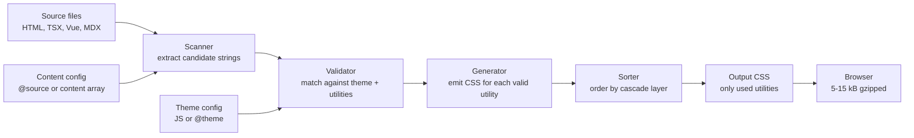
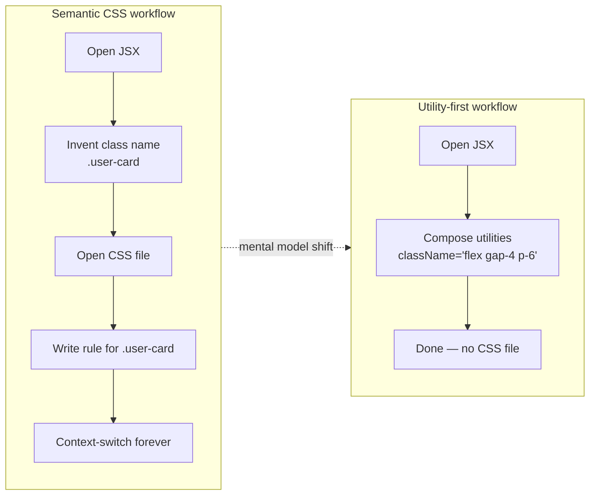

# 2.1 Tailwind Philosophy and Setup

> Tailwind CSS is a utility-first CSS framework that flips the default mental model of styling the web. Instead of inventing semantic class names and writing CSS rules to match them, you compose styles directly in your markup using small, single-purpose utility classes. This note covers what utility-first means, the problems Tailwind solves (naming fatigue, dead code, specificity wars, file size with proper purge), the legitimate criticisms of Tailwind, the mental model shift it demands, installation with PostCSS and the standalone CLI, the v3-to-v4 migration story (CSS-first config, no JS config by default), the Just-In-Time engine, and the `@source` directive for source file detection.

## 2.1.1 Objective

By the end of this note you should be able to:

1. Explain in your own words what "utility-first CSS" means and why it differs from "semantic class + stylesheet" CSS.
2. Diagnose the four canonical CSS pain points that Tailwind is designed to eliminate: naming fatigue, dead code, specificity wars, and CSS file-size bloat.
3. Articulate the *legitimate* criticisms of Tailwind (ugly HTML, vendor lock-in, learning curve, accessibility traps) so that you can make a reasoned adoption decision rather than a dogmatic one.
4. Install Tailwind three ways: via the PostCSS plugin, via the Tailwind CLI, and via the new v4 Vite plugin — and know which to choose.
5. Describe the Just-In-Time (JIT) engine: how it scans source files, how it generates only the utilities you actually use, and how this keeps production CSS under 10 kB even in large projects.
6. Contrast Tailwind v3 (`tailwind.config.js`, `@tailwind base/components/utilities` directives, PostCSS-first) with Tailwind v4 (`@import "tailwindcss"`, CSS-first `@theme` config, native Vite/PostCSS plugins, no JS config by default).
7. Use `@source` in v4 to add (or restrict) the files Tailwind scans so that dynamically generated classes are not purged.
8. Read a utility class name like `md:hover:bg-blue-500/70 dark:bg-slate-900` and decode every segment.

## 2.1.2 Background Knowledge

Before Tailwind, the dominant CSS workflow in a component-driven application was:

1. Open the JSX/HTML for a component.
2. Invent a class name (`.user-card`, `.profile-header`, `.cta-button`).
3. Open a separate `.css` (or `.module.css`, or styled-component) file.
4. Write the rules for that class.
5. Switch back and forth between markup and styles forever after.

This workflow produced four recurring pains:

- **Naming fatigue.** You spend real cognitive energy inventing class names for elements that have no natural name (`wrapper`, `inner`, `container`, `root`, `holder`). Most teams settle on inconsistent conventions.
- **Dead code.** When the markup changes, the CSS rule is orphaned. CSS has no built-in tree-shaking. After two years, a codebase accumulates thousands of unused rules.
- **Specificity wars.** Two developers writing `.button { padding: 8px 16px }` and `.card .button { padding: 6px 12px }` have created a specificity conflict that will require `.card .button.button.button` or `!important` to resolve.
- **File size.** A naive "kitchen sink" CSS framework (Bootstrap, Bulma) ships every component style to every user, even the ones the app never renders. Bootstrap's full CSS is ~230 kB uncompressed.

Atomic CSS (Tachyons, 2013) was the first widely adopted answer: every utility is one class with one job. `.pa2` means `padding: 0.5rem`. `.bg-blue` means `background-color: blue`. You compose them: `<button class="pa2 bg-blue white">`. Tachyons proved the model worked but suffered from a fixed, opinionated scale and no configuration story.

Tailwind (released 2017 by Adam Wathan) took the atomic idea and made it configurable and generator-based. Instead of a fixed list of utilities, Tailwind is a *generator* that produces utilities from a theme configuration. The first versions shipped a static CSS file with every possible utility (~3 MB). The Just-In-Time engine (introduced in v2.1, default in v3) changed everything: Tailwind scans your source files and generates only the utilities you actually use. Production CSS for a real app is typically 5–15 kB gzipped.

> [!note] Tailwind v4 (released January 2025) is the current major version. It replaces `tailwind.config.js` with CSS-first `@theme` configuration, drops the PostCSS plugin as the default install path in favor of native Vite/webpack/Lightning CSS plugins, and is 10× faster than v3. This note covers v4 as the default and calls out v3 differences where they matter for migration.

## 2.1.3 Core Concepts

### 2.1.3.1 What "Utility-First" Actually Means

"Utility-first" is not "utility-only." It means: **reach for utilities first, extract component classes later, only when the duplication is real.** The default answer to "how do I style this?" is `className="..."` with utilities. The fallback answer is `@apply` in a CSS file, or extraction into a React/Vue component.

A utility class is a class that applies exactly one CSS property (or a tightly related group, like `flex` which sets `display: flex` plus a default behaviour). Examples:

| Utility | CSS |
|---------|-----|
| `pt-4` | `padding-top: 1rem` |
| `text-center` | `text-align: center` |
| `flex` | `display: flex` |
| `items-center` | `align-items: center` |
| `bg-blue-500` | `background-color: #3b82f6` |
| `text-sm` | `font-size: 0.875rem; line-height: 1.25rem` |
| `rounded-lg` | `border-radius: 0.5rem` |
| `shadow-md` | A box-shadow declaration |
| `dark:bg-slate-900` | `background-color: #0f172a` inside `@media (prefers-color-scheme: dark)` (or `.dark` selector) |

Because each utility does one thing, you compose them to build a component:

```tsx
<button className="inline-flex items-center gap-2 rounded-lg bg-blue-600 px-4 py-2 text-sm font-medium text-white shadow-md transition-colors hover:bg-blue-700 focus:outline-none focus:ring-2 focus:ring-blue-500 focus:ring-offset-2 disabled:opacity-50">
  Save changes
</button>
```

That single line of JSX replaces a `.button` class, a `.button--primary` modifier, a hover state, a focus state, and a disabled state. There is no separate CSS file. There is no class name to invent. There is no specificity to manage.

### 2.1.3.2 The Mental Model Shift

The biggest obstacle for new Tailwind users is not the syntax — it is the **mental model shift**:

| Old question | New question |
|---|---|
| "What should I name this class?" | "What styles does this element need?" |
| "Where do I put this CSS?" | "There is no CSS — put it in the markup." |
| "How do I override this style?" | "Change the utility in the markup." |
| "Is this class still used?" | "If the markup is gone, the utility is gone." |

The shift sounds trivial. It is not. Engineers who have spent years writing semantic CSS report a 2–4 week adjustment period before utilities feel natural. After that period, almost nobody wants to go back, because the productivity gain is large: you stop context-switching between markup and styles, and you stop maintaining a parallel naming layer.

### 2.1.3.3 The Four Problems Tailwind Solves

1. **Naming fatigue is gone.** You never name anything. The class list *is* the name.
2. **Dead code is impossible.** If you delete the markup, the utilities vanish from the build, because the JIT engine never sees them in any source file. There is nothing to tree-shake because nothing is generated in the first place.
3. **Specificity wars are gone.** Every utility has the same specificity (0,1,0). Conflicts are resolved purely by source order in the generated stylesheet, and Tailwind orders utilities in a deliberate, documented cascade (base  -->  component  -->  utility). You never escalate to `!important` except via the `!` modifier (`!text-red-500`) which is itself a deliberate, scoped escalation.
4. **File size is tiny.** A typical production Tailwind build is 5–15 kB gzipped. The JIT engine generates only the utilities you use. There is no Bootstrap-style kitchen sink.

## 2.1.4 Detailed Walkthrough

The detailed walkthrough takes each installation path end to end, then traces the JIT pipeline from source file to browser, so you can reason about every link in the chain.

### 2.1.4.1 The Just-In-Time Engine

The JIT engine is what makes Tailwind viable. Without it, you would ship a 3 MB CSS file containing every utility. The JIT engine's job:

1. **Scan** your source files (HTML, TSX, Vue, MDX, even `.rb` files with `class=` attributes) for strings that look like utility classes.
2. **Generate** the CSS for each unique utility it finds.
3. **Order** the generated utilities in a deterministic cascade so that `flex` always wins over `block` when both are applied.
4. **Purge** everything else. The final CSS file contains only what was actually used.

The scanner is intentionally dumb. It does not parse HTML or JS. It does a regex-style extraction of candidate strings from each source file. Anything that looks like a class name is a candidate. The generator then validates each candidate against the theme and the utility definitions, discards invalid ones, and emits CSS for the rest.

This has two important consequences:

- **Dynamic class names do not work.** `className={`text-${color}-500`}` produces a string `text-red-500` in the DOM, but Tailwind never sees the literal string `text-red-500` in your source. It only sees `text-${color}-500`. So the utility is not generated and the color does not apply. The fix is to write the complete class name as a string literal somewhere Tailwind can see it (in a lookup object, or safelist it).
- **Class names must appear as complete, contiguous strings** in your source. You cannot build them with string concatenation that the scanner cannot see.

### 2.1.4.2 The JIT Compilation Flow



### 2.1.4.3 Installation Path 1: Tailwind CLI (v3-style, no bundler integration)

Use this for static HTML sites, or when you do not want to integrate with a bundler.

```bash
# Install Tailwind as a dev dependency
npm install -D tailwindcss@3

# Create the config file
npx tailwindcss init

# Create a CSS entry file (styles.css)
# with the three @tailwind directives:
# @tailwind base;
# @tailwind components;
# @tailwind utilities;

# Build the CSS, watching for changes
npx tailwindcss -i ./src/styles.css -o ./dist/styles.css --watch
```

The `tailwind.config.js` that `init` generates:

```js
/** @type {import('tailwindcss').Config} */
module.exports = {
  content: ['./src/**/*.{html,js,ts,jsx,tsx}'],
  theme: { extend: {} },
  plugins: [],
};
```

The `content` array is what tells the JIT scanner where to look. Get this wrong and Tailwind generates nothing (or everything, if you accidentally include `node_modules`).

### 2.1.4.4 Installation Path 2: PostCSS Plugin (v3 classic, used by Next.js <=14)

For Next.js, Vite, Nuxt, or any project that already runs PostCSS:

```bash
npm install -D tailwindcss@3 postcss autoprefixer
npx tailwindcss init -p   # -p also creates postcss.config.js
```

The generated `postcss.config.js`:

```js
module.exports = {
  plugins: {
    tailwindcss: {},
    autoprefixer: {},
  },
};
```

Your `globals.css` (or `index.css`) imports the three layers:

```css
@tailwind base;
@tailwind components;
@tailwind utilities;
```

### 2.1.4.5 Installation Path 3: Tailwind v4 with Vite (the modern default)

Tailwind v4 ships a first-party Vite plugin. There is no `postcss.config.js`, no `tailwind.config.js` by default, and no `@tailwind base/components/utilities` directives.

```bash
npm install tailwindcss @tailwindcss/vite
```

Configure Vite:

```ts
// vite.config.ts
import { defineConfig } from 'vite';
import react from '@vitejs/plugin-react';
import tailwindcss from '@tailwindcss/vite';

export default defineConfig({
  plugins: [react(), tailwindcss()],
});
```

Your CSS entry file becomes a single line:

```css
/* src/index.css */
@import "tailwindcss";
```

That is it. No `tailwind.config.js`. No `content` array. Tailwind v4 auto-detects source files by walking up from the CSS file's location. If you need to add sources outside that tree (e.g., a sibling `content/` directory with MDX), use `@source`:

```css
@import "tailwindcss";
@source "../content/**/*.mdx";
```

You can also use `@source` to *ignore* paths (with the `not` keyword) or to point at node_modules of a component library you want to scan.

### 2.1.4.6 The Three `@tailwind` Directives (v3) and Their v4 Replacements

In v3, the three directives expand to three layers of CSS:

- `@tailwind base` — Tailwind's Preflight (a modern reset based on modern-normalize, plus default border-box, default border color, etc.).
- `@tailwind components` — empty by default; the place where `@apply`-based component classes live.
- `@tailwind utilities` — every generated utility class.

In v4, these collapse into `@import "tailwindcss"`, which internally is the same three layers but accessed via the new `@layer` syntax. You can still add custom CSS to specific layers with `@layer base { ... }`, `@layer components { ... }`, and `@layer utilities { ... }`.

### 2.1.4.7 Source File Detection with `@source` (v4)

By default, v4 scans every file in the project *except* those in `.gitignore`, binary files, and CSS files themselves. To add additional sources, list them with `@source`:

```css
@import "tailwindcss";
@source "../articles/**/*.mdx";
@source "../packages/ui/**/*.tsx";
```

To ignore a path that would otherwise be scanned (e.g., a vendored folder with template strings you do not want treated as utilities):

```css
@source not "../vendor/legacy-components";
```

`@source` is v4's replacement for v3's `content` array. It is per-CSS-file, which means a single project can have multiple Tailwind CSS entries (e.g., one for the marketing site, one for the app) each with its own source list. This was very hard to do in v3.

### 2.1.4.8 The v3 vs v4 Differences at a Glance

| Concern | v3 | v4 |
|---|---|---|
| Config file | `tailwind.config.js` (JS) | `@theme` in CSS (or optional JS) |
| Default plugin | PostCSS plugin | First-party Vite plugin (PostCSS plugin still available) |
| CSS entry | `@tailwind base/components/utilities` | `@import "tailwindcss"` |
| Source detection | `content: [...]` array in config | Auto-detect + `@source` overrides |
| Theme colors | `theme.extend.colors` in JS | `@theme { --color-brand: #... }` |
| Dark mode | `darkMode: 'class'` in config | `@custom-variant dark (&:where(.dark, .dark *));` |
| Engine speed | Fast | 10× faster (Lightning CSS underneath) |
| Default CSS variables | Limited | Every utility value is a CSS variable (`bg-brand` emits `background-color: var(--color-brand)`) |
| Container queries | Plugin | Built-in (`@sm:`, `@md:`) |
| Arbitrary properties | `bg-[url(...)]` | Same syntax, more powerful |

> [!tip] If you are starting a new project in 2026, start with v4. If you are maintaining a v3 project, the v4 upgrade guide is straightforward but does require touching every CSS file that uses `@tailwind` directives. Budget a half-day for a medium project.

## 2.1.5 Practical Examples

### 2.1.5.1 A Simple Card in v3 with PostCSS

```tsx
// src/components/Card.tsx
export function Card({ title, body }: { title: string; body: string }) {
  return (
    <article className="rounded-xl border border-slate-200 bg-white p-6 shadow-sm transition-shadow hover:shadow-md">
      <h3 className="text-lg font-semibold text-slate-900">{title}</h3>
      <p className="mt-2 text-sm leading-relaxed text-slate-600">{body}</p>
    </article>
  );
}
```

```css
/* src/index.css */
@tailwind base;
@tailwind components;
@tailwind utilities;
```

```js
// tailwind.config.js
module.exports = {
  content: ['./src/**/*.{ts,tsx}'],
  theme: { extend: {} },
  plugins: [],
};
```

### 2.1.5.2 The Same Card in v4

```tsx
// src/components/Card.tsx — identical
export function Card({ title, body }: { title: string; body: string }) {
  return (
    <article className="rounded-xl border border-slate-200 bg-white p-6 shadow-sm transition-shadow hover:shadow-md">
      <h3 className="text-lg font-semibold text-slate-900">{title}</h3>
      <p className="mt-2 text-sm leading-relaxed text-slate-600">{body}</p>
    </article>
  );
}
```

```css
/* src/index.css — one line */
@import "tailwindcss";
```

```ts
// vite.config.ts — Vite plugin
import tailwindcss from '@tailwindcss/vite';
export default defineConfig({ plugins: [react(), tailwindcss()] });
```

The component code is identical across versions. The setup boilerplate is much smaller in v4.

### 2.1.5.3 Adding a Custom Brand Color in v3 vs v4

v3:

```js
// tailwind.config.js
module.exports = {
  content: ['./src/**/*.{ts,tsx}'],
  theme: {
    extend: {
      colors: {
        brand: {
          50:  '#eff6ff',
          500: '#3b82f6',
          700: '#1d4ed8',
        },
      },
    },
  },
};
```

```tsx
<button className="bg-brand-500 hover:bg-brand-700">Save</button>
```

v4:

```css
/* src/index.css */
@import "tailwindcss";

@theme {
  --color-brand-50: #eff6ff;
  --color-brand-500: #3b82f6;
  --color-brand-700: #1d4ed8;
}
```

```tsx
<button className="bg-brand-500 hover:bg-brand-700">Save</button>
```

Same JSX. In v4 the theme lives next to the CSS that uses it, and every theme variable becomes a CSS custom property you can read with `var(--color-brand-500)` if you ever need to.

### 2.1.5.4 Why a Dynamically Constructed Class Breaks

```tsx
//  Does not work — Tailwind never sees the literal string
const colors = ['red', 'blue', 'green'];
function Badge({ color }: { color: string }) {
  return <span className={`bg-${color}-500`} />;
}
```

The JIT scanner sees `bg-${color}-500` and does not expand the template. The class `bg-red-500` is never generated. The element renders with no background.

Fix it by writing the complete class names:

```tsx
//  Works — the literals are visible to the scanner
const colorClasses: Record<string, string> = {
  red: 'bg-red-500',
  blue: 'bg-blue-500',
  green: 'bg-green-500',
};
function Badge({ color }: { color: keyof typeof colorClasses }) {
  return <span className={colorClasses[color]} />;
}
```

## 2.1.6 Mermaid Diagrams

### 2.1.6.1 The JIT Compilation Flow

```mermaid
flowchart TD
    A[Author writes<br/>className='bg-blue-500 hover:bg-blue-700'] --> B[Source file saved to disk]
    B --> C[Tailwind scanner reads file]
    C --> D[Regex extracts candidate strings:<br/>'bg-blue-500', 'hover:bg-blue-700']
    D --> E[Validator looks up each candidate<br/>in theme + utility definitions]
    E --> F{Valid?}
    F -- no --> G[Discard candidate]
    F -- yes --> H[Generator emits CSS<br/>.bg-blue-500 { background-color: #3b82f6 }<br/>.hover\:bg-blue-700:hover { ... }]
    H --> I[Sorter orders by cascade layer<br/>base  -->  components  -->  utilities]
    I --> J[Output CSS written to dist]
    J --> K[Browser loads 5-15 kB gzipped]
```

### 2.1.6.2 The Mental Model Shift



## 2.1.7 Common Mistakes

1. **Building class names with string interpolation.** `className={`bg-${color}-500`}` does not work because the JIT scanner cannot see the literal string. Always use a static lookup object whose values are complete class name strings. (See 2.1.5.4.)

2. **Forgetting to add a file extension to the `content` array (v3).** `'./src/**/*'` matches every file including `.png` and `.zip`, slowing the scan and occasionally matching binary content. Always be specific: `'./src/**/*.{ts,tsx,html}'`.

3. **Including `node_modules` in the content array by accident.** `'./**/*.{ts,tsx}'` matches inside `node_modules`, where a single dependency (like a syntax highlighter) can contain thousands of strings that look like utilities. This bloats the output CSS to several megabytes. Use `./src/**/*.{ts,tsx}` instead.

4. **Treating Tailwind like Bootstrap.** Tailwind has no `.btn` class, no `.card` class. If you reach for "Tailwind's button component," you have misunderstood the framework. You build a button by composing utilities, or you build your own design system on top of Tailwind. See [[2.4 Component Composition]].

5. **Over-using `@apply` to recreate semantic CSS.** `@apply` exists for genuine reuse (a `.btn` class in a PHP codebase where you cannot easily extract a component). In a React/Vue codebase, `@apply` is almost always the wrong move — extract a React component instead. See [[2.4 Component Composition]] and [[2.8 Organizing Large Tailwind Projects]].

6. **Ignoring the Preflight reset.** Tailwind's Preflight resets margins, sets `box-sizing: border-box`, makes `border` default to a 1px solid currentColor, and removes list styles. If you do not realize this, you will be confused why your `<ul>` has no bullets and your `<h1>` is the same size as your `<p>`. Preflight is intentional and correct; you style your way back to the design you want with utilities.

7. **Fighting the cascade with `!important` modifiers.** `!text-red-500` works, but it is almost always a sign that you have applied conflicting utilities and should remove one rather than escalating. Reach for `!` only when overriding a third-party style you cannot otherwise control.

8. **Upgrading v3  -->  v4 by deleting the config and hoping.** The upgrade requires translating your `theme.extend` JS object into `@theme` CSS, replacing `@tailwind` directives with `@import "tailwindcss"`, and re-checking that your `content` paths are auto-detected. The official `@tailwindcss/upgrade` CLI tool automates most of this — use it.

## 2.1.8 Best Practices

1. **Learn the official VS Code extension.** "Tailwind CSS IntelliSense" gives autocomplete for class names, hover previews of the CSS each utility generates, and linting for invalid classes. Without it, Tailwind is painful. With it, Tailwind is the fastest way to style a UI.

2. **Sort class names with `prettier-plugin-tailwindcss`.** A consistent class order makes diffs readable and code review faster. Configure Prettier to use it; the plugin sorts classes in the order Tailwind's own docs use.

3. **Adopt a component extraction discipline.** Once a class string appears three times in your codebase, extract it — into a React component, not a CSS class. The threshold is "three" because below that, the cost of indirection exceeds the cost of duplication. See [[2.4 Component Composition]].

4. **Configure Prettier and ESLint together with the Tailwind plugin.** This combination enforces class ordering and catches typos like `flex-coll` (invalid) at save time.

5. **Use the official Tailwind Prettier plugin's `tailwindFunctions` option if you use `clsx`/`cva`/`cn`.** Without it, Prettier will not sort classes inside `clsx('flex', condition && 'bg-red-500')` calls, and your "ordered classes" rule is silently broken in half your codebase.

6. **Keep the `content`/`@source` list tight.** The more files Tailwind scans, the slower the build. Include only files that contain class strings. Exclude tests, fixtures, snapshots, and anything in `node_modules` unless you specifically need to scan a component library you depend on.

7. **Pin your Tailwind version in `package.json`.** Major versions of Tailwind (v3  -->  v4) change generated CSS in ways that break visual regression tests. Pin to a specific minor and upgrade deliberately.

8. **Run the build in CI with the same flags as production.** `NODE_ENV=production` changes what Tailwind generates (no `/* dev */` markers, minified output). If your CI builds with `NODE_ENV=development`, your visual regression tests are not testing what users see.

## 2.1.9 Mini Exercises

### Exercise 2.1.1: Decode a Class String

Given `className="md:hover:bg-blue-500/70 dark:bg-slate-900 focus-visible:ring-2"`:

1. List every utility and explain what it does.
2. State which breakpoint `md:` activates at, by default.
3. Explain what `/70` means.
4. Explain the difference between `hover:` and `focus-visible:`.

**Worked solution:**

1. Four utilities, each with a variant prefix:
   - `md:hover:bg-blue-500/70` — at the `md` breakpoint (≥ 768px), on hover, set `background-color` to `blue-500` with 70% opacity. Generated CSS: `@media (min-width: 768px) { .md\:hover\:bg-blue-500\/70:hover { background-color: color-mix(in oklab, var(--color-blue-500) 70%, transparent); } }` (v4 syntax; v3 uses `rgba`).
   - `dark:bg-slate-900` — in dark mode (either `prefers-color-scheme: dark` or under a `.dark` ancestor, depending on config), set `background-color` to slate-900.
   - `focus-visible:ring-2` — when the element has keyboard focus (not mouse focus), apply a 2-pixel ring. Combined with `ring-offset-2` and a `ring-color` you would get a visible focus indicator.
2. `md:` activates at `min-width: 768px` by default. Tailwind is mobile-first, so `md:` styles *apply from 768px upward*, not "between 768 and 1024."
3. `/70` is the opacity modifier. It applies a 70% alpha to the color. Under the hood v4 uses `color-mix(in oklab, var(--color-blue-500) 70%, transparent)`; v3 used `rgba(59, 130, 246, 0.7)`. You can also write `bg-blue-500/[0.7]` for arbitrary opacity.
4. `hover:` activates when the mouse pointer is over the element. `focus-visible:` activates only when the element receives focus *via the keyboard* (or any non-pointing input). The latter is critical for accessibility — it gives keyboard users a focus ring without showing one to mouse clickers. See [[1.11 Accessibility in CSS]].

### Exercise 2.1.2: Diagnose a Missing Style

A junior engineer writes:

```tsx
const size = 'md';
return <button className={`px-${size === 'md' ? '4' : '2'} py-2`} />;
```

They report "the padding doesn't apply." Diagnose and fix it.

**Worked solution:**

Diagnosis: The JIT scanner sees `px-${size === 'md' ? '4' : '2'}` as a template literal. It cannot evaluate the conditional. It therefore sees no complete utility string. `px-4` is never generated. `px-2` is never generated. The button has no horizontal padding.

Common wrong diagnosis: "Maybe Tailwind doesn't support template literals." It does — for *static* templates. The problem is not the template literal; it is the dynamic evaluation.

Fix: write the complete class names as literals in a lookup object.

```tsx
const sizeClasses = { sm: 'px-2 py-1', md: 'px-4 py-2' } as const;
function Button({ size = 'md' }: { size?: keyof typeof sizeClasses }) {
  return <button className={sizeClasses[size]} />;
}
```

Now the JIT scanner sees `px-2`, `px-4`, `py-1`, `py-2` as literal strings and generates the corresponding utilities.

### Exercise 2.1.3: Set Up v4 in a Fresh Vite Project

Walk through the steps to get a working Tailwind v4 setup in a new Vite + React TypeScript project. Include the exact commands and the exact file contents.

**Worked solution:**

```bash
# 1. Scaffold the project
npm create vite@latest my-app -- --template react-ts
cd my-app
npm install

# 2. Install Tailwind v4 + the Vite plugin
npm install tailwindcss @tailwindcss/vite

# 3. Configure Vite
```

```ts
// vite.config.ts
import { defineConfig } from 'vite';
import react from '@vitejs/plugin-react';
import tailwindcss from '@tailwindcss/vite';

export default defineConfig({
  plugins: [react(), tailwindcss()],
});
```

```css
/* src/index.css — replace the entire file with this single line */
@import "tailwindcss";
```

```tsx
// src/main.tsx — ensure index.css is imported
import { StrictMode } from 'react';
import { createRoot } from 'react-dom/client';
import './index.css';
import App from './App.tsx';

createRoot(document.getElementById('root')!).render(
  <StrictMode>
    <App />
  </StrictMode>
);
```

```tsx
// src/App.tsx — verify it works
export default function App() {
  return (
    <main className="min-h-screen flex items-center justify-center bg-slate-50">
      <h1 className="text-3xl font-bold text-slate-900">Hello Tailwind v4</h1>
    </main>
  );
}
```

```bash
npm run dev
```

You should see a centered bold heading on a light slate background. There is no `tailwind.config.js`. There is no `postcss.config.js`. There is no `content` array. v4 auto-detects source files.

### Exercise 2.1.4: Add a Custom Font Family in Both v3 and v4

Show how to register a custom font family called `display` that maps to `"Inter Display", system-ui, sans-serif`. Show the v3 and v4 side by side.

**Worked solution:**

v3:

```js
// tailwind.config.js
module.exports = {
  content: ['./src/**/*.{ts,tsx}'],
  theme: {
    extend: {
      fontFamily: {
        display: ['"Inter Display"', 'system-ui', 'sans-serif'],
      },
    },
  },
};
```

Usage: `<h1 className="font-display">Title</h1>`.

v4:

```css
/* src/index.css */
@import "tailwindcss";

@theme {
  --font-display: "Inter Display", system-ui, sans-serif;
}
```

Usage: identical, `<h1 className="font-display">Title</h1>`. In v4 the value is also available as `var(--font-display)` in any custom CSS you write.

### Exercise 2.1.5: Decide Whether to Use Tailwind on a Legacy Project

You inherit a 5-year-old Rails monolith with 80,000 lines of Sass, a BEM-style component library, and a team of 6 engineers who have never used Tailwind. The CTO asks whether to migrate. Write a one-paragraph recommendation with concrete reasoning.

**Worked solution:**

Recommendation: **Do not migrate the whole codebase. Adopt Tailwind incrementally on new features only, and do not rewrite existing BEM components.** Three reasons. First, the migration cost is enormous: 80,000 lines of Sass plus the team's muscle memory would take 6–9 months to convert, with no user-visible benefit. Second, the BEM components already solve the problems Tailwind solves (no specificity wars, no dead code if the team is disciplined) — the value-add of Tailwind is smaller on a codebase that already has working architecture. Third, the team has no Tailwind experience; a big-bang migration would be done badly. Instead: add Tailwind to the build pipeline alongside the existing Sass, use it for new pages, train the team on a real project, and revisit a fuller migration in 12 months. If the team adopts Tailwind happily, the BEM-to-Tailwind conversion happens naturally as components are rewritten. If they don't, you've spent a week, not a year.

## 2.1.10 Summary

Tailwind is a utility-first CSS generator that ships only the styles you use, eliminates naming and specificity decisions from your daily work, and is viable for production because the Just-In-Time engine scans your source and emits a 5–15 kB CSS file. Tailwind v4 (2025) replaces the JavaScript configuration file with CSS-first `@theme` configuration, ships a first-party Vite plugin, and uses `@source` instead of a `content` array. The mental model shift — from "what should I name this class?" to "what styles does this need?" — is the real obstacle, and once it clicks, most engineers do not go back. The next note, [[2.2 Configuration and Theme Customization]], dives into the theme object, the `extend` vs override distinction, custom colors and spacing, presets, and the v4 `@theme` directive in detail.

## 2.1.11 Related Notes

- [[2.2 Configuration and Theme Customization]] — every option in the theme object and the v4 `@theme` directive.
- [[2.3 Responsive Utilities and Dark Mode]] — the `sm:`/`md:`/`lg:` prefix system and the dark mode strategies.
- [[2.4 Component Composition]] — what to do when the class strings get long: `cva`, `tailwind-merge`, and the `cn()` pattern.
- [[2.7 Tailwind with React and Next.js]] — wiring Tailwind into a React or Next.js project.
- [[1.12 CSS Architecture]] — the broader CSS architecture landscape Tailwind sits inside.
- [[1.13 CSS Performance]] — why utility CSS is small and fast, and how it interacts with the rendering pipeline.
