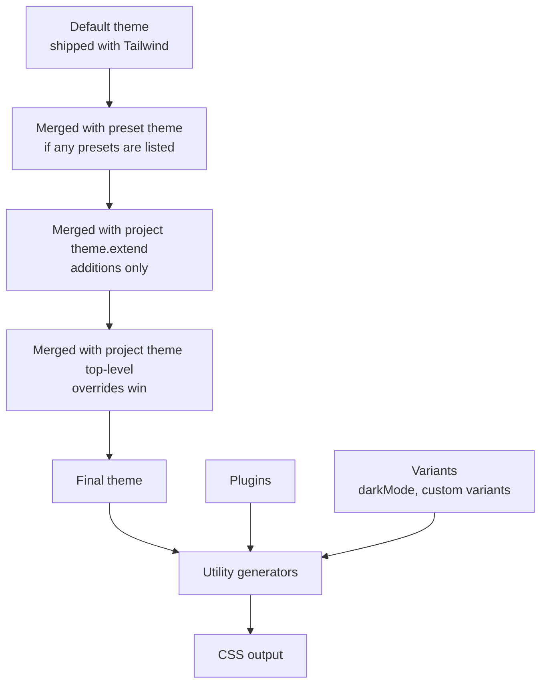
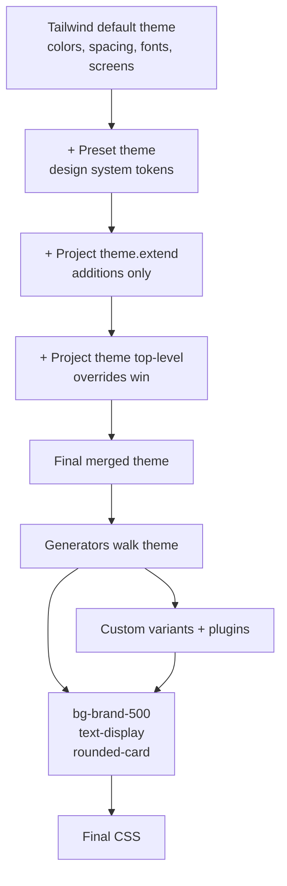
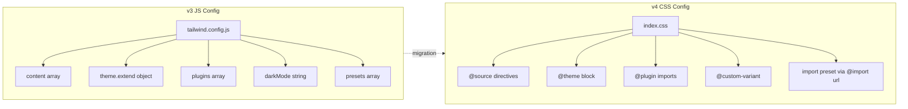

# 2.2 Configuration and Theme Customization

> Tailwind's theme is its DNA. Every utility — `bg-blue-500`, `text-xl`, `rounded-lg`, `shadow-md`, `pt-4` — is generated from a theme value. This note covers the structure of `tailwind.config.js` (the v3 config file: `content`, `theme`, `plugins`, `presets`, `darkMode`, `variants`), the `theme` object and the crucial `extend` vs override distinction, custom colors with the nested color object syntax, custom spacing scales, custom font families, custom breakpoints, the v4 `@theme` directive and CSS-first config, dark mode configuration, custom variants via the `addVariant` plugin API, the design-token approach, keeping your config DRY, and sharing config across projects via presets.

## 2.2.1 Objective

By the end of this note you should be able to:

1. Read and write a complete `tailwind.config.js` (v3) and explain each top-level key: `content`, `theme`, `plugins`, `presets`, `darkMode`, `important`, `corePlugins`, `safelist`.
2. Explain why `theme.extend` is almost always what you want, while top-level `theme` keys are usually a mistake, and demonstrate the difference with concrete output.
3. Add a custom color palette using the nested object syntax (`brand: { 50: ..., 500: ..., 700: ... }`) and understand how Tailwind flattens it into `bg-brand-500`, `text-brand-700`, etc.
4. Add custom spacing values, custom font families, custom breakpoints, custom border radii, custom shadows, and custom transition timing functions.
5. Configure dark mode for the two strategies — `media` (default, OS-driven) and `class` (manual toggle) — and explain when to choose each.
6. Write a custom variant with the `addVariant` plugin API (e.g., `rtl:`, `printing:`, `touch:`) and register it in the plugins array.
7. Translate a v3 JS config into v4 `@theme` CSS, including custom colors, spacing, fonts, breakpoints, and dark mode.
8. Use `presets` to share a base config across multiple projects in a monorepo, and explain how preset and project config are merged.
9. Apply the design-token approach: define tokens once, derive Tailwind theme values from them, and keep Figma, code, and documentation in sync.

## 2.2.2 Background Knowledge

A Tailwind theme is a JavaScript object (v3) or a CSS block of custom properties (v4) that maps names to design values. The framework's generators walk the theme and produce utilities. For example, the default `theme.colors` object contains entries like `red: { 50: '#fef2f2', 100: '#fee2e2', ..., 900: '#7f1d1d' }`. From this, Tailwind generates:

- `bg-red-50`, `bg-red-100`, ..., `bg-red-900` (background-color)
- `text-red-50`, ..., `text-red-900` (color)
- `border-red-50`, ..., `border-red-900` (border-color)
- `ring-red-50`, ..., `ring-red-900` (ring color)
- `from-red-50`, `via-red-50`, `to-red-50` (gradient stops)
- `decoration-red-50`, `fill-red-50`, `stroke-red-50`, `outline-red-50`, `accent-red-50`, `caret-red-50`, `divide-red-50`, `placeholder-red-50`, `shadow-red-50/100`, ...

A single color entry in the theme spawns dozens of utilities. This is why getting the theme right is high-leverage: a one-line change ripples through your entire design system.

The two fundamental operations on the theme are **extend** and **override**. `theme.extend.colors = { brand: ... }` adds `brand` alongside the defaults (you keep `red`, `blue`, `slate`, etc.). `theme.colors = { brand: ... }` *replaces* the entire color system with just `brand` — usually a mistake, because you lose the entire default palette and have to reinvent `slate`, `red`, `green`, etc. yourself.

The v4 `@theme` directive moves this configuration into CSS. Instead of a JS object, you declare CSS custom properties; Tailwind reads them and generates the same utilities. The advantage is that the theme is now first-class CSS — you can use the variables directly with `var(--color-brand-500)` in any custom CSS, and you can re-declare them inside `@media` queries or under `.dark` selectors to create theme variants that respond to context.

> [!note] This note covers v3 config first (because most existing projects still use it), then shows the v4 equivalent for each example. If you are starting fresh in 2026, jump to 2.2.4.6 and use `@theme`. But you still need to read v3 because you will encounter it in codebases for years.

## 2.2.3 Core Concepts

### 2.2.3.1 The Structure of `tailwind.config.js`

```js
/** @type {import('tailwindcss').Config} */
module.exports = {
  // Where to scan for class names (v3 only; v4 uses @source)
  content: [
    './src/**/*.{html,js,jsx,ts,tsx,vue,md,mdx}',
    './app/**/*.{ts,tsx}',
  ],

  // Optional: opt out of Preflight, or disable specific core utilities
  corePlugins: {
    preflight: true, // default true; set false to skip the reset
  },

  // Global !important
  important: false, // or a selector like '#app'

  // Dark mode strategy: 'media' (default), 'class', or ['class', '[data-mode="dark"]']
  darkMode: 'media',

  // The theme object — colors, spacing, fonts, breakpoints, etc.
  theme: {
    extend: {
      colors: { /* ... */ },
      spacing: { /* ... */ },
      fontFamily: { /* ... */ },
      screens: { /* ... */ },
      borderRadius: { /* ... */ },
      boxShadow: { /* ... */ },
      transitionTimingFunction: { /* ... */ },
      keyframes: { /* ... */ },
      animation: { /* ... */ },
    },
  },

  // Third-party plugins: forms, typography, aspect-ratio, custom variants, etc.
  plugins: [
    require('@tailwindcss/forms'),
    require('@tailwindcss/typography'),
  ],

  // Shared configs from other files (monorepo, design-system package)
  presets: [
    require('./tailwind.preset.js'),
  ],

  // Classes to always generate even if not seen by the scanner
  safelist: [
    'bg-red-500',
    { pattern: /bg-(red|blue|green)-(200|500|800)/ },
  ],

  // Custom variant overrides (rarely needed in v3.4+)
  variants: {
    extend: { /* ... */ },
  },
};
```

### 2.2.3.2 `extend` vs Override — the Most Important Distinction

```js
//  Override — replaces the entire color palette with one color
module.exports = {
  theme: {
    colors: { brand: '#3b82f6' },
  },
};
// Result: bg-red-500 is GONE. text-slate-900 is GONE. Only bg-brand works.
```

```js
//  Extend — adds brand alongside every default color
module.exports = {
  theme: {
    extend: {
      colors: { brand: '#3b82f6' },
    },
  },
};
// Result: bg-red-500, text-slate-900, AND bg-brand all work.
```

The same rule applies to every theme key: `spacing`, `fontFamily`, `screens`, `borderRadius`, `boxShadow`, etc. Use `extend` unless you have a deliberate reason to replace (e.g., a strict design system that bans the default palette).

> [!danger] Top-level `theme.colors = { ... }` (without `extend`) is the single most common Tailwind misconfiguration. Engineers think they are "adding a color" and instead nuke the entire default palette. The symptom: nothing in their app has color, and the Tailwind IntelliSense extension shows zero suggestions for `bg-red-500`.

### 2.2.3.3 Custom Colors — the Nested Object Syntax

Tailwind flattens nested color objects into dashed class names.

```js
// tailwind.config.js (v3)
module.exports = {
  theme: {
    extend: {
      colors: {
        // Solid color: bg-brand, text-brand, border-brand
        brand: '#3b82f6',

        // Scale: bg-brand-50, bg-brand-100, ..., bg-brand-950
        brand: {
          50:  '#eff6ff',
          100: '#dbeafe',
          200: '#bfdbfe',
          300: '#93c5fd',
          400: '#60a5fa',
          500: '#3b82f6',
          600: '#2563eb',
          700: '#1d4ed8',
          800: '#1e40af',
          900: '#1e3a8a',
          950: '#172554',
        },

        // Named shades: bg-brand-light, bg-brand-dark
        brand: {
          light: '#60a5fa',
          DEFAULT: '#3b82f6',
          dark: '#1d4ed8',
        },

        // Arbitrary names: bg-brand-primary
        brand: {
          primary: '#3b82f6',
          secondary: '#8b5cf6',
        },
      },
    },
  },
};
```

The `DEFAULT` key is special: it generates the bare utility (`bg-brand`). All other keys become dashed suffixes (`bg-brand-light`, `bg-brand-500`).

Color values can be hex strings, `rgb()` strings, `hsl()` strings, or v4's preferred `oklch()`. They can also be functions that take an opacity argument so that `bg-brand-500/50` works:

```js
// v3 — function form enables opacity modifier
colors: {
  brand: {
    500: ({ opacityValue }) =>
      `rgba(59, 130, 246, ${opacityValue})`,
  },
}
```

In v4, opacity modifiers work automatically because colors are stored as CSS variables and Tailwind uses `color-mix()` for the alpha:

```css
/* v4 */
@theme {
  --color-brand-500: oklch(0.62 0.18 256);
}
/* bg-brand-500/50 emits: */
/* background-color: color-mix(in oklab, var(--color-brand-500) 50%, transparent); */
```

### 2.2.3.4 Custom Spacing

The `spacing` theme key is the source of every `p-*`, `m-*`, `gap-*`, `w-*`, `h-*`, `inset-*`, `top-*`, `right-*`, `bottom-*`, `left-*`, `space-x-*`, `space-y-*` utility. The default is a 0–96 scale where each step is `0.25rem` (4px): `1` = `4px`, `4` = `16px`, `8` = `32px`, etc.

```js
// v3 — add custom spacing values
module.exports = {
  theme: {
    extend: {
      spacing: {
        '0.5': '0.125rem',  // 2px
        '1.5': '0.375rem',  // 6px
        '13': '3.25rem',    // 52px — not in default scale
        '18': '4.5rem',
        '128': '32rem',
      },
    },
  },
};
```

After this, `p-13`, `w-128`, `mt-18`, `gap-0.5` all work. Use this for project-specific values that fall between default steps.

> [!tip] In v4, the spacing scale is generated dynamically from a base unit (`--spacing: 0.25rem`). Any positive integer multiplied by the base works automatically: `p-13`, `p-17`, `p-23` all work out of the box without configuration. You only need `@theme` to add non-integer scales (like `--spacing-0.5: 0.125rem`).

### 2.2.3.5 Custom Font Families

```js
// v3
module.exports = {
  theme: {
    extend: {
      fontFamily: {
        sans: ['Inter', 'system-ui', 'sans-serif'], // overrides default sans
        display: ['"Inter Display"', 'system-ui', 'sans-serif'],
        mono: ['"JetBrains Mono"', 'ui-monospace', 'monospace'],
      },
    },
  },
};
```

Usage: `<body className="font-sans">`, `<h1 className="font-display">`, `<code className="font-mono">`.

> [!warning] Fonts with spaces in the name (like `"Inter Display"`) must be quoted *inside* the array entry. Tailwind preserves the quotes when it generates `font-family: "Inter Display", system-ui, sans-serif`. If you omit the inner quotes, the generated CSS is invalid because the browser parses `Inter Display` as two font names.

### 2.2.3.6 Custom Breakpoints (Screens)

```js
// v3
module.exports = {
  theme: {
    extend: {
      screens: {
        xs: '475px',   // adds xs: prefix below sm
        '3xl': '1920px', // adds 3xl: prefix above 2xl
        print: { raw: 'print' }, // media: print — used as print:hidden
        dark: { raw: '(prefers-color-scheme: dark)' },
      },
    },
  },
};
```

The object form `{ raw: '...' }` lets you register arbitrary media queries as variant prefixes. The string form `'475px'` is sugar for `{ min: '475px' }`.

> [!note] Adding a breakpoint *above* the defaults with `extend` keeps `sm`, `md`, `lg`, `xl`, `2xl`. Replacing `screens` (without `extend`) nukes them. Always `extend` unless you want a strict, minimal breakpoint set.

### 2.2.3.7 Dark Mode Configuration

```js
// v3 — three options

// Option 1: OS-driven (default)
darkMode: 'media',
// .dark\:bg-slate-900 emits: @media (prefers-color-scheme: dark) { ... }

// Option 2: Class-driven, manual toggle
darkMode: 'class',
// .dark\:bg-slate-900 emits: .dark .dark\:bg-slate-900 { ... }
// You add class="dark" on <html> to enable dark mode.

// Option 3: Custom selector (v3.4.1+)
darkMode: ['selector', '[data-mode="dark"]'],
// .dark\:bg-slate-900 emits: [data-mode="dark"] .dark\:bg-slate-900 { ... }
```

For most apps, choose `class` so users can override the OS preference with a toggle. Use `media` only for read-only content sites where the OS preference is the source of truth.

v4 syntax:

```css
/* v4 — default is 'media' */
@import "tailwindcss";

/* Switch to class strategy: */
@custom-variant dark (&:where(.dark, .dark *));

/* Or custom selector: */
@custom-variant dark (&:where([data-mode="dark"], [data-mode="dark"] *));
```

### 2.2.3.8 Custom Variants with `addVariant`

The `addVariant` plugin API lets you register your own variant prefixes.

```js
// tailwind.config.js (v3)
module.exports = {
  plugins: [
    // RTL support: rtl:text-right
    function ({ addVariant }) {
      addVariant('rtl', '&:where([dir="rtl"], [dir="rtl"] *)');
    },

    // Touch devices: touch:hover:bg-blue-700 only on coarse pointers
    function ({ addVariant }) {
      addVariant('touch', '@media (pointer: coarse)');
    },

    // Printing: print:hidden
    function ({ addVariant }) {
      addVariant('printing', '@media print');
    },

    // Group-hover with custom name: group-card:hover:underline
    function ({ addVariant }) {
      addVariant('group-card', ':merge(.group-card):hover &');
    },
  ],
};
```

In v4, custom variants are declared in CSS with `@custom-variant`:

```css
/* v4 */
@import "tailwindcss";

@custom-variant rtl (&:where([dir="rtl"], [dir="rtl"] *));
@custom-variant touch (@media (pointer: coarse));
@custom-variant printing (@media print);
```

### 2.2.3.9 Presets — Sharing Config Across Projects

A preset is a config file that gets merged into your project's config. Use it to share design tokens across a monorepo or a design system.

```js
// packages/tailwind-preset/index.js — published as @my-org/tailwind-preset
module.exports = {
  theme: {
    extend: {
      colors: { brand: { /* ... */ } },
      fontFamily: { sans: ['Inter', 'system-ui', 'sans-serif'] },
    },
  },
  plugins: [
    require('@tailwindcss/forms'),
    require('@tailwindcss/typography'),
  ],
};
```

```js
// apps/web/tailwind.config.js
module.exports = {
  presets: [require('@my-org/tailwind-preset')],
  content: ['./src/**/*.{ts,tsx}'],
  theme: {
    extend: {
      // App-specific tokens
      colors: { brand: { 950: '#0a0f1f' } },
    },
  },
};
```

The preset's theme and the project's theme are merged. The project can extend or override any value from the preset. Plugins from the preset are added. The `content` array is *not* inherited — each project must declare its own (because content paths are project-specific).

## 2.2.4 Detailed Walkthrough

### 2.2.4.1 The Full Default Theme Structure

The default Tailwind theme has these keys, each generating a family of utilities:

| Theme key | Generates | Example utilities |
|---|---|---|
| `colors` | `bg-*`, `text-*`, `border-*`, `ring-*`, `from-*`, `via-*`, `to-*`, `fill-*`, `stroke-*`, `decoration-*`, `outline-*`, `caret-*`, `accent-*`, `divide-*`, `placeholder-*`, `shadow-*` | `bg-blue-500`, `text-slate-900` |
| `spacing` | `p-*`, `px-*`, `py-*`, `pt-*` (and `m-*`, `gap-*`, `w-*`, `h-*`, `inset-*`, `top-*`, `space-x-*`, `space-y-*`) | `p-4`, `w-1/2`, `mt-8` |
| `fontSize` | `text-*` (size + line-height) | `text-sm`, `text-xl` |
| `lineHeight` | `leading-*` | `leading-tight` |
| `fontFamily` | `font-*` | `font-sans`, `font-mono` |
| `fontWeight` | `font-*` | `font-bold` |
| `letterSpacing` | `tracking-*` | `tracking-tight` |
| `screens` | `sm:`, `md:`, `lg:`, `xl:`, `2xl:` variants | `md:text-lg` |
| `borderRadius` | `rounded-*` | `rounded-lg`, `rounded-full` |
| `borderWidth` | `border-*` | `border-2`, `border-t-4` |
| `boxShadow` | `shadow-*` | `shadow-md`, `shadow-xl` |
| `opacity` | `opacity-*` | `opacity-50` |
| `transitionTimingFunction` | `ease-*` | `ease-in-out` |
| `transitionDuration` | `duration-*` | `duration-300` |
| `transitionDelay` | `delay-*` | `delay-150` |
| `animation` | `animate-*` | `animate-spin` |
| `keyframes` | Used by `animation` | (no direct utility) |
| `backgroundSize` | `bg-*` | `bg-cover` |
| `backgroundPosition` | `bg-*` | `bg-center` |
| `backgroundImage` | `bg-*` | `bg-gradient-to-r` |
| `gridTemplateColumns` | `grid-cols-*` | `grid-cols-3` |
| `gridTemplateRows` | `grid-rows-*` | `grid-rows-2` |
| `gap` (subset of spacing) | `gap-*` | `gap-4` |
| `aspectRatio` | `aspect-*` | `aspect-video` |
| `zIndex` | `z-*` | `z-50` |
| `blur` | `blur-*` | `blur-md` |
| `dropShadow` | `drop-shadow-*` | `drop-shadow-lg` |
| `container` | `container` (centering, padding, max-width) | `container mx-auto` |

When you understand the table, you understand Tailwind. Every utility you will ever write is generated from one of these theme keys.

### 2.2.4.2 The Config Layering Model



The merge order matters because later layers override earlier ones. `theme.extend.colors` adds to the merged colors. `theme.colors` (top-level) replaces the merged colors entirely — use it only when you really mean it.

### 2.2.4.3 A Realistic v3 Config

```js
// tailwind.config.js
const defaultTheme = require('tailwindcss/defaultTheme');

module.exports = {
  content: [
    './src/**/*.{ts,tsx}',
    './app/**/*.{ts,tsx}',
    './content/**/*.mdx',
  ],
  darkMode: 'class',
  theme: {
    extend: {
      colors: {
        brand: {
          50:  '#eef2ff',
          100: '#e0e7ff',
          200: '#c7d2fe',
          300: '#a5b4fc',
          400: '#818cf8',
          500: '#6366f1',
          600: '#4f46e5',
          700: '#4338ca',
          800: '#3730a3',
          900: '#312e81',
          950: '#1e1b4b',
        },
      },
      fontFamily: {
        sans: ['Inter', ...defaultTheme.fontFamily.sans],
        display: ['"Inter Display"', ...defaultTheme.fontFamily.sans],
        mono: ['"JetBrains Mono"', ...defaultTheme.fontFamily.mono],
      },
      screens: {
        xs: '475px',
        '3xl': '1920px',
      },
      boxShadow: {
        card: '0 2px 8px -2px rgba(0, 0, 0, 0.08), 0 4px 16px -4px rgba(0, 0, 0, 0.04)',
        'card-hover': '0 8px 24px -4px rgba(0, 0, 0, 0.12)',
      },
      keyframes: {
        'fade-in-up': {
          '0%': { opacity: '0', transform: 'translateY(8px)' },
          '100%': { opacity: '1', transform: 'translateY(0)' },
        },
      },
      animation: {
        'fade-in-up': 'fade-in-up 0.4s ease-out',
      },
    },
  },
  plugins: [
    require('@tailwindcss/forms'),
    require('@tailwindcss/typography'),
  ],
};
```

Note three patterns:

1. **Spreading defaults**: `['Inter', ...defaultTheme.fontFamily.sans]` puts Inter first and falls back to Tailwind's default sans stack.
2. **`darkMode: 'class'`**: enables the `.dark` ancestor selector for dark utilities.
3. **`keyframes` + `animation`**: pair them. The `keyframes` entry defines the animation; the `animation` entry references it by name. Then `animate-fade-in-up` works as a class.

### 2.2.4.4 The Same Config in v4 `@theme`

```css
/* src/index.css */
@import "tailwindcss";

@custom-variant dark (&:where(.dark, .dark *));

@theme {
  /* Colors */
  --color-brand-50:  #eef2ff;
  --color-brand-100: #e0e7ff;
  --color-brand-200: #c7d2fe;
  --color-brand-300: #a5b4fc;
  --color-brand-400: #818cf8;
  --color-brand-500: #6366f1;
  --color-brand-600: #4f46e5;
  --color-brand-700: #4338ca;
  --color-brand-800: #3730a3;
  --color-brand-900: #312e81;
  --color-brand-950: #1e1b4b;

  /* Fonts */
  --font-sans: "Inter", system-ui, sans-serif;
  --font-display: "Inter Display", system-ui, sans-serif;
  --font-mono: "JetBrains Mono", ui-monospace, monospace;

  /* Breakpoints */
  --breakpoint-xs: 475px;
  --breakpoint-3xl: 1920px;

  /* Shadows */
  --shadow-card: 0 2px 8px -2px rgba(0, 0, 0, 0.08), 0 4px 16px -4px rgba(0, 0, 0, 0.04);
  --shadow-card-hover: 0 8px 24px -4px rgba(0, 0, 0, 0.12);

  /* Animations */
  --animate-fade-in-up: fade-in-up 0.4s ease-out;

  @keyframes fade-in-up {
    0%   { opacity: 0; transform: translateY(8px); }
    100% { opacity: 1; transform: translateY(0); }
  }
}

/* Plugins (v4 still supports JS plugins via @plugin) */
@plugin "@tailwindcss/forms";
@plugin "@tailwindcss/typography";
```

The CSS-first approach has three big wins:

1. **Theme values are usable directly** as `var(--color-brand-500)` in any custom CSS you write — no need for a parallel CSS variable definition.
2. **The theme is hot-reloadable** in dev because it's just CSS.
3. **Theme variants are CSS-native**. You can re-declare a theme variable inside a media query or selector:

```css
@theme {
  --color-surface: #ffffff;
}

@media (prefers-color-scheme: dark) {
  @theme {
    --color-surface: #0f172a;
  }
}
```

Now `bg-surface` automatically switches with the OS theme — no `dark:bg-slate-900` prefix needed.

### 2.2.4.5 The Design Token Approach

A design token is a named value that lives outside any specific implementation (CSS, iOS, Android, Figma) and is *distributed* to each. Tools like Style Dictionary or Theo take a tokens.json file and generate platform-specific output.

In a Tailwind project, the token pipeline looks like:

1. Designers define tokens in Figma or in a `tokens.json` file.
2. A build step (Style Dictionary) generates `tokens.css` containing CSS custom properties.
3. Your `tailwind.config.js` (v3) imports the CSS file via PostCSS or reads a generated JSON. In v4, you `@import "tokens.css"` and reference the variables in `@theme`.

```css
/* tokens.css — generated by Style Dictionary */
:root {
  --color-brand-500: #6366f1;
  --color-brand-600: #4f46e5;
  --spacing-page: 1.5rem;
  --font-sans: "Inter", system-ui, sans-serif;
}
```

```css
/* src/index.css — v4 */
@import "tailwindcss";
@import "./tokens.css";

@theme {
  --color-brand-500: var(--color-brand-500);
  --color-brand-600: var(--color-brand-600);
  --font-sans: var(--font-sans);
}
```

Now when a designer updates `--color-brand-500` in Figma, the change propagates through Style Dictionary to `tokens.css`, into your Tailwind theme, and into every `bg-brand-500` utility. See [[2.8 Organizing Large Tailwind Projects]] for the full monorepo setup.

### 2.2.4.6 Keeping the Config DRY

Three rules:

1. **Never repeat a magic value.** If `#6366f1` appears in three places, define it once in the theme and reference it everywhere else.
2. **Use presets for cross-project consistency.** A monorepo with 5 apps should have 1 preset and 5 thin app configs.
3. **Use `defaultTheme` for fallbacks.** `['Inter', ...defaultTheme.fontFamily.sans]` adds Inter without losing the sensible default fallback stack.

## 2.2.5 Practical Examples

### 2.2.5.1 Adding a Semantic Surface Color System

```css
/* v4 — semantic tokens, not raw color names */
@theme {
  --color-bg-primary:    #ffffff;
  --color-bg-secondary:  #f8fafc;
  --color-bg-elevated:   #ffffff;
  --color-fg-primary:    #0f172a;
  --color-fg-secondary:  #475569;
  --color-fg-muted:      #94a3b8;
  --color-border:        #e2e8f0;
  --color-border-strong: #cbd5e1;
}

.dark {
  --color-bg-primary:    #0f172a;
  --color-bg-secondary:  #1e293b;
  --color-bg-elevated:   #1e293b;
  --color-fg-primary:    #f1f5f9;
  --color-fg-secondary:  #cbd5e1;
  --color-fg-muted:      #64748b;
  --color-border:        #334155;
  --color-border-strong: #475569;
}
```

Usage: `<div className="bg-bg-primary text-fg-primary border-border">`. Dark mode is automatic because the variables are re-declared under `.dark`.

> [!tip] Semantic tokens (`bg-primary`, `fg-secondary`) age better than raw color names (`bg-blue-500`). When you rebrand, you change the variable; you don't find-and-replace every `bg-blue-500` to `bg-purple-500`.

### 2.2.5.2 A `safelist` for Dynamically-Generated Class Names

```js
// v3 — sometimes you genuinely cannot avoid dynamic class names
// (e.g., a CMS-driven content renderer that emits class names from JSON)
module.exports = {
  content: ['./src/**/*.{ts,tsx}'],
  safelist: [
    // Always generate these even if not seen
    'bg-red-500',
    'bg-green-500',
    'bg-blue-500',
    // Pattern: generate every match
    { pattern: /bg-(red|green|blue|yellow)-(100|500|900)/ },
    // Pattern with variants
    {
      pattern: /text-(xs|sm|base|lg|xl|2xl)/,
      variants: ['hover', 'md'],
    },
  ],
};
```

In v4, `safelist` is supported via the `@source inline(...)` directive:

```css
@source inline("{hover:,md:,}bg-{red,green,blue,yellow}-{100,500,900}");
```

### 2.2.5.3 Custom Container Behavior

The `container` utility has its own configuration. You can set max-widths per breakpoint, default padding, and centering:

```js
// v3
module.exports = {
  theme: {
    container: {
      center: true,
      padding: '1rem',
      screens: {
        sm: '640px',
        md: '768px',
        lg: '1024px',
        xl: '1280px',
        '2xl': '1400px',
      },
    },
  },
};
```

Now `<div className="container">` is a centered, padded, max-width container that responds to breakpoints. In v4 the `container` utility is opt-in via `@utility container { ... }` because the core team decided the built-in was too opinionated.

## 2.2.6 Mermaid Diagrams

### 2.2.6.1 Config Layering



### 2.2.6.2 v3 JS Config vs v4 CSS Config



## 2.2.7 Common Mistakes

1. **Using top-level `theme.colors` instead of `theme.extend.colors`.** This nukes the default palette. Symptom: only your custom colors work; `bg-red-500` silently does nothing. Fix: move the key inside `extend`.

2. **Forgetting the `DEFAULT` key on a multi-shade color.** `colors: { brand: { 500: '#3b82f6' } }` generates `bg-brand-500` but not bare `bg-brand`. To get both, add `DEFAULT: '#3b82f6'` (or any value) inside the object.

3. **Quoting font names incorrectly.** `fontFamily: { display: ['Inter Display', 'sans-serif'] }` generates `font-family: Inter Display, sans-serif` — which the browser parses as two font names ("Inter" and "Display"). The fix is `['"Inter Display"', 'sans-serif']` or `['Inter\\ Display', 'sans-serif']`.

4. **Putting `content` paths in the preset instead of the project.** Presets are shared; their `content` would scan the wrong directories in each project. Always put `content` in the project's own config.

5. **Configuring `darkMode: 'class'` but forgetting to add `class="dark"` to `<html>`.** The utilities exist in the CSS but never match. Symptom: dark mode toggle "doesn't work" even though the config is right.

6. **Adding a custom breakpoint *below* `sm` and being surprised it cascades.** Adding `xs: '475px'` makes `xs:text-lg` apply at 475px+. But `sm:text-xl` still applies at 640px+. So an element styled `text-base xs:text-lg sm:text-xl` gets base  -->  lg at 475  -->  xl at 640. Get the order wrong (e.g., `xs:text-xl sm:text-lg`) and you have to fight the cascade.

7. **Using `safelist` as a crutch.** If you safelist 50 patterns, you are using dynamic class names everywhere and defeating the JIT engine's size benefit. Reach for `safelist` only when there is genuinely no way to write the class as a literal (CMS content, user-generated content).

8. **Forgetting to register keyframes alongside animation.** `animation: { 'fade-in': 'fade-in 0.4s' }` without a matching `keyframes: { 'fade-in': { ... } }` entry produces an `animate-fade-in` class that references a non-existent keyframes rule — the animation silently does nothing.

## 2.2.8 Best Practices

1. **Default to `extend`.** Only use top-level theme keys when you have a deliberate reason (e.g., a strict design system that bans the default palette). The 80/20 of Tailwind mistakes is "I overrode when I meant to extend."

2. **Use a preset for every multi-project org.** Even if you only have 2 apps, a preset centralizes the design system. The day a third app arrives, you are already set up.

3. **Prefer semantic token names** (`bg-surface`, `text-primary`) over raw color names (`bg-blue-500`) for your custom theme values. Raw names break during rebrands; semantic names survive.

4. **Keep your config under 200 lines.** If it grows beyond that, you have either over-customized or you have moved app-specific values into the theme. Push app-specific styling back into components.

5. **Version your preset.** A breaking change to the preset (renaming `brand` to `primary`) silently breaks every consuming app. Use semver and a changelog.

6. **Document every custom token in the config file.** A comment like `// brand-500: primary CTA, used on every "Save" button` saves the next engineer from guessing.

7. **Run the design token pipeline in CI.** A failing Style Dictionary build should fail the CI, not silently produce a `tokens.css` with stale values.

8. **Test dark mode in your screenshot tests.** Dark mode utilities are easy to break (forgotten `dark:` prefix). A screenshot test in both themes catches regressions.

## 2.2.9 Mini Exercises

### Exercise 2.2.1: Diagnose the Missing Color

A developer writes:

```js
// tailwind.config.js
module.exports = {
  theme: {
    colors: {
      brand: { 500: '#6366f1', 700: '#4338ca' },
    },
  },
  content: ['./src/**/*.{ts,tsx}'],
};
```

```tsx
<button className="bg-brand-500 hover:bg-brand-700 text-white">Save</button>
<button className="bg-red-500">Delete</button>
```

They report: "My brand button works but my red button doesn't." Why, and how do you fix it?

**Worked solution:**

Diagnosis: They used top-level `theme.colors` instead of `theme.extend.colors`. This *replaces* the default color palette with just `brand`. The `bg-red-500` utility is never generated because `red` is no longer in the theme. The button has no background.

Common wrong diagnosis: "Maybe `red-500` isn't a real Tailwind class." It is — but only when the default palette is present.

Fix:

```js
module.exports = {
  theme: {
    extend: {            // <-- move colors inside extend
      colors: {
        brand: { 500: '#6366f1', 700: '#4338ca' },
      },
    },
  },
  content: ['./src/**/*.{ts,tsx}'],
};
```

Now `brand` is added *alongside* the defaults, and both buttons work.

### Exercise 2.2.2: Add a Custom Breakpoint Below `sm`

Add a breakpoint `xs` that activates at `475px`. Then style a heading so that it is `text-2xl` by default, `text-3xl` at `xs`, and `text-4xl` at `md`. Show the v3 and v4 versions.

**Worked solution:**

v3:

```js
// tailwind.config.js
module.exports = {
  theme: {
    extend: {
      screens: { xs: '475px' },
    },
  },
};
```

```tsx
<h1 className="text-2xl xs:text-3xl md:text-4xl">Hello</h1>
```

v4:

```css
@theme {
  --breakpoint-xs: 475px;
}
```

```tsx
<h1 className="text-2xl xs:text-3xl md:text-4xl">Hello</h1>
```

Important: Tailwind is mobile-first. The cascade is:

- Below 475px: `text-2xl` (base)
- 475px–767px: `xs:text-3xl` overrides
- 768px+: `md:text-4xl` overrides

If you wrote `xs:text-3xl md:text-2xl` by mistake, you would get `text-2xl` at 768px+ which is smaller than `text-3xl` — the cascade still wins, but the visual result is "the heading shrinks at desktop" which is almost never what you want.

### Exercise 2.2.3: Configure Class-Based Dark Mode

Configure Tailwind for class-based dark mode (v3 and v4), then write a component that shows a slate-50 background in light mode and slate-900 in dark mode. Show the JS needed to toggle the class on `<html>`.

**Worked solution:**

v3:

```js
module.exports = {
  darkMode: 'class',
  content: ['./src/**/*.{ts,tsx}'],
};
```

v4:

```css
@import "tailwindcss";
@custom-variant dark (&:where(.dark, .dark *));
```

Component:

```tsx
export function Card() {
  return (
    <div className="bg-slate-50 dark:bg-slate-900 text-slate-900 dark:text-slate-50">
      <p>Hello, world.</p>
    </div>
  );
}
```

Toggle:

```ts
// utils/toggleDark.ts
export function setDarkMode(enabled: boolean) {
  document.documentElement.classList.toggle('dark', enabled);
}

export function initDarkMode() {
  const stored = localStorage.getItem('theme');
  const prefersDark = window.matchMedia('(prefers-color-scheme: dark)').matches;
  setDarkMode(stored === 'dark' || (!stored && prefersDark));

  // React to OS preference changes if user hasn't chosen
  window.matchMedia('(prefers-color-scheme: dark)').addEventListener('change', (e) => {
    if (!localStorage.getItem('theme')) setDarkMode(e.matches);
  });
}
```

Call `initDarkMode()` once on app load (in `app/layout.tsx` for Next.js, or `main.tsx` for Vite).

### Exercise 2.2.4: Write a Custom `rtl` Variant

Write the config needed to make `rtl:text-right` apply only when the element is inside a `[dir="rtl"]` ancestor. Show usage and explain the generated CSS.

**Worked solution:**

v3:

```js
module.exports = {
  plugins: [
    function ({ addVariant }) {
      addVariant('rtl', '&:where([dir="rtl"], [dir="rtl"] *)');
    },
  ],
};
```

v4:

```css
@import "tailwindcss";
@custom-variant rtl (&:where([dir="rtl"], [dir="rtl"] *));
```

Usage:

```tsx
<div dir="rtl">
  <p className="text-left rtl:text-right">This text is right-aligned in RTL contexts.</p>
</div>
```

Generated CSS (conceptual):

```css
.text-left { text-align: left; }
.rtl\:text-right:where([dir="rtl"], [dir="rtl"] *) { text-align: right; }
```

The `:where()` wrapper keeps specificity at zero so the `rtl:` variant doesn't accidentally outrank other text-alignment utilities in your cascade. If you wrote `&[dir="rtl"] *` instead, the selector would have higher specificity and cause subtle override bugs.

### Exercise 2.2.5: Design a Preset for a Monorepo

You have a monorepo with 3 Next.js apps that should share brand colors, fonts, and the typography plugin. Design the preset file and one consuming app's config.

**Worked solution:**

```js
// packages/tailwind-preset/index.js
module.exports = {
  theme: {
    extend: {
      colors: {
        brand: {
          50:  '#eef2ff', 100: '#e0e7ff', 200: '#c7d2fe',
          300: '#a5b4fc', 400: '#818cf8', 500: '#6366f1',
          600: '#4f46e5', 700: '#4338ca', 800: '#3730a3',
          900: '#312e81', 950: '#1e1b4b',
        },
      },
      fontFamily: {
        sans: ['Inter', 'system-ui', 'sans-serif'],
        mono: ['"JetBrains Mono"', 'ui-monospace', 'monospace'],
      },
    },
  },
  plugins: [
    require('@tailwindcss/typography'),
    require('@tailwindcss/forms'),
  ],
};
```

```js
// apps/web/tailwind.config.js
module.exports = {
  presets: [require('@my-org/tailwind-preset')],
  content: [
    './src/**/*.{ts,tsx}',
    './app/**/*.{ts,tsx}',
    './content/**/*.mdx',
  ],
  darkMode: 'class',
  theme: {
    extend: {
      // App-specific: an app-local accent color
      colors: {
        accent: { 500: '#f59e0b' },
      },
    },
  },
};
```

The web app inherits brand colors, fonts, and the typography plugin from the preset, adds its own `accent` color, and declares its own `content` paths. The other apps can do the same with their own content paths and any app-specific additions. A change to `brand-500` in the preset ripples to all three apps on the next build.

## 2.2.10 Summary

Tailwind's theme is the source of every utility. The `extend` vs override distinction is the single most important thing to internalize: `extend` adds, top-level replaces. Custom colors use a nested object syntax that flattens into dashed class names; `DEFAULT` is the special key for bare utilities. Spacing, fonts, breakpoints, shadows, animations, and dark mode all follow the same pattern. v4 replaces `tailwind.config.js` with the CSS-first `@theme` directive — same expressiveness, but theme values become real CSS variables you can use anywhere. Custom variants via `addVariant` (v3) or `@custom-variant` (v4) extend the prefix system. Presets share config across projects and are the right primitive for any multi-app organization. The next note, [[2.3 Responsive Utilities and Dark Mode]], builds on this foundation to show how responsive prefixes and dark mode variants actually behave in markup.

## 2.2.11 Related Notes

- [[2.1 Tailwind Philosophy and Setup]] — the JIT engine and the v3 vs v4 install story.
- [[2.3 Responsive Utilities and Dark Mode]] — how `sm:`/`md:`/`lg:` prefixes and `dark:` variants actually generate CSS.
- [[2.6 Animations and Plugins]] — the `keyframes` + `animation` pair and the plugin API.
- [[2.8 Organizing Large Tailwind Projects]] — design token pipelines, monorepo config sharing, and the preset pattern at scale.
- [[1.8 Variables, Functions, and Calculations]] — CSS custom properties, which v4 leans on heavily.
- [[1.12 CSS Architecture]] — where Tailwind's utility approach sits in the broader CSS architecture landscape.
