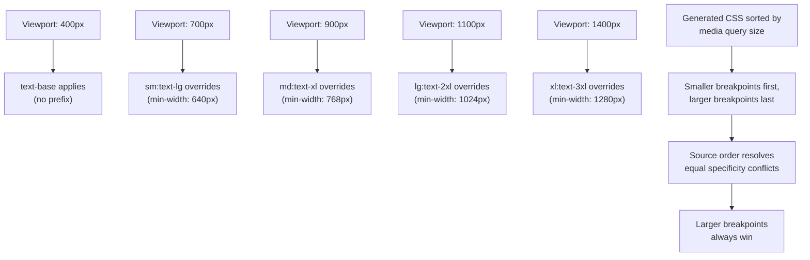
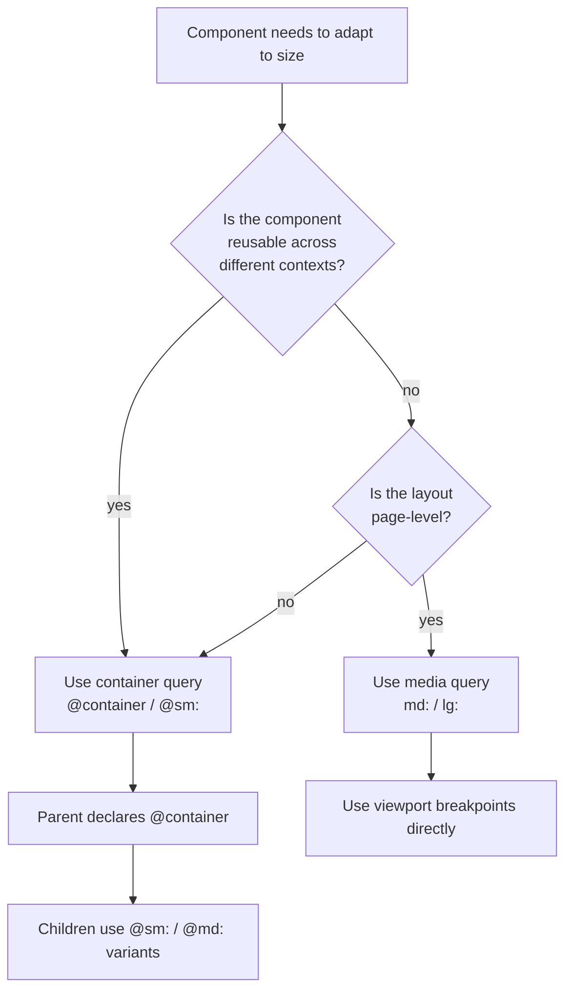
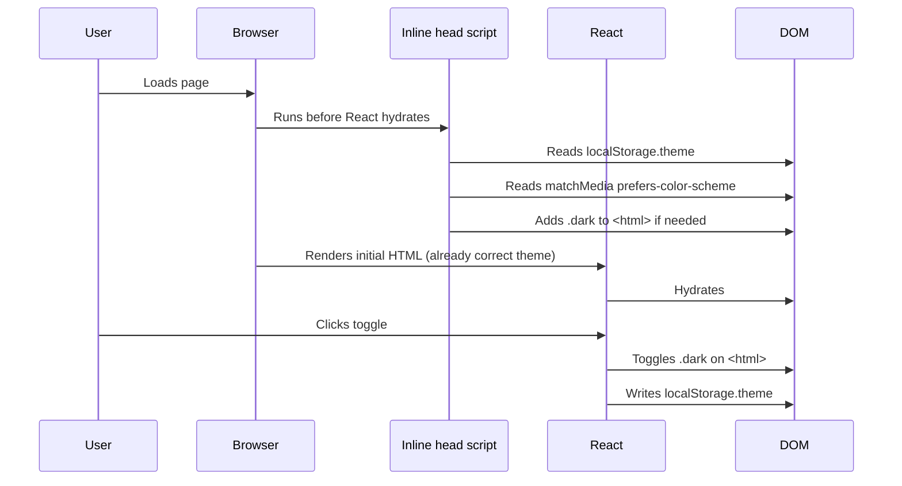

# 2.3 Responsive Utilities and Dark Mode

> Responsive design in Tailwind is not a separate API you bolt on — it is built into every utility via the variant prefix system. A class like `md:text-lg` is one utility plus one variant, and the same machinery that produces `md:` produces `hover:`, `focus:`, `dark:`, `rtl:`, and the new container-query variants `@sm:` and `@md:`. This note covers the breakpoint prefixes and their defaults, mobile-first thinking, the `max-*` variants for desktop-first code, arbitrary breakpoints, dark mode strategies (`media` vs `class`), custom dark mode selectors, the `prefers-color-scheme` vs toggle decision, `group-hover` and `group-dark` patterns, and the container-query variants that ship in Tailwind v3.4+ and v4.

## 2.3.1 Objective

By the end of this note you should be able to:

1. List the default breakpoints (`sm: 640px`, `md: 768px`, `lg: 1024px`, `xl: 1280px`, `2xl: 1536px`) and explain that Tailwind is mobile-first — every prefix is a `min-width` media query.
2. Predict the cascade when multiple prefixes are stacked: `text-base sm:text-lg md:text-xl`. State which rule wins at 500px, 700px, 900px, 1100px, 1300px, 1500px, 1700px.
3. Use the `max-*` variants (`max-sm:`, `max-md:`, `max-lg:`) for desktop-first code, and explain why they should be the exception rather than the rule.
4. Write arbitrary breakpoints with the bracket syntax (`min-[1024px]:`, `max-[768px]:`, `[17rem]:`).
5. Configure dark mode for both strategies (`media` and `class`) and choose the right one for any given project.
6. Toggle dark mode in a React/Next.js app, persist the choice to `localStorage`, and respect the OS preference as a default.
7. Use `group-hover`, `group-focus`, `peer-checked`, and the named group variants (`group/card:hover:*`) to style descendants and siblings based on ancestor or sibling state.
8. Use the container-query variants (`@container`, `@sm:`, `@md:`, `@lg:`) to style components based on their container size rather than the viewport.
9. Diagnose the most common responsive bugs: reversed cascade order, missing base style, dark mode toggle that doesn't persist, container query that doesn't trigger.

## 2.3.2 Background Knowledge

Modern responsive design has three independent axes:

1. **Viewport responsiveness** — the layout adapts to the browser window. Driven by media queries (`@media (min-width: ...)`). This is what `sm:`, `md:`, `lg:` produce.
2. **User preference responsiveness** — the layout adapts to OS-level settings like dark mode, reduced motion, high contrast, forced colors. Driven by `prefers-color-scheme`, `prefers-reduced-motion`, `prefers-contrast`, `forced-colors`. Tailwind exposes these as the `dark:`, `motion-reduce:`, `motion-safe:`, `contrast-more:`, and `forced-colors:` variants.
3. **Container responsiveness** — a component adapts to the size of its container, not the viewport. This lets you build a card that looks great whether it is in a narrow sidebar or a wide main column. Driven by container queries (`@container`), exposed as `@sm:`, `@md:`, `@lg:` variants.

Tailwind treats all three as instances of the same primitive: the **variant prefix**. A variant is a wrapper around a utility that adds a condition for when the utility applies. `md:` adds the condition "viewport ≥ 768px." `dark:` adds "ancestor has `.dark` class" (or "OS is in dark mode"). `@md:` adds "container is ≥ 28rem." `hover:` adds "mouse is over the element."

The variant prefix composes: you can stack `md:hover:`, `dark:focus:`, `group-hover:md:`. Each prefix wraps the next, so `md:hover:bg-blue-700` reads inside-out as "on hover, set bg-blue-700, but only at md and up." See [[1.7 Responsive Design and Container Queries]] for the underlying CSS — this note focuses on the Tailwind ergonomics.

Mobile-first is the philosophy that drives the default direction of every prefix. You write the smallest-screen styles as your base, then progressively add complexity at each breakpoint. The reason is that mobile devices have the least screen space and the most constraints (touch, slow CPU, flaky network); starting from there forces you to make those constraints first-class. Desktop-first code (`max-*` variants) is permitted but discouraged as the primary strategy because it tends to produce designs that "work down" to mobile as an afterthought.

> [!note] The breakpoint values are arbitrary. They were chosen to match common device widths (tablet portrait at 768, laptop at 1024, desktop at 1280, large desktop at 1536). You can — and should — change them in your config to match your design's natural breakpoints. Don't use the defaults just because they're there. See [[2.2 Configuration and Theme Customization]].

## 2.3.3 Core Concepts

### 2.3.3.1 The Default Breakpoints

| Prefix | Activates at | Common device |
|---|---|---|
| (none) | 0px and up | Mobile portrait |
| `sm:` | 640px and up | Large phone / small tablet portrait |
| `md:` | 768px and up | Tablet portrait (iPad) |
| `lg:` | 1024px and up | Tablet landscape / small laptop |
| `xl:` | 1280px and up | Desktop |
| `2xl:` | 1536px and up | Large desktop |

Every prefix is `min-width`. There is no `min-sm:` — `sm:` *is* the min-width variant. To get a max-width variant, use `max-sm:`, `max-md:`, etc.

### 2.3.3.2 Mobile-First Thinking

The mental model:

1. Write the smallest-screen styles as the base (no prefix).
2. Add `sm:`, `md:`, `lg:`, `xl:`, `2xl:` prefixes to override at each breakpoint.
3. Each prefix applies *from that breakpoint and up*, until a larger prefix overrides it.

```tsx
// A card grid that is 1 column on mobile, 2 on tablet, 3 on desktop.
<div className="grid grid-cols-1 sm:grid-cols-2 lg:grid-cols-3 gap-4">
  <Card />
  <Card />
  <Card />
  <Card />
</div>
```

Cascade:

- 0–639px: `grid-cols-1` (1 column)
- 640–1023px: `sm:grid-cols-2` overrides (2 columns)
- 1024px+: `lg:grid-cols-3` overrides (3 columns)

### 2.3.3.3 The `max-*` Variants

For desktop-first code, Tailwind v3.2+ provides `max-sm:`, `max-md:`, `max-lg:`, `max-xl:`, `max-2xl:`. Each is a `max-width` media query.

| Prefix | Applies up to |
|---|---|
| `max-sm:` | 639px and below |
| `max-md:` | 767px and below |
| `max-lg:` | 1023px and below |
| `max-xl:` | 1279px and below |
| `max-2xl:` | 1535px and below |

```tsx
// "Hide on mobile, show from sm up" — both versions are equivalent
<div className="hidden sm:block">Always block from sm up</div>
<div className="block max-sm:hidden">Block by default, hidden below sm</div>
```

> [!warning] Mixing `min-*` and `max-*` variants on the same element is confusing. Pick one strategy per element. If most of your code is mobile-first, the occasional `max-sm:hidden` is fine; if you find yourself writing `max-lg:` everywhere, you have adopted a desktop-first strategy by accident and should refactor.

### 2.3.3.4 Arbitrary Breakpoints

For project-specific breakpoints that don't fit the named scale, use the bracket syntax:

```tsx
<div className="min-[1024px]:flex max-[768px]:hidden">
  Visible only between 769px and 1023px
</div>

<div className="[17rem]:text-lg">
  text-lg applies when viewport is at least 17rem (272px)
</div>
```

`min-[1024px]:` produces `@media (min-width: 1024px)`. `max-[768px]:` produces `@media (max-width: 768px)`. Use these for one-off values; if you use the same value more than once, add it to the theme as a named breakpoint instead.

### 2.3.3.5 Stacking Variants

Variants stack left-to-right. `md:hover:bg-blue-700` means "at md and up, on hover, set bg-blue-700." The generated CSS:

```css
@media (min-width: 768px) {
  .md\:hover\:bg-blue-700:hover {
    background-color: var(--color-blue-700);
  }
}
```

You can stack any combination: `dark:focus-visible:ring-2`, `md:peer-checked:text-white`, `group-hover:md:scale-105`. Each prefix wraps the next in source order.

### 2.3.3.6 Dark Mode Strategies

**Strategy 1: `media` (default)**

Tailwind generates:

```css
@media (prefers-color-scheme: dark) {
  .dark\:bg-slate-900 { background-color: var(--color-slate-900); }
}
```

The element follows the OS preference automatically. No JS, no toggle. Use this for content sites where the user's OS choice is the source of truth (a blog, a documentation site).

**Strategy 2: `class`**

Tailwind generates:

```css
.dark .dark\:bg-slate-900 { background-color: var(--color-slate-900); }
```

The element is dark only when an ancestor (usually `<html>`) has the `dark` class. You toggle the class with JS. Use this for any app where the user should be able to override the OS preference with a manual toggle.

**Strategy 3: Custom selector (v3.4.1+)**

```js
darkMode: ['selector', '[data-mode="dark"]'],
```

Generates:

```css
[data-mode="dark"] .dark\:bg-slate-900 { background-color: var(--color-slate-900); }
```

Use this when you want dark mode driven by a data attribute (e.g., because your CMS sets `data-mode` based on user settings, or because you have multiple themes beyond just dark).

In v4:

```css
@custom-variant dark (&:where([data-mode="dark"], [data-mode="dark"] *));
```

### 2.3.3.7 The `prefers-color-scheme` vs Toggle Decision

| Question | If yes |
|---|---|
| Is the user ever going to want a manual toggle? | Use `class`. |
| Is this a content site (blog, docs) where the OS choice should always win? | Use `media`. |
| Do you need a third state (e.g., "system")? | Use `class` and store user choice in `localStorage` with a sentinel value for "system." |
| Does your CMS or auth system already set a data attribute? | Use the custom selector strategy. |

For most apps, `class` is the right answer because users have a strong expectation of a manual toggle. The implementation cost is small: a few lines of JS to read the stored preference and set the class on `<html>`.

### 2.3.3.8 `group-*` and `peer-*` Variants

Sometimes you need to style an element based on the state of an *ancestor* or *sibling*, not the element itself.

**`group-*`** — style descendants based on ancestor state:

```tsx
<div className="group">
  <h3 className="group-hover:text-blue-600">Title</h3>
  <p className="group-hover:text-slate-600">Body</p>
  <button className="opacity-0 group-hover:opacity-100">Read more</button>
</div>
```

When the user hovers anywhere on the `.group` div, every `group-hover:` utility inside it activates. The "Read more" button fades in.

**Named groups** — for nested groups, give each one a name:

```tsx
<div className="group/card">
  <div className="group/image">
    
    <button className="opacity-0 group-hover/card:opacity-100">Edit</button>
  </div>
</div>
```

`group-hover/card:` only triggers when the *card* group is hovered, not the inner image group. This prevents the "Edit" button from flickering when the user hovers the image but not the card.

**`peer-*`** — style a sibling based on a *previous* sibling's state:

```tsx
<div className="relative">
  <input
    type="checkbox"
    id="terms"
    className="peer sr-only"
  />
  <label
    htmlFor="terms"
    className="block rounded border-2 border-slate-300 peer-checked:border-blue-500 peer-checked:bg-blue-500 peer-focus-visible:ring-2"
  >
    I accept the terms
  </label>
</div>
```

The label styles itself based on the checkbox's `:checked` state. `peer-*` only works for *previous* siblings (the peer must come first in the DOM), because CSS has no previous-sibling combinator.

### 2.3.3.9 Container Queries

Container queries let a component adapt to its *container* size, not the viewport. This is critical for reusable components that may appear in different contexts (a card in a 3-column grid vs the same card in a sidebar).

Tailwind v3.4+ and v4 ship container queries built in. The syntax:

```tsx
// Parent declares itself a container
<div className="@container">
  <Card />
</div>

// Child responds to container size
function Card() {
  return (
    <article className="flex flex-col @sm:flex-row @lg:flex-row-reverse">
      
      <div>
        <h3 className="text-base @lg:text-xl">Title</h3>
        <p className="hidden @md:block">Body</p>
      </div>
    </article>
  );
}
```

The default container breakpoints:

| Prefix | Container size |
|---|---|
| `@sm:` | 24rem (384px) |
| `@md:` | 28rem (448px) |
| `@lg:` | 32rem (512px) |
| `@xl:` | 36rem (576px) |
| `@2xl:` | 42rem (672px) |
| `@3xl:` | 48rem (768px) |
| `@4xl:` | 56rem (896px) |
| `@5xl:` | 64rem (1024px) |
| `@6xl:` | 72rem (1152px) |
| `@7xl:` | 80rem (1280px) |

The `@container` parent class sets `container-type: inline-size` on itself. The child variants query the nearest ancestor container.

Use named containers when you have nested containers:

```tsx
<div className="@container/sidebar">
  <div className="@container/main">
    <Widget className="@sm/sidebar:bg-blue-500 @lg/main:bg-red-500" />
  </div>
</div>
```

`@sm/sidebar:` queries the sidebar container; `@lg/main:` queries the main container.

## 2.3.4 Detailed Walkthrough

### 2.3.4.1 The Breakpoint Cascade in Detail

```tsx
<p className="text-base sm:text-lg md:text-xl lg:text-2xl xl:text-3xl">
  Hello
</p>
```

Predict the font size at each viewport:

| Viewport width | Active rule | Font size |
|---|---|---|
| 400px | `text-base` | 1rem (16px) |
| 700px | `sm:text-lg` | 1.125rem (18px) |
| 900px | `md:text-xl` | 1.25rem (20px) |
| 1100px | `lg:text-2xl` | 1.5rem (24px) |
| 1400px | `xl:text-3xl` | 1.875rem (30px) |
| 1700px | `xl:text-3xl` (still) | 1.875rem (30px) |

Why? Tailwind orders the generated CSS by media query size: smaller breakpoints first, larger breakpoints last. Source order resolves equal-specificity conflicts, so later (larger) wins. The cascade is purely deterministic.

Reverse the order to introduce a bug:

```tsx
<p className="xl:text-3xl lg:text-2xl md:text-xl sm:text-lg text-base">
  Hello
</p>
```

The class order in your JSX does not matter — Tailwind still sorts the generated CSS by breakpoint. So this is identical to the previous example. Tailwind's deterministic sort is what saves you from "I rearranged my classes and the layout broke."

### 2.3.4.2 Combining `min-*` and `max-*` for Range Queries

To style something only within a range, stack `min-*` and `max-*`:

```tsx
// Visible only between 768 and 1024
<div className="hidden md:block max-lg:hidden">
  Tablet only
</div>

// Or equivalently with arbitrary values:
<div className="hidden min-[768px]:block max-[1023px]:block">
  Tablet only
</div>
```

The first version uses named breakpoints. The second uses arbitrary values for precise control. Both produce the same visual result.

### 2.3.4.3 The Dark Mode Toggle Implementation

```tsx
// app/layout.tsx (Next.js App Router)
import './globals.css';

export default async function RootLayout({ children }: { children: React.ReactNode }) {
  return (
    <html lang="en" suppressHydrationWarning>
      <head>
        <script
          dangerouslySetInnerHTML={{
            __html: `
              (function() {
                try {
                  var stored = localStorage.getItem('theme');
                  var prefersDark = window.matchMedia('(prefers-color-scheme: dark)').matches;
                  if (stored === 'dark' || (!stored && prefersDark)) {
                    document.documentElement.classList.add('dark');
                  }
                } catch (e) {}
              })();
            `,
          }}
        />
      </head>
      <body>{children}</body>
    </html>
  );
}
```

```tsx
// components/ThemeToggle.tsx
'use client';
import { useEffect, useState } from 'react';

export function ThemeToggle() {
  const [theme, setTheme] = useState<'light' | 'dark'>('light');

  useEffect(() => {
    const isDark = document.documentElement.classList.contains('dark');
    setTheme(isDark ? 'dark' : 'light');
  }, []);

  function toggle() {
    const next = theme === 'dark' ? 'light' : 'dark';
    document.documentElement.classList.toggle('dark', next === 'dark');
    localStorage.setItem('theme', next);
    setTheme(next);
  }

  return (
    <button
      onClick={toggle}
      className="rounded-md p-2 text-slate-700 dark:text-slate-200 hover:bg-slate-100 dark:hover:bg-slate-800"
      aria-label="Toggle dark mode"
    >
      {theme === 'dark' ? '' : ''}
    </button>
  );
}
```

Key implementation details:

1. **Inline script in `<head>`** runs before React hydrates, preventing the "flash of light theme" when a user with `theme=dark` in localStorage loads the page. `suppressHydrationWarning` on `<html>` tells React that the class attribute is intentionally set by the script and not to complain about the mismatch.
2. **`localStorage.setItem('theme', next)`** persists the user's explicit choice.
3. **The `useEffect` reads the current state** rather than assuming, so the toggle stays in sync if the user changes the OS theme in another tab.
4. **No `useLayoutEffect`** — that would also work but is unnecessary because the inline script has already set the class before React loads.

### 2.3.4.4 Container Queries vs Media Queries — When to Use Which

| Situation | Use |
|---|---|
| Page-level layout (header, footer, page grid) | Media query (`md:`, `lg:`) |
| Reusable component (Card, Button, Modal) that appears in different contexts | Container query (`@sm:`, `@md:`) |
| Sidebar widget that should adapt to sidebar width | Container query |
| Full-page hero section | Media query |
| Embeddable widget (chatbot, video player) that ships in unknown hosts | Container query |

The rule of thumb: **if a component is reusable, use container queries. If a layout is page-level, use media queries.** A page-level media query for a reusable component is a bug waiting to happen — the moment you drop the component into a narrower container, it breaks.

### 2.3.4.5 Container Query Gotchas

1. **The container must have `container-type` set.** The `@container` class does this. Without it, the container's children can't query it. They'll either silently do nothing or query the nearest ancestor that *is* a container (which may be the viewport).

2. **Container queries query the *inline-size* by default.** They respond to width, not height. If you need height-based queries, you have to use `container-type: size` and write your own variant — there is no built-in `@h-md:` variant.

3. **Container queries are slower than media queries.** Browsers can optimize media queries because there are few of them. Container queries can multiply — every `@container` ancestor creates a new query context. Don't sprinkle `@container` on every div; use it only where you need it.

4. **The `@container` parent's children inherit the container context.** This means nested containers work, but it also means that a deeply nested component might inadvertently query an ancestor container if you forget to declare its immediate parent as a container.

### 2.3.4.6 Combining `dark:` with Other Variants

You can stack dark mode with any other variant:

```tsx
<button className="
  bg-blue-500 hover:bg-blue-600
  dark:bg-blue-600 dark:hover:bg-blue-700
  focus-visible:ring-2 focus-visible:ring-blue-500
  dark:focus-visible:ring-blue-400
">
  Save
</button>
```

In light mode: blue-500  -->  blue-600 on hover, ring-blue-500 on focus.
In dark mode: blue-600  -->  blue-700 on hover, ring-blue-400 on focus (lighter, because dark backgrounds need lighter focus rings for contrast).

### 2.3.4.7 The `group-dark` Pattern (Custom Variant)

There is no built-in `group-dark:` variant, but you can add one:

```js
// v3
module.exports = {
  plugins: [
    function ({ addVariant }) {
      addVariant('group-dark', '.dark .group &');
    },
  ],
};
```

```css
/* v4 */
@custom-variant group-dark (.dark .group &);
```

```tsx
<div className="group">
  <p className="text-slate-600 group-dark:text-slate-300">
    This text is slate-600 normally, slate-300 when an ancestor has .dark.
  </p>
</div>
```

Use this when you have a component that should change based on theme, but you don't want to repeat `dark:` on every descendant.

## 2.3.5 Practical Examples

### 2.3.5.1 A Responsive Navigation Bar

```tsx
export function Navbar() {
  return (
    <nav className="flex items-center justify-between p-4">
      <div className="text-xl font-bold">Brand</div>

      {/* Desktop nav — hidden on mobile */}
      <ul className="hidden md:flex md:items-center md:gap-6">
        <li><a className="hover:text-blue-600" href="#">Home</a></li>
        <li><a className="hover:text-blue-600" href="#">About</a></li>
        <li><a className="hover:text-blue-600" href="#">Contact</a></li>
      </ul>

      {/* Mobile menu button — hidden on desktop */}
      <button className="md:hidden" aria-label="Open menu">
        
      </button>
    </nav>
  );
}
```

Cascade:

- Mobile: `<ul>` is `hidden`, button is visible.
- ≥768px: `<ul>` is `flex`, button is `hidden`.

### 2.3.5.2 A Responsive Card Grid with Container Queries

```tsx
export function CardGrid({ children }: { children: React.ReactNode }) {
  return (
    <div className="@container">
      <div className="grid grid-cols-1 @sm:grid-cols-2 @lg:grid-cols-3 gap-4">
        {children}
      </div>
    </div>
  );
}

export function Card() {
  return (
    <article className="flex flex-col @sm:flex-row @sm:items-center gap-4 rounded-lg border border-slate-200 p-4 dark:border-slate-700">
      
      <div className="flex-1">
        <h3 className="text-base @sm:text-lg font-semibold">Title</h3>
        <p className="text-sm text-slate-600 dark:text-slate-300">Body</p>
      </div>
    </article>
  );
}
```

The grid columns and the card's internal layout both respond to container size, so you can drop this component into a 3-column page layout (where `@sm:` activates early) or a 1-column sidebar (where `@sm:` may never activate) and it adapts.

### 2.3.5.3 A Theme-Aware Surface Component

```tsx
function Surface({ children, variant = 'default' }: {
  children: React.ReactNode;
  variant?: 'default' | 'elevated' | 'sunken';
}) {
  return (
    <div
      className="
        rounded-lg p-6
        bg-white dark:bg-slate-900
        text-slate-900 dark:text-slate-100
        border border-slate-200 dark:border-slate-800
        data-[variant=elevated]:shadow-md
        data-[variant=elevated]:dark:shadow-none
        data-[variant=elevated]:dark:border-slate-700
        data-[variant=sunken]:bg-slate-50
        data-[variant=sunken]:dark:bg-slate-950
      "
      data-variant={variant}
    >
      {children}
    </div>
  );
}
```

Usage: `<Surface variant="elevated">...</Surface>`. The `data-[variant=...]` syntax is the arbitrary attribute variant — it activates when the element has `data-variant="..."` set. See [[2.4 Component Composition]] for a cleaner version using `cva`.

## 2.3.6 Mermaid Diagrams

### 2.3.6.1 The Breakpoint Cascade



### 2.3.6.2 Container Query vs Media Query Decision



### 2.3.6.3 Dark Mode Toggle Flow



## 2.3.7 Common Mistakes

1. **Writing `lg:grid-cols-3 md:grid-cols-2 sm:grid-cols-1` and expecting the order to matter.** It doesn't — Tailwind sorts the generated CSS by breakpoint size. The visual result is identical to `grid-cols-1 sm:grid-cols-2 lg:grid-cols-3`. Write classes in source order for readability; trust the sorter.

2. **Using `max-*` variants as your primary strategy.** Desktop-first code is harder to reason about because every utility is an override of an assumed default. Use `max-sm:hidden` for one-off "hide on mobile only" cases, but write the bulk of your responsive code mobile-first.

3. **Forgetting the base style.** `<div className="sm:p-4">` has no padding below 640px. Junior engineers assume `sm:p-4` means "always padded, more on small screens." It doesn't — `sm:` means "from 640px up." Write `p-2 sm:p-4` if you want padding everywhere.

4. **Configuring `darkMode: 'class'` but never adding the class.** The dark mode toggle button does nothing because no code ever sets `class="dark"` on `<html>`. The fix is the inline-script pattern from 2.3.4.3.

5. **Forgetting `suppressHydrationWarning` on `<html>`.** Without it, React sees that the inline script added `dark` to `<html>` before React rendered, throws a hydration mismatch warning, and may re-render in light mode briefly. The attribute is required.

6. **Nesting `group` without names.** Two nested `.group` divs make `group-hover:` ambiguous — it activates when *either* is hovered. Always name nested groups (`group/card`, `group/image`).

7. **Using `peer-*` for a following sibling.** `peer-checked:` styles a *following* sibling based on a *previous* sibling's state. If you put the input after the label, it does nothing. CSS has no previous-sibling combinator.

8. **Declaring `@container` on a parent that has no width constraint.** If the parent's width is `100%` of the viewport (e.g., a top-level `<main>`), the container query behaves identically to a media query and you have added complexity for nothing. Use `@container` on parents whose width varies (sidebars, grid cells).

9. **Stacking too many variants.** `dark:hover:focus-visible:md:peer-checked:bg-blue-500` is technically valid but unreadable. If you need that level of conditional logic, extract a component with `cva` and explicit variant props. See [[2.4 Component Composition]].

## 2.3.8 Best Practices

1. **Adopt mobile-first as your default mental model.** Write the smallest-screen styles first, then layer on complexity. Reserve `max-*` for one-off inversions.

2. **Use container queries for any component you will reuse in multiple contexts.** A `Card` component should use `@container`, not `md:`, because you don't know where it will be embedded.

3. **Persist the user's dark mode choice to `localStorage`.** Forgetting the user's preference on every page load is the #1 dark mode UX bug.

4. **Respect `prefers-color-scheme` as the default.** If the user has not chosen, follow the OS. The inline-script pattern in 2.3.4.3 handles this.

5. **Use named groups for nested group-hover.** `group/card` and `group/image` are unambiguous; bare `group` is not.

6. **Add `focus-visible:ring-2` alongside every `hover:` for keyboard accessibility.** Mouse users get the hover state; keyboard users get the focus-visible state. Both should be visible.

7. **Test responsive layouts at every breakpoint in dev.** Use the browser's device toolbar (Cmd+Shift+M in Chrome) and step through 360, 480, 640, 768, 1024, 1280, 1536, 1920. Don't ship without walking the ladder.

8. **Prefer `dark:` over a separate dark-mode stylesheet.** Co-locating the dark variant with the light style keeps the relationship obvious. A separate `dark.css` file makes it easy to forget to update one when the other changes.

9. **Document your dark mode strategy in the project README.** "We use `class` strategy; the toggle is in `ThemeToggle.tsx`; the inline script is in `app/layout.tsx`." New engineers will thank you.

## 2.3.9 Mini Exercises

### Exercise 2.3.1: Predict the Cascade

For `<p className="text-sm md:text-base lg:text-lg max-md:text-xs">`, what font size applies at 400px, 700px, and 1100px? Explain.

**Worked solution:**

- **400px**: `text-sm` from the base, plus `max-md:text-xs` (applies because 400 ≤ 767). `max-md:text-xs` is generated in a `max-width: 767px` media query. The cascade between `text-sm` (base, no media query) and `max-md:text-xs` (max-width query) depends on source order. Tailwind sorts max-* queries *before* min-* queries (because max-* is more specific — it only applies in a narrower range). So `max-md:text-xs` wins. **Result: `text-xs` (0.75rem, 12px).**
- **700px**: Same as 400px. `max-md:` still applies (700 ≤ 767). **Result: `text-xs`.**
- **1100px**: `max-md:text-xs` no longer applies (1100 > 767). `md:text-base` applies (1100 ≥ 768). `lg:text-lg` also applies (1100 ≥ 1024). Between them, `lg:text-lg` is generated in a larger min-width query, so it sorts later in source order and wins. **Result: `text-lg` (1.125rem, 18px).**

Common wrong answer: "400px is `text-sm` because it's the base." That ignores the `max-md:` override. Mobile-first does not mean "base always wins on mobile"; it means "base is the default, and you can override with `max-*` for further narrowing."

### Exercise 2.3.2: Build a Theme Toggle with Persistence

Write a complete `ThemeToggle` React component that: (a) reads the current theme from `<html>`'s class list, (b) toggles `dark` on click, (c) persists to `localStorage`, and (d) is accessible. Assume the inline script in `layout.tsx` has already set the initial class.

**Worked solution:**

```tsx
'use client';
import { useEffect, useState } from 'react';

type Theme = 'light' | 'dark';

function getInitialTheme(): Theme {
  if (typeof document !== 'undefined') {
    return document.documentElement.classList.contains('dark') ? 'dark' : 'light';
  }
  return 'light';
}

export function ThemeToggle() {
  const [theme, setTheme] = useState<Theme>('light');
  const [mounted, setMounted] = useState(false);

  useEffect(() => {
    setTheme(getInitialTheme());
    setMounted(true);
  }, []);

  useEffect(() => {
    const media = window.matchMedia('(prefers-color-scheme: dark)');
    const handler = (e: MediaQueryListEvent) => {
      // Only react if the user has not explicitly chosen
      if (!localStorage.getItem('theme')) {
        setTheme(e.matches ? 'dark' : 'light');
        document.documentElement.classList.toggle('dark', e.matches);
      }
    };
    media.addEventListener('change', handler);
    return () => media.removeEventListener('change', handler);
  }, []);

  function toggle() {
    const next: Theme = theme === 'dark' ? 'light' : 'dark';
    document.documentElement.classList.toggle('dark', next === 'dark');
    localStorage.setItem('theme', next);
    setTheme(next);
  }

  return (
    <button
      type="button"
      onClick={toggle}
      aria-label={`Switch to ${theme === 'dark' ? 'light' : 'dark'} mode`}
      className="rounded-md p-2 text-slate-700 hover:bg-slate-100 dark:text-slate-200 dark:hover:bg-slate-800 focus-visible:outline-none focus-visible:ring-2 focus-visible:ring-blue-500"
    >
      {/* Avoid hydration mismatch by rendering a stable icon until mounted */}
      {mounted ? (theme === 'dark' ? '' : '') : ''}
    </button>
  );
}
```

Three subtleties:

1. **`mounted` state.** The initial render shows a neutral icon to avoid hydration mismatch (the server doesn't know the user's theme). After mount, the effect reads the real theme and re-renders.
2. **`localStorage.getItem('theme')` check in the OS listener.** If the user has explicitly chosen, we should not override their choice when the OS changes. The OS listener only kicks in when there is no stored preference.
3. **`aria-label` describes the action, not the current state.** "Switch to light mode" is more useful to a screen reader user than "Currently in dark mode," because it tells them what clicking will do.

### Exercise 2.3.3: Convert a Media-Query Component to Container Query

This Card uses a media query to switch from vertical to horizontal layout at `md`. Convert it to a container query so the same Card adapts correctly in a sidebar.

```tsx
function Card() {
  return (
    <article className="flex flex-col md:flex-row gap-4">
      
      <div>
        <h3 className="text-base md:text-lg">Title</h3>
      </div>
    </article>
  );
}
```

**Worked solution:**

```tsx
function Card() {
  return (
    <article className="@container flex flex-col @sm:flex-row gap-4">
      
      <div>
        <h3 className="text-base @sm:text-lg">Title</h3>
      </div>
    </article>
  );
}

// Usage — parent doesn't need to do anything special:
<aside className="w-72">
  <Card /> {/* horizontal layout activates when card itself is ≥384px... but wait */}
</aside>
```

Important catch: the sidebar is 288px wide (w-72 = 18rem). The `@sm:` breakpoint activates at 24rem (384px). So the Card will *not* switch to horizontal in this sidebar — it stays vertical. That's actually correct: the sidebar is too narrow for horizontal layout. If you wanted horizontal at 288px, you'd use `@3xs:` (a custom breakpoint) or arbitrary `@[18rem]:`.

Common wrong conversion: putting `@container` on the parent `<aside>` instead of on the Card itself. The `@container` class makes the element a container; its descendants query it. If you want the Card's own internal layout to depend on the Card's own width, the Card itself must be the container.

### Exercise 2.3.4: Diagnose the Hover Bug

A developer writes:

```tsx
<div className="group">
  <h3 className="group-hover:text-blue-600">Title</h3>
  <p>Body</p>
  <button className="opacity-0 group-hover:opacity-100">Read more</button>
</div>
```

They report: "The button stays invisible even when I hover." Diagnose.

**Worked solution:**

Diagnosis candidates, in order of likelihood:

1. **The parent div has `pointer-events: none` somewhere** (a Tailwind class like `pointer-events-none`). The hover event never reaches the group. Fix: remove `pointer-events-none`, or use `group-hover:[pointer-events:auto]` on the children.
2. **An ancestor has `overflow: hidden` and the parent's bounding box doesn't cover the area being hovered.** The user thinks they're hovering the group, but they're hovering a sibling that overlaps it. Fix: check the layout.
3. **The parent isn't actually a `.group`** — for example, the JSX is wrapped by a higher-order component that strips the class. Fix: inspect the DOM in devtools and verify `class="group"` is on the element.
4. **The `group-hover:` variant isn't being generated** because the project uses `content`/`@source` and the file isn't being scanned. Symptom: no CSS rule for `.group:hover .group-hover\:opacity-100` exists in the stylesheet. Fix: ensure the file is in the content globs.
5. **The button has a higher-specificity rule elsewhere that overrides `opacity-100`.** Unlikely with utilities, but possible if there's a CSS module rule with `opacity: 0 !important`.

The most common cause is #1 or #3. Always check the DOM first.

### Exercise 2.3.5: Design a Three-State Theme Toggle (Light / Dark / System)

Design the data model and the toggle logic for a theme switcher with three states: explicit-light, explicit-dark, and system (follow OS). The DOM should always reflect either `.dark` or no `.dark`.

**Worked solution:**

```ts
type ThemePreference = 'light' | 'dark' | 'system';

function applyTheme(pref: ThemePreference) {
  const isDark =
    pref === 'dark' ||
    (pref === 'system' && window.matchMedia('(prefers-color-scheme: dark)').matches);
  document.documentElement.classList.toggle('dark', isDark);
}

function getStoredPref(): ThemePreference {
  const s = localStorage.getItem('theme-pref');
  return s === 'light' || s === 'dark' || s === 'system' ? s : 'system';
}

function setStoredPref(p: ThemePreference) {
  localStorage.setItem('theme-pref', p);
}

// Inline script in <head>:
// (function() {
//   var pref = localStorage.getItem('theme-pref') || 'system';
//   var isDark = pref === 'dark' || (pref === 'system' && window.matchMedia('(prefers-color-scheme: dark)').matches);
//   if (isDark) document.documentElement.classList.add('dark');
// })();
```

```tsx
'use client';
import { useEffect, useState } from 'react';
import { applyTheme, getStoredPref, setStoredPref, type ThemePreference } from './theme';

export function ThemeToggle() {
  const [pref, setPref] = useState<ThemePreference>('system');
  const [mounted, setMounted] = useState(false);

  useEffect(() => {
    setPref(getStoredPref());
    setMounted(true);
  }, []);

  useEffect(() => {
    if (!mounted) return;
    const media = window.matchMedia('(prefers-color-scheme: dark)');
    const handler = () => {
      if (getStoredPref() === 'system') applyTheme('system');
    };
    media.addEventListener('change', handler);
    return () => media.removeEventListener('change', handler);
  }, [mounted]);

  function choose(next: ThemePreference) {
    setPref(next);
    setStoredPref(next);
    applyTheme(next);
  }

  if (!mounted) return null;

  return (
    <div role="radiogroup" aria-label="Theme">
      {(['light', 'dark', 'system'] as const).map((p) => (
        <button
          key={p}
          role="radio"
          aria-checked={pref === p}
          onClick={() => choose(p)}
          className="rounded p-2 aria-checked:bg-blue-500 aria-checked:text-white"
        >
          {p}
        </button>
      ))}
    </div>
  );
}
```

Three subtleties:

1. **`localStorage` stores the preference, not the resolved theme.** Storing `dark` loses the distinction between "user chose dark" and "system happens to be dark." The three-state model needs the preference.
2. **The OS listener re-applies only when pref is `system`.** If the user explicitly chose `light` and the OS switches to dark, we don't change.
3. **`aria-checked` and `role="radio"` make the toggle accessible.** A radiogroup is the correct semantic for "choose one of N mutually exclusive options."

## 2.3.10 Summary

Tailwind's responsive and dark mode systems are unified under the variant prefix. Breakpoints (`sm:`, `md:`, `lg:`, `xl:`, `2xl:`) are mobile-first `min-width` queries; `max-*` variants provide desktop-first escape hatches; arbitrary breakpoints handle one-off values. Dark mode has two strategies — `media` (OS-driven) and `class` (manual toggle) — and the right choice depends on whether the user should be able to override the OS preference. The `group-*`, `peer-*`, and named-group variants let you style descendants and siblings based on ancestor or sibling state. Container queries (`@container`, `@sm:`, `@md:`) let reusable components adapt to their container rather than the viewport. The next note, [[2.4 Component Composition]], shows how to package all these utilities into reusable, variant-driven React components using `cva`, `tailwind-merge`, and the `cn()` pattern.

## 2.3.11 Related Notes

- [[2.1 Tailwind Philosophy and Setup]] — the variant prefix system is part of the JIT engine described here.
- [[2.2 Configuration and Theme Customization]] — how to add custom breakpoints and configure dark mode.
- [[2.4 Component Composition]] — packaging responsive and dark-mode utilities into reusable components with `cva`.
- [[2.5 Layout Patterns in Tailwind]] — concrete responsive layout recipes.
- [[1.7 Responsive Design and Container Queries]] — the underlying CSS that Tailwind generates.
- [[1.11 Accessibility in CSS]] — `focus-visible`, `prefers-reduced-motion`, and `prefers-color-scheme` from the CSS side.
