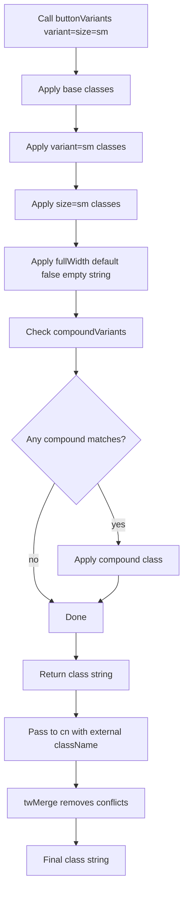
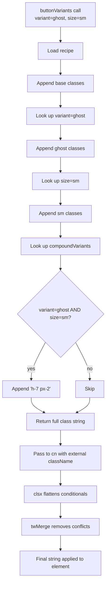
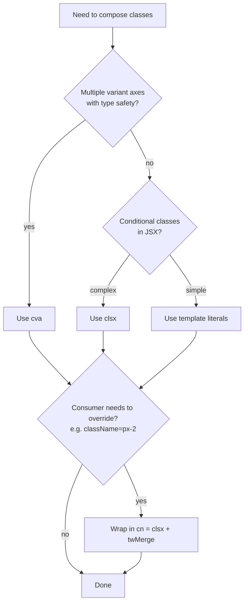

# 2.4 Component Composition

> Tailwind's official guidance is blunt: extract components, not CSS. When the same class string appears three times, build a React component (or Vue, Svelte, etc.) and let the framework handle reuse — not `@apply`. This note covers why component extraction matters in Tailwind, the `@apply` directive (when to use it, when not to, and the official guidance against it for component frameworks), the React/Next.js way of extracting components instead of CSS components, variant patterns with template literals and `clsx`, the `cva` (class-variance-authority) library and its `variants`/`defaultVariants`/`compoundVariants` API, the `tailwind-merge` library and why you need it for runtime class merging, and the `cn()` utility pattern combining both. We build a real `Button` component with size, color, variant, and `fullWidth` axes, and an `Input` with error states.

## 2.4.1 Objective

By the end of this note you should be able to:

1. Explain why extracting components matters in Tailwind and articulate the duplication problem that motivates it.
2. Use the `@apply` directive correctly, list the three situations where it is appropriate, and explain why the official guidance is to *not* use it in React/Vue codebases.
3. Extract a React component with conditional classes using template literals, the `clsx` library, and the `cva` library — and know when to reach for each.
4. Read and write a `cva` definition with `variants`, `defaultVariants`, `compoundVariants`, and slot patterns.
5. Explain why `tailwind-merge` exists and why `clsx` alone is not enough: it resolves conflicting Tailwind utilities at runtime (e.g., `px-4 px-2`  -->  `px-2`).
6. Implement the `cn()` utility that combines `clsx` and `tailwind-merge`, and use it in every component you build.
7. Build a production-quality `Button` component with variant axes: `size` (sm/md/lg), `variant` (primary/secondary/ghost/destructive), `fullWidth`, `loading`, `disabled`.
8. Build an `Input` component with `error` and `success` states that compose cleanly with a `<label>` and helper text.
9. Diagnose the common failure modes: missing `tailwind-merge` causes overrides to silently fail, `cva` variants with the same key conflict, base classes overridden by variants.

## 2.4.2 Background Knowledge

In a Tailwind project, every component ends up with a long `className` string. A button might be:

```tsx
<button className="inline-flex items-center justify-center gap-2 rounded-lg bg-blue-600 px-4 py-2 text-sm font-medium text-white shadow-sm transition-colors hover:bg-blue-700 focus:outline-none focus-visible:ring-2 focus-visible:ring-blue-500 focus-visible:ring-offset-2 disabled:cursor-not-allowed disabled:opacity-50">
  Save
</button>
```

That is 12 utility classes for a single button. If you have 50 buttons in your app, you have 50 copies of this string. Three problems:

1. **Duplication.** A change to the button design (e.g., switch from `rounded-lg` to `rounded-md`) requires editing 50 files. You will miss one.
2. **Variant inconsistency.** Half your buttons use `bg-blue-600`, the other half use `bg-blue-500`. The inconsistency is invisible until a designer screenshots it.
3. **No type safety.** Nothing prevents `<button className="bg-blue-600 px-2 py-1">` (a small button) being used in a context that expects a large one.

There are two ways to fix this in Tailwind:

**Option A: CSS extraction with `@apply`.** Define a `.btn` class in your CSS file that `@apply`'s all the utilities. Use `className="btn"` in markup.

**Option B: Component extraction.** Build a React `<Button>` component that encapsulates the class string. Use `<Button>` in markup.

The official Tailwind guidance is Option B for any codebase that has a component framework (React, Vue, Svelte, Solid, Angular). The reasons:

- Component frameworks already have a reuse primitive (components). Adding a CSS-based reuse layer (`@apply`) is duplicative.
- Components give you type safety, IDE autocomplete, and runtime props (like `disabled`, `loading`) that CSS classes cannot.
- `@apply` defeats the utility-first mental model: you re-introduce semantic class names and a separate CSS file to maintain.

`@apply` is still appropriate for:

1. **Third-party HTML you don't control** (a CMS, a Markdown renderer) where you cannot inject components.
2. **Legacy frameworks without components** (a Rails ERB app, plain HTML) where `@apply` is the only reuse primitive.
3. **Resetting base element styles** (`@apply` a few utilities on `input` to make form elements look consistent without requiring every input to be a component).

For React/Next.js projects, the answer is almost always a component. The rest of this note shows how to build them well.

> [!note] The `cva` library is by Joe Bell (a Tailwind Labs engineer). It is the de facto standard for variant-driven class composition in React. `tailwind-merge` is by Dany Castillo. Together they form the `cn()` pattern that powers shadcn/ui, Radix UI's documentation, and most production Tailwind codebases.

## 2.4.3 Core Concepts

### 2.4.3.1 The Duplication Problem, Quantified

Imagine a button used in 50 places. Without extraction, each instance is 12 classes. With extraction, each instance is `<Button>` and the 12 classes live in one file. The savings:

- 50 × 11 = 550 fewer class-string characters in your codebase.
- One place to change the button design.
- One place to add a new variant (`size="lg"`).
- Type safety on props (`size` must be one of `'sm' | 'md' | 'lg'`).

The cost: one extra file, one extra import, one extra layer of indirection. The trade is almost always worth it.

### 2.4.3.2 The `@apply` Directive

`@apply` lets you inline utility classes into a custom CSS rule:

```css
/* src/index.css */
@layer components {
  .btn {
    @apply inline-flex items-center justify-center gap-2 rounded-lg bg-blue-600 px-4 py-2 text-sm font-medium text-white shadow-sm transition-colors hover:bg-blue-700 focus:outline-none focus-visible:ring-2 focus-visible:ring-blue-500 focus-visible:ring-offset-2 disabled:cursor-not-allowed disabled:opacity-50;
  }

  .btn-secondary {
    @apply bg-slate-200 text-slate-900 hover:bg-slate-300;
  }
}
```

```tsx
<button className="btn">Save</button>
<button className="btn btn-secondary">Cancel</button>
```

Three things to notice:

1. **`@apply` must be inside `@layer components`.** Otherwise the generated CSS may not participate in the cascade correctly and may be overridden by utilities (which is the opposite of what you want).
2. **`@apply` cannot apply custom variants you registered with `addVariant`** in v3, with some exceptions. In v4 this restriction is relaxed.
3. **You can `@apply` arbitrary CSS too**, not just utilities: `@apply [mask-type:luminance];`. This is occasionally useful.

### 2.4.3.3 When `@apply` Is Appropriate

| Situation | Use `@apply`? |
|---|---|
| React/Vue/Svelte component framework | No — extract a component instead |
| Plain HTML site (no framework) | Yes |
| Rails ERB / Django templates / PHP | Yes |
| CMS-rendered content where you cannot inject components | Yes |
| Markdown renderer output (`prose` overrides) | Yes |
| Resetting base element styles (`input { @apply ... }`) | Yes |
| Reusing a class string inside another `@apply` (rare) | Yes |

The common thread: `@apply` is for situations where you cannot use a component. If you can use a component, use a component.

### 2.4.3.4 The React Way: Template Literals

The simplest extraction in React is a function that returns the class string:

```tsx
function Button({ children, variant = 'primary' }: {
  children: React.ReactNode;
  variant?: 'primary' | 'secondary';
}) {
  const base = 'inline-flex items-center justify-center rounded-lg px-4 py-2 text-sm font-medium transition-colors';
  const variants = {
    primary: 'bg-blue-600 text-white hover:bg-blue-700',
    secondary: 'bg-slate-200 text-slate-900 hover:bg-slate-300',
  };

  return (
    <button className={`${base} ${variants[variant]}`}>
      {children}
    </button>
  );
}
```

This works for simple cases. It breaks down when:

1. **You need to merge external classes.** `<Button className="mt-4">` — the consumer wants to add margin, but the template literal doesn't accept external classes.
2. **Variants have conflicting classes.** If `base` says `px-4` and a variant says `px-2`, the result is `px-4 px-2` — both classes are in the DOM, and the cascade picks one based on source order in the generated CSS. This is fragile and version-dependent.
3. **Conditional classes get complex.** `variant === 'primary' && isLarge && ...` becomes unreadable fast.

### 2.4.3.5 `clsx` — Conditional Class Composition

`clsx` is a tiny library that handles conditionals cleanly:

```bash
npm install clsx
```

```tsx
import { clsx } from 'clsx';

function Button({ children, variant = 'primary', className, disabled }: ButtonProps) {
  return (
    <button
      className={clsx(
        'inline-flex items-center justify-center rounded-lg px-4 py-2 text-sm font-medium transition-colors',
        {
          'bg-blue-600 text-white hover:bg-blue-700': variant === 'primary',
          'bg-slate-200 text-slate-900 hover:bg-slate-300': variant === 'secondary',
          'opacity-50 cursor-not-allowed': disabled,
        },
        className, // consumer-provided classes go last so they win
      )}
    >
      {children}
    </button>
  );
}
```

`clsx` accepts strings, objects (where truthy keys are included), arrays, and nested combinations. It produces a single class string. This solves problem #3 (conditional complexity) and partly #1 (external classes).

But `clsx` does NOT solve problem #2 (conflicting classes). If the consumer passes `className="px-2"`, the result is `... px-4 ... px-2`. Both are in the DOM. The cascade picks one. If `px-2` happens to be generated after `px-4` in Tailwind's source order, `px-2` wins. Otherwise, `px-4` wins. The result is unpredictable and version-dependent.

### 2.4.3.6 `tailwind-merge` — Resolving Conflicting Utilities

`tailwind-merge` is the answer. It parses Tailwind class strings and removes earlier conflicting utilities, keeping only the last:

```bash
npm install tailwind-merge
```

```tsx
import { twMerge } from 'tailwind-merge';

twMerge('px-4 px-2');             // 'px-2'
twMerge('text-red-500 text-blue-500'); // 'text-blue-500'
twMerge('p-4 px-2');              // 'p-4 px-2' (no conflict — px-2 overrides only the x-axis)
twMerge('p-4 px-2 p-8');          // 'px-2 p-8' (the final p-8 overrides p-4; px-2 still applies)
twMerge('bg-blue-500 hover:bg-blue-600 bg-red-500'); // 'hover:bg-blue-600 bg-red-500'
```

`tailwind-merge` understands the structure of Tailwind utilities. It knows that `px-4` and `px-2` conflict (both set `padding-left/right`), that `px-4` and `py-2` do not conflict, that `bg-blue-500` and `hover:bg-blue-600` do not conflict (different variants), and that `text-red-500` and `text-blue-500` conflict (same property).

This is exactly what we need for the consumer-override problem:

```tsx
import { clsx } from 'clsx';
import { twMerge } from 'tailwind-merge';

function cn(...inputs: ClassValue[]) {
  return twMerge(clsx(inputs));
}

function Button({ className, ... }) {
  return (
    <button
      className={cn(
        'inline-flex items-center justify-center rounded-lg px-4 py-2',
        'bg-blue-600 text-white hover:bg-blue-700',
        className, // 'px-2' — overrides the base px-4
      )}
    >
      ...
    </button>
  );
}

// Consumer:
<Button className="px-2" />
// Final class string: 'inline-flex items-center justify-center rounded-lg bg-blue-600 text-white hover:bg-blue-700 px-2 py-2'
// px-2 wins over px-4; py-2 stays.
```

### 2.4.3.7 The `cn()` Utility Pattern

The `cn` function above is the canonical pattern. It is a one-liner that combines `clsx` (handles conditionals) with `tailwind-merge` (resolves conflicts). Every component in a well-architected Tailwind codebase uses `cn`.

```ts
// lib/utils.ts
import { clsx, type ClassValue } from 'clsx';
import { twMerge } from 'tailwind-merge';

export function cn(...inputs: ClassValue[]) {
  return twMerge(clsx(inputs));
}
```

Use it everywhere:

```tsx
<div className={cn('flex items-center gap-2', isActive && 'bg-blue-50', className)} />
```

### 2.4.3.8 `cva` — Variant-Driven Class Composition

`cva` is a higher-level abstraction for components with multiple variant axes. You define a "recipe" once, and the recipe produces a function you call with the chosen variants:

```bash
npm install cva class-variance-authority
```

> [!note] Both packages exist on npm. `cva` is the original package name. `class-variance-authority` is the newer, official name. They are the same library — `cva` is now a re-export of `class-variance-authority`. Install `class-variance-authority` for new projects.

```tsx
import { cva, type VariantProps } from 'class-variance-authority';

const buttonVariants = cva(
  // Base classes — applied to every instance
  'inline-flex items-center justify-center gap-2 rounded-lg text-sm font-medium transition-colors focus:outline-none focus-visible:ring-2 focus-visible:ring-offset-2 disabled:cursor-not-allowed disabled:opacity-50',
  {
    variants: {
      variant: {
        primary:   'bg-blue-600 text-white hover:bg-blue-700 focus-visible:ring-blue-500',
        secondary: 'bg-slate-200 text-slate-900 hover:bg-slate-300 focus-visible:ring-slate-400',
        ghost:     'bg-transparent text-slate-700 hover:bg-slate-100 focus-visible:ring-slate-400',
        destructive: 'bg-red-600 text-white hover:bg-red-700 focus-visible:ring-red-500',
      },
      size: {
        sm: 'h-8 px-3 text-xs',
        md: 'h-10 px-4',
        lg: 'h-12 px-6 text-base',
      },
      fullWidth: {
        true: 'w-full',
        false: '',
      },
    },
    defaultVariants: {
      variant: 'primary',
      size: 'md',
      fullWidth: false,
    },
    compoundVariants: [
      // Apply only when BOTH conditions are true
      {
        variant: 'ghost',
        size: 'sm',
        class: 'h-7 px-2',  // ghost sm is even tighter
      },
    ],
  }
);

type ButtonVariants = VariantProps<typeof buttonVariants>;
// { variant?: 'primary' | 'secondary' | 'ghost' | 'destructive'; size?: 'sm' | 'md' | 'lg'; fullWidth?: boolean }
```

Then use it:

```tsx
function Button({ variant, size, fullWidth, className, ...props }: ButtonVariants & React.ButtonHTMLAttributes<HTMLButtonElement>) {
  return (
    <button
      className={cn(buttonVariants({ variant, size, fullWidth }), className)}
      {...props}
    />
  );
}

// Usage:
<Button variant="secondary" size="lg">Cancel</Button>
<Button variant="destructive" fullWidth>Delete everything</Button>
<Button className="mt-4">Save</Button> {/* mt-4 is added via cn, doesn't conflict */}
```

The advantages of `cva` over hand-rolled `clsx`:

1. **Type-safe variant props.** `VariantProps<typeof buttonVariants>` extracts the prop types from the recipe. You cannot pass `variant="danger"` (it's `destructive`).
2. **Default variants.** `defaultVariants` is built in.
3. **Compound variants.** `compoundVariants` lets you say "when variant=ghost AND size=sm, apply these extra classes." This is impossible (or at least ugly) with plain `clsx`.
4. **Reusable recipe.** You can export `buttonVariants` and use it from an `<a>` styled as a button, or from a `Link` component — without duplicating the recipe.

### 2.4.3.9 Slots — Multiple Elements in One Component

For components with multiple parts (e.g., a `Card` with `Card.Header`, `Card.Body`, `Card.Footer`), `cva` supports "slots":

```tsx
import { cva } from 'class-variance-authority';

const card = cva({
  base: 'rounded-lg border border-slate-200 bg-white shadow-sm',
  slots: {
    header: 'border-b border-slate-200 px-4 py-3',
    title: 'text-base font-semibold text-slate-900',
    body: 'px-4 py-3 text-sm text-slate-600',
    footer: 'border-t border-slate-200 px-4 py-3 flex justify-end gap-2',
  },
});

function Card({ children, className }: { children: React.ReactNode; className?: string }) {
  const { header, title, body, footer } = card();
  return <div className={cn(card.base, className)}>{children}</div>;
}
Card.Header = ({ children }: { children: React.ReactNode }) => {
  const { header } = card();
  return <div className={header}>{children}</div>;
};
// ... etc.
```

Slots let you keep all of a component's class strings in one recipe file while still exporting composable sub-components.

## 2.4.4 Detailed Walkthrough

### 2.4.4.1 Building the Button, Step by Step

Start with the base class string (no variants yet):

```tsx
function Button({ children }: { children: React.ReactNode }) {
  return (
    <button className="inline-flex items-center justify-center gap-2 rounded-lg bg-blue-600 px-4 py-2 text-sm font-medium text-white transition-colors hover:bg-blue-700 focus:outline-none focus-visible:ring-2 focus-visible:ring-blue-500 focus-visible:ring-offset-2 disabled:cursor-not-allowed disabled:opacity-50">
      {children}
    </button>
  );
}
```

Add the `cn` utility and accept external classes:

```tsx
import { cn } from '@/lib/utils';

function Button({ children, className }: { children: React.ReactNode; className?: string }) {
  return (
    <button className={cn(
      'inline-flex items-center justify-center gap-2 rounded-lg bg-blue-600 px-4 py-2 text-sm font-medium text-white transition-colors hover:bg-blue-700 focus:outline-none focus-visible:ring-2 focus-visible:ring-blue-500 focus-visible:ring-offset-2 disabled:cursor-not-allowed disabled:opacity-50',
      className,
    )}>
      {children}
    </button>
  );
}
```

Now external `<Button className="mt-4">` works because `cn` ensures `mt-4` doesn't conflict with anything in the base.

Add `cva` for variants:

```tsx
import { cva, type VariantProps } from 'class-variance-authority';
import { cn } from '@/lib/utils';

const buttonVariants = cva(
  'inline-flex items-center justify-center gap-2 rounded-lg text-sm font-medium transition-colors focus:outline-none focus-visible:ring-2 focus-visible:ring-offset-2 disabled:cursor-not-allowed disabled:opacity-50',
  {
    variants: {
      variant: {
        primary:     'bg-blue-600 text-white hover:bg-blue-700 focus-visible:ring-blue-500',
        secondary:   'bg-slate-200 text-slate-900 hover:bg-slate-300 focus-visible:ring-slate-400',
        ghost:       'bg-transparent text-slate-700 hover:bg-slate-100 focus-visible:ring-slate-400',
        destructive: 'bg-red-600 text-white hover:bg-red-700 focus-visible:ring-red-500',
      },
      size: {
        sm: 'h-8 px-3 text-xs',
        md: 'h-10 px-4',
        lg: 'h-12 px-6 text-base',
      },
      fullWidth: {
        true: 'w-full',
        false: '',
      },
    },
    defaultVariants: { variant: 'primary', size: 'md', fullWidth: false },
  }
);

type ButtonProps = VariantProps<typeof buttonVariants> & React.ButtonHTMLAttributes<HTMLButtonElement>;

export function Button({ variant, size, fullWidth, className, ...props }: ButtonProps) {
  return (
    <button
      className={cn(buttonVariants({ variant, size, fullWidth }), className)}
      {...props}
    />
  );
}
```

Add a `loading` state with a spinner:

```tsx
import { Loader2 } from 'lucide-react';

type ButtonProps = VariantProps<typeof buttonVariants> &
  React.ButtonHTMLAttributes<HTMLButtonElement> & {
    loading?: boolean;
  };

export function Button({ variant, size, fullWidth, loading, disabled, className, children, ...props }: ButtonProps) {
  return (
    <button
      className={cn(buttonVariants({ variant, size, fullWidth }), className)}
      disabled={disabled || loading}
      {...props}
    >
      {loading && <Loader2 className="h-4 w-4 animate-spin" aria-hidden />}
      {children}
    </button>
  );
}
```

Usage:

```tsx
<Button>Save</Button>
<Button variant="secondary" size="sm">Cancel</Button>
<Button variant="destructive" loading>Deleting...</Button>
<Button variant="ghost" fullWidth onClick={...}>Sign out</Button>
<Button asChild>...</Button>  // See 2.4.5.4 for asChild pattern
```

### 2.4.4.2 The cva Variant Resolution Flow



### 2.4.4.3 Building the Input with Error States

Inputs need: a base style, error state, success state, disabled state, and they need to forward refs.

```tsx
import { forwardRef } from 'react';
import { cva, type VariantProps } from 'class-variance-authority';
import { cn } from '@/lib/utils';

const inputVariants = cva(
  'block w-full rounded-lg border bg-white px-3 text-sm text-slate-900 placeholder:text-slate-400 transition-colors focus:outline-none focus-visible:ring-2 focus-visible:ring-offset-1 disabled:cursor-not-allowed disabled:opacity-50',
  {
    variants: {
      inputSize: {
        sm: 'h-8 text-xs',
        md: 'h-10',
        lg: 'h-12 text-base',
      },
      state: {
        default: 'border-slate-300 focus-visible:border-blue-500 focus-visible:ring-blue-500',
        error:   'border-red-500 focus-visible:border-red-500 focus-visible:ring-red-500',
        success: 'border-green-500 focus-visible:border-green-500 focus-visible:ring-green-500',
      },
    },
    defaultVariants: { inputSize: 'md', state: 'default' },
  }
);

type InputProps = VariantProps<typeof inputVariants> &
  React.InputHTMLAttributes<HTMLInputElement> & {
    label?: string;
    errorText?: string;
    helperText?: string;
  };

export const Input = forwardRef<HTMLInputElement, InputProps>(
  ({ inputSize, state, label, errorText, helperText, className, id, ...props }, ref) => {
    const inputId = id || props.name;
    const describedById = errorText ? `${inputId}-error` : helperText ? `${inputId}-helper` : undefined;

    return (
      <div className="space-y-1">
        {label && (
          <label htmlFor={inputId} className="block text-sm font-medium text-slate-700">
            {label}
          </label>
        )}
        <input
          ref={ref}
          id={inputId}
          aria-invalid={state === 'error' || undefined}
          aria-describedby={describedById}
          className={cn(inputVariants({ inputSize, state: errorText ? 'error' : state }), className)}
          {...props}
        />
        {errorText && (
          <p id={`${inputId}-error`} className="text-xs text-red-600">
            {errorText}
          </p>
        )}
        {!errorText && helperText && (
          <p id={`${inputId}-helper`} className="text-xs text-slate-500">
            {helperText}
          </p>
        )}
      </div>
    );
  }
);
Input.displayName = 'Input';
```

Key accessibility details:

1. **`htmlFor`/`id` pairing.** The label is associated with the input so screen readers announce them together.
2. **`aria-invalid`** is set when `state` is `error`. Screen readers announce "invalid" when entering the field.
3. **`aria-describedby`** points to the error or helper text element. Screen readers announce the description after the label.
4. **`forwardRef`** is used so the input can be controlled by a form library (React Hook Form, Formik) that needs access to the underlying DOM node.

### 2.4.4.4 The `asChild` Pattern (Radix Slot)

Sometimes you want a `<Button>` to render as an `<a>` (for navigation) or a `next/link` `<Link>`. The `asChild` pattern from Radix UI lets you do this:

```tsx
import { Slot } from '@radix-ui/react-slot';

type ButtonProps = ... & { asChild?: boolean };

export function Button({ asChild, ...props }: ButtonProps) {
  const Comp = asChild ? Slot : 'button';
  return <Comp {...props} />;
}

// Usage:
<Button asChild>
  <a href="/about">About</a>
</Button>
// Renders <a class="...button classes...">About</a>
```

`Slot` merges the child's props with the parent's props. The `className` from `<Button>` is merged with the child's `className` via `cn`. This is the pattern shadcn/ui uses.

### 2.4.4.5 Why `clsx` Alone Is Insufficient

A common mistake is to skip `tailwind-merge` and use only `clsx`:

```tsx
//  Without tailwind-merge
function Button({ className }: { className?: string }) {
  return <button className={clsx('px-4 py-2', className)} />;
}

<Button className="px-2" />
// Renders: class="px-4 py-2 px-2"
// Cascade picks one of px-4 / px-2 based on source order in generated CSS.
// In v3: px-2 wins (later in source order).
// In v4: px-2 wins.
// But if a future Tailwind version changes source order, it breaks silently.
```

The danger is that it *appears* to work — until you change Tailwind versions, or until a future utility reorders, or until a more specific override needs to win and doesn't. `tailwind-merge` makes the override semantics explicit and version-independent.

> [!danger] Never ship a Tailwind component library that uses `clsx` without `tailwind-merge`. Consumers will pass conflicting classes (`size="lg" className="h-8"`) and get unpredictable results. The bug will be reported as "your Button size prop doesn't work" and you will spend hours debugging.

## 2.4.5 Practical Examples

### 2.4.5.1 A Badge Component

```tsx
import { cva, type VariantProps } from 'class-variance-authority';
import { cn } from '@/lib/utils';

const badgeVariants = cva(
  'inline-flex items-center gap-1 rounded-full px-2.5 py-0.5 text-xs font-medium',
  {
    variants: {
      variant: {
        gray:    'bg-slate-100 text-slate-700',
        red:     'bg-red-100 text-red-700',
        green:   'bg-green-100 text-green-700',
        blue:    'bg-blue-100 text-blue-700',
        yellow:  'bg-yellow-100 text-yellow-700',
      },
      dot: {
        true: 'pl-1.5',
        false: '',
      },
    },
    defaultVariants: { variant: 'gray', dot: false },
  }
);

type BadgeProps = VariantProps<typeof badgeVariants> & React.HTMLAttributes<HTMLSpanElement>;

export function Badge({ variant, dot, className, children, ...props }: BadgeProps) {
  return (
    <span className={cn(badgeVariants({ variant, dot }), className)} {...props}>
      {dot && <span className="h-1.5 w-1.5 rounded-full bg-current" aria-hidden />}
      {children}
    </span>
  );
}

// Usage:
<Badge variant="green" dot>Active</Badge>
<Badge variant="red">Error</Badge>
```

### 2.4.5.2 A Toast with `cva` Slots

```tsx
import { cva } from 'class-variance-authority';

const toast = cva({
  base: 'pointer-events-auto flex items-start gap-3 rounded-lg border p-4 shadow-lg',
  slots: {
    icon: 'mt-0.5 h-5 w-5 flex-shrink-0',
    title: 'text-sm font-medium text-slate-900',
    description: 'mt-1 text-sm text-slate-600',
    close: 'ml-auto -mr-1 -mt-1 rounded p-1 text-slate-400 hover:text-slate-600',
  },
  variants: {
    variant: {
      default: 'border-slate-200 bg-white',
      success: 'border-green-200 bg-green-50',
      error:   'border-red-200 bg-red-50',
    },
  },
  defaultVariants: { variant: 'default' },
});

function Toast({ variant, title, description, onClose }: ...) {
  const { base, icon, title: tCls, description: dCls, close } = toast({ variant });
  return (
    <div className={base}>
      <CheckCircle className={cn(icon, variant === 'success' && 'text-green-500')} />
      <div>
        <p className={tCls}>{title}</p>
        {description && <p className={dCls}>{description}</p>}
      </div>
      <button className={close} onClick={onClose} aria-label="Dismiss">×</button>
    </div>
  );
}
```

### 2.4.5.3 Using `buttonVariants` in a Link

The recipe is exported, so you can reuse it without instantiating a `<Button>`:

```tsx
import Link from 'next/link';
import { buttonVariants } from '@/components/ui/button';
import { cn } from '@/lib/utils';

export function CTALink({ href, children, variant = 'primary' }: {
  href: string;
  children: React.ReactNode;
  variant?: 'primary' | 'secondary';
}) {
  return (
    <Link href={href} className={cn(buttonVariants({ variant }))}>
      {children}
    </Link>
  );
}
```

### 2.4.5.4 Conditional Rendering with `clsx` Object Syntax

```tsx
<div className={cn(
  'rounded-lg border p-4',
  {
    'border-slate-200 bg-white text-slate-900': !status,
    'border-yellow-300 bg-yellow-50 text-yellow-900': status === 'warning',
    'border-red-300 bg-red-50 text-red-900': status === 'error',
    'border-green-300 bg-green-50 text-green-900': status === 'success',
  },
)}>
  ...
</div>
```

The object syntax is cleaner than nested ternaries when you have many mutually exclusive states.

## 2.4.6 Mermaid Diagrams

### 2.4.6.1 The cva Variant Resolution Flow



### 2.4.6.2 The cn() Utility Pipeline

```mermaid
flowchart LR
    A[Inputs:<br/>string, object, array] --> B[clsx]
    B --> C[Flatten and filter conditionals<br/>{active: true} -> 'active']
    C --> D[Single class string<br/>'flex px-4 px-2']
    D --> E[twMerge]
    E --> F[Parse each class into property+value]
    F --> G[Detect conflicts<br/>px-4 vs px-2 conflict]
    G --> H[Keep last winner<br/>'flex px-2']
    H --> I[Final merged class string]
```

### 2.4.6.3 When to Use Each Composition Tool



## 2.4.7 Common Mistakes

1. **Using `clsx` without `tailwind-merge`.** Without `twMerge`, conflicting utilities (`px-4 px-2`) are both emitted and the cascade picks one unpredictably. Always wrap with `cn`. See 2.4.4.5.

2. **Forgetting to pass `className` through.** A component that doesn't accept and forward `className` cannot be overridden by consumers. Always accept `className` and pass it to `cn` last.

3. **Putting `className` first in the `cn` call.** `cn(className, base)` means the base classes override the consumer's classes — the opposite of what you want. Always put `className` last: `cn(base, variant, className)`.

4. **Using `cva` for components with one variant.** `cva` is overkill for a component with a single `variant` prop and no compound cases. Plain `clsx` (or even a lookup object) is simpler. Use `cva` when you have 2+ axes or compound variants.

5. **Spreading props before `className`.** `<button {...props} className={cn(...)} />` is a bug — `props.className` would override your `cn` output. Always destructure `className` out and pass the rest: `function Button({ className, ...props }) { return <button className={cn(...)} {...props} />; }`.

6. **Not forwarding refs.** Form libraries (React Hook Form, Formik) need access to the underlying input. Without `forwardRef`, the input is unusable in any form library. Always use `forwardRef` for inputs, textareas, selects, and any component that wraps a form control.

7. **Defining `cva` inside the component function.** `const buttonVariants = cva(...)` inside `function Button()` recreates the recipe on every render. Move it to module scope so it's created once.

8. **Forgetting `disabled={disabled || loading}`.** A loading button should not be clickable. Forgetting this means users can trigger the action twice while the first request is in flight.

9. **Mixing `cva` slots incorrectly.** `cva({ slots: { ... } })` returns an object with methods, not a function. Destructure and call: `const { header, body } = card()` — don't call `card({ ... })` expecting a string.

## 2.4.8 Best Practices

1. **Centralize `cn` in `lib/utils.ts`.** Every component imports from there. Do not re-implement the wrapper in each file.

2. **Define recipes at module scope.** `const buttonVariants = cva(...)` outside the component function. This avoids re-creation on every render and lets you export the recipe for reuse.

3. **Export the recipe alongside the component.** `export const buttonVariants = cva(...); export function Button(...)`. Consumers can use `buttonVariants({ variant: 'primary' })` to style an `<a>` or `<Link>` identically.

4. **Use `VariantProps<typeof xVariants>` for the prop type.** This keeps the props and the recipe in sync. Add a variant to the recipe and the prop type updates automatically.

5. **Use `forwardRef` for any form control.** Inputs, textareas, selects. Required for form libraries.

6. **Accept `className` and pass it to `cn` last.** This is the convention that lets consumers override your base classes predictably.

7. **Keep recipes under 30 lines.** If a recipe grows beyond that, it's likely that you have too many axes or that some "variants" should be separate components.

8. **Document variant axes in JSDoc.** A future engineer (or you in six months) should be able to understand the variant API without reading the implementation.

9. **Use `Slot` (`asChild`) for polymorphic components.** Don't build a custom polymorphic `as` prop — Radix's `Slot` solves it correctly and handles edge cases (event handlers, refs, className merging).

10. **Test the override behavior.** Write a story or test that does `<Button className="px-2" />` and asserts the final class string contains `px-2` and not `px-4`. This catches `cn` regressions.

## 2.4.9 Mini Exercises

### Exercise 2.4.1: Diagnose the Override Failure

A consumer writes:

```tsx
<Card className="bg-red-500" />
```

But the Card renders with its default `bg-white`. The Card implementation:

```tsx
function Card({ className }: { className?: string }) {
  return <div className={cn('bg-white p-4 rounded-lg', className)} />;
}
```

Why doesn't the override work, and how do you fix it?

**Worked solution:**

Diagnosis candidates:

1. **The consumer didn't actually pass `className`.** Check the call site — is it `<Card className="bg-red-500" />` or `<Card class="bg-red-500" />` (typo)?
2. **`cn` is not using `tailwind-merge`.** If `cn` is just `clsx`, the result is `bg-white p-4 rounded-lg bg-red-500`. The cascade between `bg-white` and `bg-red-500` depends on Tailwind's source order. In v3, `bg-red-500` is generated after `bg-white` (alphabetical order in the color palette? actually no — it depends on the order the utilities were first scanned). In v4, both are emitted and `bg-red-500` is *probably* later. But this is fragile.
3. **`bg-white` is more specific.** It's not — both have specificity (0,1,0). The issue is source order, not specificity.
4. **`!bg-white` (important modifier) is in the base.** Check the base class string for `!`.
5. **A CSS rule elsewhere overrides it.** A CSS module, an inline style, or a `!important` somewhere.

The most likely cause is #2. The fix:

```ts
// lib/utils.ts
import { clsx, type ClassValue } from 'clsx';
import { twMerge } from 'tailwind-merge';

export function cn(...inputs: ClassValue[]) {
  return twMerge(clsx(inputs));
}
```

With proper `cn`, `bg-white bg-red-500` becomes `bg-red-500`. The override works.

### Exercise 2.4.2: Build an Alert Component with cva

Build an `Alert` component with three variants (`info`, `success`, `warning`, `error`) and a `title` plus optional `description`. The icon should change per variant.

**Worked solution:**

```tsx
import { cva, type VariantProps } from 'class-variance-authority';
import { Info, CheckCircle, AlertTriangle, XCircle, type LucideIcon } from 'lucide-react';
import { cn } from '@/lib/utils';

const alertVariants = cva(
  'relative flex w-full gap-3 rounded-lg border p-4',
  {
    variants: {
      variant: {
        info:    'border-blue-200 bg-blue-50 text-blue-900',
        success: 'border-green-200 bg-green-50 text-green-900',
        warning: 'border-yellow-200 bg-yellow-50 text-yellow-900',
        error:   'border-red-200 bg-red-50 text-red-900',
      },
    },
    defaultVariants: { variant: 'info' },
  }
);

const iconMap: Record<NonNullable<VariantProps<typeof alertVariants>['variant']>, LucideIcon> = {
  info: Info,
  success: CheckCircle,
  warning: AlertTriangle,
  error: XCircle,
};

const iconColor: Record<NonNullable<VariantProps<typeof alertVariants>['variant']>, string> = {
  info: 'text-blue-500',
  success: 'text-green-500',
  warning: 'text-yellow-500',
  error: 'text-red-500',
};

type AlertProps = VariantProps<typeof alertVariants> & {
  title: string;
  description?: string;
  className?: string;
};

export function Alert({ variant = 'info', title, description, className }: AlertProps) {
  const Icon = iconMap[variant];
  return (
    <div role="alert" className={cn(alertVariants({ variant }), className)}>
      <Icon className={cn('h-5 w-5 flex-shrink-0', iconColor[variant])} aria-hidden />
      <div className="flex-1">
        <p className="text-sm font-medium">{title}</p>
        {description && <p className="mt-1 text-sm opacity-90">{description}</p>}
      </div>
    </div>
  );
}

// Usage:
<Alert variant="success" title="Saved" description="Your changes are now live." />
<Alert variant="error" title="Could not save" description="Check your network and try again." />
```

Three subtleties:

1. **`role="alert"`** tells screen readers to announce this immediately. Use it for `error` and `warning`; for `info`/`success`, consider `role="status"` instead (polite, less interrupting). Production code often makes this prop-driven.
2. **`aria-hidden` on the icon.** The icon is decorative; the text conveys the same meaning.
3. **`VariantProps` is the source of truth for both the icon map and the icon color map.** TypeScript will catch it if you add a new variant to `cva` but forget to add it to the maps.

### Exercise 2.4.3: Convert an `@apply`-Based Button to a React Component

Given this CSS:

```css
@layer components {
  .btn {
    @apply inline-flex items-center justify-center rounded-lg px-4 py-2 text-sm font-medium bg-blue-600 text-white hover:bg-blue-700;
  }
  .btn-secondary {
    @apply bg-slate-200 text-slate-900 hover:bg-slate-300;
  }
  .btn-sm { @apply px-2 py-1 text-xs; }
}
```

And usage:

```tsx
<button className="btn">Save</button>
<button className="btn btn-secondary btn-sm">Cancel</button>
```

Convert it to a React component using `cva` and `cn`. The converted usage should be `<Button>Save</Button>` and `<Button variant="secondary" size="sm">Cancel</Button>`.

**Worked solution:**

```tsx
import { cva, type VariantProps } from 'class-variance-authority';
import { cn } from '@/lib/utils';

const buttonVariants = cva(
  'inline-flex items-center justify-center rounded-lg px-4 py-2 text-sm font-medium transition-colors',
  {
    variants: {
      variant: {
        primary:   'bg-blue-600 text-white hover:bg-blue-700',
        secondary: 'bg-slate-200 text-slate-900 hover:bg-slate-300',
      },
      size: {
        sm: 'px-2 py-1 text-xs',
        md: '',  // base already has px-4 py-2 text-sm
      },
    },
    defaultVariants: { variant: 'primary', size: 'md' },
  }
);

type ButtonProps = VariantProps<typeof buttonVariants> &
  React.ButtonHTMLAttributes<HTMLButtonElement>;

export function Button({ variant, size, className, ...props }: ButtonProps) {
  return (
    <button
      className={cn(buttonVariants({ variant, size }), className)}
      {...props}
    />
  );
}
```

Note one subtlety: the original `.btn-sm` is `px-2 py-1 text-xs`. With `cva`, the `size: sm` adds `px-2 py-1 text-xs` *on top of* the base `px-4 py-2 text-sm`. Without `tailwind-merge`, this would result in `px-4 py-2 text-sm px-2 py-1 text-xs` — both `px-4` and `px-2` would be in the DOM, and the cascade would pick one. With `tailwind-merge` (via `cn`), the later classes win: `px-2 py-1 text-xs`. The behavior is identical to the original `@apply` version.

### Exercise 2.4.4: Add a Loading State to the Button

Extend the Button from 2.4.4.1 with a `loading` prop that shows a spinner and disables the button. The `loading` state should not conflict with the `disabled` state.

**Worked solution:**

```tsx
import { Loader2 } from 'lucide-react';
import { cva, type VariantProps } from 'class-variance-authority';
import { cn } from '@/lib/utils';

const buttonVariants = cva(
  'inline-flex items-center justify-center gap-2 rounded-lg text-sm font-medium transition-colors focus:outline-none focus-visible:ring-2 focus-visible:ring-offset-2 disabled:cursor-not-allowed disabled:opacity-50',
  { /* variants as before */ }
);

type ButtonProps = VariantProps<typeof buttonVariants> &
  React.ButtonHTMLAttributes<HTMLButtonElement> & {
    loading?: boolean;
  };

export function Button({
  variant,
  size,
  fullWidth,
  loading = false,
  disabled,
  className,
  children,
  ...props
}: ButtonProps) {
  return (
    <button
      className={cn(buttonVariants({ variant, size, fullWidth }), className)}
      disabled={disabled || loading}
      aria-busy={loading || undefined}
      {...props}
    >
      {loading && (
        <Loader2 className="h-4 w-4 animate-spin" aria-hidden />
      )}
      <span className={cn(loading && 'opacity-90')}>{children}</span>
    </button>
  );
}
```

Three subtleties:

1. **`disabled={disabled || loading}`** — the button is non-interactive while loading, even if the consumer did not pass `disabled`.
2. **`aria-busy={loading || undefined}`** — tells assistive tech the button is in a pending state. `undefined` is used when not loading so the attribute is omitted entirely (cleaner than `aria-busy="false"`).
3. **The spinner has `aria-hidden`** because it is decorative; the text "Saving..." (or whatever the children are) conveys the meaning.

### Exercise 2.4.5: Make a Polymorphic Button-as-Link

Add an `asChild` prop to the Button so consumers can render it as a Next.js `<Link>` or an `<a>` while preserving the variant styling.

**Worked solution:**

```tsx
import { Slot } from '@radix-ui/react-slot';
import { cva, type VariantProps } from 'class-variance-authority';
import { cn } from '@/lib/utils';

const buttonVariants = cva(/* ... */);

type ButtonProps = VariantProps<typeof buttonVariants> &
  React.ButtonHTMLAttributes<HTMLButtonElement> & {
    asChild?: boolean;
  };

export function Button({
  variant,
  size,
  fullWidth,
  asChild = false,
  className,
  children,
  ...props
}: ButtonProps) {
  const Comp = asChild ? Slot : 'button';
  return (
    <Comp
      className={cn(buttonVariants({ variant, size, fullWidth }), className)}
      {...props}
    >
      {children}
    </Comp>
  );
}

// Usage:
<Button asChild>
  <Link href="/about">About</Link>
</Button>
// Renders: <a href="/about" class="...button classes...">About</a>
```

How `Slot` works: it takes its single child (`<Link>`), clones it, and merges the parent's props (`className`, `onClick`, etc.) into the child. The child's own `className` is merged with the parent's via `clsx`-style concatenation (and you can wrap it with `cn` by configuring Slot — but the default behavior is reasonable). The result is an `<a>` with the button's classes.

Important: when `asChild` is true, the Button does not render a `<button>` element. The child element (the `<Link>` or `<a>`) becomes the rendered element. You must pass exactly one child, and that child must accept the props being spread (e.g., `className`, `onClick`).

Common mistake: passing multiple children with `asChild`. `<Button asChild><Icon />Save</Button>` — Slot will throw because it expects exactly one child. Wrap them: `<Button asChild><span><Icon />Save</span></Button>`.

## 2.4.10 Summary

The Tailwind-idiomatic way to manage class duplication is to extract components, not CSS. Use `@apply` only when you cannot use a component (plain HTML, CMS content, base element resets). In React, use `cva` to define variant recipes with type-safe props and `cn()` (clsx + tailwind-merge) to compose classes with predictable override semantics. Build form controls with `forwardRef` so they work with form libraries. Use the `asChild` pattern (Radix Slot) for polymorphic components. The next note, [[2.5 Layout Patterns in Tailwind]], applies these composition primitives to the most common layout problems: centering, sidebar, holy grail, card grids.

## 2.4.11 Related Notes

- [[2.1 Tailwind Philosophy and Setup]] — why utility-first is the foundation, and where extraction fits in.
- [[2.5 Layout Patterns in Tailwind]] — the layout recipes that components are built from.
- [[2.7 Tailwind with React and Next.js]] — the `cn()` pattern in the context of a Next.js project.
- [[2.8 Organizing Large Tailwind Projects]] — scaling the `cva`+`cn` pattern across a design system.
- [[1.12 CSS Architecture]] — how Tailwind's component extraction relates to BEM and other methodologies.
- [[3.14 Reusable Component Design]] — the React-side patterns that this note's components plug into.
