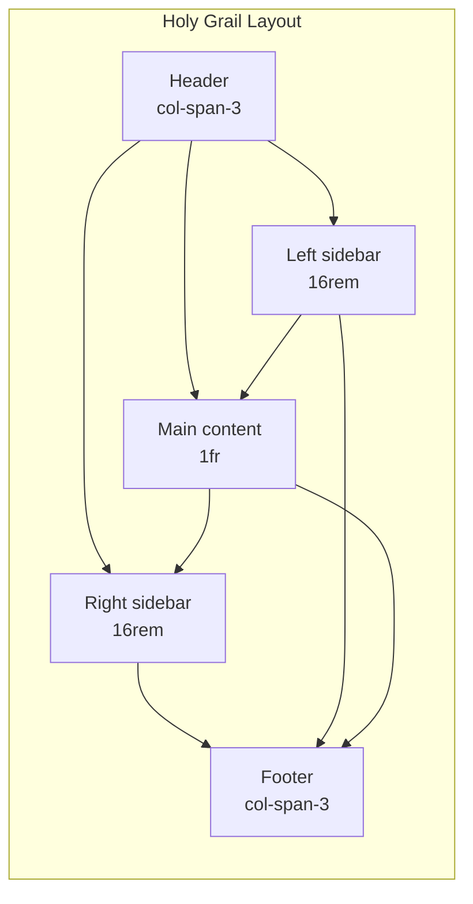
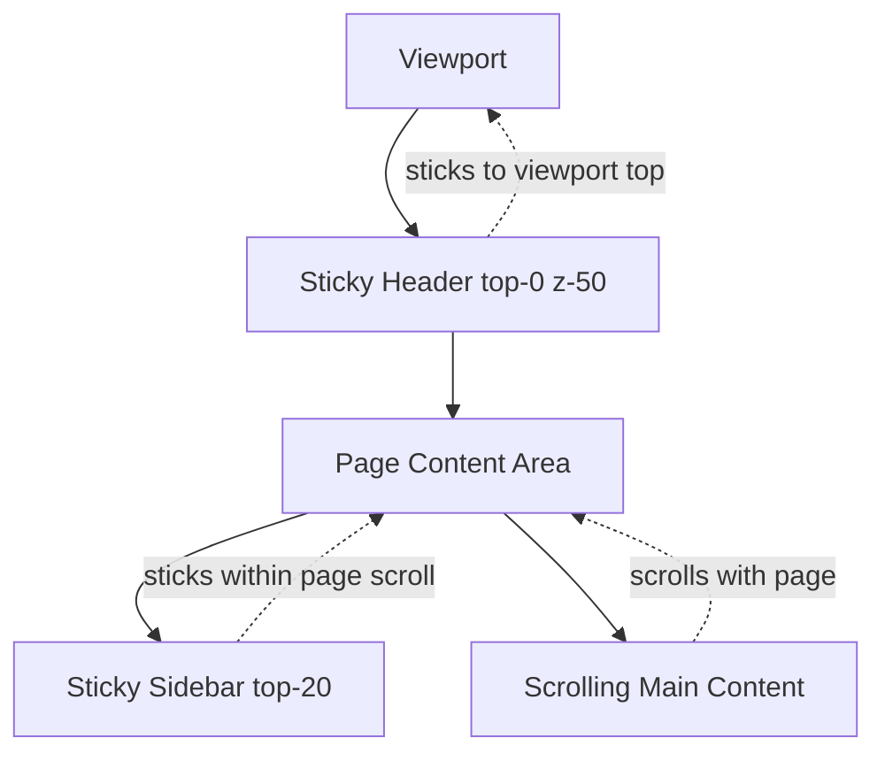

# 2.5 Layout Patterns in Tailwind

> Tailwind does not have "layout components." It has utilities — `flex`, `grid`, `gap-4`, `place-items-center` — and you compose them into any layout pattern you can describe in CSS. This note is a translation guide: it walks through every common layout pattern (centering, max-width container, sidebar, holy grail, sticky header, card grids, stack, cluster, sidebar, grid) and shows the exact Tailwind class string for each. We cover the mental model behind each pattern, why one approach beats another, and the arbitrary-value escape hatch for one-off cases.

## 2.5.1 Objective

By the end of this note you should be able to:

1. Center anything horizontally, vertically, or both, using three different techniques (`mx-auto`, `flex items-center justify-center`, `grid place-items-center`) — and know which to pick.
2. Implement the max-width + mx-auto page container pattern with responsive padding and a configurable max width per breakpoint.
3. Build a sidebar layout two ways: CSS Grid (`grid grid-cols-[200px_1fr]`) and Flexbox (`flex`), and explain when each is preferable.
4. Build the holy grail layout (header, footer, two sidebars, main content) in Tailwind.
5. Implement a sticky header with scrolling content, including the `scroll-margin-top` trick for anchor links.
6. Build responsive card grids with `grid-cols-1 sm:grid-cols-2 lg:grid-cols-3` and the gap utility.
7. Apply the "Every Layout" primitives — stack, cluster, sidebar, grid, cover, frame, impostor, switcher — as Tailwind class strings.
8. Use arbitrary values (`grid-cols-[200px_1fr]`, `top-[117px]`) for one-off layouts that don't fit the default scale.
9. Diagnose the common layout bugs: missing `min-w-0` causing overflow, `flex-shrink-0` forgotten on icons, grid tracks collapsing, sticky elements inside `overflow-hidden`.

## 2.5.2 Background Knowledge

Tailwind's layout utilities map one-to-one to CSS layout properties:

| Utility | CSS |
|---|---|
| `block`, `inline`, `inline-block`, `flex`, `inline-flex`, `grid`, `inline-grid`, `flow-root`, `contents`, `hidden` | `display: ...` |
| `flex-row`, `flex-col`, `flex-row-reverse`, `flex-col-reverse` | `flex-direction: ...` |
| `flex-wrap`, `flex-nowrap`, `flex-wrap-reverse` | `flex-wrap: ...` |
| `justify-start`, `justify-center`, `justify-end`, `justify-between`, `justify-around`, `justify-evenly` | `justify-content: ...` |
| `items-start`, `items-center`, `items-end`, `items-stretch`, `items-baseline` | `align-items: ...` |
| `justify-items-center`, `justify-items-start`, ... | `justify-items: ...` |
| `place-items-center` | `align-items` + `justify-items` |
| `justify-self-start`, `place-self-center`, ... | `justify-self`/`align-self` |
| `flex-1`, `flex-auto`, `flex-initial`, `flex-none` | `flex: 1 1 0%`, etc. |
| `flex-grow`, `flex-grow-0` | `flex-grow: ...` |
| `flex-shrink`, `flex-shrink-0` | `flex-shrink: ...` |
| `flex-basis-1/2`, `basis-1/3` | `flex-basis: ...` |
| `grid-cols-1`, `grid-cols-2`, ..., `grid-cols-12`, `grid-cols-none` | `grid-template-columns: ...` |
| `grid-rows-1`, ..., `grid-rows-6` | `grid-template-rows: ...` |
| `grid-flow-row`, `grid-flow-col`, `grid-flow-dense` | `grid-auto-flow: ...` |
| `gap-4`, `gap-x-4`, `gap-y-4` | `gap`/`column-gap`/`row-gap` |
| `col-span-2`, `col-start-1`, `col-end-3`, `row-span-2`, ... | `grid-column`/`grid-row` |
| `auto-cols-min`, `auto-cols-fr`, `auto-rows-fr` | `grid-auto-columns`/`grid-auto-rows` |
| `w-full`, `w-fit`, `w-screen`, `w-1/2`, `w-32`, `w-[50vw]` | `width: ...` |
| `h-full`, `h-screen`, `h-svh`, `h-dvh`, `h-[100vh]` | `height: ...` |
| `max-w-md`, `max-w-7xl`, `max-w-[1200px]`, `max-w-screen-xl` | `max-width: ...` |
| `min-w-0`, `min-w-full` | `min-width: ...` |
| `min-h-screen`, `min-h-0`, `min-h-[100dvh]` | `min-height: ...` |
| `absolute`, `relative`, `fixed`, `sticky`, `static` | `position: ...` |
| `top-0`, `right-4`, `bottom-1/2`, `left-[-50%]`, `inset-0` | `top`/`right`/`bottom`/`left` |
| `z-0`, `z-10`, `z-50`, `z-[100]` | `z-index: ...` |

If you have read [[1.5 Flexbox]] and [[1.6 Grid]], this table is mostly review — Tailwind's layout utilities are direct wrappers. This note focuses on patterns: how to combine the primitives to solve real layout problems.

The "Every Layout" approach (by Heydon Pickering and Andy Bell) is a useful framework for naming layout primitives. They describe a small set of layouts — stack, cluster, sidebar, grid, cover, frame, impostor, switcher — that cover 90% of page-level layout needs. We will translate each into Tailwind class strings.

> [!note] The `gap` utility (and `gap-x-*`/`gap-y-*`) is the modern replacement for margin-based spacing between flex/grid children. It applies spacing *between* children only, never outside the parent, which solves the "first-child margin" problem. Always prefer `gap` over `space-x-*`/`space-y-*` for new code. `space-*` still works but is harder to reason about with wrapping children.

## 2.5.3 Core Concepts

### 2.5.3.1 The Three Centering Techniques

**Technique 1: `mx-auto` for horizontal centering of a block element.**

```tsx
<div className="max-w-2xl mx-auto">
  Centered horizontally. Width is constrained to max-w-2xl (42rem).
</div>
```

This works because `mx-auto` sets `margin-left: auto; margin-right: auto`, which centers a block element with a defined width. The element must have a width constraint (`max-w-*` or a fixed `w-*`) for `auto` margins to have anything to center.

**Technique 2: `flex items-center justify-center` for centering a child inside a flex parent.**

```tsx
<div className="flex items-center justify-center min-h-screen">
  <div>Centered both horizontally and vertically.</div>
</div>
```

Use this when the parent's height is known (`min-h-screen`, `h-64`, etc.) and you want a child centered in both axes. The parent must be `flex` (or `grid`) and the child must not have `flex-1` (which would stretch it).

**Technique 3: `grid place-items-center` for centering a child inside a grid parent.**

```tsx
<div className="grid place-items-center min-h-screen">
  <div>Centered both horizontally and vertically.</div>
</div>
```

`place-items-center` is shorthand for `align-items: center; justify-items: center`. It works on grid containers. Slightly more concise than the flex version and arguably more semantically correct (grid is designed for placing items).

**Which to pick?**

- For text content in a page container: `mx-auto` + `max-w-*`.
- For centering one element inside a known-height parent: `flex` or `grid` with `place-items-center`/`items-center justify-center`.
- For centering an absolutely positioned element inside a `relative` parent: `inset-0 m-auto` (with `w-fit h-fit`).

### 2.5.3.2 The Max-Width Container Pattern

```tsx
<div className="mx-auto max-w-7xl px-4 sm:px-6 lg:px-8">
  Page content goes here. Constrained to 80rem (max-w-7xl), centered,
  with responsive horizontal padding.
</div>
```

This is the single most-used layout pattern in web development. The `max-w-7xl` constrains the content to 80rem (1280px); the `mx-auto` centers it; the responsive `px-*` adds horizontal padding that grows with the viewport (16px on mobile, 24px at sm, 32px at lg).

For a narrower content column (blog posts, article body):

```tsx
<article className="mx-auto max-w-prose px-4">
  <h1>Article title</h1>
  <p>Body text...</p>
</article>
```

`max-w-prose` is a special Tailwind value (`65ch`) that constrains the line length to ~65 characters, which is the optimal reading width for body text.

### 2.5.3.3 The Sidebar Layout

**With CSS Grid:**

```tsx
<div className="grid grid-cols-[16rem_1fr] gap-6">
  <aside className="bg-slate-100 p-4">Sidebar</aside>
  <main className="p-4">Main content</main>
</div>
```

`grid-cols-[16rem_1fr]` is an arbitrary value — two columns: the first is `16rem` (256px), the second is `1fr` (takes the remaining space). The `_` is interpreted as a space inside the brackets.

Responsive: hide the sidebar on mobile, show it from `lg`:

```tsx
<div className="grid grid-cols-1 lg:grid-cols-[16rem_1fr] gap-6">
  <aside className="hidden lg:block">Sidebar</aside>
  <main>Main</main>
</div>
```

**With Flexbox:**

```tsx
<div className="flex gap-6">
  <aside className="w-64 flex-shrink-0">Sidebar</aside>
  <main className="flex-1 min-w-0">Main content</main>
</div>
```

`flex-shrink-0` on the sidebar prevents it from shrinking below its 16rem width. `flex-1` on the main lets it take the remaining space. `min-w-0` on the main is critical — see 2.5.7.1.

**Which to pick?** Grid is cleaner for fixed-track layouts. Flex is better when the sidebar width is itself fluid or when you need to control the order with `flex-row-reverse` for RTL. Use whichever you find more readable; performance is identical.

### 2.5.3.4 The Holy Grail Layout

Header, footer, left sidebar, right sidebar, main content in the middle.

```tsx
<div className="grid min-h-screen grid-rows-[auto_1fr_auto] grid-cols-[16rem_1fr_16rem] gap-0">
  <header  className="col-span-3 bg-slate-800 text-white p-4">Header</header>
  <aside   className="bg-slate-100 p-4">Left sidebar</aside>
  <main    className="p-6">Main content</main>
  <aside   className="bg-slate-100 p-4">Right sidebar</aside>
  <footer  className="col-span-3 bg-slate-800 text-white p-4">Footer</footer>
</div>
```

`grid-rows-[auto_1fr_auto]` defines three rows: header auto-sized, middle takes the remaining space (1fr), footer auto-sized. `grid-cols-[16rem_1fr_16rem]` defines three columns. `col-span-3` makes the header and footer span all three columns.

Responsive: stack everything on mobile, show sidebars from `lg`:

```tsx
<div className="grid min-h-screen grid-rows-[auto_1fr_auto] grid-cols-1 lg:grid-cols-[16rem_1fr_16rem]">
  <header  className="bg-slate-800 text-white p-4 lg:col-span-3">Header</header>
  <aside   className="bg-slate-100 p-4 hidden lg:block">Left</aside>
  <main    className="p-6">Main</main>
  <aside   className="bg-slate-100 p-4 hidden lg:block">Right</aside>
  <footer  className="bg-slate-800 text-white p-4 lg:col-span-3">Footer</footer>
</div>
```

### 2.5.3.5 Sticky Header with Scrolling Content

```tsx
<div className="min-h-screen">
  <header className="sticky top-0 z-50 bg-white/95 backdrop-blur border-b border-slate-200">
    <nav className="mx-auto max-w-7xl px-4 h-16 flex items-center justify-between">
      <span>Brand</span>
      <nav>...</nav>
    </nav>
  </header>

  <main className="mx-auto max-w-7xl px-4 py-8">
    <h2 id="section-1" className="scroll-mt-20 text-2xl font-bold mb-4">Section 1</h2>
    <p>Content...</p>
  </main>
</div>
```

Three subtleties:

1. **`sticky top-0 z-50`** — `position: sticky; top: 0; z-index: 50`. The header sticks to the top of the viewport when scrolled. The `z-50` ensures it stays above other content.
2. **`backdrop-blur` + `bg-white/95`** — a translucent background with a blur creates the "frosted glass" effect that lets content scroll beneath the header.
3. **`scroll-mt-20`** — `scroll-margin-top: 5rem`. When the user clicks an anchor link (`#section-1`), the browser scrolls the section into view. Without `scroll-mt-20`, the section's top would be hidden behind the 4rem-tall sticky header. `scroll-mt-20` adds 5rem of margin (only when scrolling to the element, not in normal layout) so the section appears below the header.

> [!warning] `sticky` does not work if any ancestor has `overflow: hidden`, `overflow: auto`, or `overflow: scroll`. The sticky element is "sticky" relative to its nearest scrolling ancestor. If that ancestor is not the viewport, the behavior is unexpected. If your sticky element isn't sticking, check the ancestor chain for `overflow`.

### 2.5.3.6 Responsive Card Grid

```tsx
<div className="grid grid-cols-1 sm:grid-cols-2 lg:grid-cols-3 xl:grid-cols-4 gap-4 sm:gap-6">
  <Card />
  <Card />
  <Card />
  <Card />
  <Card />
</div>
```

The grid has 1 column on mobile, 2 from `sm`, 3 from `lg`, 4 from `xl`. The gap grows from 16px to 24px at `sm`. This pattern covers the vast majority of card grids.

For an auto-fit grid that fills available space:

```tsx
<div className="grid grid-cols-[repeat(auto-fill,minmax(16rem,1fr))] gap-4">
  <Card />
  ...
</div>
```

This is the CSS Grid `auto-fill` + `minmax` pattern translated to Tailwind arbitrary values. The grid creates as many 16rem-wide columns as fit, with the last column taking `1fr` to fill remaining space. Use this when you don't know how many cards you'll have and want them to flow naturally.

### 2.5.3.7 The `gap` Utility (Replaces Margins)

```tsx
// Old way: margin-based spacing with :first-child exceptions
<ul className="[&>li]:mb-4 [&>li:first-child]:mt-0">
  <li>One</li>
  <li>Two</li>
</ul>

// New way: gap
<ul className="flex flex-col gap-4">
  <li>One</li>
  <li>Two</li>
</ul>
```

`gap-4` applies 1rem of space *between* children only. No first-child or last-child exceptions needed. Works for both flex and grid.

`gap-x-*` and `gap-y-*` set horizontal and vertical gap independently. Useful in wrapping flex layouts:

```tsx
<div className="flex flex-wrap gap-x-4 gap-y-2">
  <Tag>a</Tag>
  <Tag>b</Tag>
  <Tag>c</Tag>
</div>
```

### 2.5.3.8 The Every Layout Primitives

The Every Layout book describes seven core primitives. Here are the Tailwind translations:

**Stack** — vertical rhythm, no margins:

```tsx
<div className="flex flex-col gap-4">
  <div>A</div>
  <div>B</div>
  <div>C</div>
</div>
```

**Cluster** — horizontal items that wrap:

```tsx
<div className="flex flex-wrap gap-2">
  {tags.map(t => <span key={t}>{t}</span>)}
</div>
```

**Sidebar** — two columns where one is fixed-width and the other flexes:

```tsx
<div className="flex flex-wrap gap-6">
  <aside className="w-64 flex-shrink-0">Sidebar</aside>
  <main className="flex-1 min-w-0">Main</main>
</div>
```

**Grid** — responsive auto-fit cards:

```tsx
<div className="grid grid-cols-[repeat(auto-fit,minmax(16rem,1fr))] gap-4">
  ...
</div>
```

**Cover** — single centered content with header above and footer below:

```tsx
<div className="flex flex-col min-h-screen">
  <header>Header</header>
  <main className="flex-1 flex items-center justify-center">
    Centered content
  </main>
  <footer>Footer</footer>
</div>
```

**Frame** — aspect-ratio box that preserves media:

```tsx
<div className="aspect-video">
  
</div>
```

**Switcher** — horizontal that switches to vertical when too narrow:

```tsx
<div className="flex flex-col sm:flex-row gap-4">
  <div>A</div>
  <div>B</div>
</div>
```

These seven primitives cover most page-level layout needs. Internalize them and you will rarely need to invent a new layout.

### 2.5.3.9 Arbitrary Values for One-Offs

When a value doesn't fit the default scale, use the bracket syntax:

```tsx
// Specific width
<div className="w-[327px]" />

// Specific gap
<div className="gap-[18px]" />

// Custom grid template
<div className="grid grid-cols-[200px_1fr_120px]" />

// Specific z-index
<div className="z-[110]" />

// Specific top for a sticky element
<div className="top-[117px]" />

// Arbitrary CSS property
<div className="[mask-type:luminance]" />
<div className="[scroll-behavior:smooth]" />
<div className="[contain:layout_paint]" />
```

Use arbitrary values for one-off cases. If you use the same arbitrary value three or more times, add it to the theme — see [[2.2 Configuration and Theme Customization]].

## 2.5.4 Detailed Walkthrough

### 2.5.4.1 Centering, In Detail

| Goal | Best utility combination |
|---|---|
| Center text horizontally | `text-center` |
| Center a block element horizontally | `mx-auto` + `max-w-*` |
| Center a child in a fixed-height parent | `flex items-center justify-center` or `grid place-items-center` |
| Center an absolutely positioned element | `absolute inset-0 m-auto w-fit h-fit` |
| Center an element vertically in a full-height section | `min-h-screen flex items-center` |

The `absolute inset-0 m-auto` trick is worth understanding. `inset-0` sets `top:0; right:0; bottom:0; left:0` — the element is positioned to fill the parent. `m-auto` then distributes the remaining space evenly on all sides, centering the element. `w-fit h-fit` (or a fixed width/height) is needed so the element doesn't actually stretch to fill the parent.

### 2.5.4.2 The `min-w-0` Trick (Crucial)

By default, flex items have `min-width: auto`, which means they cannot shrink smaller than their content. This causes layout breakage when a flex child contains long text:

```tsx
//  Broken: the main column overflows because the long URL has min-width: auto
<div className="flex gap-6">
  <aside className="w-64 flex-shrink-0">Sidebar</aside>
  <main className="flex-1">
    <p>https://example.com/very/long/url/that/goes/on/and/on/and/on/and/on/and/on</p>
  </main>
</div>
```

The URL forces `<main>` to be wider than its calculated `1fr` share, which pushes the layout wider than the viewport. The fix: `min-w-0`.

```tsx
//  Works: min-w-0 allows main to shrink below its content width
<div className="flex gap-6">
  <aside className="w-64 flex-shrink-0">Sidebar</aside>
  <main className="flex-1 min-w-0">
    <p className="break-all">https://example.com/very/long/url...</p>
  </main>
</div>
```

`min-w-0` overrides the default `min-width: auto`. The flex item can now shrink, and the long URL wraps (or breaks with `break-all`).

> [!danger] `min-w-0` is the most underused utility in Tailwind. Every flex child that contains text or media needs it. Without it, layouts break unpredictably when content is long. Make it a reflex: `flex-1` ⇒ `min-w-0`.

### 2.5.4.3 The Sidebar with Resizable Width

For a sidebar whose width the user can control (drag to resize):

```tsx
<div className="flex gap-0 h-screen">
  <aside
    className="flex-shrink-0 border-r border-slate-200 overflow-hidden transition-[width] duration-200"
    style={{ width: `${sidebarWidth}px` }}
  >
    <nav className="w-64 p-4">Sidebar content</nav>
  </aside>
  <div
    className="w-1 cursor-col-resize bg-slate-200 hover:bg-blue-500"
    onMouseDown={startResize}
  />
  <main className="flex-1 min-w-0 overflow-auto p-6">
    Main content
  </main>
</div>
```

The sidebar width is controlled by `style.width` (an inline style) updated by a drag handler. The `transition-[width]` adds a smooth animation when the width changes (e.g., when a user clicks a "collapse" button). The drag handle is a separate 4px-wide div with `cursor-col-resize`.

### 2.5.4.4 The Sticky Sidebar

A common pattern: header at top, sticky sidebar on the left, scrolling main content.

```tsx
<div className="min-h-screen">
  <header className="sticky top-0 z-50 h-16 bg-white border-b border-slate-200">
    Header
  </header>

  <div className="mx-auto max-w-7xl flex gap-6 px-4">
    <aside className="hidden lg:block w-64 flex-shrink-0">
      {/* Sticky within the page scroll */}
      <div className="sticky top-20 max-h-[calc(100vh-6rem)] overflow-y-auto py-6">
        Sidebar nav
      </div>
    </aside>

    <main className="flex-1 min-w-0 py-6">
      Main content (scrolls with page)
    </main>
  </div>
</div>
```

The sidebar's *inner* div is `sticky top-20` (5rem, which is header height + a small gap). The `max-h-[calc(100vh-6rem)]` and `overflow-y-auto` make the sidebar scroll independently if its content is taller than the viewport.

### 2.5.4.5 The Card Grid with Featured Card

A grid where one card spans two columns:

```tsx
<div className="grid grid-cols-1 sm:grid-cols-2 lg:grid-cols-3 gap-4">
  <Card className="lg:col-span-2" featured>Featured card (spans 2 cols on lg)</Card>
  <Card>Regular card</Card>
  <Card>Regular card</Card>
  <Card>Regular card</Card>
  <Card>Regular card</Card>
</div>
```

`lg:col-span-2` makes the featured card span two columns at the `lg` breakpoint. On mobile (single column), it spans one column normally.

### 2.5.4.6 The Two-Column Form

```tsx
<form className="grid grid-cols-1 sm:grid-cols-2 gap-4">
  <Field label="First name" />
  <Field label="Last name" />
  <Field label="Email" className="sm:col-span-2" />
  <Field label="Phone" />
  <Field label="Country" />
  <div className="sm:col-span-2 flex justify-end gap-2 mt-2">
    <Button variant="secondary">Cancel</Button>
    <Button>Save</Button>
  </div>
</form>
```

Email spans both columns because it's typically a wider input. The action buttons span both columns and align right.

### 2.5.4.7 The Hero Section

```tsx
<section className="relative isolate overflow-hidden">
  {/* Background image */}
  
  {/* Overlay for text contrast */}
  <div className="absolute inset-0 -z-10 bg-gradient-to-b from-black/60 to-black/30" />

  <div className="mx-auto max-w-7xl px-4 py-24 sm:py-32 lg:py-48">
    <div className="max-w-2xl">
      <h1 className="text-4xl font-bold tracking-tight text-white sm:text-6xl">
        Build faster with our platform
      </h1>
      <p className="mt-6 text-lg leading-8 text-white/80">
        Start shipping today with our comprehensive toolkit.
      </p>
      <div className="mt-10 flex items-center gap-4">
        <Button size="lg">Get started</Button>
        <Button size="lg" variant="ghost" className="text-white hover:bg-white/10">
          Learn more
        </Button>
      </div>
    </div>
  </div>
</section>
```

Three subtleties:

1. **`isolate`** creates a new stacking context so `-z-10` children don't escape behind the page background.
2. **`-z-10` on the background image** places it behind the content but inside the isolated section.
3. **`object-cover`** on the image makes it fill the section while preserving aspect ratio.

## 2.5.5 Practical Examples

### 2.5.5.1 A Page Shell

```tsx
export function PageShell({ children }: { children: React.ReactNode }) {
  return (
    <div className="min-h-screen flex flex-col">
      <Header />
      <main className="flex-1 mx-auto w-full max-w-7xl px-4 sm:px-6 lg:px-8 py-8">
        {children}
      </main>
      <Footer />
    </div>
  );
}
```

This is the layout 80% of pages need. Header at top, footer at bottom, content fills the remaining space.

### 2.5.5.2 A Modal Dialog

```tsx
export function Modal({ children, onClose }: ModalProps) {
  return (
    <div
      className="fixed inset-0 z-50 flex items-center justify-center bg-black/50 backdrop-blur-sm p-4"
      onClick={onClose}
    >
      <div
        className="w-full max-w-lg rounded-lg bg-white shadow-xl max-h-[90vh] overflow-y-auto"
        onClick={(e) => e.stopPropagation()}
      >
        {children}
      </div>
    </div>
  );
}
```

The outer `fixed inset-0` overlay covers the viewport. `flex items-center justify-center` centers the modal. `bg-black/50` is the dimming overlay. The inner div has `max-w-lg` and `max-h-[90vh]` with `overflow-y-auto` for tall content. `e.stopPropagation()` on the inner click prevents the close-on-overlay-click behavior from firing when the user clicks inside the modal.

### 2.5.5.3 A Tag Input (Cluster)

```tsx
export function TagList({ tags, onRemove }: TagListProps) {
  return (
    <div className="flex flex-wrap gap-2">
      {tags.map((tag) => (
        <span
          key={tag}
          className="inline-flex items-center gap-1 rounded-full bg-blue-100 px-3 py-1 text-sm text-blue-900"
        >
          {tag}
          <button
            onClick={() => onRemove(tag)}
            className="text-blue-500 hover:text-blue-700"
            aria-label={`Remove ${tag}`}
          >
            ×
          </button>
        </span>
      ))}
    </div>
  );
}
```

`flex flex-wrap gap-2` is the cluster primitive. Tags wrap to new lines as needed. Each tag is itself a small flex container (`inline-flex items-center gap-1`).

### 2.5.5.4 A Two-Column Documentation Layout

```tsx
export function DocsLayout({ children, sidebar }: DocsLayoutProps) {
  return (
    <div className="mx-auto max-w-7xl lg:flex lg:gap-8 px-4">
      <aside className="hidden lg:block w-64 flex-shrink-0">
        <div className="sticky top-20 max-h-[calc(100vh-6rem)] overflow-y-auto pb-8">
          {sidebar}
        </div>
      </aside>
      <article className="flex-1 min-w-0 py-8 prose prose-slate dark:prose-invert max-w-none">
        {children}
      </article>
    </div>
  );
}
```

Documentation sites use this pattern: sticky table of contents on the left, scrollable content on the right with the `prose` typography styles (from the `@tailwindcss/typography` plugin).

## 2.5.6 Mermaid Diagrams

### 2.5.6.1 The Layout Primitives Map

```mermaid
flowchart TD
    A[Layout need] --> B{One child to center?}
    B -- yes --> C{In known-height parent?}
    C -- yes --> D[flex items-center justify-center<br/>or grid place-items-center]
    C -- no --> E[absolute inset-0 m-auto w-fit h-fit]

    B -- no --> F{Two-column<br/>sidebar layout?}
    F -- yes --> G{Fixed sidebar width?}
    G -- yes --> H[grid grid-cols-[16rem_1fr]]
    G -- no --> I[flex with flex-1 and flex-shrink-0]

    F -- no --> J{Multiple cards?}
    J -- yes --> K[grid with grid-cols-1 sm:grid-cols-2 lg:grid-cols-3]

    J -- no --> L{Vertical list?}
    L -- yes --> M[flex flex-col gap-4]
    L -- no --> N{Horizontal wrapping items?}
    N -- yes --> O[flex flex-wrap gap-2]
    N -- no --> P[Use a custom layout]
```

### 2.5.6.2 The Holy Grail Layout Structure



### 2.5.6.3 The Sticky Header + Sidebar Mental Model



## 2.5.7 Common Mistakes

1. **Forgetting `min-w-0` on flex children.** A flex item with `flex-1` but no `min-w-0` cannot shrink below its content width, causing overflow when content is long. Make `flex-1` always pair with `min-w-0`. See 2.5.4.2.

2. **Forgetting `flex-shrink-0` on fixed-width sidebars.** Without it, the sidebar shrinks when the layout is too narrow, which defeats the purpose of having a fixed-width sidebar.

3. **Sticky inside `overflow-hidden`.** `position: sticky` requires the nearest scrolling ancestor to be the viewport (or the element you want to stick within). If an ancestor has `overflow: hidden/auto/scroll`, the sticky element sticks within that ancestor's box, which is usually not what you want.

4. **Using `space-x-*` with wrapping flex.** `space-x-*` adds margin to every child except the first. When the children wrap, the "first child of each new line" still gets no left margin, causing left-aligned-but-not-flush wrapping. Use `gap-x-* gap-y-*` instead.

5. **Missing `scroll-mt-*` on anchor targets.** Without `scroll-mt-20`, anchor links (#section) scroll the target to the very top of the viewport, hidden behind the sticky header. Add `scroll-mt-20` (or whatever your header height is) to every anchorable element.

6. **Using `h-screen` for full-height layouts.** `h-screen` is `100vh`, which on mobile includes the URL bar's height — when the URL bar shows, the bottom of your content is hidden. Use `h-dvh` (or `min-h-dvh`) for dynamic viewport height that adjusts to the URL bar. See [[1.7 Responsive Design and Container Queries]].

7. **Setting `z-index` without `relative`/`absolute`/`fixed`/`sticky`.** `z-index` has no effect on `position: static` elements (the default). Always pair `z-*` with a positioning utility.

8. **Stacking too many `z-50`s.** Every modal, dropdown, tooltip, and toast set to `z-50` produces inconsistency. Establish a z-index scale (e.g., `z-10` for dropdowns, `z-20` for sticky headers, `z-30` for modals, `z-40` for toasts) and stick to it.

9. **Using `grid-cols-12` for everything.** 12-column grids are a Bootstrap-era convention. Modern Tailwind code rarely needs them — `grid-cols-[200px_1fr]` is more readable than `col-span-3` arithmetic. Use 12-column only when you genuinely need 12 equal columns.

10. **Forgetting `isolate` for stacking contexts.** When you use `-z-10` for a background image, you usually want it inside the section's stacking context, not behind the page. Add `isolate` to the section to create a new stacking context.

## 2.5.8 Best Practices

1. **Make `flex-1 min-w-0` a reflex.** Every flex child that should take remaining space needs both. Without `min-w-0`, you will debug overflow bugs.

2. **Prefer `gap` over `space-x-*`/`space-y-*`.** `gap` works for both flex and grid, handles wrapping correctly, and is simpler to reason about.

3. **Use `dvh`/`svh`/`lvh` for full-height layouts on mobile.** `100vh` is broken on mobile browsers due to the dynamic URL bar. `100dvh` adjusts.

4. **Establish a z-index scale and document it.** Even a simple comment in `globals.css` helps: `/* z-10: dropdowns, z-20: sticky header, z-30: modal, z-40: toast */`.

5. **Use `isolate` on sections that contain absolutely-positioned backgrounds.** This prevents `-z-10` from escaping behind the page.

6. **Add `scroll-mt-*` to every element with an `id`.** Any element that could be an anchor target needs scroll margin to clear the sticky header.

7. **Use `prose` for long-form text.** The `@tailwindcss/typography` plugin's `prose` class is the right starting point for blog posts, docs, articles. Override individual elements with `prose-headings:text-blue-600` etc.

8. **Test layouts at every breakpoint.** 360, 480, 640, 768, 1024, 1280, 1536, 1920. Use Chrome's device toolbar.

9. **Use `aspect-*` for media containers.** `aspect-video`, `aspect-square`, `aspect-[4/3]` set the aspect ratio and let the browser allocate space before the media loads, preventing cumulative layout shift.

10. **Use the `[&>*]` arbitrary variant sparingly.** It works (`[&>*]:mb-4` adds margin-bottom to all direct children), but it's a sign you should reach for `gap` or extract a component instead.

## 2.5.9 Mini Exercises

### Exercise 2.5.1: Center a Login Form

Build a full-screen login page with a centered card (max-w-sm) on a slate-50 background. Use three different techniques and explain which is best.

**Worked solution:**

**Technique 1 — Flex:**

```tsx
<div className="min-h-screen flex items-center justify-center bg-slate-50 px-4">
  <div className="w-full max-w-sm rounded-lg bg-white p-8 shadow-md">
    <h1 className="text-2xl font-bold">Sign in</h1>
    {/* form fields */}
  </div>
</div>
```

**Technique 2 — Grid:**

```tsx
<div className="min-h-screen grid place-items-center bg-slate-50 px-4">
  <div className="w-full max-w-sm rounded-lg bg-white p-8 shadow-md">
    ...
  </div>
</div>
```

**Technique 3 — Absolute:**

```tsx
<div className="relative min-h-screen bg-slate-50">
  <div className="absolute inset-0 m-auto w-full max-w-sm h-fit rounded-lg bg-white p-8 shadow-md">
    ...
  </div>
</div>
```

Which is best? **Technique 1 (flex)** or **Technique 2 (grid)**. Both are equally correct. Technique 3 (absolute) is worse because:

- It removes the card from normal flow, so the parent doesn't know about its height.
- `h-fit` is needed but slightly less obvious than the flex/grid version.
- If the card grows taller than the viewport (e.g., zoom in), it can overflow without scroll.

Between flex and grid, choose based on what else is on the page. If you might add a second child (e.g., a footer below the card), use `flex flex-col` so the children stack. If you only ever have one centered child, `grid place-items-center` is slightly more concise.

### Exercise 2.5.2: Build a Responsive Card Grid

Build a card grid that is 1 column on mobile, 2 on sm, 3 on lg, 4 on xl. Add a featured card that spans 2 columns on lg+.

**Worked solution:**

```tsx
<div className="grid grid-cols-1 sm:grid-cols-2 lg:grid-cols-3 xl:grid-cols-4 gap-4 sm:gap-6">
  <Card className="lg:col-span-2 xl:col-span-2" featured>Featured (spans 2)</Card>
  <Card>1</Card>
  <Card>2</Card>
  <Card>3</Card>
  <Card>4</Card>
  <Card>5</Card>
  <Card>6</Card>
</div>
```

Cascade:

- Mobile (1 col): all cards in a single column, including featured.
- sm (2 cols): featured takes one column, regular cards flow around it.
- lg (3 cols): featured spans 2 columns. Layout: `[Featured Featured] [1]` / `[2] [3] [4]` / `[5] [6]`.
- xl (4 cols): featured spans 2 columns. Layout: `[Featured Featured] [1] [2]` / `[3] [4] [5] [6]`.

Note: the featured card's `col-span-2` only "works" if there are at least 2 columns to span. Below `lg`, we have only 1 column, so `col-span-2` is silently ignored (no effect).

Common mistake: writing `col-span-2` without a responsive prefix. Then on mobile (1 col), the featured card tries to span 2 columns but there's only 1, so it spans 1. The visual result is the same, but the CSS still emits the rule. It's cleaner to scope it with `lg:col-span-2`.

### Exercise 2.5.3: Diagnose the Overflow Bug

A developer writes:

```tsx
<div className="flex gap-4 p-4">
  <aside className="w-64">Sidebar</aside>
  <main className="flex-1">
    <pre className="overflow-x-auto">
      <code>{veryLongCodeString}</code>
    </pre>
  </main>
</div>
```

They report: "When the code is very long, the layout overflows horizontally and the sidebar gets squished." Diagnose and fix.

**Worked solution:**

Diagnosis: Two missing utilities.

1. **`min-w-0` on `<main>`.** By default, flex items have `min-width: auto`, which means they cannot shrink below their content. The `<pre>` content is intrinsically very wide (long lines don't wrap by default), so `<main>` is forced wider than its calculated `1fr` share. The flex container then becomes wider than the viewport, causing horizontal overflow.

2. **`flex-shrink-0` on `<aside>`.** Without it, when `<main>` tries to be wider than the viewport, the sidebar gets compressed to compensate. The sidebar should stay at its 16rem width regardless.

Fix:

```tsx
<div className="flex gap-4 p-4">
  <aside className="w-64 flex-shrink-0">Sidebar</aside>
  <main className="flex-1 min-w-0">
    <pre className="overflow-x-auto">
      <code>{veryLongCodeString}</code>
    </pre>
  </main>
</div>
```

After the fix: the sidebar stays at 16rem. `<main>` takes the remaining space. The `<pre>` inside `<main>` overflows internally (scrolls horizontally) but does not push the layout wider, because `<main>` has `min-w-0` and can shrink.

Common wrong diagnosis: "Add `overflow-x-hidden` to the parent." This hides the overflow but doesn't fix the root cause. The sidebar is still being squished because the flex algorithm thinks `<main>` needs to be wider. The fix is `min-w-0` + `flex-shrink-0`, not clipping.

### Exercise 2.5.4: Build a Sticky Header + Sidebar Layout

Build a documentation page layout with: a sticky header at the top, a sticky sidebar nav on the left (visible from `lg`), and scrollable content on the right. The header is 4rem tall.

**Worked solution:**

```tsx
export function DocsLayout({ sidebar, children }: DocsLayoutProps) {
  return (
    <div className="min-h-screen">
      <header className="sticky top-0 z-40 h-16 border-b border-slate-200 bg-white/95 backdrop-blur">
        <div className="mx-auto flex h-16 max-w-7xl items-center justify-between px-4">
          <span className="font-bold">Docs</span>
          <ThemeToggle />
        </div>
      </header>

      <div className="mx-auto max-w-7xl px-4 lg:flex lg:gap-8">
        <aside className="hidden lg:block w-64 flex-shrink-0">
          <nav className="sticky top-20 max-h-[calc(100vh-6rem)] overflow-y-auto py-8">
            {sidebar}
          </nav>
        </aside>

        <main className="flex-1 min-w-0 py-8">
          <article className="prose prose-slate dark:prose-invert max-w-none">
            {children}
          </article>
        </main>
      </div>
    </div>
  );
}
```

Key utilities:

- Header: `sticky top-0 z-40 h-16`. Sticks to top, sits above content, fixed 4rem height.
- Sidebar nav: `sticky top-20 max-h-[calc(100vh-6rem)] overflow-y-auto`. Sticks below the header (top-20 = 5rem = 4rem header + 1rem gap). Max height = viewport minus 6rem (4rem header + 2rem padding). If sidebar content is taller than that, it scrolls internally.
- Main: `flex-1 min-w-0 py-8`. Takes the remaining width, can shrink below content width.

The `prose` class on the article is from `@tailwindcss/typography`. It applies sensible default typography to headings, paragraphs, lists, code blocks, etc., inside the article.

Common mistake: forgetting `top-20` on the sidebar and using `top-0` instead. Then the sidebar sticks to the very top of the viewport, hidden behind the header. The `top-20` offset equals the header height (plus a small gap for visual breathing room).

### Exercise 2.5.5: Convert an Arbitrary-Value Layout to Theme Tokens

A developer writes the same arbitrary grid template in five places:

```tsx
<div className="grid grid-cols-[16rem_1fr_12rem] gap-4" />
```

Convert this to a theme token so they can write `grid-cols-sidebar` instead.

**Worked solution:**

v3:

```js
// tailwind.config.js
module.exports = {
  theme: {
    extend: {
      gridTemplateColumns: {
        sidebar: '16rem 1fr 12rem',
      },
    },
  },
};
```

v4:

```css
@theme {
  --grid-template-columns-sidebar: 16rem 1fr 12rem;
}
```

Now usage:

```tsx
<div className="grid grid-cols-sidebar gap-4" />
```

Three notes:

1. **Theme keys are singular for grid template columns** (`gridTemplateColumns`, not `gridTemplatesColumn`). The utility is `grid-cols-*`.
2. **In v4, the theme variable name maps to the utility** via the prefix `--grid-template-columns-`. The suffix `sidebar` becomes the utility suffix. So `--grid-template-columns-sidebar` generates `grid-cols-sidebar`.
3. **Repeating values signal a token opportunity.** If the same arbitrary value appears 3+ times, it's a token. Add it to the theme so it has a name and is consistent.

## 2.5.10 Summary

Tailwind's layout utilities map directly to CSS layout properties, and the patterns are compositions of those utilities. The three centering techniques (`mx-auto`, flex+items-center+justify-center, grid+place-items-center) cover most centering needs. The sidebar pattern is `grid grid-cols-[N_1fr]` or `flex` with `flex-1 min-w-0` (always include `min-w-0`!). The holy grail is a 3-column, 3-row grid. Sticky elements need `top-*` to offset from the top, `scroll-mt-*` on anchor targets to clear the sticky header, and no `overflow` ancestor. The Every Layout primitives (stack, cluster, sidebar, grid, cover, frame, switcher) cover the vast majority of page-level layouts. Arbitrary values handle one-offs; recurring arbitrary values should become theme tokens. The next note, [[2.6 Animations and Plugins]], shows how to add motion and how to extend Tailwind with plugins.

## 2.5.11 Related Notes

- [[2.1 Tailwind Philosophy and Setup]] — how layout utilities are generated by the JIT engine.
- [[2.2 Configuration and Theme Customization]] — adding custom grid templates, spacing values, and z-index scales.
- [[2.3 Responsive Utilities and Dark Mode]] — the responsive prefixes that make layouts adaptive.
- [[2.4 Component Composition]] — packaging layout patterns into reusable `Card`, `Modal`, `Drawer` components.
- [[1.5 Flexbox]] — the underlying CSS that `flex`/`items-center`/`flex-1` generate.
- [[1.6 Grid]] — the underlying CSS that `grid`/`grid-cols-*`/`col-span-*` generate.
- [[1.7 Responsive Design and Container Queries]] — `dvh`, container queries, and the responsive mental model.
