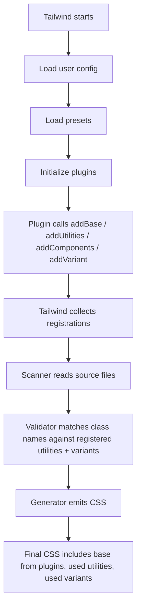
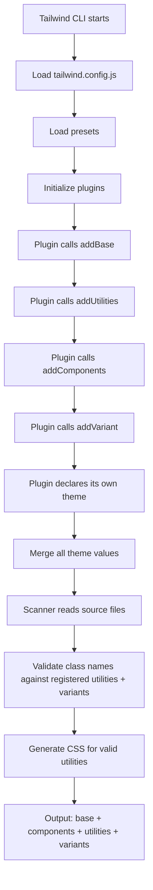
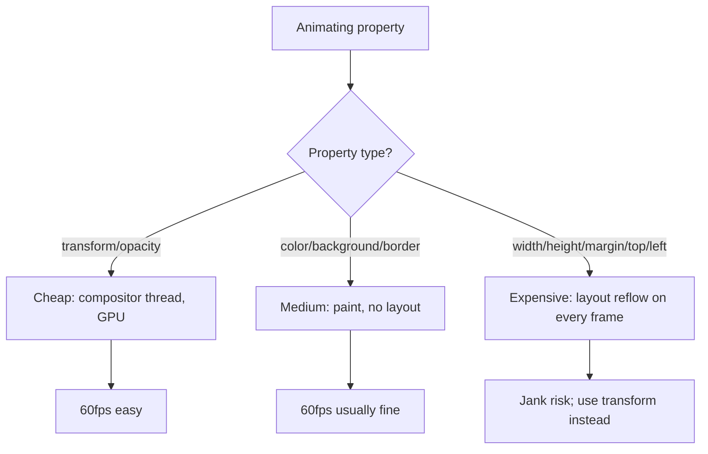
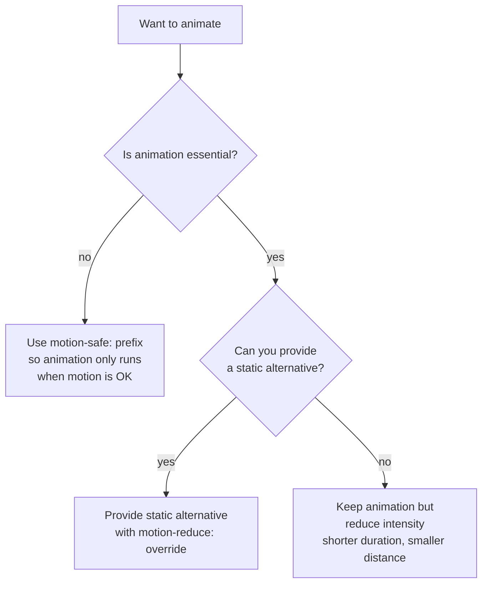

# 2.6 Animations and Plugins

> Tailwind ships four built-in animation utilities, the full transition-property/duration/timing-function/delay family, and a plugin API for adding your own. This note covers the built-in animations (`animate-spin`, `animate-ping`, `animate-pulse`, `animate-bounce`), the transition utilities, custom keyframes and animations in the config, arbitrary animation values, the official plugins (Forms, Typography, Aspect Ratio, Line Clamp, Container Queries — several of which are now in core), and how to write your own plugin with `addUtilities`, `addComponents`, `addBase`, and `addVariant`.

## 2.6.1 Objective

By the end of this note you should be able to:

1. List the four built-in animations and explain when each is appropriate (`animate-spin` for spinners, `animate-ping` for notification dots, `animate-pulse` for skeleton loaders, `animate-bounce` for attention — used sparingly).
2. Use the full transition utility family: `transition`, `transition-colors`, `transition-opacity`, `transition-transform`, `transition-all`, `duration-*`, `ease-*`, `delay-*`, `will-change-*`.
3. Add custom keyframes and animations to your Tailwind config and use them via `animate-*`.
4. Use arbitrary animation values for one-off cases: `animate-[wiggle_1s_ease-in-out_infinite]`.
5. Install and configure the `@tailwindcss/forms`, `@tailwindcss/typography`, `@tailwindcss/aspect-ratio`, `@tailwindcss/line-clamp`, and `@tailwindcss/container-queries` plugins — and know which are now in core (so the plugin is unnecessary in v3.4+/v4).
6. Write a custom plugin using `addUtilities` (for utility classes), `addComponents` (for component classes), `addBase` (for base styles), and `addVariant` (for variant prefixes).
7. Distribute a plugin as an npm package and consume it in another project.
8. Reason about animation performance: which properties are cheap (`transform`, `opacity`), which are expensive (`width`, `top`, `margin`), and how to use `will-change` correctly.
9. Honor `prefers-reduced-motion` by providing reduced-motion variants or disabling non-essential animations.

## 2.6.2 Background Knowledge

CSS animations and transitions are different mechanisms. Both are covered in depth in [[1.9 Animations, Transitions, and Transforms]]; here is the quick review:

- **Transition**: an interpolation between two values of a property, triggered by a state change (`:hover`, `:focus`, class toggle). You specify the property, duration, timing function, and delay. You cannot define intermediate keyframes.
- **Animation**: a sequence of keyframes that can loop, reverse, pause, and have multiple iterations. You define `@keyframes` and apply them with `animation-*` properties.

Tailwind exposes both as utilities:

| Concept | Utility family |
|---|---|
| `transition-property` | `transition`, `transition-none`, `transition-all`, `transition-colors`, `transition-opacity`, `transition-shadow`, `transition-transform` |
| `transition-duration` | `duration-75`, `duration-100`, `duration-150`, `duration-200`, `duration-300`, `duration-500`, `duration-700`, `duration-1000` |
| `transition-timing-function` | `ease-linear`, `ease-in`, `ease-out`, `ease-in-out` |
| `transition-delay` | `delay-75`, `delay-100`, `delay-150`, `delay-200`, `delay-300`, `delay-500`, `delay-700`, `delay-1000` |
| `will-change` | `will-change-auto`, `will-change-scroll`, `will-change-contents`, `will-change-transform` |
| `animation` | `animate-none`, `animate-spin`, `animate-ping`, `animate-pulse`, `animate-bounce`, plus custom |

A typical Tailwind transition looks like:

```tsx
<button className="bg-blue-600 transition-colors duration-200 hover:bg-blue-700">
  Save
</button>
```

`transition-colors` means "interpolate `color`, `background-color`, `border-color`, `text-decoration-color`, `fill`, `stroke` over 200ms with the default timing function." On hover, the background color smoothly fades from blue-600 to blue-700 over 200ms.

A typical Tailwind animation looks like:

```tsx
<div className="animate-spin h-5 w-5 border-2 border-slate-200 border-t-blue-600 rounded-full" />
```

This is the classic "loading spinner" — a circle with a colored top border that spins infinitely. The `animate-spin` utility applies `animation: spin 1s linear infinite`, where `spin` is a keyframes defined in Tailwind's default theme.

The plugin API is how Tailwind is extended beyond the defaults. A plugin can:

- Add utilities (`addUtilities`) — new classes that map to CSS declarations.
- Add component classes (`addComponents`) — semantic classes built from existing utilities (like `@apply` but in a plugin).
- Add base styles (`addBase`) — element-level CSS (like the Preflight reset).
- Add variant prefixes (`addVariant`) — new prefixes like `rtl:`, `touch:`, `printing:`.

Many official features started as plugins: container queries, aspect ratio, line clamp. As they matured, they were merged into core. The plugin API is the same one you use to write your own.

> [!note] In Tailwind v4, several plugins have been removed from the `@tailwindcss/*` namespace because their functionality is now in core: `@tailwindcss/aspect-ratio` (use `aspect-video`), `@tailwindcss/line-clamp` (use `line-clamp-3`), `@tailwindcss/container-queries` (use `@container`). The `@tailwindcss/forms` and `@tailwindcss/typography` plugins remain because they are opinionated, not core functionality.

## 2.6.3 Core Concepts

### 2.6.3.1 The Four Built-In Animations

| Utility | What it does | Common use |
|---|---|---|
| `animate-spin` | `animation: spin 1s linear infinite` — rotates 360° per second forever | Loading spinners |
| `animate-ping` | A scale-and-fade ripple — element scales to 2× and fades to 0, repeatedly | Notification dots, "online" indicators |
| `animate-pulse` | Opacity oscillates between 1 and 0.5 over 2s, smoothly | Skeleton loaders, "loading" placeholders |
| `animate-bounce` | Vertical bounce — translateY up and down with a `cubic-bezier` curve | "Scroll down" indicators, error attention (rare) |

```tsx
{/* Spinner */}
<Loader2 className="h-5 w-5 animate-spin" />

{/* Notification dot */}
<span className="relative flex h-3 w-3">
  <span className="absolute inline-flex h-full w-full animate-ping rounded-full bg-red-400 opacity-75" />
  <span className="relative inline-flex h-3 w-3 rounded-full bg-red-500" />
</span>

{/* Skeleton */}
<div className="animate-pulse bg-slate-200 rounded h-4 w-3/4" />

{/* Bounce */}
<ChevronDown className="h-6 w-6 animate-bounce" />
```

### 2.6.3.2 The Transition Utilities

The transition family is the workhorse of UI motion. A typical pattern:

```tsx
<button className="
  bg-blue-600
  text-white
  transition-colors
  duration-200
  ease-in-out
  hover:bg-blue-700
  active:bg-blue-800
">
  Save
</button>
```

What this does:

1. `transition-colors` declares that `color`, `background-color`, `border-color`, `text-decoration-color`, `fill`, `stroke` should transition (rather than change instantly).
2. `duration-200` sets `transition-duration: 200ms`.
3. `ease-in-out` sets `transition-timing-function: cubic-bezier(0.4, 0, 0.2, 1)` — starts slow, accelerates, decelerates.
4. On hover, the background color transitions from blue-600 to blue-700 over 200ms.
5. On active (mouse down), it transitions further to blue-800.

The `transition-*` family:

- `transition` — transitions `color, background-color, border-color, text-decoration-color, fill, stroke, opacity, box-shadow, transform, filter, backdrop-filter` (a sensible default set).
- `transition-none` — disables transitions.
- `transition-all` — transitions every property. Avoid — it's expensive and can cause unexpected transitions on inherited properties.
- `transition-colors` — color family only.
- `transition-opacity` — opacity only.
- `transition-shadow` — box-shadow only.
- `transition-transform` — transform only.

### 2.6.3.3 Adding Custom Keyframes and Animations (v3)

```js
// tailwind.config.js
module.exports = {
  theme: {
    extend: {
      keyframes: {
        wiggle: {
          '0%, 100%': { transform: 'rotate(-3deg)' },
          '50%':      { transform: 'rotate(3deg)' },
        },
        'fade-in-up': {
          '0%':   { opacity: '0', transform: 'translateY(8px)' },
          '100%': { opacity: '1', transform: 'translateY(0)' },
        },
        shimmer: {
          '0%':   { backgroundPosition: '-200% 0' },
          '100%': { backgroundPosition: '200% 0' },
        },
      },
      animation: {
        wiggle:    'wiggle 0.3s ease-in-out infinite',
        'fade-in-up': 'fade-in-up 0.4s ease-out',
        shimmer:   'shimmer 2s linear infinite',
      },
    },
  },
};
```

Usage:

```tsx
<button className="hover:animate-wiggle">Wiggle on hover</button>
<div className="animate-fade-in-up">Fades in on mount</div>
<div className="animate-shimmer bg-gradient-to-r from-slate-200 via-slate-100 to-slate-200 bg-[length:200%_100%]" />
```

The pattern is always the same:

1. Define `keyframes` with the name you want to use.
2. Define `animation` with the same name, mapping to the keyframes plus duration/timing/iteration.
3. Use `animate-<name>` as a class.

### 2.6.3.4 Adding Custom Animations in v4

```css
@theme {
  --animate-wiggle: wiggle 0.3s ease-in-out infinite;
  --animate-fade-in-up: fade-in-up 0.4s ease-out;
  --animate-shimmer: shimmer 2s linear infinite;

  @keyframes wiggle {
    0%, 100% { transform: rotate(-3deg); }
    50%      { transform: rotate(3deg); }
  }

  @keyframes fade-in-up {
    0%   { opacity: 0; transform: translateY(8px); }
    100% { opacity: 1; transform: translateY(0); }
  }

  @keyframes shimmer {
    0%   { background-position: -200% 0; }
    100% { background-position: 200% 0; }
  }
}
```

Usage is identical: `animate-wiggle`, `animate-fade-in-up`, `animate-shimmer`.

The naming convention: the `--animate-<name>` variable generates `animate-<name>`. The `@keyframes` block must be inside `@theme` so Tailwind knows to include it in the output.

### 2.6.3.5 Arbitrary Animation Values

For one-off animations you don't want to add to the theme:

```tsx
{/* Reference any CSS-defined keyframes by name */}
<div className="animate-[my-keyframes_1s_ease-in-out_infinite]" />

{/* Arbitrary duration */}
<div className="animate-spin [animation-duration:0.6s]" />

{/* Arbitrary timing function */}
<div className="animate-spin [animation-timing-function:steps(8)]" />
```

The bracket syntax inside `animate-[...]` is space-separated (use `_` for actual spaces in the value). The bracket syntax inside `[animation-duration:...]` is a CSS custom property declaration — it directly emits the CSS.

### 2.6.3.6 Performance: Cheap vs Expensive Properties

This is covered in depth in [[1.13 CSS Performance]] and [[1.9 Animations, Transitions, and Transforms]]. Quick summary:

| Property | Cost | Why |
|---|---|---|
| `transform` (translate, rotate, scale) | Cheap | Compositor thread, GPU-accelerated, no layout/paint |
| `opacity` | Cheap | Compositor thread, GPU-accelerated |
| `filter` (blur, brightness) | Medium | GPU but expensive per-pixel |
| `background-color`, `color`, `border-color` | Medium | Requires paint but not layout |
| `box-shadow` | Medium | Paint |
| `width`, `height`, `margin`, `padding`, `top`, `left` | Expensive | Triggers layout (reflow) on every frame |
| `border-width` | Expensive | Layout |

**Rule of thumb:** animate `transform` and `opacity`. For everything else, prefer a state change without transition, or animate a transform-equivalent (e.g., animate `scale` rather than `width`).

### 2.6.3.7 `will-change`

`will-change: transform` tells the browser "I'm about to animate transform; please pre-emptively promote this element to its own layer." Used correctly, it eliminates the first-frame jank. Used incorrectly (left on too long, applied to many elements), it bloats GPU memory and degrades performance.

```tsx
<div className="
  will-change-transform
  transition-transform
  duration-300
  hover:scale-105
" />
```

The right pattern:

1. Add `will-change-transform` only when an animation is *about to start* (e.g., when a hover begins) — ideally via JS.
2. Remove `will-change-transform` after the animation ends.

In practice, for short hover transitions, you can leave it on permanently — the cost is small. For long-lived, complex animations, use it just-in-time. See [[1.13 CSS Performance]] for the full pattern.

### 2.6.3.8 `prefers-reduced-motion`

Users with vestibular disorders can experience nausea from excessive motion. The `prefers-reduced-motion` media query lets you opt them out.

Tailwind provides two variants:

- `motion-safe:` — applies only when `prefers-reduced-motion: no-preference` (motion is OK).
- `motion-reduce:` — applies only when `prefers-reduced-motion: reduce`.

```tsx
{/* Animate only for users who haven't opted out */}
<div className="motion-safe:animate-fade-in-up" />

{/* Disable our animation for users who have opted out */}
<div className="animate-fade-in-up motion-reduce:animate-none" />
```

The recommended pattern: default to no animation, opt in with `motion-safe:`. That way users with `prefers-reduced-motion: reduce` see no animation by default, and users without the setting see the animation.

```tsx
{/*  Recommended — opt-in pattern */}
<div className="motion-safe:animate-fade-in-up motion-safe:transition" />

{/*  Less safe — opt-out pattern (user with reduced-motion sees animation briefly) */}
<div className="animate-fade-in-up motion-reduce:animate-none" />
```

### 2.6.3.9 The Official Plugins

**`@tailwindcss/forms`** — opinionated form element resets. Adds consistent styling to `input`, `select`, `textarea`, `checkbox`, `radio`. Without it, form elements look wildly different across browsers. With it, they look consistent and (mostly) unstyled — ready for you to add your own classes.

```bash
npm install @tailwindcss/forms
```

```js
// tailwind.config.js (v3)
module.exports = {
  plugins: [require('@tailwindcss/forms')],
};
```

```css
/* v4 */
@plugin "@tailwindcss/forms";
```

Usage: add `type="checkbox"` and the plugin styles it. For custom variants, use `className="form-input"`, `className="form-checkbox"`, `className="form-select"`, `className="form-textarea"`.

**`@tailwindcss/typography`** — the `prose` class for long-form text. Adds sensible default styling to headings, paragraphs, lists, blockquotes, code blocks, links, etc. Designed for blog posts, documentation, MDX content.

```bash
npm install @tailwindcss/typography
```

```js
// v3
module.exports = { plugins: [require('@tailwindcss/typography')] };
```

```css
/* v4 */
@plugin "@tailwindcss/typography";
```

Usage: `<article className="prose prose-slate dark:prose-invert max-w-none">{children}</article>`. Modifiers like `prose-lg` (larger text), `prose-headings:text-blue-600` (custom heading color), `prose-p:leading-relaxed` (paragraph line-height) let you fine-tune.

**`@tailwindcss/aspect-ratio`** — *deprecated, now in core.* Use `aspect-video`, `aspect-square`, `aspect-[4/3]` directly. The plugin remains for backwards compatibility with v3 versions before 3.0.

**`@tailwindcss/line-clamp`** — *deprecated, now in core.* Use `line-clamp-1`, `line-clamp-2`, `line-clamp-3` directly. The plugin remains for backwards compatibility with v3 versions before 3.3.

**`@tailwindcss/container-queries`** — *deprecated, now in core.* Use `@container`, `@sm:`, `@md:` directly. The plugin remains for backwards compatibility with v3 versions before 3.4.

### 2.6.3.10 Writing Your Own Plugin — The Four APIs

A plugin can use four functions:

| Function | What it does | Example |
|---|---|---|
| `addUtilities(utilities, options)` | Adds new utility classes | A `.text-shadow-lg` utility |
| `addComponents(components, options)` | Adds component classes | A `.btn` class built with `@apply` |
| `addBase(base)` | Adds base styles to all elements | A custom reset rule |
| `addVariant(name, definition)` | Adds a new variant prefix | `rtl:`, `touch:`, `printing:` |

```js
// my-tailwind-plugin.js (v3, CommonJS)
const plugin = require('tailwindcss/plugin');

module.exports = plugin(function ({ addUtilities, addComponents, addBase, addVariant, theme, e, config }) {
  // 1. Add utilities — single-property helpers
  addUtilities({
    '.text-shadow-sm':   { textShadow: '0 1px 2px rgba(0,0,0,0.3)' },
    '.text-shadow-md':   { textShadow: '0 2px 4px rgba(0,0,0,0.4)' },
    '.text-shadow-lg':   { textShadow: '0 4px 8px rgba(0,0,0,0.5)' },
    '.text-shadow-none': { textShadow: 'none' },
  });

  // 2. Add components — multi-property composite classes
  addComponents({
    '.btn': {
      '@apply inline-flex items-center justify-center rounded-lg px-4 py-2 text-sm font-medium transition-colors': {},
    },
    '.btn-primary': {
      '@apply bg-blue-600 text-white hover:bg-blue-700': {},
    },
  });

  // 3. Add base — element-level styles
  addBase({
    'h1': { fontFamily: theme('fontFamily.display').join(', ') },
    'h2': { fontFamily: theme('fontFamily.display').join(', ') },
    '::selection': { backgroundColor: theme('colors.blue.200'), color: theme('colors.blue.900') },
  });

  // 4. Add variant — new prefix
  addVariant('rtl', '&:where([dir="rtl"], [dir="rtl"] *)');
  addVariant('printing', '@media print');
});
```

```js
// tailwind.config.js
module.exports = {
  plugins: [require('./my-tailwind-plugin.js')],
};
```

In v4, plugins are still JavaScript but registered differently:

```ts
// my-tailwind-plugin.ts
import type { Plugin } from 'tailwindcss';

const myPlugin: Plugin = ({ addUtilities, addBase, addVariant, theme }) => {
  addUtilities({
    '.text-shadow-lg': { 'text-shadow': '0 4px 8px rgba(0,0,0,0.5)' },
  });
  // ...
};

export default myPlugin;
```

```css
/* src/index.css — v4 */
@import "tailwindcss";
@plugin "./my-tailwind-plugin.ts";
```

### 2.6.3.11 Plugin Lifecycle



### 2.6.3.12 Distributing a Plugin

To distribute your plugin as an npm package:

```js
// packages/tailwind-plugin-brand/index.js
const plugin = require('tailwindcss/plugin');

module.exports = plugin(function ({ addUtilities, addComponents, theme }) {
  addComponents({
    '.brand-button': {
      '@apply inline-flex items-center justify-center rounded-lg bg-brand-600 px-4 py-2 text-white transition-colors hover:bg-brand-700': {},
    },
  });
}, {
  theme: {
    extend: {
      colors: {
        brand: { 50: '#eef2ff', 500: '#6366f1', 600: '#4f46e5', 700: '#4338ca' },
      },
    },
  },
});
```

```json
// packages/tailwind-plugin-brand/package.json
{
  "name": "@my-org/tailwind-plugin-brand",
  "version": "1.0.0",
  "main": "index.js",
  "peerDependencies": { "tailwindcss": ">=3.0.0" }
}
```

Consumers install and register:

```js
// their tailwind.config.js
module.exports = {
  plugins: [require('@my-org/tailwind-plugin-brand')],
};
```

The plugin's own `theme.extend` is merged with the consumer's theme. This is how shared design system plugins work.

## 2.6.4 Detailed Walkthrough

### 2.6.4.1 A Custom Skeleton Loader

Skeletons are placeholders shown while content loads. The classic Tailwind skeleton is `animate-pulse` on a gray rectangle, but a shimmer is more polished.

```js
// tailwind.config.js (v3)
module.exports = {
  theme: {
    extend: {
      keyframes: {
        shimmer: {
          '100%': { transform: 'translateX(100%)' },
        },
      },
      animation: {
        shimmer: 'shimmer 1.5s infinite',
      },
    },
  },
};
```

```tsx
function Skeleton({ className }: { className?: string }) {
  return (
    <div className={cn('relative overflow-hidden rounded bg-slate-200', className)}>
      <div className="absolute inset-0 -translate-x-full animate-shimmer bg-gradient-to-r from-transparent via-white/40 to-transparent" />
    </div>
  );
}

// Usage:
<Skeleton className="h-4 w-3/4" /> {/* Title placeholder */}
<Skeleton className="h-4 w-1/2" /> {/* Subtitle placeholder */}
<Skeleton className="h-32 w-full" /> {/* Image placeholder */}
```

The shimmer is a diagonal white gradient that slides across the gray rectangle. The animation moves the gradient from `-translate-x-full` (off-screen left) to `translate-x(100%)` (off-screen right), then loops.

### 2.6.4.2 A Hover-Lift Card

```tsx
function Card({ children }: { children: React.ReactNode }) {
  return (
    <div className="
      rounded-lg border border-slate-200 bg-white p-6
      transition-all duration-300 ease-out
      hover:-translate-y-1 hover:shadow-lg
      motion-reduce:transition-none motion-reduce:hover:translate-y-0
    ">
      {children}
    </div>
  );
}
```

Three things:

1. `transition-all duration-300 ease-out` — every transitionable property animates over 300ms with an ease-out curve.
2. `hover:-translate-y-1 hover:shadow-lg` — on hover, lift 4px and add a larger shadow.
3. `motion-reduce:transition-none motion-reduce:hover:translate-y-0` — for users with `prefers-reduced-motion: reduce`, no transition and no lift.

### 2.6.4.3 The `prose` Plugin in Detail

The Typography plugin's `prose` class styles an entire tree of HTML with sensible defaults. It's designed for content you don't control directly — Markdown, MDX, CMS content.

```tsx
<article className="prose prose-slate lg:prose-lg dark:prose-invert max-w-none">
  <h1>Article title</h1>
  <p>Intro paragraph...</p>
  <h2>Section</h2>
  <ul>
    <li>Item</li>
    <li>Item</li>
  </ul>
  <pre><code>Code block</code></pre>
  <blockquote>Quote</blockquote>
</article>
```

Modifiers:

- `prose-sm`, `prose-base` (default), `prose-lg`, `prose-xl`, `prose-2xl` — overall size scale.
- `prose-slate`, `prose-gray`, `prose-zinc`, `prose-neutral`, `prose-stone` — color themes.
- `prose-invert` — light text on dark background (use with `dark:`).
- `prose-headings:text-blue-600` — override the heading color.
- `prose-p:leading-relaxed` — override paragraph line height.
- `prose-a:text-blue-600 hover:prose-a:text-blue-700` — style links.
- `prose-pre:bg-slate-900` — style code blocks.
- `prose-img:rounded-lg` — round images.
- `max-w-none` — by default, `prose` sets `max-width: 65ch`. Use `max-w-none` to remove the limit when you want full-width content.

### 2.6.4.4 The Forms Plugin in Detail

Without the Forms plugin, `<input>`, `<select>`, `<textarea>`, `<checkbox>`, `<radio>` look different in every browser and have inconsistent padding. The plugin applies a baseline reset so they look the same everywhere and accept your utility classes consistently.

```tsx
// With the forms plugin installed:
<input type="text" className="rounded border-slate-300" />
// Looks the same on Chrome, Firefox, Safari.

// Without the plugin:
<input type="text" className="rounded border-slate-300" />
// Looks different per browser; padding and font may be inconsistent.
```

The plugin also provides semantic classes for fine control:

- `form-input` — text input styling.
- `form-textarea` — textarea styling.
- `form-select` — select dropdown styling.
- `form-checkbox` — checkbox styling.
- `form-radio` — radio button styling.

Use these when you want the plugin's opinionated defaults without having to recreate them by hand.

### 2.6.4.5 A Custom Plugin for Text Shadows

Tailwind has no built-in text shadow utilities. Let's add them as a plugin.

```js
// plugins/text-shadow.js (v3)
const plugin = require('tailwindcss/plugin');

module.exports = plugin(function ({ addUtilities, theme }) {
  const shadows = theme('textShadow', {});
  const utilities = {};

  for (const [name, value] of Object.entries(shadows)) {
    utilities[`.text-shadow-${name}`] = { textShadow: value };
  }

  addUtilities(utilities);
}, {
  theme: {
    textShadow: {
      sm:    '0 1px 2px rgba(0, 0, 0, 0.3)',
      md:    '0 2px 4px rgba(0, 0, 0, 0.4)',
      lg:    '0 4px 8px rgba(0, 0, 0, 0.5)',
      xl:    '0 8px 16px rgba(0, 0, 0, 0.6)',
      none:  'none',
    },
  },
});
```

```js
// tailwind.config.js
module.exports = {
  plugins: [require('./plugins/text-shadow.js')],
};
```

Usage:

```tsx
<h1 className="text-shadow-lg">Title with shadow</h1>
<button className="text-shadow-sm">Subtle shadow on button text</button>
```

The plugin:
1. Reads its own `textShadow` theme (which it declares as the second argument to `plugin()`).
2. Generates a `.text-shadow-*` utility for each entry.
3. Registers itself with Tailwind so the utilities appear in the IntelliSense autocomplete.

### 2.6.4.6 A Custom Variant for Print Styles

```js
// plugins/print.js (v3)
const plugin = require('tailwindcss/plugin');

module.exports = plugin(function ({ addVariant }) {
  addVariant('print', '@media print');
});
```

```js
// tailwind.config.js
module.exports = { plugins: [require('./plugins/print.js')] };
```

Usage:

```tsx
<div className="
  bg-white text-slate-900
  print:bg-white print:text-black
  print:hidden  {/* Hide this element entirely when printing */}
">
  On-screen content that should not appear in print
</div>

<button className="print:hidden">Save</button> {/* Don't print buttons */}

<a href="#" className="print:after:content-[attr(href)]">
  Link text
</a> {/* In print, show the URL after the link text */}
```

The `print:` variant generates `@media print { ... }` around the utility. Useful for printable invoices, reports, articles.

## 2.6.5 Practical Examples

### 2.6.5.1 A Drawer Animation

```tsx
function Drawer({ open, onClose, children }: DrawerProps) {
  return (
    <>
      {/* Overlay */}
      <div
        className={cn(
          'fixed inset-0 z-40 bg-black/50 transition-opacity duration-300',
          open ? 'opacity-100' : 'pointer-events-none opacity-0',
        )}
        onClick={onClose}
      />

      {/* Drawer panel */}
      <aside
        className={cn(
          'fixed right-0 top-0 z-50 h-full w-80 bg-white shadow-xl transition-transform duration-300 ease-out',
          open ? 'translate-x-0' : 'translate-x-full',
        )}
      >
        {children}
      </aside>
    </>
  );
}
```

The overlay fades in/out (opacity transition). The drawer slides in/out (transform transition). Both are 300ms. `translate-x-full` moves the drawer off-screen to the right; `translate-x-0` brings it back.

### 2.6.5.2 A Modal with Scale-In

```tsx
function Modal({ open, children }: ModalProps) {
  return (
    <div className={cn(
      'fixed inset-0 z-50 flex items-center justify-center p-4',
      'transition-opacity duration-200',
      open ? 'opacity-100' : 'pointer-events-none opacity-0',
    )}>
      <div className="absolute inset-0 bg-black/50" />
      <div className={cn(
        'relative w-full max-w-lg rounded-lg bg-white p-6 shadow-xl',
        'transition-all duration-200',
        open ? 'scale-100 opacity-100' : 'scale-95 opacity-0',
      )}>
        {children}
      </div>
    </div>
  );
}
```

The modal scales from 95% to 100% while fading in. The `transition-all` covers both `transform` and `opacity`. The 200ms duration feels snappy.

### 2.6.5.3 A Toast Notification

```tsx
function Toast({ toast }: { toast: ToastData }) {
  return (
    <div className={cn(
      'pointer-events-auto flex items-center gap-3 rounded-lg border border-slate-200 bg-white p-4 shadow-lg',
      'animate-[slide-in-right_0.3s_ease-out]',
    )}>
      <CheckCircle className="h-5 w-5 text-green-500" />
      <p className="text-sm text-slate-900">{toast.message}</p>
    </div>
  );
}
```

With this in your theme:

```css
@theme {
  @keyframes slide-in-right {
    0%   { transform: translateX(100%); opacity: 0; }
    100% { transform: translateX(0); opacity: 1; }
  }
}
```

The toast slides in from the right with a fade.

### 2.6.5.4 A Tab Indicator with Layout Animation

```tsx
function Tabs({ tabs, active }: TabsProps) {
  return (
    <div className="relative border-b border-slate-200">
      <div className="flex">
        {tabs.map((tab) => (
          <button
            key={tab.id}
            onClick={() => onChange(tab.id)}
            className={cn(
              'relative px-4 py-2 text-sm font-medium transition-colors',
              active === tab.id ? 'text-blue-600' : 'text-slate-600 hover:text-slate-900',
            )}
          >
            {tab.label}
            {active === tab.id && (
              <span className="absolute inset-x-0 -bottom-px h-0.5 bg-blue-600" />
            )}
          </button>
        ))}
      </div>
    </div>
  );
}
```

For a smooth indicator that slides between tabs, you need to measure tab positions and animate `transform: translateX()`. That requires JS — use a library like `framer-motion`'s `layoutId` for the simplest version:

```tsx
import { motion } from 'framer-motion';

{active === tab.id && (
  <motion.span
    layoutId="tab-indicator"
    className="absolute inset-x-0 -bottom-px h-0.5 bg-blue-600"
    transition={{ type: 'spring', stiffness: 400, damping: 30 }}
  />
)}
```

`layoutId` makes framer-motion animate the element between positions when it moves in the DOM. The spring transition gives a natural feel.

## 2.6.6 Mermaid Diagrams

### 2.6.6.1 The Plugin Lifecycle



### 2.6.6.2 Animation Property Cost



### 2.6.6.3 Reduced Motion Decision



## 2.6.7 Common Mistakes

1. **Using `transition-all` for everything.** It transitions every property, including ones you don't intend. Use `transition-colors`, `transition-transform`, `transition-opacity` to be specific. `transition-all` also catches properties that shouldn't transition (`display`, `position`), causing subtle bugs.

2. **Forgetting `transition` alongside `hover:scale-105`.** Without `transition` (or `transition-transform`), the scale changes instantly on hover, with no animation. The class string `hover:scale-105` alone produces an instant snap.

3. **Animating `width`/`height`/`top`/`left`.** These trigger layout on every frame and cause jank. Animate `transform: translate()` or `transform: scale()` instead. If you must animate `width`, use `transform: scaleX()` with `transform-origin: left`.

4. **Leaving `will-change` on permanently.** `will-change-transform` left on many elements bloats GPU memory. Add it just before the animation starts (e.g., on hover enter) and remove it after.

5. **Forgetting `prefers-reduced-motion`.** Some users experience motion sickness. Always provide a reduced-motion alternative with `motion-safe:` or `motion-reduce:`.

6. **Defining keyframes outside `@theme` (v4).** In v4, `@keyframes` must be inside `@theme` so Tailwind includes them in the output. Defining them at the top level of your CSS file makes them invisible to the `animate-*` utility generator.

7. **Confusing `animate-pulse` with `animate-ping`.** `pulse` oscillates opacity (good for skeletons). `ping` scales and fades (good for notification dots). Using `ping` for a skeleton looks weird; using `pulse` for a notification dot is too subtle.

8. **Forgetting to install the plugin's package.** Adding `require('@tailwindcss/forms')` to `plugins` without `npm install @tailwindcss/forms` produces a confusing "Cannot find module" error at build time.

9. **Using `@tailwindcss/aspect-ratio`/`line-clamp`/`container-queries` in v3.4+.** These are now in core. The plugins still work but add unnecessary weight to your build. Remove them and use the built-in `aspect-*`, `line-clamp-*`, `@container` utilities.

10. **Over-using `animate-bounce`.** Bouncing elements are visually noisy and feel unprofessional outside of intentional playful UIs. Reserve `animate-bounce` for "scroll down" indicators and error attention.

## 2.6.8 Best Practices

1. **Use `transition-colors` for color/state changes, `transition-transform` for motion.** Be specific about what transitions. Avoid `transition-all` unless you really need everything to animate.

2. **Keep durations short.** 150–250ms for UI feedback (hover, focus). 300–500ms for entrance animations. Above 500ms feels sluggish for UI.

3. **Use `ease-out` for entrances, `ease-in` for exits, `ease-in-out` for state changes.** The browser's default `ease` is also fine. Avoid linear for UI motion — it feels mechanical.

4. **Animate `transform` and `opacity` only.** Both are GPU-accelerated and don't trigger layout. Anything else risks jank.

5. **Always provide a `motion-reduce:` alternative.** `motion-reduce:transition-none motion-reduce:transform-none` is a safe default for hover effects.

6. **Define custom keyframes in the theme, not in plain CSS.** Theme-defined keyframes participate in the JIT engine's purge — unused animations are removed. Plain CSS keyframes always ship.

7. **Prefer semantic animation names.** `animate-fade-in-up` is better than `animate-anim1`. The name should describe what the user sees.

8. **Don't animate on page load for content.** Auto-playing entrance animations on every page load feel gimmicky after the first visit. Reserve them for modal/drawer/toast entrances, where they communicate state change.

9. **Test with `prefers-reduced-motion: reduce` enabled.** Use Chrome DevTools  -->  Rendering  -->  "Emulate CSS media feature prefers-reduced-motion". Ensure your UI is still usable.

10. **Extract repeated animation patterns into a plugin.** If you use the same skeleton shimmer in 5 projects, package it as a plugin. See 2.6.3.12.

## 2.6.9 Mini Exercises

### Exercise 2.6.1: Build a Loading Spinner Three Ways

Build the same loading spinner using (a) `animate-spin`, (b) a custom keyframe, (c) an arbitrary animation value. Explain the trade-offs.

**Worked solution:**

**Way 1 — built-in `animate-spin`:**

```tsx
<div className="h-5 w-5 animate-spin rounded-full border-2 border-slate-200 border-t-blue-600" />
```

**Way 2 — custom keyframe in theme:**

```css
@theme {
  --animate-spin-slow: spin-slow 2s linear infinite;

  @keyframes spin-slow {
    to { transform: rotate(360deg); }
  }
}
```

```tsx
<div className="h-5 w-5 animate-spin-slow rounded-full border-2 border-slate-200 border-t-blue-600" />
```

**Way 3 — arbitrary value:**

```tsx
<div
  className="h-5 w-5 rounded-full border-2 border-slate-200 border-t-blue-600"
  style={{ animation: 'spin 2s linear infinite' }}
/>
```

Or:

```tsx
<div className="h-5 w-5 rounded-full border-2 border-slate-200 border-t-blue-600 [animation:spin_2s_linear_infinite]" />
```

**Trade-offs:**

- **Way 1** is the best for the standard case. Built-in, no config, IntelliSense works.
- **Way 2** is best for "spin but slower" or "spin with a different easing." The animation is named, reusable, and purgeable.
- **Way 3** is fine for one-offs but: (a) doesn't show up in IntelliSense, (b) doesn't get purged if unused, (c) inline styles can't be overridden by `motion-reduce:` easily.

Pick Way 1 by default. Use Way 2 when you need a variant. Avoid Way 3 unless you genuinely have a one-off.

### Exercise 2.6.2: Add a `fade-in` Animation That Respects Reduced Motion

Add a `fade-in` animation to your theme that fades an element in from 0 to 1 opacity over 300ms. Use it on a `Modal` component. Provide a `prefers-reduced-motion: reduce` alternative that skips the animation.

**Worked solution:**

```css
@theme {
  --animate-fade-in: fade-in 0.3s ease-out;

  @keyframes fade-in {
    from { opacity: 0; }
    to   { opacity: 1; }
  }
}
```

```tsx
function Modal({ open, children }: ModalProps) {
  return (
    <div className={cn(
      'fixed inset-0 z-50 flex items-center justify-center bg-black/50 p-4',
      'transition-opacity duration-300',
      open ? 'opacity-100' : 'pointer-events-none opacity-0',
    )}>
      <div className={cn(
        'w-full max-w-lg rounded-lg bg-white p-6 shadow-xl',
        open && 'motion-safe:animate-fade-in',
      )}>
        {children}
      </div>
    </div>
  );
}
```

Three subtleties:

1. **`motion-safe:animate-fade-in`** applies the animation only when the user has not opted out of motion. Users with `prefers-reduced-motion: reduce` see the modal appear instantly — still functional, just no animation.
2. **The overlay uses `transition-opacity`, not `animate-fade-in`.** Transitions are generally fine for reduced motion because they're triggered by user action, not autoplay. But to be extra safe, you can wrap with `motion-safe:transition-opacity`.
3. **The `open &&` conditional** ensures the animation only plays when the modal opens, not when it closes.

### Exercise 2.6.3: Write a Plugin for `.glass` Cards

Write a Tailwind plugin that adds a `.glass` component class implementing a frosted-glass effect: `backdrop-filter: blur(12px)`, semi-transparent white background, thin border. Distribute it as a local file.

**Worked solution:**

```js
// plugins/glass.js (v3)
const plugin = require('tailwindcss/plugin');

module.exports = plugin(function ({ addComponents }) {
  addComponents({
    '.glass': {
      'background-color': 'rgba(255, 255, 255, 0.7)',
      'backdrop-filter': 'blur(12px)',
      '-webkit-backdrop-filter': 'blur(12px)',
      'border': '1px solid rgba(255, 255, 255, 0.2)',
    },
    '.glass-dark': {
      'background-color': 'rgba(15, 23, 42, 0.7)',
      'border': '1px solid rgba(255, 255, 255, 0.1)',
    },
  });
});
```

```js
// tailwind.config.js
module.exports = {
  plugins: [require('./plugins/glass.js')],
};
```

Usage:

```tsx
<div className="glass rounded-lg p-6 dark:glass-dark">
  Frosted glass card
</div>
```

Why `addComponents` instead of `addUtilities`? Because `.glass` is a composite of multiple properties that conceptually form a single "thing" — a frosted glass effect. Utilities are single-property helpers; components are multi-property composites. This matches the ITCSS distinction between objects/utilities and components.

### Exercise 2.6.4: Diagnose the Janky Animation

A developer writes:

```tsx
<div className="
  transition-all duration-300
  hover:w-96
">
  Hover to expand
</div>
```

They report: "The animation is janky at 30fps." Diagnose and fix.

**Worked solution:**

Diagnosis: Animating `width` triggers layout on every frame. Layout is expensive — the browser must re-compute the position of every element on the page. On a complex page, this drops you below 60fps.

Additionally, `transition-all` is overkill — it transitions every property, including ones you don't care about.

Fix: animate `transform: scaleX()` instead. The visual effect is the same, but `transform` is GPU-accelerated and doesn't trigger layout.

```tsx
<div className="
  transition-transform duration-300 ease-out origin-left
  hover:scale-x-110
">
  Hover to expand
</div>
```

Three changes:

1. `transition-transform` instead of `transition-all` — only animate transform.
2. `hover:scale-x-110` instead of `hover:w-96` — scale, not width.
3. `origin-left` so the scaling expands from the left edge (matching the visual effect of growing wider from the left).

Caveat: `scale-x-110` scales the element by 10%, including its content (text gets slightly wider, which can look distorted). For a button with text, this is usually fine. For a layout container with child elements, scaling distorts children — in that case, use a CSS Grid track animation or animate `grid-template-columns` (which is also expensive but sometimes necessary).

Common wrong diagnosis: "Add `will-change-transform`." This helps slightly but doesn't fix the root cause. The root cause is animating `width`, which is fundamentally expensive. `will-change` cannot make `width` animation cheap.

### Exercise 2.6.5: Build a Tab Indicator with framer-motion

Build a tab bar with a sliding indicator using `framer-motion`'s `layoutId`. The indicator should slide smoothly between tabs when the active tab changes.

**Worked solution:**

```tsx
'use client';
import { motion } from 'framer-motion';

type Tab = { id: string; label: string };

export function Tabs({ tabs, active, onChange }: {
  tabs: Tab[];
  active: string;
  onChange: (id: string) => void;
}) {
  return (
    <div className="border-b border-slate-200">
      <nav className="flex" role="tablist">
        {tabs.map((tab) => (
          <button
            key={tab.id}
            role="tab"
            aria-selected={active === tab.id}
            onClick={() => onChange(tab.id)}
            className={cn(
              'relative px-4 py-3 text-sm font-medium transition-colors',
              active === tab.id ? 'text-blue-600' : 'text-slate-600 hover:text-slate-900',
            )}
          >
            {tab.label}
            {active === tab.id && (
              <motion.span
                layoutId="tab-indicator"
                className="absolute inset-x-0 -bottom-px h-0.5 bg-blue-600"
                transition={{ type: 'spring', stiffness: 400, damping: 30 }}
              />
            )}
          </button>
        ))}
      </nav>
    </div>
  );
}
```

How it works:

1. Each tab renders a `<motion.span>` for the indicator only when it's active.
2. All these spans share `layoutId="tab-indicator"`. Framer-motion sees them as the "same" element across renders.
3. When the active tab changes, the previous tab's span unmounts and the new tab's span mounts. Framer-motion detects the layout change and animates the span sliding from the old position to the new position.
4. The spring transition (`stiffness: 400, damping: 30`) gives a natural, slightly bouncy feel.

The `motion-safe:` variant isn't directly applicable here because framer-motion handles its own animation. To respect reduced motion, configure `MotionConfig`:

```tsx
<motionConfig reducedMotion="user">
  <Tabs ... />
</MotionConfig>
```

With `reducedMotion="user"`, framer-motion automatically disables animations for users with `prefers-reduced-motion: reduce`.

## 2.6.10 Summary

Tailwind ships four built-in animations (`spin`, `ping`, `pulse`, `bounce`) and the full transition-property/duration/timing/delay family. Add custom animations by pairing `keyframes` and `animation` entries in your theme. Use arbitrary animation values for one-offs. The official plugins — Forms, Typography, Aspect Ratio, Line Clamp, Container Queries — provide opinionated features; the last three are now in core and the plugins are deprecated. The plugin API exposes `addUtilities`, `addComponents`, `addBase`, and `addVariant` for extending Tailwind with your own utilities, components, base styles, and variant prefixes. Always animate `transform` and `opacity` (cheap, GPU), avoid `width`/`height`/`top`/`left` (expensive, layout), and provide `motion-safe:`/`motion-reduce:` alternatives for accessibility. The next note, [[2.7 Tailwind with React and Next.js]], shows how all of this plugs into a real React/Next.js project setup.

## 2.6.11 Related Notes

- [[2.1 Tailwind Philosophy and Setup]] — the JIT engine that generates the animation utilities.
- [[2.2 Configuration and Theme Customization]] — the `keyframes` and `animation` theme keys.
- [[2.4 Component Composition]] — packaging animated components like Modal, Drawer, Toast.
- [[2.7 Tailwind with React and Next.js]] — integrating animations into a Next.js project.
- [[1.9 Animations, Transitions, and Transforms]] — the underlying CSS that Tailwind's transition/animate utilities generate.
- [[1.11 Accessibility in CSS]] — `prefers-reduced-motion` in depth.
- [[1.13 CSS Performance]] — `will-change`, `contain`, and animation performance in detail.
