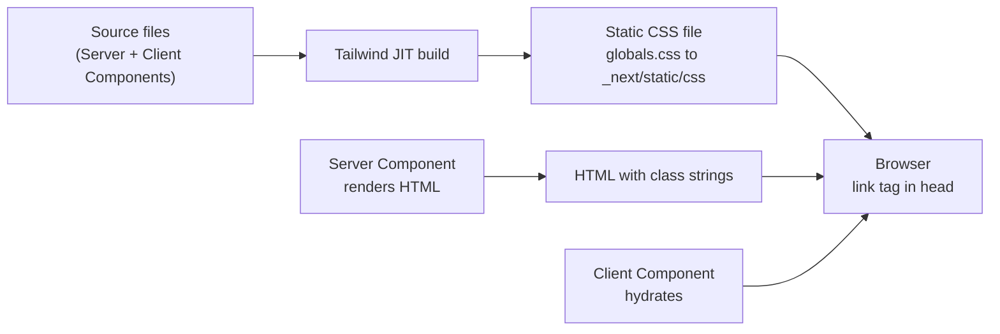
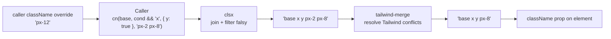
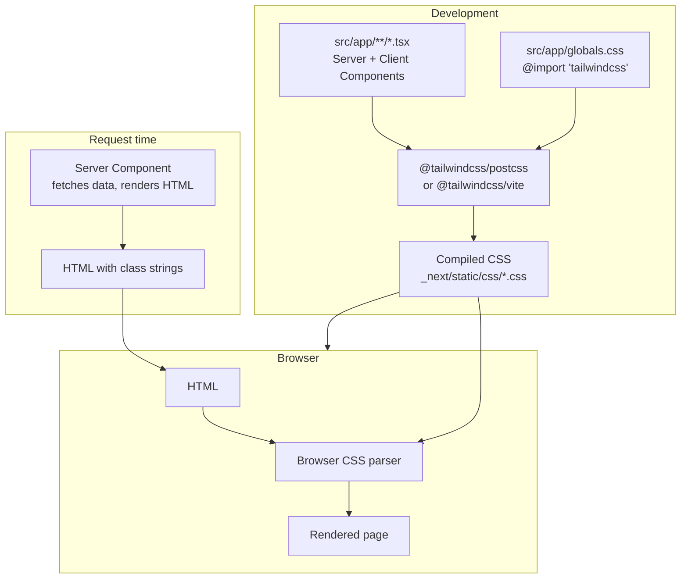
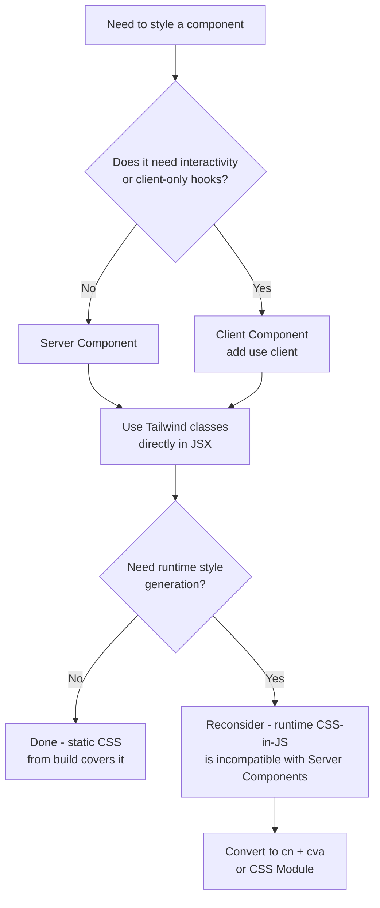

# 2.7 Tailwind with React and Next.js

> Tailwind is a build-time CSS generator, which means it composes beautifully with React's component model and with Next.js's App Router (including Server Components). This note covers the three real-world setup paths (Vite + React, Next.js with the PostCSS plugin for v3, and Next.js with `@tailwindcss/postcss` or `@tailwindcss/vite` for v4), where to put `globals.css` and how to import it from `layout.tsx`, why Tailwind works in Server Components without any `"use client"` boundary, the `clsx` + `tailwind-merge` pattern (the famous `cn()` helper), conditional classes in JSX, Tailwind alongside CSS Modules, why you should not mix Tailwind with styled-components, and how `shadcn/ui` became the de facto Tailwind-native component system.

## 2.7.1 Objective

By the end of this note you should be able to:

1. Install and configure Tailwind v4 in a Vite + React + TypeScript project, including the `@tailwindcss/vite` plugin and the single-line `@import "tailwindcss"` CSS entry.
2. Install and configure Tailwind v4 (or v3) in a Next.js App Router project, including `postcss.config.mjs`, `globals.css`, and the `import "./globals.css"` line in `app/layout.tsx`.
3. Explain *why* Tailwind works in Server Components: it is a compile-time CSS generator, not a runtime CSS-in-JS library, so it produces a static CSS file that ships to the browser regardless of which component renders on the server or the client.
4. Write the canonical `cn()` helper that combines `clsx` (conditional class joining) with `tailwind-merge` (deduplication of conflicting Tailwind classes) and explain why each half is necessary.
5. Use the `cn()` pattern inside a React component to apply conditional classes (`size`, `variant`, `disabled`, `hasError`) without leaking class string concatenation bugs.
6. Decide when to use CSS Modules alongside Tailwind (rare, but valid for one-off complex selectors) and when not to.
7. Articulate why mixing Tailwind with styled-components, Emotion, or Stitches is a bad idea — and what to do if you inherit such a codebase.
8. Explain the shadcn/ui philosophy ("copy-paste, not install") and read its generated components (Radix UI primitive + Tailwind classes + cva variants + cn helper).
9. Diagnose the three most common "Tailwind not applying in Next.js" failures: missing `@import` in CSS, `globals.css` not imported in `layout.tsx`, and dynamic class names that the JIT scanner cannot see.

## 2.7.2 Background Knowledge

Before reading this note you should be comfortable with:

- **React 18+ and JSX/TSX syntax.** See [[3.1 JSX and Rendering]] and [[3.2 Components and Props]]. This note will write components as functions returning JSX, with `className` instead of `class`.
- **The Tailwind Just-In-Time engine.** See [[2.1 Tailwind Philosophy and Setup]]. The JIT engine scans source files for complete, contiguous class-name strings and generates CSS only for the ones it finds. This has one cardinal rule for React projects: **never construct class names with string interpolation that hides the literal from the scanner.**
- **Next.js App Router basics.** See [[4.1 App Router Foundations]]. The `app/` directory, `layout.tsx`, `page.tsx`, Server Components by default, the `"use client"` directive for Client Components.
- **PostCSS.** A CSS transformation pipeline. Tailwind v3 is a PostCSS plugin; Tailwind v4 ships its own PostCSS plugin and a native Vite plugin that bypasses PostCSS for speed.
- **CSS Modules.** The `*.module.css` convention that scopes class names to a component by hashing them at build time. See [[1.12 CSS Architecture]].
- **CSS-in-JS.** Libraries (styled-components, Emotion, Stitches) that generate styles at runtime (or compile-time) by collocating styles with components. Out of scope for this note except to explain why you should not combine them with Tailwind.

> [!note] Throughout this note, code examples use Tailwind v4 syntax (`@import "tailwindcss"`, `@tailwindcss/vite`) unless explicitly marked v3. The v3 syntax (`@tailwind base; @tailwind components; @tailwind utilities;`) and the `tailwindcss` PostCSS plugin still work; they are just the legacy path.

## 2.7.3 Core Concepts

### 2.7.3.1 Why Tailwind Fits React (and React Fits Tailwind)

React popularized the component as the unit of UI reuse. A `Button` component owns its markup, its event handlers, its styles, and its tests. Before Tailwind, the "owns its styles" part was awkward: a `Button.tsx` had to be paired with a `button.css` (or `button.module.css`, or `styled.button`), and the two files had to be kept in sync by the developer.

Tailwind collapses the pair. The styles live in the JSX as utility classes. There is no separate stylesheet. The component is one file. This matches React's mental model perfectly:

```tsx
// Button.tsx — one file, self-contained
export function Button({ children, onClick }: { children: React.ReactNode; onClick: () => void }) {
  return (
    <button
      onClick={onClick}
      className="inline-flex items-center gap-2 rounded-lg bg-blue-600 px-4 py-2 text-sm font-medium text-white transition-colors hover:bg-blue-700 focus:outline-none focus:ring-2 focus:ring-blue-500 focus:ring-offset-2 disabled:opacity-50"
    >
      {children}
    </button>
  );
}
```

No `Button.css`. No `Button.module.css`. No `styled.button`. The styles travel with the markup.

### 2.7.3.2 Server Components and Tailwind: A Perfect Match

Next.js App Router (13+) defaults to Server Components. A Server Component renders to HTML on the server and ships zero JavaScript for the component itself to the client. Many developers assumed Server Components could not use Tailwind because Tailwind was "CSS-in-JS" in their mental model. This is wrong, and the confusion is worth unpacking:

- **styled-components / Emotion / Stitches** are *runtime* CSS-in-JS. They inject `<style>` tags into the DOM at runtime by evaluating JavaScript. Server Components cannot run client-side JavaScript, so runtime CSS-in-JS is fundamentally incompatible with Server Components. (styled-components has a Server-Side Rendering mode that compiles styles at request time, but it still requires the component to be a Client Component in the App Router.)
- **Tailwind** is a *build-time* CSS generator. The JIT engine scans your source files during the build and emits a static `.css` file. That `.css` file is served as a single `<link>` in the document `<head>`. The classes on your elements are plain strings; the browser looks them up in the CSS file. There is no runtime evaluation. **Server Components work fine with Tailwind because nothing about Tailwind requires the component to be a Client Component.**



> [!tip] A useful rule of thumb: if your styling technology needs to run JavaScript to produce CSS at request or render time, it does not work in Server Components. If it produces CSS at build time and serves it as a static file, it works. Tailwind, CSS Modules, Sass, and PostCSS all work. styled-components, Emotion, Stitches, and vanilla-extract's runtime mode do not.

### 2.7.3.3 The `cn()` Helper: `clsx` + `tailwind-merge`

The single most-used utility in a Tailwind + React codebase is the `cn()` function. It is small enough to write here in full:

```ts
// lib/utils.ts
import { type ClassValue, clsx } from "clsx";
import { twMerge } from "tailwind-merge";

export function cn(...inputs: ClassValue[]) {
  return twMerge(clsx(inputs));
}
```

Two libraries, two jobs:

- **`clsx`** joins class strings conditionally. `clsx("a", false && "b", { c: true, d: false }, ["e", "f"])` returns `"a c e f"`. It handles every shape you might pass into a `className` prop: strings, arrays, objects, nested arrays, falsy values. Without `clsx` you would write ugly ternaries: `className={\`base \${isActive ? "active" : ""} \${disabled ? "opacity-50" : ""}\`}`.
- **`tailwind-merge`** resolves conflicting Tailwind classes. If you pass `"px-2 px-4"`, it returns `"px-4"`. If you pass `"text-red-500 text-blue-500"`, it returns `"text-blue-500"`. Without `tailwind-merge`, later classes would not override earlier ones reliably, because CSS specificity between two utilities is equal and source order in the generated stylesheet is not the order in your `className` string.

Why both are necessary:

| Scenario | `clsx` alone | `tailwind-merge` alone | `cn()` (both) |
|----------|--------------|------------------------|----------------|
| `cn("px-2", condition && "px-4")` | `"px-2 px-4"` (broken: both apply, winner is source-order in CSS) | `"px-2 px-4"` (no conditional joining) | `"px-4"` (correct) |
| `cn("text-red-500", isPrimary && "text-blue-500")` | `"text-red-500 text-blue-500"` (broken) | no conditional support | `"text-blue-500"` (correct) |
| `cn({ "opacity-50": disabled }, "p-4")` | `"opacity-50 p-4"` (correct) | no object support | `"opacity-50 p-4"` (correct) |

The combination is the canonical pattern. `shadcn/ui`, the Tailwind Labs examples, and almost every production Tailwind + React codebase use exactly this helper.

> [!warning] `tailwind-merge` only knows about Tailwind classes. If you pass it `"my-custom-class bg-red-500 bg-blue-500"`, it will return `"my-custom-class bg-blue-500"` (correct for the Tailwind pair) but it will not deduplicate custom classes. Keep your custom class names distinct from Tailwind utilities to avoid surprises.

### 2.7.3.4 Conditional Classes in JSX

Once you have `cn()`, conditional classes become clean:

```tsx
import { cn } from "@/lib/utils";

interface ButtonProps extends React.ButtonHTMLAttributes<HTMLButtonElement> {
  variant?: "primary" | "secondary" | "ghost";
  size?: "sm" | "md" | "lg";
  fullWidth?: boolean;
}

export function Button({
  variant = "primary",
  size = "md",
  fullWidth = false,
  className,
  ...props
}: ButtonProps) {
  return (
    <button
      className={cn(
        // base
        "inline-flex items-center justify-center gap-2 rounded-lg font-medium transition-colors",
        "focus:outline-none focus:ring-2 focus:ring-offset-2 disabled:opacity-50 disabled:cursor-not-allowed",
        // variant
        variant === "primary" && "bg-blue-600 text-white hover:bg-blue-700 focus:ring-blue-500",
        variant === "secondary" && "bg-slate-100 text-slate-900 hover:bg-slate-200 focus:ring-slate-400",
        variant === "ghost" && "bg-transparent text-slate-700 hover:bg-slate-100 focus:ring-slate-400",
        // size
        size === "sm" && "px-3 py-1.5 text-sm",
        size === "md" && "px-4 py-2 text-sm",
        size === "lg" && "px-6 py-3 text-base",
        // modifier
        fullWidth && "w-full",
        // caller overrides last so they win
        className,
      )}
      {...props}
    />
  );
}
```

Note the deliberate ordering: base classes first, variant second, size third, modifier fourth, and caller-supplied `className` last. Because `tailwind-merge` keeps the last conflicting class, caller overrides always win. This is the pattern that makes components feel composable: `<Button className="px-8">` overrides the default `px-4` without the caller needing to know which size variant was applied.

### 2.7.3.5 Where to Put `globals.css` in Next.js

Next.js App Router convention:

- File location: `app/globals.css` (or `src/app/globals.css` if you use a `src/` directory).
- Imported once, at the top of the root layout: `app/layout.tsx`.
- Never imported in a page component or any non-root layout — it would re-import the same CSS and trigger build warnings.

```tsx
// app/layout.tsx
import type { Metadata } from "next";
import { Inter } from "next/font/google";
import "./globals.css";

const inter = Inter({ subsets: ["latin"] });

export const metadata: Metadata = {
  title: "My App",
  description: "Generated by Next.js",
};

export default function RootLayout({
  children,
}: { children: React.ReactNode }) {
  return (
    <html lang="en">
      <body className={inter.className}>{children}</body>
    </html>
  );
}
```

The import is a side-effect import (no binding), which tells the bundler "include this CSS in the global stylesheet." Next.js's webpack/Turbopack pipeline collects all CSS imports reachable from the root layout and emits them as a single `<link>` in the document `<head>`.

> [!tip] You can also colocate CSS files with components using the `*.module.css` convention. CSS Modules are scoped (class names are hashed), so they do not pollute the global namespace. They work fine alongside Tailwind — see [[2.7.5.4 CSS Modules and Tailwind Coexistence]] below.

### 2.7.3.6 shadcn/ui: The Tailwind-Native Component System

`shadcn/ui` is not a component library in the npm-install sense. It is a collection of *recipes* for component files that you copy into your own codebase. The CLI (`npx shadcn@latest add button`) writes a `components/ui/button.tsx` file into your project. You own it. You edit it. You version it with your code.

The generated `button.tsx` looks like this (abbreviated):

```tsx
// components/ui/button.tsx
import * as React from "react";
import { Slot } from "@radix-ui/react-slot";
import { cva, type VariantProps } from "class-variance-authority";
import { cn } from "@/lib/utils";

const buttonVariants = cva(
  "inline-flex items-center justify-center gap-2 whitespace-nowrap rounded-md text-sm font-medium transition-colors focus-visible:outline-none focus-visible:ring-1 focus-visible:ring-slate-950 disabled:pointer-events-none disabled:opacity-50",
  {
    variants: {
      variant: {
        default: "bg-slate-900 text-slate-50 shadow hover:bg-slate-900/90",
        destructive: "bg-red-500 text-slate-50 shadow-sm hover:bg-red-500/90",
        outline: "border border-slate-200 bg-white shadow-sm hover:bg-slate-100 hover:text-slate-900",
        secondary: "bg-slate-100 text-slate-900 shadow-sm hover:bg-slate-100/80",
        ghost: "hover:bg-slate-100 hover:text-slate-900",
        link: "text-slate-900 underline-offset-4 hover:underline",
      },
      size: {
        default: "h-9 px-4 py-2",
        sm: "h-8 rounded-md px-3 text-xs",
        lg: "h-10 rounded-md px-8",
        icon: "h-9 w-9",
      },
    },
    defaultVariants: { variant: "default", size: "default" },
  },
);

export interface ButtonProps
  extends React.ButtonHTMLAttributes<HTMLButtonElement>,
    VariantProps<typeof buttonVariants> {
  asChild?: boolean;
}

const Button = React.forwardRef<HTMLButtonElement, ButtonProps>(
  ({ className, variant, size, asChild = false, ...props }, ref) => {
    const Comp = asChild ? Slot : "button";
    return (
      <Comp
        className={cn(buttonVariants({ variant, size, className }))}
        ref={ref}
        {...props}
      />
    );
  },
);
Button.displayName = "Button";

export { Button, buttonVariants };
```

The four building blocks of shadcn/ui:

1. **Radix UI primitives** (unstyled, accessible behavior: focus traps, ARIA, keyboard nav).
2. **`cva`** for variant configuration (see [[2.4 Component Composition]]).
3. **`cn()`** for runtime class merging and caller overrides.
4. **Tailwind classes** for all visual styling.

The result is components that are accessible by default (Radix handles that), visually consistent (Tailwind + your design tokens), infinitely customizable (you own the file), and tiny (no runtime CSS-in-JS, no component library in `node_modules` for the browser to download).

> [!note] The shadcn/ui approach has displaced Material UI, Chakra UI, and Mantine in many Tailwind-based codebases since 2023. The trade-off is that you own and maintain each component file. The benefit is that there is no abstraction to fight: every line of styling is editable Tailwind.

## 2.7.4 Detailed Walkthrough

### 2.7.4.1 Path 1: Vite + React + TypeScript + Tailwind v4

```bash
# 1. Scaffold the project
npm create vite@latest my-app -- --template react-ts
cd my-app
npm install

# 2. Install Tailwind v4 + the Vite plugin
npm install tailwindcss @tailwindcss/vite

# 3. Configure Vite
```

Edit `vite.config.ts`:

```ts
import { defineConfig } from 'vite';
import react from '@vitejs/plugin-react';
import tailwindcss from '@tailwindcss/vite';

export default defineConfig({
  plugins: [react(), tailwindcss()],
});
```

Replace `src/index.css` with one line:

```css
@import "tailwindcss";
```

That is it. No `tailwind.config.js`. No `postcss.config.js`. Start the dev server:

```bash
npm run dev
```

Use Tailwind classes in `src/App.tsx`:

```tsx
function App() {
  return (
    <div className="min-h-screen bg-slate-50 flex items-center justify-center">
      <h1 className="text-3xl font-bold text-slate-900">Hello Tailwind v4</h1>
    </div>
  );
}

export default App;
```

### 2.7.4.2 Path 2: Next.js App Router + Tailwind v4

```bash
# 1. Scaffold
npx create-next-app@latest my-app --typescript --app --tailwind --eslint --src-dir --import-alias "@/*"
cd my-app
```

The `create-next-app` scaffolder with `--tailwind` already wires up everything. For Tailwind v4 specifically, you can opt in via:

```bash
npm install tailwindcss @tailwindcss/postcss
```

Update `postcss.config.mjs`:

```js
const config = {
  plugins: {
    "@tailwindcss/postcss": {},
  },
};

export default config;
```

Update `src/app/globals.css`:

```css
@import "tailwindcss";

/* Optional: theme customization using CSS-first config */
@theme {
  --color-brand-50: #eff6ff;
  --color-brand-500: #3b82f6;
  --color-brand-900: #1e3a8a;
  --font-sans: "Inter", system-ui, sans-serif;
}
```

The `src/app/layout.tsx` already has `import "./globals.css"` from the scaffold. Start the dev server:

```bash
npm run dev
```

### 2.7.4.3 Path 3: Next.js App Router + Tailwind v3 (Legacy)

For existing Next.js 13/14 projects on v3:

```bash
npm install -D tailwindcss@3 postcss autoprefixer
npx tailwindcss init -p
```

`tailwind.config.js`:

```js
/** @type {import('tailwindcss').Config} */
module.exports = {
  content: [
    "./src/app/**/*.{js,ts,jsx,tsx,mdx}",
    "./src/components/**/*.{js,ts,jsx,tsx,mdx}",
  ],
  theme: { extend: {} },
  plugins: [],
};
```

`src/app/globals.css`:

```css
@tailwind base;
@tailwind components;
@tailwind utilities;
```

The migration path from v3 to v4 in a Next.js project is documented in the Tailwind upgrade guide. The mechanical steps are: replace the PostCSS plugin, replace the three `@tailwind` directives with `@import "tailwindcss"`, convert `theme.extend` in JS to `@theme` in CSS, and convert any `darkMode: "class"` JS config to `@custom-variant dark (&:where(.dark, .dark *));` in CSS. Budget a half-day for a medium project.

### 2.7.4.4 The `cn()` Helper in Detail

Install the two dependencies:

```bash
npm install clsx tailwind-merge
```

Optionally install `clsx`'s types if your `tsconfig.json` does not pick them up automatically (modern versions ship types):

```bash
npm install -D @types/clsx # only if needed
```

Create `src/lib/utils.ts` (Next.js `@/lib/utils` alias) or `src/lib/utils.ts` (Vite, with `@` aliased to `src`):

```ts
import { type ClassValue, clsx } from "clsx";
import { twMerge } from "tailwind-merge";

export function cn(...inputs: ClassValue[]) {
  return twMerge(clsx(inputs));
}
```

That is the entire file. Now any component in the project can do:

```tsx
import { cn } from "@/lib/utils";

function Card({ className, isActive, children }: CardProps) {
  return (
    <div
      className={cn(
        "rounded-lg border bg-white p-6 shadow-sm",
        isActive && "ring-2 ring-blue-500",
        className, // caller overrides
      )}
    >
      {children}
    </div>
  );
}
```

### 2.7.4.5 Server Components and Tailwind: The Mental Model

The mental model in one sentence: **Tailwind produces a static CSS file at build time; React Server Components produce HTML at request time; the browser combines them.**

A Server Component file:

```tsx
// app/products/page.tsx (Server Component — no "use client")
import { db } from "@/lib/db";

export default async function ProductsPage() {
  const products = await db.product.findMany();

  return (
    <main className="mx-auto max-w-7xl px-4 py-12">
      <h1 className="text-3xl font-bold tracking-tight text-slate-900">Products</h1>
      <ul className="mt-8 grid grid-cols-1 gap-6 sm:grid-cols-2 lg:grid-cols-3">
        {products.map((p) => (
          <li
            key={p.id}
            className="rounded-lg border border-slate-200 bg-white p-6 shadow-sm transition-shadow hover:shadow-md"
          >
            <h2 className="text-lg font-semibold text-slate-900">{p.name}</h2>
            <p className="mt-2 text-sm text-slate-600">{p.description}</p>
            <p className="mt-4 text-2xl font-bold text-slate-900">${p.price}</p>
          </li>
        ))}
      </ul>
    </main>
  );
}
```

This component fetches from the database on the server, renders HTML with Tailwind class strings, and ships to the client. The Tailwind classes were generated at build time into `_next/static/css/*.css`. The browser downloads the HTML, downloads the CSS, matches the classes, paints the page. **Zero JavaScript was shipped for this component.**

The contrast with styled-components is stark. The same component in styled-components would require `"use client"` (because styled-components needs runtime evaluation) and would ship the styled-components runtime (~12 kB gzipped) plus the component's JS.

## 2.7.5 Practical Examples

### 2.7.5.1 A `Button` Component with `cva` and `cn`

For anything more complex than a few variants, use `cva` instead of inline conditionals. The result is more readable and more maintainable.

```bash
npm install class-variance-authority clsx tailwind-merge
```

```tsx
// src/components/ui/button.tsx
import * as React from "react";
import { cva, type VariantProps } from "class-variance-authority";
import { cn } from "@/lib/utils";

const buttonVariants = cva(
  "inline-flex items-center justify-center gap-2 whitespace-nowrap rounded-md text-sm font-medium ring-offset-background transition-colors focus-visible:outline-none focus-visible:ring-2 focus-visible:ring-ring focus-visible:ring-offset-2 disabled:pointer-events-none disabled:opacity-50",
  {
    variants: {
      variant: {
        default: "bg-primary text-primary-foreground hover:bg-primary/90",
        destructive: "bg-destructive text-destructive-foreground hover:bg-destructive/90",
        outline: "border border-input bg-background hover:bg-accent hover:text-accent-foreground",
        secondary: "bg-secondary text-secondary-foreground hover:bg-secondary/80",
        ghost: "hover:bg-accent hover:text-accent-foreground",
        link: "text-primary underline-offset-4 hover:underline",
      },
      size: {
        default: "h-10 px-4 py-2",
        sm: "h-9 rounded-md px-3",
        lg: "h-11 rounded-md px-8",
        icon: "h-10 w-10",
      },
    },
    defaultVariants: { variant: "default", size: "default" },
  },
);

export interface ButtonProps
  extends React.ButtonHTMLAttributes<HTMLButtonElement>,
    VariantProps<typeof buttonVariants> {}

const Button = React.forwardRef<HTMLButtonElement, ButtonProps>(
  ({ className, variant, size, ...props }, ref) => (
    <button
      className={cn(buttonVariants({ variant, size, className }))}
      ref={ref}
      {...props}
    />
  ),
);
Button.displayName = "Button";

export { Button, buttonVariants };
```

Usage:

```tsx
<Button>Save</Button>
<Button variant="destructive" size="sm">Delete</Button>
<Button variant="outline" className="ml-auto">Cancel</Button>
```

### 2.7.5.2 An `Input` with Error State

```tsx
// src/components/ui/input.tsx
import * as React from "react";
import { cn } from "@/lib/utils";

export interface InputProps extends React.InputHTMLAttributes<HTMLInputElement> {
  hasError?: boolean;
}

const Input = React.forwardRef<HTMLInputElement, InputProps>(
  ({ className, hasError, ...props }, ref) => (
    <input
      className={cn(
        "flex h-10 w-full rounded-md border border-input bg-background px-3 py-2 text-sm ring-offset-background",
        "file:border-0 file:bg-transparent file:text-sm file:font-medium",
        "placeholder:text-muted-foreground",
        "focus-visible:outline-none focus-visible:ring-2 focus-visible:ring-ring focus-visible:ring-offset-2",
        "disabled:cursor-not-allowed disabled:opacity-50",
        hasError && "border-destructive focus-visible:ring-destructive",
        className,
      )}
      ref={ref}
      {...props}
    />
  ),
);
Input.displayName = "Input";

export { Input };
```

### 2.7.5.3 Conditional Classes Without `cn()`

If you do not have `clsx`/`tailwind-merge` available (e.g., a tiny project), the simplest fallback is template-literal concatenation with arrays:

```tsx
function Card({ isActive, className = "" }: CardProps) {
  const base = "rounded-lg border bg-white p-6 shadow-sm";
  const active = isActive ? "ring-2 ring-blue-500" : "";
  return <div className={`${base} ${active} ${className}`}>{children}</div>;
}
```

This works for trivial cases but breaks down as soon as caller overrides should replace default classes (because `"px-4 px-8"` is ambiguous in CSS source order). For anything beyond toy code, use `cn()`.

### 2.7.5.4 CSS Modules and Tailwind Coexistence

CSS Modules and Tailwind can coexist. CSS Modules handle scoped, complex selectors that Tailwind utilities cannot express cleanly (e.g., a deeply nested `:has()` chain). Tailwind handles 95% of the styling with utilities. Use both, but use Tailwind first.

```tsx
// src/components/Calendar.tsx
import styles from "./Calendar.module.css";
import { cn } from "@/lib/utils";

export function Calendar() {
  return (
    <div className={cn("rounded-lg border bg-white p-4", styles.calendar)}>
      {/* The CSS Module class adds the complex grid layout that would
          be ugly to express in Tailwind utilities. */}
    </div>
  );
}
```

```css
/* src/components/Calendar.module.css */
.calendar {
  display: grid;
  grid-template-columns: repeat(7, 1fr);
  gap: 4px;
}

.calendar :is(td, th):has(input:checked) {
  background: var(--color-brand-100);
}
```

> [!tip] The heuristic: if a single utility class can do it, use the utility. If you need a multi-line selector, a complex `:has()` chain, or a selector that targets DOM you do not own (e.g., a third-party iframe's children), reach for a CSS Module.

### 2.7.5.5 Tailwind and styled-components: Do Not Mix

If you inherit a codebase that uses both styled-components and Tailwind, plan to migrate. The reasons:

- **Two styling models.** styled-components is runtime CSS-in-JS; Tailwind is build-time utility CSS. Combining them means every developer has to context-switch between two mental models.
- **Server Component friction.** styled-components requires `"use client"` (or the Babel plugin + Server-Side Rendering setup), which forces components that could be Server Components to be Client Components.
- **Bundle bloat.** styled-components ships ~12 kB of runtime JS gzipped. Tailwind ships 0 bytes of runtime JS.
- **Override wars.** styled-components' generated class names and Tailwind's utility classes will fight over specificity. You will end up with `&&` in styled-components to win, which defeats the point of either library.

The migration is straightforward: replace each `styled.div\`...\`` with a `<div className="...">` and translate the CSS rules to Tailwind utilities (or, for complex cases, to a CSS Module). See [[2.8 Organizing Large Tailwind Projects]] for the larger refactor story.

## 2.7.6 Mermaid Diagrams

### 2.7.6.1 The `cn()` Utility Flow



### 2.7.6.2 Tailwind in Next.js App Router Build Flow



### 2.7.6.3 Server Component vs Client Component Styling Decision



## 2.7.7 Common Mistakes

1. **Forgetting to import `globals.css` in `layout.tsx`.** Symptom: no Tailwind styles apply at all; the page renders as unstyled HTML. Fix: add `import "./globals.css";` (or the relative path) to the top of `app/layout.tsx`. This is the single most common Next.js + Tailwind support question.

2. **Using string interpolation to build class names.** `className={\`text-${color}-500\`}` does not work because the JIT scanner sees `text-${color}-500`, not `text-blue-500`. Fix: use a lookup object that contains the literal strings, or use `cva` which keeps all class strings as literals. Example fix:
   ```tsx
   // BROKEN
   <div className={`text-${color}-500`} />

   // WORKING — full literals visible to scanner
   const colorClasses = { red: "text-red-500", blue: "text-blue-500", green: "text-green-500" };
   <div className={colorClasses[color]} />
   ```

3. **Calling `cn()` with caller `className` *before* default classes.** `cn(className, "px-4")` makes caller overrides lose to the default `px-4` because `tailwind-merge` keeps the last. Always put `className` last: `cn("px-4", className)`.

4. **Adding `"use client"` to a component that does not need it just because it uses Tailwind.** This is a misunderstanding of Tailwind. Tailwind works in Server Components. Adding `"use client"` unnecessarily ships JS that the browser could have skipped. Only add `"use client"` for components that use `useState`, `useEffect`, event handlers, or browser APIs.

5. **Putting `@import "tailwindcss"` in a non-root layout or page component.** Symptom: build errors about CSS being imported in the wrong place, or duplicate CSS. Fix: import CSS only in the root `app/layout.tsx`. Use CSS Modules (`*.module.css`) for component-scoped styles.

6. **Mixing styled-components and Tailwind in the same component.** Symptom: bizarre specificity overrides, `&&` escalation, inconsistent dark-mode behavior, runtime errors in Server Components. Fix: pick one. If you are on Tailwind, migrate the styled-components out. See [[2.8 Organizing Large Tailwind Projects]].

7. **Not installing `tailwind-merge` after `clsx`.** Symptom: `cn("px-2", "px-8")` returns `"px-2 px-8"` and the wrong one wins in the browser. Fix: install `tailwind-merge` and update `cn()` to wrap `clsx` with `twMerge`.

8. **Using `template` literal string concatenation for conditional classes without `cn()`.** Symptom: spaces in weird places (`"base  active"` with two spaces — harmless but ugly), no override behavior, hard to read. Fix: install `clsx` + `tailwind-merge` and use `cn()`.

9. **Forgetting `React.forwardRef` in a reusable component.** Symptom: `ref` prop does not work, focus management breaks, libraries that expect refs (Radix, react-hook-form) break. Fix: wrap the component in `React.forwardRef` and forward the ref to the underlying DOM element. shadcn/ui components all do this.

10. **Calling `tailwind-merge` on every render in a hot path without memoization.** `tailwind-merge` is fast (~microseconds per call) but not free. In a 1000-row table rendered 60 times per second, the calls add up. Fix: memoize the class string with `useMemo` keyed on the variant inputs, or compute it outside the render function (e.g., with `cva` whose output can be cached).

## 2.7.8 Best Practices

1. **Centralize `cn()` in `lib/utils.ts`.** One file, one export, imported everywhere via the `@/lib/utils` alias. Do not duplicate the helper. If you are in a monorepo, publish it as an internal package. See [[2.8 Organizing Large Tailwind Projects]].

2. **Always pass caller `className` last in `cn()`.** This guarantees overrides work. Document this in a code comment so future contributors do not reorder.

3. **Prefer `cva` for any component with more than two variants.** `cva` produces a typed, readable configuration object that survives code review. Inline `&&` chains are fine for two or three conditionals; beyond that, `cva` wins.

4. **Use `React.forwardRef` on all reusable components.** Even if you do not need a ref today, downstream consumers (forms, focus management, animations) will. Adding it later is a breaking change.

5. **Co-locate variants with the component.** Export `buttonVariants` alongside `Button` so other components (e.g., an anchor styled as a button) can reuse the same class string. shadcn/ui does this consistently.

6. **Import `globals.css` only in the root layout.** Never in pages, never in nested layouts, never in components. CSS Modules are the correct tool for component-scoped styles.

7. **Reserve `"use client"` for components that actually need client-side JS.** Tailwind styling does not require it. The fewer Client Components you have, the smaller your JS bundle.

8. **Use the `@/` alias for imports.** Configure it in `tsconfig.json` (`"paths": { "@/*": ["./src/*"] }`) and in the bundler. Avoid `../../../components/ui/Button` — use `@/components/ui/Button`. This makes moves painless.

9. **Adopt `shadcn/ui` rather than rolling your own design system from scratch.** The CLI gives you Radix + cva + cn + Tailwind for free. Customize from there. Do not install a competing component library (MUI, Chakra) in a Tailwind project — the styling models conflict.

10. **Type your component props with `VariantProps<typeof variants>`.** This lets TypeScript enforce the variant names. `cva` returns a typed function; `VariantProps` extracts its variant types. Callers get autocomplete and the compiler catches typos.

11. **Run `prettier-plugin-tailwindcss` to sort classes.** Install the plugin, add it to your Prettier config, and class strings are auto-sorted into Tailwind's recommended order. This eliminates bike-shedding about class order in code review.

## 2.7.9 Mini Exercises

### Exercise 2.7.1: Wire Up Tailwind v4 in a Vite + React Project

**Setup.** You have a Vite + React + TypeScript project with no styling. Install Tailwind v4 and render a centered card with a heading and a paragraph.

**Worked solution.**

1. Install dependencies:
```bash
npm install tailwindcss @tailwindcss/vite
```

2. Edit `vite.config.ts`:
```ts
import { defineConfig } from 'vite';
import react from '@vitejs/plugin-react';
import tailwindcss from '@tailwindcss/vite';

export default defineConfig({
  plugins: [react(), tailwindcss()],
});
```

3. Replace `src/index.css` with:
```css
@import "tailwindcss";
```

4. Replace `src/App.tsx` with:
```tsx
function App() {
  return (
    <div className="min-h-screen bg-slate-50 flex items-center justify-center p-4">
      <div className="max-w-md rounded-xl border border-slate-200 bg-white p-8 shadow-lg">
        <h1 className="text-2xl font-bold text-slate-900">Welcome</h1>
        <p className="mt-2 text-slate-600">
          This card is styled entirely with Tailwind v4 utilities.
        </p>
      </div>
    </div>
  );
}

export default App;
```

**Common wrong approach.** Trying to use `npx tailwindcss init` and writing a `tailwind.config.js` — that is the v3 workflow. In v4 with Vite, no JS config is required for default behavior.

### Exercise 2.7.2: Write the `cn()` Helper and Use It

**Setup.** Install `clsx` and `tailwind-merge`. Write the `cn()` helper. Then write a `Card` component that accepts `className`, `isActive`, and `children` props. The card should have a default style, an active ring when `isActive` is true, and should let the caller override any class.

**Worked solution.**

```bash
npm install clsx tailwind-merge
```

```ts
// src/lib/utils.ts
import { type ClassValue, clsx } from "clsx";
import { twMerge } from "tailwind-merge";

export function cn(...inputs: ClassValue[]) {
  return twMerge(clsx(inputs));
}
```

```tsx
// src/components/Card.tsx
import { cn } from "@/lib/utils";
import type { ReactNode } from "react";

interface CardProps {
  className?: string;
  isActive?: boolean;
  children: ReactNode;
}

export function Card({ className, isActive = false, children }: CardProps) {
  return (
    <div
      className={cn(
        "rounded-lg border border-slate-200 bg-white p-6 shadow-sm",
        isActive && "ring-2 ring-blue-500 ring-offset-2",
        className,
      )}
    >
      {children}
    </div>
  );
}
```

Usage demonstrating override:
```tsx
<Card className="p-8 bg-slate-50"> {/* overrides p-6 and bg-white */}
  <p>Content</p>
</Card>
```

**Common wrong approach.** Putting `className` first in the `cn()` call: `cn(className, "p-6", isActive && "ring-2 ring-blue-500")`. This makes caller overrides lose to defaults because `tailwind-merge` keeps the last conflicting class.

### Exercise 2.7.3: Build a `Badge` Component with `cva`

**Setup.** Build a `Badge` component with four variants (`default`, `success`, `warning`, `destructive`) and two sizes (`sm`, `md`). Use `cva` and `cn`. Type the props with `VariantProps`. Render the badge as a `<span>`.

**Worked solution.**

```tsx
// src/components/ui/badge.tsx
import * as React from "react";
import { cva, type VariantProps } from "class-variance-authority";
import { cn } from "@/lib/utils";

const badgeVariants = cva(
  "inline-flex items-center rounded-full font-medium transition-colors",
  {
    variants: {
      variant: {
        default: "bg-slate-100 text-slate-900",
        success: "bg-green-100 text-green-800",
        warning: "bg-yellow-100 text-yellow-800",
        destructive: "bg-red-100 text-red-800",
      },
      size: {
        sm: "px-2 py-0.5 text-xs",
        md: "px-2.5 py-1 text-sm",
      },
    },
    defaultVariants: { variant: "default", size: "md" },
  },
);

export interface BadgeProps
  extends React.HTMLAttributes<HTMLSpanElement>,
    VariantProps<typeof badgeVariants> {}

export function Badge({ className, variant, size, ...props }: BadgeProps) {
  return (
    <span
      className={cn(badgeVariants({ variant, size }), className)}
      {...props}
    />
  );
}
```

Usage:
```tsx
<Badge>Default</Badge>
<Badge variant="success">Active</Badge>
<Badge variant="destructive" size="sm">Error</Badge>
<Badge variant="warning" className="rounded-md">Pending</Badge>
```

**Common wrong approach.** Using inline ternaries (`variant === "success" ? "bg-green-100" : ...`) instead of `cva`. This scales poorly past two variants and is error-prone.

### Exercise 2.7.4: Diagnose a "Tailwind Not Working" Bug

**Setup.** A junior developer reports that Tailwind styles are not applying to their Next.js App Router project. They share their `app/page.tsx`:

```tsx
export default function Page() {
  return <h1 className="text-3xl font-bold text-blue-600">Hello</h1>;
}
```

They have `app/globals.css` with `@import "tailwindcss";` and `tailwindcss` + `@tailwindcss/postcss` installed. List three things to check, in order.

**Worked solution.**

1. **Is `globals.css` imported in `app/layout.tsx`?** Open `app/layout.tsx` and confirm the top has `import "./globals.css";`. If not, add it. This is the most common cause.

2. **Is `postcss.config.mjs` configured correctly?** It should look like:
   ```js
   const config = { plugins: { "@tailwindcss/postcss": {} } };
   export default config;
   ```
   If it still has the v3 syntax (`tailwindcss: {}` and `autoprefixer: {}`), update it.

3. **Did the dev server pick up the config changes?** Stop and restart `npm run dev`. PostCSS config changes are not always hot-reloaded.

If all three check out, open the browser DevTools, inspect the `<h1>`, and confirm the `<head>` has a `<link rel="stylesheet" href="/_next/static/css/...">` tag. If not, the build pipeline is broken upstream. If yes, check whether the linked CSS file actually contains the `.text-3xl` rule — if not, the JIT scanner is not finding `app/page.tsx`, which usually means the file path is outside the scanned directories (rare with the default scaffold).

**Common wrong approach.** Jumping straight to "reinstall Tailwind" or "regenerate the lockfile." Always verify the three steps above first; they cover 95% of "Tailwind not working" reports.

### Exercise 2.7.5: Convert a styled-components Component to Tailwind

**Setup.** Convert this styled-components button to Tailwind + `cva` + `cn`:

```tsx
import styled from "styled-components";

const StyledButton = styled.button<{ $variant: "primary" | "ghost" }>`
  padding: 8px 16px;
  border-radius: 6px;
  font-size: 14px;
  font-weight: 500;
  background: ${props => props.$variant === "primary" ? "#2563eb" : "transparent"};
  color: ${props => props.$variant === "primary" ? "#fff" : "#374151"};
  border: ${props => props.$variant === "ghost" ? "1px solid #e5e7eb" : "none"};
  cursor: pointer;
  &:hover {
    background: ${props => props.$variant === "primary" ? "#1d4ed8" : "#f3f4f6"};
  }
`;
```

**Worked solution.**

```tsx
// src/components/ui/button.tsx
import * as React from "react";
import { cva, type VariantProps } from "class-variance-authority";
import { cn } from "@/lib/utils";

const buttonVariants = cva(
  "inline-flex items-center justify-center rounded-md px-4 py-2 text-sm font-medium cursor-pointer transition-colors",
  {
    variants: {
      variant: {
        primary: "bg-blue-600 text-white hover:bg-blue-700",
        ghost: "bg-transparent text-slate-700 border border-slate-200 hover:bg-slate-100",
      },
    },
    defaultVariants: { variant: "primary" },
  },
);

export interface ButtonProps
  extends React.ButtonHTMLAttributes<HTMLButtonElement>,
    VariantProps<typeof buttonVariants> {}

const Button = React.forwardRef<HTMLButtonElement, ButtonProps>(
  ({ className, variant, ...props }, ref) => (
    <button
      ref={ref}
      className={cn(buttonVariants({ variant }), className)}
      {...props}
    />
  ),
);
Button.displayName = "Button";

export { Button, buttonVariants };
```

The key translations:
- `padding: 8px 16px`  -->  `px-4 py-2` (16px / 8px in Tailwind's default 4px scale)
- `border-radius: 6px`  -->  `rounded-md` (6px)
- `font-size: 14px; font-weight: 500`  -->  `text-sm font-medium`
- `cursor: pointer`  -->  `cursor-pointer`
- `&:hover`  -->  `hover:` variant prefix
- Variant prop  -->  `cva` variants config

The result is a Server-Component-compatible Button (no `"use client"` needed), with a tiny static CSS footprint and zero runtime JS.

**Common wrong approach.** Keeping `"use client"` on the file "just in case." Tailwind does not need it. Remove it unless the component uses hooks or event handlers.

## 2.7.10 Summary

Tailwind and React share a component-first mental model that makes them a natural pair. Tailwind generates a static CSS file at build time; React Server Components generate HTML at request time; the browser combines them with no runtime overhead. The `cn()` helper (clsx for conditional joining, tailwind-merge for conflict resolution) is the load-bearing utility of every Tailwind + React codebase. `cva` makes variant configuration readable and typed. shadcn/ui codified the Radix + cva + cn + Tailwind pattern into a copy-paste component system that has displaced runtime CSS-in-JS libraries in modern codebases. The most common pitfalls — forgetting to import `globals.css`, dynamic class names that hide from the JIT scanner, ordering bugs in `cn()` calls — are all easily avoided once you internalize the build-time mental model.

## 2.7.11 Related Notes

- [[2.1 Tailwind Philosophy and Setup]] — the JIT engine, v3 vs v4, the @source directive.
- [[2.2 Configuration and Theme Customization]] — `@theme` CSS-first config and design tokens.
- [[2.3 Responsive Utilities and Dark Mode]] — breakpoint prefixes, `dark:` variant, container queries.
- [[2.4 Component Composition]] — `@apply`, `cva`, `tailwind-merge` in depth.
- [[2.5 Layout Patterns in Tailwind]] — every common layout translated to utilities.
- [[2.6 Animations and Plugins]] — built-in animations, transitions, the plugin API.
- [[2.8 Organizing Large Tailwind Projects]] — design tokens, `@layer`, monorepos, deprecation.
- [[1.12 CSS Architecture]] — where Tailwind fits in the broader CSS architecture landscape.
- [[3.2 Components and Props]] — React component fundamentals.
- [[3.10 Composition and Patterns]] — higher-level React composition patterns.
- [[4.1 App Router Foundations]] — Next.js App Router mental model.
- [[4.3 Server and Client Components]] — the Server/Client boundary in depth.
