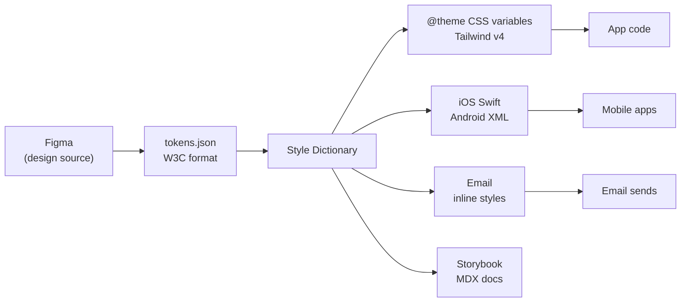
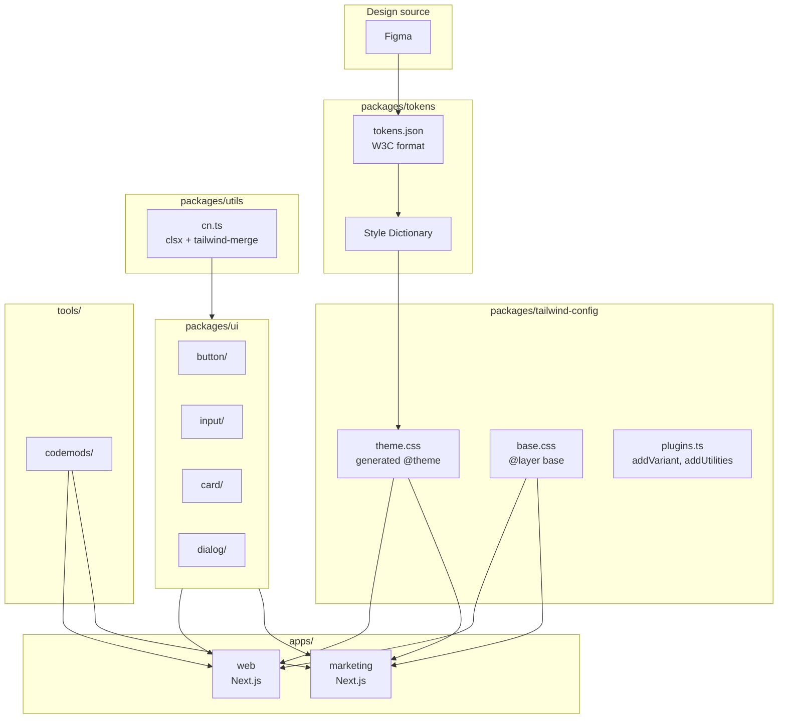
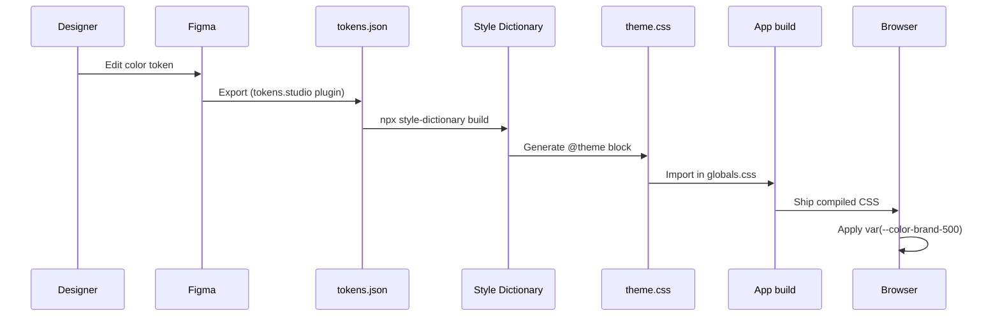
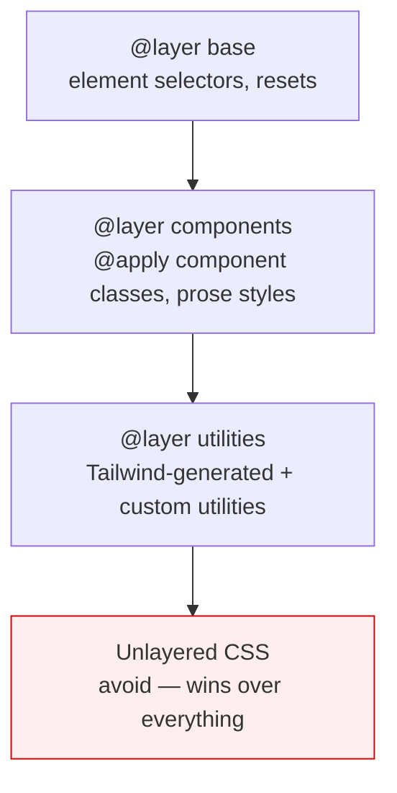
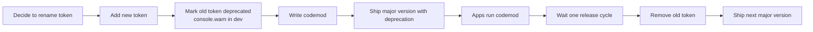

# 2.8 Organizing Large Tailwind Projects

> Tailwind's utility-first model is famously low-ceremony in a small project: write classes in JSX, ship. In a large project — multiple teams, hundreds of components, a design system, maybe a monorepo — that low ceremony becomes a liability unless you impose structure deliberately. This note covers the design-token approach (colors, spacing, typography as the single source of truth), the `@layer` pattern in Tailwind v4 (base / components / utilities), when `@apply` is appropriate and when it is a trap, the component-folder convention (`Button.tsx` + optional `button.styles.ts`), the variant pattern with `cva`, centralizing `cn()` in `lib/utils`, syncing design tokens between Figma and Tailwind (the Style Dictionary approach), monorepo considerations for sharing a Tailwind config and theme, documentation patterns for design systems, and how to deprecate utilities safely without breaking every consumer.

## 2.8.1 Objective

By the end of this note you should be able to:

1. Design a token system that flows from Figma (or any design source) to a single source of truth and into both Tailwind's `@theme` and your component code, with no copy-paste of color hexes or spacing values.
2. Use Tailwind v4's `@layer base`, `@layer components`, and `@layer utilities` correctly, and explain why every custom CSS rule belongs in a layer (so cascade specificity is predictable).
3. Decide when `@apply` is the right tool (rare: third-party HTML you do not control, generated Markdown, email templates) and when it is a trap (extracting "component classes" instead of React components).
4. Organize a component folder: `Button.tsx`, `Button.test.tsx`, `index.ts` (re-exports), and an optional `button-variants.ts` when the cva configuration gets large.
5. Centralize `cn()` in `lib/utils`, share it as a package in a monorepo, and version it.
6. Share a Tailwind config and theme across a monorepo (Turborepo, Nx, pnpm workspaces) without circular dependencies or duplicate `tailwindcss` installations.
7. Use Style Dictionary (or a similar token-pipeline tool) to transform design tokens into Tailwind CSS variables, CSS custom properties, iOS/Android tokens, and documentation, from one JSON source.
8. Document a design system: Storybook, MDX, prop tables, live playgrounds, and the "source of truth" rule.
9. Deprecate a utility or token safely: emit a console warning in dev, mark the JSDoc `@deprecated`, plan a migration window, ship a codemod, then remove.
10. Diagnose the four scaling problems in a mature Tailwind codebase (token drift, component duplication, `@apply` sprawl, dark-mode regressions) and apply the right structural fix to each.

## 2.8.2 Background Knowledge

This note assumes you have read:

- [[2.1 Tailwind Philosophy and Setup]] — utility-first, JIT engine, v3 vs v4.
- [[2.2 Configuration and Theme Customization]] — `@theme`, custom colors and spacing, the v3 `tailwind.config.js` versus the v4 CSS-first config.
- [[2.4 Component Composition]] — `@apply`, `cva`, `tailwind-merge`.
- [[2.7 Tailwind with React and Next.js]] — `cn()`, Server Components, shadcn/ui.

Key concepts to recall:

- **Design tokens** are the named values (colors, spacing, typography, shadows, radii) that make up a design system. The term comes from the Salesforce Design System (2014) and was popularized by the W3C Design Tokens Format Module (still a draft, but widely implemented).
- **CSS custom properties** (`--color-brand-500`) are the runtime representation of a token in the browser. They can be overridden at runtime, themed per subtree, and animated (with `@property`).
- **Cascade layers** (`@layer`) are the modern CSS mechanism for grouping rules into ordered layers so that any rule in a later layer wins over any rule in an earlier layer, regardless of specificity. Tailwind v4 uses cascade layers internally; you should too.
- **Monorepos** (Turborepo, Nx, pnpm workspaces, Yarn workspaces) let multiple packages share code without publishing to npm. A typical setup has `packages/ui`, `packages/tailwind-config`, `packages/tokens`, and one or more `apps/*`.

> [!note] The W3C Design Tokens Format Module is the emerging standard for token JSON. Tools like Style Dictionary, tokens.studio, and Figma Tokens export/import it. Even if you do not use the standard directly, understanding it helps you reason about token pipelines.

## 2.8.3 Core Concepts

### 2.8.3.1 The Three Layers of a Tailwind Codebase

A mature Tailwind project has three layers of CSS, corresponding to Tailwind v4's three cascade layers:

1. **Base layer (`@layer base`)** — element selectors (`html`, `body`, `h1`, `a`), CSS resets, font-family assignments, scroll-behavior, the `*` border-color default. Anything that should apply site-wide by element type, not by class.
2. **Components layer (`@layer components`)** — `@apply`-based component classes (`.btn`, `.card`, `.prose-sidebar`) for cases where utilities in JSX are not viable (third-party HTML, generated Markdown, emails). Use sparingly; prefer React components.
3. **Utilities layer (`@layer utilities`)** — generated by Tailwind from your `@theme`, plus any custom utilities you add with `addUtilities` in a plugin or `@utility` in v4.

```css
/* globals.css */
@import "tailwindcss";

@layer base {
  html {
    -webkit-text-size-adjust: 100%;
    scroll-behavior: smooth;
  }
  body {
    @apply bg-white text-slate-900 antialiased;
    font-family: var(--font-sans);
  }
  :focus-visible {
    @apply outline-none ring-2 ring-blue-500 ring-offset-2;
  }
}

@layer components {
  /* Reserve for cases where utilities in JSX cannot do the job. */
  .prose-sidebar :is(h2, h3) {
    @apply mt-8 mb-3 font-semibold text-slate-900;
  }
}

@layer utilities {
  /* Custom utilities that the engine does not generate. */
  .text-balance {
    text-wrap: balance;
  }
}
```

Why this matters: cascade layers make specificity predictable. A rule in `@layer utilities` always wins over a rule in `@layer base`, regardless of selector specificity. Without layers, you would need `!important` to make a utility override an element selector, and the cascade would be chaotic.

### 2.8.3.2 The Design Token Pipeline

The goal: a single source of truth for design values, flowing into every consumer (Tailwind, native apps, email, Figma) without manual copy-paste.



The single source is a JSON file (or several JSON files) in the W3C Design Tokens Format. Tools (Style Dictionary, tokens.studio, Figma Tokens plugin) read it and emit platform-specific output. For Tailwind v4, the output is a CSS file with `@theme { --color-brand-500: #...; }` that you import into `globals.css`.

Example token JSON (W3C format):

```json
{
  "color": {
    "brand": {
      "500": {
        "$type": "color",
        "$value": "#3b82f6"
      },
      "600": {
        "$type": "color",
        "$value": "#2563eb"
      }
    },
    "surface": {
      "$type": "color",
      "$value": "#ffffff"
    }
  },
  "spacing": {
    "radius": {
      "md": {
        "$type": "dimension",
        "$value": "0.5rem"
      }
    }
  }
}
```

Style Dictionary config (`sd.config.js`):

```js
module.exports = {
  source: ["./tokens/**/*.json"],
  platforms: {
    css: {
      transformGroup: "css",
      buildPath: "./src/styles/",
      files: [{
        destination: "tokens.css",
        format: "css/variables",
        selector: "@theme",
      }],
    },
    // ... other platforms (ios, android, email)
  },
};
```

Run `style-dictionary build` and you get `src/styles/tokens.css` containing `@theme { --color-brand-500: #3b82f6; ... }`. Import it in `globals.css`:

```css
@import "tailwindcss";
@import "./styles/tokens.css";
```

Now `bg-brand-500`, `text-brand-600`, etc. all work, and any change in Figma  -->  re-export tokens  -->  re-run Style Dictionary  -->  new CSS. No code changes in components.

### 2.8.3.3 When `@apply` Is Right and When It Is a Trap

`@apply` lets you inline Tailwind utilities inside a regular CSS rule. It is seductive because it feels like the best of both worlds: component class names with utility-class brevity. But the Tailwind team's official guidance is firm: **do not use `@apply` to extract component classes for your own React components. Extract a React component instead.**

When `@apply` is right:

- **Third-party HTML you do not control.** A rich-text editor (TipTap, ProseMirror) emits `<h2>`, `<p>`, `<a>`, `<ul>` at runtime. You cannot add `className` to those elements. You must style by selector. `@apply` lets you do this without writing raw CSS values:
  ```css
  .prose-content h2 { @apply mt-8 mb-3 text-2xl font-semibold text-slate-900; }
  .prose-content a { @apply text-blue-600 underline underline-offset-2 hover:text-blue-700; }
  ```
- **Email templates.** Email HTML cannot use class attributes reliably across clients. Inline styles or `<style>` blocks are required. `@apply` in a build step that inlines to style attributes works.
- **Generated Markdown.** `next-mdx-remote`, `react-markdown`, or `remark` render Markdown to HTML without className hooks. Style by selector.

When `@apply` is a trap:

- **Replacing a React component with a CSS class.** If you find yourself writing `.btn-primary { @apply bg-blue-600 px-4 py-2 ...; }`, stop. Write `<Button variant="primary">` instead. The React component gives you TypeScript types, runtime conditional logic, prop forwarding, and ref support. The CSS class gives you none of that.
- **Working around "too many classes" in JSX.** If `className` strings feel too long, the answer is `cva` (extracting variants to a configuration object), not `@apply` (extracting to a CSS class). The cva object is searchable, typed, and reusable across components; the CSS class is opaque.
- **Hiding the design system.** `.card` is much less informative than `className="rounded-lg border bg-white p-6 shadow-sm"`. The utility classes are self-documenting; the `.card` class forces you to inspect the CSS file to see what it does.

> [!warning] `@apply` with variant prefixes (`hover:`, `dark:`, `md:`) works but is fragile. If you write `.btn { @apply bg-blue-600 hover:bg-blue-700; }` and later want to override the hover in a specific context, you have to fight the `@apply`-generated selector. With a React component + `cn()`, you just pass a different className.

### 2.8.3.4 The Component Folder Pattern

For non-trivial components, use a folder rather than a single file. The convention:

```text
src/components/ui/button/
  Button.tsx          # The component itself
  button-variants.ts  # The cva configuration (when large)
  Button.test.tsx     # Tests (Vitest, Jest, Testing Library)
  Button.stories.tsx  # Storybook stories (if using Storybook)
  index.ts            # Re-exports
```

`index.ts` re-exports the public API:

```ts
export { Button } from "./Button";
export type { ButtonProps } from "./Button";
export { buttonVariants } from "./button-variants";
```

Callers import from the folder: `import { Button } from "@/components/ui/button";`.

Why split out `button-variants.ts`? When the cva configuration has many variants and compound variants, the file gets long. Splitting it lets you change the variant mapping without touching the component logic, and lets other components (e.g., an `Anchor` that should look like a `Button`) import the same variants.

`Button.tsx` (abbreviated):

```tsx
import * as React from "react";
import { Slot } from "@radix-ui/react-slot";
import { cn } from "@/lib/utils";
import { buttonVariants, type ButtonVariants } from "./button-variants";

export interface ButtonProps
  extends React.ButtonHTMLAttributes<HTMLButtonElement>,
    ButtonVariants {
  asChild?: boolean;
}

export const Button = React.forwardRef<HTMLButtonElement, ButtonProps>(
  ({ className, variant, size, asChild = false, ...props }, ref) => {
    const Comp = asChild ? Slot : "button";
    return (
      <Comp
        ref={ref}
        className={cn(buttonVariants({ variant, size }), className)}
        {...props}
      />
    );
  },
);
Button.displayName = "Button";
```

### 2.8.3.5 Centralizing `cn()` and Sharing It Across a Monorepo

In a single Next.js app, `cn()` lives in `src/lib/utils.ts`. In a monorepo with multiple apps and packages, `cn()` should be a shared package so all consumers use the same implementation:

```text
packages/
  utils/
    src/
      cn.ts
      index.ts
    package.json   # name: "@myorg/utils"
    tsconfig.json
  tailwind-config/
    src/
      theme.css      # @theme with all design tokens
      index.ts
    package.json   # name: "@myorg/tailwind-config"
  ui/
    src/
      button/
      input/
      index.ts
    package.json   # name: "@myorg/ui"
apps/
  web/                # Next.js web app
  marketing/          # Next.js marketing site
```

`packages/utils/src/cn.ts`:

```ts
import { type ClassValue, clsx } from "clsx";
import { twMerge } from "tailwind-merge";

export function cn(...inputs: ClassValue[]) {
  return twMerge(clsx(inputs));
}
```

`packages/utils/package.json`:

```json
{
  "name": "@myorg/utils",
  "version": "1.0.0",
  "main": "./src/index.ts",
  "types": "./src/index.ts",
  "dependencies": {
    "clsx": "^2.1.0",
    "tailwind-merge": "^2.3.0"
  },
  "peerDependencies": {
    "tailwindcss": "^4.0.0"
  }
}
```

App code uses `import { cn } from "@myorg/utils";`. The shared package guarantees every consumer has the same `cn()` behavior, and a single upgrade of `tailwind-merge` propagates everywhere.

### 2.8.3.6 Sharing a Tailwind Config Across a Monorepo

In Tailwind v4, the "config" is largely CSS (`@theme`), which means sharing is just sharing a CSS file. Create `packages/tailwind-config/src/theme.css`:

```css
@theme {
  --color-brand-50: #eff6ff;
  --color-brand-100: #dbeafe;
  --color-brand-500: #3b82f6;
  --color-brand-600: #2563eb;
  --color-brand-700: #1d4ed8;
  --color-brand-900: #1e3a8a;

  --font-sans: "Inter", system-ui, -apple-system, sans-serif;
  --font-mono: "JetBrains Mono", monospace;

  --radius-card: 0.75rem;

  --shadow-card: 0 1px 3px 0 rgb(0 0 0 / 0.1), 0 1px 2px -1px rgb(0 0 0 / 0.1);
}

@custom-variant dark (&:where(.dark, .dark *));
```

Each app imports it:

```css
/* apps/web/src/app/globals.css */
@import "tailwindcss";
@import "@myorg/tailwind-config/theme.css";

/* App-specific overrides below */
@theme {
  --color-accent: #f97316;  /* only this app's accent */
}
```

In v3, you would publish a `tailwind.config.js` (or a preset) and merge it in each app:

```js
// apps/web/tailwind.config.js
module.exports = {
  presets: [require("@myorg/tailwind-config")],
  content: [
    "./src/**/*.{js,ts,jsx,tsx}",
    "../../packages/ui/src/**/*.{js,ts,jsx,tsx}",  // scan the shared UI package
  ],
  theme: { extend: {} },
};
```

> [!tip] Always include the shared `packages/ui/src/**` in each app's `content` (v3) or `@source` (v4) list. Tailwind scans source files at build time; if an app imports a Button from `packages/ui`, that Button's classes must be visible to the scanning app's JIT, or the Button will ship unstyled.

### 2.8.3.7 Documenting a Design System

A design system without documentation is a folder of files. The standard stack:

- **Storybook** with MDX for each component. Each story documents the props, variants, usage examples, and accessibility considerations. Embed live playgrounds so designers can verify behavior.
- **A tokens page** that lists every color, spacing, typography, shadow, and radius value with its CSS variable name and the Figma token name. Auto-generate this from the token JSON so it never drifts.
- **A migration guide** for breaking changes: "v2.0 renamed `bg-brand` to `bg-primary`. Codemod: `npx @myorg/codemods rename-bg-brand`."
- **A contribution guide** for adding new components: when to add a token, when to extend an existing variant, how to write a Storybook story, how to test.

A typical Storybook story (`.stories.mdx`):

```mdx
import { Canvas, Story, ArgsTable } from "@storybook/blocks";
import { Button } from "./Button";

# Button

The Button component triggers an action. It supports five variants and four sizes.

<Canvas>
  <Story name="Primary">
    <Button>Save changes</Button>
  </Story>
  <Story name="Destructive">
    <Button variant="destructive">Delete</Button>
  </Story>
</Canvas>

<ArgsTable of={Button} />

## Accessibility

- Renders a native `<button>` by default. Use `asChild` to render an `<a>` for navigation.
- Focus ring uses `focus-visible` so it does not appear on mouse click.
- Disabled state sets `aria-disabled` and `pointer-events: none`.
```

### 2.8.3.8 Deprecating Utilities Safely

When you rename a token (`--color-brand-500`  -->  `--color-primary-500`), the old utility (`bg-brand-500`) breaks. In a large codebase, you cannot rename-and-pray. The safe sequence:

1. **Add the new token.** Keep the old one for now.
2. **Mark the old utility deprecated.** In v4, add a custom variant or a thin wrapper that emits a `console.warn` in dev:
   ```css
   /* @deprecated Use bg-primary-500 instead. */
   @utility bg-brand-500 {
     background-color: var(--color-primary-500);
   }
   ```
3. **Write a codemod.** A small jscodeshift script that replaces `bg-brand-500` with `bg-primary-500` in every source file. Ship it as `@myorg/codemods`.
4. **Run the codemod** in CI for every consuming app, or run it manually per app and open PRs.
5. **Wait one release cycle** for any app that did not run the codemod to surface the deprecation warnings.
6. **Remove the old utility.** Bump the major version of the design system package.

> [!danger] Never remove a token or utility in a minor or patch release. Always follow semver: token renames are breaking changes; require a major version bump. The deprecation warning in dev is your safety net for the release cycle between deprecation and removal.

## 2.8.4 Detailed Walkthrough

### 2.8.4.1 The Anatomy of a Scaled Tailwind Project

```text
myorg-frontend/
  packages/
    tokens/
      src/
        color.json
        typography.json
        spacing.json
        shadow.json
      sd.config.js
      package.json
    tailwind-config/
      src/
        theme.css      # generated from tokens by Style Dictionary
        base.css       # @layer base customizations
        plugins.ts     # custom plugins (addVariant, addUtilities)
      package.json
    utils/
      src/
        cn.ts
        index.ts
      package.json
    ui/                    # @myorg/ui
      src/
        button/
        input/
        card/
        dialog/
        index.ts
      package.json
  apps/
    web/
      src/
        app/
          globals.css     # imports @myorg/tailwind-config
          layout.tsx
        components/         # app-specific components
        lib/
      tailwind.config.js      # v3 only
    marketing/
      src/
        app/
          globals.css
          layout.tsx
  tools/
    codemods/
      rename-bg-brand.ts
  turbo.json
  pnpm-workspace.yaml
  package.json
```

Key principles:

- **One package per concern.** Tokens, tailwind config, utils, and UI components are separate packages. Apps depend on whichever they need.
- **Apps import shared CSS.** Each app's `globals.css` does `@import "tailwindcss"; @import "@myorg/tailwind-config/theme.css";`. This guarantees the same design tokens across apps.
- **Apps scan shared packages.** Each app's Tailwind config (or v4 `@source`) includes `../../packages/ui/src/**` so that classes used by shared components are picked up.
- **Codemods live in `tools/`.** When a breaking change ships, the codemod is published alongside the release notes.

### 2.8.4.2 Setting Up Style Dictionary for Token Generation

Install:

```bash
npm install -D style-dictionary
```

Token source (`packages/tokens/src/color.json`):

```json
{
  "color": {
    "brand": {
      "50":  { "$type": "color", "$value": "#eff6ff" },
      "100": { "$type": "color", "$value": "#dbeafe" },
      "500": { "$type": "color", "$value": "#3b82f6" },
      "600": { "$type": "color", "$value": "#2563eb" },
      "700": { "$type": "color", "$value": "#1d4ed8" },
      "900": { "$type": "color", "$value": "#1e3a8a" }
    },
    "surface": {
      "default": { "$type": "color", "$value": "#ffffff" },
      "muted":   { "$type": "color", "$value": "#f8fafc" }
    },
    "text": {
      "default": { "$type": "color", "$value": "#0f172a" },
      "muted":   { "$type": "color", "$value": "#64748b" }
    }
  }
}
```

Style Dictionary config (`packages/tokens/sd.config.js`):

```js
module.exports = {
  source: ["./src/**/*.json"],
  platforms: {
    css: {
      transformGroup: "css",
      buildPath: "../tailwind-config/src/",
      files: [{
        destination: "theme.css",
        format: "css/variables",
        selector: "@theme",
      }],
    },
    docs: {
      transformGroup: "js",
      buildPath: "./dist/",
      files: [{
        destination: "tokens.js",
        format: "javascript/es6",
      }],
    },
  },
};
```

Run:

```bash
cd packages/tokens
npx style-dictionary build
```

Output (`packages/tailwind-config/src/theme.css`):

```css
/**
 * Do not edit directly
 * Generated on 2026-06-27
 */
@theme {
  --color-brand-50: #eff6ff;
  --color-brand-100: #dbeafe;
  --color-brand-500: #3b82f6;
  --color-brand-600: #2563eb;
  --color-brand-700: #1d4ed8;
  --color-brand-900: #1e3a8a;
  --color-surface-default: #ffffff;
  --color-surface-muted: #f8fafc;
  --color-text-default: #0f172a;
  --color-text-muted: #64748b;
}
```

Wire the build into the monorepo's pipeline (Turborepo):

```json
// turbo.json
{
  "pipeline": {
    "build:tokens": {
      "outputs": ["tailwind-config/src/theme.css", "dist/**"]
    },
    "build": {
      "dependsOn": ["^build:tokens", "^build"],
      "outputs": [".next/**", "dist/**"]
    }
  }
}
```

Now changing a token in `color.json`, running `build:tokens`, and rebuilding every app updates the entire system.

### 2.8.4.3 The `@layer` Discipline

Every custom CSS rule in your project should belong to one of the three layers (`base`, `components`, `utilities`). Unlayered CSS has higher priority than any layer, which means an accidental unlayered rule will override your utilities and break the cascade.

```css
/* globals.css */
@import "tailwindcss";
@import "@myorg/tailwind-config/theme.css";

@layer base {
  /* Element-level defaults */
  html { scroll-behavior: smooth; }
  body {
    @apply bg-surface-default text-text-default antialiased;
    font-family: var(--font-sans);
  }
  :focus-visible {
    @apply outline-none ring-2 ring-brand-500 ring-offset-2;
  }
  ::selection {
    @apply bg-brand-100 text-brand-900;
  }
}

@layer components {
  /* ONLY for cases where utilities in JSX are not viable */
  .prose-content {
    & h2 { @apply mt-10 mb-4 text-2xl font-bold text-text-default; }
    & h3 { @apply mt-8 mb-3 text-xl font-semibold text-text-default; }
    & p  { @apply my-4 text-text-default leading-relaxed; }
    & a  { @apply text-brand-600 underline underline-offset-2 hover:text-brand-700; }
    & ul { @apply my-4 list-disc pl-6 space-y-1; }
    & code { @apply rounded bg-surface-muted px-1.5 py-0.5 font-mono text-sm; }
  }
}

@layer utilities {
  /* Custom utilities the engine does not generate */
  .text-balance { text-wrap: balance; }
  .text-pretty  { text-wrap: pretty; }
}
```

> [!warning] If you write a CSS rule and forget to put it in a layer, it will silently override all your utilities. The fix is a linter rule: configure `stylelint` with `stylelint-no-unlayered-styles` (or write a custom rule) to reject any top-level selector that is not inside `@layer`.

### 2.8.4.4 Writing a Codemod for a Token Rename

When `bg-brand-500` becomes `bg-primary-500`, a codemod rewrites every usage mechanically. Use jscodeshift:

```bash
npm install -D jscodeshift
```

```ts
// tools/codemods/rename-bg-brand.ts
import { Transform } from "jscodeshift";

const transform: Transform = (file, api) => {
  const j = api.jscodeshift;
  const source = j(file.source);

  // Replace 'bg-brand-' with 'bg-primary-' inside string literals
  // and inside className={...} expressions.
  source.find(j.StringLiteral).forEach((path) => {
    if (typeof path.node.value === "string" && path.node.value.includes("bg-brand-")) {
      path.node.value = path.node.value.replace(/bg-brand-/g, "bg-primary-");
    }
  });

  source.find(j.TemplateLiteral).forEach((path) => {
    path.node.quasis.forEach((q) => {
      if (q.value.raw.includes("bg-brand-")) {
        q.value.raw = q.value.raw.replace(/bg-brand-/g, "bg-primary-");
        q.value.cooked = q.value.cooked?.replace(/bg-brand-/g, "bg-primary-");
      }
    });
  });

  return source.toSource();
};

export default transform;
```

Run across the monorepo:

```bash
npx jscodeshift -t tools/codemods/rename-bg-brand.ts --extensions=tsx,ts,jsx,js packages/ apps/
```

Ship the codemod in the release notes alongside the breaking change. Apps that did not run it will hit the deprecation warning in dev, prompting them to migrate.

### 2.8.4.5 The Dark-Mode Discipline

Dark mode is the single most common source of regressions in mature Tailwind codebases. The fix is structural:

1. **Pick one dark-mode strategy** (class-based, with `@custom-variant dark (&:where(.dark, .dark *))`) and stick with it across every app.
2. **Define surface and text tokens, not raw colors.** `bg-surface-default` and `text-text-default` should both have light and dark values. Components use the tokens; the dark-mode overrides happen at the token level, not the component level.
3. **Define dark variants for every semantic token** in `@theme`:

```css
@theme {
  --color-surface-default: #ffffff;
  --color-surface-muted: #f8fafc;
  --color-text-default: #0f172a;
  --color-text-muted: #64748b;
}

.dark {
  --color-surface-default: #0f172a;
  --color-surface-muted: #1e293b;
  --color-text-default: #f8fafc;
  --color-text-muted: #94a3b8;
}
```

Now `bg-surface-default text-text-default` works in both light and dark, with no `dark:` prefix needed at the component level. This is the only scalable approach to dark mode.

> [!tip] Reserve `dark:` prefixes for cases where a single utility genuinely needs to differ between modes (e.g., `dark:bg-brand-900/40` for a translucent overlay). For structural theming, use semantic tokens that switch with `.dark`.

## 2.8.5 Practical Examples

### 2.8.5.1 A Token-Driven Button

The Button uses semantic tokens, not raw colors. Dark mode is automatic.

```tsx
// packages/ui/src/button/Button.tsx
import * as React from "react";
import { cva, type VariantProps } from "class-variance-authority";
import { cn } from "@myorg/utils";

const buttonVariants = cva(
  "inline-flex items-center justify-center gap-2 rounded-md font-medium transition-colors focus-visible:outline-none focus-visible:ring-2 focus-visible:ring-brand-500 focus-visible:ring-offset-2 focus-visible:ring-offset-surface-default disabled:opacity-50 disabled:pointer-events-none",
  {
    variants: {
      variant: {
        default:  "bg-brand-600 text-white hover:bg-brand-700",
        outline:  "border border-slate-300 bg-transparent text-text-default hover:bg-surface-muted",
        ghost:    "bg-transparent text-text-default hover:bg-surface-muted",
        destructive: "bg-red-600 text-white hover:bg-red-700",
      },
      size: {
        sm: "h-8 px-3 text-sm",
        md: "h-10 px-4 text-sm",
        lg: "h-12 px-6 text-base",
      },
    },
    defaultVariants: { variant: "default", size: "md" },
  },
);

export interface ButtonProps
  extends React.ButtonHTMLAttributes<HTMLButtonElement>,
    VariantProps<typeof buttonVariants> {}

export const Button = React.forwardRef<HTMLButtonElement, ButtonProps>(
  ({ className, variant, size, ...props }, ref) => (
    <button
      ref={ref}
      className={cn(buttonVariants({ variant, size }), className)}
      {...props}
    />
  ),
);
Button.displayName = "Button";
```

### 2.8.5.2 A Prose Style for Markdown Content

Generated Markdown cannot take `className` per element. Style by selector with `@apply`:

```css
/* packages/tailwind-config/src/prose.css */
@layer components {
  .prose {
    @apply text-text-default leading-relaxed;
  }
  .prose :where(h2) {
    @apply mt-10 mb-4 text-2xl font-bold tracking-tight;
  }
  .prose :where(h3) {
    @apply mt-8 mb-3 text-xl font-semibold;
  }
  .prose :where(p) {
    @apply my-4;
  }
  .prose :where(a) {
    @apply text-brand-600 underline underline-offset-2 hover:text-brand-700;
  }
  .prose :where(ul) {
    @apply my-4 list-disc pl-6 space-y-1;
  }
  .prose :where(ol) {
    @apply my-4 list-decimal pl-6 space-y-1;
  }
  .prose :where(code) {
    @apply rounded bg-surface-muted px-1.5 py-0.5 font-mono text-sm;
  }
  .prose :where(pre) {
    @apply my-6 rounded-lg bg-slate-900 p-4 text-sm text-slate-100 overflow-x-auto;
  }
  .prose :where(pre) :where(code) {
    @apply bg-transparent p-0 text-slate-100;
  }
  .prose :where(blockquote) {
    @apply my-6 border-l-4 border-slate-200 pl-4 italic text-text-muted;
  }
}
```

The `:where()` wrapper keeps specificity at zero, so any utility applied directly to an element overrides the prose style. This is the correct way to combine `@apply` with utilities.

### 2.8.5.3 A Deprecation Warning for a Renamed Utility

```css
/* packages/tailwind-config/src/deprecated.css */
@layer utilities {
  /* @deprecated Use bg-primary-500 instead. Will be removed in v3.0. */
  @utility bg-brand-500 {
    background-color: var(--color-primary-500);
  }
}
```

For a runtime warning (dev only):

```ts
// packages/utils/src/deprecations.ts
const deprecated: Record<string, string> = {
  "bg-brand-500": "bg-primary-500",
  "text-brand-500": "text-primary-500",
};

export function warnDeprecatedClass(className: string) {
  if (process.env.NODE_ENV !== "production" && deprecated[className]) {
    console.warn(
      `[design-system] "${className}" is deprecated. Use "${deprecated[className]}" instead.`,
    );
  }
}
```

You would not call this on every render (too expensive). Use it in a Storybook addon or a custom ESLint rule that flags deprecated class names in source files:

```js
// .eslintrc.js
module.exports = {
  rules: {
    "no-restricted-syntax": [
      "warn",
      {
        selector: "Literal[value=/bg-brand-/]",
        message: "bg-brand-* is deprecated. Use bg-primary-* instead.",
      },
    ],
  },
};
```

### 2.8.5.4 Sharing a Tailwind Config via npm Preset (v3)

If you are still on v3, publish a preset:

```js
// packages/tailwind-config/src/index.js
module.exports = {
  theme: {
    extend: {
      colors: {
        brand: {
          50: "#eff6ff",
          500: "#3b82f6",
          600: "#2563eb",
          700: "#1d4ed8",
        },
      },
      fontFamily: {
        sans: ['"Inter"', "system-ui", "sans-serif"],
      },
    },
  },
  plugins: [
    require("@tailwindcss/forms"),
    require("@tailwindcss/typography"),
  ],
};
```

```js
// apps/web/tailwind.config.js
module.exports = {
  presets: [require("@myorg/tailwind-config")],
  content: [
    "./src/**/*.{js,ts,jsx,tsx}",
    "../../packages/ui/src/**/*.{js,ts,jsx,tsx}",
  ],
  theme: { extend: {} },  // app-specific overrides only
};
```

### 2.8.5.5 Documenting with Storybook MDX

```mdx
// packages/ui/src/button/Button.stories.mdx
import { Meta, Canvas, Story, ArgsTable } from "@storybook/blocks";
import { Button } from "./Button";

<Meta title="UI/Button" component={Button} />

# Button

Buttons trigger actions. Use the `default` variant for primary actions, `outline` for secondary actions, `ghost` for tertiary actions, and `destructive` for irreversible actions.

## Variants

<Canvas>
  <Story name="All variants">
    <div className="flex flex-wrap gap-4">
      <Button>Default</Button>
      <Button variant="outline">Outline</Button>
      <Button variant="ghost">Ghost</Button>
      <Button variant="destructive">Destructive</Button>
    </div>
  </Story>
</Canvas>

## Sizes

<Canvas>
  <Story name="All sizes">
    <div className="flex flex-wrap items-center gap-4">
      <Button size="sm">Small</Button>
      <Button size="md">Medium</Button>
      <Button size="lg">Large</Button>
    </div>
  </Story>
</Canvas>

## Props

<ArgsTable of={Button} />

## Accessibility

- Renders a native `<button>`. Use `asChild` to render an `<a>` for navigation.
- Focus ring uses `focus-visible` and is visible on keyboard navigation only.
- Disabled state sets `aria-disabled="true"` and `pointer-events: none`.

## Do not

- Do not use a `Button` for navigation. Use `<Button asChild><Link href="...">...</Link></Button>` so the anchor is the actual element.
- Do not nest interactive elements inside a `Button`.
```

## 2.8.6 Mermaid Diagrams

### 2.8.6.1 Scalable Tailwind Project Structure



### 2.8.6.2 The Token Pipeline



### 2.8.6.3 The Cascade Layer Stack



### 2.8.6.4 Deprecation Workflow



## 2.8.7 Common Mistakes

1. **Hard-coding color hexes in components.** `<div className="bg-[#3b82f6]">` bypasses the design system. Always use `bg-brand-500` (or `bg-primary-500`). If the color is not in your theme, add it as a token first.

2. **Using `@apply` to extract component classes for React components.** `.btn { @apply bg-blue-600 px-4 py-2; }` instead of `<Button>`. This loses TypeScript types, runtime conditional logic, and ref support. Extract a React component instead.

3. **Forgetting `@layer` around custom CSS.** An unlayered rule overrides all utilities, breaking the cascade. Always wrap custom CSS in `@layer base`, `@layer components`, or `@layer utilities`.

4. **Not including shared package paths in `content` (v3) or `@source` (v4).** If your app imports `Button` from `packages/ui`, the app's Tailwind build must scan `packages/ui/src/**`. Otherwise the Button's classes are not generated and it ships unstyled.

5. **Using `dark:` prefixes everywhere instead of semantic tokens.** `bg-white dark:bg-slate-900` on every component is unmaintainable. Use `bg-surface-default` with a token that has both light and dark values. See [[2.3 Responsive Utilities and Dark Mode]].

6. **Removing a token in a minor release.** Every consumer breaks. Always deprecate first (warning in dev), ship a codemod, wait a release cycle, then remove in a major version.

7. **Duplicating `cn()` in every package.** Each copy drifts; one day package A uses `clsx` v1 and package B uses `clsx` v2. Centralize `cn()` in a single `@myorg/utils` package and consume it everywhere.

8. **Generating utilities at runtime.** Dynamic class names like `text-${color}-500` defeat the JIT scanner. Use a lookup object with literal strings or `cva` variants.

9. **Treating Storybook docs as optional.** A UI package without Storybook is opaque; nobody knows what variants exist or how to use them. Write MDX for every component, even if it feels like overhead.

10. **Skipping the codemod step in a breaking change.** "Just update the docs and let apps figure it out" produces angry downstream teams. Always ship a codemod alongside the breaking change.

11. **Letting `tailwind.config.js` (v3) accumulate ad-hoc theme overrides.** When every app has its own `extend: { colors: { brand: ... } }`, the design system fragments. Move all theme values into the shared preset; apps should only override app-specific things.

12. **Not versioning the design system package.** Apps should pin `@myorg/ui` to a specific major version. Unpinned (`*` or `latest`) means a breaking change in the design system breaks every app's build simultaneously with no migration window.

## 2.8.8 Best Practices

1. **One source of truth for tokens.** Figma  -->  tokens.json  -->  Style Dictionary  -->  `@theme` CSS. No manual hex codes anywhere in the codebase.

2. **Three layers, always.** `@layer base` for elements, `@layer components` for `@apply`-based classes (rare), `@layer utilities` for custom utilities. Lint to reject unlayered CSS.

3. **React components over CSS classes.** Use `cva` for variants, `cn()` for runtime merging, `React.forwardRef` for ref support. Export variants so other components can reuse them.

4. **Centralize `cn()` in a shared package.** `@myorg/utils` exports `cn` (and any other shared utilities). Pin `clsx` and `tailwind-merge` versions in one place.

5. **Share the Tailwind config in a monorepo.** v4: import a shared `theme.css`. v3: use a shared preset. Apps scan shared UI package paths.

6. **Use semantic tokens, not raw colors.** `bg-surface-default`, `text-text-default`, `border-border-default`. Dark mode is automatic at the token level.

7. **Document every component with Storybook MDX.** Props table, variant examples, accessibility notes, "do not" section. Auto-generate the tokens page from the Style Dictionary output.

8. **Deprecate before you remove.** Console warning in dev + JSDoc `@deprecated` + codemod + one release cycle + remove in major version.

9. **Lint for forbidden patterns.** ESLint rule for `bg-[#...]` (no raw hexes), `text-${...}` (no dynamic class names), `dark:` overuse (prefer semantic tokens). Stylelint for unlayered CSS.

10. **Version the design system package.** Major version for breaking changes (token renames, removed components), minor for backwards-compatible additions, patch for bug fixes. Apps pin to a major version.

11. **Run `prettier-plugin-tailwindcss` everywhere.** Consistent class ordering across the codebase eliminates a category of code-review noise.

12. **Plan a yearly design-system audit.** Check for token drift (colors that should be tokens but are hard-coded), component duplication (two Buttons in different apps), unused variants, deprecated utilities still in use. Fix what you find.

## 2.8.9 Mini Exercises

### Exercise 2.8.1: Build a Token Pipeline

**Setup.** You have a Figma file with three brand colors (`#3b82f6`, `#2563eb`, `#1d4ed8`) and a surface color (`#ffffff`). Set up a Style Dictionary pipeline that generates a `theme.css` file with `@theme` block containing the corresponding CSS variables.

**Worked solution.**

1. Create the token file (`packages/tokens/src/color.json`):
```json
{
  "color": {
    "brand": {
      "500": { "$type": "color", "$value": "#3b82f6" },
      "600": { "$type": "color", "$value": "#2563eb" },
      "700": { "$type": "color", "$value": "#1d4ed8" }
    },
    "surface": {
      "default": { "$type": "color", "$value": "#ffffff" }
    }
  }
}
```

2. Install Style Dictionary:
```bash
npm install -D style-dictionary
```

3. Create `sd.config.js`:
```js
module.exports = {
  source: ["./src/**/*.json"],
  platforms: {
    css: {
      transformGroup: "css",
      buildPath: "../tailwind-config/src/",
      files: [{
        destination: "theme.css",
        format: "css/variables",
        selector: "@theme",
      }],
    },
  },
};
```

4. Run:
```bash
npx style-dictionary build
```

5. Output (`packages/tailwind-config/src/theme.css`):
```css
@theme {
  --color-brand-500: #3b82f6;
  --color-brand-600: #2563eb;
  --color-brand-700: #1d4ed8;
  --color-surface-default: #ffffff;
}
```

6. Import in your app's `globals.css`:
```css
@import "tailwindcss";
@import "@myorg/tailwind-config/theme.css";
```

Now `bg-brand-500`, `text-brand-600`, `bg-surface-default` all work. Changing a color in Figma  -->  re-export tokens  -->  re-run Style Dictionary  -->  new CSS, no component code changes.

**Common wrong approach.** Defining the same colors directly in the app's `@theme` block. This works for one app but breaks the moment you have two apps that should share tokens.

### Exercise 2.8.2: Refactor a Component to Use Semantic Tokens

**Setup.** You inherit this Button that hard-codes dark-mode variants:

```tsx
function Button({ children }: { children: React.ReactNode }) {
  return (
    <button className="bg-blue-600 text-white hover:bg-blue-700 dark:bg-blue-500 dark:hover:bg-blue-600 px-4 py-2 rounded-md">
      {children}
    </button>
  );
}
```

Refactor it to use semantic tokens so dark mode is automatic.

**Worked solution.**

1. Define semantic tokens in your theme:
```css
@theme {
  --color-action-default: #2563eb;
  --color-action-hover: #1d4ed8;
  --color-on-action: #ffffff;
}

.dark {
  --color-action-default: #3b82f6;
  --color-action-hover: #2563eb;
  --color-on-action: #ffffff;
}
```

2. Refactor the Button:
```tsx
function Button({ children }: { children: React.ReactNode }) {
  return (
    <button className="bg-action-default text-on-action hover:bg-action-hover px-4 py-2 rounded-md transition-colors">
      {children}
    </button>
  );
}
```

The Button no longer has `dark:` prefixes. Dark mode is handled entirely at the token level. Adding a new theme (e.g., a high-contrast theme) requires only new token values, not new component code.

**Common wrong approach.** Adding more `dark:` variants to the original. This scales to maybe two themes before becoming unmaintainable.

### Exercise 2.8.3: Deprecate a Utility Safely

**Setup.** Your design system has `bg-brand-500` used in 47 places across 3 apps. You want to rename it to `bg-primary-500`. Describe the safe migration sequence.

**Worked solution.**

1. **Add the new token** alongside the old one in `@theme`:
```css
@theme {
  --color-brand-500: #3b82f6;
  --color-primary-500: #3b82f6;  /* same value */
}
```

2. **Mark the old utility deprecated** with a comment and (optionally) a custom utility that logs:
```css
@layer utilities {
  /* @deprecated Use bg-primary-500. Will be removed in v3.0. */
  @utility bg-brand-500 {
    background-color: var(--color-primary-500);
  }
}
```

3. **Write a codemod** (jscodeshift) that replaces `bg-brand-500` with `bg-primary-500` in every `.tsx` and `.ts` file:
```ts
// tools/codemods/rename-bg-brand-500.ts
import { Transform } from "jscodeshift";
const transform: Transform = (file, api) => {
  const j = api.jscodeshift;
  const source = j(file.source);
  source.find(j.StringLiteral).forEach((path) => {
    if (typeof path.node.value === "string") {
      path.node.value = path.node.value.replace(/\bbg-brand-500\b/g, "bg-primary-500");
    }
  });
  source.find(j.TemplateLiteral).forEach((path) => {
    path.node.quasis.forEach((q) => {
      q.value.raw = q.value.raw.replace(/\bbg-brand-500\b/g, "bg-primary-500");
      q.value.cooked = q.value.cooked?.replace(/\bbg-brand-500\b/g, "bg-primary-500");
    });
  });
  return source.toSource();
};
export default transform;
```

4. **Ship design system v2.1** (minor) with the deprecation. Add an ESLint rule that warns on `bg-brand-500` in source:
```js
"no-restricted-syntax": ["warn", {
  selector: "Literal[value=/bg-brand-500/]",
  message: "bg-brand-500 is deprecated. Use bg-primary-500. Run codemod: npx @myorg/codemods rename-bg-brand-500",
}]
```

5. **Run the codemod** in each consuming app. Open PRs. Merge.

6. **Wait one release cycle** (e.g., one quarter). Monitor for any new usages (the ESLint rule prevents them).

7. **Ship design system v3.0** (major) that removes `bg-brand-500` and `--color-brand-500`. Apps that did not run the codemod will fail to compile, which is the correct signal to migrate.

**Common wrong approach.** Renaming the token in a single PR and breaking every app's build. The safe sequence takes longer (one release cycle) but produces zero downstream breakage.

### Exercise 2.8.4: Diagnose a Cascade Override Bug

**Setup.** A developer reports that `bg-blue-500` is not applying to a `<div>` even though the class is on the element. Inspecting in DevTools shows a rule from `globals.css` winning:

```css
div.card { background: #f8fafc; }
```

The component code:
```tsx
<div className="card bg-blue-500">...</div>
```

Explain the bug and the fix.

**Worked solution.**

The bug is that `div.card` is **unlayered CSS**, which means it has higher priority than any rule in `@layer utilities`. The `bg-blue-500` utility is in `@layer utilities`, so it loses to the unlayered `div.card` rule regardless of specificity.

The fix is to put the `.card` rule in a layer:

```css
@layer components {
  .card {
    background: #f8fafc;
    /* or better: @apply rounded-lg border bg-surface-muted p-6 shadow-sm; */
  }
}
```

Now `.card` lives in `@layer components`, which is *before* `@layer utilities` in the cascade order. `bg-blue-500` wins as expected.

The deeper fix is to **not use a `.card` class at all**. Extract a React `<Card>` component and apply utilities directly:

```tsx
export function Card({ className, children }: CardProps) {
  return (
    <div className={cn("rounded-lg border bg-surface-muted p-6 shadow-sm", className)}>
      {children}
    </div>
  );
}

// Usage:
<Card className="bg-blue-500">...</Card>  {/* bg-blue-500 wins because it's in cn() last */}
```

**Common wrong approach.** Adding `!bg-blue-500` (the `!` important modifier) to force the override. This works but is a code smell — it means your cascade is broken structurally and you are papering over it with `!important`.

### Exercise 2.8.5: Set Up a Shared Tailwind Config in a Monorepo

**Setup.** You have a pnpm monorepo with two Next.js apps (`apps/web`, `apps/marketing`) and one shared UI package (`packages/ui`). Set up shared Tailwind v4 config so both apps use the same tokens and the shared UI components render correctly.

**Worked solution.**

1. Create `packages/tailwind-config/` with `theme.css`:
```css
/* packages/tailwind-config/src/theme.css */
@theme {
  --color-brand-500: #3b82f6;
  --color-brand-600: #2563eb;
  --color-surface-default: #ffffff;
  --color-text-default: #0f172a;
  --font-sans: "Inter", system-ui, sans-serif;
}

@custom-variant dark (&:where(.dark, .dark *));

@layer base {
  body {
    @apply bg-surface-default text-text-default antialiased;
    font-family: var(--font-sans);
  }
}
```

2. Configure `packages/tailwind-config/package.json`:
```json
{
  "name": "@myorg/tailwind-config",
  "version": "1.0.0",
  "exports": {
    "./theme.css": "./src/theme.css"
  }
}
```

3. In each app, set up `globals.css`:
```css
/* apps/web/src/app/globals.css */
@import "tailwindcss";
@import "@myorg/tailwind-config/theme.css";

@source "../../../packages/ui/src";
```

The `@source` directive tells Tailwind to scan the shared UI package's source files. Without it, classes used inside `packages/ui` components would not be generated for the app.

4. Install the workspace package in each app:
```bash
# apps/web
pnpm add @myorg/tailwind-config --workspace
```

5. In each app's `layout.tsx`:
```tsx
import "./globals.css";
```

6. Verify by rendering a shared component:
```tsx
// apps/web/src/app/page.tsx
import { Button } from "@myorg/ui";

export default function Page() {
  return <Button variant="default">Hello</Button>;
}
```

If the Button renders with the brand color, the pipeline works. If it renders unstyled, the most likely cause is the missing `@source "../../../packages/ui/src";` line in `globals.css`.

**Common wrong approach.** Installing `tailwindcss` separately in each app and configuring it independently. This produces token drift and inconsistent theming. Always share the config in a monorepo.

## 2.8.10 Summary

Organizing Tailwind at scale is mostly about discipline around tokens, layers, and shared packages. The single source of truth is a JSON token file (W3C format) that Style Dictionary compiles into a `@theme` block. Every custom CSS rule lives in one of three cascade layers (`base`, `components`, `utilities`) so the cascade is predictable. React components — not CSS classes — are the unit of reuse, with `cva` for variants and `cn()` for runtime merging. `@apply` is reserved for cases where utilities in JSX cannot do the job (third-party HTML, Markdown, email). In a monorepo, share the Tailwind config (v4: import a shared `theme.css`; v3: use a preset), centralize `cn()` in a utils package, and scan shared UI package paths from each app. Document every component with Storybook MDX. Deprecate tokens and utilities with a console warning, a codemod, a release cycle, and a major version removal. The result is a Tailwind codebase that scales to dozens of engineers and multiple apps without fragmenting into inconsistent styling dialects.

## 2.8.11 Related Notes

- [[2.1 Tailwind Philosophy and Setup]] — the JIT engine, the v3 --> v4 migration, `@source`.
- [[2.2 Configuration and Theme Customization]] — `@theme`, custom colors and spacing, the v4 CSS-first config.
- [[2.3 Responsive Utilities and Dark Mode]] — breakpoint prefixes, `dark:` variant, semantic tokens for dark mode.
- [[2.4 Component Composition]] — `@apply`, `cva`, `tailwind-merge` in depth.
- [[2.5 Layout Patterns in Tailwind]] — layout primitives translated to utilities.
- [[2.6 Animations and Plugins]] — the plugin API for shared utilities.
- [[2.7 Tailwind with React and Next.js]] — `cn()`, Server Components, shadcn/ui.
- [[1.12 CSS Architecture]] — where Tailwind fits among BEM, ITCSS, CSS Modules, CSS-in-JS.
- [[1.13 CSS Performance]] — why the JIT engine keeps production CSS tiny.
- [[3.14 Reusable Component Design]] — React component design at the architectural level.
- [[3.15 Project Architecture and Folder Organization]] — broader React project structure.
- [[4.1 App Router Foundations]] — Next.js App Router structure for shared CSS imports.
