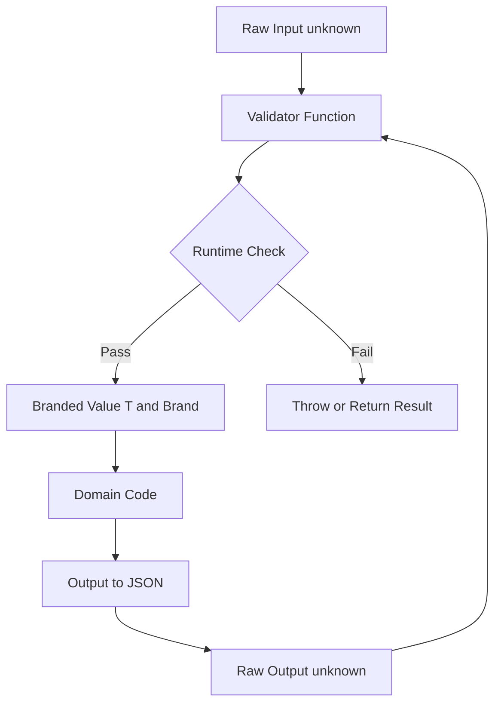

# 2.01 Design Goals and Limitations

> TypeScript is a compiler, a linter, an IDE oracle, and a documentation engine wearing the same trench coat. It is not a runtime. It is not a sound type system. It is not even a different language. It is JavaScript plus a static analysis pass that knows how shapes fit together, and the design goals published by the TypeScript team in 2012 have shaped every decision the compiler has made since. To master TS you must first master the trade-offs encoded into its DNA.

## 1. Purpose

TypeScript was announced by Microsoft on October 1, 2012. Its lead architect, Anders Hejlsberg, had previously designed Turbo Pascal, Delphi, and C. He had spent more than a decade building nominal, sound-leaning, statically typed languages where the compiler was a strict gatekeeper. When he turned to JavaScript, he had to unlearn most of those instincts. JavaScript was already ten years into its explosive domination of the web, it was dynamically typed, it had a prototype-based object model, and millions of lines of existing code were in production. A new statically typed language that compiled to JavaScript had already been tried (Dart, CoffeeScript, Script) and none of them had displaced JS at scale. Hejlsberg and his team drew a clear lesson: the only way to add types to JavaScript was to add them as an optional layer on top of the existing language, never as a replacement.

The first design goal in the TS design goals document is "Identify and report existing JavaScript patterns that are known to cause bugs." Not "prevent bugs in new code." Not "enforce a type discipline." The verb is "identify and report." This frames TS as a diagnostic tool, not a prescriptive one. It looks at code you have already written or could write in idiomatic JS, and it tells you which patterns are statistically likely to bite you. Calling a function with the wrong number of arguments. Reading a property that may be undefined. Comparing two values of structurally incompatible shapes. Treating a string as a number. These are the bug classes TS targets. Everything outside that scope is, by design, a non-goal.

The second goal is "Restrict the set of permissible JavaScript patterns to a managable subset." This is the careful, deliberate tightening that strict mode applies. With `strict: true` turned on, TS will refuse to compile code that uses implicit `any`, that does not check for `null` and `undefined`, that uses `this` in ways that lose binding context, or that tries to access index signatures unsafely. With `strict` turned off, TS is permissive enough to typecheck essentially any existing JS file you hand it. This dial is the heart of gradual typing, which we will explore in depth in Section 2.

The third goal is "Do not perform any runtime substitution of behavior on the JavaScript being compiled." TS does not polyfill. It does not monkeypatch your prototypes. It does not insert type checks into your running code. It does not change the semantics of a single JavaScript expression. The output of `tsc` should behave identically to the input if you had just handed the input to a JS engine. This is the constraint of type erasure: types exist only at compile time. At runtime, your TS program is exactly the same JS program you would have written by hand.

The fourth goal is "Provide a structurally-typed type system." This is the most consequential design decision in the entire language. Structural typing means types are compared by shape, not by name. If you declare `interface Point { x: number; y: number }` and you have an object `{ x: 1, y: 2, z: 3 }` sitting around, that object is assignable to `Point` without any `implements` clause, without any `as` cast, without any name. The compiler looks at the object's shape, sees that it has an `x: number` and a `y: number`, and says yes. This is the opposite of Java or C, where two classes with identical fields but different names are not assignable to each other unless one extends the other. Structural typing was chosen because JavaScript itself is structurally typed at runtime. `JSON.parse` hands you back an object. `Object.fromEntries` hands you back an object. `fetch().then(r => r.json())` hands you back an object. None of these objects have a class identity, and a nominal type system would have to fight the language at every boundary. Structural typing lets TS describe what JS actually does.

The fifth goal is "Provide an erasable type syntax." This is the operational consequence of type erasure. Every type annotation you write must be syntactically removable without changing the meaning of the program. Type annotations live between colons, in angle brackets, in `interface` and `type` declarations, in `as` casts. None of these constructs survive the emitter. The emitter is the final phase of the compiler, and its job is to print back JavaScript with all the type syntax stripped out. This is why you cannot, for example, write `if (x instanceof MyInterface)` and have it do anything meaningful at runtime: `MyInterface` does not exist at runtime. The compiler erased it.

The sixth goal is "Align with current and future ECMAScript proposals." TS aims to be a superset of JavaScript. Every valid JS file is a valid TS file. Every ECMAScript proposal that reaches Stage 3 (the "candidate" stage) gets typed in TS as soon as it is shipped, sometimes earlier. This means TS evolves with JS, not against it. When optional chaining (`?.`) was Stage 3, TS supported it before browsers did. When decorators were Stage 3, TS shipped them. This is in sharp contrast to languages like Dart or ReScript which define their own syntax and compete with ECMAScript. TS is JS's shadow.

So what is TS NOT?

First, TS is not a runtime type system. You cannot, in pure TS, ask "is this value of type `User`" at runtime. You can ask "does this value have the shape of `User`" by writing a type guard function, but the guard is your code, not the compiler's. The compiler erases types and gives you nothing in the output to check them. This is why runtime validation libraries like Zod, io-ts, and Ajv exist: they fill the gap that erasure leaves.

Second, TS is not a sound type system. A sound type system is one that never accepts a program that can produce a type error at runtime. TS is not sound. It accepts `x as string` even when `x` is not a string. It accepts `{}` as assignable to almost any object type. It accepts `any` as assignable to and from anything. It accepts array covariance, which means `Dog[]` is assignable to `Animal[]` and you can then push a `Cat` into it through the `Animal[]` reference. Each of these is unsound by design, because enforcing soundness would make the type system too rigid for the kinds of code JS developers actually write.

Third, TS is not a different language. A `.ts` file is a `.js` file with type syntax added. You can rename a `.js` file to `.ts` and it will compile (with `allowJs` and `checkJs` and possibly with a few errors). You can write TS that is indistinguishable from JS. This is the secret of its adoption: it met JS developers where they were, not where a type theorist wanted them to be.

The purpose of this note is to give you a complete map of these design goals and the limitations they impose. By the end you should be able to articulate, in a job interview or to a skeptical colleague, exactly why TS makes each of its trade-offs, what the consequences are for your day-to-day code, and how to use the language's escape hatches (`as`, `any`, branded types, runtime validation) responsibly.

## 2. Theory and Deep Dive

This section is the theoretical core of the note. We will cover six ideas that together define TS: structural typing, nominal typing, type erasure, gradual typing, soundness versus completeness, and the five-phase compilation pipeline. Each idea is a deliberate choice with consequences you will feel every day.

### 2.1 Structural Typing

Structural typing is the doctrine that types are compared by shape. Two types are compatible if their shapes are compatible. Shape means: the set of properties, their names, and the types of those properties. If type A has all the properties that type B requires, and those properties have compatible types, then a value of type A can be used wherever a value of type B is expected. No `implements`, no `extends`, no naming relationship is required.

Consider the simplest possible example.

TS:

```ts
interface Point2D { x: number; y: number }
interface Point3D { x: number; y: number; z: number }

const p3: Point3D = { x: 1, y: 2, z: 3 };
const p2: Point2D = p3; // OK: Point3D has all of Point2D's members

console.log(p2.x, p2.y); // 1 2
```

In a nominal system like Java, `Point3D` and `Point2D` would be unrelated types unless one explicitly `extends` the other. In TS they are related purely because `Point3D`'s shape is a superset of `Point2D`'s shape. This is "width subtyping": a wider type (more properties) is a subtype of a narrower one (fewer properties). You can assign wide to narrow but not narrow to wide.

The reason this works for JavaScript is that JS itself is structurally typed at runtime. When you call `draw(p)`, the `draw` function does not care what `p`'s constructor was. It cares whether `p.x` and `p.y` are numbers. The runtime duck-tests the object. TS simply makes that duck test static.

The consequence that catches every newcomer is the "excess property check" rule. The rule is: when you pass an object literal directly to a position that expects a typed shape, TS will reject properties that do not exist on the target type. But when you pass a variable that holds an object with extra properties, TS will accept it.

TS:

```ts
interface Point2D { x: number; y: number }

const a: Point2D = { x: 1, y: 2, z: 3 };       // Error: 'z' does not exist in type 'Point2D'
const obj = { x: 1, y: 2, z: 3 };
const b: Point2D = obj;                          // OK: structural assignability, no excess check on variables
```

The first line errors because TS treats fresh object literals as suspicious. The developer is typing out a literal right where a type is expected, so any extra property is likely a typo. The second line is fine because `obj` was declared with no `Point2D` annotation, so TS infers its type as `{ x: number; y: number; z: number }`, which is a superset of `Point2D`. The excess property check only fires on literals.

### 2.2 Nominal Typing (the alternative)

Nominal typing is the doctrine that types are compared by name. Two types are compatible only if their names are related by explicit declaration: one extends the other, one implements the other, or they share a common ancestor. Java, C, C (with structs), C, Go (with named types), and Swift all use nominal typing.

In a nominal system:

```java
class Point2D { double x; double y; }
class Point3D { double x; double y; double z; }

Point2D p = new Point3D(); // COMPILE ERROR: incompatible types
```

This errors even though `Point3D` has all the fields `Point2D` requires, because `Point3D` does not `extends Point2D`. The names are unrelated, so the types are unrelated.

Nominal typing has real benefits. It catches the case where you accidentally pass a `UserId` to a function that expects an `OrderId`, even though both are integers, because the names differ. Structural typing cannot catch this on its own: a `number` is a `number` is a `number`. We will see in Section 5 how branded types restore nominal-like safety inside a structurally typed system.

Nominal typing has real costs too. It forces you to declare every relationship in advance. It does not compose well with untyped third-party data. It does not let you describe the shape of a JSON response without first declaring a class. For JS, where JSON is the lingua franca of the web, structural typing is the only practical choice.

### 2.3 Type Erasure

Type erasure is the rule that types do not exist at runtime. The compiler reads your type annotations, uses them to check your program, then removes them from the emitted output. What comes out the other side of `tsc` is plain JavaScript. No type metadata, no reflection, no runtime type table, no way to ask "what type is this value."

Consider this trivial TS:

TS:

```ts
interface User { id: number; name: string }

function greet(u: User): string {
  return `Hello, ${u.name}`;
}

const alice: User = { id: 1, name: "Alice" };
console.log(greet(alice));
```

After compilation with default settings, the emitted JS is:

JS:

```js
function greet(u) {
    return "Hello, ".concat(u.name);
}
var alice = { id: 1, name: "Alice" };
console.log(greet(alice));
```

Notice what is gone: the `interface User` declaration, the `: User` annotations, the `: string` return type, the `: User` annotation on `alice`. The interface itself does not appear at all because interfaces are pure type-level constructs. The `function greet` is now a plain JS function with no type information attached.

This has several concrete consequences.

First, `typeof` only sees JS runtime types. `typeof alice` is `"object"`. There is no `typeof` that returns `"User"`.

Second, `instanceof` only works on values that have a constructor function at runtime. `alice instanceof User` would throw at runtime because `User` is not defined. Even if `User` were a class instead of an interface, `instanceof` would only check the prototype chain, not the property shapes.

Third, you cannot write `if (typeof x === "User")` because `"User"` is not a value the `typeof` operator ever returns. The `typeof` operator in JS returns one of eight strings: `"undefined"`, `"object"`, `"boolean"`, `"number"`, `"string"`, `"function"`, `"symbol"`, `"bigint"`. That is the entire list. TS types map to these strings only in the coarsest possible way.

Fourth, you cannot use a TS type as a value. You cannot pass `User` to a function. You cannot store `User` in an array. You cannot call methods on `User`. `User` exists only in the source text and in the compiler's memory while it is running.

Fifth, decorators and metadata emission are the one exception, and even they are limited. With `emitDecoratorMetadata` enabled (now considered legacy), the compiler emits `Reflect.metadata("design:type", Number)` calls next to decorated parameters. But this only captures the JS constructor function (Number, String, Object, etc.), not the full TS type. It cannot tell you that a parameter was typed as `User` versus `Admin`. Modern codebases use runtime validation libraries (Zod, io-ts, valibot, ArkType) to recover this information in a way the compiler can verify.

### 2.4 Gradual Typing

Gradual typing is the doctrine that types are optional. You can add them to some parts of your program and not others. You can start with zero types and add types one function at a time. You can use `any` to opt out of type checking in a single location. You can use `unknown` to opt into a forced narrowing flow. The spectrum runs from "no annotations at all" to "every variable, every parameter, every return value annotated."

The mechanism that makes this work is `any`. `any` is the universal escape hatch. A value of type `any` is assignable to and from every other type. The compiler performs no checks on `any`-typed values. You can call any method on them, access any property, pass them anywhere. This means `any` is a one-way door: once a value becomes `any`, every value derived from it is also `any`, and the type information is lost until something narrows it back.

JS (no types at all):

```js
function parseConfig(text) {
  const obj = JSON.parse(text);
  return obj.database.host;
}
```

TS (gradual, with `any`):

```ts
function parseConfig(text: string): any {
  const obj: any = JSON.parse(text);
  return obj.database.host;
}
```

TS (fully typed, with `unknown`):

```ts
interface Config { database: { host: string; port: number } }

function parseConfig(text: string): Config {
  const obj: unknown = JSON.parse(text);
  if (typeof obj === "object" && obj !== null && "database" in obj) {
    const db = obj.database;
    if (typeof db === "object" && db !== null && "host" in db && "port" in db) {
      return { database: { host: String(db.host), port: Number(db.port) } };
    }
  }
  throw new Error("Invalid config");
}
```

The first version trusts JSON. The second version trusts JSON and silences the compiler. The third version trusts nothing and forces every property access to be earned through a runtime check. Gradual typing lets you pick where on this spectrum each function lives.

In practice, mature TS codebases use the third style at boundaries (parsing untrusted input, deserializing JSON, accepting API responses) and use lighter types in the interior where data has already been validated.

### 2.5 Soundness vs Completeness

This is the most subtle and most important theoretical axis in TS design. We need to define both terms carefully.

A type system is **sound** if it never accepts a program that can produce a type error at runtime. If a sound type system says "this expression has type `string`," then at runtime the expression is guaranteed to be a string. Sound systems are common in academic languages (Haskell with no `unsafePerformIO`, ML, Elm) and rare in production languages because they are inconvenient. Java's type system is unsound due to generics erasure and array covariance. C is unsound due to casts. C is unsound due to `unsafe`.

A type system is **complete** if it accepts every program that cannot produce a type error at runtime. A complete system never rejects a valid program. In practice, no useful complete type system exists for a language as dynamic as JS because determining whether a JS program can produce a type error is undecidable (it reduces to the halting problem).

Soundness and completeness are in tension. You cannot have both for a Turing-complete language. Every practical type system is some compromise. TS compromises toward completeness. The TS team has stated explicitly that they would rather accept some unsoundness than reject valid programs that JS developers actually write. The official design goal is "do not get in the way of useful patterns."

The unsoundness in TS comes from several deliberate holes:

1. **`any`** is unsound by definition. It is assignable to and from everything. Any code path that touches `any` is unsound.

2. **Type assertions** (`x as T`) are unsound. The compiler trusts you. If you write `x as string` and `x` is actually a number, the compiler emits nothing and the runtime will happily let you call `.charAt` on a number, which will fail at runtime with a confusing error.

3. **Array covariance** is unsound. `Dog[]` is assignable to `Animal[]` because of structural subtyping. But once you have an `Animal[]` reference, you can `push` a `Cat` into the underlying array, and the array now contains a `Cat` where the original `Dog[]` reference expects only dogs.

4. **Function parameter bivariance** (without `strictFunctionTypes`). By default, methods on classes are checked bivariantly: a function that takes a more specific type is assignable to a slot that expects a function taking a more general type, and vice versa. This is unsound but it models how JS event handlers and DOM callbacks are commonly written.

5. **`{}` accepts almost anything**. The type `{}` means "any non-null, non-undefined value." `42` is assignable to `{}`. `"hello"` is assignable to `{}`. This is technically sound (every non-null value has at least an empty set of properties) but it surprises developers.

6. **Optional properties and undefined**. With `strictNullChecks` off, `undefined` is assignable to every type. With it on, you get soundness for null and undefined, but other holes remain.

7. **Index signatures and string keys**. If you have `{ [k: string]: number }`, then `obj.anything` is typed as `number`, but at runtime the property may not exist and the value will be `undefined`. The compiler cannot guarantee the index actually exists.

8. **Casts through `unknown`**. `x as unknown as T` lets you cast anything to anything. This is the ultimate escape hatch and is, by construction, unsound.

Each of these holes exists because closing it would break existing JS code or make common patterns impossible to express. The TS team's position is that unsoundness is acceptable as long as it is opt-in: you have to write `any`, `as`, or turn off a strict flag to get it. With `strict: true` enabled, the holes are reduced to a managable set, and the remaining unsoundness is documented and predictable.

### 2.6 The Five Compilation Phases

When you run `tsc`, the compiler does not just translate your TS to JS in one pass. It moves through five distinct phases, each producing a data structure that feeds the next. Understanding these phases is the key to understanding compiler error messages, performance, and the limits of what TS can know.


**Phase 1: Scanner.** The scanner reads the source text character by character and emits a stream of tokens. A token is the smallest unit of syntax: an identifier, a keyword, a number literal, a string literal, a punctuation mark, a comment, whitespace. The scanner does not understand grammar. It only knows lexemes. It distinguishes `interface` from `type` from `class` because they are different keyword tokens. It does not yet know whether they are being used correctly. The scanner also handles the lexical grammar: template literal segments, regex literals (disambiguated from division operators by heuristics), numeric separators, BigInt suffixes, and the like.

**Phase 2: Parser.** The parser consumes the token stream and produces an Abstract Syntax Tree (AST). The AST is a tree of nodes where each node represents a syntactic construct: a variable declaration, a function expression, an interface declaration, a type annotation, a return statement. The parser enforces the grammar of TS. It is here that syntax errors are caught: a missing closing brace, a misplaced `return`, an `interface` with no body. The parser produces both the syntactic structure of the program and, separately, the type-level structure (type aliases, interface declarations, conditional types, mapped types). The AST is the central data structure of the compiler; every later phase walks it.

**Phase 3: Binder.** The binder walks the AST and builds a symbol table. A symbol is the compiler's representation of a named entity: a variable, a function, a class, an interface, a type alias, a namespace. The binder resolves names to symbols. When you write `const x: Point = ...`, the binder is what makes `Point` refer to the `interface Point` declared elsewhere in the file (or imported from another file). The binder also handles scope: a local variable `x` inside a function shadows an outer `x`. The binder does not check types yet. It only establishes which name refers to which symbol. The output of the binder is, for every source file, a tree of symbols keyed by name, plus information about which declarations each symbol has (interface declaration merging happens here).

**Phase 4: Checker.** The checker is the heart of the compiler. It walks the AST and the symbol table and computes type relationships. For every expression, the checker computes its type. For every assignment, it checks whether the source type is assignable to the target type. For every function call, it checks whether the arguments match the parameter types. For every generic instantiation, it computes the type arguments. For every conditional type, it resolves the true and false branches. The checker is where the vast majority of compile time is spent, and it is where the vast majority of diagnostics (error messages) are produced. The checker is also where structural assignability, type narrowing, control flow analysis, and inference all happen.

**Phase 5: Emitter.** The emitter takes the checked program and produces output. For each input `.ts` file, it can produce a `.js` file (with all type syntax erased), a `.d.ts` file (containing only the type-level declarations, for use by other consumers), and a source map (mapping output positions back to source positions for debugging). The emitter does no type checking. It trusts the checker. Its job is purely translational: walk the AST, emit the corresponding JS, strip the types. This is why the emitter is fast and why type errors do not prevent JS output by default (unless `noEmitOnError` is set).

A crucial property of this pipeline is that the checker is the only phase that crosses file boundaries. The scanner, parser, and binder operate per-file. The checker, when resolving a type referenced from another file, will trigger that file's binder to run if it has not already. This is why TS uses a project-wide program model: a `Program` object holds all source files, all their symbols, and all their type information, and the checker can navigate freely across them. It is also why the first compile of a large project is slow (every file must be parsed, bound, and checked) and why incremental compilation and project references exist to skip work on files that have not changed.

### 2.7 Why TS Makes Each Trade-off

Each design decision above is a trade-off, and the TS team has written about each one. Here is a compact summary.

Structural typing was chosen because JS is structurally typed at runtime. A nominal system would force developers to wrap every JSON-parse result in a class, which would be unacceptable friction.

Type erasure was chosen because the alternative (runtime type information) would require shipping a runtime, which would make TS a different language. The TS team's stated goal is "do not impose a runtime." Erasure keeps output small, fast, and pure JS.

Gradual typing was chosen because the alternative (an all-or-nothing type system) would prevent incremental adoption. The TS team wanted every existing JS file to be a valid TS file from day one. This drove adoption: teams could rename `.js` to `.ts`, fix a few errors, and ship.

Completeness over soundness was chosen because the TS team's stated goal is "do not get in the way of useful patterns." A sound system would reject idiomatic JS patterns like array covariance and would force developers to add annotations the compiler could not infer. The cost is occasional unsoundness; the benefit is a system that real developers will actually use.

The five-phase pipeline was chosen because it cleanly separates concerns. The scanner and parser are standard compiler theory. The binder is needed because of declaration merging and scope. The checker is where all the type-system intelligence lives. The emitter is dumb on purpose. This separation lets the team evolve each phase independently: new syntax only touches scanner and parser; new type system features only touch the checker; new emit targets (ES3, ES5, ES2015, ES2020) only touch the emitter.

## 3. Mental Models

A good mental model lets you predict what the compiler will do without running it. Here are five models that, together, capture the spirit of TS.

### 3.1 "A linter on steroids that understands JS shapes"

Pretend TS is ESLint with one superpower: it knows what properties every object has, what types every function expects, and how those shapes flow through your code. Like ESLint, it runs before you ship. Like ESLint, it cannot run your code. Like ESLint, its output is warnings and errors. Unlike ESLint, its rules are not patterns you configure but a type algebra it computes from your annotations. When you internalize this, you stop expecting TS to do things only a runtime can do (like check whether `JSON.parse` returned what you hoped).

### 3.2 "If it walks like a duck and quacks like a duck, it's a duck"

This is the canonical statement of structural typing, borrowed from Python's duck typing but applied at compile time. The compiler does not ask "what is your name?" It asks "do you have the right shape?" If your object has the methods and properties the target type requires, you pass. If you do not, you fail. This model explains why `{ x: 1, y: 2, z: 3 }` is a `Point2D`: it walks like one. It also explains why two classes with identical fields but different names are interchangeable: names do not matter to the duck.

### 3.3 "Types are comments that the compiler checks then strips"

Pretend every type annotation is a comment. The compiler reads the comment, checks that the code under it matches the comment, then deletes the comment. What is left is plain JS. This model explains type erasure. It also explains why `interface User` produces no JS output: it is pure comment. It also explains why `as string` does nothing at runtime: it is a comment the compiler accepted on faith.

### 3.4 "You can add types anywhere on the spectrum from none to all"

Pretend types are a knob, not a switch. You can set it to zero (no annotations anywhere, everything is `any` by inference) or to ten (every parameter, every return, every variable explicitly annotated) or anywhere in between. The compiler will infer the rest. The knob is per-function, per-file, per-project. This model explains gradual typing and why a team can adopt TS incrementally.

### 3.5 "The compiler never lies, but it sometimes stays silent"

A soundness model. When the compiler says "this is a string," that statement may or may not be true at runtime (because of `any` and `as`). When the compiler says "this is an error," that statement is always correct (you wrote code that violates the type rules). The asymmetry is important: errors are real, confirmations are contingent. This model explains why you should not blindly trust green check marks but should take red squiggles seriously.

### 3.6 "Branded types are Post-It notes on values"

When you need nominal safety inside a structural system, you pretend to add a property that does not exist at runtime. You write `type UserId = string & { brand: "UserId" }`. The compiler treats this as a distinct type because of the phantom `brand` property. At runtime, the value is just a string. The brand is a Post-It note the compiler reads and the runtime ignores. This model explains branded types and is the foundation of Section 10's mini-project.

## 4. Real-World Use Cases

TS in production serves five distinct purposes, and the value of each is different.

### 4.1 IDE Autocomplete on Dot

The single most-felt benefit of TS in daily work is autocomplete. When you type `user.` in an editor, the IDE shows you every property on `user`, its type, and its documentation. This works because the IDE runs the TS language server, which runs the checker on every keystroke and queries the resulting type graph. The autocomplete is not magic. It is the checker resolving the type of `user`, looking up its symbol, and listing its members. This is why TS adoption correlates so strongly with IDE quality: the language server is the IDE's brain.

JS (no autocomplete without JSDoc):

```js
function handleUser(user) {
  user. // <-- no suggestions unless user has JSDoc
}
```

TS (full autocomplete):

```ts
interface User { id: number; name: string; email: string }

function handleUser(user: User) {
  user. // <-- suggests id, name, email
}
```

### 4.2 Refactoring Tools

Rename, find all references, extract function, extract interface, change signature: these refactors work in TS because the checker maintains a symbol graph across files. When you rename a function, the IDE asks the checker "where is this symbol referenced?" and the checker walks the program's type graph and returns every reference, including those in type positions. This is impossible in pure JS because there is no symbol graph. JS rename is a textual search; TS rename is a semantic query.

### 4.3 API Documentation via .d.ts Files

A `.d.ts` file is a declaration file: it contains only type-level declarations, no implementation. Libraries ship `.d.ts` files alongside their JS so that consumers get types without having to read the source. The `.d.ts` is the public type contract of the library. When you `npm install lodash`, you also install `@types/lodash` (or use the bundled types) so that your TS code can call `lodash.chunk(arr, 2)` with full type safety. The `.d.ts` is generated by the emitter (with `declaration: true` in tsconfig) from your `.ts` source, or it is hand-written for libraries that predate TS.

### 4.4 Library Type Definitions on DefinitelyTyped

DefinitelyTyped is a GitHub repository of `.d.ts` files for JavaScript libraries that do not ship their own types. It is the largest TS-specific open source project. When you `npm install --save-dev @types/express`, you are pulling from DefinitelyTyped. The existence of DefinitelyTyped is what made TS viable for real projects: any JS library you might want to use already has types available, written by the community. This is a direct consequence of TS's structural-typing decision: writing types for an existing JS library does not require modifying the library.

### 4.5 TSC as a Build Tool

`tsc` is not just a type checker. It is also a build tool. With `outDir` set, it compiles a multi-file TS project into a multi-file JS project, applying module transformation (CommonJS to ESM, ESM to CommonJS), target downleveling (ES2020 to ES5), and source map generation. Many projects use `tsc` directly as their build step. Others use bundlers (esbuild, Vite, swc, Rollup with `@rollup/plugin-typescript`) that call TS-compatible transpilers internally, often skipping the checker for speed and running `tsc --noEmit` separately in CI.

### 4.6 TypeScript ESLint for Additional Rules

`@typescript-eslint` is a linting layer on top of TS. It uses the TS AST (which it gets from the parser) and runs rules that the type checker cannot express. Examples: "no unused variables" (the checker has a flag for this but eslint is more configurable), "no floating promises" (the checker does not warn on unawaited promises by default), "consistent type imports" (enforce `import type`), "no explicit any" (the checker allows `any` but eslint can forbid it). The point is that TS the type checker is intentionally permissive about style, and eslint fills the style gap.

## 5. Code Examples

### 5.1 Example A — Minimal and Conceptual

Goal: demonstrate structural vs nominal typing in the smallest possible footprint.

JS (no types; runtime duck typing):

```js
function distance(p) {
  return Math.sqrt(p.x * p.x + p.y * p.y);
}

const point2D = { x: 3, y: 4 };
const point3D = { x: 3, y: 4, z: 12 };
const fake    = { x: 3, y: 4, color: "red" };

console.log(distance(point2D)); // 5
console.log(distance(point3D)); // 5  (z ignored)
console.log(distance(fake));    // 5  (color ignored)
```

TS (structural typing mirrors runtime duck typing):

```ts
interface Point2D { x: number; y: number }

function distance(p: Point2D): number {
  return Math.sqrt(p.x * p.x + p.y * p.y);
}

const point2D: Point2D = { x: 3, y: 4 };
const point3D = { x: 3, y: 4, z: 12 };
const fake    = { x: 3, y: 4, color: "red" };

console.log(distance(point2D)); // 5
console.log(distance(point3D)); // 5  (structurally compatible, extra props allowed for non-literal)
console.log(distance(fake));    // 5  (structurally compatible)

// Excess property check fires only on literals:
// distance({ x: 3, y: 4, z: 12 });  // Error: 'z' does not exist in type 'Point2D'
```

Notice the parallel: at runtime, JS duck typing accepts any object with `x` and `y`. At compile time, TS structural typing does the same. The literal-vs-variable distinction in TS is a compile-time safety net that has no runtime analog.

Now the nominal counterexample, showing what TS does NOT do:

TS (attempting nominal behavior, which fails):

```ts
class UserId { constructor(public value: number) {} }
class OrderId { constructor(public value: number) {} }

function fetchUser(id: UserId) { return `user ${id.value}`; }

const oid = new OrderId(42);
// fetchUser(oid); // Error in TS, but only because classes are nominally checked among themselves
```

Wait — TS classes ARE nominally typed when it comes to class identity. `instanceof` checks the prototype chain, and a `UserId` instance is not an `OrderId` instance. But the fields are structurally compatible, so if you extract `oid.value` and pass the raw number, structural typing takes over. The next example shows how to harden this with branded types.

### 5.2 Example B — Production-Grade

Goal: a typed API client with branded types for nominal-ish safety, demonstrating real production patterns.

JS (typical API client, no safety):

```js
const apiBase = "https://api.example.com";

async function getUser(id) {
  const res = await fetch(`${apiBase}/users/${id}`);
  if (!res.ok) throw new Error(`HTTP ${res.status}`);
  return res.json();
}

async function getOrder(id) {
  const res = await fetch(`${apiBase}/orders/${id}`);
  if (!res.ok) throw new Error(`HTTP ${res.status}`);
  return res.json();
}

// Nothing stops you from swapping IDs:
const user = await getUser(99);          // works, but is 99 a user ID?
const order = await getOrder(99);        // works, but is 99 an order ID?
const wrong = await getUser(order.id);   // works at runtime, returns 404 or worse
```

TS (production-grade with branded types):

```ts
// --- Brand infrastructure -----------------------------------------------
declare const brand: unique symbol;
type Brand<T, B extends string> = T & { readonly [brand]: B };

type UserId  = Brand<number, "UserId">;
type OrderId = Brand<number, "OrderId">;
type Email   = Brand<string, "Email">;
type Url     = Brand<string, "Url">;

// --- Runtime constructors with validation -------------------------------
function makeUserId(n: number): UserId {
  if (!Number.isInteger(n) || n <= 0) throw new Error(`Invalid UserId: ${n}`);
  return n as UserId;
}

function makeEmail(s: string): Email {
  if (!/^[^@\s]+@[^@\s]+\.[^@\s]+$/.test(s)) throw new Error(`Invalid Email: ${s}`);
  return s as Email;
}

// --- Domain models ------------------------------------------------------
interface User  { id: UserId;  name: string; email: Email }
interface Order { id: OrderId; userId: UserId; total: number }

// --- API client ---------------------------------------------------------
const apiBase: Url = "https://api.example.com" as Url;

async function getJson<T>(url: Url, validate: (raw: unknown) => T): Promise<T> {
  const res = await fetch(url);
  if (!res.ok) throw new Error(`HTTP ${res.status}`);
  return validate(await res.json());
}

const validateUser = (raw: unknown): User => {
  if (typeof raw !== "object" || raw === null) throw new Error("not an object");
  const r = raw as Record<string, unknown>;
  if (typeof r.id !== "number" || typeof r.name !== "string" || typeof r.email !== "string") {
    throw new Error("invalid user shape");
  }
  return { id: makeUserId(r.id), name: r.name, email: makeEmail(r.email) };
};

async function getUser(id: UserId): Promise<User> {
  return getJson(`${apiBase}/users/${id}` as Url, validateUser);
}

// --- Usage --------------------------------------------------------------
const uid = makeUserId(42);
const user = await getUser(uid);

// These now fail at compile time:
// getUser(user.email);               // Error: Email is not assignable to UserId
// getUser(user.id as unknown as OrderId); // works, but you wrote the escape hatch
```

This example shows the full TS production stack: branded types for nominal safety, runtime validators that produce branded values, generic API helpers with `unknown` input, and a strict boundary between untrusted JSON and trusted domain objects. Every `as` cast is localized to a constructor that also performs a runtime check, so the unsoundness is contained and auditable.

## 6. Common Mistakes and Anti-Patterns

### 6.1 Thinking TS Types Exist at Runtime

This is the number one newcomer mistake. Developers write `if (typeof x === "User")` and expect it to work. It does not. `typeof` returns one of eight JS strings (`"undefined"`, `"object"`, `"boolean"`, `"number"`, `"string"`, `"function"`, `"symbol"`, `"bigint"`). `"User"` is never one of them.

JS (works only for class instances):

```js
class User { constructor(name) { this.name = name; } }
const u = new User("Alice");
console.log(typeof u);             // "object"
console.log(u instanceof User);    // true
console.log(u.constructor.name);   // "User"
```

TS (interface types have no runtime presence):

```ts
interface User { name: string }
const u: User = { name: "Alice" };
console.log(typeof u);             // "object"
// console.log(u instanceof User); // ReferenceError: User is not defined
```

The fix: use type guards or runtime validation libraries. Never rely on TS types at runtime.

### 6.2 Thinking `interface` and `type` Are Identical

They are not. They overlap heavily for object shapes, but they differ in three critical ways.

First, **declaration merging**. Interfaces with the same name in the same scope are merged into one. Type aliases are not merged; redeclaring a type alias is an error.

TS:

```ts
interface Window { myCustomProp: number } // merges with lib.dom.d.ts Window
const w = window as Window & typeof globalThis;
w.myCustomProp = 42; // OK

type Foo = { a: number };
// type Foo = { b: number }; // Error: Duplicate identifier 'Foo'
```

Second, **union and intersection types**. `type` can express unions (`A | B`) and intersections (`A & B`). `interface` cannot. You can write `type Either = A | B` but you cannot write `interface Either extends A, B` to get a union (you get an intersection, and only of object types).

Third, **extends vs intersection**. An interface can `extends` multiple other interfaces, which produces an intersection but with error reporting that names the conflicting base. `type A & B` produces an intersection but with worse error messages on conflict.

The rule of thumb: use `interface` for object shapes that might be extended or merged (especially library public types); use `type` for unions, intersections, mapped types, conditional types, and aliases of primitives.

### 6.3 Trusting `as` Assertions

`as` is a lie you tell the compiler. It performs no runtime check. It is a one-way coercion of the type system. Use it sparingly and always with a comment explaining why.

TS (unsafe):

```ts
const data: unknown = JSON.parse('{"x": 1}');
const point = data as { x: number; y: number }; // lies! y is missing
console.log(point.y.toFixed());                  // TypeError: Cannot read property 'toFixed' of undefined
```

TS (safe):

```ts
function isPoint(v: unknown): v is { x: number; y: number } {
  return typeof v === "object" && v !== null
    && typeof (v as any).x === "number"
    && typeof (v as any).y === "number";
}

const data: unknown = JSON.parse('{"x": 1, "y": 2}');
if (isPoint(data)) {
  console.log(data.y.toFixed()); // safe, compiler narrowed data
}
```

### 6.4 Expecting Soundness (`any` Leaks Everywhere)

`any` is contagious. Once a value is `any`, every expression derived from it is `any`. The compiler stops checking. This is why `any` should be treated as a code smell in mature codebases.

TS (unsoundness cascade):

```ts
function parse(s: string): any { return JSON.parse(s); }

const cfg = parse('{"a": 1}');
const b = cfg.b;        // any, no error
const c = b.c;          // any, no error
const d = c.d.e.f.g;    // any, no error
console.log(d);         // TypeError at runtime
```

TS (sound alternative):

```ts
function parse(s: string): unknown { return JSON.parse(s); }

const cfg = parse('{"a": 1}');
// const b = cfg.b; // Error: 'cfg' is of type 'unknown'
if (typeof cfg === "object" && cfg !== null && "b" in cfg) {
  const b = cfg.b; // type is unknown, you must narrow further
}
```

### 6.5 Structural Typing Surprises

`{ a: 1 }` is assignable to almost any interface that requires only `a: number` or fewer properties. This means an object literal can "accidentally" satisfy many interfaces.

TS (surprising assignability):

```ts
interface Serializable { toJSON(): string }
interface Iterable<T> { [Symbol.iterator](): Iterator<T> }

const obj = { a: 1 }; // infers { a: number }
// const s: Serializable = obj; // Error: no toJSON
// const i: Iterable<number> = obj; // Error: no Symbol.iterator

// But:
interface HasA { a: number }
const ha: HasA = obj; // OK
interface HasAOptional { a?: number }
const hao: HasAOptional = obj; // OK
interface Empty {}
const e: Empty = obj; // OK! any object is assignable to Empty
```

The `{}` type accepts any non-null value. `const n: {} = 42;` compiles. This is rarely what you want. Use `Record<string, unknown>` for "some object" and `object` for "any non-primitive."

### 6.6 `enum` Runtime vs Type Confusion

`enum` declares both a type and a runtime object. The runtime object is a real JS value that survives compilation. This is unlike `interface` and `type`.

TS:

```ts
enum Color { Red, Green, Blue }

const c: Color = Color.Red;     // type usage
const v = Color.Red;            // value usage, v === 0
const name = Color[0];          // "Red" (reverse mapping for numeric enums)
console.log(typeof Color);      // "object"
```

JS (emitted):

```js
var Color;
(function (Color) {
  Color[Color["Red"] = 0] = "Red";
  Color[Color["Green"] = 1] = "Green";
  Color[Color["Blue"] = 2] = "Blue";
})(Color || (Color = {}));
var c = Color.Red;
var v = Color.Red;
var name = Color[0];
console.log(typeof Color);
```

The surprises: numeric enums have reverse mappings; string enums do not. `const enum` is erased entirely but is fragile across module boundaries and is disallowed by `isolatedModules`. Many teams now prefer union types of string literals (`type Color = "Red" | "Green" | "Blue"`) over `enum` for simplicity.

### 6.7 Forgetting That `strict` Defaults Changed Across Versions

`strict: true` is the master flag, but what it enables has grown over TS versions. In TS 5.4, `strict` enables: `noImplicitAny`, `strictNullChecks`, `strictFunctionTypes`, `strictBindCallApply`, `strictPropertyInitialization`, `noImplicitThis`, `useUnknownInCatchVariables`, and (since 5.0) `alwaysStrict`. If you upgrade TS, new strictness may appear. Read the release notes.

### 6.8 Using `any` in Catch Clauses (pre-4.4 default)

Before TS 4.4, the `catch` variable was typed `any`. From 4.4 with `useUnknownInCatchVariables` (part of `strict`), it is `unknown`. You must narrow it before accessing properties.

TS (modern, correct):

```ts
try {
  await risky();
} catch (e: unknown) {
  if (e instanceof Error) console.log(e.message);
  else console.log(String(e));
}
```

## 7. Best Practices and Design Patterns

### 7.1 Enable `strict: true` in tsconfig

This is the single highest-leverage decision in a TS project. Without `strict`, the compiler will silently accept `any` in untyped parameters, will not check for `null` and `undefined`, and will treat `this` loosely. With `strict`, you get the type safety that justifies adopting TS in the first place. The strictness flags have been carefully designed to be opt-in for backward compatibility, but new projects should always opt in.

### 7.2 Avoid `any`. Use `unknown` Instead

`any` says "I do not know and I do not care." `unknown` says "I do not know, and the compiler will force you to figure it out before using it." Every place you would write `any`, ask whether `unknown` plus a type guard would work. Usually it does.

`any` is appropriate in exactly three places: (a) prototypes of quick scripts, (b) shimming a missing library type until you can write a real one, (c) escaping a compiler bug. In all three, leave a comment.

### 7.3 Prefer `interface` for Object Shapes (Declaration Merging)

For library public types, `interface` is preferable because consumers can extend it via declaration merging without forking the library. For internal types where merging would be a bug, `type` is preferable because it cannot be merged.

### 7.4 Prefer `type` for Unions, Intersections, Mapped Types, Conditional Types

`type` is the only choice for these constructs. `interface` cannot express them. Use `type` for: unions (`A | B`), intersections of non-object types, mapped types (`{ [K in keyof T]: ... }`), conditional types (`T extends U ? X : Y`), template literal types (`\`${prefix}${string}\``), and aliases of primitives (`type Seconds = number`).

### 7.5 Use Branded Types for Nominal Safety

Whenever you have two values of the same primitive type that should not be interchangeable (user IDs and order IDs, both numbers; emails and URLs, both strings), brand them. The pattern:

```ts
type UserId = number & { readonly brand: "UserId" };
const makeUserId = (n: number): UserId => n as UserId;
```

This costs nothing at runtime (the brand is phantom) and prevents an entire class of mistakes at compile time.

### 7.6 Document Why You Used `as` (and Prefer Type Guards)

Every `as` cast is a place you told the compiler to trust you. Code review should treat each `as` as a defect requiring justification. Prefer type guards (`x is T`) that perform runtime checks. If you must `as`, write a comment explaining why and what invariant you are relying on.

### 7.7 Use `satisfies` for Compile-Time Checks Without Widening

The `satisfies` operator (TS 4.9+) checks that an expression matches a type without changing the expression's inferred type. This is the right tool when you want to validate a config object against a schema but keep its narrow literal types.

```ts
type Colors = "red" | "green" | "blue";
const palette = {
  primary: "red",
  secondary: "blue"
} satisfies Record<string, Colors>;

palette.primary; // type is "red", not Colors
```

### 7.8 Enable `noUncheckedIndexedAccess` for Extra Safety

By default, TS assumes that indexing into an array or a record returns the value type, not `T | undefined`. With `noUncheckedIndexedAccess`, the compiler admits that the index might be out of range and types the result as `T | undefined`. This catches many off-by-one errors.

### 7.9 Use `const` Assertions for Literal Type Inference

`const x = "hello" as const;` infers the literal type `"hello"` instead of `string`. This is essential for tagged unions, configuration objects, and any place you want the narrowest possible type.

### 7.10 Keep Public APIs Sound, Accept Unsoundness Internally

A library's public types should be as sound as you can make them: every `any` is a chance for a consumer to crash at runtime. Internally, where you control all callers, a small amount of `any` or `as` is acceptable as long as it is localized. The boundary between "internal unsoundness" and "public soundness" is where code review should focus.

## 8. Technical Interview Knowledge

Here are eight questions you should be able to answer fluently, with examples.

### Q1: Is TypeScript structurally or nominally typed?

**Answer**: Structurally, with one narrow exception. TS compares types by shape: if type A has all the properties that type B requires, with compatible types, then A is assignable to B regardless of names. The exception is class identity: two classes with identical fields but different names are not interchangeable when you use `instanceof`, because `instanceof` checks the prototype chain. But when you assign an instance of one class to a variable typed as the other, structural typing applies and the assignment succeeds. The vast majority of TS is structural.

Example:

```ts
class A { x = 1 }
class B { x = 1 }
const a: A = new B(); // OK: structurally compatible
// const b: B = new A(); // also OK
```

### Q2: What is type erasure?

**Answer**: The compiler's process of removing all type annotations before emitting JS. Interfaces, type aliases, type parameters, generic arguments, `as` casts, return type annotations, parameter type annotations: all vanish from the output. What remains is plain JS. Consequences: `typeof` only sees JS runtime types; `instanceof` only works on class constructors; you cannot ask "is this value of type `User`" at runtime; you cannot pass a type as a value; runtime validation libraries (Zod, io-ts) exist to fill the gap.

### Q3: Is TypeScript sound?

**Answer**: No. TS is deliberately unsound in several places: `any` is assignable to and from everything; `as` casts are trusted; arrays are covariant; function parameters are bivariant by default (without `strictFunctionTypes`); `{}` accepts any non-null value; index signatures assume the key exists. The TS team's stated design goal is "do not get in the way of useful patterns," which means they prefer completeness (accepting all valid programs) over soundness (rejecting all invalid ones). With `strict: true`, the unsoundness is reduced to a documented, predictable set.

### Q4: What are the compilation phases of `tsc`?

**Answer**: Five phases. (1) Scanner: source text to token stream. (2) Parser: tokens to AST. (3) Binder: AST to symbol table, resolving names and scopes. (4) Checker: walks AST and symbols, computes types, checks assignability, emits diagnostics. (5) Emitter: produces `.js`, `.d.ts`, and source maps from the checked program. The checker is the only phase that crosses file boundaries; the others are per-file. This separation is why incremental compilation can skip unchanged files.

### Q5: What is the difference between `interface` and `type`?

**Answer**: Three differences. (1) Declaration merging: interfaces with the same name merge; type aliases cannot be redeclared. (2) Expressiveness: `type` can express unions, intersections, mapped types, conditional types, template literal types; `interface` cannot. (3) Error messages and extension semantics: `interface extends` produces named errors on conflict; `type &` produces structural conflicts that are harder to read. Rule of thumb: `interface` for object shapes that may be extended or merged (library public types); `type` for everything else (unions, aliases, mapped types).

### Q6: What is gradual typing?

**Answer**: A type system in which types are optional and can be added incrementally. TS supports gradual typing via `any` (opt out completely) and `unknown` (force narrowing). You can write a `.ts` file with zero annotations and it compiles. You can add types to one function at a time. You can mix typed and untyped code freely. The mechanism that makes this work is the bivalence of `any`: it is assignable to and from every type, so it acts as a universal adapter at typed-untyped boundaries. The cost is that `any` is unsound: once a value is `any`, the compiler stops checking it.

### Q7: Why does TypeScript allow some unsoundness?

**Answer**: Three reasons. (1) Practicality: closing every unsoundness hole would reject idiomatic JS patterns (array covariance, function bivariance, optional parameters). The TS team's stated goal is to support JS as it is written, not as a type theorist would prefer it. (2) Adoption: a too-strict system would have prevented incremental migration from JS, which is what drove TS adoption. (3) Performance: a fully sound system would require more sophisticated inference that would slow the checker. The TS team's position is that unsoundness is acceptable as long as it is opt-in (`any`, `as`, disabled strict flags) and predictable.

### Q8: How would you implement nominal typing in TypeScript?

**Answer**: Branded types (also called opaque types). The pattern: intersect a primitive with a phantom property that exists only at the type level.

```ts
declare const brand: unique symbol;
type Brand<T, B extends string> = T & { readonly [brand]: B };

type UserId = Brand<number, "UserId">;
type OrderId = Brand<number, "OrderId">;

const makeUserId = (n: number): UserId => n as UserId;
const makeOrderId = (n: number): OrderId => n as OrderId;

function fetchUser(id: UserId): Promise<User> { /* ... */ }
const uid = makeUserId(42);
// fetchUser(makeOrderId(42)); // Error: OrderId is not assignable to UserId
```

At runtime, `uid` is just the number `42`. The brand is a phantom property the compiler tracks but the runtime never sees. The `as` cast is contained in the constructor function `makeUserId`, which is the only place unsoundness is allowed. This gives you nominal safety inside a structurally typed system.

## 9. Practical Exercises

### Exercise 1: Demonstrate Structural Assignability with Three Interfaces

**Task**: Define three interfaces `A`, `B`, `C` where `C` is wider than `B` which is wider than `A`. Show that a value of type `C` is assignable to variables of types `B` and `A`, but a value of type `A` is not assignable to `B` or `C`. Show the excess property check failing on a literal but passing on a variable.

**Solution**:

```ts
interface A { a: number }
interface B extends A { b: number }
interface C extends B { c: number }

const cValue: C = { a: 1, b: 2, c: 3 };
const bValue: B = cValue;  // OK: C is a subtype of B (more props)
const aValue: A = cValue;  // OK: C is a subtype of A
const bFromA: B = bValue;  // OK: B is a subtype of A... wait, B is the source, A is the target
// Actually: bValue is B, assigning to A is fine (B has all of A's props)
const aFromB: A = bValue;  // OK
// const bFromA: B = aValue; // Error: Property 'b' is missing in type 'A'

// Excess property check on literal:
// const a: A = { a: 1, b: 2 }; // Error: 'b' does not exist in type 'A'
const obj = { a: 1, b: 2 };
const aOk: A = obj;        // OK: no excess check on non-literal
```

**Key insight**: width subtyping flows from wider to narrower. Excess property checks only fire on fresh literals.

### Exercise 2: Implement a Branded Type for User ID

**Task**: Create a `UserId` branded type backed by `string` (UUIDs). Write a `makeUserId` constructor that validates the UUID format at runtime and returns a branded value. Write a function `getUser(id: UserId)` that rejects plain strings at compile time. Show that two branded types (`UserId` and `OrderId`) backed by the same primitive are not interchangeable.

**Solution**:

```ts
declare const brand: unique symbol;
type Brand<T, B extends string> = T & { readonly [brand]: B };

type UserId  = Brand<string, "UserId">;
type OrderId = Brand<string, "OrderId">;

const uuidRegex = /^[0-9a-f]{8}-[0-9a-f]{4}-[1-5][0-9a-f]{3}-[89ab][0-9a-f]{3}-[0-9a-f]{12}$/i;

function makeUserId(s: string): UserId {
  if (!uuidRegex.test(s)) throw new Error(`Invalid UUID: ${s}`);
  return s as UserId;
}

function makeOrderId(s: string): OrderId {
  if (!uuidRegex.test(s)) throw new Error(`Invalid UUID: ${s}`);
  return s as OrderId;
}

interface User { id: UserId; name: string }
async function getUser(id: UserId): Promise<User> {
  const res = await fetch(`/api/users/${id}`);
  if (!res.ok) throw new Error(`HTTP ${res.status}`);
  const raw = await res.json() as unknown;
  if (typeof raw !== "object" || raw === null) throw new Error("bad shape");
  const r = raw as Record<string, unknown>;
  if (typeof r.id !== "string" || typeof r.name !== "string") throw new Error("bad shape");
  return { id: makeUserId(r.id), name: r.name };
}

const uid = makeUserId("550e8400-e29b-41d4-a716-446655440000");
const user = await getUser(uid);

// Compile-time errors:
// getUser("not even a uuid");                  // Error: string not assignable to UserId
// getUser(makeOrderId("550e8400-e29b-41d4-a716-446655440000")); // Error: OrderId not assignable to UserId
// getUser(user.id as OrderId);                 // Error: UserId not assignable to OrderId
```

**Key insight**: brands give you nominal safety at zero runtime cost. The `as` is contained in the constructor, which also performs a runtime check.

### Exercise 3: Show Type Erasure by Inspecting Emitted JS

**Task**: Write a small TS file with an interface, a generic function, and a class with type parameters. Compile it with `tsc --target ES2020 --module CommonJS` and inspect the output. Identify every erased construct.

**Solution**:

TS source (`example.ts`):

```ts
interface Repo<T> {
  findAll(): T[];
  findById(id: string): T | undefined;
}

class User { constructor(public id: string, public name: string) {} }

class UserRepo implements Repo<User> {
  constructor(private users: User[]) {}
  findAll(): User[] { return this.users; }
  findById(id: string): User | undefined { return this.users.find(u => u.id === id); }
}

const repo = new UserRepo([new User("1", "Alice"), new User("2", "Bob")]);
console.log(repo.findById("1"));
```

Emitted JS (`example.js`):

```js
"use strict";
class User {
    constructor(id, name) {
        this.id = id;
        this.name = name;
    }
}
class UserRepo {
    constructor(users) {
        this.users = users;
    }
    findAll() { return this.users; }
    findById(id) { return this.users.find(u => u.id === id); }
}
const repo = new UserRepo([new User("1", "Alice"), new User("2", "Bob")]);
console.log(repo.findById("1"));
```

**What was erased**:
- The `interface Repo<T>` declaration (gone entirely).
- The `implements Repo<User>` clause on `UserRepo`.
- All type annotations (`: User[]`, `: string`, `: User | undefined`, `: User`, `public id: string`).
- The `public` keyword on constructor parameters (TS-specific; the field assignment is preserved as `this.id = id`).
- The generic type parameter `<T>` on `Repo`.

**What survived**: the `class` declarations (classes are runtime constructs), the constructor bodies, the method bodies, the `const repo` initialization, the `console.log` call.

**Key insight**: interfaces and type aliases vanish; classes survive because they are runtime values. The `implements` clause is type-level only and is erased.

### Exercise 4: Refactor an `any`-Heavy Codebase to `unknown` + Type Guards

**Task**: Take the following `any`-heavy code and refactor it to use `unknown` and runtime type guards. Add branded types for the IDs.

Before (JS):

```js
function loadConfig(text) {
  const obj = JSON.parse(text);
  return {
    port: obj.port,
    host: obj.host,
    userIds: obj.userIds.map(id => parseInt(id, 10))
  };
}

function startServer(config) {
  console.log(`Starting on ${config.host}:${config.port}`);
  for (const id of config.userIds) {
    console.log(`User: ${id}`);
  }
}
```

After (TS, sound):

```ts
declare const brand: unique symbol;
type Brand<T, B extends string> = T & { readonly [brand]: B };
type UserId = Brand<number, "UserId">;

interface Config {
  port: number;
  host: string;
  userIds: UserId[];
}

function isRecord(v: unknown): v is Record<string, unknown> {
  return typeof v === "object" && v !== null;
}

function isNumber(v: unknown): v is number {
  return typeof v === "number" && Number.isFinite(v);
}

function isString(v: unknown): v is string {
  return typeof v === "string";
}

function isNumberArray(v: unknown): v is number[] {
  return Array.isArray(v) && v.every(isNumber);
}

function makeUserId(n: number): UserId {
  if (!Number.isInteger(n) || n <= 0) throw new Error(`Invalid UserId: ${n}`);
  return n as UserId;
}

function loadConfig(text: string): Config {
  const obj: unknown = JSON.parse(text);
  if (!isRecord(obj)) throw new Error("Config must be an object");
  if (!isNumber(obj.port)) throw new Error("port must be a number");
  if (!isString(obj.host)) throw new Error("host must be a string");
  if (!Array.isArray(obj.userIds) || !obj.userIds.every(isString)) {
    throw new Error("userIds must be an array of strings");
  }
  const userIds: UserId[] = obj.userIds.map((s) => makeUserId(parseInt(s, 10)));
  return { port: obj.port, host: obj.host, userIds };
}

function startServer(config: Config): void {
  console.log(`Starting on ${config.host}:${config.port}`);
  for (const id of config.userIds) {
    console.log(`User: ${id}`);
  }
}

const cfg = loadConfig(process.env.configJson || '{"port":3000,"host":"localhost","userIds":["1","2","3"]}');
startServer(cfg);
```

**Key insight**: every property access is earned through a runtime check that the compiler can verify. The branded `UserId` ensures that downstream code cannot accidentally treat a port number as a user ID. The trade-off is verbosity; the benefit is soundness at the boundary.

## 10. Mini-Project Blueprint: Build a Branded-Type Library

Goal: ship a small, reusable npm package that provides a `Brand<T, B>` utility, a set of common branded types (UserId, Email, Url, ISO8601), and runtime validators that produce branded values. This is the kind of library you would use across multiple projects to enforce nominal safety at boundaries.

### 10.1 Architecture



The library has three layers: (1) the brand infrastructure (pure type-level), (2) the validator functions (runtime + type-level), (3) the JSON boundary helpers (serialize/deserialize with validation).

### 10.2 File Structure

```
src/
  brand.ts          // Brand<T, B>, branded primitive types
  validators.ts     // makeUserId, makeEmail, makeUrl, makeISO8601
  result.ts         // Result<T, E> type for non-throwing validation
  json.ts           // parseWith, stringifyWith helpers
  index.ts          // public API
test/
  brand.test.ts
  validators.test.ts
  json.test.ts
```

### 10.3 Brand Infrastructure

```ts
// src/brand.ts
declare const brand: unique symbol;

export type Brand<T, B extends string> = T & { readonly [brand]: B };

export type UserId   = Brand<number, "UserId">;
export type OrderId  = Brand<number, "OrderId">;
export type Email    = Brand<string, "Email">;
export type Url      = Brand<string, "Url">;
export type ISO8601  = Brand<string, "ISO8601">;

export function unbrand<T, B extends string>(b: Brand<T, B>): T {
  return b as T;
}
```

The `unbrand` function is the escape hatch: it strips the brand at the boundary (e.g., before serializing to JSON). The `declare const brand: unique symbol` trick ensures the brand property cannot collide with any real property name.

### 10.4 Validators

```ts
// src/validators.ts
import { Brand, UserId, OrderId, Email, Url, ISO8601 } from "./brand";

export function makeUserId(n: number): UserId {
  if (!Number.isInteger(n) || n <= 0) throw new Error(`Invalid UserId: ${n}`);
  return n as UserId;
}

export function makeOrderId(n: number): OrderId {
  if (!Number.isInteger(n) || n <= 0) throw new Error(`Invalid OrderId: ${n}`);
  return n as OrderId;
}

const emailRegex = /^[^@\s]+@[^@\s]+\.[^@\s]+$/;
export function makeEmail(s: string): Email {
  if (!emailRegex.test(s)) throw new Error(`Invalid Email: ${s}`);
  return s as Email;
}

export function makeUrl(s: string): Url {
  try { new URL(s); } catch { throw new Error(`Invalid Url: ${s}`); }
  return s as Url;
}

const isoRegex = /^\d{4}-\d{2}-\d{2}T\d{2}:\d{2}:\d{2}(\.\d+)?(Z|[+-]\d{2}:\d{2})$/;
export function makeISO8601(s: string): ISO8601 {
  if (!isoRegex.test(s) || Number.isNaN(Date.parse(s))) {
    throw new Error(`Invalid ISO8601: ${s}`);
  }
  return s as ISO8601;
}
```

Each validator performs a runtime check, then casts. The cast is the only unsoundness in the library, and it is localized to a function that also enforces the invariant.

### 10.5 Result Type for Non-Throwing Validation

```ts
// src/result.ts
export type Result<T, E = Error> =
  | { ok: true; value: T }
  | { ok: false; error: E };

export function ok<T>(value: T): Result<T, never> {
  return { ok: true, value };
}

export function err<E>(error: E): Result<never, E> {
  return { ok: false, error };
}

export function tryResult<T>(fn: () => T): Result<T, Error> {
  try { return ok(fn()); }
  catch (e: unknown) { return err(e instanceof Error ? e : new Error(String(e))); }
}
```

### 10.6 JSON Boundary Helpers

```ts
// src/json.ts
import { Result, tryResult } from "./result";

export function parseWith<T>(
  text: string,
  validate: (raw: unknown) => T
): Result<T, Error> {
  return tryResult(() => {
    const raw: unknown = JSON.parse(text);
    return validate(raw);
  });
}

export function stringifyWith<T>(
  value: T,
  serialize: (v: T) => unknown
): string {
  return JSON.stringify(serialize(value));
}
```

### 10.7 Public API

```ts
// src/index.ts
export * from "./brand";
export * from "./validators";
export * from "./result";
export * from "./json";
```

### 10.8 Example Usage

```ts
import { makeUserId, makeEmail, parseWith, unbrand, UserId, Email } from "your-brand-lib";

interface User { id: UserId; email: Email; name: string }

function validateUser(raw: unknown): User {
  if (typeof raw !== "object" || raw === null) throw new Error("not an object");
  const r = raw as Record<string, unknown>;
  if (typeof r.id !== "number" || typeof r.email !== "string" || typeof r.name !== "string") {
    throw new Error("bad shape");
  }
  return { id: makeUserId(r.id), email: makeEmail(r.email), name: r.name };
}

const result = parseWith('{"id":42,"email":"a@b.com","name":"Alice"}', validateUser);
if (result.ok) {
  const user = result.value;
  console.log(user.id, user.email); // typed as UserId, Email
  // Serialize back to plain JSON
  const json = JSON.stringify({ id: unbrand(user.id), email: unbrand(user.email), name: user.name });
  console.log(json);
} else {
  console.error(result.error.message);
}
```

### 10.9 Extensions

Once the core library is solid, extend it with: (a) async validators (for unique-email checks against a database), (b) composite validators (object schemas, array schemas, like a mini Zod), (c) branded types for composite invariants (e.g., `NonEmptyArray<T>` branded with `"NonEmpty"`), (d) integration with `fetch` so HTTP responses are validated into branded domain objects automatically.

This library is the foundation of every sound TS codebase. Once you have it, your domain layer can trust that every value it receives has been validated, and the compiler will refuse to let unvalidated JSON touch it.

## 11. Core Connections

This note is the foundation for the entire TypeScript Mastery section. The design goals and limitations we have explored here determine every other TS feature.

- [[1.04 Type Coercion and Equality]] — The runtime coercion rules of JS are the reason TS exists: the compiler tries to catch the bugs that coercion causes. Type erasure means the runtime coercion rules still apply to your TS output.
- [[2.02 Basic Type Space]] — The primitive and object types of TS are the building blocks upon which structural typing operates. Understanding the design goals here makes the type space coherent rather than arbitrary.
- [[2.03 Type Assertions and Guards]] — The `as` operator and `x is T` type guards are the two escape hatches we discussed in Sections 6 and 7. They are the tools you use to navigate the unsoundness that TS allows.
- [[2.06 Interfaces vs Type Aliases]] — Section 6.2 introduced the difference; this note explores it in full depth, including declaration merging, extension semantics, and when to use each.
- [[2.16 TSConfig Deep Dive]] — The `strict` flag and its subflags are how you tune the soundness dial. Every option in tsconfig is a trade-off between strictness and ergonomics, anchored in the design goals discussed here.
- [[6.07 TSC Compiler Operation]] — The five-phase pipeline in Section 2.6 is the architecture of `tsc` itself. This note explains the high-level phases; that note goes deep into the scanner, parser, binder, checker, and emitter source code.

Every later note in the TypeScript Mastery section assumes you have internalized the design goals and limitations documented here. When you encounter a surprising TS behavior, ask: which design goal does this serve? Structural typing, type erasure, gradual typing, or completeness-over-soundness? Almost always, the answer is one of these four, and the behavior suddenly makes sense.
