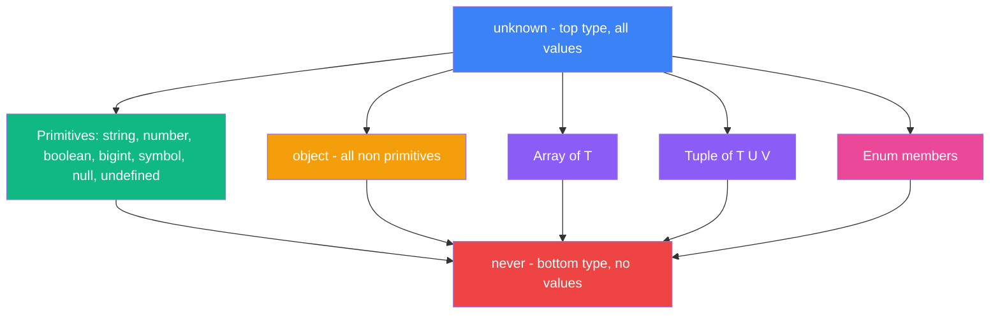
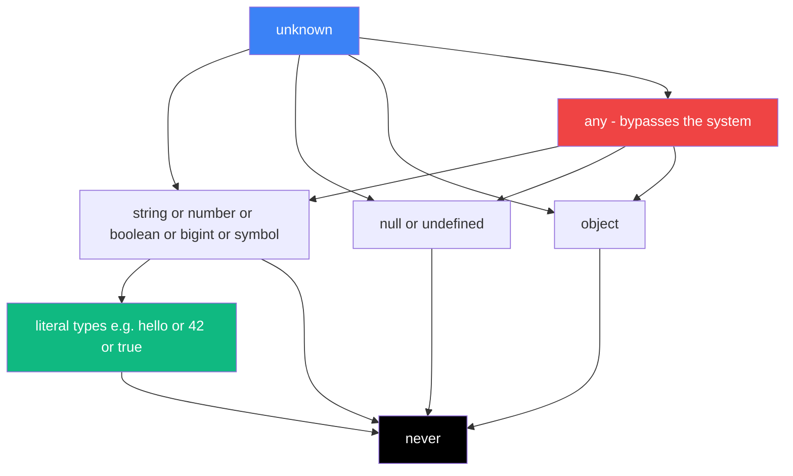
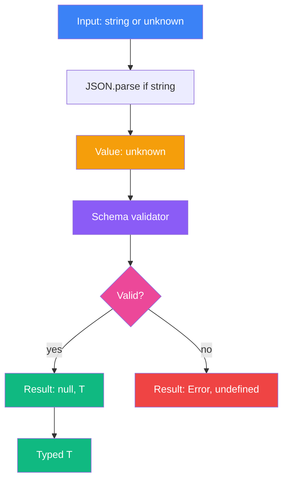

# 2.02 Basic Type Space

## 1. Purpose

TypeScript does not invent a new type system from scratch. It layers a static, compile-time type discipline on top of the runtime type system that ECMAScript already defines. This is the single most important fact about TypeScript's basic type space: every primitive type in TypeScript corresponds to a primitive value category that already exists in JavaScript at runtime. The type `string` is the set of all runtime string values, recognised by `typeof x === "string"`. The type `number` is the set of all IEEE 754 doubles. The type `boolean` is the two-element set `{true, false}`. The type `bigint` is the set of all arbitrary-precision integers. The type `symbol` is the set of all `Symbol()` values. This one-to-one mirroring between TypeScript's basic types and JavaScript's runtime primitives is what makes TypeScript's type system *sound enough to be useful* without ever pretending to be a sound system in the academic sense. See [[1.03 Primitive Data Types]] for the runtime counterpart of every type discussed here.

TypeScript then adds four types that JavaScript has no direct runtime analogue for: `any`, `unknown`, `never`, and `void`. Each of these exists to solve a specific problem that the runtime primitives alone cannot solve.

`any` exists because TypeScript was designed as an opt-in, gradually-typed superset of JavaScript. Real JavaScript codebases contain values whose shape is genuinely unknown — `JSON.parse`, `fetch().json()`, third-party libraries without type declarations, `eval` results, dynamic property access. Without an escape hatch, TypeScript would either have to refuse to type those values (forcing every `JSON.parse` call to be wrapped in a custom type guard before any property could be read) or refuse to compile the code at all. `any` is the escape hatch: a value of type `any` is allowed to flow anywhere, be assigned to anything, and have any property accessed on it, with zero checking. The cost of `any` is that it silently disables the type system, and any error that would have been caught downstream is now deferred to runtime. `any` is therefore best understood not as a type but as a *type-system off-switch* — useful for migration, dangerous in production code, and almost always replaceable by `unknown` in modern TypeScript.

`unknown` exists because `any` is too permissive. `any` is what type theorists call the *top type* — every other type is assignable to it, and it is assignable to every other type. The second half of that definition is what makes `any` dangerous: you can pass an `any` value into a function that expects a `string`, and TypeScript will silently agree. `unknown` is the *type-safe top type*: every type is assignable to `unknown` (so you can put anything into an `unknown` variable), but `unknown` is only assignable to `unknown` and `never` (so you cannot use an `unknown` value as a `string` without first narrowing it). `unknown` was introduced in TypeScript 3.0 (2018) specifically to give developers a safe alternative to `any` for the `JSON.parse`-style use case.

`never` exists because TypeScript needs a way to talk about computations that produce no value at all. A function that always throws an exception never returns a value. A function that contains an infinite loop never returns a value. `never` is the *bottom type* — it represents the empty set of values. No value has type `never`. Every type is a superset of `never` (because the empty set is a subset of every set), which means `never` is assignable to every other type. But no other type (except `never` itself) is assignable to `never`. `never` is what makes exhaustive switch checks work, what makes the `Promise<never>` type useful for typing promises that never resolve, and what makes TypeScript's control-flow analysis able to detect unreachable code.

`void` exists for a much more prosaic reason: to annotate the return type of functions that do not return a meaningful value. In JavaScript, a function without a `return` statement returns `undefined`. In TypeScript's early days, before `strictNullChecks`, `undefined` and `null` were assignable to every other type, so using `undefined` as a function return type would have meant that any function could be assigned to a function-returning-`undefined` slot. `void` was introduced to express the intent "this function is called for its side effects, not for its return value" without coupling that intent to the `undefined` value type. The result is that `void` return type permits any return value at the call site (the value is simply ignored) but a `void`-returning function cannot be substituted for a function that returns a specific type. This makes `void` the correct return type for callbacks like `setTimeout`'s handler or `Array.prototype.forEach`'s callback.

Tuples exist because JavaScript arrays are not homogeneous in practice. A CSV row is `[string, number, number, boolean]`. A 2D coordinate is `[number, number]`. A Go-style error tuple is `[Error | null, T | undefined]`. A React `useState` return is `[T, (next: T) => void]`. TypeScript's `T[]` array type says "all elements have type `T`" — useful, but it cannot express these fixed-shape, positional structures. A tuple type `[A, B, C]` says "this is an array of exactly three elements, where the first has type `A`, the second has type `B`, and the third has type `C`." Tuples are how TypeScript models fixed-length, positional arrays.

Enums exist because JavaScript, alone among modern languages, has no built-in way to give a name to a small fixed set of related constants. TypeScript's `enum` keyword produces both a runtime object (with the named values as properties) and a nominal-ish type (the names themselves become a union). Numeric enums auto-increment, string enums require explicit initialisation, `const enum` is erased at compile time, and heterogeneous enums mix the two — though heterogeneous enums are universally considered an anti-pattern. Enums are *controversial* in the TypeScript community: the TC39 proposal for a JavaScript enum is still being debated, the `isolatedModules` flag makes `const enum` unsafe across module boundaries, and many style guides now recommend union types or `as const` objects instead. This note covers enums exhaustively because they appear in every TypeScript codebase older than about 2019, but the best-practices section will recommend against them for new code.

The basic type space has three layers. The first is the *runtime primitives* (`string`, `number`, `boolean`, `bigint`, `symbol`, `null`, `undefined`) — these mirror JavaScript exactly. The second is the *type-system primitives* (`any`, `unknown`, `never`, `void`, `object`) — these exist to fill gaps that the runtime primitives leave (escape hatch, safe top, bottom, return-only, non-primitive). The third is the *composite primitives* (arrays, tuples, enums). Mastering these three layers is the foundation of every other TypeScript feature; you cannot understand unions without understanding `never`, you cannot understand conditional types without understanding `unknown`, and you cannot understand mapped types without understanding arrays and tuples.

---

## 2. Theory and Deep Dive

The basic type space forms a lattice. At the top sits `unknown` — the type of every value that exists. At the bottom sits `never` — the type of no value at all. Every other type lives somewhere between, and the assignability rules follow a single principle: a type `A` is assignable to a type `B` if and only if every value that has type `A` also has type `B`. This is set-theoretic subtyping, and it explains every seemingly-arbitrary TypeScript rule.



### 2.1 The Runtime Primitive Types

`string` is the type of all JavaScript string values (immutable sequences of UTF-16 code units). TypeScript's `string` does not distinguish between a single character and a long string, nor between ASCII and emoji strings — at the type level, they are all `string`. String *literal* types (`"hello"`) are subtypes of `string`, and template literal types generalise literal types. See [[1.03 Primitive Data Types]] for runtime representation.

`number` is the type of all IEEE 754 double-precision floating-point values. There is no `int`, `float`, or `double` type — JavaScript has one numeric type for non-integer work, and TypeScript inherits that. Numeric literal types (`0`, `1`, `42`) are subtypes of `number` and are how TypeScript models enum-like unions (`type Dice = 1 | 2 | 3 | 4 | 5 | 6`). They are inferred only in `const` declarations and `as const` assertions.

`boolean` is the two-element set `{true, false}`. The literal types `true` and `false` are subtypes of `boolean` and are inferred for `const` declarations. Truthiness is *not* the same as `boolean`: a value of type `string | undefined` may be truthy or falsy at runtime, but TypeScript treats it as `string | undefined` until narrowed.

`bigint` is the type of arbitrary-precision integers, added to JavaScript in ES2020. A `bigint` literal is written with a trailing `n`: `0n`, `123n`, `2n ** 128n`. `bigint` and `number` are *not* interconvertible implicitly — you cannot add a `number` to a `bigint` without explicit conversion. This is one of the few places where TypeScript is stricter than JavaScript: at runtime, `1 + 1n` throws `TypeError`, and TypeScript catches this at compile time.

`symbol` is the type of all `Symbol()` values. Each call to `Symbol()` produces a unique, immutable value. Symbols are used as object keys and as the well-known hooks for metaprogramming (`Symbol.iterator`, `Symbol.toPrimitive`, etc. — see [[1.32 Well-Known Symbols]]). TypeScript has a `unique symbol` subtype for symbols declared with `const` or `readonly`, which represents exactly one specific symbol value.

`null` and `undefined` are *distinct types* in TypeScript under `strictNullChecks`. They are not interchangeable: a variable of type `string | null` does not accept `undefined`, and vice versa. Without `strictNullChecks`, both `null` and `undefined` are assignable to every other type — the historical JavaScript behaviour and the source of countless `Cannot read property 'x' of null` runtime errors. Enabling `strict: true` in `tsconfig.json` (which includes `strictNullChecks`) is the single most impactful TypeScript configuration decision a project can make. See Section 6.2 for the failure mode.

### 2.2 `any` — The Opt-Out

`any` is the type that opts out of the type system entirely. A value of type `any`:

- Can be assigned to any other type (so `const x: string = anyValue` compiles).
- Can have any value assigned to it (so `let x: any = 42; x = "hello"` compiles).
- Can have any property accessed on it (so `anyValue.foo.bar.baz` compiles).
- Can be called as a function (so `anyValue()` compiles).
- Can be constructed (so `new anyValue()` compiles).
- Has its type propagated: `const y = anyValue.foo` is itself `any`.

This propagation is what makes `any` so dangerous. A single `any` in a codebase metastasises — every value derived from it is also `any`, and the type checker is silently disabled for an entire subtree of the program. The classic example is `JSON.parse`, which returns `any`:

```typescript
const data = JSON.parse(jsonString); // any
const name = data.user.name; // any, no error even if data has no .user
```

If `jsonString` happens to be `null` or `"42"` or `"{}"`, `data.user.name` will throw at runtime — but TypeScript said nothing, because `data` was `any`. The fix is to type `JSON.parse` as returning `unknown` (which it does in strict mode since TypeScript 5.x in some libraries, or which you can enforce by writing `const data: unknown = JSON.parse(jsonString)`). See Section 6.1.

`any` does have legitimate uses. The most common is during migration: when you are porting a JavaScript file to TypeScript incrementally, `any` lets you get the file to compile without typing every variable. The second is in declaration files for third-party libraries that genuinely have untyped APIs. Both should be marked with `eslint-disable-next-line` or annotated explicitly with `any` (not just inferred) so they can be audited and removed later.

### 2.3 `unknown` — The Type-Safe Top Type

`unknown` is the top type. Every value is assignable to `unknown` — `string`, `number`, `object`, `null`, `undefined`, even `any`. But `unknown` is assignable only to `unknown` itself and to `never`. This means you cannot use an `unknown` value without first narrowing it.

Narrowing `unknown` happens through three mechanisms:

1. **Type guards**: `typeof x === "string"` narrows `unknown` to `string` inside the branch.
2. **Instance checks**: `x instanceof Error` narrows `unknown` to `Error`.
3. **User-defined type guards**: `function isString(x: unknown): x is string { return typeof x === "string"; }`.

Without narrowing, the only operations permitted on an `unknown` value are: comparing it with `===` and `!==`, applying `typeof` and `instanceof`, and assigning it to another `unknown`. Reading a property, calling it as a function, or using it as an operand are all errors.

The practical pattern is:

```typescript
function process(input: unknown): string {
  if (typeof input === "string") {
    return input.toUpperCase(); // narrowed to string
  }
  if (typeof input === "number") {
    return String(input); // narrowed to number
  }
  throw new Error("unsupported");
}
```

`unknown` is the correct type for the return type of `JSON.parse` (in well-typed libraries), the parameter type of a generic deserializer, the parameter type of a `catch` clause variable (TypeScript 4.4+ makes this the default under `useUnknownInCatchVariables`), and any function that accepts "anything" but promises to validate before use.

`unknown` and `any` differ in exactly one direction: assignability out. `any` can be assigned to anything; `unknown` cannot. In every other respect they are identical. The difference is the entire point.

### 2.4 `never` — The Bottom Type

`never` is the bottom type. It represents the empty set of values. No value has type `never`. The following expressions produce `never`:

- A function that always throws: `function fail(): never { throw new Error(); }`.
- A function with an infinite loop: `function loop(): never { while (true) {} }`.
- The type of an unreachable code branch after narrowing has eliminated all possibilities: in `if (typeof x === "string") { ... } else if (typeof x === "number") { ... } else { /* x is never here */ }`.

`never` has two key properties that follow from set theory:

1. **`never` is assignable to every type.** Because the empty set is a subset of every set, a value of type `never` (which does not exist) can be "assigned" to any variable without violating type safety. This is why a function returning `never` can be used in any context: `const x: string = fail()` compiles.
2. **No type (except `never` itself) is assignable to `never`.** To assign a `string` to a `never` variable you would need a `string` value that is also in the empty set, which cannot exist. This is why `never` parameters can never be called.

The most important practical use of `never` is exhaustive switch checking:

```typescript
type Shape = "circle" | "square" | "triangle";
function area(s: Shape): number {
  switch (s) {
    case "circle": return Math.PI;
    case "square": return 1;
    case "triangle": return 0.5;
    default:
      const exhaustive: never = s;
      throw new Error(`unhandled: ${exhaustive}`);
  }
}
```

If a future maintainer adds `"hexagon"` to the `Shape` union but forgets to add a `case` for it, the `default` branch will run with `s` of type `"hexagon"`. Assigning `"hexagon"` to `const exhaustive: never` is a compile error, because `"hexagon"` is not assignable to `never`. The maintainer gets a clear, early error pointing them at the missing case. This pattern is so important it has its own name: the `assertNever` pattern. See Section 5.2 for a full implementation.

`never` also appears as the result of intersecting incompatible types: `string & number` is `never`, because no value is both a string and a number. This is how TypeScript detects impossible intersections at compile time.

### 2.5 `void` — The Return-Only Type

`void` is the return type of functions that do not produce a meaningful value. It is *not* the same as `undefined`, although in practice a `void`-returning function returns `undefined` at runtime.

A function returning `void` can have *any* return type at the call site — TypeScript ignores the return value. This is what makes `void` correct for callbacks:

```typescript
function forEach<T>(arr: T[], cb: (x: T) => void): void { /* ... */ }

// This compiles because the callback return type is ignored
forEach([1, 2, 3], (x) => x * 2);
```

If the parameter type were `(x: T) => undefined` instead, the arrow function `(x) => x * 2` would not be assignable (it returns `number`, not `undefined`), and you would be forced to write `forEach([1, 2, 3], (x) => { x * 2; })` with an explicit block body. `void` says "I will not look at your return value," which is exactly the contract a forEach callback needs.

The asymmetry is the key point: a function with return type `void` can be assigned to a slot that expects a function with return type `T` (where `T` is any specific type), but not vice versa. This is sometimes called the *void-return covariance* rule, and it is one of the very few places where TypeScript is unsound on purpose, because the alternative would make callbacks unusable. `void` should *not* be used as a variable type.

### 2.6 `object` — The Non-Primitive Type

`object` (lowercase) is the type of all non-primitive values. It includes plain objects, arrays, functions, classes, regexes, dates, maps, sets, and any other object type. It excludes `string`, `number`, `boolean`, `bigint`, `symbol`, `null`, and `undefined`.

`object` is rarely useful directly — it tells you "this is not a primitive" but nothing else. You cannot read any property on an `object` value (the type has no known properties). You cannot call it. You cannot iterate it. `object` is mostly useful as a constraint in generic type parameters (`<T extends object>`) and as a parameter type for functions that explicitly want to refuse primitives (e.g., a deep-clone function that refuses to clone strings because the caller probably made a mistake).

The three confusingly-named types are `object`, `Object`, and `{}`:

- `object` — non-primitive values only (no `string`, `number`, etc.).
- `Object` — *any* value, including primitives. This is a historical accident: `Object` is the type of the `Object` interface, which describes the methods available on every JavaScript value via autoboxing (`(42).toString()` works because `number` is assignable to `Object`). Using `Object` as a type annotation is almost always a mistake — use `unknown` instead.
- `{}` — *any non-null, non-undefined* value. This is the type of "an object with no properties," but because every JavaScript value (except `null` and `undefined`) has the methods from `Object.prototype`, `string`, `number`, and `boolean` are all assignable to `{}`. Using `{}` as a type annotation is also almost always a mistake.

The TypeScript team's official advice: use `object` when you mean "non-primitive," use `unknown` when you mean "anything," and avoid `Object` and `{}` entirely. See Section 6.6 for the anti-patterns.

### 2.7 Arrays

Arrays in TypeScript are written either as `T[]` (the shorthand) or `Array<T>` (the generic form). The two are completely equivalent — `Array<T>` is the lib.d.ts declaration, and `T[]` is syntactic sugar for it. Convention is to use `T[]` for simple types (`string[]`, `number[]`) and `Array<T>` for complex or long type arguments (`Array<{ id: number; name: string }>` reads better than `{ id: number; name: string }[]`).

TypeScript's array type is homogeneous: every element must be of type `T`. JavaScript arrays are not enforced as homogeneous at runtime, but TypeScript will catch any attempt to push a wrong-typed value at compile time. For heterogeneous arrays, you have two options:

1. A union element type: `(string | number)[]` — each element is either a string or a number, but the positions are not fixed.
2. A tuple type (Section 2.8) — fixed positions, fixed types.

Readonly arrays: `readonly T[]` (or `ReadonlyArray<T>`) is an array whose elements cannot be mutated. `arr.push(x)`, `arr[i] = x`, and `arr.pop()` are all errors. This is crucial for immutability — a function that takes `readonly number[]` cannot mutate the caller's array, so the caller can safely pass a shared reference. The `readonly` modifier is *covariant*: `number[]` is assignable to `readonly number[]` but not vice versa. See [[2.05 Unions and Intersections]] for more on covariance.

### 2.8 Tuples

A tuple type is written as `[A, B, C]` — a fixed-length array where element 0 has type `A`, element 1 has type `B`, and element 2 has type `C`. Tuples are how TypeScript models positional, fixed-shape arrays.

```typescript
type Point = [number, number];
type Result<T> = [Error | null, T | undefined];
type ReactState<T> = [T, (next: T) => void];
```

Tuples support the same operations as arrays, but TypeScript tracks the type at each index separately. The `length` property has a literal type. Tuples have several modifiers: `readonly` (`readonly [A, B]` cannot be reassigned), optional elements (`[A, B?]` is length 1 or 2), and rest elements (`[A, ...B[]]` is at least one `A` followed by zero or more `B`, which is how TypeScript models variadic function argument lists).

A common gotcha: tuple length is *not* enforced at runtime. At runtime, a tuple is just an array. TypeScript will allow `const p: [number, number] = [1, 2, 3] as [number, number]` (via the assertion) and the resulting value will have length 3. The check is purely structural at compile time: `[1, 2, 3]` is *not* assignable to `[number, number]` directly, but `as` assertions bypass the check. See Section 6.5.

Tuples are particularly useful for the result pattern (`[Error | null, T]`, Go-style error returns), coordinate pairs (`[number, number]`), CSV rows (`[string, number, number, boolean]`), React hooks (`useState` returns `[T, Dispatch<SetStateAction<T>>]`), and tagged unions for discriminated tuples.

### 2.9 Enums

Enums are TypeScript's most controversial feature. They produce both a runtime object and a nominal type:

```typescript
enum Color { Red, Green, Blue }
const c: Color = Color.Green; // type: Color, value: 1
```

There are four kinds of enums.

**Numeric enums** auto-increment from 0 (or from the first explicitly-set value):

```typescript
enum Direction { Up = 0, Down, Left, Right }
// Direction.Up === 0, Direction.Down === 1, Direction.Left === 2, Direction.Right === 3
```

Numeric enums support *reverse mapping*: `Direction[0] === "Up"`. The runtime object has both forward (`Direction.Up === 0`) and reverse (`Direction[0] === "Up"`) lookups. This is a feature unique to numeric enums — string enums do not support reverse mapping. See Section 6.3 for the surprise this causes.

**String enums** require explicit initialisation and do not auto-increment:

```typescript
enum Status { Active = "ACTIVE", Inactive = "INACTIVE" }
// Status.Active === "ACTIVE", Status["Active"] === "ACTIVE" (same as forward)
// No reverse mapping: Status["ACTIVE"] is undefined
```

String enums are preferred over numeric enums because the runtime value is meaningful (you can log `Status.Active` and see `"ACTIVE"` instead of `1`), because they are safer to refactor (renaming does not silently change a numeric value), and because they serialise correctly to JSON.

**Const enums** are erased at compile time. Their values are inlined at every use site:

```typescript
const enum Direction { Up, Down }
const x = Direction.Up; // compiles to: const x = 0;
```

Const enums produce no runtime code. This is appealing for bundle size, but it is *broken* under `isolatedModules` (the Babel / esbuild / SWC / Vite default) because those tools process one file at a time and cannot inline a const enum imported from another file. The TypeScript team recommends *against* using const enums in any codebase that might be transpiled by non-tsc tooling. Use a plain object with `as const` instead. See Section 6.4.

**Heterogeneous enums** mix string and numeric members: `enum Mixed { No = 0, Yes = "YES" }`. This is universally considered an anti-pattern. There is no good reason to use it.

**Enum member types**: in a string enum, each member is itself a type (the string literal type of its value). In a numeric enum, members are *not* literal types unless the enum is `const`.

**Alternative to enums**: the modern, idiomatic replacement is a union of string literal types, optionally paired with an `as const` object for the runtime values:

```typescript
type Status = "active" | "inactive";
const Status = { Active: "active", Inactive: "inactive" } as const;
```

This gives you the same type-safety (the `Status` union), the same runtime values (the `Status` object), works under `isolatedModules`, and tree-shakes better than an enum. See Section 7.3.

### 2.10 The Type Hierarchy, Summarised



Read the diagram as: arrows point from a type to its supertype. `unknown` is the top — everything flows up to it. `never` is the bottom — everything flows down to it. `any` is the wildcard — it flows both ways, which is why it is dangerous. Literal types are subtypes of their base primitive type (`"hello"` is a subtype of `string`). `null` and `undefined` are siblings, not subtypes, of every other type under `strictNullChecks`.

---

## 3. Mental Models

Each type in the basic space is best remembered by a single sentence that captures its intent. These sentences are not technically complete definitions, but they are the *cognitive anchors* that let you reach for the right type without thinking through the full assignability lattice each time.

**`any` — "I give up, type-checker."** You are telling TypeScript to stop checking this value. Every operation on it will compile. Every error will be deferred to runtime. `any` is appropriate during migration, in declaration files for genuinely untyped APIs, and nowhere else.

**`unknown` — "I don't know, narrow me first."** You have a value whose type is not yet known, and you are promising the type checker that you will prove what it is before you use it. `unknown` is the safe top type. Reach for `unknown` every time you would have reached for `any` out of genuine ignorance — `JSON.parse`, `fetch().json()`, `catch` clause variables, third-party API responses.

**`never` — "This can't happen."** The value at this point in the code is impossible. Either the code is unreachable (the function threw, the loop is infinite, the switch was exhaustive), or the type intersection is empty (`string & number`). `never` is what makes exhaustive checks work: if you assign a "should-be-exhausted" value to `never` and it compiles, you are safe; if it errors, you missed a case.

**`void` — "I'm not returning anything useful."** The function is called for its side effects. The caller should not look at the return value. `void` is the return type for callbacks like `forEach`'s, `setTimeout`'s, and event handlers. It is *not* a variable type.

**`object` — "Not a primitive."** You are explicitly excluding `string`, `number`, `boolean`, `bigint`, `symbol`, `null`, and `undefined`. You cannot do anything useful with an `object` value directly. `object` is mostly a constraint in generic type parameters and a marker in function parameters that should refuse primitives.

**`string`, `number`, `boolean`, `bigint`, `symbol`** — "Exactly what JavaScript `typeof` says." These mirror the runtime `typeof` checks. `typeof x === "string"` narrows `unknown` to `string`. These types are the foundation; everything else is built on them.

**`null`** — "Intentionally absent." The programmer wrote `null` on purpose, to signal "there is no value here." `null` the type is the singleton type of that value.

**`undefined`** — "Accidentally absent." The variable was declared but not initialised. The property does not exist. `undefined` is what JavaScript gives you when nothing was explicitly provided. `T | undefined` is the canonical "optional" type.

**Tuple — "Fixed-length, positional array."** You know exactly how many elements there are and what type each position holds. A 2D coordinate is `[number, number]`. A result is `[Error | null, T]`. Tuples are great when the positions are obvious from context and terrible when they are not.

**Enum — "Named constant with reverse mapping."** A set of related values that you want to refer to by name. Numeric enums auto-increment and support reverse mapping. String enums require explicit values and do not. Const enums are erased at compile time (and broken under `isolatedModules`). Heterogeneous enums are a mistake. The modern replacement is `as const` plus a union type.

**Array (`T[]`) — "A list of the same thing."** Every element has type `T`. You can have zero, one, or a million. The order matters but the length is flexible. If the elements are different types in fixed positions, you want a tuple.

These mental models are not a substitute for the formal rules in Section 2, but they are the fastest path to the right type. When in doubt, ask: *am I giving up, am I promising to narrow, am I asserting this can't happen, am I returning nothing useful, or am I just naming a primitive?* The answer to that question is the answer to "which type do I write here."

---

## 4. Real-World Use Cases

The basic types show up in recurring patterns across every TypeScript codebase. This section catalogues the most common ones, with the rationale for *why* each pattern uses the type it does.

**4.1 `unknown` for parsing JSON.** `JSON.parse` returns `any` in lib.d.ts, which is unsound. The fix is to immediately narrow to `unknown` and then validate with type guards. The TypeScript team added `useUnknownInCatchVariables` in 4.4 to make `catch` clause variables `unknown` by default — the same logic applies to `JSON.parse`. A typical JSON-parsing function returns `unknown` and requires the caller to narrow, or accepts a schema (e.g., a Zod schema) and narrows internally. See Section 10 for a full mini-project.

**4.2 `never` for exhaustive switch defaults.** Any function that switches on a string-literal union should have a `default` branch that assigns the narrowed value to a `never`-typed variable. If a future maintainer adds a new union member, the assignment will fail to compile. This pattern is sometimes called `assertNever` and is implemented in Section 5.2.

**4.3 `void` for callbacks.** Any callback called for its side effects (not its return value) should be typed as returning `void`. This includes `forEach`'s callback, `setTimeout`'s handler, `EventEmitter`'s listeners, React's `useEffect` cleanup, and most event handlers. The `void` return type tells callers "you can return anything you want; I will ignore it."

**4.4 Tuples for the `[error, value]` result pattern.** Popularised by Go's `(value, error)` return convention, this pattern wraps a fallible operation so the caller must handle both branches. TypeScript's tuple type `[Error | null, T | undefined]` is the natural encoding. The caller destructures `[err, value]` and must check `err` before using `value`. This avoids throw/catch control flow for expected errors while still using exceptions for unexpected ones. See Section 5.2.

**4.5 Tuples for CSV rows.** A CSV parser that knows the schema of its input can return `[string, number, number, boolean][]` — an array of typed tuples. Each row is positionally typed. The downside is readability: positions are not self-documenting, so this pattern is best when the schema is fixed.

**4.6 Tuples for coordinate pairs.** A 2D point is `[number, number]`. A 3D point is `[number, number, number]`. A bounding box is `[[number, number], [number, number]]`. Tuples are the natural type for fixed-dimension geometric data, and they interoperate cleanly with GPU APIs (which expect flat `number[]` arrays).

**4.7 String enums for status and stage types.** Before union types were convenient, string enums were the standard way to model a fixed set of states. Modern code uses a union type instead, but string enums survive in many codebases because they give a runtime object and a type to annotate with.

**4.8 `as const` objects as enum replacements.** The pattern:

```typescript
const OrderStatus = { Pending: "pending", Paid: "paid", Shipped: "shipped" } as const;
type OrderStatus = (typeof OrderStatus)[keyof typeof OrderStatus];
// "pending" | "paid" | "shipped"
```

This gives you a runtime object, a union type, works under `isolatedModules`, tree-shakes better than enums, and has no reverse-mapping surprise. This is the modern recommendation for new code.

**4.9 `bigint` for large integer arithmetic.** Cryptography, financial calculations with exact cents, blockchain hashes, and 64-bit integer IDs from external systems all require precision beyond the JavaScript safe-integer limit. `bigint` is the only correct type for these. The trade-off is that `bigint` cannot be combined with `number` without explicit conversion and is slower than `number` for arithmetic. Use `bigint` only when precision requires it.

**4.10 `symbol` for private object keys.** A `Symbol()` value is unique and does not collide with any string key. This makes symbols useful as property keys for "private" or "internal" properties: `const internal = Symbol("internal"); const obj = { [internal]: "hidden", name: "visible" }; Object.keys(obj); // ["name"]`. Symbols are also how `Symbol.iterator` works — see [[1.32 Well-Known Symbols]].

**4.11 `readonly` arrays and tuples for immutability.** Marking a parameter or return type as `readonly T[]` or `readonly [A, B]` prevents the caller or callee from mutating the data. This is the foundation of immutable data flow in TypeScript without a library like Immer. The `readonly` modifier is shallow — nested arrays and objects are still mutable — but for top-level arrays and tuples it catches the most common mutation bugs.

---

## 5. Code Examples

### 5.1 Example A — Minimal and Conceptual

A tour of every basic type in a single file. Each type is declared, assigned, and used once, so you can see the syntax and the runtime behaviour side by side.

**JavaScript:**

```javascript
const str = "hello";
const num = 42;
const bool = true;
const big = 9007199254740993n;
const sym = Symbol("unique");
const nada = null;
const nothing = undefined;
const nums = [1, 2, 3];
const point = [10, 20]; // no tuple type in JS
const Color = Object.freeze({ Red: "RED", Green: "GREEN", Blue: "BLUE" });
const parsed = JSON.parse('{"name": "Alice"}'); // everything is dynamically typed
function log(x) { console.log(x); }
function fail(msg) { throw new Error(msg); }

console.log(str, num, bool, big, sym, nada, nothing, nums, point, Color.Red, parsed.name);
log("done");
```

**TypeScript:**

```typescript
const str: string = "hello";
const num: number = 42;
const bool: boolean = true;
const big: bigint = 9007199254740993n;
const sym: symbol = Symbol("unique");
const nada: null = null;
const nothing: undefined = undefined;
const nums: number[] = [1, 2, 3];
const point: [number, number] = [10, 20]; // TS-only tuple
enum Color { Red = "RED", Green = "GREEN", Blue = "BLUE" } // TS-only enum

const parsed: unknown = JSON.parse('{"name": "Alice"}');
if (typeof parsed === "object" && parsed !== null && "name" in parsed) {
  // narrowed; need a further check to read .name as string
}

const anything: any = JSON.parse('{"name": "Alice"}');
console.log(anything.name.toUpperCase()); // compiles, may throw at runtime

function log(x: string): void { console.log(x); }
function fail(msg: string): never { throw new Error(msg); }
const obj: object = { a: 1 };

console.log(str, num, bool, big, sym, nada, nothing, nums, point, Color.Red, obj);
log("done");
```

The contrast is instructive. JavaScript has no syntax for declaring types — every value is dynamically typed at runtime, and "enum," "tuple," and "unknown" are conventions enforced by programmer discipline. TypeScript adds the type annotations and checks them at compile time. The `any` line demonstrates why `any` is dangerous: `anything.name.toUpperCase()` compiles without error, but if `anything` happens to be `null` or `42` or `{}`, it throws at runtime. The `unknown` line forces you to narrow before reading `.name`.

### 5.2 Example B — Production-Grade

A typed `Result<T>` tuple and an exhaustive `assertNever` helper. This is the pattern used in real TypeScript codebases to handle expected errors without exceptions and to ensure switches over unions stay exhaustive as the union grows.

**JavaScript:**

```javascript
// Result is just a 2-element array: [error, value]
function ok(value) { return [null, value]; }
function err(message) { return [new Error(message), undefined]; }
function divide(a, b) {
  if (b === 0) return err("division by zero");
  return ok(a / b);
}

const [error, result] = divide(10, 2);
if (error) console.error("failed:", error.message);
else console.log("result:", result);

// assertNever: throw if a "should be exhaustive" switch reaches default
function assertNever(x) { throw new Error(`unexpected value: ${JSON.stringify(x)}`); }

const shape = { kind: "circle", radius: 5 };
function area(s) {
  switch (s.kind) {
    case "circle": return Math.PI * s.radius ** 2;
    case "square": return s.size ** 2;
    default: return assertNever(s);
  }
}
console.log("area:", area(shape));
```

**TypeScript:**

```typescript
// Result is a discriminated tuple: [null, T] for success, [Error, undefined] for failure
type Result<T> = [Error | null, T | undefined];

function ok<T>(value: T): Result<T> { return [null, value]; }
function err<T = never>(message: string): Result<T> { return [new Error(message), undefined]; }

function divide(a: number, b: number): Result<number> {
  if (b === 0) return err("division by zero");
  return ok(a / b);
}

const [error, result] = divide(10, 2);
if (error) {
  console.error("failed:", error.message);
} else {
  console.log("result:", result); // narrowed to number
}

// assertNever: assign a "should be exhaustive" value to never, which fails to compile
// if any case is unhandled
function assertNever(x: never): never {
  throw new Error(`unexpected value: ${JSON.stringify(x)}`);
}

type Shape =
  | { kind: "circle"; radius: number }
  | { kind: "square"; size: number }
  | { kind: "triangle"; base: number; height: number };

function area(s: Shape): number {
  switch (s.kind) {
    case "circle": return Math.PI * s.radius ** 2;
    case "square": return s.size ** 2;
    case "triangle": return 0.5 * s.base * s.height;
    default:
      // s is never here, because all cases are handled.
      // Adding { kind: "hexagon" } without a case will fail to compile here.
      return assertNever(s);
  }
}

console.log("area:", area({ kind: "circle", radius: 5 }));
```

The TypeScript version gains three guarantees the JavaScript version lacks. First, `Result<T>` enforces that the caller destructures and checks `error` before accessing `result`. Second, `assertNever(s)` produces a compile-time error if any case is missing from the switch. Third, the `Shape` union is structural and self-documenting — adding a new variant requires updating every switch over `Shape`. The JavaScript version runs identically but provides none of these guarantees: a future maintainer can add a new variant and the `area` function will silently fall through to the `assertNever` default at runtime.

---

## 6. Common Mistakes and Anti-Patterns

### 6.1 Using `any` Instead of `unknown`

The single most common TypeScript anti-pattern. A developer encounters an untyped value (from `JSON.parse`, from a third-party API, from a `catch` clause) and reaches for `any` to make the type checker stop complaining. The result is that every downstream operation on that value is also `any`, and an entire subtree of the program is now unchecked.

```typescript
// Bad
function process(data: any) {
  return data.user.name.toUpperCase(); // compiles, throws at runtime if data is null
}

// Good
function process(data: unknown) {
  if (typeof data === "object" && data !== null && "user" in data) {
    const user = data.user;
    if (typeof user === "object" && user !== null && "name" in user
        && typeof user.name === "string") {
      return user.name.toUpperCase(); // fully narrowed
    }
  }
  throw new Error("invalid data");
}
```

The "good" version is verbose, which is why schema-validation libraries (Zod, valibot, ArkType) exist — they generate the narrowing logic for you.

### 6.2 Forgetting `strictNullChecks` (the `null`/`undefined` Leak)

Without `strictNullChecks` (or `strict: true`), `null` and `undefined` are assignable to every other type. This means `const x: string = null` compiles. The result is the classic `Cannot read property 'x' of null` runtime error — TypeScript said the value was a `string`, but at runtime it was `null`, and `.x` threw.

The fix is to enable `strict: true` in `tsconfig.json`. This single flag turns on `strictNullChecks`, `noImplicitAny`, `strictFunctionTypes`, `strictBindCallApply`, `strictPropertyInitialization`, `noImplicitThis`, `useUnknownInCatchVariables`, and several other checks. The migration is painful for existing codebases but the result is a dramatic reduction in runtime errors. A related mistake is forgetting that `null` and `undefined` are *distinct* types under `strictNullChecks` — `string | null` does not accept `undefined`, and vice versa.

### 6.3 Numeric Enum Reverse Mapping Surprise

Numeric enums support reverse mapping — `Direction[0]` returns `"Up"`. This is a feature, but it surprises every developer the first time:

```typescript
enum Direction { Up, Down, Left, Right }
console.log(Direction.Up); // 0
console.log(Direction[0]); // "Up" - surprise!
console.log(Direction[42]); // undefined
```

`Direction[0]` is not `Direction.Up` (which is `0`); it is the *name* of the member with value `0`. Iterating over a numeric enum with `Object.keys` gives you both the names and the values (as strings), which is almost never what you want:

```typescript
enum Direction { Up, Down, Left, Right }
Object.keys(Direction); // ["Up", "Down", "Left", "Right", "0", "1", "2", "3"]
```

The fix is to use a string enum (no reverse mapping) or an `as const` object.

### 6.4 Const Enum Cross-Module Issues (`isolatedModules`)

Const enums are erased at compile time — every reference is replaced with the literal value. This works fine when the entire project is compiled with `tsc`, but breaks when individual files are transpiled by Babel, esbuild, SWC, or Vite (which all default to `isolatedModules` semantics). The transpiler sees `import { Direction } from "./directions"` and `Direction.Up` and emits code that reads `Direction.Up` at runtime — but `Direction` was never emitted, because it was a const enum.

```typescript
// directions.ts
export const enum Direction { Up, Down, Left, Right }

// usage.ts
import { Direction } from "./directions";
console.log(Direction.Up); // tsc: console.log(0); esbuild: console.log(Direction.Up); - runtime error
```

The fix is to never use const enums in any codebase that might be transpiled by non-tsc tooling. Use a plain `as const` object instead.

### 6.5 Tuple Length Not Enforced at Runtime

Tuples are a compile-time fiction. At runtime, a tuple is just an array. TypeScript will catch direct assignments of the wrong length (`const p: [number, number] = [1, 2, 3]` is an error), but `as` assertions bypass the check:

```typescript
const arr: number[] = [1, 2, 3];
const p = arr as [number, number]; // compiles, but p.length is 3 at runtime
const [x, y] = p; // x is 1, y is 2, the third element is silently dropped
```

The same issue arises with `JSON.parse` returning `any` and then being asserted to a tuple. The fix is to validate the length at runtime:

```typescript
function asPoint(input: unknown): [number, number] {
  if (!Array.isArray(input) || input.length !== 2) throw new Error("expected [number, number]");
  if (typeof input[0] !== "number" || typeof input[1] !== "number") throw new Error("expected [number, number]");
  return input; // narrowed to [number, number]
}
```

### 6.6 `object` vs `Object` vs `{}` Confusion

These three types look similar but have different meanings:

- `object` — non-primitive values only. `string`, `number`, `boolean`, `bigint`, `symbol`, `null`, `undefined` are *not* assignable.
- `Object` — *any* value, including primitives. This is because every primitive is auto-boxed to its wrapper, and `Object` is the type of the `Object` interface. Using `Object` as a type annotation is almost always a mistake — use `unknown` instead.
- `{}` — *any non-null, non-undefined* value. Like `Object`, this accepts primitives. Using `{}` is also almost always a mistake.

```typescript
const a: object = "hello"; // error: string is a primitive
const b: Object = "hello"; // ok: string is assignable to Object
const c: {} = "hello"; // ok: string is non-null, non-undefined
const d: unknown = "hello"; // ok: everything is assignable to unknown
```

The TypeScript team's advice: use `object` for "non-primitive," use `unknown` for "anything," and avoid `Object` and `{}` entirely.

### 6.7 Using `void` as a Variable Type, and Confusing `void` with `undefined` Returns

`void` is a return type, not a variable type. `let x: void = undefined` is technically legal but meaningless. Use `undefined` directly if you mean "this variable holds `undefined`."

A related mistake is using `undefined` as a callback return type instead of `void`. A function returning `void` can be assigned to a slot that expects a function returning `T` (for any `T`); a function returning `undefined` cannot. This is the void-return covariance rule. Use `void` for callback return types; the caller can then return any value, which will be ignored.

```typescript
function forEach<T>(arr: T[], cb: (x: T) => void): void { /* ... */ }
forEach([1, 2, 3], (x) => x * 2); // compiles with void return type
// Would NOT compile if cb were typed as (x: T) => undefined
```

### 6.8 Heterogeneous Enums

```typescript
enum Bad { No = 0, Yes = "YES" } // legal but a mistake
```

Heterogeneous enums mix numeric and string members. There is no good reason to do this — if you need both kinds of values, use two separate enums or a union of literal types. The reverse-mapping behaviour of numeric members combined with the no-reverse-mapping behaviour of string members is a recipe for confusion.

### 6.9 Using `Number`/`String`/`Boolean` (Capitalised) Instead of `number`/`string`/`boolean`

In JavaScript, `String`, `Number`, `Boolean`, `Symbol`, `BigInt` are constructor functions (and they auto-box primitives). In TypeScript, the *type* `string` is the type of primitive strings, while the *type* `String` is the type of the wrapper object — and they are *not* the same.

```typescript
const a: string = "hello"; // correct
const b: String = "hello"; // technically legal (auto-box), but bad style
const c: String = new String("hello"); // legal, creates a wrapper object

typeof a; // "string"
typeof c; // "object" - wrapper, not primitive
a === c; // false - different types
```

Always use the lowercase form (`string`, `number`, `boolean`, `bigint`, `symbol`) for primitive types.

### 6.10 Assigning `any` to a More Specific Type Silently

```typescript
const data: any = JSON.parse('{"name": "Alice"}');
const name: string = data.name; // compiles, but data.name could be anything
name.toUpperCase(); // may throw at runtime
```

The `any` to `string` assignment compiles because `any` is assignable to everything. This is the same root cause as 6.1, but the failure mode is that the assignment *looks* type-safe (it has a `: string` annotation) but is not. The fix is to type `data` as `unknown` and narrow before assigning.

---

## 7. Best Practices and Design Patterns

**7.1 Use `unknown`, not `any`, for untyped data.** Every `any` in your code is a debt. Replace it with `unknown` and a narrowing step. The narrowing is verbose, but it is the entire point of using TypeScript. When the narrowing is repetitive, use a schema-validation library (Zod, valibot, ArkType) to generate it.

**7.2 Enable `strict: true` in `tsconfig.json`.** This single flag turns on every strict check: `strictNullChecks`, `noImplicitAny`, `strictFunctionTypes`, `strictBindCallApply`, `strictPropertyInitialization`, `noImplicitThis`, and `useUnknownInCatchVariables`. The migration is painful for existing codebases but the result is a dramatic reduction in runtime errors. There is no good reason to ship a new TypeScript project without `strict: true`.

**7.3 Prefer union types and `as const` objects over enums.** Modern TypeScript style recommends:

```typescript
const Status = { Active: "active", Inactive: "inactive" } as const;
type Status = (typeof Status)[keyof typeof Status]; // "active" | "inactive"
```

This works under `isolatedModules`, tree-shakes better, has no reverse-mapping surprise, and is fully interoperable with JavaScript. Reserve enums for codebases that already use them and for the rare case where you need enum member types (which `as const` does not provide).

**7.4 Use tuples sparingly.** Tuples are positional, not self-documenting. A tuple `[string, number, boolean, string, number]` is unreadable; an interface `{ name: string; age: number; isActive: boolean; email: string; score: number }` is clear. Use tuples when positions are obvious from context (coordinate pairs, `[error, value]` results, React `useState` returns) and interfaces when positions need names.

**7.5 Use `void` for callback return types.** Any callback called for its side effects (not its return value) should return `void`. This includes `forEach`'s callback, `setTimeout`'s handler, event listeners, and React's `useEffect` cleanup. The `void` return type lets callers return any value (which will be ignored) without forcing them to write an explicit block body.

**7.6 Use `never` for exhaustive checks.** Every `switch` over a string-literal union should have a `default` branch that assigns the narrowed value to a `never`-typed variable (or passes it to an `assertNever` function). This turns a future "I added a new union member but forgot to update the switch" bug into a compile-time error.

**7.7 Use `readonly` for arrays and tuples that should not be mutated.** Mark parameters as `readonly T[]` to prevent the callee from mutating the caller's array. Mark return types as `readonly` to prevent the caller from mutating the returned data. This is the foundation of immutable data flow in TypeScript without a full library like Immer.

**7.8 Use `undefined` for optional properties, not `null`.** TypeScript's optional property syntax (`prop?: T`) means `T | undefined`, not `T | null`. Mixing the two creates a combinatorial explosion of nullable types. Pick one (almost always `undefined`) and use it consistently. Reserve `null` for APIs that explicitly require it (e.g., JSON APIs that use `null` for "no value").

**7.9 Use `symbol` for private object keys, and `bigint` for large integers.** A `Symbol()` value is unique and does not collide with any string key — the correct choice for "private" or "internal" properties that should not be enumerated, JSON-serialised, or accessed by string-key lookup. Any integer that might exceed the JavaScript safe-integer limit (2 to the 53rd power minus 1) should be a `bigint` — this includes 64-bit IDs, cryptocurrency values, file sizes, and any value where precision loss is unacceptable.

**7.10 Avoid `Object` and `{}` as type annotations.** Use `object` for "non-primitive" and `unknown` for "anything." The capitalised `Object` and the empty object type `{}` are almost always mistakes — they accept primitives (via auto-boxing) and obscure the intent.

**7.11 Annotate function return types explicitly, and use `as const` for literal inference.** Explicit return-type annotations make the API contract clear, catch accidental return-type changes during refactoring, and produce better error messages. For public APIs (exported functions, library entry points), always annotate the return type. For arrays and objects, `as const` asserts that every property is `readonly` and every value is its literal type:

```typescript
const config = { port: 3000, host: "localhost" } as const;
// config: { readonly port: 3000; readonly host: "localhost" }
```

This is the foundation of the enum-replacement pattern in 7.3.

---

## 8. Technical Interview Knowledge

### 8.1 What is the difference between `any` and `unknown`?

Both are top types (every type is assignable to them), but they differ in *outgoing* assignability. `any` is assignable to every other type, so an `any` value can be used as a `string`, a `number`, an `object`, without any check. `unknown` is assignable only to `unknown` and `never`, so an `unknown` value cannot be used as anything else without first being narrowed via a type guard. Practically, `any` is an escape hatch that disables the type system; `unknown` is a safe top type that forces you to prove what the value is before using it. Always prefer `unknown` for untyped data.

### 8.2 What is `never`?

`never` is the bottom type. It represents the empty set of values — no value has type `never`. It appears in three contexts: (1) as the return type of functions that never return (because they throw or loop forever), (2) as the type of unreachable code after narrowing has eliminated all possibilities, and (3) as the result of intersecting incompatible types (`string & number` is `never`). Its key properties are: it is assignable to every type (the empty set is a subset of every set), and no type except `never` itself is assignable to it. The most common practical use is the `assertNever` pattern for exhaustive switch checks.

### 8.3 What is `void`?

`void` is the return type of functions that do not produce a meaningful value. It is *not* the same as `undefined` — a function returning `void` can return any value at runtime (TypeScript ignores it), while a function returning `undefined` must return `undefined` (or nothing). The key rule is *void-return covariance*: a function returning `void` can be assigned to a slot that expects a function returning `T` (for any `T`), but not vice versa. This is what makes `void` correct for callbacks like `forEach`'s. Use `void` for callback return types and side-effect-only functions; use `undefined` for variables that hold the `undefined` value.

### 8.4 Should you use enums in TypeScript?

It depends on your codebase. Enums are controversial because: (1) const enums are broken under `isolatedModules` (Babel, esbuild, SWC, Vite), (2) numeric enums have a surprising reverse-mapping behaviour, (3) the TC39 proposal for a JavaScript enum is still being debated, so enums are a TypeScript-only feature, and (4) the modern `as const` object plus a union type provides the same functionality without these issues. For new code, prefer `as const` objects and union types. For existing codebases that already use enums, do not rewrite them — but do not introduce new enums. String enums are safer than numeric enums. Never use heterogeneous enums.

### 8.5 What is a tuple?

A tuple is a fixed-length, fixed-position array type, written `[A, B, C]`. Tuples support `readonly`, optional elements (`[A, B?]`), and rest elements (`[A, ...B[]]`). They are how TypeScript models positional, fixed-shape data: 2D coordinates (`[number, number]`), Go-style error returns (`[Error | null, T]`), React `useState` returns, and CSV rows. The key gotcha is that tuple length is enforced only at compile time — at runtime, a tuple is just an array, and `as` assertions can bypass the length check. Use tuples when positions are obvious from context; use interfaces when positions need names.

### 8.6 What is the difference between `object` and `Object`?

`object` (lowercase) is the type of all non-primitive values — it excludes `string`, `number`, `boolean`, `bigint`, `symbol`, `null`, and `undefined`. `Object` (capitalised) is the type of the `Object` interface, which describes the methods available on every JavaScript value via auto-boxing. Practically, `Object` accepts primitives and is almost always a mistake — use `unknown` if you mean "anything" and `object` if you mean "non-primitive." A third related type, `{}`, accepts any non-null, non-undefined value (including primitives), and is also almost always a mistake.

### 8.7 How does `strictNullChecks` change things?

Without `strictNullChecks`, `null` and `undefined` are assignable to every other type, so `const x: string = null` compiles. This is the historical JavaScript behaviour and the source of countless `Cannot read property 'x' of null` runtime errors. With `strictNullChecks` enabled (via `strict: true`), `null` and `undefined` are distinct types that are *not* assignable to other types, so `const x: string = null` is a compile error. To accept a possibly-null value, you must explicitly annotate as `string | null` (or `string | undefined`, or `string | null | undefined`). The migration is painful for existing codebases but the result is a dramatic reduction in runtime errors.

### 8.8 What is a const enum?

A const enum is an enum declared with the `const` keyword. It is erased at compile time — every reference to a const enum member is replaced with its literal value, and no runtime object is emitted. This is appealing for bundle size, but it is broken under `isolatedModules` (the Babel, esbuild, SWC, and Vite default) because those tools process one file at a time and cannot inline a const enum imported from another file. The TypeScript team now recommends *against* using const enums in any codebase that might be transpiled by non-tsc tooling. The replacement is a plain `as const` object plus a union type.

---

## 9. Practical Exercises

### 9.1 Refactor `any` to `unknown` with Narrowing

**Exercise.** The following function uses `any` to parse a JSON response. Refactor it to use `unknown` and proper narrowing. The function should accept `unknown` input and return `{ name: string; age: number }` or throw an `Error` if the input is invalid.

```typescript
function parseUser(data: any): { name: string; age: number } {
  return { name: data.name, age: data.age };
}
```

**Solution.**

```typescript
// JavaScript (runtime validation only, no type annotations)
function parseUser(data) {
  if (typeof data !== "object" || data === null) throw new Error("expected an object");
  if (typeof data.name !== "string") throw new Error("expected name to be a string");
  if (typeof data.age !== "number") throw new Error("expected age to be a number");
  return { name: data.name, age: data.age };
}

// TypeScript
function parseUser(data: unknown): { name: string; age: number } {
  if (typeof data !== "object" || data === null) throw new Error("expected an object");
  if (!("name" in data) || typeof data.name !== "string") throw new Error("expected name to be a string");
  if (!("age" in data) || typeof data.age !== "number") throw new Error("expected age to be a number");
  return { name: data.name, age: data.age };
}

console.log(parseUser({ name: "Alice", age: 30 })); // { name: "Alice", age: 30 }
console.log(parseUser(JSON.parse('{"name":"Bob","age":25}')));
try { parseUser(null); } catch (e) { console.error(e.message); }
try { parseUser({ name: 42, age: 30 }); } catch (e) { console.error(e.message); }
try { parseUser({ name: "X", age: "old" }); } catch (e) { console.error(e.message); }
```

**Key points.** (1) The `typeof data === "object"` check is not enough — `null` also has type `"object"` in JavaScript, so we must also check `data !== null`. (2) The `in` operator narrows the type so we can access `data.name` and `data.age`. (3) For complex schemas, use a library like Zod.

### 9.2 Implement an Exhaustive Switch Using `never`

**Exercise.** Implement a `describe` function that takes a `Shape` union and returns a string description. Use the `assertNever` pattern to ensure the switch is exhaustive. Add a new variant to the union and verify that the compiler catches the missing case.

**Solution.**

```typescript
// JavaScript (no exhaustiveness check possible)
function assertNever(x) { throw new Error(`unexpected: ${JSON.stringify(x)}`); }

function describe(s) {
  switch (s.kind) {
    case "circle": return `circle of radius ${s.radius}`;
    case "square": return `square of size ${s.size}`;
    default: return assertNever(s);
  }
}

// TypeScript
type Shape =
  | { kind: "circle"; radius: number }
  | { kind: "square"; size: number }
  | { kind: "triangle"; base: number; height: number };

function assertNever(x: never): never {
  throw new Error(`unexpected: ${JSON.stringify(x)}`);
}

function describe(s: Shape): string {
  switch (s.kind) {
    case "circle": return `circle of radius ${s.radius}`;
    case "square": return `square of size ${s.size}`;
    case "triangle": return `triangle of base ${s.base} and height ${s.height}`;
    default: return assertNever(s); // s is never here
  }
}

console.log(describe({ kind: "circle", radius: 5 }));
console.log(describe({ kind: "square", size: 3 }));
console.log(describe({ kind: "triangle", base: 4, height: 6 }));

// Adding | { kind: "hexagon"; side: number } to Shape without a case
// will fail to compile at assertNever(s) in default, because s there
// will be { kind: "hexagon"; side: number }, not assignable to never.
```

**Key points.** (1) The `assertNever` parameter is typed `never`, which means any non-`never` argument produces a compile error. (2) In the `default` branch, `s` has been narrowed by the previous cases — if all cases are handled, `s` is `never`, and the call compiles. (3) If any case is missing, `s` is the unhandled variant, not `never`, and the call fails to compile.

### 9.3 Build a Typed Result Tuple

**Exercise.** Implement a `Result<T>` type as a discriminated tuple `[Error | null, T | undefined]`, with `ok` and `err` constructors and a `divide` function that returns `Result<number>`. The caller must check the error before using the value.

**Solution.**

```typescript
// JavaScript
function ok(value) { return [null, value]; }
function err(message) { return [new Error(message), undefined]; }
function divide(a, b) {
  if (b === 0) return err("division by zero");
  return ok(a / b);
}
function run(a, b) {
  const [error, result] = divide(a, b);
  if (error) return { ok: false, error: error.message };
  return { ok: true, value: result };
}

// TypeScript
type Result<T> = [Error | null, T | undefined];
function ok<T>(value: T): Result<T> { return [null, value]; }
function err<T = never>(message: string): Result<T> { return [new Error(message), undefined]; }
function divide(a: number, b: number): Result<number> {
  if (b === 0) return err("division by zero");
  return ok(a / b);
}
function run(a: number, b: number): { ok: true; value: number } | { ok: false; error: string } {
  const [error, result] = divide(a, b);
  if (error) return { ok: false, error: error.message };
  // TypeScript narrows result to number based on the error variable's type
  return { ok: true, value: result };
}

console.log(run(10, 2)); // { ok: true, value: 5 }
console.log(run(10, 0)); // { ok: false, error: "division by zero" }
```

**Key points.** (1) `Result<T>` is a tuple, so destructuring gives both elements with their respective types. (2) After the `if (error)` check, TypeScript narrows `result` to `number` based on the `error` variable's type. To get full narrowing based on the tuple relationship, use a discriminated union instead. (3) The `err` function has a default type parameter `<T = never>` so it can be used in any `Result<T>` context. (4) This pattern is the TypeScript equivalent of Go's `(value, error)` return convention.

### 9.4 Replace an Enum with a Union + `as const`

**Exercise.** Replace the following enum with an equivalent union type and `as const` object. Verify that all existing usages still work.

```typescript
enum OrderStatus {
  Pending = "PENDING", Paid = "PAID", Shipped = "SHIPPED",
  Delivered = "DELIVERED", Cancelled = "CANCELLED",
}
function label(s: OrderStatus): string {
  switch (s) {
    case OrderStatus.Pending: return "Pending";
    case OrderStatus.Paid: return "Paid";
    case OrderStatus.Shipped: return "Shipped";
    case OrderStatus.Delivered: return "Delivered";
    case OrderStatus.Cancelled: return "Cancelled";
  }
}
```

**Solution.**

```typescript
// JavaScript (the runtime object is what the enum compiles to, minus reverse mapping)
const OrderStatus = Object.freeze({
  Pending: "PENDING", Paid: "PAID", Shipped: "SHIPPED",
  Delivered: "DELIVERED", Cancelled: "CANCELLED",
});
function label(s) {
  switch (s) {
    case OrderStatus.Pending: return "Pending";
    case OrderStatus.Paid: return "Paid";
    case OrderStatus.Shipped: return "Shipped";
    case OrderStatus.Delivered: return "Delivered";
    case OrderStatus.Cancelled: return "Cancelled";
    default: return "Unknown";
  }
}

// TypeScript
const OrderStatus = {
  Pending: "PENDING", Paid: "PAID", Shipped: "SHIPPED",
  Delivered: "DELIVERED", Cancelled: "CANCELLED",
} as const;
type OrderStatus = (typeof OrderStatus)[keyof typeof OrderStatus];
// "PENDING" | "PAID" | "SHIPPED" | "DELIVERED" | "CANCELLED"

function label(s: OrderStatus): string {
  switch (s) {
    case OrderStatus.Pending: return "Pending";
    case OrderStatus.Paid: return "Paid";
    case OrderStatus.Shipped: return "Shipped";
    case OrderStatus.Delivered: return "Delivered";
    case OrderStatus.Cancelled: return "Cancelled";
    default:
      const exhaustive: never = s;
      throw new Error(`unhandled: ${exhaustive}`);
  }
}

const status: OrderStatus = OrderStatus.Pending; // type: OrderStatus, value: "PENDING"
console.log(label(OrderStatus.Paid)); // "Paid"
console.log(label("SHIPPED")); // also works - "SHIPPED" is assignable to OrderStatus
Object.values(OrderStatus).forEach((s) => console.log(s));
```

**Key points.** (1) The `as const` assertion makes every property `readonly` and every value a literal type. (2) `type OrderStatus = (typeof OrderStatus)[keyof typeof OrderStatus]` extracts the union of all value types — the standard idiom for deriving a union from an `as const` object. (3) The `label` function works exactly as before, and the exhaustive `default` branch can still use `never`. (4) Unlike a string enum, the `as const` object works under `isolatedModules`, tree-shakes correctly, and produces a real runtime object. (5) The trade-off is that `OrderStatus.Pending` is now `"PENDING"` (a string literal type) rather than a unique enum member type — but in practice this is what you want, because any `"PENDING"` string is assignable to `OrderStatus`.

---

## 10. Mini-Project Blueprint

**Project.** Build a type-safe JSON parser.

**Goal.** Write a `parseJson` function that takes a `string` (or `unknown` if already parsed), validates the structure against a schema, and returns a fully-typed result. The function should never throw for invalid input — instead, it should return a `Result<T>` tuple indicating success or failure.



**Architecture.** The parser has three stages: (1) parse the input string with `JSON.parse` (or accept an already-parsed `unknown` value), (2) validate the resulting `unknown` value against a schema, (3) return a `Result<T>` indicating success or failure. The schema is a recursive type that describes the expected shape: primitives, arrays, objects, and unions.

**JavaScript skeleton.**

```javascript
// Result type: [error, value]
const ok = (value) => [null, value];
const err = (message) => [new Error(message), undefined];

// Schema validators: each returns [error, value]
function validateString(input) { return typeof input === "string" ? ok(input) : err("expected string"); }
function validateNumber(input) { return typeof input === "number" ? ok(input) : err("expected number"); }
function validateBoolean(input) { return typeof input === "boolean" ? ok(input) : err("expected boolean"); }
function validateNull(input) { return input === null ? ok(null) : err("expected null"); }

function validateArray(input, itemValidator) {
  if (!Array.isArray(input)) return err("expected array");
  const result = [];
  for (let i = 0; i < input.length; i++) {
    const [e, v] = itemValidator(input[i]);
    if (e) return err(`array item ${i}: ${e.message}`);
    result.push(v);
  }
  return ok(result);
}
function validateObject(input, shape) {
  if (typeof input !== "object" || input === null) return err("expected object");
  const result = {};
  for (const key of Object.keys(shape)) {
    if (!(key in input)) return err(`missing key: ${key}`);
    const [e, v] = shape[key](input[key]);
    if (e) return err(`key ${key}: ${e.message}`);
    result[key] = v;
  }
  return ok(result);
}

function parseJson(input, schema) {
  let data;
  if (typeof input === "string") {
    try { data = JSON.parse(input); } catch (e) { return err(`invalid JSON: ${e.message}`); }
  } else { data = input; }
  return schema(data);
}

const userSchema = (input) => validateObject(input, {
  name: validateString, age: validateNumber, active: validateBoolean,
  address: (input) => validateObject(input, { city: validateString, zip: validateString }),
});

const [error, user] = parseJson(
  '{"name":"Alice","age":30,"active":true,"address":{"city":"NYC","zip":"10001"}}',
  userSchema
);
if (error) console.error("parse failed:", error.message);
else console.log("user:", user.name, user.age, user.address.city);
```

**TypeScript skeleton.**

```typescript
// Result type
type Result<T> = [Error | null, T | undefined];
const ok = <T>(value: T): Result<T> => [null, value];
const err = (message: string): Result<never> => [new Error(message), undefined];

// Validator type: takes unknown, returns Result<T>
type Validator<T> = (input: unknown) => Result<T>;

// Primitive validators
const validateString: Validator<string> = (input) =>
  typeof input === "string" ? ok(input) : err("expected string");
const validateNumber: Validator<number> = (input) =>
  typeof input === "number" ? ok(input) : err("expected number");
const validateBoolean: Validator<boolean> = (input) =>
  typeof input === "boolean" ? ok(input) : err("expected boolean");
const validateNull: Validator<null> = (input) =>
  input === null ? ok(null) : err("expected null");

// Array validator
function validateArray<T>(itemValidator: Validator<T>): Validator<T[]> {
  return (input) => {
    if (!Array.isArray(input)) return err("expected array");
    const result: T[] = [];
    for (let i = 0; i < input.length; i++) {
      const [e, v] = itemValidator(input[i]);
      if (e) return err(`array item ${i}: ${e.message}`);
      result.push(v as T);
    }
    return ok(result);
  };
}

// Object validator: takes a shape object, returns a Validator of the inferred type
type Shape = { [key: string]: Validator<unknown> };
type InferShape<S extends Shape> = {
  [K in keyof S]: S[K] extends Validator<infer T> ? T : never;
};
function validateObject<S extends Shape>(shape: S): Validator<InferShape<S>> {
  return (input) => {
    if (typeof input !== "object" || input === null) return err("expected object");
    const result = {} as InferShape<S>;
    for (const key of Object.keys(shape) as (keyof S)[]) {
      if (!(key in input)) return err(`missing key: ${String(key)}`);
      const [e, v] = shape[key]((input as Record<string, unknown>)[key as string]);
      if (e) return err(`key ${String(key)}: ${e.message}`);
      (result as Record<string, unknown>)[key as string] = v;
    }
    return ok(result);
  };
}

function parseJson<T>(input: string | unknown, schema: Validator<T>): Result<T> {
  let data: unknown;
  if (typeof input === "string") {
    try { data = JSON.parse(input); } catch (e) { return err(`invalid JSON: ${(e as Error).message}`); }
  } else { data = input; }
  return schema(data);
}

const userSchema = validateObject({
  name: validateString,
  age: validateNumber,
  active: validateBoolean,
  address: validateObject({ city: validateString, zip: validateString }),
});

type User = InferShape<typeof userSchema>;
// { name: string; age: number; active: boolean; address: { city: string; zip: string } }

const [error, user] = parseJson(
  '{"name":"Alice","age":30,"active":true,"address":{"city":"NYC","zip":"10001"}}',
  userSchema
);
if (error) console.error("parse failed:", error.message);
else console.log("user:", user!.name, user!.age, user!.address.city);
```

**Requirements.**

1. `parseJson` must accept either a `string` (parsed with `JSON.parse`) or an already-parsed `unknown` value.
2. The function must never throw — all errors must be returned as `Result<T>` failures.
3. The schema must support primitives, arrays, and objects (with nested schemas).
4. The schema must produce a fully-typed result with no `any` or `unknown` in the inferred type.
5. Error messages must include the path to the failing field.
6. The `Validator<T>` type must be covariant in `T`.

**Acceptance criteria.**

1. `parseJson('{"name":"Alice","age":30}', userSchema)` returns `[null, { name: "Alice", age: 30, ... }]` with the value typed as `User`.
2. `parseJson('{"name":42}', userSchema)` returns `[Error("key name: expected string"), undefined]`.
3. `parseJson('not json', userSchema)` returns `[Error("invalid JSON: ..."), undefined]`.
4. `parseJson(null, userSchema)` returns `[Error("expected object"), undefined]`.
5. Adding a new field to the schema makes the `User` type include that field automatically.
6. The TypeScript compiler produces zero errors when the schema is well-formed.

**Stretch goals.**

1. Add a `validateUnion` combinator for union types.
2. Add a `validateOptional` combinator for optional fields.
3. Add a `validateWith` combinator for custom predicates.
4. Add a `validateRecord` combinator for record types.
5. Replace the `Result<T>` tuple with a discriminated union `type Result<T> = { ok: true; value: T } | { ok: false; error: Error }` and observe how the narrowing improves.
6. Add a `parseJsonAsync` variant.
7. Compare this implementation against a production library (Zod, valibot, ArkType).

**Testing strategy.** Use a property-based testing library (fast-check) to generate random JSON values and verify that the parser either succeeds or fails with an error. The parser should never throw, never return a `value` of the wrong type, and never hang. Edge cases to test explicitly: deeply nested objects, large arrays, strings with special characters, numbers at the precision boundary (the safe-integer limit), `null` vs `undefined` in arrays, and circular references.

---

## 11. Core Connections

- [[1.03 Primitive Data Types]] — The runtime counterpart of every primitive type discussed here. TypeScript's `string`, `number`, `boolean`, `bigint`, `symbol`, `null`, and `undefined` are exactly the JavaScript primitives; this note covers their *type-level* semantics, while 1.03 covers runtime behaviour.

- [[2.01 Design Goals and Limitations]] — Why TypeScript's basic type space is shaped the way it is. The mirroring of JavaScript primitives is a direct consequence of TypeScript's design goal of being a *gradual* type system layered on top of JavaScript, not a replacement for it.

- [[2.03 Type Assertions and Guards]] — How `unknown` is narrowed to specific types via `typeof`, `instanceof`, the `in` operator, and user-defined type guards (`x is string`). Section 9.1 of this note is a preview; 2.03 covers the full system.

- [[2.04 Type Inference and Contextual]] — Why `const x = "hello"` infers `string` for `let` but `"hello"` for `const`, and how `as const` asserts literal types. The basic types are the *base cases* of inference.

- [[2.05 Unions and Intersections]] — How the basic types combine. `string | number` is a union; `string & number` is `never` (the intersection of disjoint sets). Section 2.4 of this note introduces `never` as the result of impossible intersections; 2.05 covers the full system.

- [[2.06 Interfaces vs Type Aliases]] — How to name composite types built from the basic types. An `interface` or `type` alias gives a name to a structural shape. The `Validator<T>` type in Section 10's mini-project is an example.

The basic type space is the foundation of every other TypeScript feature. Unions compose basic types with `|`. Intersections compose them with `&`. Conditional types test them with `extends`. Mapped types transform them with `in`. Template literal types refine `string` into literal unions. Generic type parameters abstract over them. Without a precise understanding of `unknown`, `never`, `void`, and `any`, none of the advanced features make sense — they are all built on the assignability lattice these four types define. Master the basic type space first; everything else follows.

---

#TypeScript #Foundations #BasicTypes #Unknown #Never #Void #Any #Tuple #Enum #TypeSystem
