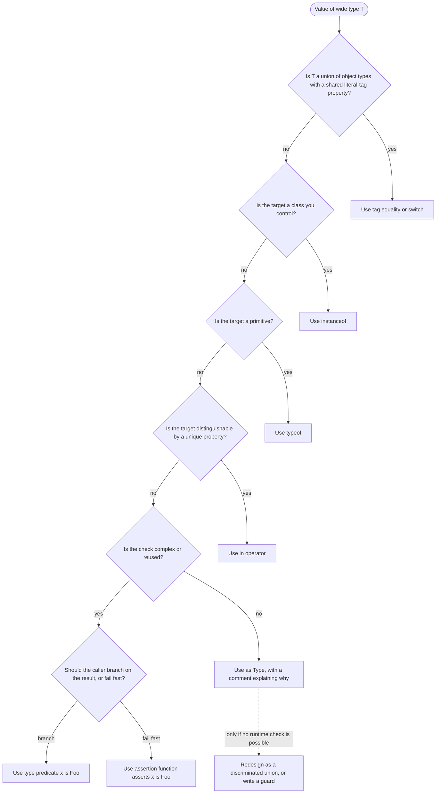
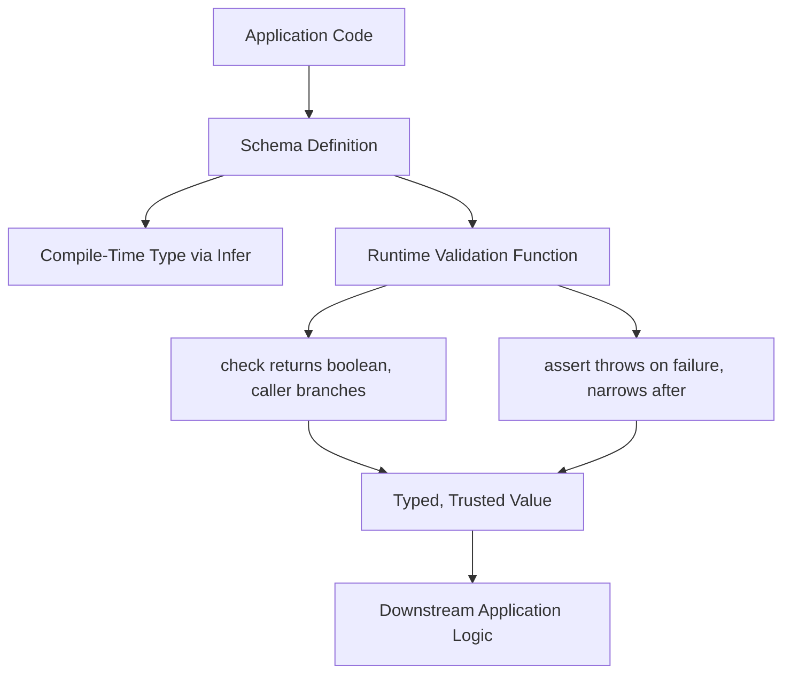

# 2.03 Type Assertions and Guards

> TypeScript lets you claim a type, and TypeScript lets you prove a type. The first is a request for trust, the second is an offer of evidence. Production code that confuses the two will compile cleanly and fail spectacularly.

## 1. Purpose

TypeScript is a statically typed superset of JavaScript that performs type checking at compile time and then erases every type annotation before the code ever runs. This erasure is the defining fact of the language and the source of every interesting design decision in its type system. Because types vanish at runtime, the TypeScript compiler cannot rely on runtime tags the way Java, C#, or Python do. It must reason statically, from the annotations and the control flow graph, about what shape every value will have when the program executes. Sometimes the compiler is conservative. It looks at a value of type `unknown` and refuses to let you call any method on it, because the static type does not guarantee the method exists. Sometimes you, the programmer, know something the compiler does not: the `unknown` value came from a JSON payload you just validated against a known schema, or from a DOM API that the type definitions model loosely, or from a third-party library whose types are too loose for your real usage. You need a way to tell the compiler what you know. The language gives you two broad mechanisms: assertions and guards.

An assertion is a compile-time claim. You write `value as Type` and the compiler treats `value` as `Type` from that point on, with no runtime check at all. The compiler permits this only when the asserted type and the original type overlap, meaning one is assignable to the other. This overlap rule prevents the most absurd assertions, such as claiming a `number` is a `string`. It does not prevent wrong assertions, only absurd ones. You can assert that a `string` is `"hello"` even if the runtime string is `"goodbye"`, because `"hello"` is assignable to `string`. You can break out of the overlap rule entirely with the double assertion `value as unknown as Type`, which tells the compiler "yes I really mean this, even though you cannot see why it would be safe." This is the most dangerous expression in the language, because it disables the only sanity check assertions have.

A guard is a runtime-checked narrowing. The compiler inspects a runtime test and uses the result to narrow the static type of a value inside the resulting branch. The simplest guards are built into the language: `typeof x === "string"` narrows `x` to `string`, `x instanceof Foo` narrows `x` to `Foo`, `"prop" in x` narrows `x` to types that have `prop`. These guards are verified by the compiler to be sound, meaning that if the guard compiles, the runtime narrowing it performs is correct for the types involved. There is no way for a built-in guard to lie, because the compiler refuses to narrow on tests that would be unsound. For example, `typeof x === "number"` does narrow `x` from `string | number` to `number`, but `typeof x === "number"` on a value of type `unknown` narrows only to `number` in the truthy branch, with no removal in the falsy branch, because the original type was already permissive.

User-defined type predicates extend this idea to arbitrary checks. You write a function whose return type is `x is Foo` and the body returns a boolean. When you call the function, the compiler narrows the argument to `Foo` inside truthy branches. This is how you encapsulate complex runtime validation: write the check once, give it a predicate return type, and the compiler narrows everywhere you call it. The critical danger is that the compiler trusts the annotation, not the body. If your function returns `true` for a value that is not actually a `Foo`, the compiler will let you treat that value as a `Foo` and you will get a runtime error when you access a `Foo`-only property. The annotation is the contract; the body is your responsibility.

Assertion functions take this one step further. A function with return type `asserts x is Foo` either returns normally (in which case the compiler narrows `x` to `Foo` for the rest of the calling scope) or throws an exception. This is the fail-fast pattern: validate at the boundary, throw on bad data, and then assume the data is good downstream. The `asserts` keyword is what makes the function a narrowing assertion rather than a normal function returning `void`. Combined with type predicates, it lets you build validation pipelines that produce both runtime safety and compile-time narrowing from the same code.

Discriminated unions close the loop. A discriminated union is a union of object types where each member has a literal type on a common property, called the tag. When you check the tag, the compiler narrows to the corresponding member automatically. This is the most sound, most ergonomic narrowing pattern in the language, because the tag check is trivially correct and exhaustiveness checking ensures you handle every case. Redux actions, React component variants, parser AST nodes, and protocol message types are all naturally modeled as discriminated unions.

The purpose of this note is to give you a complete mental model of every narrowing mechanism in TypeScript. You will learn when to use `as` (almost never, but with documented exceptions), when to use a guard (almost always, when a runtime check exists), when to write a type predicate (when the check is complex or reused), when to write an assertion function (when the check should throw rather than return a boolean), and when to redesign as a discriminated union (whenever the type variation is structural and you control the type definitions). By the end you should be able to look at any narrowing problem, choose the right tool, and defend the choice.

## 2. Theory and Deep Dive

### 2.1 The Static and Runtime Split

TypeScript is structurally typed and statically erased. The compiler reasons about types in a static type space that has no existence at runtime. The JavaScript runtime that actually executes your code has dynamic values, prototype chains, and property lookups, and it has no idea what types you wrote. Every narrowing mechanism in TypeScript must therefore be backed by either a runtime test (a guard) or a programmer's claim (an assertion). The first category is sound; the second is not. The compiler cannot enforce soundness for assertions because it cannot run code. It can only enforce that the assertion is plausible enough not to be obviously wrong.

This split is the reason every guard has the same shape: a runtime test that the compiler can reason about. `typeof`, `instanceof`, `in`, `Array.isArray`, truthiness checks, equality with literal types, and user-defined predicates all share the property that the compiler can inspect the test, prove that the test implies a narrower type, and apply that narrower type inside the appropriate branch. Assertions, by contrast, have no test. They are pure claims.

### 2.2 The `as Type` Assertion

The expression `value as Type` instructs the compiler to treat `value` as `Type` from that point forward. The compiler permits the assertion only if `Type` is assignable to the type of `value`, or the type of `value` is assignable to `Type`. This is the overlap rule, sometimes called the "either direction" rule. The rule prevents obviously absurd assertions, but it allows wrong assertions.

JS (no equivalent; JavaScript has no type system, but the closest analogue is a JSDoc type cast in a `.js` file with `// @ts-check`):

```js
// @ts-check
/** @type {unknown} */
const value = JSON.parse('{"name":"ada"}');
// JSDoc cast: /** @type {{ name: string }} */ (value)
const obj = /** @type {{ name: string }} */ (value);
console.log(obj.name.toUpperCase());
```

TS:

```ts
const value: unknown = JSON.parse('{"name":"ada"}');
const obj = value as { name: string };
console.log(obj.name.toUpperCase());
```

The assertion `value as { name: string }` is permitted because `{ name: string }` is assignable to `unknown` (everything is). The compiler does not check that `value` actually has a `name` property. If the JSON had been `'{"age":42}'`, the assertion would still compile and `obj.name` would be `undefined`, so `obj.name.toUpperCase()` would throw `TypeError: Cannot read properties of undefined (reading 'toUpperCase')`. The assertion gave you a type that lied.

The overlap rule prevents some lies. You cannot assert `5 as string`, because `string` is not assignable to `number` and `number` is not assignable to `string`. You cannot assert `null as number`, because `null` is not assignable to `number` (with `strictNullChecks` on) and `number` is not assignable to `null`. You can assert `"hello" as "hello"`, you can assert `"hello" as string` (trivially, `string` is a supertype), and you can assert `someString as "hello"` (because `"hello"` is assignable to `string`). The last of these is the most dangerous common assertion: narrowing a wider string type to a literal type with no runtime check.

### 2.3 The Double Assertion `as unknown as Type`

When you want to assert in a way that violates the overlap rule, you can chain two assertions: first `as unknown`, then `as Type`. The first assertion always succeeds because every type is assignable to `unknown`. The second assertion always succeeds because `unknown` is assignable to every type. The result is a way to assert anything to anything, with no compiler check at all.

JS (closest analogue):

```js
// @ts-check
/** @type {unknown} */
const value = 42;
// Forcing a cast through unknown in JSDoc is awkward; the equivalent intent:
const forced = /** @type {string} */ (/** @type {unknown} */ (value));
// Runtime: typeof forced is "number"; forced.length is undefined
console.log(typeof forced, forced.length);
```

TS:

```ts
const value: number = 42;
const forced = value as unknown as string;
// Runtime: typeof forced is "number"; forced.length is undefined
console.log(typeof forced, forced.length);
```

The double assertion is the escape hatch you reach for when the compiler insists on the overlap rule but you are sure the cast is safe. Legitimate uses are rare. One is migration: you are slowly converting a loosely-typed codebase to strict types, and you need to assert a type you cannot yet prove. Another is library interop: a third-party type definition is wrong or too loose, and you must override it. A third is conditional-type-heavy generic code where the compiler cannot prove an assignability that is in fact true. In every case, the rule is the same: document why you did it, and add a runtime check if at all possible.

### 2.4 The Non-Null Assertion `!`

The postfix `!` operator, as in `value!.prop`, asserts that `value` is not `null` and not `undefined`. It is a specialized assertion for null removal. The compiler narrows `value` from `T | null | undefined` to `T` at the assertion site, with no runtime check.

JS (no direct equivalent; the JavaScript pattern is a truthiness check):

```js
const el = document.querySelector("#app");
// Manual null check, no compiler help
if (el === null) throw new Error("app element missing");
el.textContent = "hello";
```

TS with the assertion:

```ts
const el = document.querySelector("#app");
el!.textContent = "hello";
```

The non-null assertion is convenient but dangerous. If the selector returns `null`, the `!` does not throw or warn; it simply tells the compiler to assume `el` is `HTMLElement`, and the runtime then crashes on the `.textContent` access. The compiler has no idea whether `el` is actually present. The assertion hides the null case from the type system and from the reader.

The non-null assertion is appropriate in a small number of cases. One is when you have already checked for null and the compiler has lost track, for example after a function call that the compiler conservatively assumes could change the value. Another is when the null case is impossible by construction, such as a DOM element you have just inserted in the same synchronous block. A third is in tests, where you control the environment and want concise code. In every other case, prefer an explicit check: an `if (el === null) throw`, an early return, a guard, or an assertion function.

### 2.5 `typeof` Guards

The expression `typeof x === "string"` (and the `!==` form) is a type guard. The compiler narrows `x` to `string` in the truthy branch and removes `string` from `x`'s type in the falsy branch. The `typeof` operator returns one of eight strings: `"string"`, `"number"`, `"boolean"`, `"symbol"`, `"bigint"`, `"undefined"`, `"function"`, and `"object"`. Note carefully that `typeof null` is `"object"`, a bug from JavaScript's first release that the spec now locks in for backward compatibility. To check for `null`, use `=== null`. The `typeof` guard is most useful for primitive narrowing and is the only built-in guard that works on `unknown` directly without further refinement.

JS:

```js
function describe(x) {
  if (typeof x === "string") return `string of length ${x.length}`;
  if (typeof x === "number") return `number ${x}`;
  if (typeof x === "boolean") return `boolean ${x}`;
  if (typeof x === "undefined") return "undefined";
  if (x === null) return "null";
  return "something else";
}
```

TS:

```ts
function describe(x: unknown): string {
  if (typeof x === "string") return `string of length ${x.length}`;
  if (typeof x === "number") return `number ${x}`;
  if (typeof x === "boolean") return `boolean ${x}`;
  if (typeof x === "undefined") return "undefined";
  if (x === null) return "null";
  return "something else";
}
```

The `typeof` guard narrows to primitives and `function`. It does not narrow `typeof x === "object"` to anything more specific, because too many values are objects: arrays, plain objects, dates, regexes, errors, class instances, and `null`. To narrow within objects, you need `instanceof`, `in`, `Array.isArray`, or a user-defined predicate.

### 2.6 `instanceof` Guards

The expression `x instanceof Foo` is a type guard. At runtime, it walks the prototype chain of `x` looking for `Foo.prototype`. If found, the result is `true`. The compiler narrows `x` to `Foo` in the truthy branch. The narrowing is sound only within a single realm. A realm is the global environment of an iframe, a `Worker`, or the main page. Each realm has its own copy of built-in constructors. An array created in an iframe has a prototype chain that ends at the iframe's `Array.prototype`, not the main page's. The expression `iframeArray instanceof Array` (where `Array` refers to the main page's `Array`) returns `false`, even though the value is genuinely an array. This is the realm problem, and it is why `Array.isArray` exists: it checks the internal `[[Class]]` slot, which is realm-independent.

JS:

```js
class ValidationError extends Error {
  constructor(message, code) {
    super(message);
    this.code = code;
  }
}

function classify(error) {
  if (error instanceof ValidationError) {
    return `validation ${error.code}`;
  }
  if (error instanceof TypeError) {
    return "type";
  }
  return "unknown";
}
```

TS:

```ts
class ValidationError extends Error {
  constructor(message: string, public code: string) {
    super(message);
    this.name = "ValidationError";
  }
}

function classify(error: unknown): string {
  if (error instanceof ValidationError) {
    return `validation ${error.code}`;
  }
  if (error instanceof TypeError) {
    return "type";
  }
  return "unknown";
}
```

The `instanceof` guard is ideal for class hierarchies you control. It fails when the type is structural rather than nominal (you cannot `instanceof` an interface), when the constructor has been subclassed across realms, or when the value is a plain object literal that merely happens to have the right shape. For those cases, use the `in` operator or a user-defined predicate.

### 2.7 The `in` Operator Guard

The expression `"prop" in x` is a type guard. At runtime, it returns `true` if `x` is an object (or has an object wrapper) and the property `prop` exists on `x` or anywhere on its prototype chain. The compiler narrows `x` to the subset of its union type whose members have the property `prop`. This is the most flexible structural guard, because it can distinguish between interface-like shapes that have no class to `instanceof` against.

JS:

```js
function area(shape) {
  if ("radius" in shape) {
    return Math.PI * shape.radius * shape.radius;
  }
  if ("width" in shape && "height" in shape) {
    return shape.width * shape.height;
  }
  throw new Error("unknown shape");
}
```

TS:

```ts
type Shape =
  | { kind: "circle"; radius: number }
  | { kind: "square"; width: number; height: number };

function area(shape: Shape): number {
  if ("radius" in shape) {
    return Math.PI * shape.radius * shape.radius;
  }
  return shape.width * shape.height;
}
```

The `in` operator guard is structural, not nominal. It does not check the type of the property, only its existence. If a value happens to have a `radius` property of type `string`, the `in` guard will narrow to the circle branch and your multiplication will produce `NaN`. The guard is also vulnerable to optional properties: `"prop" in x` is `true` even when `x.prop` is `undefined`. For robust narrowing, prefer a discriminated union with a literal tag, or a user-defined predicate that checks property existence and property type together.

### 2.8 User-Defined Type Predicates

A function with a return type of the form `x is Foo` is a type guard function. The function body must return a boolean. When you call the function, the compiler narrows the argument to `Foo` in truthy branches and removes `Foo` from the argument's type in falsy branches. The narrowing follows the annotation, not the body. This is the crucial point: the compiler trusts you. If your function returns `true` for a value that is not a `Foo`, the compiler will let you treat it as a `Foo` and you will get a runtime error later.

JS:

```js
function isUser(x) {
  return (
    typeof x === "object" &&
    x !== null &&
    typeof x.id === "number" &&
    typeof x.name === "string"
  );
}

function greet(x) {
  if (isUser(x)) {
    return `Hello, ${x.name}`;
  }
  return "Hello, stranger";
}
```

TS:

```ts
interface User {
  id: number;
  name: string;
}

function isUser(x: unknown): x is User {
  return (
    typeof x === "object" &&
    x !== null &&
    typeof (x as User).id === "number" &&
    typeof (x as User).name === "string"
  );
}

function greet(x: unknown): string {
  if (isUser(x)) {
    return `Hello, ${x.name}`;
  }
  return "Hello, stranger";
}
```

Note the assertions inside the predicate body: `(x as User).id`. Without them, the compiler would refuse to access `id` on a value typed as `object`. The assertions here are sound because the surrounding `typeof` check verifies the property exists and has the right type. The pattern is verbose, which is why libraries like Zod exist: they generate predicates from schemas, removing the need to write the body and the assertion dance by hand.

A predicate can also narrow to a union or remove a member of a union. The form `x is not Foo` is not supported directly, but the form `x is Foo` used in a falsy branch removes `Foo` from `x`'s type if `x` was originally `Foo | Bar`. This is the negation narrowing and it is automatic.

### 2.9 The `asserts` Keyword

A function with a return type of the form `asserts x is Foo` is an assertion function. The function body either returns normally (in which case the compiler narrows `x` to `Foo` for the rest of the calling scope) or throws an exception. The compiler does not verify that the body throws when appropriate; it trusts the annotation. The narrowing applies in the calling scope after the call returns.

JS:

```js
function assertUser(x) {
  if (
    typeof x !== "object" ||
    x === null ||
    typeof x.id !== "number" ||
    typeof x.name !== "string"
  ) {
    throw new Error("not a user");
  }
}

function greet(x) {
  assertUser(x);
  return `Hello, ${x.name}`;
}
```

TS:

```ts
interface User {
  id: number;
  name: string;
}

function assertUser(x: unknown): asserts x is User {
  if (
    typeof x !== "object" ||
    x === null ||
    typeof (x as User).id !== "number" ||
    typeof (x as User).name !== "string"
  ) {
    throw new Error("not a user");
  }
}

function greet(x: unknown): string {
  assertUser(x);
  return `Hello, ${x.name}`;
}
```

There is also a simpler form, `asserts x`, with no `is` clause. It asserts that `x` is truthy (not `null`, `undefined`, `0`, `""`, `false`, or `NaN`). The classic use is the invariant function popularized by the `invariant` library and used heavily in React internals.

TS:

```ts
function assert(value: unknown): asserts value {
  if (value === undefined || value === null) {
    throw new Error(`expected value, got ${value}`);
  }
}

function double(x: number | null): number {
  assert(x);
  return x * 2;
}
```

Assertion functions are the fail-fast counterpart to predicates. Use a predicate when the caller wants to branch on the result. Use an assertion function when invalid data should crash the program immediately. Both produce compile-time narrowing; the difference is whether the body returns a boolean or throws.

### 2.10 Discriminated Unions

A discriminated union is a union of object types where each member has a property with a unique literal type. The shared property is called the discriminant or tag. When you check the tag with an equality test, the compiler narrows to the corresponding member. This is the most sound and ergonomic narrowing pattern in TypeScript, because the tag is a literal, the check is a simple equality, and the exhaustiveness check (`switch` with a default branch that assigns to `never`) ensures you handle every case.

JS:

```js
function handle(action) {
  switch (action.type) {
    case "increment":
      return { count: action.by };
    case "reset":
      return { count: 0 };
    default:
      return { count: 0 };
  }
}
```

TS:

```ts
type Action =
  | { type: "increment"; by: number }
  | { type: "reset" };

function handle(action: Action): { count: number } {
  switch (action.type) {
    case "increment":
      return { count: action.by };
    case "reset":
      return { count: 0 };
  }
}
```

The `switch` is exhaustive, so no default is needed. If you add a third member to `Action` later, the compiler will flag every `handle`-like function that fails to cover the new case, because the function's return type annotation forces a return from every path. This is the exhaustiveness guarantee, and it is the single biggest reason to prefer discriminated unions over ad-hoc property checks.

You can also use a `default` branch with `never` to make exhaustiveness explicit:

```ts
function describe(action: Action): string {
  switch (action.type) {
    case "increment":
      return `+${action.by}`;
    case "reset":
      return "reset";
    default: {
      const exhaustive: never = action;
      return exhaustive;
    }
  }
}
```

If you add a third member to `Action` and forget to update `describe`, the assignment `const exhaustive: never = action` will fail to compile, because `action` will no longer be `never` in the default branch. This is the exhaustiveness-via-never trick and it is the standard way to ensure switch completeness.

### 2.11 The Narrowing Decision Tree

The following flowchart shows how to choose a narrowing mechanism given a value and a target type.



The diagram encodes the most important rule in this note: prefer guards and discriminated unions in almost every case, and reach for `as` only when no runtime check is possible. When you do use `as`, document why.

## 3. Mental Models

Five mental models capture the narrowing landscape.

First, the assertion. `as Type` is a request for trust. You are telling the compiler "I know this value is of type Type; please treat it as such." The compiler does not verify the claim. It checks only that the claim is plausible (the overlap rule) and then applies it. If the claim is wrong, the runtime will crash later, often far from the assertion site. Treat every `as` as a deferred runtime error.

Second, the guard. A guard is a runtime check that the compiler can reason about. The compiler inspects the test, proves it implies a narrower type, and applies the narrowing inside the appropriate branch. Guards are sound: if the guard compiles, the narrowing it performs is correct for the types involved. Built-in guards include `typeof`, `instanceof`, `in`, `Array.isArray`, truthiness, and equality with literals.

Third, the type predicate. A predicate is a function that returns a boolean AND narrows the argument's type. The narrowing comes from the return type annotation, not from the body. The body is your responsibility. A predicate is the right tool when the check is complex (multiple property existence and type tests), when it is reused across the codebase, or when the caller wants to branch on the result.

Fourth, the assertion function. An assertion function is a function that throws if false and narrows afterwards. It is the fail-fast counterpart of a predicate. Use it when invalid data should crash the program immediately, rather than being handled by a branch. Assertion functions are the right tool for boundary validation: at the entry point of a function or a service, validate the input and throw if it is wrong, then assume it is correct downstream.

Fifth, the discriminated union. A discriminated union is a union with a tag property that distinguishes members. The tag is a literal type, the check is a simple equality, and the exhaustiveness check ensures you handle every case. Discriminated unions are the right tool whenever you control the type definitions and the type variation is structural. They eliminate the need for `as` and for ad-hoc property checks almost entirely.

A sixth model unifies the others: every narrowing is either compiler-verified or programmer-claimed. Built-in guards, type predicates, and assertion functions are compiler-verified in the sense that the compiler applies the narrowing based on a syntactic feature (a `typeof` comparison, a return type annotation) and trusts that the underlying runtime check is correct. Assertions and double assertions are programmer-claimed, with the compiler verifying nothing beyond the overlap rule. Discriminated unions sit at the verified end, because the tag check is trivially correct and the narrowing is exhaustive. When in doubt, move toward the verified end.

## 4. Real-World Use Cases

### 4.1 `Array.isArray` Is a Built-in Type Guard

The most common type guard in JavaScript is `Array.isArray`. It is the standard way to check whether a value is an array, and TypeScript narrows the argument to `any[]` (or `unknown[]` with strict settings) in the truthy branch. The function exists primarily because of the realm problem: `x instanceof Array` returns `false` for arrays created in other realms, but `Array.isArray` checks the internal `[[Class]]` slot, which is realm-independent. Whenever you have a value of type `unknown` or `object` and you need to know if it is an array, use `Array.isArray`, not `instanceof Array`.

### 4.2 Parsing JSON Safely

`JSON.parse` returns `any` in older TypeScript versions and `unknown` in modern strict code. Treating the result as `any` disables type checking for every operation on it, which is dangerous. Treating the result as `unknown` forces you to narrow before using it, which is safe. The right pattern is to write a type predicate or an assertion function that validates the structure of the parsed value, and to use it as a boundary check before the value enters your application logic. This is exactly what Zod and similar libraries do.

### 4.3 React Error Boundaries

React error boundaries catch errors thrown during render. The error is passed to a `componentDidCatch` lifecycle method or a static `getDerivedStateFromError` method. The error is typed as `unknown` in modern React type definitions, because JavaScript allows throwing any value, not just `Error` instances. The safe pattern is to narrow with `error instanceof Error` before accessing `error.message` or `error.stack`, and to fall back to a generic message otherwise. This prevents the assumption that every thrown value has an `Error` shape, which it does not: code can and does throw strings, plain objects, and even `null`.

### 4.4 Redux Actions as Discriminated Unions

Redux actions are the canonical discriminated union use case. Each action is a plain object with a `type` property whose value is a string literal, and a payload of varying shape. The reducer is a `switch` over `action.type`, and the compiler narrows to the corresponding member in each case. Adding a new action type causes the compiler to flag every reducer that fails to handle it, which is the exhaustiveness guarantee in action. This is the single most-cited reason discriminated unions are a TypeScript best practice.

### 4.5 Zod, io-ts, and runtypes

Zod, io-ts, and runtypes are runtime validation libraries that produce type guards from schemas. You define a schema declaratively, and the library generates both a TypeScript type (via inference from the schema) and a runtime validation function (a type predicate, or an assertion function that either returns the validated value or throws). The result is a single source of truth: the schema defines the runtime check and the compile-time type, and they cannot drift apart. This is the production-grade answer to the assertion-versus-guard tension. Zod is the most popular of the three as of this writing, with io-ts favored in functional-programming-leaning codebases and runtypes offering a similar feature set with a different API style. The choice is largely a matter of taste, but the pattern is the same: define a schema at the boundary, parse every input through it, and trust the resulting type throughout your application.

### 4.6 DOM API Boundaries

The DOM has many APIs that return `HTMLElement | null` or `Element | null`, such as `querySelector` and `getElementById`. The safe pattern is an explicit null check that throws or returns early. The unsafe pattern is the non-null assertion `el!.method()`, which compiles cleanly and crashes at runtime if the element is missing. The DOM is also a realm boundary: an element from an iframe is not an `instanceof HTMLElement` of the main page's realm. For DOM values, prefer null checks over `!`, and prefer `Array.isArray` over `instanceof Array` when handling collections like `NodeList` or `HTMLCollection`.

### 4.7 API Response Validation

Every network response is untrusted data. Treating an API response as a typed object without validation is a bug waiting to happen: the server can change its response shape, a proxy can mangle the payload, or an attacker can craft a malicious response. The right pattern is to validate the response against a schema at the boundary, using Zod or a similar library, and to throw or branch on validation failure. The validated value then enters your application with a trusted type. This is the most important real-world use case for type guards and assertion functions combined.

### 4.8 Configuration Parsing

Configuration files, environment variables, and command-line arguments are all untrusted, untyped input. The pattern is the same as API responses: parse into `unknown`, validate against a schema, and throw on failure. The `asserts` keyword shines here, because invalid configuration should crash the program at startup rather than produce silent misbehavior downstream.

## 5. Code Examples

### 5.1 Example A — Minimal and Conceptual

Each major narrowing mechanism, in five lines, side by side.

#### 5.1.1 `as Type` Assertion

JS:

```js
const raw = JSON.parse('{"id":1}');
const user = raw;
console.log(user.id);
```

TS:

```ts
const raw: unknown = JSON.parse('{"id":1}');
const user = raw as { id: number };
console.log(user.id);
```

#### 5.1.2 Non-Null Assertion

JS:

```js
const el = document.querySelector("#app");
if (el === null) throw new Error("missing");
el.textContent = "hello";
```

TS:

```ts
const el = document.querySelector("#app");
el!.textContent = "hello";
```

#### 5.1.3 Double Assertion

JS:

```js
const value = 42;
const forced = value;
console.log(typeof forced);
```

TS:

```ts
const value: number = 42;
const forced = value as unknown as string;
console.log(typeof forced);
```

#### 5.1.4 `typeof` Guard

JS:

```js
function len(x) {
  if (typeof x === "string") return x.length;
  return 0;
}
```

TS:

```ts
function len(x: unknown): number {
  if (typeof x === "string") return x.length;
  return 0;
}
```

#### 5.1.5 `instanceof` Guard

JS:

```js
function name(e) {
  if (e instanceof Error) return e.message;
  return String(e);
}
```

TS:

```ts
function name(e: unknown): string {
  if (e instanceof Error) return e.message;
  return String(e);
}
```

#### 5.1.6 `in` Operator Guard

JS:

```js
function getKind(s) {
  if ("radius" in s) return "circle";
  return "square";
}
```

TS:

```ts
type Shape = { radius: number } | { width: number; height: number };
function getKind(s: Shape): "circle" | "square" {
  if ("radius" in s) return "circle";
  return "square";
}
```

#### 5.1.7 Type Predicate

JS:

```js
function isString(x) { return typeof x === "string"; }
function shout(x) { if (isString(x)) return x.toUpperCase(); return ""; }
```

TS:

```ts
function isString(x: unknown): x is string { return typeof x === "string"; }
function shout(x: unknown): string { if (isString(x)) return x.toUpperCase(); return ""; }
```

#### 5.1.8 Assertion Function

JS:

```js
function assertString(x) { if (typeof x !== "string") throw new Error("not string"); }
function shout(x) { assertString(x); return x.toUpperCase(); }
```

TS:

```ts
function assertString(x: unknown): asserts x is string {
  if (typeof x !== "string") throw new Error("not string");
}
function shout(x: unknown): string { assertString(x); return x.toUpperCase(); }
```

#### 5.1.9 Discriminated Union

JS:

```js
function area(s) {
  if (s.kind === "circle") return Math.PI * s.r * s.r;
  return s.w * s.h;
}
```

TS:

```ts
type Shape = { kind: "circle"; r: number } | { kind: "square"; w: number; h: number };
function area(s: Shape): number {
  if (s.kind === "circle") return Math.PI * s.r * s.r;
  return s.w * s.h;
}
```

### 5.2 Example B — Production-Grade Schema Validator

A small, fully typed schema validator library. Schemas produce both a TypeScript type (via type inference) and a type guard. The library supports primitives, objects, arrays, and unions. This is a miniature version of Zod's core idea.

JS:

```js
function string(x) {
  return typeof x === "string";
}

function number(x) {
  return typeof x === "number" && !Number.isNaN(x);
}

function boolean(x) {
  return typeof x === "boolean";
}

function array(element) {
  return (x) => Array.isArray(x) && x.every(element);
}

function object(shape) {
  return (x) => {
    if (typeof x !== "object" || x === null) return false;
    for (const key of Object.keys(shape)) {
      if (!shape[key](x[key])) return false;
    }
    return true;
  };
}

function union(...members) {
  return (x) => members.some((m) => m(x));
}

const userSchema = object({
  id: number,
  name: string,
  active: boolean,
});

const usersSchema = array(userSchema);

function parseUsers(input) {
  if (!usersSchema(input)) throw new Error("invalid users payload");
  return input;
}
```

TS:

```ts
// Schema is a function that returns x is T, plus it carries the type T.
interface Schema<T> {
  (x: unknown): x is T;
}

function string(): Schema<string> {
  return ((x: unknown): x is string => typeof x === "string");
}

function number(): Schema<number> {
  return ((x: unknown): x is number => typeof x === "number" && !Number.isNaN(x));
}

function boolean(): Schema<boolean> {
  return ((x: unknown): x is boolean => typeof x === "boolean");
}

function array<T>(element: Schema<T>): Schema<T[]> {
  return ((x: unknown): x is T[] =>
    Array.isArray(x) && x.every((item) => element(item)));
}

type Shape<S extends Record<string, Schema<unknown>>> = {
  [K in keyof S]: S[K] extends Schema<infer T> ? T : never;
};

function object<S extends Record<string, Schema<unknown>>>(
  shape: S
): Schema<Shape<S>> {
  return ((x: unknown): x is Shape<S> => {
    if (typeof x !== "object" || x === null) return false;
    const rec = x as Record<string, unknown>;
    for (const key of Object.keys(shape)) {
      if (!shape[key](rec[key])) return false;
    }
    return true;
  });
}

function union<T1, T2>(m1: Schema<T1>, m2: Schema<T2>): Schema<T1 | T2>;
function union<T1, T2, T3>(m1: Schema<T1>, m2: Schema<T2>, m3: Schema<T3>): Schema<T1 | T2 | T3>;
function union(...members: Schema<unknown>[]): Schema<unknown> {
  return ((x: unknown): x is unknown => members.some((m) => m(x)));
}

const userSchema = object({
  id: number(),
  name: string(),
  active: boolean(),
});

type User = Shape<typeof userSchema extends Schema<infer T> ? typeof userSchema : never>;
// Equivalent to: type User = { id: number; name: string; active: boolean }

const usersSchema = array(userSchema);

function parseUsers(input: unknown): User[] {
  if (!usersSchema(input)) throw new Error("invalid users payload");
  return input;
}

// Helper to extract T from a Schema<T>
type Infer<S> = S extends Schema<infer T> ? T : never;
type UserFromSchema = Infer<typeof userSchema>;
// type UserFromSchema = { id: number; name: string; active: boolean }
```

The library has several noteworthy properties. The `Schema<T>` interface ties a runtime function to a compile-time type. The `string`, `number`, and `boolean` factories return schemas whose `T` is the corresponding primitive. The `array` factory takes an element schema and produces a schema for an array of that element. The `object` factory takes a record of schemas and uses a mapped type (`Shape<S>`) to compute the resulting object type. The `union` factory is overloaded to produce a correct union type for two or three members (you can extend this pattern). The `Infer<S>` helper extracts the type from a schema, the same trick Zod uses for `z.infer<typeof schema>`.

The body of `object` uses `x as Record<string, unknown>` after a `typeof` and null check. This is a sound assertion because the surrounding checks guarantee the shape, and the per-key check that follows verifies each property's type. The body of `array` uses the element schema to check each item, which is exactly what a type predicate encapsulates. The result is that `usersSchema(input)` narrows `input` from `unknown` to `User[]` in the truthy branch, with no `as` in the calling code. The library user never needs to write `as`; the library author wrote it once, soundly, inside `object`.

## 6. Common Mistakes and Anti-Patterns

### 6.1 `as` Lies, With No Runtime Check

The most common mistake is using `as` to assert a type the value does not actually have. The assertion compiles cleanly and crashes at runtime. Example: `JSON.parse('{"a":1}') as { b: number }`. The runtime value has no `b` property, but the compiler now thinks it does. Every access to `b` returns `undefined`, and every operation on `undefined` crashes. The fix is a runtime check, ideally encapsulated in a type predicate or an assertion function.

### 6.2 `as unknown as X` Used Wrong

The double assertion bypasses the overlap rule and disables the only sanity check assertions have. It is appropriate only when no runtime check is possible and you have strong evidence (external to the type system) that the cast is safe. Using it as a routine escape hatch, especially in code that could be rewritten with a guard, is a serious anti-pattern. The fix is almost always a runtime check or a redesign as a discriminated union. When you must use it, add a comment explaining why and link to the external evidence.

### 6.3 The Non-Null `!` Hiding a Null Bug

The postfix `!` is convenient and dangerous. It tells the compiler to assume the value is non-null, with no runtime check. If the value is in fact null, the program crashes on the next property access, often far from the assertion site. The fix is an explicit null check that either throws, returns early, or branches. Reserve `!` for cases where you have already checked for null and the compiler has lost track, or where the null case is impossible by construction and you have a comment saying so.

### 6.4 `typeof null === "object"` Surprising You

The `typeof null` result is `"object"`, a bug from JavaScript's first release that the spec now locks in. Code that narrows on `typeof x === "object"` and then accesses `x.something` will crash if `x` is `null`. The fix is to check `x === null` separately, or to combine the check as `typeof x === "object" && x !== null`. Every type predicate that narrows to an object type should include this combined check; forgetting it is the single most common predicate bug.

### 6.5 `instanceof` Across Realms

The `instanceof` operator walks the prototype chain of the left operand looking for the `prototype` property of the right operand. If the value was created in a different realm (an iframe, a `Worker`, or another VM context), the prototype chain ends at that realm's built-ins, not the current realm's. The expression `iframeArray instanceof Array` returns `false`. The fix is `Array.isArray` for arrays, and a structural check (a type predicate using `typeof` and property existence) for other types that must work across realms.

### 6.6 Type Predicate Returning the Wrong Boolean

The compiler trusts the return type annotation, not the body. If your predicate returns `true` for a value that is not a `Foo`, the compiler will let you treat it as a `Foo` and you will get a runtime error. Example: `function isString(x: unknown): x is string { return true; }` compiles cleanly and narrows every call to `string`, regardless of the actual value. The fix is to ensure the body actually verifies the shape, and to test the predicate against a variety of inputs. Property-based testing is especially valuable for predicates, because it can generate many inputs and check the predicate's soundness.

### 6.7 Assertion Function Forgetting to Throw

An assertion function `asserts x is Foo` must throw when `x` is not a `Foo`. The compiler does not verify that the body throws. If the body returns normally without narrowing, the compiler will still narrow in the calling scope, and you will get a runtime error later. Example: `function assertString(x: unknown): asserts x is string { /* forgot to check */ }` compiles cleanly and narrows every call to `string`. The fix is a code review checklist: every assertion function must throw on every path that fails the check, and the throw must be on every such path, not just some.

### 6.8 Discriminated Union Missing the Tag

A discriminated union requires a shared property with a unique literal type per member. If one member is missing the tag, the union is not discriminated, and tag-based narrowing fails. Example: `type Action = { type: "increment"; by: number } | { by: number }` is not discriminated, because the second member has no `type`. The fix is to add a `type` literal to every member. The compiler will sometimes catch this (it depends on how the union is used), but the safest approach is to always include the tag in every member.

### 6.9 Non-Exhaustive Switch on a Discriminated Union

A `switch` over a discriminated union's tag should be exhaustive. If you add a new member and forget to handle it, the switch will fall through to a default (if present) or return `undefined` (if no default and the return type allows it). The fix is the exhaustiveness-via-never trick: assign the value to `never` in the default branch. The compiler will flag every non-exhaustive switch when a new member is added.

### 6.10 Using `in` for Type Rather Than Existence

The `in` operator checks property existence, not property type. `"radius" in x` is `true` even if `x.radius` is `undefined` or has the wrong type. A predicate that narrows on `in` alone can let through values that fail downstream. The fix is to combine `in` with a `typeof` check on the property: `"radius" in x && typeof x.radius === "number"`. Better still, use a discriminated union with a literal tag, which is exhaustive and sound.

### 6.11 Forgetting That `unknown` Does Not Narrow Through `typeof` to Specific Objects

`typeof x === "object"` narrows `x` from `unknown` to `object` (which includes `null`), but it does not narrow to any specific object type. To narrow further, you need `instanceof`, `in`, or a predicate. Code that does `if (typeof x === "object") x.someMethod()` will not compile, because `someMethod` is not a property of `object`. The fix is a more specific guard after the `typeof` check.

## 7. Best Practices and Design Patterns

### 7.1 Prefer Type Guards Over Assertions

The single most important rule: prefer guards over assertions in almost every case. A guard verifies the type at runtime and narrows at compile time, with no gap between the two. An assertion narrows at compile time with no runtime verification, leaving a gap that produces runtime errors when the assertion is wrong. If a runtime check exists, use it. If a runtime check does not exist, write one (as a predicate or an assertion function) and use it.

### 7.2 Prefer Discriminated Unions Over `as`

When you control the type definitions, model type variation as a discriminated union. The tag-based narrowing is exhaustive, sound, and ergonomic. The compiler will flag every switch that fails to handle a new case. This eliminates the need for `as` and for ad-hoc property checks almost entirely. The pattern is widely used in Redux, React component variants, parser AST nodes, and protocol message types.

### 7.3 Use `asserts` for Fail-Fast Boundary Validation

Assertion functions are the right tool for boundary validation: at the entry point of a function or service, validate the input and throw if it is wrong, then assume it is correct downstream. The pattern eliminates the need for repeated checks throughout the function body and produces compile-time narrowing for the rest of the scope. Use it for API responses, configuration parsing, environment variable validation, and any other case where invalid data should crash the program immediately.

### 7.4 Use a Validation Library for Complex Schemas

For complex schemas, use Zod, io-ts, or runtypes rather than hand-writing predicates. The library handles the type inference, the runtime check, and the error reporting. The schema is a single source of truth that cannot drift between the compile-time type and the runtime check. The cost is a runtime dependency and a learning curve; the benefit is dramatically fewer bugs and a much smoother developer experience.

### 7.5 Document Every `as` With a Comment

When you must use `as`, add a comment explaining why. The comment should state what you know that the compiler does not, and ideally link to the external evidence (a runtime check elsewhere, a type definition file bug, a migration in progress). The comment makes the assertion auditable: a reviewer can challenge the reasoning, and a future maintainer can update the assertion when the underlying assumption changes.

### 7.6 Enable `strict: true` to Catch More

The `strict` compiler flag enables a bundle of strict checks, including `strictNullChecks`, `noImplicitAny`, `strictFunctionTypes`, and others. These checks catch many assertion-related bugs at compile time. For example, `strictNullChecks` makes `null` and `undefined` distinct from other types, forcing you to handle them explicitly; without it, the non-null assertion `!` is meaningless. Always enable `strict` in new projects, and migrate existing projects toward it.

### 7.7 Combine `typeof` and `=== null` for Object Narrowing

When narrowing `unknown` to an object type, combine the `typeof` check with a null check: `typeof x === "object" && x !== null`. This handles the `typeof null === "object"` quirk. Make this combination a reflex; it appears in nearly every type predicate that narrows to an object type.

### 7.8 Use `Array.isArray` for Arrays, Never `instanceof Array`

For arrays, always use `Array.isArray`. It is realm-independent and produces the correct narrowing. `instanceof Array` fails for arrays from other realms and should never be used for type checking. Even if your code runs in a single realm today, future refactoring may introduce a Worker or an iframe, and the bug will be subtle.

### 7.9 Test Predicates With Property-Based Testing

Predicates are easy to get wrong, especially for complex types. Property-based testing (with libraries like `fast-check`) generates many inputs of varying shapes and checks the predicate's soundness: for every input, if the predicate returns `true`, the input must actually satisfy the target type. This catches the predicate-returns-wrong-boolean mistake much more effectively than hand-picked unit tests.

### 7.10 Use the Exhaustiveness-via-Never Trick

For switches over discriminated unions, always include a default branch that assigns the value to `never`. This makes the switch exhaustive: adding a new member to the union will cause a compile error in every switch that fails to handle the new case. The trick costs nothing at runtime (the branch is unreachable) and saves hours of debugging when types evolve.

### 7.11 Extract Predicates for Reused Checks

When the same runtime check appears in multiple places, extract it into a predicate. This eliminates duplication, ensures the check is consistent, and gives the narrowing a name that documents the intent. A predicate named `isAuthenticatedRequest` is far clearer than a sequence of `in` and `typeof` checks inline.

### 7.12 Avoid `as any` Entirely

`as any` disables type checking for the asserted value and everything derived from it. It is the most dangerous expression in the language. Use `as unknown` if you must widen, then narrow with a guard. Use `unknown` instead of `any` for untyped values. `as any` should be a last resort, used only during migration with a comment.

## 8. Technical Interview Knowledge

### 8.1 What is the Difference Between `as` and a Type Guard?

`as` is a compile-time assertion that narrows a value's type with no runtime check. The compiler permits it when the asserted type and the original type overlap. The narrowing is unchecked; if the assertion is wrong, the runtime crashes later. A type guard is a runtime-checked narrowing. The compiler inspects a runtime test (such as `typeof x === "string"` or `x instanceof Foo`) and applies the implied narrowing inside the appropriate branch. The narrowing is sound for the types involved. The key difference: `as` is a claim, a guard is a proof.

### 8.2 What is a Type Predicate?

A type predicate is a function whose return type has the form `x is Foo`. The function body returns a boolean. When the function is called, the compiler narrows the argument to `Foo` in truthy branches and removes `Foo` from the argument's type in falsy branches. The narrowing follows the annotation, not the body; the compiler trusts the programmer. Example: `function isString(x: unknown): x is string { return typeof x === "string"; }`. The predicate encapsulates a runtime check and gives it a name, making it reusable and self-documenting.

### 8.3 What is `asserts`?

The `asserts` keyword introduces an assertion function. A function with return type `asserts x is Foo` either returns normally (in which case the compiler narrows `x` to `Foo` for the rest of the calling scope) or throws an exception. The simpler form `asserts x` asserts that `x` is truthy. Assertion functions are the fail-fast counterpart of predicates: use a predicate when the caller wants to branch, use an assertion function when invalid data should crash the program. The compiler does not verify that the body throws when appropriate; it trusts the annotation.

### 8.4 How Does `typeof` Narrow?

The `typeof` operator returns one of eight strings: `"string"`, `"number"`, `"boolean"`, `"symbol"`, `"bigint"`, `"undefined"`, `"function"`, and `"object"`. When used in a conditional, the compiler narrows the value to the corresponding primitive type in the truthy branch. For `typeof x === "function"`, the compiler narrows to `Function` (or more precisely, to the function subset of the original type). For `typeof x === "object"`, the compiler narrows to `object`, which includes `null` because `typeof null === "object"`. The guard is most useful for primitive narrowing and is the only built-in guard that works on `unknown` directly.

### 8.5 Why Does `instanceof` Fail Across Realms?

Each JavaScript realm (an iframe, a `Worker`, or the main page) has its own copy of built-in constructors. An array created in an iframe has a prototype chain ending at the iframe's `Array.prototype`, not the main page's. The `instanceof` operator walks the prototype chain of the left operand looking for the `prototype` property of the right operand. If they are from different realms, the lookup fails. The expression `iframeArray instanceof Array` (where `Array` is the main page's) returns `false`. The fix is `Array.isArray`, which checks the internal `[[Class]]` slot and is realm-independent.

### 8.6 What is a Discriminated Union?

A discriminated union is a union of object types where each member has a property with a unique literal type, called the discriminant or tag. When you check the tag with an equality test, the compiler narrows to the corresponding member. The pattern is exhaustive: a `switch` over the tag can be made exhaustive with the never trick, so adding a new member causes a compile error in every switch that fails to handle it. Discriminated unions are the most sound and ergonomic narrowing pattern, because the tag check is trivially correct and the exhaustiveness guarantee catches missing cases at compile time.

### 8.7 Why is `as unknown as X` Dangerous?

The double assertion `value as unknown as Type` bypasses the overlap rule that normally constrains assertions. The first assertion, `as unknown`, always succeeds because every type is assignable to `unknown`. The second assertion, `as Type`, always succeeds because `unknown` is assignable to every type. The result is a way to assert anything to anything, with no compiler check at all. This disables the only sanity check assertions have, so any wrong assertion will compile cleanly and crash at runtime. The double assertion is appropriate only when no runtime check is possible and you have strong external evidence that the cast is safe; even then, it should be documented.

### 8.8 How Would You Validate JSON Input?

I would parse the JSON with `JSON.parse`, which returns `unknown` in strict mode. Then I would validate the parsed value against a schema, using either a hand-written type predicate (for simple shapes) or a library like Zod (for complex shapes). The schema would check the structure recursively, verifying property existence and property types at every level. On success, the value would be narrowed to the target type. On failure, I would throw an error (using an assertion function) or return a result object (using a predicate), depending on whether the caller wants to branch or fail fast. The schema is the single source of truth for both the runtime check and the compile-time type, so they cannot drift apart. For complex applications, I would centralize validation at the boundary (API entry points, configuration loading, environment parsing) and trust the type throughout the downstream logic.

## 9. Practical Exercises

### 9.1 Exercise 1: Replace `as` With a Type Guard

The following code uses `as` to assert a type. Replace it with a type guard that performs a runtime check.

Before (TS):

```ts
interface User {
  id: number;
  name: string;
}

function greet(raw: unknown): string {
  const user = raw as User;
  return `Hello, ${user.name}`;
}
```

Solution (TS):

```ts
interface User {
  id: number;
  name: string;
}

function isUser(x: unknown): x is User {
  return (
    typeof x === "object" &&
    x !== null &&
    typeof (x as User).id === "number" &&
    typeof (x as User).name === "string"
  );
}

function greet(raw: unknown): string {
  if (!isUser(raw)) throw new Error("invalid user");
  return `Hello, ${raw.name}`;
}
```

The predicate `isUser` checks that `raw` is an object, that it is not `null`, and that `id` and `name` have the correct types. The two assertions inside the predicate body are sound because the surrounding `typeof` checks verify the property types. The `greet` function now throws on invalid input rather than crashing on an undefined `name`. The predicate can be reused anywhere a `User` is expected from an untrusted source.

JS equivalent of the solution:

```js
function isUser(x) {
  return (
    typeof x === "object" &&
    x !== null &&
    typeof x.id === "number" &&
    typeof x.name === "string"
  );
}

function greet(raw) {
  if (!isUser(raw)) throw new Error("invalid user");
  return `Hello, ${raw.name}`;
}
```

### 9.2 Exercise 2: Build an `isUser(x): x is User` Predicate

Write a type predicate that validates a `User` with a nested `address` object and an optional `email`. The `User` type is:

```ts
interface Address {
  street: string;
  city: string;
}

interface User {
  id: number;
  name: string;
  email?: string;
  address: Address;
}
```

Solution (TS):

```ts
interface Address {
  street: string;
  city: string;
}

interface User {
  id: number;
  name: string;
  email?: string;
  address: Address;
}

function isAddress(x: unknown): x is Address {
  return (
    typeof x === "object" &&
    x !== null &&
    typeof (x as Address).street === "string" &&
    typeof (x as Address).city === "string"
  );
}

function isUser(x: unknown): x is User {
  if (typeof x !== "object" || x === null) return false;
  const u = x as Record<string, unknown>;
  if (typeof u.id !== "number") return false;
  if (typeof u.name !== "string") return false;
  if (u.email !== undefined && typeof u.email !== "string") return false;
  if (!isAddress(u.address)) return false;
  return true;
}

function processUser(raw: unknown): string {
  if (!isUser(raw)) throw new Error("invalid user");
  const parts = [`Hello, ${raw.name}`, `from ${raw.address.city}`];
  if (raw.email !== undefined) parts.push(`<${raw.email}>`);
  return parts.join(" ");
}
```

The predicate decomposes the check into a nested predicate (`isAddress`) for the `address` field. The `email` field is optional, so the check accepts `undefined` or a string. The `as Record<string, unknown>` cast inside `isUser` is sound because of the preceding `typeof` and null checks; it lets us access properties without further assertions. The `processUser` function narrows `raw` to `User` after the predicate check, with no further assertions.

JS equivalent:

```js
function isAddress(x) {
  return (
    typeof x === "object" &&
    x !== null &&
    typeof x.street === "string" &&
    typeof x.city === "string"
  );
}

function isUser(x) {
  if (typeof x !== "object" || x === null) return false;
  if (typeof x.id !== "number") return false;
  if (typeof x.name !== "string") return false;
  if (x.email !== undefined && typeof x.email !== "string") return false;
  if (!isAddress(x.address)) return false;
  return true;
}
```

### 9.3 Exercise 3: Build an `assertUser(x: asserts x is User)` Function

Convert the predicate from Exercise 2 into an assertion function that throws on invalid input. Then use it in a function that processes a list of users.

Solution (TS):

```ts
interface Address {
  street: string;
  city: string;
}

interface User {
  id: number;
  name: string;
  email?: string;
  address: Address;
}

function isAddress(x: unknown): x is Address {
  return (
    typeof x === "object" &&
    x !== null &&
    typeof (x as Address).street === "string" &&
    typeof (x as Address).city === "string"
  );
}

function isUser(x: unknown): x is User {
  if (typeof x !== "object" || x === null) return false;
  const u = x as Record<string, unknown>;
  if (typeof u.id !== "number") return false;
  if (typeof u.name !== "string") return false;
  if (u.email !== undefined && typeof u.email !== "string") return false;
  if (!isAddress(u.address)) return false;
  return true;
}

function assertUser(x: unknown): asserts x is User {
  if (!isUser(x)) {
    throw new Error(`invalid user: ${JSON.stringify(x)}`);
  }
}

function processUsers(raw: unknown): string[] {
  if (!Array.isArray(raw)) throw new Error("expected array");
  return raw.map((item) => {
    assertUser(item);
    return `Hello, ${item.name} from ${item.address.city}`;
  });
}
```

The `assertUser` function delegates the check to `isUser` and throws if the predicate returns false. The `asserts x is User` return type narrows `x` to `User` in the calling scope after the function returns. Inside `processUsers`, the `assertUser(item)` call narrows `item` from `unknown` to `User`, so the following line can access `item.name` and `item.address.city` without further checks. The pattern combines a predicate (for reuse and branchability) with an assertion function (for fail-fast usage).

JS equivalent:

```js
function isAddress(x) {
  return (
    typeof x === "object" &&
    x !== null &&
    typeof x.street === "string" &&
    typeof x.city === "string"
  );
}

function isUser(x) {
  if (typeof x !== "object" || x === null) return false;
  if (typeof x.id !== "number") return false;
  if (typeof x.name !== "string") return false;
  if (x.email !== undefined && typeof x.email !== "string") return false;
  if (!isAddress(x.address)) return false;
  return true;
}

function assertUser(x) {
  if (!isUser(x)) {
    throw new Error(`invalid user: ${JSON.stringify(x)}`);
  }
}

function processUsers(raw) {
  if (!Array.isArray(raw)) throw new Error("expected array");
  return raw.map((item) => {
    assertUser(item);
    return `Hello, ${item.name} from ${item.address.city}`;
  });
}
```

### 9.4 Exercise 4: Convert an `if/else` Chain to a Discriminated Union

The following code uses an `if/else` chain on ad-hoc property checks. Convert it to a discriminated union with exhaustive `switch`.

Before (TS):

```ts
interface Circle { radius: number; kind?: never }
interface Square { side: number; kind?: never }
type Shape = Circle | Square;

function area(s: Shape): number {
  if ("radius" in s) return Math.PI * s.radius * s.radius;
  if ("side" in s) return s.side * s.side;
  throw new Error("unknown shape");
}
```

The `kind?: never` is a hack that allows the union to compile but does not discriminate. The `in` checks are ad-hoc and not exhaustive at compile time.

Solution (TS):

```ts
interface Circle { kind: "circle"; radius: number }
interface Square { kind: "square"; side: number }
interface Triangle { kind: "triangle"; base: number; height: number }
type Shape = Circle | Square | Triangle;

function area(s: Shape): number {
  switch (s.kind) {
    case "circle":
      return Math.PI * s.radius * s.radius;
    case "square":
      return s.side * s.side;
    case "triangle":
      return 0.5 * s.base * s.height;
    default: {
      const exhaustive: never = s;
      return exhaustive;
    }
  }
}

function describe(s: Shape): string {
  switch (s.kind) {
    case "circle":
      return `circle of radius ${s.radius}`;
    case "square":
      return `square of side ${s.side}`;
    case "triangle":
      return `triangle ${s.base}x${s.height}`;
  }
}
```

Each member of the union now has a `kind` property with a unique literal type. The `switch` over `s.kind` narrows to the corresponding member in each case. The default branch assigns `s` to `never`; if a new member is added to `Shape` and `area` is not updated, the assignment will fail to compile because `s` will no longer be `never` in the default branch. The `describe` function has no default branch, but it is exhaustive because every `kind` is handled; if a new member is added, the compiler will flag `describe` for missing a return on the new path (because the return type annotation forces a return from every path).

JS equivalent:

```js
function area(s) {
  switch (s.kind) {
    case "circle":
      return Math.PI * s.radius * s.radius;
    case "square":
      return s.side * s.side;
    case "triangle":
      return 0.5 * s.base * s.height;
    default:
      throw new Error("unknown shape");
  }
}

function describe(s) {
  switch (s.kind) {
    case "circle":
      return `circle of radius ${s.radius}`;
    case "square":
      return `square of side ${s.side}`;
    case "triangle":
      return `triangle ${s.base}x${s.height}`;
  }
}
```

The JavaScript version loses the exhaustiveness check (no compiler to flag missing cases) but gains the same structural clarity. The tag-based switch is more readable than the `in`-based chain and handles new members gracefully: adding a `Rectangle` case means adding a `kind: "rectangle"` literal and a new `case` branch, with no risk of forgetting to update some other `in`-based function elsewhere.

## 10. Mini-Project Blueprint

### Build a Runtime Validator Library

The goal is to build a small, fully typed runtime validator library along the lines of Zod. Schemas produce both a TypeScript type (via type inference) and a type guard. The library supports primitives, objects, arrays, unions, optionals, and literals. It exposes both a `check` function (returning a boolean, suitable for branching) and an `assert` function (throwing on failure, suitable for fail-fast boundary validation).

### Architecture



### Requirements

1. A `Schema<T>` interface tying a runtime function to a compile-time type.
2. Factory functions for primitives: `string`, `number`, `boolean`, `bigint`, `symbol`.
3. A `literal` factory for literal types: `literal("hello")`, `literal(42)`.
4. An `array` factory that takes an element schema and produces a schema for an array of that element.
5. An `object` factory that takes a record of schemas and produces a schema for an object with the corresponding shape.
6. An `optional` factory that wraps a schema and accepts `undefined`.
7. A `union` factory (overloaded for arity) that produces a schema for the union of its members.
8. A `check<T>(schema, value): boolean` function that runs the schema's predicate.
9. An `assert<T>(schema, value): asserts value is T` function that throws on failure.
10. An `Infer<S>` type that extracts the type from a schema.
11. A `parse<T>(schema, value): T` function that asserts and returns the value, for ergonomic one-liner usage at boundaries.

### Acceptance Criteria

- The library compiles with `strict: true` and no `any` types (only `unknown`).
- `Infer<typeof userSchema>` produces the correct object type, including nested objects and optionals.
- `check(userSchema, value)` narrows `value` to the user type in the truthy branch.
- `assert(userSchema, value)` narrows `value` to the user type after the call returns.
- `parse(userSchema, value)` returns the typed value or throws.
- Adding a property to the schema updates the inferred type automatically.
- A schema for an array of objects validates each element recursively.
- A union schema validates against each member and narrows to the union type.

### Stretch Goals

- Add error reporting: collect all validation failures with paths, not just the first.
- Add refinements: `string().min(5).max(100).email()`.
- Add transforms: `string().trim().toLowerCase()` produces a schema for a normalized string.
- Add coercion: `coerce.number()` accepts a string and parses it.
- Add async schemas for database-backed validations.
- Add branded types: `UserId` is a `number` with a phantom brand, enforced by the schema.
- Add JSON Schema export: produce a JSON Schema document from the schema, for interop with other tools.

### Testing Strategy

- Unit tests for every factory: validate good inputs (must pass), bad inputs (must fail), and edge cases (null, undefined, empty arrays, nested failures).
- Property-based tests for soundness: generate random values, run them through the schema, and check that any value passing the schema actually satisfies the inferred type. This is the strongest test for predicate correctness.
- Integration tests: use the library to validate API responses, configuration files, and environment variables in a sample application.
- Type tests: assert that `Infer<typeof userSchema>` is exactly equal to the expected type, using the `expectType` pattern from `tsd` or `expect-type`.

### Skeleton

TS skeleton (sketch; the full implementation is the exercise):

```ts
export interface Schema<T> {
  (x: unknown): x is T;
}

export type Infer<S> = S extends Schema<infer T> ? T : never;

export function string(): Schema<string> {
  return ((x: unknown): x is string => typeof x === "string");
}

export function number(): Schema<number> {
  return ((x: unknown): x is number => typeof x === "number" && !Number.isNaN(x));
}

export function boolean(): Schema<boolean> {
  return ((x: unknown): x is boolean => typeof x === "boolean");
}

export function literal<T extends string | number | boolean | bigint>(v: T): Schema<T> {
  return ((x: unknown): x is T => x === v);
}

export function array<T>(element: Schema<T>): Schema<T[]> {
  return ((x: unknown): x is T[] =>
    Array.isArray(x) && x.every((item) => element(item)));
}

type Shape<S extends Record<string, Schema<unknown>>> = {
  [K in keyof S]: S[K] extends Schema<infer T> ? T : never;
};

export function object<S extends Record<string, Schema<unknown>>>(
  shape: S
): Schema<Shape<S>> {
  return ((x: unknown): x is Shape<S> => {
    if (typeof x !== "object" || x === null) return false;
    const rec = x as Record<string, unknown>;
    for (const key of Object.keys(shape)) {
      if (!shape[key](rec[key])) return false;
    }
    return true;
  });
}

export function optional<T>(schema: Schema<T>): Schema<T | undefined> {
  return ((x: unknown): x is T | undefined => x === undefined || schema(x));
}

export function check<T>(schema: Schema<T>, value: unknown): value is T {
  return schema(value);
}

export function assert<T>(schema: Schema<T>, value: unknown): asserts value is T {
  if (!schema(value)) {
    throw new Error(`validation failed for value: ${JSON.stringify(value)}`);
  }
}

export function parse<T>(schema: Schema<T>, value: unknown): T {
  assert(schema, value);
  return value;
}
```

The skeleton compiles, type-checks, and is usable. Extending it to refinements, transforms, and error reporting is the stretch-goal work. The library demonstrates every concept in this note: the `Schema<T>` interface ties runtime to compile time, the factory functions return predicates, the `check` function exposes the predicate for branching, the `assert` function exposes the assertion function for fail-fast, and the `Infer` type extracts the inferred type. The body of `object` uses the sound `as Record<string, unknown>` pattern after a `typeof` and null check. The library user never writes `as`; the library author wrote it once, soundly.

## 11. Core Connections

- [[1.04 Type Coercion and Equality]] — Coercion is the runtime counterpart of narrowing. Where coercion silently reshapes values to fit operators, narrowing silently reshapes types to fit control flow. The two meet at `typeof`, which is both a coercion-relevant operator (its result determines what coercion would happen) and a narrowing guard (its result determines the narrowed type). Understanding the eight `typeof` results and the `typeof null === "object"` quirk is essential to both notes.
- [[2.01 Design Goals and Limitations]] — TypeScript's design goal of being a strict superset of JavaScript with full erasure is the root cause of the assertion-versus-guard distinction. The compiler cannot run code, so it cannot verify assertions; it can only verify that guards are syntactically sound. The design goal of being structurally typed (rather than nominally typed) is why `instanceof` is limited to classes and why the `in` operator is the structural alternative.
- [[2.02 Basic Type Space]] — The basic type space (primitives, object types, literal types, `null`, `undefined`, `unknown`, `any`, `never`) is the substrate on which narrowing operates. Every guard narrows within this space: `typeof` narrows to primitives, `instanceof` narrows to classes, `in` narrows to object subsets, and the exhaustiveness-via-never trick uses `never` as the bottom type. The distinction between `unknown` and `any` is especially relevant: `unknown` forces narrowing, `any` disables it.
- [[2.04 Type Inference and Contextual]] — Inference determines the starting point for narrowing. The compiler infers the type of a variable from its initializer, and narrowing refines that type within branches. The interplay between inference and narrowing is what makes TypeScript's control flow analysis powerful: the compiler tracks the narrowed type through nested branches, assignments, and function calls, applying and unapplying narrowings as the control flow demands.
- [[2.05 Unions and Intersections]] — Discriminated unions are a special case of union types. The narrowing mechanisms in this note (especially tag-based narrowing and the exhaustiveness-via-never trick) are the primary tools for working with union types in practice. Intersections appear in assertion contexts: asserting `value as A & B` narrows to values that satisfy both, which is useful when combining multiple guards.
- [[2.17 API Design with Types]] — API design is where boundary validation matters most. Every API response is untrusted input, and the right pattern is to validate at the boundary with a schema-derived guard or assertion function, then trust the type downstream. The mini-project blueprint in Section 10 is the foundation of a typed API client: define a schema for each endpoint's response, parse the response through the schema, and the rest of the application code works with a trusted type.

The throughline of this note is the choice between trust and proof. Assertions ask the compiler to trust you; guards offer the compiler a proof. Production code that confuses the two compiles cleanly and fails spectacularly. The disciplined TypeScript developer reaches for guards and discriminated unions by default, reserves assertions for the rare cases where no runtime check is possible, and documents every assertion with the reasoning that makes it safe. The disciplined developer also leans on libraries like Zod that turn schema definitions into both runtime checks and compile-time types, eliminating the trust-and-proof gap entirely. Master this discipline, and the type system becomes a partner that catches bugs at compile time rather than a hurdle to be bypassed with `as any`.
